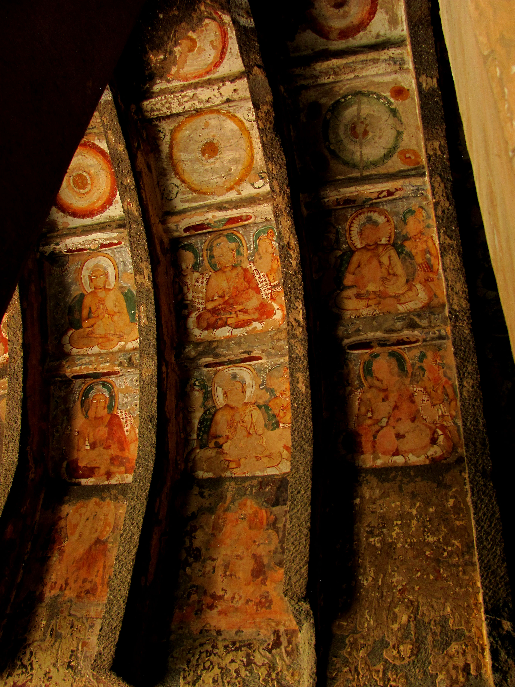

# অজন্তা গুহাসমূহ

*ইউনেস্ক' বিশ্ব ঐতিহ্য ক্ষেত্ৰ*

| অজন্তা গুহা |
| --- |
| বিশ্ব ঐতিহ্য ক্ষেত্ৰত তালিকাভুক্ত হিচাপে নাম |
| অজন্তা গুহাসমূহ |
| দেশ |
| ধৰণ |
| মাপকাঠি |
| উদ্ধৃতি |
| ইউনেস্কোৰ দ্বাৰা শ্ৰেণীবদ্ধ অঞ্চল |
| স্থানাংক |
| অভিলিখনৰ ইতিহাস |
| অভিলিখন |

অজন্তা গুহা ভাৰত ৰ মহাৰাষ্ট্ৰ ৰাজ্যৰ গভীৰ খাড়া গিৰিখাতৰ শিল কাটি খনন কৰা প্ৰায় ৩০টা গুহা-স্তম্ভ। এইসমূহত পোৱা ছবি আৰু ভাস্কৰ্য সেইসময়ৰ বৌদ্ধ ধৰ্মীয় শিল্পৰ উৎকৃষ্ট নিদৰ্শন। অজন্তাৰ দেৱালৰ চিত্ৰসমূহত বুদ্ধ ৰ জীৱনৰ বিভিন্ন পৰ্যায়ৰ কাহিনী বৰ্ণিত হৈছে। গুহাসমূহ মহাৰাষ্ট্ৰৰ ঔৰংঙ্গাবাদ জিলাৰ জলগাঁও ৰেলষ্টেশ্যনৰ কাষত থকা, আজিন্তা বা অজন্তা গাঁৱৰ সীমাত অৱস্থিত (২০ ডিগ্ৰী ৩০ মিনিট উত্তৰ অক্ষাংশ আৰু ৭৫ ডিগ্ৰী ৪০ মিনিট পূৰ্ব দ্ৰাঘিমাংশ)।

চীনা পৰিব্ৰাজক হিউয়েন চাঙ ৰ ভ্ৰমণলিপিত অজন্তাৰ বৰ্ণনা আছে। গুহাসমূহ দীৰ্ঘকাল অৰণ্যৰ আঁৰত বিস্মৃত অৱস্থাত পৰি আছিল। ১৮১৯ চনত, এইসমূহ পুনৰ নতুনকৈ আৱিষ্কৃত হয়। অজন্তা আৰু ওচৰত থকা ইলোৰা ভাৰতৰ অন্যতম প্ৰধান পৰ্যটনকেন্দ্ৰ।

১৯৮৩ চনত অজন্তা গুহাসমূহ ইউনেস্কো বিশ্ব ঐতিহ্য তালিকাত সাংস্কৃতিক ঐতিহ্যবাহী স্থান হিচাপে অন্তৰ্ভুক্ত হয়। এই বৌদ্ধ গুহাসমূহ দুটি পৰ্বত নিৰ্মিত হৈছিল। প্ৰথম পৰ্বৰ নিৰ্মাণকাৰ্য আৰম্ভ হয় খ্ৰীষ্টপূৰ্ব দ্বিতীয় শতাব্দীত। দ্বিতীয় পৰ্ব গুপ্ত যুগত। পঞ্চম আৰু ষষ্ঠ শতাব্দীত আৰু বহুতো নতুন সংযোজন ইয়াৰ লগত যুক্ত হয়। এই গুহাসমূহত উন্নত মানৰ চিত্ৰকলা আৰু ফ্ৰেস্কো দেখা যায়, ই শ্ৰীলঙ্কাৰ সিগিৰয়া (Sigiriya) চিত্ৰকলা আৰু স্থাপত্যকলাৰ অনুকৰণ। ইয়াত মুঠ ৩০টা প্ৰস্তৰখোদিত গুহা স্মাৰক বিদ্যমান, যিটো বৌদ্ধ ধৰ্মীয় চিত্ৰকলাৰ এক অনন্য নিদৰ্শন। [ 1 ] [ 2 ] [ 3 ]

অজন্তা গুহাসমূহে ৭৫ মিটাৰ (২৪৬ ফুট) উচ্চতাৰ শিলৰ দেৱালত খোদিত বিভিন্ন বৌদ্ধ পৰম্পৰাৰ প্ৰাচীন মঠ (বিহাৰ) আৰু উপাসনা-গৃহ (চৈত্য) গঠন কৰে। [ 4 ] [ 5 ] গুহাসমূহত বুদ্ধৰ অতীতৰ জীৱন [ 6 ] আৰু পুনৰ্জন্মৰ চিত্ৰ, আৰ্যাসুৰৰ জাতকমালাৰ চিত্ৰকল্প কাহিনী আৰু বৌদ্ধ দেৱতাৰ শিলৰ কটা ভাস্কৰ্য্যও উপস্থাপন কৰা হয়। [ 4 ] [ 7 ] [ 8 ] পাঠ্যৰ তথ্য অনুসৰি এই গুহাসমূহে সন্ন্যাসীসকলৰ বাবে বাৰিষাৰ আশ্ৰয়স্থল হিচাপে কাম কৰিছিল, লগতে প্ৰাচীন ভাৰতৰ ব্যৱসায়ী আৰু তীৰ্থযাত্ৰীসকলৰ বাবে বিশ্ৰামৰ স্থান হিচাপেও কাম কৰিছিল। [ 4 ] ভাৰতীয় ইতিহাসত প্ৰাঞ্জল ৰং আৰু মিউৰেল দেৱাল চিত্ৰৰ প্ৰচুৰতা আছিল যদিও ঐতিহাসিক তথ্যৰ পৰা প্ৰমাণিত হয়, অজন্তাৰ ১, ২, ১৬ আৰু ১৭ নং গুহাই প্ৰাচীন ভাৰতীয় দেৱাল চিত্ৰৰ আটাইতকৈ ডাঙৰ কৰ্পাছ গঠন কৰে। [ 9 ]

*ওচৰৰ পাহাৰৰ পৰা অজন্তা গুহাৰ পেনোৰামিক দৃশ্য*

মধ্যযুগৰ কেইবাজনো চীনা বৌদ্ধ ভ্ৰমণকাৰীৰ স্মৃতিগ্ৰন্থত অজন্তা গুহাৰ উল্লেখ আছে। [ 10 ] ভুলবশতঃ "আৱিষ্কাৰ" নোহোৱালৈকে ইহঁতক জংঘলে আৱৰি ৰাখিছিল আৰু ১৮১৯ চনত বাঘ চিকাৰ কৰা দলত এজন ঔপনিৱেশিক ব্ৰিটিছ বিষয়া কেপ্তেইনজন স্মিথে পশ্চিমীয়াসকলৰ দৃষ্টিগোচৰ কৰিছিল। [ 11 ] গুহাসমূহ ৱাঘুৰ নদীৰ U আকৃতিৰ গৰ্জৰ শিলৰ উত্তৰ দেৱালত, [ 12 ] ডেকান মালভূমিত আছে। [ 13 ] [ 14 ] গৰ্জৰ ভিতৰত কেইবাটাও জলপ্ৰপাত আছে, নদীখন ওখ হ’লে গুহাৰ বাহিৰৰ পৰা শুনা যায়। [ 15 ]

## পৰিবহণ

ইলোৰা গুহা ৰ সৈতে অজন্তা মহাৰাষ্ট্ৰৰ অন্যতম প্ৰধান পৰ্যটনস্থলী। ভাৰতৰ মহাৰাষ্ট্ৰৰ জলগাঁও চহৰৰ পৰা প্ৰায় ৫৯ কিলোমিটাৰ (৩৭ মাইল), ঔৰংগাবাদ চহৰৰ পৰা ১০৪ কিলোমিটাৰ (৬৫ মাইল) আৰু মুম্বাই ৰ পৰা ৩৫০ কিলোমিটাৰ (২২০ মাইল) পূব-উত্তৰ-পূব। [ 4 ] [ 16 ] হিন্দু , জৈন আৰু বৌদ্ধ গুহা থকা এলোৰা গুহাৰ পৰা অজন্তা ১০০ কিলোমিটাৰ (৬২ মাইল) দূৰত্বত অৱস্থিত, শেষৰটো অজন্তাৰ দৰে যুগৰ। ইলোৰা গুহা আৰু অন্যান্য স্থান যেনে এলিফাণ্টা গুহা, ঔৰংগাবাদ গুহা, শিৱলেনী গুহা আৰু কৰ্ণাটক ৰ গুহা মন্দিৰতো অজন্তা শৈলী পোৱা যায়। 
নিকটতম বিমানবন্দৰ হৈছে জলগাঁও আৰু সম্ভাজী নগৰ আৰু তাৰ পিছতে মুম্বাই আৰু নিকটতম ৰেলৱে ষ্টেচন হৈছে জলগাঁও & ভূছাৱাল।

## ইতিহাস

*অজন্তা গুহাৰ মানচিত্ৰ*

অজন্তা গুহা দুটা সুকীয়া পৰ্যায়ত নিৰ্মাণ কৰা বুলি সাধাৰণতে একমত হয়; প্ৰথমে খ্ৰীষ্টপূৰ্ব দ্বিতীয় শতিকাৰ পৰা খ্ৰীষ্টপূৰ্ব প্ৰথম শতিকালৈকে আৰু দ্বিতীয়টো কেইবা শতিকাৰ পিছত। [ 17 ] [ 18 ] [ 19 ]

গুহাসমূহ ৩৬টা চিনাক্তকৰণযোগ্য ভেটিৰে গঠিত, [ 4 ] ইয়াৰে কিছুমান গুহাসমূহৰ মূল সংখ্যা ১ৰ পৰা ২৯লৈকে আৱিষ্কাৰ হোৱাৰ পিছত আৱিষ্কাৰ কৰা হৈছে। পিছলৈ চিনাক্ত কৰা গুহাসমূহৰ প্ৰত্যয় বৰ্ণমালাৰ আখৰসমূহ দিয়া হৈছে, যেনে ১৫A, যিবোৰ মূলতঃ ১৫ আৰু ১৬ নম্বৰৰ গুহাসমূহৰ মাজত চিনাক্ত কৰা হৈছিল। [ 20 ] গুহা সংখ্যা নিৰ্ধাৰণ কৰাটো সুবিধাৰ নিয়ম আৰু ই ইহঁতৰ নিৰ্মাণৰ কালক্ৰমিক ক্ৰম প্ৰতিফলিত নকৰে। [ 21 ]

## চিত্ৰকলা

*ভগৱান বুদ্ধৰ জীৱন বৃত্তৰ চিত্ৰ অংকন কৰা চিলিং*

অজন্তাৰ গুহাসমূহৰ অধিকাংশই, আৰু প্ৰায় সকলো মিউৰেল চিত্ৰ প্ৰায় ৬০০ বছৰৰ পিছৰ, দ্বিতীয় পৰ্যায়ৰ নিৰ্মাণৰ সময়ত। [ 22 ] অজন্তা গুহাত থকা চিত্ৰসমূহত প্ৰধানকৈ জাতক কাহিনীৰ বৰ্ণনা কৰা হৈছে। এইবোৰ বুদ্ধৰ পূৰ্বৰ জন্মৰ বৰ্ণনা কৰা বৌদ্ধ কিংবদন্তি। এই উপকথাবোৰত প্ৰাচীন নৈতিকতা আৰু সাংস্কৃতিক জ্ঞান সন্নিবিষ্ট কৰা হৈছে যিবোৰ হিন্দু আৰু জৈন গ্ৰন্থৰ উপকথা আৰু কিংবদন্তিতো পোৱা যায়। বুদ্ধই তেওঁৰ অতীতৰ শ শ অৱতাৰত কৰা জীৱনৰ উদাহৰণ আৰু ত্যাগৰ দ্বাৰা জাতক কাহিনীসমূহৰ উদাহৰণ দিয়া হৈছে, য’ত তেওঁক প্ৰাণী বা মানুহ হিচাপে পুনৰ জন্ম লোৱাৰ দৰে চিত্ৰিত কৰা হৈছে। [ 23 ] [ 24 ] [ 25 ]

পূৰ্বৰ আৰু পিছৰ দুয়োটা গোটৰ গুহাৰ পৰাই মিউৰেল চিত্ৰকলা জীয়াই আছে। পূৰ্বৰ গুহা (গুহা ১০ আৰু ১১)ৰ পৰা সংৰক্ষিত কেইবাটাও মিউৰেলৰ খণ্ড কাৰ্যকৰীভাৱে এই যুগৰ পৰা ভাৰতৰ প্ৰাচীন চিত্ৰকলাৰ অনন্য অস্তিত্ব, আৰু "ই দেখুৱাইছে যে সাতবাহন যুগত, যদি ইয়াৰ আগতে নহয়, ভাৰতীয় চিত্ৰশিল্পীসকলে সহজ আৰু সাৱলীল প্ৰকৃতিবাদী শৈলী আয়ত্ত কৰিছিল, য'ত বৃহৎ গোটৰ মানুহৰ সৈতে মোকাবিলা কৰিছিল Sāñcī toraņa ক্ৰছবাৰ।" [ 26 ] গান্ধাৰ শিল্পৰ সৈতে কিছুমান সম্পৰ্কও লক্ষ্য কৰিব পাৰি, আৰু এটা ভাগ কৰা কলাত্মক প্ৰবচনৰ প্ৰমাণ পোৱা যায়। [ 27 ]

## আলোকচিত্ৰ

- গুহাৰ বহিৰ্দৃশ্য
- প্ৰথম গুহাৰ বাৰাণ্ডা
- 
- 
- 
- 
- 
-

## বাহ্যিক সংযোগ

- An Introduction to the Ajanta Caves
- The Early Development of the Cave 26-Complex at Ajanta
- Ajanta Caves Archived 2012-10-30 at the Wayback Machine
- National Geographic feature 'Faces of the Divine'
- An essay on Ajanta Caves from the online travel magazine travelmag.co.uk (May 10, 2009) Archived February 23, 2010, at the Wayback Machine
- Video of the caves MTDC site
- Ajanta Caves in UNESCO List
- "Ajanta", Jacques-Edouard Berger Foundation, World Art Treasures (choose French or English) Archived 2007-09-27 at the Wayback Machine

---
Source: https://as.wikipedia.org/wiki/%E0%A6%85%E0%A6%9C%E0%A6%A8%E0%A7%8D%E0%A6%A4%E0%A6%BE_%E0%A6%97%E0%A7%81%E0%A6%B9%E0%A6%BE%E0%A6%B8%E0%A6%AE%E0%A7%82%E0%A6%B9
