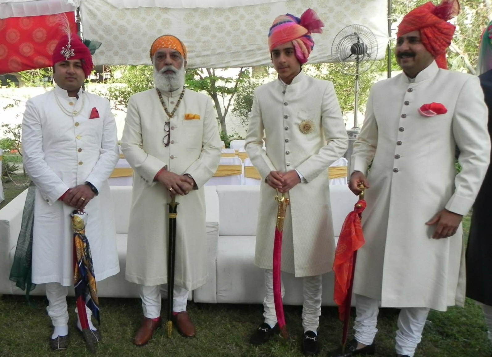
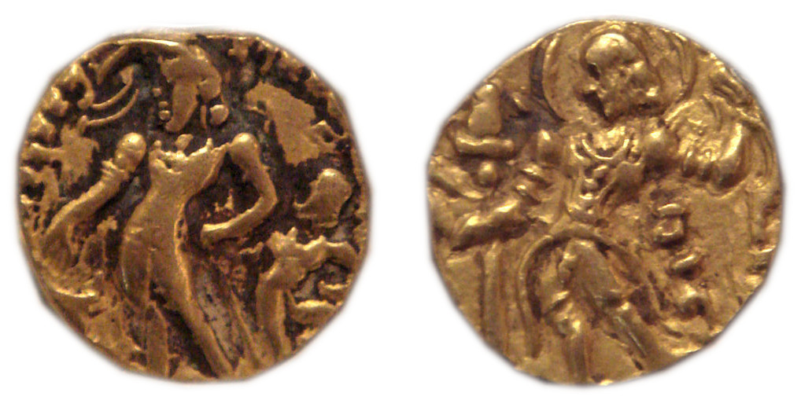

# আচকান

*ভারতের রাজস্থান রাজ্যে বিয়ের সময় পুরুষদের দ্বারা পরিহিত আচকান।*

আচকান ( হিন্দি : अचकन ) 'বাঘল বান্দি' নামেও পরিচিত, একটি হাঁটু পর্যন্ত দৈর্ঘ্যের জ্যাকেট যেটি ভারতীয় উপমহাদেশের বেশিরভাগ পুরুষেরা আংরাখার মত পরেন।

## ব্যুৎপত্তি

আচকান শব্দটি আংরাখা থেকে উদ্ভূত হয়েছে ( সংস্কৃত : अंगरक्षक, অঙ্গ-রক্ষক)। [ ১ ] ভারতীয় উপমহাদেশের বিভিন্ন অঞ্চলে আংরাখা পরার চলন ছিল। যদিও এর মূল কাটছাঁট একই রকম ছিল, অঞ্চল থেকে অঞ্চলভেদে এর শৈলী এবং দৈর্ঘ্য ভিন্ন ভিন্ন হত। [ ২ ]

## ইতিহাস

*দ্বিতীয় চন্দ্রগুপ্ত সোনার মুদ্রায় আচকান দ্বারা চিত্রিত, গুপ্ত সাম্রাজ্য*

গ্রীক বয়ান অনুযায়ী, মৌর্য্য যুগে পুরুষ এবং মহিলাদের আচকানের মত পোশাক পরিধান করতে দেখা যেত। এই জাতীয় পোশাকের প্রথম দিকের প্রমাণ দেখতে পাওয়া গেছে ইরানের ভাস্কর্য এবং খোদিত শিলাচিত্রের পাশাপাশি পার্থিয়ান সাম্রাজ্যের চিত্রগুলিতে। ভারতে এই পোশাকের প্রথম দিকের প্রমাণ পাওয়া গেছে কুষাণ সাম্রাজ্যের সময় থেকে, যে সাম্রাজ্য স্থাপিত হয়েছিল মধ্য এশীয় যাযাবর উপজাতি দ্বারা। তবে, যেহেতু কুষাণরা গ্রিকো পার্থিয়া সাম্রাজ্য থেকে তাদের সংস্কৃতির অনেকগুলি দিক গ্রহণ করেছিল, সুতরাং এটি বিশ্বাসযোগ্য যে এই পোশাকটি পার্থিয়ান সংস্কৃতির উত্তরাধিকার। [ ৩ ] এটিকে শেরওয়ানি থেকে বিভিন্ন দিক দিয়ে আলাদা করা যায়, বিশেষ করে সামনে বোতামের দিক দিয়ে। আচকান ঐতিহ্যগতভাবে পাশের দিকে খোলা থাকে এবং সরু ফিতা দিয়ে বাঁধা হয়। এই শৈলীর খোলাবন্ধ করাটি বাঘল বন্দি নামে পরিচিত। তবে সম্মুখ দিয়ে খোলাবন্ধের বিষয়টি অস্বাভাবিক নয়, যেমনটি আংরাখায় দেখা যায়। বহিঃপরিহিত কোট জাতীয় পোশাকের কারণে শেরওয়ানি সর্বদা সরাসরি সম্মুখ দিয়ে খোলাবন্ধ করতে হয়। আংরাখার মতো আচকান ঐতিহ্যগতভাবে পাটকা দিয়ে পরিধান করতে হয়, পুরো পোশাকটি ঠিকভাবে পরে থাকার জন্য কোমরে কোমরবন্ধ বা ডোরা জড়াতে হয়। যদিও মধ্যযুগীয় সময়ে ঐতিহ্যগতভাবে শেরওয়ানি পরিধান করা হত বিশেষ অনুষ্ঠানের জন্য আলংকারিক বহিরঙ্গন হিসাবে, আচকান সর্বদা ধুতি বা চুড়িদারের সঙ্গে পরিধান করা হয়। আনুষ্ঠানিক এবং অনানুষ্ঠানিক উভয় উপলক্ষে বিভিন্ন কাপড় থেকে তৈরি আচকান পরিধান করা হয়, এটিতে গোটা এবং বাদলার মতো ঐতিহ্যবাহী সূচিকর্ম রয়েছে। আজকের দিনে, ভারতীয় উপমহাদেশে বিবাহ অনুষ্ঠান বা অন্যান্য আনুষ্ঠানিক উৎসব উপলক্ষে বিবাহের পাত্র সাধারণত আচকান পরিধান করে।

ভারত উপমহাদেশে আচকানের বিভিন্ন আঞ্চলিক বৈচিত্র রয়েছে, এবং সেগুলি আঞ্চলিক নামেই পরিচিত, যেমন নেপাল এবং উত্তর-পূর্ব ভারতে দৌরা , দক্ষিণ ভারতে অঙ্গি এবং ভারতীয় হিমালয় অঞ্চলে চোলা বা চোলু ।

## ছবিঘর

- আচকানের সাথে চিত্রিত সমুদ্রগুপ্ত , গুপ্ত সাম্রাজ্য
- আচকান, স্যাশ এবং বাইরের কোট দিয়ে চিত্রিত ভাস্কর্য, প্রথম শতাব্দীতে।
- আচকান পরিহিত এক ব্যক্তি ডোরা বা স্যাশ কোমরে জড়ানো।
- দিল্লির টেক্সটাইল যাদুঘরে পুরুষদের দ্বারা পরিহিত আচকান এবং অঙ্গরাখার বিভিন্ন শৈলীর প্রদর্শন।

---
Source: https://bn.wikipedia.org/wiki/%E0%A6%86%E0%A6%9A%E0%A6%95%E0%A6%BE%E0%A6%A8
