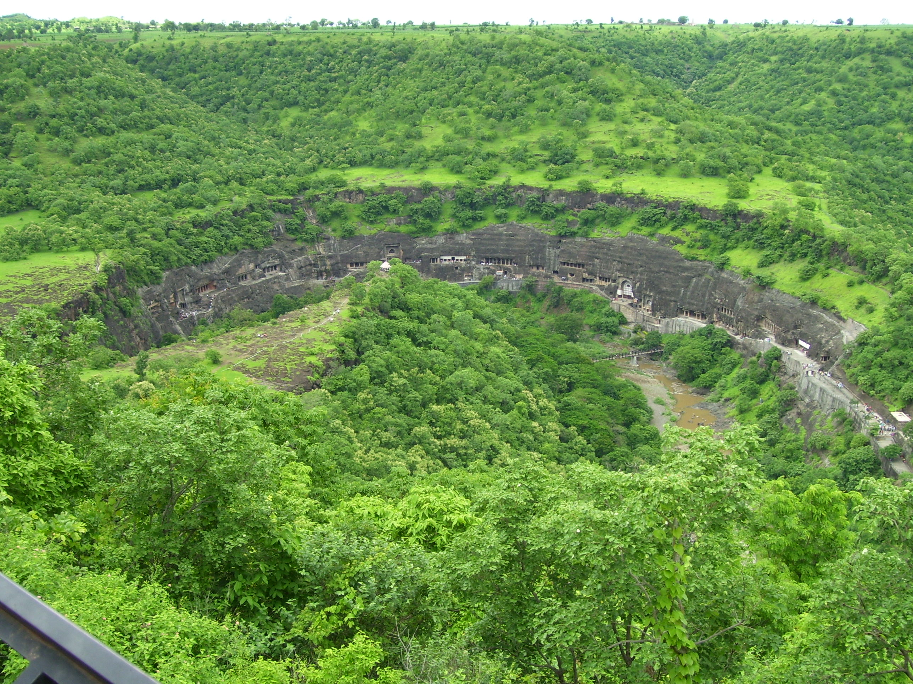

# અજંતાની ગુફાઓ

*અજંતાની ગુફાઓ*

| યુનેસ્કો વિશ્વ ધરોહર સ્થળ |
| --- |

અજંતા ગુફાઓ મહારાષ્ટ્ર , ભારત સ્થિત મોટા પથ્થરો વડે બનેલા ડુંગરોમાં કોતરકામ કરીને બનાવવામાં આવેલી સ્થાપત્ય ગુફાઓ છે. આ સ્થળ દ્વિતીય શતાબ્દી ઈ.પૂ.ના સમયમાં બની હોવાનું મનાય છે. અહીં બૌદ્ધ ધર્મથી સંબંધિત ચિત્રકામ તેમ જ શિલ્પકારીના ઉત્કૃષ્ટ નમૂનાઓ જોવા મળે છે. [ ૧ ] આની સાથે જ સજીવ ચિત્રણ [ ૨ ] પણ જોવા મળે છે. આ ગુફાઓ અજંતા નામક ગામની નજીક જ સ્થિત છે, જે મહારાષ્ટ્ર રાજ્યના ઔરંગાબાદ જિલ્લા માં આવેલી છે. અજંતા ગુફાઓ ઇ. સ. ૧૯૮૩ના વર્ષમાં યુનેસ્કો દ્વારા વિશ્વ ધરોહર સ્થળ ઘોષિત કરવામાં આવેલી છે.

નેશનલ જ્યૉગ્રાફિક અનુસાર: આસ્થાનો વહેણ એવો હતો, કે એવું પ્રતીત થાય છે, કે શતાબ્દીઓ સુધી અજંતા સમેત, લગભગ બધાં બૌદ્ધ મંદિર, હિંદુ રાજાઓના શાસન અને આશ્રયને આધીન બનાવડાવાયા હોય. [ ૩ ]

## ક્ષેત્ર

*અજંતા ગુફાઓથી જાતક કથાઓ*

*અજંતા ગુફાઓ- ટિકિટ કાર્યાલય પાસેથી એક દૃશ્ય*

*ઘોડાની નાળ જેવા આકારનું અજંતા એસ્કાર્પમેંટ, જેમ કે ગુફા વ્યૂ પોઇન્ટ, 8 કિ.મી દૂરથી દેખાય છે*

ગુફાઓ એક ગાઢ જંગલથી ઘેરાયેલ, અશ્વ નાળ આકારની ખીણમાં અજંતા ગામથી ૩ ૧/૨ કિ.મી. દૂર બનાવવામાં આવેલી છે. આ ગામ મહારાષ્ટ્ર રાજ્યના ઔરંગાબાદ શહેરથી ૧૦૬ કિ.મી. દૂર વસેલું છે. આનો નિકટતમ કસ્બો છે જળગાંવ, જે ૬૦ કિ.મી. દૂર છે, ભુસાવળ ૭૦ કિ.મી. દૂર છે. આ ઘાટીની તળેટીમાં પહાડી ધારા વાઘૂર વહે છે. અહીં કુલ ૨૯ ગુફાઓ (ભારતીય પુરાતાત્વિક સર્વેક્ષણ વિભાગ દ્વારા આધિકારિક ગણનાનુસાર) છે, જે નદી દ્વારા નિર્મિત એક પ્રપાત ધોધની દક્ષિણમાં સ્થિત છે. આની નદીથી ઊંચાઈ ૩૫ થી ૧૧૦ ફીટ સુધીની છે.

અજંતા મઠ જેવોસા સમૂહ છે, જેમાં ઘણાં વિહાર (મઠ આવાસીય) તેમ જ ચૈત્ય ગૃહ છે (સ્તૂપ સ્મારક હૉલ), જે બે ચરણોમાં બનેલ છે. પ્રથમ ચરણને ભૂલથી હીનયાન ચરણ કહેવાયું છે, જે બૌદ્ધ ધર્મના હીનયાન મત સાથે સંબંધિત છે. વસ્તુતઃ હિનયાન સ્થવિરવાદ માટે એક શબ્દ છે, જેમાં બુદ્ધના મૂર્ત રૂપનો કોઈ નિષેધ નથી. અજંતાની ગુફા સંખ્યા ૯, ૧૦, ૧૨, ૧૩, ૧૫એ (અંતિમ ગુફા ને ૧૯૫૬ માં જ શોધાઈ (અને હજી સુધી સંખ્યિત નથી કરાઈ ) તેને આ ચરણમાં શોધી કઢાઈ હતી. આ ખોદકામમાં બુદ્ધ ને સ્તૂપ કે મઠ રૂપમાં દર્શિત કરાયા છે.

બીજા ચરણના ખોદકામમાં લગભગ ત્રણ શતાબ્દિઓની સ્થિરતા બાદ શોધાઈ. આ ચરણને પણ ભૂલથી મહાયાન ચરણ બૌદ્ધ ધર્મ નો બીજો મોટો સમૂહ, જે ઓછો કટ્ટર છે, તેમ જ બુદ્ધને સીધો ગાય આદિ રુપમાં ચિત્રોના શિલ્પોમાં દર્શિત કરવાની અનુમતિ દે છે.) ઘણાં લોકો આ ચરણને વાકાટક ચરણ કહે છે. આ વત્સગુલ્મ શાખાના શાસિત વંશ વાકાટકના નામ પર છે. આ દ્વિતીય ચરણની નિર્માણ તિથિ ઘણા શિક્ષાવિદોમાં વિવાદિત છે. હાલના વર્ષોંમાં, અમુક બહુમતના સંકેત આને પાંચમી શતાબ્દીમાં માનવા લાગ્યા છે. વૉલ્ટર એમ. સ્પિંક, એક અજંતા વિશેષજ્ઞના અનુસાર મહાયન ગુફાઓ ૪૬૨-૪૮૦ ઈ. સ.ના સમયગાળાની વચ્ચે નિર્મિત થઈ હતી. મહાયન ચરણની ગુફાઓ સંખ્યા છે ૧, ૨, ૩, ૪, ૫, ૬, ૭, ૮, ૧૧, ૧૪, ૧૫, ૧૬, ૧૭, ૧૮, ૧૯, ૨૦, ૨૧, ૨૨, ૨૩, ૨૪, ૨૫, ૨૬, ૨૭, ૨૮, તેમ જ ૨૯. ગુફા ક્રમાંક ૮ ને લાંબા સમય સુધી હિનાયન ચરણની ગુફા સમજ્વામાં આવી, કિન્તુ વર્તમાન સમયમાં તથ્યોના આધાર પર આને મહાયન ઘોષિત કરાઈ છે.

મહાયનહિનાયન ચરણમાં બે ચૈત્યગૃહ મળ્યાં હતાં, જે ગુફા સંખ્યા ૯ તેમ જ ૧૦માં હતાં. આ ચરણની ગુફા સંખ્યા ૧૨, ૧૩, ૧૫ વિહાર છે. મહાયન ચરણમાં ત્રણ ચૈત્ય ગૃહ હતાં, જે સંખ્યા ૧૯, ૨૬, ૨૯માં હતાં. અંતિમ ગુફા અનાવાસિત હતી, પોતાના આરંભથી જ અન્ય સૌ મળેલ ગુફાઓ ૧-૩, ૫-૮, ૧૧, ૧૪-૧૮, ૨૦-૨૫, તેમ જ ૨૭-૨૮ વિહાર છે.

ખોદકામમાં મળેલ વિહાર ઘણાં મોટા માપના છે, જેમાં સૌથી મોટો ૫૨ ફીટનો છે. પ્રાયઃ દરેક ચોરસ છે. આના રૂપમાં પણ ભિન્નતા છે. અમુક સાધારણ છે, તો અમુક અલંકૃત છે, અમુકના દ્વાર મંડપ બનેલા છે, તો અમુકને નથી. સૌ વિહારોમાં એક આવશ્યક ઘટક છે – એક વૃહત હૉલ કે ખંડ. વાકાટક ચરણ વાળામાં, ઘણીઓમાં પવિત્ર સ્થાન નથી બનેલા, કેમકે તે કેવળ ધાર્મિક સભાઓ તેમ જ આવાસ હેતુ માટે બનેલ હતા. પછી તેમાં પવિત્ર સ્થાન જોડાયા. પછી તો આ એક માનક બની ગયું. આ પવિત્ર સ્થાનમાં એક કેન્દ્રીય કક્ષમાં બુદ્ધની મૂર્તિ હતી, પ્રાયઃ ધર્મચક્રપ્રવર્તન મુદ્રામાં બેઠેલા. જે ગુફાઓમાં નવીનતમ ફીચર્સ છે, ત્યાં કિનારાને દીવાલો, દ્વાર મંડપો પર અને પ્રાંગણમાં ગૌણ પવિત્ર સ્થળ પણ બનેલ દેખાય છે. ઘણા વિહારોની દીવાલોના ફલક નક્શીથી અલંકૃત છે, દીવાલો અને છતો પર ભિત્તિ ચિત્રણ કરેલ છે.

પ્રથમ શતાબ્દીમાં થયેલ બૌદ્ધ વિચારોમાં અંતરથી, બુદ્ધને દેવતાનો દરજ્જો આપવા મંડાયો અને તેમની પૂજા થવા લાગી, અને પરિણામતઃ બુદ્ધને પૂજા-અર્ચનાનું કેન્દ્ર બનાવાયા, જેથી મહાયનની ઉત્પત્તિ થઈ.

પૂર્વમાં, શિક્ષાવિદોએ ગુફાઓને ત્રણ સમૂહોમાં વહેંચી હતી, કિન્તુ સાક્ષ્યોને જોતા, અને શોધોને લીધે તેને નકારી દેવાઈ છે. તે સિદ્ધાંત અનુસાર ૨૦૦ ઈ.પૂ થી ૨૦૦ ઈ. સુધીનો એક સમૂહ, દ્વિતીય સમૂહ છઠી શતાબ્દીનો, અને તૃતીય સમૂહ સાતમી શતાબ્દીનો મનાય છે.

એંગ્લો-ભારતીયો દ્વારા વિહારો હેતુ પ્રયુક્ત અભિવ્યંજન ગુફા-મંદિર અનુપયુક્ત મનાયા. અજંતા એક પ્રકારનું મહાવિદ્યાલય મઠ હતું. હ્યુ-એન-ત્સાંગ બતાવે છે, કે દિન્નાગ, એક પ્રસિદ્ધ બૌદ્ધ દાર્શનિક, તત્વજ્ઞ, જે કે તર્કશાસ્ત્ર પર ઘણા ગ્રંથોના લેખક હતાં, અહીં રહેતા હતાં. આ હજી અન્ય સાક્ષ્યોથી પ્રમાણિત થવું શેષ છે. પોતાની ચરમ પર, વિહાર સેંકડો લોકોને સમાવિષ્ટ કરવાનું સામર્થ્ય રાખતો હતો. અહીં શિક્ષક અને છાત્ર એક સાથે રહેતાં હતાં. આ અતિ દુઃખદ છે, કે કોઈ પણ વાકાટક ચરણની ગુફા પૂર્ણ નથી. એ કારણ થયું, કે શાસક વાકાટક વંશ એકાએક શક્તિ-વિહીન થઈ ગયો, જેથી તેની પ્રજા પણ સંકટમાં આવી ગઈ. આ કારણે બધી ગતિવિધિઓ બાધિત થઈને એકાએક થંભી ગઈ. આ સમય અજંતાનો અંતિમ કાળ રહ્યો.

## ગુફા ક્રમ ૧

*ગુફા ક્રમ ૧ ચિત્રકારીનો નમૂનો*

*ગુફા ક્રમ ૧*

આ એક પ્રથમ પગલું છે, અને આનું અન્ય ગુફાઓના સમયાનુસાર ક્રમથી કોઈ મતલબ નથી. આ અશ્વનાળ આકારની ઢાલ પર પૂર્વી તરફથી પ્રથમ ગુફા છે. સ્પિંક ની અનુસાર, આ સ્થળ પર બનેલ અંતિમ ગુફાઓં માંની એક છે, અને વાકાટક ચરણ ના સમાપ્તિ ની કાળની છે. જોકે કોઈ શિલાલેખિત સાક્ષ્ય ઉપસ્થિત નથી, છતાં પણ એમ મનાય છે, કે વાકાટક રાજા હરિસેના, આ ઉત્તમ સંરક્ષિત ગુફાના સંરક્ષક હોય. આનું પ્રબળ કારણ એ છે, કે હરિસેના આરમ્ભમાં અજંતાના સંરક્ષણમાં સમ્મિલિત ન હતો, કિન્તુ લાઁબા સમય સુધી આનાથી અલગ ન રહી શક્યો, કેમકે આ સ્થળ તેના શાસન કાળમાં ગતિવિધિઓથી ભરેલ રહ્યો અને તેની બૌદ્ધ પ્રજા ને તે હિંદુ રાજાનું આ પવિત્ર કાર્ય ને આશ્રય પ્રસન્ન કરી શકતો હતો. અહીં દર્શિત ઘણાં વિષય રાજસિક છે.

આ ગુફામાં, અત્યંત વિસ્તૃત નક્કાશી કાર્ય કરાયું છે, જેમાં ઘણાં અતિ ઉભરેલ શિલ્પ પણ છે. અહીં બુદ્ધના જીવનથી સંબંધિત ઘણી ઘટનાઓ અંકિત છે, સાથે જ અનેક અલંકરણ નમૂના પણ છે. આના દ્વિ સ્તંભી દ્વાર-મણ્ડપ, જે ઓગણીસમી શતાબ્દી સુધી દૃશ્ય હતાં(ત્યારના ચિત્રાનુસાર), તે હવે લુપ્ત થઈ ચુક્યાં છે. આ ગુફા ની આગળ એક ખુલ્લું સ્થાન હતું, જેની બનેં તરફ ખમ્ભેદાર ગલિયારા હતાં. આનું સ્તર અપેક્ષાકૃત ઊંચુ હતું. આના દ્વાર મણ્ડપ ની બનેં તરફ ખંડ છે. આની અન્તમાં ખમ્ભેદાર પ્રકોષ્ઠોં ની અનુપસ્થિતિ, બતાવે છે, કે આ મંડપ અજંતા ના અન્તિમ ચરણ ના સાથે નથી બનેલા, જ્યારે ખમ્ભેદાર પ્રકોષ્ઠ એક નિયમિત અંગ બની ચુકેલ હતાં. પોર્ચ નો અધિકાંશ ક્ષેત્ર ક્યારેક મુરાલ થી ભરેલ રહ્યો હશે,જેના ઘણાં અવશેષ હજી પણ શેષ છે. અહીં ત્રણ દ્વાર પથ છે, એક કેન્દ્રીય અને બે કિનારા ના. આ દ્વારપથોં ની વચ્ચે બે ચોરસ બારીઓ કોતરેલ છે, જેનાથી અંતસ ઉજ્જ્વલિત થતું હતું.

હૉલની પ્રત્યેક દીવાલ લગભગ ૪૦ લાંબી અને ૨૦ ફીટ ઊંચી છે. બાર સ્તંભ અંદર એક ચોરસ કૉલોનેડ બનાવે છે, જે છત ને આધાર દે છે, સાથે જ દીવાલ સાથે સાથે એક ગલિયારા જેવું બનાવે છે. પાછળની દીવાલ પર એક ગર્ભગૃહ જેવી છબી કોતરાઈ છે, જેમાં બુદ્ધ પોતાની ધર્મચક્રપ્રવર્તન મુદ્રામાં બેઠેલ દર્શિત છે. જે પાછળ છે, ડાબી અને જમણી દીવાલમાં ચાર ચાર ઓરડા બનેલ છે. આ દીવાલો ચિત્રકારીથી ભરેલ છે, જે સંરક્ષણની ઉત્તમ અવસ્થામાં છે. દર્શિત દૃશ્ય અધિકતર ઉપદેશોં, ધાર્મિક,એવં અલંકરણ ના છે. આના વિષય જાતક કથાઓ, ગૌતમ બુદ્ધ ના જીવન, આદિથી સમ્બંધિત છે.

## ગુફા ક્રમ ૨

*ગુફા ક્રમ ૨માં ચિત્રકારી*

*અજંતા ગુફાઓની ચિત્રકારી*

*અજંતા ગુફાઓ*

*અજંતા ગુફાઓ*

ગુફા સંખ્યા ૧ થી લાગેલી ગુફા સં-૨, દીવાલો, છતો એવં સ્તંભો પર સંરક્ષિત પોતાની ચિત્રકારી માટે પ્રસિદ્ધ છે. આ અત્યંત જ સુંદર દેખાય છે, એવં ગુફા સંખ્યા ને લગભગ સમાન જ દેખાય છે, કિન્તુ સંરક્ષણની ઘણી બેહતર સ્થિતિમાં છે.

## ગુફા ક્રમ ૨

### ફલક

આ ગુફામાં બે દ્વાર-મણ્ડપ છે, જે સં ૧ થી બહુ અલગ છે. જોકે ફલકો ની નક્શી પણ તેથી અલગ દેખાય છે. આ ગુફાને સહારા દેતા બે જાડાં સ્તંભ છે, જે ભારી નક્શીથી અલંકૃત છે. હા, આકાર, માપ એવં ભૂમિ યોજનામાં અવશ્ય આ પહેલી ગુફાથી ઘણી મળતી આવે છે.

## ગુફા ક્રમ ૨

### દ્વાર-મણ્ડપ

સામેના પોર્ચ બંને તરફ સ્તંભોથી યુક્ત પ્રકોષ્ઠોથી યુક્ત છે. પૂર્વમાં ખાલી છોડેલ સ્થાનોં પર બનેલ ઓરડા આવશ્યક હોવા પર પછી, સ્થાન ની આવશ્યકતા થતા બનાવાયા, કેમકે બાદમાં આવાસ ની અધિક આવશ્યકતા વધી. બધાં બાદના વાકાટક નિર્માણોમાં, પોર્ચની અંતમાં પ્રકોષ્ઠ આવશ્યક અંગ બની ગયા. આની છતો અને દીવાલો પર બનેલ ભિત્તિ ચિત્રોનું પર્યાપ્ત માત્રામાં પ્રકાશન થયું છે. આમાં બુદ્ધ ના જન્મથી પૂર્વ બોધિસત્વ રૂપ ના અન્ય જન્મોની કથાઓ છે. પોર્ચની પાછળની દીવાલ ની વચ્ચે એક દ્વાર-પથ છે, જેમાંથી હૉલમાં પ્રવેશ થાય છે. દ્વારની બનેં તરફ ચોરસ પહોળી બારીઓ છે, જે પ્રચુર પ્રકાશ ઉપલબ્ધ કરાવે છે. આની સાથે જ સુંદરતા એવં સમ્મિતિ લાવે છે.

## હૉલ

હૉલમાં ચાર કૉલોનેડ છે, જે છતને આધાર દે છે, અને હૉલ ની વચ્ચે એક વર્ગ ને ઘેરે છે. વર્ગની પ્રત્યેક ભુજા કૉલોનેડ તેની દીવાલને સમાનાંતર છે. કૉલોનેડની ઊપર અને નીચે પાષાણ શિલા છે. આની પર કલશ કઢાયેલ છે, જે કિ સુંદરતાથી કોતરાયેલ છે, અને માનવ, પશુ, પાદપીય એવં દિવ્યાકૃતિઓથી અલંકૃત છે.

## ચિત્રકારી

જમીનને છોડીને ગુફાઓમાં બધી જગ્યાએ ચિત્રો જોવા મળે છે. માનવીય હસ્તક્ષેપ અને સમયની અસર નીચે ક્ષીણ થતાં
ઘણાં ચિત્રોને નુકશાન થયું છે. ઘણા દિવાલ અને છત પરના ચિત્રોના પોપડા નીકળવા માંડ્યાં છે. જાતક કથા સંબધી ચિત્રો જે પિપાસુઓની સમજણ માટે મહત્ત્વપૂર્ણ છે, તેને દીવાલ પર દોરવામાં આવ્યાં છે. તેઓ ઉપદેશાત્મક છેૢ જેઓને બુદ્ધનો ઉપદેશ અને તેમના જીવનની વાતો સમાજ સુધી પહોંચાડવા માટે દોરવામાં આવ્યા છે. તેમનું સ્થાન એવું છે કે ભક્તોએ ચાલીમાં ચાલવું પડે અને ચિત્ર જોઈ તે સાથેનું વર્ણન વાંચવુ પડે. જોકે આ ચિત્રોને ખાટસવાદીયાઓથી બચાવવા આ ચાલીઓમાં પ્રવેશ વર્જિત રખાયો છે. આ વર્ણનાત્મક ચિત્ર કથાના ખંડ એક પછી બીજી એમ આવે છે પણ તે ક્રમમાં આવતા નથી. ૧૮૧૯માં સી ઈ ડીટર શીંગલોફ દ્વારા તેમેની પુનઃ શોધ પછી તેમની ઓળખ એ સંશોધનનો મુખ્ય વિષય છે, જેણે આપણા જ્ઞાનને વધાર્યું છે.

અમુક સમય સુધી આ ચિત્રકારીને ભૂલથી ફ્રેસ્કો સમજવામાં આવતી હતી. હવે આપૅણે જાણીએ છીએ કે આ ચિત્રકારીનો કરો પ્રકાર મ્યુરલ છે. ફ્રેસ્કો તરીકે ઓળખાતી ચિત્રકારી પદ્ધતિ અહીં વપરાઈ નથી. અહીં જે ચિત્રકારી માટે પદ્ધતિ વપરાઈ છે તે અન્ય કોઈ સંસ્કૃતિમાં વપરાઈ નથી. આ મ્યુરલમાં દક્ષિણ ભારતના કલા ઇતિહાસમાં પણ અમુક અલૌકિક વાતો છે.

આ ચિત્રકારી ઘણાં ટપ્પામાં પસાર થઈ બનતી. પ્રથમ ટપ્પો છીણીથી ખડકની સપાટી સપાટ અને ખરબચડી બનવવાનો હતો જેથી તે તેની ઉપર ગારા (પ્લાસ્ટર) ને પકડી શકે. આ ગારો માટીૢ ઘાસૢ છાણ અને ચૂનાને મિશ્ર કરી બનાવાતો. આ પદાર્થોનું પ્રમાણ ગુફાએ ગુફાએ બદલાય છે. જ્યારે આ ગારો ભીનો હતો ત્યારે તેના પર ચિત્રકારી કરવામાં આવતી.

ભીના ગારામાં આ રંગોને શોષી લેવાની ક્ષમતા હતી જેથી આ રંગો પોપડા બની ને ખરી ન પડતા અને ગારાનો જ એક ભાગ બની જતાં આ રંગો યાતો માટીના કે વનસ્પતિ ના બનેલ હતાં. ઘણાં વિવિગ પ્રકારના પથ્થરોૢ ખનિજોૢ અને વનસ્પતિઓનો ઉપયોગ કિકિધ રંગો બનાવવા થયો હતો. આ ચિત્રો પર પછી સ્ટુકોનો થર લગાડાતો જેથી તેને ચળકાટૅ મળે. સ્ટુકોમાં ચૂના અને શંખ છીપના અવશેષ જોવા મળે છે. આને લીધે તે ચળકતી લીસી સપાટી બનતી. ઉપરની ગુફા નં ૬ માં આજે પણ તેને જોઈ શકાય છે. આ લીસી સપાટી કાંચ જેવી દેખાતી. ચિત્ર કામ માટે વપરાતા પીંછી પ્રાણીઓના વાળ અને કલગી થી બનેલ હતાં.

## સાહિત્ય

- Burgess, James and Fergusson J. Cave Temples of India. (London: W.H. Allen & Co., ૧૮૮૦. Delhi: Munshiram Manohar Lal Publishers Pvt Ltd., Delhi, ૨૦૦૫). ISBN ૮૧૨૧૫૦૨૫૧૯
- Burgess, James, and Indraji, Bhagwanlal. Inscriptions from the Cave Temples of Western India , Archaeological Survey of Western India, Memoirs, ૧૦ (Bombay: Government Central Press, ૧૮૮૧).
- Burgess, James. Buddhist Cave Temples and Their Inscriptions , Archaeological Survey of Western India, ૪ (London: Trubner & Co., ૧૮૮૩; Varanasi: Indological Book House, ૧૯૬૪).
- Burgess, James. “Notes on the Bauddha Rock Temples of Ajanta, Their Paintings and Sculptures,” Archaeological Survey of Western India, ૯ (Bombay: Government Central Press, ૧૮૭૯).
- Behl, Benoy K. The Ajanta Caves (London: Thames & Hudson, ૧૯૯૮. New York: Harry N. Abrams, ૧૯૯૮).
- Cohen, Richard Scott. Setting the Three Jewels: The Complex Culture of Buddhism at the Ajanta Caves. A Ph.D. dissertation (Asian Languages and Cultures: Buddhist Studies, University of Michigan, ૧૯૯૫).
- Cowell, E.B. The Jataka, I-VI (Cambridge: Cambridge, ૧૮૯૫; reprint, ૧૯૦૭).
- Dhavalikar, M.K. Late Hinayana Caves of Western India (Pune: ૧૯૮૪).
- Griffiths, J. Paintings in the Buddhist Cave Temples of Ajanta, ૨ vols. (London: ૧૮૯૬ - ૧૮૯૭).
- Kramrisch, Stella. A Survey of Painting in the Deccan (Calcutta and London: The India Society in co-operation with the Dept. of Archaeology, ૧૯૩૭). Reproduced: “Ajanta,” Exploring India’s Sacred Art: Selected Writings of Stella Kramrisch, ed. Miller, Barbara Stoler (Philadelphia: University of Pennsylvania Press: ૧૯૮૩), pp. ૨૭૩-૩૦૭; reprint (New Delhi: Indira Gandhi National Centre for the Arts, ૧૯૯૪), pp. ૨૭૩-૩૦૭.
- Majumdar, R.C. and A.S. Altekar, eds. The Vakataka-Gupta Age. New History of Indian People Series, VI (Benares: Motilal Banarasidass, ૧૯૪૬; reprint, Delhi: ૧૯૬૦).
- Mirashi, V.V. “Historical Evidence in Dandin’s Dasakumaracharita,” Annals of the Bhandarkar Oriental Research Institute , ૨૪ (૧૯૪૫), ૨૦ff. Reproduced: Studies in Indology, ૧ (Nagpur: Vidarbha Samshodhan Mandal, ૧૯૬૦), pp. ૧૬૪-૭૭.
- Mirashi, V.V. Inscription of the Vakatakas . Corpus Inscriptionum Indicarum Series, ૫ (Ootacamund: Government Epigraphist for India, ૧૯૬૩).
- Mirashi, V.V. The Ghatotkacha Cave Inscriptions with a Note on Ghatotkacha Cave Temples by Srinivasachar, P . (Hyderabad: Archaeological Department, ૧૯૫૨).
- Mirashi, V.V. Vakataka inscription in Cave XVI at Ajanta . Hyderabad Archaeological Series, ૧૪ (Calcutta: Baptist mission Press for the Archaeological Department of His Highness the Nizam’s Dominions, ૧૯૪૧).
- Mitra, Debala. Ajanta , ૮th ed. (Delhi: Archaeological Survey of India, ૧૯૮૦).
- Nagaraju, S. Buddhist Architecture of Western India (Delhi: ૧૯૮૧).
- Parimoo, Ratan; et al. The Art of Ajanta: New Perspectives , ૨ vols (New Delhi: Books & Books, ૧૯૯૧).
- Schligloff, Dieter. Guide to the Ajanta Paintings, vol. ૧; Narrative Wall Paintings (Delhi: Munshiram Manoharlal Publishers Pvt. Ltd., ૧૯૯૯)
- Schligloff, Dieter. Studies in the Ajanta Paintings: Identifications and Interpretations (New Delhi: ૧૯૮૭).
- Shastri, Ajay Mitra, ed. The Age of the Vakatakas (New Delhi: Harman, ૧૯૯૨).
- Spink, Walter M. “A Reconstruction of Events related to the development of Vakataka caves,” C.S. Sivaramamurti felicitation volume , ed. M.S. Nagaraja Rao (New Delhi: ૧૯૮૭).
- Spink, Walter M. “Ajanta’s Chronology: Cave ૧’s Patronage,” Chhavi ૨, ed. Krishna, Anand (Benares: Bharat Kala Bhawan, ૧૯૮૧), pp. ૧૪૪-૫૭.
- Spink, Walter M. “Ajanta’s Chronology: Cave ૭’s Twice-born Buddha,” Studies in Buddhist Art of South Asia , ed. Narain, A.K. (New Delhi: ૧૯૮૫), pp. ૧૦૩-૧૬.
- Spink, Walter M. “Ajanta’s Chronology: Politics and Patronage,” Kaladarsana , ed. Williams, Joanna (New Delhi: ૧૯૮૧), pp. ૧૦૯-૨૬.
- Spink, Walter M. “Ajanta’s Chronology: The Crucial Cave,” Ars Orientalis , ૧૦ (૧૯૭૫), pp. ૧૪૩-૧૬૯.
- Spink, Walter M. “Ajanta’s Chronology: The Problem of Cave ૧૧,” Ars Orientalis , ૭ (૧૯૬૮), pp. ૧૫૫-૧૬૮.
- Spink, Walter M. “Ajanta’s Paintings: A Checklist for their Dating,” Dimensions of Indian Art, Pupul Jayakar Felicitation Volume , ed. Chandra, Lokesh; and Jain, Jyotindra (Delhi: Agam Kala Prakashan, ૧૯૮૭), p. ૪૫૭.
- Spink, Walter M. “Notes on Buddha Images,” The Art of Ajanta: New Perspectives , vol. ૨, ed. Parimoo, Ratan, et al (New Delhi: Books & Books, ૧૯૯૧), pp. ૨૧૩-૪૧.
- Spink, Walter M. “The Achievement of Ajanta,” The Age of the Vakatakas , ed. Shastri, Ajaya Mitra (New Delhi: Harman Publishing House, ૧૯૯૨), pp. ૧૭૭-૨૦૨.
- Spink, Walter M. “The Vakataka’s Flowering and Fall,” The Art of Ajanta: New Perspectives , vol. ૨, ed. Parimoo, Ratan, et al (New Delhi: Books & Books, ૧૯૯૧), pp. ૭૧-૯૯.
- Spink, Walter M. “The Archaeology of Ajanta,” Ars Orientalis , ૨૧, pp. ૬૭-૯૪.
- Weiner, Sheila L. Ajanta: It’s Place in Buddhist Art (Berkeley and Los Angeles: University of California Press, ૧૯૭૭).
- Yazdani, Gulam. Ajanta: the Colour and Monochrome Reproductions of the Ajanta Frescoes Based on Photography , ૪ vols. (London: Oxford University Press, ૧૯૩૦ [૩૧?], ૧૯૫૫).
- Yazdani, Gulam. The Early History of the De ccan, Parts ૭-૯ (Oxford: ૧૯૬૦).
- Zin, Monika. Guide to the Ajanta Paintings, vol. ૨; Devotional and Ornamental Paintings (Delhi: Munshiram Manoharlal Publishers Pvt. Ltd., ૨૦૦૩).

## બાહ્ય કડીઓ

- ગુજરાતી વિશ્વકોશમાં અજંતાની ગુફાઓ .

---
Source: https://gu.wikipedia.org/wiki/%E0%AA%85%E0%AA%9C%E0%AA%82%E0%AA%A4%E0%AA%BE%E0%AA%A8%E0%AB%80_%E0%AA%97%E0%AB%81%E0%AA%AB%E0%AA%BE%E0%AA%93
