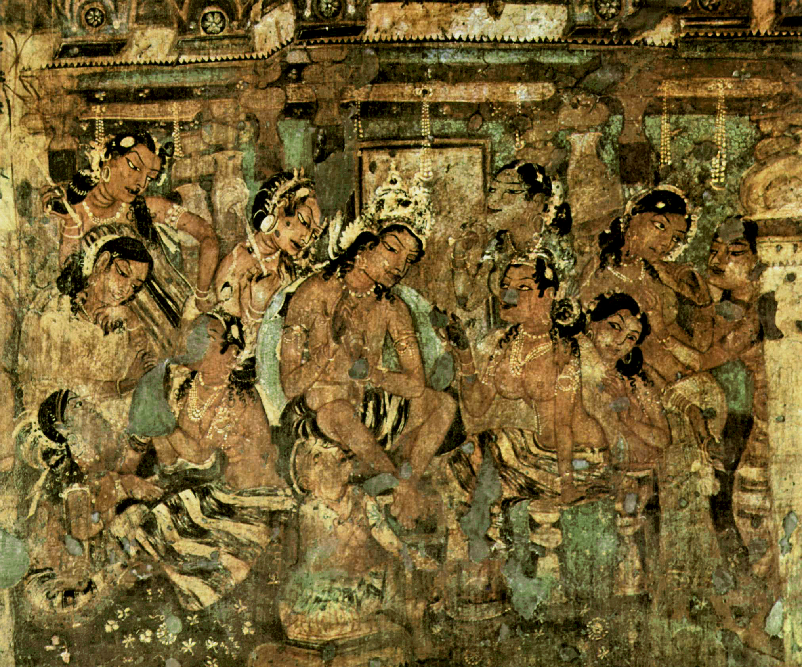
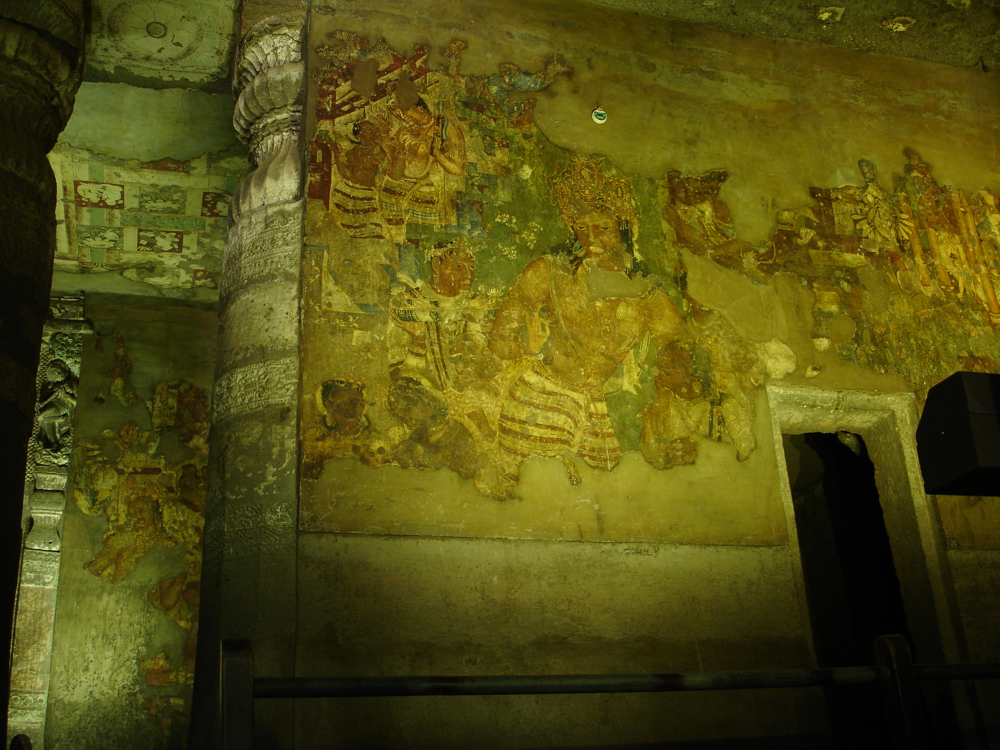
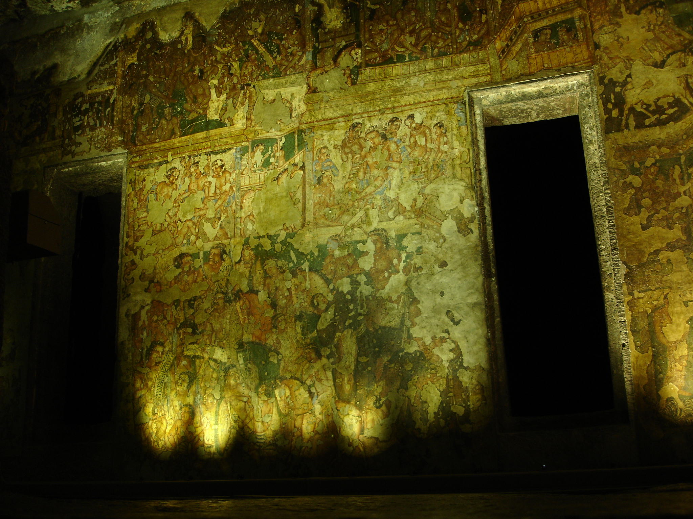
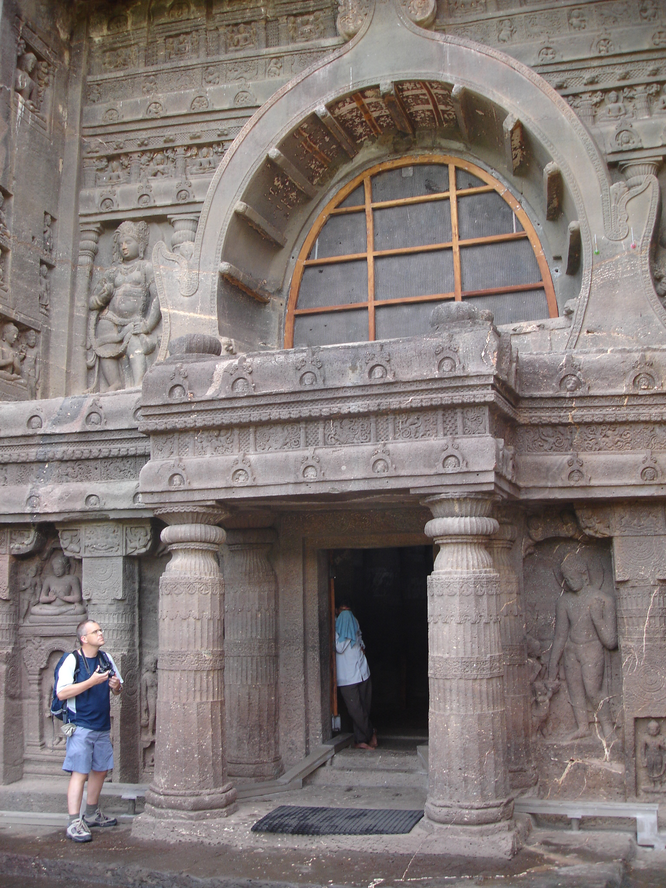

# अजंता गुफाएँ

*युनेस्को विश्व धरोहर स्थल*

| अजन्ता गुफाएँ |
| --- |
| विश्व धरोहर सूची में अंकित नाम |
| अजन्ता गुफाएँ |
| देश |
| प्रकार |
| मानदंड |
| सन्दर्भ |
| युनेस्को क्षेत्र |
| शिलालेखित इतिहास |
| शिलालेख |

अजन्ता गुफाएँ महाराष्ट्र , भारत में स्थित तकरीबन 29 चट्टानों को काटकर बनी बौद्ध स्मारक गुफाएँ जो द्वितीय शताब्दी ई॰पू॰ की हैं। यहाँ बौद्ध धर्म से सम्बन्धित चित्रण एवम् शिल्पकारी के उत्कृष्ट नमूने मिलते हैं। [ 1 ] इनके साथ ही सजीव चित्रण [ 2 ] भी मिलते हैं। यह गुफाएँ अजन्ता नामक गाँव के सन्निकट ही स्थित है, जो कि महाराष्ट्र के औरंगाबाद जिले में है। (निर्देशांक: 20° 30’ उ० 75° 40’ पू॰) अजन्ता गुफाएँ सन् 1983 से युनेस्को की विश्व धरोहर स्थल घोषित है।" [ 3 ]

‘’’नेशनल ज्यॉग्राफिक ‘’’ के अनुसार: आस्था का बहाव ऐसा था कि प्रतीत होता है, जैसे शताब्दियों तक अजन्ता समेत, लगभग सभी बौद्ध मन्दिर, उस समय के बौद्ध मत के शासन और आश्रय के अधीन बनवाये गये हों।

## क्षेत्र

*८ कि॰मी॰ दूर से अजन्ता गुफाओं का विहंगम दृश्य; इसका आकार घोड़े की नाल जैसा है।*

*अजंता गुफाएँ - टिकट कार्यालय से एक दृश्य*

*अजंता गुफाओं से जातक कथाएँ*

गुफाएँ एक घने जंगल से घिरी, अश्व नाल आकार घाटी में अजंता गाँव से 3½ कि॰मी॰ दूर बनी है। यह गाँव महाराष्ट्र के संभाजीनगर शहर से 106 कि॰मी॰ दूर बसा है। इसका निकटतम कस्बा है जलगाँव , जो 60 कि॰मी॰ दूर है, भुसावल 70 कि॰मी॰ दूर है। इस घाटी की तलहटी में पहाड़ी धारा वाघूर बहती है। यहाँ कुल 29 गुफाएँ ( भारतीय पुरातात्विक सर्वेक्षण विभाग द्वारा आधिकारिक गणनानुसार) हैं, जो कि नदी द्वारा निर्मित एक प्रपात के दक्षिण में स्थित है। इनकी नदी से ऊँचाई 35 से 110 फीट तक की है।

अजंता का मठ जैसा समूह है, जिसमें कई विहार (मठ आवासीय) एवं चैत्य गृह हैं (स्तूप स्मारक हॉल), जो कि दो चरणों में बने हैं। प्रथम चरण को गलती से हीनयान चरण कहा गया है, जो कि बौद्ध धर्म के हीनयान मत से सम्बन्धित है। वस्तुतः हिनायन स्थविरवाद के लिए एक शब्द है, जिसमें बुद्ध की मूर्त रूप से कोई निषेध नहीं है। अजंता की गुफा संख्या 9, 10, 12, 13 15ए (अंतिम गुफा को 1956 में ही खोजा गया और अभी तक संख्यित नहीं किया गया है।) को इस चरण में खोजा गया था। इन खुदाइयों में बुद्ध को स्तूप या मठ रूप में दर्शित किया गया है।

दूसरे चरण की खुदाइयाँ लगभग तीन शताब्दियों की स्थिरता के बाद खोजी गयीं। इस चरण को भी गलत रूप में महायान चरण ९ बौद्ध धर्म का दूसरा बड़ा धड़ा, जो कि कमतर कट्टर है, एवं बुद्ध को सीधे गाय आदि रूप में चित्रों या शिल्पों में दर्शित करने की अनुमति देता है।) कई लोग इस चरण को वाकाटक चरण कहते हैं। यह वत्सगुल्म शाखा के शासित वंश वाकाटक के नाम पर है। इस द्वितीय चरण की निर्माण तिथि कई शिक्षाविदों में विवादित है। हाल के वर्षों में कुछ बहुमत के संकेत इसे पाँचवीं शताब्दी में मानने लगे हैं। वॉल्टर एम॰ स्पिंक, एक अजंता विशेषज्ञ के अनुसार महायन गुफाएँ 462-480 ई॰ के बीच निर्मित हुई थी। महायन चरण की गुफाएँ संख्या हैं 1, 2, 3, 4, 5, 6, 7, 8, 11, 14, 15, 16, 17, 18, 19, 20, 21, 22, 23, 24, 25, 26, 27, 28, एवं 29। गुफा संख्या 8 को लम्बे समय तक हिनायन चरण की गुफा समझा गया, किन्तु वर्तमान में तथ्यों के आधार पर इसे महायन घोषित किया गया है।

महायन , हिनायन चरण में दो चैत्यगृह मिले थे, जो गुफा संख्या 9 व 10 में थे। इस चरण की गुफा संख्या 12, 13, 15 विहार हैं। महायन चरण में तीन चैत्य गृह थे जो संख्या 19, 26, 29 में थे। अपने आरम्भ से ही अंतिम गुफा अनावासित थी। अन्य सभी मिली गुफाएँ 1-3, 5-8, 11, 14-18, 20-25, व 27-28 विहार हैं।

खुदाई में मिले विहार कई नापों के हैं, जिनमें सबसे बड़ा 52 फीट का है, प्रायः सभी वर्गाकार हैं। इनके रूप में भी भिन्नता है। कई साधारण हैं, तो कई अलंकृत हैं, कुछ के द्वार मण्डप बने हैं, तो कई के नहीं बने हैं। सभी विहारों में एक आवश्यक घटक है— एक वृहत हॉल कमरा। वाकाटक चरण वालों में, कईयों में पवित्र स्थान नहीं बने हैं, क्योंकि वे केवल धार्मिक सभाओं एवम् आवास मात्र हेतु बने थे; बाद में उनमें पवित्र स्थान जोड़े गये। फिर तो यह एक मानक बन गया। इस पवित्र स्थान में एक केन्द्रीय कक्ष में बुद्ध की मूर्ति प्रायः धर्म-चक्र-प्रवर्तन मुद्रा में बैठे हुए होती थी। जिन गुफाओं में नवीनतम विशेषताएँ हैं, वहाँ किनारे की दीवारों, द्वार मण्डपों पर और प्रांगण में गौण पवित्र स्थल भी बने दिखते हैं। कई विहारों के दीवारों के फलक नक्काशी से अलंकृत हैं। दीवारों और छतों पर भित्ति चित्रण किया हुआ है।

प्रथम शताब्दी में हुए बौद्ध विचारों में अन्तर से, बुद्ध को देवता का दर्जा दिया जाने लगा और उनकी पूजा होने लगी। परिणामतः बुद्ध को पूजा-अर्चना का केन्द्र बनाया गया; जिससे महायन की उत्पत्ति हुई।

पूर्व में, शिक्षाविदों ने गुफाओं को तीन समूहों में बाँटा था, किन्तु साक्ष्यों को देखते हुए और शोधों के चलते उसे नकार दिया गया। उस सिद्धान्त के अनुसार 200 ई॰ पूर्व से 200 ई॰ तक एक समूह, द्वितीय समूह छठी शताब्दी का और तृतीय समूह सातवीं शताब्दी का माना जाता था।

आंग्ल-भारतीयों द्वारा विहारों हेतु प्रयुक्त अभिव्यंजन गुफा-मंदिर अनुपयुक्त माना गया। अजंता एक प्रकार का महाविद्यालय मठ था। ह्वेन त्सांग बताता है कि दिन्नाग , एक प्रसिद्ध बौद्ध दार्शनिक, तत्वज्ञ, जो कि तर्कशास्त्र पर कई ग्रन्थों के लेखक थे, यहाँ रहते थे। यह अभी अन्य साक्ष्यों से प्रमाणित होना शेष है। अपने चरम पर विहार सैंकड़ों को समायोजित करने की सामर्थ्य रखते थे। यहाँ शिक्षक और छात्र एक साथ रहते थे। यह अति दुःखद है कि कोई भी वाकाटक चरण की गुफा पूर्ण नहीं है। यह इस कारण हुआ कि शासक वाकाटक वंश एकाएक शक्तिविहीन हो गया, जिससे उसकी प्रजा भी संकट में आ गयी। इसी कारण सभी गतिविधियाँ बाधित होकर एकाएक रूक गयीं। यह समय अजंता का अंतिम काल रहा।

## गुफा – एक ‌पहला कदम

| Col1 |
| --- |
| तीर्थ यात्रा बौद्ध धार्मिक स्थल |
|  |
| चार मुख्य स्थल |
| लुंबिनी · बोध गया सारनाथ · कुशीनगर |
| चार अन्य स्थल |
| श्रावस्ती · राजगीर सनकिस्सा · वैशाली |
| अन्य स्थल |
| पटना · गया कौशांबी · मथुरा कपिलवस्तु · देवदह केसरिया · पावा नालंदा · वाराणसी |
| बाद के स्थल |
| साँची · रत्नागिरी एल्लोरा · अजंता भरहुत · दीक्षाभूमि |
| देखें • संवाद • संपादन |

*गुफा सं॰ 1 से एक चित्रकारी का नमूना*

*गुफा सं॰ 1*

यह एक प्रथम कदम है और इसका अन्य गुफाओं के समयानुसार क्रम से कोई मतलब नहीं है। यह अश्वनाल आकार की ढाल पर पूर्वी ओर से प्रथम गुफा है। स्पिंक के अनुसार इस स्थल पर बनी अंतिम गुफाओं में से एक है और वाकाटक चरण के समाप्ति की ओर है। हालाँकि कोई शिलालेखित साक्ष्य उपस्थित नहीं हैं; फिर भी यह माना जाता है कि वाकाटक राजा हरिसेना इस उत्तम संरक्षित गुफा के संरक्षक रहे हों। इसका प्रबल कारण यह है कि हरिसेना आरम्भ में अजंता के संरक्षण में सम्मिलित नहीं था, किन्तु लम्बे समय तक इनसे अलग नहीं रह सका, क्योंकि यह स्थल उसके शासन काल में गतिविधियों से भरा रहा और उसकी बौद्ध प्रजा को उस हिन्दू राजा का इस पवित्र कार्य को आश्रय देना प्रसन्न कर सकता था। यहाँ दर्शित कई विषय राजसिक हैं।

इस गुफा में अत्यंत विस्तृत नक्काशी कार्य किया गया है, जिसमें कई अति उभरे हुए शिल्प भी हैं। यहाँ बुद्ध के जीवन से सम्बन्धित कई घटनाएँ अंकित हैं, साथ ही अनेक अलंकरण नमूने भी हैं। इसका द्वि-स्तंभी द्वार-मण्डप, जो उन्नीसवीं शताब्दी तक दृश्य था (तब के चित्रानुसार), वह अब लुप्त हो चुका है। इस गुफा के आगे एक खुला स्थान था, जिसके दोनों ओर खम्भेदार गलियारे थे। इसका स्तर अपेक्षाकृत ऊँचा था। इसके द्वार मण्डप के दोनों ओर कोठियाँ हैं। इसके अन्त में खम्भेदार प्रकोष्ठों की अनुपस्थिति बताती है कि यह मण्डप अजंता के अन्तिम चरण के साथ नहीं बना था, जब कि खम्भेदार प्रकोष्ठ एक नियमित अंग बन चुके थे। पोर्च का अधिकांश क्षेत्र कभी मुराल से भरा रहा होगा, जिसके कई अवशेष अभी भी शेष हैं। यहाँ तीन द्वार पथ हैं, एक केन्द्रीय व दो किनारे के। इन द्वारपथों के बीच दो वर्गाकार खिड़कियाँ तराशी हुई है, जिनसे अंतस उज्ज्वलित होता था।

महाकक्ष (हॉल) की प्रत्येक दीवार लगभग 40 फीट लम्बी और 20 फीट ऊँची है। बारह स्तम्भ अन्दर एक वर्गाकार कॉलोनेड बनाते हैं जो छत को सहारा देते हैं, साथ ही दीवारों के साथ-साथ एक गलियारा-सा बनाते हैं। पीछे की दीवार पर एक गर्भगृहनुमा छवि तराशी गयी है, जिसमें बुद्ध अपनी धर्म-चक्र-प्रवर्तन मुद्रा में बैठे दर्शित हैं। पीछे, बायीं एवं दायीं दीवार में चार-चार कमरे बने हैं। यह दीवारें चित्रकारी से भरी हैं, जो कि संरक्षण की उत्तम अवस्था में हैं। दर्शित दृश्य अधिकतर उपदेशों, धार्मिक एवम् अलंकरण के हैं। इनके विषय जातक कथाओं, गौतम बुद्ध के जीवन, आदि से सम्बन्धित हैं।

## गुफा संख्या 2

*गुफा संख्या २ में चित्रकारी*

*अजंता गुफाओं से चित्रकारी*

*अजंता गुफाएं*

*अजंता गुफाएँ*

गुफा संख्या 1 से लगी गुफा सं॰ 2, दीवारों, छतों एवं स्तम्भों पर संरक्षित अपनी चित्रकारी के लिए प्रसिद्ध है। यह अत्यन्त ही सुन्दर दिखती है एवम् गुफा संख्या के लगभग समान ही दिखती है, किन्तु संरक्षण की कहीं बेहतर स्थिति में है।

## गुफा संख्या 2

### फलक

इस गुफा में दो द्वार-मण्डप हैं, जो कि संख्या 1 से बहुत अलग है। बल्कि फलकों की नक्काशी भी उससे अलग दिखती है। इस गुफा को सहारा दिये दो अच्छे खासे मोटे स्तम्भ हैं, जो कि भारी नक्काशी से अलंकृत हैं। हाँ, आकार, नाप एवम् भूमि योजना में अवश्य यह पहली गुफा से काफी मिलती है।

## गुफा संख्या 2

### द्वार-मण्डप

सामने का पोर्च दोनों ओर स्तम्भों से युक्त प्रकोष्ठों से युक्त है। पूर्व में रिक्त छोड़े स्थानों पर बने कमरे आवश्यक होने पर बाद में स्थान की आवश्यकता होने पर बने, क्योंकि बाद में आवास की अधिक आवश्यकता बढ़ी। सभी बाद की वाकाटक निर्माणों में, पोर्च के अन्त में प्रकोष्ठ आवश्यक अंग बन गये। 
इसकी छतों और दीवारों पर बने भित्ति चित्रों का पर्याप्त मात्रा में प्रकाशन हुआ है। इनमें बुद्ध के जन्म से पूर्व बोधिसत्व रूप के अन्य जन्मों की कथाएँ हैं। पोर्च की पीछे की दीवार के बीच एक द्वार-पथ है, जिससे महाकक्ष (हॉल) में प्रवेश होता है। द्वार के दोनों ओर वर्गाकार चौड़ी खिड़कियाँ हैं जो प्रचुर प्रकाश उपलब्ध कराती हैं; जिससे सुन्दरता एवम् सम्मिति लाती हैं।

- अजंता गुफाएँ
- चैत्य हाल

## इन्हें भी देखें

- वाकाटक
- चैत्य हाल

## बाहरी कड़ियाँ

-

भारत के किन किन जगह को यूनेस्को ने विश्व धरोहर स्थलों की पद दिया है Archived 2024-03-05 at the वेबैक मशीन

-

India's Treasures: Exploring the Magnificence of UNESCO World Heritage Sites Archived 2024-03-05 at the वेबैक मशीन

- Video of the caves MTDC site
- Ajanta Caves in युनेस्को List
- "Ajanta", Jacques-Édouard Berger Foundation, World Art Treasures (choose French or English)
- Photographs of the Ajanta caves-paintings and sculpture, भारतMonuments.org
- Article on Ajanta from the Travel section of the New York Times (November 5, 2006)

20°32′01″N 75°44′59″E / 20.53361°N 75.74972°E / 20.53361; 75.74972

---
Source: https://hi.wikipedia.org/wiki/%E0%A4%85%E0%A4%9C%E0%A4%82%E0%A4%A4%E0%A4%BE_%E0%A4%97%E0%A5%81%E0%A4%AB%E0%A4%BE%E0%A4%8F%E0%A4%81
