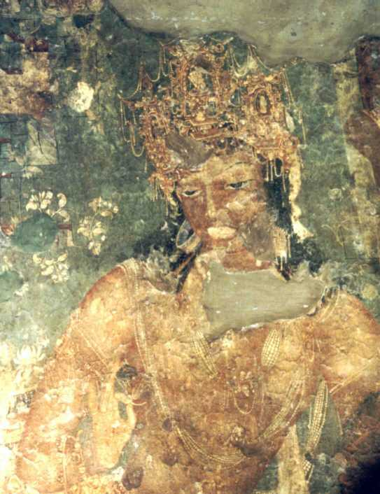

# ಅಜಂತಾ

| ಅಜಂತಾ ಗುಹೆಗಳು * |
| --- |
| UNESCO ವಿಶ್ವ ಪರಂಪರೆಯ ತಾಣ |
| ಅಜಂತಾ ಗುಹೆಗಳು |
| ರಾಷ್ಟ್ರ |
| ತಾಣದ ವರ್ಗ |
| ಆಯ್ಕೆಯ ಮಾನದಂಡಗಳು |
| ಆಕರ |
| ವಲಯ ** |
| ವಿಶ್ವ ಪರಂಪರೆಯ ತಾಣವಾಗಿ ಘೋಷಣೆ |
| ಘೋಷಿತ ವರ್ಷ |
| * ಹೆಸರು ವಿಶ್ವ ಪರಂಪರೆಯ ಪಟ್ಟಿಯಲ್ಲಿ ನಮೂದಾಗಿರುವಂತೆ. ** UNESCO ರಚಿಸಿರುವ ವಲಯಗಳು. |

*ಅಜಂತಾ ಭಿತ್ತಿಚಿತ್ರದ ದೃಶ್ಯ*

ಭಾರತ ದ ಸ್ವಾತಂತ್ರ್ಯ ಪೂರ್ವ ಕಾಲದಲ್ಲಿ ಹೈದರಾಬಾದ್ ನ ನಿಜಾಮರ ಕಾಲದಲ್ಲಿ ಹೈದರಾಬಾದ್ ಪ್ರಾಂತ್ಯದಲ್ಲಿದ್ದ ಅಜಂತಾ ಈಗ ಮಹಾರಾಷ್ಟ್ರ ದ ಔರಂಗಾಬಾದ್ ಜಿಲ್ಲೆಯಲ್ಲಿದೆ. ಇಲ್ಲಿಯ ಬೌಧ್ ಧ ಚೈತ್ಯಗಳಿಗೆ ಮತ್ತು ಇಲ್ಲಿನ ಗೋಡೆಗಳಲ್ಲಿನ ಭಿತ್ತಿಚಿತ್ರಗಳಿಗಾಗಿ ಇದು ಅತ್ಯಂತ ಪ್ರಸಿಧ್ಧಿಯಾಗಿದೆ.

ಇದು ಮಲೆಸೀಮೆ, ಚಂದರ್, ಶತಮಾಲ, ವಿಂಧ್ಯಾದ್ರಿ, ಸಹ್ಯಾದ್ರಿ ಎಂದು ಕರೆಯಲ್ಪಡುವ ಪಶ್ಚಿಮಘಟ್ಟಗಳ ಬೆಟ್ಟಗಳು ಸುತ್ತಲೂ ಇವೆ. ಇವುಗಳ ಸರಾಸರಿ ಎತ್ತರ 4,000`. ಇವು ಮನಮಾಡದಿಂದ ಬೀರಾರಿನವರೆಗೆ ವಿಸ್ತರಿಸಿವೆ. ಅಲ್ಲಲ್ಲಿ ವ್ಯಾಪಾರಿಗಳ, ಸೈನ್ಯದ ಓಡಾಟ ಸಾಗಣೆಗಳಿಗನುಕೂಲವಾದ ಕಣಿವೆ ದಾರಿಗಳಿವೆ. ದಕ್ಷಿಣ ಪ್ರಸ್ಥಭೂಮಿಯ ಉತ್ತರಗಡಿಯಾದ ಈ ಶ್ರೇಣಿ ಬೀರಾರಿನಲ್ಲಿ 2,000` ಎತ್ತರವಾಗಿದೆ. ಮಾರ್ಕಿಂಡ (4,384`), ಸಪ್ತಶೃಂಗ (4,659`), ಧೊಡಕ್ (4,741`), ತುದ್ರೆ (4,526`) - ಇವು ಇಲ್ಲಿನ ಮುಖ್ಯ ಶಿಖರಗಳು.
ಅಜಂತ ಕಣಿವೆ ಔರಂಗಾಬಾದ್ ಮತ್ತು ಎಲ್ಲೋರಗಳಿಂದ 95 ಮೈ. ದೂರದಲ್ಲಿದೆ.

ಊರಿಗೆ 31/2 ಮೈ. ದೂರದಲ್ಲಿ ಜಗತ್ಪ್ರಸಿದ್ಧವಾದ ಅಜಂತ ಗುಹಾಂತರ್ದೇವಾಲಯಗಳು ವಾಫ್ ಕಣಿವೆಯ ಮನೋಹರವಾದ ನೈಸರ್ಗಿಕ ಸನ್ನಿವೇಶದಲ್ಲಿವೆ. ಕಲೆಯ ಪ್ರಭೇದಗಳಾದ ಶಿಲ್ಪ, ಕೆತ್ತನೆ ಹಾಗೂ ವರ್ಣಲೇಪನ ಇವುಗಳ ಕೇಂದ್ರವೆನಿಸಿರುವ ಅಜಂತ ಭಾರತೀಯ ಪರಮೋತ್ಕ್ರಷ್ಟ ಕಲಾನೈಪುಣ್ಯದ ಚಿರಂತನಸಾಕ್ಷಿಯಾಗಿದೆ. ಇಲ್ಲಿ ಬೆಟ್ಟವನ್ನು ಕೊರೆದು ಗುಹಾಲಯಗಳನ್ನು ನಿರ್ಮಿಸಿ ಚಿತ್ರಗಳನ್ನು ಬಿಡಿಸುವ ಕಾರ್ಯ ಕ್ರಿ.ಪೂ. 2ನೆಯ ಶತಮಾನದಲ್ಲಿ ಪ್ರಾರಂಭವಾಗಿ ಅವಿಚ್ಛಿನ್ನವಾಗಿ ಕ್ರಿ.ಶ. 7ನೆಯ ಶತಮಾನದವರೆಗೂ ಮುಂದುವರಿಯಿತು. ಶಾತವಾಹನ, ವಾಕಾಟಕ ಮತ್ತು ಬಾದಾಮಿ ಚಾಳುಕ್ಯ ಸಂತತಿಗಳ ಅರಸರು ಬೌದ್ಧಭಿಕ್ಷುಗಳಿಗಾಗಿ ಗುಹಾಂತರ್ದೇವಾಲಯಗಳನ್ನು ನಿರ್ಮಿಸಿದರು, ಶಿಲ್ಪಿಗಳು ಗುಹಾಲಯಗಳ ನಿರ್ಮಾಣ ಹಾಗೂ ಕಲಾವಿನ್ಯಾಸದಲ್ಲಿ ತಮ್ಮ ಚಾತುರ್ಯವನ್ನು ತೋರಿಸಿರುವರು. ಮತನಿಷ್ಠೆ ಹಾಗೂ ಪರಂಪರಾನುಗತವಾಗಿ ಬೆಳೆಸಿಕೊಂಡು ಬಂದ ಕಲಾಪರಿಪೂರ್ಣತೆಯನ್ನು ವರ್ಣಲೇಪನದಲ್ಲಿ ಬೌದ್ಧಭಿಕ್ಷುಗಳು ಅತ್ಯುನ್ನತವಾಗಿ ಪ್ರದರ್ಶಿಸಿರುವರು.
ಕ್ರಿ.ಶ.7ನೆಯ ಶತಮಾನದಲ್ಲಿ ಅಜಂತಕ್ಕೆ ಭೇಟಿಯಿತ್ತಿದ್ದ ಹುಯೆನ್‍ತ್ಸಾಂಗನ ಬರೆವಣಿಗೆಗಳಿಂದ, ಇಲ್ಲಿ ಬಹು ಸಂಖ್ಯೆಯಲ್ಲಿ ಬೌದ್ಧಭಿಕ್ಷುಗಳು ವಾಸಿಸುತ್ತಿದ್ದರೆಂದೂ ಅವರು ಹತ್ತಿರದಲ್ಲಿದ್ದ ಇಂದ್ರಕಾಂತವೆಂಬ ಪಟ್ಟಣಕ್ಕೆ ಆಗಾಗ ಭಿಕ್ಷಾಟನೆಗಾಗಿ ಹೋಗುತ್ತಿದ್ದರೆಂದೂ ತಿಳಿದುಬರುತ್ತದೆ. ಇವನು ಅಜಂತ ಕಲಾಕೇಂದ್ರದ ಪ್ರಕೃತಿ ಸೌಂದರ್ಯವನ್ನೂ ಗುಹಾಂತರ್ದೇವಾಲಯಗಳ ಸೌಂದರ್ಯವನ್ನು ವಿಶೇಷವಾಗಿ ಪ್ರಶಂಸಿಸಿರುವನು. ಬೌದ್ಧಮತ ಕ್ಷೀಣಿಸಿದ ಮೇಲೆ ಈ ಸ್ಥಳ ನಿರ್ಲಕ್ಷಿಸಲ್ಪಟ್ಟು ಪೊದೆಗಳು ಬೆಳೆದು ಮೃಗಪಕ್ಷಿಗಳ ಆವಾಸಸ್ಥಾನವಾಗಿ ಮಾನವ ಸ್ಮøತಿಗೋಚರದಿಂದ ಮರೆಯಾಯಿತು. ಇವು ಕ್ರಿ.ಶ. ೧೯ನೆಯ ಶತಮಾನದ ಪೂರ್ವಾರ್ಧದಲ್ಲಿ ಆಂಗ್ಲ ವಿದ್ವಾಂಸರ ಗಮನಕ್ಕೆ ಬಂದು ಅವರಲ್ಲಿ ವಿಸ್ಮಯವನ್ನೂ ಕುತೂಹಲವನ್ನೂ ಕೆರಳಿಸಿ ನಮ್ಮ ನಾಡಿನ ಹಾಗೂ ಪ್ರಪಂಚದ ಕಲಾತಜ್ಞರ ಗಮನವನ್ನು ಅತ್ತ ಸೆಳೆದುವು. ಅಜಂತದಲ್ಲಿ ಒಟ್ಟು ೩೦ ಗುಹಾಂತರ ದೇವಾಲಯಗಳಿವೆ. ಅನೇಕ ಗುಹಾಲಯಗಳಲ್ಲಿ ಕಾಲ ಮತ್ತು ಪ್ರಕೃತಿಯ ಹೊಡೆತದಿಂದ ಚಿತ್ರಗಳು ನಾಶವಾಗಿದೆ. ಆದಾಗ್ಗ್ಯೂ ಅವುಗಳ ಭವ್ಯಕಲ್ಪನೆಯನ್ನು ಚಿತ್ರಿಸಿಕೊಳ್ಳಲು ಎಡೆಯಿದೆ. ಪಳೆಯುಳಿಕೆಗಳನ್ನು ಇತ್ತೀಚೆಗೆ ಉದ್ಧಾರಮಾಡಿ ಕಾಪಾಡಿಕೊಂಡು ಬರುವ ಏರ್ಪಾಡು ಮಾಡಲಾಗಿದೆ. ಹಾಳಾಗಿರುವ ಭಾಗಗಳ ಪಡಿಯಚ್ಚು ಮಾಡಿಕೊಳ್ಳಲಾಗಿದೆ.
ಇವುಗಳಲ್ಲಿ 16ನೆಯ ಗುಹಾಲಯ ಕಲೆಯ ದೃಷ್ಟಿಯಿಂದ ಅತ್ಯಂತ ಮುಖ್ಯವಾದುದು. ಇದನ್ನು ಬೆಟ್ಟದೊಳಕ್ಕೆ ೬೫` ಕೊರೆದು ನಿರ್ಮಿಸಲಾಗಿದೆ. ೨೦ ಕಂಬಗಳನ್ನು ಅಂದವಾಗಿ ಕೊರೆದಿದ್ದಾರೆ. ಮುಖಮಂಟಪದಲ್ಲಿ 5 ಕಂಬಗಳಿವೆ. ರಂಗಮಂಟಪದಲ್ಲಿ ಪ್ರತಿಯೊಂದು ಕಡೆಯೂ 7 ಚಿಕ್ಕ ಚಿಕ್ಕ ಕೋಣೆಗಳಿವೆ. ಗರ್ಭಗೃಹದಲ್ಲಿ ಪ್ರಲಂಬ-ಪಾದಾಸನನಾಗಿರುವ ಬುದ್ಧದೇವನ ಮೂರ್ತಿ ಇದೆ. 14ನೆಯ ಗುಹಾಲಯ ಸರಿಸುಮಾರಾಗಿ ಇದೇ ಮಾದರಿಯನ್ನು ಹೋಲುವುದು. ಇಲ್ಲಿ ೭೫` ವಿಸ್ತಾರವಾದ ಹಜಾರವಿದೆ. ೨೦ ಸುಂದರವಾದ ಕಂಬಗಳನ್ನು ಕೊರೆದು ಬಿಡಿಸಲಾಗಿದೆ. ಈ ಗುಹಾಲಯವನ್ನು ಅತ್ಯಂತ ಸುಂದರವಾದ ಮಂದಿ
ರವನ್ನಾಗಿಸಬೇಕೆಂಬ ಇಚ್ಛೆಯಿಂದ ಕೊರೆದಂತಿದೆ. ಆದರೆ ಕೊರೆಯುವ ಕೆಲಸ ಪೂರ್ಣವಾಗಿಲ್ಲ. ಜೊತೆಗೆ ಗುಹಾಲಯ ಬಹುವಾಗಿ ಶಿಥಿಲವಾಗಿದೆ. 1, 2 4 ಮತ್ತು 24 ನೆಯ ಗುಹಾಲಯಗಳು ಕಲಾದೃಷ್ಟಿಯಿಂದ ಉನ್ನತವಾದ ಕಟ್ಟಡ ವಿನ್ಯಾಸವನ್ನು ಪ್ರದರ್ಶಿಸುತ್ತವೆ. 1 ಮತ್ತು 2ನೆಯ ಗುಹಾಲಯಗಳು ಮನೋಜ್ಞವಾದ ಶಿಲ್ಪ ಹಾಗೂ ಕೆತ್ತನೆಯ ಕೆಲಸಗಳಿಗೆ ಉದಾಹರಣೆಯಾಗಿವೆ. ಕಂಬಗಳು ಅಂದವಾದ ಕೆತ್ತನೆಯ ಕೆಲಸ ಹಾಗೂ ಸುಂದರವಾಗಿ ಕಡೆದ ಬೋದಿಗೆಗಳನ್ನು ಹೊಂದಿವೆ. 19 ಮತ್ತು 26ನೆಯ ಗುಹಾಲಯಗಳಲ್ಲಿಯೂ ಉತ್ತಮ ಕೆತ್ತನೆಯ ಕೆಲಸಗಳನ್ನು ನೋಡಬಹುದು. ಈ ಕೆಲಸಗಳು ಮುಂಬರಲಿದ್ದ ದಕ್ಷಿಣ ಭಾರತದ ಶಿಲ್ಪ ಕಲಾಸಂಪನ್ನತೆಯ ಮುಂಬೆಳಗಿನ ಪ್ರಜ್ಞೆಯಂತಿದೆ ಎಂಬುದಾಗಿ ವಿದ್ವಾಂಸರು ಅಭಿಪ್ರಾಯಪಟ್ಟಿದ್ದಾರೆ.
ಅಜಂತದ ಚಿತ್ರಗಳ ಮುಖ್ಯಗುರಿ ಮತಬೋಧನೆ. ಬೌದ್ಧ ಭಿಕ್ಷುಗಳು, ಕೆಂಪು, ಹಸಿರು, ಹಳದಿ, ಊದ, ಧೂಮ್ರ ಮತ್ತು ನೀಲವರ್ಣಗಳಿಂದ ಬಿಡಿಸಿರುವ ಭಿತ್ತಿಚಿತ್ರಗಳು ವರ್ಣನಾತೀತವಾದ ಸೌಂದರ್ಯವನ್ನೂ ಕೌಶಲವನ್ನೂ ಪ್ರದರ್ಶಿಸುತ್ತವೆ. ಚಿತ್ರಕಾರರು ಸಾಂಪ್ರದಾಯಿಕ ನೀತಿಯನ್ನನುಸರಿಸದಾಗ್ಗ್ಯೂ ತಮ್ಮ ಪ್ರತಿಭೆ ಮತ್ತು ಸ್ವಾತಂತ್ರ್ಯವನ್ನು ತೋರ್ಪಡಿಸಿದ್ದಾರೆ. ಬೋಧಿಸತ್ವ ಬುದ್ಧದೇವನ ಜೀವನದ ಪ್ರಮುಖ ಘಟನೆಗಳು ಸಜೀವವಾಗಿ ಪಡಿಮೂಡಿವೆ. ಹೂಬಳ್ಳಿಗಳ, ಗೂಳಿ, ಕಪಿ, ನವಿಲು ಮುಂತಾದ ಪ್ರಾಣಿ ಪಕ್ಷಿಗಳ ಚಿತ್ರಗಳು ನೈಜ ಜೀವಿಗಳಂತಿವೆ. ಸ್ತ್ರೀ ಚಿತ್ರಗಳು ಭಾರತೀಯ ಸ್ತ್ರೀಯರ ಸಹಜವಾದ ಶರೀರಭಂಗಿ, ಪ್ರಮಾಣ, ಅಲಂಕಾರ, ಮಾರ್ದವ, ಲಾವಣ್ಯಗಳನ್ನು ನಿದರ್ಶಿಸುತ್ತವೆ.
ದೇವಾನುದೇವತೆಗಳ, ಅಪ್ಸರೆಯರ, ಕಿನ್ನರರ, ಪ್ರಭು, ಪ್ರಭೃತಿಗಳ, ಗಣ್ಯರ, ವೀರರ, ಹಳ್ಳಿ, ನಗರಗಳ, ಸಂತರ ಮತ್ತು ಮಹರ್ಷಿಗಳ ಚಿತ್ರಗಳು ಸಹಜವಾಗಿ, ಸುಂದರವಾಗಿ, ಮನೋಜ್ಞವಾಗಿ ಒಡಮೂಡಿವೆ. ಒಂದು ಮತ್ತು ಎರಡನೆಯ ಗುಹಾಲಯಗಳಲ್ಲಿ ಪುಲಿಕೇಶಿಯ ಆಸ್ಥಾನವನ್ನೂ ಪರ್ಷಿಯಾ ರಾಯಭಾರಿಗಳ ಆಗಮನವನ್ನೂ ಜೀವಂತವಾಗಿ ಚಿತ್ರಿಸಿದ್ದಾರೆ. ಈ ಗುಹೆಗಳಲ್ಲಿರುವ ಜಿಂಕೆಗಳ ಹಾಗೂ ಶಿವಪಾರ್ವತಿಯರ ಭಿತ್ತಿಚಿತ್ರಗಳು ಅತ್ಯಂತ ಸುಂದರವಾಗಿವೆ. ೧೭ನೆಯ ಗುಹೆಯಲ್ಲಿ ಬೌದ್ಧಮತದ ನಿಯಮನಿಷ್ಠೆಯಲ್ಲಿದ್ದ ನಿರಂತರ ಶ್ರದ್ಧೆ ಹಾಗೂ ಪರಂಪರಾನುಗುತವಾಗಿ ಬೆಳೆಸಿಕೊಂಡು ಬಂದ ಚಿತ್ರಕಲಾಭ್ಯಾಸ ಇವುಗಳ ಅನುಭವದ ಆನಂದ ಪರವಶತೆಯನ್ನೂ ಕೌಶಲವನ್ನೂ ಅನಾಮಧೇಯ ಬೌದ್ಧಭಿಕ್ಷುಗಳು ಪರಮೋತ್ಕøಷ್ಟವಾಗಿ ಅಜಂತ ಗುಹಾಂತರ್ದೇವಾಲಯಗಳಲ್ಲಿ ಪ್ರದರ್ಶಿಸಿದ್ದಾರೆ.
ಸೌಮ್ಯತೆ, ಅಸದೃಶವಾದ ಕುಂಚಕೌಶಲ, ಎಣೆಯಿಲ್ಲದ ವರ್ಣವಿನ್ಯಾಸದ ವೈಖರಿ, ಅಸಾಧಾರಣ ಪ್ರೌಢಿಮೆ-ಇವುಗಳಿಗೆ ಅಜಂತ ಭಿತ್ತಿಚಿತ್ರಗಳು ಅದ್ವಿತೀಯ ನಿದರ್ಶನಗಳಾಗಿವೆಯೆಂದು ಕಲಾವಿಮರ್ಶಕರು ಪ್ರಶಂಸಿಸಿದ್ದಾರೆ.

## ಅಜಂತದ ವಾಸ್ತುಶಿಲ್ಪ

ಅಜಂತದ ಗುಹಾಂತರ್ದೇವಾಲಯಗಳು ಜಗತ್ಪ್ರಸಿದ್ಧವಾಗಿವೆ. ಇದಕ್ಕೆ ಕಾರಣ ಅಲ್ಲಿನ ನೈಸರ್ಗಿಕ ಸೌಂದರ್ಯ, ಶಿಲ್ಪಕಲೆ, ಚಿತ್ರಕಲೆ, ಎದುರಿಗೆ ಸಮೀಪದಲ್ಲಿಯೇ ಜುಳು ಜುಳು ಎಂದು ಮಂಜುಳ ಧ್ವನಿಗೈಯುತ್ತ ಹರಿಯುವ ವಾಘೋರಾ ನದಿ ಚಿಕ್ಕ ಏಳು ಜಲಪಾತಗಳಿಂದ ಕೂಡಿಕೊಂಡು ರಮ್ಯವಾಗಿದೆ. ನದಿಯ ಕೊಳ್ಳ ಗಂಭೀರ ಶಾಂತತೆಯಿಂದ ಮೆರೆಯುತ್ತಿದೆ.
ಸುಮಾರು 200 ಬೌದ್ಧ ಭಿಕ್ಷುಗಳು ಇಲ್ಲಿನ ಗುಹೆಗಳಲ್ಲಿ ವಾಸಮಾಡಿಕೊಂಡಿದ್ದಿರಬೇಕು. ಅವರು ಸುತ್ತಮುತ್ತಲಿನ ನಿಸರ್ಗ ರಮಣೀಯತೆಯಲ್ಲಿ ತಮ್ಮ ಆಧ್ಯಾತ್ಮ ಸಾಧನೆಯನ್ನು ಮಾಡುತ್ತಿದ್ದರು. ಅವರ ದರ್ಶನ ಪಡೆದು ಅವರಿಗೆ ಅನ್ನ, ಬಟ್ಟೆಗಳನ್ನೊದಗಿಸಿ ಅವರಿಂದ ಆಶೀರ್ವಾದ ಪಡೆಯಲು ಜನರು ಇಲ್ಲಿಗೆ ಮೇಲಿಂದ ಮೇಲೆ ಬರುತ್ತಿದ್ದರು.
ಸುಮಾರು 3/4 ಮೈ. ಉದ್ದವಾದ ಕುದುರೆಲಾಳದ ಆಕಾರದ ಬೆಟ್ಟದ ನಿಡಿದಾದ ಓರೆಯಲ್ಲಿ ಈ ಗುಹಾಂತರ್ದೇವಾಲಯಗಳನ್ನು ಕೊರೆದಿದ್ದಾರೆ. ಇವು ಹೆಚ್ಚಾಗಿ ಬೌದ್ಧಮತಕ್ಕೆ ಸಂಬಂಧಿಸಿದುವು. ಸ್ಥೂಲವಾಗಿ ಹೀನಯಾನ ಮತ್ತು ಮಹಾಯಾನ ಎಂಬ ಎರಡು ಬೌದ್ಧಪಂಥಗಳಿಗೆ ಸಂಬಂಧಪಟ್ಟುವೆಂದು ಅವುಗಳಲ್ಲಿ ಕೆತ್ತಿದ ಬೌದ್ಧ ಮೂರ್ತಿಗಳು. ಬಣ್ಣದ ಚಿತ್ರಗಳು ಮತ್ತು ಕಂಬಗಳ ರಚನೆಯಿಂದ ವಿಂಗಡಿಸಬಹುದು. ಇವುಗಳ ರಚನೆ ಕ್ರಿ.ಪೂ. 2ನೆಯ ಶತಮಾನದಿಂದ ಆರಂಭವಾಗಿ ಕ್ರಿ.ಶ. 7ನೆಯ ಶತಮಾನದವರೆಗೂ ನಡೆಯಿತು.

ಅಜಂತದ ವಾಸ್ತುಶಿಲ್ಪ, ಮೂರ್ತಿಶಿಲ್ಪಗಳಲ್ಲಿನ ಕಲೆ ಸಾಕಷ್ಟು ಉತ್ತಮಮಟ್ಟದ್ದಾಗಿದ್ದು ವೈವಿಧ್ಯಮಯವಾಗಿದೆ. ಕಂಬಗಳ ಮಾಟ, ಅಲಂಕಾರ ಪದ್ಧತಿ, ಮೂರ್ತಿಗಳ ಮೈಕಟ್ಟು, ಪ್ರಮಾಣ, ಅಲಂಕಾರ ಕಲೆ ಮನ ಮೆಚ್ಚುವಂತಿವೆ. ನಿರ್ಮಾತೃಗಳಾದ ಸ್ಥಪತಿಗಳು ಒಳ್ಳೆ ದಕ್ಷತೆಯಿಂದ ಕೆಲಸ ಮಾಡಿ ಮೂರ್ತಿಗಳಲ್ಲಿ, ವರ್ಣಚಿತ್ರಗಳಲ್ಲಿ ಜೀವಕಳೆ ತುಂಬಿದ್ದಾರೆ.
ಅಜಂತದ ಚೈತ್ಯಗಳಿಗೆ ಕಂಬಗಳುಳ್ಳ ಮುಖಮಂಟಪ, ಹಿಂಬದಿಯಲ್ಲಿ ಅರ್ಧವರ್ತುಲಾಕಾರದ ನಡು ಅಂಕಣ, ಅದರ ಪಕ್ಕಗಳಲಲಿ ಕಂಬಗಳ ಸಾಲಿನಿಂದ ಬೇರ್ಪಡಿಸಿದ ಬದಿಯ ಅಂಕಣಗಳು, ಸ್ತೂಪ, ಗುಮ್ಮಟ, ಚಾವಣಿಯ ಕೋಣೆ - ಇತ್ಯಾದಿ ಇರುತ್ತವೆ. ಹೀನಯಾನ ಪಂಥದ ವಿಹಾರಗಳಲ್ಲಿ ಬಾಗಿಲು ದಾಟಿದ ಕೂಡಲೆ ಒಂದು ವಿಶಾಲವಾದ ನಡುಸಾಲೆ ಕಾಣುತ್ತದೆ. ಅದರ ಮೂರು ಗೋಡೆಗಳಲ್ಲಿ ಕಲ್ಲಿನ ಹಾಸಿಗೆಯುಳ್ಳ ಸಣ್ಣ ಕೋಣೆಗಳಿವೆ. ಇವುಗಳ ಕಾಲ ಸುಮಾರು ಕ್ರಿ.ಶ. 3ನೆಯ ಶತಮಾನದವರೆಗೆ. ಮಹಾಯಾನ ತಲೆದೋರಿದಂದಿನಿಂದ ವಿಹಾರಗಳ ರಚನೆಯಲ್ಲಿ ಮಾರ್ಪಾಡಾಯಿತು. ಮಧ್ಯದ ಮಂಟಪದ ಸುತ್ತ ನಾಲ್ಕು ಕಡೆಗೂ ಹೋಗಲು ಬರುವಂತೆ ಮೊಗಸಾಲೆಗಳಾದುವು. ಎದುರಿನ ಗೋಡೆಯ ಮಧ್ಯದಲ್ಲಿ ಗರ್ಭಗುಡಿ ಬಂದಿತು. ಅದರಲ್ಲಿ ಬುದ್ಧನ ಮೂರ್ತಿಯನ್ನು ಕಡೆದು ಪೂಜಿಸಹತ್ತಿದ್ದರು. ಮಹಾಯಾನದಲ್ಲಿ ಚಿತ್ರ ಮತ್ತು ಮೂರ್ತಿಗಳಿಗೆ ಅವಕಾಶ ದೊರೆತದ್ದರಿಂದ ಬದಿಯ ಅಂಕಣಗಳಲ್ಲಿ ಮಾಡಗಳನ್ನು ಕೊರೆಯುವ ಮತ್ತು ಹೆಚ್ಚು ಹರವಾದ ಒಳಗೋಡೆಗಳನ್ನು ನಿರ್ಮಿಸುವ ಅವಶ್ಯಕತೆ ಉಂಟಾಯಿತು. ಇದಕ್ಕೆ ಕಂಬಗಳು ನೆರವಾದುವು.
11, 7 ಮತ್ತು 6ನೆಯ ವಿಹಾರಗಳು ಮಧ್ಯಂತರದ ಅವಸ್ಥೆಯನ್ನು ಸೂಚಿಸುತ್ತವೆ. ಅವುಗಳ ರಚನೆ ಹೀನಯಾನ ವಿಹಾರಗಳ ರಚನೆಯಿಂದ ಬೇರೆಯಾಗಿದ್ದರೂ ಮಂಟಪದಲ್ಲಿಯ ಕಂಬಗಳ ರಚನೆಯಲ್ಲಿ ಕಟ್ಟಡಗಳಲ್ಲಿ ಹಿಂದೆ ಬಳಸಲಾದ ನಮೂನೆಯಿದೆ. ಈ ಮೂರು ವಿಹಾರಗಳಲ್ಲಿ 11ನೆಯದು ಎಲ್ಲಕ್ಕೂ ಮೊದಲು ಹುಟ್ಟಿದೆ. 
ಇದರಲ್ಲಿಯ ನಾಲ್ಕು ಕಂಬಗಳು ಪ್ರಾಕಾರದ ಮಧ್ಯದಲ್ಲಿ ತಯಾರಿಸಿದ ಒಂದು ಚಪ್ಪರವನ್ನು ನಿರ್ದೇಶಿಸುತ್ತವೆ. 7ನೆಯದರಲ್ಲಿ ಇಂಥ ಎರಡು ಚಪ್ಪರಗಳನ್ನು ಕಾಣುತ್ತೇವೆ. ಮುಂದೆ ಅನೇಕ ಕಂಬಗಳು ಕೂಡಿಕೊಂಡು ದೊಡ್ಡ ಮಂಟಪದ ರಚನೆಗೆ ಕಾರಣವಾದುವು.
1, 4, 16, 17, 21, ಮತ್ತು 23ನೆಯ ಗುಹಾಂತರ್ದೇವಾಲಯಗಳಲ್ಲಿ ಶಿಲ್ಪಕಲಾ ಕುಶಲತೆಯ ಉತ್ತಮ ವೈವಿಧ್ಯ ಕಾಣಬರುತ್ತದೆ. ಕ್ರಿ.ಶ. 6ನೆಯ ಶತಮಾನದಲ್ಲಿ ನಿರ್ಮಾಣವಾದ 16ನೆಯ ಇವುಗಳಲ್ಲಿ ಅತ್ಯುತ್ತಮವಾದುದು. ಇದು ಮತ್ತು 1ನೆಯ ಗುಹಾಂತರ್ದೇವಾಲಯಗಳು ಸಾಮಾನ್ಯವಾಗಿ ಒಂದೇ ರೀತಿಯವು. ಇವೆರಡಕ್ಕೂ 65` ಉದ್ದವಾದ ಮೊಗಸಾಲೆ, 65` ಉದ್ದವಾದ ಮೊಗಸಾಲೆ, 65` ಚೌಕಟ್ಟಿನ 20 ಕಂಬಗಳ ಸಾಲಿನಿಂದೊಡಗೂಡಿದ ನಡುಸಾಲೆಗಳಿರುವುವು. 16ನೆಯದರ ನಡುಸಾಲೆ, ಮೊಗಸಾಲೆಗಳ ಗೋಡೆಗಳಲ್ಲಿ 16 ಚಚ್ಚೌಕದ ಸಣ್ಣ ಕೋಣೆಗಳಿವೆ. ಮತ್ತು ಹಿಂಬದಿಯ ಗೋಡೆಯಲ್ಲಿ ಒಂದು ಅಗಲವಾದ ಗರ್ಭಗುಡಿಯನ್ನು ನಿರ್ಮಿಸಿದ್ದಾರೆ. ಅದರಲ್ಲಿ ಬುದ್ಧನ ದೊಡ್ಡ ವಿಗ್ರಹ ವಿರಾಜಮಾನವಾಗಿದೆ. ಈ ಗುಹೆಯಲ್ಲಿ ವಾಕಾಟಕ ಹರಿಷೇಣನ ಶಿಲಾಶಾಸನವಿದೆ.
2ನೆಯ ಗುಹಾಂತರ್ದೇವಾಲಯದಲ್ಲಿ ಬ್ರಾಹ್ಮೀಲಿಪಿ ಮತ್ತು ಸಂಸ್ಕøತ ಭಾಷೆಯಲ್ಲಿರುವ ಕ್ಷಾಂತಿವಾದಿ (ತಾಳ್ಮೆಯ ಬೋದಕ), ಸುರಸುತಿ (ಸರಸ್ವತಿ) ಮೈತ್ರೀ, ಬಲಜಾತಕ ಕ್ಷಾಂತಿಜಾತಕದ ಒಂದೆರಡು ಶ್ಲೋಕಗಳನ್ನು ಬಣ್ಣದಲ್ಲಿ ಬರೆಯಲಾಗಿದೆ. 19ನೆಯದು ಉತ್ತಮರೀತಿಯಲ್ಲಿ ರಚಿತವಾದ ಚೈತ್ಯಾಲಯ. ಇದೇನೂ ಅಷ್ಟು ದೊಡ್ಡದಲ್ಲ. ಹೊರಗೆ 38` ಉದ್ದ 32` ಅಗಲವಾಗಿದೆ. ಒಳಭಾಗದ ಉದ್ದ 46`, ಅಗಲ 24`. ಹಿಂದೆ ಒಂದು ಹೊರಪ್ರಾಕಾರವೂ ಎರಡೂ ಬದಿಗಳಲ್ಲಿ ಕಿರುದೇವಾಲಯಗಳೂ ಇದ್ದಿರಬೇಕು. ಮುಂದಿನ ಗೋಡೆಗೆ ಮೂರು ಪ್ರವೇಶದ್ವಾರಗಳ ಬದಲಾಗಿ ಒಂದೇ ಇದೆ. ಮುಂದುಗಡೆ ಹೊರಮಂಟಪ ಇದ್ದು ಚೈತ್ಯಾಲಯಕ್ಕೆ ಕಲೆ ತಂದುಕೊಟ್ಟಿದೆ.
26ನೆಯದೂ ಒಂದು ಚೈತ್ಯಾಲಯ. 68` ಉದ್ದ, 36` ಅಗಲ ಮತ್ತು 31` ಎತ್ತರವಿದೆ. ಪ್ರವೇಶದ್ವಾರದಲ್ಲಿಯ ಎರಡು ಕಂಬಗಳಲ್ಲದೆ ಇದಕ್ಕೆ 12` ಎತ್ತರವಾದ 26 ಕಂಬಗಳಿವೆ. ಅಲಂಕಾರ ಹೆಚ್ಚು. ಸ್ತೂಪದ ಮೇಲೆ ಹಲವು ಕೆತ್ತನೆಗಳಿವೆ. ಆದರೆ, ಮೊದಲಿನ ಚೈತ್ಯಗಳಲ್ಲಿದ್ದ ನಯ ಮತ್ತು ಲಯ ಇಲ್ಲಿ ತಪ್ಪಿದೆ. ಚೈತ್ಯ ಕಿಂಡಿಯ ಹತ್ತಿರ ಸುಂದರವಾದ ಅನೇಕ ಆಕೃತಿಗಳನ್ನು ಕೆತ್ತಿದ್ದಾರೆ. ಇಲ್ಲಿಯ ಮೂರ್ತಿಗಳು ವಿಶೇಷ ಪ್ರಮಾಣದಲ್ಲಿದ್ದರೂ ವೈವಿಧ್ಯವಿಲ್ಲದ್ದರಿಂದ ಮನಸ್ಸನ್ನು ಸೆಳೆಯುವುದಿಲ್ಲ.
1ನೆಯ ಗುಹಾಂತರ್ದೇವಾಲಯದಲ್ಲಿಯ ಶಿಲಾಮೂರ್ತಿಗಳು ಬಹು ಸುಂದರವಾಗಿವೆ. ಮುಂಭಾಗದಲ್ಲಿ ಉತ್ತಮ ರೀತಿಯ ಕೆತ್ತನೆ ಕೆಲಸ ಮಾಡಿದ್ದಾರೆ. 26ನೆಯ ಗುಹಾಂತರ್ದೇವಾಲಯದಲ್ಲಿ ಬುದ್ಧ ನಿರ್ಯಾಣದ ಬೃಹತ್ ಚಿತ್ರವನ್ನು ಕೆತ್ತಿದ್ದಾರೆ. ಆನಂದನೇ ಮೊದಲಾದ ಅವನ ಅನುಯಾಯಿಗಳು ದೇಹದ ಹತ್ತಿರ ಕುಳಿತು ಶೋಕಿಸುತ್ತಿದ್ದಾರೆ. ಚಿತ್ರಸಂಯೋಜನೆ ಸುಂದರವಾಗಿದೆ. 1ನೆಯ ಗುಹಾಂತರ್ದೇವಾಲಯದ ಒಂದು ಕಂಬದ ಬೋಧಿಗೆಯ ಮೇಲೆ ನಾಲ್ಕು ದೇಹ, ಒಂದೇ ಮುಖವುಳ್ಳ ನಾಲ್ಕು ಚಿಗರೆಗಳನ್ನು ಬಹು ಸುಂದರವಾಗಿ, ಜೀವಂತವೋ ಎನ್ನುವಂತೆ ಕೆತ್ತಿದ್ದಾರೆ. ಚೌಕಟ್ಟಿನ ಮೆಲಿರುವ ಕೆತ್ತನೆ ಮನಮೋಹಕವಾಗಿದೆ. ಅಜಂತದ ಒಂದು ವಿಹಾರದಲ್ಲಿ ಗರ್ಭಗುಡಿಯಲ್ಲಿಯ ಬುದ್ಧನ ಮೂರ್ತಿ, ಎದುರಿನಿಂದ ನೋಡಿದರೆ ಗಂಭೀರ ಮೌನದಲ್ಲಿದ್ದಂತೆ ತೋರುತ್ತದೆ. ಅದನ್ನೇ 45º ಕೋನದಲ್ಲಿ ನಿಂತು ನೋಡಿದರೆ ನಗುವಂತೆ ತೋರುತ್ತದೆ.

## ಅಜಂತದ ಭಿತ್ತಿ ಚಿತ್ರಗಳು

ಅಜಂತದ ಗುಹೆಗಳ ಉತ್ಕೃಷ್ಟವಾದ ಶಿಲ್ಪ, ಚಿತ್ರ ರಚನೆಗಳು ಗುಪ್ತರ ಕಾಲದ ಕಲಾ ಔನ್ನತ್ಯವನ್ನೂ ಗಾಂಧರ, ಪಾರಸಿಕ, ಚೀನಾ ಸಂಪರ್ಕದ ಸಂಕೀರ್ಣತೆಯನ್ನೂ ಸೂಚಿಸುತ್ತವೆ. ಆದರೆ ಹೈಂದವ ಕಲಾ ಸಂಸ್ಕøತಿ ಬೌದ್ಧರ ಯುಗಕ್ಕಿಂತ ಅತಿ ಪ್ರಾಚೀನವಾದದ್ದು. ಈ ಸಂಸ್ಕøತಿಯಿಂದ ಸಂಗ್ರಹಿಸಲಾದ ಚಿತ್ರ ಲಕ್ಷಣಗಳನ್ನು ವಾತ್ಸಾಯನ ತನ್ನ ಕಾಮಸೂತ್ರಗಳಲ್ಲಿ ಹೀಗೆ ವರ್ಣಿಸಿರುತ್ತಾನೆ: 
`* ರೂಪಭೇದ ಪ್ರಮಾಣಾನಿ ಭಾವಲಾವನ್ಯ ಯೋಜನಂ| ಸಾದೃಶ್ಯಂ ವರ್ಣಿಕಾ ಬಂಗಮಿತಿ ಚಿತ್ರಂ ಷಡಂಗಕಂ||. 
ಅಜಂತದ ಚಿತ್ರಕಾರರು ಈ ಷಡಂಗಗಳನ್ನು ನಿಷ್ಠೆಯಿಂದ ತಮ್ಮ ಕೃತಿಗಳಲ್ಲಿ ಅನುಸರಿಸಿದ್ದಾರೆ.
ಸರ್ವಾನುಮತವಾಗಿ ಅಜಂತದ 30 ಗುಹೆಗಳನ್ನು ಕಾಲಾನುಕ್ರಮವಾಗಿ ನಾಲ್ಕು ಗುಂಪುಗಳಾಗಿ ವಿಂಗಡಿಸಲಾಗಿದೆ;
1ನೆಯ ಗುಂಪು - 8 ರಿಂದ 13 ಗುಹೆಗಳು (ಕ್ರಿ.ಪೂ. 3ನೆಯ ಶತಮಾನದಿಂದ ಕ್ರಿ.ಪೂ. 1ನೆಯ ಶತಮಾನದವರೆಗೆ ಶಾತವಾಹನರ ಪೋಷಣೆ).
2ನೆಯ ಗುಂಪು - 14 ರಿಂದ 19 ಗುಹೆಗಳು. (ಕ್ರಿ.ಪೂ. ಮೊದಲನೆಯ ಶತಮಾನದಿಂದ ಕ್ರಿ.ಶ. 6ನೆಯ ಶತಮಾನದವರೆಗೆ ವಾಕಾಟಕ ರಾಜರ ಪೋಷಣೆ.)
3ನೆಯ ಗುಂಪು - 1 ರಿಂದ 6 ಗುಹೆಗಳು. (ಕ್ರಿ.ಶ. 3ನೆಯ ಶತಮಾನದಿಂದ ಕ್ರಿ.ಶ. 6ನೆಯ ಶತಮಾನದವರೆಗೆ).
4ನೆಯ ಗುಂಪು - 20- 30ರವರೆಗೆ (ಕ್ರಿ.ಶ. ನಾಲ್ಕನೆಯ ಶತಮಾನದಿಂದ ಕ್ರಿ.ಶ. 7ನೆಯ ಶತಮಾನದವರೆಗೆ).

7ನೆಯ ಗುಹೆಯ ನಿರ್ಮಾಣದ ಕಾಲ ನಿರ್ಣಯವಾಗಿಲ್ಲ. ಸಿಸ್ಟರ್ ನಿವೇದಿತಾ ಕ್ರಿ.ಶ. 3ನೆಯ ಶತಮಾನವೆಂದೂ ಮುಕುಳ್ ಡೇ ಕ್ರಿ.ಶ. ಮೊದಲನೆಯ ಶತಮಾನವೆಂದೂ ನಿರ್ಣಯಿಸುತ್ತಾರೆ. ಆದರೆ 9, 10ನೆಯ ಗುಹೆಗಳು ಅತಿ ಪ್ರಾಚೀನವಾದುವೆನ್ನುವುದರಲ್ಲಿ ಭಿನ್ನಾಭಿಪ್ರಾಯವೇನೂ ಇಲ್ಲ (ಕ್ರಿ.ಪೂ. 350 - ಕ್ರಿ.ಪೂ. 200). ನೀಹಾರ್ ರಂಜನ್‍ರಾಯ್ ಅವರ ಅಭಿಪ್ರಾಯದಂತೆ ಇವು ಕ್ರಿ.ಶ. ಮೊದಲನೆಯ ಶತಮಾನದ ಮಧ್ಯಕಾಲಕ್ಕೆ ಸೇರುತ್ತವೆ.
 2, 3, 4, 5, 23, 24, 27ನೆಯ ಗುಹೆಗಳು ಮತ್ತು 21ನೆಯ ಗುಹೆಯ ಮುಂಭಾಗ ಅಸಂಪೂರ್ಣವಾದವು. ಮಿಕ್ಕವೆಲ್ಲವು ಸಂಪೂರ್ಣವಾದವು. 7, 8, 11ನೆಯ ಗುಹೆಗಳು ಪ್ರಾಕೃತಿಕ ಗವಿಗಳಾಗಿದ್ದು ಕೆಲವು ಮಾರ್ಪಾಡುಗಳಿಂದ ದೇವಾಲಯಗಳಾಗಿವೆ. ಈ 30 ಗುಹೆಗಳ ಪೈಕಿ 2, 9, 10, 15, 16, 19, 26, 29. ಪೂಜಾರ್ಹವಾದ ಚೈತ್ಯಗಳು. ಮಿಕ್ಕವು ಭಿಕ್ಕುಗಳ ವಾಸಕ್ಕೆ ಕೊರೆದ ವಿಹಾರ, ಅಥವಾ ಸಂಗ್ರಾಮಗಳು. ಆದರೆ, 15, 25ರ ಗುಹೆಗಳು ಎರಡೂ ಉದ್ದೇಶಗಳಿಗೆ ಅನುಕೂಲವಾದವು. 8ನೆಯ ಗುಹೆ ಬೆಟ್ಟದ ಬುಡದಲ್ಲಿಯೂ 29ನೆಯದು ಬೆಟ್ಟದ ಶಿಖರದಲ್ಲೂ ನಿರ್ಮಿತವಾಗಿವೆ. 8, 9, 10, 12, 13ನೆಯ ಗುಹೆಗಳು ಬೌದ್ಧರ ಹೀನಯಾನ ಪಂಗಡಕ್ಕೂ ಮಿಕ್ಕವು ಮಹಾಯಾನ ಪಂಗಡಕ್ಕೂ ಸೇರಿವೆ. ಹೀನಯಾನ ಗುಹೆಗಳಲ್ಲಿ ಶಿಲ್ಪಚಿತ್ರಗಳು ಕಡಿಮೆ; ಮಹಾಯಾನದವುಗಳಲ್ಲಿ ಹೆಚ್ಚು. ಏಕೆಂದರೆ ಹೀನಯಾನ ಮತದಲ್ಲಿ ಬುದ್ಧನ ಸಂಕೇತಗಳಾದ ಪಾದಗಳು, ಧರ್ಮಚಕ್ರ, ದಂತಗಳು, ಸಂಪುಟಗಳಲ್ಲಿಟ್ಟು ಜೋಪಾನ ಮಾಡಿದ ಬೂದಿ - ಇವಕ್ಕೆ ಮಾತ್ರ ಸಲ್ಲತಕ್ಕದ್ದು. ದೈಹಿಕರೂಪವನ್ನು ಶಿಲ್ಪ ಚಿತ್ರಾದಿಗಳಲ್ಲಿ ಕೂಡ ನಿಷೇಧಿಸಲಾಗಿತ್ತು. (ದಶಧಮ್ಮಿಕಸುತ್ತ ; ವಿಶುದ್ಧಿಮಗ್ಗ) ಹೀನ ಯಾನ ಯುಗದಲ್ಲಿ ಬುದ್ಧನ ಜನನ, ತ್ಯಾಗ, ಜ್ಞಾನಸಂಪಾದನೆ, ಮಹಾಪರಿ ನಿರ್ವಾಣ- ಇವು ಮಾತ್ರ ಶಿಲ್ಪದಲ್ಲಿ ಪ್ರದರ್ಶಿತವಾದವು. ಏಕೆಂದರೆ ಧರ್ಮಸೂತ್ರದ ಪ್ರಕಾರ ದೀಕ್ಷೆ ಪಡೆದವರು ಬಣ್ಣಗಳಿಂದ ಚಿತ್ರಿತವಾದುವನ್ನು, ಒಡವೆ ನವರತ್ನಗಳು ಮುಂತಾದ ಅಲಂಕಾರ ವಸ್ತುಗಳನ್ನು ನೋಡಲು ಕೂಡ ಪ್ರಯತ್ನಿಸಬಾರದು. ಪಂಚೇಂದ್ರಿಯಗಳಿಗೆ ಹಿತವಾದ ಸಂಗೀತ, ಸಾಹಿತ್ಯ, ಮೃಷ್ಟಾನ್ನ ಮುಂತಾದುವೆಲ್ಲವೂ ಅವರಿಗೆ ನಿಷಿದ್ಧ. ಮಹಾಯಾನ ಸಮಾರಂಭದಲ್ಲಿ (ನಾಗಾರ್ಜುನ; ಕ್ರಿ.ಶ. 200) ಬುದ್ಧನ ದೈಹಿಕ ನಿರೂಪಣೆ ಮತ್ತು ಅವನ ಪೂರ್ವಜನದ ಕಥನ ರೂಢಿಗೆ ಬಂತು. ಅಜಂತದ ಗುಹೆಗಳಲ್ಲಿ ಕೆಲವು (1, 2) ಚಿತ್ರರಚನೆಯಲ್ಲೂ ಕೆಲವು (19, 26) ವಾಸ್ತುಶಿಲ್ಪದಲ್ಲೂ ಮತ್ತೆ ಕೆಲವು (16, 17) ವಾಸ್ತುಶಿಲ್ಪ, ಮೂರ್ತಿ ಶಿಲ್ಪ, ಚಿತ್ರಾಲಂಕಾರಗಳಲ್ಲೂ ಅಗ್ರಸ್ಥಾನ ಪಡೆದಿವೆ. ಹೀನಯಾನ ಕ್ಷೀಣಿಸಿದ ಅನಂತರ ಅಂದರೆ ಅಶೋಕನ ತರುವಾಯ ಮಹಾಯಾನ ವೃದ್ಧಿ ಹೊಂದಿದ ಮೇಲೆ, ಪಾರಸಿಕ, ಚೀನ, ಗಾಂಧಾರ, ಕಲಾಸಂಪ್ರದಾಯಗಳು ಹೈಂದವ ಸಂಸ್ಕøತಿಯ ಮೇಲೆ ಪರಿಣಾಮ ಬೀರಿದ ಅನಂತರ, ಚಿತ್ರದ ವಸ್ತು ವಿಸ್ತøತವಾಯಿತು. ಬುದ್ಧನ ಜೀವಿತಕ್ಕೆ ಹೊಂದಿದ ಜಾತಕ ಕಥಾನಕ, ಆರ್ಯದೇವನ ಜಾತಕಮಾಲೆ, ಅಶ್ವಷೋಷನ ಬುದ್ಧ ಚರಿತ್ರೆ, ಸೌಂದರಾನಂದ, ಸಾರಿಪುತ್ರ ಪ್ರಕರಣ, ಪ್ರಾಮುಖ್ಯ ಪಡೆದ ಭಿಕ್ಕುಗಳ ಜೀವಿತಗಳು, 
ಚರಿತ್ರಾತ್ಮಕ ಘಟನೆಗಳು, ಸಾಧಾರಣ ಜೀವಿತಗಳು, ಸಾಧಾರಣ ಜೀವಿತದಲ್ಲಿನ ಸನ್ನಿವೇಶಗಳು, ಪ್ರಕೃತಿ ಸೌಂದರ್ಯವನ್ನು ಸಾರುವ ಮೃಗ, ಪಕ್ಷಿ, ವೃಕ್ಷ, ಪುಷ್ಪಸಂಪತ್ತುಗಳು ಮುಂತಾದುವು ವರ್ಣಚಿತ್ರಗಳಲ್ಲಿಯೂ ಶಿಲ್ಪದಲ್ಲಿಯೂ ಅತ್ಯಂತ ಸೊಬಗಿನಿಂದ ರೂಪುಗೊಂಡವು. ಈ ಸಂದರ್ಭದಲ್ಲಿ ಅಜಂತ ಚಿತ್ರಕಾರನ ಮೇಲ್ಮಟ್ಟದ ಕಲಾದೃಷ್ಟಿಗಣನೀಯವಾದುದು. ಅವನ ಯೋಗದೃಷ್ಟಿಯಲ್ಲಿ, ಜೀವಿಗಳೆಲ್ಲ ಸಮಾನತೆ ಪಡೆದು ಅವರವರ ಸೊಬಗನ್ನು ಸ್ವೇಚ್ಛೆಯಿಂದ ಪ್ರಪಂಚಕ್ಕೆ ಬೀರುತ್ತ ಮಾನವ ಜಾತಿಯನ್ನು ಶಾಂತಿಯುತವಾದ ಉನ್ನತಮಟ್ಟಕ್ಕೆ ಎತ್ತುವುದಲ್ಲದೆ, ಎಲ್ಲರ ಜನಸ್ಥಾನವಾದ ಪರಮಾತ್ಮನಲ್ಲಿ ಐಕ್ಯತೆ ಪಡೆಯಲು ಸಹಕಾರಿಯಾಗುತ್ತಿದ್ದವು. ಅವನ ದೇವತಾರಾಧನೆಯಲ್ಲಿ ಪ್ರಕೃತಿಸೌಂದರ್ಯಾರಾಧನೆ ಮೊದಲ ಮೆಟ್ಟಿಲಾಗಿತ್ತು. ಅವನ ಕಾಂಕ್ಷೆ. ಜೀವನ ಸಮನ್ವಯ; ಗುರಿ, ಪರಮಾತ್ಮನನ್ನು ಸೇರುವಿಕೆ; ಅವನ ವ್ರತ್ತಿ ಬ್ರಹ್ಮಚರ್ಯ, ಅವನ ಮನೋಭಾವ ಬುದ್ಧನ ಮನೋಭಾವದಂತೆ ಅತಿ ಮೃದು. ಸೂರ್ಯಚಂದ್ರಾದಿಗಳ ಬೆಳಕಿನಂತೆ ಅವನ ಕರುಣೆ ವಿಶ್ವದಾದ್ಯಂತ ಹರಡುತ್ತ ಪ್ರಾಣಿಗಳಿಗೆ ಕಲ್ಯಾಣವನ್ನುಂಟುಮಾಡುವ ಚೇತನವನ್ನು ಹೊಂದಿತ್ತು. ಚಿತ್ರದ ಹಿನ್ನೆಲೆಯಾದ ಪಶು ಪಕ್ಷಿ ಪ್ರಾಣಿಗಳ ಸಮುದಾಯದ ಚಟುವಟಿಕೆಗಳಿಗೂ ಮುನ್ನೆಲೆಯಾದ ಮಾನವ ಪ್ರವೃತ್ತಿಗಳಿಗೂ (ಜಾತಕ ಕಥನ ದೃಶ್ಯಗಳು) ಇರುವ ಅನುಪಮ ಸಮ್ಮೇಳನ ಪ್ರತಿಯೊಂದು ವರ್ಣಚಿತ್ರದಲ್ಲೂ ಮನೋಜ್ಞವಾಗಿ ರೂಪಿತವಾಗಿದೆ. ಇಂಥ ಸಮ್ಮೇಳನ ಅವನ ಕಲ್ಪನಾಶಕ್ತಿಯಲ್ಲಿ, ರಚನಾವಿಧಾನದಲ್ಲಿ ನಿರ್ದಿಷ್ಟವಾಗಿ ಕಂಡುಬರುತ್ತದೆ. ಒಂದೇ ಮಾತಿನಲ್ಲಿ ಹೇಳುವುದಾದರೆ, ಆಧ್ಯಾತ್ಮಿಕ ಒಕ್ಕಟ್ಟನ್ನು ಇವನು ತನ್ನ ಹಲವಾರು ವರ್ಣಚಿತ್ರಗಳಲ್ಲಿ ಸಾಧಿಸಿರುತ್ತಾನೆ. ಅವನ ದಯೆ, ಸರ್ವಾಂತರ್ಯಾಮಿಯಾದ ದೇವತಾ ಸ್ವರೂಪವನ್ನು ತಾಳಿ, ಕುಂಚರೇಖೆಗಳಲ್ಲಿ ತುಂಬಿ ತುಳುಕಾಡುತ್ತಿದೆ. ಅವನ ಚಿತ್ರ ಕೇವಲ ಬಣ್ಣಗಳ ಸಮ್ಮಿಲನ ಮಾತ್ರವಲ್ಲ ತನ್ನ ಮನೋವೃತ್ತಿಯಲ್ಲಿ ಸಾಧಿಸಿದ ಮಾಧುರ್ಯವನ್ನು ತನ್ನ ಕೃತಿಗಳಲ್ಲಿ ಅವಿಚ್ಛಿನ್ನವಾಗಿ ಇಳಿಸಿದ್ದಾನೆ.
ಪ್ರಾಚೀನ ಹೈಂದವ ಕಲಾಸಂಸ್ಕೃತಿಯಲ್ಲಿ ಬುದ್ಧನ ಮಹಾನಿರ್ಯಾಣದ (ಕ್ರಿ.ಪೂ. 480) ಹಿಂದೆ ಚಿತ್ರರಚನೆಯಲ್ಲಿ 3 ಶೈಲಿಗಳಿದ್ದವೆಂದೂ ಅವುಗಳ ಮೊದಲನೆಯದಾದ ದೇವಶೈಲಿ ದೇವತೆಗಳಿಗೆ ಸಂಬಂಧಿಸಿದ್ದು, ಆ ರೀತಿಯಲ್ಲಿ ಅಜಂತದ ಅತಿ ಪ್ರಾಚೀನವಾದ ಚಿತ್ರಗಳು ರಚಿತವಾದುವೆಂದೂ ಎರಡನೆಯದು ಯಕ್ಷರ ಶೈಲಿ ಪುಣ್ಯಯಾನರಿಗೆ (ಒಳ್ಳೆಜನ, ಶೀಲವಂತರು) ಸಂಬಂಧಿಸಿದ್ದು. ಅಶೋಕನ ಕಾಲದ ಚಿತ್ರಕಾರರು (ಕ್ರಿ.ಪೂ. 250) ಅದನ್ನು ಅನುಸರಿಸಿದರೆಂದೂ ಮೂರನೆಯ ನಾಗಾಶೈಲಿ ನಾಗಾರ್ಜುನರಿಂದ (ಕ್ರಿ.ಶ. 200) ಪೋಷಿತವಾಯಿತೆಂದೂ ಟಿಬೆಟ್ಟಿನ ಚರಿತ್ರಕಾರನಾದ ತಾರನಾಥ (ಕ್ರಿ.ಶ. 17 ಶ.) ತಿಳಿಸಿರುತ್ತಾನೆ. ದೇವಶೈಲಿಯನ್ನು ಮಗಧರಾಜನಾದ ಬುದ್ಧಪಕ್ಷನ ಕಾಲದಲ್ಲಿ (ಕ್ರಿ.ಶ. 5-6 ಶ.) ಶಿಲ್ಪಿ ಮತ್ತು ಚಿತ್ರಕಾರನಾದ ಬಿಂಬಸಾರ ಜೀರ್ಣೋದ್ಧಾರ ಮಾಡಿದನೆಂದೂ ಯಕ್ಷಶೈಲಿಯನ್ನು ಉದಯಪುರದ ರಾಜನಾದ ಶಿಲಾದಿತ್ಯಗಹಿಳನ ಕಾಲದಲ್ಲಿ (ಕ್ರಿ.ಶ. 7 ಶ.) ಶೃಂಗಧಾರನೆಂಬ ಚಿತ್ರಕಾರ ಜೀರ್ಣೋದ್ಧಾರ ಮಾಡಿದನೆಂದೂ ಮೂರನೆಯ ನಾಗಾಶೈಲಿಯನ್ನು ವಂಗದೇಶದ ರಾಜನಾದ ಧರ್ಮಪಾಲ, ಮಗ ದೇವಪಾಲರ ಕಾಲದಲ್ಲಿ (ಕ್ರಿ.ಶ. 9 ಶ.) ಚಿತ್ರಕಾರನಾದ ಧೀಮನ್, ಮಗ ಬಿತ್ತ್‍ಫಲೋ ಜೀರ್ಣೋದ್ಧಾರ ಮಾಡಿದರೆಂದೂ ತಾರನಾಥನ ಬರಹದಿಂದ ಗೊತ್ತಾಗುತ್ತದೆ. ಅಜಂತದ ಭಿತ್ತಿಚಿತ್ರಗಳಲ್ಲಿ ಈ ಮೂರು ಶೈಲಿಗಳು ಅಲ್ಲಲ್ಲಿ ಕಂಡುಬರುತ್ತವೆ.
ಅಜಂತ ಚಿತ್ರಗಳನ್ನು ಸ್ಥೂಲವಾಗಿ 3 ಪಂಗಡಗಳಾಗಿ ವಿಂಗಡಿಸಬಹುದು: 1. ಅಶುದ್ಧಾಲಂಕಾರದವು; 2 ಶುದ್ಧರೂಪಾತ್ಮಕವಾದವು; 3 ಕಥನಾತ್ಮಕವಾದವು. 3ನೆಯ ಪಂಗಡದಲ್ಲಿ ಮತ್ತೂ 3 ಭಾಗಗಳಿವೆ. i ಸಮಕಾಲೀನ ಚರಿತ್ರಾತ್ಮಕ ಕಥನ; ii ಗೌತಮನ ಸಂಸಾರತ್ಯಾಗ, ಬುದ್ಧತ್ವ ಸಂಪಾದನೆ ಮತ್ತು ಮಹಾನಿರ್ಣಯಗಳ ಕಥನ ; iii ಆರ್ಯದೇವ (ಆರ್ಯಸೂರ್ಯ ಕ್ರಿ.ಶ. 3 ಶ.) ಜಾತಕಮಾಲೆಯಲ್ಲಿ ಅಶ್ವಘೋಷ, ಬುದ್ಧಚರಿತ್ರ, ಸೌಂದರಾನಂದ, ಸಾರಿಪುತ್ರ ಪ್ರಕರಣಗಳಲ್ಲಿ ಬೌದ್ಧರ ದಿವ್ಯಾವಧಾನ ಮುಂತಾದುವುಗಳಲ್ಲಿ ವರ್ಣಿಸಿದ ಚರಿತ್ರೆ - ಇವೆಲ್ಲವೂ ಸೇರಿರುತ್ತವೆ. 
ಶುದ್ಧಾಲಂಕಾರಕ್ಕೆ, ಅತಿ ಸಹಜವಾಗಿ, ಚಿತ್ರವಿಚಿತ್ರವಾಗಿ, ಅಸಂಖ್ಯಾತವಾಗಿ, ಮನೋಹರವಾಗಿ, ಆಕರ್ಷಕವಾಗಿ ರಚಿತವಾದ ಕಿನ್ನರ ಕಿಂಪುರುಷ ಮಾನವ ಪಶುಪಕ್ಷಿ ಪರ್ಣ ಲತಾಸಮುದಾಯಗಳನ್ನೊಳಗೊಂಡ ನಕ್ಷೆಗಳ ಸುರುಳಿಗಳು ಸೇರಿರುತ್ತವೆ. ಇವುಗಳಲ್ಲಿ ಗಮನಿಸಬೇಕಾದ್ದು ಚಿತ್ರಕಾರನ ದಯಾದ್ರ್ರಹೃದಯ ಮತ್ತು ಜೀವಕೋಟೆಯಲ್ಲಿನ ಸೂಕ್ಷ್ಮಪರಿಚಯ (1, 2ನೆಯ ಗುಹೆಗಳ ಒಳಮಾಳಿಗೆಯ ಮತ್ತು 17ನೆಯದಲ್ಲಿರುವ ವಿಜಯನ ಸಿಂಹಳವಿಜಯದ ಅಂಚುಗಳ ಶೃಂಗಾರ) ಇವುಗಳಲ್ಲಿ ಅತಿ ಉತ್ಕøಷ್ಟವಾದದ್ದು ಈ ಅಂಚುಗಳು (ಗುಹೆ 17). ಖಗವರ್ಗಕ್ಕೆ ಸೇರಿದ ಹಂಸ, ಕೊಕ್ಕರೆ, ಬಾತು, ಕಲಹಂಸ-ಇವುಗಳ ಜಲಕ್ರೀಡೆಯ ದೃಶ್ಯಗಳು ಅಸಂಖ್ಯಾತ ಮಾದರಿಗಳಲ್ಲಿವೆ. ಶುದ್ಧರೂಪಾತ್ಮಕ ಪಂಗಡಕ್ಕೆ ಸೇರಿದವು; ಅತ್ಯುತ್ತಮವಾದ ಪ್ರಣಯದಂಪತಿಗಳು (ಗುಹೆ 17) ಬೆನ್ನು ತಿರುಗಿಸಿ ಕುಳಿತ ಬಾಲೆ (ಗುಹೆ 17). ಕಮಲಪುಷ್ಪ ಹಿಡಿದ ಆಪ್ತಸಖಿಯೊಡನಿರುವ ಕಪ್ಪು ಛಾಯದ ಯುವರಾಣಿ (ಗುಹೆ 17). ನಾಟ್ಯದ ಅನಂತರ ವಿಶ್ರಾಂತಿಗಾಗಿ ಕಂಬಕ್ಕೆ ಒರಗಿದ ಅಪ್ಸರೆ (ಗುಹೆ 2). ಅಲಂಕರಣ (ಗುಹೆ 17). ಗಾಂಧರ್ವ ದಂಪತಿಗಳ ಪ್ರಣಯ (ಗುಹೆ 1). 4 ದೇಹಗಳಿಗೆ ಒಂದೇ ಶಿರಸ್ಸುಳ್ಳ ಜಿಂಕೆಗಳು (ಗುಹೆ 1). ಹೋರಿಗಳ ಗುದ್ದಾಟ (ಗುಹೆ 1). ಅಂತರಿಕ್ಷದಲ್ಲಿ ಸಂಚರಿಸುವ ಸ್ವರ್ಗೀಯರು (ಗುಹೆ 17). ಒಂಟಿಯಾಗೋ ಒಟ್ಟಾರಿಯೋ ಇರುವ ಜಾತಕ ಕಥೆಗಳನ್ನು ವರ್ಣಿಸುವ ಮಾನುಷ ರೂಪಗಳು - ಮುಂತಾದವು ಸೇರಿರುತ್ತವೆ. ಬುದ್ಧ ಜೀವನದ ದೃಶ್ಯಗಳ ಪೈಕಿ ಬೋಧಿಸತ್ವ ಪದ್ಮಪಾಣಿ (ಗುಹೆ 1). ಗೌತಮನ ಜನನ (ಗುಹೆ 2). ಮಹಾಜನಕ ಜಾತಕಕ್ಕೆ ಸೇರಿದ ಅಂತಃಪುರ ಪ್ರವೇಶದಲ್ಲಿನ ಭಿಕ್ಕು (ಗುಹೆ 1), ಕಂಬದ ಮೇಲಿನ ಬುದ್ಧ(ಗುಹೆ 10), ಛಾದಂತ ಜಾತಕ (ಗುಹೆ 10, 17), ಅಂತಃಪುರ ದೃಶ್ಯ, ನರ್ತಕಿಯರು (ಗುಹೆ 1), ವೃತ್ತಾಕಾರವಾದ ರಂಗಮಂಟಪ (ಗುಹೆ 16), ಮಹಾಸರ್ಪಜಾತಕ (ಗುಹೆ 1)--ಇವು ಅತ್ಯುತ್ಕøಷ್ಟವಾದವು. ಇವು ವಿಶ್ವವಿಖ್ಯಾತವಾದ ಲಿಯೊನಾರ್ಡೋ-ದ-ವಿನ್ಜಿಯ ಮೋನಲಿಸ, ಕಡೆಯ ಔತಣ (ಲಾಸ್ಟ್ ಸಪ್ಪರ್) ಎಂಬ ಎರಡು ಚಿತ್ರಗಳನ್ನು ಮೀರಿಸುವಂತಿವೆ. ಈ ಬೋಧಿಸತ್ವ ಪದ್ಮಪಾಣಿ (ಗುಹೆ 1), ಭಿಕ್ಷಾಟನಕ್ಕೆ ಹೊರಟ ಬುದ್ಧ, ಅವನ ಹೆಂಡತಿ, ಮಗು (ಗುಹೆ 17), 9, 10ನೆಯ ಗುಹೆಗಳ ಚಿತ್ರಗಳು--ಇವು ವಾಕಾಟಕ ರಾಜರ ಪೋಷಣೆಯಲ್ಲೂ 16, 17ನೆಯ ಗುಹೆಗಳ ಚಿತ್ರಗಳು ಕ್ರಿ.ಶ. 626-628 ರಲ್ಲೂ ಚಿತ್ರಿಸಲಾದವೆಂದು ಪಾರಸಿಕ ಖುಸ್ರು ಕಳುಹಿಸಿದ ರಾಯಭಾರದ ದೃಶ್ಯ ಸೂಚಿಸುತ್ತದೆ (ಗುಹೆ 1). ಈಗ ಉಳಿದಿರುವ ಚಿತ್ರಗಳಿಂದ ಛಾದಂತ ಜಾತಕ 10,17ನೆಯ ಗುಹೆಗಳಲ್ಲೂ ಬ್ರಾಹ್ಮಣ, ವಿದುರ, ಸಿಬಿ, ಶಂಖಪಾಲಿ, ಕ್ಷಾಂತಿವಾದ ಜಾತಕಗಳು 2ನೆಯ ಗುಹೆಯಲ್ಲೂ ಹಸ್ತಿ, ಛಾದಂತದ ಉತ್ತರಭಾಗ, ಉನ್ಮಗ್ಗ ಮುಂತಾದ ಜಾತಕಗಳು, ಅಶ್ವಘೋಷನ, ಸೌಂದರಾನಂದದ ಜೊತೆಯಲ್ಲಿ 16ನೆಯ ಗುಹೆಯಲ್ಲೂ ರೂರೂ, ಮಹಾಕಪಿ, ಶಶಕ, ಮಾತೃಪೋಷಕ, ಸಿಬಿ, ವಿಶ್ವಂತರ, ನಾಲಗಿರಿ, ಹಂಸ, ಯುವರಾಜ, ಮಹಾನಾಗ ಮುಂತಾದವು 17ನೆಯ ಗುಹೆಯಲ್ಲೂ ಮಾರನ ಪರೀಕ್ಷೆ, ಮಹಾಜಿನಕ, ಛಾಂಪೇಯ, ಸಿಬಿ, ಮಹಾನಾಗ ಪಂಚಿಕ ಮುಂತಾದವು 1ನೆಯ ಗುಹೆಯಲ್ಲೂ ಮತ್ಸ್ಯ, ಮಹೇಶ, ಸಿಬಿ, ನಿಕ್ರೋಧ, ಶರಭಂಗ, ವೆಸ್ಸಾಂತರ, ಸೂತಸೋಮ ಮಾತೃಪೋಷಕ, ಮೈತ್ರಿಬಲ, ವಲಹಸ್ಸಾ ಮುಂತಾದವು 2ನೆಯ ಗುಹೆಯಲ್ಲೂ ಕೆಟ್ಟಿರುವ ಗುಹೆಗಳಲ್ಲೂ ಅತ್ಯಂತ ಭಕ್ತಿ, ಶ್ರದ್ಧೆಗಳಿಂದ ಚಿತ್ರಿತವಾಗಿದೆ. ಕೆಲವು ಜಾತಕ ಚಿತ್ರಗಳ ರಚನೆ ಆರ್ಯದೇವನ ಜಾತಕಮಾಲೆಯ ವಿವರಗಳನ್ನು ಅನುಸರಿಸಿವೆ. ಅಲ್ಲದೆ ಕೆಲವು ಚಿತ್ರಗಳ ಮೇಲೆ ಜಾತಕಮಾಲೆಯ ನುಡಿಗಳು ಬರೆಯಲ್ಪಟ್ಟಿವೆ. ಉದಾಹರಣೆಗೆ—ಹೆಣ್ಣು ಹುಲಿಗೆ ಬೋಧಿಸತ್ವ ಗೌತಮನ ದೇಹಾರ್ಪಣದ ಚಿತ್ರ. 
ಸಮಕಾಲೀನ ಚರಿತ್ರಾತ್ಮಕ ದೃಶ್ಯಗಳಲ್ಲಿ ಮುಖ್ಯವಾದವು: ಇಮ್ಮಡಿ ಪುಲಿಕೇಶಿ ರಾಜನು ತನ್ನ ದರ್ಬಾರಿನಲ್ಲಿ ಪಾರಸಿಕ ರಾಜ ಖಸ್ರುವಿನ ರಾಯಭಾರಿಯನ್ನು ಸ್ವಾಗತಿಸುವುದು (ಗುಹೆ 1). ಇದರಲ್ಲಿ ಖುಸ್ರು, ಅವನ ರಾಣಿಯರ ಚಿತ್ರಗಳಿವೆ. ಅಶೋಕನ ಮಗನಾದ ವಿಜಯನ ಸಿಂಹಳವಿಜಯ (ಗುಹೆ 17) ವೆಂಬುದರಲ್ಲಿ ನರ್ತಕಿಯರ ಬೃಂದ ಅತಿ ಮನೋಹರವಾಗಿದೆ.
ಕಣ್ಣು ಕೋರೈಸುವಂಥ ಬಣ್ಣಗಳು, ನೈಜವಲ್ಲದ ಭಂಗಿಗಳು, ಪ್ರವೃತ್ತಿಗಳು, ಅಜಂತದ ಚಿತ್ರರಚನೆಗೆ ಅತಿ ದೂರವಾದವು. ಆತ್ಮಸಂತೋಷ 
ಸಂಘಸುಧಾರಣೆ ಜ್ಞಾನಾಭಿವೃದ್ಧಿ—ಇವೇ ಆ ಎಲ್ಲ ಚಿತ್ರಗಳ ಪರಮೋದ್ದೇಶ. ಆಧ್ಯಾತ್ಮಿಕ ಶಾಂತಿಯಲ್ಲದೆ ಮನೋವಿಕಾರಗಳ ಚಿತ್ರಣ ಅಲ್ಲೆಲ್ಲೂ ಕಂಡುಬರುವುದಿಲ್ಲ. ಪ್ರಕೃತಿಯಲ್ಲಿನ ಖಗ, ಮೃಗ, ಜಲ, ತರು, ಪತ್ರ, ಪುಷ್ಪಾದಿಗಳನ್ನು ಅನುಕರಿಸಿರುವುದರಿಂದ ಕೃತಿಗಳು ಶೋಭಾಯಮಾನವಾಗಿವೆ. ಅತ್ಯುತ್ತಮವಾದ ಮಾನುಷಸೌಂದರ್ಯಕ್ಕೆ ಅವು ಸಂಕೇತಗಳಾಗಿವೆ. ಉದಾಹರಣೆಗೆ ಭೋಧಿಸತ್ತ್ವ ಪದ್ಮಪಾಣಿ (ಗುಹೆ 1), ಹಸ್ತದಲ್ಲಿ ದಳದಳವಾಗಿ ವಿಕಸಿಸುತ್ತಿರುವ ಕಮಲ ಪ್ರಪಂಚದ ಸೃಷ್ಟಿಗೆ ಸಂಕೇತವಾಗಿದೆ. ಸುಂದರ ಯುವತಿಯ ಪಾದ, ಕಣ್ಣು, ಬೆರಳು ಮುಖಲಾಲಿತ್ಯ ಅಂಗಚ್ಛಾಯೆ—ಮುಂತಾದವು ಅವಳ ಸೌಂದರ್ಯಕ್ಕೆ ಸಂಕೇತಗಳಾಗಿವೆ. ಭಗವದ್ಗೀತೆಯ ಪದ್ಮಪತ್ರ ಮಿವಾಂಭಸ ಎಂಬ ನುಡಿಗಳು ಕಮಲದ ನಿರ್ಲಿಪ್ತತೆಯನ್ನೂ, ಅಶ್ಲೇಷಿತ ಜೀವನವನ್ನೂ ಸೂಚಿಸುತ್ತವೆ. ಕೊಳಲನ್ನೂದುವ ಬೆರಳುಗಳ ವಿನ್ಯಾಸ, ಕೊಳಲಿನ ಸ್ವರದಂತೆ ಅತಿಮಧುರವಾಗಿದೆ. (ಗುಹೆ 1, 17). ಸಾಂಸಾರಿಕ ವಿಷಯಗಳಿಂದ ಮಲಿನವಾಗದಂಥ ಜೀವಿತವನ್ನು ಕಮಲಪುಷ್ಪ ಸೂಚಿಸಿದರೆ, ಮಾಲಿನ್ಯರಹಿತವಾಗಿ ಮನೋಹರವಾದ ಭಂಗಿಗಳಲ್ಲಿ ಕ್ರೀಡಿಸುವ, ಹಂಸ ಮುಂತಾದ ಜಲಪಕ್ಷಿಗಳು (ಗುಹೆ 2, 17) ಮಾನವನ ಜೀವನ್ಮುಕ್ತಿಯ ಆನಂದವನ್ನು ಸಾರುತ್ತವೆ. ಇಂಥ ದೃಶ್ಯಗಳೆಲ್ಲ ಮಾನವನ ದೈವಿಕ ಪ್ರವೃತ್ತಿಯನ್ನು ಮುದ್ರಿಸಿಟ್ಟಂತೆ ತೋರುತ್ತವೆ. 
ಅಜಂತದ ಶಿಲ್ಪ, ಚಿತ್ರರಚನೆಗಳು ದಕ್ಷಿಣ ಹಿಂದೂಸ್ಥಾನದ್ದೆಂದು ನಿಸ್ಸಂಶಯವಾಗಿ ಹೇಳಬಹುದು. ಇಂಥ ವಿಶಾಲದೃಷ್ಟಿ, ಆಧ್ಯಾತ್ಮಿಕ ವಿಜ್ಞಾನ, ಲಲಿತಕಲೆಗಳಲ್ಲಿನ ಕೌಶಲ, ಹಿಂದೂದೇಶದ ಮತ್ತಾವ ಭಾಗದಲ್ಲೂ ಕಂಡುಬರುವುದಿಲ್ಲ. ಕಲೆಗಾರರ ದೃಷ್ಟಿಯಲ್ಲಿ ಚಿಕ್ಕದು. ದೊಡ್ಡದು ಅನ್ನುವ ಭಾವನೆ ಇರಲಿಲ್ಲ. ಕ್ರಿಮಿಕೀಟಗಳಿಂದ ಹಿಡಿದು ಘನದೇವತೆಗಳವರೆಗೆ ಎಲ್ಲವೂ ಸಮಾನತೆಯನ್ನು ಹೊಂದಿದ್ದವು. ಅವರ ಕಣ್ಣಿಗೆ ಆನಂದದಾಯಕವಾದ ಪರಮೇಶ್ವರನ ಮಾಧುರ್ಯ ಸೃಷ್ಟ್ಯಾದ್ಯಂತ ಸುತ್ತುವರಿದು ಸಕಲ ಚರಾಚರವಸ್ತುಗಳಲ್ಲಿ ತುಂಬಿ ತುಳುಕಿ ತಾಂಡವವಾಡುತಲಿತ್ತು. ಬುದ್ಧನಿಗೆ ಮತ್ತು ಬೌದ್ಧಮತಕ್ಕೆ ಸಂಬಂಧಿಸಿದವಾದರೂ ಆ ಶಿಲ್ಪದಲ್ಲಿ ಚಿತ್ರಗಳಲ್ಲಿ ಸಾರ್ವಕಾಲಿಕ ಮೌಲ್ಯವನ್ನುಳ್ಳ ಧರ್ಮ ಮತ್ತು ಕಲೆ ಪ್ರತಿಬಿಂಬಿತವಾಗಿವೆ.
ಚಿತ್ರಗಳಲ್ಲಿನ ಸ್ತ್ರೀಯರೆಲ್ಲ ಯುವತಿಯರು. ಆನಂದದಿಂದ ಪ್ರಪುಲ್ಲಿತವಾದ ನೇತ್ರ, ವದನಗಳನ್ನು ಪಡೆದಿದ್ದರೂ ಭಂಗಿಗಳ ನಿರೂಪಣೆ ಅತ್ಯಂತ ರಸಯುತವಾಗಿದ್ದರೂ ನೋಡುವವರಿಗೆ ಕಾಮುಕ ಭಾವನೆಗಳನ್ನು, ಮನೋವಿಕಾರಗಳನ್ನು ಅವು ಉಂಟು ಮಾಡುವುದಿಲ್ಲ. ಅವರೆಲ್ಲರೂ ಸ್ತ್ರೀ ಜಾತಿಗೆ ಸೇರಿದ ಪರಮ ಪತಿವ್ರತೆಯರು. ಚಲನವಲನಗಳಲ್ಲಿ ಮಾತೃಭಾವನೆ ವಿನಾ ಇತರ ಭಾವನೆಗಳನ್ನು ಅವರು ಪ್ರಕಟಿಸುವುದಿಲ್ಲ. (ನರ್ತಕಿ, ಗುಹೆ 2; ನರ್ತಕಿಯರು, ಗುಹೆ 1, 17: ಅಲಂಕರಣೆ, ಗುಹೆ 17; ಕಪ್ಪು ಛಾಯದ ಯುವರಾಣಿ, ಗುಹೆ 1; ದಂಪತಿಗಳು, ಗುಹೆ 17). ತಮ್ಮ ನೃತ್ಯಭಂಗಿಗಳೆಲ್ಲ ಅವರು ಆತ್ಮಸಂಯಮವನ್ನು, ದೈವಿಕ ಕ್ರಮದ ಜೀವಾಳವನ್ನು ಪ್ರಚುರಮಾಡುತ್ತಲಿದ್ದಾರೆ.
ಅಜಂತದ ಕಲೆಗಾರನ ಸ್ಪೂರ್ತಿ ಅವನ ಹೃದಯ ಸೌಂದರ್ಯದಿಂದ ಜನಿಸಿರುವುದೇ ಹೊರತು ಬಾಹ್ಯ ಪ್ರಪಂಚದಲ್ಲಿನ ಸೌಂದರ್ಯದಿಂದ ಅಲ್ಲ. ವಿನಯ, ಗಾಂಭೀರ್ಯ ಮತ್ತು ಸಮತೋಲನ ಅವನ ಕೃತಿಗಳಲ್ಲಿ ಶಾಂತಿಯುತವಾಗಿ ತಾಂಡವವಾಡುತ್ತಲಿವೆ. 
ವಿವಿಧ ಬಣ್ಣದ ತಂತುಗಳಿಂದ ನೇಯ್ದ ವಸ್ತ್ರದಂತೆ ಕಾಣುವ ದೇವತಾಂಶ ಸಂಭೂತ ಚಿತ್ರಗಳು ಮಾತ್ರವೇ ಅಲ್ಲ; ಸಾಮಾನ್ಯ ಜೀವನದ ದೃಶ್ಯಗಳು ಕೂಡ ಅಲ್ಲಿವೆ. ಎಲ್ಲ ಕಾಲಕ್ಕೂ ಎಲ್ಲರ ಜೀವನಾವಸ್ಥೆಗಳಿಗೂ ಸಂಬಂಧಿಸಿದಂತೆ ಚೈತನ್ಯವನ್ನು ನೀಡುವ ರೂಪಲಕ್ಷಣಗಳನ್ನು ಅವು ಒದಗಿಸುತ್ತವೆ. ರೂಪಗಳ ರೇಖಾವಿಲಾಸ ನಿರ್ಮಲ ಶಾಂತತ್ವದಿಂದ ವಿರಾಜಿಸುತ್ತಿದೆ. ಆನಂದಮಯವಾದ ರೇಖೆಗಳ ಹಿನ್ನೆಲೆಯಲ್ಲಿ ಪರವಸ್ತುವಿನ ಛಾಯೆ ಕಂಡುಬರುತ್ತದೆ. ಚಿತ್ರಗಳಲ್ಲಿ ಅಪಾರವಾದ ಹುಮ್ಮಸ್ಸು, ಅನಂತವಾದ ಕರುಣೆ ಹೊಮ್ಮುತ್ತಿವೆ. ಇಂಥ ಗಂಭೀರತೆ ಇತರೆಡೆಗಳಲ್ಲಿ ಅಪರೂಪ. ಚಿತ್ರಗಳಲ್ಲಿ ಎಲ್ಲೆಲ್ಲಿಯೂ ಯೌವನದ ಉತ್ಸಾಹ, ಸಂತೋಷ ಗೋಚರವಾಗಿ ಆಶಾಭಾವದ ಪ್ರವೃತ್ತಿ 
ಇರುವುದಾದರೂ ಪ್ರಾಪಂಚಿಕ ಜೀವನ ಸರ್ವಾವಸ್ಥೆಗಳಲ್ಲೂ ಕ್ಷಣಿಕವಾದದ್ದೆಂಬ ಸೂಚನೆ, ಶಾಶ್ವತ ಜೀವನವನ್ನೂ ಬಯಸುವ ಇಚ್ಛೆ ಎಲ್ಲೆಡೆಯೂ ಪ್ರಕಟಿತವಾಗಿದೆ.
ಅಜಂತದಲ್ಲಿನ ಚಿತ್ರಗಳನ್ನು ಕೊರೆದಿರುವ ಗೋಡೆಗಳ ರಚನಾತ್ಮಕ ಕುತೂಹಲಕಾರಿಯಾಗಿದೆ. ಕಲ್ಲಿನ ಗೋಡೆಯನ್ನು ಸಂತ್ರಾಸು ಕೆಲಸದಿಂದ ಸಮಪಡಿಸಲಾಗಿದೆ. ಮರಳು, ಧಾತುಮಿಶ್ರಿತ ಮಣ್ಣು, ಬತ್ತದ ಹುಲ್ಲು ಹೊಟ್ಟು ಅಥವಾ ತೌಡು, ಪಾಚಿ, ಕಪ್ಪೆಚಿಪ್ಪು ಮುಂತಾದುವನ್ನು ಬೆಲ್ಲದ ನೀರಿನಲ್ಲಿ ಆರು ತಿಂಗಳು ಕೊಳೆಸಿ ನುಣ್ಣಗೆ ಮಾಡಿದ ಗಾರೆಯನ್ನು ಗೋಡೆಗೆ ಗಿಲಾವು ಮಾಡಲಾಗಿದೆ. ಅದರ ಹಸಿ ಆರುವುದರೊಳಗೆ ಧಾತುರಾಗದ ಕಡ್ಡಿಗಳಿಂದ ಸ್ಥೂಲ ಚಿತ್ರಗಳನ್ನು ಗುರುತು ಮಾಡಿಕೊಂಡು ಅನಂತರ ಬಣ್ಣ ಹಾಕಲಾಗಿದೆ. ಈ ಕ್ರಮವನ್ನು ಫ್ರೆಸ್ಕೊ ಬುವಾನೊ ಎಂದು ಕರೆಯುತ್ತಾರೆ. ಹಿನ್ನೆಲೆ ಒಣಗಿದ ಮೇಲೆ ಚಿತ್ರ ಬರೆದರೆ, ಕೆತ್ತಿದರೆ ಅವು ಹೆಚ್ಚು ಕಾಲ ನಿಲ್ಲವು. ಈ ವಿಧಾನವನ್ನು ಫ್ರೆಸ್ಕೊ ಸೆಕ್ಕೊ ಎನ್ನುತ್ತಾರೆ. ಫ್ರೆಸ್ಕೊ ಬುವಾನೊ ವಿಧಾನದಲ್ಲಿ ರಚಿತವಾದ ಅಜಂತ ಚಿತ್ರಗಳು 2,000 ವರ್ಷಗಳಾದರೂ ಇನ್ನೂ ಉಳಿದು ಬಂದಿವೆ. ಆದರೆ ಎರಡನೆಯ ವಿಧಾನದಂತೆ ಬರೆಯಲ್ಪಟ್ಟ ಲೇಪಾಕ್ಷಿ ಚಿತ್ರಗಳು ಈ 400 ವರ್ಷಗಳಲ್ಲಿ ಕೆಟ್ಟಿವೆ. 
ಫ್ರೆಸ್ಕೊ ಬುವಾನೊ ವಿಧಾನವನ್ನು ಇಟಲಿ ದೇಶ ಭಾರತೀಯರಿಂದ ಕಲಿತು ಬಳಸಿಕೊಂಡು ಪಾಂಪೇಯ ಮ್ಯೂರಲ್‍ಗಳನ್ನು ನಿರ್ಮಿಸಿದೆ. ಭಾರತೀಯರಿಗೆ ಯಥಾ ದೃಷ್ಟಿ ನಿರೂಪಣೆ, ಬೆಳಕು ನೆರಳುಗಳ ವಿನ್ಯಾಸ ಗೊತ್ತಿರಲಿಲ್ಲವೆನ್ನುವುದು ಸುಳ್ಳು. ಬೋಧಿಸತ್ವ ಪದ್ಮಪಾಣಿ, ಅಭಿಷೇಕ ದೃಶ್ಯ, ಕಪ್ಪುಛಾಯದ ಯುವರಾಣಿ (ಗುಹೆ 1), ಅಪ್ಸರೆ (ಗುಹೆ 2); ಗುಂಡಾದ ರಂಗಮಂಟಪ (ಗುಹೆ 16); ಬುದ್ಧ, ಅವನ ಹೆಂಡತಿ ಮತ್ತು ಮಗ, ಅಂತಃಪುರದ ಪ್ರವೇಶದಲ್ಲಿನ ಭಿಕ್ಕು (ಗುಹೆ 17) ಮುಂತಾದವು ಈ ಅಭಿಪ್ರಾಯವನ್ನು ಪುಷ್ಟೀಕರಿಸುತ್ತವೆ.

| ಭಾರತದ ವಿಶ್ವ ಪರಂಪರೆಯ ತಾಣಗಳು |
| --- |
| ಅಜಂತಾ ಗುಹೆಗಳು | ಆಗ್ರಾ ಕೋಟೆ | ಎಲಿಫೆಂಟಾ ಗುಹೆಗಳು | ಎಲ್ಲೋರಾ ಗುಹೆಗಳು | ಕಾಜಿರಂಗ ರಾಷ್ಟ್ರೀಯ ಉದ್ಯಾನ | ಕಾಲ್ಕಾ-ಶಿಮ್ಲಾ ಪರ್ವತ ರೈಲುಮಾರ್ಗ | ಕುತುಬ್ ಮಿನಾರ್ ಮತ್ತದರ ಸ್ಮಾರಕಗಳು | ಕೆಂಪು ಕೋಟೆ | ಕೇವಲಾದೇವ್ ರಾಷ್ಟ್ರೀಯ ಉದ್ಯಾನ | ಕೋನಾರ್ಕ್ ಸೂರ್ಯ ದೇವಾಲಯ | ಖಜುರಾಹೋದ ಸ್ಮಾರಕಗಳ ಸಮೂಹ | ಚಂಪಾನೇರ್-ಪವಾಗಢ್ ಪುರಾತತ್ವ ಉದ್ಯಾನ | ಛತ್ರಪತಿ ಶಿವಾಜಿ ಟರ್ಮಿನಸ್ | ತಾಜ್ ಮಹಲ್ | ದಾರ್ಜೀಲಿಂಗ್ ಪರ್ವತ ರೈಲುಮಾರ್ಗ | ನಂದಾದೇವಿ ರಾಷ್ಟ್ರೀಯ ಉದ್ಯಾನ ಮತ್ತು ಪುಷ್ಪಕಣಿವೆ ರಾಷ್ಟ್ರೀಯ ಉದ್ಯಾನಗಳು | ನೀಲಗಿರಿ ಪರ್ವತ ರೈಲುಮಾರ್ಗ | ಪಟ್ಟದಕಲ್ಲಿನ ಸ್ಮಾರಕಗಳ ಸಮೂಹ | ಫತೇಪುರ್ ಸಿಕ್ರಿ | ಬಾಮ್ ಜೀಸಸ್ ಬೆಸಿಲಿಕಾ ಮತ್ತಿತರ ಚರ್ಚ್‌ಗಳು | ಭೀಮ್‌ಬೇಟ್ಕಾದ ಶಿಲಾಶ್ರಯಗಳು | ಮಹಾ ಚೋಳ ದೇವಾಲಯಗಳು | ಮಹಾಬಲಿಪುರಂ‌ನ ಸ್ಮಾರಕಗಳ ಸಮೂಹ | ಮಹಾಬೋಧಿ ದೇವಾಲಯ ಸಂಕೀರ್ಣ | ಮಾನಸ್ ವನ್ಯಜೀವಿ ಧಾಮ | ಸಾಂಚಿಯ ಬೌದ್ಧ ಸ್ಮಾರಕಗಳು | ಸುಂದರಬನ್ಸ್ ರಾಷ್ಟ್ರೀಯ ಉದ್ಯಾನ | ಹಂಪೆಯ ಸ್ಮಾರಕಗಳ ಸಮೂಹ | ಹುಮಾಯೂನನ ಸಮಾಧಿ |

---
Source: https://kn.wikipedia.org/wiki/%E0%B2%85%E0%B2%9C%E0%B2%82%E0%B2%A4%E0%B2%BE
