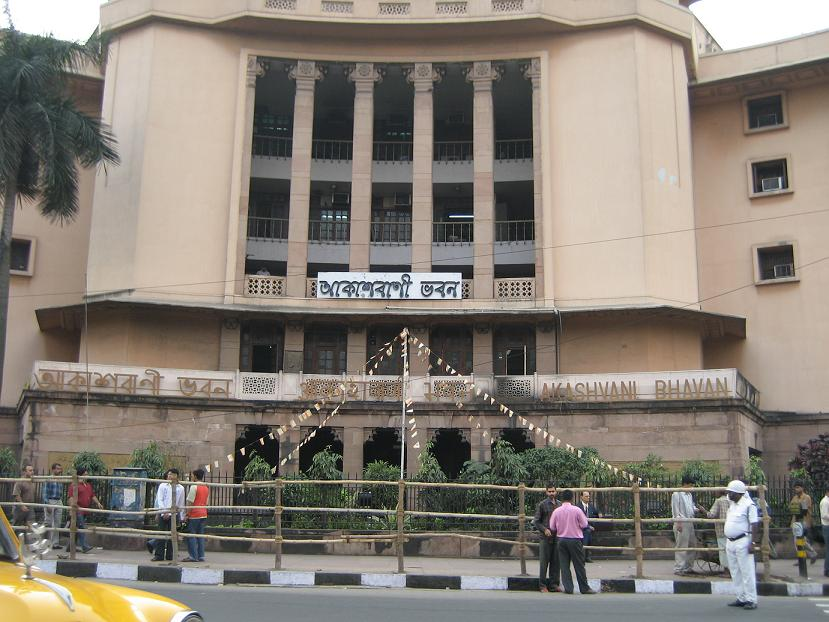

# ಅಖಿಲ ಭಾರತ ಬಾನುಲಿ ಕೇಂದ್ರ

*All India Radio*

| Col1 |
| --- |
|  |
| Type |
| Country |
| Availability |
| Founded |
| Owner |
| Launch date |
| Official website |

*ಭಾರತದ, ದೆಹಲಿಯಲ್ಲಿರುವ ಆಕಾಶವಾಣಿ ಭವನ AIR ನ ಪ್ರಧಾನ ಕಾರ್ಯಾಲಯವಾಗಿದೆ.*

*ಕರ್ನಾಟಕದ,ಮಂಗಳೂರಿನಲ್ಲಿರುವ AIR ನ ಟವರ್*

ಆಲ್ ಇಂಡಿಯಾ ರೇಡಿಯೋ ( ಆಲ್ ಇಂಡಿಯಾ ರೇಡಿಯೋ ( AIR ಎಂದು ಸಂಕ್ಷಿಪ್ತ ಗೊಳಿಸಲಾಗಿದೆ)),ವನ್ನು ಅಧಿಕೃತವಾಗಿ ಆಕಾಶವಾಣಿ ಎಂದು ಕರೆಯಲಾಗುತ್ತದೆ ( ದೇವನಾಗರಿಯಲ್ಲಿ : आकाशवाणी, ākāshavānī), ಇದು ಭಾರತದ ರೇಡಿಯೋ ಪ್ರಸಾರ ಮಾಧ್ಯಮವಾಗಿದೆ ಹಾಗು ಪ್ರಸಾರ ಭಾರತೀಯ ವಿಭಾಗವಾಗಿದೆ. ಇದು 1936 [ ೧ ] ರಲ್ಲಿ ಸಂಸ್ಥಾಪಿಸಲಾಯಿತು. ಇಂದು ಇದು ರಾಷ್ಟ್ರೀಯ ದೂರದರ್ಶನ ಪ್ರಸಾರವಾಗಿರುವ, ಪ್ರಸಾರ ಭಾರತೀಯ ದೂರದರ್ಶನದ ಸಹಯೋಗಿಯಂತೆ ಸೇವೆಸಲ್ಲಿಸುತ್ತಿದೆ. 
ಪ್ರಪಂಚದ ದೊಡ್ಡ ರೇಡಿಯೋ ಸಂಪರ್ಕಗಳಲ್ಲಿ ಆಲ್ ಇಂಡಿಯಾ ರೇಡಿಯೋ ಕೂಡ ಒಂದಾಗಿದೆ. ಇದರ ಪ್ರಧಾನ ಕಾರ್ಯಾಲಯವು ನವ ದೆಹಲಿಯ ಆಕಾಶವಾಣಿ ಭವನದಲ್ಲಿದೆ. ಆಕಾಶವಾಣಿ ಭವನ ನಾಟಕ ವಿಭಾಗ, FM ವಿಭಾಗ ಮತ್ತು ರಾಷ್ಟ್ರೀಯ ಸೇವೆಗಳಿಗೆ ಎಡೆಮಾಡಿಕೊಟ್ಟಿದೆ. ದೂರದರ್ಶನ ಕೇಂದ್ರವೂ ( ದೆಹಲಿ ) ಕೂಡ ಆಕಾಶವಾಣಿ ಭವನದ 6 ನೇ ಮಹಡಿಯಲ್ಲಿದೆ.

## ಇತಿಹಾಸ

ಬಾಂಬೆಯ ರೇಡಿಯೋ ಕ್ಲಬ್ 1923 ರಲ್ಲಿ ಪ್ರಾರಂಭಿಸಲಾದ ಬ್ರಿಟಿಷ್ ಇಂಡಿಯಾ ಪ್ರಸಾರಭಾರತೀಯಲ್ಲಿ ಬ್ರಾಡ್ ಕಾಸ್ಟಿಂಗ್ ನಲ್ಲಿನ ಕಾರ್ಯಕ್ರಮಗಳು ಇನ್ನಿತರ ರೇಡಿಯೊ ಕ್ಲಬ್ ಗಳೊಂದಿಗೆ ಪ್ರಸಾರವಾಗುತ್ತಿದ್ದವು. 1926 ರ ಒಪ್ಪಂದದಿಂದಾಗಿ ಖಾಸಗಿ ಇಂಡಿಯನ್ ಬ್ರಾಡ್ ಕಾಸ್ಟಿಂಗ್ ಕಂಪೆನಿ (ಭಾರತೀಯ ಪ್ರಸಾರ ಕೇಂದ್ರ)(IBC) ಎರಡು ರೇಡಿಯೋ ಕೇಂದ್ರಗಳನ್ನು ನಡೆಸಲು ಅನುಮತಿ ಪಡೆದುಕೊಂಡಿತು; ಬಾಂಬೆ ಕೇಂದ್ರವನ್ನು 1927 ರ ಜುಲೈ 23 ರಂದು ಉದ್ಘಾಟಿಸಲಾಯಿತು. ಕೋಲ್ಕತ್ತ ಕೇಂದ್ರ ವನ್ನು 1927 ರ ಆಗಸ್ಟ್ 26 ರಂದು ಆರಂಭಿಸಲಾಯಿತು. ಆದರೆ 1930 ರ ಮಾರ್ಚ್ 1 ರಂದು ಈ ಕಂಪನಿಯನ್ನು ಮುಚ್ಚಲಾಯಿತು. ಇದರಿಂದಾಗಿ ಸರ್ಕಾರ ಪ್ರಸಾರ ಹಕ್ಕಿನ ಸೌಲಭ್ಯಗಳನ್ನು ವಶಪಡಿಸಿಕೊಳ್ಳುವ ಮೂಲಕ 1930 ರ ಏಪ್ರಿಲ್ 1 ರಂದು (ಪ್ರಾಯೋಗಿಕ ಆಧಾರದ ಮೇಲೆ ಎರಡು ವರ್ಷಗಳಿಗಾಗಿ, ಆದರೆ 1932 ರ ಮೇ ಯಿಂದ ಮುಂದುವರೆಸಲಾಯಿತು.) ಇಂಡಿಯನ್ ಸ್ಟೇಟ್ ಬ್ರಾಡ್ ಕಾಸ್ಟಿಂಗ್ ಸರ್ವೀಸ್ (ಭಾರತೀಯ ರಾಜ್ಯ ಪ್ರಸಾರ ಸೇವಾಕೇಂದ್ರ)ಅನ್ನು (ISBS) ಪ್ರಾರಂಭಿಸಿತು. 1936 ರ ಜೂನ್ 8 ರಂದು ISBS ಅನ್ನು ಆಲ್ ಇಂಡಿಯಾ ರೇಡಿಯೋ (AIR; 1956 ರಿಂದ ಆಕಾಶವಾಣಿ ಎಂದು ಕೂಡ ಕರೆಯಲಾಗುತ್ತದೆ.) ಎಂದು ಪುನರ್ನಾಮಕರಣ ಮಾಡಲಾಯಿತು. 1939 ರ ಅಕ್ಟೋಬರ್ 1 ರಂದು ಬಾಹ್ಯ ಸೇವೆ ಯನ್ನೂ ಆರಂಭಿಸಲಾಯಿತು (ಪುಷ್ತು ನಲ್ಲಿ ಆರಂಭಿಸಲಾದ ಪ್ರಸಾರದ ಜೊತೆಯಲ್ಲಿ); ಇದನ್ನು ಜರ್ಮನಿಯಿಂದ ರೇಡಿಯೋ ಮರು ಪ್ರಚಾರವೆಂದು ಕರೆಯಲಾಯಿತು. ಇದು ಆಫ್ಘಾನಿಸ್ತಾನ, ಇರಾನ್ ಮತ್ತು ಅರಬ್ ರಾಷ್ಟ್ರಗಳಿಗೆ ನಿರ್ದೇಶಿಸಲ್ಪಟ್ಟಿದೆ. 1947 ರಲ್ಲಿ ಭಾರತ ಸ್ವತಂತ್ರ ರಾಷ್ಟ್ರವಾದಾಗ, AIR ಸಂಪರ್ಕವ್ಯವಸ್ಥೆ ಕೇವಲ ಆರು ಸ್ಟೇಷನ್ ಗಳನ್ನು ಮಾತ್ರ ಹೊಂದಿತ್ತು: ದೆಹಲಿ, ಬಾಂಬೆ, ಕೋಲ್ಕತ್ತ, ಮೆಡ್ರಾಸ, ಲಕ್ನೋ, ಮತ್ತು ತಿರುಚಿ; ಆಗ ಒಟ್ಟು 275,000 ರೇಡಿಯೋ ಸೆಟ್ಟುಗಳಿದ್ದವು. 1957 ರ ಅಕ್ಟೋಬರ್ 3 ರಂದು ಸಂಪೂರ್ಣ ಗೊಳಿಸಲು ವಿವಿಧ ಭಾರತಿ ಕೇಂದ್ರ ವನ್ನು 'ರೇಡಿಯೋ ಸಿಲೊನ್' ನೊಡನೆ ಆರಂಭಿಸಲಾಯಿತು. ದೂರದರ್ಶನ ಪ್ರಸಾರವನ್ನು AIR ನ ಭಾಗವೆಂಬಂತೆ ದೆಹಲಿಯಲ್ಲಿ 1959 ರಲ್ಲಿ ಪ್ರಾರಂಭಿಸಲಾಯಿತು. ಆದರೆ 1976 ರ ಏಪ್ರಿಲ್ 1 ರಂದು ರೇಡಿಯೋ ದಿಂದ ದೂರದರ್ಶನವೆಂದು ಕರೆದು ಇದನ್ನು ಪ್ರತ್ಯೇಕಿಸಲಾಯಿತು. [ ೨ ] FM ಪ್ರಸಾರವನ್ನು ಮೆಡ್ರಾಸ್ ನಲ್ಲಿ(ಈಗಿನ ಚೆನ್ನೈ) 1977 ರ ಜುಲೈ 23 ರಂದು ಆರಂಭಿಸಲಾಯಿತು. ಅದನ್ನು 1990 ರ ಹೊತ್ತಿಗೆ ಇನ್ನಷ್ಟು ವಿಸ್ತರಿಸಲಾಯಿತು. [ ೩ ]

## ಸೇವೆಗಳು

AIR ಅನೇಕ, ವಿಭಿನ್ನ ಸೇವೆಗಳನ್ನು ಹೊಂದಿದೆ.ಅಲ್ಲದೇ ಭಾರತದುದ್ದಕ್ಕೂ ವಿವಿಧ ಪ್ರದೇಶಗಳಿಗೆ/ಭಾಷೆಗಳಿಗೆ ಪ್ರತಿಯೊಂದು ಸೇವೆಯನ್ನು ಒದಗಿಸಿದೆ. AIR ಅತ್ಯಂತ ಜನಪ್ರಿಯಾ ಸೇವಾವಿಭಾಗಗಳಲ್ಲಿ ವಿವಿಧ ಭಾರತಿ ಪ್ರಸಾರ ಕೇಂದ್ರ ವೂ ಒಂದಾಗಿದೆ (ಸ್ಥೂಲವಾಗಿ "ಬಹು-ಭಾರತದ ಸೇವಾ ವಿಭಾಗ" ವೆಂದು ಅನುವಾದಿಸಲಾಗಿದೆ). ವಿವಿಧ ಭಾರತಿ ಅದರ ಸುವರ್ಣ ಮಹೋತ್ಸವವನ್ನು 2007 ರ ಅಕ್ಟೋಬರ್ 3 ರಂದು ಆಚರಿಸಿಕೊಂಡಿತು. ಕೇವಲ ವಿವಿಧ ಭಾರತಿ ಮಾತ್ರ ದತ್ತಾಂಶ ಆಧಾರಿತ ಹಾಡುಗಳನ್ನು ಒಳಗೊಂಡಿದೆ. ಈ ಹಾಡುಗಳು ಹಿಂದಿ ಚಲನಚಿತ್ರ ಸಂಗೀತದ "ಸುವರ್ಣ ಯುಗ" ವೆಂದು ಕರೆಯಲಾದ ಕಾಲಕ್ಕೆ ಸೇರಿರುವ ಹಾಡುಗಳನ್ನು ಹೊಂದಿದೆ.(ಸ್ಥೂಲವಾಗಿ 1940 ರಿಂದ 1980 ರ ವರೆಗಿನ ಹಾಡುಗಳು). ಈ ಸೇವೆ ಎಲ್ಲಾ ಸೇವೆಗಳಿಗಿಂತ ಅತ್ಯಂತ ವಾಣಿಜ್ಯವಾಗಿದೆ. ಅಲ್ಲದೇ ಇದು ಮುಂಬಯಿ ಮತ್ತು ಭಾರತದ ಇತರ ನಗರಗಳಲ್ಲಿ ಜನಪ್ರಿಯವಾಗಿದೆ. ಈ ಸೇವೆ ವಾರ್ತೆ, ಚಲನಚಿತ್ರ ಸಂಗೀತ, ಹಾಸ್ಯ ಕಾರ್ಯಕ್ರಮ ಇತ್ಯಾದಿಗಳನ್ನು ಒಳಗೊಂಡಂತೆ ವಿಶಾಲ ವ್ಯಾಪ್ತಿಯ ಕಾರ್ಯಕ್ರಮಗಳಿಗೆ ಅವಕಾಶನೀಡಿದೆ. ವಿವಿಧ ಭಾರತಿ ಕೇಂದ್ರ, ಕೆಳಗೆ ಹೆಸರಿಸಲಾದ ಪ್ರತಿಯೊಂದು ನಗರಗಳಿಗೆ ವಿಭಿನ್ನವಾದ MW ಬ್ಯಾಂಡ್ ಫ್ರೀಕ್ವೆನ್ಸೀಸ್(ಆವರ್ತನಗಳ ಸಮೂಹ) ಅನ್ನು ನೀಡುತ್ತಿದೆ. 
ವಿವಿಧ ಭಾರತೀಯಲ್ಲಿ ಪ್ರಸಾರವಾಗುವ ಕೆಲವು ಕಾರ್ಯಕ್ರಮಗಳು:

- ಹವಾ-ಮಹಲ್ - ಕೆಲವು ಕಾದಂಬರಿಗಳು/ನಾಟಕಗಳಾಧಾರಿತ ಲಘುಕೃತಿ (ರೇಡಿಯೋ ನಾಟಕ).
- ಸ್ಯಾಂಟೊಜಿನ್ ಕಿ ಮೆಹಫಿಲ್ - ಹಾಸ್ಯಗಳು ಮತ್ತು ವಿನೋದ.

ಇತರ ಸೇವೆಗಳು ಈ ಕೆಳಕಂಡವುಗಳನ್ನು ಒಳಗೊಂಡಿವೆ:

- ಪ್ರಧಾನ ಚಾನಲ್ (ಪ್ರಾದೇಶಿಕ - 115 ಕೇಂದ್ರಗಳು [ ೪ ] )
- ಸ್ಥಳೀಯ ರೇಡಿಯೋ ಸೇವೆ (83 ಕೇಂದ್ರಗಳು)
- ರಾಷ್ಟ್ರೀಯ ಚಾನಲ್ Archived 2010-09-22 ವೇಬ್ಯಾಕ್ ಮೆಷಿನ್ ನಲ್ಲಿ. (ರಾತ್ರಿಯ ಹೊತ್ತಿನಲ್ಲಿ; 1988 ರ ಮೇ 18 ರಂದು ಪ್ರಾರಂಭಿಸಲಾಯಿತು; ನಾಗ್ ಪುರ್ ನಿಂದ ಪ್ರಮುಖ ಫ್ರೀಕ್ವೆನ್ಸಿ(ಪ್ರಧಾನ ಆವರ್ತನ)1566 kHz )
- ಸ್ಥಳೀಯ ಸುದ್ಧಿ ಸೇವೆ Archived 2010-09-22 ವೇಬ್ಯಾಕ್ ಮೆಷಿನ್ ನಲ್ಲಿ. (ಅಲ್ಲದೇ newsonair.com Archived 2012-06-21 ವೇಬ್ಯಾಕ್ ಮೆಷಿನ್ ನಲ್ಲಿ. ನ ಮೂಲಕವೂ ಕೂಡ)
- 27 ಭಾಷೆಗಳಲ್ಲಿ ಬಾಹ್ಯ ಸೇವೆಗಳು Archived 2012-04-16 ವೇಬ್ಯಾಕ್ ಮೆಷಿನ್ ನಲ್ಲಿ.
- ನಾಟಕದ ಕೇಂದ್ರ ಘಟಕ: ಇದು ಆಲ್ ಇಂಡಿಯಾ ರೇಡಿಯೋದ ಪ್ರಧಾನ ನಿರ್ಮಾಣ ಘಟಕವಾಗಿದ್ದು. ಉತ್ತಮ ಗುಣಮಟ್ಟದ ಕಾರ್ಯಕ್ರಮವನ್ನು ನಿರ್ಮಿಸುವ ಜವಾಬ್ದಾರಿಯನ್ನು ಹೊಂದಿದೆ. ಇದು ಆಟಗಳ ಮತ್ತು ಸರಣಿ ಆಟಗಳ ರಾಷ್ಟ್ರೀಯ ಕಾರ್ಯಕ್ರಮವನ್ನು ಪ್ರಸಾರಮಾಡುವ ಜವಾಬ್ದಾರಿಯನ್ನು ಹೊತ್ತಿರುತ್ತದೆ. ಚಿರಂಜೀತ್, ಸತ್ಯೆಂದರ್ ಶರತ್, ನಿರ್ಮಲ ಅಗರವಾಲ್ ಮತ್ತು ಡ್ಯಾನಿಷ್ ಇಕ್ಬಾಲ್ ನಂತಹ ಪ್ರಖ್ಯಾತ ವ್ಯಕ್ತಿಗಳು ಮತ್ತು ನಾಟಕಗಾರರು ನಿರ್ಮಾಪಕರಾಗಿ CDU ನೊಂದಿಗೆ ಸಂಬಂಧಹೊಂದಿದ್ದಾರೆ. CDU ನಿಂದ ನಿರ್ಮಿಸಲಾಗುವ ನಾಟಗಳನ್ನು ಅನುವಾದಿಸಿ ಪ್ರಾದೇಶಿಕ ಕೇಂದ್ರಗಳಲ್ಲಿ ಬಿತ್ತರ ಮಾಡಲಾಗುತ್ತದೆ. ಇದು ಪ್ರಸ್ತುತದಲ್ಲಿ ರೇಡಿಯೋ ನಾಟಕವನ್ನು ನೀಡುತ್ತಿರುವ ಏಕಮಾತ್ರ ನಿರ್ಮಾಣ ಘಟಕವಾಗಿದೆ. 60ರ ಹೊತ್ತಿನ ಇದರ ಆರಂಭದ ಕಾಲದಿಂದ ಈ ಘಟಕ 1500 ಕ್ಕಿಂತ ಹೆಚ್ಚು ನಾಟಕಗಳನ್ನು ನಿರ್ಮಿಸಿದೆ. ಪ್ರಸ್ತುದಲ್ಲಿ CDU ಹಳೆಯ ಮೂಲ ಪ್ರತಿಯನ್ನು(ಕಥಾವಸ್ತು) ಮತ್ತು ನಿರ್ಮಾಣಗಳನ್ನು ಹೊಂದಿರುವ ಅಮೂಲ್ಯ ಭಂಡಾರವಾಗಿದೆ.
- FM ಚಾನಲ್ ಗಳು ( FM ರೇನ್ ಬೋ Archived 2010-09-22 ವೇಬ್ಯಾಕ್ ಮೆಷಿನ್ ನಲ್ಲಿ. - 12 ಕೇಂದ್ರಗಳು, FM ಗೋಲ್ಡ್ Archived 2010-09-22 ವೇಬ್ಯಾಕ್ ಮೆಷಿನ್ ನಲ್ಲಿ. - 4, FM ಕ್ಲಾಸಿಕಲ್ ಮ್ಯೂಸಿಕ್ Archived 2010-09-22 ವೇಬ್ಯಾಕ್ ಮೆಷಿನ್ ನಲ್ಲಿ./ಅಮೃತ ವರ್ಷಿಣಿ- 1)

AIR ಸೇವಾವಿಭಾಗಗಳ ಭಾಗಶಃ ಪಟ್ಟಿಯನ್ನು ಕೆಳಕಂಡಂತೆ ನೀಡಲಾಗಿದೆ.

## ಸೇವೆಗಳು

### ಪೂರ್ವ ಪ್ರಾದೇಶಿಕ ಸೇವಾವಿಭಾಗ

*ಆಲ್ ಇಂಡಿಯಾ ರೇಡಿಯೋದ ಕೋಲ್ಕತ್ತ ಕೇಂದ್ರ*

- ಭಾಗಲ್ ಪುರ್ 1458 kHz (ಕಿಲೋ ಹಾರ್ಡ್ಜ್)
- ಕಟಕ್ 'A ' 972 kHz
- ದರ್ಭಾಂಗ್ 1296 kHz
- ಜೆಮ್ ಶೆಡ್ ಪುರ 1544kHs
- ಕೋಲ್ಕತ್ತ 'A ' 657 kHz
- ಕೋಲ್ಕತ್ತ 'B ' 1008 kHz
- ಕೋಲ್ಕತ್ತ 'C ' 1323 kHz
- ಪಾಟ್ನಾ 'A ' 621 kHz
- ರಾಂಚಿ 'A ' 549 kHz
- AIR FM ಕೋಲ್ಕತ್ತ ಎರಡು ಕೇಂದ್ರ ಗಳನ್ನು ಹೊಂದಿದೆ. 107FM ರೇನ್ ಬೋ ಮತ್ತು 100.2FM ಗೋಲ್ಡ್.

## ಸೇವೆಗಳು

### ಈಶಾನ್ಯ ಪ್ರಾದೇಶಿಕ ಸೇವಾವಿಭಾಗ

- ಅಗರ್ತಲಾ 1269 kHz
- ಗೌಹಾತಿ 'A ' 729 kHz
- ಶಿಲಾಂಗ್ 864 kHz

## ಸೇವೆಗಳು

### ಪಶ್ಚಿಮ ಪ್ರಾದೇಶಿಕ ಸೇವಾವಿಭಾಗ

- ಅಹಮದಾಬಾದ್ 'A ' 846 KHZ
- ಜೌರಂಗಾಬಾದ್ 1521 kHz
- ಭೋಪಾಲ್ 'A ' 1593 kHz
- ಚಿಂದಾವರ 102.02 MHz
- ಚಾತರ್ಪುರ್ 675 kHz
- ಗ್ವಾಲಿಯರ್ 1386 kHz
- ಇಂದೋರ್ 'A ' 648 kHz
- ಜಲ್ಗಾನ್ 963 kHz
- ಮುಂಬಯಿ 'A ' 1044 kHz
- ಮುಂಬಯಿ 'B ' 558 kHz
- ನಾಗ್ ಪುರ್ 'A ' 585 kHz
- ಪಣಜಿ 'A ' 1287 kHz
- ಪೂಣೆ 'A ' 792 kHz
- ರಾಜ್ ಕೋಟ್ 'A ' 810 kHz
- ರತ್ನಗಿರಿ 1143 kHz
- ಶೋಲಾಪುರ್ 1602 kHz
- ಸಾಂಗ್ಲಿ 1251 kHz

## ಸೇವೆಗಳು

### ದಕ್ಷಿಣ ಪ್ರಾದೇಶಿಕ ಸೇವಾವಿಭಾಗ

- ಆದಿಲಾಬಾದ್ 1485 kHz
- ಬೆಂಗಳೂರು 'A ' 612 kHz
- ಚೆನೈ 'A ' 720 kHz
- ಕೊಯಂಬತ್ತೂರ್ 999 kHz
- ಗುಲ್ಬರ್ಗಾ 1107 kHz
- ಹೈದ್ರಾಬಾದ್ 'A ' 738 kHz
- ಹೈದ್ರಾಬಾದ್ 'B ' 1377 kHz
- ಕೋಳಿಕೋಡ್ 'A ' 684 kHz
- ಮದುರೈ 1269 kHz
- ನಗೆರ್ ಕೋಯಿಲ್ 101 MHz FM
- ಉದಗಮಂಡಲಂ 1602 kHz,187.2meter(wave length)(ತರಾಂಗಾಂತರ)
- ಪಾಂಡಿಚೇರಿ 1215 kHz
- ಪೋರ್ಟ್ ಬ್ಲೇರ್ 684 kHz
- ತಿರುವನಂತಪುರಂ 'A ' 1161 kHz
- ಅನಂತಪುರಿ FM 101.9 MHz (from ತಿರುವನಂತಪುರಂ)
- ತಿರುಚಿನಾಪಳ್ಳಿ 'A ' 936 kHz
- ತಿರುನೆಲ್ ವೆಳ್ಳಿ 1197 kHz
- ವಿಜಯವಾಡ 'A ' 837 kHz
- ವಿಶಾಖಪಟ್ಟಣಂ 927 kHz
- ಗೌತಮ್ 456 kHz
- ಮೈಸೂರು 100.06 MHz

## ಸೇವೆಗಳು

### ಬಾಹ್ಯ ಸೇವೆಗಳು

ಭಾರತದ ಹೊರಗಿರುವ ರಾಷ್ಟ್ರಗಳಿಗೆ 27 ಭಾಷೆಗಳಲ್ಲಿ ಆಲ್ ಇಂಡಿಯಾ ರೇಡಿಯೋ ಪ್ರಸಾರದ ಸೇವೆ ಒದಗಿಸುತ್ತದೆ. ಬಾಹ್ಯ ಸೇವಾವಿಭಾಗ ನೆರೆಯ ರಾಷ್ಟ್ರಗಳನ್ನು ತಲುಪಲು ಮಧ್ಯಮ ಗಾತ್ರದ ತರಂಗ(ಮೀಡಿಯಂ ವೇವ್) ವನ್ನು ಬಳಸಿದರೂ ಕೂಡ,ಪ್ರಧಾನವಾಗಿ ಅಧಿಕ ಸಾಮರ್ಥ್ಯದ ಸಣ್ಣ ತರಂಗ(ಶಾರ್ಟ್ ವೇವ್) ಪ್ರಸಾರವನ್ನು ಬಳಸುತ್ತದೆ. ಭಾಷೆ ಮೂಲಕ ನಿರ್ದಿಷ್ಟ ರಾಷ್ಟ್ರಗಳಿಗೆ ಪ್ರಸಾರ ಸೇವೆ ನೀಡುತ್ತಿರುವುದರ ಜೊತೆಯಲ್ಲಿ ಕಡಲಾಚೆಯ(ಸಾಗರೋತ್ತರ) ಸಾರ್ವತ್ರಿಕ ಸೇವೆಯನ್ನು ಕಲ್ಪಿಸಿಕೊಟ್ಟಿದೆ. ಈ ಸೇವೆಯಲ್ಲಿ ಪ್ರತಿದಿನ 8¼ ಗಂಟೆಗಳ ಕಾಲ ಇಂಗ್ಲೀಷ್ ಭಾಷೆಯಲ್ಲಿ ಕಾರ್ಯಕ್ರಮವನ್ನು ಪ್ರಸಾರ ಮಾಡಲಾಗುತ್ತದೆ.ಅಲ್ಲದೇ ಅಂತರರಾಷ್ಟ್ರೀಯ ಸರ್ವೇಸಾಮಾನ್ಯ ಶ್ರೋತೃಗಳನ್ನು ಗಮನದಲ್ಲಿಟ್ಟುಕೊಂಡು ಈ ಸೇವೆಯನ್ನು ನೀಡುತ್ತಲಿದೆ.

## ಸೇವೆಗಳು

### ಯುವ-ವಾಣಿ : ಯುವಜನ ವಾಣಿ

AIR ನ ಯುವ-ವಾಣಿ ಸೇವೆ( 1969 ರ ಜುಲೈ 21ರಂದು ಪ್ರಾರಂಭಿಸಲಾಯಿತು), ಯುವಜನರು ಪಾಲ್ಗೊಳ್ಳುವುದನ್ನು ಪ್ರೋತ್ಸಾಹಿಸುವ ಮೂಲಕ ಹಾಗು ವಿಭಿನ್ನ ಕಥಾವಸ್ತುಗಳ ವೈಚಾರಿಕತೆ ಮೇಲೆ ಪ್ರಯೋಗ ಮಾಡುವ ಮೂಲಕ ಉತ್ತಮ ಮತ್ತು ಶ್ರೇಷ್ಠ ಮಟ್ಟದ ರೇಡಿಯೋ ಅನುಭವವನ್ನು ಮೂಡಿಸಿದೆ. ಇದು 1017 kHz ರಲ್ಲಿ ಪ್ರಸಾರವಾಗುತ್ತದೆ. ಅದಲ್ಲದೇ 294.9 ಮೀಟರ್ ನ ಅನುರೂಪವಾಗಿದೆ. ಪ್ರತಿದಿನದ ಸಂಜೆಯ ವೇಳೆಗೆ ಇದರ ಪ್ರಸಾರವನ್ನು ನಿಗದಿಪಡಿಸಲಾಯಿತು. ಆದರೆ ಮೂರು ದಶಕಗಳಿಂದ ಇರುವ ಅನಿರೀಕ್ಷಿತವಾಗಿ ಪ್ರಸಾರ ಮಾಡಬೇಕಾಗುವ ಕಾರ್ಯಕ್ರಮಗಳ ಒತ್ತಡದಿಂದಾಗಿ ಹಾಗು "ಸಂಚಾರಿ ಮೈಕ್ರೋಫೋನ್"(ಧ್ವನಿ ವರ್ಧಕ)ನಿಂದಾಗಿ ಇದನ್ನು ನಿಗದಿತ ವೇಳೆಗೆ ಪ್ರಸಾರಮಾಡಲಾಗುತ್ತಿಲ್ಲ. ಯುವ-ವಾಣಿ ಕಾರ್ಯಕ್ರಮಗಲ್ಲ್ಲಿ ಅದರದೇ ಆದ ಶಾಶ್ವತ ಸ್ಥಾನವನ್ನು ಇನ್ನೂ ಹೊಂದಿದೆ. 
ಭಾರತದ ಸಮೂಹ ಮಾಧ್ಯಮದಲ್ಲಿರುವ ಕೆಲವು ಪ್ರಖ್ಯಾತ ವ್ಯಕ್ತಿಗಳು ಯುವ-ವಾಣಿಯೊಂದಿಗೆ ತಮ್ಮ (ವೃತ್ತಿಜೀವನದ) ಪಯಣವನ್ನು ಪ್ರಾರಂಭಿಸಿದ್ದರು. ಪ್ರಖ್ಯಾತ ಸಾಕ್ಷ್ಯಚಿತ್ರ ತಯಾರಕ ಪ್ರಫುಲ್ ಥಕ್ಕರ್, ಅವರ - "ಯುವ-ವಾಣಿ ಕಾರ್ಯಕ್ರಮ ನಮ್ಮ ಕಾಲೇಜು ದಿನಗಳಲ್ಲಿ ಜವಾಬ್ದಾರಿ ಕಲಿಸುವ ಹೊಸಗಾಳಿ(ತಾಜಾಗಾಳಿ)ಯ ಉಸಿರಿನಂತೆ ನಮ್ಮೊಳಗೆ ಪ್ರವೇಶಿಸಿತು. ಇದು ನನಗೆ ಅತ್ಯಂತ ಅದ್ಭುತ ಕಲಿಕೆಯ ಅನುಭವವಾಗಿತ್ತು. ಅದಲ್ಲದೇ ರೇಡಿಯೋ ಕೇವಲ ಅವಿವೇಕದ ಉಲ್ಲೇಖಗಳು ಮತ್ತು PJ ಗಳು ಮಾತ್ರವಲ್ಲ ಎಂಬುದನ್ನು ನನಗೆ ಮನವರಿಕೆ ಮಾಡಿಕೊಟ್ಟಿತು" ಎಂದು ಹೇಳಿದ್ದಾರೆ.
ಹಿಂದೆ ಯುವ-ವಾಣಿಯೊಂದಿಗೆ ಹಲವಾರು ಹೆಸರುಗಳು ತಳಿಕು ಹಾಕಿಕೊಂಡಿದ್ದವು. ಅದರಲ್ಲಿ ಹೆಸರಿಸಲಾಗುವ ಇತರ ಕೆಲವೊಂದು ಪ್ರಮುಖ ಹೆಸರುಗಳು ಪ್ರಖ್ಯಾತ ಗೇಮ್ ಪ್ರದರ್ಶನಗಳ ನಿರೂಪಕ ರೋಶನ್ ಅಬ್ಬಾಸ್, VJ ಗೌರವ್ ಕಪೂರ್, ಎಮ್ಸಿ ಕ್ಷಿತಿಜ್ ಶರ್ಮ ಮತ್ತು DJ ಪ್ರಥಮ್ ಇವರುಗಳ ಹೆಸರುಗಳನ್ನು ಒಳಗೊಂಡಿದೆ.

## ಸೇವೆಗಳು

### ದೂರವಾಣಿ ಮೂಲಕ ಸುದ್ದಿ ಬಿತ್ತರಿಸುವ ಸೇವೆ

ಆಲ್ ಇಂಡಿಯಾ ರೇಡಿಯೋ, ದೂರವಾಣಿಯ ಮೂಲಕ ವಾರ್ತಾ ಸೇವೆಯನ್ನು ನವ ದೆಹಲಿಯಿಂದ 1998 ರ ಫೆಬ್ರವರಿ 25 ರಂದು ಪ್ರಾರಂಭಿಸಿದ ನಂತರ ಈ ಸೇವೆಯನ್ನು ಚೆನೈ, ಮುಂಬಯಿ, ಹೈದ್ರಾಬಾದ್, ಇಂದೋರ್, ಪಾಟ್ನಾ ಮತ್ತು ಬೆಂಗಳೂರಿನಿಂದ ನಡೆಸುತ್ತಿದೆ. ಈ ಸೇವೆಯನ್ನು STD, ISD ಅಥವಾ ಸ್ಥಳೀಯ ದೂರವಾಣಿ ಕರೆಗಳ ಮೂಲಕ ಪಡೆಯಬಹುದು. ಈ ಸೇವೆಯನ್ನು ಮುಂದೆ ಹೆಸರಿಸಲಾದ 9 ನಗರಗಳಲ್ಲಿ ಸ್ಥಾಪಿಸುವ ಯೋಜನೆಯನ್ನು ಹೊಂದಿದೆ — ಅಹಮದಾಬಾದ್, ಭೋಪಾಲ್ ಗೌಹಾತಿ, ಗ್ವಾಲಿಯರ್, ಜಬಲ್ ಪುರ್, ಜೈಪುರ್,ಕೋಲ್ಕತ್ತ, ಲಕ್ನೋ, ರಾಂಚಿ, ಶಿಮ್ಲಾ ಮತ್ತು ಸದ್ಯದಲ್ಲೇ ತಿರುವನಂತಪುರಂ.
ಇಂಗ್ಲೀಷ್ ಮತ್ತು ಹಿಂದಿ ಭಾಷೆಯಲ್ಲಿ ಪ್ರತಿಗಂಟೆಗೆ ಪ್ರಸಾರವಾಗುವ ಸುದ್ಧಿ ಸಂಗ್ರಹಗಳನ್ನು ನೇರವಾಗಿ http://www.newsonair.com Archived 2012-06-21 ವೇಬ್ಯಾಕ್ ಮೆಷಿನ್ ನಲ್ಲಿ.. ವೆಬ್ ಸೈಟ್ ನಲ್ಲಿ ಆಲಿಸಬಹುದು. ಸೈಟ್ ನಿಂದ MP3 ಕ್ರಮವ್ಯವಸ್ಥೆಯಲ್ಲಿ ಸುದ್ದಿಯನ್ನು ನೇರವಾಗಿ ಕೇಳಬಹುದಾಗಿದೆ. ಫೈಲ್ ಹೆಸರಿನಲ್ಲಿ ಪ್ರತಿಗಂಟೆಯ ಸುದ್ಧಿಯನ್ನು ತಿಳಿಸಲಾಗಿರುತ್ತದೆ. ಇಂಗ್ಲೀಷ್ ಮತ್ತು ಹಿಂದಿ ಸುದ್ಧಿ ಸಂಗ್ರಹದ ವಿಷಯವನ್ನು http://www.newsonair.com/BulletinsInd.html Archived 2006-09-02 ವೇಬ್ಯಾಕ್ ಮೆಷಿನ್ ನಲ್ಲಿ.. ವೈಬ್ ಸೈಟ್ ನಿಂದ ಓದಬಹುದು. http://www.newsonair.com/index_regional.htm Archived 2007-11-14 ವೇಬ್ಯಾಕ್ ಮೆಷಿನ್ ನಲ್ಲಿ. ವೈಬ್ ಸೈಟ್ ನಿಂದ AIR ಸುದ್ಧಿ ಸಂಗ್ರಹಗಳು 9 ಪ್ರಾದೇಶಿಕ ಭಾಷೆಗಳಲ್ಲಿವೆ(ತಮಿಳು, ಕನ್ನಡ, ಗುಜರಾತಿ, ಬೆಂಗಾಲಿ, ಮರಾಠಿ, ಈಶಾನ್ಯ, ಪಂಜಾಬಿ, ತೆಲುಗು, ಉರ್ದು).

## ವಿವಾದ

ಇದರ ಆಜಾದ್ ಹಿಂದ್ ರೇಡಿಯೋ ಮೂಲಕ ಇದು ನಿರಂತರವಾಗಿ ಪ್ರಸಾರವಾಗುತ್ತಿದ್ದ ಸಂದರ್ಭದಲ್ಲಿ, ಸುಭಾಷ್ ಚಂದ್ರ ಬೋಸ್ ಸ್ವಾತಂತ್ರ್ಯ ಪೂರ್ವದ AIR ಅನ್ನು ಆಂಟಿ ಇಂಡಿಯನ್ ರೇಡಿಯೋ ವನ್ನು ಸೂಚಿಸಲು ಬಳಸುತ್ತಿದ್ದರು.

## ವಿವಾದ

### ಹೆಚ್ಚಿನ ಮಾಹಿತಿ

- ಮೈಸೂರು ವಿಶ್ವವಿದ್ಯಾನಿಲಯ ವಿಶ್ವಕೋಶ/ಭಾರತದ ಆಕಾಶವಾಣಿ ಮತ್ತು ದೂರದರ್ಶನ ಕೇಂದ್ರಗಳು
- ಆಕಾಶವಾಣಿಯು ಈಗ ಇಟ್ಟಿರುವ ಕೆಟ್ಟ ಹೆಜ್ಜೆಗಳನ್ನು ಹಿಂಪಡೆಯುವುದು ಔಚಿತ್ಯಪೂರ್ಣ;;;ವಿಶ್ಲೇಷಣೆ: ಬಹುತ್ವಕ್ಕೆ ಮಾರಕವಾಗುತ್ತಿದೆ ಆಕಾಶವಾಣಿ;;;ಡಾ. ಬಸವರಾಜ ಸಾದರ Updated: 17 ಏಪ್ರಿಲ್ 2021 ,

## ಬಾಹ್ಯ ಕೊಂಡಿಗಳು

- ಆಲ್ ಇಂಡಿಯಾ ರೇಡಿಯೋ ವೆಬ್-ಸೈಟ್ Archived 2010-11-16 ವೇಬ್ಯಾಕ್ ಮೆಷಿನ್ ನಲ್ಲಿ.
- ನೋ ಇಂಡಿಯಾ: ರೇಡಿಯೋ
- AIR'ಸ್ ಫ್ರೀಕ್ವೆನ್ಸಿ ಸ್ಕೆಡ್ಯೂಲ್ Archived 2009-08-27 ವೇಬ್ಯಾಕ್ ಮೆಷಿನ್ ನಲ್ಲಿ.
- ಆಲ್ ಇಂಡಿಯಾ ರೇಡಿಯೋ (AIR) ಕೇಂದ್ರ ಫ್ರೀಕ್ವೇನ್ಸೀಸ್ (ನ್ಯಾಷನಲ್/ಇಂಟರ್ ನ್ಯಾಷನಲ್) Archived 2014-06-05 ವೇಬ್ಯಾಕ್ ಮೆಷಿನ್ ನಲ್ಲಿ.
- ಚಿಲ್ಡ್ರನ್ಸ್ ವಿಂಗ್ ಆಫ್ ಆಲ್ ಇಂಡಿಯಾ ರೇಡಿಯೋ
- ಆಕಾಶವಾಣಿಯು ಈಗ ಇಟ್ಟಿರುವ ಕೆಟ್ಟ ಹೆಜ್ಜೆಗಳನ್ನು ಹಿಂಪಡೆಯುವುದು ಔಚಿತ್ಯಪೂರ್ಣ;;;ವಿಶ್ಲೇಷಣೆ: ಬಹುತ್ವಕ್ಕೆ ಮಾರಕವಾಗುತ್ತಿದೆ ಆಕಾಶವಾಣಿ;;;ಡಾ. ಬಸವರಾಜ ಸಾದರ Updated: 17 ಏಪ್ರಿಲ್ 2021 ,

---
Source: https://kn.wikipedia.org/wiki/%E0%B2%85%E0%B2%96%E0%B2%BF%E0%B2%B2_%E0%B2%AD%E0%B2%BE%E0%B2%B0%E0%B2%A4_%E0%B2%AC%E0%B2%BE%E0%B2%A8%E0%B3%81%E0%B2%B2%E0%B2%BF_%E0%B2%95%E0%B3%87%E0%B2%82%E0%B2%A6%E0%B3%8D%E0%B2%B0
