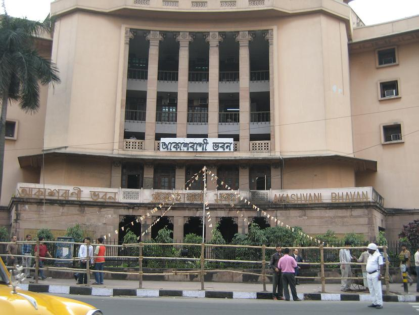

# ആകാശവാണി

*ആകാശവാണിയുടെ ചിഹ്നം*

ഇന്ത്യയിലെ ഔദ്യോഗിക റേഡിയോ പ്രക്ഷേപകരാണ് അഖിലേന്ത്യാ റേഡിയോ (All India Radio), അഥവാ ആകാശവാണി (आकाशवाणी). വാർത്താ വിതരണപ്രക്ഷേപണ മന്ത്രാലയത്തിന്റെ കീഴിൽ ഉള്ള ഒരു സ്വതന്ത്ര സ്ഥാപനമാണിത്. പ്രസാർ ഭാരതി എന്ന സ്ഥാപനത്തിന്റെ കീഴിൽ അഖിലേന്ത്യാ റേഡിയോയും ദൂരദർശനും പ്രവർത്തിക്കുന്നു.

ലോകത്തിലെ തന്നെ ഏറ്റവും വലിയ റേഡിയോ ശൃംഖലകളിൽ ഒന്നാണ് അഖിലേന്ത്യാ റേഡിയോ. ഇന്ത്യൻ പാർലമെന്റിനടുത്തുള്ള ആകാശവാണി ഭവനാണു ആകാശവാണിയുടെ മുഖ്യകാര്യാലയം. തൊട്ടടുത്തുള്ള ബ്രോഡ്കാസ്റ്റിങ്ങ് ഹൗസിൽ നാടക വിഭാഗം, എഫ് എം നിലയം, ദേശീയ പ്രേക്ഷണ വിഭാഗം എന്നിവ പ്രവർത്തിക്കുന്നു. ബ്രിട്ടീഷ് കാലഘട്ടത്തിൽ നിർമിച്ച ഈ കെട്ടിടം ദില്ലിയിലെ പുകൾപെറ്റ കെട്ടിടങ്ങളിൽ ഒന്നാണ്.

## ചരിത്രം

*ഡെൽഹിയിലെ ആകാശവാണിയുടെ പ്രധാനകെട്ടിടം - ആകാശവാണി ഭവൻ എന്ന പേരിലും അറിയപ്പെടുന്നു.*

ഇന്ത്യയിൽ റേഡിയോ പ്രക്ഷേപണം ആരംഭിച്ചത് 1927 -ൽ രണ്ടു സ്വകാര്യ പ്രക്ഷേപണ ഉപകരണങ്ങളുടെ സഹായത്തോടു കൂടെയാണ്. കൽക്കത്തയിലും മുംബൈയിലും ആയിരുന്നു ആദ്യത്തെ സം‌പ്രേക്ഷണം. ഈ നിലയങ്ങൾ 1930 -ൽ ദേശസാൽകരിക്കുകയും, ഇന്ത്യാ പ്രക്ഷേപണ നിലയം (India Broadcasting Service) എന്ന പേരിൽ പ്രവർത്തിക്കുകയും ചെയ്തു. 1936 -ൽ അഖിലേന്ത്യാ റേഡിയോ എന്ന പേര് സ്വീകരിച്ചു. 1957 -ൽ ഔദ്യോഗിക നാമം ആകാശവാണി എന്നാക്കിയെങ്കിലും ഇന്നും ജനകീയമായ പേര് അഖിലേന്ത്യാ റേഡിയോ എന്നു തന്നെയാണ്‌. ഇന്ത്യയുടെ ഏറ്റവും വിദൂര മേഖലകളിൽ പോലും എത്താൻ സാധിക്കുന്നതും, ഏറ്റവും കൂടുതൽ പ്രചാരമുള്ളതുമായ മാധ്യമവും അഖിലേന്ത്യാ റേഡിയോ തന്നെ. ഇന്നു സ്വകാര്യ ചാനലുകളിൽ നിന്നു കടുത്ത മത്സരം നേരിടുന്നെങ്കിലും സംഗീതം , നാടകം , വാർത്ത , കായികം തുടങ്ങിയ പുതിയ ചാനലുകൾ അവതരിപ്പിച്ച് അഖിലേന്ത്യാ റേഡിയോ മത്സരത്തെ അതിജീവിക്കാൻ ശ്രമിക്കുന്നുണ്ട്. സ്വാതന്ത്ര്യം ലഭിച്ച സമയത്ത് ഇന്ത്യയിൽ ആറു റേഡിയോ സ്റ്റേഷനുകളേ ഉണ്ടായിരുന്നുള്ളൂ. ഇന്ത്യക്കു സ്വാതന്ത്ര്യം ലഭിച്ച ശേഷം രൂപം കൊണ്ട ആദ്യത്തെ റേഡിയോ നിലയം വിജയവാഡ നിലയം ആണു. അതിനുമുൻപ് തെലുങ്കു പരിപാടികൾ മദ്രാസ് നിലയത്തിൽ നിന്നു സം‌പ്രേഷണം ചെയ്യുകയായിരുന്നു പതിവ്.
ആകാശവാണി എന്ന പേര് ആദ്യം ബാംഗ്ലൂർ നിലയത്തിൽ നിന്നും കടം കൊണ്ടതാണ്.

## ലഭ്യത

ഇന്ത്യയിലെ 99.37% ജനങ്ങൾക്കും അഖിലേന്ത്യാ റേഡിയോ ലഭിക്കുന്നു. 200 പ്രക്ഷേപണ കേന്ദ്രങ്ങളിലൂടെ 24ഭാഷകളിൽ അഖിലെന്ത്യാ റേഡിയോ പ്രക്ഷേപണം ചെയ്യപ്പെടുന്നു. ടി വി ചാനലുകളുടെ കടന്നു കയറ്റത്തിലും സാധാരണക്കാരന്റെ മാധ്യമമായി അഖിലേന്ത്യാ റേഡിയോ നിലകൊള്ളുന്നു.

## സേവനങ്ങൾ

അഖിലേന്ത്യാ റേഡിയോയ്ക്കു മേഖലാ അടിസ്ഥാ‍നത്തിലും ഭാഷാ അടിസ്ഥാനത്തിലും പല സേവനങ്ങൾ ഉണ്ട്. ഏറ്റവും ജനപ്രിയമായതിൽ ഒന്നാണു് വിവിധ ഭാരതി . ഏറ്റവും വാണിജ്യലാക്കുള്ളതും മുംബൈ മുതലായ സ്ഥലങ്ങളിൽ ഏറ്റവും ജനപ്രിയമായതും വിവിധ ഭാരതി ആണ്. വിവിധ ഭാരതിയിൽ സിനിമാ സംഗീതം, വാർത്ത, തമാശ പരിപാടികൾ, മുതലായവ പ്രക്ഷേപണം ചെയ്യുന്നു. വിവിധ സ്ഥലങ്ങളിൽ വിവിധ ആവൃത്തികളിൽ വിവിധ ഭാരതി പ്രക്ഷേപണം ചെയ്യുന്നു.

രാജ്യത്തെമ്പാടും രജിസ്റ്റർ ചെയ്ത ശ്രോതാക്കൾക്ക് വാർത്തകൾ മൊബൈൽ ഫോണിലെത്തിക്കുന്ന എസ്.എം.എസ്. അധിഷ്ഠിത സർവീസ് ആരംഭിക്കാനുള്ള നടപടിക്രമങ്ങൾ പൂർത്തിയായി വരുന്നു. [ 1 ]

## യുവ വാണി

*കൊൽക്കത്തയിലെ ആകാ‍ശവാണി നിലയം*

യുവവാണി സേവനം യുവാക്കളുടെ പങ്കാളിത്തം പ്രോത്സാഹിപ്പിക്കുന്നതിലൂടെയും പല പുതിയ ആശയങ്ങളും പരീക്ഷിക്കുന്നതിലൂടെയും നവവും വ്യത്യസ്തവുമായ അനുഭവം പ്രദാനം ചെയ്യാനുള്ള ശ്രമമാണ്.
മെഹഫിൽ, ഇൻ ദ് ഗ്രൂവ്, തുഴയുന്ന മൈക്രൊഫോൺ, എന്നിങ്ങനെയുള്ള മുപ്പതു വർഷം പിന്നിട്ട പരിപാടികളിലൂടെ യുവവാണി ഇപ്പോഴും പ്രേക്ഷകരെ നിലനിർത്തുന്നുണ്ട്.
ഇന്ത്യൻ മാധ്യമ രംഗത്തെ പല വലിയ താരങ്ങളും കടന്നു വന്നത് യുവവാണിയിലൂടെ ആണു. പ്രഭുൽ ഥാക്കർ (അറിയപ്പെടുന്ന ഡോക്യുമെന്റ്ററി നിർമാതാവ്) ഇപ്രകാരം പറയുന്നു: “യുവവാണി ഒരു നവ നിശ്വാസമായി ഞങ്ങളുടെ കടിഞ്ഞാൺ ഇല്ലാത്ത കലാലയ ജീവിതത്തിൽ കടന്നു വന്നു. ഇതു എനിക്കു ഒരു വലിയ പാഠമായിരുന്നു, റേഡിയോ തമാശകളും നുറുങ്ങു ചൊല്ലുകളും മാത്രം അല്ല എന്ന് എന്നെ യുവവാണി പഠിപ്പിച്ചു.”

യുവവാണിയുമായി ബന്ധപ്പെട്ട മറ്റുചില പ്രമുഖർ: റോഷൻ അബ്ബാസ് (താരങ്ങളെ പറ്റിയുള്ള പരിപാടി അവതാരകൻ), ഗൌരവ് കപൂർ (ടി വി അവതാരകൻ), കൌശൽ ഖന്ന (ടി വി അവതാരകൻ), പ്രധം , ക്ഷിതിജ് ശർമ്മ (ടി വി അവതാരകർ).

## ടെലിഫോണിൽ വാർത്ത

ഈ സേവനം ദില്ലിയിൽ നിന്ന് 1998 ഫെബ്രുവരി 25 -ന് ആരംഭിച്ചു. ഇപ്പോൾ ചെന്നൈ , ബാംഗ്ലൂർ , ഹൈദരാബാദ് തിരുവനന്തപുരം എന്നിവയുൾപ്പടെ 14 നിലയങ്ങളിൽ ഈ സേവനമുണ്ട്. [ 2 ] വിദൂര, അന്താരാഷ്ട്ര, തദ്ദേശീയ ടെലിഫോണുകളിൽ നിന്ന് ഈ സേവനം ലഭ്യമാകും. ഈ സേവനം ഇപ്പോൾ ഇല്ല

ഇന്റ്റർനെറ്റിൽ നിന്നു ഇംഗ്ലീഷ് , ഹിന്ദി ഭാഷകളിൽ വാർത്തകൾ എല്ലാ മണിക്കൂറിലും എം.പി.3 രൂപത്തിൽ ലഭ്യമാണ്. ( http://www.newsonair.com Archived 2012-06-21 at the Wayback Machine ). ഈ വാർത്തകളുടെ എഴുത്തു പ്രതി ( http://www.newsonair.com/BulletinsInd.html Archived 2006-09-02 at the Wayback Machine ) എന്ന വിലാസത്തിൽ ലഭ്യമാണ്.

ഇന്റ്റർനെറ്റിൽ നിന്നു വാർത്താ പ്രക്ഷേപണങ്ങൾ 9 ഭാഷകളിൽ ലഭ്യമാണ്.

## ഇതും കാണുക

- ആകാശവാണി നിലയങ്ങൾ

## പുറം കണ്ണികൾ

- അഖിലേന്ത്യാ റേഡിയോ വെബ് വിലാസം Archived 2005-07-07 at the Wayback Machine
- ആംഗലേയം, ഹിന്ദി, മറ്റ് ഒൻപതു ഭാഷകൾ എന്നിവയിൽ ഉള്ള തത്സമയ വാർത്താ പ്രക്ഷേപണം Archived 2012-06-21 at the Wayback Machine
- കൊൽകൊത്തയിൽ നിന്നു റേഡിയോയെ പറ്റി ഉളള സ്വകാര്യ സ്ഥലം

- ആകാശവാണിയുടെ ഇംഗ്ലീഷ് വാർത്ത കിട്ടുന്ന ചില ഫോൺ നമ്പരുകൾ:

- ദില്ലി: 011-2332 1259
- ബാംഗ്ലൂർ: 080-22371259
- തിരുവനന്തപുരം: 0471-2335700 / 125800
- മലയാളം: 0471-2335702 / 125900

## അവലംബം

- ↑ "ആകാശവാണിയുടെ വാർത്തകൾ എസ്.എം.എസ്. രൂപത്തിൽ" . Archived from the original on 2013-07-16 . Retrieved 2013-07-16 .
- ↑ "ആർക്കൈവ് പകർപ്പ്" . Archived from the original on 2009-08-07 . Retrieved 2009-09-01 .

---
Source: https://ml.wikipedia.org/wiki/%E0%B4%86%E0%B4%95%E0%B4%BE%E0%B4%B6%E0%B4%B5%E0%B4%BE%E0%B4%A3%E0%B4%BF
