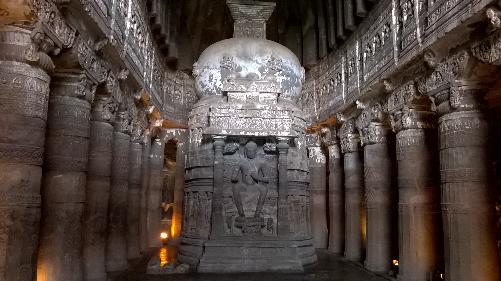
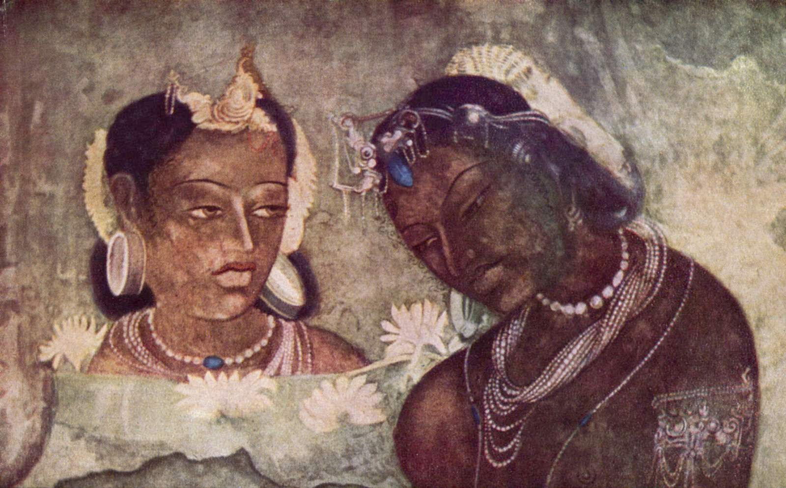
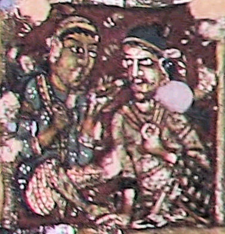
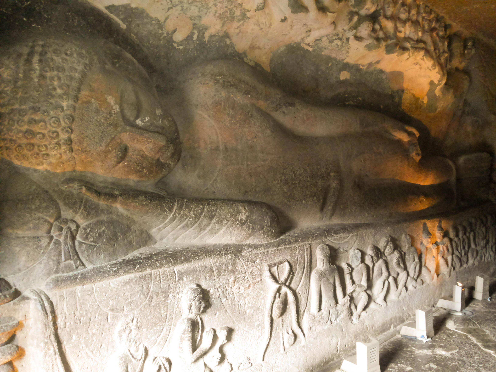

# अजिंठा लेणी

*अजिंठा लपवा*

| Col1 |
| --- |
| स्थापत्यकला, शिल्पकला व चित्रकलेसाठी जगप्रसिद्ध लेणी. |
| माध्यमे अपभारण करा |
| विकिपीडिया |
| प्रकार |
| चा आयाम |
| स्थान |
| वारसा अभिधान |
| स्थापना |
| क्षेत्र |
| Wikimedia | © OpenStreetMap २०° ३३′ १२.३″ N, ७५° ४२′ ०१.७″ E |
| लपवा अधिकार नियंत्रण Q184427 एलसीसीएन ओळखण: sh95005354 बीएनएफ ओळखण: 11991135w एनडीएल ओळखण: 00953325 जागतिक वारसा स्थळ ओळखण: 242 बीएनई ओळखण (datos.BNE.es): XX453632 BabelNet ID: 01998212n J9U ID: 987007551672005171 |
| लपवा अधिकार नियंत्रण |
| Q184427 एलसीसीएन ओळखण: sh95005354 बीएनएफ ओळखण: 11991135w एनडीएल ओळखण: 00953325 जागतिक वारसा स्थळ ओळखण: 242 बीएनई ओळखण (datos.BNE.es): XX453632 BabelNet ID: 01998212n J9U ID: 987007551672005171 |
| अनुनादक पेटस्केन टिप्पणी ओपनस्ट्रीट मॅप शोधक साधन विकिशूटमी चित्रित शोध |
|  |

| Col1 |
| --- |
|  |
| बौद्ध तीर्थस्थळे |
|  |
| चार मुख्य स्थळे |
| बोधगया कुशीनगर लुंबिनी सारनाथ |
| चार अतिरिक्त स्थळे |
| राजगीर संकिशा श्रावस्ती वैशाली |
| इतर स्थळे |
| अमरावती चंदावरम देवदह गया कपिलवस्तू केसरीया कोसांबी नालंदा पाटलीपुत्र पावा वाराणसी |
| नंतरची स्थळे |
| अजिंठा लेणी बराबर लेणी भरहुत वेरूळची लेणी ललिलगीरी मथुरा पांडवलेणी पिप्राह्वा रत्नागिरी सांची उदयगिरी विक्रमशिला दीक्षाभूमी ( नागपूर ) |
| ब च सं |

अजिंठा लेणी ह्या तालुका सोयगाव छत्रपती संभाजीनगर जिल्ह्यातील इ.स. पूर्व २रे शतक ते इ.स. ४थे शतक अशा प्रदीर्घ कालखंडात निर्मिलेल्या २९ बौद्ध लेणी आहेत. छत्रपती संभाजीनगर शहरापासून १०० ते ११० कि.मी. अंतरावर वाघूर नदीच्या परिसराशेजारी या लेणी आहेत. [ १ ] ह्या लेणी नदीपात्रापासून १५-३० मीटर (४०-१०० फूट) उंचीवर विस्तीर्ण अशा डोंगररांगामधील कातळांवर कोरल्या आहेत.

बौद्ध धर्माचा वारसा जतन करणारी प्रदीर्घ ऐतिहासिक कालखंडाची पार्श्वभूमी लाभलेली अजिंठा लेणी या भारताची जागतिक आंतरराष्ट्रीय पर्यटनासाठी ठळक ओळख करून देणाऱ्या महत्त्वाच्या लेणी आहेत. लेणी घनदाट जंगलाने वेढलेल्या आहेत. [ २ ] भारताच्या केंद्रीय पर्यटन मंत्रालयाच्या प्रतिष्ठित पर्यटन स्थळ प्रकल्पात देशातील १२ पर्यटन स्थळांची निवड करण्यात आली असून महाराष्ट्रातील अजिंठा व वेरूळच्या लेण्यांचा या यादीत समावेश आहे. अजिंठा लेणी ही जागतिक वारसा स्थान म्हणून युनेस्कोने इ.स. १९८३ साली घोषित केली आहे. [ ३ ] आणि या लेण्यांना भारतातील पहिल्या जागतिक वारसा स्थळाचा मान आहे. [ ४ ] जून २०१३ मध्ये महाराष्ट्राच्या सात आश्चर्यांची घोषणा करण्यात आली असता त्यात अजिंठा लेणी हे प्रमुख आश्चर्य ठरले आहे. [ ५ ] [ ६ ] लेण्यांमधील चित्रांपैकी एका लेण्याचे चित्र भारतीय चलनातील २० रुपयांच्या एका नोटेवर आहे. [ संदर्भ हवा ]

अजिंठा लेण्यांत गौतम बुद्धाच्या विविध भावमुद्रा तसेच बौद्ध तत्त्वज्ञानाला चित्रशिल्प रूपात व्यक्त करणाऱ्या शिल्पकलेचा अद्वितीय आविष्कार पाहायला मिळतो. अशी ही अजिंठा लेणी देशी पर्यटकांसोबतच प्रामुख्याने विदेशी पर्यटकांच्या सर्वाधिक पसंतीचे पर्यटन स्थळ ठरले आहे. चित्र—शिल्पकलेचा नितांतसुंदर अनुभव देण्याऱ्या या लेण्यांमधून त्या काळात वापरण्यात आलेल्या रंगछटा पर्यटकांना पाहावयास मिळतात. [ संदर्भ हवा ]

## अजिंठा लेणी पाहण्याची वेळ

पर्यटकांना अजिंठा लेणी ही पाहण्यासाठी मंगळवार, बुधवार, गुरुवार, शुक्रवार, शनिवार आणि रविवार या दिवशी खुले असते.

कोणत्याही पर्यटकांना लेणी उघडी नसते. लेणी सुरू करण्याचा आणि बंद करण्याचा वेळ हा मंगळवार ते रविवार सकाळी ९ वाजेपासून संध्याकाळी साडेपाच पर्यंत लेण्यात पर्यटकांसाठी खुले असतात. ५ च्या नंतर लेणी मध्ये प्रवेश दिला जात नाही. [ संदर्भ हवा ]

## इतिहास

*अजिंठा लेणीतील चित्र*

*स्तूपावर कोरलेली बुद्धमूर्ती*

प्राचीन भारतात धर्मशाळा, लेणी क्वचित मंदिरेसुद्धा मुख्यत्वे व्यापारी मार्गांवर विश्रांतीसाठी उभारण्यात येत असत. त्यांचा उद्देश वाटसरूंना सुरक्षित आश्रय स्थान मिळावे असा असे. त्यांना राजाश्रय, धर्माश्रय व लोकाश्रय असे. अजिंठा गावाजवळच्या लेण्यांची निर्मितीही याच उद्देशातून सुरू झाली असावी असे मानले जाते. [ संदर्भ हवा ]

या लेण्यांचा शोध ब्रिटिश भारताच्या मद्रास इलाख्यातील ब्रिटिश अधिकारी जॉन स्मिथ हा वाघाच्या शिकारीसाठी गेल्याने २८ एप्रिल , इ.स. १८१९ रोजी लागला. स्मिथने येथील दहाव्या क्रमांकाच्या लेणीतील एका खांबावर आपले नाव आणि तारीख कोरून ठेवल्याचे आजही अंधुकपणे दिसून येते. [ संदर्भ हवा ] पुरातत्त्वशास्त्रीय पुराव्यानुसार ही लेणी दोन वेगवेगळ्या कालखंडांत निर्माण केली गेली. ९, १०, १२, १३ व १५-अ ही लेणी हीनयान कालखंडात कोरली गेली असावीत. हा कालखंड साधारणतः इ.स. पूर्व दुसऱ्या शतकाच्या सुमारास सुरू झाला. [ ७ ] [ ८ ] या सगळ्या लेण्यांतून बुद्धांचे दर्शन स्तूप-रूपांत होते. या व्यतिरिक्त १ ते २९ क्रमांकांची लेणी साधारणतः ८००-९०० वर्षांनंतर (इ.स.च्या सहाव्या व सातव्या शतकाच्या आसपास) महायान कालखंडात निर्माण केली गेलेली असावीत. या लेण्यांतून बुद्धांचे सर्वसामान्य लोकांस परिचित असे रूप दिसून येते. [ संदर्भ हवा ] महायान लेणी वाकाटक राजांच्या राजवटीत निर्मिली गेली, त्यामुळे त्यांस बऱ्याचदा वाकाटक लेणी असेही संबोधले जाते. वाकाटक साम्राज्याच्या ऱ्हासानंतर लेण्यांची निर्मिती अचानक थांबली व ही लेणी योजित भव्यतेपासून वंचितच राहिली. [ संदर्भ हवा ]

## इतिहास

### इतिहासातील नोंदी

मध्ययुगातील अनेक चिनी बौद्धधर्मीय प्रवाशांनी अकबराच्या काळापर्यंत उपलब्ध असलेल्या आपल्या प्रवासवर्णनांत या लेण्यांचा उल्लेख केला आहे. जंगलाने वेढलेल्या असल्याने या लेणी अज्ञात होत्या. [ ९ ]

## बौद्ध संप्रदायाचे प्रतिबिंब

अजिंठा निर्मिती करणाऱ्या कलाकारांनी विहार आणि चैत्य अशा दोन प्रकारे या लेण्यांची निर्मिती केलेली आहे. [ १० ] या लेण्यांमधील भिंती आणि छतांवर चितारलेल्या चित्रांमधून भगवान बुद्धांच्या जीवनातील विविध प्रसंग आणि अनेक बौद्ध विभूतींचे चित्रण आढळते. जातक कथांच्या आधारे केलेले कथांचे अंकन या लेण्यांमध्ये दिसून येते. [ ११ ] [ १२ ] शिल्पकलेचा उत्कृष्ट नमुना म्हणून येथील शिल्पे जगभरात मान्यता पावली आहेत. चित्रांमधून व्यक्त होणाऱ्या मानवी भावभावना हे या चित्रांचे वैशिष्ट्य आहे. [ १३ ] [ १४ ]

बौद्ध धर्मातील हीनयान आणि महायान अशा दोन संप्रदायांचे तत्त्वज्ञान अजिंठा लेण्यात पाहायला मिळते. उत्खनने आणि बौद्ध धर्माचे उपलब्ध साहित्य याच्या आधारे अभ्यासक विविध मते नोंदवीत असतात. त्यांच्या मतानुसार हीनयान संप्रदायाच्या लेण्यांमध्ये चैत्यगृह पाहायला मिळते, मात्र महायानपंथीय लेण्यात चैत्यगृहांचा समावेश नसतो. चैत्यगृह म्हणजे स्तूप असलेले मंदिर होय. [ १५ ]

## चित्रकला

*प्रसिद्ध चित्र*

अजिंठ्यातील चित्रे ही प्रामुख्याने बुद्धांच्या जीवनावर आधारित जातक कथांचे चित्रण करतात. बुद्धाच्या जन्मापूर्वीपासूनच्या कथा यामध्ये समाविष्ट आहेत या कथांमधून सांस्कृतिक दुवे तसेच नीतिमूल्ये दिसून येतात. बुद्धाचे आयुष्य, त्याचे विविध अवतार, त्याचे पुढील जन्म असे सर्व वर्णन या जातक कथांमध्ये दिसून येते. भिंतींवरील जातकांची चित्रे ही बोधप्रद आहेत. [ संदर्भ हवा ]

दहाव्या आणि अकराव्या लेण्यातील सातवाहनकालीन चित्रकला पाहून तत्कालीन चित्रकारांचे कौशल्य लक्षात येते. एका चित्रात अनेक लोकांचा समूह चित्रित करण्याची या चित्रकारांची हातोटी विलक्षण आहे. [ १६ ]

## चित्रकला

### रचना

*अजिंठा लेण्यांचा नकाशा*

अजिंठा येथे एकूण २९ लेण्यांपैकी हीनयान कालखंडातील लेण्यांमधली ९व्या व १०व्या क्रमांकाची लेणी ही चैत्यगृहे आहेत व १२, १३, आणि १५-अ क्रमांकाचे लेणे हे विहार आहे. महायान कालखंडातील लेण्यांपैकी १९, २६ व २९ क्रमांकाची लेणी चैत्यगृहे असून १, २, ३, ५, ६, ७, ८, ११, १४, १५, १६, १७, १८, २०, २१, २२, २३, २४, २५, २७ व २८ क्रमांकांची लेणी विहार आहेत. [ संदर्भ हवा ]

या लेण्यांचे क्रमांक त्यांच्या निर्मितीकालानुक्रमे दिलेले नसून एकापाठोपाठ एक येणाऱ्या लेण्यांनुसार दिले आहे. [ १७ ]

## लेण्यांचा अनुक्रम

### लेणे क्र.१

*लेणे क्र.१*

येथे वीस खांबांवर आधारित एक दालन आहे. या खांबांवर सुंदर असे नक्षीकामही केलेले आहे. भगवान बुद्धांच्या पूर्वजन्मावर आधारित जातक कथा येथील चित्रांत दिसून येतात. बुद्धाच्या विविध प्रकारच्या मुद्रा, पद्मपाणी, दरबार दृृश्य, पक्षी , फुले , फळे यांचे छतांवरील अंकन या लेण्यात पहायला मिळते. [ १८ ] [ संदर्भ हवा ]

## लेण्यांचा अनुक्रम

### लेणे क्र.२

*छतावरील चित्र*

यामध्ये डाव्या बाजूस हंसाच्या जन्माची कथा आहे. बुद्धांची आई महामाया आपले स्वप्न पती राजा शुद्धोधनास सांगत आहे. बुद्धांचा जन्म, छतावरील नक्षी यांचे अंकन या लेण्यात केलेले दिसते. [ संदर्भ हवा ]

## लेण्यांचा अनुक्रम

### लेणे क्र.३

सदर लेणे अपूर्णावस्थेत आहे.

## लेण्यांचा अनुक्रम

### लेणे क्र.४

हे सर्वात मोठे लेणे आहे. यामध्ये २८ खांब असून दरवाजावर द्वारपालांची जोडी आहे. आतमध्ये बुद्धांच्या सहा मोठ्या मूर्ती आहेत.

## लेण्यांचा अनुक्रम

### लेणे क्र.५

हे लेणे अपूर्णावस्थेत आहे. बुद्धांच्या काही आकृती येथे कोरलेल्या आहेत.

## लेण्यांचा अनुक्रम

### लेणे क्र.६

हे लेणे दोन मजली असून सभागृहात बुद्धांची पद्मासन मुद्रेतील मूर्ती आहे. प्रवेशद्वारावर मगरींचे व फुलांचे अर्धागोलाकार आर्य बनवलेले आहे.

## लेण्यांचा अनुक्रम

### लेणे क्र.७

येथे आसनस्थ बुद्धाची मूर्ती आणि त्यामागील भिंतीवर प्रभामंडळ कोरलेली आहे.

## लेण्यांचा अनुक्रम

### लेणे क्र.८

या लेण्यात काहीही कोरलेले नाही. पर्यटन विभागाने येथे विद्युतगृह स्थापिले आहे.

## लेण्यांचा अनुक्रम

### लेणे क्र.९

*लेणी क्र.९ मधील चैत्य यामध्ये बुद्धमूर्ती दिसत नाही*

या लेण्यातील चैत्याची रचना काटकोनात केलेली आहे. चैत्याच्या मध्यभागी अखंड दगडात कोरलेला अर्धवर्तुळाकार स्तूप आहे. भिंतीवर बुद्धाचे भावदर्शन घडविणारी अस्पष्ट चित्रे आहेत. [ संदर्भ हवा ]

## लेण्यांचा अनुक्रम

### लेणे क्र.१०

हे हीनयान पंथीय विहार आहे. यात ४० खांब असून त्यावर सुंदर कोरीव कामे केलेली आहेत. या लेण्यातील स्तूपावर पाली भाषेतील लेख धम्म लिपीत कोरलेले आहेत. या लेण्याची निर्मिती इ.स.पू. दुसऱ्या शतकाच्या आधी झाली असे या लेखांवरून दिसून येते. [ १९ ] [ संदर्भ हवा ]

## लेण्यांचा अनुक्रम

### लेणे क्र.११

या लेण्याचा सभामंडप मोठा आहे. सभामंडपात पूजास्थानी बुद्धाची मूर्ती आहे.

## लेण्यांचा अनुक्रम

### लेणे क्र.१२ ते १५

या लेण्यांमध्ये विशेष मूर्ती/आकृती किंवा कोरीव कामे नाहीत.

## लेण्यांचा अनुक्रम

### लेणे क्र.१६

या लेण्यात महत्त्वाची चित्रे आहेत. बुद्धाच्या जीवनातील घटना येथे दाखविण्यात आल्या आहेत.येथील कथकली नृत्याची चित्रे उल्लेखनीय आहेत. आतमध्ये बुद्धांची भव्य मूर्ती आहे. तसेच परलम्बापर मुद्रा, हत्ती, घोडे, मगर यांचीही चित्रे येथे कोरलेली आहेत. छतावरही सुंदर चित्रकला आढळते. [ संदर्भ हवा ]

## लेण्यांचा अनुक्रम

### लेणे क्र.१७

या लेण्यात बुद्धाच्या जीवनातील प्रसंग कोरले आहेत. आतमध्ये बुद्धांची मूर्ती आहे. भगवान बुद्ध आपली पत्नी यशोधरा आणि मुलगा राहुल यांच्याकडे भिक्षा मागत असल्याचे प्रसिद्ध चित्र या लेण्यात आहे. पूर्वजन्मी बुद्ध अनेक सोंडांचा हत्ती असल्याचे चित्रही या लेण्यात दिसते. येथील छतावर परीकथा चित्रित केल्या आहेत. [ २० ] [ संदर्भ हवा ]

## लेण्यांचा अनुक्रम

### लेणे क्र.१८

हे लेणे रिकामे असून यात पाण्याचे तळे आहे.

## लेण्यांचा अनुक्रम

### लेणे क्र.१९

हा घोड्याच्या नालेच्या आकाराचा विहार आहे. तीन छत्रींचा एक स्तूप येथे असून त्यावर बुद्धमूर्ती कोरलेल्या आहेत.

## लेण्यांचा अनुक्रम

### लेणे क्र.२१

हा अंशतः अपूर्ण राहिलेला विहार आहे. या विहारात नक्षीकाम केलेले स्तंभ आहेत. भगवान बुद्ध आपल्या शिष्यांना प्रवचन देत असल्याचे चित्रपट येथील भिंतीवर पहायला मिळते. समृद्धीची देवता हरिती, तिचे सेवक, सर्पराज नागाचा दरबार अशी शिल्पे येथे दिसून येतात. [ २१ ] [ संदर्भ हवा ]

## लेण्यांचा अनुक्रम

### लेणे क्र.२२

यामध्ये सात मानुषी बुद्ध बोधिवृक्षाखाली मैत्रेयासह चित्रित केलेल्या दिसतात. डाव्या भिंतीवर सुंदर चित्रे कोरलेली आहेत. उर्वरित लेणे अपूर्ण आहे.

## लेण्यांचा अनुक्रम

### लेणे क्र.२३

हे लेणे अपूर्ण असून खांबांवर मात्र कलात्मक कलाकृती आहेत.

## लेण्यांचा अनुक्रम

### लेणे क्र.२४

क्षेत्रफळाच्या दृष्टीने हे लेणे मोठे आहे. याची भव्यता आणि कलात्मकता वैशिष्ट्यपूर्ण मानली जाते. जलदेवता, नागराज, द्वारपाल अशी शिल्पे येथे दिसून येतात.

## लेण्यांचा अनुक्रम

### लेणे क्र.२५

हा अपूर्ण विहार आहे. यात केवळ एक अंगण आहे.

## लेण्यांचा अनुक्रम

### लेणे क्र.२६

*भगवान बुद्धाचे महापरिनिर्वाण*

## लेण्यांचा अनुक्रम

### लेणे क्र.२७

हे लेणे दोन मजली असून अपूर्णावस्थेत आहे.

## लेण्यांचा अनुक्रम

### लेणे क्र.२८

हे लेणे उंच दगडावर आहे. या लेण्यात स्तंभ व अंगण आहे.

## लेण्यांचा अनुक्रम

### लेणे क्र.२९

हे लेणे सुद्धा उंच दगडावर आहे. या लेण्यात फक्त खोदकाम झालेले दिसते. [ २१ ]

विहार साधारणपणे चौरस आकाराचे असून त्यांची लांबी-रुंदी १७ मीटर (५२ फुटा) पर्यंत आहेत. हे विहार मुख्यत्वे भिक्खूंना राहण्यासाठी होते, तर चैत्यगृहे सुद्धा पारंपरिकरीत्या पूजाअर्चेसाठी वापरण्यात येत. कालांतराने विहारांतही मूर्तींची स्थापना झाली. बऱ्याच विहारांना सोपा व अंगण असून तेथे दगडात कलाकुसर केली असून चित्रेही आहेत. [ संदर्भ हवा ]

## चित्रदालन

- अजिंठा लेणी
- अजिंठा दृश्य
- अजिंठा लेणी
- इ.स. १८९७ सालातील अजिंठा लेण्यातील चित्र
- शिल्प
- शिल्पपट्ट
- छतावरील शिल्पाचे अंकन
- खांबावरील कोरलेली नक्षी
- बुद्ध मूर्तीच्या चेहऱ्यावरील भाव

## हे सुद्धा पहा

- रॉबर्ट गिल
- वेरूळ
- वेरूळची लेणी
- अजिंठा
- अजिंठा-वेरुळची लेणी

---
Source: https://mr.wikipedia.org/wiki/%E0%A4%85%E0%A4%9C%E0%A4%BF%E0%A4%82%E0%A4%A0%E0%A4%BE_%E0%A4%B2%E0%A5%87%E0%A4%A3%E0%A5%80
