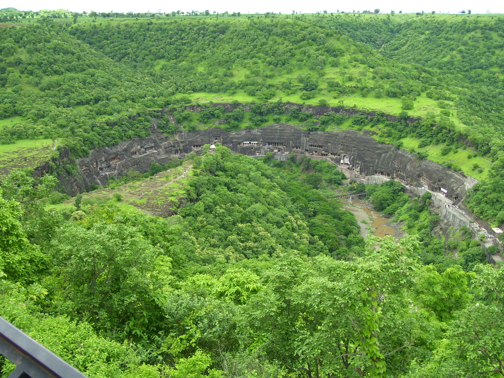
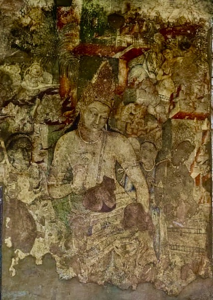
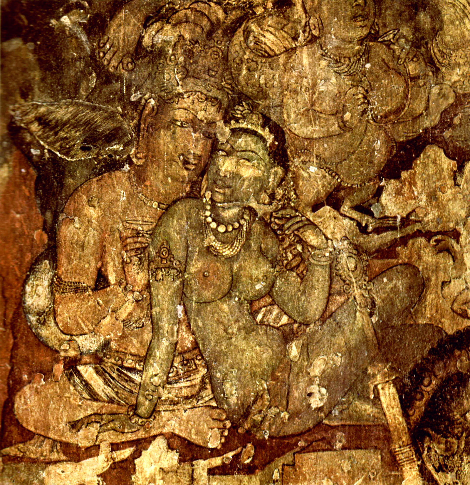

# அஜந்தா குகைகள்

*யுனெசுக்கோ உலகப் பாரம்பரியக் களம்*

| அஜந்தா குகைகள் |
| --- |
| உலக பாரம்பரிய பட்டியலில் உள்ள பெயர் |
|  |
| வகை |
| ஒப்பளவு |
| உசாத்துணை |
| UNESCO region |
| ஆள்கூற்று |
| பொறிப்பு வரலாறு |
| பொறிப்பு |
| class=notpageimage| Location of அஜந்தா குகைகள் in India Maharashtra. |

அஜந்தா குகைகள் (Ajanta Caves, Ajiṇṭhā leni; மராத்தி: अजिंठा लेणी): என்பவை இந்தியாவின் மகாராஷ்டிரா மாநிலத்தில் உள்ள புத்த மத சிற்பங்களும் ஓவியங்களும் காணப்படும், குகைகளைக் குடைந்து உருவாக்கப்பட்ட குடைவரைக் கோயில்கள் ஆகும். மராட்டிய மாநிலம் சம்பாஜி நகரத்திலிருந்து 107 கி.மீ தொலைவில் உள்ள அழகான கிராமம் அஜந்தாவின் குடைவரைக்-கோவில்களும், ஓவியங்களும் அமைந்துள்ள இடம் கிராமத்தின் பெயரால் அஜந்தா குகைகள் என அழைக்கப்படுகின்றன. இவை அனைத்தும் புத்தமதக் கொள்கைகளை முதன்மைப்படுத்தியும், புத்தரின் வாழ்க்கை வரலாற்று சம்பவங்களை சித்தரித்தும் உருவாக்கப்பட்டவை. [ 1 ] [ 2 ] குகைகளை முன்பு மழைக்காலத்தில் ஓய்வெடுக்கும் இடமாக புத்தபிட்சுகள் பயன்படுத்தியிருக்கின்றனர். கி.மு.2 முதல் கி.பி. 6 ஆம் நூற்றாண்டு வரையிலான காலத்தில் பல்வேறு கட்டமாக இவை உருவாக்கப்பட்டுள்ளன. [ 3 ] இந்தியத் தொல்பொருள் துறையினரால் பராமரிக்கப்பட்டுவரும் [ 4 ] அஜந்தா குகைகள் பற்றி சீனப்பயணி யுவான் சுவாங் குறிப்பெழுதியிருக்கிறார்.

## குகைகள்

*குதிரைக் குளம்பு வடிவஅசந்தா குகைகளின் அமைவிடம்*

ஏப்ரல் 1819இல் சென்னை மாகாணத்தைச்சேர்ந்த பிரித்தானிய அதிகாரியான ஜான் ஸ்மித் வேட்டையாடுவதற்காக அஜந்தா காட்டுக்குள் சென்றார். ஒரு புலியை அவர் துரத்திச்சென்றபோது மாடுமேய்க்கும் பையன் ஒருவன் புலிகள் தங்குமிடம் என இக்குகைகளை சுட்டிக்காட்டினான். புதர்மண்டி மூடிக்கிடந்த பத்தாவது குகைக்குள் சென்று அவர் ஓவியங்களைக் கண்டுபிடித்தார். அவ்வாறு கிட்டத்தட்ட ஆயிரத்தி இருநூறு வருடங்களாக மறைந்து கிடந்த அஜந்தா குகைகள் கண்டுபிடிக்கப்பட்டன. வகோரா நீரோடையை தொட்டபடி குதிரைக்குளம்பு போன்ற வடிவத்தில் நீண்டுகிடக்கும் குகைகளின் உயரம் சுமார் 76 மீட்டர் ஆகும். [ 5 ] இங்கு நடந்த பல்வேறுகட்ட அகழ்வாராய்ச்சிகளில் இதுவரையிலும் 30 குகைகள் கண்டுபிடிக்கப்பட்டுள்ளன. அவற்றில் ஒன்பது பத்து பத்தொன்பது இருபத்தாறு இருபத்தொன்பதாம் குகைகள் சைத்யங்கள். அதாவது பௌத்த வழிபாட்டிடங்கள். எஞ்சியவை துறவியர் தங்கும் விகாரங்கள்.

## உலகப் பாரம்பரியச் சின்னம்

கலைநயம் மிக்க பெரிய தூண்கள், மண்டபங்கள், சிலைகள், புத்தரின் பல்வேறு வடிவங்கள் என ஒவ்வொரு குகையிலும் ஒவ்வொருவகை ஆச்சரியம் நிரம்பியிருப்பதும் அஜந்தாவின் கூடுதல் சிறப்பு. இதை 1983 ஆம் ஆண்டில் உலகப்பண்பாட்டுச் சின்னமாக யுனெஸ்கோ அறிவித்துள்ளது.

## ஓவியங்கள்

*அஜந்த குகை எண் 1 ல் காணப்படும் புகழ்பெற்ற பத்மபாணி ஓவியம்*

*ஓர் அஜந்தா ஓவியம்*

அஜந்தா ஓவியங்கள் இந்தியாவின் மகாராஷ்டிரா மாநிலத்தின் பர்தாபூர் எனும் ஊரில் உள்ள குகைகளில் இயற்கை முறையில் வரையப்பட்ட ஓவியங்கள்ஆகும் . இவை கிமு 200 முதல் கிபி 650 வரையான பல்வேறுபட்ட காலப்பகுதியில் வரைந்தவை. இங்கு தனித்து இருக்கும் கணவாய் ஒன்றில் செங்குத்தாக மிகப்பெரிய பாறை ஒன்றில் இருபத்தொன்பது குகைகள் குடையப்பட்டுள்ளன.இதில் ஐந்து குகைகளில் ஓவியங்கள் வரையப்பட்டுள்ளன. [ 6 ] இவை கிமு 200 முதல் கிபி 650 வரையான பல்வேறுபட்ட காலப்பகுதியில் வரைந்தவை. பௌத்த மதக் கொள்கைகளை முதன்மைப்படுத்தி இந்த ஓவியங்கள் வரையப்பட்டன. இக்குகைகளில் ஓவியங்கள் தரையைத் தவிர மற்ற அனைத்துப் பகுதிகளிலும் காணப்படுகின்றன. பாறைகளில் மட்டுமல்லாமல், கூரைகளிலும் ஓவியங்கள் வரையப்பட்டுள்ளன. அஜந்தாகுகை ஓவியங்கள் குகையின் கற்சுவர்மேல் களிமண்ணும் சாணியும் கலந்த கலவை பூசப்பட்டு அதன் மேல் சுண்ணாம்புச்சாந்து பூசப்பட்டு இறுக்கப்பட்ட பரப்பில் பலவண்ணக் கூழாங்கற்களை அரைத்து உருவாக்கப்பட்ட நிறங்களைக்கொண்டு வரையப்பட்டவை. சுண்ணாம்புச்சாந்து இறுகுவதற்குள் வரையப்பட்டுவிடுவதனால் கூழாங்கல்சாந்து உறுதியாகவே ஒட்டிக்கொள்கிறது. இவை தாவர வண்ணங்கள் அல்ல. இயற்கை வண்ணங்கள். ஆகவேதான் இரண்டாயிரம் வருடங்களாகியும் வண்ணம் மங்காமலிருக்கின்றன. இவ்வோவியங்கள் புத்த சாதகக் கதைகளில் வரும் காட்சிகள் ஆகும். பல இடங்களில் ஓவியங்கள் மனித நடவடிக்கைகளாலும் கால ஓட்டத்தினாலும் சிதிலமடைந்துள்ளன.

## வரலாறு

அஜந்தா குகைகளின் நூறு அடிக்கும் கீழே ஒரு நதி ஓடுகிறது. இத்தகைய இயற்கைச் சூழலால் ஏற்பட்ட காடுகள் இக்குகைகளை மறைத்து விட்டன. கி.பி. 1819 இல் தான் முதன் முதலாக இக்குகைகளும் ஓவியங்களும் ஐரோப்பியர்களால் கண்டறியப்பட்டன. அதன் பிறகு முதன்முதலாக மும்பை ஓவியக்கலாசலை மாணவர்கள் இவ்வோவியங்களை நகலெடுத்தனர். பின்னர் 1912 இல் கர்னல் கோலுபெவ் என்பவர் செம்மையான முறையில் புகைப்படம் எடுத்தார். லேடி ஹெர்ரிங் குஹாமும் என்பவரும் நகல் எடுத்தார். ஐரோப்பியர்கள் முயற்சியால் அஜந்தா குகை ஓவியங்கள் வெளியுலகுக்குத் தெரிய வ்ந்தது. இதற்கு முன்பு வரை இத்தாலிய ஓவியக் கலையே தொன்மை வாய்ந்தது என ஐரோப்பியர்கள் போற்றி வந்தனர். அஜந்தா குகை ஓவியங்களின் மேன்மையைக் கண்ட பின்னர் இத்தாலிய ஓவியக் கலை தோன்றுவதற்கு ஐந்து நூற்றாண்டுகளுக்கு முன்பே, இந்திய ஓவியக் கலை முழு வளர்ச்சி பெற்றிருந்தது உலகுக்கு வெளியாயிற்ரு.

கி.பி இரண்டாம் நூற்றாண்டில் நாகர் வகுப்பைச் சேர்ந்த கலைஞர்கள் அஜந்தா ஓவியங்கள் பலவற்றை வரைந்தனர். அதன் பின்னர் பல நூற்றாண்டுகள் சிறந்த ஓவியக் கலைஞர்கள் தோன்றவில்லை. கி.பி. 5 அல்லது 6 ஆம் நூற்றாண்டில் 'புத்தபக்சன்' என்னும் மன்னன் காலத்தில் 'பிம்பசாரன்' என்னும் கலைஞன் இக்கலைக்குப் புத்துயிரளித்தான்' என்று தாராநாத் என்னும் அறிஞர் கூறுகிறார். [ 7 ]

## ஓவியங்களின் மையக் கருத்து

அஜந்தா குகை ஓவியங்கள் பெரும்பாலும் புத்தர் தொடர்பான கதைகளையே கூறுகின்றன. இக்கதைகள் யாவும் புத்த ஜாதகக்கதைகளிலிருந்து எடுக்கப்பட்டவை. அஜந்தா ஓவியங்களில் அகம் தொடர்பான ஓவியங்கள் பல உள்ளன. அவை புத்தர் துறவறம் பூணுவதற்கு முன்னைய வாழ்க்கை நிலையைக் குறிப்பனவாகும் என சுதேசமித்திடன் பத்திரிக்கையின் துணை ஆசிரியர் பி. கோதண்டராமன் குறிப்பிடுகிறார். [ 8 ]

## சிறப்புகள்

அஜந்தா மனித உருவங்கள் அனைத்தும் உயிரோவியங்களாகவே காணப்படுகின்றன. பெண்களின் உருவங்களே ஓவியங்களை அழகுக்கு அழகு சேர்க்க்கின்றன. பெண் ஓவியங்களே அஜந்தா கலையின் சிறப்பியல்பாகும். பெண்ணின் பல்வேறு மனநிலைகளையும் எண்ணற்ற அழகிய தோற்றங்களையும் ஓவியங்களாகத் தீட்டியுள்ளனர். ஓவியங்களில் பெண்களின் நீள்விழிகள், நுண்ணிடை, மெல்விரல்கள், மகளிரின் கூந்தல் ஒப்பனைகள் முதலியன இந்திய ஓவியக் கலையின் சிறப்பிற்கு எடுத்துக் காட்டாகும். எனவே அஜந்தா ஓவியங்கள் இந்திய ஓவியங்களின் அடிநிலையாக அமைந்துள்ளன எனக் கலைக்களஞ்சியம் எடுத்துரைக்கிறது [ 9 ]

## இன்றைய நிலை

அஜந்தாவில் ஐந்து குகைகளில் ஓவியங்கள் இருக்கின்றன . பெரும்பாலான ஓவியங்கள் இன்று சிதைந்த நிலையிலேயே உள்ளன. 1910இல் அஜந்தாவுக்கு வந்த வங்கபாணி ஓவியர்களான தேவேந்திரநாத் தாகூர் போன்றவர்கள் அதை ஓரளவு நன்றாகவே பிரதி எடுத்திருக்கிறார்கள். சுதந்திர இந்தியாவின் ஐம்பதாண்டுக்காலத்தில் ஓவியங்களின் பெரும்பகுதி அழிந்துவிட்டிருக்கிறது. பல புகழ்பெற்ற ஓவியங்களில் சில வண்ணத்தீற்றல்களை மட்டுமே காணமுடிகிறது. சில குகைகளில் ஓவியங்களின் சிதிலங்கள் மட்டுமே உள்ளன. ஆனாலும் புகழ்பெற்ற கரியநிற அழகி, போதிசத்வ வஜ்ரபாணி, போதிசத்வ பத்மபாணி போன்ற ஒவியங்கள் புகழ் பெற்றவையாகும். [ 10 ]

## இவற்றையும் பார்க்கவும்

- எல்லோரா குகைகள்

## வெளியிணைப்புகள்

- அஜந்தா குகைகள் காணொளி
- Ajanta Caves Bibliography , Akira Shimada (2014), Oxford University Press
- The Early Development of the Cave 26-Complex at Ajanta
- National Geographic feature 'Faces of the Divine'
- The Greatest Ancient Picture Gallery. William Dalrymple, New York Review of Books (23 Oct 2014)
- Ajanta Caves in UNESCO List
- "Ajanta", Jacques-Edouard Berger Foundation, World Art Treasures (choose French or English) பரணிடப்பட்டது 2007-09-27 at the வந்தவழி இயந்திரம்
- Research resources and photographs of each Ajanta cave பரணிடப்பட்டது 2015-01-02 at Archive.today , Rajendra Singh
- Video Travelogue on Ajanta Cave Temples
- Ajanta: Written in the Stone . Documentary by Laurence Castle based on Walter Spink's finding.
- Ajanta: Some Kind of Miracle . Documentary by Laurence Castle, the history of Ajanta.
- Video of the caves MTDC site பரணிடப்பட்டது 2008-02-28 at the வந்தவழி இயந்திரம்

| Col1 |
| --- |
| பௌத்த |
| யாத்திரைத் தலங்கள் |
|  |
| நான்கு முதன்மைத் தலங்கள் |
| லும்பினி புத்தகயா சாரநாத் குசிநகர் |
| மற்ற நான்கு முதன்மைத் தலங்கள் |
| ராஜகிரகம் சங்காசியா சிராவஸ்தி வைசாலி |
| பண்டைய தலங்கள் |
| புத்தகயா கபிலவஸ்து (பண்டைய நகரம்) கேசரியா கௌசாம்பி பாடலிபுத்திரம் நாலந்தா பவா நகரம் வாரணாசி ஜேதவனம் அமராவதி சந்திராவரம் லௌரியா நந்தன்காட் லௌரியா-ஆராராஜ் கும்ஹரார் |
| பிந்தைய தலங்கள் |
| மகாபோதி கோயில் எல்லோரா அஜந்தா குகைகள் சாஞ்சி பிப்ரவா விக்கிரமசீலா நாகார்ஜுனகொண்டா லெண்யாத்திரி பர்குட் தௌலி உதயகிரி, கந்தகிரி குகைகள் இரத்தினகிரி லலித்கிரி திரிரஷ்மி லேனி அவுரங்காபாத் குகைகள் உண்டவல்லி போஜ்ஜன்ன கொண்டா காம்பாலித குகைகள் கும்ஹரார் பாஜா குகைகள் கர்லா குகைகள் கான்கேரி குகைகள் பராபர் குகைகள் சியோத் குகைகள் பாக் குகைகள் மகாகாளி குகைகள் மதுரா மொகாவோ கற்குகைகள் ராணிகட் பௌத்தநாத்து சுயம்புநாதர் கோயில் பொக்காரா சாந்தி தூபி திலௌராகோட் சிறீ மகாபோதி தம்புள்ளை பொற்கோவில் தலதா மாளிகை தூபாராமய ருவான்வெலிசாய ஜேத்தவனராமயா |
| பா உ தொ |

---
Source: https://ta.wikipedia.org/wiki/%E0%AE%85%E0%AE%9C%E0%AE%A8%E0%AF%8D%E0%AE%A4%E0%AE%BE_%E0%AE%95%E0%AF%81%E0%AE%95%E0%AF%88%E0%AE%95%E0%AE%B3%E0%AF%8D
