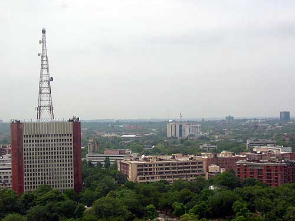
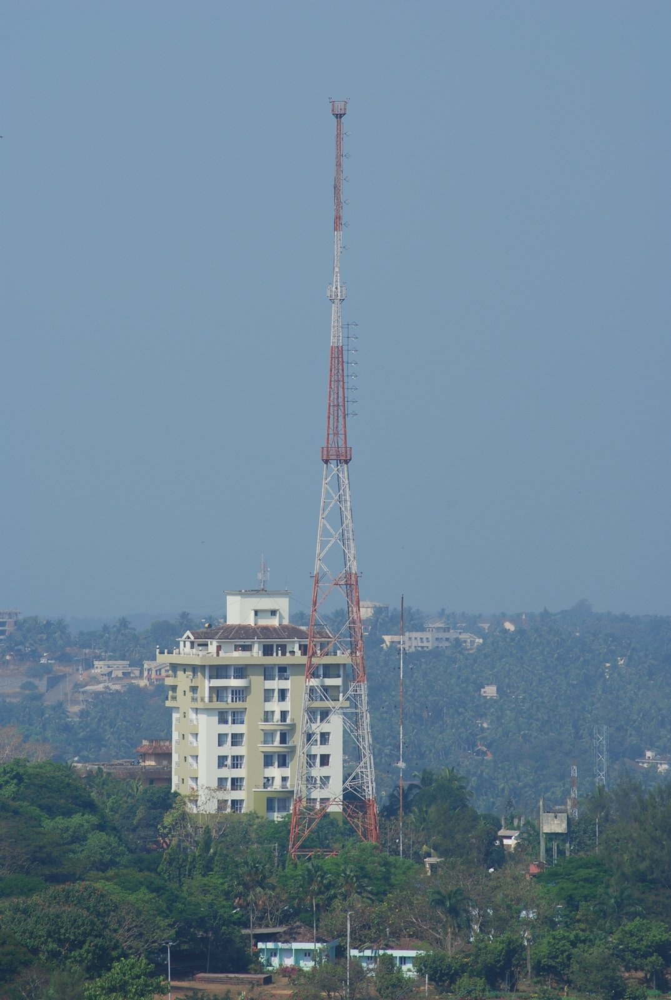

# அனைத்திந்திய வானொலி

*அனைத்திந்திய வானொலி*

| Col1 |
| --- |
|  |
| Type |
| Country |
| Availability |
| Owner |
| Launch date |
| Official website |

அனைத்திந்திய வானொலி அல்லது அகில இந்திய வானொலி (All India Radio, சுருக்கமாக AIR ), அலுவல்முறையில் ஆகாஷ்வாணி ( தேவநாகரி : आकाशवाणी, ākāshavānī), இந்தியாவின் முதன்மையான அரசுத்துறை வானொலி ஒலிபரப்பு நிறுவனமாகும். 1936ஆம் ஆண்டு அரசின் தகவல் மற்றும் ஒலிபரப்பு அமைச்சின் கீழ் நிறுவப்பட்டு [ 1 ] தற்போது தன்னாட்சி வழங்கப்பட்டுள்ள பிரசார் பாரதியின் அங்கமாக விளங்குகிறது.

உலகின் ஒலிபரப்பு நிறுவனங்களில் மிகப்பெரும் பிணையம் உள்ள ஒன்றாகும்.இதன் தலைமையகம் தில்லியில் ஆகாசவாணி பவன் கட்டிடத்தில் இருந்து இயங்குகிறது. இக்கட்டிடத்தின் ஆறாம் தளத்தில் பிரசார் பாரதியின் மற்றொரு அங்கமான ஒளிபரப்பு நிறுவனம் தூர்தர்சன் தலைமையகம் இயங்குகிறது.

சென்னை நிலையம் மயிலாப்பூர் சாந்தோம் பகுதியில் கடற்கரைக்கு எதிராக அமைந்துள்ளது.

*தில்லியில் உள்ள அனைத்திந்திய வானொலி தலைமையகம்*

*கர்நாடகாவின் மங்களூருவில் உள்ள ஓர் அனைத்திந்திய வானொலி கோபுரம்*

## வெளியிணைப்புகள்

- ஆகாஷ்வாணி: இந்திய வானின் அசரீரி!
- All India Radio Official web-site பரணிடப்பட்டது 2010-11-16 at the வந்தவழி இயந்திரம்
- Know India: Radio
- AIR's Frequency schedule பரணிடப்பட்டது 2009-08-27 at the வந்தவழி இயந்திரம்
- All India Radio (AIR) Station Frequencies (National/International)
- Children's wing of All India Radio
- VIVIDH BHARTI
- FM RAINBOW
- FM GOLD

---
Source: https://ta.wikipedia.org/wiki/%E0%AE%85%E0%AE%A9%E0%AF%88%E0%AE%A4%E0%AF%8D%E0%AE%A4%E0%AE%BF%E0%AE%A8%E0%AF%8D%E0%AE%A4%E0%AE%BF%E0%AE%AF_%E0%AE%B5%E0%AE%BE%E0%AE%A9%E0%AF%8A%E0%AE%B2%E0%AE%BF
