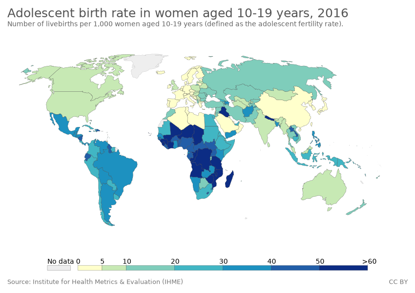

# কৈশোৰ গৰ্ভাৱস্থা

| নাৰীৰ স্বাস্থ্য |
| --- |
| নাৰীৰ স্বাস্থ্যৰ প্ৰতীক |
| প্ৰজনন আৰু যৌন স্বাস্থ্য [দেখুৱাওক] প্ৰজনন স্বাস্থ্য প্ৰজনন তন্ত্ৰ স্ত্ৰীৰ বাহ্যিক জননাংগ ভগাংকুৰ ভগাংকুৰ হুড লেবিয়া মাইন'ৰা লেবিয়া মেজ'ৰা যোনি চাৰ্ভিক্স জৰায়ু ফেলোপিয়ান টিউব গৰ্ভাশয় প্ৰজনন তন্ত্ৰৰ ৰোগ মাতৃৰ স্বাস্থ্য গৰ্ভধাৰণ অনিচ্ছাকৃত গৰ্ভধাৰণ গ্ৰেভিডিটি আৰু পেৰিটি প্ৰসূতিবিদ্যা প্ৰাক-প্ৰসৱকালীন যত্ন কৈশোৰ গৰ্ভাৱস্থা গৰ্ভধাৰণৰ জটিলতা হাইপাৰমেছিছ গ্ৰেভিডাৰম এক্টোপিক গৰ্ভধাৰণ স্বতঃস্ফূৰ্ত গৰ্ভপাত প্ৰসূতিৰ ৰক্তক্ষৰণ গৰ্ভকালীন মধুমেহ উচ্চ ৰক্তচাপ প্ৰি-এক্লাম্পছিয়া এক্লাম্পছিয়া সন্তান প্ৰসৱ ধাত্ৰীবিদ্যা অকাল জন্ম একাধিক জন্ম অক্সিট'চিন বাধাপ্ৰাপ্ত প্ৰসৱ চিজাৰিয়ান ছেক্সন ধৰি ৰখা জননফুল প্ৰসূতিৰ ফিষ্টুলা ভেছিক'ভেজিনেল ফিষ্টুলা ৰেক্ট'ভেজিনেল ফিষ্টুলা প্ৰসৱোত্তৰ যত্ন মাতৃৰ মৃত্যু পেৰিনেটাল মৃত্যুৰ হাৰ মৃত সন্তান প্ৰসৱ গৰ্ভপাত মাতৃৰ পৰা শিশুলৈ সংক্ৰমণ বন্ধ্যাকৰণ বাধ্যতামূলক বন্ধ্যাকৰণ প্ৰজনন জীৱন পৰিকল্পনা অনুৰ্বৰতা সন্তানহীনতা সহায়ক প্ৰজনন প্ৰযুক্তি ইন ভিট্ৰ' ফাৰ্টিলাইজেশ্যন সন্তানৰ প্ৰতিপালন পৰিগ্ৰহণ প্ৰতিপালন গৰ্ভনিৰোধক আৰু পৰিয়াল পৰিকল্পনা অসুৰক্ষিত যৌন সম্বন্ধ অন্তঃজৰায়ু গৰ্ভনিৰোধক সঁজুলি গৰ্ভনিৰোধক বড়ি কণ্ডম গৰ্ভনিৰোধকৰ প্ৰচলন গৰ্ভনিৰোধক সুৰক্ষা পৰিকল্পিত মাতৃত্ব/পিতৃত্ব ঋতুশ্ৰাৱ মিনাৰ্কি ঋতুচক্ৰ ঋতুস্ৰাৱৰ সাহায্য টেম্পুন চেনিটেৰী পেড ডিছমেন'ৰিয়া মেন'ৰহেজিয়া এমেন'ৰিয়া ৰজোনিবৃত্তি হৰম'ন প্ৰতিষ্ঠাপন চিকিৎসা যৌন স্বাস্থ্য যৌন সংক্ৰমণ এইচ আই ভি হিউমেন পাপিল'মা ভাইৰাছ এইচপিভি ভেকচিন শ্ৰোণিৰ প্ৰদাহ ৰোগ স্ত্ৰী জননাংগৰ উৎপৰিৱৰ্তন ক্লিটোৰিডেক্টোমি ইনফিবুলেশ্যন বাল্য বিবাহ বলপূৰ্বক বিবাহ বহুবিবাহ যৌন সম্ভোগ কামশীৰ্ষ ডিছপাৰিউনিয়া অন্যান্য লৈংগিক দ্বিৰূপতা যৌন শিক্ষা যৌৱনাৰম্ভ স্তন স্বাস্থ্য স্ত্ৰীৰোগজনিত বিকাৰ ভেজিনাইটিছ |
| প্ৰজনন স্বাস্থ্য |
| প্ৰজনন তন্ত্ৰ স্ত্ৰীৰ বাহ্যিক জননাংগ ভগাংকুৰ ভগাংকুৰ হুড লেবিয়া মাইন'ৰা লেবিয়া মেজ'ৰা যোনি চাৰ্ভিক্স জৰায়ু ফেলোপিয়ান টিউব গৰ্ভাশয় প্ৰজনন তন্ত্ৰৰ ৰোগ মাতৃৰ স্বাস্থ্য গৰ্ভধাৰণ অনিচ্ছাকৃত গৰ্ভধাৰণ গ্ৰেভিডিটি আৰু পেৰিটি প্ৰসূতিবিদ্যা প্ৰাক-প্ৰসৱকালীন যত্ন কৈশোৰ গৰ্ভাৱস্থা গৰ্ভধাৰণৰ জটিলতা হাইপাৰমেছিছ গ্ৰেভিডাৰম এক্টোপিক গৰ্ভধাৰণ স্বতঃস্ফূৰ্ত গৰ্ভপাত প্ৰসূতিৰ ৰক্তক্ষৰণ গৰ্ভকালীন মধুমেহ উচ্চ ৰক্তচাপ প্ৰি-এক্লাম্পছিয়া এক্লাম্পছিয়া সন্তান প্ৰসৱ ধাত্ৰীবিদ্যা অকাল জন্ম একাধিক জন্ম অক্সিট'চিন বাধাপ্ৰাপ্ত প্ৰসৱ চিজাৰিয়ান ছেক্সন ধৰি ৰখা জননফুল প্ৰসূতিৰ ফিষ্টুলা ভেছিক'ভেজিনেল ফিষ্টুলা ৰেক্ট'ভেজিনেল ফিষ্টুলা প্ৰসৱোত্তৰ যত্ন মাতৃৰ মৃত্যু পেৰিনেটাল মৃত্যুৰ হাৰ মৃত সন্তান প্ৰসৱ গৰ্ভপাত মাতৃৰ পৰা শিশুলৈ সংক্ৰমণ বন্ধ্যাকৰণ বাধ্যতামূলক বন্ধ্যাকৰণ প্ৰজনন জীৱন পৰিকল্পনা অনুৰ্বৰতা সন্তানহীনতা সহায়ক প্ৰজনন প্ৰযুক্তি ইন ভিট্ৰ' ফাৰ্টিলাইজেশ্যন সন্তানৰ প্ৰতিপালন পৰিগ্ৰহণ প্ৰতিপালন গৰ্ভনিৰোধক আৰু পৰিয়াল পৰিকল্পনা অসুৰক্ষিত যৌন সম্বন্ধ অন্তঃজৰায়ু গৰ্ভনিৰোধক সঁজুলি গৰ্ভনিৰোধক বড়ি কণ্ডম গৰ্ভনিৰোধকৰ প্ৰচলন গৰ্ভনিৰোধক সুৰক্ষা পৰিকল্পিত মাতৃত্ব/পিতৃত্ব ঋতুশ্ৰাৱ মিনাৰ্কি ঋতুচক্ৰ ঋতুস্ৰাৱৰ সাহায্য টেম্পুন চেনিটেৰী পেড ডিছমেন'ৰিয়া মেন'ৰহেজিয়া এমেন'ৰিয়া ৰজোনিবৃত্তি হৰম'ন প্ৰতিষ্ঠাপন চিকিৎসা যৌন স্বাস্থ্য যৌন সংক্ৰমণ এইচ আই ভি হিউমেন পাপিল'মা ভাইৰাছ এইচপিভি ভেকচিন শ্ৰোণিৰ প্ৰদাহ ৰোগ স্ত্ৰী জননাংগৰ উৎপৰিৱৰ্তন ক্লিটোৰিডেক্টোমি ইনফিবুলেশ্যন বাল্য বিবাহ বলপূৰ্বক বিবাহ বহুবিবাহ যৌন সম্ভোগ কামশীৰ্ষ ডিছপাৰিউনিয়া অন্যান্য লৈংগিক দ্বিৰূপতা যৌন শিক্ষা যৌৱনাৰম্ভ স্তন স্বাস্থ্য স্ত্ৰীৰোগজনিত বিকাৰ ভেজিনাইটিছ |
| প্ৰজনন তন্ত্ৰ |
| স্ত্ৰীৰ বাহ্যিক জননাংগ ভগাংকুৰ ভগাংকুৰ হুড লেবিয়া মাইন'ৰা লেবিয়া মেজ'ৰা যোনি চাৰ্ভিক্স জৰায়ু ফেলোপিয়ান টিউব গৰ্ভাশয় প্ৰজনন তন্ত্ৰৰ ৰোগ |
| মাতৃৰ স্বাস্থ্য |
| গৰ্ভধাৰণ অনিচ্ছাকৃত গৰ্ভধাৰণ গ্ৰেভিডিটি আৰু পেৰিটি প্ৰসূতিবিদ্যা প্ৰাক-প্ৰসৱকালীন যত্ন কৈশোৰ গৰ্ভাৱস্থা গৰ্ভধাৰণৰ জটিলতা হাইপাৰমেছিছ গ্ৰেভিডাৰম এক্টোপিক গৰ্ভধাৰণ স্বতঃস্ফূৰ্ত গৰ্ভপাত প্ৰসূতিৰ ৰক্তক্ষৰণ গৰ্ভকালীন মধুমেহ উচ্চ ৰক্তচাপ প্ৰি-এক্লাম্পছিয়া এক্লাম্পছিয়া সন্তান প্ৰসৱ ধাত্ৰীবিদ্যা অকাল জন্ম একাধিক জন্ম অক্সিট'চিন বাধাপ্ৰাপ্ত প্ৰসৱ চিজাৰিয়ান ছেক্সন ধৰি ৰখা জননফুল প্ৰসূতিৰ ফিষ্টুলা ভেছিক'ভেজিনেল ফিষ্টুলা ৰেক্ট'ভেজিনেল ফিষ্টুলা প্ৰসৱোত্তৰ যত্ন মাতৃৰ মৃত্যু পেৰিনেটাল মৃত্যুৰ হাৰ মৃত সন্তান প্ৰসৱ গৰ্ভপাত মাতৃৰ পৰা শিশুলৈ সংক্ৰমণ বন্ধ্যাকৰণ বাধ্যতামূলক বন্ধ্যাকৰণ |
| প্ৰজনন জীৱন পৰিকল্পনা |
| অনুৰ্বৰতা সন্তানহীনতা সহায়ক প্ৰজনন প্ৰযুক্তি ইন ভিট্ৰ' ফাৰ্টিলাইজেশ্যন সন্তানৰ প্ৰতিপালন পৰিগ্ৰহণ প্ৰতিপালন |
| গৰ্ভনিৰোধক আৰু পৰিয়াল পৰিকল্পনা |
| অসুৰক্ষিত যৌন সম্বন্ধ অন্তঃজৰায়ু গৰ্ভনিৰোধক সঁজুলি গৰ্ভনিৰোধক বড়ি কণ্ডম গৰ্ভনিৰোধকৰ প্ৰচলন গৰ্ভনিৰোধক সুৰক্ষা পৰিকল্পিত মাতৃত্ব/পিতৃত্ব |
| ঋতুশ্ৰাৱ |
| মিনাৰ্কি ঋতুচক্ৰ ঋতুস্ৰাৱৰ সাহায্য টেম্পুন চেনিটেৰী পেড ডিছমেন'ৰিয়া মেন'ৰহেজিয়া এমেন'ৰিয়া ৰজোনিবৃত্তি হৰম'ন প্ৰতিষ্ঠাপন চিকিৎসা যৌন স্বাস্থ্য যৌন সংক্ৰমণ এইচ আই ভি হিউমেন পাপিল'মা ভাইৰাছ এইচপিভি ভেকচিন শ্ৰোণিৰ প্ৰদাহ ৰোগ স্ত্ৰী জননাংগৰ উৎপৰিৱৰ্তন ক্লিটোৰিডেক্টোমি ইনফিবুলেশ্যন বাল্য বিবাহ বলপূৰ্বক বিবাহ বহুবিবাহ যৌন সম্ভোগ কামশীৰ্ষ ডিছপাৰিউনিয়া অন্যান্য লৈংগিক দ্বিৰূপতা যৌন শিক্ষা যৌৱনাৰম্ভ স্তন স্বাস্থ্য স্ত্ৰীৰোগজনিত বিকাৰ ভেজিনাইটিছ |
| যৌন স্বাস্থ্য |
| যৌন সংক্ৰমণ এইচ আই ভি হিউমেন পাপিল'মা ভাইৰাছ এইচপিভি ভেকচিন শ্ৰোণিৰ প্ৰদাহ ৰোগ স্ত্ৰী জননাংগৰ উৎপৰিৱৰ্তন ক্লিটোৰিডেক্টোমি ইনফিবুলেশ্যন বাল্য বিবাহ বলপূৰ্বক বিবাহ বহুবিবাহ যৌন সম্ভোগ কামশীৰ্ষ ডিছপাৰিউনিয়া অন্যান্য লৈংগিক দ্বিৰূপতা যৌন শিক্ষা যৌৱনাৰম্ভ স্তন স্বাস্থ্য স্ত্ৰীৰোগজনিত বিকাৰ ভেজিনাইটিছ |
| যৌন সংক্ৰমণ |
| এইচ আই ভি হিউমেন পাপিল'মা ভাইৰাছ এইচপিভি ভেকচিন শ্ৰোণিৰ প্ৰদাহ ৰোগ |
| অন্যান্য |
| লৈংগিক দ্বিৰূপতা যৌন শিক্ষা যৌৱনাৰম্ভ স্তন স্বাস্থ্য স্ত্ৰীৰোগজনিত বিকাৰ ভেজিনাইটিছ |
| অ-প্ৰজনন স্বাস্থ্য [দেখুৱাওক] নাৰীৰ বিৰুদ্ধে হিংসা ঘৰুৱা হিংসা অন্তৰংগ সঙ্গীৰ উৎপীড়ন নাৰীবিদ্বেষ যৌন নিৰ্যাতন যৌন আক্ৰমণ ধৰ্ষণ নাৰীহত্যা লিংগ বৈষম্য অসংক্ৰামক ৰোগ কৰ্কট ৰোগ হাওঁফাওঁৰ কেন্সাৰ স্তনৰ কেন্সাৰ জৰায়ুৰ কেন্সাৰ এণ্ড্ৰ'মেট্ৰিয়েল কেন্সাৰ চাৰ্ভিকেল কেন্সাৰ পাপানিকোলাও পৰীক্ষা অভাৰিয়ান কেন্সাৰ ৰক্ত সংবহনতন্ত্ৰৰ ৰোগ ডিমেন্‌চিয়া আলজেইমাৰ ৰোগ হাড়ৰ স্বাস্থ্য অষ্টিঅ'প'ৰ'ছিছ উৰুসন্ধিৰ ভংগন ৰক্তহীনতা অন্যান্য মানসিক স্বাস্থ্য উদ্বিগ্নতা বিষণ্ণতা গুৰুতৰ অৱসাদজনিত ব্যাধি মূত্ৰ তন্ত্ৰ মূত্ৰপথ মূত্ৰনলীৰ সংক্ৰমণ প্ৰস্ৰাৱৰ নিয়ন্ত্ৰণহীনতা |
| নাৰীৰ বিৰুদ্ধে হিংসা |
| ঘৰুৱা হিংসা অন্তৰংগ সঙ্গীৰ উৎপীড়ন নাৰীবিদ্বেষ যৌন নিৰ্যাতন যৌন আক্ৰমণ ধৰ্ষণ নাৰীহত্যা লিংগ বৈষম্য |
| অসংক্ৰামক ৰোগ |
| কৰ্কট ৰোগ হাওঁফাওঁৰ কেন্সাৰ স্তনৰ কেন্সাৰ জৰায়ুৰ কেন্সাৰ এণ্ড্ৰ'মেট্ৰিয়েল কেন্সাৰ চাৰ্ভিকেল কেন্সাৰ পাপানিকোলাও পৰীক্ষা অভাৰিয়ান কেন্সাৰ ৰক্ত সংবহনতন্ত্ৰৰ ৰোগ ডিমেন্‌চিয়া আলজেইমাৰ ৰোগ হাড়ৰ স্বাস্থ্য অষ্টিঅ'প'ৰ'ছিছ উৰুসন্ধিৰ ভংগন ৰক্তহীনতা |
| কৰ্কট ৰোগ |
| হাওঁফাওঁৰ কেন্সাৰ স্তনৰ কেন্সাৰ জৰায়ুৰ কেন্সাৰ এণ্ড্ৰ'মেট্ৰিয়েল কেন্সাৰ চাৰ্ভিকেল কেন্সাৰ পাপানিকোলাও পৰীক্ষা অভাৰিয়ান কেন্সাৰ |
| অন্যান্য |
| মানসিক স্বাস্থ্য উদ্বিগ্নতা বিষণ্ণতা গুৰুতৰ অৱসাদজনিত ব্যাধি মূত্ৰ তন্ত্ৰ মূত্ৰপথ মূত্ৰনলীৰ সংক্ৰমণ প্ৰস্ৰাৱৰ নিয়ন্ত্ৰণহীনতা |
| সামাজিক সাংস্কৃতিক কাৰকসমূহ [দেখুৱাওক] দৰিদ্ৰতা সুবিধাবঞ্চিত লৈংগিক সমতা স্বাস্থ্যসেৱাৰ বৈষম্য স্বাস্থ্যত লিংগ বৈষম্য স্বাস্থ্যৰ সামাজিক নিৰ্ধাৰক প্ৰজনন ন্যায় নাৰী সবলীকৰণ |
| ৰাজনীতি, গৱেষণা আৰু ওকালতি [দেখুৱাওক] ৰাষ্ট্ৰসংঘ নাৰীৰ বিৰুদ্ধে সকলো ধৰণৰ বৈষম্য দূৰীকৰণৰ সন্মিলন নাৰীৰ বিৰুদ্ধে হিংসা দূৰীকৰণৰ ঘোষণা আন্তৰ্জাতিক কন্যা শিশু দিৱস নাৰীৰ স্থিতিৰ ওপৰত আয়োগ ইউএন ৱুমেন আমেৰিকা যুক্তৰাষ্ট্ৰ নাৰীৰ স্বাস্থ্যৰ ওপৰত কৰা গৱেষণাৰ কাৰ্য্যালয় নাৰীৰ স্বাস্থ্য উদ্যোগ নাৰী বিষয়ক গৱেষণাৰ বাবে আন্তৰ্জাতিক কেন্দ্ৰ ধাত্ৰীৰ স্বাস্থ্য অধ্যয়ন কৃষ্ণবৰ্ণ নাৰীৰ স্বাস্থ্য অধ্যয়ন কাৰ্টৰাইট অনুসন্ধান নাৰীৰ স্বাস্থ্য গৱেষণাৰ বাবে সমাজ |
| ৰাষ্ট্ৰসংঘ |
| নাৰীৰ বিৰুদ্ধে সকলো ধৰণৰ বৈষম্য দূৰীকৰণৰ সন্মিলন নাৰীৰ বিৰুদ্ধে হিংসা দূৰীকৰণৰ ঘোষণা আন্তৰ্জাতিক কন্যা শিশু দিৱস নাৰীৰ স্থিতিৰ ওপৰত আয়োগ ইউএন ৱুমেন |
| আমেৰিকা যুক্তৰাষ্ট্ৰ |
| নাৰীৰ স্বাস্থ্যৰ ওপৰত কৰা গৱেষণাৰ কাৰ্য্যালয় নাৰীৰ স্বাস্থ্য উদ্যোগ |
| দেশ অনুযায়ী নাৰীৰ স্বাস্থ্য [দেখুৱাওক] চীন ইথিঅ'পিয়া ভাৰত পৰিয়াল পৰিকল্পনা আমেৰিকা যুক্তৰাষ্ট্ৰত জন্ম নিয়ন্ত্ৰণ |
| v t e |

কৈশোৰ গৰ্ভাৱস্থা বা কিশোৰী বয়সত গৰ্ভধাৰণ ( ইংৰাজী : Teenage pregnancy ) হৈছে ২০ বছৰৰ তলৰ মহিলাৰ হোৱা গৰ্ভধাৰণ। [ 1 ] এগৰাকী কিশোৰীৰ ঋতুমতি হোৱাৰ পিছত যৌন সম্ভোগৰ দ্বাৰা গৰ্ভধাৰণ হয়, কিন্তু ডিম্বস্ফোটন আৰম্ভ হোৱাৰ পিছত এক কিশোৰীৰ প্ৰথম ঋতুস্ৰাৱ ৰ অলপদিন আগতেও গৰ্ভধাৰণ হ'ব পাৰে। [ 2 ] সু-পুষ্টিপ্ৰাপ্ত ছোৱালীৰ ক্ষেত্ৰত, প্ৰথম ঋতুস্ৰাৱ সাধাৰণতে ১২ বা ১৩ বছৰ বয়সৰ আশে পাশে হয়। [ 3 ] গৰ্ভৱতী কিশোৰীসকলে আন মহিলাৰ দৰে একে গৰ্ভধাৰণ সম্পৰ্কীয় সমস্যাৰ সন্মুখীন হয় যদিও ১৫ বছৰৰ তলৰ কিশোৰীসকলৰ বাবে কিছুমান অতিৰিক্ত উদ্বেগ বা চিন্তা থাকে। ইয়াৰ কাৰণ হʼল যে এই বয়সত কেঁচুৱাটো গৰ্ভত ধাৰণ কৰি ৰাখিবলৈ আৰু স্বাস্থ্যৱান শিশু জন্ম দিবলৈ কিশোৰীসকলৰ শাৰীৰিক বিকাশ পৰ্যাপ্ত নহয়। [ 4 ] অৱশে ১৫-১৯ বছৰ বয়সৰ কিশোৰীৰ ক্ষেত্ৰত, বয়সৰ জৈৱিক প্ৰভাৱতকৈ আৰ্থসামাজিক কাৰকৰ সৈতে বিপদাশংকা অধিকভাবে জড়িত। [ 5 ] কৈশোৰ গৰ্ভাধাৰণৰ ক্ষেত্ৰত বিপদাশংকাবোৰ হৈছে শিশুৰ জন্মৰ সময়ত কম ওজন, অকাল প্ৰসৱ, ৰক্তহীনতা,( প্ৰি একলেম্পজিয়া় ),ইত্যাদি। [ 6 ] [ 7 ]

## প্ৰচলন

*2016 চনলৈকে ১০-১৯ বছৰ বয়সৰ কিশোৰীৰ শিশু প্ৰসৱৰ হাৰ [ 8 ]*

প্ৰতি বছৰে, বিকাশশীল অঞ্চলবোৰত ১৫-১৯ বছৰ বয়সৰ আনুমানিক 21 নিযুত ছোৱালী গৰ্ভৱতী হয় আৰু তেওঁলোকৰ প্ৰায় ১২ নিযুতে সন্তান জন্ম দিয়ে। তাৰ মাজত কমেও ৭৭৭,000 জন্ম হয়
15 বছৰতকৈ কম বয়সৰ ছোৱালীৰ গৰ্ভধাৰণৰ ফলত। [ 9 ] জৰীপৰ পৰা দেখা গৈছে যে ভাৰতৰ ত্ৰিপুৰা (২১.৯ শতাংশ); পশ্চিম বংগ (১৬.৪ শতাংশ); অন্ধ্ৰ প্ৰদেশ (১২.৬ শতাংশ); অসম (১১.৭ শতাংশ); আৰু বিহাৰত (11 শতাংশ) কিশোৰী গৰ্ভধাৰণৰ হাৰ অধিক। [ 10 ]

বিশ্বব্যাপী, কিছুমান চাব-চাহাৰা আফ্ৰিকাৰ দেশত কিশোৰী গৰ্ভধাৰণৰ হাৰ প্ৰতি ১,000 ত ১৪৩ আৰু দক্ষিণ কোৰিয়াত প্ৰতি ১,000 ত ২.৯। [ 11 ] [ 12 ] আমেৰিকা যুক্তৰাষ্ট্ৰত, ১৫ ৰ পৰা ১৯ বছৰৰ ভিতৰত ৮২% গৰ্ভধাৰণ অপৰিকল্পিত। [ 13 ] উন্নত দেশবোৰৰ ভিতৰত, আমেৰিকা যুক্তৰাজ্য, ইউকে আৰু নিউজিলেণ্ডত কিশোৰী গৰ্ভধাৰণৰ সৰ্বোচ্চ স্তৰ আছে, আনহাতে জাপান আৰু দক্ষিণ কোৰিয়াৰ 2001 চনত সৰ্বনিম্ন। [ 14 ]

## বিপদাশংকা আৰু প্ৰতিৰোধ

### স্বাস্থ্য সম্পৰ্কীয় পৰিণাম

কিশোৰী বয়সতৰ গৰ্ভধাৰণ হৈছে মাতৃৰ মৃত্যুৰ এক মুখ্য কাৰণ আৰু এক দীৰ্ঘম্যাদী স্বাস্থ্য সমস্যা। [ 15 ] ইয়াৰ প্ৰভাৱ গুৰুত্বপূৰ্ণ:

- মাতৃৰ ওপৰত প্ৰভাৱ [ 16 ] বিশ্বব্যাপী মাতৃমৃত্যুৰ 99% কিশোৰী গৰ্ভধাৰণৰ ফলাফল হোৱা দেখা যায়। 3.9 নিযুত কিশোৰীৰ অসুৰক্ষিত গৰ্ভপাত হয়। তেওঁলোকে একলেম্পচিয়া, পুয়েৰপেৰাল এণ্ডোমেট্ৰাইটিছ আৰু প্ৰণালীগত সংক্ৰমণৰ উচ্চ বিপদাশংকাত ভোগে।

- নৱজাতকৰ ওপৰত প্ৰভাৱ [ 16 ] জন্মৰ ওজন কম হোৱাৰ উচ্চ বিপদাশংকা আৰু ইয়াৰ সম্পৰ্কত হোৱা জটিলতা। প্ৰসৱ আৰু গুৰুতৰ নৱজাতকৰ স্থিতি, জন্মগত অস্বাভাৱিকতা।

## বিপদাশংকা আৰু প্ৰতিৰোধ

### আৰ্থসামাজিক পৰিণাম

ইয়াত অন্তৰ্ভুক্ত থাকে পৰিয়াল আৰু সমাজৰ পৰা কলঙ্ক,পৰিয়ালৰ সদস্য, বন্ধু আৰু চুবুৰীয়াৰ পৰা প্ৰত্যাখ্যান আৰু ঘৰুৱা অশান্তি। এইটোও পোৱা গৈছে, তেওঁলোকে নিম্ন মানদণ্ডৰ জীৱন যাপন কৰিব লাগিব পাৰে, হতাশাত আৰু নিম্ন আত্মসন্মানতো ভুগিব পাৰে। [ 16 ]

## বাহ্যিক সংযোগ

- https://fit.thequint.com/her-health/teenage-pregnancies-in-india
- https://www.downtoearth.org.in/blog/health/adolescent-fertility-rate-teenage-pregnancies-decline-in-indian-states-nfhs-5-74850

---
Source: https://as.wikipedia.org/wiki/%E0%A6%95%E0%A7%88%E0%A6%B6%E0%A7%8B%E0%A7%B0_%E0%A6%97%E0%A7%B0%E0%A7%8D%E0%A6%AD%E0%A6%BE%E0%A7%B1%E0%A6%B8%E0%A7%8D%E0%A6%A5%E0%A6%BE
