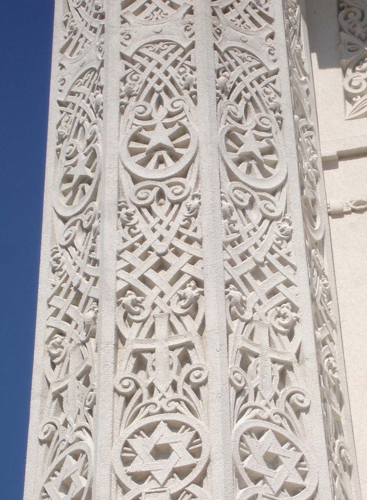
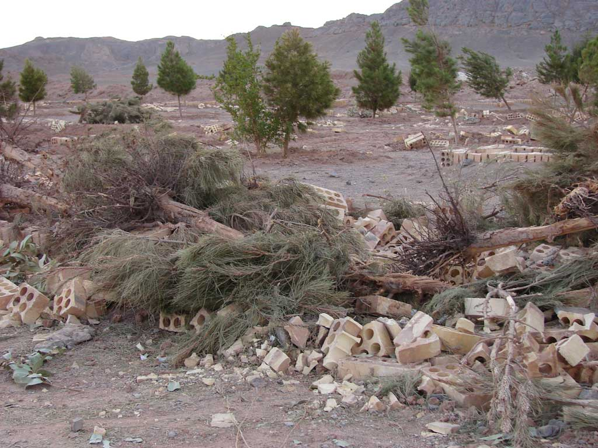

# বাহাই ধৰ্ম

*ব্ৰহ্মাণ্ডীয় ন্যায় ঘৰ, হাইফা*

*নতুন দিল্লী লটাছ মন্দিৰ বাহাই ধৰ্মৰ এক উপাসনাৰ স্থান*

বাহাই ধৰ্ম (ফাৰ্চী ভাষাত: بهائیت, আৰবী ভাষাত: بهائية) [ note 1 ] এটা একেশ্বৰবাদী ধৰ্ম যি সকলো মানুহৰ আধ্যাত্মিক ঐক্যত বিশ্বাস কৰে। [ 1 ] বাহাই ধৰ্মৰ তিনি মূল নীতি হ'ল: ঈশ্বৰৰ ঐক্য- এজন ঈশ্বৰেই সকলো সৃষ্টিৰ মূল; ধৰ্মৰ ঐক্য- সকলো ধৰ্মৰ উৎস এক; মানুহৰ ঐক্য- সকলো মানুহ সমান, বিভিন্ন জাতি, সংস্কৃতিয়ে বৈচিত্ৰ্যৰ মাজত ঐক্য বুজায় আৰু ই সন্মানীয়। [ 2 ] বাহাই শিক্ষাৰ মতে মানৱ জীৱনৰ লক্ষ্য ঈশ্বৰৰ মহত্ত্ব বুজি ঈশ্বৰৰ আৰাধনা কৰা, তেনে কৰিবলৈ মানুহে 'প্ৰাৰ্থনা', 'আত্মজ্ঞানৰ সন্ধান' আৰু 'মানৱ সেৱা' কৰিব লাগিব।

বাহাউল্লাহে এই ধৰ্ম ১৯ শতিকাৰ পাৰ্ছিয়াত প্ৰবৰ্তন কৰিছিল। সেই বাবেই তেওঁক পাৰ্ছিয়াৰ পৰা নিৰ্বাসিত কৰি অট্ট'মান সাম্ৰাজ্য লৈ খেদি দিয়া হয়, য'ত তেওঁৰ 'দোষী' ৰূপেই মৃত্যু হ'ল। বাহাউল্লাহৰ মৃত্যুৰ পিছত তেওঁৰ পুত্ৰ আব্দুল-বাহা ৰ দ্বাৰা এই ধৰ্মই পাৰ্ছিয়া আৰু অট্ট'মান সাম্ৰাজ্য পাৰ কৰি ইউৰোপ , আমেৰিকা পালেগৈ। বাহাই ধৰ্মই ইৰাণ তো স্থান পালে, য'ত পিছ বাহাইসকলে প্ৰতিকূল পৰিস্থিতি সহ্য কৰিব লগা হ'ল। [ 3 ] আব্দুল বাহাৰ মৃত্যুৰ পিছত বাহাই ধৰ্মৰ নেতৃত্ব নিৰ্বাচিত তথা চয়নিত মণ্ডলীৰ হাতলৈ গ'ল। [ 4 ] পৃথিৱীৰ ২০০তকৈও অধিক দেশত বৰ্তমান প্ৰায় ৫০ লাখ বাহাই ধৰ্মাৱলম্বী লোক আছে। [ 5 ] [ note 2 ]

বাহাই বিশ্বাস অনুসৰি ধৰ্মৰ ইতিহাসত কেইবাজনো ঐশ্বৰিক গুৰু আহিছে, যিসকলে স্থান আৰু মানুহৰ ক্ষমতা অনুসৰি ন-ন ধৰ্ম স্থাপন কৰিছে। বাহাই ঐশ্বৰিক গুৰুসকলৰ ভিতৰত আব্ৰাহমীয় ধৰ্মসমূহৰ মচেচ , যীশু খ্ৰীষ্ট , মহম্মদ , ধাৰ্মিক ধৰ্মসমূহৰ কৃষ্ণ , গৌতম বুদ্ধ আদিক গণ্য কৰা হয়। বাহাই ধৰ্মৰ শেহতীয়া ঐশ্বৰিক গুৰু বাব আৰু বাহাউল্লাহ। বিশ্বাস অনুযায়ী, প্ৰতিজন গুৰুৱে ঈশ্বৰৰ এক নিৰ্দেশক বিয়পালে, আৰু বাহাউল্লাহৰ জীৱন আৰু কৰ্ময়ো পূৰ্বৰ গুৰুসকলৰ শেষৰ আশ্বাসসমূহ ৰক্ষা কৰে। মানৱতা এটি ঐক্যবদ্ধ সৃষ্টি আৰু সকলোৰে উদ্দেশ্য সমগ্ৰ বিশ্বতে শান্তি, ন্যায় আৰু ঐক্য স্থাপন কৰা হোৱা উচিত। [ 6 ]

## নামকৰণ

বাহাই শব্দটো প্ৰকৃততে এটি বিশেষণ, বিশেষ্য নহয়। ই বাহাই ধৰ্মৰ কোনো এজন ধৰ্মাৱলম্বীক বুজায়, আৰু ধৰ্মটোক নুবুজায়। এই শব্দ আৰবী শব্দ বাহা ( بهاء )ৰ পৰা অহা, যাৰ অৰ্থ "মহিমা" বা "বৈভৱ"। [ note 3 ] ইংৰাজীত "বাহাইজম" (ইংৰাজী ভাষাত: Bahaism বা Baha'ism) শব্দৰ প্ৰচলন এতিয়াও দেখা যায়, পিছে অপমানজনক সূচাবলৈহে। [ 7 ] [ 8 ]

## বিশ্বাস

বাহাই ধৰ্মৰ তিনিটা মূল নীতি আছে-- ঈশ্বৰৰ ঐক্য, ধৰ্মৰ ঐক্য আৰু মানুহৰ ঐক্য। [ 2 ] এই তিনি নীতিৰ পৰাই এই বিশ্বাসৰ উদ্ভৱ হ'ল যে ঈশ্বৰে সময়ে সময়ে ঐশ্বৰিক বাৰ্তাবাহক পঠিয়াই যাৰ উদ্দেশ্য মানৱৰ চৰিত্ৰ সলনি কৰা আৰু 'যিসকলে শুনে', তেওঁলোকৰ নৈতিক আৰু আধ্যত্মিক উন্নতি সাধন কৰা। ধৰ্ম সেয়েহে ক্ৰমাগত, ঐক্যবদ্ধ আৰু কাল অনুসৰি উন্নত। [ 9 ]

## বিশ্বাস

### ঈশ্বৰ

*অষ্ট্ৰেলিয়াৰ এটা বাহাই মন্দিৰ*

বাহাই ধৰ্মই এজন, ব্যক্তিগত, নিষ্প্ৰাপ্য, সৰ্বজ্ঞ, সৰ্বত্ৰে বিৰাজমান, অক্ষয় আৰু সৰ্ব-শক্তিমান ঈশ্বৰত বিশ্বাস কৰে, যি ব্ৰহ্মাণ্ডৰ সকলো বস্তুৰেই স্ৰষ্টা। [ 10 ] ঈশ্বৰ আৰু ব্ৰহ্মাণ্ড সনাতন-- যাৰ কোনো আৰম্ভণি বা শেষ নাই। [ 11 ] যদিও প্ৰত্যক্ষভাৱে নিষ্প্ৰাপ্য, ঈশ্বৰ সৃষ্টিৰ বিষয়ে সাৱধান, আৰু সময়ে সময়ে নিজৰ ইচ্ছা বাৰ্তাবাহকৰ দ্বাৰা মানুহক জনায়। [ 12 ] [ 13 ]

বাহাই ধৰ্মৰ মতে ঈশ্বৰৰ ইমানেই মহান যে মানুহে কেতিয়াও ঈশ্বৰক সম্পূৰ্ণকৈ বুজিব নোৱাৰে, বা নিজেই ঈশ্বৰৰ প্ৰকৃত ছবি নিৰ্মাণ কৰিব নোৱাৰে। সেয়ে, ঈশ্বৰে ইচ্ছা কৰি যি জানিবলৈ দিছে, সেয়াহে জানিব পৰা যায়। [ 14 ] [ 15 ] এই ধৰ্মত ঈশ্বৰক প্ৰায়েই 'সৰ্ব-শক্তিমান' বা 'সকলোকে প্ৰেম কৰাজন' আদিৰে সম্বোধিত কৰা হয়। একেশ্বৰবাদতো বিশেষ গুৰুত্ব দিয়া হয়। খণ্ডনীয় নহ'লেও 'ত্ৰিমূৰ্তি'ৰ বিশ্বাসক বুজা-বুজি কৰিব পৰা বুলিহে ধৰা হয়। বাহাই ধৰ্মত সেই এজন ঈশ্বৰৰ সমকক্ষ কোনো নহয়। [ 16 ] বাহাই শিক্ষাই কয় যে ঈশ্বৰৰ বৰ্ণিত গুণসমূহে ঐশ্বৰিকতাক মানৱীয় বস্তুৰ সৈতে তুলনাহে কৰে, সেইবোৰক ঈশ্বৰৰ পূজাত ব্যৱহাৰ কৰি মানুহে ঈশ্বৰৰ জৰিয়তে নিজৰ ইচ্ছিত গুণাগুণ উপলব্ধি কৰিব পাৰে। [ 17 ] [ 18 ] বাহাই ধৰ্মৰ শিক্ষাৰ মতে মানুহৰ উদ্দেশ্য প্ৰাৰ্থনা, মানৱ সেৱা, আত্মজ্ঞান সন্ধান আদিৰে ঈশ্বৰৰ বিষয়ে জনা আৰু ঈশ্বৰক প্ৰেম কৰা। [ 17 ]

*আমেৰিকা যুক্তৰাষ্ট্ৰৰ এটি বাহাই পূজাঘৰত বিভিন্ন ধৰ্মৰ প্ৰতীক চিহ্ন*

## বিশ্বাস

### ধৰ্ম

বাহাই ধৰ্মৰ 'ক্ৰমাগত উজাগৰ'ৰ বিশ্বাসে বাহাই ধৰ্মত বিশ্বৰ বিভিন্ন ধৰ্মক স্বীকৃতি দিছে, যাৰ প্ৰবৰ্তক বা মুখ্য চৰিত্ৰ বাহাই ধৰ্মত ঈশ্বৰৰ বাৰ্তাবাহক ৰূপে স্বীকৃত। এই বিশ্বাসৰ মতে, প্ৰতিটো উজাগৰে পূৰ্বৰ উজাৰতকৈ এটি বহল দৃষ্টিভংগী দিয়ে। পিচে বিশ্বাসযোগ্যতা কম বা অধিকো হ'ব পাৰে-- কিন্তু প্ৰতিটোতে এটা সত্য লুকাই থাকে, [ 19 ] যি উজাগৰৰ স্থান আৰু সময় অনুযায়ী উপযুক্ত। [ 20 ] বিশেষ ধৰ্মীয় নিয়ম, যেনে পূজা কৰাৰ দিশ, খাদ্যাভ্যাস আদি পিচলৈ সময় অনুযায়ী বেলেগো হ'ব পাৰে। পিচে, আন কিছু নিয়ম যেনে দয়া, কাষৰীয়াক সহায় কৰা আদি সদায় উপযুক্ত আৰু সলনি কৰিব নোৱাৰি। এই ক্ৰমাগত উজাগৰৰ প্ৰক্ৰিয়া কেতিয়াও শেষ নহয়, পিচে, ই চক্ৰৰ দৰে। বাহাইসকলে বাহাউল্লাহৰ উজাগৰৰ পিছত ১০০০ বছৰৰ ভিতৰত আন কোনো উজাগৰ হ'ব বুলি বিশ্বাস নকৰে। [ 21 ]

বাহাই বিশ্বাসসমূহ কেতিয়াবা পূৰ্বৰ ধৰ্মীয় বিশ্বাসসমূহৰ সংমিশ্ৰণ বুলি কোৱা হয়। [ 22 ] পিচে বাহাই ধৰ্মাৱলম্বীসকলে কয় যে তেওঁলোকৰ ধৰ্ম আন ধৰ্মৰ পৰা পৃথক আৰু তেওঁলোকৰ পৃথক শাস্ত্ৰ, শিক্ষা, নিয়ম আৰু ইতিহাস আছে। [ 20 ] [ 23 ] যদিও আগতে বাহাই ধৰ্মক ইছলাম ধৰ্মৰে এটি অংগ বুলি কোৱা হৈছিল, বৰ্তমানৰ বিশেষজ্ঞসকলে বাহাই ধৰ্মক এটি স্বাধীন ধৰ্ম হিচাপে গ্ৰহণ কৰে যাৰ উৎস শ্বিয়া ইছলাম, যিদৰে খ্ৰীষ্টান ধৰ্মৰ উৎস জিউ ধৰ্ম। [ 24 ] ছুন্নি আৰু শ্বিয়া, দুয়ো ফৈদৰ মুছলমান প্ৰশাসনেই বাহাইসকলক ধাৰ্মিক পক্ষত্যাগী বা নিজা ধৰ্মত্যাগী বুলি গণ্য কৰে, আৰু সেইবাবেই কোনো কোনো ঠাইত বাহাইসকলে নিৰ্যাতন ভোগ কৰিব লগীয়া হৈছে। [ 25 ] [ 26 ] বাহাইসকলে নিজৰ ধৰ্মক নিজৰ সময়ৰ আন কোনো ধৰ্মতকৈ পৃথক আখ্যা দিয়ে, আৰু বাহাউল্লাহৰ বাণীৰ বৰ্তমান যুগৰ সৈতে খাপ খোৱা দৰ্শাই। [ 27 ] বাহাউল্লাহে পূৰ্বৰ বাৰ্তাবাহকসকলৰ প্ৰত্যাশা পূৰণ কৰা বুলি কোৱা হয়।

## বিশ্বাস

### মানুহ

*বাহাই ৰিংষ্ট'ন চিহ্ন*

বাহাই ধৰ্মৰ মতে মানুহৰ তৰ্ক কৰিব পৰা আত্মা আছে, যিয়ে মানুহক আন জীৱৰ পৰা পৃথক কৰে আৰু মানুহে ঈশ্বৰ তথা নিজৰ আৰু ঈশ্বৰৰ মাজৰ সম্পৰ্কটো বুজিব পাৰে। প্ৰতিজন মানুহৰে এইটো এটি কৰ্তব্য যে তেওঁ তেওঁৰ বাৰ্তাবাহকৰ দ্বাৰা ঈশ্বসসক চিনি পায় আৰু তেওঁৰ আদেশ মানে। [ 28 ] চিনাক্তকৰণ আৰু বাধ্যতা, মানৱ সেৱা, দৈনিক প্ৰাৰ্থনা আৰু আধ্যাত্মিক কৰ্মৰে মানুহৰ আত্মা ঈশ্বৰৰ অধিক ওচৰলৈ যায়, যি বাহাই ধৰ্মৰ আদৰ্শ। মানুহৰ মৃত্যুৰ পিছত আত্মা অন্য জগতলৈ যায়, য'ত তেওঁক শাৰীৰিক পৃথিৱীৰ আধ্যাত্মিক উন্নতিৰ আধাৰত বিচাৰ কৰা হয় আৰু আধ্যাত্মিকভাৱে আগবঢ়োৱা হয়। স্বৰ্গ আৰু নৰক কোনো শাৰীৰিক পুৰস্কাৰ বা দণ্ডৰ ঠাই নহয়, ই মানৱ আত্মাৰ ঈশ্বৰৰ পৰা দূৰত্বকহে সূচাই। [ 29 ]

বাহাই ধৰ্মীয় গ্ৰন্থসমূহে মানুহৰ সমতা আৰু ভেদভাৱ দূৰ কৰাৰ ওপৰত গুৰুত্ব দিয়ে। মানৱীয়তা 'এক' ৰূপে চোৱা হয়, যদিও অতিকৈ বিচিত্ৰতাপূৰ্ণ। মানুহৰ জাতিগত আৰু সাংস্কৃতিক ভেদক প্ৰশংসনীয় বোলা হয়। বৰ্ণবাদ, ৰাষ্ট্ৰীয়তাবাদ, জাতি, সামাজিক শ্ৰেণী আৰু লিংগভিত্তিক পৃথক্কৰণ মানৱীয় ঐক্যৰ ক্ষেত্ৰত কৃত্ৰিম বাধা। [ 2 ] বাহাই শিক্ষাৰ মতে মানৱীয় একীকৰণ বৰ্তমানৰ ধাৰ্মিক আৰু ৰাজনৈতিক জগতৰ প্ৰধানতম বিষয়। [ 20 ]

## বাহাই শিক্ষা

### সংক্ষিপ্ত

তলত ১৯২১ৰ পৰা ১৯৫৭ চনলৈ নিৰ্বাচিত বাহাই নেতা শ্বঘি এফেণ্ডি য়ে লিখা সংক্ষিপ্ত বিৱৰণি দিয়া হ'ল, যি তেওঁৰ মতে বাহাউল্লাহৰ বাণীৰ বিশেষত্ব দৰ্শাই, আৰু কিতাব-ই-আকদাছ ৰ সৈতে বাহাই ধৰ্মৰ মূল:

## বাহাই শিক্ষা

### সামাজিক নীতি

তলত উল্লিখিত নীতিসমূহ প্ৰায় বাহাই শিক্ষাৰ সংক্ষেপ বোলা হয়। এই তালিকাখন আব্দুল বাহাৰ ১৯১২ৰ ইউৰোপ আৰু আমেৰিকা ভ্ৰমণৰ বক্তৃতাৰ পৰা লোৱা হৈছে। [ 31 ] [ 32 ] তালিকাখন প্ৰশাসনিক নহয়, এনেধৰণৰ কেইবাখনো তালিকাৰ প্ৰচলন আছে। [ 23 ] [ 33 ]

- ঈশ্বৰৰ ঐক্য
- ধৰ্মৰ ঐক্য
- মানুহৰ ঐক্য
- বৈচিত্ৰ্যৰ মাজত ঐক্য
- পুৰুষ আৰু মহিলাৰ সমতা
- সকলো প্ৰকাৰৰ ভেদভাৱ বৰ্জন কৰা
- বিশ্ব শান্তি আৰু নতুন বৈশ্বিক ক্ৰম
- ধৰ্ম আৰু বিজ্ঞানৰ সামঞ্জস্য
- সত্যৰ স্বতন্ত্ৰ সন্ধান
- সদা-বিকাশশীল সভ্যতাৰ নীতি
- ব্ৰহ্মাণ্ডীয় বাধ্যতামূলক শিক্ষা
- ব্ৰহ্মাণ্ডীয় সহায়ক ভাষা [ 34 ]
- চৰকাৰৰ বাধ্য হোৱা, আইনে বিশ্বাসক আঘাত নকৰালৈকে পৃথক্কৰণৰ ৰাজনীতি নকৰা
- [ note 4 ]
- ধন আৰু দাৰিদ্ৰ্যৰ অতি বৰ্জন কৰা

বিশ্ব শান্তিৰ ধাৰণাক বিশেষ গুৰুত্ব দি বাহাউল্লাহে উমৈহতীয়া সুৰক্ষাৰ ব্যৱস্থাৰ কথা কৈছিল যি স্থায়ী শান্তিৰ বাবে প্ৰয়োজনীয়। [ 35 ]

## বাহাই শিক্ষা

### ৰহস্যময়ী শিক্ষা

যদিও বাহাই শিক্ষাই সামাজিক আৰু নৈতিক ক্ষেত্ৰতহে অধিক গুৰুত্ব দিয়ে, কিছুসংখ্যক মৌলিক লেখক ৰহস্যময়ী আখ্যা দিয়া হয়। [ 20 ] "সাত উপত্যকা"ক বাহাউল্লাহৰ "বৃহত্তম ৰহস্যময়ী ৰচনা" বোলা হয়। এই ৰচনা এজন চুফীবাদৰ বিশ্বাসীলৈ লিখা হৈছিল, আটাৰ নেইচাপুৰীৰ ধৰণত, যি এজন ফাৰ্চী মুছলমান লেখক। এই লেখাত আত্মাৰ ঈশ্বৰৰ ওচৰলৈ যোৱা পথৰ বিভিন্ন স্তৰৰ কথা কোৱা হয়। এই লেখা প্ৰথম ১৯০৬ চনত ইংৰাজীলৈ অনুবাদ কৰা হৈছিল। এই গ্ৰন্থ পশ্চিমীয়া জগতত উপলব্ধ বাহাউল্লাহৰ প্ৰথম লেখসমূহৰ মাজত এখন আছিল। "গুপ্ত শব্দসমূহো" তেনে এখন গ্ৰন্থ, য'ত ১৫৩টা সৰু অংশ আছে। বাহাউল্লাহে বিভিন্ন আধ্যাত্মিক সত্যৰ সাৰাংশ তাত লিখাৰ কথা দাবী কৰে। [ 36 ]

## বাহাই শিক্ষা

### চুক্তি

বাহাই শিক্ষাই "বৃহত্তৰ চুক্তি"ৰ, যি ব্ৰহ্মাণ্ডীয় আৰু অশেষ, আৰু "ক্ষুদ্ৰতৰ চুক্তি"ৰ, যি প্ৰতিটো ধৰ্মৰ বাবে বেলেগ, কথা কয়। ক্ষুদ্ৰতৰ চুক্তি ঈশ্বৰৰ বাৰ্তাবাহক আৰু বিশ্ববাসীসকলৰ মাজৰ, ই সামাজিক নীতি, ধাৰ্মিক প্ৰশাসন আদি সামৰে। বাহাইসকলে বাহাউল্লাহৰ উজাগৰক তেওঁলোকৰ ক্ষুদ্ৰতৰ চুক্তি বুলি বিশ্বাস কৰে। [ 37 ] বৃহত্তৰ চুক্তি ঈশ্বৰ আৰু ঈশ্বৰ আৰু মানুহৰ মাজৰ চুক্তি। ঈশ্বৰৰ বাৰ্তাবাহক প্ৰায় প্ৰতি ১০০০ বছৰৰ পিছত পৃথিৱীলৈ আহে, সংকটৰ সময়ত।

ঐক্য বাহাই ধৰ্মৰ গুৰুত্বপূৰ্ণ অংগ, সেয়েহে বাহাইসকলে এটি প্ৰশাসনক মানে, যি তেওঁলোকৰ মতে ঐশ্বৰিকভাৱে প্ৰাপ্ত, বিভাজন কৰা ঐক্যক বাধিত কৰাৰ অপচেষ্টা বুলি বিশ্বাস কৰা হয়, যি বাহাউল্লাহৰ শিক্ষাৰ বিপৰীত। বাহাই প্ৰশাসনৰ উত্তৰাধিকাৰীক লৈ বিবাদৰ সৃষ্টি হৈছিল, কিন্তু কোনো বিভাগেই বিশেষ সাফল্য লাভ কৰিবলৈ সক্ষম নহ'ল। [ 38 ] তেনে বিভাগৰ বাশ্বাসীক "চুক্তি ভংগকাৰী" আখ্যা দিয়া হয় আৰু তেওঁলোকৰ সৈতে যিকোনো প্ৰকাৰৰ যোগাযোগ বন্ধ কৰি দিয়া হয়। [ 37 ] [ 39 ]

## ধৰ্মবৈধানিক লেখ

বাব, বাহাউল্লাহ, আব্দুল বাহা, শ্বগি এফেণ্ডি আৰু ব্ৰহ্মাণ্ডীয় ন্যায় ঘৰৰ লেখাসমূহ, আৰু আব্দুল বাহাৰ বক্তৃতাসমূহক একেলগে ধৰ্মবৈধানিক লেখ বোলা হয়। বাব আৰু বাহাউল্লাহৰ লেখাসমূহক ঐশ্বৰিক বাৰ্তা বুলি বিশ্বাস কৰা হয়, আব্দুল বাহা আৰু শ্বঘি এফেণ্ডিৰ ক্ৰমে বক্তৃতা আৰু লেখাসমূহক আধিকাৰিক ব্যাখ্যা আৰু ব্ৰহ্মাণ্ডীয় ন্যায় ঘৰৰ লেখাসমূহক প্ৰশাসনিক বিধান আৰু ব্যাখ্যা বোলা হয়। সকলো লেখাতেই অলপ হ'লেও ঐশ্বৰিক তত্ত্ব থকাৰ কথা কোৱা হয়। [ 40 ] বাহাউল্লাহৰ কিছু গুৰুত্বপূৰ্ণ লেখ হ'ল কিতাব-ই-আকদাছ (আতাইতকৈ ঐশ্বৰিক গ্ৰন্থ), যি নিয়মৰ কিতাপ, [ 41 ] কিতাব-ইকান, যি বাহাই বিশ্বাসৰ মান্য গ্ৰন্থ, জেম্ছ অৱ দিভাইন মিষ্ট্ৰি, চেভেন ভেলিজ, ফ'ৰ ভেলিজ আদি।

## সাধাৰণ তথ্য

*নতুন দিল্লী ৰ লটাছ মন্দিৰ*

এটি বাহাই উৎসৰ মতে ১৯৮৬ চনত বাহাই ধৰ্মাৱলম্বীৰ সংখ্যা পৃথিৱীত ৪.৭৪ মিলিয়ন, যি ৪.৪ %ৰ হাৰত বৃদ্ধি পাইছে। [ 42 ] ১৯৯১ৰ পিছৰ বাহাই উৎসসমূহে সাধাৰণতে বাহাইসকলৰ সংখ্যা ৫ মিলিয়নতকৈ অধিক বুলি গণ্য কৰে। [ 43 ] ৱৰ্ল্ড খ্ৰিষ্টিয়ান এন্সাইক্ল'পিডিয়া"ৰ মতে ২০০০ চনত প্ৰায় ৭.১ মিলিয়ন বাহাই ২১৮ দেশত বিয়পি আছিল, [ 44 ] আৰু ২০১০ চনত ৭.৩ মিলিয়ন। [ 45 ] তেওঁলোক আৰু ক'লে যে: "বাহাই ধৰ্মই একমাত্ৰ এটি ধৰ্ম যাৰ বিশ্বাসীৰ সংখ্যাৰ বৃদ্ধিৰ হাৰ ৰাষ্ট্ৰসংঘ ৰ প্ৰতিটো প্ৰান্ততে মুঠ জনসংখ্যাৰ বৃদ্ধিৰ হাৰতকৈ অধিক; অৰ্থাৎ ১৯২০ৰ পৰা ২০১০ৰ ভিতৰত বাহাই ধৰ্ম পৃথিৱীৰ আতাইতকৈ দ্ৰুত গতিত বৃদ্ধি পোৱা ধৰ্ম। " [ 46 ] এই উৎসৰ একমাত্ৰ সমস্যাটো হ'ল যে এই উৎসই আনতকৈ খ্ৰীষ্টিয় ধৰ্মীয়সকলৰ জনসংখ্যাৰ ওপৰত গুৰুত্ব দিয়ে। [ 47 ]

পাৰ্চিয়া আৰু অট্টমান সাম্ৰাজ্যত আৰম্ভ হোৱাৰ পিছৰে পৰাই দক্ষিণ এচিয়া, দক্ষিণ পূব এচিয়া, ইউৰোপ, উত্তৰ আমেৰিকা আদিত অনেকে এই ধৰ্ম গ্ৰহণ কৰিছে। ১৯৫০ আৰু ১৯৬০ৰ দশকৰ ভ্ৰমণ আৰু শিক্ষাদানে এই ধৰ্মক বিশ্বৰ প্ৰতিখন দেশ পোৱালেগৈ। ২১ শতিকাৰ আৰম্ভণিৰে পৰা এই ধৰ্ম গ্ৰহণ কৰা মানুহৰ সংখ্যা অতিকৈ বৃদ্ধি পাইছে। বাহাই ধৰ্ম বৰ্তমান ইৰান , পানামা আৰু বেলাইজ ৰ সৰ্ববৃহৎ ধৰ্মীয় সংখ্যালঘু গোষ্ঠী। [ 48 ] [ 49 ] [ 50 ] বলিভিয়া , জাম্বিয়া আৰু পাপুৱা নিউ গুয়ানা ৰ ২য় সৰ্ববৃহৎ আন্তঃৰাষ্ট্ৰীয় ধৰ্ম। [ 51 ] [ 52 ] [ 53 ] ই কেনিয়া, চাদ আদিতো জনপ্ৰিয়।

ৱৰ্ল্ড আল্মানাক এণ্ড বুক অৱ ফেক্টছ, ২০০৪ৰ মতে প্ৰায়সকল বাহাই এছিয়া ত থাকে (৩.৬ মিলিয়ন), আফ্ৰিকা ত ১.৮ মিলিয়ন, লেটিন আমেৰিকা ত ৯ লাখ বাহাই থাকে। প্ৰায়সকল বাহাই ভাৰত ত থাকে (২২ লাখ), তাৰ পিছত ইৰাণ (৩.৫ লাখ), আমেৰিকা যুক্তৰাষ্ট্ৰ (১.৫ লাখ)। বৰ্তমানে কোনো দেশতে বাহাইসকল সংখ্যাগৰিষ্ঠ নহয়। [ 54 ] }}

"ব্ৰিটেনিকা বুক অৱ দা ইয়েৰ"ৰ মতে বাহাই ধৰ্ম বিশ্বৰ আতাইতকৈ বিস্তৃত ধৰ্ম, বিশ্বাসীসকলে বাস কৰা দেশৰ সংখ্যা অনুসৰি। ব্ৰিটেনিকাৰ মতে ২০০২ চনত ২৪৭খন দেশৰ ২১০০তকৈও অধিক ভিন ভিন সংস্কৃতিৰ লোকে বাহাই ধৰ্মত বিশ্বাস কৰিছিলে। বাহাই গ্ৰন্থসমূহ পৃথিৱীৰ প্ৰায় ৮০০ ভাষাত অনুবাদ কৰা হয়। [ 55 ]

২০০৭ চনত ফৰে'ন পলিচি আলোচনীৰ এক সমীক্ষামতে বাহাই ধৰ্ম পৃথিৱীৰ আতাইতকৈ খৰকৈ বৃদ্ধি পোৱা ধৰ্ম (১.৭%)।

## বাহাইসকলৰ নিপীড়ন

*য়াজ্ডত চৰকাৰে অপবিত্ৰ কৰা এটা বাহাই শ্মশান*

বিভিন্ন ইছলামিক দেশত এতিয়াও বাহাইসকলে নিপীড়ন ভোগ কৰিবলগীয়া হয়, কাৰণ ইছলামিক নেতাসকলে বাহাই ধৰ্মক এটি স্বতন্ত্ৰ ধৰ্ম জ্ঞান নকৰে আৰু কেৱল ইছলাম বিৰোধী এক ফৈদ বুলি ভাবে। আতাইতকৈ নিকৃষ্ট উদাহৰণ ইৰান ৰ, য'ত ১৯৭৮ৰ পৰা ১৯৯৮ৰ ভিতৰত ২০০জন বাহাইক মৃত্যুদণ্ড বিহা হৈছিল আৰু ইজিপ্ট ৰ। [ 48 ] বাহাইসকলৰ অধিকাৰ কম বেছি পৰিমাণে বিভিন্ন দেশত খৰ্ব কৰা হৈছে, যেনে আফঘানিস্তান ত, [ 56 ] ইণ্ডোনেচিয়া ত, [ 57 ] ইৰাক ত, [ 58 ] ম'ৰ'ক' ত [ 59 ] [ 60 ] আৰু আফ্ৰিকাৰ কিছু অংশত। [ 61 ]

## বাহাইসকলৰ নিপীড়ন

### ইৰান

ইৰানৰ বৰ্তমানৰ চৰকাৰসমূহে বাহাইসকলৰ লগত কৰা ব্যৱহাৰৰ লগত ইতিহাসত মুছলমান নেতাসকলে ধাৰ্মিক সংখ্যালঘুক উৎপীড়ন দিয়াৰ চেষ্টা জড়িত। যেতিয়া বাবে বৃহৎ সংখ্যক বিশ্বাসী গোটাবলৈ আৰম্ভ কৰিলে, তেতিয়াৰ নেতাসকলে ভাবিলে বাবৰ বিশ্বাসীসকলক ঈশ্বৰৰ শত্ৰু ঘোষণা কৰি তেওঁলোকে ধৰ্মটো প্ৰসাৰিত হোৱাৰ পৰা ৰখাব পাৰিব। ইয়াৰ ফল স্বৰূপে ভিৰৰ দ্বাৰা আক্ৰমণ আৰু ৰাজহুৱা দণ্ড আদি দেখা গ'ল। [ 3 ] ২০ শতিকাত বাহাইসকলক ব্যক্তিগত আক্ৰমণ কৰাৰ লগতে সমগ্ৰ বাহাই গোষ্ঠীক আক্ৰমণ কৰা সংগঠনো গঠিত হ'ল। [ 62 ] এবাৰ য়াজ্ডত শতাধিক বাহাইৰ হত্যা কৰা হ'ল। [ 63 ] তেহৰানত তাৰবিয়াত বইজ এণ্ড গাৰ্লছ স্কুলৰ দৰে বিভিন্ন বাহাই শিক্ষানুষ্ঠান ১৯৩০ আৰু ৪০ৰ দশকত বন্ধ কৰি দিয়া হ'ল। বাহাই বিবাহকো স্বীকৃতি দিয়া বন্ধ কৰি দিয়া হ'ল। বাহাই লেখাসমূহৰ ওপৰত তীক্ষ্ণ নজৰ ৰখা হৈছিল। [ 62 ] [ 64 ]

মহম্মদ ৰেজা পাহ্লাভি ৰ ৰাজত্ব কালত অৰ্থনীতিৰ পতন আৰু ৰাষ্ট্ৰীয়তাবাদী আন্দোলনৰ পৰা সকলোৰে ধ্যান আতৰাবলৈ বাহাইসকলক উৎপীড়ন কৰাৰ এক প্ৰকল্প আৰম্ভ কৰা হ'ল। [ note 5 ] ১৯৫৫ চনত এটি সিদ্ধ আৰু সমন্বিত বাহাই বিৰোধী প্ৰকল্প আৰম্ভ কৰা হ'ল, যাৰ প্ৰভাৱত ৰাষ্ট্ৰীয় অনাতাৰ কেন্দ্ৰ আৰু চৰকাৰী বাতৰি কাকতসমূহৰ বাহাই ধৰ্ম বিৰোধী পৰিভেশৰ সৃষ্টি কৰা হৈছিল। [ 62 ] ১৯৭০ৰ দশকত শ্বাহৰ ৰাজত্বৰ ওৰ পৰিল, বিশেষকৈ পশ্চিমীয়া আদৰ্শ প্ৰচাৰ কৰাৰ বাবে। শ্বাহৰ বিৰুদ্ধে হোৱা আন্দোলনৰ এটা মুখ্য বিষয় আছিল যে শ্বাহৰ কিছু সংখ্যক পৰামৰ্শদাতা আছিল 'বাহাই'। [ 65 ] বাহাইসকলক অৰ্থনৈতিক সংকটৰ চিন, ইজৰাইল আৰু পাশ্চাত্যৰ সমৰ্থকৰ ৰূপত চোৱা হৈছিল, সেয়েহে বাহাইসকলৰ বিৰুদ্ধে অধিক লোক আগ বাঢ়ি আহিল। [ 62 ] [ 66 ]

১৯৭৯ চনৰ ইৰানীয় বিপ্লৱৰ পিছৰে পৰা ইৰানত নিতৌ বাহাইসকলৰ ঘৰত আক্ৰমণ হ'বলৈ ল'লে, আৰু তেওঁলোকে চৰকাৰী চাকৰি কৰা আদিত বাধাৰ সৃষ্টি হ'ল। শেহতীয়াকৈ বাহাই ষ্টাডি চাৰ্কালত যোগদান কৰাৰ বাবে অনেকে মৃত্যুৰ ভাবুকি লাভ কৰিছিল। [ 48 ] বাহাই শ্মশান আদি অপবিত্ৰ কৰা হয়, সম্পত্তি কাঢ়ি লোৱা হয়, আৰু কেতিয়াবা ধ্বংসও কৰা হয়, যাৰ ভিতৰত বাহাউল্লাহৰ পিতৃ মিৰ্জা বুজুৰ্গৰ ঘৰো আছে। [ 3 ] শ্বিৰাজৰ বাবৰ ঘৰ ২বাৰকৈ ভঙা হৈছিল। [ 3 ] [ 67 ] [ 68 ]

য়ু এছ পেনেলৰ মতে, মহমুদ আহমদিনেজাদৰ ৰাষ্ট্ৰপতিত্বৰ কালত বাহাইসকলৰ ওপৰত আক্ৰমণ বৃদ্ধি পালে। [ 69 ] [ 70 ] য়ুনাইটেড নেচন্স কমিচন অন হিউমেন ৰাইৎছে ২০০৫ চনৰ ইৰানৰ সশস্ত্ৰ বাহিনীৰ কামাণ্ড হেডকুৱাৰ্টাৰ্ছৰ পৰা অহা এখন গোপন চিঠি প্ৰকাশ কৰিলে যিয়ে সদস্যসকলক বাহাইসকলক চিনাক্ত কৰি তীব্ৰ নজৰ ৰখাৰ আদেশ দিয়া আছিল। এই চিঠিৰ ওপৰত ভিত্তি কৰি য়ুনাইটেড নেচন্স কমিচন অন হিউমেন ৰাইৎছৰ স্পেচিয়েল ৰাপৰ্টিয়ুৰে ক'লে যে "এনে ধৰণে নজৰ ৰখাৰ পৰা সংগ্ৰহিত তথ্য বাহাইসকলৰ উৎপীড়ন আৰু বাহাইসকলৰ বিৰুদ্ধে হোৱা পক্ষপাতিত্বক বৃদ্ধি কৰিবলৈ ব্যৱহাৰ হওৱাৰ সম্ভাৱনা আছে, আন্তঃৰাষ্ট্ৰীয় মানক আধাৰ কৰি"। স্পেচিয়েল ৰিপৰ্টিয়ুৰৰ মতে ইৰানত ধৰ্মীয় সংখ্যালঘুসকলৰ অৱস্থা অৱনমিত হৈছে। [ 71 ]

১৪ মে' , ২০০৮ চনত বাহাইসকলৰ প্ৰতি সহানুভূতিশীল অনানুষ্ঠানিক সংগঠন "ফ্ৰেণ্ডছ"ৰ সদস্যসকলক গ্ৰেপ্তাৰ কৰি এভিন প্ৰিজনলৈ লৈ যোৱা হ'ল। [ 69 ] [ 72 ] ফ্ৰেণ্ডছৰ কোৰ্টৰ কেছ কেইববাৰো বাতিল কৰা হৈছিল, পিচে অন্তত ১২ জানুৱাৰী ২০১০ত ব্যৱস্থা লোৱা হ'ল। [ 73 ] অন্য লোকক ন্যায়ালয়ত প্ৰবেশ কৰাৰ অনুমতি প্ৰদান কৰা হোৱা নাছিল। ২ বছৰে অত্যন্ত কষ্টৰে আচামীৰ লগত যোগাযোগ কৰা দিফেঞ্চ লয়াৰসকলেও অত্যন্ত কষ্টৰ পিছতহে কোৰ্টত প্ৰবেশৰ অনুমতি লাভ কৰিলে। য়ু এছ কমিচন অন ইণ্টাৰ্নেচনেল ৰিলিজিয়াছ ফ্ৰিদমে ক'লে যে এনে লাগিছিল যেন চৰকাৰে ফলাফল পূৰ্বেই নিৰ্ধাৰিত কৰি থৈছিল, আন্তঃৰাষ্ট্ৰীয় মানৱ অধিকাৰ আইন ভংগ কৰি। পিছলৈ ৭ ফেব্ৰুৱাৰি, ১২ এপ্ৰিল আৰু ১২ জুনত [ 74 ] [ 75 ] [ 76 ] কোৰ্ট বহি ১১ আগষ্ট ২০১০ত আতাইকেইটা আচামীক ২০ বছৰৰ কাৰাদণ্ড বিহিলে [ 77 ] যাক পিছলৈ ১০ বছৰলৈকে কমোৱা হ'ল। [ 78 ]

## বাহাইসকলৰ নিপীড়ন

### ইজিপ্ত

১৯৬০ৰ পৰা ইজিপ্তত বাহাই সংগঠন আৰু সামাজিক কৰ্ম নিষিদ্ধ। সকলো বাহাই সামাজিক সম্পত্তি, যেনে বাহাই কেন্দ্ৰ, শ্মশান, গ্ৰন্থাগাৰ আদি আৰু বাহাইসকলক ধৰ্ম বিৰোধী বুলি ফাটৱা বাহিৰ কৰা হয়। [ 79 ]

১৯৯০ত ইজিপ্তৰ "আইডেণ্টিফিকেচন কাৰ্ড কণ্ট্ৰভাৰ্চি" আৰম্ভ হ'ল, যেতিয়া চৰকাৰে সকলো পৰিচয় পত্ৰৰ বৈদ্যুতিক চিনাক্তকৰণ আধুনীকৃত কৰিলে। সমস্যাটো হ'ল যে পৰিচয় পত্ৰত এজন ব্যক্তিৰ ধৰ্ম কেৱল ইছলাম , খ্ৰীষ্টান বা জিউ হে হ'ব পাৰে, যি ৩ ধৰ্মক চৰকাৰে স্বীকৃতি প্ৰদান কৰিছিল। ফল স্বৰূপে বাহাইসকলে জন্মৰ প্ৰমাণ পত্ৰ, পৰিচয় পত্ৰ, মৃত্যুৰ প্ৰমাণ পত্ৰ, বিবাহ বা বিচ্ছেদৰ প্ৰমাণপত্ৰ আদি লাভ কৰিবলৈ সক্ষম নহ'ল, যদিহে তেওঁলোকে নিজৰ ধৰ্মৰ বিষয়ে অসত্য নক'লে, যি বাহাই ধৰ্মৰ নীতিৰ বিৰুদ্ধে। সেয়েহে তেওঁলোকে ভোট দিয়া, শিক্ষা গ্ৰহণ কৰা, স্বাস্থ্য সেৱা লাভ কৰা আদিত বাধাৰ সৃষ্টি হ'ল। [ 80 ] ১৪ এপ্ৰিল ২০০৯ত আইন সলোৱা হ'ল, আৰু বাহাইসকলৰ দশা উন্নীত হ'ল। পৰিচয় পত্ৰত পূৰ্বে উল্লিখিত ৩ ধৰ্মৰ লগতে অন্য ধৰ্মৰ বাবে 'ডেচ' বা '-' দিয়াৰ ব্যৱস্থা কৰা হ'ল।

## উদ্ধৃতি

- "Haykal" . About.com. 14 November 2011 . http://altreligion.about.com/od/symbols/ig/Pentagrams/Haykal.htm । আহৰণ কৰা হৈছে: 23 February 2012 .
- Abrahamian, Ervand (1982). [[[:সাঁচ:Google book]] Iran Between Two Revolutions ]. Princeton Book Company Publishers. ISBN 0-691-10134-5 . সাঁচ:Google book .
- Adherents (18 October 2001). "Baha'i Houses of Worship" . Archived from the original on 17 June 2006 . http://www.adherents.com/largecom/bahai_HoW.html । আহৰণ কৰা হৈছে: 14 June 2006 .
- Affolter, Friedrich W. (January 2005). "The Specter of Ideological Genocide: The Bahá'ís of Iran" (PDF). War Crimes, Genocide, & Crimes against Humanity খণ্ড 1 (1): 75–114. Archived from the original on 22 July 2012 . https://web.archive.org/web/20120722083412/http://www.altoona.psu.edu/journals/war-crimes/articles/V1/v1n1a3.pdf । আহৰণ কৰা হৈছে: 31 May 2006 .
- AFP (16 February 2011). "Families fear for Bahais jailed in Iran" . http://www.alternet.org/rss/breaking_news/468685/families_fear_for_bahais_jailed_in_iran .
- AFP (31 March 2011). "US 'troubled' by Bahai reports from Iran" . http://www.alternet.org/rss/breaking_news/545341/us_%27troubled%27_by_bahai_reports_from_iran .
- Afshari, Reza (2001). Human rights in Iran: the abuse of cultural relativism . University of Pennsylvania Press. পৃষ্ঠা. 119–120. ISBN 0-8122-3605-X .
- Akhavi, Shahrough (1980). Religion and Politics in Contemporary Iran: Clergy-State Relations in the Pahlavi Period . প্ৰকাশক Albany, New York: State University of New York Press. পৃষ্ঠা. 76–78. ISBN 0-87395-408-4 . https://books.google.com/books?id=M667jZhe2AMC&pg=PA76 .
- The Association of Religion Data Archives (2010). "Most Baha'i Nations (2010)" . http://www.thearda.com/QL2010/QuickList_40.asp । আহৰণ কৰা হৈছে: 20 August 2013 .
- Bahá'í International Community (6 June 2000). "History of Active Cooperation with the United Nations" (Press release) . http://www.bic.org/statements/bahai-international-community-history-active-cooperation-united-nations । আহৰণ কৰা হৈছে: 25 September 2013 .
- Bahá'í International Community (2005). "History of Bahá'í Educational Efforts in Iran" . Closed Doors: Iran's Campaign to Deny Higher Education to Bahá'ís . http://denial.bahai.org/003.php .
- "Nine-Pointed Star, The:History and Symbolism by Universal House of Justice 1999-01-24" . http://bahai-library.com/uhj_nine_pointed_star । আহৰণ কৰা হৈছে: 23 February 2012 . [ সংযোগবিহীন উৎস ]
- Baha'is of Warwick (12 October 2003). "Baha'i Marriage" . Archived from the original on 28 May 2006 . http://www.netcomuk.co.uk/~vickers/warwick_bookshop/pages/marriage.html । আহৰণ কৰা হৈছে: 14 June 2006 .
- Bahá'í World News Service (8 September 2000). "Bahá'í United Nations Representative Addresses World Leaders at the Millennium Summit" . Bahá'í International Community. Archived from the original on 22 April 2006 . http://www.bahai.org/article-1-1-0-3.html । আহৰণ কৰা হৈছে: 1 June 2006 .
- Bahá'í World News Service (14 April 2005). "Bahá'í International Community dismayed at lack of Human Rights Resolution on Iran" . Bahá'í International CommunityNewswire . http://www.i-newswire.com/bah-international-community-dismayed/a15160 । আহৰণ কৰা হৈছে: 25 September 2013 .
- Bahá'í World News Service (17 April 2009). "Egypt officially changes rules for ID cards" . Bahá’í International Community . http://news.bahai.org/story/707 । আহৰণ কৰা হৈছে: 16 June 2009 .
- Bahá'í World News Service (14 August 2009). "First identification cards issued to Egyptian Bahá'ís using a "dash" instead of religion" . http://news.bahai.org/story/726 । আহৰণ কৰা হৈছে: 16 August 2009 .
- Bahá'í World News Service (2010). "Statistics" . Bahá'í International Community . http://news.bahai.org/media-information/statistics/ । আহৰণ কৰা হৈছে: 5 March 2010 .
- Bahá'í World News Service (22 April 2012). "Plans to build new Houses of Worship announced" . Bahá’í International Community . http://news.bahai.org/story/906 । আহৰণ কৰা হৈছে: 22 April 2012 .
- Balyuzi, Hasan (2001). `Abdu'l-Bahá: The Centre of the Covenant of Bahá'u'lláh (Paperback সম্পাদনা). প্ৰকাশক Oxford, UK: George Ronald. ISBN 0-85398-043-8 .
- Bausani, A. (2012). "Bahāʾīs" . In Bearman, P.; Bianquis, Th.; Bosworth, C.E.; van Donzel, E.; Heinrichs, W.P. Encyclopaedia of Islam Online (Second (online) ed.). Brill . Retrieved 3 May 2007 .
- Barrett, David A. (2001). "Global statistics for all religions: 2001 AD" . World Christian Encyclopedia . p. 4.
- Bigelow, Kit (16 November 2005). Kit Bigelow, Director of External Affairs, the National Spiritual Assembly of the Bahá’ís of the United States (Speech). Congressional Human Rights Caucus, House of Representatives. Archived from the original on 27 December 2006 . https://web.archive.org/web/20061227195313/http://lantos.house.gov/HoR/CA12/Human+Rights+Caucus/Briefing+Testimonies/11-17-05+Testimony+of+Kit+Bigelow+Egypt+Briefing.htm । আহৰণ কৰা হৈছে: 29 December 2006 .
- Boyle, Kevin; Sheen, Juliet (1997). Freedom of religion and belief: a world report . Routledge. পৃষ্ঠা. 29. ISBN 0-415-15978-4 .
- Buck, Christopher (2004). "The eschatology of Globalization: The multiple-messiahship of Bahā'u'llāh revisited" . In Sharon, Moshe. Studies in Modern Religions, Religious Movements and the Bābī-Bahā'ī Faiths . প্ৰকাশক Boston: Brill. পৃষ্ঠা. 143–178. ISBN 90-04-13904-4 . http://bahai-library.com/buck_eschatology_globalization .
- Centre for Faith and the Media (PDF). A Journalist's Guide to the Baha'i Faith . প্ৰকাশক Calgary, Alberta. পৃষ্ঠা. 3. Archived from the original on 25 April 2012 . https://web.archive.org/web/20120425091536/http://www.faithandmedia.org/cms/uploads/files/8_guide-bahai.pdf .
- CNN (16 May 2008). "Iran's arrest of Baha'is condemned" . Archived from the original on 19 May 2008 . http://www.cnn.com/2008/WORLD/meast/05/16/iran.bahais/ .
- CNN (12 January 2010). "Trial underway for Baha'i leaders in Iran" . Archived from the original on 15 January 2010 . http://www.cnn.com/2010/WORLD/meast/01/12/Iran.bahai.trial/ । আহৰণ কৰা হৈছে: 12 January 2010 .
- CNN (16 September 2010). "Sentences for Iran's Baha'i leaders reportedly reduced" . http://edition.cnn.com/2010/WORLD/meast/09/16/iran.bahai.sentences/index.html । আহৰণ কৰা হৈছে: 25 September 2013 .
- Cole, Juan (1982). The Concept of Manifestation in the Bahá'í Writings . monograph 9 . 1–38 . http://bahai-library.com/cole_concept_manifestation .
- Cole, Juan (1989). "Bahai Faith". Encyclopædia Iranica . III . New York. ISSN 2330-4804 .
- "Concluding observations of the Committee on the Elimination of Racial Discrimination: Morocco" . Office of the High Commissioner for Human Rights. 3 April 1994 . http://www.unhchr.ch/tbs/doc.nsf/(Symbol)/22916182b5219ed6c1256b58004f363e?Opendocument । আহৰণ কৰা হৈছে: 3 March 2007 . [ সংযোগবিহীন উৎস ]
- Cooper, Roger (1993). Death Plus 10 years . HarperCollins. পৃষ্ঠা. 20. ISBN 0-00-255045-8 .
- "The Bahá'í Faith". Britannica Book of the Year . প্ৰকাশক Chicago: Encyclopædia Britannica. 1992. ISBN 0-85229-486-7 .
- Danesh, Helen; Danesh, John; Danesh, Amelia (1991). "The Life of Shoghi Effendi" . In Bergsmo, M.. Studying the Writings of Shoghi Effendi . George Ronald. ISBN 0-85398-336-4 . http://bahai-library.com/danesh_life_shoghi_effendi .
- Djavadi, Abbas (8 April 2010). "A Trial In Tehran: Their Only 'Crime' -- Their Faith" . Radio Free Europe/Radio Liberty . http://www.rferl.org/content/A_Trial_In_Tehran_Their_Only_Crime__Their_Faith/2006448.html .
- Effendi, Shoghi (1944). God Passes By . প্ৰকাশক Wilmette, Illinois, US: Bahá'í Publishing Trust (published 1979). ISBN 0-87743-020-9 . http://reference.bahai.org/en/t/se/GPB/gpb-9.html#gr26 .
- Effendi, Shoghi (1973). "Directives from the Guardian". 141: NINE (Number) . Bahá'í Reference Library . Reference.bahai.org. pp. 51–52 . Retrieved 23 February 2012 .
- "Worldwide Adherents of All Religions by Six Continental Areas, Mid-2002" . Encyclopædia Britannica . 2002. Archived from the original on 12 December 2007 . Retrieved 31 May 2006 .
- Faizi, Abu'l-Qasim (1968). Explanation of the Symbol of the Greatest Name . প্ৰকাশক New Delhi, India: Bahá'í Publishing Trust . http://bahai-library.com/faizi_symbol_greatest_name .
- Foreign Policy Magazine (1 May 2007). "The List: The World’s Fastest-Growing Religions" . Archived from the original on 1 May 2008 . https://web.archive.org/web/20080501195028/http://www.foreignpolicy.com/story/cms.php?story_id=3835 । আহৰণ কৰা হৈছে: 5 May 2008 .
- Freedman, Samuel G. (26 June 2009). "For Bahais, a Crackdown Is Old News" . The New York Times . http://www.nytimes.com/2009/06/27/us/27religion.html?_r=1 .
- Gervais, Marie (2008). "Baha’i Faith and Peace Education" (PDF) . Encyclopedia of Peace Education . New York: Teachers College, Columbia University . Retrieved 25 September 2013 .
- Hassal, Graham (1996). "Baha'i History in the Formative Age" . Journal of Bahá'í Studies খণ্ড 6 (4): 1–21 . http://www.bahai-studies.ca/journal/files/jbs/6.4%20Hassall.pdf .
- Hatcher, John S. (2005). Unveiling the Hurí of Love . 15 . 1–38.
- Hatcher, W.S.; Martin, J.D. (1998). The Bahá'í Faith: The Emerging Global Religion . প্ৰকাশক New York, NY: Harper & Row. ISBN 0-06-065441-4 . https://books.google.com/books?id=IZmkG1ASirgC .
- "Bahaism" . The American Heritage Dictionary of the English Language (4th সম্পাদনা). Houghton Mifflin Company. 2004. ISBN 0-395-71146-0 . http://dictionary.reference.com/browse/bahaism .
- Hutter, Manfred (2005). "Bahā'īs". In Jones, Lindsay. Encyclopedia of Religion . 2 (2nd ed.). Detroit, Michigan: Macmillan Reference US. pp. 737–740. ISBN 0-02-865733-0 .
- Hsu, Becky; Reynolds, Amy; Hackett, Conrad; Gibbon, James (2008). "Estimating the Religious Composition of All Nations: An Empirical Assessment of the World Christian Database" (PDF). Journal for the Scientific Study of Religion খণ্ড 47 (4): 691–692. doi : 10.1111/j.1468-5906.2008.00435.x . http://www.conradhackett.com/uploads/2/6/7/2/2672974/evaluating_world_christian_database.pdf । আহৰণ কৰা হৈছে: 27 January 2012 .
- International Federation of Human Rights (August 2003). "Discrimination against religious minorities in Iran" (PDF). প্ৰকাশক Paris: FIDH. Archived from the original on 31 October 2006 . http://www.fidh.org/IMG/pdf/ir0108a.pdf । আহৰণ কৰা হৈছে: 20 October 2006 .
- Bureau of Democracy, Human Rights and Labor (2013). "International Religious Freedom Report for 2013" . United States Department of State . http://www.state.gov/j/drl/rls/irf/religiousfreedom/index.htm#wrapper । আহৰণ কৰা হৈছে: 24 April 2015 .
- Iran Human Rights Documentation Center (2007). "A Faith Denied: The Persecution of the Baha'is of Iran" (PDF). Archived from the original on 2 September 2010 . https://web.archive.org/web/20100902191009/http://www.iranhrdc.org/httpdocs/English/pdfs/PressReleases/2008/Press-05-15-08.pdf । আহৰণ কৰা হৈছে: 1 May 2007 .
- Iran Human Rights Documentation Center (2007) (PDF). Community Under Siege: The Ordeal of the Bahá'ís of Shiraz . প্ৰকাশক New Haven, Connecticut. পৃষ্ঠা. 9. Archived from the original on 2 September 2010 . https://web.archive.org/web/20100902192917/http://www.iranhrdc.org/httpdocs/English/pdfs/Reports/Community-Under-Siege_Sep07.pdf .
- Iran Human Rights Documentation Center (2008) (PDF). Crimes Against Humanity: The Islamic Republic's Attacks on the Bahá'ís . প্ৰকাশক New Haven, Connecticut. পৃষ্ঠা. 5. Archived from the original on 2 September 2010 . https://web.archive.org/web/20100902192809/http://www.iranhrdc.org/httpdocs/English/pdfs/Reports/Crimes-against-Humanity_Nov08.pdf .
- Iran Human Rights Documentation Center (15 May 2008). "IHRDC Condemns the Arrest of Leading Bahá’ís" (Press release) . http://www.iranhrdc.org/english/news/press-statements/3116-ihrdc-condemns-the-arrest-of-leading-bah%C3%A1%E2%80%99%C3%ADs.html । আহৰণ কৰা হৈছে: 17 May 2008 .
- "Iran detains 5 more Baha'i" . The Jerusalem Post . 14 February 2010 . http://www.jpost.com/Breaking-News/Iran-detains-5-more-Bahai । আহৰণ কৰা হৈছে: 25 September 2013 .
- Johnson, Todd M.; Grim, Brian J. (26 March 2013). "Global Religious Populations, 1910–2010" . The World's Religions in Figures: An Introduction to International Religious Demography . John Wiley & Sons. পৃষ্ঠা. 59–62. doi : 10.1002/9781118555767.ch1 . ISBN 9781118555767 . http://dx.doi.org/10.1002/9781118555767.ch1 .
- Kingdon, Geeta Gandhi (1997). "Education of women and socio-economic development" . Baha'i Studies Review খণ্ড 7 (1) . http://bahai-library.com/kingdon_education_women_development .
- Kravetz, Marc (1982) (French ভাষাত). Irano nox . প্ৰকাশক Paris: Grasset. পৃষ্ঠা. 237. ISBN 2-246-24851-5 .
- MacEoin, Denis (1989). "Bahaism: Bahai and Babi Schisms" . Encyclopædia Iranica . III . New York. p. 448. ISSN 2330-4804 .
- Lundberg, Zaid (2005). "The Concept of Progressive Revelation" . Baha'i Apocalypticism: The Concept of Progressive Revelation (Master of Arts thesis). Department of History of Religion at the Faculty of Theology, Lund University, Sweden . http://bahai-library.com/lundberg_bahai_apocalypticism । আহৰণ কৰা হৈছে: 1 May 2007 .
- McMullen, Michael D. (2000). The Baha'i: The Religious Construction of a Global Identity . প্ৰকাশক Atlanta, Georgia: Rutgers University Press. ISBN 0-8135-2836-4 . https://books.google.com/books?id=lF0UquZAZW8C .
- Masumian, Farnaz (1995). Life After Death: A study of the afterlife in world religions . প্ৰকাশক Oxford: Oneworld Publications. ISBN 1-85168-074-8 .
- Meyjes, Gregory Paul P. (2006). "Language and world order: A new paradigm revealed" . In Omoniyi, T.; Fishman, J. A.. Explorations in the Sociology of Language And Religion . Volume 20 of Discourse Approaches to Politics, Society, and Culture . প্ৰকাশক Amsterdam: John Benjamins. পৃষ্ঠা. 26–41. ISBN 9789027227102 . https://books.google.com/books?id=JCeR7RplEy4C&lpg=PR1&pg=PA26#v=onepage&q&f=false .
- Momen, Moojan (1994). "Iran: History of the Bahá'í Faith" . draft "A Short Encyclopedia of the Baha'i Faith" . Bahá'í Library Online . Retrieved 16 October 2009 .
- Momen, Moojan (1995). "The Covenant and Covenant-breaker" . http://bahai-library.com/momen_encyclopedia_covenant#3.%20The%20Lesser%20Covenant । আহৰণ কৰা হৈছে: 14 June 2006 .
- Momen, Moojan (2004). "Conspiracies and Forgeries: the attack upon the Baha'i community in Iran" . Persian Heritage খণ্ড 9 (35): 27–29 . http://bahai-library.com/momen_conspiracies_forgeries
- Momen, Moojan (2007). "The Bahá'í Faith". In Partridge, Christopher H.. New Lion Handbook: The World's Religions (3rd সম্পাদনা). প্ৰকাশক Oxford, UK: Lion Hudson Plc. ISBN 0-7459-5266-6 .
- Motlagh, Hudishar (1992). I Shall Come Again . Global Perspective. ISBN 0-937661-01-5 .
- Nash, Geoffrey (1982). Iran's secret pogrom: The conspiracy to wipe out the Bahaʼis . প্ৰকাশক Sudbury, Suffolk: Neville Spearman Limited. ISBN 0-85435-005-5 .
- Netherlands Institute of Human Rights (8 March 2006). "Iran, Islamic Republic of" . Archived from the original on 2 May 2006 . http://sim.law.uu.nl/SIM/CaseLaw/uncom.nsf/0/e7b8824bdd987268c1256fa8004a8753?OpenDocument । আহৰণ কৰা হৈছে: 31 May 2006 .
- Park, Ken, ed (2004). World Almanac and Book of Facts . প্ৰকাশক New York: World Almanac Books. ISBN 0-88687-910-8 .
- "Principles of the Bahá'í Faith" . The Bahá'í Faith. 26 March 2006. Archived from the original on 15 June 2006 . http://www.bahai.com/Bahaullah/principles.htm । আহৰণ কৰা হৈছে: 14 June 2006 .
- Rabbani, Ahang, Dr.; Department of Statistics at the Bahá'í World Centre in Haifa, Israel (July 1987). "Achievements of the Seven Year Plan" . Bahá'í News (Bahá'í World Center, Haifa: Bahá'í International Community): পৃষ্ঠা 2–7 . http://ahang.rabbani.googlepages.com/Rabbani_Achievements_of_the_Seven_Year_Plan.pdf । আহৰণ কৰা হৈছে: 4 October 2009 .
- "Iran Baha'i Leaders Scheduled In Court On Election Anniversary" . Radio Free Europe/Radio Liberty . 3 June 2010 . http://www.rferl.org/content/Iran_Bahai_Leaders_Scheduled_In_Court_On_Election_Anniversary/2061066.html .
- "Country Profile: Chad" . Religious Intelligence . Archived from the original on 13 Oct 2007 . Retrieved 17 November 2008 .
- Sanasarian, Eliz (2000). Religious Minorities in Iran . প্ৰকাশক Cambridge, UK: Cambridge University Press. পৃষ্ঠা. 52–53. ISBN 0-521-77073-4 . https://books.google.com/books?id=mpQCjXm0HAwC&pg=PA52 .
- Siegal, Daniel (11 August 2010). "IRAN: Court sentences leaders of Bahai faith to 20 years in prison" . Los Angeles Times . http://latimesblogs.latimes.com/babylonbeyond/2010/08/iran-court-sentences-leaders-of-bahai-faith-to-20-years-in-prison.html .
- Simpson, John; Shubart, Tira (1995). Lifting the Veil . প্ৰকাশক London: Hodder & Stoughton General Division. পৃষ্ঠা. 223. ISBN 0-340-62814-6 .
- Smith, Peter; Momen, Moojan (1989). "The Baha'i Faith 1957–1988: A Survey of Contemporary Developments" . Religion খণ্ড 19 (1): 63–91. doi : 10.1016/0048-721X(89)90077-8 . http://bahai-library.com/momen_smith_developments_1957-1988 .
- Smith, Peter (2000). A Concise Encyclopedia of the Bahá'í Faith . Oxford, UK: Oneworld Publications. ISBN 1-85168-184-1 .
- Smith, Peter (2008). An Introduction to the Baha'i Faith . প্ৰকাশক Cambridge: Cambridge University Press. ISBN 0-521-86251-5 . https://books.google.com/?id=z7zdDFTzNr0C .
- Stockman, Robert (1992). "Jesus Christ in the Baha'i Writings" . Baha'i Studies Review (London: Association for Baha'i Studies English-Speaking Europe) খণ্ড 2 (1) . http://bahai-library.com/stockman_jesus_bahai_writings .
- Stockman, Robert (1995). "Bahá'í Faith: A portrait" . In Beversluis, Joel. A Source Book for Earth's Community of Religions . প্ৰকাশক Grand Rapids, MI: CoNexus Press. ISBN 978-1-57731-121-8 . https://books.google.com/books?id=dbSPOoQfu0IC .
- Stockman, Robert (1997). "The Baha'i Faith and Syncretism" . A Resource Guide for the Scholarly Study of the Bahá'í Faith . http://bahai-library.com/stockman_bahai_syncretism .
- Stockman, Robert (2006). "Baha'i Faith" . In Riggs, Thomas. Worldmark Encyclopedia of Religious Practices . Retrieved 23 January 2015 .
- Sullivan, Amy (8 December 2009). "Banning the Baha'i" . Time . http://content.time.com/time/specials/packages/article/0,28804,1945379_1944604_1944622,00.html । আহৰণ কৰা হৈছে: 23 February 2012 .
- Taherzadeh, Adib (1972). The Covenant of Bahá'u'lláh . প্ৰকাশক Oxford, UK: George Ronald. ISBN 0-85398-344-5 .
- Taherzadeh, Adib (1987). The Revelation of Bahá'u'lláh, Volume 4: Mazra'ih & Bahji 1877–92 . প্ৰকাশক Oxford, UK: George Ronald. পৃষ্ঠা. 125. ISBN 0-85398-270-8 . http://www.peyman.info/cl/Baha%27i/Others/ROB/V4/p118-144Ch08.html#p125 .
- Taherzadeh, Adib (2000). The Child of the Covenant . প্ৰকাশক Oxford, UK: George Ronald. পৃষ্ঠা. 347–363. ISBN 0-85398-439-5 .
- Tavakoli-Targhi, Mohamad (2008). "Anti-Baha'ism and Islamism in Iran". The Baha'is of Iran: Socio-historical studies . প্ৰকাশক New York: Routledge. ISBN 0-203-00280-6 .
- Jahangir, Asma (20 March 2006). "Special Rapporteur on Freedom of religion or belief concerned about treatment of followers of Bahá'í Faith in Iran" . United Nations. Archived from the original on 25 September 2013 . http://www.unhchr.ch/huricane/huricane.nsf/view01/5E72D6B7B624AABBC125713700572D09?opendocument । আহৰণ কৰা হৈছে: 1 June 2006 .
- Universal House of Justice (September 2002). "Numbers and Classifications of Sacred Writings & Texts" . Lights of Irfan (Wilmette, Illinois: Irfan Colloquia) খণ্ড 10 : 349–350 . http://bahai-library.com/uhj_numbers_sacred_writings । আহৰণ কৰা হৈছে: 20 March 2007 .
- Universal House of Justice (17 January 2003). "Letter dated 17 January 2003" . bahai-library.org. Archived from the original on 17 May 2006 . http://bahai-library.com/published.uhj/jan17.html । আহৰণ কৰা হৈছে: 15 June 2006 .
- Universal House Of Justice (2006) (PDF). Five Year Plan 2006–2011 . প্ৰকাশক West Palm Beach, Florida: Palabra Publications. Archived from the original on 4 September 2011 . https://web.archive.org/web/20110904215635/http://www.bahaiebooks.net/books/the-five-year-plan-2006-2011/ .
- Universal House of Justice (21 April 2010). "Ridván message 2010" . http://universalhouseofjustice.bahai.org/ridvan-messages । আহৰণ কৰা হৈছে: 31 March 2014 .
- Vahedi, Farida (2 March 2011). A Discussion with Farida Vahedi, Executive Director of the Department of External Affairs, National Spiritual Assembly of the Bahá'ís of India . Michael Bodakowskiৰ সৈতে সাক্ষাৎকাৰ. Berkley Center for Religion, Peace & World Affairs at Georgetown University. Archived from the original on 12 Nov 2011 . https://web.archive.org/web/20111112114107/http://berkleycenter.georgetown.edu/interviews/a-discussion-with-farida-vahedi-executive-director-of-the-department-of-external-affairs-national-spiritual-assembly-of-the-bahais-of-india । আহৰণ কৰা হৈছে: 9 August 2011 .
- Van der Vyer, J.D. (1996). Religious human rights in global perspective: religious perspectives . Martinus Nijhoff Publishers. পৃষ্ঠা. 449. ISBN 90-411-0176-4 .
- Walbridge, John (1996). "Prayer and Worship" . Sacred Acts, Sacred Space, Sacred Time . Oxford, UK: George Ronald . Retrieved 11 July 2006 .
- Washington TV (20 January 2010). "Date set for second court session for seven Baha’is in Iran" . http://news.kodoom.com/en/iran-politics/date-set-for-second-court-session/story/699231/ । আহৰণ কৰা হৈছে: 21 January 2010 .
- Winter, Jonah (17 September 1997). "Dying for God: Martyrdom in the Shii and Babi Religions" . Master of Arts Thesis, University of Toronto . http://bahai-library.com/winters_dying_for_god .

## External links

- The Bahá'í Faith – The international website of the Bahá'ís of the world
- বাহাই ধৰ্ম বিষয়ে Curlie (DMOZ)-ত থকা তথ্য

## Further reading

- `Abdu'l-Bahá (1891). Browne, E.G.. ed. A Traveller's Narrative: Written to illustrate the episode of the Bab . প্ৰকাশক Cambridge, UK: Cambridge University Press . http://www.h-net.org/~bahai/diglib/books/A-E/B/browne/tn/hometn.htm .
- `Abdu'l-Bahá (1921). The Will And Testament of ‘Abdu’l-Bahá . প্ৰকাশক Mona Vale, NSW, Australia: Bahá'í Publications Australia (published 1992). ISBN 0-909991-47-2 . http://reference.bahai.org/en/t/ab/WT/ .
- `Abdu'l-Bahá (1978). Gail, Marzieh. ed. Selections from the Writings of `Abdu'l-Bahá . প্ৰকাশক Wilmette, Illinois: Bahá'í Publishing Trust. ISBN 0-85398-084-5 . http://reference.bahai.org/en/t/ab/SAB/ .
- Esslemont, John (1923). Bahá'u'lláh and the New Era (5th সম্পাদনা). প্ৰকাশক Wilmette, Illinois, US: Bahá'í Publishing Trust (published 1980). ISBN 0-87743-160-4 . http://reference.bahai.org/en/t/je/BNE/ .
- Foltz, Richard (2004). Spirituality in the Land of the Noble: How Iran Shaped the World's Religions . প্ৰকাশক Oxford, UK: Oneworld publications. ISBN 1-85168-336-4 .
- Heggie, James (1986). Bahá'í References to Judaism, Christianity and Islam . প্ৰকাশক Oxford, UK: George Ronald. ISBN 0-85398-242-2 .
- Lewis, Bernard (1984). The Jews of Islam . প্ৰকাশক Princeton, New Jersey: Princeton University Press. ISBN 0-691-00807-8 .
- Momen, Moojan (1990). Hinduism and the Bahá'í Faith . প্ৰকাশক Oxford, UK: George Ronald. ISBN 0-85398-299-6 . http://bahai-library.com/momen_hinduism_bahai .
- Momen, Moojan (1994). Buddhism and the Bahá'í Faith . প্ৰকাশক Oxford, UK: George Ronald. ISBN 0-85398-384-4 .
- Momen, Moojan (2000). Islam and the Bahá'í Faith, An Introduction to the Bahá'í Faith for Muslims . প্ৰকাশক Oxford, UK: George Ronald. ISBN 0-85398-446-8 .
- Schaefer, U.; Towfigh, N.; Gollmer, U. (2000). Making the Crooked Straight: A Contribution to Bahá'í Apologetics . প্ৰকাশক Oxford, UK: George Ronald. ISBN 0-85398-443-3 . http://openlibrary.org/b/OL11609763M/Making_the_Crooked_Straight .
- Stockman, Robert H. (2006). "The Baha'is of the United States" . In Gallagher, Eugene V.; Ashcraft, W. Michael. Introduction to New and Alternative Religions in America: Asian Traditions . 4 . প্ৰকাশক Westport, Conn.: Greenwood Press. ISBN 0-275-98712-4 . https://books.google.com/books?id=oZiScvbS6-cC .
- Townshend, George (1966). Christ and Bahá’u’lláh . প্ৰকাশক Oxford, UK: George Ronald. ISBN 0-85398-005-5 .
- Universal House of Justice (1996). A Statement on Peace, to the Peoples of the World, by the Universal House of Peace . প্ৰকাশক Thornhill, Ontario: Bahá'í Peace Council of Canada..
- Universal House of Justice (2001). Century of Light . প্ৰকাশক Wilmette, Illinois: Bahá'í Publishing Trust. ISBN 0-87743-294-5 . http://reference.bahai.org/en/t/bic/COL/ .

---
Source: https://as.wikipedia.org/wiki/%E0%A6%AC%E0%A6%BE%E0%A6%B9%E0%A6%BE%E0%A6%87_%E0%A6%A7%E0%A7%B0%E0%A7%8D%E0%A6%AE
