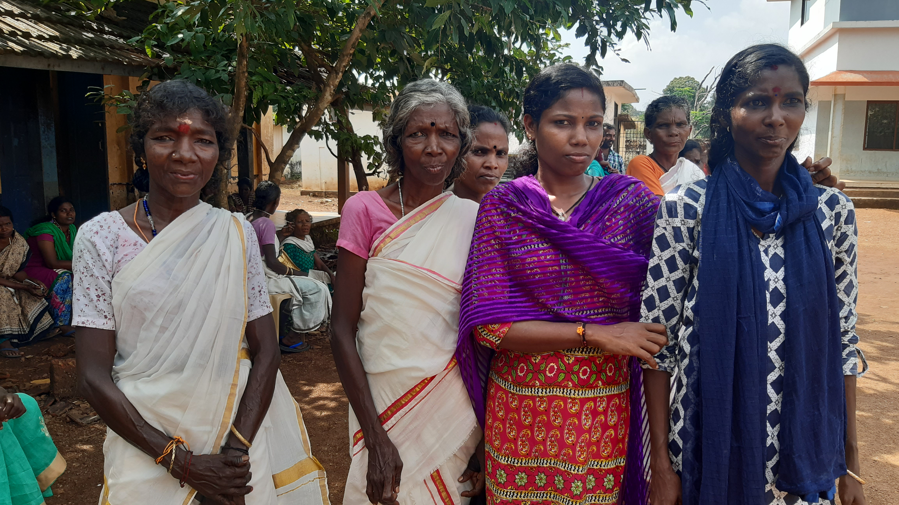
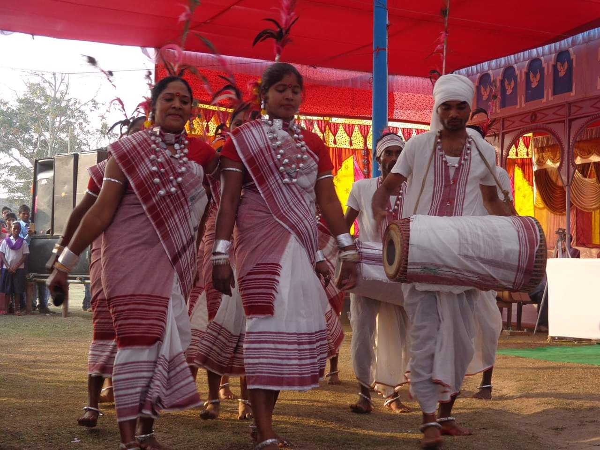

# আদিবাসী (ভারত)

আদিবাসী বলতে ভারতীয় উপমহাদেশের বাসিন্দাদের বোঝায়, সাধারণত তারা উপজাতীয় মানুষ। [ ১ ] [ ২ ] শব্দটি একটি সংস্কৃত শব্দ, যা রাজনৈতিক কর্মীরা ১৯৩০-এর দশকে রাজনৈতিক কারণে উপজাতি মানুষদের আদিবাসী বলে দাবি করে আদিবাসী পরিচয় দেওয়ার জন্য তৈরি করেছিল। শব্দটি জাতিগত সংখ্যালঘুদের জন্যও ব্যবহৃত হয়, যেমন বাংলাদেশের সাঁওতাল , [ ৩ ] নেপালের খাস এবং শ্রীলঙ্কার ভেদ্দা । ভারতের সংবিধান আদিবাসী শব্দটি ব্যবহার করে না, পরিবর্তে তফসিলি উপজাতি ও জনজাতিকে উল্লেখ করে। [ ৪ ] ভারত সরকার আনুষ্ঠানিকভাবে উপজাতিদের আদিবাসী হিসেবে স্বীকৃতি দেয় না। দেশটি জাতিসংঘের আদিবাসী ও উপজাতীয় জনগণের উপর আন্তর্জাতিক শ্রম সংস্থা (আইএলও) কনভেনশন ১০৭ অনুমোদন করেছে (১৯৫৭) এবং আইএলও কনভেনশন ১৬৯ -এ স্বাক্ষর করতে অস্বীকার করেছে। [ ২ ] এই গোষ্ঠীগুলির বেশিরভাগই ভারতে সাংবিধানিক বিধানের অধীনে তফসিলি উপজাতি বিভাগে অন্তর্ভুক্ত। [ ৪ ]

*কেরালার পানিয়া সম্প্রদায়ের মহিলারা*

*ভারতের উমারিয়া জেলার গোন্ডি মহিলা*

*মধ্য ও পূর্ব ভারতের অন্যতম উপজাতি কুরুখ ওরাওঁ সম্প্রদায়ের সাংস্কৃতিক নৃত্য*

তারা ভারত ও বাংলাদেশের একটি উল্লেখযোগ্য সংখ্যালঘু জনসংখ্যা নিয়ে গঠিত, যা ভারতের জনসংখ্যার ৮.৬% এবং বাংলাদেশের ১.১%, [ ৫ ] বা ২০১১ সালের আদমশুমারি অনুযায়ী ভারতে ১০৪.২ মিলিয়ন মানুষ এবং ২০১০ সালের হিসেব অনুযায়ী বাংলাদেশে ২ মিলিয়ন মানুষ। [ ৬ ] [ ৭ ] [ ৮ ] [ ৯ ] আদিবাসী সমাজগুলি তেলেঙ্গানা , অন্ধ্র প্রদেশ , ছত্তিশগড় , গুজরাট , ঝাড়খণ্ড , মধ্যপ্রদেশ , মহারাষ্ট্র , ওড়িশা , রাজস্থান , পশ্চিমবঙ্গ , উত্তর-পূর্ব ভারত ও ভারতের আন্দামান ও নিকোবর দ্বীপপুঞ্জে এবং বাংলাদেশের ফেনী , খাগড়াছড়ি , বান্দরছড়ি ও কক্সবাজারে বিশেষভাবে বিশিষ্ট।

আদিবাসী সমাজগুলি ভারতের আদি বাসিন্দা হিসাবে দাবি করা হলেও, সিন্ধু উপত্যকা সভ্যতার পতনের পরে বর্তমান অনেক আদিবাসী সম্প্রদায় গড়ে উঠেছে, যা প্রাচীন শিকারী-সংগ্রাহক , সিন্ধু উপত্যকা সভ্যতা , ইন্দো-আর্য , অস্ট্রোএশিয়াটিক ও তিবেক-বর্মন ভাষাভাষী কাছ থেকে বিভিন্ন মাত্রার পূর্বপুরুষদের আশ্রয় নিয়েছিল। [ ১০ ] [ ১১ ] [ ১২ ] ভারতের মুন্ডা জাতির পূর্বপুরুষরা প্রায় ৪০০০-৩৫০০ বছর আগে দক্ষিণ-পূর্ব এশিয়া থেকে অভিবাসী হয়েছিল। [ ১৩ ]

উপজাতীয় ভাষাগুলিকে সাতটি ভাষাগত গোষ্ঠীতে শ্রেণীবদ্ধ করা যেতে পারে, যথা আন্দামানিজ ; অস্ট্রো-এশিয়াটিক ; দ্রাবিড় ; ইন্দো-আর্য ; নিহালি ; চীন-তিব্বতি ; ও ক্রা-দাই । [ ১৪ ]

পূর্ব, মধ্য, পশ্চিম ও দক্ষিণ ভারতের আদিবাসীরা রাজনৈতিকভাবে আস্থাশীল আদিবাসী শব্দটি ব্যবহার করে, যখন উত্তর পূর্ব ভারতের উপজাতিরা 'উপজাতি' বা 'তফসিলি উপজাতি' ব্যবহার করে এবং নিজেদের জন্য 'আদিবাসী' শব্দটি ব্যবহার করে না। [ ১৫ ] আদিবাসী অধ্যয়ন একটি নতুন পাণ্ডিত্যপূর্ণ ক্ষেত্র, যা প্রত্নতত্ত্ব, নৃতত্ত্ব, কৃষি ইতিহাস, পরিবেশগত ইতিহাস, সাবল্টার্ন স্টাডিজ , আদিবাসী অধ্যয়ন, আদিবাসী অধ্যয়ন ও উন্নয়নমূলক অর্থনীতির উপর অঙ্কন করে। এটি ভারতীয় প্রেক্ষাপটের সঙ্গে সুনির্দিষ্ট বিতর্ক যুক্ত করে। [ ১৬ ]

*Percent of scheduled tribes in India by tehsils by census 2011*

## সংজ্ঞা ও ব্যুৎপত্তি

আদিবাসী হল ভারতীয় উপমহাদেশের উপজাতিদের সম্মিলিত শব্দ, [ ১ ] যারা ভারতের আদিবাসী বলে বিবেচিত হয়। দ্রাবিড় [ ১৭ ] ও ইন্দো-আর্যদের পূর্বে, এটি "ভারতীয় উপমহাদেশের আদি বাসিন্দা বলে বিবেচিত বিভিন্ন জাতিগত গোষ্ঠীর যে কোন একটি" উল্লেখ করে। [ ১ ] তবে উপজাতি ও আদিবাসীর ভিন্ন অর্থ রয়েছে। উপজাতি মানে একটি সামাজিক একক, যেখানে আদিবাসী মানে প্রাচীন বাসিন্দা। ভারত উপজাতিদের আদিবাসী হিসেবে স্বীকৃতি দেয় না। ভারত জাতিসংঘের আদিবাসী ও উপজাতি জনগণের আন্তর্জাতিক শ্রম সংস্থা (আইএলও) কনভেনশন ১০৭ অনুমোদন করেছে (১৯৫৭)। ১৯৮৯ সালে, ভারত আইএলও কনভেনশন ১৬৯ স্বাক্ষর করতে অস্বীকার করে। [ ২ ]

---
Source: https://bn.wikipedia.org/wiki/%E0%A6%86%E0%A6%A6%E0%A6%BF%E0%A6%AC%E0%A6%BE%E0%A6%B8%E0%A7%80_(%E0%A6%AD%E0%A6%BE%E0%A6%B0%E0%A6%A4)
