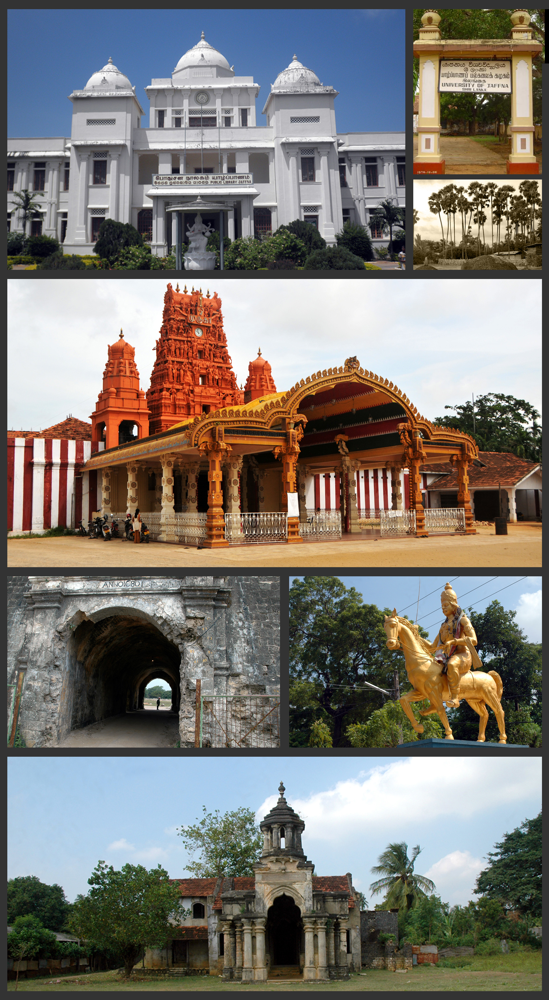

# જાફના

*ટોચ પરથી: જાફના જાહેર પુસ્તકાલય, જાફના - પન્નાઈ ધોરી માર્ગ, નેલ્લૂર કંડાસ્વામી મંદિર, જાફના કિલ્લો, સાંગીલીયનનું પૂતળું, જાફના મહેલનું ખંડેર*

જાફના (Jaffna) ( તમિલ : யாழ்ப்பாணம் Yalpanam, સિંહાલી : යාපනය યાપન્યા) શ્રીલંકા દેશના ઉત્તરી પ્રાંતની રાજધાની છે . અહીં જાફના જિલ્લાનું મુખ્ય મથક પણ છે. વર્ષ ૨૦૧૨ની વસ્તીગણના પ્રમાણે આ શહેરની વસ્તી ૮૮,૧૩૮ જેટલી છે [ ૧ ] અને શ્રીલંકા દેશનું બારમા ક્રમનું સૌથી મોટું શહેર છે.

---
Source: https://gu.wikipedia.org/wiki/%E0%AA%9C%E0%AA%BE%E0%AA%AB%E0%AA%A8%E0%AA%BE
