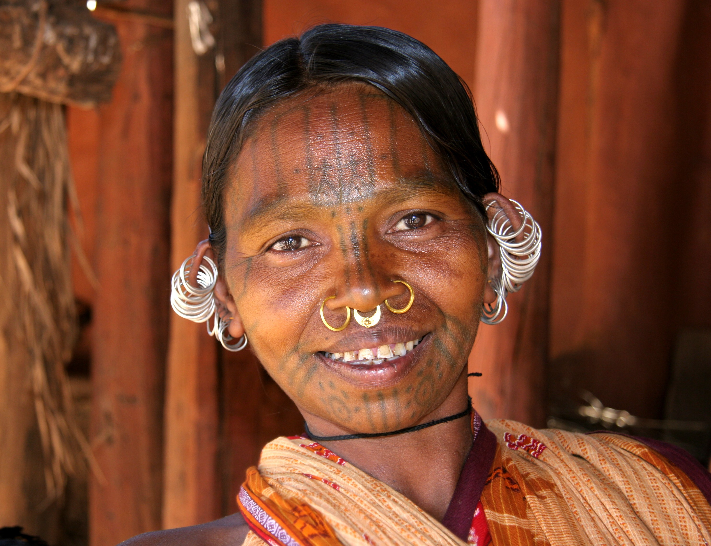
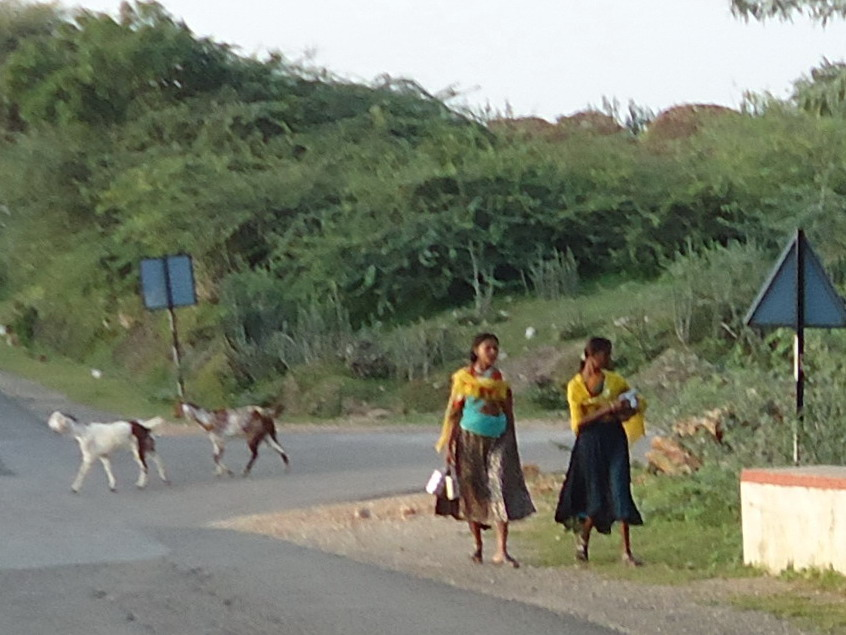

# आदिवासी (भारतीय)

*उडी़सा के जनजातीय कुटिया कोंध समूह की एक महिला*

आदिवासी , दो शब्दों 'आदि' और 'वासी' से मिल कर बना है जिसका अर्थ है आदिकाल से इस देश में निवास करने वाले। 2011 जनगणना के अनुसार भारत में आदिवासी भारत की जनसंख्या का 8.6% हैं। भारतीय संविधान में आदिवासियों के लिए ' अनुसूचित जनजाति ' पद का उपयोग किया गया है। भारत के प्रमुख आदिवासी समुदायों में गोंड , हल्बा , मुण्डा , ,खड़िया , बोडो , कोल , भील,नायक , सहरिया , संथाल ,भूमिज , हो , उरांव , बिरहोर , पारधी , असुर , भिलाला ,आदि हैं।

*डूंगरपुर, राजस्थान की दो आदिवासी लडकियाँ*

भारत में आदिवासियों को प्रायः 'जनजातीय लोग' के रूप में जाना जाता है। आदिवासी मुख्य रूप से भारतीय राज्यों ओडिशा , मध्य प्रदेश , छत्तीसगढ़ , राजस्थान , झारखण्ड , अंडमान-निकोबार , सिक्किम , त्रिपुरा , मणिपुर , मिज़ोरम , मेघालय , नागालैंड और असम में आदिवासी बहुसंख्यक व गुजरात , महाराष्ट्र , आंध्र प्रदेश , बिहार , कर्नाटक और पश्चिम बंगाल में अल्पसंख्यक हैं। भारत सरकार ने इन्हें भारत के संविधान की पांचवी अनुसूची में " अनुसूचित जनजाति " के रूप में मान्यता दी है।

## चंदा समिति

चंदा समिति ने सन् 1960 में अनुसूचति जनजातियों के अंर्तगत किसी भी जाति को शामिल करने के लिये 5 मानक निर्धारित किया:

- भौगोलिक एकाकीपन
- विशिष्ट संस्कृति
- पिछड़ापन
- संकुचित स्वभाव
- आदिम जाति के लक्षण

बहुत से छोटे आदिवासी समूह आधुनिकीकरण के कारण हो रहे पारिस्थितिकी पतन के प्रति काफी संवेदनशील हैं। व्यवसायिक वानिकी और गहन कृषि दोनों ही उन जंगलों के लिए विनाशकारी साबित हुए हैं जो कई शताब्दियों से आदिवासियों के जीवन यापन का स्रोत रहे हैं।

*2011 की जनगणना के अनुसार भारत में तहसीलों द्वारा अनुसूचित जनजातियों का प्रतिशत*

## आदिवासी भाषाएँ

भारत में सभी आदिवासी समुदायों की अपनी विशिष्ट भाषाएं है। भाषाविज्ञानियों ने भारत के सभी आदिवासी भाषाओं को मुख्यतः तीन भाषा परिवारों में रखा है-गोंडी, द्रविड़, आस्ट्रिक और लेकिन कुछ आदिवासी भाषाएं भारोपीय भाषा परिवार के अंतर्गत भी आती हैं। आदिवासी भाषाओं में ‘ भीली’ बोलने वालों की संख्या सबसे ज्यादा है जबकि दूसरे स्थान पर ‘ गोंडी’ भाषा और तीसरे स्थान पर ‘ संताली’ भाषा है। चौथे स्थान पर कोरकू भाषा है । भारतीय राज्यों में एकमात्र झारखण्ड में ही 5 आदिवासी भाषाओं - संताली, मुण्डारी, हो, कुड़ुख और खड़िया - को 2011 में द्वितीय राज्यभाषा का दर्जा प्रदान किया गया।

भारत की 114 मुख्य भाषाओं में से 22 को ही संविधान की आठवीं अनुसूची में शामिल किया गया है। इनमें हाल में शामिल की गयी संताली और बोड़ो ही मात्र आदिवासी भाषाएं हैं। अनुसूची में शामिल संताली (0.62), सिंधी, नेपाली, बोड़ो (सभी 0.25), मिताइ (0.15), डोगरी और संस्कृत भाषाएं एक प्रतिशत से भी कम लोगों द्वारा बोली जाती हैं। जबकि भीली (0.67), गोंडी (0.25), टुलु (0.19) और कुड़ुख 0.17 प्रतिशत लोगों द्वारा व्यवहार में लाए जाने के बाद भी आठवीं अनुसूची में दर्ज नहीं की गयी हैं। (जनगणना 2001)

## आदिवासियों के धार्मिक विश्वास

आदिवासी सनातन धर्म का अंग नहीं है। ये प्रकृति-पूजक हैं और वन , पर्वत , नदियों एवं सूर्य की आराधना करते हैं। आधुनिक काल में जबरन बाह्य संपर्क में आने के फलस्वरूप इन्होंने ईसाई एवं इस्लाम धर्म को भी अपनाया है। अंग्रेजी राज के दौरान बड़ी संख्या में ये ईसाई बने।

भारत में 1871 से लेकर 1941 तक हुई जनगणनाओं में आदिवासियों को अन्‍य धमों से अलग धर्म में गिना गया है, जिसे एबओरिजिन्स , एबोरिजिनल , एनिमिस्ट , ट्राइबल रिलिजन या ट्राइब्स इत्यादि नामों से वर्णित किया गया है। हालांकि 1951 की जनगणना के बाद से आदिवासियों को अलग से गिनना बन्‍द कर दिया गया है।

भारत में आदिवासियों को दो वर्गों में अधिसूचित किया गया है- अनुसूचित जनजाति और अनुसूचित आदिम जनजाति।

## आदिवासियों के धार्मिक विश्वास

### जीववाद

विश्वदृष्टि है कि जीववाद गैर-मानव संस्थाओं (जानवरों, पौधों, और निर्जीव वस्तुओं या घटनाओं) में एक आध्यात्मिक सार है। धर्म और समाज के विश्वकोश का अनुमान है कि भारत की आबादी का 1-5% जीववाद है। भारत सरकार मानती है कि भारत के स्वदेशी पूर्व-हिंदू जीववाद-आधारित धर्मों की सदस्यता लेते हैं।

कुछ स्वदेशी आदिवासी लोगों की विश्वास प्रणाली के लिए एक शब्द के रूप में धर्म के नृविज्ञान में जीववाद का उपयोग किया जाता है, विशेष रूप से संगठित धर्म के विकास से पहले। हालांकि प्रत्येक संस्कृति की अपनी अलग-अलग पौराणिक कथाएं और अनुष्ठान हैं, "जीववाद" को स्वदेशी लोगों के "आध्यात्मिक" या "अलौकिक" दृष्टिकोण के सबसे आम, मूलभूत सूत्र का वर्णन करने के लिए कहा जाता है। शत्रुतापूर्ण दृष्टिकोण इतना मौलिक, सांसारिक, रोज़मर्रा का और मान लिया गया है कि अधिकांश शत्रुतापूर्ण स्वदेशी लोगों के पास अपनी भाषाओं में एक शब्द भी नहीं है जो "जीववाद" (या "धर्म") से मेल खाता हो; यह शब्द एक मानवशास्त्रीय रचना है।

## आदिवासियों के धार्मिक विश्वास

### सरनावाद

सरनावाद या सरना (स्थानीय भाषा: सरना धोरोम , जिसका अर्थ है "पवित्र जंगल का धर्म") मुख्यतः झारखंड, ओडिशा, पश्चिम बंगाल, से संबंधित है जिसका कुछ हिस्सा बिहार तथा छत्तीसगढ़ भी है। इन्हीं क्षेत्रों की जनजातियां जैसे मुंडा , हो , संथाल , भूमिज , उरांव सरना संप्रदाय का पालन करते हैं। जहां सरना एक पवित्र धार्मिक स्थल है। उनकी संप्रदाय पीढ़ी-दर-पीढ़ी चली आ रही जो मौखिक परंपराओं पर आधारित है। इसमें प्रकृति, जंगल, पहाड़ (बुरु), ग्राम देवता, सूर्य और चंद्रमा की पूजा शामिल है। इसे सभी भारतीय आदिवासियों का धर्म कहना उचित नहीं है क्योंकि भारत में हर राज्य में आदिवासी अलग-अलग जनजातियों के रूप में निवास करते हैं। आदिवासी बाहुल्य क्षेत्र जैसे गुजरात, राजस्थान, महाराष्ट्र, आंध्र प्रदेश, तेलंगाना, और कर्नाटक तथा पूर्वोत्तर के आदिवासी सरना धर्म से कोई भी संबंध नहीं रखते हैं।

## आदिवासियों के धार्मिक विश्वास

### डोनी - पोलो

डोनी-पोलो पूर्वोत्तर भारत में अरुणाचल प्रदेश से तानी के स्वदेशी धर्मों, एनिमिस्टिक और शैमैनिक प्रकार के लिए दिया गया पदनाम है। "डोनी-पोलो" का अर्थ "सूर्य-चंद्रमा" है।

## भारत की प्रमुख जनजातियाँ

भारत में 461 जनजातियां हैं, जिसमें से 424 जनजातियों भारत के सात क्षेत्रों में बंटी हुई हैं:

## भारत की प्रमुख जनजातियाँ

### उत्तरी क्षेत्र

जातियाँ : लेपचा, भूटिया, थारू, बुक्सा, जॉन सारी, खाम्पटी, कनोटा।

इन सब में मंगोल जाति के लक्षण मिलते हैं। जैसे:- तिरछी छोटी आंखे (चाइनीज, तिब्बती), पीला रंग, सीधे बाल, चेहरा चौड़ा, चपटा नाक।

तराई जिलों में थारु, बोक्सा, भूटिया, राजी, जौनसारी,केवल पूर्वी उत्तर प्रदेश के 11 जिलों में गोंड़, धुरिया, ओझा, पठारी, राजगोड़, तथा देवरिया बलिया, वाराणसी, सोनभद्र में खरवार, व ललितपुर में सहरिया,सोनभद्र में बैगा, पनिका,पहडिया, पंखा, अगरिया, पतरी, चेरो भूइया।

असुर, अगरिया, बैगा, बनजारा, बैठुडी, बेदिया, खरवार, भूमिज, संथाल आदि।

## भारत की प्रमुख जनजातियाँ

### पूर्वोत्तर क्षेत्र

*नागा*

नागा, मिजो, गारो, खासी, जयंतिया, आदि, न्याशी, अंगामी, भूटिया, कुकी, रेंगमा, बोडो और देवरी वगैरा जनजाति हैं।

## भारत की प्रमुख जनजातियाँ

### पूर्वी क्षेत्र

- उड़ीसा :- मुण्डा, संथाल, हो, जुआंग, खोड़, भूमिज, खरिया।
- झारखण्ड :- मुण्डा, उराँव, भूमिज, संथाल, बिरहोर, हो।

संथाल:- भारत की सबसे बड़ी जनजाति। संथाली भाषा को संविधान में मान्यता प्राप्त हैं।

- पश्चिम बंगाल :- मुण्डा, हो, भूमिज, उराँव, संथाल, कोड़ा।

पहचान : रंग काला, चॉकलेटी कलर, लंबा सिर, चौड़ी छोटी व चपटी नाक, हल्के घुंघराले बाल। यह सभी प्रोटो ऑस्टेलाइड प्रजाति से संबधित हैं।

## भारत की प्रमुख जनजातियाँ

### मध्य क्षेत्र

गोंड,कोरकू , कोल, परधान, बैगा, मारिया, अबूझमाडिया, धनवार/धनुहार, धुलिया, पहाड़ी कोरवा, बिरहोर, हल्बा,कंवर।

ये सभी प्रजातियां छत्तीसगढ़, मध्यप्रदेश, पूर्वी आंध्र-प्रदेश में निवास करते हैं। ये सभी प्रोटो ऑस्टेलाइड प्रजाति से संबधित हैं।

## भारत की प्रमुख जनजातियाँ

### पश्चिमी भारत में

*गुजरात की एक आदिवासी महिला*

- गुजरात, राजस्थान में विशेष कर उदयपुर सभांग में भील,भिलाला, मीना व मीणा ; गरासिया व सिरोही कि आबुरोङ व पिण्डवाङा में भील ,नायक *गरासिया बहुतायत आबूरोङ के भाखर पट्टे में सभी आदिवासी समुदाय रहते हैं पश्चिमी मध्यप्रदेश, महाराष्ट्र : भील , गोंड़, धाणका भीलाला , बारेला म ठाकर / ठाकुर ,महादेव कोळी,वारली,कातकरी इत्यादि .

## भारत की प्रमुख जनजातियाँ

### दक्षिण भारत में

- केरल :- कोटा, बगादा, टोडा। (टोडा में बहुपति प्रथा प्रचलित है।)
- कुरूंबा, कादर, चेंचु, पूलियान, नायक, चेट्टी ये सभी जनजातियां नीग्रिये से संबधित हैं।
- विशेषताएं:- काला/गोरा रंग, बड़े होठ,बड़े नाक long height

## भारत की प्रमुख जनजातियाँ

### द्विपीय क्षेत्र

- अंडमान-निकोबार - जाखा, आन्गे, सेन्टलिस , सेम्पियन (शोम्पेन)

यह जातियां नीग्रिये प्रजाति से संबधित हैं। ये लुप्त होने के कगार पर हैं।

## आदिवासी झण्‍डा

आदिवासियों में प्रचलित प्रमुख झण्डा निम्न हैं:

*सरना धर्म का आदिवासी झण्डा*

## जय मध प्रदेश आदिवासी

- राजा मदन साह, जलबपुर
- राजा डुंगरिया भील (डूंगरपुर)
- राव रणथमदेव मरमट(मीणा) - रणथंबोर
- राव झुझार मरमट (मीणा)- रणथंबोर
- 
- बांसिया भील (बांसवाडा राजस्थान)
- राजा राणा पूंजा भील (मेवाड़ भोमट)
- महाराजा मदरा मुण्डा
- कोल राजा, कोरबा रियासत
- प्रताप सिंह धवलदेव, रोहतास गढ़
- राजा नागल कोल, रेवा रियासत
- महाराजा भीकमदेव, नायला
- राजा विवेक नारायण सिंह, बड़ाभूम परगना
- राजा अर्जुन सिंह , सिंहभूम
- राजा जगन्नाथ धल , धलभूम परगना
- राजा रुद्र - रुद्र नगर उत्तराखंड के संस्थापक [ 1 ]
- महाराजा बूंदा मीणा - बूंदी के संस्थापक
- राजा आलन सिंह मीणा - आमेर के शासक
- सम्राट बिराट सिंह मरमट(मीणा) - मत्स्य महाजनपद के शासक
- कुर सिंह बडगोती (मीणा) - अंबागढ़ जयपुर के शासक
- मिलन सिंह मरमट (मीणा) - रणथंभौर,निवाई के शासक
- 
- हमीर टाटू(मीणा) - रणथंभौर के शासक
- राव मैदा सिहरा(मीणा) - मांच के राजा
- धुन देडरवाल(मीणा) - नायला जयपुर के शासक
-

## प्रमुख आदिवासी व्यक्ति

- बिरसा मुण्डा , भारतीय स्वतंत्रता सेनानी
- जयपाल सिंह मुंडा , भारतीय राजनीतिज्ञ, स्वतंत्रता सेनानी
- द्रोपदी मुर्मू , भारतीय राजनीतिज्ञ, पहली भारतीय आदिवासी महिला राष्ट्रपति
- छुट्टन लाल मीणा ,अखिल भारतीय मीणाओ के मसिया
- राम दयाल मुंडा , भारतीय राजनीतिज्ञ, पद्म श्री
- गंगा नारायण सिंह , भारतीय क्रांतिकारी
- किरोड़ी लाल मीणा ,राजस्थान कैबिनेट मंत्री व मीणाओ के सबसे बड़े नेता
- जगन्‍नाथ सिंह , भारतीय क्रांतिकारी
- रघुनाथ सिंह , भारतीय क्रांतिकारी
- सुबल सिंह , भारतीय क्रांतिकारी
- कार्तिक उरांव , भारतीय राजनीतिज्ञ
- रानी दुर्गावती बाई , भारतीय क्रांतिकारी
- दुर्जन सिंह , भारतीय क्रांतिकारी
- टंट्या भील , भारतीय स्वतंत्रता सेनानी
- राणा पूंजा भील , योद्धा
- तिलका माँझी , भारतीय स्वतंत्रता सेनानी
- सिद्धू—कान्हू मुर्मू , भारतीय क्रांतिकारी
- बिंदराय मानकी , भारतीय क्रांतिकारी
- सिंदराय मानकी , भारतीय क्रांतिकारी
- पोटो हो , भारतीय क्रांतिकारी
- रघुनाथ मुर्मू , भारतीय लेखक
- महेंद्रनाथ सरदार, भारतीय लेखक और भाषाविद
- लको बोदरा , भारतीय लेखक, ओत् गुरु
- गंभीर सिंह मुड़ा , पद्म श्री, भारतीय छऊ नर्तक
- अर्जुन मुंडा , भारतीय राजनीतिज्ञ
- शिबू सोरेन , भारतीय राजनीतिज्ञ
- हेमंत सोरेन , भारतीय राजनीतिज्ञ
- जानुम सिंह सोय , भारतीय लेखक, पद्म श्री
- डॉ. विजय कुमार गावित , भारतीय राजनीतिज्ञ
- मोतीरावण कंगाली , लेखक, इतिहासकार, विचारक

## इन्हें भी देखें

- जनजाति (ट्राइब)
- कनाडा के आदिवासी
- यूएसए के आदिवासी
- आस्ट्रेलिया के आदिवासी
- आदिवासी साहित्य
- गोलेन्द्र पटेल , हिन्दी साहित्य की नई पीढ़ी के प्रमुख स्तम्भों में से एक एवं कवि व लेखक

## बाहरी कड़ियाँ

केरल के वायंड की एक आदिवासी कालोनी का वीडियो

- उड़ीसा के आदिवासी
- वनवासी कल्याण परिषद एक निजी संस्थान का जालघर
- आदिवासी मुन्नेत्र संगल ग़ुडालूर दक्षिण भारत के जंगलों में एक आदिवासी गाँव के आत्म-निर्भर होने की कथा
- आदिवासी संयोजन समूह -जर्मनी में
- पत्रिका इंडिया टुगेदर पर आदिवासियों का खास पृष्ठ
- कामत डाट काम पर आदिवासियों की तस्वीरें
- उड़ीसा के आदिवासियों के संगीत के बारे में एक जालस्थल पर
- आदिवासी साहित्य यात्रा (गूगल पुस्तक ; लेखिका - रमणिका गुप्ता)
- भारत में निवास करनेवाले आदिवासी समुदायों की राज्यवार सूची देखें।
- भारत के आदिम आदिवासियों की राज्यवार सूची देखें।

## बाहरी कड़ियाँ

### आदिवासी पत्र-पत्रिकाएं

- जोहार सहिया (आदिवासियों की लोकप्रिय मासिक पत्रिका नागपुरी-सादरी भाषा में)
- जोहार दिसुम खबर (12 आदिवासी भाषाओं में प्रकाशित भारत का एकमात्र पाक्षिक अखबार)
- अखड़ा (11 आदिवासी एवं क्षेत्रीय भाषाओं में प्रकाशित त्रैमासिक पत्रिका)
- आदिवासी साहित्‍य

- ↑ "इतिहास | जिला ऊधम सिंह नगर, उत्तराखंड सरकार | इंडिया" . अभिगमन तिथि: 2024-04-09 .

---
Source: https://hi.wikipedia.org/wiki/%E0%A4%86%E0%A4%A6%E0%A4%BF%E0%A4%B5%E0%A4%BE%E0%A4%B8%E0%A5%80_(%E0%A4%AD%E0%A4%BE%E0%A4%B0%E0%A4%A4%E0%A5%80%E0%A4%AF)
