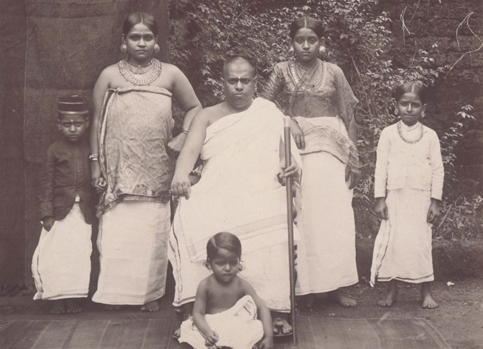

# ബ്രാഹ്മണർ

| Col1 |
| --- |
| ഹൈന്ദവം എന്ന പരമ്പരയുടെ ഭാഗം |
|  |
| പരബ്രഹ്മം · ഓം ചരിത്രം · ഹിന്ദു ദേവതകൾ ഹൈന്ദവ വിഭാഗങ്ങൾ · ഗ്രന്ഥങ്ങൾ |
| ദർശനം ബ്രഹ്മം മീമാംസ · വേദാന്തം · സാംഖ്യം · യോഗം ന്യായം · വൈശേഷികം |
| വിശ്വാസങ്ങളും ആചാരങ്ങളും ധർമ്മം · അർത്ഥം · കാമം · മോക്ഷം കർമം · പൂജാവിധികൾ · യോഗ · ഭക്തി മായ · യുഗങ്ങൾ · ക്ഷേത്രങ്ങൾ · ഷോഡശക്രിയകൾ |
| ഗ്രന്ഥങ്ങൾ വേദങ്ങൾ · ഉപനിഷത്തുകൾ · വേദാംഗങ്ങൾ രാമായണം · മഹാഭാരതം ഭാഗവതം · ഭഗവത് ഗീത · പുരാണങ്ങൾ ഐതീഹ്യങ്ങൾ · മറ്റുള്ളവ |
| മറ്റ് വിഷയങ്ങൾ ഹിന്ദു ഗുരുക്കന്മാർ · ചാതുർവർണ്യം ആയുർവേദം · ഉത്സവങ്ങൾ · നവോത്ഥാനം ജ്യോതിഷം വാസ്തുവിദ്യ, <> ഹിന്ദുമതവും വിമർശനങ്ങളും |
| ഹിന്ദുമതം കവാടം This box: view talk edit |

ചാതുർ‌വർ‌ണ്യത്തിൽ ആദ്യത്തെ വർണത്തിൽ വരുന്ന വ്യക്തിയെ സൂചിപ്പിക്കുന്ന നാമമാണ് ബ്രാഹ്മണൻ . ( സംസ്കൃതം : ब्राह्मणः). ബ്രാഹ്മണൻ വിപ്രൻ (ഉത്സാഹി) എന്നും ദ്വിജൻ (രണ്ടാമതും ജനിച്ചവൻ) എന്നും അറിയപ്പെടുന്നു.

## ബ്രാഹ്മണ ജാതികൾ

*A Brahmin Family Malabar (1902)*

ബ്രാഹ്മണരിലെ ജാതികളെ പ്രധാനമായും രണ്ടായി വർഗ്ഗീകരിച്ചിരിക്കുന്നു.

- പഞ്ചദ്രാവിഡബ്രാഹ്മണർ
- പഞ്ചഗൗഡബ്രാഹ്മണർ

कर्णाटकाश्च तैलंगा द्राविडा महाराष्ट्रकाः, गुर्जराश्चेति पञ्चैव द्राविडा विन्ध्यदक्षिणे || सारस्वताः कान्यकुब्जा गौडा उत्कलमैथिलाः, पन्चगौडा इति ख्याता विन्ध्स्योत्तरवासि || [ 1 ]

തർജമ: കർണാടകം , തെലുങ്ക് ദേശം, ദ്രാവിഡം ( തമിഴ് നാടും കേരളവും ചേർന്ന പ്രദേശം), മഹാരാഷ്ട്ര , ഗുജറാത്ത് എന്നിങ്ങനെ വിന്ധ്യ പർ‌വതത്തിനു തെക്കുള്ള അഞ്ചു ദേശങ്ങളിലെ ബ്രാഹ്മണരാണ് പഞ്ചദ്രാവിഡബ്രാഹ്മണർ.

## ബ്രാഹ്മണ ജാതികൾ

### പഞ്ചഗൗഡബ്രാഹ്മണർ‌

ഉത്തരാപഥത്തിലെ ബ്രാഹ്മണരാണ പഞ്ചഗൗഡബ്രാഹ്മണർ.

- സാരസ്വതർ
- കന്യാകുബ്ജർ
- ഗൗഡർ
- ഉത്കലർ
- മൈഥിലി

## ബ്രാഹ്മണ ജാതികൾ

### പഞ്ചദ്രാവിഡബ്രാഹ്മണർ‌

ദക്ഷിണാപഥത്തിൽ വസിക്കുന്ന ബ്രാഹ്മണരാണ് പഞ്ചദ്രാവിഡബ്രാഹ്മണർ‌.

- ആന്ധ്ര
- ദ്രാവിഡം
- കർണാടകം
- മഹാരാഷ്ട്രം
- ഗുജറാത്ത്

കേരളത്തിൽ സ്വദേശി ബ്രാഹ്മണർ

- നമ്പൂതിരി
- നമ്പൂതിരിപ്പാട്
- എമ്പ്രാന്തിരി
- പോറ്റി
- അമ്പലവാസി ബ്രാഹ്മണർ
- നമ്പിടി,തുടങ്ങി നിരവധി സ്വദേശി ബ്രാഹ്മണരും കേരളത്തിൽ ഉണ്ട്.

കേരളത്തിലെ പരദേശി ബ്രാഹ്മണർ

1. ഗൗഡസാരസ്വത ബ്രാഹ്മണർ

2. ഭട്ടർ/പട്ടർ(കേരള അയ്യർ)

3. ശർമ

4.ഭട്ട്

5.നായിക്

6.വിശ്വബ്രാഹ്മണർ/വിശ്വകർമ,തുടങ്ങിയ നിരവധി പരദേശി ബ്രാഹ്മണരും കേരളത്തിൽ ഉണ്ട്.

## ബ്രാഹ്മണധർമങ്ങളും ആചാരങ്ങളും

### പരമ്പരാഗത ധർമങ്ങൾ

ബ്രാഹ്മണരുടെ ആറ് ധർമങ്ങൾ:

## ആചാരങ്ങൾ/സംസ്കാരങ്ങൾ

- ഗർഭകാലത്തുള്ള ആചാരങ്ങൾ ഗർഭധാനം (conception), പുംസവനം സീമന്തം

- ശൈശവത്തിൽ ജാതകർമം നാമകരണം (പേരിടീൽ) നിഷ്ക്രാമണം (വാതിൽ പുറപ്പാട്)] അന്നപ്രാശനം ചൗളം

- ബാല്യകൗമാരങ്ങളിൽ

- ഉപനയനം

- സമാവർത്തനം

- യൗവന-വാർധക്യകാലങ്ങളിൽ വിവാഹം [ അഗ്ന്യാധാനം]

## ഇതും കൂടി കാണുക

- ചാതുർ‌വർണ്ണ്യം
- ബ്രാഹ്മണജാതികൾ

## കുറിപ്പുകൾ

- ↑ Brāhmanotpatti Martanda, cf. Dorilal Sharma, p.41-42

## ബാഹ്യകണ്ണികൾ

- About Kerala Iyers, a.k.a Pattars , the brahmins who moved to Kerala centuries ago from Tamil Nadu
- List Of Andhra Brahmins And Surnames
- A Long List of Brahmin Castes and Sub-castes
- Online Shakdweepiya Community
- Online Shakdweepiya Community
- Shakdweepiya club

- Information by Gujarati author

---
Source: https://ml.wikipedia.org/wiki/%E0%B4%AC%E0%B5%8D%E0%B4%B0%E0%B4%BE%E0%B4%B9%E0%B5%8D%E0%B4%AE%E0%B4%A3%E0%B5%BC
