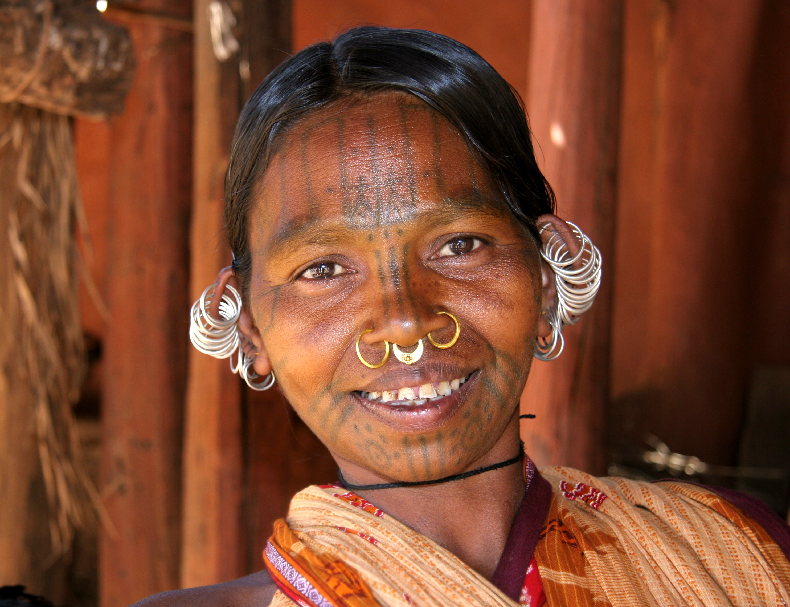
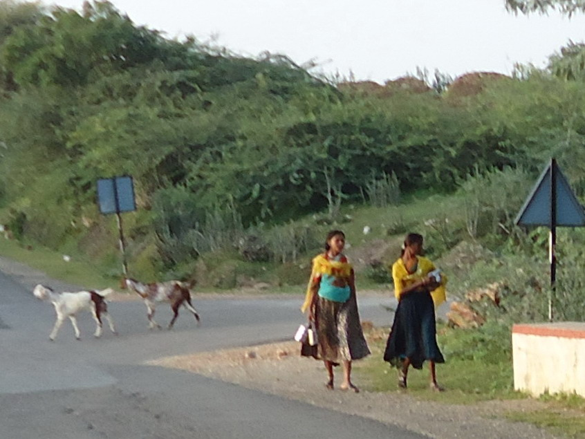

# आदिवासी (भारतीय)

*ओडिशातील आदिवासी कुटिया कोंध गटातील एक महिला*

आदिवासी हा शब्द 'आदि' आणि 'वासी' या दोन शब्दांपासून बनला असून त्याचा अर्थ मूळ असा होतो. द्रौपदी मुर्मू या भारताच्या पहिल्या आदिवासी महिला राष्ट्रपती झाल्या. भारताची 8.6% लोकसंख्या (१० कोटी जी २०११ च्या जनगणनेनुसार आहे ज्यामध्ये ईशान्येकडील 8 राज्यांतील लोकांनी स्वतंत्र धार्मिक मान्यता मिळावी या मागणीसाठी जनगणनेवर बहिष्कार टाकला होता, ही आकडेवारी हाती आली आहे) आज जर देशाला जनगणनेची माहिती असेल तर आज आदिवासी लोकांची लोकसंख्या सुमारे १८.४ कोटी आहे, ज्यातील मोठा भाग आदिवासींचा आहे. प्राचीन ग्रंथांमध्ये आदिवासींना अत्विक ( संस्कृत ग्रंथांमध्ये) म्हणले आहे. महात्मा गांधींनी आदिवासींना गिरिजन म्हणून संबोधले (कारण बहुतेक आदिवासी लोक जंगलात आणि डोंगरात राहणारे आहेत जे जल, जंगल आणि जमिनीचे खरे संरक्षक आहेत) आणि ऐतिहासिक स्त्रोतांनुसार, त्यांचा असा विश्वास होता की आदिवासी हे भारताचे मूळ रहिवासी आहेत, ज्यांना लाखो वर्षांपासून राहतो. तेव्हापासून इथे राहतो. भारतीय राज्यघटनेत 'अनुसूचित जमाती ' हा शब्द आदिवासींसाठी वापरण्यात आला आहे. भारतातील प्रमुख आदिवासी समुदाय म्हणजे आंध, गोंड, खरवार , मुंडा, खाडिया, बोडो, कोल, भील , कोळी , सहारिया, संथाल , भूमिज , ओराव, लोहरा, बिरहोर, पारधी , असुर , भील, भिलाला, मीना, ठाकर इत्यादी.

*राजस्थानच्या डुंगरपूर येथील दोन आदिवासी मुली*

भारतातील आदिवासींना 'आदिवासी लोक' असे संबोधले जाते. आदिवासी प्रामुख्याने भारतातील ओरिसा , मध्य प्रदेश , छत्तीसगड , राजस्थान , झारखंड, ईशान्येकडील ८ राज्यांमध्ये आहेत, बहुसंख्य आदिवासी आणि गुजरात , महाराष्ट्र , आंध्र प्रदेश , बिहार , पश्चिम बंगालमध्ये अल्पसंख्याक आहेत, तर ते भारतात बहुसंख्य आहेत. मिझोरम सारखी ईशान्य राज्ये .. भारत सरकारने त्यांना भारतीय राज्यघटनेच्या पाचव्या अनुसूचीमध्ये " अनुसूचित जमाती " म्हणून मान्यता दिली आहे. अनेकदा त्यांना अनुसूचित जातीसह "अनुसूचित जाती आणि जमाती" या एकाच श्रेणीत ठेवले जाते.

*Percent of scheduled tribes in India by tehsils by census 2011*

1960 मध्ये, चंदा समितीने कोणत्याही जातीचा अनुसूचित जातींमध्ये समावेश करण्यासाठी पाच निकष निश्चित केले:

अनेक लहान आदिवासी गट आधुनिकीकरणामुळे होणाऱ्या पर्यावरणीय ऱ्हासाला अत्यंत असुरक्षित आहेत. अनेक शतकांपासून आदिवासींसाठी उपजीविकेचे साधन असलेल्या जंगलांसाठी व्यावसायिक वनीकरण आणि सधन शेती या दोन्ही गोष्टी विनाशकारी ठरल्या आहेत. आदिवासी समाजाची समस्या 1. निरक्षरता 2. अंधश्रद्धा आणि ढोंगीपणा 3. बेरोजगारी 4. उपासमार 5. हुंडा प्रथा

*गुजरातमधील एक आदिवासी महिला*

---
Source: https://mr.wikipedia.org/wiki/%E0%A4%86%E0%A4%A6%E0%A4%BF%E0%A4%B5%E0%A4%BE%E0%A4%B8%E0%A5%80_(%E0%A4%AD%E0%A4%BE%E0%A4%B0%E0%A4%A4%E0%A5%80%E0%A4%AF)
