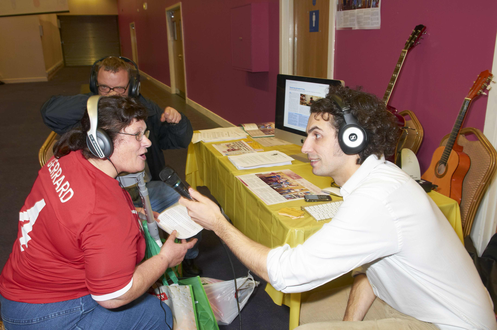

# ଅଭିଗମ୍ୟତା

ଅଭିଗମ୍ୟତା ଅକ୍ଷମତା ଭୋଗୁଥିବା ଲୋକମାନଙ୍କ ନିମନ୍ତେ ଉତ୍ପାଦ, ଯନ୍ତ୍ର, ସୁବିଧା ଓ ପରିବେଶର ଡିଜାଇନକୁ ସୂଚାଇଥାଏ । [ ୧ ] ଅଭିଗମ ଡିଜାଇନ ଓ ଅଭିଗମ ବିକାଶ ଅଭ୍ୟାସ "ସିଧାସଳଖ ଅଭିଗମ୍ୟତା" (ଯଥା କାହାର ସାହାଯ୍ୟ ବିନା) ଓ ଜଣେ ବ୍ୟକ୍ତିଙ୍କ ସହଯୋଗୀ ପ୍ରଯୁକ୍ତି ସଙ୍ଗତି ଅନୁସାରେ "ପରୋକ୍ଷ ଅଭିଗମ୍ୟତା" (ଯଥା କମ୍ପ୍ୟୁଟର ସ୍କ୍ରିନ ରିଡ଼ର) ନିଶ୍ଚିତ କରିଥାଏ ।

ଅଭିଗମ୍ୟତା "ବ୍ୟବହାର ସୁଲଭତା" ଭାବେ ଦେଖାଯାଇପାରେ ଓ କିଛି ବ୍ୟବସ୍ଥା ବା ବସ୍ତୁଠାରୁ ଉପକୃତ ହୋଇପାରେ । ଏହି ଅବଧାରଣା ଅକ୍ଷମତା ଥିବା ଲୋକଙ୍କ ପାଇଁ ଅଭିଗମ୍ୟତା ସଚଳ କରିବା ଉପରେ କିମ୍ବା ସହଯୋଗୀ ପ୍ରଯୁକ୍ତି ବ୍ୟବହାର କରି ଅଭିଗମ୍ୟତା ସଚଳ କରିବା ଉପରେ ଧ୍ଯାନଦେଇଥାଏ । ତେବେ ଅଭିଗମ୍ୟତାର ଗବେଷଣା ଓ ବିକାଶ ସଭିଙ୍କ ପାଇଁ ସୁବିଧା ଆଣିଦେଇଥାଏ । [ ୨ ] [ ୩ ] [ ୪ ] [ ୫ ] [ ୬ ]

ଅଭିଗମ୍ୟତାକୁ ବ୍ୟବହାରକାରିତା ସଙ୍ଗେ ନେଇ ଦ୍ୱନ୍ଦରେ ପଡ଼ିବା ଅନୁଚିତ । ବ୍ୟବହାରକାରିତା, କୁଶଳତା ଓ ସନ୍ତୋଷ ସହ ନିର୍ଦ୍ଦିଷ୍ଟ ଲକ୍ଷ ହାସଲ ନିମନ୍ତେ ଜଣେ ନିର୍ଦ୍ଦିଷ୍ଟ ବ୍ୟକ୍ତିଙ୍କ ନିମନ୍ତେ ଉତ୍ପାଦଟିଏ (ଯଥା ଏକ ଯନ୍ତ୍ର, ସୁବିଧା କିମ୍ବା ପରିବେଶ) ବ୍ୟବହାର କରାଯାଇପାରିବା ବ୍ୟବହାରକାରିତାର ଅନ୍ତର୍ଗତ ।

ଅଭିଗମ୍ୟତା ବହୁଳଭାବେ ସାର୍ବଜନୀନ ଡିଜାଇନ ସହିତ ଗଭୀରଭାବେ ସଂଯୁକ୍ତ । ସାର୍ବଜନୀନ ଡିଜାଇନ ବିଭିନ୍ନ ପ୍ରକାରେ ସକ୍ଷମ, ବିଭିନ୍ନ ବ୍ୟାପକ ପରିସ୍ଥିତିରେ କାମ କରିପାରୁଥିବା ଲୋକମାନଙ୍କ ନିମନ୍ତେ ଉତ୍ପାଦ ତିଆରି ସହ ସଂଯୁକ୍ତ । ଏହା (ଅକ୍ଷମତା ଥାଉ କି ନ ଥାଉ) ସବୁ ଲୋକଙ୍କ ନିମନ୍ତେ ବିଭିନ୍ନ ଜିନିଷ ସୁଲଭ କରାଇବା ବାବଦରେ ।

*ବ୍ରାଜିଲର କୁରିଟିବାରେ ସର୍ବସାଧାରଣ ଗମନାଗମନ ସାର୍ବଜନୀନ ଅଭିଗମ୍ୟତା ଦିଆଯାଇଥାଏ ।*

## ସହଯୋଗୀ ପ୍ରଯୁକ୍ତି ଓ ଅନୁକୂଳ ପ୍ରଯୁକ୍ତି

*ଏହି ବର୍ମିଂହାମ, ଦକ୍ଷିଣ ମଧ୍ୟଭୂଖଣ୍ଡ , ଅପର୍ଚୁନିଟିସ ଫେଆର ଅକ୍ଷମତା ଥିବା ଲୋକମାନଙ୍କୁ ସାହାଯ୍ୟ କରିବା, ସେମାନଙ୍କ ଚାକିରି, କି କି ସୁବିଧା, ସହଯୋଗ ଓ ସୁଯୋଗ ରହିଛି ଜାଣିବା ନିମନ୍ତେ ହୋଇଥିଲା ।*

ଜଣଙ୍କ ପାଇଁ ଅସମ୍ଭବ ଏକ କାମ କରିବା ପାଇଁ ତିଆରି ହୋଇଥିବା ଏକ ନୂଆ ଯନ୍ତ୍ର ହେଉଛି ସହଯୋଗୀ ପ୍ରଯୁକ୍ତି । ଏହାର କେତେକ ଉଦାହରଣ ହେଲା ନୂଆ କମ୍ପ୍ୟୁଟର ସଫ୍ଟଓଏର ପ୍ରୋଗ୍ରାମ, ଶୁଣିବା ସୁବିଧା , ଓ ବର୍ଣ୍ଣାନ୍ଧମାନେ ଚିହ୍ନିପାରିବା ଭଳି ମାନକ ରଙ୍ଗ ଥିବା ଟ୍ରାଫିକ ଆଲୁଅ ସମେତ ସହଯୋଗୀ ଶୁଣିବା ଯନ୍ତ୍ର ।

ବଦଳ କିମ୍ବା ଖାପ ଖୁଏଇବା, ଆଗରୁ ଥିବା ଯନ୍ତ୍ରର ପଦ୍ଧତି, କିମ୍ବା ଆଗରୁ ଥିବା ଯନ୍ତ୍ରର ନୂଆ ବ୍ୟବହାର ହେଲା ଅନୁକୂଳ ପ୍ରଯୁକ୍ତି । ଉଦାହରଣଗୁଡ଼ିକ ହେଲା ରିମୋଟ କଣ୍ଟ୍ରୋଲର ବ୍ୟବହାର, କିମ୍ବା କାମ ସମ୍ପୂର୍ଣ୍ଣ କରିବାରେ ଚଳନ ଭିନ୍ନକ୍ଷମ ବ୍ୟକ୍ତିଙ୍କୁ ସାହାଯ୍ୟ କରିବା ପାଇଁ କମ୍ପ୍ୟୁଟରର ୱାର୍ଡ଼ ପ୍ରୋସେସିଂ ପ୍ରୋଗ୍ରାମରେ ଅଟୋକମ୍ପ୍ଲିଟ (ଶବ୍ଦ ପୂରଣ) ସୁବିଧା । ହୁଇଲ ଚେୟାର ଟାୟାରକୁ ବଦଳ ଆଉ ଏକ ଉଦାହରଣ । ଟାୟାରକୁ ଓସାରିଆ କଲେ ହୁଇଲ ଚେୟାର ବ୍ୟବହାରକାରୀମାନେ ନରମ ପୃଷ୍ଠଭୂମି ଯଥା ଗଭୀର ସ୍କି ପାହାଡ଼ ଓ ବାଲି ବେଳାଭୂମି ଆଦିକୁ ଯାଇପାରିବେ ।

ସହଯୋଗୀ ପ୍ରଯୁକ୍ତି ଓ ଅନୁକୂଳ ପ୍ରଯୁକ୍ତି ଭିନ୍ନକ୍ଷମ ଲୋକଙ୍କ ପାଇଁ ଅଧିକ ସ୍ୱାଧୀନ ଭାବେ ବଞ୍ଚିବାର ଏକ ବାଟ ତିଆରି କରିବାରେ ମୁଖ୍ୟ ଭୂମିକା ନିର୍ବାହ କରିଥାନ୍ତି । ଏଥି ସହିତ ସେମାନେ ସାମାଜିକ ମୁଖ୍ୟସ୍ରୋତରେ ମଧ୍ୟ ସମ୍ପୂର୍ଣ୍ଣ ଭାବେ ସାମିଲ ହୋଇପାରନ୍ତି । ସହଯୋଗୀ ପ୍ରଯୁକ୍ତି ଓ ଅନୁକୂଳ ପ୍ରଯୁକ୍ତି ଉପଲବ୍ଧ କରିବା ପାଇଁ ଜନସାଧାରଣଙ୍କୁ ଶିକ୍ଷାଦେବା, ଆଇନ କାନୁନରେ ଏସବୁ ରଖିବା ଓ ପ୍ରଯୁକ୍ତିଗୁଡ଼ିକ କାମରେ ଲଗାଇବା ଜରୁରୀ ହୋଇଛି ।

---
Source: https://or.wikipedia.org/wiki/%E0%AC%85%E0%AC%AD%E0%AC%BF%E0%AC%97%E0%AC%AE%E0%AD%8D%E0%AD%9F%E0%AC%A4%E0%AC%BE
