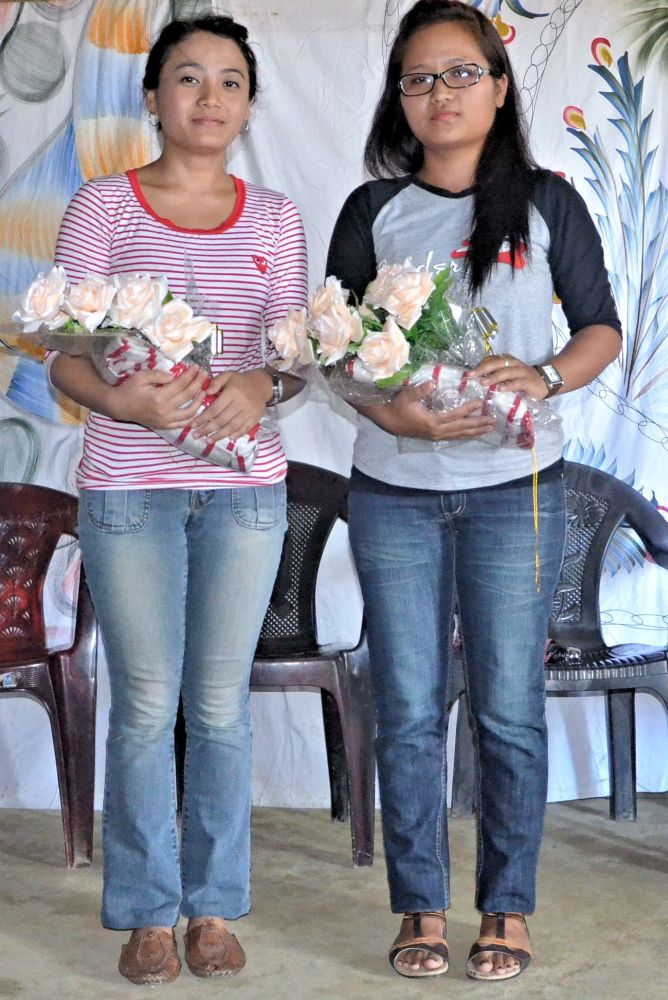

# விடலைப் பருவம்

*விடலைப் பருவப் பெண்கள்.*

விடலைப் பருவம் அல்லது வளரிளம் பருவம் (இலத்தீன்:adolescere : வளர்ச்சி நிலை) என்பது, மனிதருடைய உடல் மற்றும் உள வளர்ச்சிக் கட்டங்களில் சிறுவருக்கும், வளர்ந்தோருக்கும் இடைப்பட்ட ஒரு மாறுநிலைக் கட்டமாகும். [ 1 ] [ 2 ] இப் பருவத்துக்கான வயதெல்லை எல்லாப் பண்பாடுகளிலும் ஒரே அளவாகக் கருதப்படுவதில்லை. பல காலமாகவே பருவமடைதல் என்பது விடலைப் பருவத்துடன் தொடர்புபடுத்தப்பட்டு வந்துள்ளது. [ 2 ] [ 3 ] [ 4 ] [ 5 ] அண்மைக் காலங்களில் பருவமடைதல் காலம் விடலைப் பருவத்துக்கு முன்னதாகவே தொடங்கி விடலைப் பருவத்துக்கு அப்பாலும் போவதைக் காணக்கூடியதாக உள்ளது.. [ 3 ] [ 6 ] [ 7 ] உலக சுகாதார நிறுவனம் விடலைப் பருவத்தை 10 வயதுக்கும் 19 வயதுக்கும் இடைப்பட்ட காலம் என வரையறை செய்துள்ளது.

## பருவமாற்றங்கள்

- ஆண் : உடல் மாற்றங்கள் : உயரம்,எடை அதிகாிக்கும், தசைகள் வலுவடையும், தோள்கள் அகன்று காணப்படும், எண்ணெய் சுரப்பு அதிகம் ஆவதால் பருக்களும், சிறுகட்டிகளும் தோன்றும், வியர்வை மற்றும் உடல் நாற்றம் அதிகாிக்கும் , சோா்வு அதிகமாகக் காணப்படும் , இனப்பெருக்க உறுப்புகள் (விந்தகம்) வளா்ச்சியடையும்,குரல்வளை அகன்று கடினமாக மாறும்.

- பெண் : உடல் மாற்றங்கள் :உயரம்,எடை அதிகாிக்கும், இடுப்பு பொிதாகி உடல் நெளிவு சுளிவுடன் கூடிய வடிவத்தைப் பெறும்,எண்ணெய் சுரப்பு அதிகம் ஆவதால் பருக்கள் தோன்றும், வியர்வை மற்றும் உடல் நாற்றம் அதிகாிக்கும்,சோா்வு அதிகமாகக் காணப்படும் , இனப்பெருக்க உறுப்புகள் (அண்டகம்) வளா்ச்சியடையும், குரல் மென்மையாக மாறும், மாதவிடாய் சுழற்சி ஆரம்பமாகும் ,மார்பகம் வளர்ச்சியுறும்.

## பயன்பாடு

சமூகவியலில், விடலைப் பருவம் என்பது, ஒரு பண்பாட்டுத் தோற்றப்பாடாகவே கருதப்படுகிறது. இதனால் இதன் தொடக்கமும் முடிவும் உடல்ரீதியான எல்லைகளுடன் தொடர்புபடுத்தப்படுவது கடினமாக உள்ளது. இப்பருவம் சிறுவர் வளர்ந்தவர்களாக மாறும் ஒரு காலகட்டமாக அமைகிறது. இம் மாற்றம், உயிரியல் , சமூகவியல் மற்றும் உளவியல் சார்பான மாற்றங்களை உள்ளடக்கியுள்ளது. இவற்றுள் உயிரியல் மாற்றங்களும், உளவியல் மாற்றங்களுமே இலகுவாக அளவிடப்படக் கூடியவையாகும்.

---
Source: https://ta.wikipedia.org/wiki/%E0%AE%B5%E0%AE%BF%E0%AE%9F%E0%AE%B2%E0%AF%88%E0%AE%AA%E0%AF%8D_%E0%AE%AA%E0%AE%B0%E0%AF%81%E0%AE%B5%E0%AE%AE%E0%AF%8D
