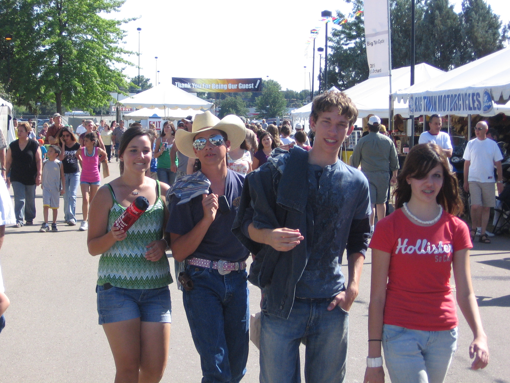

# యవ్వనం

*వియత్నాంలో యువకులు*

*Upper body of teenage boy. The structure has changed to resemble an adult form.*

యవ్వనం అనగా కౌమారదశ. యవ్వనాన్ని ఇంగ్లీషులో Adolescence అంటారు. 
Adolescence లాటిన్ పదం. లాటిన్ భాషలో Adolescence అనగా పెరుగుట.
ఈ యవ్వన దశలో మానవుడు శారీరకంగా మానసికంగా మార్పు చెందుతాడు. యవ్వన మార్పులు అత్యంత సంక్లిష్టమైన ప్రక్రియ. దీనంతటికీ శరీరంలో హార్మోన్లు అత్యంత కీలకం. మన మెదడులో ఉండే 'హైపోథాలమస్' 'పిట్యూటరీ గ్రంథి'ని నియంత్రిస్తుంటుంది. ఈ పిట్యూటరీ గ్రంథి శరీరంలోని ఇతర గ్రంథులన్నింటినీ నియంత్రిస్తుంటుంది. యవ్వన మార్పులకు మూలమైన సెక్స్ హార్మోన్లను స్రవించేవి మగపిల్లల్లో వృషణాలు , ఆడపిల్లల్లో అండాశయాలు. వీటిని కూడా పిట్యూటరీ గ్రంథే పర్యవేక్షిస్తుంటుంది. ఇవన్నీ సమన్వయంతో పనిచేస్తుంటేనే ఎదుగుదల అంతా సజావుగా సాగుతుంది. ఈ సమన్వయాన్నే 'హైపోథాలమో-పిట్యూటరీ-గొనాడల్ యాక్సిస్' అంటారు. యవ్వన మార్పులు మొదలవ్వటానికి ముందు వరకూ కూడా ఈ ప్రేరణ ప్రక్రియ.. నిద్రాణంగా ఉండిపోతుంది. 'హైపోథాలమస్' మన ఎముకల వయసును ఆధారంగా చేసుకుని.. పాప/బాబు ఒక వయసుకు రాగానే పిట్యూటరీ గ్రంథిని ప్రేరేపించే కార్యక్రమం ఆరంభిస్తుంది. అది ఆడపిల్లల్లో అండాశయాలను, మగపిల్లల్లో వృషణాలను ప్రేరేపించి.. యవ్వన మార్పులకు శ్రీకారం చుడుతుంది. ఇక మార్పుల పరంపర ఆరంభమవుతుంది. కాబట్టి ఈ పరంపరకు ఎముక వయసు ముఖ్యమని గుర్తించాలి. సాధారణంగా మన వయసు, ఎముక వయసు.. ఒకే తీరుగా ఉంటాయి. కానీ ఏదైనా కారణాన- ఒక పిల్లవాడికి సాధారణ వయసు 10 ఏళ్లు ఉండి, ఎముకలను బట్టి ఎక్స్‌రేల్లో మాత్రం 8 ఏళ్లే ఉందనుకుందాం.. అప్పుడు హైపోథాలమస్ ఎముక వయసునే గుర్తిస్తుంది. దాని ఆధారంగానే యవ్వన మార్పులు మొదలవుతాయి. ఎముక వయసు ఎప్పుడు అదనుకు వస్తే అప్పుడే యవ్వన మార్పులు మొదలవుతాయి.

యవ్వన మార్పుల్లో ప్రధానంగా- మొత్తం మార్పులకు శ్రీకారం చుట్టే హైపోథాలమస్ స్రవించే గొనడోట్రోఫిన్ రిలీజింగ్ హార్మోన్ (జీఎన్ఆర్‌హెచ్), అండాలు/శుక్రకణాల కుదుళ్లను, హార్మోన్ ఉత్పాదక కణాలను ప్రేరేపించే 'ఫాలికిల్ స్టిమ్యులేటింగ్ హార్మోన్ (ఎఫ్ఎస్‌హెచ్), లూటినైజింగ్ హార్మోన్ (ఎల్‌హెచ్) కీలక పాత్ర పోషిస్తాయి. ఎఫ్ఎస్‌హెచ్ వల్ల మగపిల్లల్లో వృషణాల సైజు పెరుగుతుంది, శుక్రకణాలు పెరుగుతాయి. వృషణాల్లో ప్రధానంగా రెండు రకాల కణాలుంటాయి. ఒకటి- జెర్మ్ సెల్స్. ఇవి శుక్రకణాలను ఉత్పత్తి చేస్తాయి. రెండు- లిడిగ్ కణాలు. ఇవి పురుష హార్మోనైన టెస్టోస్టిరాన్‌ను ఉత్పత్తి చేస్తాయి. వీటిని ప్రేరేపించే పాత్ర ఎల్‌హెచ్‌ది. వీటి మధ్య చక్కటి సమన్వయం ఉంటుంది. ఆడపిల్లల్లోనూ దాదాపుగా ఇదే క్రమం కొనసాగుతుంది. ఆడ, మగ పిల్లలిద్దరిలోనూ యవ్వన మార్పులకు ముందు అంతా ఎఫ్ఎస్‌హెచ్ ప్రధాన పాత్ర పోషిస్తే ఆ తర్వాత ఎల్‌హెచ్ ప్రధానంగా ఉంటుంది. అందుకే యవ్వన మార్పులకు సంబంధించిన సమస్యలు తలెత్తినప్పడు వైద్యులు ప్రధానంగా జీఎన్ఆర్‌హెచ్, ఎఫ్ఎస్‌హెచ్, ఎల్‌హెచ్, టెస్టోస్టిరాన్ వంటి హార్మోన్ పరీక్షలు చేయిస్తారు.

## టీనేజ్

మానవుని శరీరంలో శారీరకంగా మానసికంగా అత్యధిక వేగంగా అనేక మార్పులు సంభవించే ఈ కాలాన్ని టీనేజ్ అంటారు. టీనేజ్ అనగా 13 సంవత్సరంల వయస్సు నుంచి 19 సంవత్సరంల వయస్సు మధ్యకాలం. 
Thirteen (13), fourteen (14), fifteen (15), sixteen (16), seventeen (17), eighteen (18), nineteen (19) ఈ పదాలన్నింటి చివర Teen వస్తుంది. దీనికి Age (వయస్సు) కలిపితే TeenAge అవుతుంది.

## వికాస క్రమం

సాధారణంగా నవయవ్వన మార్పులన్నవి (ప్యూబర్టీ) మగపిల్లలతో పోలిస్తే ఆడపిల్లల్లో కాస్త ముందుగా మొదలై.. కొంత ముందుగానే ముగుస్తాయి. మగపిల్లల్లో కాస్త లేటుగా మొదలై, మరికొన్నేళ్ల పాటు కొనసాగుతుంది. అమ్మాయి అబ్బాయి సాధారణంగా ఆడపిల్లల్లో యవ్వన మార్పులన్నవి 9 ఏళ్లకు మొదలై.. 14 ఏళ్లకల్లా ముగుస్తాయి. మొత్తమ్మీద అంతా సవ్యంగానే సాగితే ఆడపిల్లలు 14 ఏళ్ల తర్వాత ఎత్తు పెరగటమనేది ఉండదు.
ఆడపిల్లల్లో కనిపించే మొట్టమొదటి యవ్వన మార్పు- రొమ్ములు పెరగటం (థెలార్కీ). తర్వాత ఆర్నెల్లు-ఏడాదికి బాహుమూలల్లోనూ, మర్మాంగాల వద్ద వెంట్రుకలు పెరగటం (ప్యూబార్కీ/అడ్రినార్కీ) మొదలవుతుంది. రొమ్ములు పెరగటం ఆరంభమైన 3-4 ఏళ్లకు రజస్వల అవుతారు. కాబట్టి ఆడపిల్లలో యవ్వన మార్పులు 9 ఏళ్లకు మొదలయ్యాయనుకుంటే 12 ఏళ్లకల్లా రజస్వల అవుతారు.
రజస్వల కావటానికి కొద్దిగా ముందే ఎత్తు చాలావేగంగా పెరుగుతారు. ముఖ్యంగా ఈ తొలి బహిష్టుకు 3-6 నెలల ముందు చాలా వేగంగా పెరుగుతారు. ఆ తర్వాత కూడా పెరుగుతారుగానీ అంత వేగం ఉండదు. వేగం కొంత మందగిస్తుంది.
రజస్వల అయిన రెండేళ్లకల్లా ఎత్తు పెరగటం ఆగిపోతుంది. ఇదీ సాధారణంగా ఆడపిల్ల యవ్వనవతిగా మారే క్రమం. ఇదంతా దశలవారీగా జరుగుతుంది. దాదాపు 90 శాతం మంది ఆడపిల్లల్లో పెరుగుదల క్రమం ఇదే తీరులో ఉంటుంది.
ఆడపిల్లలకు మొదటి ఒకటి రెండేళ్లూ వెంటవెంటనే బహిష్టులు రాకపోవచ్చు. మొట్టమొదటి బహిష్టులో పరిపక్వమైన అండం ఉండదు. పరిపక్వమైన అండం 8-9 నెలల తర్వాతే వస్తుంది. అక్కడి నుంచీ ముట్లుడిగే వరకూ అంటే మొనోపాజ్ వరకు అలాగే ఉంటుంది.
ఆడపిల్లలతో పోలిస్తే.. మగపిల్లల్లో యవ్వన మార్పులన్నీ కూడా కాస్త లేటుగా, మరికొన్నేళ్లకు గానీ మొదలవ్వవు.
వీరిలో కనిపించే మొట్టమొదటి మార్పు వృషణాల పరిమాణం పెరగటం. సాధారణంగా 12 ఏళ్లకు మొదలవుతుంది. అప్పటి వరకూ చాలా చిన్నగా ఉండే వృషణాలు క్రమేపీ సైజు పెరగుతుంటాయి.
వృషణాల పరిమాణం పెరగటం ఆరంభమైన తర్వాత నెమ్మదిగా పురుషాంగం సైజు కూడా పెరుగుతుంది.
క్రమేపీ పురుషాంగం వద్ద, చంకల్లో వెంట్రుకలు పెరగటం మొదలవుతుంది. గొంతు మారుతుంది. చివరగా గడ్డాలూ, మీసాలూ వస్తాయి. 12 ఏళ్లకు మొదలయ్యే ఈ పరిణామ క్రమం 17-18 ఏళ్ల వరకూ కొనసాగుతుంది. ఈ రకంగా చూస్తే- మగపిల్లల్లో ఎదుగుదల క్రమం దాదాపు ఐదారేళ్ల పాటు కొనసాగుతుంది. పెరుగుదల అనేది అమ్మాయిల్లో 12-13 ఏళ్లకే ముగిసిపోతే అబ్బాయిలు 17-18 వరకూ కూడా ఎంతోకొంత సాగుతూనే ఉంటారు. కాబట్టే అబ్బాయిలు అమ్మాయిల కంటే ఎంతోకొంత పొడవు ఎక్కువ ఉంటారు.

## పరువం

పది, పదకొండు, పన్నెండు, పదమూడు , పద్నాలుగు, పదిహేను, పదహారు, పదిహేడు, పదెనిమిది, పంతొమ్మిదిలో మొదట (ప) వస్తుంది. దీనికి సంవత్స (ర) ములో ఉన్న ర ను, (ఉ) రకలువేసేలో ఉన్న ఉను (వ) యస్సులో ఉన్న వ అక్షరాలను కలిపితే పరువం అవుతుంది. 
వయస్సులో వచ్చే sexకి సంబంధించిన హావ, భావ వ్యక్తీకరణలను మదిలో రగిలే విరహ వేధనలను పరువం అంటారు.

*Approximate outline of development periods in child and teenager development. Adolescence is marked in red at top right.*

*Teenage couples at a fair in the American West .*

---
Source: https://te.wikipedia.org/wiki/%E0%B0%AF%E0%B0%B5%E0%B1%8D%E0%B0%B5%E0%B0%A8%E0%B0%82
