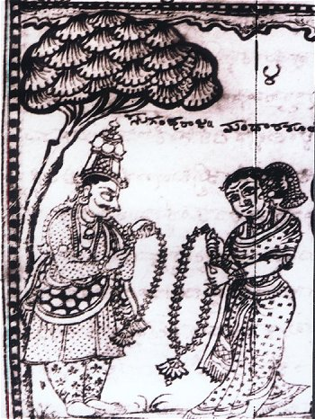
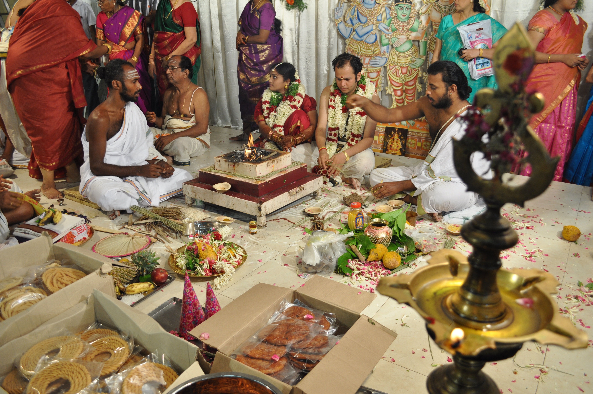
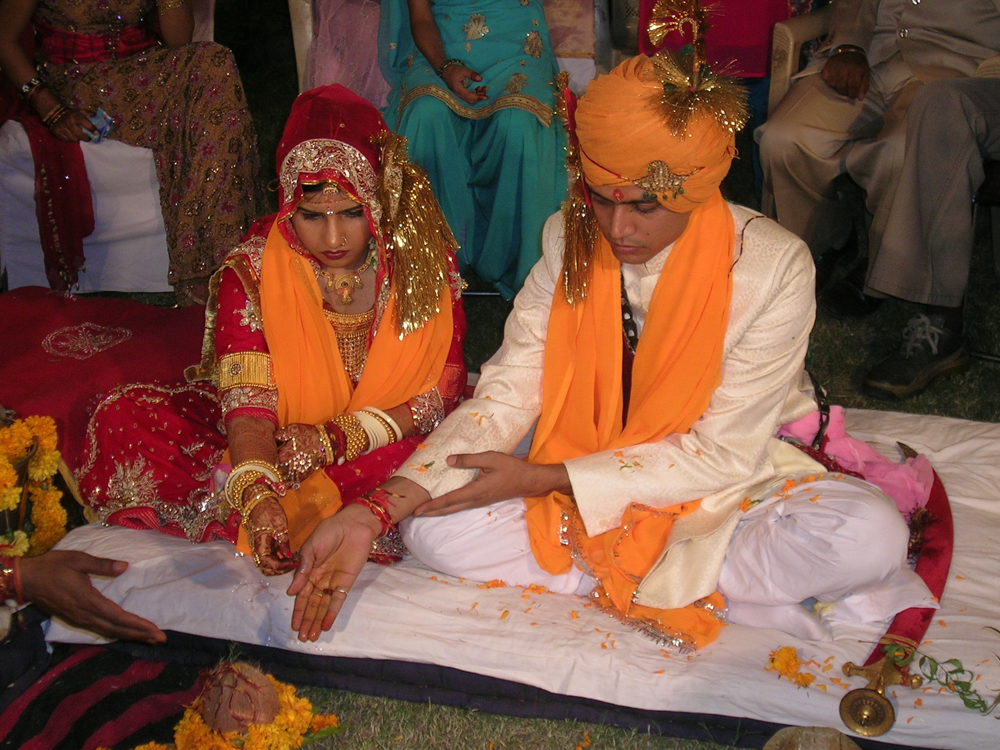
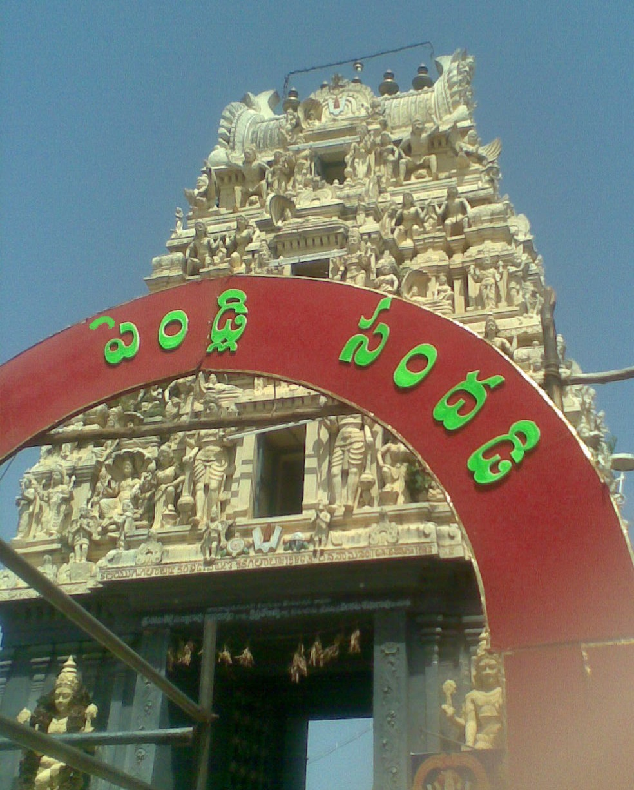
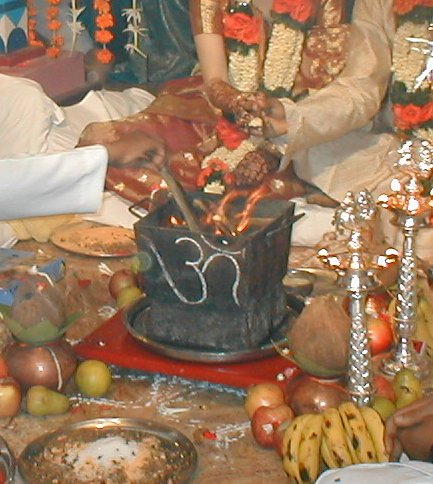
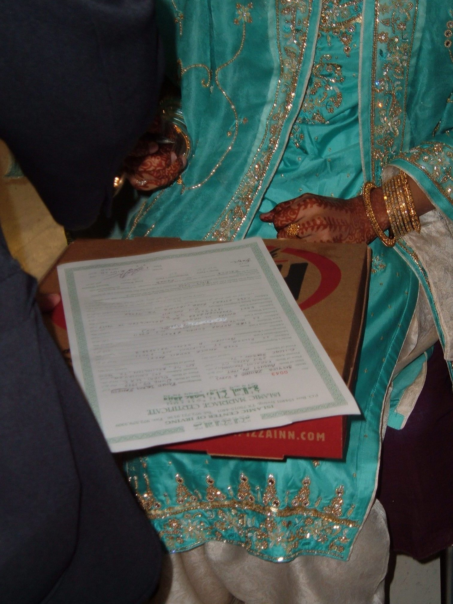
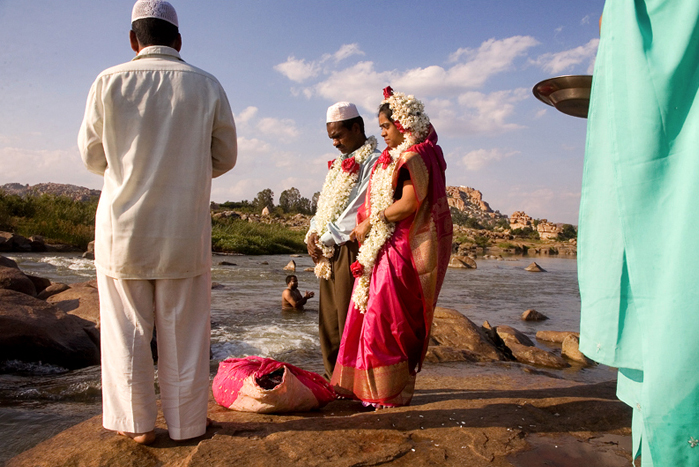

# పెళ్ళి

*హిందూ వివాహం-సౌగంధికా పరిణయం నుండి ఒక దృశ్యం*

*వివాహ ఉంగరాల జత*

| Col1 |
| --- |
| ధారావాహిక లోని భాగం |
| హిందూధర్మం |
|  |
| హిందుత్వ చరిత్ర |
| విస్తరించు భావనలు దేవుడు పరమాత్మ ఏకేశ్వరవాదం దేవుడు , లింగం జీవితము ఆత్మ మాయ కర్మ సంసారం పురుషార్థములు ( ధర్మము • అర్థము • కామము •మోక్షం) నీతి నియమాలు హిందూ సనాతన ధర్మము పరిపాలన ధర్మము అహింస అస్థేయ అపరిగ్రహ బ్రహ్మచర్యము సత్యము మోక్షం భక్తి యోగము జ్ఞాన యోగము కర్మ యోగము |
| విస్తరించు భారతీయ దర్శనములు అరు అష్టిక పాఠశాలలు * వైదిక దర్శనములు (6) సాంఖ్య యోగ న్యాయ వైశేషిక పూర్వమీమాంస ఉత్తరమీమాంస ( వేదాంతము ) ( ద్వైతం • అద్వైతము లేదా స్మార్తం • విశిష్టాద్వైతము లేదా వైష్ణవం • ద్వైతాద్వైతం ) ఇతర సనాతన దర్శనములు పశుపత దర్శనము శైవము ప్ర్త్యభిజ్జ్ఞ దర్శనము రశేశ్వర దర్శనము పాణిని దర్శనము అవైదిక దర్శనములు (2) జైన దర్శనము బౌద్ధ దర్శనము సిద్ధాంతాలు: అవతారము బ్రాహ్మణ ధర్మము ఆర్ధ కర్మ మోక్షం మాయ ఇష్టదేవతలు ముక్తి పునర్జన్మ సంసారం త్రిమూర్తులు తురీయ హిందూ మత శాఖలు: వైష్ణవము శైవము శక్త్యారాధాన స్మార్తులు ఆగమ హిందూ ధర్మము సమకాలీన హిందూమత ఉద్యమాలు హిందూమత సంస్థలు |
| విస్తరించు హిందూ దేవతలు త్రిమూర్తులు బ్రహ్మ విష్ణువు శివుడు ఇతర ముఖ్య దేవి , దేవతలు / దేవుళ్ళు దేవుడు ఆధునిక సరస్వతి లక్ష్మీ పార్వతి శక్తి దుర్గ కాళి వినాయకుడు కార్తికేయుడు రాముడు శ్రీ కృష్ణుడు హనుమంతుడు ఋగ్వేద దేవతలు సోముడు అశ్వినీదేవతలు ఇంద్రుడు అగ్ని మరుత్తులు ఉషస్సు సూర్యుడు సవిత పూష విష్ణువు వరుణుడు బృహస్పతి రుద్రుడు యముడు త్వష్ట అదితి మేఘదేవత పర్జన్యుడు ఆకాశము భూమి వాయువు |
| విస్తరించు ధర్మశాస్త్రములు వేదాలు ఋగ్వేదం యజుర్వేదం సామవేదము అధర్వణవేదము విభాగాలు సంహితలు బ్రాహ్మణాలు అరణ్యకాలు ఉపనిషత్తులు ఉపవేదాలు - 4 ఆయుర్వేదము (వైద్యం) ధనుర్వేదము (యుద్ధం) గాంధర్వ వేదము (సంగీతం) స్థాపత్య వేదము ( శిల్ప విద్య) వేదాంగాలు శిక్ష ఛందస్సు వ్యాకరణము నిరుక్తము కల్పము జ్యోతిష్యము ఉపనిషత్తులు ఋగ్వేదం :మొత్తం: - 10 ఐతరేయ యజుర్వేదం : మొత్తం: 51 :- కృష్ణ - 32, శుక్ల - 19 బృహదారణ్య ఈశావాస్య తైత్తిరీయ కఠోప శ్వేతాశ్వతర సామవేదం :మొత్తం: - 16' ఛాందోగ్య కేన అథర్వణవేదం :మొత్తం:31 (మొత్తం - 108) ముండక మాండూక్య ప్రశ్న పురాణాలు మొత్తం - 18 బ్రహ్మ (రాజస గుణం) బ్రహ్మ బ్రహ్మాండ బ్రహ్మవైవర్త మార్కండేయ భవిష్య వామన విష్ణు (సాత్విక గుణం) విష్ణు భాగవత నారద గరుడ పద్మ వరాహ శివ ( తామస గుణం) శివ లింగ స్కాంద అగ్ని మత్స్య కూర్మ ఇతిహాసములు రామాయణము మహాభారతము ఇతర గ్రంథాలు భగవద్గీత హిందూధర్మశాస్త్రాలు మనుస్మృతి అర్థశాస్త్రము యోగవాశిష్టము సూత్రాలు స్తోత్రములు తంత్రములు యోగసూత్రములు వేదాలు పురుషార్థము ఆగమములు వర్ణాశ్రమములు ఋత్విక్కులు హోమద్రవ్యములు గ్రంథం వర్గీకరణ శృతులు - గ్రంథం వర్గీకరణ స్మృతులు ఆంగీరసస్మృతి వసిష్టస్మృతి విష్ణు అత్రిస్మృతి మను హరితస్మృతి పరాశరస్మృతి శంఖస్మృతి బృహస్పతిస్మృతి గౌతమస్మృతి శాతాతపస్మృతి ఆపస్తంబస్మృతి వ్యాసస్మృతి లిఖితాస్మృతి దక్షస్మృతి యమస్మృతి కాత్యాయనస్మృతి యాజ్ఞవల్క్య ఉశానస్మృతి సమ్వర్తస్మృతి హిందూ మతం పాఠాలు - కాలక్రమం |
| విస్తరించు అభ్యాసములు ఆరాధన పూజ జపం భజన యజ్ఞము హోమము పుణ్యక్షేత్రాలు నైవేద్యము హారతి దర్శనము దీక్ష మంత్రము సత్సంగమము స్తోత్రము ప్రముఖ హిందూ దేవాలయాలు విగ్రహము భక్తి ప్రాయశ్చిత్తము తపస్సు ధ్యానము దానము సంస్కారములు ( సంస్కారములు - మొత్తం: 48 ) ఆత్మగుణసంస్కారములు (8) ఆత్మగుణములు (పురుషుడు ఆచరించ వలసినవి) దయ అనసూయ అకార్పణ్యం అస్పృహ అనాయాసం శౌచం మాంగల్యము క్షాంతి పంచయజ్ఞములు (5) పంచయజ్ఞాలు దేవయజ్ఞము పితృయజ్ఞము భూతయజ్ఞము బ్రహ్మయజ్ఞము మనుష్యయజ్ఞము హవిర్యజ్ఞములు (7) హవిస్సు అగ్నాధేయం అగ్నిహోత్రం సౌత్రాయణీ అగ్రయణేష్టి చాతుర్మాస్యం ధర్మపూర్ణమాస్యం విరూఢపశుబంధ సోమయజ్ఞములు (7) సోమము అగ్నిష్టోమ అత్యగ్నిష్టోమ ఉక్థ్య వాజపేయ అస్తోర్యామము అతిరాత్రిః షోడశీ పాకయజ్ఞములు (7) పాకయజ్ఞములు అష్టకా అగ్రహాయణి ఆశ్వయుజి శ్రాద్ధ పార్వణ చైత్రీ శ్రావణి వటువు - ఆచార్యుడు వటువు కోసం ఆచార్యుడు చేసేవి - (4) ప్రాజాపత్యం సౌమ్యం అగ్నేయం వైశ్వదేవం స్వకృత్యములు స్వయం (2) స్నాతకము వివాహము భార్యకు చేయవలసిన సంస్కారములు భార్య కు సంస్కారములు - (3) గర్భాదానము పుంసవనము సీమంతము సంతానము శ్రేయస్సు కొరకు సంస్కారములు సంతానము - సంస్కారములు - (5) జాతకర్మ నామకరణము అన్నప్రాశన చౌలము ఉపనయనము చతురాశ్రమ ధర్మాలు బ్రహ్మచర్యం గృహస్థ వానప్రస్థం సన్యాసం పండుగలు నవరాత్రి విజయదశమి (దసరా) దీపావళి శివరాత్రి హోలీ కుంభమేళా రథయాత్ర విష్ణువు బిహు వైశాఖి వినాయకచవితి ఓనం శ్రీరామనవమి జన్మాష్టమి రక్షాబంధనం దుర్గా పూజ అట్లతద్ది అనంత పద్మనాభ చతుర్దశి అర్ధోదయము అక్షయతృతీయ ఉగాది ఏకాదశి ఏరువాక పున్నమి కనుమ కార్తీక నక్షత్రం కావిళ్ళ పండుగ కృష్ణాష్టమి కృష్ణ జయంతి కోజగారి పూర్ణిమ గురుపౌర్ణమి గృహ ప్రవేశం గంగపండగ భోగి చాతుర్మాస్యము తిరువళ శనివారాలు తులసీపూజ దీపావళి నవరాత్రోత్సవము నాగపంచమి నాగుల చవితి నృసింహజయంతి పరశురామజయంతి పశువుల పండగ బారసాల భీష్మైకాదశి భీష్మాష్టమి మకరసంక్రాంతి మహాలయ పక్షము మహాశివరాత్రి మహోదయము రథసప్తమి వరలక్ష్మీ వ్రతము వసంతపంచమి వామనజయంతి విజయదశమి వైకుంఠ ఏకాదశి ముక్కోటి ఏకాదశి శ్రావణ పూర్ణిమ రాఖీపూర్ణిమ సత్యనారాయణ వ్రతము సుబ్బరాయ షష్ఠి సుబ్రహ్మణ్య షష్ఠి సూర్యనారాయణ జన్మదినం సంక్రమణం సంక్రాంతి హనుమజ్జయంతి |
| విస్తరించు తత్వవేత్తలు ప్రాచీనం ఆరుణి అష్టావక్ర అత్రి ఉపమన్యు ఋచీక ఋషభ ఋష్యశృంగుడు ఔరవ కణ్వ కపిలుడు కలి కశ్యపుడు కణాదుడు కాత్యాయన మహర్షి కౌశికుడు‎ గయుడు గృత్సదుడు‎ గోతముడు గౌతముడు చ్యవనుడు జమదగ్ని సత్యకామ జాబాలి జైమిని తండి దత్తాత్రేయ దత్తోలి దధీచి దుర్వాసుడు నచికేతుడు నారదుడు పతంజలి పరశురాముడు పరాశరుడు పాణిని పిప్పలాద పులస్త్య పులహుడు పూరుడు పృథు ప్రాచేతసుడు (వాల్మీకి) భరద్వాజుడు భృగు మనువు మరీచి మాండవ్య మార్కండేయుడు మృకండుడు యయాతి‎ యాజ్ఞవల్క్య రురు రేభుడు వశిష్ట వామదేవుడు‎ విభాండకుడు విశ్వామిత్రుడు వ్యాసుడు శంఖ శతానంద శుక శుక్ర శునశ్శేపుడు శౌనకుడు సనత్కుమారులు సాందీపని సాయణుడు సుధామ మధ్య యుగము ఆది శంకరాచార్యుడు రామానుజాచార్యులు మధ్వాచార్యులు బసవన్న వేదాంతదేశికులు తుకారాం తులసీదాసు వాచస్పతి మిశ్రా వల్లభ విద్యారణ్యుడు తోటకాచార్యులు పద్మపాదాచార్యులు చైతన్య కబీరుదాసు మధుసూదన నామదేవ నింబార్క పద్మనాభ తీర్థ నరహరి తీర్థ జయతీర్థ రాఘవేంద్రస్వామి ఆధునికం అరబిందో ఎ.సి. భక్తివేదాంత స్వామి ప్రభుపాద ఓషో విజయేశ్వరీదేవి గణపతి సచ్చిదానంద స్వామి జిడ్డు కృష్ణమూర్తి జిల్లెల్లమూడి అమ్మ తులసీదాసు తాడేపల్లి రాఘవ నారాయణ శాస్త్రి తూపల్లె గురప్ప స్వామి నరసింహ సరస్వతి నారాయణ గురు చంద్రశేఖరేంద్ర సరస్వతి స్వామి చిన్న జీయర్ స్వామి చిన్మయానంద సరస్వతి చాగంటి కోటేశ్వరరావు పరిపూర్ణానంద స్వామి పోతులూరి వీరబ్రహ్మేంద్రస్వామి పద్మసంభవుడు పరమహంస యోగానంద బాబాజీ బ్రహ్మశ్రీ జగద్గురు వేదాంతం లక్ష్మణార్యులు మాతా అమృతానందమయి రమణ మహర్షి మాతా మాణికేశ్వరి రామకృష్ణ పరమహంస విద్యా ప్రకాశానందగిరి స్వామి వెంకయ్య స్వామి విద్యా ప్రకాశానందగిరి స్వామి వేమన శారదా దేవి శివకుమార స్వామీజీ సత్యాత్మ తీర్థ శివానందమూర్తి షిర్డీ సాయిబాబా సత్య సాయి బాబా సదాశివబ్రహ్మేంద్ర సుందర చైతన్యానంద ఉప్పులూరి గోపాల కృష్ణమూర్తి ఎక్కిరాల కృష్ణమాచార్య ఎక్కిరాల భరద్వాజ ఎక్కిరాల వేదవ్యాస స్వామి నిత్యానంద స్వామి శివానంద స్వామి వివేకానంద సమర్థ రామదాసు సత్యప్రమోద తీర్థ సద్గురు జగ్గీ వాసుదేవ్ |
| విస్తరించు ఇతర విషయములు క్యాలండర్ దేశాల వారీగా హిందూమతం భారతదేశంలోని హిందూ దేవాలయాల జాబితా హిందూ ఋషులు జాబితా హిందువులపై అకృత్యాలు హిందూ పుణ్యక్షేత్రాలు ప్రపంచ దేవాలయాల జాబితా హిందూ దేవాలయాలు ఆంధ్ర ప్రదేశ్ పుణ్యక్షేత్రాల జాబితా హిందూ సంస్కారములు పురాణాలు దేశాల వారీగా హిందూమతం |
| హిందూమత పదకోశం |
| v t e |

## ఆంగ్ల శబ్ద వ్యుత్పత్తి

పెళ్ళి అనే పదానికి పెళ్ళి, వివాహం, పాణిగ్రహణం, కన్యాదానము, కళ్యాణము, సప్తపది అనే పలు విధములుగా అర్ధములు ఉన్నాయి. ఆంగ్లభాషలో మ్యారేజి (Marriage) అని అంటారు. ఈ పదం మధ్య ఆంగ్ల పదమైన mariage నుండి వ్యుత్పత్తి అయింది. ఈ పదం మొదటగా సా, శ.పూ 1250-1300 లలో కనిపించినట్లు తెలుస్తుంది. ఈ పదం తర్వాత కాలంలో పాత ఫ్రెంచ్ భాషలో పదం marier (పెళ్ళి చేసుకొనిట) నుండి తుదకు లాటిన్ పదమైన marītāre (భర్త లేదా భార్యను సమకూర్చుట), marītāri అనగా వివాహం చేసుకొనుట. విశేషణ పదమైన marīt-us -a, -um అనగా పెళ్ళి సంబంధము లేదా పెళ్ళిలో పురుష రూపంలో భర్త అనే పదం లేదా స్త్రీ రూపంలో "భార్య" అనే పదానికి నామవాచక రూపంగా కూడా వాడుతారు." [ 1 ] పెళ్ళికి సంబందించిన పదం "matrimony" పాత ఫ్రెంచ్ పదం అయిన matremoine పదం నుండి ఉద్భవించింది. ఈ పదం క్రీ.పూ 1300 కాలంలోనిది. ఆ తర్వాత ఈ పదం mātrimōnium అనే లాటిన్ పదం నుండి జనించింది. [ 2 ]

## హిందూ వివాహం

*A Hindu Marriage Ceremony in progression*

*Hindu marriage ceremony from a Rajput wedding.*

*A Nepali Hindu couple in marriage ceremony.*

*నూతన దంపతులు .*

హిందూ వివాహం ఒక పవిత్ర కార్యం అని గతంలో గుర్తింపు నివ్వడం జరిగింది. అయితే 1956 లో హిందూ వివాహ చట్టం రూపొందించిన తరువాత, వివాహానికి ఒక ప్రత్యేకమైన ప్రక్రియ గానీ, విధానంగానీ చెప్పబడలేదు. అంతే కాక హిందూ మత ఆచారానికి గుర్తింపునివ్వబడింది. హిందూ మతంలో ఉన్న విభిన్న సామాజిక వర్గాలు వేరువేరు వివాహ పద్ధతులను ఆచరించడాం జరుగుతుంది. హిందూ వివాహపు సరైన గుర్తింపు కోసం మతాచారాలను పాటించడం ప్రధానం. హిందూ వివాహం చెల్లుబాటు అగుటకు ఈ క్రిందినుదహరించిన పద్ధతులు పాటించాలి.

- వరుడు 21 సంవత్సరాలు, వధువు 18 సంవత్సరాలు నిండి ఉండాలి. ఈ షరతును ఉల్లంఘించితే శిక్షార్హమైన నేరంగా పరిగణింపబడుతుంది.
- వధూవరులకు గతంలోనే వివాహమైన పక్షంలో వారి భర్త లేదా భార్య జీవించి ఉండరాదు లేదా అట్టి వివాహం అమలులో ఉండరాదు. ఈ షరతును భిన్నంగా జరిగిన ద్వితీయ వివాహాన్ని బహుభార్యత్వం అనే నేరంగా పరిగణిస్తారు.
- వధూవరులిద్దరూ వివాహానికి అనుమతి ఇవ్వగల మానసిక సామర్థ్యం కలిగి ఉండాలి. మానసిక వైకల్యం వివాహానికి కానీ, సంతాన వృద్ధికి గానీ ఆటంకమవుతుంది.
- వధూవరులిద్దరూ తరచూ మానసిక వైకల్యానికి లేదా "ఎపిలెప్సీ" అనే మానసిక వ్యాధికి గురి అయి ఉండరాదు.
- వధూ వరుల మధ్య నిషేధించబడిన స్థాయిలలో బంధుత్వం ఉండరాదు. అనగా ఒకరు వారి తల్లి నుండి మూడు తరాలు లేదా తండ్రి నుండి మూడు తరాలలో బాంధవ్యం కలిగి ఉండరాదు. అలాగే వధూవరులకు సపిండ బంధుత్వంలో ఒకే తరపు బంధువు పైస్థాయిలో ఉండరాదు. సోదర/సోదరి, పిన తండ్రి/మేనమామ, మేనకోడలు/కూతురు, మేనత్త/పినతల్లి/మేనల్లుడు/కుమారుడు, సోదరులు/సోదరీల సంతానముల మధ్య వివాహం నిషేధించబడింది. ఏ వ్యక్తి అయినా తన సోదరుడి భార్యను విడాకులైన తరువాత కూడా వివాహం ఆడరాదు. అయితే ఏ ప్రాంతములోనైనా, లేదా సామాజిక వర్గంలోనైనా అనాదిగా పాటిస్తూ వచ్చిన ఆచారం రీత్యా నిషిద్ధ స్థాయిలలో బంధుత్వం ఉన్నప్పటికీ వివాహం చేసుకోవచ్చు. అలాగే భార్య గతించిన వ్యక్తి, భర్త గతించిన మహిళను వివాహమాడవచ్చు.

కేవలం సబ్‌రిజిష్టర్ కార్యాలయంలో ఒక దస్తావేజు రాసి నమోదు చేయించినంత మాత్రాన హిందూ వివాహం చెల్లుబాటు కాదు. వివాహానికి సంబంధించిన ఆచార క్రతువులు నిర్వర్తించనిదే ఆ వివాహం సక్రమమైనదిగా గుర్తించలేము. అదే విధంగా హిందూ వివాహాల రిజిష్టర్ లో అసలు వివాహం కార్యక్రమమే జరుపకుండా నమోదు చేసిన వివరాలు ఆ వివాహాన్ని చలామణి చేయవు. అయితే వివాహ కార్యక్రమం పూర్తి అయినాక హిందూ వివాహ రిజిష్టర్ లో వధూవరులు తమ వివాహ వివరాలను నమోదు చెయవచ్చు. ఈ రిజిష్టర్ లోని నమోదు చేయబడిన అంశాలు వివాహం వాస్తవంగా జరిగినట్లు సాక్ష్యంగా ఉపయోగపడతాయి. అందువల్ల ఇలా నమోదు చేయడం దంపతులిద్దరికీ ఉపయోగకరం.

ఆంధ్రప్రదేశ్ లో అన్ని వివాహాలను తప్పనిసరిగా నమోదు చేయాలని ప్రభుత్వ ఉత్తర్వు సంఖ్య 35, మహిళా అభివృద్ధి, బాలలు, వికలాంగుల సంక్షేమ విభాగం తేది.24.09.2003 ద్వారా నిర్దేశించింది. హిందువులు 1955 నాటి హిందూ వివాహ చట్టంలో పేర్కొనబడిన విధానాల ద్వారా మాత్రమే కాక 1954 నాటి ప్రత్యేక వివాహాల చట్టం ప్రకారం వివాహం చేసుకోవచ్చు. అంతేకాక హిందూ మతాచార వివాహాన్ని కూడా ప్రత్యేక వివాహాల చట్టం పరిధిలో నమోదు చేసుకోవచ్చు. ఒక హిందూ మరొక హైందవేతర స్త్రీ పురుషుల మధ్య వివాహం ప్రత్యేక వివాహం చట్ట పరిధిలోకి వస్తుంది. స్త్రీ పురుషులిద్దరు తప్పనిసరిగా హిందువులు అయినపుడు మాత్రమే వారి వివాహం హిందూ వివాహ చట్టంలోని అంశాల ద్వారా నియంత్రించబదుతుంది.

## హిందూ వివాహం

### హిందూ వివాహ సంప్రదాయం

- ధర్మార్ధ కామమోక్షాల నాలుగు పురుషార్ధాలలో ఒకటైన కామాన్ని ధర్మ బద్ధం చేటానికి పెద్దలు, ఋషులు ఎంచుకున్న ఏకైక మార్గం వివాహం. వివాహ ప్రక్రియతో స్త్రీ పురుషుల కర్తవ్యం నిర్వహణా మార్గం సుగమం చేయబడింది. వివాహానంతరం స్త్రీ పురుషులకు అనేక సంప్రదాయక విధులు నిర్వహించే అర్హత కలుగుతుంది. ఉదాహరణగా బాలసారె నుండి వివాహం వరకు ఉన్నా అనేక సుసంస్కారములు జరిపించటానికి హిందూ ధర్మశాస్తం ప్రకారము వివాహం జరగని వారుకాని, వివాహానంతరం అనేక కారణాలవలన ఒంటరిగా మిగిలిన స్త్రీ, పురుషులయిననూ ఈ సంప్రదాయక కార్యక్రమములు నిర్వహించటకు అనర్హులు. దంపతులైన స్త్రీ పురుషులు మాత్రమే సంప్రదాయక విధి నిర్వహణకు అర్హులౌతారు. కనుక హిందూ సంప్రదాయంలో వివాహానికి ప్రత్యేక గుర్తింపు ఉంది. తీర్ధయాత్రల సమయంలో చెప్పే సంకల్పం, దేవతామూర్తుల కళ్యాణము, సత్యనారాయణ వ్రతం, హోమం, యజ్ఞం , యాగం లాంటివి నిర్వహించటానికి గృహస్థు ధర్మపత్ని సమేతంగా జరపాలని నియమం ఉంది.వివిధ కులాలను బట్టి, ప్రాంతాలను బట్టి కొద్ది తేడాలున్నప్పటికీ, స్థూలంగా భారతదేశంలో జరిగే హిందూ వివాహాలన్నీ ఒక పద్ధతిలోనే ఉంటాయి.
- తల్లిదండ్రుల అనుమతి లేకుండా 21 ఏళ్ళ లోపు వయసున్న యువతిని పెళ్లాడడం శిక్షార్హమైన నేరమని కర్ణాటక హైకోర్టు ప్రకటించింది.

## హిందూ వివాహం

### హిందూ మత వివాహ విధానం

- హిందూ ధర్మ శాస్త్రముల ప్రకారము పూర్వకాలములో వివాహము కావలసిన వధూవరుల ఇరువురు తరపున తల్లిదండ్రులు, పెద్దవారు, దగ్గరివారు, స్నేహితులు, హితులు లేదా బంధువులు ముందుగా వధూవరుల జాతక సమ్మేళనము లోని ముఖ్యమైన 17 జాతక వివరణ విభాగములు, 20 వింశతి (కూట) వర్గములు అనే వివాహ పొంతనములు చూసిన పిదప సంబంధము నిశ్చయించుకునేవారు.
- ప్రస్తుత కాలములో వారి వారి అభిరుచుల, అవసరాల, అలవాట్ల, అందుబాటు, అవసరార్ధం, అవకాశం, ఆర్థిక స్థితిగతుల, ఆకాంక్ష అయినదనిపించుకునేందుకు, తదితరాల మేరకు సంబంధము కలుపుకొని నిశ్చయించు కుంటున్నారు. ప్రస్తుతము వివాహ సంబంధములు ఈ రోజుల్లో ఏక కుటుంబాలలో ఎక్కువగా ఆ కుటుంబములోని వారే నిశ్చయ నిర్ణయములు తీసుకోవడము అలవాటుగా మారుతూ ఆనవాయితీగా మారిపోయింది.
- జీవితంలో మరపురానిది పెళ్ళి. ఇది స్త్రీ పురుషులకు జీవన మైత్రి నిచ్చునది. శారీరక మానసిక స్థితి గతులలో విడదీయరానిది. వివాహము సర్వమతాల వారికి, వారి వారి సంప్రదాయాలను అనుసరించి ఆమోదయోగ్యమైనది. హంగులతో ఆర్భాటాలతో వివాహము చేసుకొని ఆనందము పొందుట మన సామాజిక లక్షణము. వివాహం వల్ల ఆడ మగా ఇద్దరూ శారీరకంగాను, మానసికంగాను సుఖాన్నిపొందుతారు. పిల్లల కోసం, ఆస్తిపాస్తుల రక్షణ కోసం, వంశాభి వృద్ది కోసం పెళ్ళి అవసరం అవుతంది. "క్రమ బద్ధమైన జీవితాన్ని ఆశచూపి పురుషుడినీ, భధ్రతను భరోసాగా ఇచ్చి స్త్రీని, పెళ్ళి అనే తాడుతో గట్టిగా కట్టి పడేశాక ఇక వారివైపు చూడదు సమాజం. పెళ్ళికున్న పాత ధర్మాలు పాతబడ్డాయి, కొత్తవి రాలేదు" అన్నారు చలం .

## హిందూ వివాహం

### ఆడపిల్ల వారు మగపిల్ల వాడికి చేయవలసినవి

కాలానుగుణంగా వివాహ వేడుకలు మార్పులు చెందుతున్నాయి.

- స్నాతకంలో వరుడికి బట్టలు (చాపు)
- పానకంలో కావడి మీద బట్టలు (చాపు)
- పానకం బిందెలు - 2, గ్లాసులు - 2
- మధుపర్కములు - బట్టలు (చాపు
- కాళ్ళు కడుగు పళ్ళెం - 1
- మరచెంబు - 1
- తెరసెల్లా -1
- కట్నాలు (బహుకరణలు)
- పిల్ల మధుపర్కము - చీరపల్లె (పిల్ల మేనమామ ఇవ్వాలి)
- భటువు (ఆభరణము)
- ఉత్తర జందెము (జంధ్యము) లు
- మంగళ సూత్రం - 1
- మట్టెల జత - 1
- పెళ్ళి గంప - 1
- సదస్యంలో బట్టలు (పట్టువి)
- నాగవల్లిలో ఉత్తరీయపు బట్టలు (చాపు)
- స్థాళీపాకంలో దీపారాధన కుంది - 1
- స్థాళీపాకంలో దీపారాధన గిన్నెలు - 2
- స్థాళీపాకంలో వరుడికి బట్టలు (చాపు)
- అలక పాన్పు మీద జంపఖానా
- బొమ్మను అప్పగింత చీర (ఆడపడుచుకి)
- ఆడపడుచు లాంచనాలు
- అప్పగింతల బట్టలు
- దొంగ చెంబు
- గృహ ప్రవేశంలో పిల్లవాడికి బట్టలు
- గృహ ప్రవేశంలో పిల్లకి బట్టలు
- సత్యనారాయణ వ్రతంలో పిల్లవాడికి బట్టలు
- సత్యనారాయణ వ్రతంలో పిల్లకి బట్టలు
- మూడు (3) నిద్రలకు వెళ్ళినప్పుడు పిల్లవాడికి బట్టలు
- మూడు (3) నిద్రలకు పిల్లవాడి వెంట వెళ్ళిన వారికి బట్టలు

## హిందూ వివాహం

### ఆడపిల్ల పెళ్ళికి కావలసిన సామాగ్రి

- పసుపు
- కుంకుమ
- తమలపాకులు
- పసుపు కొమ్ములు
- వక్కలు
- ఎండు ఖర్జురాలు
- ఎండు కొబ్బరి చిప్పలు
- మంగళ సూత్రం - 1
- భటువు - 1
- మట్టెల జత -1
- జంధ్యము (జందెము) లు - 2 సెట్ట్లు
- దీపారాధన కుంది - 1
- నాగలి కావడి - 1
- పెళ్ళి గంప - 1
- కాళ్ళు కడుగు పళ్ళెం - 1
- మరచెంబు - 1
- పానకం బిందెలు - 2
- గ్లాసు (లు) - 1 లేదా 2
- ఆడపిల్లకు మధుపర్కాలు - (బట్టలు) వల్లి (బట్ట) తో
- ఆడపిల్లకు మధుపర్కాలు - (బట్టలు)
- వర బహుమతి
- కొబ్బరి బొండాలు - 2
- ఉత్తర జంద్యములు
- దారపు బంతులు
- నవధాన్యాలు
- మూకుళ్ళు - 6
- ముంతలు -3
- ప్రమిదలు -6
- రవికెల గుడ్డలు
- తుండు గుడ్డలు
- తెరసెల్లా - 1
- ఇత్తడి గిన్నెలు చిన్నవి - 2

## హిందూ వివాహం

### మగపెళ్ళి వారు ఆడపిల్ల వారికి చేయవలసినవి

కాలానుగుణంగా వివాహ వేడుకలు, పద్ధతులు (తంతు) మార్పులు చెందుతున్నాయి.

- స్నాతకంలో బావమరిదికి బట్టలు (చాపు)
- పెళ్ళికుమార్తెను బుట్టలో తీసుకుని వచ్చిన మేనమామకు బట్టలు (చాపు)
- అలక పాన్పు మీద బావమరిదికి బట్టలు
- లాజకట్నం - బావమరిదికి బట్టలు
- ముత్తవ కానుకలు
- మంగళ సూత్రం - 1
- మట్టెల జత - 1
- నల్లపూసలు - అందులో బంగారపు గుండు - 1
- స్థాళీపాకంలో పెళ్ళికుమార్తెకు చీర - 1
- సదస్యంలో పెళ్ళికుమార్తెకు చీర - 1
- నాగవల్లిలో పెళ్ళికుమార్తెకు చీర - 1
- పెళ్ళికుమార్తె తల్లికి చీర - 1
- గృహ ప్రవేశం అనంతరం వెళ్ళేటప్పుడు ఆడపిల్లకు చీర - 1
- గృహ ప్రవేశం అనంతరం వెళ్ళేటప్పుడు ఆడపిల్ల వెంట వచ్చిన వారికి చీర - 1

## హిందూ వివాహం

### మగపిల్ల వాడి పెళ్ళికి కావల్సిన సామాగ్రి

- పసుపు
- కుంకుమ
- మట్టెలు జత
- మంగళ సూత్రం
- తలంబ్రాలు
- తమలపాకులు
- వక్కలు
- ఎండు ఖర్జురాలు
- కొబ్బరి చిప్పలు
- బియ్యం
- రవికెల గుడ్డలు
- తుండు గుడ్డలు
- తెరసెల్లా
- పాము కోళ్ళు
- భాషికాలు
- నల్లపూసలు
- నల్లపూసల్లో బంగారపు గుండు
- గులాము
- దారపు బంతి

## హిందూ వివాహం

### హిందూ వివాహ పద్ధతిలో తారసపడే కొన్ని పేర్లు, వాటి వివరణలు

*Marriage Welcome Board*

*హిందూ సంప్రదాయ వివాహము*

*పెళ్ళి సమయంలో ఒక కార్యక్రమం*

*పెళ్ళి మండపంలోనే ప్రత్యేక పూల అలంకరణ కోసం జరుగుతున్న ఏర్పాట్లు*

- నిశ్చయ వివాహం: పెద్దలు నిర్ణయించి కుదిర్చిన పెళ్ళిని నిశ్చయ వివాహం అంటారు. నిశ్చయ వివాహాన్ని ఆంగ్లంలో ఆరేంజ్డ్ మ్యారేజ్ (Arranged marriage) అంటారు. హిందూ సాంప్రదాయం ప్రకారం భారతదేశంలోని హిందువులు నిశ్చయ వివాహాలను జరిపిస్తున్నారు.
- వధువు: హిందూ సంప్రదాయం ప్రకారం లక్ష్మీ , సరస్వతి , పార్వతి ల ఏకాత్మక రూపంగా వధువును తలుస్తారు. పచ్చదనంతో లోకాన్ని చైతన్య పరచే ప్రకృతి యొక్క ప్రతిరూపంగా వధువుయొక్క కాళ్ళకు పారాణి పూసి జడలో మల్లెలు తురిమి మొహానికి పసుపును రాసి అలంకరిస్తారు.
- వరుడు: త్రిమూర్తుల దివ్యస్వరూపం. విధాత చూపిన విజయోన్ముఖ పథంలో విజ్ఞతతో నడిచేందుకు సిద్ధమైన సిద్ధ పురుషునిగా వరుడిని తలుస్తారు.
- పెళ్ళి చూపులు: తెలుగు వారి పెళ్ళిళ్ళలో ఉండే ఆ సందడి, సంతోషం ఎవరూ మరువలేరు. సకుటుంబ సపరివార సమేతంగా, బాజా భజంత్రీల నడుమ, సంతోషంగా జరిగే ఆ కళ్యాణ మహోత్సవం అందరి జీవితాలలో ఒక మరువలేని సంఘటన. పెళ్ళి చూపులతో పెళ్ళి కార్యక్రమం ప్రారంభం అవుతుంది. సాంప్రదాయం ప్రకారం అబ్బాయి, అమ్మాయి ఇంటికి బంధువర్గ సమేతంగా వెళ్ళి అమ్మాయిని చూస్తారు. కట్న కానుకలు, లాంఛనాలు అన్నీ కుదిరాక నిశ్చితార్థపు తేదీ నిర్ణయించు కుంటారు.
- ఆహ్వాన పత్రికలు: నిర్ణయించబడిన ముహూర్తానికి వరుని తరపువారూ, వధువు తరపువారూ వారి వారి కులాచారానుసారంగా ఆహ్వానపత్రికలు ముద్రించుకుంటారు. వీటిని శుభలేఖలు|పెళ్ళి పత్రికలు అంటారు. మంగళ సూచకంగా శుభలేఖకు నాలుగువైపులా పసుపు పూస్తారు.
- పెళ్ళి పిలుపులు: బంధుగణమును పిలుచుకొనుట అనేది పెళ్ళిళ్ళలో సర్వ సాధారణం. ఎక్కడెక్కడో ఉంటూ, అప్పుడెప్పుడూ కలిసే బంధువులందరూ కలువవగలిగే మంచి సందర్భాలు, పెళ్ళిళ్లు. ఆ కలయికలకు వేదికగా పెళ్ళివారి ఇల్లు మారిపోతుంది.
- సరంజామా :పెళ్ళి సరంజామా కొనటం అనేది పెళ్ళి వారి ఇండ్లలో అన్నిటికంటే పెద్దపని. పెళ్ళి అనగానే పట్టుచీరల రెపరెపలు, బంగారు ఆభరణాలు, ఆంగ్లభాషలో అని అంటారు ధగదగలు, కొత్తకొత్త వస్తువులు ఇలా అన్నీ కొత్తగా కొనుక్కుంటారు.
- కళ్యాణ మండపము: కొందరు మండపములను వాడితే మరికొందరు వాడరు. సాధారణంగా పల్లెలలో కొబ్బరి ఆకుల పందిరి వేయుట వలన మండపంయొక్క ఆవశ్యకత తక్కువ. పట్టణాలలో టిప్ టాప్ పందిరి వేయుట వలన మండపాలు తప్పని సరిగా వాడటం జరుగుతుంది.
- నిశ్చితార్ధము: వధూవరులు పరస్పరం నచ్చాక వారి తలిదండ్రులు కట్నకానుకలు, ఆభరణాలు మొదలగు విషయాలు మాట్లాడుకొన్న తరువాత ఒక శుభముహూర్తంలో పురోహితుడు బంధుమిత్రుల సమక్షంలో పెళ్ళి ముహూర్తాన్ని లగ్న పత్రికగా రాయించి, లగ్న పత్రికలు, తాంబూలాలు మార్చుకొంటారు. ఈ వేడుక ఒక పెళ్ళి కొరకు ఒప్పందం లాంటిదనుకోవచ్చు. నిశ్చితార్థం రోజున అమ్మాయి, అబ్బాయి ఉంగరాలు మార్చుకోవటంతో సగం పెళ్ళి జరిగినట్టుగానే భావిస్తారు. నిశ్చితార్థం అనగా వివాహ నిశ్చయం. వీలైనంత తక్కువ సమయంలో లేక నిర్ణిత కాల వ్యవధిలో వివాహంద్వారా సంబంధాన్ని ఏర్పచుకుని ఏకమవడానికి చేసిన ప్రతిపాదనను వాగ్ధానం ద్వారా నిశ్చయించుకోవడాన్ని నిశ్చితార్థం అంటారు. దీనిని ఇంగ్లీషులో Engagement అంటారు. నిశ్చితార్ధం జరిగిన తరువాత పెళ్ళి అయ్యేంత వరకు నిశ్చితార్ధపు జంట లోని అబ్బాయిని పెళ్ళి కుమారుడు అని అమ్మాయిని పెళ్ళి కుమార్తె అని వ్యవహరిస్తారు.
- స్నాతకం: పెళ్ళి కుమారుని ఇంటిలోగాని, కళ్యాణమండపంలోగాని లేదా విడిదిలోగాని పురోహితులు స్నాతక కార్యక్రమాన్ని నిర్వహిస్తారు. విఘ్నేశ్వర పూజతో మొదలుపెట్టి, అన్ని ప్రాయశ్చిత్తాల కోసం, శరీర శుద్ధి కోసం బ్రాహ్మణులు వరునిచే గోత్ర ప్రవరలు చేయిస్తారు.
- కాశీప్రయాణం: బాజా భజంత్రీల మధ్య వరుడు గొడుగు పట్టుకొని చేత్తో కర్ర పుచ్చుకొని కాళ్ళకు పాదుకలు ధరించి మెడలో పసుపు బట్టను వేసుకొని తాను సన్యాసం స్వీకరించేందుకు కాశీయాత్రకు పోతున్నానని బయలుదేరుతాడు. వధువు సోదరుడు వచ్చి 'అయ్యా, బ్రహ్మచారిగారూ! మీకాశీ ప్రయాణం విరమించుకోండి. మా సోదరిని వివాహం చేసుకొని గృహస్థుగా జీవించండి', అని చెప్పి బొట్టు పెట్టి, నూతన వస్త్రాలను ఇచ్చి వెనుకకు తీసుకొని వస్తాడు. కొన్ని కులాల వారికి ఈ సంప్రదాయం లేదు.
- వరపూజ (ఎదురుకోలు) :కాశీయాత్ర విరమించుకొని వరుడు కళ్యణ మండపానికి వస్తుంటే కన్యాదాత మేళ తాళాలతో, పానకం బిందెలతో, కొత్త బట్టలతో ఎదురేగి స్వాగతం పలుకుతాడు. పానకం వరునికి ఇచ్చి రుచి చూపించి తరువాత బంధువులందరికీ ఇస్తారు. తరువాత కన్యాదాత అందరినీ మండపానికి తీసుకెళతాడు.
- గౌరీవ్రతం: పెళ్లి ముందు చేసే వ్రతం
- మంగళ స్నానాలు :అబ్బాయి, అమ్మాయికి నలుగుతో స్నానం చేయడం
- కన్యావరణము :బ్రహ్మచర్యాన్ని వదిలి గృహస్థాశ్రమాన్ని పొందుటకై వచ్చే వరునికి ఎదురేగి 'నాయనా నా కుమార్తెను భార్యగా స్వీకరించి కలకాలం వర్దిల్లమ'ని కన్యాదాత దీవిస్తాడు.
- మధుపర్కం: మధువు అంటే తేనె.కుమార్తెకు భర్తగా వరుని ఎంపిక తరువాత అతను వధువు తల్లి తండ్రికి సంప్రదాయం అనుసరించి పుత్ర సమానుడౌతాడు.వివాహానంతరం మధుపర్కము అంటే తీయని పానీయము అని అర్ధము. ఇంతకు ముందు దీనిని ఎక్కువగా ఉపయోగించేవారు. ప్రస్తుతము దీనికి బదులుగా వరునికి పంచదార రుచి చూపిస్తున్నారు.
- యజ్ఞోపవీతధారణ:
- మహాసంకల్పం:
- కాళ్ళు కడుగుట:
- సుముహూర్తం (జీలకర్ర, బెల్లం) : పెళ్ళిచూపులతో ఒక కార్యక్రమం పూర్తి అయిన పిదప వారిరువురి జాతకాల ననుసరించి జ్యోతిష్యములో అనుభవమున్న పండితులతో పెళ్ళికి తగిన ముహూర్తం నిర్ణయించ బడుతుంది. వారు నిర్ణయించిన ముహూర్తానికి వరుడు వధువు తలపై జీలకర్ర బెల్లం పెట్టడం జరుగును. ఈ కార్యక్రమమునందు ఈ క్రింది మంత్రము చదువుతారు.

| Col1 | Col2 | Col3 |
| --- | --- | --- |
| “ | అభ్రాతృఘ్నీం వరుణాపతిఘ్నీం బృహస్పతే!ఇంద్రపుత్రఘ్నీం లక్ష్మంతామస్మై సవితు స్సువః!! ఓం అఘోర చక్షురపతిఘ్వేది శివా పతిభ్య స్సు మనా స్సు వర్చా!! జీవ సూర్ధేవ కామాస్యోనా శంనో భవద్విపదే శంచతుష్టదే!!!! | ” |

- కాళ్ళు తొక్కించడం:
- కన్యాదానం: దానం అంటే ఇతరులకిచ్చునది. అది విద్య, భూమి, వస్తువు ఇలా వీటిని వారి వారి జీవన విధానానికి అనువుగా మలచుకొనేందుకు ఇస్తారు. అలాగే కన్యాదానము చేసేది వరుడు ఆమెతో సహజీవనము చేస్తూ గృహస్థుడై అభివృద్ధి చెందవలెనని. ఈ క్రింది మంత్రముతో కన్యను వరునికి అప్పగిస్తారు.

| Col1 | Col2 | Col3 |
| --- | --- | --- |
| “ | కన్యాం కనక సంఫన్నాం'కనకాభరణైర్యుతాం! దాస్వామి విష్ణవే తుభ్యం'బ్రహ్మలోక జగీషియా!! | ” |

పరాశర ప్రకారం అష్ట వర్ష భవేత్ కన్యా. "అపూర్ణ దశవర్షా కన్యముద్వహేత్ " అని ఆపస్తంభం.సప్తవర్షా భవేద్గౌరీ, దశవర్షాతు నగ్నికా, ద్వాదశేతు భవేత్కన్యా, అత ఊర్ద్వం రజస్వలా" భవిష్యపురాణం ప్రకారం 12ఏళ్ళు దాటితే పుష్పవతి కాకున్నను సంభోగార్హత ఉంది. "వర్ష ద్వాదశకాదూర్ద్వం నస్యాత్పుష్పం బహిర్యది"అని కాశ్యప సంహిత.

దీని అర్ధం-ఈమె బంగారం వంటి మనస్సు కలది. కనకము వంటి శరీర చాయ కలది. శరీరమంతయు ఆభరణములు కలిగినది. నా పిత్రాదులు సంసారమున విజయము పొంది శాశ్వత బ్రహ్మలోక ప్రాప్తిపొందినట్టు శృతి వలన విని యున్నాను. నేనూ ఆ శాశ్వత ప్రాప్తి పొందుటకై విష్ణురూపుడైన నీకు నా పుత్రికను కన్యాదానము చేయుచున్నాను. మొత్తము మీద వధువు (భార్య) పురుషార్ధాలైన ధర్మ, అర్ధ, కామ, మొక్షము లకు మూలమని కన్యాదానం చెబుతుంది.

- స్వర్ణ జలాభిమంత్రం:
- యోత్రేభంధనం:
- మంగళసూత్రధారణ: వివాహ సమయం నుండి స్త్రీలు మంగళ సూత్రం ధరించడం భారతీయ సంప్రదాయం. ఈ ఆచారం ఈనాటిది కాదు. పెళ్ళినాడు వరుడు వధువుకు తాళికట్టే సాంప్రదాయం ఆరో శతాబ్దంలోనే ఆరంభమయింది. మంగళ సూత్రం అనే శబ్దం సంస్కృతం నుండి పుట్టింది. సంస్కృతంలో 'మంగళ' అంటే శోభాయమానం, శుభప్రదం అనే అర్ధాలు ఉన్నాయి. సూత్రం అంటే తాడు , ఆధారమైనది అని అర్ధాలు ఉన్నాయి. సాధారణంగా మంగళసూత్రాన్ని 108 సన్నని పోగులు, దారాలు కలిపి దానికి పసుపు రాసి తయారు చేస్తారు. ఇలా కలపబడిన తొమ్మిది లేదా పదకొండు కలిపికూడా కొందరు తాళిని తయారు చేస్తారు. మంగళ సూత్రధారణ జరుగునపుడు ఈ మంత్రమును పఠిస్తారు.

| Col1 | Col2 | Col3 |
| --- | --- | --- |
| “ | మాంగల్యం తంతునానేనా మమజీవన హేతునా! కంఠే బద్నామి శుభగే త్వం జీవ శరదాం శతం!! | ” |

మంగళ సూత్రము భార్యా భర్తల శాశ్వత అనుబంధానికి గుర్తు. అది వైవాహిక జీవితాన్ని సమస్త కీడుల నుండి తొలగిస్తుందని హిందువుల నమ్మకం.శక్తి స్వరూపిణి అయిన స్త్రీ మెడలో మంగళ సూత్రము ఉన్నంత వరకూ భర్తకు ఆయుషు ఉంటుందని హిందువులు నమ్ముతారు. ఆందుకే స్త్రీలు మాత్రమే మంగళ సూత్రాన్ని ధరిస్తారు. వివాహిత స్త్రీ మెడలో మంగళ సూత్రం లేదంటే ఆమెను విధవరాలుగా భావించవచ్చును.

- తలంబ్రాలు : మంగళ సూత్రధారణ పూర్తి అయిన తరువాత తలంబ్రాల అక్షతలు తల మీదుగా పోసుకొంటారు. దీనినే అక్షతారోహణం అంటారు. 'క్షత' అంటే విరుగునది- 'అక్షత' అంటే విరగనిది. అనగా విడదీయరాని బంధము కావలెనని భావము. తలన్+బ్రాలు అంటే తల నుండి క్రిందికి జారునవి అని ఈ క్రింది మంత్రముతో పురోహితుడు తలంబ్రాల కార్యక్రమము కొనసాగిస్తాడు.

| Col1 | Col2 | Col3 |
| --- | --- | --- |
| “ | ప్రజాపతి స్త్రియాం యశః'ముష్కరోయధధాద్సపం! కామస్య తృప్తిమానందం'తస్యాగ్నేభాజయేహమా!! | ” |

- బ్రహ్మముడి:
- అంగుళీకాలు తీయడం: ఉంగరాలు తీయడాన్నే ప్రధానాంగుళీయకం అంటారు. మూత కురచగా ఉండే చిన్న బిందెలో పాలూ, నీళ్ళూ పోస్తారు. దానిలో ఒక బంగారు ఉంగరాన్ని వేసి పురోహితుడు చెప్పగానే గభాలున దానిని తీయడానికి వధూవరులు ప్రయత్నిస్తారు. దొరికిన వారు వేరొకరికి తొడుగుతారు. చూడటానికి సరదాగా కన్పించే ఇది కేవలం అప్పటిదాకా పరిచయం లేని వదూవరులకు స్పర్శ తాలూకు సాన్నిహిత్యాన్ని తెలియచేయడానికి ఉద్దేశించబడిన కార్యక్రమం.
- సప్తపది, పాణిగ్రహణం :నాలుగు మంత్రాలతో వరుడు వధువు చేతిని తన చేతిలోకి తీసుకోవడం అగ్ని సమక్షంలో జరుగుతుంది. అంటే అగ్ని సాక్షిగా జరుగుతుంది. మంచి సంతానం కోసం, విధి విహితమైన కర్మలను నిర్వర్తించడం కోసం పాణిగ్రహణం చేస్తున్నానని వధువు అనడం ఈ మంత్రాల ఆంతర్యం. వరుడు తన కుడిహస్తాన్ని కింద ఉండే విధంగా వధువు హస్తం పైన ఉండే విధంగా పట్టుకుంటాడు. కేవలం స్త్రీ సంతానాన్ని మాత్రమే కోరుతుంటే వరుడు వధువు వేళ్లు మాత్రమే పట్టుకునేవాడు. ఇప్పుడు ఈ ఆచారాలను పాటించేవారు అరుదు.
- సన్నికల్లుతోయం:

పెళ్ళుకూతురు చేత "సన్నికల్లు" ఎందుకు తొక్కిస్తారు?సన్ని కల్లు పొత్రం ఒకటి లెకపొతే రెండోది పని చెయ్యదు, పెళ్ళికూతురి కాలికి మెట్టెలు అప్పుడే పెట్టిస్తారు వరుడి చెత, అలా పెట్టించి సప్తపది హోమం చుట్టు వెయించి, వరుడు వధువు మెడలో నల్ల పూసలు కడతాడు, ఒకరికొకరు, సన్ని కల్లు పొత్రం లా కలిసి ఉందాలని దీని సంకేతం.రుబ్బురొలు పెద్దగా ఉంటుంది, ఇంకా శివ స్వరూపం, దాన్ని మోసుకు రావటం కష్టం కనుక సన్ని కల్లు మీద చెయించరు మనవాళ్ళు. ఇది కూడా ఒక సాక్షంగా తీసుకుంటారు, అగ్నిని తీసుకున్నట్టు.

- రాజహోమం:
- స్థాలీపాకం
- నాగవల్లి
- సదస్యం
- నల్లపూసలు: మంగళ సూత్రంతో పాటు నల్ల పూసలు గొలుసుగా ధరించడం మన హిందూ సాంప్రదాయం. దుష్ట శక్తులు తన మాంగల్యం మీద పడకుండా ఉండటానికి ముఖ్యంగా ధరిస్తారు. అంతే కాకుండా నల్లపూసలు సంతాన సాఫల్యానికి, దానానికి, సుఖానికి చిహ్నాలు. నల్లపూసలు మంగళకరమైన, సౌభాగ్యమైన ఆభరణము.పెళ్లైందన్న గుర్తుతో పాటు అంగరంగ వైబోగంగా జరిగిన తమ వివాహం గురించి, తమ సంసారిక సుఖజీవనాన్ని గురించి నలుగురు మాట్లాడుకునేటప్పుడు వారి నోటి వెంట వచ్చిన దోషాలను అరికడుతుందని ఓ నమ్మకం.ప్రతి మాట చేష్ట చేష్ట తనదని శ్రీ ఒప్పుకున్నందుకు నిదర్శనంగా చెబుతారు. ఏమైనా బంగారంతో చుట్టిన నల్లపూసలు ధరించటం వల్ల ఓ ప్రత్యేక అందం స్రీకి వస్తుందనటంలో సందేహం లేదు.
- అరుంధతీ నక్షత్రం

ముందు అరంధతీ నక్షత్రం (Alcor) కనిపించేది రాత్రి పూట మాత్రమే. తరువాత సప్తఋషి మండలం (Ursa Major) చివర వశిష్టుడి (Mizor) వెనకగా కొంచం చిన్నగా కనిపిస్తుంది అరుంధతీ నక్షత్రం. దీవి వెనుక ఒక కథ ఉంది. అరుంధతీ దేవి మహా పతివ్రత .అగ్ని హోత్రుడు సప్తఋషుల భార్యల అందానికి మోహింపపడి క్షీణించి పోతూ ఉండగా వివరం తెలుసుకున్న అగ్ని హోత్రుడి భార్య స్వహా దేవి వశిష్టుడి భార్య ఐన అరుధతి తప్ప మిగతా అందరి భార్యల వెషమూ వెయ్య గలిగింది, కానీ ఎంత ప్రయత్నించినా అరుంధతీ దేవి వేషం వెయ్య లేక పోయింది. అందుకనే మహా పతివ్రత అయిన అరుంధతి కూడా నక్షత్రం నూతన వదూవరులకి సప్తపది అయిన తరువాత చూపించ పడుతుంది . ఇది అగ్ని హోత్రుడు ఆవిడకి ఇచ్చిన వరము.

- అంపకాలు
- సత్యనారాయణ వ్రతం
- కంకణి విమోచనం
- గర్భాధానం: గర్బాధానం అనగా స్త్రీ గర్భమును పురుషునికి దానం చేయుట. అంటే పురుషుడు తన వీర్యకణ విత్తనాలు నాటుటకు స్త్రీ తన మట్టి వంటి గర్భమును దానం చేయుట.గర్భాధానాన్ని శోభనం అని కూడా అంటారు.గర్బాధానం స్త్రీ యొక్క పుట్టింట 3 రాత్రులు, మెట్టినింట 3 రాత్రులు ఉండును. ఈ కార్యంలో భార్యా భర్తలు శారీకంగా కలుస్తారు.గర్బాధానం వలన సంతానం కలుగుతుంది. వివాహం తరువాత నవదంపతులు శారీరకంగా ఒకటయ్యే మొదటి రాత్రి జరిపే సంభోగం , శోభనం అంటారు. ఇది నూతన జంటకు చాలా మధురమైనది. ఆ రాత్రిని శోభనరాత్రి అంటారు.
- విందువినోదాలు :పెళ్ళిళ్ళలో విందు వినోదములకు పెద్దపీట వేస్తారు. ఎంత గొప్పగా పెళ్ళి చేసారు అనేది వారు నిర్వహించిన విందు వినోదాల వలననే తెలుస్తుందంటారు. ఒక్కొక్క ప్రాంతములో ఒక్కొక్క విధంగా విందు వినోదాలు జరుగుతాయి.

భార్య చిటికిన వేలును భర్త చిటికిన వేలుతో పట్టుకోమని బ్రహ్మ ముడి వేస్తారు ఎందుకో తెలుసా...? భార్య భర్తల బంధంలో ఒకరిని ఒకరు విడిచి ఉండకూడదు.
ప్రయాణమైన-పుణ్యక్షేత్రమైన-మోక్షమైన-వనవాసమైన భార్య భర్తలు కలిసి వెళ్ళాలి-ఉండాలి.
భార్య భర్తలుగా మారటం అంటే రెండు శరీరాలు ఒకే ప్రాణంగా మనుగడ సాగించటం.
భార్యాభర్తల మధ్య గొడవలు జరిగిన ఎన్ని మనస్పర్ధలు ఉన్న వాళ్ళిద్దరి మధ్య ఒక చిన్న ముడి.., అంటే వీళ్ళ మధ్య ఇంకొకరు దూరటానికి వీలు లేని విధంగా ఉండాలని,
అలా ఉంచుకోవాలని గోరంత స్థలము ఏర్పడినా ఆ అదును చూసుకొని మూడో వ్యక్తి స్థలము ఏర్పరచుకుంటారని- ఏమి జరిగినా భర్తతోనే జీవితం అనుకోవాలని స్త్రీకి -
భార్యే సర్వస్వంగా భావించాలని భర్తకి చెప్పి బ్రహ్మ ముడి వేస్తారు -
"అంటే రెండు శరీరాలను ఒక ప్రాణంగా మార్చటం "
శుభలేఖలకి నలువైపులా పసుపును ఎందుకు రాస్తారు? ఇది దేనికి సూచిక? 
మహాలక్ష్మిదేవికి, ఆమె అక్క జ్యేష్టదేవికి ఎవరెక్కడ ఉండాలన్న విషయమై చర్చ వచ్చింది. లక్ష్మీదేవి సముద్రంలోకి వెళ్లి దాక్కోవటంతో ఆమెని బయటికి రమ్మని జ్యేష్టాదేవి కోరింది. ఆ సమస్య కొలిక్కి వచ్చిన సమయంలో లక్ష్మీదేవి తానేక్క డ ఉంటుందో చెప్పింది. వాటిలో పసుపు ఒకటి. అందువల్లనే వివాహ శుభలేఖలకి, కొత్త వ్యాపార పుస్తకాలకు పసుపు రాసి శ్రిమహలక్ష్మికి ఆహ్వానం పలుకుతారు. ఆమెను ఆవిధంగా స్మరించుకోవడం వల్ల ఆమె కృప అన్నివేళలా వారిపై ఉంటుందని పురాణాలూ తెలియజేస్తున్నాయి. చెల్లెలి మాటపై జ్యేష్టాదేవి ఆ పరిసరాల్లోకి రాదు.
అగ్ని కూడా ఇక్కడే సాక్షి, పెళ్ళి మంటపంలో మంగళ సూత్రం కట్టే ప్పుడు అక్కడ అగ్ని పెట్టరు, పక్కన విడిగా పెడతారు.

పెళ్లిలో వరుడు వధువు నడుముకి ఒక తాడు కడతాడు... అదేంటి? ఎందుకు అలా కడతారు

అలా నడుముకి తాడు కట్టడాన్ని యోక్త్రధారణ అంటారు. యోక్త్రం అంటే ధర్భలతో వేసిన త్రాడు. ఇది ఒక రకంగా నడుము బిగించడం/దీక్ష తీసుకోవడం లాంటిది. మంచి మనస్సును, మంచి సంతతిని, సౌభాగ్యాన్ని కలిగి ఉండి సహధర్మచారిణివై సత్కార్యములు చేయడానికి సిద్దముకమ్ము. ఈ జీవిత యజ్ఞమనే పనికి నడుము కట్టుము అని

అగ్ని సాక్షిగా పెళ్ళి చేసుకోవడం

ఆడపిల్ల పుట్టగానే ఆమె పోషణ బాధ్యత (సోమునిది) చంద్రునిది. కొన్ని సంవత్సరాలు ఆమె పోషణ చంద్రుడు స్వీకరించి ఆమెకు ఆకర్షనీయతను అందిస్తాడంట. తరువాత గంధర్వుడు పోషణ బాధ్యత స్వీకరించి ఆమెకు లావణ్యాన్ని సమకూరుస్తాడట. ఆ తరువాత అగ్ని కొన్ని సంవత్సరాలు పోషించి కామగుణాన్ని పెంపొందిస్తాడంట. ఈ విధంగా పరిపక్వమయిన కన్యగా మారిన తరువాత ఆమెను "వరుడు" స్వీకరిస్తాడు అని శాస్త్రాలు చెప్పాయి అని విన్నాను. ఈ విధంగా చంద్రుడు సాక్షిగా గంధర్వుడు, గంధర్వుడు సాక్షిగా అగ్ని, అగ్ని సాక్షిగా "వరుడు" స్వీకరిస్తాడు కాబట్టి "అగ్ని సాక్షిగా పెళ్ళి చేసుకోవడం" అంటారు అని విన్నాను పెళ్ళిలోవదువు వరుడు "తలంబ్రాలు" ఎందుకు పోసుకుంటారు

మాంగల్య ధారణ అనంతరం అత్యంత కోలాహలంగా-ఇరువైపు బంధుమిత్రుల మధ్య పోటీలాగా జరిగే తంతు వధూ-వరులు "తలంబ్రాలు" పోసుకోవడం. ఎందుకంటే, వధూవరులుతో పాటు, బంధుమిత్రులకు కూడా చక్కటి వినోదాన్ని-ఆనందాన్ని కలిగించే కార్యక్రమం ఇది. మంగళ సూత్ర ధారణ పూర్తైన తరువాత తలంబ్రాల అక్షతలు తల మీదుగా పోసుకోవడం హిందూ సాంప్రదాయం. దీనిని అక్షతా రోహణం అని కూడా అంటారు కొందరు. 'క్షత' అంటే విరుగునది-'అక్షత' అంటే విరగనిది. అంటే, "వివాహ బంధం" విడదీయరాని బంధం కావాలని భావం. "తలన్+బ్రాలు" అంటే తల నుండి క్రిందికి జారేవి అని కూడా అర్థం. అర్థాలు ఏవైనా, ఇదొక ఆనంద ప్రథమైన ఆచారం. వధూవరుల గృహస్థా శ్రమ జీవితం శుభప్రదంగా, మంగళ ప్రదంగా వుండాలని "మంగళ ద్రవ్యాలతో" చేయించే పవిత్రమైన వైదిక ప్రక్రియ ఇది. పసుపు-బియ్యం-నెయ్యి-ఆవు పాలు అనే మంగళ ద్రవ్యాలతో ఈ తంతు జరిపిస్తారు.

కన్యను దానం చేస్తున్నానని పలికేవాడు అగ్ని. తథాస్తు అనే వాడు వాయువు. దంపతులు చాలా బాగున్నారని అనే వాడు చంద్రుడు. ఇవన్నీ నిజమే అని వంత పలికే వాడు-ఆనందించే వాడు సూర్యుడు. ఇవన్నీ అర్థం వచ్చే రీతిలో పురోహితుడు చెపుతున్న మంత్రాల మధ్య, వరుడి చేతితో కొబ్బరి చిప్పలో తీయించిన తలంబ్రాలు వధువు తలపైన మొదలు పోయిస్తారు. "నీవలన నాకు సంతానం అభివృద్ధి చెందుగాక" అని వరుడితో అనిపించుతారు. దానికి వధువు సమాధానం చెప్పకుండా, అంగీకార సూచకంగా, పురోహితుడు చెప్పిన పద్ధతిలో, వరుడి లాగనే తలంబ్రాలు తీసుకొని, వరుడి శిరస్సుపై పోస్తుంది. మొదటిసారి అలా పోస్తున్నప్పుడు, "పుట్టబోయే సంతానానికి పాల కొరకు" అన్న అర్థం వచ్చే రీతిలో, "నా పశు సంపద అభివృద్ధి చెందుగాక" అని వధువుతో అనిపించుతారు. దీనికి అంగీకార సూచకంగా వరుడు తలంబ్రాలు పోయాలి. ఇలా మూడు పర్యాయాలు ఇలాంటి అర్థస్ఫూర్తిగల మంత్రాల చదువుతుంటే, వధూవరులు తలంబ్రాలు పోసుకుంటారు. చివరికి అదొక పోటీలాగా ఒకరి శిరస్సుపై మరొకరు పోసుకోవడం ఇటీవలి కాలంలో ఆచారంగా మారింది. తలంబ్రాల పళ్లెం ఎత్తి శిరస్సుపై కుమ్మరించడం కూడా పరిపాటై పోయింది. ఈ తంతు ముగిసిన తర్వాత, "బ్రహ్మ ముడి" వేడుక జరుగుతుంది. వధువు చీరె కొంగు అంచును, వరుడి ఉత్తరీయం అంచుకు కలిపి ముడివేస్తారు. బ్రాహ్మణుల ఆశీర్వచనాలను దంపతుల కొంగులలో ముడి వేయడం అనే భావన వుందిందులో. ఇకనుంచి, ఇరువురు కలిసి-మెలిసి అన్ని కార్యక్రమాలు నిర్వహించాలని, "ఇంటి యజమానురాలు"గా అన్ని బాధ్యతలు స్వీకరించి, నీ ఇంటిని నువ్వే చక్కదిద్దు కోవడానికి రమ్మని, వేద మంత్రాల ద్వారా వధువుని కోరుతాడు వరుడు వివాహం వల్ల భార్యా భర్తలు కలిసి మెలసి ఒకరికొకరు తోడుగా ఉండాలని సమాజం ఆశిస్తుంది. వివాహం నిలబడటానికి భార్యాభర్తలు ఒకరి నుండి మరికరు వేరు కారాదు. అయితే దంపతులలో ఎవరైనా సరైన కారణం లేకుండా మరికరిని వదిలి దూరమైతే బాధిత్ భర్త లేదా భార్య కోర్టుద్వారా తమ వైవాహిక సంబంధాల పునరుద్ధరణ కోసం దావా దాఖలు చేయవచ్చు. అయితే తప్పుచేసిన వ్యక్తి ఇలాంతి పరిహారం తీసుకోవడానికి వీలులేదు.

## హిందూ వివాహం

### హిందూ వివాహం-విడాకులు

హిందూ వివాహాన్ని నిలబెట్టడానికి ప్రత్యేక శ్రద్ధ చూపించడమే కాక వైరుధ్య భావాలున్న దంపతులను కలిపి కాపురం చేయించేందుకు గట్టి ప్రయత్నం చేయాలి. అయినప్పటికీ దురదృష్టవశాత్తు కొన్ని వివాహాలు విఫలమవుతుంటాయి. అందుకు చట్టం కొన్ని కారణాలను పేర్కొని ఆ కారణాలు ఋజువైన సందర్భంలో మాత్రమే విడాకులను మంజూరు చేస్తుంది. వివాహానంతరం దంపతులిద్దరిలో ఎవరైనా వేరొకరితో అక్రమ లైంగిక సంబంధాలు కలిగి ఉండటం, భార్య లేదా భర్త పట్ల తన క్రూర ప్రవర్తన ద్వారా దైహిక, మానసిక వేదన కలిగిఉండటం, ఒకరు మరొకరిని వరుసగా రెండు సంవత్సరాలపాటు విడిచి పెట్టడం, హిందూ మతం నుండి మరొక మతానికి మారటం, లేదా దంపతులలో ఎవరైనా మానసిక వైకల్యం కలిగి ఉండడి, కలిసి జీవించడం దుర్లభం కావడం వంటి కారణాలతో బాధిత భర్త లేదా భార్య విడాకులను మంజూరు చేయమని కోర్టును ఆశ్రయించవచ్చు.

అంతేకాక వంపతులిద్దరూ పరస్పర అంగీకారంతో విడాకులు పొందడానికి హిందూ వివాహ చట్టం వెసులుబాటు కల్పించింది. దంపతులు కనీసం ఒకఏడాదికి పైగా వేరు వేరుగా జీవిస్తూ ఇక కలిసి వైవాహిక జీవితం గడపటం కష్టసాధ్యమనే కారణంతో ఉభయులు అంగీకరించిన మీదట వివాహాన్ని రద్దు చేయమని కోర్టును కోరవచ్చు.

యిలాంటి దరఖాస్తును వివాహం అయిన సంవత్సరము తరువాత మాత్రమే దాఖలు చేయాలి. దరఖాస్తు దాఖలు చేసిన తరువాత ఆరు నెలల పాటు వేచి ఉండి తరువాత మాత్రమే విడాకులు పొందవచ్చు. ఈ మధ్య కాలంలో వారి కాపురం చక్కదిద్దబడటానికి అవకాశం ఉంది.

## సప్తపది

సఖాసప్తపదాభవ .... అనాఅ ఇద్దరు ఏడడుగులు కలసి నడిస్తే మిత్రత్వం కల్గుతుందని శాస్త్రం. వరుడు వధువు నడుముపై చేయి వేసి దగ్గరగా తీసుకొని అగ్ని హోత్రమునకు దక్షిణపైఅవున నిలబడి తూర్ప్7ఉ దిక్కు వైపుగా ఇద్దరూ ముందుగా కుడి అడుగు పెట్టి ఏడడుగులు నడవాలి. కూక్క్క అడుగుకి ఒక్కొక్క అర్థం వచ్చే మంత్రం చెపుతాడు పురోహితుడు. 1. మొదటి అడుగు: ఏకం ఇషే విష్ణుః త్వా అన్వేతు ... ఈ మొదటి అడుగుతో విష్ణువు మనిద్దరినీ ఒక్కటి చేయుగాక.
2. రెండవ అడుగు: 'ద్వే ఊర్జే విష్ణుః త్వా అన్వేతు ఈ రెండవ ఆదుగుతో మనిద్దరకు శక్తి లభించు నట్లు చేయు గాక.
3. మూడవ అడుగు: 'త్రీణి వ్రతాయ విష్ణుః త్వా అన్వేతు ఈ మూడవ అడుగు వివాహ వ్రత సిద్ధి కొరకు విష్ణువు అనుగ్రహించు ఘాక.
4. నాల్గవ అడుగు: చత్వారి మయోభవాయ విష్ణుః త్వా అన్వేతు ఈ నాలగవ ఆదుగు మనకు ఆనందమును విష్ణువు కలిగించు గాక.
5. ఐదవ అడుగు. పంచ పశుభ్యోవిష్ణు త్వా అన్వేతు ఈ ఐదవ ఆదుగు మనకు పశుసంపదను విష్ణువు కలిగించు గాక.
6. ఆరవ అడుగు. షృతుభ్యో విష్ణుః త్వా అన్వేతు ఈ ఆరవ అడుగు ఆరు ఋతువులు మనకు సుఖమునిచ్చుగాక.
7. ఏడవ అడుగు... సప్తభ్యో హోతాభ్యో విష్ణుః ఈ ఏడవ అడుగు గృహస్థాశ్రమ ధర్మ నిర్వహణకు విష్ణు అనుగ్రహించు గాక. 
[మూలం.ప్రాచీన తాళ పత్ర నిధులలోని సాంప్రదాయక శాస్త్ర పీఠం. అచార, ధర్మములు - ఆలోచనలు.రచన: బ్రహ్మశ్రీ గుత్తికొండ వేంకటేశ్వర్లు.]

## ముస్లిం వివాహం

*A Muslim bride of Pakistan origin signing the nikkah nama or marriage certificate .*

*A Muslim couple being wed alongside the Tungabhadra River at Hampi , India.*

ముస్లిం మతాచార వివాహం ఒక పవిత్ర కార్యం కాదు. అది స్త్రీ పురుషుల మధ్య మత సమ్మతి పొందిన ఒక ఒప్పందం. ముస్లిం వివాహపు ముఖ్య ఉద్దేశం స్త్రీ పురుషులు న్యాయ బద్ధమైన వైవాహిక జీవితం గడపడం. వైవాహికేతర సంబంధం ముస్లిం ధర్మ శాస్త్రం ప్రకారం అపవిత్రమైన సంబంధం. ఇది వ్యభిచారంతో సమానం. ఆలాంటి సంబంధం కలిగి వున్న స్త్రీ పురుషులకు జన్మించిన సంతానం అక్రమ సంతానంగా ముద్ర వేయబడి వారికి సక్రమ సంతానానికి లభించే హక్కులు ఏవీ సంక్రమించవు. పెళ్ళి తప్పక చెయ్యాలని అందరు ప్రవక్తలు చెప్పారు. పెళ్ళి సగం విశ్వాసం అన్నారు. వైవాహిక జీవితం, కుటుంబ వ్యవస్థకు పునాది, సమాజాన్ని సక్రమంగా పట్టి ఉంచే వల అన్నారు. వివాహం స్త్రీ పురుషుల మధ్య చట్టపరమైన ఒడంబడిక, సామాజిక కట్టుబాటు. ముస్లిం పురుషుడు నలుగురు స్త్రీల వరకు పెళ్ళి చేసుకోవచ్చు. ముస్లిం స్త్రీ మాత్రం ఒకే పురుషుడిని చేసుకోవాలి.

## ముస్లిం వివాహం

### ముస్లిం వివాహ చెల్లుబాటుకు ముఖ్య షరతులు

న్యాయ సమ్మతమైన ముస్లిం వివాహానికి ఎటువంటి ప్రత్యేకమైన మతపరమైన కార్యక్రమాలు, క్రతువులూ ఉండవు. యుక్త వయస్సు వచ్చి వివాహా ఒప్పందానికి అంగీకరించగలిగే ప్రతి వ్యక్తీ వివాహానికి అర్హులే. యుక్త వయసు అంటే 15 సంవత్సరాలు వయస్సు కలిగి ఉండటం. మైనర్ ముస్లిం బాలికకు వివాహం జరపడానికి ఆమె సమీప సంరక్షుడి అనుమతి అవసరం. బాల్య వివాహాల చిరోధక చట్టం 1978 ముస్లిఖ్ మతస్థులకు కూడా వర్తిస్తుంది. దీని ప్రకారం బాలికలకు 18 సం.లు, బాలురకు 21 సం.లు కనీస వివాహ పరిమితిగా నిర్ణయించబడింది. ఈ షరతును ఉల్లంఘించటం శిక్షించదగిన నేరం.

ముస్లిం వివాహం చెల్లుబాటు కావడానికి ముఖ్యమైన షరతు ఒకరిచే వివాహ ప్రతిపాదన మరొకరిచే అనుమతి ఈ ప్రతిపాదన, అనుమతి ప్రక్రియ ఇద్దరు మతిస్థిమితం కలిగిన వ్యక్తుల సమక్షంలో ఒకే సమావేశంలో జరగాలి. ఈ ప్రక్రియలో వివాహ ఒప్పందానికి జరిపే సంభాషన స్పష్టంగానూ ఎటువంటి అపోహలకు తావు ఇవ్వనిదిగానూ ఉండాలి. ఈ ఒప్పందం సమయంలో వరుడు వధువుకు మెహర్ చెల్లింపుకు అంగీకరించాలి. ఈ చెల్లింపు ఉద్దేశం భార్యపట్ల భర్తకున్న గౌరవాన్ని ప్రకటించడ. మెహర్ నగదు రూపంలో గానీ, ఆస్తి రూపంలో గానీ ఉండవచ్చు. మెహర్ చెల్లించే ఒప్పందం ముస్లిం వివాహం చెల్లుబాటు కావడానికి మరొక ముఖ్య అంశం.

ముస్లిం, విగ్రహారాధన, అగ్ని ఆరాధన అవలంబించే వారిని వివాహం చేసుకోరాదు. అలాగే తన భర్య తరపు పైస్థాయి క్రింది స్థాయి వారసులను పూర్వీకులను లేదా వారి సంతానాన్ని వివాహం చేసుకోరాదు. పెంపుడు బిడ్డలను వివాహం చేసుకోవడం నిషిద్ధం. ఒక ముస్లిం స్త్రీకి రెండు సం.లు వయసులోపు గల బిడ్డ తల్లి పాలు పొందకలగడం వల్ల పెంపుడు బిడ్డగా చెప్పబడుతోంది. అయితే ఒక ముస్లిం వ్యక్తి తన తల్లి వద్ద పాలు త్రాగిన పెంపుడు సోదరిని పెళ్ళి చేసుకోవచ్చు. మత పవిత్ర గ్రంథం బహు భార్యత్వాన్ని నిషేధించినప్పటికీ కొన్ని మినహాయింపులు యివ్వబడ్డాయి.

## ముస్లిం వివాహం

### వైవాహిక హక్కుల పునరుద్ధరణ

దంపతులలో ఒకరు మరొకరిని సరైన కారణం లేకుండా విడిచి వేరుగా జీవిస్తున్నట్లయితే బాధిత భార్య లేదా భర్త కోర్టులో దాంపత్య జీవనం పునరుద్ధరణ కోసం దావా దాఖలు చేయవచ్చు. ఉదా: ఇలాంతి దావాను భర్త దాఖలు చేసినట్లైతే భార్య ఈ క్రింది విధాలుగా తన వాదనలను కోర్టులో విన్నవించుకొని తను భర్తతో ఏ కారణం చేత కాపురం చేయలేక పోతున్నదో విశదీకరించవచ్చు. ఈ కారణాలు:

- భర్త క్రూర ప్రవర్తన వల్ల భార్యకు ప్రాణభయం కలగడం
- భర్త తన దాంపత్య బాధ్యతలను నిర్వర్తించలేకపోవడం
- వివాహం సక్రమంగా జరగక చెల్లుబాటు కాకపోవడం
- భర్త మతం నుండి వెలివేయబడటం.
- భర్త భార్యకు చెల్లించాల్సిన మెహర్ చెల్లించకపోవడం.

పై కారణాలలో క్రూరత్వం అంటే భర్త భార్యకు దైహికమైన, మానసికమైన బాధలు కలుగజేయటం తద్వారా ఆమె ప్రాణ భయానికి లోనవ్వడం లేదా ఆమెకు ఆరోగ్య భంగం కలగడం వంటి చర్యలు. దాంపత్య జీవిత పునరుద్ధరణ కోసం బాధిత దంతతులలో ఎవరైనా సమీపంలోనికుటుంబ న్యాయస్థానం, అట్టి నాయ స్థానం లేనిచోట సాధారణ సివిల్ కోర్టును ఆశ్రయించవచ్చు.

## ముస్లిం వివాహం

### ముస్లిం వివాహం - విడాకులు

ముస్లిం వివాహం రద్దు కావడానికి భార్యాభర్తల వైవాహిక సంబంధానికి ముగింపు పలకడానికి 3 విధానాలు అమలులో ఉన్నాయి. అవి.

- తలాక్: దీని ద్వారా భర్త ముస్లిం మతాచారం ప్రకారం జరిగిన వివాహంలోని భార్యకు విడాకులు ఇవ్వవచ్చు.
- ఒప్పందం: భార్యా భర్తలు స్వంచ్చందంగా రాసుకున్న ఒక ఒప్పందంలో భార్య తన మెహర్ ను లేదా తనకు చెల్లించవలసిన మెహర్ ను వదులుకొని వివాహ రద్దుకు అంగీకరించటం.
- కోర్టు డిక్రీ: ముస్లిం వివాహాల రద్దు చట్టం 1939 ప్రకారం కోర్టుల ద్వారా విడాకుల డిక్రీని పొందవచ్చు.

తలాక్ విధానంలో పెళ్ళీ రద్దు కావటానికి పవిత్ర ఖురాన్ లో ధర్మ ప్రవచనం చేయడం జరిగింది. దీని ప్రకారం సరైన కారణం ఉండి తలాక్ కు పూర్వమే భార్యాభర్తల మద్య వారి వారి కుటుంబాల నుండి చెరొకరు ఎంఫిక చేసిన ఇద్దరు అంధ్యవర్తుల ద్వారా సమస్యను రాజీపరిష్కారం కోసం ప్రయత్నం జరిపి ఉండాలి. ఆ ప్రయత్నం విఫలమైతే "తలాక్" చెల్లుబాటవుతుంది. తలాక్ అనేది నోటి మాట ద్వారా గానీ లిఖిత పూర్వకంగా గానీ ప్రకటించాలి. దీనికి ప్రత్యేకమైన నమూనా అంటూ ఏమీ లేదు.

## క్రైస్తవం లో వివాహం

వివాహము అన్ని విషయములకంటే ఘనమైనది అని పరిశుద్ధ గ్రంథమైన బైబిల్ - హెబ్రీయుల పుస్తకంలో 13 వ అధ్యాయం 4 వ వచనంగా వ్రాయబడింది.

## క్రైస్తవం లో వివాహం

### వివాహ నమోదు

రిజిష్టర్ వివాహం చేసుకోవాలనే యువతీ యువకులకు 18 సంవత్సరాలు వయస్సు నిండి ఉండాలి. ఇద్దరు వివాహ సమయంలో పెళ్ళి చేసుకుంటున్న ఫొటోఉండాలి. వివాహం చేసుకుంటున్న యువతీ యువకుని జనన ధ్రువీకరణ పత్రం ఏదైనా ప్రభుత్వ కార్యాలయం నుంచి జారీచేసినదై ఉండాలి. పెళ్ళి చేసుకునే వారి ఓటరు కార్డు, లేదా ఆధార్ కార్డు లేదా ఇతతర ధ్రువీకరణ పత్రాలు జత చేయాలి.

- వధూవరుల పెళ్ళి గ్రామ పెద్దల సమక్షంలో జరిగి ఉంటే సాక్షుల వివరాలు వారి ఓటరు కార్డులేదా ఆధార్ కార్డు వివరాలు జత చేయడంతో పాటు రిజిష్టర్ సమయంలో వారు హాజరు కావాల్సి ఉంటుంది.
- కుల ధ్రువీకరణ పత్రం జారీ చేయడం వల్ల ప్రభుత్వం ప్రకటించిన ఆదర్శ వివాహాలకు ఇచ్చే నగదు ప్రోత్సాహం నూతన వధూ వరులకు అందే అవకాశం ఉంటుంది.
- కులాంతర వివాహం ఐతే కుల ధ్రువీకరణ పత్రాలు జత చేయాలి.

## క్రైస్తవం లో వివాహం

### మొదటిగా వధువు స్నానము చేసి దైవ సేవకులు ప్రార్థన చేసి ఇచ్చిన పెళ్లి వస్త్రములు కట్టుకొన వలెను

అలాగే వరుడు కూడా స్నానము చేసి దైవ సేవకులు ప్రార్థన చేసి ఇచ్చిన పెళ్లి వస్త్రములు వేసుకొన వలెను

పెళ్లి జరిపించు స్థలములో దైవ సేవకులు వివాహ కార్యక్రమము ప్రారంభించి ప్రారంభములో వచ్చిన బందు మిత్రులను వివాహ కార్యక్రమానికి ఆహ్వానించాలి

## ఇవి కూడా చూడండి

- అష్టవిధ వివాహాలు
- పెళ్ళి చూపులు
- వివాహ నిశ్చితార్ధం
- వివాహ ముహూర్తం
- ముస్లిం మహిళల వివాహ హక్కుల రక్షణ బిల్లు- 2017

## గమనికలు

- పండిట్ మహేశ్వర శాస్త్రి రచించిన పుస్తకము: వేద హిందూ వివాహం Archived 2023-03-26 at the Wayback Machine చూడండి.
- చూడండి.
- Archived 2011-07-24 at the Wayback Machine చూడండి.
- Archived 2023-03-26 at the Wayback Machine చూడండి.
- రేవెళ్ల సూర్యప్రకాశ శాస్త్రి వేదార్థోపన్యాసాలు, శ్రీరాచకొండ వెంకటేశ్వర్లు వివాహ సంస్కారం గ్రంథం.

---
Source: https://te.wikipedia.org/wiki/%E0%B0%AA%E0%B1%86%E0%B0%B3%E0%B1%8D%E0%B0%B3%E0%B0%BF
