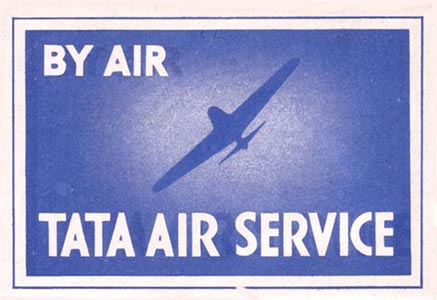
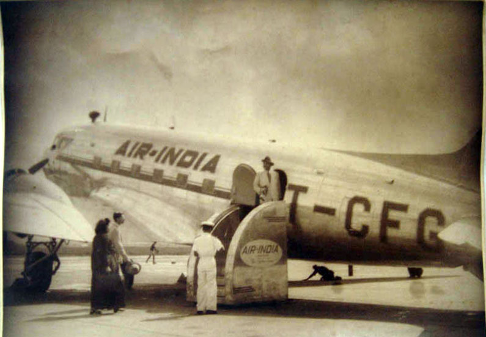
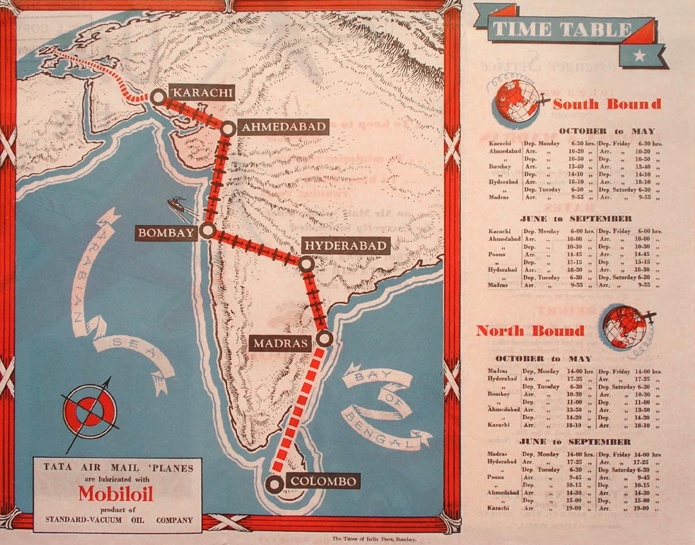
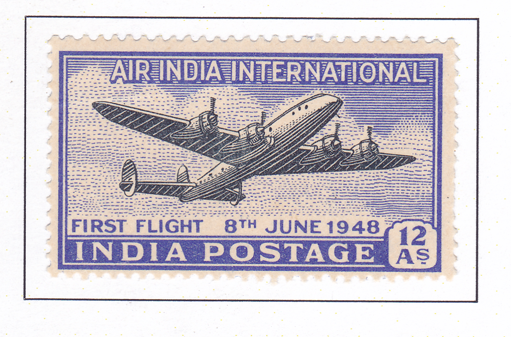
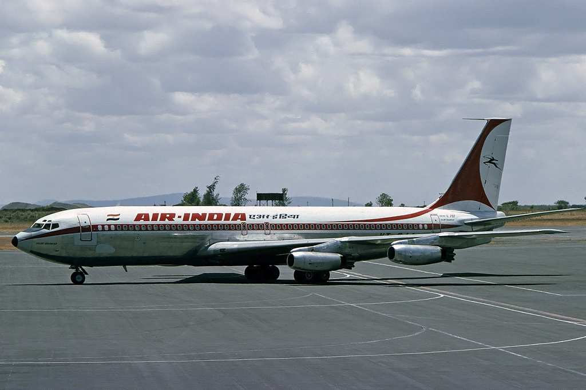

# এয়ার ইন্ডিয়া

*এয়ার ইন্ডিয়া*

| Col1 |
| --- |
|  |
| আইএটিএ আইসিএও কলসাইন এআই [ ১ ] এআইসি [ ১ ] এয়ার ইন্ডিয়া [ ২ ] [ ৩ ] |
| আইএটিএ |
| এআই [ ১ ] |
| প্রতিষ্ঠাকাল |
| কার্যক্রম শুরু |
| হাব |
| গৌণ হাব |
| ফোকাস শহর |
| নিয়মিত যাত্রী প্রোগ্রাম |
| জোট |
| অধীনস্ত কোম্পানি |
| বিমানবহরের আকার |
| গন্তব্য |
| প্রধান কোম্পানি |
| প্রধান কার্যালয় |
| গুরুত্বপূর্ণ ব্যক্তি |
| আয় |
| পরিচালন আয় |
| লাভ |
| =মোট সম্পদ |
| মোট ইক্যুইটি |
| কর্মচারী |
| ওয়েবসাইট |

এয়ার ইন্ডিয়া ভারতের পতাকাবাহী বিমান পরিবহন সংস্থা, এর সদর দফতর নতুন দিল্লিতে অবস্থিত। এটি সরকারি মালিকানাধীন উদ্যোগ এয়ার ইন্ডিয়া লিমিটেডের মালিকানাধীন এবং ১০২ টি অভ্যন্তরীণ ও আন্তর্জাতিক গন্তব্যস্থলে এয়ারবাস ও বোয়িং বিমানের দ্বারা উড়ান পরিষেবা পরিবেশন করে। সংস্থাটির ভারত জুড়ে বিভিন্ন মননিবেশ শহরের পাশাপাশি, নতুন দিল্লির ইন্দিরা গান্ধী আন্তর্জাতিক বিমানবন্দরে ঘাঁটি রয়েছে। এয়ার ইন্ডিয়া ১৮.৬% বাজার দখলের সাথে ভারত থেকে ভারতের বাইরে উড়ান পরিচালনাকারী সবচেয়ে বড় আন্তর্জাতিক উড়ান সংস্থা। [ ৯ ] এয়ার ইন্ডিয়া চারটি মহাদেশের ৬০ টিরও বেশি আন্তর্জাতিক গন্তব্যস্থলে উড়ান পরিষেবা পরিবেশন করে। বিমান সংস্থাটি ২০১৮ সালের ১১ জুলাই স্টার অ্যালায়েন্সের ২৭ তম সদস্য হয়।

জে আর ডি টাটা ১৯৩২ সালে টাটা এয়ারলাইন্স নামে বিমান পরিবহন সংস্থাটি প্রতিষ্ঠা করেন; টাটা নিজেই তাঁর প্রথম একক-ইঞ্জিন বিশিষ্ট ডি হ্যাভিল্যান্ড পুস মথকে উড়েছিলেন, যা করাচির ড্রিঘ রোড এরোড্রোম থেকে বোম্বের জুহু এরোড্রোমে এয়ারমেল বহন করে এবং পরে মাদ্রাজ (বর্তমানে চেন্নাই ) পর্যন্ত চলাচল শুরু করে। এটি দ্বিতীয় বিশ্বযুদ্ধের পর, একটি পাবলিক লিমিটেড কোম্পানি হয়ে ওঠে এবং এয়ার ইন্ডিয়া নামকরণ করা হয়। এটি ১৯৬০ সালের ২১ শে ফেব্রুয়ারি গৌরী শঙ্কর নামে প্রথম বোয়িং ৭০৭ বিমানকে পরিষেবায় যুক্ত করে এবং বিমান বহরে জেট বিমান যুক্তকারী প্রথম এশিয়ান বিমান পরিবহন সংস্থা হয়ে ওঠে। [ ১০ ] এয়ার ইন্ডিয়াকে ২০০০-০১ সালে বেসরকারিকরণের চেষ্টা করা হয় এবং ইন্ডিয়ান এয়ারলাইন্সের সাথে ২০০৬ সালে একীভূতকরণের ফলে সংস্থাটি ক্ষতিগ্রস্ত হয়।

এয়ার ইন্ডিয়া তার অধীনস্থ অ্যালায়েন্স এয়ার ও এয়ার ইন্ডিয়া এক্সপ্রেসের এর মাধ্যমে অভ্যন্তরীণ ও এশীয় গন্তব্যগুলিতে উড়ান পরিষেবা পরিচালনা করে। এয়ার ইন্ডিয়ার মাসকট মহারাজা (সম্রাট) এবং লোগোর ভেতরে কোণার্কের চক্রের সাথে একটি উড়ন্ত রাজহাঁস রয়েছে।

## দূর্ঘটনা

১২ জুন ২০২৫ তারিখে, আহমেদাবাদ বিমানবন্দর থেকে লন্ডন গ্যাটউইক বিমানবন্দরের উদ্দেশ্যে যাত্রা করা ১১ বছর বয়সী ৭৮৭ ড্রিমলাইনার বিমান দ্বারা পরিচালিত এয়ার ইন্ডিয়ার ১৭১ নম্বর ফ্লাইট ২৪২ জন যাত্রী নিয়ে আহমেদাবাদের মেঘানী নগর শহরতলিতে উড্ডয়নের কিছুক্ষণ পরেই একটি মেডিকেল কলেজের ছাত্রাবাসের উপর বিধ্বস্ত হয়। এতে অলৌকিক ভাবে একজন বেঁচে গেলেও বাকি সকল যাত্রী ও ক্রু মারা যায়।

## দূর্ঘটনা

### প্রারম্ভিক বছরগুলি (১৯৩২–১৯৪৫)

#### টাটা এয়ার সার্ভিসেস হিসাবে

*টাটা এয়ার সার্ভিস*

*এয়ার ইন্ডিয়ার একটি বিমানের ভিনটেজ ছবি*

*টাটা সন্সের বিমান পরিবহন সংস্থার ১৯৩৫ সালের গ্রীষ্মকালীন সময়সূচীর চিত্র।*

টাটা সন্সের একজন ভারতীয় বিমানচালক ও ব্যবসা পুঁজিপতি আর জে ডি টাটার প্রতিষ্ঠিত টাটা এয়ার সার্ভিসেস , পরে নতুন নামকরণ করা টাটা এয়ারলাইন্স [ ১১ ] থেকে এয়ার ইন্ডিয়ার উৎপত্তি হয়। [ ১২ ] টাটা ১৯৩২ সালের এপ্রিল মাসে ইমপিরিয়াল এয়ারওয়েজের জন্য মেল বহন করার চুক্তি লাভ করে এবং টাটা সন্সের বিমান পরিচালনা বিভাগ দুটি একক ইঞ্জিন বিশিষ্ট ডি হাভিল্যান্ড পুস মথ নিয়ে গঠিত হয়। টাটা ১৯৩৩ সালের ১৫ ই অক্টোবর করাচি থেকে বোম্বাইয়ে (বর্তমানে মুম্বাই) মেইল বহনকারী বিমান পুস মথকে উড়িয়ে নিয়ে আসেন এবং রয়্যাল এয়ার ফোর্সের প্রাক্তন বিমানচালক ও টাটার বন্ধু, নেভিল ভিনসেন্টের বিমানটি মাদ্রাজ (বর্তমানে চেন্নাই) পর্যন্ত চালিত করেন। [ ১৩ ] বিমানের বহরে একটি পুস মথ বিমান ও ডি হাভিল্যান্ড লেওপার্ড মথ ছিল। [ ১৪ ] [ ১৫ ] প্রাথমিক পরিষেবায় আহমেদাবাদ ও বোম্বাই হয়ে করাচি ও মাদ্রাজের মধ্যে সাপ্তাহিক এয়ারমেল পরিষেবা অন্তর্ভুক্ত ছিল। বিমান পরিবহন সংস্থাটি পরিচালনার প্রথম বছরে ১,৬০,০০০ মাইল (২,৬০,০০০ কিলোমিটার) উড্ডয়নের মাধ্যমে ১৫৫ জন যাত্রী ও ৯.৭৩ টন (১০.৭১ টন) মেল বহন করে এবং ₹৬০,০০০ টাকা (৮৪০ মার্কিন ডলার) লাভ করে। [ ১৬ ] [ ১৭ ]

## দূর্ঘটনা

### প্রারম্ভিক বছরগুলি (১৯৩২–১৯৪৫)

#### টাটা এয়ারলাইন্স হিসাবে

বিমান পরিবহন সংস্থাটি বোম্বাই থেকে ত্রিবান্দ্রমে ছয় আসনের মাইলস মের্লিন দ্বারা প্রথম অভ্যন্তরীণ উড়ান পরিষেবা শুরু করে। [ ১৮ ] এটি ১৯৩৮ সালে টাটা এয়ার সার্ভিসেস এবং পরে টাটা এয়ারলাইন্স হিসাবে নতুন নামকরণ করা হয়। সিংহলের (বর্তমানে শ্রীলঙ্কা) কলম্বো ও দিল্লি ১৯৩৮ সালে গন্তব্য হিসাবে যুক্ত হয়। [ ১৩ ] বিমান পরিবহন সংস্থাটি দ্বিতীয় বিশ্বযুদ্ধের সময় রয়্যাল এয়ার ফোর্সকে সৈন্যবাহিনীর চলাচল, রসদ সরবরাহ, শরণার্থীদের উদ্ধার ও বিমানের রক্ষণাবেক্ষণে সহায়তা করে। [ ১৩ ]

## দূর্ঘটনা

### স্বাধীনতা-পরবর্তী (১৯৪৭-২০০০)

*১৯৪৮ সালে ভারতের স্ট্যাম্প ‘এয়ার ইন্ডিয়া আন্তর্জাতিক’*

## দূর্ঘটনা

### স্বাধীনতা-পরবর্তী (১৯৪৭-২০০০)

#### এয়ার ইন্ডিয়া হিসাবে

*এয়ার ইন্ডিয়া বোয়িং ৭০৭-৪২০ গৌরী শঙ্কর পরিচালনার মাধ্যমে জেট বিমান পরিচালনাকারী প্রথম এশীয় বিমান পরিবহন সংস্থা হয়ে ওঠে।*

নিয়মিত বাণিজ্যিক পরিষেবা ভারতে দ্বিতীয় বিশ্বযুদ্ধের পরে পুনরুদ্ধার করা হয় এবং ১৯৪৬ সালের ২৯ জুলাই এয়ার ইন্ডিয়া নামের সাথে টাটা এয়ারলাইন্স একটি পাবলিক লিমিটেড কোম্পানিতে পরিণত হয়। ভারতের ১৯৭ সালে স্বাধীনতার পরে, ভারত সরকার ১৯৯৮ সালে বিমান পরিবহন সংস্থার ৪৯% অধিগ্রহণ করে। বিমান পরিবহন সংস্থাটির প্রথম আন্তর্জাতিক উড়ান হিসাবে ১৯৮৮ সালের ৮ ই জুন মালবার প্রিন্সেস (নিবন্ধিত ভিটি-সিকিউপি) নামে একটি লকহিড কনস্টেলশন এল-৭৪৯এ বিমান লন্ডন হিথ্রোর উদ্দেশ্যে বোম্বাইয়ের থেকে যাত্রা করে।

## দূর্ঘটনা

### স্বাধীনতা-পরবর্তী (১৯৪৭-২০০০)

#### রাষ্ট্রীয়করণ

ভারত সরকার ১৯৫৩ সালে এয়ার কর্পোরেশন আইন পাস করে এবং টাটা সন্সের কাছ থেকে বিমান পরিবহন সংস্থার বেশিরভাগ অংশ ক্রয় করে, যদিও সংস্থার প্রতিষ্ঠাতা জে আর ডি টাটা [ ১৯ ] [ ২০ ] ১৯৭৭ সাল পর্যন্ত সভাপতি (চেয়ারম্যান) হিসাবে নিযুক্ত থাকেন। সংস্থাটির নাম এয়ার ইন্ডিয়া ইন্টারন্যাশনাল লিমিটেড নামে নামকরণ করা হয় এবং অভ্যন্তরীণ পরিষেবাগুলি পুনর্গঠনের অংশ হিসাবে ইন্ডিয়ান এয়ারলাইন্সে স্থানান্তরিত করা হয়। [ ২১ ] বিমান সংস্থাটি ১৯৪৮ সাল থেকে ১৯৫০ সাল পর্যন্ত কেনিয়ার নাইরোবি এবং প্রধান ইউরোপীয় গন্তব্য রোম , প্যারিস ও ড্যাসেল্ডার্ফে পরিষেবা চালু করে। [ ২২ ] বিমান পরিবহন সংস্থাটি তার প্রথম লকহিড কনস্টেলশন এল-১০৪৯ বিমানকে পরিষেবায় যুক্ত করে এবং ব্যাংকক, হংকং, টোকিও ও সিঙ্গাপুরে উড়ান পরিষেবা উদ্বোধন করে। [ ২২ ]

## কর্পোরেট বিষয় এবং পরিচয়

### সদর দপ্তর

এয়ার ইন্ডিয়া লিমিটেডের সদর দপ্তর হল নতুন দিল্লির ইন্ডিয়ান এয়ারলাইন্স হাউস। [ ৫ ] [ ২৩ ] এয়ার ইন্ডিয়া ২০১৩ সালে মুম্বইয়ের এয়ার ইন্ডিয়া ভবন থেকে দিল্লিতে সদর দফতর স্থানান্তরিত করে। সাবেক কার্যালয়টি হল মেরিন ড্রাইভের একটি ২৩ তলা বিশিষ্ট ভবন এবং এটি ১৯৯৩ সালের বোম্বে বোমা হামলার লক্ষ্য ছিল। [ ৫ ] [ ২৪ ]

## কর্পোরেট বিষয় এবং পরিচয়

### বর্তমান

এয়ার ইন্ডিয়া রিজিওনাল অ্যালায়েন্স এয়ার হিসাবে প্রতিষ্ঠিত হয়, এটি ১৯৯৬ সালের ১ এপ্রিল ইন্ডিয়ান এয়ারলাইন্সের সম্পূর্ণ মালিকানাধীন সহায়ক সংস্থা হিসাবে কার্যক্রম শুরু করে। এয়ার ইন্ডিয়া ও ইন্ডিয়ান এয়ারলাইন্সের মধ্যে সংযুক্তির পরে এটির নামকরণ এয়ার ইন্ডিয়া রিজিওনাল করা হয়। [ ২৫ ] এয়ার ইন্ডিয়া এক্সপ্রেস ২০০৫ সালের ২৯ এপ্রিল কার্যক্রম শুরু করে এবং প্রাথমিকভাবে এয়ার ইন্ডিয়া চার্টারের মালিকানাধীন ছিল। এটি দক্ষিণ ভারত থেকে মধ্যপ্রাচ্য ও দক্ষিণ-পূর্ব এশিয়াতে উড়ান পরিষেবা পরিচালনা করে। [ ২৬ ] [ ২৭ ]

## কর্পোরেট বিষয় এবং পরিচয়

### বেসরকারিকরণ

১৯৯০ এর দশক থেকে সংস্থাটির লোকসান শুরু হয়। ২০০০ দশকের গোড়ার দিকে সরকার বেসরকারিকরণের পরিকল্পনা করলেও, তা বাতিল করা হয়। মার্চ ২০১৮ তে আবারো সরকার ৭৬ শতাংশ বেচতে চাইলে কেউ সারা দেয়নি।

২০২০ সালে আবার নিলাম ডাকা হয়। ২০২১ সালের ৮ অক্টোবর, TATA গোষ্ঠী ₹ ১৮,০০০ কোটির মাধ্যমে সংস্থাটি কিনে নেয়। [ ২৮ ]

## ভারতে এয়ার ইন্ডিয়ার প্রধান রুট

- দিল্লি -মুম্বাই রুট
- দিল্লি - ব্যাঙ্গালোর রুট
- কলকাতা -দিল্লি রুট

## আন্তর্জাতিক পরিসেবা

ভারতীয় বিমান সংস্থার মধ্যে এই বিমান সংস্থা সবচেয়ে বেশি আন্তর্জাতিক বিম পরিচালনা করে।বিমান সংস্থাটি দেশের বাইরে লন্ডন , দুবাই , বার্লিন , প্যারিস , নিউ ইয়ারক , সিকাখো গুয়াংজু , ঢাকা , বেজিং , সাংহাই , ব্যাংক্ক , কুয়ালামপুর , সিঙ্গাপুর , সিডনি , দোহা কায়রো , রোম , মস্কো প্রভৃতি শহরে বিমান পরিচালনা করে।

---
Source: https://bn.wikipedia.org/wiki/%E0%A6%8F%E0%A6%AF%E0%A6%BC%E0%A6%BE%E0%A6%B0_%E0%A6%87%E0%A6%A8%E0%A7%8D%E0%A6%A1%E0%A6%BF%E0%A6%AF%E0%A6%BC%E0%A6%BE
