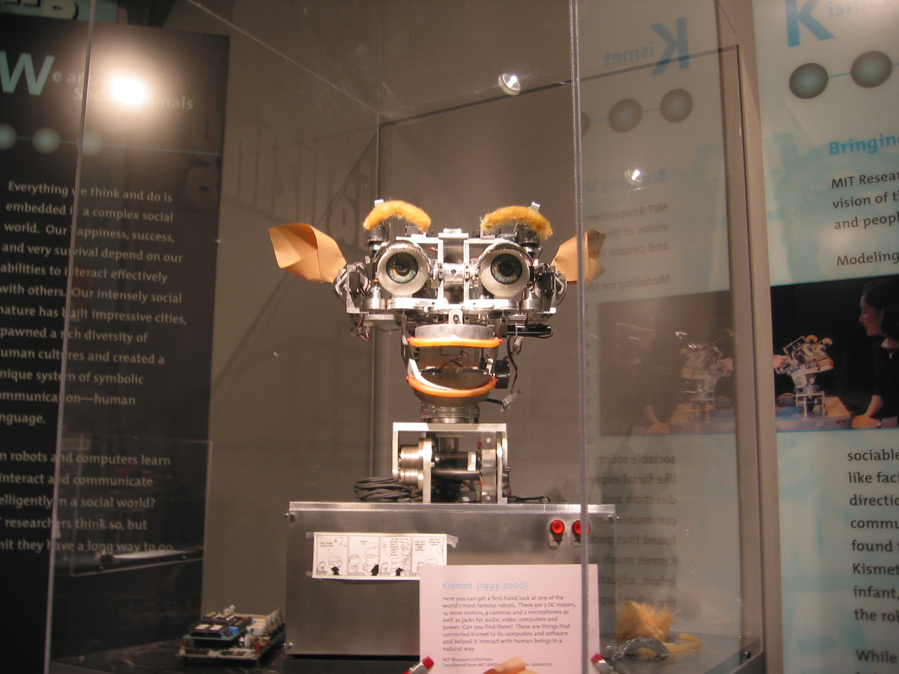

# कृत्रिम बुद्धि

*कृत्रिम बुद्धि से बना रोबोट*

कृत्रिम बुद्धि (आर्टिफ़िशियल इंटेलिजेंस या एआई) मानव और अन्य जन्तुओं द्वारा प्रदर्शित प्राकृतिक बुद्धि के विपरीत मशीनों द्वारा प्रदर्शित बुद्धि है। कंप्यूटर विज्ञान में कृत्रिम बुद्धि के शोध को "इंटेलिजेंट एजेंट" का अध्ययन माना जाता है। इंटेलिजेंट एजेंट एक ऐसा सयंत्र है जो अपने पर्यावरण को देखकर, अपने लक्ष्य को प्राप्त करने की कोशिश करता है। इसके लिए आम बोलचाल की भाषा में, "कृत्रिम बुद्धि" शब्द का प्रयोग होता है। कृत्रिम बुद्धिमत्ता का प्रयोग करते हुए एक मशीन इंसानों के "संज्ञानात्मक" कार्यों की नकल करती है। Andreas Kaplan और Michael Haenlein कृत्रिम बुद्धिमत्ता को “किसी प्रणाली के द्वारा बाहरी डेटा को सही ढंग से व्याख्या करने, ऐसे डेटा से स्वयं सीखने और सुविधाजनक रूपांतरण के माध्यम से विशिष्ट लक्ष्यों और कार्यों को पूरा करने में उन सीखी हुई चीजों का उपयोग करने की क्षमता” के रूप में परिभाषित करते हैं। [ 1 ] [ 2 ] यह कार्य "सीखने" और "समस्या निवारण" को एक साथ जोड़ती है। [ 3 ] कृत्रिम बुद्धि (प्रज्ञाकल्प, कृत्रिमप्रज्ञा, कृतकधी) संगणक में अर्पित बुद्धि है। मानव सोचने, विश्लेषण करने व याद रखने का काम भी अपने दिमाग के स्थान पर कम्प्यूटर से कराना चाहता है। [ 4 ]

कृत्रिम बुद्धि , कंप्यूटर विज्ञान की एक शाखा है जो मशीनों और सॉफ्टवेयर को बुद्धि के साथ विकसित करता है। 1955 में जॉन मैकार्थी ने इसको कृत्रिम बुद्धि का नाम दिया और इसे "विज्ञान और इंजीनियरिंग के द्वारा बुद्धिमान मशीनों को बनाने" के रूप परिभाषित किया। कृत्रिम बुद्धि अनुसंधान के लक्ष्यों में तर्क, ज्ञान की योजना बनाना, सीखना, धारण करना और वस्तुओं में हेरफेर करने की क्षमता, आदि शामिल हैं। वर्तमान में, इस लक्ष्य तक पहुंचने के लिए सांख्यिकीय विधियों, कम्प्यूटेशनल बुद्धि और पारंपरिक खुफिया तकनीकी शामिल हैं। कृत्रिम बुद्धि को लेकर दावा किया जाता है कि यह मानव की बुद्धि का एक केंद्रीय संपत्ति के रूप में मशीन द्वारा अनुकरण कर सकता है। वहाँ दार्शनिक मुद्दों के प्राणी बनाने की नैतिकता के बारे में प्रश्न् उठाए गए थे। लेकिन आज, यह प्रौद्योगिकी उद्योग का सबसे महत्वपूर्ण और अनिवार्य हिस्सा बन गया है।

कृत्रिम बुद्धि (एआई) का दायरा विवादित है: क्योंकि मशीनें तेजी से सक्षम हो रहीं हैं, जिन कार्यों के लिए पहले मानव की बुद्धिमत्ता चाहिए थी, अब वह कार्य "कृत्रिम बुद्धिमत्ता" के दायरे में आते हैं। उद्धाहरण के लिए, लिखे हुए शब्दों को पहचानने में अब मशीन इतनी सक्षम हो चुकी हैं कि इसे अब होशियारी नहीं माना जाता है। [ 5 ] आज कल, एआई के दायरे में आने वाले कार्य हैं, इंसानी वाणी को समझना [ 6 ] , शतरंज या "गो" [ 7 ] के खेल में माहिर इंसानों से भी जीतना, बिना इंसानी सहारे के गाड़ी खुद चलाना।

कृत्रिम बुद्धि का वैज्ञानिकों ने सन १९५६ में अध्ययन करना चालू किया। इसके इतिहास में कई आशावादी लहरें आती रही, फिर असफलता से निराशा, और फिर नए तरीके जो फिर आशा जगाते थे। [ 8 ] [ 9 ] [ 10 ] अपने अधिकांश इतिहास के लिए, एआई अनुसंधान को उप-क्षेत्रों में विभाजित किया गया है जो अक्सर एक-दूसरे के साथ संवाद करने में विफल रहते हैं। [ 11 ] ये उप-क्षेत्र तकनीकी विचारों पर आधारित हैं, जैसे कि विशेष लक्ष्यों (जैसे "रोबोटिक्स" या " मशीन लर्निंग "), [ 12 ] विशेष उपकरण ("तर्क" या "तंत्रिका नेटवर्क"), या गहरे तात्विक अंतर। [ 13 ] [ 14 ] [ 15 ] उप-क्षेत्र सामाजिक कारकों पर भी आधारित हैं (जैसे निजी संस्थानों या निजी शोधकर्ताओं के काम)। [ 11 ]

एआई अनुसंधान की पारंपरिक समस्याओं (या लक्ष्यों) में तर्क , ज्ञान प्रतिनिधित्व , योजना , सीखना , भाषा समझना , धारणा और वस्तुओं को कुशलतापूर्वक उपयोग करने की क्षमता शामिल है। मानव जैसे होशियारी क्षेत्र के दीर्घकालिक लक्ष्यों में से एक है। इस समस्या का हल करने के लिए वैज्ञानिकों ने सांख्यिकीय (स्टैटिस्टिकल) तरीके, और पारम्परिक "सांकेतिक" तरीके अपनाए हैं। एआई विज्ञान के लिए कंप्यूटर विज्ञान , गणित , मनोविज्ञान , भाषाविज्ञान , तत्वविज्ञान और कई अन्य के क्षेत्र गए हैं।

इस वैज्ञानिक क्षेत्र को इस धारणा पर स्थापना की गई थी कि मानवीय बुध्दि को "इतने सटीक रूप से वर्णित किया जा सकता है कि इसे नकल करने के लिए एक मशीन बनाई जा सकती है"। [ 16 ] यह मन की प्रकृति और मानव-जैसी बुद्धि के साथ कृत्रिम प्राणियों के निर्माण के नैतिकता के बारे में प्रश्न उठाता है, जो प्राचीन काल से कथाओं के द्वारा खोजे गए हैं। [ 17 ] कुछ लोग कृत्रिम बुद्धि (एआई) को मानवता के लिए खतरा मानते हैं, अगर यह अनावश्यक रूप से प्रगति करता है। [ 18 ] अन्य मानते हैं कि एआई, पिछले तकनीकी क्रांति के विपरीत, बड़े पैमाने पर बेरोजगारी का खतरा पैदा करेगा। [ 19 ]

## इतिहास

यांत्रिक या "औपचारिक" तर्क का अध्ययन गणितज्ञों के साथ प्राचीन काल में शुरू हुआ। गणितीयतर्क के अध्ययन ने "एलन ट्यूरिंग" (जो एक कंप्यूटर वैज्ञानिक थे) के "कंप्यूटर सिद्धांत" का जन्म दिया। इस सिद्धांत का मानना है की मशीन, "०" और "१" जैसे सरल चिह्न, को जोड़-तोड़ के कोई भी बोधगम्य गणना कर सकते हैं। वह यह भी कहता है की आज के साधारण कंप्यूटर ऐसे मशीन हैं। यह दृष्टि, कि कंप्यूटर औपचारिक तर्क की किसी भी प्रक्रिया को अनुकरण कर सकते हैं, जिसे चर्च-ट्यूरिंग थीसिस के नाम से जाना जाता है। न्यूरोबायोलॉजी (दिमाग का जीवविज्ञान), सूचना का विज्ञानं और साइबरनेटिक में खोजों ने शोधकर्ताओं को इलेक्ट्रॉनिक मस्तिष्क बनाने की संभावना पर विचार करने के लिए प्रेरित किया। ट्यूरिंग (एक कंप्यूटर वैज्ञानिक) ने प्रस्तावित किया कि "यदि कोई मनुष्य मशीन और मानव से प्रतिक्रियाओं के बीच अंतर नहीं कर सकता है, तो मशीन को "मानव की तरह बुद्धिमान" माना जा सकता है। पहला काम जिसे आम तौर पर एआई के रूप में पहचाना जाता है वह "मैकुलचच" और "पिट्स" के 1943 औपचारिक डिजाइन "ट्यूरिंग-पूर्ण" "कृत्रिम न्यूरॉन्स" के लिए था। एक "ट्यूरिंग-पूर्ण" मशीन कोई भी बोधगम्य गणना कर सकते हैं।

1950 के दशक तक, मशीनी बुद्धिमत्ता को कैसे प्राप्त किया जाए, इसके लिए दो दृष्टिकोण सामने आए। एक दृष्टि, जिसे प्रतीकात्मक AI या GOFAI [ उद्धरण चाहिए ] के रूप में जाना जाता है , कंप्यूटर का उपयोग दुनिया और सिस्टम का एक प्रतीकात्मक प्रतिनिधित्व बनाने के लिए करना था जो दुनिया के बारे में तर्क कर सके। समर्थकों में एलन नेवेल , हर्बर्ट ए साइमन और मार्विन मिन्स्की शामिल थे । इस दृष्टिकोण के साथ निकटता से जुड़ा "अनुमानी खोज" दृष्टिकोण था, जिसने बुद्धिमत्ता की तुलना उत्तर के लिए संभावनाओं के स्थान की खोज की समस्या से की। दूसरी दृष्टि, जिसे कनेक्शनवादी दृष्टिकोण के रूप में जाना जाता है , ने सीखने के माध्यम से बुद्धि प्राप्त करने की मांग की। इस दृष्टिकोण के समर्थक, सबसे प्रमुख रूप से फ्रैंक रोसेनब्लैट, न्यूरॉन्स के कनेक्शन से प्रेरित तरीकों से परसेप्ट्रॉन को जोड़ने की मांग की । जेम्स मन्यिका और अन्य ने दिमाग (प्रतीकात्मक एआई) और मस्तिष्क (कनेक्शनिस्ट) के दो दृष्टिकोणों की तुलना की है। मन्यिका का तर्क है कि डेसकार्टे , बूले , गॉटलोब फ्रेगे , बर्ट्रेंड रसेल और अन्य की बौद्धिक परंपराओं के संबंध में इस अवधि में प्रतीकात्मक दृष्टिकोण कृत्रिम बुद्धि के लिए महत्वपूर्ण रही। साइबरनेटिक्स या कृत्रिम तंत्रिका नेटवर्क [ 20 ] पर आधारित सम्बन्धवादी दृष्टिकोण को पृष्ठभूमि में धकेल दिया गया था, लेकिन हाल के दशकों में नई प्रमुखता प्राप्त हुई है।

भले की मशीनों के बुद्धि विकसित के शोध का शुरूआत 1943 हुआ हो लेकिन कृत्रिम बुद्धिमत्ता शब्द का पहली बार इस्तेमाल जॉन मैकार्थी ने ही 1956 में en:Dartmouth workshop किया था और कहा था कि विज्ञान और अभियांत्रिकी का इस्तेमाल करके एक ऐसा कंप्यूटर बनाया जा सकता है जो कि स्वयं से ही सोच समझकर निर्णय ले सकें इसलिए हम john McCarthy को ही Artificial Intelligence के पिता के रूप में जानते है

## कटौती, तर्क और समस्या को सुलझाने

पहले, कृत्रिम बुद्धि शोधकर्ताओं ने ऐसा एल्गोरिदम विकसित किया जो मनुष्य को हल करते समय उपयोग या तार्किक निर्णय लेने के लिए उपयोग करते थे। वे अनिश्चित या अधूरी जानकारी के साथ 
संभावना का संकल्पना निपटते है।

## ज्ञान प्रतिनिधित्व

समस्याओं का हल करते समय, मशीनों को दुनिया के बारे में व्यापक ज्ञान की आवश्यकता होगी। कृत्रिम बुद्धि को प्रतिनिधित्व करने के लिए जरूरत कि चीजों है: वस्तुओं, गुण, श्रेणियों, समाधान, घटनाओं, समय, कारण और प्रभाव के बीच संबंधों और आदि।

## प्राकृतिक भाषा प्रसंस्करण

प्राकृतिक भाषा प्रसंस्करण सबसे तेज़ गति से विकास करने वाले AI क्षेत्रों में से एक है। प्राकृतिक भाषा प्रसंस्करण में भाषा-संबंधी AI एप्लिकेशन के विकास पर ध्यान केंद्रित किया जाता हैं, जैसे वॉयस असिस्टेंट, चैटबॉट और भाषा अनुवाद (Language Translation)। वॉयस-टू-टेक्स्ट समझ को सक्षम करके, मानव-कंप्यूटर इंटरैक्शन को बढ़ाया जा सकता हैं।

## उपकरण

### तर्क

तर्क, मुख्य रूप से ज्ञान प्रतिनिधित्व और समस्या को हल करने के लिए उपयोग किया जाता है। लेकिन यह अन्य समस्याओं के लिए भी किया जा सकता है। तर्क के कई अलग अलग रूपों एस कृत्रिम बुद्धि अनुसंधान में किया जाता है। तर्क के सहायता से हमको निर्णय कर सकते हैं कि क्या सही है या क्या गलत है।

## उपकरण

### अनिश्चित तर्क के लिए संभाव्य तरीकों

समस्याओं के अधिकांश यहाँ अनिश्चित और अधूरी जानकारी है। कृत्रिम बुद्धि शोधकर्ताओं संभाव्यता सिद्धांत और अर्थशास्त्र से विधियों का उपयोग कर इन समस्याओं को हल करने के लिए शक्तिशाली उपकरण की एक संख्या तैयार कर लिया है। संभाव्यता एल्गोरिदम को छानने और डेटा की भविष्यवाणी के लिए इस्तेमाल किया जा सकता।

## AI टेक्नोलॉजी के अनुप्रयोग

[ 21 ] आज के तकनीकी दौर में जहां मशीनें कई व्यवसायों में अपनी सेवाएं दे रहीं हैं वहीं AI टेक्नोलॉजी भी अब कुछ सीमित इंडस्ट्रीज से निकलकर कई अन्य महत्वपूर्ण इंडस्ट्रीज में प्रयोग की जाने लगी है। कुछ वर्षों पहले तक AI टेक्नोलॉजी को कंप्यूटर तथा इससे जुड़ी सेवाओं तक ही सीमित माना जाता था, परंतु वर्तमान समय में AI टेक्नोलॉजी का विस्तार अन्य कई इंडस्ट्रीज में भी देखने को मिल रहा है। आज के समय में आर्टिफिशियल इंटेलिजेंस का प्रयोग शिक्षा, ग्राहक सेवा, मनोरंजन, ऑटोमोबाइल और इसके साथ ही साथ परिवहन व संचार के क्षेत्रों में भी देखने को मिल रहा है। आने वाले समय में इस तकनीकी का प्रयोग बड़े पैमाने पर दूसरी इंडस्ट्रीज में भी होने की अटूट संभावना है। इस कारण से AI टेक्नोलॉजी से संबंधित कंपनियों को बड़े पैमाने पर फ़ायदे की उम्मीद भी है। इसका एक उदाहरण Neuralink द्वारा इंसानी दिमाग में एक चिपसेट को इंप्लांट किया जाना है।

हाल ही में एलन मस्क की कंपनी neuralink ने पहली बार इंसानी दिमाग में एआई चिपसेट को इंप्लांट किया है। [ 22 ] कंपनी ने इस चिपसेट का नाम टेलीपैथी रखा है, जो दिव्यांगों के लिए काफी उपयोगी होने वाली है, क्योंकि इस टेलीपैथी चिपसेट की मदद से विकलांग लोग अपने दिमाग से ही बिना कंप्यूटर और स्मार्टफोन को छुए कंट्रोल कर पाएंगे। साथ ही एलन मस्क का कहना है कि उनकी कंपनी 2030 तक 22000 से अधिक विकलांग लोगों के दिमाग में यह चिपसेट लगाकर उनकी मदद की करेगी।

## रचनात्मकता

कृत्रिम बुद्धि की एक उप-क्षेत्र के सैद्धांतिक रूप से (एक दार्शनिक और मनोवैज्ञानिक नजरिए से) रचनात्मकता दोनों पता लगाता है और व्यावहारिक रूप से (द्वारा उत्पन्न उत्पादन रचनात्मक माना जा सकता है कि सिस्टम, या सिस्टम है कि पहचानने और रचनात्मकता का आकलन के implementations विशिष्ट)। कम्प्यूटेशनल रिसर्च के संबंधित क्षेत्रों कृत्रिम अंतर्ज्ञान और कृत्रिम सोच रहे हैं।

## सामान्य बुद्धि

शोधकर्ताओं व उनके काम: एक मशीन में सामान्य बुद्धि के साथ (मजबूत एअर इंडिया के रूप में जाना जाता है), शामिल किया जाएगा कि लगता है सब से ऊपर कौशल और मानवीय क्षमताओं में सबसे अधिक से अधिक के या उन सभी के संयोजन। कुछ विश्वास है कि कृत्रिम चेतना या एक कृत्रिम मस्तिष्क की तरह मानवाकृतीय सुविधाएँ ऐसी एक परियोजना के लिए आवश्यकता हो सकती।
उपरोक्त समस्याओं के कई विचार किया जा करने के लिए सामान्य बुद्धि की आवश्यकता हो सकता हल हो। उदाहरण के लिए, यहां तक कि मशीनी अनुवाद की तरह एक सीधा, विशिष्ट कार्य मशीन पढ़ा और (एनएलपी) दोनों भाषाओं में लिखने, लेखक का तर्क (कारण) का पालन करें, पता है क्या (ज्ञान) के बारे में बात की जा रही है कि और सच्चाई से लेखक का इरादा (सामाजिक बुद्धि) को पुन: उत्पन्न की आवश्यकता है। मशीनी अनुवाद की तरह एक समस्या "ऐ-पूर्ण" माना जाता है। इस विशेष समस्या को हल करने के लिए, आप सभी समस्याओं को हल करना चाहिए।

## इन्हें भी देखें

- क्वांटम कंप्यूटिंग

## बाहरी कड़ियाँ

- Artificial intelligence courses Archived 2024-01-18 at the वेबैक मशीन
- "Artificial Intelligence". Internet Encyclopedia of Philosophy ।
- "Logic and Artificial Intelligence". Stanford Encyclopedia of Philosophy ।
- Artificial Intelligence . BBC Radio 4 discussion with John Agar, Alison Adam & Igor Aleksander ( In Our Time , 8 December 2005).
- AI Stocks In India-2024 में बेहतरीन AI शेयर्स

---
Source: https://hi.wikipedia.org/wiki/%E0%A4%95%E0%A5%83%E0%A4%A4%E0%A5%8D%E0%A4%B0%E0%A4%BF%E0%A4%AE_%E0%A4%AC%E0%A5%81%E0%A4%A6%E0%A5%8D%E0%A4%A7%E0%A4%BF
