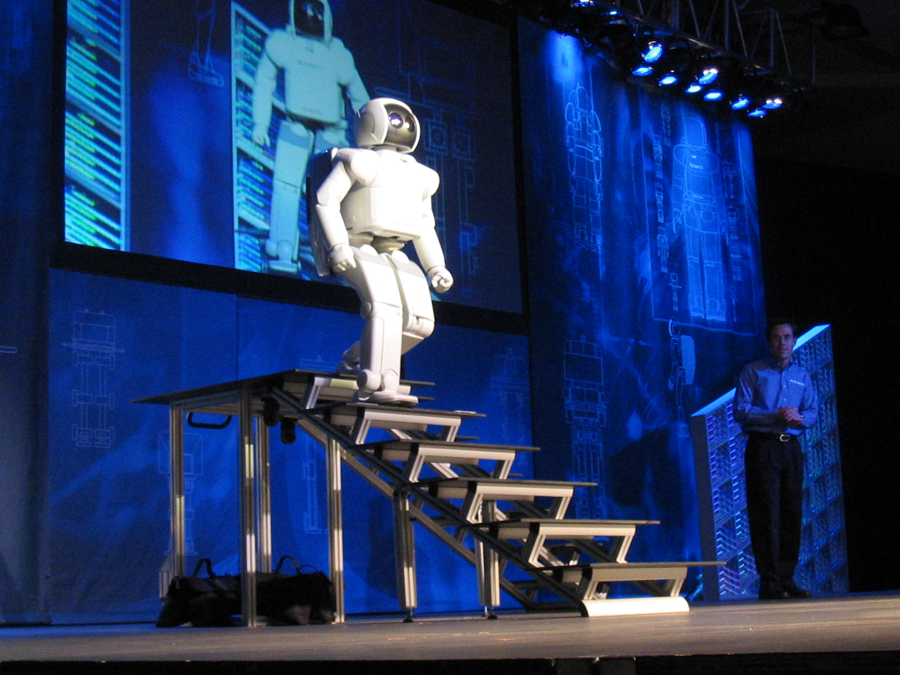
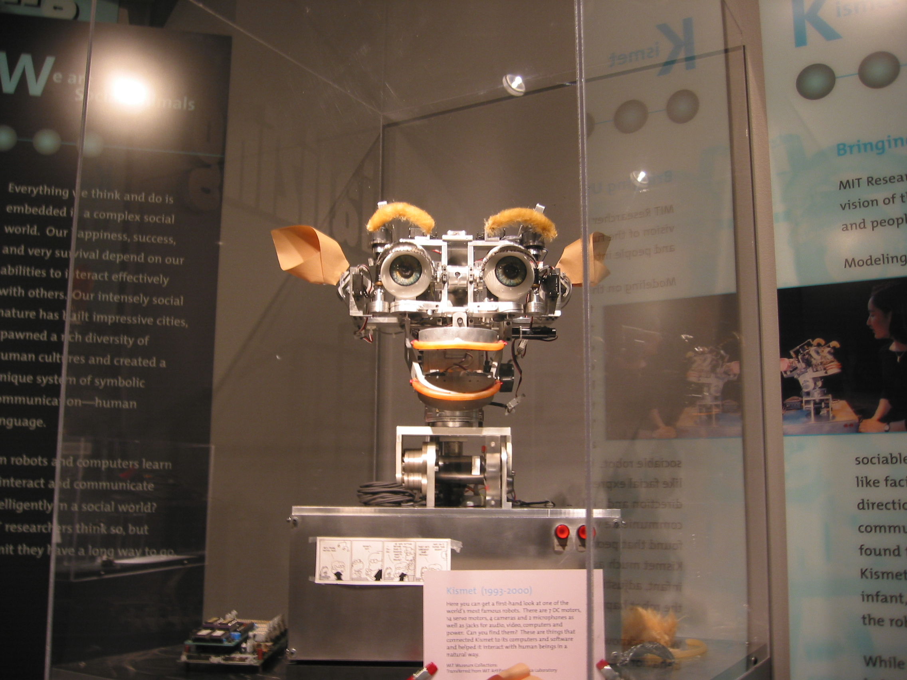
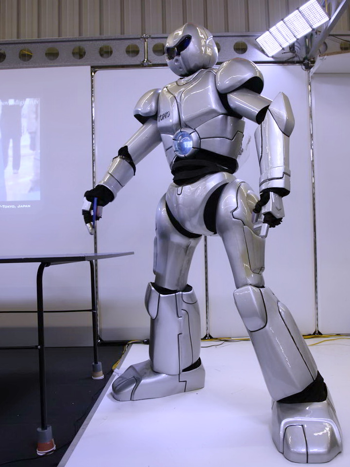
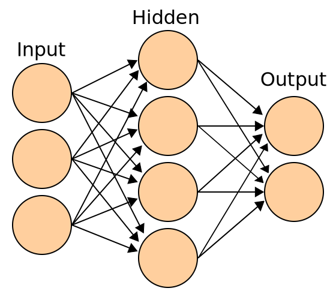

# ಕೃತಕ ಬುದ್ಧಿಮತ್ತೆ

ಕೃತಕ ಬುದ್ಧಿಮತ್ತೆ ಅಥವಾ ಯಾಂತ್ರಿಕ ಬುದ್ಧಿಮತ್ತೆ artificial intelligence ಗಣಕ ವಿಜ್ಞಾನದ ಒಂದು ವಿಭಾಗ. ಪ್ರಮುಖ AI ಪಠ್ಯಪುಸ್ತಕಗಳು ಈ ಕ್ಷೇತ್ರವನ್ನು "ಬುದ್ಧಿಮತ್ತೆಯುಳ್ಳ ಯಂತ್ರಗಳ ವಿನ್ಯಾಸ ಮತ್ತು ಅಧ್ಯಯನ" ಎಂದು ಹೇಳುತ್ತವೆ. ಇದರಲ್ಲಿ ಒಂದು ಯಂತ್ರವು ತನ್ನ ಪರಿಸರವನ್ನು ಗ್ರಹಿಸಿ ತನಗೆ ಕೊಟ್ಟಿರುವ ಗುರಿಯತ್ತ ಹೆಚ್ಚು ಯಶಸ್ಸು ಪಡೆಯಲು ಅಗತ್ಯವಿರುವ ಕ್ರಮಗಳನ್ನು ತಾವೇ ಕೈಗೊಳ್ಳುತ್ತದೆ.

ಮನುಷ್ಯನ ಬುದ್ಧಿಮತ್ತೆಯ ಎಲ್ಲಾ ಸಾಮರ್ಥ್ಯಗಳನ್ನು ಮರು ರಚಿಸಲು ಸಾಧ್ಯವೆಂಬುದು ಕೃತಕ ಬುದ್ಧಿಮತ್ತೆಯ ವಾದ. ಯಂತ್ರಗಳ ಬುದ್ಧಿಮತ್ತೆಯ ಪ್ರಮಾಣಕ್ಕೆ ಎಲ್ಲೆಯುಂಟೆ? ಮಾನವನ ಬುದ್ಧಿಮತ್ತೆ ಮತ್ತು ಕೃತಕ ಬುದ್ಧಿಮತ್ತೆಯ ನಡುವೆ ಮೂಲಭೂತ ವ್ಯತ್ಯಾಸವಿದೆಯೆ? ಯಂತ್ರವೊಂದಕ್ಕೆ ಮನಸ್ಸು ಮತ್ತು ಪ್ರಜ್ಞೆಗಳಿರಲು ಸಾಧ್ಯವುಂಟೆ? ಇದು ಒಂದು ಸವಾಲು ಮಾತ್ರವಲ್ಲ ಇದು ಕೃತಕ ಬುದ್ಧಿಮತ್ತೆ ಸಿದ್ಧಾಂತಕ್ಕೆ ಒಂದು ಸ್ಫೂರ್ತಿ. [ ೧ ] [ ೨ ]

ಮಾನವರ ಕೇಂದ್ರ ಗುಣ, ಬುದ್ಧಿಮತ್ತೆ - ಹೊಮೊ ಸೆಪಿಯೆನ್ ಗಳ ತಿಳಿವಳಿಕೆ -ನೆಲೆಗಟ್ಟಿನ ಮೇಲೆ ಈ ಕ್ಷೇತ್ರವನ್ನು ಸ್ಥಾಪಿಸಲಾಗಿದೆ. - ಅರ್ಥಾತ್ ಬುದ್ಧಿಮತ್ತೆಯನ್ನು- ಅದೆಷ್ಟು ಕರಾರುವಾಕ್ಕಾಗಿ ವಿವರಿಸಲಾಗಿದೆಯೆಂದರೆ ಅದನ್ನು ಯಂತ್ರವೂ ಅನುಕರಿಸಬಹುದು. [ ೩ ] ಪುರಾತನ ಕಾಲದಿಂದಲೂ ಪುರಾಣ , ಕಟ್ಟುಕಥೆ ಮತ್ತು ತತ್ವ ಶಾಸ್ತ್ರಗಳಲ್ಲಿ ಹೇಳಲಾದ ಮನಸ್ಸಿನ ಸ್ವಭಾವ ಮತ್ತು ವೈಜ್ಞಾನಿಕ ಗರ್ವಿಗಳ ಮಿತಿಗಳ ಕುರಿತಾದ ತಾತ್ವಿಕ ವಿವಾದಾಂಶಗಳನ್ನು ಇದು ಹುಟ್ಟುಹಾಕುತ್ತದೆ. [ ೪ ] ಬೆರಗಾಗಿಸುವಂತಹ ಆಶಾವಾದದ ವಿಷಯವಾಗಿರುವ ಕೃತಕ ಬುದ್ಧಿಮತ್ತೆಯು [ ೫ ] ದಿಗಿಲುಗೊಳಿಸುವಂತಹ ಹಿನ್ನಡೆಗಳನ್ನೂ ಅನುಭವಿಸಿದೆ, [ ೫ ] ಮತ್ತು ಇಂದಿನ ತಂತ್ರಜ್ಞಾನ ಕ್ಷೇತ್ರದ ಅತ್ಯಾವಶ್ಯಕ ಭಾಗವಾಗಿದ್ದು, ಗಣಕ ವಿಜ್ಞಾನದ ಅತಿ ಕ್ಲಿಷ್ಟವಾಗಿರುವ ಹೆಚ್ಚಿನ ಸಮಸ್ಯೆಗಳಿಗೆ ಸಮಗ್ರ ಪರಿಹಾರ ಸೂಚಿಸಬಲ್ಲುದುದಾಗಿದೆ.

[ ೬ ]

AI ಸಂಶೋಧನೆಯು ಎಷ್ಟರ ಮಟ್ಟಿಗೆ ಉನ್ನತ ತಾಂತ್ರಿಕತೆ ಮತ್ತು ವೈಶಿಷ್ಟತೆಯುಳ್ಳದ್ದಾಗಿದೆ ಎಂದರೆ, ಕೆಲವು ವಿಮರ್ಶಕರು ಈ ಕ್ಷೇತ್ರದ "ವಿಘಟನೆ"ಯನ್ನು ವಿರೋಧಿಸುತ್ತಾರೆ. [ ೭ ] ನಿರ್ದಿಷ್ಟ ಸಮಸ್ಯೆಗಳು, ಆಯಾ ಸಲಕರಣೆಗಳ ಅನ್ವಯಿಕೆ ಮತ್ತು ದೀರ್ಘಕಾಲದಿಂದ ಉಳಿದುಕೊಂಡಿರುವ ತಾತ್ವಿಕ ಭಿನ್ನಾಭಿಪ್ರಾಯಗಳ ಸುತ್ತ AIನ ಉಪ ಕ್ಷೇತ್ರಗಳು ಸಂಘಟಿತವಾಗಿವೆ. AIನ ಕೇಂದ್ರೀಯ ಸಮಸ್ಯೆಗಳು ತರ್ಕ, ಜ್ಞಾನ, ಯೋಜನೆ, ಕಲಿಕೆ, ಸಂವಹನ, ಗ್ರಹಿಕೆ ಮತ್ತು ವಸ್ತುಗಳನ್ನು ಚಲಾಯಿಸುವುದು ಹಾಗೂ ಕುಶಲತೆಯಿಂದ ಬಳಸುವ ವಿಶಿಷ್ಟ ಲಕ್ಷಣಗಳನ್ನು ಒಳಗೊಂಡಿದೆ. [ ೮ ] ಸಾಮಾನ್ಯ ಬುದ್ಧಿಮತ್ತೆ (ಅಥವಾ " ಶಕ್ತಿಶಾಲಿ AI ") ಈಗಲೂ (ಕೆಲವು) ಸಂಶೋಧನೆಗಳ [ ೯ ] ದೀರ್ಘ ಕಾಲದ ಗುರಿಯಾಗಿದೆ, ಆದರೆ ಹಲವು ಸಂಶೋಧಕರು ಇದು ಸಾಧ್ಯವಾಗಬಹುದೆಂಬುದನ್ನು ನಂಬುತ್ತಿಲ್ಲ. [ ಸೂಕ್ತ ಉಲ್ಲೇಖನ ಬೇಕು ] [ ೧೦ ] .

## AI ಸಂಶೋಧನೆಯ ಇತಿಹಾಸ

20ನೆಯ ಶತಮಾನದ ಮಧ್ಯದಲ್ಲಿ ಕೆಲವು ವಿಜ್ಞಾನಿಗಳು, ನರಶಾಸ್ತ್ರ ದಲ್ಲಿನ ಹೊಸ ಪರಿಶೋಧನೆಗಳು, ಮಾಹಿತಿ ಕುರಿತ ಹೊಸ ಗಣಿತ ಸಿದ್ಧಾಂತ, ಸೈಬರ್ನೆಟಿಕ್ಸ್‌ ಎನ್ನಲಾದ ನಿಯಂತ್ರಣ ಮತ್ತು ಸ್ಥಿರತೆಯ ತಿಳಿವಳಿಕೆ ಮತ್ತು ಇವೆಲ್ಲಕ್ಕಿಂತ ಮುಖ್ಯವಾಗಿ, ಮಾನವ ಗಣಿತ ತರ್ಕ ಪ್ರಕ್ರಿಯೆ ಅನುಕರಣೆ ಮಾಡಲು ವಿನ್ಯಾಸ ಮಾಡಲಾದ ಡಿಜಿಟಲ್ ಗಣಕ ದ ಆವಿಷ್ಕರಣ - ಇವುಗಳ ಆಧಾರದ ಮೇಲೆ ಬುದ್ಧಿಮತ್ತೆಯುಳ್ಳ ಯಂತ್ರಗಳನ್ನು ತಯಾರಿಸುವ ನಿಟ್ಟಿನಲ್ಲಿ ಪರಿಶೋಧನೆಗಳನ್ನು ಆರಂಭಿಸಿದರು [ ೧೧ ]

1956ರ ಬೇಸಿಗೆಯಲ್ಲಿ ಡಾರ್ಟ್‌ಮೌತ್ ಕಾಲೇಜ್‌ ನ ಆವರಣದಲ್ಲಿ ನಡೆದ ಸಮ್ಮೇಳನದಲ್ಲಿ ಆಧುನಿಕ AI ಸಂಶೋಧನೆಯ ಕ್ಷೇತ್ರದ ಅಧ್ಯಯನ ಪೀಠ ಸ್ಥಾಪಿಸಲಾಯಿತು. [ ೧೨ ] ಹಾಜರಿದ್ದವರ ಪೈಕಿ, ಮುಖ್ಯವಾಗಿ ಜಾನ್ ಮೆಕಾರ್ಥಿ , ಮಾರ್ವಿನ ಮಿನ್ಸ್ಕಿ, ಅಲೆನ ನೆವೆಲ್ ಅನೇಕ ದಶಕಗಳ ಕಾಲ AI ಸಂಶೋಧನೆಗಳಲ್ಲಿ ಪ್ರಮುಖ ಪಾತ್ರವಹಿಸಿದರು ಮತ್ತು ಹರ್ಬರ್ಟ್ ಸೈಮನ್‌ ಇನ್ನೂ ಒಂದು ಹೆಜ್ಜೆ ಮುಂದೆ ಹೋಗಿ MIT , CMU ಮತ್ತು ಸ್ಟ್ಯಾನ್‌ಫರ್ಡ್‌ ನಲ್ಲಿ AI ಪ್ರಯೋಗಾಲಯಗಳನ್ನು ಸ್ಥಾಪಿಸಿದರು. ಅವರು ಮತ್ತು ಅವರ ವಿದ್ಯಾರ್ಥಿಗಳು, ಹಲವರನ್ನು ಬೆರಗುಗೊಳಿಸುವಂತಹ ಆದೇಶ ಸರಣಿಗಳನ್ನು ಬರೆದರು: [ ೧೩ ] ಗಣಕಗಳು ಬೀಜ ಗಣಿತದಲ್ಲಿನ ಪದ ಸಮಸ್ಯೆಗಳನ್ನು, ತಾರ್ಕಿಕ ಪ್ರಮೇಯಗಳನ್ನು ಸಾಬೀತುಪಡಿಸುವಿಕೆ ಮತ್ತು ಇಂಗ್ಲಿಷ್ ಭಾಷೆಯಲ್ಲಿ ಸಂಭಾಷಣೆ ಮುಂತಾದವುಗಳನ್ನು ಬಗೆಹರಿಸುತ್ತಿದ್ದವು. [ ೧೪ ] 60ರ ದಶಕದ ಮಧ್ಯದಲ್ಲಿ U.S. ರಕ್ಷಣಾ ಸಚಿವಾಲಯ ಅವರ ಸಂಶೋಧನೆಗಳಿಗೆ ಭಾರೀ ಪ್ರಮಾಣದಲ್ಲಿ ಹಣಕಾಸಿನ ಅನುದಾನ ನೀಡಿತು, [ ೧೫ ] ಮತ್ತು ಈ ಸಂಶೋಧನೆಗಳಲ್ಲಿ ಪಾಲ್ಗೊಂಡವರು ಈ ಕೆಳಗಿನ ಭವಿಷ್ಯವಾಣಿಯನ್ನು ಹೇಳಿದರು:

- 1965, ಎಚ್. ಎ. ಸೈಮನ್‌ : "ಮಾನವನು ಮಾಡಬಹುದಾದ ಯಾವುದೇ ಕಾರ್ಯವನ್ನು ಯಂತ್ರಗಳು ಮುಂದಿನ ಇಪ್ಪತ್ತು ವರ್ಷಗಳೊಳಗೆ ಮಾಡಬಲ್ಲವು." [ ೧೬ ]
- 1967, ಮಾರ್ವಿನ ಮಿನ್ಸ್ಕಿ : "ಒಂದು ತಲೆಮಾರಿನೊಳಗೆ... 'ಕೃತಕ ಬುದ್ಧಿಮತ್ತೆ' ಸೃಷ್ಟಿ ಸಮಸ್ಯೆಯು ಮೂಲಭೂತವಾಗಿ ಪರಿಹಾರವಾಗಲಿದೆ." [ ೧೭ ]

ತಾವು ಎದುರಿಸಿದ ಕೆಲವು ಸಮಸ್ಯೆಗಳ ಕ್ಲಿಷ್ಟತೆಗಳನ್ನು ಗುರುತಿಸಲು ಅವರು ವಿಫಲರಾಗಿದ್ದರು. [ ೧೮ ] ಇಂಗ್ಲೆಂಡಿನ ಸರ್ ಜೇಮ್ಸ್ ಲೈಟ್‌ಹಿಲ್ ರವರ ಟೀಕೆಗೆ ಮತ್ತು ಹೆಚ್ಚಿನ ಫಲಕಾರಿಯಾಗುವಂತಹ ಯೋಜನೆಗಳಿಗೆ ಹಣಕಾಸು ಬೆಂಬಲ ನೀಡುವಂತೆ ಕಾಂಗ್ರೆಸ್ ನಿರಂತರವಾಗಿ ಹೇರಿದ ಒತ್ತಡಕ್ಕೆ ಪ್ರತಿಕ್ರಿಯೆಯಾಗಿ, 1974ರಲ್ಲಿ ಅಮೆರಿಕಾ ಹಾಗೂ ಬ್ರಿಟಿಷ್ ಸರ್ಕಾರಗಳು ಎಲ್ಲಾ ಪರೋಕ್ಷ ಮತ್ತು ಪರಿಶೋಧನಾತ್ಮಕ ಸಂಶೋಧನೆಗಳಿಗೆ ನೀಡಲಾಗಿದ್ದ ಹಣಕಾಸು ಬೆಂಬಲವನ್ನು ನಿಲ್ಲಿಸಿದವು, ಹಾಗಾಗಿ ಇದು ಮೊದಲ AI ಶೀತಲ ಕಾಲ ಕ್ಕೆ ಕಾರಣವಾಯಿತು. [ ೧೯ ]

ನುರಿತ ವ್ಯವಸ್ಥೆ ಗಳ [ ೨೦ ] ವಾಣಿಜ್ಯ ಯಶಸ್ಸಿನಿಂದಾಗಿ 80ರ ದಶಕದ ಆದಿಯಲ್ಲಿ AI ಸಂಶೋಧನೆಗೆ ಪುನಶ್ಚೇತನವನ್ನು ನೀಡಲಾಯಿತು.
ಇದು ಒಬ್ಬ ಅಥವಾ ಹೆಚ್ವು ಮಾನವ ತಜ್ಞರ ಜ್ಞಾನ ಮತ್ತು ವಿಶ್ಲೇಷಣಾ ನೈಪುಣ್ಯತೆಗಳನ್ನು ಪ್ರತ್ಯನುಕರಣೆ ಮಾಡುವ ಒಂದು ರೀತಿಯ AI ಆದೇಶ ಸರಣಿಯಾಗಿತ್ತು. 1985ರಷ್ಟರಲ್ಲಿ AIಯ ಮಾರುಕಟ್ಟೆ ಶತಕೋಟಿ ಡಾಲರುಗಳನ್ನೂ ಮೀರಿತ್ತು ಮತ್ತು ಸರ್ಕಾರಗಳು ಪುನ: ಹಣಕಾಸು ಬೆಂಬಲವನ್ನು ನೀಡಲಾರಂಭಿಸಿದವು. [ ೨೧ ] ಕೆಲವು ವರ್ಷಗಳ ನಂತರ 1987ರಲ್ಲಿ, ಲಿಸ್ಪ್ ಯಂತ್ರ ದ ಮಾರುಕಟ್ಟೆ ಕುಸಿತ ಆರಂಭವಾಗಿ, AI ಪುನ: ಅಪಖ್ಯಾತಿಯ ಸುಳಿಯಲ್ಲಿ ಸಿಲುಕಿತು, ಮತ್ತು ಎರಡನೆಯ ಹಾಗೂ ದೀರ್ಘಾವಧಿಯ AI ಶೀತಲ ಕಾಲ ಆರಂಭವಾಯಿತು. [ ೨೨ ]

90ರ ದಶಕದಲ್ಲಿ ಮತ್ತು 21ನೆಯ ಶತಮಾನದ ಆದಿಯಲ್ಲಿ, AI ತನ್ನ ಅತಿ ಮಹತ್ವದ ಯಶಸ್ಸನ್ನು ಸಾಧಿಸಿತು, ಆದಾಗ್ಯೂ ಅದು ತೆರೆಮರೆಯಲ್ಲಿ ಎಂಬಂತಿತ್ತು. ಕೃತಕ ಬುದ್ಧಿಮತ್ತೆಯನ್ನು ವ್ಯವಸ್ಥಾಪನಾ ತಂತ್ರಗಳು, ದತ್ತಾಂಶ ಗಣಿಗಾರಿಕೆ , ವೈದ್ಯಕೀಯ ತಪಾಸಣೆ ಮತ್ತು ತಂತ್ರಜ್ಞಾನದ ಇತರೆ ಹಲವು ಕ್ಷೇತ್ರಗಳಲ್ಲಿ ಬಳಸಲಾಗಿದೆ. [ ೬ ] ಇದರ ಯಶಸ್ಸಿಗೆ ಹಲವು ಕಾರಣಗಳಿದ್ದವು: ಇಂದಿನ ಗಣಕಗಳ ಅದ್ಭುತ ಸಾಮರ್ಥ್ಯ ( ಮೂರ್‌ನ ಕಾನೂನು ನೋಡಿ), ನಿರ್ದಿಷ್ಟ ಉಪ ಸಮಸ್ಯೆಗಳನ್ನು ಬಗೆಹರಿಸುವುದಕ್ಕೆ ಹೆಚ್ಚಿನ ಒತ್ತು, ಒಂದೇ ರೀತಿಯ ಸಮಸ್ಯೆಗಳನ್ನು ಬಗೆಹರಿಸುವ ಕಾರ್ಯದಲ್ಲಿ ಮಗ್ನವಾಗಿರುವ AI ಮತ್ತು ಇತರೆ ಕ್ಷೇತ್ರಗಳ ನಡುವೆ ಹೊಸ ಸಂಬಂಧಗಳ ಸೃಷ್ಟಿ ಹಾಗೂ ಎಲ್ಲದಕ್ಕಿಂತಲೂ ಪ್ರಮುಖವಾಗಿ ಗಣಿತದ ದೃಢ ವಿಧಾನಗಳು ಮತ್ತು ಕಠಿಣ ವೈಜ್ಞಾನಿಕ ಗುಣಮಟ್ಟಗಳಿಗೆ ಸಂಶೋಧಕರ ಹೊಸ ಬದ್ಧತೆ. [ ೨೩ ]

## AIನ ಸಿದ್ಧಾಂತ

ಟೆಂಪ್ಲೇಟು:Portalpar

ಮಾನವನ ಮನಸ್ಸಿನ ಸಾಮರ್ಥ್ಯಗಳನ್ನು ಮರು ರಚಿಸಲು ಸಾಧ್ಯವೆಂಬ ಕೃತಕ ಬುದ್ಧಿಮತ್ತೆಯ ವಾದ, ಒಂದು ಸವಾಲು ಮಾತ್ರವಲ್ಲದೆ ಈ ಸಿದ್ಧಾಂತ ಕ್ಕೆ ಒಂದು ಸ್ಫೂರ್ತಿ. ಯಂತ್ರಗಳ ಬುದ್ಧಿಮತ್ತೆಯ ಪ್ರಮಾಣಕ್ಕೆ ಎಲ್ಲೆಯುಂಟೆ? ಮಾನವನ ಬುದ್ಧಿಮತ್ತೆ ಮತ್ತು ಕೃತಕ ಬುದ್ಧಿಮತ್ತೆಯ ನಡುವೆ ಮೂಲಭೂತ ವ್ಯತ್ಯಾಸವಿದೆಯೆ? ಯಂತ್ರವೊಂದಕ್ಕೆ ಮನಸ್ಸು ಮತ್ತು ಪ್ರಜ್ಞೆ ಗಳಿರಲು ಸಾಧ್ಯವುಂಟೆ? ಈ ಪ್ರಶ್ನೆಗಳಿಗೆ ಹಲವು ಪ್ರಭಾವೀ ಉತ್ತರಗಳ ಪೈಕಿ ಕೆಲವನ್ನು ಈ ಕೆಳಗೆ ನೀಡಲಾಗಿದೆ: [ ೨೪ ]

## AI ಸಂಶೋಧನೆ

AI ಸಂಶೋಧನೆಯು 21ನೆಯ ಶತಮಾನದಲ್ಲಿ ವಿಶಿಷ್ಟವಾಗಿದೆ ಮತ್ತು ತಾಂತ್ರಿಕವಾಗಿ ಬಹಳಷ್ಟು ಮುಂದುವರಿದಿದೆ, ಮತ್ತು ಆಳವಾಗಿ ಉಪ ಕ್ಷೇತ್ರಗಳಾಗಿ ವಿಂಗಡನೆಯಾಗಿದ್ದು, ಆದರೆ ಅವು ಪರಸ್ಪರ ಸಂವಹನ ನಡೆಸಲು ಆಗಿಂದಾಗ್ಗೆ ವಿಫಲವಾಗುತ್ತಿವೆ. [ ೭ ] ಉಪ ಕ್ಷೇತ್ರಗಳು ನಿರ್ದಿಷ್ಟ ಸಂಸ್ಥೆಗಳು, ಸಂಶೋಧಕರ ವೈಯಕ್ತಿಕ ಕಾರ್ಯಗಳು, ನಿರ್ದಿಷ್ಟ ಸಮಸ್ಯೆಗಳ ಪರಿಹಾರಗಳು, AIನ್ನು ಹೇಗೆ ಮಾಡಬೇಕು ಎಂಬುದರ ಬಗ್ಗೆ ಇದ್ದಂತಹ ದೀರ್ಘಕಾಲದ ಭಿನ್ನಾಭಿಪ್ರಾಯಗಳು ಮತ್ತು ಬಹಳ ತೆರನಾಗಿರುವ ಸಲಕರಣೆಗಳ ಅನ್ವಯಗಳು - ಇವಿಷ್ಟರ ಸುತ್ತಲೂ ಉಪ ಕ್ಷೇತ್ರಗಳು ಬೆಳೆದು ನಿಂತಿವೆ.

## AI ಸಂಶೋಧನೆ

### AIನ ಸಮಸ್ಯೆಗಳು

ಬುದ್ಧಿಮತ್ತೆಯನ್ನು ಪ್ರತ್ಯನುಕರಿಸುವ (ಅಥವಾ ಸೃಷ್ಟಿಸುವ) ಸಮಸ್ಯೆಯನ್ನು ಹಲವಾರು ನಿರ್ದಿಷ್ಟ ಉಪ ಸಮಸ್ಯೆಗಳನ್ನಾಗಿ ವಿಭಜಿಸಲಾಗಿದೆ. ಸಂಶೋಧಕರು ಬುದ್ಧಿಮತ್ತೆಯುಳ್ಳ ವ್ಯವಸ್ಥೆಯಿಂದ ನಿರೀಕ್ಷಿಸುವ ನಿರ್ದಿಷ್ಟ ಲಕ್ಷಣಗಳು ಮತ್ತು ಕ್ಷಮತೆಗಳನ್ನು ಇವು ಹೊಂದಿವೆ. ಕೆಳಗೆ ವಿವರಿಸಲಾದ ಲಕ್ಷಣಗಳು ಹೆಚ್ಚು ಗಮನವನ್ನು ತಮ್ಮತ್ತ ಸೆಳೆದುಕೊಂಡಿವೆ. [ ೮ ]

## AI ಸಂಶೋಧನೆ

### AIನ ಸಮಸ್ಯೆಗಳು

#### ನಿಗಮಾತ್ಮಕತೆ, ತರ್ಕ, ಸಮಸ್ಯೆಗೆ ಪರಿಹಾರ

ಆರಂಭದ AI ಸಂಶೋಧಕರು, ಮಾನವನು ಫಲಕದ ಆಟಗಳನ್ನಾಡುವಾಗ ತಾರ್ಕಿಕ ನಿಗಮನಗಳನ್ನು ಮಾಡುವಾಗ ಹಾಗೂ ಜಟಿಲ ಸಮಸ್ಯೆಗಳನ್ನು ಬಗೆಹರಿಸಬೇಕಾದ ಸಂದರ್ಭದಲ್ಲಿ ಬಳಸುವ ಹಂತ-ಹಂತದ ತಾರ್ಕಿಕ ಕ್ಷಮತೆಯನ್ನು ಅನುಕರಿಸುವ ಕ್ರಮಾವಳಿಗಳನ್ನು ಅಭಿವೃದ್ಧಿಪಡಿಸಿದರು. [ ೩೪ ] 80ರ ಮತ್ತು 90ರ ದಶಕಗಳ ಅಂತ್ಯದ ವೇಳೆಗೆ AI ಸಂಶೋಧನೆಯು ಸಂಭಾವ್ಯತೆ ಮತ್ತು ಅರ್ಥಶಾಸ್ತ್ರ ದ ತತ್ವಗಳನ್ನು ಬಳಸಿ, ಅನಿಶ್ಚಿತ ಅಥವಾ ಅಪೂರ್ಣ ಮಾಹಿತಿಯ ಸಮಸ್ಯೆಯನ್ನು ಬಗೆಹರಿಸಲು ಉನ್ನತ ವಿಧಾನಗಳನ್ನು ಅಭಿವೃದ್ಧಿಪಡಿಸಿತು. [ ೩೫ ]

ಕ್ಲಿಷ್ಟಕರ ಸಮಸ್ಯೆಗಳನ್ನು ಬಗೆಹರಿಸಲು, ಇಲ್ಲಿರುವ ಹೆಚ್ಚಿನ ಕ್ರಮಾವಳಿಗಳಿಗೆ ಬೃಹತ್ ಪ್ರಮಾಣದ ಗಣಿಕೆಯ ಮೂಲಗಳ ಅಗತ್ಯವುಂಟು - ಹಲವಕ್ಕೆ ಈ ರೀತಿಯ ಅನುಭವವಾಗುವುದು - "ಸಂಯೋಜಕ ಸ್ಫೋಟ" : ಸಮಸ್ಯೆಯು ನಿರ್ದಿಷ್ಟ ಗಾತ್ರವನ್ನು ಮೀರಿ ಹೋದಾಗ ಒಟ್ಟು ಸ್ಮೃತಿ ಅಥವಾ ಅಗತ್ಯವಿರುವ ಗಣಕದ ಸಮಯ ಬೃಹತ್ ಆಗಿರುತ್ತದೆ. ಸಮಸ್ಯೆಗಳನ್ನು ಇನ್ನೂ ಹೆಚ್ಚು ದಕ್ಷತೆಯಿಂದ ಬಗೆಹರಿಸುವಂತಹ ಕ್ರಮಾವಳಿಗಳನ್ನು ಹುಡುಕುವುದು AI ಸಂಶೋಧನೆಯ ಉನ್ನತ ಆದ್ಯತೆ. [ ೩೬ ]

ವೇಗ, ಪ್ರಜ್ಞೆಯ ಬದಲಿಗೆ ಅಂತರ್ಬೋಧೆಯ ನಿರ್ಧಾರಗಳು ಮತ್ತು ಆರಂಭದ AI ಸಂಶೋಧನೆ ಮಾದರಿ ರೂಪಿಸಿದ ಹಂತ-ಹಂತವಾದ ನಿಗಮನಗಳನ್ನು ಬಳಸಿಕೊಂಡು ಮಾನವರು ತಮ್ಮ ಹೆಚ್ಚಿನ ಸಮಸ್ಯೆಗಳನ್ನು ಬಗೆಹರಿಸಿಕೊಳ್ಳುವರು."ಉಪ-ಸಾಂಕೇತಿಕ" ಸಮಸ್ಯೆ-ಪರಿಹಾರ ಕ್ರಮವನ್ನು ನಕಲು ಮಾಡಿಕೊಂಡು [ ೩೭ ] AI ಸ್ವಲ್ಪ ಮಟ್ಟಿಗಿನ ಪ್ರಗತಿಯನ್ನು ಕಂಡಿದೆ: ಸಾಕಾರಗೊಳಿಸುವ ಪ್ರಯತ್ನಗಳ ಪ್ರಾಮುಖ್ಯತೆಗೆ ಒತ್ತು ಕೊಟ್ಟು ಸಂವೇದನಾ-ಪ್ರತಿಕ್ರಿಯಾ ನೈಪುಣ್ಯತೆಯನ್ನು ಇನ್ನಷ್ಟು ಉನ್ನತ ತರ್ಕಕ್ಕೆ ಏರಿಸುವುದು; ಮಾನವ ಮತ್ತು ಪ್ರಾಣಿಗಳ ಮೆದುಳುಗಳೊಳಗಿನ ರಚನೆಗಳ ಪ್ರತ್ಯನುಕರಣೆಯಲ್ಲಿ ನರಗಳ ಜಾಲ ಸಂಶೋಧನಾ ಪ್ರಯತ್ನ.

## AI ಸಂಶೋಧನೆ

### AIನ ಸಮಸ್ಯೆಗಳು

#### ಜ್ಞಾನ ಪ್ರತಿನಿಧಿಸುವಿಕೆ

ಜ್ಞಾನ ಪ್ರತಿನಿಧಿಸುವಿಕೆ [ ೩೮ ] ತಂತ್ರಜ್ಞಾನ ಜ್ಞಾನ [ ೩೯ ] ಗಳು AI ಸಂಶೋಧನೆಯ ಕೇಂದ್ರ ವಸ್ತು. ಹಲವು ಸಮಸ್ಯೆಗಳನ್ನು ಪರಿಹರಿಸುವ ನಿರೀಕ್ಷೆಯಿರುವ ಯಂತ್ರಗಳು ಪ್ರಪಂಚದ ವಿಸ್ತೃತ ಜ್ಞಾನವನ್ನು ಹೊಂದಿರಬೇಕಾದ ಅವಶ್ಯಕತೆಯೂ ಇದೆ. AI ನಿರೂಪಿಸಬೇಕಾದ ವಸ್ತುಗಳಲ್ಲಿ ಕೆಲವೆಂದರೆ: ವಸ್ತುಗಳು, ಗುಣಗಳು, ವರ್ಗಗಳು ಮತ್ತು ವಸ್ತುಗಳ ನಡುವಿನ ಸಂಬಂಧಗಳು; [ ೪೦ ] ಪರಿಸ್ಥಿತಿಗಳು, ಘಟನೆಗಳು, ಸ್ಥಿತಿಗಳು ಮತ್ತು ಸಮಯ; [ ೪೧ ] [ ೪೨ ] ಕಾರಣಗಳು ಮತ್ತು ಪರಿಣಾಮಗಳು; [ ೪೨ ] ಜ್ಞಾನದ ಬಗ್ಗೆ ಜ್ಞಾನ (ಇತರರಿಗೇನು ಗೊತ್ತು ಎಂಬುದರ ಬಗ್ಗೆ ನಮಗೇನು ಗೊತ್ತು) [ ೪೩ ] ಮತ್ತು ಇತರೆ ಹಲವು, ಕಡಿಮೆ ಸಂಶೋಧನೆಯಾಗಿರುವಂತಹ ಕ್ಷೇತ್ರಗಳು. "ಏನು ಅಸ್ತಿತ್ವದಲ್ಲಿದೆ" ಎಂಬುದರ ಸಂಪೂರ್ಣ ಪ್ರತಿನಿಧಿಸುವಿಕೆಯು ಮೂಲತತ್ವ ವಿಚಾರ ವಾಗಿದೆ. [ ೪೪ ] (ಸಾಂಪ್ರದಾಯಿಕ ಸಿದ್ಧಾಂತ ದಿಂದ ಒಂದು ಪದವನ್ನು ಎರವಲು ಪಡೆದು), ಬಹಳ ಸಾಮಾನ್ಯವಾಗಿರುವುದನ್ನು ಉಚ್ಚ ಮೂಲತತ್ವ ವಿಚಾರಗಳು ಎನ್ನಲಾಗಿದೆ.

ಜ್ಞಾನ ಪ್ರತಿನಿಧಿಸುವಿಕೆಯಲ್ಲಿ ಅತ್ಯಂತ ಕ್ಲಿಷ್ಟಕರ ಸಮಸ್ಯೆಗಳು ಕೆಳಕಂಡಂತಿವೆ:

## AI ಸಂಶೋಧನೆ

### AIನ ಸಮಸ್ಯೆಗಳು

#### ಯೋಜನೆ

ಬುದ್ಧಿಮತ್ತೆಯುಳ್ಳ ನಿಯೋಗಿಗಳು ಗುರಿಗಳನ್ನು ಸಿದ್ಧಪಡಿಸಿ, ಅವುಗಳನ್ನು ತಲುಪಲು ಶಕ್ತವಾಗಿರಬೇಕು. [ ೫೧ ] ಭವಿಷ್ಯವನ್ನು ಕಲ್ಪಿಸಿಕೊಳ್ಳಲು ಅವುಗಳಿಗೆ ಒಂದು ದಾರಿ ಬೇಕಿದೆ (ಅವು ಪ್ರಪಂಚದ ಸ್ಥಿತಿಯನ್ನು ಪ್ರನಿಧಿಸುವುದಲ್ಲದೆ, ತಮ್ಮ ಕ್ರಿಯೆಗಳನ್ನು ಅವು ಯಾವ ರೀತಿಯಲ್ಲಿ ಬದಲಿಸಬಹುದು ಎಂಬ ಬಗ್ಗೆ ಭವಿಷ್ಯ ನುಡಿಯಲು ಶಕ್ತವಾಗಿರಬೇಕು) ಮತ್ತು ಲಭ್ಯ ಆಯ್ಕೆಗಳಲ್ಲಿ ಉಪಯುಕ್ತತೆ (ಅಥವಾ "ಬೆಲೆ") ಯನ್ನು ಗರಿಷ್ಠಗೊಳಿಸುವಂತಹ ಆಯ್ಕೆಯನ್ನು ಮಾಡಲು ಶಕ್ತವಾಗಿರಬೇಕು. [ ೫೨ ]

ಕೆಲವು ಯೋಜನಾ ಸಮಸ್ಯೆಗಳಲ್ಲಿ, ನಿಯೋಗಿಯು ತಾನೇ ಪ್ರಪಂಚದ ಮೇಲೆ ಕಾರ್ಯ ನಿರ್ವಹಿಸುತ್ತಿರುವ ಏಕೈಕ ವಸ್ತುವೆಂದು ಭಾವಿಸಿ, ಮತ್ತು ತನ್ನ ಕ್ರಿಯೆಗಳಿಂದ ಪರಿಣಾಮಗಳೇನಾಗಬಹುದು ಎಂಬುದರ ಬಗ್ಗೆ ಖಚಿತ ಅರಿವಿರಬೇಕು. [ ೫೩ ] ಆದಾಗ್ಯೂ, ಇದು ನಿಜವಲ್ಲದಿದ್ದಲ್ಲಿ, ತನ್ನ ಭವಿಷ್ಯವಾಣಿಗೆ ಪ್ರಪಂಚ ಹೊಂದುತ್ತಿದೆಯೇ ಎಂಬುದನ್ನು ನಿಯತಕಾಲಿಕವಾಗಿ ಪರಿಶೀಲಿಸಿ, ಅಗತ್ಯವಿದ್ದಾಗ ನಿಯೋಗಿಯು ಅನಿಶ್ಚಿತತೆಯಡಿ ತರ್ಕ ಮಾಡಿ ತನ್ನ ಯೋಜನೆಯನ್ನು ಬದಲಿಸಬೇಕು. [ ೫೪ ]

ನೀಡಿದ ಗುರಿ ತಲುಪಲು ಬಹು ನಿಯೋಗಿ ಯೋಜನೆ ಯು ಹಲವು ನಿಯೋಗಿಗಳ ಸಹಕಾರ ಹಾಗೂ ಸ್ಪರ್ಧೆ ಯನ್ನು ಬಳಸುತ್ತದೆ. ವಿಕಸನಶೀಲ ಕ್ರಮಾವಳಿ ಗಳು ಮತ್ತು ಸಮೂಹ ಬುದ್ಧಿಮತ್ತೆ ಯು ಈ ರೀತಿಯಂತಹ ಹೊರಹೊಮ್ಮುವ ನಡವಳಿಕೆ ಯನ್ನು ಬಳಸುತ್ತವೆ. [ ೫೫ ]

## AI ಸಂಶೋಧನೆ

### AIನ ಸಮಸ್ಯೆಗಳು

#### ಕಲಿಕೆ

ಯಂತ್ರ ಕಲಿಕೆ [ ೫೬ ] ಆರಂಭದಿಂದಲೂ AI ಸಂಶೋಧನೆಯ ಕೇಂದ್ರ ಬಿಂದು. [ ೫೭ ] ಉಸ್ತುವಾರಿಯಿಲ್ಲದ ಕಲಿಕೆ ಯು ಆದಾನ ಧಾರೆಯಲ್ಲಿ ಮಾದರಿಯ ವಿನ್ಯಾಸಗಳನ್ನು ಕಂಡುಕೊಳ್ಳುವ ಸಾಮರ್ಥ್ಯ. ಉಸ್ತುವಾರಿಯಡಿ ಕಲಿಕೆ ಯು ವರ್ಗೀಕರಣ (ವಸ್ತುಗಳ ಹಲವು ವರ್ಗಗಳಲ್ಲಿನ ಹಲವು ಉದಾಹರಣೆಗಳನ್ನು ಗಮನಿಸಿದ ನಂತರ ವಸ್ತುವೊಂದು ಯಾವ ವರ್ಗಕ್ಕೆ ಸೇರಿದೆಯೆಂಬುದನ್ನು ನಿರ್ಧರಿಸುವ ಕ್ಷಮತೆ) ಮತ್ತು ಹಿಂಚಲನೆ (ಸಾಂಖ್ಯಿಕ ಆದಾನ/ಪ್ರದಾನ ಉದಾಹರಣೆಗಳ ಗುಂಪನ್ನು ಹಿಡಿದು, ಆದಾನಗಳಿಂದ ಪ್ರದಾನಗಳನ್ನು ಉತ್ಪಾದಿಸುವಂತಹ ನಿರಂತರ ಕಾರ್ಯಕಗಳನ್ನು ಪರಿಶೋಧಿಸುವುದು) ಇವೆರಡನ್ನೂ ಸಹ ಒಳಗೊಂಡಿದೆ. ಬಲವರ್ಧನಾ ಕಲಿಕೆ ಯಲ್ಲಿ [ ೫೮ ] ನಿಯೋಗಿಗೆ ಸಮರ್ಪಕ ಪ್ರತಿಕ್ರಿಯೆಗಳಿಗೆ ಪ್ರಶಂಸೆ ದೊರೆತರೆ, ಅಸಮರ್ಪಕ ಪ್ರತಿಕ್ರಿಯೆಗಳಿಗೆ ಶಿಕ್ಷಿಸಲಾಗುವುದು. ಉಪಯುಕ್ತತೆ ಯಂತಹ ಪರಿಕಲ್ಪನೆಗಳನ್ನು ಬಳಸಿ ನಿರ್ಧಾರ ಸಿದ್ಧಾಂತ ರೀತ್ಯಾ ಇವುಗಳನ್ನು ವಿಶ್ಲೇಷಿಸಬಹುದು.ಯಂತ್ರ ಕಲಿಕೆ ಕ್ರಮಾವಳಿಗಳ ಗಣಿತ ವಿಶ್ಲೇಷಣೆ ಮತ್ತು ಅವುಗಳ ಕಾರ್ಯ ನಿರ್ವಹಣೆ ಸೈದ್ಧಾಂತಿಕ ಗಣಕ ವಿಜ್ಞಾನ ದ ಒಂದು ವಿಭಾಗವಾಗಿದ್ದು, ಗಣಕೀಯ ಕಲಿಕೆ ಸಿದ್ಧಾಂತ ಎಂದು ಕರೆಯುತ್ತಾರೆ.

## AI ಸಂಶೋಧನೆ

### AIನ ಸಮಸ್ಯೆಗಳು

#### ಸ್ವಾಭಾವಿಕ ಭಾಷೆ ಸಂಸ್ಕರಣೆ

ಸ್ವಾಭಾವಿಕ ಭಾಷಾ ಸಂಸ್ಕರಣೆ [ ೫೯ ] ಯು ಮಾನವರು ಮಾತನಾಡುವ ಭಾಷೆಗಳನ್ನು ಓದಿ ಅರ್ಥ ಮಾಡಿಕೊಳ್ಳುವಷ್ಟು ಸಾಮರ್ಥ್ಯವನ್ನು ಯಂತ್ರಗಳಿಗೆ ನೀಡುತ್ತದೆ. ಸಾಕಷ್ಟು ಪ್ರಬಲವಾಗಿರುವ ಸ್ವಾಭಾವಿಕ ಭಾಷಾ ಸಂಸ್ಕರಣೆ ವ್ಯವಸ್ಥೆಯು, ಅಂತರ್ಜಾಲದಲ್ಲಿ ಲಭ್ಯವಿರುವ ಪಠ್ಯವನ್ನು ಓದಿ, ತಾನಾಗಿಯೇ ಜ್ಞಾನವನ್ನು ಸಂಪಾದಿಸಿಕೊಳ್ಳಲು ಶಕ್ತವಾಗುವುದು ಎಂದು ಅನೇಕ ಸಂಶೋಧಕರು ಆಶಿಸಿದ್ದಾರೆ. ಸ್ವಾಭಾವಿಕ ಭಾಷಾ ಸಂಸ್ಕರಣೆಯ ಕೆಲವು ಸೀದಾ ಅನ್ವಯಿಕೆಗಳು ಮಾಹಿತಿ ಮರುಗಳಿಕೆ (ಅಥವಾ ಪಠ್ಯ ಗಣಿಗಾರಿಕೆ ) ಮತ್ತು ಯಂತ್ರ ಅನುವಾದ ಗಳನ್ನು ಒಳಗೊಂಡಿವೆ. [ ೬೦ ]

## AI ಸಂಶೋಧನೆ

### AIನ ಸಮಸ್ಯೆಗಳು

#### ಚಲನೆ ಮತ್ತು ಕುಶಲಬಳಕೆ

*ASIMO ಅಡೆತಡೆಗಳು ಮತ್ತು ಋಣಾತ್ಮಕ ಹಂತಗಳನ್ನು ತಪ್ಪಿಸಲು ಸಂವೇದಕಗಳು ಮತ್ತು ಬುದ್ಧಿಮತ್ತೆ ಕ್ರಮಾವಳಿಗಳನ್ನು ಬಳಸುವುದು.*

ರೋಬೋಟಿಕ್ಸ್ ಕ್ಷೇತ್ರ [ ೬೧ ] AIನೊಂದಿಗೆ ನಿಕಟ ಸಂಬಂಧವನ್ನು ಹೊಂದಿದೆ. ವಸ್ತುಗಳ ಕುಶಲಬಳಕೆಯಂತಹ ಕ್ರಿಯೆಗಳನ್ನು ಕೈಗೊಳ್ಳಲು ಯಂತ್ರ ಮಾನವನಿಗೆ ಬುದ್ಧಿಮತ್ತೆಯ ಅಗತ್ಯವಿದೆ, [ ೬೨ ] ಅಲ್ಲದೆ ತನ್ನ ಮಾರ್ಗ ನಿರ್ಧಾರ, ಜೊತೆಗೆ ಉಪ ಸಮಸ್ಯೆಗಳಾದ ಸ್ಥಳೀಕರಣ (ನೀವೆಲ್ಲಿದ್ದೀರಿ ಎಂಬುದನ್ನು ಅರಿಯಲು), ನಕ್ಷೆ (ನಿಮ್ಮ ಸುತ್ತಲೂ ಏನಿದೆಯೆಂಬುದನ್ನು ಕಲಿಯಲು) ಮತ್ತು ಚಲನಾ ಯೋಜನೆ (ಅಲ್ಲಿ ತಲುಪುವುದು ಹೇಗೆಂದು ಪತ್ತೆ ಹಚ್ಚುವುದು) ನಡೆಸಲು ಬೇಕಾಗುವುದು. ಚಲನೆ ಯೋಜನೆ [ ೬೩ ]

## AI ಸಂಶೋಧನೆ

### AIನ ಸಮಸ್ಯೆಗಳು

#### ಗ್ರಹಿಕೆ

ಯಂತ್ರ ಗ್ರಹಿಕೆ [ ೬೪ ] ಯು ಸಂವೇದಿಗಳಿಂದ (ಕ್ಯಾಮೆರಾಗಳು, ಧ್ವನಿ ಗ್ರಾಹಕಗಳು, ಸೊನಾರ್ ಮತ್ತು ಇತರೆ ವಿಲಕ್ಷಣತೆಗಳುಳ್ಳ ಸಂವೇದಿಗಳು) ಆದಾನಗಳನ್ನು ಬಳಸಿ ಪ್ರಪಂಚದ ವಿಷಯಗಳನ್ನು ನಿಗಮನ ಮಾಡುವ ಕ್ಷಮತೆಯಾಗಿದೆ. ಗಣಕ ದೃಷ್ಟಿ [ ೬೫ ] ದೃಶ್ಯ ಆದಾನವನ್ನು ವಿಶ್ಲೇಷಿಸುವ ಒಂದು ಕ್ಷಮತೆ. ಕೆಲವು ಉಪ ಸಮಸ್ಯೆಗಳು ಯಾವುವೆಂದರೆ ವಾಕ್ ಗುರುತಿಸುವಿಕೆ, [ ೬೬ ] ಮೌಖಿಕ ಗುರುತಿಸುವಿಕೆ ಮತ್ತು ವಸ್ತುಗಳ ಗುರುತಿಸುವಿಕೆ. [ ೬೭ ]

## AI ಸಂಶೋಧನೆ

### AIನ ಸಮಸ್ಯೆಗಳು

#### ಸಾಮಾಜಿಕ ಬುದ್ಧಿಮತ್ತೆ

*ಕಿಸ್ಮೆಟ್‌ ಒಂದು ಮೊಟ್ಟಮೊದಲ ಸಾಮಾಜಿಕ ಕೌಶಲಗಳನ್ನು ಹೊಂದಿದ ಯಂತ್ರಮಾನವ*

ಭಾವ ಮತ್ತು ಸಾಮಾಜಿಕ ನೈಪುಣ್ಯತೆಗಳು ಬುದ್ಧಿಮತ್ತೆಯುಳ್ಳ ನಿಯೋಗಿಗಾಗಿ ಎರಡು ಪಾತ್ರಗಳನ್ನು ವಹಿಸುತ್ತವೆ: [ ೬೮ ]

- ಅದು ಇತರರ ಉದ್ದೇಶ ಮತ್ತು ಭಾವುಕ ಸ್ಥಿತಿಗಳನ್ನು ಅರ್ಥ ಮಾಡಿಕೊಂಡು ಅವರ ಕ್ರಮಗಳ ಬಗ್ಗೆ ಭವಿಷ್ಯ ನುಡಿಯಲು ಶಕ್ತವಾಗಿರಬೇಕು.( ಕ್ರೀಡಾ ಸಿದ್ಧಾಂತ, ನಿರ್ಧಾರ ಸಿದ್ಧಾಂತ ಗಳ ಅಂಶಗಳು ಮತ್ತು ಮಾನವನ ಭಾವಗಳ ಮಾದರಿಗಳನ್ನು ಮಾಡುವ ಮತ್ತು ಭಾವಗಳನ್ನು ಪತ್ತೆ ಹಚ್ಚಲು ಗ್ರಹಿಕೆ ನೈಪುಣ್ಯತೆಗಳನ್ನು ಒಳಗೊಂಡಿರುತ್ತವೆ.)
- ಸಮರ್ಪಕ ಮಾನವ-ಗಣಕ ಅಂತವರ್ತನ ಗಾಗಿ, ಬುದ್ಧಿಮತ್ತೆಯುಳ್ಳ ಯಂತ್ರ ಭಾವಗಳ ಪ್ರದರ್ಶನ ನೀಡಬೇಕಿದೆ - ಸಂವಾದ ಮಾಡುತ್ತಿರುವ ಮಾನವರೊಂದಿಗೆ ಅದು ಕನಿಷ್ಠ ಪಕ್ಷ ಸಜ್ಜನಿಕೆಯಿಂದ ಮತ್ತು ಸಂವೇದನಾಶೀಲತೆಯಿಂದ ವರ್ತಿಸುವ ಅಗತ್ಯವಿದೆ. ಅತ್ಯುತ್ತಮವಾಗಿ ಎಂದರೆ, ಅದು ತನ್ನದೇ ಆದ ಸಹಜ ಭಾವಗಳನ್ನು ಹೊಂದಿರಬೇಕು.

## AI ಸಂಶೋಧನೆ

### AIನ ಸಮಸ್ಯೆಗಳು

#### ರಚನಾತ್ಮಕತೆ

*TOPIO ಒಂದು TOSYನಿಂದ ಅಭಿವೃದ್ಧಿಪಡಿಸಿದ, ಪಿಂಗ್-ಪಾಂಗ್‌ ಆಡಬಹುದಾದ ಯಂತ್ರಮಾನವ.*

AIನ ಉಪ ಕ್ಷೇತ್ರವೊಂದು ರಚನಾತ್ಮಕತೆ ಯನ್ನು ಸೈದ್ಧಾಂತಿಕವಾಗಿ (ತಾತ್ವಿಕ ಮತ್ತು ಮಾನಸಿಕ ದೃಷ್ಟಿಕೋನದಿಂದ) ಮತ್ತು ಪ್ರಾಯೋಗಿಕವಾಗಿ (ರಚನಾತ್ಮಕವೆಂದು ಪರಿಗಣಿಸಲಾಗಬಹುದಾದ ಪ್ರದಾನಗಳನ್ನು ಉತ್ಪಾದಿಸುವ ವ್ಯವಸ್ಥೆಗಳ ನಿರ್ದಿಷ್ಟ ಸ್ಥಾಪನೆಗಳ ಮೂಲಕ) ನಿರ್ವಹಿಸುತ್ತದೆ.

## AI ಸಂಶೋಧನೆ

### AIನ ಸಮಸ್ಯೆಗಳು

#### ಸಾಮಾನ್ಯ ಬುದ್ಧಿಮತ್ತೆ

ಮೇಲ್ಕಂಡ ಎಲ್ಲ ನೈಪುಣ್ಯತೆಗಳನ್ನು ಒಗ್ಗೂಡಿಸಿ ಮತ್ತು ಮಾನವನ ಎಲ್ಲ ಕ್ಷಮತೆಗಳನ್ನು ಮೀರಿಸಿದ ಅಥವಾ ಅವುಗಳಲ್ಲಿ ಹಲವನ್ನಾದರೂ ಮೀರಿಸಿದ ಸಾಮಾನ್ಯ ಬುದ್ಧಿಮತ್ತೆಯನ್ನು ಹೊಂದಿರುವ ( ಶಕ್ತಿಶಾಲಿ AI ಎನ್ನಲಾಗಿದೆ) ಯಂತ್ರದೊಳಗೆ ತಮ್ಮ ಸಂಶೋಧನಾ ಕಾರ್ಯಗಳನ್ನು ಕ್ರಮೇಣವಾಗಿ ಅಳವಡಿಸಬಹುದೆಂದು ಹಲವು ಸಂಶೋಧಕರು ಆಶಿಸಿದ್ದಾರೆ. [ ೯ ] ಮನುಷ್ಯತ್ವಾರೋಪಣ ದ ಲಕ್ಷಣಗಳಾದ ಕೃತಕ ಪ್ರಜ್ಞೆ ಅಥವಾ ಕೃತಕ ಮೆದುಳು - ಇಂತಹ ಯೋಜನೆಗೆ ಅಗತ್ಯವಿದೆಯೆಂದು ಕೆಲವರು ಭಾವಿಸಿದ್ದಾರೆ. [ ೬೯ ]

ಮೇಲೆ ತಿಳಿಸಲಾದ ಅನೇಕ ಸಮಸ್ಯೆಗಳನ್ನು AI-ಸಂಪೂರ್ಣ ವೆಂದು ಪರಿಗಣಿಸಲಾಗಿದೆ: ಒಂದು ಸಮಸ್ಯೆಯನ್ನು ಬಗೆಹರಿಸಲು ಎಲ್ಲ ಸಮಸ್ಯೆಗಳನ್ನು ಬಗೆಹರಿಸಬೇಕು. ಉದಾಹರಣೆಗೆ, ನೇರವಾಗಿ ಹೇಳುವುದಿದ್ದಲ್ಲಿ ಯಂತ್ರ ಅನುವಾದ ದಂತಹ ಒಂದು ಸೀದಾ ನಿರ್ದಿಷ್ಟ ಕೆಲಸಕ್ಕೆ, ಯಂತ್ರವು ಲೇಖಕರ ವಾದವನ್ನು ಅನುಸರಿಸಿ ( ತರ್ಕ ), ಯಾವುದರ ಬಗ್ಗೆ ಮಾತನಾಡಲಾಗುತ್ತಿದೆಯೆಂಬುದನ್ನು ತಿಳಿದು ( ಜ್ಞಾನ ), ಲೇಖಕರ ಉದ್ದೇಶವನ್ನು ( ಸಾಮಾಜಿಕ ಬುದ್ಧಿಮತ್ತೆ )ನಿಷ್ಠೆಯಿಂದ ಪುನರುತ್ಪಾದಿಸಬೇಕು. ಆದ್ದರಿಂದ ಯಂತ್ರ ಅನುವಾದ , AI-ಸಂಪೂರ್ಣವಾಗಿದೆಯೆಂದು ನಂಬಲಾಗಿದೆ: ಇದಕ್ಕೆ ಶಕ್ತಿಶಾಲಿ AI ನಿರ್ಮಿಸಬೇಕಾದ ಅಗತ್ಯವಿದೆ ಅಲ್ಲದೆ ಮಾನವರು ಕೂಡ ಇದನ್ನು ಮಾಡಬಹುದು. [ ೭೦ ]

## AI ಸಂಶೋಧನೆ

### AIಗೆ ಪ್ರಸ್ತಾಪಗಳು

AI ಸಂಶೋಧನೆಗೆ ಮಾರ್ಗದರ್ಶನವನ್ನು ನೀಡುವಂತಹ ಯಾವುದೇ ಒಗ್ಗೂಡಿಸುವ ಸಿದ್ಧಾಂತವಾಗಲಿ ನಿದರ್ಶನ ಗಳಾಗಲಿ ಇಲ್ಲ. ಸಂಶೋಧಕರು ಹಲವು ವಿಷಯಗಳನ್ನು ಒಪ್ಪಿಕೊಂಡಿಲ್ಲ. [ ೭೧ ] ಬಹಳ ದೀರ್ಘಕಾಲದಿಂದಲೂ ಉಳಿದುಕೊಂಡಿರುವ ಪ್ರಶ್ನೆಗಳ ಪೈಕಿ ಕೆಲವಕ್ಕೆ ಉತ್ತರವಿನ್ನೂ ದೊರೆತಿಲ್ಲ. ಅವು: ಮನೋವಿಜ್ಞಾನ ಅಥವಾ ನರವಿಜ್ಞಾನ ವನ್ನು ಅಧ್ಯಯನ ಮಾಡುವುದರ ಮೂಲಕ ಕೃತಕ ಬುದ್ಧಿಮತ್ತೆಯು ಸ್ವಾಭಾವಿಕ ಬುದ್ಧಿಮತ್ತೆಯನ್ನು ಪ್ರತ್ಯನುಕರಿಸಬೇಕೆ? ಅಥವಾ, ವೈಮಾನಿಕ ತಂತ್ರಜ್ಞಾನ ಕ್ಕೆ ಹಕ್ಕಿ ಜೀವಶಾಸ್ತ್ರ ಅಪ್ರಸಕ್ತವಾದಂತೆ ಮಾನವ ಜೀವಶಾಸ್ತ್ರ AI ಸಂಶೋಧನೆಗೆ ಅಪ್ರಸಕ್ತವೇ? [ ೭೨ ] ( ತರ್ಕ ಅಥವಾ ಉತ್ತಮಗೊಳಿಸುವಿಕೆ )ಯಂತಹ ಸರಳ, ಸುಸಂಸ್ಕೃತ ತತ್ವಗಳ ಮೂಲಕ ಬುದ್ಧಿಮತ್ತೆಯ ನಡವಳಿಕೆಯನ್ನು ವಿವರಿಸಲು ಸಾಧ್ಯವೆ? ಅಥವಾ ಹೆಚ್ಚು ಪ್ರಮಾಣದಲ್ಲಿರುವ ಒಂದಕ್ಕೊಂದು ಸಂಬಂಧವಿಲ್ಲದ ಸಮಸ್ಯೆಗಳನ್ನು ಇದು ಪರಿಹರಿಸುವ ಅಗತ್ಯವಿದೆಯೇ? [ ೭೩ ] ಪದಗಳು-ಎಣಿಕೆಗಳಂತೆಯೇ ಉನ್ನತ-ಮಟ್ಟದ ಚಿಹ್ನೆಗಳನ್ನು ಬಳಸಿ ಬುದ್ಧಿಮತ್ತೆಯನ್ನು ಪುನರುತ್ಪಾದಿಸಬಹುದೆ? ಅಥವಾ ಇದಕ್ಕೆ "ಉಪ-ಸಾಂಕೇತಿಕ" ಸಂಸ್ಕರಣೆಯ ಅಗತ್ಯವಿದೆಯೆ? [ ೭೪ ]

## AI ಸಂಶೋಧನೆ

### AIಗೆ ಪ್ರಸ್ತಾಪಗಳು

#### ಸೈಬರ್ನೆಟಿಕ್ಸ್‌ ಮತ್ತು ಮೆದುಳಿನ ಪ್ರತ್ಯನುಕರಣ

*ಮಾನವನ ಮೆದುಳು ಕೃತಕ ಬುದ್ಧಿಮತ್ತೆ ಸಂಶೋಧಕರಿಗೆ ಸ್ಪೂರ್ತಿಯಾಗಿದೆ. ಆದರೂ ಎಷ್ಟರ ಮಟ್ಟಿಗೆ ಅದು ಪ್ರತ್ಯನುಕರಿಸುತ್ತದೆ ಎನ್ನುವುದರ ಬಗ್ಗೆ ಒಮ್ಮತ ಮೂಡಿಲ್ಲ.*

1940ರ ಮತ್ತು 1950ರ ದಶಕಗಳಲ್ಲಿ ಹಲವು ಸಂಶೋಧಕರು ನರವಿಜ್ಞಾನ , ಮಾಹಿತಿ ಸಿದ್ಧಾಂತ ಮತ್ತು ಸೈಬರ್ನೆಟಿಕ್ಸ್‌ ನಡುವಿನ ಸಂಪರ್ಕಗಳನ್ನು ಪರಿಶೋಧಿಸಿದರು. ಡಬ್ಲ್ಯೂ. ಗ್ರೇ ವಾಲ್ಟರ್‌ ರ ಟರ್ಟಲ್‌ಗಳು ಮತ್ತು ಜಾನ್ಸ್ ಹಾಪ್ಕಿನ್ಸ್ ಬೀಸ್ಟ್‌ ಅಂತೆ ಕೆಲವರು ವಿದ್ಯುನ್ಮಾನ ಜಾಲಗಳನ್ನು ಬಳಸಿ ಮೂಲ ಸ್ಥಿತಿಯ ಬುದ್ಧಿಮತ್ತೆಯನ್ನು ಪ್ರದರ್ಶಿಸುವ ಯಂತ್ರಗಳನ್ನು ನಿರ್ಮಿಸಿದರು. ಇಂಗ್ಲೆಂಡಿನಲ್ಲಿನ ಟೀಲಿಯೊಲಾಜಿಕಲ್ ಸೊಸೈಟಿ ಪ್ರಿನ್ಸ್‌ಟನ್ ವಿಶ್ವವಿದ್ಯಾನಿಲಯ ಮತ್ತು ರೇಷಿಯೋ ಕ್ಲಬ್‌ ನಲ್ಲಿ ಇಂತಹ ಹಲವಾರು ಸಂಶೋಧಕರು ಸಭೆ ಸೇರಿದರು. [ ೧೧ ] 1960ರಷ್ಟರಲ್ಲಿ, ಈ ಪ್ರಯತ್ನವನ್ನು ವ್ಯಾಪಕವಾಗಿ ಕೈಬಿಡಲಾಗಿತ್ತು, ಆದಾಗ್ಯೂ ಅದರ ಅಂಶಗಳಿಗೆ 1980ರ ದಶಕದಲ್ಲಿ ಪುನಶ್ಚೇತನ ನೀಡಲಾಯಿತು.

## AI ಸಂಶೋಧನೆ

### AIಗೆ ಪ್ರಸ್ತಾಪಗಳು

#### ಸಾಂಪ್ರದಾಯಿಕ ಸಾಂಕೇತಿಕ AI

1950ರ ಮಧ್ಯದಲ್ಲಿ ಡಿಜಿಟಲ್ ಗಣಕಗಳನ್ನು ಬಳಸಲು ಸಾಧ್ಯವಾದ ನಂತರ, ಮಾನವ ಬುದ್ಧಿಮತ್ತೆಯನ್ನು ಕೇವಲ ಸಂಕೇತ ಕುಶಲಬಳಕೆಗಷ್ಟಕ್ಕೆ ಸೀಮಿತಗೊಳಿಸುವ ಸಾಧ್ಯತೆಯತ್ತ AI ಸಂಶೋಧನೆಗಳು ಆರಂಭವಾದವು. ಸಂಶೋಧನೆ ಮೂರು ಕಡೆ ಕೇಂದ್ರಿತವಾಗಿತ್ತು: CMU , ಸ್ಟ್ಯಾನ್‌ಫರ್ಡ್ ಮತ್ತು MIT ; ಪ್ರತಿಯೊಂದೂ ಕೂಡ ತನ್ನದೇ ಆದ ಸಂಶೋಧನಾ ಶೈಲಿಯನ್ನು ಅಭಿವೃದ್ಧಿಪಡಿಸಿಕೊಂಡಿತು.AIಗಾಗಿ ನಡೆದ ಇಂತಹ ಪ್ರಯತ್ನಗಳಿಗೆ ಜಾನ್ ಹಾಗ್ಲೆಂಡ್ "ಉತ್ತಮ ಹಳೆ ಶೈಲಿಯ AI" ಅಥವಾ " GOFAI " ಎಂದು ಹೆಸರಿಟ್ಟರು. [ ೭೫ ]

## AI ಸಂಶೋಧನೆ

### AIಗೆ ಪ್ರಸ್ತಾಪಗಳು

#### ಉಪ-ಸಾಂಕೇತಿಕ AI

1960ರ ವೇಳೆ, ಚಿಕ್ಕ ನಿದರ್ಶನ ಸರಣಿಗಳ ಮೂಲಕ ಉನ್ನತ ಮಟ್ಟದ ಯೋಚನೆಗಳನ್ನು ಅನುಕರಿಸುವುದರಲ್ಲಿ ಸಾಂಕೇತಿಕ ಪ್ರಸ್ತಾಪಗಳು ಉನ್ನತ ಯಶಸ್ಸನ್ನು ಗಳಿಸಿವೆ. ಈ ಸಾಂಕೇತಿಕ ಪ್ರಸ್ತಾಪಗಳು ಸೈಬರ್‌ನೆಟಿಕ್ಸ್‌ ಮತ್ತು ನರಮಂಡಲ ಗಳನ್ನು ತೊರೆಯುವುದು ಅಥವಾ ಹಿನ್ನೆಲೆಗೆ ಸರಿಸುವುದನ್ನು ಆಧರಿಸಿವೆ. [ ೮೩ ] 1980ರ ಹೊತ್ತಿಗೆ, ಸಾಂಕೇತಿಕ AIಯಲ್ಲಿನ ಪ್ರಗತಿಗೆ ಅಡೆಚಣೆಯಾಗುವಂತೆ ಕಂಡಿತು ಮತ್ತು ಗ್ರಹಿಕೆ , ರೊಬೊಟಿಕ್ಸ್ , ಕಲಿಕೆ ಮತ್ತು ನಮೂನೆ ಗುರುತಿಸುವಿಕೆ ಯಂತಹ ಮಾನವನು ಮಾಡುವ ಕಾರ್ಯಗಳೆಲ್ಲವನ್ನು ಸಾಂಕೇತಿಕ ವ್ಯವಸ್ಥೆಗಳು ಅನುಕರಿಸಲು ಸಾಧ್ಯವಿಲ್ಲ ಎಂಬುದಾಗಿ ಹಲವರು ನಂಬಿದ್ದರು. ಅಸಂಖ್ಯಾತ ಸಂಶೋಧಕರು AIನ ನಿರ್ದಿಷ್ಟ ಸಮಸ್ಯೆಗಳ "ಉಪ-ಸಾಂಕೇತಿಕ" ಪ್ರಸ್ತಾಪಗಳ ಕುರಿತು ಸಂಶೋಧನೆ ಪ್ರಾರಂಭಿಸಿದರು. [ ೭೪ ]

## AI ಸಂಶೋಧನೆ

### AIಗೆ ಪ್ರಸ್ತಾಪಗಳು

#### ಸಂಖ್ಯಾಶಾಸ್ತ್ರದ AI

1990ರಲ್ಲಿ AI ಸಂಶೋಧಕರು, ನಿರ್ದಿಷ್ಟ ಉಪ ಸಮಸ್ಯೆಗಳನ್ನು ಬಗೆಹರಿಸಲು ಅತ್ಯಾಧುನಿಕ ಗಣಿತೀಯ ಸಾಧನಗಳನ್ನು ಅಭಿವೃದ್ಧಿಪಡಿಸಿದರು. ಈ ಗಣಿತೀಯ ಸಾಧನಗಳು ನಿಜವಾಗಿಯೂ ವೈಜ್ಞಾನಿಕ ವಾಗಿವೆ, ಏಕೆಂದರೆ ಅವುಗಳ ಫಲಿತಾಂಶಗಳನ್ನು ಅಳೆಯಬಹುದು ಮತ್ತು ಪರಿಶೀಲಿಸಬಹುದು ಹಾಗೂ AIನ ಇತ್ತೀಚಿನ ಯಶಸ್ಸುಗಳಿಗೆ ಅವುಗಳು ಕಾರಣವಾಗಿವೆ. ಹಂಚಿದ ಗಣಿತೀಯ ಭಾಷೆ ಹಲವು ಸ್ಥಾಪಿತ ಕ್ಷೇತ್ರಗಳೊಂದಿಗೆ ( ಗಣಿತ , ಅರ್ಥಶಾಸ್ತ್ರ ಅಥವಾ ಕಾರ್ಯಾಚರಣೆಗಳ ಸಂಶೋಧನೆ ಯಂತಹ) ಉನ್ನತ ಮಟ್ಟದ ಸಹಯೋಗಕ್ಕೆ ಅನುಮತಿಸುತ್ತದೆ. Russell & Norvig (2003) ಈ ಆಂದೋಲನ "ಕ್ರಾಂತಿ" ಮತ್ತು " ಕೌಶಲ್ಯದ ವಿಜಯ "ಕ್ಕಿಂತ ಕಡಿಮೆಯಲ್ಲ ಎಂದು ವಿವರಿಸಬಹುದು. [ ೨೩ ]

## AI ಸಂಶೋಧನೆ

### AI ಸಂಶೋಧನೆಯ ಸಾಧನಗಳು

50 ವರ್ಷಗಳ ಸಂಶೋಧನೆಯ ಪರಿಣಾಮವಾಗಿ, ಗಣಕ ವಿಜ್ಞಾನ ದ ಅತಿ ಜಟಿಲ ಸಮಸ್ಯೆಗಳನ್ನು ಬಗೆಹರಿಸಲು ದೊಡ್ಡ ಸಂಖ್ಯೆಯ ಸಾಧನಗಳನ್ನು AI ಅಭಿವೃದ್ಧಿಪಡಿಸಿತು.ಈ ಸಾಮಾನ್ಯ ವಿಧಾನಗಳ ಪೈಕಿ ಕೆಲವನ್ನು ಕೆಳಗೆ ಚರ್ಚಿಸಲಾಗಿದೆ.

## AI ಸಂಶೋಧನೆ

### AI ಸಂಶೋಧನೆಯ ಸಾಧನಗಳು

#### ಶೋಧನೆ ಮತ್ತು ಉತ್ತಮಗೊಳಿಸುವಿಕೆ

AIನಲ್ಲಿರುವ ತುಂಬಾ ಸಮಸ್ಯೆಗಳಿಗೆ ಹಲವು ಸಂಭಾವ್ಯ ಪರಿಹಾರಗಳನ್ನು ಜಾಣತನದಿಂದ ಶೋಧಿಸುವುದರಿಂದ ಸೈದ್ಧಾಂತಿಕವಾಗಿ ಪರಿಹರಿಸಬಹುದು: [ ೯೧ ] ತರ್ಕ ಪತ್ತೆ ಯು ಶೋಧಿಸುವ ಕೆಲಸವನ್ನು ಕಡಿಮೆ ಮಾಡುವುದು. ಉದಾಹರಣೆಗೆ, ತಾರ್ಕಿಕ ಪುರಾವೆಯನ್ನು ಮುಂದಿನ ಹಾದಿಯ ಶೋಧನೆ ಎಂದು ಪರಿಗಣಿಸಿದಲ್ಲಿ, ಅದು ಪ್ರಮೇಯ ದಿಂದ ಫಲಿತಾಂಶ ದತ್ತ ಕೊಂಡೊಯ್ಯುತ್ತದೆ, ಅಲ್ಲಿ ಪ್ರತಿಯೊಂದು ಹಂತವೂ ಸತ್ಯಾಂಶ ಆಧಾರಿತ ನಿಯಮದ ಅನ್ವಯಿಕೆಯಾಗಿರುತ್ತದೆ. [ ೯೨ ] ಯೋಜನೆ ಕ್ರಮಾವಳಿಗಳು ಗುರಿಗಳು ಮತ್ತು ಉಪ ಗುರಿಗಳ ವೃಕ್ಷಗಳಲ್ಲಿ ಆಳವಾಗಿ ಶೋಧಿಸಿ, ಉದ್ದೇಶಿತ ಗುರಿಗೆ ಹಾದಿಯನ್ನು ಹುಡುಕಲು ಪ್ರಯತ್ನಿಸುವ ಪ್ರಕ್ರಿಯೆಯನ್ನು ಮೀನ್ಸ್‌-ಎಂಡ್ಸ್‌ ವಿಶ್ಲೇಷಣೆ ಎನ್ನುತ್ತಾರೆ. [ ೯೩ ] ಅಂಗಗಳ ಚಲನೆ ಮತ್ತು ವಸ್ತುಗಳನ್ನು ಸೆಳೆಯುವ ರೊಬೊಟಿಕ್ಸ್ ಕ್ರಮಾವಳಿಗಳು ವಿನ್ಯಾಸ ಕ್ಷೇತ್ರ ದಲ್ಲಿ ಸ್ಥಳೀಯ ಶೋಧ ಗಳನ್ನು ಬಳಸುತ್ತವೆ. [ ೬೨ ] ಹಲವು ಕಲಿಕಾ ಕ್ರಮಾವಳಿಗಳು ಉತ್ತಮಗೊಳಿಸುವಿಕೆ ಆಧಾರದ ಮೇಲೆ ಶೋಧ ಕ್ರಮಾವಳಿಗಳನ್ನು ಬಳಸುತ್ತವೆ.

ಸರಳ ಸಮಗ್ರ ಶೋಧಗಳು [ ೯೪ ] ಪ್ರಪಂಚದ ಹೆಚ್ಚಿನ ನೈಜ ಸಮಸ್ಯೆಗಳಿಗೆ ಕೆಲವೊಮ್ಮೆ ಸೂಕ್ತವಾಗುವುದು: ಶೋಧ ಕ್ಷೇತ್ರ (ಶೋಧಿಸಲಿರುವ ಸ್ಥಳಗಳ ಸಂಖ್ಯೆ) ತ್ವರಿತವಾಗಿ ಬೃಹತ್‌ ಸಂಖ್ಯೆಯಲ್ಲಿ ಬೆಳೆಯುತ್ತಿದೆ. ಫಲಿತಾಂಶಗಳ ಶೋಧ ಬಹಳ ನಿಧಾನ ವಾಗಿರುತ್ತವೆ ಅಥವಾ ಪೂರ್ಣಗೊಳ್ಳುವುದಿಲ್ಲ. ಗುರಿಯ ಕಡೆಗೆ ಹೋಗುವ ಸಾಧ್ಯತೆಗಳು ಕಡಿಮೆಯಿರುವ ಆಯ್ಕೆಗಳನ್ನು ತೆಗೆದುಹಾಕುವ " ಸ್ವಯಂ ಅನ್ವೇಷಣೆ " ಅಥವಾ "ಹೆಬ್ಬೆರಳಿನ ನಿಯಮಗಳನ್ನು" ಬಳಸುವುದು ಹಲವು ಸಮಸ್ಯೆಗಳಿಗೆ ಪರಿಹಾರವಾಗಿದೆ (ಇದನ್ನು " ಶೋಧ ವೃಕ್ಷದ ಕಟಾವು " ಎನ್ನುವರು). ಯಾವ ಹಾದಿಯಲ್ಲಿ ಪರಿಹಾರವಿದೆ ಎಂಬುದನ್ನು "ಉತ್ತಮವಾಗಿ ಊಹಿಸಿ" ಸ್ವಯಂ ಅನ್ವೇಷಣೆ ಪ್ರೋಗ್ರಾಂ ಅನ್ನು ಒದಗಿಸುವುದು. [ ೯೫ ]

ಗಣಿತೀಯ ಉತ್ತಮಗೊಳಿಸುವಿಕೆ ಸಿದ್ಧಾಂತದ ಆಧಾರದ ಮೇಲೆ 1990ರಲ್ಲಿ ತುಂಬಾ ವಿಭಿನ್ನ ರೀತಿಯ ಶೋಧಕ್ಕೆ ಪ್ರಾಮುಖ್ಯತೆ ಲಭಿಸಿತು. ಹಲವು ಸಮಸ್ಯೆಗಳಿಗೆ ಕೆಲವು ಪ್ರಕಾರದ ಊಹೆಗಳೊಂದಿಗೆ ಶೋಧವನ್ನು ಪ್ರಾರಂಭಿಸಬಹುದು, ನಂತರ ಇನ್ನು ಮುಂದೆ ಯಾವುದೇ ಸಂಸ್ಕರಣೆ ಸಾಧ್ಯವಿಲ್ಲ ಎನ್ನುವವರೆಗೆ ಊಹೆಯನ್ನು ಪರಿಷ್ಕರಿಸಬಹುದು. ಈ ಕ್ರಮಾವಳಿಗಳನ್ನು ಕುರುಡಾಗಿ ಬೆಟ್ಟ ಹತ್ತಿದಂತೆ ಎಂದು ವಿವರಿಸಬಹುದು: ಭೂಪ್ರದೇಶದ ಯಾದೃಚ್ಛಿಕ ಬಿಂದುವಲ್ಲಿ ನಾವು ಶೋಧವನ್ನು ಪ್ರಾರಂಭಿಸಿದ ಹಾಗೆ ಮತ್ತು ಬೆಟ್ಟದ ತುದಿ ತಲುಪುವವರೆಗೆ, ಹೆಜ್ಜೆಯಿಂದ ಹೆಜ್ಜೆಗೆ ನಮ್ಮ ಊಹೆಗಳಲ್ಲಿ ಬದಲಾವಣೆಗಳಾಗುತ್ತಾ ಹೋದಂತೆ ಭಾವಿಸಬಹುದು. ಕೃತಕ ದೃಢಗೊಳಿಸುವಿಕೆ , ದೊಡ್ಡ ಪ್ರಮಾಣದ ಶೋಧ ಮತ್ತು ಯಾದೃಚ್ಛಿಕ ಉತ್ತಮಗೊಳಿಸುವಿಕೆ ಇತರ ಉತ್ತಮಗೊಳಿಸುವಿಕೆ ಕ್ರಮಾವಳಿಗಳು. [ ೯೬ ]

ವಿಕಸನಶೀಲ ಗಣಕೀಕರಣ ದ ಬಳಕೆಯು ಉತ್ತಮಗೊಳಿಸುವಿಕೆ ಶೋಧದ ಒಂದು ಪ್ರಕಾರ. ಉದಾಹರಣೆಗೆ, ಅವುಗಳು ಜೀವಿಗಳ ಸಂಖ್ಯೆಯಿಂದ ಪ್ರಾರಂಭವಾಗಿರಬಹುದು (ಊಹೆಗಳು), ನಂತರ ಅವುಗಳನ್ನು ಪರಿವರ್ತನೆಗೊಳಿಸಿ ಮರುಜೋಡಿಸಲು ಹಾಗೂ ಪ್ರತಿ ಪೀಳಿಗೆಯಲ್ಲಿ ಬದುಕಲು ಸಮರ್ಥವಾಗಿರುವುವನ್ನು ಮಾತ್ರ ಆಯ್ಕೆ ಮಾಡಲಾಯಿತು.(ಊಹೆಗಳನ್ನು ಪರಿಷ್ಕರಿಸಿಕೊಂಡು). ವಿಕಸನ ಗಣಕೀಕರಣ ದ ಪ್ರಕಾರವು ಸಮೂಹ ಬುದ್ಧಿಮತ್ತೆ ಕ್ರಮಾವಳಿಗಳು ( ಇರುವೆ ಗೂಡಿನ ಅಥವಾ ಕಣ ಸಮೂಹ ಉತ್ತಮಗೊಳಿಸುವಿಕೆ ಯಂತಹ) [ ೯೭ ] ಮತ್ತು ವಿಕಸನಶೀಲ ಕ್ರಮಾವಳಿಗಳನ್ನು ( ಜೈವಿಕ ಕ್ರಮಾವಳಿಗಳು [ ೯೮ ] ಮತ್ತು ಜೈವಿಕ ಪ್ರೋಗ್ರಾಮಿಂಗ್‌ [ ೯೯ ] [ ೧೦೦ ] ನಂತಹ) ಒಳಗೊಂಡಿದೆ.

## AI ಸಂಶೋಧನೆ

### AI ಸಂಶೋಧನೆಯ ಸಾಧನಗಳು

#### ತರ್ಕ

ತರ್ಕ [ ೧೦೧ ] ಜಾನ್‌ ಮೆಕಾರ್ಥಿ ಅವರು 1958ರಲ್ಲಿ ಸಲಹೆ ಸ್ವೀಕರಿಸುವ ಪ್ರಸ್ತಾಪವನ್ನು AI ಸಂಶೋಧನೆಗೆ ಪರಿಚಯಿಸಿದರು. 1963ರಲ್ಲಿ ಜೆ. ಅಲಾನ್ ರಾಬಿನ್ಸನ್‌ ರವರು ತಾರ್ಕಿಕ ನಿಗಮನಕ್ಕಾಗಿ ಸುಲಭವಾಗಿ ಡಿಜಿಟಲ್ ಕಂಪ್ಯೂಟರ್‌ಗಳಿಂದ ಕಾರ್ಯನಿರ್ವಹಿಸಬಹುದಾದ ಸರಳ, ಪರಿಪೂರ್ಣ ಮತ್ತು ಪೂರ್ತಿಯಾದ ಗಣನ ವಿಧಾನವನ್ನು ಅನ್ವೇಷಿಸಿದರು. [ ೧೦೨ ] ಆದಾಗ್ಯೂ, ಕ್ರಮಾವಳಿಯ ಕೃತ್ರಿಮವಿಲ್ಲದ ಕಾರ್ಯಗತಗೊಳಿಸುವಿಕೆಯು ತ್ವರಿತವಾಗಿ ಸಂಚಯಾತ್ಮಕ ಸ್ಫೋಟ ಅಥವಾ ಅನಂತ ಆದೇಶಗಳ ಸರಣಿ ಗೆ ಕಾರಣವಾಗುತ್ತದೆ. 1974ರಲ್ಲಿ ರಾಬರ್ಟ್‌ ಕೊವಲ್‌ಸ್ಕಿ ಹಿಂದಿನ ಸರಣಿ ಅಥವಾ ಮುಂದಿನ ಸರಣಿ ಗೆ ತಾರ್ಕಿಕ ನಿಗಮನವನ್ನು ಕಡಿಮೆ ಮಾಡಬಹುದಾದ ತಾರ್ಕಿಕ ಭಾವನೆಗಳನ್ನು ಪ್ರತಿನಿಧಿಸುವ ಮೂಲ ಅಂಶ ಗಳ (ನಿಯಮಗಳ ಪ್ರಕಾರದಲ್ಲಿ ಹೇಳಿಕೆಗಳು: "if p then q ") ಬಗ್ಗೆ ಸಲಹೆಯಿತ್ತನು.ಇದು ಗಣನೀಯವಾಗಿ ಸಮಸ್ಯೆಗಳನ್ನು ತಗ್ಗಿಸಿತು.(ಆದರೆ ನಿವಾರಿಸಲಿಲ್ಲ). [ ೯೨ ] [ ೧೦೩ ]

ಜ್ಞಾನವನ್ನು ಪ್ರತಿನಿಧಿಸಲು ಮತ್ತು ಸಮಸ್ಯೆ ಬಗೆಹರಿಸುವುದಕ್ಕೆ ತರ್ಕವನ್ನು ಬಳಸಲಾಗುವುದು, ಆದರೆ ಇದನ್ನು ಇತರ ಸಮಸ್ಯೆಗಳಿಗೂ ಸಹ ಅನ್ವಯಿಸಬಹುದು. ಉದಾಹರಣೆಗೆ, ಸ್ವಯಂಚಾಲಿತ ಕರ್ತೃ ಕ್ರಮಾವಳಿಯು ಯೋಜನೆ ರೂಪಿಸಲು ತರ್ಕವನ್ನು ಬಳಸುತ್ತದೆ, [ ೧೦೪ ] ಮತ್ತು ಅನುಗಮನದ ತರ್ಕ ಪ್ರೋಗ್ರಾಮಿಂಗ್‌ ಒಂದು ಕಲಿಕೆ ವಿಧಾನ. [ ೧೦೫ ] AI ಸಂಶೋಧನೆಯಲ್ಲಿ ಹಲವು ಬಗೆಯ ತರ್ಕ ಪ್ರಕಾರಗಳನ್ನು ಬಳಸಲಾಗಿದೆ.

- ಪ್ರಮೇಯದ ಅಥವಾ ವಾಕ್ಯಕ್ಕೆ ಸಂಬಂಧಿಸಿದ ತರ್ಕ ವು, ತಾರ್ಕಿಕ ಹೇಳಿಕೆಗಳಾಗಿದ್ದು, ಸತ್ಯ ಅಥವಾ ಸುಳ್ಳಾಗಿರಬಹುದು. [ ೧೦೬ ]
- ಮೊದಲ-ಕ್ರಮಾಂಕದ ತರ್ಕ [ ೧೦೭ ] ಪರಿಮಾಣಕ ಗಳು ಮತ್ತು ವಿಶೇಷಣ ಗಳ ಬಳಕೆಯನ್ನೂ ಸಹ ಅನುಮತಿಸುವುದು ಮತ್ತು ವಸ್ತುಗಳು, ಅವುಗಳ ಗುಣ ಲಕ್ಷಣಗಳು, ಮತ್ತು ಅವುಗಳ ನಡುವಿನ ಪರಸ್ಪರ ಸಂಬಂಧಗಳ ಕುರಿತ ವಾಸ್ತವಾಂಶವನ್ನು ತಿಳಿಸಬಹುದು.
- ಅಸ್ಪಷ್ಟ ತರ್ಕ , ಮೊದಲ-ಕ್ರಮಾಂಕ ತರ್ಕದ ಆವೃತ್ತಿಯಾಗಿದ್ದು, ಅದು ಸರಳವಾಗಿ ಸತ್ಯ (1) ಅಥವಾ ಸುಳ್ಳು (0)ಎನ್ನುವ ಬದಲು, 0 ಮತ್ತು 1 ನಡುವಿನ ಮೌಲ್ಯಗಳನ್ನು ಪ್ರತಿನಿಧಿಸಬಹುದಾದ ಹೇಳಿಕೆ ನೀಡಲು ಅನುವು ಮಾಡಿಕೊಡುತ್ತದೆ. ಅಸ್ಪಷ್ಟ ವ್ಯವಸ್ಥೆ ಗಳನ್ನು ಅನಿರ್ದಿಷ್ಟ ತರ್ಕ ಪತ್ತೆಗಾಗಿ ಬಳಸಬಹುದು ಮತ್ತು ಅದನ್ನು ಆಧುನಿಕ ಕೈಗಾರಿಕಾ ಮತ್ತು ಗ್ರಾಹಕ ಉತ್ಪನ್ನ ನಿಯಂತ್ರಣ ವ್ಯವಸ್ಥೆಗಳಲ್ಲಿ ಹೆಚ್ಚಾಗಿ ಬಳಸಲಾಗಿದೆ. [ ೧೦೮ ]
- ನಿಗದಿತ ತರ್ಕ ಗಳು, ಏಕಮುಖೀಯವಲ್ಲದ ತರ್ಕ ಗಳು ಮತ್ತು [[ಮಿತಿವುಳ್ಳ (ತರ್ಕ)|ಪರಿಮಿತಿ ಕಲ್ಪನೆ ತರ್ಕ ಪ್ರಕಾರಗಳಾಗಿದ್ದು, ನಿಗದಿತ ತರ್ಕ ಪತ್ತೆ ಮತ್ತು ಅರ್ಹತೆ ಸಮಸ್ಯೆ ]] ಜೊತೆ ಸಹಕರಿಸುವುದಕ್ಕಾಗಿ ಇವುಗಳನ್ನು ವಿನ್ಯಾಸಗೊಳಿಸಲಾಗಿದೆ. [ ೪೬ ]
- ತರ್ಕದ ಹಲವು ವಿಸ್ತರಣೆಗಳನ್ನು ಜ್ಞಾನ ದ ನಿರ್ದಿಷ್ಟ ಕ್ಷೇತ್ರಗಳನ್ನು ನಿರ್ವಹಿಸಲು ವಿನ್ಯಾಸಗೊಳಿಸಲಾಗಿದೆ, ಅವುಗಳೆಂದರೆ: ವಿವರಣಾತ್ಮಕ ತರ್ಕ ಗಳು; [ ೪೦ ] ಸಂದರ್ಭ ಕಲನಶಾಸ್ತ್ರ , ಘಟನೆ ಕಲನಶಾಸ್ತ್ರ ಮತ್ತು ಸುಗಮ ಕಲನಶಾಸ್ತ್ರ (ಘಟನೆಗಳು ಮತ್ತು ಸಮಯವನ್ನು ಪ್ರತಿನಿಧಿಸುವುದಕ್ಕಾಗಿ); [ ೪೧ ] ಕಾರಣಾರ್ಥಕ ಕಲನಶಾಸ್ತ್ರ ; [ ೪೨ ] ನಂಬಿಕೆ ಕಲನ ಶಾಸ್ತ್ರ; ಮತ್ತು ಶೈಲಿಯ ತರ್ಕಗಳು . [ ೪೩ ]

## AI ಸಂಶೋಧನೆ

### AI ಸಂಶೋಧನೆಯ ಸಾಧನಗಳು

#### ಅನಿರ್ದಿಷ್ಟ ತರ್ಕ ಪತ್ತೆಗೆ ಸಂಭಾವ್ಯ ವಿಧಾನಗಳು

AIಯಲ್ಲಿ ಹಲವು ಸಮಸ್ಯೆಗಳಲ್ಲಿ (ತರ್ಕ ಪತ್ತೆ, ಯೋಜನೆ ಮಾಡುವುದು, ಕಲಿಕೆ, ಗ್ರಹಿಕೆ ಮತ್ತು ರೊಬೊಟಿಕ್ಸ್‌ನಲ್ಲಿ) ಅಪೂರ್ಣ ಅಥವಾ ಅನಿರ್ದಿಷ್ಟ ಮಾಹಿತಿಯೊಂದಿಗೆ ಕಾರ್ಯಚರಣೆ ನಡೆಸಲು ನಿಯೋಗಿಗಳ ಅಗತ್ಯವಿದೆ. 80ರ ಅಂತ್ಯ ಮತ್ತು 90ರ ಆದಿಯಲ್ಲಿ ಈ ಸಮಸ್ಯೆ‌ಗಳನ್ನು ಬಗೆಹರಿಸುವುದಕ್ಕಾಗಿ ಜುದಿಯಾ ಪರ್ಲ್‌ ಮತ್ತು ಇತರರು ಸಂಭಾವ್ಯತಾ ಸಿದ್ಧಾಂತ ಮತ್ತು ಅರ್ಥಶಾಸ್ತ್ರ ದಿಂದ ರಚಿಸಿದ ವಿಧಾನಗಳ ಬಳಕೆಯಲ್ಲಿ ಪ್ರಾವಿಣ್ಯತೆ ಸಾಧಿಸಿದ್ದರಲ್ಲದೆ, ಹೆಚ್ಚಿನ ಶಕ್ತಿಶಾಲಿ ಸಾಧನಗಳನ್ನು ರಚಿಸುವ ಬಗ್ಗೆ ಯೋಚಿಸಲು ಪ್ರಾರಂಭಿಸಿದರು. [ ೧೦೯ ] [ ೧೧೦ ]

ಬಯೆಸಿಯನ್‌ ಜಾಲಗಳು
ಹಲವು ಸಮಸ್ಯೆಗಳಿಗೆ ಬಳಸಬಹುದಾದ ಬಹಳೇ ಸಾಮಾನ್ಯ ಸಾಧನ: ತರ್ಕ ಬಯೆಸಿಯನ್ ಸತ್ಯಾಂಶ ಆಧರಿತ ತೀರ್ಮಾನಕ್ಕೆ ಬರುವಿಕೆ ಕ್ರಮಾವಳಿಯನ್ನು ಬಳಸುವುದು) ಕಲಿಕೆ ( ನಿರೀಕ್ಷೆ ಬಳಕೆ-ಕ್ರಮಾವಳಿ ಹೆಚ್ಚಿಸುವಿಕೆ ), [ ೧೧೧ ] ಯೋಜನೆ ( ನಿರ್ಧಾರ ಜಾಲ ಗಳನ್ನು ಬಳಸುವುದು) [ ೧೧೨ ] ಮತ್ತು ಗ್ರಹಿಕೆ ( ಕ್ರಿಯಾಶೀಲ ಬಯೆಸಿಯನ್‌ ಜಾಲ ಗಳನ್ನು ಬಳಸುವುದು). [ ೧೧೩ ]

ಸಂಸ್ಕರಣೆ, ಭವಿಷ್ಯವಾಣಿ, ಸರಣಿಗೊಳಿಸುವಿಕೆ ಮತ್ತು ದತ್ತಾಂಶ ಸರಣಿಗೆ ವಿವರಣೆ ಶೋಧ, ಮತ್ತು ನಂತರದ ಸಮಯದಲ್ಲಿ ಸಂಭವಿಸಬಹುದಾದ ಪ್ರಕ್ರಿಯೆಗಳನ್ನು ವಿಶ್ಲೇಷಿಸುವ ಗ್ರಹಿಕೆ ವ್ಯವಸ್ಥೆಗಳಿಗೆ ಸಹ ಸಂಭಾವ್ಯ ಕ್ರಮಾವಳಿಗಳನ್ನು ಬಳಸಬಹುದು [ ೧೧೪ ] (ಉದಾ., ಮರೆಮಾಡಿದ ಮಾರ್ಕೊವ್‌ ಮಾದರಿ ಗಳು [ ೧೧೫ ] ಅಥವಾ ಕಲ್ಮಾನ್‌ ಸಂಸ್ಕಾರಕ ಗಳು [ ೧೧೬ ] ).

ಅರ್ಥಶಾಸ್ತ್ರ ದ ವಿಜ್ಞಾನದ ಮುಖ್ಯ ವಿಷಯ " ತುಷ್ಟಿಗುಣ ". ಇದು ಬುದ್ಧಿಮತ್ತೆ ನಿಯೋಗಿ ಜೊತೆ ಇನ್ನೊಂದನ್ನು ಮೌಲಿಕವಾಗಿ ಅಳೆಯುವ ಮಾಪನ. ಒಂದು ನಿಯೋಗಿಯು ನಿರ್ಣಯ ಸಿದ್ಧಾಂತ , ನಿರ್ಣಯ ವಿಶ್ಲೇಷಣೆ , ಬಳಸಿಕೊಂಡು ಹೇಗೆ ಯೋಜನೆ ಮತ್ತು ಆಯ್ಕೆಗಳನ್ನು ಮಾಡಬಹುದು ಎಂಬುದನ್ನು ವಿಶ್ಲೇಷಿಸುವ ಖಚಿತ ಗಣಿತೀಯ ಸಾಧನಗಳನ್ನು ಅಭಿವೃದ್ಧಿಪಡಿಸಲಾಗುತ್ತಿದೆ, [ ೧೧೭ ] ಮಾಹಿತಿ ಮೌಲ್ಯ ಸಿದ್ಧಾಂತ ಕೂಡ ಈ ಪೈಕಿ ಒಂದು. [ ೫೨ ] ಈ ಸಾಧನಗಳು ಇತರ ಮಾದರಿಗಳನ್ನೂ ಒಳಗೊಂಡಿವೆ, ಅವೆಂದರೆ ಮಾರ್ಕೊವ್‌ ನಿರ್ಧಾರ ಪ್ರಕ್ರಿಯೆ ಗಳು, [ ೧೧೮ ] ಕ್ರಿಯಾಶೀಲ ನಿರ್ಧಾರ ಜಾಲ ಗಳು, [ ೧೧೮ ] ಆಟ ಸಿದ್ಧಾಂತ ಮತ್ತು ಯಾಂತ್ರಿಕ ವಿನ್ಯಾಸ .

## AI ಸಂಶೋಧನೆ

### AI ಸಂಶೋಧನೆಯ ಸಾಧನಗಳು

#### ವಿಂಗಡಕಗಳು ಮತ್ತು ಅಂಕಿ ಅಂಶ ಕಲಿಕೆ ವಿಧಾನಗಳು

ಅತಿ ಸರಳ AI ಅನ್ವಯಗಳನ್ನು ಎರಡು ವಿಧವಾಗಿ ವಿಂಗಡಿಸಬಹುದು; ವಿಂಗಡಕಗಳು ("ಹೊಳೆಯುತ್ತಿದ್ದರೆ, ಅದು ವಜ್ರ") ಮತ್ತು ನಿಯಂತ್ರಕಗಳು ("ಹೊಳೆಯುತ್ತಿದ್ದರೆ, ಅದನ್ನು ತೆಗೆದುಕೊ"). ನಿಯಂತ್ರಕಗಳು ಹೇಗಿದ್ದರೂ ಕ್ರಿಯೆಗಳನ್ನು ನಿರ್ಣಯಿಸುವ ಮೊದಲು ಪರಿಸ್ಥಿತಿಗಳನ್ನೂ ವಿಂಗಡಿಸುತ್ತವೆ, ಮತ್ತು ಆದ್ದರಿಂದ ವಿಂಗಡಿಸುವಿಕೆ ಅನೇಕ AI ವ್ಯವಸ್ಥೆಗಳ ಕೇಂದ್ರ ಭಾಗವನ್ನು ರಚಿಸುತ್ತವೆ.

ವಿಂಗಡಕಗಳು [ ೧೧೯ ] ಕಾರ್ಯಗಳಾಗಿದ್ದು, ಅವು ಅತಿ ಸಮೀಪದ ಹೊಂದಿಕೆಯನ್ನು ನಿರ್ಧರಿಸಲು ಮಾದರಿ ಹೊಂದಿಕೆ ಯನ್ನು ಬಳಸುತ್ತವೆ. AIಯಲ್ಲಿ ಅದರ ಬಳಕೆ ತುಂಬಾ ಆಕರ್ಷಣೀಯವಾಗಿ ಮಾಡಲು ವಿಂಗಡಕಗಳನ್ನು ಉದಾಹರಣೆಗಳಿಗೆ ತಕ್ಕಂತೆ ಹೊಂದಿಸಬಹುದು. ಈ ಉದಾಹರಣೆಗಳನ್ನು ಅವಲೋಕನಗಳು ಅಥವಾ ಮಾದರಿಗಳು ಎಂದೂ ಕರೆಯಲಾಗುತ್ತದೆ. ಮೇಲ್ವಿಚಾರಣೆ ಮಾಡುವ ಕಲಿಕೆಯಲ್ಲಿ, ಪ್ರತಿ ಮಾದರಿಯು ನಿರ್ದಿಷ್ಟ ಪೂರ್ವ ನಿಗದಿತ ವರ್ಗಕ್ಕೆ ಸೇರಿದ್ದಾಗಿರುತ್ತದೆ. ವರ್ಗವನ್ನು ನಿರ್ಣಯದಂತೆ ಕಾಣಬಹುದು, ಅಲ್ಲಿ ನಿರ್ಧಾರ ಅವಶ್ಯ. ವರ್ಗ ಸ್ವರೂಪಗಳೊಂದಿಗೆ ಸೇರಿರುವ ಅವಲೋಕನಗಳನ್ನು ದತ್ತಾಂಶ ಸಂಗ್ರಹ ಎನ್ನುತ್ತಾರೆ.

ಹೊಸ ಅವಲೋಕನ ಬಂದ ಸಂದರ್ಭದಲ್ಲಿ, ಅದನ್ನು ಹಿಂದಿನ ಅನುಭವಗಳ ಆಧಾರದ ಮೇಲೆ ವಿಂಗಡಿಸಲಾಗುವುದು. ವಿಂಗಡಕಕ್ಕೆ ವಿವಿಧ ರೀತಿಗಳಲ್ಲಿ ತರಬೇತಿ ನೀಡಲು ಸಾಧ್ಯವಿದೆ. ಅದರಲ್ಲಿ ಹಲವು ಅಂಕಿ ಅಂಶ ಮತ್ತು ಯಾಂತ್ರಿಕ ಕಲಿಕೆ ಪ್ರಸ್ತಾಪಗಳಿರುತ್ತದೆ.

ಸಾಕಷ್ಟು ಶ್ರೇಣಿಯಲ್ಲಿ ವಿಂಗಡಕಗಳು ಲಭ್ಯವಿರುವುದು. ಪ್ರತಿಯೊಂದು ವಿಂಗಡಕಗಳು ತನ್ನದೇ ಆದ ಸಾಮರ್ಥ್ಯಗಳು ಮತ್ತು ದೌರ್ಬಲ್ಯಗಳನ್ನು ಹೊಂದಿರುತ್ತವೆ. ವಿಂಗಡಕ ಕಾರ್ಯ ನಿರ್ವಹಣೆಯು ವಿಂಗಡಿಸಲಿರುವ ದತ್ತಾಂಶದ ಗುಣ ಲಕ್ಷಣಗಳನ್ನು ಬಹಳವಾಗಿ ಆಧರಿಸಿದೆ. ನೀಡಿದ ಎಲ್ಲಾ ಸಮಸ್ಯೆಗಳನ್ನು ಬಗೆಹರಿಸಬಲ್ಲ ಒಂದು ವಿಂಗಡಕವೂ ಇಲ್ಲ. ಇದನ್ನು "ನೊ ಫ್ರೀ ಲಂಚ್‌" ಪ್ರಮೇಯದಂತೆ ಸಹ ಉಲ್ಲೇಖಿಸಲಾಗಿದೆ. ವಿಂಗಡಕಗಳ ಕಾರ್ಯನಿರ್ವಹಣೆಯನ್ನು ಹೋಲಿಸಲು ಮತ್ತು ವಿಂಗಡಕಗಳ ಕಾರ್ಯನಿರ್ವಹಣೆಯನ್ನು ನಿರ್ಧರಿಸುವ ದತ್ತಾಂಶಗಳ ವೈಶಿಷ್ಟ್ಯಗಳನ್ನು ಹುಡುಕಲು ವಿವಿಧ ಪ್ರಯೋಗಿಕ ಪರೀಕ್ಷೆಗಳನ್ನು ನೆರವೇರಿಸಲಾಗಿದೆ. ನೀಡಿದ ಸಮಸ್ಯೆಗೆ ಸೂಕ್ತ ವಿಂಗಡಕವನ್ನು ತೀರ್ಮಾನಿಸುವ ಕ್ರಿಯೆ ಈಗಲೂ ಹೆಚ್ಚು ಕಲಾತ್ಮಕವಾಗಿದೆಯೇ ಹೊರತು ವೈಜ್ಞಾನಿಕವಾಗಿಲ್ಲ.

ಹೆಚ್ಚು ಬಳಕೆಯಲ್ಲಿರುವ ವಿಂಗಡಕಗಳೆಂದರೆ ನರಮಂಡಲ , [ ೧೨೦ ] ಕರ್ನಲ್‌ ವಿಧಾನಗಳಾದ ಬೆಂಬಲ ಪರಿಮಾಣ ಯಂತ್ರ , [ ೧೨೧ ] [ ೧೨೧ ] k-ಸಮೀಪ ನೆರೆಯ ಕ್ರಮಾವಳಿ , [ ೧೨೨ ] ಗಸ್ಸಿಯನ್ ಮಿಶ್ರಿತ ಮಾದರಿ , [ ೧೨೩ ] ಸರಳ ಬಯಾಸ್‌ ವಿಂಗಡಕ , [ ೧೨೪ ] ಮತ್ತು ನಿರ್ಣಯ ವೃಕ್ಷ . [ ೧೨೫ ] ಈ ವಿಂಗಡಕಗಳ ಕಾರ್ಯ ನಿರ್ವಹಣೆಯನ್ನು ಸಾಕಷ್ಟು ಶ್ರೇಣಿಯ ವಿಂಗಡನೆಗಳ ಕೆಲಸಗಳೊಂದಿಗೆ ಹೋಲಿಸಲಾಗುತ್ತಿದೆ [ ೧೨೬ ] ವಿಂಗಡಕಗಳ ಕಾರ್ಯ ನಿರ್ವಹಣೆಯನ್ನು ನಿರ್ಧರಿಸುವ ದತ್ತಾಂಶದ ವೈಶಿಷ್ಟ್ಯಗಳನ್ನು ಪತ್ತೆ ಹಚ್ಚುವುದು ಇದರ ಉದ್ದೇಶ.

## AI ಸಂಶೋಧನೆ

### AI ಸಂಶೋಧನೆಯ ಸಾಧನಗಳು

#### ನರಮಂಡಲ ಜಾಲಗಳು

*ನರಮಂಡಲವು ನಿಸ್ಪಂದಗಳ ಅಂತರ್‌ಸಂಪರ್ಕಿತ ಸಮೂಹವಾಗಿದೆ ಮತ್ತು ಮಾನವ ಮೆದುಳಿನಲ್ಲಿರುವ ವಿಶಾಲವಾದ ನರವ್ಯೂಹಕ್ಕೆ ಸಮಾನವಾಗಿದೆ.*

ಕೃತಕ ನರಮಂಡಲ ಜಾಲಗಳ ಅಧ್ಯಯನವು [ ೧೨೦ ] AI ಸಂಶೋಧನಾ ಕ್ಷೇತ್ರದ ಸ್ಥಾಪನೆಗಿಂತ ದಶಕದ ಹಿಂದೆ ಪ್ರಾರಂಭವಾಯಿತು. 1960ರಲ್ಲಿ ಫ್ರಾಂಕ್‌ ರೋಸನ್‌ಬ್ಲಾಟ್ಟ್‌ ಪರ್ಸೆಪ್ಟ್ರಾನ್‌‌ ಯ ಆರಂಭದ ಪ್ರಮುಖ ಆವೃತ್ತಿಯನ್ನು ಅಭಿವೃದ್ದಿಪಡಿಸಿದನು. [ ೧೨೭ ] 1974ರಲ್ಲಿ ಪೌಲ್‌ ವೆರ್ಬೊಸ್‌ ಅವರು ಬಹು ಪದರ ಪರ್ಸೆಪ್ಟ್ರಾನ್‌‌ ಗಳಿಗೆ ಬ್ಯಾಕ್‌ ಪ್ರೋಪಗೇಷನ್‌ ಕ್ರಮಾವಳಿಯನ್ನು ಅಭಿವೃದ್ಧಿಪಡಿಸಿದರು. [ ೧೨೮ ] ಇದು 1980ರ ಮಧ್ಯಭಾಗದಲ್ಲಿ ಸಾಮಾನ್ಯವಾಗಿದ್ದ ನರಮಂಡಲ ಜಾಲ ಸಂಶೋಧನೆ ಮತ್ತು ಸಂಪರ್ಕ ತತ್ವವನ್ನು ಪುನರುಜ್ಜೀವನಗೊಳಿಸಿತು. 1982ರಲ್ಲಿ ಜಾನ್‌ ಹಾಪ್‌ಫೀಲ್ಡ್‌ ರವರು ಆಕರ್ಷಕ ಜಾಲದ ಪ್ರಕಾರ ಹಾಪ್‌ಫೀಲ್ಡ್‌ ಅನ್ನು ಮೊದಲ ಬಾರಿಗೆ ವಿವರಿಸಿದರು.

ವಿಷಯ ಮುಂದೆ ಕಳುಹಿಸುವ ನರಮಂಡಲ ಜಾಲ , ತ್ರಿಜ್ಯ ಆಧಾರಿತ ಜಾಲ , ಕೊಹೊನೆನ್‌ ಸ್ವಯಂ-ಸಂಘಟಿಸುವ ನಕ್ಷೆ ಮತ್ತು ವಿವಿಧ ಪುನರಾವರ್ತಕ ನರಮಂಡಲ ಜಾಲ ಗಳು ಸೇರಿ ಸಾಮಾನ್ಯ ಜಾಲ ವಿನ್ಯಾಸವನ್ನು ಅಭಿವೃದ್ಧಿಪಡಿಸಲಾಗಿದೆ. [ ಸೂಕ್ತ ಉಲ್ಲೇಖನ ಬೇಕು ] ಹೆಬ್ಬಿಯನ್‌ ಕಲಿಕೆ , ಸ್ಪರ್ಧಾತ್ಮಕ ಕಲಿಕೆ ಯಂತಹ ತಂತ್ರಗಳನ್ನು ಬಳಸುವ ಕಾರಣ ನರಮಂಡಲ ಜಾಲಗಳನ್ನು ಕಲಿಕೆ ಸಮಸ್ಯೆಗೆ ಅನ್ವಯಿಸಲಾಗಿದೆ, [ ೧೨೯ ] ಮತ್ತು ಶ್ರೇಣಿಯ ತಾತ್ಕಾಲಿಕ ಸ್ಮರಣೆ ಮತ್ತು ಆಳವಾದ ನಂಬಿಕೆ ಜಾಲಗಳ ಹೊಸ ವಿನ್ಯಾಸಕ್ಕೆ ಸಂಬಂಧಿಸಿದೆ.

## AI ಸಂಶೋಧನೆ

### AI ಸಂಶೋಧನೆಯ ಸಾಧನಗಳು

#### ನಿಯಂತ್ರಣ ಸಿದ್ಧಾಂತ

ಹಲವು ಅದರಲ್ಲೂ ವಿಶೇಷವಾಗಿ ರೊಬೊಟಿಕ್ಸ್‌ ನಲ್ಲಿ ಪ್ರಮುಖ ಅನ್ವಯಗಳನ್ನು ಹೊಂದಿರುವ ನಿಯಂತ್ರಣ ಸಿದ್ಧಾಂತ ದ ಪೂರ್ವಜ ಸೈಬರ್ನೆಟಿಕ್ಸ್‌ ಆಗಿದೆ. [ ೧೩೦ ]

## AI ಸಂಶೋಧನೆ

### AI ಸಂಶೋಧನೆಯ ಸಾಧನಗಳು

#### ವಿಶೇಷವಾದ ಭಾಷೆಗಳು

AI ಸಂಶೋಧಕರು AI ಸಂಶೋಧನೆಗಾಗಿ ಹಲವು ವಿಶೇಷವಾದ ಭಾಷೆಗಳನ್ನು ಅಭಿವೃದ್ಧಿಪಡಿಸಿದರು:

- IPL [ ೧೩೧ ] ಕೃತಕ ಬುದ್ಧಿಮತ್ತೆಗೆ ಅಭಿವೃದ್ಧಿಪಡಿಸಲಾದ ಮೊದಲ ಭಾಷೆ.ಪಟ್ಟಿಗಳು, ಸಹಯೋಗಗಳು, ಆಕಾರಗಳು (ಚೌಕಟ್ಟುಗಳು), ಕ್ರಿಯಾಶೀಲ ಸ್ಮರಣೆ ಹಂಚಿಕೆ, ದತ್ತಾಂಶ ಪ್ರಕಾರಗಳು, ಪ್ರತ್ಯಾವರ್ತನೆ, ಸಹಯೋಗದ ಪುನರ್ಸಂಪಾದನೆ, ಚರ್ಚೆಗಳು, ಜನಕಗಳು (ಹರಿವು), ಮತ್ತು ಸಹಯೋಗಿ ಬಹುಕಾರ್ಯ ಮಾಡುವಂತಹ ಕಾರ್ಯ ಸೇರಿದಂತೆ ಸಾಮಾನ್ಯ ಸಮಸ್ಯೆ ಬಗೆಹರಿಸುವ ಪ್ರೋಗ್ರಾಂಗಳನ್ನು ಬೆಂಬಲಿಸಲೆಂದೇ ಇರುವ ಲಕ್ಷಣಗಳನ್ನು ಇದು ಒಳಗೊಂಡಿದೆ.
- ಲಿಸ್ಪ್ [ ೧೩೨ ] ಲಂಬ್ಡಾ ಕಲನಶಾಸ್ತ್ರ ಆಧರಿಸಿರುವ ಗಣಕ ಪ್ರೋಗ್ರಾಂಗಳಿಗೆ ಪ್ರಾಯೋಗಿಕ ಗಣಿತ ಅಂಕನ ಪದ್ದತಿಯಾಗಿದೆ. ಸಂಪರ್ಕ ಹೊಂದಿರುವ ಪಟ್ಟಿ ಗಳು ಲಿಸ್ಪ್‌ ಭಾಷೆಗಳ ಪ್ರಮುಖ ದತ್ತಾಂಶ ರಚನೆ ಗಳಲ್ಲಿ ಒಂದಾಗಿದೆ ಮತ್ತು ಲಿಸ್ಪ್‌‌ನ ಮೂಲ ಸಂಕೇತ ಸಹ ಪಟ್ಟಿಗಳಿಂದ ರಚಿಸಲಾಗಿದೆ. ಬೃಹತ್ ವ್ಯವಸ್ಥೆಗಳನ್ನು ಏರಿಸುವುದರಿಂದ ಪ್ರೋಗ್ರಾಮರ್ ‌ಗಳಿಗೆ ಹೊಸ ವಾಕ್ಯರಚನೆಗೆ ಅಥವಾ ಲಿಸ್ಪ್ ‌ನಲ್ಲಿ ಅಂತರ್ಗತಗೊಳಿಸಿದ ಹೊಸ ಕ್ಷೇತ್ರದ-ನಿರ್ದಿಷ್ಟ ಭಾಷೆಗಳ ಪ್ರೋಗ್ರಾಮಿಂಗ್ ಗೆ ‌ಅನುವು ಮಾಡಿಕೊಟ್ಟಂತಾಗುತ್ತದೆ. ಇದರ ಪರಿಣಾಮವಾಗಿ ಲಿಸ್ಪ್‌ ಪ್ರೋಗ್ರಾಮ್‌ಗಳು ದತ್ತಾಂಶ ರಚನೆಯ ಮೂಲ ಸಂಕೇತಗಳಲ್ಲಿ ಕೈಚಳಕ ಪ್ರದರ್ಶಿಸಿ ಮಾರ್ಪಾಡು ತರಬಹುದು.ಇಂದು ಹಲವು ಲಿಸ್ಪ್‌ ಶಬ್ದ ಕೋಶಗಳು ಬಳಕೆಯಲ್ಲಿವೆ.
- ಪ್ರೋಲಾಗ್‌ [ ೧೦೩ ] [ ೧೩೩ ] ಒಂದು ದೃಢಪಡಿಸುವ ಭಾಷೆ, ಅಲ್ಲಿ ಪ್ರೋಗ್ರಾಂಗಳನ್ನು ಸಂಬಂಧದ ಆಧಾರದಲ್ಲಿ ನಿರೂಪಿಸಲಾಗುವುದು, ಮತ್ತು ಈ ಸಂಬಂಧಗಳ ಬಗ್ಗೆ ಸಾಕಷ್ಟು ಪ್ರಶ್ನೆ ಕೇಳುವುದರಿಂದ ಕಾರ್ಯಗತಗೊಳಿಸುವಿಕೆ ಸಂಭವಿಸುವುದು. ಸಾಂಕೇತಿಕ ತರ್ಕ ಪತ್ತೆ, ದತ್ತಾಂಶ ಮತ್ತು ಭಾಷೆ ವಿಭಕ್ತಿ ಅನ್ವಯಕ್ಕಾಗಿ ಪ್ರೋಲಾಗ್‌‌ ವಿಶಿಷ್ಟವಾಗಿ ಉಪಯುಕ್ತವಾಗಿದೆ. ಇಂದು AIನಲ್ಲಿ ಪ್ರೋಲಾಗ್‌‌ ಅನ್ನು ವ್ಯಾಪಕವಾಗಿ ಬಳಸಲಾಗುತ್ತಿದೆ.
- STRIPS ಸ್ವಯಂಚಾಲಿತ ಯೋಜನೆ ಸಮಸ್ಯೆ ನಿದರ್ಶನ ಗಳನ್ನು ವ್ಯಕ್ತಪಡಿಸುವುದಕ್ಕೆ ಇರುವ ಭಾಷೆ. ಇದು ಪ್ರಾರಂಭದ ಸ್ಥಿತಿ, ಗುರಿಯ ಸ್ಥಿತಿಗಳು, ಮತ್ತು ಒಟ್ಟು ಕ್ರಿಯೆಗಳನ್ನು ವ್ಯಕ್ತಪಡಿಸುತ್ತದೆ. ಪ್ರತೀ ಕ್ರಿಯೆಗೆ ಪೂರ್ವ ಸಂದರ್ಭಗಳು (ಕ್ರಿಯೆ ಕಾರ್ಯಗತವಾಗುವ ಮೊದಲು ಯಾವುದು ಅಸ್ಥಿತ್ವದಲ್ಲಿರಬೇಕು) ಮತ್ತು ನಂತರದ ಸಂದರ್ಭಗಳನ್ನು (ಕ್ರಿಯೆಯು ಕಾರ್ಯಗತಗೊಳಿಸಿದ ನಂತರ ಯಾವುದು ಅಸ್ಥಿತ್ವದಲ್ಲಿರಬೇಕು) ನಿರ್ದಿಷ್ಟಪಡಿಸಲಾಗಿದೆ.
- ಕಾರ್ಯ ವಿಧಾನ ಮತ್ತು ತಾರ್ಕಿಕ ಭಾಷೆಗಳ ನಡುವಿನ ಮಿಶ್ರಣ ಯೋಜಕ . ಇದು ತಾರ್ಕಿಕ ವಾಕ್ಯಗಳಿಗೆ ಕಾರ್ಯವಿಧಾನದ ವ್ಯಾಖ್ಯಾನ ನೀಡುತ್ತದೆ, ಅಲ್ಲಿ ಸತ್ಯಾಂಶ ಆಧರಿತ ತೀರ್ಮಾನದ-ಮಾದರಿಯೊಂದಿಗೆ ಗೂಢಾರ್ಥಗಳು ವ್ಯಾಖ್ಯಾನಿಸಲ್ಪಟ್ಟಿವೆ.

AI ಅನ್ವಯಿಕೆಗಳನ್ನು C++ ಮತ್ತು ಗಣಿತಕ್ಕಾಗಿ ವಿನ್ಯಾಸಗೊಳಿಸಿದ MATLAB ಮತ್ತು ಲಶ್‌ ನಂತಹ ಗುಣಮಟ್ಟದ ಭಾಷೆಗಳಲ್ಲಿ ಸಹ ಕೆಲವೊಮ್ಮೆ ಬರೆಯಲಾಗಿದೆ.

## AI ಸಂಶೋಧನೆ

### ಕೃತಕ ಬುದ್ಧಿಮತ್ತೆಯ ಮೌಲ್ಯಮಾಪನ

ಒಂದು ನಿಯೋಗಿಯು ಬುದ್ಧಿವಂತನೆಂದು ಹೇಗೆ ನಿರ್ಧರಿಸಬಹುದು? 1950ರಲ್ಲಿ ಅಲಾನ್‌ ಟ್ಯುರಿಂಗ್‌ರವರು ನಿಯೋಗಿಗಳ ಬುದ್ಧಿಮತ್ತೆಯನ್ನು ಪರೀಕ್ಷಿಸಲು ಸಾಮಾನ್ಯ ವಿಧಾನವನ್ನು ಪ್ರಸ್ತಾಪಿಸಿದರು. ಅದು ಟ್ಯುರಿಂಗ್‌ ಪರೀಕ್ಷೆ ಎಂದೇ ಜನಪ್ರಿಯ. ಈ ಕಾರ್ಯ ವಿಧಾನ ಕೃತಕ ಬುದ್ಧಿಮತ್ತೆಯ ಬಹುತೇಕ ಎಲ್ಲಾ ಪ್ರಮುಖ ಸಮಸ್ಯೆಗಳನ್ನು ಪರೀಕ್ಷಿಸಲು ಅನುಮತಿಸುತ್ತದೆ. ಆದಾಗ್ಯೂ, ಇದು ತುಂಬಾ ಕಷ್ಟದ ಸವಾಲು ಮತ್ತು ಈಗಿನ ಪರಿಸ್ಥಿತಿಯಲ್ಲಿ ಎಲ್ಲಾ ನಿಯೋಗಿಗಳು ವಿಫಲವಾಗುತ್ತಿವೆ.

ರಸಾಯನ ಶಾಸ್ತ್ರದ ಚಿಕ್ಕ ಸಮಸ್ಯೆಗಳು, ಹಸ್ತಾಕ್ಷರ ಗುರುತಿಸುವಿಕೆ ಮತ್ತು ಆಟ ಆಡುವುದರಲ್ಲಿರುವ ಚಿಕ್ಕ ನಿರ್ದಿಷ್ಟ ಸಮಸ್ಯೆಗಳ ಮೂಲಕವೂ ಕೃತಕ ಬುದ್ಧಿಮತ್ತೆಯು ಮೌಲ್ಯಮಾಪನ ಮಾಡಬಹುದು. ಅಂತಹ ಪರೀಕ್ಷೆಗಳನ್ನು ವಿಷಯ ವಸ್ತು ತಜ್ಞರ ಟ್ಯುರಿಂಗ್‌ ಪರೀಕ್ಷೆ ಎನ್ನಲಾಗಿದೆ. ಚಿಕ್ಕದಾದ ಸಮಸ್ಯೆಗಳು ಹೆಚ್ಚು ಸಾಧಿಸಬಹುದಾದ ಗುರಿಗಳನ್ನು ಒದಗಿಸುತ್ತವೆ ಮತ್ತು ಇವುಗಳಲ್ಲಿ ಸಕರಾತ್ಮಕ ಫಲಿತಾಂಶಗಳ ಸಂಖ್ಯೆ ಹೆಚ್ಚುತ್ತಲೇ ಇರುತ್ತವೆ.

AI ಪರೀಕ್ಷೆಯ ಫಲಿತಾಂಶಗಳ ಸ್ಥೂಲ ವರ್ಗಗಳು ಈ ಕೆಳಗಿನಂತಿವೆ:

- ಉತ್ತಮ : ಇದಕ್ಕಿಂತ ಉತ್ತಮವಾಗಿ ಕಾರ್ಯ ನಿರ್ವಹಿಸುವ ಸಾಧ್ಯತೆಗಳಿಲ್ಲ.
- ಶಕ್ತಿಶಾಲಿ ಶ್ರೇಷ್ಠ-ಮಾನವ : ಎಲ್ಲ ಮಾನವರಿಗಿಂತ ಉತ್ತಮವಾಗಿ ಕಾರ್ಯನಿರ್ವಹಿಸುವವನು.
- ಶ್ರೇಷ್ಠ-ಮಾನವ : ಹೆಚ್ಚಿನ ಮಾನವರಿಗಿಂತ ಉತ್ತಮವಾಗಿ ಕಾರ್ಯನಿರ್ವಹಿಸುವವನು.
- ಉಪ-ಮಾನವ : ಹೆಚ್ಚಿನ ಮಾನವರಿಗಿಂತ ಕೆಟ್ಟದಾಗಿ ಕಾರ್ಯನಿರ್ವಹಿಸುವವನು.

ಉದಾಹರಣೆಗೆ, ಚೆಕರ್ಸ್‌ ಆಟದಲ್ಲಿ( ಕುದುರೆಗಳ ) ಕಾರ್ಯನಿರ್ವಹಣೆ ಉತ್ತಮವಾಗಿದೆ, [ ೧೩೪ ] ಚದುರಂಗದಲ್ಲಿ ಕಾರ್ಯನಿರ್ವಹಣೆಯು ಶ್ರೇಷ್ಠ-ಮಾನವನಂತಿದೆ ಮತ್ತು ಬಲಶಾಲಿ ಶ್ರೇಷ್ಠ-ಮಾನವನಿಗೆ ಸಮೀಪದಲ್ಲಿದೆ, [ ೧೩೫ ] ಮತ್ತು ಮಾನವನ ದೈನಂದಿನ ಬಹುತೇಕ ಕಾರ್ಯನಿರ್ವಹಣೆಗಳು ಉಪ-ಮಾನವನ ಕಾರ್ಯನಿರ್ವಹಣೆಯಂತಿದೆ.

ಸಂಪೂರ್ಣ ವಿಭಿನ್ನ ಪ್ರಸ್ತಾಪ ಏನೆಂದರೆ, ಬುದ್ಧಿಮತ್ತೆಯ ಗಣಿತೀಯ ವ್ಯಾಖ್ಯಾನಗಳಿಂದ ಅಭಿವೃದ್ಧಿಪಡಿಸಿದ ಪರೀಕ್ಷೆಗಳ ಆಧಾರದಲ್ಲಿ ಬುದ್ಧಿಮತ್ತೆ ಯಂತ್ರವನ್ನು ಅಳೆಯುವುದಾಗಿದೆ. ಕೊಲ್ಮೊಗೊರೊವ್‌ ಸಂಕೀರ್ಣತೆ ಮತ್ತು ಹೋಲಿಕೆ ಯಿಂದ ಬಂದಿರುವ ಕಲ್ಪನೆಗಳನ್ನು ಬಳಸಿ ಬುದ್ಧಿಮತ್ತೆ ಪರೀಕ್ಷೆಗಳು ಪ್ರಾರಂಭಿಸಿದ ಬಗ್ಗೆ ತೊಂಬತ್ತನೇ ದಶಕದ ಕೊನೆಯಲ್ಲಿ ಉದಾಹರಣೆಗಳು ಸಿಗಲಾರಂಭಿಸಿದವು. [ ೧೩೬ ] [ ೧೩೭ ] ಯಂತ್ರ ಬುದ್ಧಿಮತ್ತೆ ಬಗ್ಗೆ ಇದೇ ತೆರನಾದ ವ್ಯಾಖ್ಯಾನಗಳನ್ನು ಮರ್ಕಸ್‌ ಹಟ್ಟರ್‌ ತನ್ನ ಪುಸ್ತಕ ಸಾರ್ವತ್ರಿಕ ಕೃತಕ ಬುದ್ಧಿಮತ್ತೆ ಯಲ್ಲಿ (ಸ್ಪ್ರಿಂಜರ್‌ 2005) ಪ್ರಸ್ತಾಪಿಸಿದ್ದಾನೆ. ಇದನ್ನು ನಂತರ ಲೆಗ್‌ ಮತ್ತು ಹಟ್ಟರ್‌ ಅಭಿವೃದ್ಧಿಪಡಿಸಿದರು. [ ೧೩೮ ] ಗಣಿತೀಯ ವ್ಯಾಖ್ಯಾನಗಳು ಹೊಂದಿರುವ ಒಂದು ಪ್ರಯೋಜನವೆಂದರೆ,
ಮಾವನ ಪರೀಕ್ಷಕರ ಅನುಪಸ್ಥಿತಿಯಲ್ಲಿ ಮತ್ತು 
ಮಾನವೇತರ ಬುದ್ಧಿಮತ್ತೆಗಳಿಗೆ ಇದನ್ನು ಅನ್ವಯಿಸಬಹುದು.

## AIನ ಅನ್ವಯಗಳು

ಕೃತಕ ಬುದ್ಧಿಮತ್ತೆಯನ್ನು ವೈದ್ಯಕೀಯ ತಪಾಸಣೆ , ಷೇರು ವ್ಯವಹಾರ , ಯಂತ್ರ ಮಾನವ ನಿಯಂತ್ರಣ , ಕಾನೂನು , ವೈಜ್ಞಾನಿಕ ಅನ್ವೇಷಣೆ, ವಿಡಿಯೊ ಆಟಗಳು , ಆಟಿಕೆ ಸಾಮಾಗ್ರಿಗಳು, ಮತ್ತು ವೆಬ್‌ ಶೋಧ ಯಂತ್ರಗಳು ಸೇರಿದಂತೆ ವ್ಯಾಪಕವಾಗಿ ಹಲವು ಕ್ಷೇತ್ರಗಳಲ್ಲಿ ಯಶಸ್ವಿಯಾಗಿ ಬಳಸಲಾಗಿದೆ. ಸಾಧಾರಣವಾಗಿ, ಒಂದು ತಂತ್ರ ಮುಖ್ಯವಾಹಿನಿಯಲ್ಲಿ ಸೇರಿಕೊಂಡು ಬಳಕೆಯಾದಾಗ, ಅಂದಿನಿಂದ ಆ ತಂತ್ರವನ್ನು ಕೃತಕ ಬುದ್ಧಿಮತ್ತೆ ಎನ್ನಲಾಗುವುದಿಲ್ಲ. ಕೆಲವೊಮ್ಮೆ ಅದನ್ನು AI ಪರಿಣಾಮ ಎಂದು ವಿವರಿಸಲಾಗುತ್ತದೆ. [ ೧೩೯ ] ಇದು ಕೃತಕ ಜೀವನ ದೊಳಗೆ ಸಹ ಅಂತರ್ಗತಗೊಳ್ಳಬಹುದು.

## AIನ ಅನ್ವಯಗಳು

### ಸ್ಪರ್ಧೆಗಳು ಮತ್ತು ಪ್ರಶಸ್ತಿಗಳು

ಕೃತಕ ಬುದ್ಧಿಮತ್ತೆಯಲ್ಲಿನ ಸಂಶೋಧನೆಯನ್ನು ಪ್ರೋತ್ಸಾಹಿಸುವುದಕ್ಕಾಗಿ ಹಲವು ಸ್ಪರ್ಧೆಗಳು ಮತ್ತು ಪ್ರಶಸ್ತಿಗಳಿವೆ. ಸಾಮಾನ್ಯ ಯಂತ್ರ ಬುದ್ಧಿಮತ್ತೆ, ಸಂಭಾಷಣೆ ನಡವಳಿಕೆ, ದತ್ತಾಂಶ-ಗಣಿಗಾರಿಕೆ, ಚಾಲಕರಹಿತ ಕಾರುಗಳು, ಯಂತ್ರ ಮಾನವ ಕಾಲ್ಜೆಂಡಾಟ ಮತ್ತು ಕ್ರೀಡೆ ಇತ್ಯಾದಿ ಕ್ಷೇತ್ರಗಳನ್ನು ಪ್ರೋತ್ಸಾಹಿಸಲಾಗುತ್ತಿದೆ.

## ಪುರಾಣ, ಕಟ್ಟುಕಥೆ ಮತ್ತು ಊಹೆಗಳಲ್ಲಿ AI

ಗ್ರೀಕ್‌ ಪುರಾಣ ಗಳಲ್ಲಿ ಕ್ರಿಯಟ್‌ ನ ತಲೊಸ್‌ , ಹೆಫೆಸ್ಟಸ್‌ ನ ಚಿನ್ನದ ಯಂತ್ರ ಮಾನವರು ಮತ್ತು ಪಿಗ್ಮಾಲಿಯನ್‌ನ ಗಲಟಿ ಯಂತಹ ಯೋಚಿಸುವ ಯಂತ್ರಗಳು ಮತ್ತು ಕಾಲ್ಪನಿಕ ಜೀವಿಗಳ ಬಗ್ಗೆ ಪ್ರಸ್ತಾವಗಳಿವೆ. [ ೧೪೦ ] ಪ್ರಾಚೀನ ಕಾಲದ ಹಲವು ಸಮಾಜಗಳಲ್ಲಿ ಬುದ್ಧಿಮತ್ತೆ ಇತ್ತೆಂಬ ನಂಬಿಕೆಗೆ ಪೂರಕವಾಗಿ ಮಾನವ ಹೋಲಿಕೆಗಳು ಲಭ್ಯವಿವೆ; ಅವುಗಳಲ್ಲಿ ಅತ್ಯಂತ ಹಿಂದಿದ್ದೆಂದರೆ ಈಜಿಪ್ಟ್ ಮತ್ತು ಗ್ರೀಸ್ ‌ನಲ್ಲಿ ಪೂಜಿಸಲ್ಪಡುತ್ತಿದ್ದ ಪವಿತ್ರ ವಿಗ್ರಹಗಳು , [ ೧೪೧ ] [ ೧೪೨ ] ಮತ್ತು ಯಾನ್‌ ಶಿ ಯ ಯಂತ್ರ, [ ೧೪೩ ] ಅಲೆಕ್ಸಾಂಡ್ರಿಯಾದ ನಾಯಕ , [ ೧೪೪ ] ಅಲ್‌-ಜಾಝಾರಿ , [ ೧೪೫ ] ಅಥವಾ ವೂಲ್ಫ್‌ಗ್ಯಾಂಗ್‌ ವೊನ್‌ ಕೆಂಪೆಲೆನ್‌ ಕೂಡ ಪ್ರಾಚೀನ ಕಾಲಕ್ಕೆ ಸೇರಿದ್ದಾಗಿವೆ. [ ೧೪೬ ] ಕೃತಕ ಜೀವಿಗಳನ್ನು ಜ್ಯಾಬಿರ್‌ ಇಬ್ನ್‌ ಹಯ್ಯನ್‌ , [ ೧೪೭ ] ಜುಡಾಹ್ ಲಿಯೊವ್ [ ೧೪೭ ] ಮತ್ತು ಪ್ಯಾರಾಸೆಲ್ಸಸ್‌ ಅವರು ರೂಪಿಸಿದ್ದಾರೆ ಎಂದು ವ್ಯಾಪಕವಾಗಿ ನಂಬಲಾಗಿದೆ.

[ ೧೪೮ ] ಈ ಸೃಷ್ಚಿಗಳ ಕಥೆಗಳು ಮತ್ತು ಅವುಗಳ ಭವಿಷ್ಯಗಳು, ಕೃತಕ ಬುದ್ಧಿಮತ್ತೆಯಲ್ಲಿ ಪ್ರಸ್ತಾವವಾದ ಆದೇ ಭರವಸೆ, ಭಯ ಮತ್ತು ನೈತಿಕ ಕಳಕಳಿಗಳ ಬಗ್ಗೆ ಚರ್ಚಿಸುತ್ತವೆ. [ ೪ ]

ವೇರಿ ಶೇಲ್ಲಿ ರವರ ಫ್ರಾಂಕನ್‌ಸ್ಟೈನ್‌ ಪುಸ್ತಕ [ ೧೪೯ ] ಕೃತಕ ಬುದ್ಧಿಮತ್ತೆಯ ನೀತಿಗಳಲ್ಲಿರುವ ಪ್ರಮುಖ ವಿಚಾರವನ್ನು ಪರಿಗಣಿಸಿದೆ: ಬುದ್ಧಿಮತ್ತೆ ಹೊಂದಿರುವ ಯಂತ್ರವನ್ನು ಸೃಷ್ಟಿಸಬಹುದಾದಲ್ಲಿ, ಅದಕ್ಕೂ ಸಂವೇದನೆ ಗಳಿರಬಹುದೇ? ಒಂದು ವೇಳೆ ಸಂವೇದನಾ ಶಕ್ತಿಯಿದ್ದಲ್ಲಿ, ಮಾನವನಂತೆ ಅದಕ್ಕೂ ಹಕ್ಕುಗಳಿವೆಯೇ? ಆಧುನಿಕ ವಿಜ್ಞಾನದ ಕಾಲ್ಪನಿಕ ಕಥೆ ಗಳಲ್ಲಿ (ಕಟ್ಟುಕಥೆ) ಸಹ ಇಂತಹ ಕಲ್ಪನೆಗಳು ಕಾಣಿಸಿಕೊಂಡಿವೆ: ಕೃತಕ ಬುದ್ಧಿಮತ್ತೆ: A.I. ಚಲನಚಿತ್ರದಲ್ಲಿ ನೋವು-ನಲಿವು ಇತ್ಯಾದಿ ಮಾನವನ ಭಾವನೆಗಳನ್ನು ಗ್ರಹಿಸುವ ಸಾಮರ್ಥ್ಯ ಹೊಂದಿದ ಚಿಕ್ಕ ಹುಡುಗನ ಪಾತ್ರದಲ್ಲಿ ಯಂತ್ರವನ್ನು ಚಿತ್ರಿಸಲಾಗಿದೆ. ಇತ್ತೀಚೆಗೆ ಪ್ರಚಲಿತಕ್ಕೆ ಬಂದ ಈ ವಿಷಯವನ್ನು " ಯಂತ್ರ ಮಾನವ ಹಕ್ಕುಗಳು " ಎಂದು ಹೆಸರಿಸಲಾಗಿದೆ. ಉದಾಹರಣೆಗೆ, ಕ್ಯಾಲಿಫೋರ್ನಿಯಾದ ಇನ್‌ಸ್ಟಿಟ್ಯೂಟ್‌ ಫಾರ್‌ ದಿ ಫ್ಯೂಚರ್‌ , [ ೧೫೦ ] ಆದರೂ ಈ ಕುರಿತು ಚರ್ಚೆಗಳು ಅಕಾಲಿಕ ಹಲವು ವಿಮರ್ಶಕರು ಭಾವಿಸಿದ್ದಾರೆ. [ ೧೫೧ ]

ವೈಜ್ಞಾನಿಕ ಕಾದಂಬರಿಕಾರರು ಮತ್ತು ಭವಿಷ್ಯತಾವಾದಿಗಳು ಸಮಾಜದ ಮೇಲೆ ಕೃತಕ ಬುದ್ಧಿಮತ್ತೆಯ ಪರಿಣಾಮದ ಬಗ್ಗೆ ಇನ್ನೊಂದು ವಿಷಯ ಪರಿಶೋಧಿಸಿದ್ದಾರೆ. ಕಾಲ್ಪನಿಕ ಕಥೆಗಳಲ್ಲಿ, ಸೇವಕನಾಗಿ ( ಸ್ಟಾರ್‌ ವಾರ್ಸ್‌ ನಲ್ಲಿ R2D2 ), ಕಾನೂನು ವಿಧಿಸುವವನಾಗಿ ( K.I.T.T. ," ನೈಟ್‌ ರೈಡರ್‌ "), ಕ್ರಾಂತಿಕಾರಿಯಾಗಿ( ಸ್ಟಾರ್‌ ಟ್ರೆಕ್‌ ನಲ್ಲಿ ಲೆ. ಕಮಾಂಡರ್‌ ಡಾಟಾ ), ಆಕ್ರಮಣ ಮಾಡುವವನಾಗಿ( ದಿ ಮೇಟ್ರಿಕ್ಸ್‌ ), ನಿರಂಕುಶಾಧಿಕಾರಿಯಾಗಿ ( ವಿದ್‌ ಫೋಲ್ಡೆಡ್‌ ಹ್ಯಾಂಡ್ಸ್‌ ), ಸಮೂಹ ನಾಶಕನಾಗಿ ( ಟರ್ಮಿನೇಟರ್‌ , ಬ್ಯಾಟಲ್‌ಸ್ಟಾರ್‌ ಗಲಾಕ್ಟಿಕಾ ), ಮಾನವ ಸಾಮರ್ಥ್ಯ ಮೀರಿದವನಾಗಿ ( ಗಾಸ್ಟ್‌ ಇನ್‌ ದ ಶೆಲ್‌ ) ಮತ್ತು ಮನುಕುಲದ ಸಂರಕ್ಷಕನಾಗಿ ( ಸ್ಥಾಪನೆ ಸರಣಿ ಯಲ್ಲಿ ಆರ್‌. ಡೇನೀಲ್‌ ಒಲಿವಾವ್‌ ) AI ಕಾಣಿಸಿಕೊಂಡಿದೆ. ತಜ್ಞರು ಹೇಳುವಂತೆ ಇದರಿಂದಾಗಿ: ಮಾನವ ಕಾರ್ಮಿಕರಿಗಿದ್ದ ಬೇಡಿಕೆಯಲ್ಲಿ ಇಳಿಕೆ, [ ೧೫೨ ] ಮಾನವ ಸಾಮರ್ಥ್ಯ ಅಥವಾ ಅನುಭವದಲ್ಲಿ ಏರಿಕೆ [ ೧೫೩ ] ಮತ್ತು ಮಾನವನ ಅಸ್ತಿತ್ವ ಮತ್ತು ಮೂಲ ಮೌಲ್ಯಗಳನ್ನು ಮರು ವ್ಯಾಖ್ಯಾನಿಸುವ ಅಗತ್ಯವಿದೆ. [ ೧೫೪ ]

ಕೃತಕ ಬುದ್ಧಿಮತ್ತೆಯು ಪ್ರಗತಿಯ ಮಿತಿಯನ್ನು ಮೀರುವುದು, ಅಲ್ಲದೆ ಮಾನವಕುಲವನ್ನು ಮೂಲಭೂತವಾಗಿ ಪರಿವರ್ತಿಸುತ್ತದೆ ಎಂಬುದು ಹಲವು ಭವಿಷ್ಯತಾವಾದಿ ಗಳ ವಾದ. ರೇ ಕುರ್ಜವೈಲ್‌ ಮೂರ್‌ನ ಕಾನೂನ ನ್ನು ಬಳಸಿ (ಅಸ್ವಾಭಾವಿಕ ನಿಖರತೆಯೊಂದಿಗೆ ಡಿಜಿಟಲ್‌‌ ತಂತ್ರಜ್ಞಾನದಲ್ಲಿ ಪಟ್ಟು ಬಿಡದ ಘಾತೀಯ ಪ್ರಗತಿ ಆಗುವುದನ್ನು ವಿವರಿಸುತ್ತದೆ), 2029ರ ಹೊತ್ತಿಗೆ ಡೆಸ್ಕ್‌ಟಾಪ್‌ ಗಣಕ ಗಳು ಕೂಡ ಮನುಷ್ಯನ ಮೆದುಳಿನಷ್ಟೇ ಪ್ರಕ್ರಿಯೆ ಸಾಮರ್ಥ್ಯ ಹೊಂದುವುದನ್ನು ಲೆಕ್ಕ ಹಾಕಿದ್ದಾನೆ, ಮತ್ತು 2045ರ ಹೊತ್ತಿಗೆ ಕೃತಕ ಬುದ್ಧಿಮತ್ತೆ ಹಿಂದೆಂದೂ ಊಹಿಸಿರದಷ್ಟು ವೇಗದಲ್ಲಿ ತನ್ನನ್ನು ತಾನೇ ಅಭಿವೃದ್ಧಿಪಡಿಸಿಕೊಳ್ಳುವ ಹಂತಕ್ಕೆ ತಲುಪುವುದು. ಈ ಸನ್ನಿವೇಶವನ್ನು ವೈಜ್ಞಾನಿಕ ಕಾದಂಬರಿಕಾರ ವೆರ್ನರ್‌ ರವರು " ತಾಂತ್ರಿಕ ಏಕತ್ವ " ಎಂದಿದ್ದಾರೆ. [ ೧೫೩ ] ಎಡ್ವರ್ಡ್‌ ಫ್ರೆಡ್‌ಕಿನ್‌ "ಕೃತಕ ಬುದ್ಧಿಮತ್ತೆಯನ್ನು ವಿಕಸನದಲ್ಲಿ ಮುಂದಿನ ಹಂತ" ಎಂದು ಪ್ರತಿಪಾದಿಸಿದ್ದಾರೆ. [ ೧೫೫ ] ಈ ವಿಚಾರವನ್ನು ಮೊದಲು ಸ್ಯಾಮ್ಯುಲ್‌ ಬಟ್ಲರ್‌ ರವರ " ಡಾರ್ವಿನ್‌ ಎಮಾಂಗ್‌ ದ ಮೆಷಿನ್‌ "ನಲ್ಲಿ (1863) ಪ್ರಸ್ತಾಪಿಸಲಾಗಿದೆ ಮತ್ತು 1998ರಲ್ಲಿ ಜಾರ್ಜ್‌ ಡೇಸನ್‌ ರವರು ಅದೇ ಹೆಸರಿನ ತಮ್ಮ ಪುಸ್ತಕದಲ್ಲಿ ಈ ಕುರಿತು ಹೆಚ್ಚಿನ ವಿವರ ನೀಡಿದರು.
ಅನೇಕ ಭವಿಷ್ಯತಾವಾದಿ ಗಳು ಮತ್ತು ವೈಜ್ಞಾನಿಕ ಕಾದಂಬರಿಕಾರರು ಭವಿಷ್ಯದಲ್ಲಿ ಮಾನವರು ಮತ್ತು ಯಂತ್ರಗಳು ಸೈಬೊರ್ಗ್‌ ಗಳೊಂದಿಗೆ ವಿಲೀನಗೊಳ್ಳುವುದು ಎಂದು ಭವಿಷ್ಯ ನುಡಿದಿದ್ದಾರೆ, ಮತ್ತು ಅವುಗಳು ಇವೆರಡಕ್ಕಿಂತಲೂ ಹೆಚ್ಚು ಸಾಮರ್ಥ್ಯ ಮತ್ತು ಶಕ್ತಿಯನ್ನು ಹೊಂದಿರುತ್ತವೆ ಎಂಬುದು ಅವರ ಅಂಬೋಣ. ಈ ಚಿಂತನೆಯನ್ನು ಟ್ರ್ಯಾಂಶುಮನಿಸಮ್‌ ಎಂದು ಕರೆಯಲಾಗಿದೆ, ಅಲ್ಡೌಸ್‌ ಹುಕ್ಲಿ ಮತ್ತು ರಾಬರ್ಟ್‌ ಎಟ್ಟಿಂಜರ್ ನಲ್ಲಿ ಈ ಕುರಿತು ಮೂಲ ಚಿಂತನೆಗಳಿವೆ, ಈಗ ಟ್ರ್ಯಾಂಶುಮನಿಸಮ್‌ ಯಂತ್ರ ಮಾನವ ವಿನ್ಯಾಸಕ ಹಾನ್ಸ್‌ ಮೊರವೆಕ್‌ , ಸೈಬರ್‌ನೆಟಿಸಿಸ್ಟ್‌ ಕೆವಿನ್‌ ವಾರ್‌ವಿಕ್‌ ಮತ್ತು ಅನ್ವೇಷಕ ರೇ ಕರ್ಜವೀಲ್‌ ರೊಂದಿಗೆ ಜೊತೆಗೂಡಿಕೊಂಡಿದೆ. [ ೧೫೩ ] ಟ್ರ್ಯಾಂಶುಮನಿಸಮ್‌ ಅನ್ನು ಕಾಲ್ಪನಿಕ ಕಥೆಗಳಲ್ಲಿ ಅದ್ಬುತವಾಗಿ ವರ್ಣಿಸಲಾಗಿದೆ, ಉದಾಹರಣೆಗೆ, ಮಂಗಾ ಘೋಸ್ಟ್‌ ಇನ್‌ ದ ಶೆಲ್‌ ಮತ್ತು ವೈಜ್ಡಾನಿಕ ಕಾಲ್ಪನಿಕ ಸರಣಿ ಡ್ಯುನ್‌ . ಪಮೆಲಾ ಮ್ಯಾಕ್‌ಕೊಡಕ್‌ ರವರು ಈ ಸನ್ನಿವೇಶಗಳು ಆದಿ ಮಾನವರ ಭಾವನೆಗಳು, ಅಂದರೆ "ದೇವರುಗಳಿಗೆ ರೂಪ ನೀಡುವುದು" ಎಂದು ಬರೆದಿದ್ದಾರೆ. [ ೪ ]

## ಇದನ್ನು ನೋಡಿರಿ

- ಕ್ವಾಂಟಮ್ ಕಂಪ್ಯೂಟಿಂಗ್
- AI ಯೋಜನೆಗಳ ಪಟ್ಟಿ
- AI ಸಂಶೋಧಕರ ಪಟ್ಟಿ
- ಬೆಳಕಿಗೆ ಬರುತ್ತಿರುವ ತಂತ್ರಜ್ಞಾನಗಳ ಪಟ್ಟಿ
- ಮೂಲ ಕೃತಕ ಬುದ್ಧಿಮತ್ತೆ ವಿಷಯಗಳ ಪಟ್ಟಿ
- ಪ್ರಮುಖ AI ಪ್ರಕಟಣೆಗಳ ಪಟ್ಟಿ
- ತಾಂತ್ರಿಕತೆಯ ಏಕತೆ
- ಮನಸ್ಸಿನ ತತ್ವ
- ಮನೋಮಾಪನದ ಕೃತಕ ಬುದ್ಧಿಮತ್ತೆ
- ಅರಿವಿಗೆ ಸಂಬಂಧಿಸಿದ ವಿಜ್ಞಾನಗಳು

## ಆಕರಗಳು

### ಪ್ರಮುಖ AI ಪಠ್ಯಪುಸ್ತಕಗಳು

- Luger, George ; Stubblefield, William (2004), Artificial Intelligence: Structures and Strategies for Complex Problem Solving (5th ed.), The Benjamin/Cummings Publishing Company, Inc., ISBN 0-8053-4780-1
- Nilsson, Nils (1998), Artificial Intelligence: A New Synthesis , Morgan Kaufmann Publishers, ISBN 978-1-55860-467-4
- Russell, Stuart J. ; Norvig, Peter (2003), Artificial Intelligence: A Modern Approach (2nd ed.), Upper Saddle River, New Jersey: Prentice Hall, ISBN 0-13-790395-2
- Poole, David ; Mackworth, Alan ; Goebel, Randy (1998), Computational Intelligence: A Logical Approach , New York: Oxford University Press
- Winston, Patrick Henry (1984), Artificial Intelligence , Reading, Massachusetts: Addison-Wesley, ISBN 0201082594

## ಆಕರಗಳು

### AIನ ಇತಿಹಾಸ

- Crevier, Daniel (1993), AI: The Tumultuous Search for Artificial Intelligence , New York, NY: BasicBooks, ISBN 0-465-02997-3
- McCorduck, Pamela (2004), Machines Who Think (2nd ed.), Natick, MA: A. K. Peters, Ltd., ISBN 1-56881-205-1

## ಆಕರಗಳು

### ಇತರ ಮೂಲಗಳು

- ACM, (Association of Computing Machinery) (1998), ACM Computing Classification System: Artificial intelligence , archived from the original on 2007-10-12 , retrieved 2009-10-26
- Brooks, Rodney (1990), "Elephants Don't Play Chess" (PDF) , Robotics and Autonomous Systems , 6 : 3– 15, doi : 10.1016/S0921-8890(05)80025-9 , retrieved 2007-08-30
- Buchanan, Bruce G. (Winter 2005), "A (Very) Brief History of Artificial Intelligence" (PDF) , AI Magazine , pp. 53– 60, archived from the original (PDF) on 2007-09-26 , retrieved 2007-08-30 {{ citation }} : CS1 maint: date and year ( link )
- Dreyfus, Hubert (1972), What Computers Can't Do , New York: MIT Press, ISBN 0060110821
- Dreyfus, Hubert (1979), What Computers Still Can't Do , New York: MIT Press .
- Dreyfus, Hubert ; Dreyfus, Stuart (1986), Mind over Machine: The Power of Human Intuition and Expertise in the Era of the Computer , Oxford, UK: Blackwell .
- Gladwell, Malcolm (2005), Blink , New York: Little, Brown and Co., ISBN 0-316-17232-4 .
- Haugeland, John (1985), Artificial Intelligence: The Very Idea , Cambridge, Mass.: MIT Press, ISBN 0-262-08153-9 .
- Hawkins, Jeff ; Blakeslee, Sandra (2004), On Intelligence , New York, NY: Owl Books, ISBN 0-8050-7853-3 .
- Hofstadter, Douglas (1979), Gödel, Escher, Bach: an Eternal Golden Braid .
- Howe, J. (November 1994), Artificial Intelligence at Edinburgh University: a Perspective {{ citation }} : Unknown parameter |retrieval-date= ignored ( help ) .
- Kahneman, Daniel ; Slovic, D.; Tversky, Amos (1982), Judgment under uncertainty: Heuristics and biases , New York: Cambridge University Press .
- Kolata, G. (1982), "How can computers get common sense?", Science (217): 1237– 1238 .
- Kurzweil, Ray (1999), The Age of Spiritual Machines , Penguin Books, ISBN 0-670-88217-8 .
- Kurzweil, Ray (2005), The Singularity is Near , Penguin Books, ISBN 0-670-03384-7 .
- Lakoff, George (1987), Women, Fire, and Dangerous Things: What Categories Reveal About the Mind , University of Chicago Press., ISBN 0-226-46804-6 .
- Lakoff, George ; Núñez, Rafael E. (2000), Where Mathematics Comes From: How the Embodied Mind Brings Mathematics into Being , Basic Books, ISBN 0-465-03771-2 .
- Lenat, Douglas ; Guha, R. V. (1989), Building Large Knowledge-Based Systems , Addison-Wesley
- Lighthill, Professor Sir James (1973), "Artificial Intelligence: A General Survey", Artificial Intelligence: a paper symposium , Science Research Council
- Lucas, John (1961), "Minds, Machines and Gödel", in Anderson, A.R. (ed.), Minds and Machines , archived from the original on 2007-08-19 , retrieved 2009-10-26 .
- Maker, Meg Houston (2006), AI@50: AI Past, Present, Future , Dartmouth College, archived from the original on 8 ಅಕ್ಟೋಬರ್ 2008 , retrieved 16 October 2008 {{ citation }} : CS1 maint: location missing publisher ( link )
- McCarthy, John ; Minsky, Marvin ; Rochester, Nathan ; Shannon, Claude (1955), A Proposal for the Dartmouth Summer Research Project on Artificial Intelligence .
- McCarthy, John ; Hayes, P. J. (1969), "Some philosophical problems from the standpoint of artificial intelligence" , Machine Intelligence , 4 : 463– 502
- Minsky, Marvin (1967), Computation: Finite and Infinite Machines , Englewood Cliffs, N.J.: Prentice-Hall
- Minsky, Marvin (2006), The Emotion Machine , New York, NY: Simon & Schusterl, ISBN 0-7432-7663-9
- Moravec, Hans (1976), The Role of Raw Power in Intelligence
- Moravec, Hans (1988), Mind Children , Harvard University Press
- NRC (1999), "Developments in Artificial Intelligence", Funding a Revolution: Government Support for Computing Research , National Academy Press
- Needham, Joseph (1986), Science and Civilization in China: Volume 2 , Caves Books Ltd.
- Newell, Allen ; Simon, H. A. (1963), "GPS: A Program that Simulates Human Thought", in Feigenbaum, E.A.; Feldman, J. (eds.), Computers and Thought , McGraw-Hill {{ citation }} : Unknown parameter |publisher-place= ignored ( help )
- Newell, Allen ; Simon, H. A. (1976), "Computer Science as Empirical Inquiry: Symbols and Search", Communications of the ACM , vol. 19, archived from the original on 2008-10-07 , retrieved 2009-10-26 .
- Nilsson, Nils (1983), "Artificial Intelligence Prepares for 2001" (PDF) , AI Magazine , 1 (1) , ಕೃತಕ ಬುದ್ಧಿಮತ್ತೆಯ ಪ್ರಗತಿಗಾಗಿರುವ ಸಂಸ್ಥೆ ಗೆ ಅಧ್ಯಕ್ಷೀಯ ವಿಳಾಸ.
- Searle, John (1980), "Minds, Brains and Programs" , Behavioral and Brain Sciences , 3 (3): 417– 457
- Searle, John (1999), Mind, language and society , New York, NY: Basic Books, ISBN 0465045219 , OCLC 231867665 43689264 {{ citation }} : Check |oclc= value ( help )
- Shapiro, Stuart C. (1992), "Artificial Intelligence", in Shapiro, Stuart C. (ed.), Encyclopedia of Artificial Intelligence (PDF) (2nd ed.), New York: John Wiley, pp. 54– 57 .
- Simon, H. A. (1965), The Shape of Automation for Men and Management , New York: Harper & Row
- Turing, Alan (October 1950), "Computing Machinery and Intelligence" , Mind , LIX (236): 433– 460, doi : 10.1093/mind/LIX.236.433 , ISSN 0026-4423 , retrieved 2008-08-18 {{ citation }} : CS1 maint: date and year ( link )
- Wason, P. C. (1966), "Reasoning", in Foss, B. M. (ed.), New horizons in psychology , Harmondsworth: Penguin {{ citation }} : Unknown parameter |coauthors= ignored ( |author= suggested) ( help )
- Weizenbaum, Joseph (1976), Computer Power and Human Reason , San Francisco: W.H. Freeman & Company, ISBN 0716704641

## ಹೆಚ್ಚುವರಿ ಓದಿಗಾಗಿ

- ಆರ್. ಸನ್‌ ಮತ್ತು ಎಲ್‌. ಬುಕ್‌ಮ್ಯಾನ್‌, (eds‌.), ಗಣಿಕೆ ವಿನ್ಯಾಸಗಳು: ಅಂತರ್ಗತಗೊಳಿಸುವ ನರಮಂಡಲ ಮತ್ತು ಸಾಂಕೇತಿಕ ಪ್ರಕ್ರಿಯೆಗಳು . ಕ್ಲುವರ್ ಅಕಾಡಮಿ ಪ್ರಕಾಶಕರು, ನೀಧಮ್‌‌, MA. 1994.
- ಮಾರ್ಗರೇಟ್‌ ಬೊಡನ್‌ , ಮೈಂಡ್ ಆಸ್‌ ಮೆಷೀನ್, ಆಕ್ಸ್‌ಫರ್ಡ್‌ ವಿಶ್ವವಿದ್ಯಾಲಯ ಮುದ್ರಣ , 2006
- ಜಾನ್‌ ಜಾನ್‌ಸ್ಟನ್‌, (2008) "ದಿ ಆಲ್ಯೂರ್‌ ಆಫ್‌ ಮೆಕಾನಿಕ್‌ ಲೈಫ್‌: ಸೈಬರ್ನೆಟಿಕ್ಸ್‌, ಆರ್ಟಿಫಿಷಿಯಲ್‌ ಲೈಫ್‌, ಆಂಡ್‌ ದಿ ನ್ಯೂ AI", MIT ಪ್ರೆಸ್‌

## ಹೊರಗಿನ ಕೊಂಡಿಗಳು

- ಮೆಷೀನ್‌ ಲೈಕ್‌ ಅಸ್‌ — ಇದು ಕೃತಕ ಬುದ್ಧಿಮತ್ತೆ ಮತ್ತು ಅದಕ್ಕೆ ಸಂಬಂಧಿಸಿದ ವಿಷಯಗಳನ್ನು ಹೊಂದಿರುವ ವೆಬ್‌ಸೈಟ್ ಆಗಿದೆ].
- AI ಸ್ಥಾಪಕರಾದ ಜಾನ್‌ ಮ್ಯಾಕ್‌ಕರ್ಟಿ ಬರೆದಿರುವ ವಾಟ್‌ ಇಸ್ AI? — ಆನ್ ಇನ್ಟ್ರೋಡಕ್ಷನ್‌ ಟು ಆರ್ಟಿಫಿಷಿಯಲ್ ಇಂಟಲಿಜೆನ್ಸ್‌.
- Logic and Artificial Intelligence entry by Richmond Thomason in the Stanford Encyclopedia of Philosophy
- ಮಷೀನ್ ಲರ್ನಿಂಗ್ ಅಂದರೆ ಏನು - ಕನ್ನಡದಲ್ಲಿಯ ಬ್ಲಾಗ್

ಬ್ಲಾಗ್‌ಗಳು

- ವ್ಲೊಡ್ಜಿಸ್ಲಾವ್‌ ಡಚ್‌ ರವರು ಬರೆದಿರುವ ವೇರ್‌ ಡು ವಿ ಗೋ ಫ್ರಮ್‌ ಹಿಯರ್‌? — ಆನ್ ಓವರ್‌ವ್ಯೂ‌ ‌ಆಫ್‌ ದಿ ಹಿಸ್ಟರಿ ಆಂಡ್‌ ಪ್ರೊಸ್ಪೆಕ್ಟ್ಸ್‌ ಆಫ್‌ AI.

ಸಂಪನ್ಮೂಲಗಳು

- AI ಓಪನ್ ಡೈರೆಕ್ಟರಿ ಪ್ರಾಜೆಕ್ಟ್
- ಕೃತಕ ಬುದ್ಧಿಮತ್ತೆಗಳ ಪ್ರಗತಿಗಾಗಿ ಸಂಘ , ಶೈಕ್ಷಣಿಕ AI ಸಂಶೋಧಕರ ಪ್ರಮುಖ ಸಂಸ್ಥೆಗಳಿಂದ ನಿರ್ವಹಿಸಲ್ಪಟ್ಟಿರುವ, AI ವಿಷಯಗಳು — ಕೊಂಡಿಗಳ ದೊಡ್ಡ ನಿರ್ದೇಶಿಕೆ ಮತ್ತು ಇತರ ಸಂಪನ್ಮೂಲಗಳು.

---
Source: https://kn.wikipedia.org/wiki/%E0%B2%95%E0%B3%83%E0%B2%A4%E0%B2%95_%E0%B2%AC%E0%B3%81%E0%B2%A6%E0%B3%8D%E0%B2%A7%E0%B2%BF%E0%B2%AE%E0%B2%A4%E0%B3%8D%E0%B2%A4%E0%B3%86
