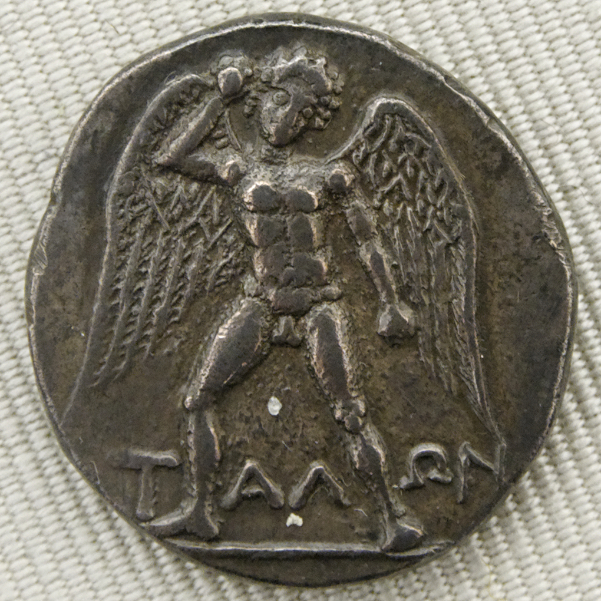

# നി‍ർമ്മിത ബുദ്ധി

*ന്യൂ യോർക്കിൽ സ്ഥിതി ചെയ്യുന്ന ഐബിഎമ്മിന്റെ "വാട്സൺ" എന്ന കൃത്രിമ ബുദ്ധി യന്ത്രം.*

| Col1 |
| --- |
| പരമ്പര |
| ശാസ്ത്രം |
| വികസിപ്പിക്കുക Formal യുക്തി ഗണിതം Mathematical logic Mathematical statistics Theoretical computer science |
| വികസിപ്പിക്കുക Physical ജ്യോതിഃശാസ്ത്രം ഖഗോള ഭൗതികം പ്രപഞ്ചവിജ്ഞാനീയം Galactic astronomy Planetary geology Planetary science താരക ജ്യോതിശാസ്ത്രം രസതന്ത്രം അമ്ല-ക്ഷാര വിശ്ലേഷകരസതന്ത്രം പാരിസ്ഥിതിക- ഇനോർഗാനിക് രസതന്ത്രം ആണവ- കാർബണിക ഭൗതികരസതന്ത്രം ഖരാവസ്ഥാ- Supramolecular ഹരിതരസതന്ത്രം സൈദ്ധാന്തിക- ഖഗോളരസതന്ത്രം ജൈവരസതന്ത്രം പരൽ രസതന്ത്രം ഭക്ഷ്യരസതന്ത്രം ഭൂരസതന്ത്രം പദാർത്ഥശാസ്ത്രം തന്മാത്രാരസതന്ത്രം പ്രകാശരസതന്ത്രം റേഡിയോ രസതന്ത്രം ത്രിമാനരസതന്ത്രം പ്രതല രസതന്ത്രം ഭൗതികശാസ്ത്രം ഉദാത്തഭൗതികം നവീനഭൗതികം Applied Experimental Theoretical കമ്പ്യൂട്ടേഷനൽ അണുഭൗതികം Condensed matter Mechanics ( ഉദാത്തബലതന്ത്രം continuum ദ്രവ ബലതന്ത്രം solid ) Molecular അണുകേന്ദ്രഭൗതികം കണികാഭൗതികം പ്ലാസ്മ Quantum field theory ക്വാണ്ടം ബലതന്ത്രം ( introduction ) വിശിഷ്ട ആപേക്ഷികതാ സിദ്ധാന്തം സാമാന്യ ആപേക്ഷികതാസിദ്ധാന്തം Rheology സ്ട്രിങ്ങ് സിദ്ധാന്തം താപഗതികം Earth sciences Climatology ആവാസ വിജ്ഞാനം Edaphology പരിസ്ഥിതിശാസ്ത്രം Geodesy ഭൂമിശാസ്ത്രം ( physical ) ഭൂഗർഭശാസ്ത്രം Geomorphology Geophysics Glaciology ഹൈഡ്രോളജി Limnology അന്തരീക്ഷവിജ്ഞാനം സമുദ്രശാസ്ത്രം Paleoclimatology Paleoecology Palynology Pedology Space science |
| ജ്യോതിഃശാസ്ത്രം |
| ഖഗോള ഭൗതികം പ്രപഞ്ചവിജ്ഞാനീയം Galactic astronomy Planetary geology Planetary science താരക ജ്യോതിശാസ്ത്രം |
| രസതന്ത്രം |
| അമ്ല-ക്ഷാര വിശ്ലേഷകരസതന്ത്രം പാരിസ്ഥിതിക- ഇനോർഗാനിക് രസതന്ത്രം ആണവ- കാർബണിക ഭൗതികരസതന്ത്രം ഖരാവസ്ഥാ- Supramolecular ഹരിതരസതന്ത്രം സൈദ്ധാന്തിക- ഖഗോളരസതന്ത്രം ജൈവരസതന്ത്രം പരൽ രസതന്ത്രം ഭക്ഷ്യരസതന്ത്രം ഭൂരസതന്ത്രം പദാർത്ഥശാസ്ത്രം തന്മാത്രാരസതന്ത്രം പ്രകാശരസതന്ത്രം റേഡിയോ രസതന്ത്രം ത്രിമാനരസതന്ത്രം പ്രതല രസതന്ത്രം |
| ഭൗതികശാസ്ത്രം |
| ഉദാത്തഭൗതികം നവീനഭൗതികം Applied Experimental Theoretical കമ്പ്യൂട്ടേഷനൽ അണുഭൗതികം Condensed matter Mechanics ( ഉദാത്തബലതന്ത്രം continuum ദ്രവ ബലതന്ത്രം solid ) Molecular അണുകേന്ദ്രഭൗതികം കണികാഭൗതികം പ്ലാസ്മ Quantum field theory ക്വാണ്ടം ബലതന്ത്രം ( introduction ) വിശിഷ്ട ആപേക്ഷികതാ സിദ്ധാന്തം സാമാന്യ ആപേക്ഷികതാസിദ്ധാന്തം Rheology സ്ട്രിങ്ങ് സിദ്ധാന്തം താപഗതികം |
| Earth sciences |
| Climatology ആവാസ വിജ്ഞാനം Edaphology പരിസ്ഥിതിശാസ്ത്രം Geodesy ഭൂമിശാസ്ത്രം ( physical ) ഭൂഗർഭശാസ്ത്രം Geomorphology Geophysics Glaciology ഹൈഡ്രോളജി Limnology അന്തരീക്ഷവിജ്ഞാനം സമുദ്രശാസ്ത്രം Paleoclimatology Paleoecology Palynology Pedology Space science |
| വികസിപ്പിക്കുക Life ജീവശാസ്ത്രം ശരീരശാസ്ത്രം നരവംശശാസ്ത്രം ജ്യോതിർജീവശാസ്ത്രം ജൈവരസതന്ത്രം Biogeography Biological engineering Biophysics Behavioral neuroscience ജൈവസാങ്കേതികവിദ്യ സസ്യശാസ്ത്രം Cell biology Conservation biology Cryobiology Developmental biology ആവാസ വിജ്ഞാനം Ethnobiology Ethology Evolutionary biology ( introduction ) ജനിതകശാസ്ത്രം ( introduction ) Gerontology Immunology Limnology Marine biology സൂക്ഷ്മജീവശാസ്ത്രം Molecular biology Neuroscience പാലിയെന്റോളജി Parasitology Physiology Radiobiology Soil biology Sociobiology Systematics Toxicology ജന്തുശാസ്ത്രം |
| ജീവശാസ്ത്രം |
| ശരീരശാസ്ത്രം നരവംശശാസ്ത്രം ജ്യോതിർജീവശാസ്ത്രം ജൈവരസതന്ത്രം Biogeography Biological engineering Biophysics Behavioral neuroscience ജൈവസാങ്കേതികവിദ്യ സസ്യശാസ്ത്രം Cell biology Conservation biology Cryobiology Developmental biology ആവാസ വിജ്ഞാനം Ethnobiology Ethology Evolutionary biology ( introduction ) ജനിതകശാസ്ത്രം ( introduction ) Gerontology Immunology Limnology Marine biology സൂക്ഷ്മജീവശാസ്ത്രം Molecular biology Neuroscience പാലിയെന്റോളജി Parasitology Physiology Radiobiology Soil biology Sociobiology Systematics Toxicology ജന്തുശാസ്ത്രം |
| വികസിപ്പിക്കുക Social നരവംശശാസ്ത്രം പുരാവസ്തുശാസ്ത്രം ക്രിമിനോളജി ജനസംഖ്യാപഠനം സാമ്പത്തികശാസ്ത്രം Geography ( നരവംശ ഭൂമിശാസ്ത്രം ) അന്താരാഷ്ട്ര ബന്ധങ്ങൾ നിയമം ഭാഷാശാസ്ത്രം Pedagogy Political science മനഃശാസ്ത്രം Science education സമൂഹശാസ്ത്രം |
| വികസിപ്പിക്കുക Applied എൻജിനീയറിങ്ങ് Aerospace Agricultural Biological Biomedical Chemical സിവിൽ എഞ്ചിനീയറിങ്ങ് കമ്പ്യൂട്ടർ ശാസ്ത്രം / engineering ഇലക്ട്രിക്കൽ എൻജിനീയറിംഗ് Fire protection Genetic Industrial മെക്കാനിക്കൽ എൻജിനീയറിങ്ങ് Military Mining Nuclear ഓപ്പറേഷൻസ് ഗവേഷണം Robotics സോഫ്റ്റ്‌വെയർ എഞ്ചിനീയറിങ് Web Healthcare ദന്തവൈദ്യം സാംക്രമികരോഗവിജ്ഞാനീയം വൈദ്യം ( veterinary ) നഴ്‌സിങ് Pharmacy |
| എൻജിനീയറിങ്ങ് |
| Aerospace Agricultural Biological Biomedical Chemical സിവിൽ എഞ്ചിനീയറിങ്ങ് കമ്പ്യൂട്ടർ ശാസ്ത്രം / engineering ഇലക്ട്രിക്കൽ എൻജിനീയറിംഗ് Fire protection Genetic Industrial മെക്കാനിക്കൽ എൻജിനീയറിങ്ങ് Military Mining Nuclear ഓപ്പറേഷൻസ് ഗവേഷണം Robotics സോഫ്റ്റ്‌വെയർ എഞ്ചിനീയറിങ് Web |
| Healthcare |
| ദന്തവൈദ്യം സാംക്രമികരോഗവിജ്ഞാനീയം വൈദ്യം ( veterinary ) നഴ്‌സിങ് Pharmacy |
| വികസിപ്പിക്കുക Interdisciplinary Applied physics കൃത്രിമബുദ്ധി Bioethics ബയോ-ഇൻഫർമാറ്റിക്സ്‌ Biomedical engineering Biostatistics Cognitive science Complex systems കമ്പ്യൂട്ടേഷണൽ ലിംഗ്വിസ്റ്റിക്സ് Cultural studies Cybernetics പരിസ്ഥിതിശാസ്ത്രം Environmental social science Environmental studies Ethnic studies Evolutionary psychology Forestry ഗ്രന്ഥാലയ വിവര ശാസ്ത്രം Mathematical / theoretical biology Mathematical physics Military science Network science Neural engineering Neuroscience Science studies Scientific modelling ചിഹ്നശാസ്ത്രം Sociobiology സ്ഥിതിഗണിതം Systems science നഗരാസൂത്രണം Web science |
| വികസിപ്പിക്കുക Philosophy History പൗരശാസ്ത്രം Fringe science Protoscience കപടശാസ്ത്രം Scientific freedom Science policy ശാസ്ത്രീയ സമീപനം Technoscience |
| Outline Portal Category |
| ക സ തി |

കൃത്രിമ ബുദ്ധി (artificial intelligence, AI) എന്ന യന്ത്രങ്ങളുടെ ബുദ്ധിയേയും അതുപോലെ അത് യാഥാർഥ്യമാക്കാൻ ലക്ഷ്യമിട്ട കമ്പ്യൂട്ടർ ശാസ്ത്രത്തിലെ ശാഖയേയും കുറിക്കാൻ ഉപയോഗിക്കുന്നു. ബൗദ്ധിക സഹായികളെ കുറിച്ചുള്ള പഠന മേഖലയാണ് എഐ ഗവേഷണം എന്ന് നിർവചിക്കപ്പെട്ടിട്ടുണ്ട്, അത് പരിതസ്ഥിതിയെ മനസ്സിലാക്കുകയും അതിന്റെ ലക്ഷ്യങ്ങൾ കൈവരിക്കുന്നതിനുള്ള സാധ്യത വർദ്ധിപ്പിക്കുന്ന നടപടികൾ കൈക്കൊള്ളുകയും ചെയ്യുന്ന ഏതൊരു സംവിധാനത്തെയും സൂചിപ്പിക്കുന്നു.

ഈ മേഖലയിലെ പ്രധാന ദാനങ്ങൾ നിർവചിക്കുന്നതനുസരിച്ച് നി‍‍ർമ്മിത ബുദ്ധി എന്നാൽ "വിവേകമുള്ള യന്ത്രങ്ങളെ സൃഷ്ടിക്കുവാൻ വേണ്ടിയുള്ള പഠനപ്രവർത്തനങ്ങളും അവയുടെ രൂപകൽപ്പനയും". വിവേകമുള്ള യന്ത്രങ്ങൾ എന്നാൽ ചുറ്റുപാടിൽ നിന്നും കാര്യങ്ങൾ സ്വീകരിക്കുകയും അതുവഴി വിജയകരമായി നീങ്ങുവാനുള്ള പ്രവർത്തികൾ നടപ്പിൽ വരുത്തുന്നതുമായ വ്യൂഹങ്ങൾ ആണ്. സംഭാഷണപരമായി, "കൃത്രിമബുദ്ധി" എന്ന പദം പലപ്പോഴും മനുഷ്യ മനസ്സുമായി മനുഷ്യർ ബന്ധപ്പെടുത്തുന്ന "വൈജ്ഞാനിക" പ്രവർത്തനങ്ങളെ അനുകരിക്കുന്ന യന്ത്രങ്ങളെ (അല്ലെങ്കിൽ കമ്പ്യൂട്ടറുകളെ) വിവരിക്കാൻ ഉപയോഗിക്കുന്നു, അതായത് "പഠിക്കുക", "പ്രശ്ന പരിഹാരം നടത്തുക".

മെഷീനുകൾ‌ കൂടുതൽ‌ പ്രാപ്‌തി കൈവരിക്കുമ്പോൾ, "ഇന്റലിജൻസ്" ആവശ്യമാണെന്ന് കരുതപ്പെടുന്ന ടാസ്‌ക്കുകൾ‌ പലപ്പോഴും എഐ(AI) യുടെ നിർ‌വ്വചനത്തിൽ‌ നിന്നും നീക്കംചെയ്യുന്നു, ഇത് എഐ ഇഫക്റ്റ് എന്നറിയപ്പെടുന്ന പ്രതിഭാസമാണ്. [ 1 ] എഐ ആപ്ലിക്കേഷനുകളിൽ വിപുലമായ വെബ് സെർച്ച് എഞ്ചിനുകൾ (ഉദാ. ഗൂഗിൾ ), ശുപാർശ സംവിധാനങ്ങൾ ( യൂട്യൂബ് , ആമസോൺ , നെറ്റ്ഫ്ലിക്സ് എന്നിവ ഉപയോഗിക്കുന്നു), മനുഷ്യന്റെ സംസാരം മനസ്സിലാക്കൽ ( സിരി , അലക്‌സ എന്നിവ പോലുള്ളവ), സെൽഫ് ഡ്രൈവിംഗ് കാറുകൾ (ഉദാ. ടെസ്‌ല ), സ്വയമേവയുള്ള തീരുമാനമെടുക്കൽ എന്നിവ ഉൾപ്പെടുന്നു. സ്ട്രാറ്റജിക് ഗെയിം സിസ്റ്റങ്ങളിൽ ( ചെസ്സ് , ഗോ പോലുള്ളവ) ഉയർന്ന തലത്തിൽ മത്സരിക്കുക മുതലയാവ. [ 2 ] യന്ത്രങ്ങൾ കൂടുതൽ പ്രാപ്തമാകുന്നതോടെ, "ബുദ്ധി" ആവശ്യമാണെന്ന് കരുതുന്ന ജോലികൾ എഐ യുടെ നിർവചനത്തിൽ നിന്ന് നീക്കം ചെയ്യപ്പെടുന്നു, ഈ പ്രതിഭാസം എഐ പ്രഭാവം എന്നറിയപ്പെടുന്നു. [ 3 ] ഉദാഹരണത്തിന്, ഒപ്റ്റിക്കൽ ക്യാരക്ടർ റെക്കഗ്നിഷൻ എന്നത് എഐ ആയി കണക്കാക്കപ്പെടുന്ന കാര്യങ്ങളിൽ നിന്ന് ഇടയ്ക്കിടെ ഒഴിവാക്കപ്പെടുന്നു, [ 4 ] ഇത് ഒരു സാധാരണ സാങ്കേതികവിദ്യയായി മാറിയിരിക്കുന്നു. [ 5 ] കൃത്രിമബുദ്ധി ഒരു അക്കാദമിക് ഡിസിപ്ലിനായി 1955-ൽ സ്ഥാപിതമായി. 2015-ൽ ആൽഫാഗോ ഒരു പ്രൊഫഷണൽ ഗോ കളിക്കാരനെ വിജയകരമായി പരാജയപ്പെടുത്തിയ ശേഷം, കൃത്രിമബുദ്ധി വീണ്ടും ആഗോള ശ്രദ്ധ ആകർഷിച്ചു. [ 6 ] അതിന്റെ ചരിത്രം പരിശോധിച്ചാൽ, എഐ ഗവേഷണം പരസ്പരം ആശയവിനിമയം നടത്തുന്നതിൽ പരാജയപ്പെട്ട ഉപമേഖലകളാണ്.

1965 ൽ ഈ വാക്ക് ആദ്യമായി ഉപയോഗിച്ച ജോൺ മാക്‌കാർത്തി നിർവചിക്കുന്നത് "ബുദ്ധിയുള്ള യന്ത്രങ്ങളെ സൃഷ്ടിക്കുവാനുള്ള ശാസ്ത്രവും എൻജിനീയറിങ്ങും" എന്നാണ്. ആയിരത്തി തൊള്ളായിരത്തി അൻപതുകളിൽ ആണ് സംഘടിതമായ കൃത്രിമ ബുദ്ധി വികസന ഗവേഷണം തുടങ്ങിയത്. 1956 ൽ ഡാർട്ട്മൗത്ത് കോളേജിൽ നടന്ന ഒരു സമ്മേളനത്തിൽ വച്ചാണ് ഇതിന്റെ ഔപചാരികമായ തുടക്കം കുറിക്കുന്നത്. [ 7 ] പിന്നീടുള്ള വർഷങ്ങളിൽ, നിരാശയും ധനനഷ്ടവും ("എഐ വിന്റർ" എന്ന് അറിയപ്പെടുന്നു) പുതിയ സമീപനങ്ങളും തന്മൂലമുള്ള വിജയവും പുതുക്കിയ ഫണ്ടിംഗും മൂലം ശുഭാപ്തിവിശ്വാസത്തിന്റെ പരകോടിയിലെത്താൻ സഹായിച്ചു. [ 8 ] എഐ ഗവേഷണം തുടങ്ങിയതു മുതൽ നിരവധി വ്യത്യസ്ത സമീപനങ്ങൾ പരീക്ഷിക്കുകയും നിരസിക്കുകയും ചെയ്തിട്ടുണ്ട്, തലച്ചോറിനെ അനുകരിക്കുക, മനുഷ്യന്റെ പ്രശ്നപരിഹാരം മാതൃകയാക്കുക, ഔപചാരികമായ യുക്തി, അറിവിന്റെ വലിയ ഡാറ്റാബേസുകൾ, മൃഗങ്ങളുടെ പെരുമാറ്റം അനുകരിക്കൽ എന്നിവ ഉൾപ്പെടുന്നു. 21-ാം നൂറ്റാണ്ടിന്റെ ആദ്യ ദശകങ്ങളിൽ, മാത്തമാറ്റിക്കൽ-സ്റ്റാറ്റിസ്റ്റിക്കൽ മെഷീൻ ലേണിംഗ് ഈ മേഖലയിൽ ആധിപത്യം സ്ഥാപിച്ചു, ഈ സാങ്കേതികത വളരെ വിജയകരമാണെന്ന് തെളിയിച്ചിട്ടുണ്ട്, ഇത് വ്യവസായത്തിലും അക്കാദമിയിലുമുള്ള നിരവധി വെല്ലുവിളി നിറഞ്ഞ പ്രശ്നങ്ങൾ പരിഹരിക്കാൻ സഹായിക്കുന്നു. [ 8 ]

എഐ ഗവേഷണത്തിന്റെ വിവിധ ഉപമേഖലകൾ പ്രത്യേക ലക്ഷ്യങ്ങളെയും പ്രത്യേക ഉപകരണങ്ങളുടെ ഉപയോഗത്തെയും കേന്ദ്രീകരിച്ചുള്ളതാണ്. എഐ ഗവേഷണത്തിന്റെ പരമ്പരാഗത ലക്ഷ്യങ്ങളിൽ ഓട്ടോമേറ്റഡ് റീസണിംഗ്, നോളജ് റെപ്രസേന്റേഷൻ ആന്റ് റീസണിംഗ്, ഓട്ടോമേറ്റഡ് പ്ലാനിംഗ് ആൻഡ് ഷെഡ്യൂളിംഗ്, മെഷീൻ ലേണിംഗ്, നാച്ചുറൽ ലാങ്വവേജ് പ്രോസ്സസിംഗ്, മെഷീൻ പെർപെഷൻ, വസ്തുക്കളെ ചലിപ്പിക്കാനും കൈകാര്യം ചെയ്യാനുമുള്ള കഴിവ് എന്നിവ ഉൾപ്പെടുന്നു. [ 9 ] ജനറൽ ഇന്റലിജൻസ് (അനിയന്ത്രിതമായ ഒരു പ്രശ്നം പരിഹരിക്കാനുള്ള കഴിവ്) ഫീൽഡിന്റെ ദീർഘകാല ലക്ഷ്യങ്ങളിൽ ഒന്നാണ്. ഈ പ്രശ്‌നങ്ങൾ പരിഹരിക്കുന്നതിന്, എഐ ഗവേഷകർ നിരവധി പ്രശ്‌നപരിഹാര സാങ്കേതിക വിദ്യകൾ സ്വീകരിക്കുകയും സംയോജിപ്പിക്കുകയും ചെയ്‌തു. തിരയൽ, മാത്തമാറ്റിക്കൽ ഒപ്റ്റിമൈസേഷൻ, ഒഫീഷ്യൽ ലോജിക്, കൃത്രിമ ന്യൂറൽ നെറ്റ്‌വർക്കുകൾ, സ്ഥിതിവിവരക്കണക്കുകൾ, പ്രോബബിലിറ്റി, സാമ്പത്തികശാസ്ത്രം എന്നിവയെ അടിസ്ഥാനമാക്കിയുള്ള രീതികൾ പിന്തുടരുന്നു. കമ്പ്യൂട്ടർ സയൻസ്, മനഃശാസ്ത്രം, ഭാഷാശാസ്ത്രം, തത്ത്വചിന്ത, കൂടാതെ മറ്റ് പല മേഖലകളിലും എഐ ആകർഷകമാക്കുന്നു. [ 9 ]

മനുഷ്യന്റെ ബുദ്ധിയെ "അനുകരിക്കുന്ന ഒരു യന്ത്രം നിർമ്മിക്കാൻ കഴിയും" എന്ന അനുമാനത്തിലാണ് ഈ മേഖല ആരംഭിച്ചത്. [ 10 ] ഇത് മനസ്സിനെക്കുറിച്ചും മനുഷ്യനെപ്പോലെയുള്ള കൃത്രിമ ജീവികളെ സൃഷ്ടിക്കുന്നതിന്റെ ധാർമ്മിക അനന്തരഫലങ്ങളെക്കുറിച്ചുള്ള വാദങ്ങൾ ഉയർത്തി. ബുദ്ധി; പുരാതന കാലം മുതൽ ഈ പ്രശ്നങ്ങൾ മിത്ത്, ഫിക്ഷൻ, ഫിലോസഫി എന്നിവയാൽ പര്യവേക്ഷണം ചെയ്യപ്പെട്ടിട്ടുണ്ട്. സയൻസ് fiction എഴുത്തുകാരും ഫ്യൂച്ചറോളജിസ്റ്റുകളും എഐ അതിന്റെ യുക്തിസഹമായ കഴിവുകൾക്ക് മേൽനോട്ടം വഹിച്ചില്ലെങ്കിൽ മനുഷ്യരാശിയുടെ നിലനിൽപ്പിനെ തന്നെ ബാധിക്കാമെന്ന് അഭിപ്രായപ്പെടുന്നു. [ 11 ] [ 12 ]

## ചരിത്രം

### ഫിക്ഷനുകളും ആദ്യകാല ആശയങ്ങളും

*ക്രീറ്റിൽ നിന്നുള്ള സിൽവർ ഡിഡ്രാക്മ, ആർട്ടിഫിഷ്യൽ ഇന്റലിജൻസ് ഉള്ള ഒരു പുരാതന ഓട്ടോമേട്ടനായ ടാലോസിനെ ചിത്രീകരിക്കുന്നു*

മേരി ഷെല്ലിയുടെ ഫ്രാങ്കെൻ‌സ്റ്റൈൻ അല്ലെങ്കിൽ കാരെൽ കാപെക്കിന്റെ ആർ.യു.ആർ(R.U.R) പോലെ, ബുദ്ധിശക്തിയുള്ള കൃത്രിമ ജീവികൾ പുരാതന കാലത്ത് കഥപറച്ചിലായി പ്രത്യക്ഷപ്പെട്ടു, ഫിക്ഷനിലും സാധാരണമാണ്. [ 13 ] ഈ കഥാപാത്രങ്ങളും അവരുടെ വിധികളും ഇപ്പോൾ ആർട്ടിഫിഷ്യൽ ഇന്റലിജൻസിന്റെ ധാർമ്മികതയിൽ ചർച്ചചെയ്യപ്പെടുന്ന പല വിഷയങ്ങളും ഉയർത്തി. [ 14 ]

മെക്കാനിക്കൽ അല്ലെങ്കിൽ "ഔപചാരിക" യുക്തിയെക്കുറിച്ചുള്ള പഠനം പുരാതന കാലത്ത് തത്ത്വചിന്തകരും ഗണിതശാസ്ത്രജ്ഞരും ആരംഭിച്ചു. ഗണിതശാസ്ത്ര യുക്തിയെക്കുറിച്ചുള്ള പഠനം അലൻ ട്യൂറിംഗിന്റെ കണക്കുകൂട്ടൽ സിദ്ധാന്തത്തിലേക്ക് നേരിട്ട് നയിച്ചു, ഇത് "0", "1" എന്നിങ്ങനെ ലളിതമായ ചിഹ്നങ്ങൾ കൂട്ടിച്ചേർത്ത് ഒരു യന്ത്രത്തിന് ഗണിതശാസ്ത്രപരമായ കിഴിവിന്റെ ഏത് പ്രവർത്തനത്തെയും അനുകരിക്കാൻ കഴിയുമെന്ന് പറഞ്ഞു. ഔപചാരിക യുക്തിയുടെ ഏത് പ്രക്രിയയും ഡിജിറ്റൽ കമ്പ്യൂട്ടറുകൾക്ക് അനുകരിക്കാൻ കഴിയുമെന്ന ഈ ഉൾക്കാഴ്ച ചർച്ച്-ട്യൂറിംഗ് തീസിസ് എന്നറിയപ്പെടുന്നു. [ 15 ]

## ഇതുകൂടി കാണുക

- സോഫിയ (റോബോട്ട്)
- ക്വാണ്ടം കമ്പ്യൂട്ടിംഗ്

## അവലംബം

- ↑ McCorduck 2004 , p. 204 harvnb error: no target: CITEREFMcCorduck2004 ( help )
- ↑ Google (2016) . sfnp error: no target: CITEREFGoogle2016 ( help )
- ↑ McCorduck (2004) , p. 204. sfnp error: no target: CITEREFMcCorduck2004 ( help )
- ↑ Ashok83 (2019) . sfnp error: no target: CITEREFAshok832019 ( help )
- ↑ Schank (1991) , p. 38. sfnp error: no target: CITEREFSchank1991 ( help )
- ↑ Haenlein, Michael; Kaplan, Andreas (2019). "A Brief History of Artificial Intelligence: On the Past, Present, and Future of Artificial Intelligence" . California Management Review (in ഇംഗ്ലീഷ്). 61 (4): 5– 14. doi : 10.1177/0008125619864925 . ISSN 0008-1256 . S2CID 199866730 .
- ↑ McCorduck, Pamela (2004), Machines Who Think (2nd ed.), Natick, MA: A. K. Peters, Ltd., ISBN 1-56881-205-1
- ↑ മുകളിൽ ഇവിടേയ്ക്ക്: 8.0 8.1 Clark (2015b) . sfnp error: no target: CITEREFClark2015b ( help )
- ↑ മുകളിൽ ഇവിടേയ്ക്ക്: 9.0 9.1 Pennachin & Goertzel (2007) harvtxt error: no target: CITEREFPennachinGoertzel2007 ( help ) ; Roberts (2016) harvtxt error: no target: CITEREFRoberts2016 ( help )
- ↑ McCarthy et al. (1955) . sfnp error: no target: CITEREFMcCarthyMinskyRochesterShannon1955 ( help )
- ↑ Spadafora (2016) . sfnp error: no target: CITEREFSpadafora2016 ( help )
- ↑ Lombardo, Boehm & Nairz (2020) . sfnp error: no target: CITEREFLombardoBoehmNairz2020 ( help )
- ↑ AI in myth: McCorduck (2004 , pp. 4–5) harvtxt error: no target: CITEREFMcCorduck2004 ( help ) Russell & Norvig (2003 , p. 939) harvtxt error: no target: CITEREFRussellNorvig2003 ( help )
- ↑ McCorduck (2004) , pp. 17–25. sfnp error: no target: CITEREFMcCorduck2004 ( help )
- ↑ Berlinski (2000) . sfnp error: no target: CITEREFBerlinski2000 ( help )

---
Source: https://ml.wikipedia.org/wiki/%E0%B4%A8%E0%B4%BF%E2%80%8D%E0%B5%BC%E0%B4%AE%E0%B5%8D%E0%B4%AE%E0%B4%BF%E0%B4%A4_%E0%B4%AC%E0%B5%81%E0%B4%A6%E0%B5%8D%E0%B4%A7%E0%B4%BF
