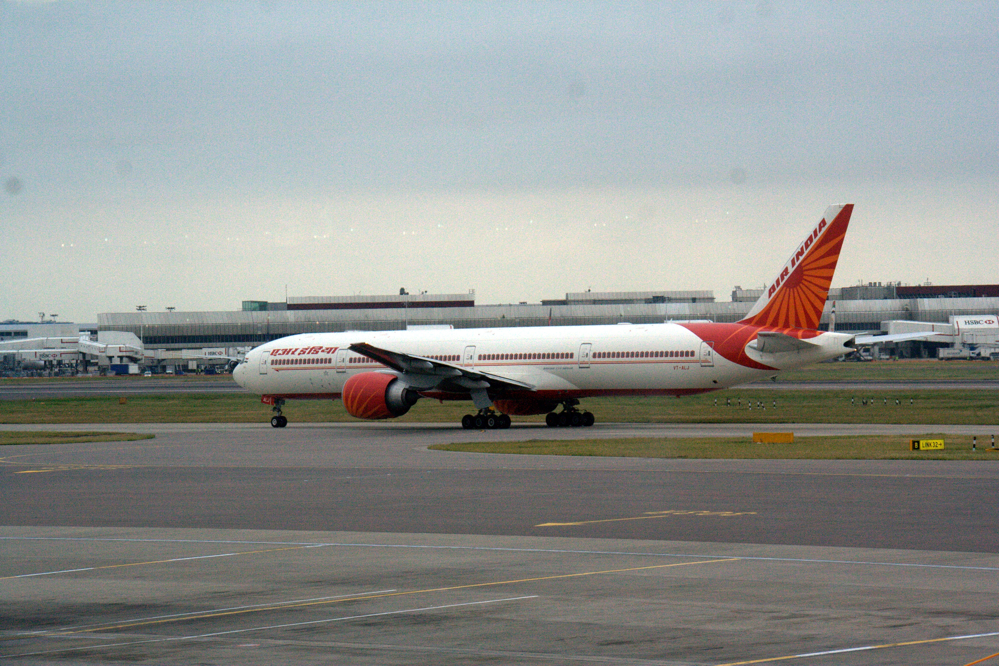

# എയർ ഇന്ത്യ

*എയർ ഇന്ത്യ*

| Col1 |
| --- |
|  |
| IATA AI [ 1 ] ICAO AIC [ 1 ] Callsign AIR INDIA [ 2 ] |
| IATA AI [ 1 ] |
| തുടക്കം |
| തുടങ്ങിയത് |
| ഹബ് |
| സെക്കൻഡറി ഹബ് |
| Focus cities |
| ഫ്രീക്വന്റ് ഫ്ലയർ പ്രോഗ്രാം |
| Alliance |
| ഉപകമ്പനികൾ |
| Fleet size |
| ലക്ഷ്യസ്ഥാനങ്ങൾ |
| മാതൃ സ്ഥാപനം |
| ആസ്ഥാനം |
| പ്രധാന വ്യക്തികൾ |
| വരുമാനം |
| പ്രവർത്തന വരുമാനം |
| ലാഭം |
| മൊത്തം ആസ്തി |
| വെബ്‌സൈറ്റ് |

ടാറ്റായുടെ സ്വകാര്യ വിമാന സേവന സംവിധാനം ആണ് എയർ ഇന്ത്യ. മുമ്പ് ഇത് ഇന്ത്യയുടെ ഔദ്യോഗിക വിമാന സേവന ദാതാവായിരുന്നു ( ഹിന്ദി : एअर इंडिया ). എയർ ഇന്ത്യ ലോകത്തിലെ എല്ലാ പ്രധാന നഗരങ്ങളിലേക്കും വിമാനയാത്രാ സേവനം നല്കുന്നു. എയർബസ്സും ബോയിങ്ങും ആണ് ഉപയോഗിക്കുന്ന വിവിധ തരം വിമാനങ്ങൾ. ഇന്ത്യയിൽ പ്രധാനമായും രണ്ട് പ്രധാന കേന്ദ്രങ്ങൾ എയർ ഇന്ത്യക്കുണ്ട്, അത് ഡെൽഹിയിലും മുംബൈയിലുമാണ് . കൂടാതെ അന്താരാഷ്ട്ര കേന്ദ്രം ജെർമനിയിലെ ഫ്രാങ്ക്ഫുർട്ട് വിമാനത്താവളത്തിലുമാണ്. മറ്റൊരു കേന്ദ്രം ലണ്ടനിലും ഉണ്ട് . 2007 ആഗസ്റ്റ് 13ന് സ്റ്റാർ അലയൻസ് എയർ ഇൻഡ്യയെ അവരുടെ ഒരു അംഗം ആകാനായി ക്ഷണിക്കുകയുണ്ടായി. [ 7 ] . മാർച്ച് 2011 ൽ എയർ ഇൻഡ്യ സ്റ്റാർ അലയൻസിന്റെ ഒരു മുഴുവൻ സമയ അംഗമാകും.

## ചരിത്രം

### സ്വതന്ത്ര്യത്തിന് മുൻപ്

*എയർ ഇന്ത്യയുടെ ബോയിങ്ങ് 777-330 ഇ. ആർ വിമാനം ബീഹാർ ലണ്ടൻ ഹീത്രൂ വിമാനത്താവളത്തിൽ*

## അവലംബം

- ↑ മുകളിൽ ഇവിടേയ്ക്ക്: 1.0 1.1 "Air India" . ch-aviation . Archived from the original on 17 ജനുവരി 2017 . Retrieved 30 ജനുവരി 2017 .
- ↑ "7340.2F with Change 1 and Change 2 and Change 3" (PDF) . Federal Aviation Administration . 15 സെപ്റ്റംബർ 2016. pp. 3–1–11. Archived (PDF) from the original on 3 ഫെബ്രുവരി 2017 . Retrieved 30 ജനുവരി 2017 .
- ↑ "Air India, Indian airline" . Encyclopædia Britannica . Retrieved 6 March 2016 .
- ↑ "Explained: What happens after the Tata Group gets control of Air India today?" . The Indian Express (in ഇംഗ്ലീഷ്). 28 January 2022 . Retrieved 28 January 2022 .
- ↑ Upadhyay, Anindya (15 February 2013). "Air India vacates Nariman Point; moves headquarters to Delhi" . The Economic Times . Archived from the original on 2016-03-05 . Retrieved 16 February 2013 .
- ↑ മുകളിൽ ഇവിടേയ്ക്ക്: 6.0 6.1 6.2 6.3 "Statement of Profit & Loss on 31.03.2022" .
- ↑ Air India to join Star Alliance ഡെയ്ലി ഇൻഡ്യ.കോം [ പ്രവർത്തിക്കാത്ത കണ്ണി ] സ്റ്റാർ അലയൻസ് അംഗത്വം

---
Source: https://ml.wikipedia.org/wiki/%E0%B4%8E%E0%B4%AF%E0%B5%BC_%E0%B4%87%E0%B4%A8%E0%B5%8D%E0%B4%A4%E0%B5%8D%E0%B4%AF
