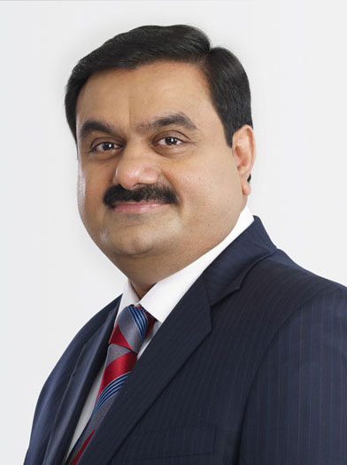
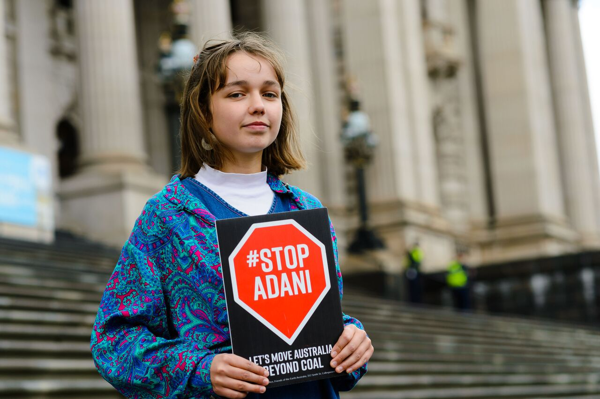
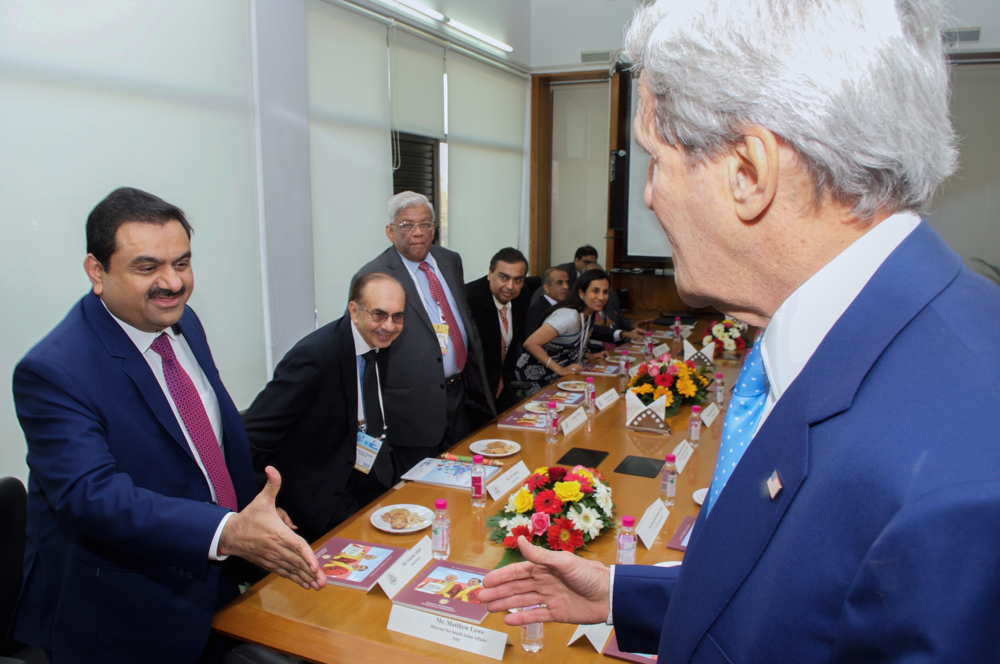

# गौतम अदानी

*गौतम शांतीलाल अदानी*

गौतम शांतीलाल अदानी ( गुजराती : ગૌતમ શાંતિલાલ અદાણી ; जन्म २४ जून १९६२) हे भारतीय अब्जाधीश उद्योगपती आणि परोपकारी आहेत. [ १ ] ते भारतातील बंदर विकास आणि ऑपरेशन्समध्ये गुंतलेल्या अहमदाबाद -आधारित बहुराष्ट्रीय समूह, अदानी समूहाचे अध्यक्ष आणि संस्थापक आहेत. [ २ ] अदानी हे अदानी फाऊंडेशनचे अध्यक्ष देखील आहेत, ज्याचे नेतृत्व प्रामुख्याने त्यांची पत्नी प्रिती अदानी करतात. ३ मार्च, २०२२ पर्यंत, तो आशियातील सर्वात श्रीमंत व्यक्ती आहे आणि फोर्ब्सच्या मते, US$९२.९ अब्ज (रु.७,००,००० कोटी +) संपत्तीसह भारताने मुकेश अंबानींना मागे टाकले आहे. [ ३ ] त्याच वेळी, गौतम अदानी, गेल्या वर्षी त्यांच्या संपत्तीमध्ये $ ४९ अब्ज जोडले - एलोन मस्क आणि जेफ बेझोस यांच्या संपत्तीच्या निव्वळ वाढीपेक्षा. [ ४ ]

७ मार्च २०२२ पर्यंत फोर्ब्सच्या रिअल टाईम अब्जाधीशांच्या यादीत तो १० व्या स्थानावर आहे. त्यांनी १९८८ मध्ये अदानी समूहाची स्थापना केली आणि त्यांचा व्यवसाय संसाधने, लॉजिस्टिक, ऊर्जा, [ ५ ] कृषी, संरक्षण आणि एरोस्पेसमध्ये विविधता आणली. [ ६ ] अदानी पोर्ट्स आणि SEZ मध्ये त्यांचा ७४% हिस्सा आहे, अदानी एंटरप्रायझेसमध्ये ७५% हिस्सा आहे आणि अदानी पॉवरमध्ये ७४% हिस्सा आहे. [ २ ]

## प्रारंभिक जीवन

अदानी यांचा जन्म २४ जून १९६२ रोजी अहमदाबाद, गुजरात येथे शांतीलाल आणि शांती अदानी या जैन कुटुंबात झाला. [ ७ ] त्याला ७ भावंडे असून त्याचे आई-वडील गुजरातच्या उत्तरेकडील थाराड शहरातून स्थलांतरित झाले होते. [ ८ ] त्याचे वडील छोटे कापड व्यापारी होते. [ ९ ] अहमदाबाद येथील शेठ चिमणलाल नगिनदास विद्यालयात त्यांचे शिक्षण झाले. त्याने गुजरात विद्यापीठात वाणिज्य शाखेतील पदवीसाठी प्रवेश घेतला, परंतु दुसऱ्या वर्षानंतर तो बाहेर पडला. [ ६ ] अदानी व्यवसायासाठी उत्सुक होते, परंतु त्यांच्या वडिलांचा कापड व्यवसाय नाही. [ १० ]

## कारकीर्द

किशोरवयात, अदानी महेंद्र ब्रदर्ससाठी डायमंड सॉर्टर म्हणून काम करण्यासाठी १९७८ मध्ये मुंबईत आले. [ ११ ]

१९८१ मध्ये त्यांचे मोठे भाऊ मनसुखभाई अदानी यांनी अहमदाबादमध्ये प्लास्टिक युनिट विकत घेतले आणि त्यांना ऑपरेशन्सचे व्यवस्थापन करण्यासाठी आमंत्रित केले. पॉलिव्हिनाईल क्लोराईड आयातीद्वारे जागतिक व्यापारासाठी हा उपक्रम अदानीचा प्रवेशद्वार ठरला. [ १२ ]

१९८५ मध्ये त्यांनी लघुउद्योगांसाठी प्राथमिक पॉलिमर आयात करण्यास सुरुवात केली. १९८८ मध्ये, अदानीने अदानी एक्सपोर्ट्सची स्थापना केली, जी आता अदानी एंटरप्रायझेस म्हणून ओळखली जाते - अदानी समूहाची होल्डिंग कंपनी. मूलतः, कंपनी कृषी आणि उर्जा वस्तूंचे व्यवहार करते. [ १२ ]

१९९१ मध्ये, आर्थिक उदारीकरणाची धोरणे त्यांच्या कंपनीसाठी अनुकूल ठरली आणि त्यांनी धातू, कापड आणि कृषी उत्पादनांच्या व्यापारात व्यवसायाचा विस्तार करण्यास सुरुवात केली. [ १३ ]

१९९४ मध्ये, गुजरात सरकारने मुंद्रा बंदराच्या व्यवस्थापकीय आउटसोर्सिंगची घोषणा केली आणि १९९५ मध्ये अदानीला कंत्राट मिळाले. [ १४ ]

१९९५ मध्ये त्यांनी पहिली जेटी उभारली. मूलतः मुंद्रा बंदर आणि विशेष आर्थिक क्षेत्राद्वारे संचालित, ऑपरेशन्स अदानी पोर्ट्स आणि SEZ मध्ये हस्तांतरित करण्यात आल्या. आज, कंपनी सर्वात मोठी खाजगी मल्टी-पोर्ट ऑपरेटर आहे. मुंद्रा बंदर हे भारतातील खाजगी क्षेत्रातील सर्वात मोठे बंदर आहे, ज्याची क्षमता दरवर्षी सुमारे २१० दशलक्ष टन मालवाहतूक करण्याची क्षमता आहे. [ १५ ] [ १६ ]

१९९६ मध्ये, अदानी समूहाची उर्जा व्यवसाय शाखा, अदानी पॉवर, अदानी यांनी स्थापन केली. अदानी पॉवरकडे ४६२०MW क्षमतेचे औष्णिक ऊर्जा प्रकल्प आहेत, जे देशातील सर्वात मोठे खाजगी औष्णिक वीज उत्पादक आहे. [ १७ ]

२००६ मध्ये अदानी यांनी वीज निर्मिती व्यवसायात प्रवेश केला. २००९ ते २०१२ पर्यंत, त्यांनी ऑस्ट्रेलियातील अॅबॉट पॉइंट पोर्ट आणि क्वीन्सलँडमधील कार्माइकल कोळसा खाण विकत घेतली. [ १८ ]

*अदानी समूहाच्या कारमाइकल कोळसा खाणीला विरोध करणारे फलक असलेले आंदोलक*

मे २०२० मध्ये, अदानी ने US$६ अब्ज किमतीची Solar Energy Corporation of Indiaची जगातील सर्वात मोठी सौर बोली जिंकली. ८०००MW फोटोव्होल्टेइक पॉवर प्लांट प्रकल्प अदानी ग्रीन द्वारे हाती घेतला जाईल; अदानी सोलर २०००MW अतिरिक्त सोलर सेल आणि मॉड्यूल उत्पादन क्षमता स्थापन करेल. [ १९ ] [ २० ]

सप्टेंबर २०२० मध्ये, अदानीने मुंबई आंतरराष्ट्रीय विमानतळामध्ये ७४% हिस्सा विकत घेतला, जो दिल्लीनंतर भारतातील दुसरा सर्वात व्यस्त आहे. [ २१ ]

फेब्रुवारी २०२२ मध्ये, तो मुकेश अंबानींना मागे टाकत आशियातील सर्वात श्रीमंत व्यक्ती बनला. [ २२ ]

*परराष्ट्र सचिव जॉन केरी यांनी गौतम अदानीला शुभेच्छा दिल्या, २०१४*

## वैयक्तिक जीवन

अदानी यांचा विवाह प्रिती अदानीशी झाला आहे. [ २३ ] [ २४ ] [ २५ ] १९९८ मध्ये खंडणीसाठी त्याचे अपहरण करून त्याला ओलीस ठेवले होते, परंतु पैसे जमा न करता त्याची सुटका करण्यात आली होती. [ २६ ] [ २७ ] २००८ च्या मुंबई हल्ल्याच्या वेळी तो ताज हॉटेलमध्ये होता. [ २८ ] [ २९ ]

## परोपकार

अदानी हे अदानी फाऊंडेशनचे अध्यक्ष आहेत, ज्याला अदानी समूहामार्फत निधी दिला जातो. त्याची स्थापना १९९६ मध्ये झाली. गुजरात व्यतिरिक्त, फाऊंडेशन महाराष्ट्र , राजस्थान , हिमाचल प्रदेश , मध्य प्रदेश , छत्तीसगड आणि ओडिशा या राज्यांमध्ये कार्यरत आहे. [ ३० ]

मार्च २०२० मध्ये, त्याने १०० कोटी ( US$ २२.२ दशलक्ष) कोरोनाव्हायरस उद्रेकाशी लढा देण्यासाठी, त्यांच्या समूहाच्या परोपकारी शाखाद्वारे पीएम केअर्स फंडला . [ ३१ ] गुजरात सीएम रिलीफ फंडात ५ कोटी ( US$ १.११ दशलक्ष) आणि महाराष्ट्र CM रिलीफ फंडात १ कोटी ( US$ २,२२,०००) चे योगदान देण्यात आले. [ ३२ ]

अदानी यांच्या नेतृत्वाखालील वैविध्यपूर्ण समूह अदानी समूहाने सौदी अरेबियातील दमाम ते गुजरातमधील मुंद्रा येथे ८० मेट्रिक टन द्रवरूप वैद्यकीय ऑक्सिजनने भरलेल्या चार ISO क्रायोजेनिक टाक्या आयात केल्या. समूहाने लिंडे सौदी अरेबियाकडून ५००० वैद्यकीय दर्जाचे ऑक्सिजन सिलिंडर देखील मिळवले. एका ट्विटर पोस्टमध्ये, अदानी यांनी सामायिक केले की त्यांचा समूह गुजरातच्या कच्छ जिल्ह्यात जिथे जिथे गरज असेल तिथे दररोज वैद्यकीय ऑक्सिजनसह १५०० सिलिंडर पुरवत आहे. [ ३३ ]

- ^ "Gautam Adani, Nita Ambani & KM Birla top philanthropic leaders in India" . The Economic Times . 2022-01-15 रोजी पाहिले .
- ^ यावर जा a b "Gautam Adani Bloomberg Index" . 11 February 2022 रोजी पाहिले . "Gautam Adani Bloomberg Index" . Retrieved 11 February 2022 .
- ^ "Indian Billionaire Gautam Adani Becomes Asia's Richest Person" . 11 February 2022 रोजी पाहिले .
- ^ "दुनिया के 10 सबसे अमीरों में मुकेश अंबानी शामिल, गौतम अडानी ने सबसे तेज गति से जोड़ा धन - We Make Entrepreneur" (इंग्रजी भाषेत). 2022-03-17. 2022-03-17 रोजी मूळ पान पासून संग्रहित . 2022-03-17 रोजी पाहिले .
- ^ Staff Writer (24 March 2021). "Adani Green to buy Sterling & Wilson's Telangana solar project for ₹446 cr" . mint (इंग्रजी भाषेत).
- ^ यावर जा a b "Gautam Adani Biography" . Business map of india . 2015-06-02.
- ^ "The Rise Of The Tycoon: Gautam Adani" . Businessworld . 2019-02-26. 2022-03-17 रोजी मूळ पान पासून संग्रहित . 2022-03-17 रोजी पाहिले .
- ^ "Gautam Adani Biography" . Tu13Dekh . 2019-10-22. 2021-02-16 रोजी मूळ पान पासून संग्रहित . 2022-03-17 रोजी पाहिले .
- ^ "Top 10 Gujrati Billionaires" . India TV . 2015-08-01.
- ^ Cambridge Core (2017-12-12). "Transnational Indian Business in the Twentieth Century" . Business History Review . 91 (4): 651–679. doi : 10.1017/S0007680517001350 .
- ^ Tumbe, Chinmay (2017-12-12). "Transnational Indian Business in the Twentieth Century" . Business History Review . 91 (4): 651–679. doi : 10.1017/S0007680517001350 .
- ^ यावर जा a b "Gautam Adani Biography" . Businessmapsofindia. 2015-06-02.
- ^ "Gautam Adani Success Story- A College Dropout to Indian Billionaire Entrepreneur" . Suger Mint (इंग्रजी भाषेत). 2020-02-26 . 2021-03-11 रोजी पाहिले .
- ^ "Gautam Adani" . timesofindia . 2014-04-10.
- ^ Manoj, P. "APSEZ set to become top container port operator" . @businessline (इंग्रजी भाषेत) . 2021-03-11 रोजी पाहिले .
- ^ "Adani becomes first Indian port operator to record 200 MT cargo movement" . The Economic Times . 2021-03-11 रोजी पाहिले .
- ^ "Adani Solar Project" . economictimes.com. 2016-06-13.
- ^ "Gautam Adani, chairman Adani group" . outlookbusiness.com. 2015-07-10. 2021-03-07 रोजी मूळ पान पासून संग्रहित . 2022-03-17 रोजी पाहिले .
- ^ Reporter, S. I. (2020-06-09). "Adani Green hits new high on winning world's largest solar bid worth $7 bn" . Business Standard India . 2020-06-10 रोजी पाहिले .
- ^ "Adani wins world's largest solar project; to invest Rs 45,000 crore" . The Financial Express (इंग्रजी भाषेत). 2020-06-09 . 2020-06-10 रोजी पाहिले .
- ^ Karmali, Naazneen. "India's 10 Richest Billionaires 2021" . Forbes (इंग्रजी भाषेत) . 2021-07-01 रोजी पाहिले .
- ^ "Indian Billionaire Gautam Adani Becomes Asia's Richest Person" . 11 February 2022 रोजी पाहिले .
- ^ "Gautam Adani" . mapsofindia.com . 2015-06-02.
- ^ "Priti Adani" . Ahmedabad mirror . 2016-07-07.
- ^ "Gautam Adani" . Gautam Adani net worth .
- ^ "Throwback: When India's fifth richest man was kidnapped for ransom" . Times Now News (इंग्रजी भाषेत). 14 June 2020 . 13 December 2020 रोजी पाहिले .
- ^ "Two accused of abducting Gautam Adani 20 years ago acquitted" . द इंडियन एक्सप्रेस (इंग्रजी भाषेत). Ahmedabad. 1 December 2018 . 13 December 2020 रोजी पाहिले .
- ^ Sazonov, Alexander; Shrivastava, Bhuma; Sanjai, P R (13 December 2020). "Billionaire Survivor of Ransom, Terror Attacks Now Rivals Ambani" . Bloomberg.com (इंग्रजी भाषेत) . 13 December 2020 रोजी पाहिले .
- ^ Shukla, Nimish (28 November 2008). "Gautam Adani felt safe in Taj toilet" . द टाइम्स ऑफ इंडिया (इंग्रजी भाषेत) . 13 December 2020 रोजी पाहिले .
- ^ "Adani Foundation | Youth4work" . youth4work.com (इंग्रजी भाषेत) . 2020-12-07 रोजी पाहिले .
- ^ Joshi, Manas (2020-03-29). "Gautam Adani gives Rs 100 crore to PM Fund to fight coronavirus" . www.indiatvnews.com (इंग्रजी भाषेत) . 2020-04-01 रोजी पाहिले .
- ^ "Billionaire Gautam Adani commits to support fight against coronavirus" . The Economic Times . 2020-04-04 . 2020-04-10 रोजी पाहिले .
- ^ My Nation. "To improve oxygen availability, Adani group imports cryogenic tanks from Saudi Arabia" . Asianet News Network Pvt Ltd (इंग्रजी भाषेत) . 2021-05-11 रोजी पाहिले .

---
Source: https://mr.wikipedia.org/wiki/%E0%A4%97%E0%A5%8C%E0%A4%A4%E0%A4%AE_%E0%A4%85%E0%A4%A6%E0%A4%BE%E0%A4%A8%E0%A5%80
