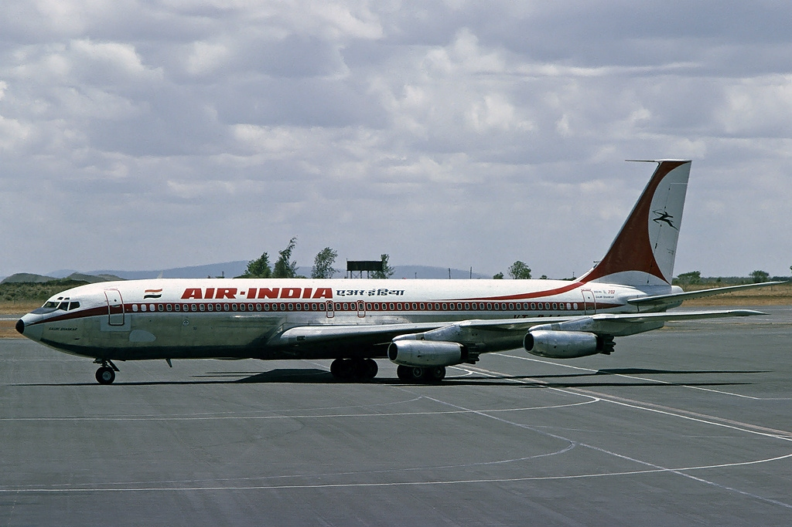

# ଏୟାର ଇଣ୍ଡିଆ

*ଏୟାର ଇଣ୍ଡିଆ*

| IATA AI ICAO AIC Callsign AIRINDIA | IATA AI | ICAO AIC | Callsign AIRINDIA |
| --- | --- | --- | --- |
| IATA AI | ICAO AIC | Callsign AIRINDIA |  |
| Founded | July 1932 (as Tata Airlines ) |  |  |
| Commenced operations | 15 ଅକ୍ଟୋବର 1932 ( 1932-10-15 ) ( ୯୨ ବର୍ଷ ପୂର୍ବରୁ) |  |  |
| Hubs | [ଛାତ୍ରପତି ଶିବାଜୀ ଅନ୍ତଜାତିକ ବିମାନ ବନ୍ଦର]] (ମୁମ୍ବାଇ) ଇନ୍ଦରା ଗାନ୍ଧୀ ଅନ୍ତର୍ଜାତୀୟ ବିମାନ ବନ୍ଦର (ଦିଲ୍ଲୀ) |  |  |
| Secondary hubs | ଚେନ୍ନାଇ ଅନ୍ତର୍ଜାତୀୟ ବିମାନ ବନ୍ଦର ନେତାଜୀ ସୁଭାଷ ଚନ୍ଦ୍ର ବୋଷ ଅନ୍ତର୍ଜାତୀୟ ବିମାନ ବନ୍ଦର (କଲିକତା) |  |  |
| Focus cities | Bengaluru International Airport (Bangalore) Trivandrum International Airport (Trivandrum) Cochin International Airport (Kochi) Rajiv Gandhi International Airport (Hyderabad) Sardar Vallabhbhai Patel International Airport (Ahmedabad) Dubai International Airport Hong Kong International Airport |  |  |
| Frequent-flyer program | Flying Returns |  |  |
| Airport lounge | Maharaja Lounge |  |  |
| Alliance | Star Alliance (ସ୍ଟାର ଆଲାଏନ୍ସ) [ ୧ ] |  |  |
| Subsidiaries | Air India Cargo Air India Express Air India Regional |  |  |
| Fleet size | 102 (+ 27 orders) |  |  |
| Destinations | 55 (excl. subsidiaries) |  |  |
| Company slogan | Truly Indian |  |  |
| Parent company | Air India Limited |  |  |
| Headquarters | Air India Building, Nariman Point , Mumbai , Maharashtra, India (moving to Delhi in 2013) [ ୨ ] |  |  |
| Key people | JRD Tata ( Founder ) |  |  |
| Website | http://airindia.in |  |  |

ଏୟାର ଇଣ୍ଡିଆ (Air India), ଭାରତର ଏକ ବିମାନସେବା । ଭାରତ ସରକାରଙ୍କ ଦ୍ୱାର ଚାଳିତ ଦୁଇ ବିମାନସେବା ମଧ୍ୟରୁ ଏହା ଅନ୍ୟତମ (ଅନ୍ୟଟି ଇଣ୍ଡିଆନ ଏୟାରଲାଇନ୍ସ । ୧୯୩୨ ଅକ୍ଟୋବର ୧୫ ତାରିଖରେ ଏୟାର ଇଣ୍ଡିଆର ବିମାନ ସେବା ଆରମ୍ଭ ହେଇଥିଲା । ସେତେବେଳେ ଏହାର ନାମ ଟାଟା ଏୟାରଲାଇନ୍ସ ରହିଥିଲା । ୧୯୩୨ ମସିହା ଜୁଲାଇ ମାସରେ ଏହା ପ୍ରତିଷ୍ଠା କରାଯାଇଥିଲା । [ ୩ ] [ ୪ ] ଏହାର କର୍ପୋରେଟ କାର୍ଯ୍ୟାଳୟ ଦକ୍ଷିଣ ବମ୍ବେର ନରିମାନ ପଇଣ୍ଟରେ ଅବସ୍ଥିତ । ଏହାର ଦୁଇଟି କେନ୍ଦ୍ରମଧ୍ୟ ରହିଛି । ଗୋଟିଏ ଇନ୍ଦିରା ଗାନ୍ଧୀ ଆନ୍ତର୍ଜାତୀୟ ବିମାନ ବନ୍ଦରରେ ରହିଥିବା ବେଳେ ଅନ୍ୟଟି ଛତ୍ରପତି ଶିବାଜୀ ଇଣ୍ଟରନ୍ୟାଶନାଲ ଟର୍ମିନାଲରେ ରହିଛି । ଏହି ଏୟାରଲାଇନ୍ସ ଉଭୟ ଏୟାରବସ ଓ ବୋଇଂ ବିମାନସେବା ଯୋଗାଉଛି । ବର୍ତ୍ତମାନ ଏହା ସମଗ୍ର ଏସିଆ , ୟୁରୋପ ଓ ଉତ୍ତର ଆମେରିକାକୁ ବିମାନସେବା ଯୋଗାଇବାରେ ସକ୍ଷମ ହୋଇଛି । ଭାରତୀୟ ଉପମହାଦେଶରେ ସର୍ବବୃହତ ଅପରେଟର ହୋଇଥିଲେ ମଧ୍ୟ ଏୟାର ଇଣ୍ଡିଆ ୪ର୍ଥ ସ୍ଥାନରେ ରହିଛି । ୨୦୧୪ରେ ଏୟାର ଇଣ୍ଡିଆ ବିଶ୍ୱର ସର୍ବବୃହତ୍ ବିମାନ ଆଲାଏନ୍ସ, ସ୍ଟାର ଆଲାଏନ୍ସର ସଭ୍ୟଭାବେ ଯୋଗ ଦେଇଛି [ ୫ ] ।

## ଇତିହାସ

### ଆରମ୍ଭ ବର୍ଷ(୧୯୩୨-୧୯୪୬)

*Tata Air Service*

ଏୟାର ଇଣ୍ଡିଆ ପ୍ରକୃତ ଟାଟା ସନ୍ସ , ଜେ.ଆର.ଡି. ଟାଟାTଙ୍କ ଦ୍ୱାରା୧୯୩୨ରେ ସ୍ଥାପିତ ହୋଇଥିଲା। [ ୬ ] ୧୫ ଅକ୍ଟୋବର,୧୯୩୨ରେ, ଟାଟା ସିଙ୍ଗଲ-ଇଞ୍ଜିନଦ୍ୱାରା De Havilland Puss Moth ଏୟାର ମେଲ କରାଚିଠୁ ବମ୍ବେଏବଂ ବିମାନ ପୁଣିଥରେ ମାଡ୍ରାସ ଉଡ଼ାଣ ଭିନସେଣ୍ଟଦ୍ୱାରା ହୋଇଥିଲା। [ ୭ ] ବିମାନର ପରିଚାଳନା Puss Moth aircraft ଏବଂ Leopard Mothଙ୍କ ତତ୍ତ୍ୱଧାନରେ ହୋଇଥିଲା। [ ୮ ] [ ୯ ] ସାପ୍ତାହିକ ଏୟାର ମେଲ କରାଚୀ ଏବଂ ମାଡ୍ରାସ via ଅହମ୍ମଦାବାଦ ଏବଂ ବମ୍ବେ ପ୍ରଥମ ବର୍ଷରେ,ବିମାନ ୧୬୦,୦୦୦ମାଇଲ ଯାତ୍ରା କରିଥିଲା, ୧୫୫ ଯାତ୍ରୀ ଯାତ୍ରା କରିଥିଲେ, ୧୦.୭୧ ଟନ ମେଲ ଏବଂ ଲାଭ୬୦,୦୦୦ଟଙ୍କା ହୋଇଥିଲା । [ ୧୦ ] [ ୧୧ ] ଏୟାର ଲାଇନ୍ସ ଘରୋଇ ବିମାନ ଉଡାଣ ବମ୍ବେ ଠୁ ଥିରୁଅନନ୍ତପୁମ୍ ୬ଟି ବସିବା ପାଇଁ ସିଟ୍ Miles Merlin . [ ୧୨ ] ୧୯୩୮ ମସିହାରେ, ଟାଟା ଏୟାର ସର୍ଭିସ ଏବଂ ପରେ ଟାଟା ଏୟାର ଲାଇନ୍ସ । ଦିଲ୍ଲୀ ଏବଂ କଲୋମ୍ବୋ ଯାତ୍ରା ପାଇଁ ୧୯୩୮ମସିହାରେ ଆରମ୍ଭ ହୋଇଥିଲା। [ ୭ ]

## ଇତିହାସ

### ସ୍ୱଧୀନତା ପରେ(୧୯୪୬-୨୦୦୦)

*Air India became the first Asian carrier to induct a jet aircraft with the ବୋଇଂ ୭୦୭-୪୨୦ ଗୌରୀ ଶଙ୍କର (registered VT-DJJ )*

## ଇତିହାସ

### ଶେଷ ବର୍ଷ(୨୦୦୦-)

*Air India Airbus A310-300 . ଏହା A୩୦୦s ତିନୋଟି ୨୦୦୯ରେ ବିକ୍ରି କରିଥିଲେ, ଋଣ ସୁଝିବା ପାଇଁ*

*In January 2013, Air India cleared some of its debts by selling and leasing back the newly acquired Boeing 787 Dreamliners . Also, the airline posted its first positive EBITDA after almost six years*

*Air India joined the Star Alliance in 2014. Pictured is Air India Boeing 787 Dreamliner ( VT-ANU ) in special star alliance livery.*

୨୦୦୦-୦୧ରେ ଏୟାର ଇଣ୍ଡିଆ ସରକାରୀକରଣରୁ ଘରୋଇକରଣ ହେଲା। [ ୧୩ ] [ ୧୪ ] [ ୧୫ ] [ ୧୬ ] ୨୦୦୦ରେ ଏୟାର ଇଣ୍ଡିଆ ସଂଘାଇ , ଚୀନକୁ ବିମାନ ସେବା ଆରମ୍ଭ କରିଥିଲେ।ମନ୍ତ୍ରୀଙ୍କ ଅନୁସାରେ ଏୟାର ଲାଇନ୍ସ କ୍ଷତି ପାଖାପାଖି ୫୭୦ million ( US$୧୨ .୬୫ million) କାରଣ ଅଧିକ ଅତ୍ୟଧିକ କମିଶନ Mascarenhas sanctioned ଏବଂ ସେ ପରେ ସସପେଣ୍ଡ ହାଇଥଲେ ଏୟାରଲାଇନ୍ସ ରୁ। [ ୧୭ ] ୨୦୦୪,ମେରେ ଏୟାର ଇଣ୍ଡିଆ ନିଜସ୍ୱ କମ ପଇସା subsidiary ତାହାକୁ ଏୟାର ଇଣ୍ଡିଆ ଏକ୍ସପ୍ରେସକୁହାଯାଏ , ତାହା ଭାରତ ସହିତ ପୂର୍ବ ଓ ଦକ୍ଷିଣ-ପୂର୍ବ ଏସିଆ ରବିଭିନ୍ନ ସହରକୁ ସଂଯୋଗ କରୁଚି।୨୦୦୭ରେ ଏୟାର ଇଣ୍ଡିଆ ଅନ୍ତର୍ଜାତିକ ଦୂର ଯାତ୍ରା ପାଇଁ ବିମାନ ଚଳାଚଳର ମୁଖ୍ୟ କାର୍ଯ୍ୟରେ ନିୟୋଜିତ ହେଲା, ସେତେବେଳେ ଇଣ୍ଡିଆନ ଏୟାର ଲାଇନ୍ସ କମ ଦୂରତା ଆନ୍ତର୍ଜାତିକ ଓ ଘରୋଇ ବିମାନ ଚଳାଚଳ ହେଲା।୨୦୦୭ରେ ଏୟାର ଇଣ୍ଡିଆ ଓ ଇଣ୍ଡିଆନ ଏୟାର ଲାଇନ୍ ଏୟାର ଇଣ୍ଡିଆ ଲିମିଟେଡ଼ବିଲୀନ ହେଲା। [ ୧୮ ] ଷ୍ଟାର ଆଲ୍ଲୀଆନ୍ସ A ୨୦୦୭ରେ ଆମନ୍ତ୍ରଣ କରିଥିଲା ତା ସହ ସାମିଲ ହବା ପାଇଁ। [ ୧୯ ] ଦୁଇଟି ଯାକ ଏୟାର ଇଣ୍ଡିଆ ଓ ଇଣ୍ଡିଆନ ଏୟାରଲାଇନ୍ସ ୨୦୦୬-୦୭ 7.7 billion ( US$୧୭୦ .୯୪ million) ରେ କ୍ଷତି ସହିଥିଲା,ଏବଂ ବିଲୀନ ହେବା ପରେ,ଫୁଣିଥରେ ୭୨ billion ( US$୧ .୬ billion) ୨୦୦୯ ମାର୍ଚ୍ଚରେ ଆରମ୍ଭ ହେଲା। [ ୨୦ ] [ ୨୧ ] ୨୦୦୯ ଜୁଲାଇ, ଭାରତୀୟ ଷ୍ଟେଟ ବ୍ୟାଙ୍କ ନିଯୁକ୍ତି କରାଯାଇ ଥିଲା କି ଗୋଟେ ନକ୍ସା ତିଆରି କରିବା ପାଇଁ କିପରି ଏୟାର ଲାଇନ୍ସ ପୁନଃଲାଭ କରିପାରିବ। [ ୨୨ ] ଏୟାର ଲାଇନ୍ସ ୩ଟି ବିକ୍ରି କରିଥିଲା ମାର୍ଚ୍ଚ୨୦୦୯ରେ ଏୟାରବସA୩୦୦ ଏବଂ ଗୋଟେ ବୋଇଂ ୭୪୭ -୩୦୦ $୧୮.୭୫ ମିଲିୟନ ଋଣ ସୁଝିବା ପାଇଁ। [ ୨୩ ] ମାର୍ଚ୍ଚ୨୦୧୧ରେ ନିଜ ସଞ୍ଚିତ ଧନ ରାଶିରୁ ୪୨୫.୭ billion ( US$୯ .୪୫ billion) ଋଣ ପରିଶୋଧ କରିବା ପାଇଁ ଏବଂ ଚଳାଇବା ପାଇଁ ୨୨୦ billion ( US$୪ .୮୮ billion) ।

## ଆଇନି ଅନୁସାରେ ସଂଘବଦ୍ଧ ଓ ଚିହ୍ନଟ

.

## ଆଇନି ଅନୁସାରେ ସଂଘବଦ୍ଧ ଓ ଚିହ୍ନଟ

### ମୁଖ୍ୟ କାର୍ଯ୍ୟାଳୟ

ଏୟାର ଇଣ୍ଡିଆ ଲିମିଟେଡ଼ର ମୁଖ୍ୟ କାର୍ଯ୍ୟାଳୟ ଇଣ୍ଡିଆନ ଏୟାର ଲାଇନ୍ସ ହାଉସ, ନୂଆଦିଲ୍ଲୀରେ ଅବସ୍ଥିତ। [ ୨୪ ] ଏୟାର ଇଣ୍ଡିଆର ମୁଖ୍ୟ କାର୍ଯ୍ୟାଳୟ ଏୟାର ଇଣ୍ଡିଆ ବିଲ୍ଡିଂଙ୍ଗ , ମୁମ୍ବାଇ ଠୁ ଦିଲ୍ଲୀକୁ ୨୦୧୩ରେ ସ୍ଥାପିତ କରାଗଲା। ମୁଖ୍ୟ କାର୍ଯ୍ୟାଳୟ ୨୩ ମହଲା ବିଲ୍ଡିଂଙ୍ଗ ସମୁଦ୍ର ପାଖ ରାସ୍ତା,ମୁମ୍ବାଇ ଏବଂ ୧୯୯୩ ବମ୍ବେ ବୋମିଙ୍ଗ ର ଟାର୍ଗେଟରେ ଥିଲା। [ ୨୫ ] [ ୨୬ ]

## ଆଇନି ଅନୁସାରେ ସଂଘବଦ୍ଧ ଓ ଚିହ୍ନଟ

### ଅଧୀନସ୍ତ

Current

- ଏୟାର ଇଣ୍ଡିଆ ରିଜୋନାଲ (formerly Alliance Air )
- ଏୟାର ଇଣ୍ଡିଆ ଏକ୍ସପ୍ରେସ

## ଆଇନି ଅନୁସାରେ ସଂଘବଦ୍ଧ ଓ ଚିହ୍ନଟ

### Defunct

- ଏୟାର ଇଣ୍ଡିଆ କାରଗୋ

ଏୟାର ଇଣ୍ଡିଆ ବିମାନ ଏସିଆର ପ୍ରଥମ ମାଲ ପରିବହନ କାର୍ଯ୍ୟ କରୁଥିଲା,ଯେତେବେଳେ ଏୟାର ଇଣ୍ଡିଆ କାରଗୋ ୧୯୫୪ରେ ମାଲ ପରିବହନ କାର୍ଯ୍ୟ ଆରମ୍ଭ କଲା, ବିମାନ ହେଉଚି Douglas DC-3 [ ୨୭ ] Air ଏୟାର ଇଣ୍ଡିଆ କାରଗୋ ମାଲ ପରିବହନ କାର୍ଯ୍ୟ ୨୦୧୨ ମସିହାରେ ବନ୍ଦ କରିଦେଲା। [ ୨୮ ]

## ଆଇନି ଅନୁସାରେ ସଂଘବଦ୍ଧ ଓ ଚିହ୍ନଟ

### Mascot

ଏୟାର ଇଣ୍ଡିଆର ଶୁଭ ଚିହ୍ନ ମହାରାଜା ( ସମ୍ରାଟ ). ଏୟାର ଇଣ୍ଡିଆର ନିର୍ଦ୍ଦେଶକ ବୋବି କୋକ,ଏବଂ ଉମେଶ ରାଓ ,ଜେ.ୱାଲେଟର ଲଟିଡ଼ ଚିତ୍ରକର,ଏହାକୁ ବନେଇଥିଲେ। [ ୨୯ ] କୋକା କହିଥିଲେ କି,"ଆମ୍ଭେମାନେ ଏହାକୁ ମହାରାଜା କହିପାରିବା କେବେଳ ଭଲ ବର୍ଣ୍ଣନା କରିବା ପାଇଁ।କିନ୍ତୁ ଏହା ରକ୍ତ ନୀଳ ନୁହେଁ।ସେ ଦେଖିବାକୁ ରାଜଭୋଗ ପରି,କିନ୍ତୁ ଏହା ରାଜକୀୟ ନୁହେଁ"। [ ୩୦ ] ଏୟାର ଇଣ୍ଡିଆ ମହାରାଜା ଶୁଭଚିହ୍ନ୧୯୪୬ରେ ଗ୍ରହଣ /ପସନ୍ଦ କରିଥିଲେ। ଏହାକୁ ପ୍ରୋତ୍ସାହନ ପାଇଁ ଏୟାର ଲାଇନ୍ସ ସ୍ମାରକ ଗଦି ତିଆରି କରିଥିଲେ। [ ୩୧ ] ମହାରାଜା ୨୦୧୫ରେ ପରିବର୍ତ୍ତନ ହୋଇ ଏବଂ ନୂଆ ମାର୍କ ନୂତନ ରୂପେ ପଯ୍ୟବେଶିବତ ହୋଇଛି। [ ୩୨ ]

## ଆଇନି ଅନୁସାରେ ସଂଘବଦ୍ଧ ଓ ଚିହ୍ନଟ

### ପ୍ରତୀକ ଓ ସେବା ପୋଷକ

ଏୟାର ଇଣ୍ଡିଆର ରଙ୍ଗ ନାଲି, ଧଳା।ବିମାନରେ ରଙ୍ଗ ଧଳା ତା ସହ ନାଲି ବାହାର ଝରକା ପାଖରେ ଦିଆଯାଇଥାଏ, ଏବଂ ଏୟାର ଲାଇନ୍ସର ନାମ ନାଲି ରଙ୍ଗରେ ଲେଖାଯାଏ ।ନାମ ଗୋଟେ ପଟେ ହିନ୍ଦୀ ଆଉ ଗୋଟେ ପଟେ ଇଂରାଜୀ ଓ ଅନ୍ୟ ପଟେ ସ୍ଲୋଗାନ ଅଙ୍କା ଯାଇଛି Your Palace in the Sky । [ ୩୩ ] ଲୋଗୋ ୧୯୪୮ ମସିହାରେ ଜେ.ଆର.ଡି. ଟାଟାଙ୍କଦ୍ୱାରା ନିରୂପଣରେ ଏବଂ ନୂତନ ରୂପେ ୨୦୦୭ରେ ଏୟାର ଲାଇନ୍ସ ସ୍ଥାପିତ ହୋଇଥିଲା। [ ୩୪ ] The flying swan was morphed from the centaur logo and the chakra was derived from Indian 's erstwhile logo. [ ୩୫ ] ନୂଆ ଲୋଗୋ ବିମାନର ପଛଭାଗରେ ଏବଂ ଇଞ୍ଜିନର ଘରେ ଲଗା ଯାଇଛି ।ଗୋଟେ ନାଲି ଓ କମଳା ରଙ୍ଗର ଗାର ସମାନ୍ତରଭାବେ ଦୁଇଟି ଗାର ମୁଖ୍ୟ ଦ୍ୱାର ଠୁ ପଛ ଦ୍ୱାର ପର୍ଯ୍ୟନ୍ତ ଲମ୍ବିଚି। [ ୨୯ ]

## ଲକ୍ଷ୍ୟସ୍ଥଳ

ଏୟାର ଇଣ୍ଡିଆ ଫାଇଲସ୍ ମୋଟ ୮୪ଟି ଗନ୍ତବ୍ୟ ସ୍ଥଳ, ସେଥିମଧ୍ୟରୁ୪୮ଟି ଘରୋଇ,୩୬ ଟା ଅନ୍ତର୍ଜାତୀୟ ୨୪ଟି ଦେଶ ମଧ୍ୟରେ । [ ୩୬ ] ଏୟାର ଇଣ୍ଡିଆର ପ୍ରଥମ ମୁଖ୍ୟ ଘରୋଇ ଗନ୍ତବ୍ୟ ସ୍ଥଳ ହେଲା ଇନ୍ଦିରା ଗାନ୍ଧୀ ଅନ୍ତର୍ଜାତୀୟ ବିମାନ ବନ୍ଦର, ନୂଆ ଦିଲ୍ଲୀ ଏବଂ ଛତ୍ରପତି ଶିବାଜୀ ଅନ୍ତର୍ଜାତୀୟ ବିମାନ ବନ୍ଦର, ମୁମ୍ବାଇ ଏବଂ ଦ୍ୱତୀୟ ମୁଖ୍ୟ ଘରୋଇ ଗନ୍ତବ୍ୟ ସ୍ଥଳ ହେଲା ନେତାଜୀ ସୁବାଷ ଚନ୍ଦ୍ର ବୋଷ ଅନ୍ତର୍ଜାତୀୟ ବିମାନ ବନ୍ଦର, କୋଲକାତା ଏବଂ ଚେନ୍ନାଇ ଅନ୍ତର୍ଜାତୀୟ ବିମାନ ବନ୍ଦର । [ ୩୭ ] [ ୩୮ ] ଏୟାରଲାଇନ୍ସ ଯୋଜନା କରିଚି କି, ସେ ଦକ୍ଷିଣ ଆମେରିକା ଓ ଆଫ୍ରିକାକୁ ବିମାନ ଚଳାଚଳର ସୁବିଧା ଯୋଗାଇବ। [ ୩୯ ] ଏୟାରଲାଇନ୍ସ ଯୋଜନା କରୁଛି କି ,ଉତ୍ତର ଆମେରିକା ଏବଂ ୟୁରୋପକୁ ସିଧା ସଳଖ ବିମାନ ଚଳାଚଳ କରିବା ପାଇଁ ୱସିଙ୍ଗଟନ, D.C. , ହାଉଷ୍ଟନ ଏବଂ ଷ୍ଟକହୋଲମ ୨୦୧୬ ମସିହାରେ । [ ୪୦ ] [ ୪୧ ]

## ଲକ୍ଷ୍ୟସ୍ଥଳ

### code-sharing ଚୁକ୍ତି

୧୧ଜୁଲାଇ ୨୦୧୪ରେ ଷ୍ଟାର ଆଲିଆନ୍ସ ଏୟାର ଇଣ୍ଡିଆ ୨୭ତମ ପ୍ରତିନିଧି ହେଲା। [ ୪୨ ] [ ୪୩ ] ଏୟାର ଇଣ୍ଡିଆ ନିମ୍ନ ଦେଶରେ ବିମାନ ଚଳାଚଳ ପାଇଁ code-sharing ଚୁକ୍ତି କରିଛି : [ ୪୪ ]

- ଆଦ୍ରିଆ ଏୟାରୱେଜ
- ଏୟାର ଆସ୍ଥାନା
- ଏୟାର କାନାଡା
- ଏୟାର ମୌରିଟିଉସ
- ଏୟାର ନିଉଜଲାଣ୍ଡ [ ୪୫ ]
- ଏସିଆନ ଏୟାରଲାଇନ୍ସ
- ଅଷ୍ଟ୍ରେରିୟାନ ଏୟାରଲାଇନ୍ସ
- ଅବିଆଙ୍କା [ ୪୬ ]
- ଇଜିପ୍ଟ
- ଇଥିଓପିଆନ ଏୟାରଲାଇନ୍ସ
- ହଙ୍ଗ କଙ୍ଗ ଏୟାରଲାଇନ୍ସ
- କ୍ୱିତି ଏୟାରୱେଜ
- ଲୁଫ୍ଥାନ୍ସ
- ସିଙ୍ଗାପୁର ଏୟାରଲାଇନ୍ସ
- ଶ୍ରୀଲଙ୍କା ଏୟାରଲାଇନ୍ସ
- ସ୍ୱିସ ଇଣ୍ଟରନ୍ୟାସନାଲ ଏୟାର ଲାଇନ୍ସ
- ତୁର୍କୀଶ ଏୟାରଲାଇନ୍ସ
- ଉଜବେକିସ୍ତାନ ଏୟାରୱେଜ

## ଦ୍ରୁତଗାମୀ

### ସାମ୍ପ୍ରତିକ

*The Boeing 777-200LR used on long and ultra long-haul routes*

As of ଅଗଷ୍ଟ ୨୦୨୫, the Air India fleet consists of the following aircraft (including leased aircraft and excluding subsidiaries): [ ୪୭ ] [ ୪୮ ] [ ୪୯ ]

୪ଅଗଷ୍ଟ ୧୯୯୩ରେ ଏୟାରଇଣ୍ଡିଆର ବୋଇଂ୭୪୭-୪୦୦ VT-ESM ଏବଂ ତା ନାମ କୋଣାର୍କ ପ୍ରଥମେ ଉଡାଣଭରି ଥିଲା। [ ୫୫ ] ଏୟାର ଲାଇନ୍ସର ପ୍ରଥମ ବୋଇଂ୭୭୭-୨୦୦LR ବିମାନ ୨୬ ଜୁଲାଇ୨୦୦୭ରେ ଉଡାଣଭରି ଥିଲା ।ଏହି ବିମାନନାମ ଭାରତ ଦେଶର ରାଜ୍ୟ ନାମ ଅନୁସାରେ ରଖା ଯାଇଥିଲା ତା ନାମ "ଆନ୍ଧ୍ର ପ୍ରଦେଶ"। [ ୫୬ ] ଏୟାର ଇଣ୍ଡିଆ ର୭୭୭-୩୦୦ER ବିମାନ ସେହି ବର୍ଷ୯ଅକ୍ଟୋବରରେ ଉଡାଣ ଭାରି ଥିଲା।ତା ନାମ "ବିହାର"। [ ୫୭ ] ଏୟାର ଇଣ୍ଡିଆର ପ୍ରଥମ ବୋଇଂ୭୮୭ ବିମାନ ୬ସେପ୍ଟେମ୍ବର ୨୦୧୨ରେ ଉଡାଣଭରି ଥିଲା। [ ୫୮ ] ଏବଂ କମାଣ୍ଡ ବିମାନ ୧୯ ସେପ୍ଟେମ୍ବର ୨୦୧୨ରେ। [ ୫୯ ]

*An Air India Boeing 747-400 aircraft used as Air India One*

## ଦ୍ରୁତଗାମୀ

### ବିମାନ ଚଳାଚଳ

*Boeing 707 in 1976*

*Air India Lockheed Super Constellation at Prague Ruzyně Airport in 1961*

*Air India Douglas DC-3 at London Heathrow Airport in 1958*

*Aircraft operated by Air India (1970–1999) [ ୬୦ ] [ ୬୧ ]*

| Aircraft operated by Air India (1970–1999) [ ୬୦ ] [ ୬୧ ] Aircraft Total Operated Introduced Retired Airbus A300-100 1 1994 1994 Airbus A300-200 4 1982 2002 Airbus A310-300 29 1986 2012 Airbus A320-200 32 1989 Active Boeing 747-200 14 1971 2003 Boeing 747-300 3 1988 2008 Boeing 747-400 14 1993 Active Douglas DC-8-60F 11 1977 1986 Douglas DC-8-70F 4 1983 1995 Ilyushin Il-62M 1 1989 1990 Lockheed L-1011 TriStar 1 1995 1996 Boeing 707-337B 4 1962-1964 1987-1989 Boeing 707-337C 4 1964-1966 1989-1990 Boeing 707-437 6 1966-1970,1972 1990-2002,2005 Aircraft operated by Air India (2000–present) [ ୬୦ ] Aircraft Total Operated Introduced Retired Airbus A319-100 24 2005 Active Airbus A321-200 20 2007 Active Airbus A330-200 2 2007 2014 Boeing 737-200 5 2007 2011 Boeing 757-200 1 2007 2007 Boeing 767-300 3 2006 2008 Boeing 777-200 1 2006 2010 Boeing 777-200ER 3 2005 2011 Boeing 777-200LR 3 (5 sold) 2007 Active Boeing 777-300ER 12 2007 Active Boeing 787-8 21 2012 Active | Aircraft | Total Operated | Introduced | Retired | Airbus A300-100 | 1 | 1994 | 1994 | Airbus A300-200 | 4 | 1982 | 2002 | Airbus A310-300 | 29 | 1986 | 2012 | Airbus A320-200 | 32 | 1989 | Active | Boeing 747-200 | 14 | 1971 | 2003 | Boeing 747-300 | 3 | 1988 | 2008 | Boeing 747-400 | 14 | 1993 | Active | Douglas DC-8-60F | 11 | 1977 | 1986 | Douglas DC-8-70F | 4 | 1983 | 1995 | Ilyushin Il-62M | 1 | 1989 | 1990 | Lockheed L-1011 TriStar | 1 | 1995 | 1996 | Boeing 707-337B | 4 | 1962-1964 | 1987-1989 | Boeing 707-337C | 4 | 1964-1966 | 1989-1990 | Boeing 707-437 | 6 | 1966-1970,1972 | 1990-2002,2005 | Aircraft | Total Operated | Introduced | Retired | Airbus A319-100 | 24 | 2005 | Active | Airbus A321-200 | 20 | 2007 | Active | Airbus A330-200 | 2 | 2007 | 2014 | Boeing 737-200 | 5 | 2007 | 2011 | Boeing 757-200 | 1 | 2007 | 2007 | Boeing 767-300 | 3 | 2006 | 2008 | Boeing 777-200 | 1 | 2006 | 2010 | Boeing 777-200ER | 3 | 2005 | 2011 | Boeing 777-200LR | 3 (5 sold) | 2007 | Active | Boeing 777-300ER | 12 | 2007 | Active | Boeing 787-8 | 21 | 2012 | Active |
| --- | --- | --- | --- | --- | --- | --- | --- | --- | --- | --- | --- | --- | --- | --- | --- | --- | --- | --- | --- | --- | --- | --- | --- | --- | --- | --- | --- | --- | --- | --- | --- | --- | --- | --- | --- | --- | --- | --- | --- | --- | --- | --- | --- | --- | --- | --- | --- | --- | --- | --- | --- | --- | --- | --- | --- | --- | --- | --- | --- | --- | --- | --- | --- | --- | --- | --- | --- | --- | --- | --- | --- | --- | --- | --- | --- | --- | --- | --- | --- | --- | --- | --- | --- | --- | --- | --- | --- | --- | --- | --- | --- | --- | --- | --- | --- | --- | --- | --- | --- | --- | --- | --- | --- | --- | --- | --- | --- | --- |
| Aircraft | Total Operated | Introduced | Retired |  |  |  |  |  |  |  |  |  |  |  |  |  |  |  |  |  |  |  |  |  |  |  |  |  |  |  |  |  |  |  |  |  |  |  |  |  |  |  |  |  |  |  |  |  |  |  |  |  |  |  |  |  |  |  |  |  |  |  |  |  |  |  |  |  |  |  |  |  |  |  |  |  |  |  |  |  |  |  |  |  |  |  |  |  |  |  |  |  |  |  |  |  |  |  |  |  |  |  |  |  |  |  |  |  |
| Airbus A300-100 | 1 | 1994 | 1994 |  |  |  |  |  |  |  |  |  |  |  |  |  |  |  |  |  |  |  |  |  |  |  |  |  |  |  |  |  |  |  |  |  |  |  |  |  |  |  |  |  |  |  |  |  |  |  |  |  |  |  |  |  |  |  |  |  |  |  |  |  |  |  |  |  |  |  |  |  |  |  |  |  |  |  |  |  |  |  |  |  |  |  |  |  |  |  |  |  |  |  |  |  |  |  |  |  |  |  |  |  |  |  |  |  |
| Airbus A300-200 | 4 | 1982 | 2002 |  |  |  |  |  |  |  |  |  |  |  |  |  |  |  |  |  |  |  |  |  |  |  |  |  |  |  |  |  |  |  |  |  |  |  |  |  |  |  |  |  |  |  |  |  |  |  |  |  |  |  |  |  |  |  |  |  |  |  |  |  |  |  |  |  |  |  |  |  |  |  |  |  |  |  |  |  |  |  |  |  |  |  |  |  |  |  |  |  |  |  |  |  |  |  |  |  |  |  |  |  |  |  |  |  |
| Airbus A310-300 | 29 | 1986 | 2012 |  |  |  |  |  |  |  |  |  |  |  |  |  |  |  |  |  |  |  |  |  |  |  |  |  |  |  |  |  |  |  |  |  |  |  |  |  |  |  |  |  |  |  |  |  |  |  |  |  |  |  |  |  |  |  |  |  |  |  |  |  |  |  |  |  |  |  |  |  |  |  |  |  |  |  |  |  |  |  |  |  |  |  |  |  |  |  |  |  |  |  |  |  |  |  |  |  |  |  |  |  |  |  |  |  |
| Airbus A320-200 | 32 | 1989 | Active |  |  |  |  |  |  |  |  |  |  |  |  |  |  |  |  |  |  |  |  |  |  |  |  |  |  |  |  |  |  |  |  |  |  |  |  |  |  |  |  |  |  |  |  |  |  |  |  |  |  |  |  |  |  |  |  |  |  |  |  |  |  |  |  |  |  |  |  |  |  |  |  |  |  |  |  |  |  |  |  |  |  |  |  |  |  |  |  |  |  |  |  |  |  |  |  |  |  |  |  |  |  |  |  |  |
| Boeing 747-200 | 14 | 1971 | 2003 |  |  |  |  |  |  |  |  |  |  |  |  |  |  |  |  |  |  |  |  |  |  |  |  |  |  |  |  |  |  |  |  |  |  |  |  |  |  |  |  |  |  |  |  |  |  |  |  |  |  |  |  |  |  |  |  |  |  |  |  |  |  |  |  |  |  |  |  |  |  |  |  |  |  |  |  |  |  |  |  |  |  |  |  |  |  |  |  |  |  |  |  |  |  |  |  |  |  |  |  |  |  |  |  |  |
| Boeing 747-300 | 3 | 1988 | 2008 |  |  |  |  |  |  |  |  |  |  |  |  |  |  |  |  |  |  |  |  |  |  |  |  |  |  |  |  |  |  |  |  |  |  |  |  |  |  |  |  |  |  |  |  |  |  |  |  |  |  |  |  |  |  |  |  |  |  |  |  |  |  |  |  |  |  |  |  |  |  |  |  |  |  |  |  |  |  |  |  |  |  |  |  |  |  |  |  |  |  |  |  |  |  |  |  |  |  |  |  |  |  |  |  |  |
| Boeing 747-400 | 14 | 1993 | Active |  |  |  |  |  |  |  |  |  |  |  |  |  |  |  |  |  |  |  |  |  |  |  |  |  |  |  |  |  |  |  |  |  |  |  |  |  |  |  |  |  |  |  |  |  |  |  |  |  |  |  |  |  |  |  |  |  |  |  |  |  |  |  |  |  |  |  |  |  |  |  |  |  |  |  |  |  |  |  |  |  |  |  |  |  |  |  |  |  |  |  |  |  |  |  |  |  |  |  |  |  |  |  |  |  |
| Douglas DC-8-60F | 11 | 1977 | 1986 |  |  |  |  |  |  |  |  |  |  |  |  |  |  |  |  |  |  |  |  |  |  |  |  |  |  |  |  |  |  |  |  |  |  |  |  |  |  |  |  |  |  |  |  |  |  |  |  |  |  |  |  |  |  |  |  |  |  |  |  |  |  |  |  |  |  |  |  |  |  |  |  |  |  |  |  |  |  |  |  |  |  |  |  |  |  |  |  |  |  |  |  |  |  |  |  |  |  |  |  |  |  |  |  |  |
| Douglas DC-8-70F | 4 | 1983 | 1995 |  |  |  |  |  |  |  |  |  |  |  |  |  |  |  |  |  |  |  |  |  |  |  |  |  |  |  |  |  |  |  |  |  |  |  |  |  |  |  |  |  |  |  |  |  |  |  |  |  |  |  |  |  |  |  |  |  |  |  |  |  |  |  |  |  |  |  |  |  |  |  |  |  |  |  |  |  |  |  |  |  |  |  |  |  |  |  |  |  |  |  |  |  |  |  |  |  |  |  |  |  |  |  |  |  |
| Ilyushin Il-62M | 1 | 1989 | 1990 |  |  |  |  |  |  |  |  |  |  |  |  |  |  |  |  |  |  |  |  |  |  |  |  |  |  |  |  |  |  |  |  |  |  |  |  |  |  |  |  |  |  |  |  |  |  |  |  |  |  |  |  |  |  |  |  |  |  |  |  |  |  |  |  |  |  |  |  |  |  |  |  |  |  |  |  |  |  |  |  |  |  |  |  |  |  |  |  |  |  |  |  |  |  |  |  |  |  |  |  |  |  |  |  |  |
| Lockheed L-1011 TriStar | 1 | 1995 | 1996 |  |  |  |  |  |  |  |  |  |  |  |  |  |  |  |  |  |  |  |  |  |  |  |  |  |  |  |  |  |  |  |  |  |  |  |  |  |  |  |  |  |  |  |  |  |  |  |  |  |  |  |  |  |  |  |  |  |  |  |  |  |  |  |  |  |  |  |  |  |  |  |  |  |  |  |  |  |  |  |  |  |  |  |  |  |  |  |  |  |  |  |  |  |  |  |  |  |  |  |  |  |  |  |  |  |
| Boeing 707-337B | 4 | 1962-1964 | 1987-1989 |  |  |  |  |  |  |  |  |  |  |  |  |  |  |  |  |  |  |  |  |  |  |  |  |  |  |  |  |  |  |  |  |  |  |  |  |  |  |  |  |  |  |  |  |  |  |  |  |  |  |  |  |  |  |  |  |  |  |  |  |  |  |  |  |  |  |  |  |  |  |  |  |  |  |  |  |  |  |  |  |  |  |  |  |  |  |  |  |  |  |  |  |  |  |  |  |  |  |  |  |  |  |  |  |  |
| Boeing 707-337C | 4 | 1964-1966 | 1989-1990 |  |  |  |  |  |  |  |  |  |  |  |  |  |  |  |  |  |  |  |  |  |  |  |  |  |  |  |  |  |  |  |  |  |  |  |  |  |  |  |  |  |  |  |  |  |  |  |  |  |  |  |  |  |  |  |  |  |  |  |  |  |  |  |  |  |  |  |  |  |  |  |  |  |  |  |  |  |  |  |  |  |  |  |  |  |  |  |  |  |  |  |  |  |  |  |  |  |  |  |  |  |  |  |  |  |
| Boeing 707-437 | 6 | 1966-1970,1972 | 1990-2002,2005 |  |  |  |  |  |  |  |  |  |  |  |  |  |  |  |  |  |  |  |  |  |  |  |  |  |  |  |  |  |  |  |  |  |  |  |  |  |  |  |  |  |  |  |  |  |  |  |  |  |  |  |  |  |  |  |  |  |  |  |  |  |  |  |  |  |  |  |  |  |  |  |  |  |  |  |  |  |  |  |  |  |  |  |  |  |  |  |  |  |  |  |  |  |  |  |  |  |  |  |  |  |  |  |  |  |
| Aircraft | Total Operated | Introduced | Retired |  |  |  |  |  |  |  |  |  |  |  |  |  |  |  |  |  |  |  |  |  |  |  |  |  |  |  |  |  |  |  |  |  |  |  |  |  |  |  |  |  |  |  |  |  |  |  |  |  |  |  |  |  |  |  |  |  |  |  |  |  |  |  |  |  |  |  |  |  |  |  |  |  |  |  |  |  |  |  |  |  |  |  |  |  |  |  |  |  |  |  |  |  |  |  |  |  |  |  |  |  |  |  |  |  |
| Airbus A319-100 | 24 | 2005 | Active |  |  |  |  |  |  |  |  |  |  |  |  |  |  |  |  |  |  |  |  |  |  |  |  |  |  |  |  |  |  |  |  |  |  |  |  |  |  |  |  |  |  |  |  |  |  |  |  |  |  |  |  |  |  |  |  |  |  |  |  |  |  |  |  |  |  |  |  |  |  |  |  |  |  |  |  |  |  |  |  |  |  |  |  |  |  |  |  |  |  |  |  |  |  |  |  |  |  |  |  |  |  |  |  |  |
| Airbus A321-200 | 20 | 2007 | Active |  |  |  |  |  |  |  |  |  |  |  |  |  |  |  |  |  |  |  |  |  |  |  |  |  |  |  |  |  |  |  |  |  |  |  |  |  |  |  |  |  |  |  |  |  |  |  |  |  |  |  |  |  |  |  |  |  |  |  |  |  |  |  |  |  |  |  |  |  |  |  |  |  |  |  |  |  |  |  |  |  |  |  |  |  |  |  |  |  |  |  |  |  |  |  |  |  |  |  |  |  |  |  |  |  |
| Airbus A330-200 | 2 | 2007 | 2014 |  |  |  |  |  |  |  |  |  |  |  |  |  |  |  |  |  |  |  |  |  |  |  |  |  |  |  |  |  |  |  |  |  |  |  |  |  |  |  |  |  |  |  |  |  |  |  |  |  |  |  |  |  |  |  |  |  |  |  |  |  |  |  |  |  |  |  |  |  |  |  |  |  |  |  |  |  |  |  |  |  |  |  |  |  |  |  |  |  |  |  |  |  |  |  |  |  |  |  |  |  |  |  |  |  |
| Boeing 737-200 | 5 | 2007 | 2011 |  |  |  |  |  |  |  |  |  |  |  |  |  |  |  |  |  |  |  |  |  |  |  |  |  |  |  |  |  |  |  |  |  |  |  |  |  |  |  |  |  |  |  |  |  |  |  |  |  |  |  |  |  |  |  |  |  |  |  |  |  |  |  |  |  |  |  |  |  |  |  |  |  |  |  |  |  |  |  |  |  |  |  |  |  |  |  |  |  |  |  |  |  |  |  |  |  |  |  |  |  |  |  |  |  |
| Boeing 757-200 | 1 | 2007 | 2007 |  |  |  |  |  |  |  |  |  |  |  |  |  |  |  |  |  |  |  |  |  |  |  |  |  |  |  |  |  |  |  |  |  |  |  |  |  |  |  |  |  |  |  |  |  |  |  |  |  |  |  |  |  |  |  |  |  |  |  |  |  |  |  |  |  |  |  |  |  |  |  |  |  |  |  |  |  |  |  |  |  |  |  |  |  |  |  |  |  |  |  |  |  |  |  |  |  |  |  |  |  |  |  |  |  |
| Boeing 767-300 | 3 | 2006 | 2008 |  |  |  |  |  |  |  |  |  |  |  |  |  |  |  |  |  |  |  |  |  |  |  |  |  |  |  |  |  |  |  |  |  |  |  |  |  |  |  |  |  |  |  |  |  |  |  |  |  |  |  |  |  |  |  |  |  |  |  |  |  |  |  |  |  |  |  |  |  |  |  |  |  |  |  |  |  |  |  |  |  |  |  |  |  |  |  |  |  |  |  |  |  |  |  |  |  |  |  |  |  |  |  |  |  |
| Boeing 777-200 | 1 | 2006 | 2010 |  |  |  |  |  |  |  |  |  |  |  |  |  |  |  |  |  |  |  |  |  |  |  |  |  |  |  |  |  |  |  |  |  |  |  |  |  |  |  |  |  |  |  |  |  |  |  |  |  |  |  |  |  |  |  |  |  |  |  |  |  |  |  |  |  |  |  |  |  |  |  |  |  |  |  |  |  |  |  |  |  |  |  |  |  |  |  |  |  |  |  |  |  |  |  |  |  |  |  |  |  |  |  |  |  |
| Boeing 777-200ER | 3 | 2005 | 2011 |  |  |  |  |  |  |  |  |  |  |  |  |  |  |  |  |  |  |  |  |  |  |  |  |  |  |  |  |  |  |  |  |  |  |  |  |  |  |  |  |  |  |  |  |  |  |  |  |  |  |  |  |  |  |  |  |  |  |  |  |  |  |  |  |  |  |  |  |  |  |  |  |  |  |  |  |  |  |  |  |  |  |  |  |  |  |  |  |  |  |  |  |  |  |  |  |  |  |  |  |  |  |  |  |  |
| Boeing 777-200LR | 3 (5 sold) | 2007 | Active |  |  |  |  |  |  |  |  |  |  |  |  |  |  |  |  |  |  |  |  |  |  |  |  |  |  |  |  |  |  |  |  |  |  |  |  |  |  |  |  |  |  |  |  |  |  |  |  |  |  |  |  |  |  |  |  |  |  |  |  |  |  |  |  |  |  |  |  |  |  |  |  |  |  |  |  |  |  |  |  |  |  |  |  |  |  |  |  |  |  |  |  |  |  |  |  |  |  |  |  |  |  |  |  |  |
| Boeing 777-300ER | 12 | 2007 | Active |  |  |  |  |  |  |  |  |  |  |  |  |  |  |  |  |  |  |  |  |  |  |  |  |  |  |  |  |  |  |  |  |  |  |  |  |  |  |  |  |  |  |  |  |  |  |  |  |  |  |  |  |  |  |  |  |  |  |  |  |  |  |  |  |  |  |  |  |  |  |  |  |  |  |  |  |  |  |  |  |  |  |  |  |  |  |  |  |  |  |  |  |  |  |  |  |  |  |  |  |  |  |  |  |  |
| Boeing 787-8 | 21 | 2012 | Active |  |  |  |  |  |  |  |  |  |  |  |  |  |  |  |  |  |  |  |  |  |  |  |  |  |  |  |  |  |  |  |  |  |  |  |  |  |  |  |  |  |  |  |  |  |  |  |  |  |  |  |  |  |  |  |  |  |  |  |  |  |  |  |  |  |  |  |  |  |  |  |  |  |  |  |  |  |  |  |  |  |  |  |  |  |  |  |  |  |  |  |  |  |  |  |  |  |  |  |  |  |  |  |  |  |

## ସେବା

### ସଂକେତ ପ୍ରକୋଷ୍ଠ

ବୋଇଂ ୭୭୭-୨୦୦LR/୭୭୭-୩୦୦ER ବିମାନରେ ୩୪୨ ଲୋକମାନଙ୍କୁ ନେଇକି ଯିବା ପାଇଁ ବ୍ୟବସ୍ଥା ରହିଛି,ଏଥିରେ ୩ଟି ଶ୍ରେଣୀ ଅଛି ଯଥା; ପ୍ରଥମ(୩),ବ୍ୟବସାୟ(୩୫),ସାଧରଣ(୩୦୩) । [ ୬୨ ] ବୋଇଂ୭୪୭ -୪୦୦ ଏହି ବିମାନ ୪୨୩ ଲୋକମାନଙ୍କୁ ଦୂରରାସ୍ତାକୁ ନେଇକି ଯିବାର କ୍ଷମତା ଅଛି, ଏଥିରେ ସମାନ ୩ଟି ଶ୍ରେଣୀ ଅଛି ,ବସିବା ପାଇଁ ନିଦ୍ଧିଷ୍ଟ ବ୍ୟବସ୍ଥା ଅଛି ଯେମିତି କି ୧୨-୨୬-୩୮୫. [ ୬୩ ] 787 ବୋଇଂ ୭୮୭ ଡ୍ରିମ ଲିନର ଏବଂ ଏୟାରବସ A୩୨୧ ଏହି ବିମାନରେ ବସିବା ପାଇଁ ୨ପ୍ରକାରର ବ୍ୟବସ୍ଥା ରହିଛି୨୫୬(୧୭B/୨୩୮ଏ),୧୭୧(୨୦B/୧୫୨E) । [ ୬୪ ] [ ୬୫ ] ଏୟାରବସ A୩୨୦ ବିମାନ ଘରୋଇ ଓ ଅଳ୍ପ ଦୁରକୁ ଯିବା ପାଇଁ ଆନ୍ତର୍ଜାତିକ ବିମାନ ସାଧରଣ୧୬୮ ଜଣ ଙ୍କୁ/୧୪୦ଜଣ(୨୦B/୧୨୦E) ଦ୍ୱତୀୟ ଶ୍ରେଣୀରେ ଯାତ୍ରା କରିପାରିବେ। [ ୬୬ ] [ ୬୭ ] ଏୟାରବସ A୩୧୯ ବିମାନରେ ସାଧରଣ ୧୪୪ଟି ସ୍ଥାନ ବସିବା ପାଇଁ ନିଦ୍ଧିଷ୍ଟ କରାଯାଇଅଛି। [ ୬୮ ] ଏୟାର ଇଣ୍ଡିଆ ଘରୋଇ ଓ ଆନ୍ତର୍ଜାତିକ ଯିବାଆସିବା ପାଇଁ ସେବାରେ ନିୟୋଜିତ ଅଛି।

## ସେବା

### ଅଧିକମୂଲ୍ୟର ବିଶ୍ରାମକକ୍ଷ

ଦି ମହାରାଜା ବିଶ୍ରାମକକ୍ଷ (English: Emperor's Lounge ) ଫାଷ୍ଟ କ୍ଲାସ ଓ ବ୍ୟବସାୟ ଲୋକମାନଙ୍କ ପାଇଁ ଉପଲବ୍ଧ। ଏୟାର ଇଣ୍ଡିଆ ଅଧିକମୂଲ୍ୟର ବିଶ୍ରାମକକ୍ଷ ଇଣ୍ଟେରନ୍ୟାସନାଲ ଏୟାର ଲାଇନ୍ସ ସହ ଅଲଗା ଇଣ୍ଟେରନ୍ୟାସନାଲ ଏୟାର ପୋର୍ଟରେ ଉପଲବ୍ଧ କିନ୍ତୁ ମହାରାଜା ବିଶ୍ରାମକକ୍ଷ ନୁହେଁ। [ ୬୯ ] ମୋଟ ଉପରେ ଆଠଟା ମହାରାଜା ଅଧିକମୂଲ୍ୟର ବିଶ୍ରାମକକ୍ଷ : [ ୭୦ ]

- ଛାତ୍ରପତି ଶିବାଜୀ ଅନ୍ତର୍ଜାତୀୟ ବିମାନ ବନ୍ଦର , ମୁମ୍ବାଇ
- ଇନ୍ଦିରା ଗାନ୍ଧୀ ଅନ୍ତର୍ଜାତୀୟ ବିମାନ ବନ୍ଦର , ଦିଲ୍ଲୀ
- ଚେନ୍ନାଇ ଅନ୍ତର୍ଜାତୀୟ ବିମାନ ବନ୍ଦର , ଚେନ୍ନାଇ
- କେମ୍ପେୱାଡା ଅନ୍ତର୍ଜାତୀୟ ବିମାନ ବନ୍ଦର , ବାଙ୍ଗାଲୋର
- ରାଜୀବ ଗାନ୍ଧୀ ଅନ୍ତର୍ଜାତୀୟ ବିମାନ ବନ୍ଦର , ହାଇଦ୍ରାବାଦ
- ସର୍ଦ୍ଦାର ବଲ୍ଲଭାଇ ପଟେଲ ଅନ୍ତର୍ଜାତୀୟ ବିମାନ ବନ୍ଦର , ଅହମ୍ମଦାବାଦ

- ଜନ ଏଫ. କେଂନେଡି ଅନ୍ତର୍ଜାତୀୟ ବିମାନ ବନ୍ଦର , ନିୟୁୟର୍କ
- Heathrow Airport , ଲଣ୍ଡନ

## ପୁରସ୍କାର ଓ ମାନ୍ୟତା

- Preferred International Airline ଯାତ୍ରା ଓ ଆତିଥ୍ୟ ସତ୍କାର ପାଇଁ ଆୱ୍ୱଜ଼ କନଯ୍ୟୁମର ଆୱାର୍ଡ(୨୦୦୬) [ ୭୧ ]
- Best Corporate Social Responsibility Initiative ଦେଶ ଦେଶ ମଧ୍ୟରେ ଶୀଘ୍ର ଯାତ୍ରା କରିବା ପାଇଁ [ ୭୨ ]
- Best Short-Haul International Airline Galileo ଦେଶ ଦେଶ ମଧ୍ୟରେଶୀଘ୍ର ଯାତ୍ରା କରିବା ପାଇଁ (୨୦୦୮) [ ୭୨ ]
- Amity Corporate Excellence Award ଅମିତ ୟୁନିଭରସିଟି [ ୭୨ ]
- Reader's Digest Trusted Brand [ ୭୨ ]
- Dun and Bradstreet Award (D&B), ଇଣ୍ଡିଆର ପ୍ରମୁଖ ଓ ଏକ ନମ୍ବର ଏୟାର ଲାଇନ୍ସ [ ୭୨ ]
- Best South Asian Airline , Mice and business travel publications [ ୭୨ ]
- Cargo Airline of the Year , 26th Cargo Airline of the Year Awards [ ୭୩ ]
- The Montreal Protocol Public Awareness Award by the ୟୁନାଇଟେଡ ନେସନ ଼ ପରିବେଶ ସୁରକ୍ଷା ପାଇଁ [ ୭୪ ]
- ଏହା ଇଣ୍ଡିଆର ଭରସାପୂର୍ଣ ଏୟାର ଲାଇନ୍ସ,ବ୍ରାଣ୍ଡ ଟ୍ରଷ୍ଟ ରିପୋର୍ଟ ଅନୁସାରେ। [ ୭୫ ]

Air India's ground services became the first ground service provider to acquire ଆଇସଓ ୯୦୦୨ ସାର୍ଟିଫିକେଟ ୩୧ ଜାନୁୟାରୀ ୨୦୦୧। [ ୭୬ ] [ ୭୭ ]

## Gulf War evacuation

ଏୟାର ଲାଇନ୍ସ ଗିଜିନି ବୁକ ୱାର୍ଲଡ ରେକର୍ଡଅନୁସାରେ ପ୍ରମୁଖ ଲୋକ ଉଦ୍ଧାରିକାର ବୀମାନ । [ ୭୮ ] Over ୧୧୧,୦୦୦ରୁ ଉର୍ଦ୍ଧ୍ୱ ଲୋକମାନଙ୍କୁ ଉଦ୍ଧାର କରି ଅମ୍ମାନ ଠୁ ମୁମ୍ବାଇ ଆଣିଛି 4,117 kilometres (2,558 mi), ୪୮୮ଟି କାର୍ଯ୍ୟକାରୀ ବିମାନ ୧୩ ଅଗଷ୍ଟ ୧୧ଅକ୍ଟୋବର ୧୯୯୦ ପର୍ଯ୍ୟନ୍ତ ଶେଷ ୫୯ ଦିନ ।ଏହା କାର୍ଯ୍ୟକାରୀ ହୋଇଥିଲା ଯେତେବେଳେThe operation was carried out during Persian Gulf War Indian expatriates from କୁୱତ ଏବଂ ଇରାକରେ ହୋଇଥିଲା [ ୭୮ ] [ ୭୯ ] [ ୮୦ ] [ ୮୧ ]

## ବାହାର ତଥ୍ୟ

- Official website

---
Source: https://or.wikipedia.org/wiki/%E0%AC%8F%E0%AD%9F%E0%AC%BE%E0%AC%B0_%E0%AC%87%E0%AC%A3%E0%AD%8D%E0%AC%A1%E0%AC%BF%E0%AC%86
