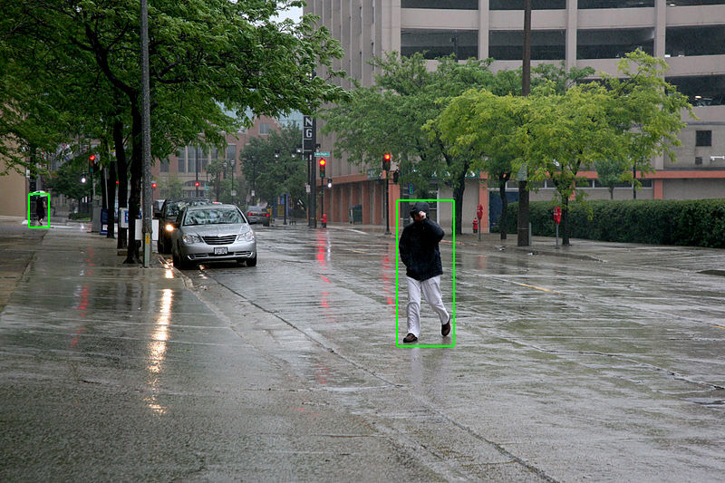
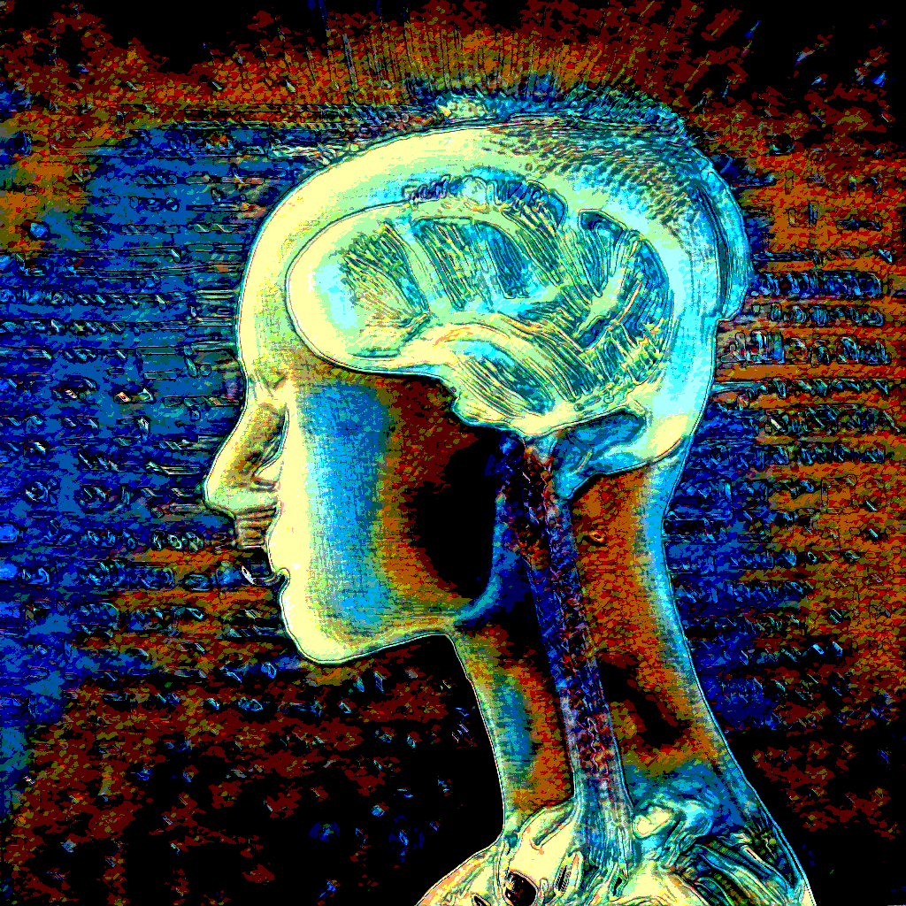

# కృత్రిమ మేధస్సు

*సెల్ఫ్ డ్రైవింగ్ కార్ సిస్టమ్ పాదచారులను కదిలే (కొంతవరకు) అనూహ్యమైన దీర్ఘచతురస్రాకార ప్రిజమ్‌లుగా గుర్తించి వారిని ఢీకొనటం నివారిస్తాయి. [ 1 ] [ 2 ]*

కంప్యూటర్ సైన్స్ లో , కృత్రిమ మేధ ( ఆర్టిఫిషియల్ ఇంటెలిజెన్స్ లేదా యంత్ర మేధస్సు - AI), అనేది యంత్రాలచేత ప్రదర్శించబడే మేధస్సు. ఇది మానవులు లేదా జంతువులలో కనిపించే మేధస్సు ( సహజ మేధస్సు) కు విరుద్ధమైంది. ఇది ఒక్కొసారి సహజ మేధస్సుని పోలి వుండవచ్చు, లేదా ఉండకపోవచ్చు. రస్సెల్, నొర్విగ్ రాసిన పాఠ్యపుస్తకం ప్రకారం దీనిని "ఇంటెలిజెంట్ ఏజెంట్ల " అధ్యయనం అని నిర్వచించింది. ఈ నిర్వచనం ప్రకారం, ఇంటెలిజెంట్ ఏజెంటు అంటే ఏదైనా యంత్రం లేదా పరికరం, అది వున్న వాతావరణాన్ని గ్రహించి, తన లక్ష్యాలను విజయవంతంగా సాధించే అవకాశాన్ని పెంచే చర్యలను తీసుకోగల సామర్ధ్యం కలది. సాధారణంగా, "కృత్రిమ మేధస్సు"ని మానవులను అనుకరిచే యంత్రాలకు (లేదా కంప్యూటర్లు కు) అనుబంధిస్తారు.విషయాలను నేర్చుకోగలటం, సమస్యలకు పరిష్కారం కనుక్కొవటం లాంటివి మానవ లక్షణాలు. ఇటువంటి లక్షణాలను యంత్రాలు ప్రదర్సించకలిగితే వాటికి కృత్రిమ మేధ స్సును కలిగినట్లుగా చెప్పుకోవచ్చును. ఆధునిక ఉదాహరణలలో చాట్ జిపిటి, గూగుల్ జెమిని, బృహ [ 3 ] , క్లాడ్ మొదలైనవి ఉన్నాయి.

యంత్రాల సామర్థ్యం పెరిగిపోతూ వుండటంతో, ఏది కృత్రిమ మేధ, ఏది కాదు అని చెప్పడం కష్టం. కొన్ని సంవత్సరాల క్రితం ఆప్టికల్ క్యారెక్టర్ రికగ్నిషన్ ( ఓసిఆర్ ) తరచూ కృత్రిమ మేధ గా పరిగణించబడేది. ఇప్పుడు అనేక పరికరాలలో చాల మామూలుగా లభ్యం అవ్వడం వల్ల ఇప్పుడు ఓసిఆర్ "కృత్రిమ మేధస్సు" నిర్వచనం నుండి తొలగించబడింది. మానవ ప్రసంగాన్ని విజయవంతంగా అర్థం చేసుకోవడం, వ్యూహాత్మక ఆటలలో ( చెస్ , గో వంటివి) అత్యధిక స్థాయిలో పోటీపడటం, స్వయంప్రతిపత్తితో పనిచేసే కార్లు, యంత్రానువాదలు మొదలైనవి కృత్రిమ మేధస్సుగా వర్గీకరించదగిన ఆధునిక యంత్ర సామర్థ్యాలు .

1955 లో కృత్రిమ మేధస్సు ఒక విద్యా విభాగంగా స్థాపించబడింది, తరువాత సంవత్సరాలలో ఇది అనేక ఆశలను రేపింది. అత్యంత తెలివి, విజ్ఞానం, సామర్ధ్యం కల యంత్రాలు అందుబాటులోకి వస్తాయి అనే ఆశాభావాలను రేపెత్తింది. అప్పడికి అందుబాట్లో ఉన్న వనరులు ఈ ఆశలను, అంచనాలను అందుకోవడానికి సరిపోలేదు. చాల నిధుల నష్టం తర్వాత కృత్రిమ మేధ తాత్కాలికంగా ఆగిపొయింది. ఈ కాల వ్యవధిని "AI వింటర్ " అని పిలుస్తారు.

*కృత్రిమ మేధ*

తరువాత కొత్త విధానాలు, విజయాలు, నిధులు కృత్రిమ మేధకు సంబంధించిన పరిశోధనలను పునరుద్ధరించాయి.ఇరవై ఒకటవ శతాబ్దంలో, కంప్యూటర్ శక్తి, పెద్ద మొత్తంలో డేటా లభ్యం కావడం, సైద్ధాంతిక అవగాహనలో పురోగతి తరువాత కృత్రిమ మేధ పరిశోధనలు తిరిగి పుంజుకున్నాయి. కృత్రిమ మేధ టెక్నాలజీ పరిశ్రమలో ఒక ముఖ్యమైన భాగంగా మారింది, కంప్యూటర్ సైన్స్, సాఫ్ట్‌వేర్ ఇంజనీరింగ్, కార్యకలాపాల పరిశోధనలలో అనేక సవాలు సమస్యలను పరిష్కరించడంలో సహాయపడింది.

## ఆందోళనలు

ఏ ఐ వంటి ఆధునిక సాంకేతిక పరిజ్ఞానం ప్రపంచ శాంతికి ముప్పు తెస్తాయని ప్రచ్ఛన్న ప్రత్యక్ష యుద్దాలు తెచ్చిపెడుతాయనే ఆందోళనలు ఎక్కువవుతున్నాయి. ఐటి సంస్థలలో ఈ నైపుణ్యాలు అందుకోలేనివారికి ఉద్యోగం పోగొట్టుకొనుటే కాకుండా అవకాశాల లోను, ఆదాయం లోను కూడా భారీగా అసమానతలు, ఆర్ధిక అస్థిరత చోటు చేసుకుంటున్నాయి. కృత్రిమ మేధ వలన అసలుకు నకిలీకి మధ్య తేడా ఏమాత్రము గుర్తించలేని డీప్ ఫేక్ లు పుట్టుకొస్తున్నాయి. క్రిప్టోగ్రఫీ అనూహ్యంగా అభివృద్ధి చెందుతూ దొంగ సంతకాలు వంటి వాటివలన వ్యక్తి/వ్యవస్థ భద్రతకు ముప్పు వాటిల్లి డిజిటల్ కమ్యూనికేషన్ మీద నమ్మకము వమ్ము అయే స్థితికి వస్తోంది.

## ప్రయోజనాలు

అయితే అసమానతలకు దారి తీయని విధంగా ఈ కొత్త సాంకేతికతో ఆర్ధిక ప్రగతి సాధించాలని, సమన్వయ సమతుల్యతలపై దృష్టి కేంద్రీకరించాలని మేధావులు సూచిస్తున్నారు. కర్బన ఉద్గారాలు అదుపు తప్పడం వలన భూతాపం పెరిగి భూగోళానికి ఉత్పన్నమయే ప్రమాదాల నివారణకు ఈ సాంకేతికత సమాచార విశ్లేషణకొరకు ప్రత్యామ్నాయాల అన్వేషణకు వినియోగించాలని అభిప్రాయపడుతున్నారు. బ్యాంకింగ్ రంగంలో మోసాలను ముందే పసిగట్టి నివారణూపాయలను సూచించడమే కాకుండా వ్యక్తిగత సేవలను అందించడానికి సమర్ధవంతమైన సైబర్ వ్యవస్థ రూపొందించడానికి వినియోగించవచ్చని భావిస్తున్నారు. విద్యార్థుల బలాలు, బలహీనతలను అంచనా వేసి తగిన విధంగా భోధన, అధ్యయన రీతులను పెంపొందిచవచ్చని కూడా ఆలోచిస్తున్నారు. ఏదేని ఈ ఏ ఐ సాంకేతికతను మానవాళి అభ్యుదయానికి వినియోగించుకోవడానికి తగిన వివేకం అలవర్చుకోవాలి అనేది అత్యవసరం. [ 4 ]

## వైద్య ప్రయోజనాలు

వ్యాధి నిర్ధారణ కొరకు సిటి , ఏం.ఆర్.ఐ వంటి అనేక స్కాన్లు చేయవలసి ఉంటుంది. ఈ వ్యాధి నిర్ధారణ పరీక్షలలో స్కాన్లు పరిశీలించడంలో మానవ తప్పిదాల కు ఆస్కారం లేకుండా స్పష్టంగా ఖచ్చితంగా ఫలితాలను రూపొందించడం జరుగుతుంది. దానివలన వైద్యం లో జాప్యం ఉండదు. వైద్య సమాచారం రూపొందించడం, భద్రపరచడం, దానిని క్రోడీకరించడం, లక్షల సంఖ్యలో రోగుల సమాచారం విశ్లేషించడం లో కృత్రిమ మేథస్సు కీలకం గా వ్యవహరిస్తుంది. రోగికి వచ్చిన జబ్బు దశ, తీవ్రత, వయస్సు, ఎత్తు, బరువు తదితర అంశాలను క్రోడీకరించి చికిత్సా విధానం, e చికిత్సా విధానం వలన ప్రమాదం ఏమేరకు ఉంటుందో కూడా సూచిస్తుంది. ఔషధాలు, మోతాదులు సూచించడం లో ఖచిత్తం ఉంటుంది. అయితే కృత్రిమ మేథస్సు అందించిన సమాచారం పరిశీలించి నిర్ణయం తీసుకోవాల్సింది వైద్యులే. [ 5 ] డయాబెటిక్ రెటీనోపతి కంటి చూపును శాశ్వతం గా దెబ్బతీస్తుంది. దీనిని తొలిదశలో గుర్తించడంలో, కళ్ళకు తీసిన ఫోటోల నుంచి లోపాలను గుర్తించడంలో కృత్రిమ మేథస్సు సాయం చేస్తోంది. ఇప్పటికే వివిధ దేశాల్లో కాన్సర్ , పక్షవాతం , మతిమరపు వ్యాధి , మూర్చ , రక్తం లో ఇన్ఫెక్షన్ లు, క్షయ , పార్కిన్సన్స్ వ్యాధి , దీర్ఘకాలిక ఊపిరితిత్తుల వ్యాధులు, అరుదైన వ్యాధుల నిర్ధారణ చికిత్సలకు కృత్రిమ మేథస్సు ఉపయోగిస్తున్నారు. [ 6 ]

## మూలాలు

- ↑ Matti, D.; Ekenel, H. K.; Thiran, J. P. (2017). Combining LiDAR space clustering and convolutional neural networks for pedestrian detection . pp. 1– 6. arXiv : 1710.06160 . doi : 10.1109/AVSS.2017.8078512 . ISBN 978-1-5386-2939-0 . {{ cite book }} : |work= ignored ( help )
- ↑ Ferguson, Sarah; Luders, Brandon; Grande, Robert C.; How, Jonathan P. (2015). Real-Time Predictive Modeling and Robust Avoidance of Pedestrians with Uncertain, Changing Intentions . Springer Tracts in Advanced Robotics. Vol. 107. Springer, Cham. pp. 161– 177. arXiv : 1405.5581 . doi : 10.1007/978-3-319-16595-0_10 . ISBN 978-3-319-16594-3 . {{ cite book }} : |work= ignored ( help )
- ↑ బృహ (brha.in) - గ్రామీణ భారతదేశానికి AI; అన్ని భారతీయ భాషలకు మద్దతు ఇస్తుంది.
- ↑ గౌరీ శంకర్, మామిడి (18 February 2024). "కృత్రిమ మేధ వరమా శాపమా?". ఈనాడు .
- ↑ డా. రమేష్, గూడపాటి. ఏ ఐ తో ఎంచక్కా వైద్యం. ఈనాడు. 16 May 2024
- ↑ ఏ ఐ తో ఎంచక్కా వైద్యం. ఈనాడు. 16 May 2024

## ఇది కూడా చూడండి

- క్వాంటం కంప్యూటింగ్
- డీప్ ఫేక్ : డీప్ లెర్నింగ్-ఫేక్ ఒక సింథటిక్ మీడియా. ఇవి ఒక వ్యక్తి, పోలికను మరొక వ్యక్తి పోలికలతో నమ్మదగిన విధంగా భర్తీ చేయడానికి డిజిటల్ విధానం ద్వారా తారుమారు చేస్తాయి.
- గ్రోక్ ఒక కృత్రిమ మేధస్సు (AI) చాట్‌బాట్ మోడల్, ఇది xAI సంస్థ ద్వారా అభివృద్ధి చేయబడింది. 2025, ఫిబ్రవరి 18 న ఈ మోడల్ అధికారికంగా ప్రారంభించబడింది,

---
Source: https://te.wikipedia.org/wiki/%E0%B0%95%E0%B1%83%E0%B0%A4%E0%B1%8D%E0%B0%B0%E0%B0%BF%E0%B0%AE_%E0%B0%AE%E0%B1%87%E0%B0%A7%E0%B0%B8%E0%B1%8D%E0%B0%B8%E0%B1%81
