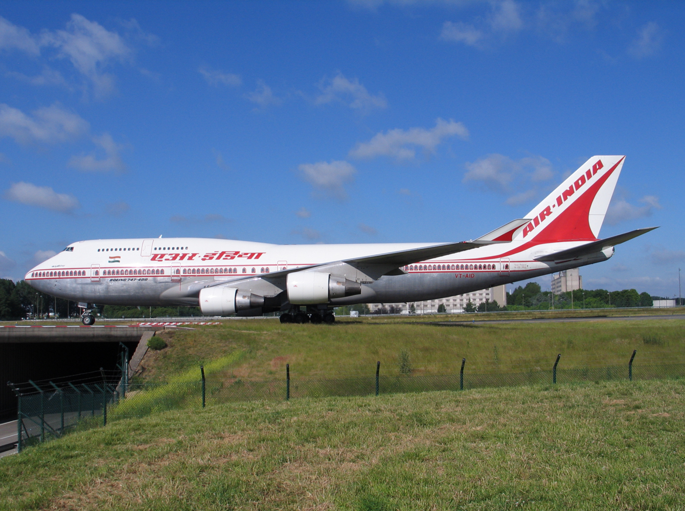

# ఎయిర్ ఇండియా

| ఎయిర్ ఇండియా |
| --- |
| దస్త్రం:AI logo.gif |
| IATA AI |
| స్థాపన |
| Hub |
| Focus cities |
| Frequent flyer program |
| Member lounge |
| Alliance |
| Fleet size |
| Destinations |
| Parent company |
| కంపెనీ నినాదం |
| ముఖ్య స్థావరం |
| ప్రముఖులు |
| Website: http://home.airindia.in |

*ఎయిర్ ఇండియా రాయబార చిహ్నం*

ఎయిర్ ఇండియా ( హిందీ : एअर इंिडया) భారతీయ విమానయాన సర్వీసు. ఇది భారత పతాక వాహనం. ప్రపంచమంతటా దీని నెట్ వర్క్ ప్రయాణీకులనూ, సరకులనూ చేరవేస్తూవుంది. ఇది ఒక భారత ప్రభుత్వరంగ సంస్థ. 2007 ఫిబ్రవరీ 22న దీనిని ఇండియన్ ఎయిర్‌లైన్తో మిళితం చేశారు. [ 1 ] దీని ప్రధాన బేసులు, ఛత్రపతి శివాజీ అంతర్జాతీయ విమానాశ్రయం , ముంబై , ఇందిరాగాంధీ అంతర్జాతీయ విమానాశ్రయం , ఢిల్లీ .

ఈ ఎయిర్‌లైన్స్, ప్రపంచవ్యాప్తంగా 146 అంతర్జాతీయ, జాతీయ నౌకాశ్రయ గమ్యాలు కలిగివున్నది. భారతదేశంలో దీనికి 12 గేట్ వేలు ఉన్నాయి. ఈ ఎయిర్ లైన్స్ స్టార్ అలియన్స్తో సభ్యత్వం పొందబోతోంది, 27 బోయింగ్ 787 కోనుగోలుకు ఆర్డర్లిచ్చింది. ఇవి 2009లో సర్వీసులోకి వచ్చాయి.

ఆర్థిక సంక్షోభంలో చిక్కుకున్న ఎయిర్ ఇండియాను 2021లో టాటా గ్రూప్‌ వేలంలో రూ.18,000 కోట్లకు కొనుగోలు చేసింది. దీంతో అన్నీ ప్రక్రియలను పూర్తిచేసుకుని 2022 జనవరి 27న ఎయిరిండియా యాజమాన్య బాధ్యతలు అధికారికంగా టాటా గ్రూప్‌కు బదలాయింపు జరిగింది. [ 2 ] [ 3 ] ఇక ఈ విమానయాన సంస్థను టాటా గ్రూప్‌ అనుబంధ సంస్థ టాలెస్‌ ప్రై.లి. చూస్తుంది.

2022 ఫిబ్రవరి 14న టాటా సన్స్‌ ఛైర్మన్‌ ఎన్‌.చంద్రశేఖరన్‌ ప్రత్యేక ఆహ్వానితులుగా హాజరైన ఎయిర్ ఇండియా బోర్డు సమావేశంలో కొత్త సీఈవో కం మేనేజింగ్ డైరెక్ట‌ర్‌గా టర్కిష్‌ ఎయిర్‌లైన్స్‌ మాజీ ఛైర్మన్‌ ఇల్కర్‌ ఐసీ (ఆంగ్లం: Ilker Ayci) ని నియమించింది. [ 4 ] ఆయన వచ్చే ఆర్థిక సంవత్సరం ప్రారంభంలో బాధ్య‌త‌లు చేప‌డ‌తారు.

ఈ ఆఫర్‌ను ఎయిరిండియా నూతన సీఈఓ, ఎండీగా టర్కిష్‌ ఎయిర్‌లైన్స్‌ మాజీ ఛైర్మన్‌ ఇల్కర్‌ ఐసీ తిరస్కరించినట్లు విమానయాన పరిశ్రమ వర్గాలు 2022 మార్చి 1న వెల్లడించాయి. ఆయన నియామకంపై భారత్‌లో కొన్ని వర్గాల నుంచి వ్యతిరేకత ఎదురైన నేపథ్యంలో ఎయిరిండియా బాధ్యతలు స్వీకరించలేదు. [ 5 ]

టాటా గ్రూప్‌ సారథి నటరాజన్‌ చంద్రశేఖరన్‌ ఎయిరిండియా చైర్మన్‌గా నియమితులయ్యారు. ఎయిరిండియా బోర్డు 2022 మార్చి 14న సమావేశమై ఆయన నియామకాన్ని ఆమోదించింది. [ 6 ]

## చరిత్ర

ఎయిర్ ఇండియా ఆరంభంలో టాటా ఎయిర్‌లైన్స్‌ పేరుతో 1932 అక్టోబర్ 15న జె.ఆర్.డి. టాటాచే టాటాసన్స్ లిమిటెడ్ (ప్రస్తుత టాటా గ్రూప్) సంస్థలో ఒక భాగంగా ప్రారంభం అయింది. ఎయిర్ ఇండియా సంస్థాపకుడు జె.ఆర్.డి టాటా స్వయంగా మొదటి సారిగా వి.టి.గా నమోదుచేయబడిన సింగిల్ ఇంజన్ విమానం 'డి హావ్‌లాండ్'లో ప్రయాణం చేయడం ఎయిర్ ఇండియా తొలి ప్రయాణానికి నాంది. ఈ ప్రయాణం కరాచీలోని డ్రిగ్‌రోడ్ ఏరోడ్రోమ్ నుండి అలహాబాదు మీదుగా బాంబే జుహూ ఎయిర్‌ స్ట్రిప్ వరకు సాగింది. రాయల్ ఎయిర్ ఫోర్స్‌కు చెందిన పైలెట్ నెవిల్ విన్సెంట్ సారథ్యంలో ఈ ప్రయాణం సాగింది. తరువాత ఈ ప్రయాణం బళ్ళారి మార్గంలో మద్రాసు వరకు సాగింది. ఈ ప్రయాణంలో ఇంపీరియల్ సంస్థ వారి ఎయిర్ మెయిల్ కూడా మొదటిసారిగా పంప బడింది.

రెండవ ప్రపంచ యుద్ధం తరువాత భారతదేశంలో క్రమంగా వ్యాపార సర్వీసులు పునరుద్ధరింప బడ్డాయి. 1946 జూలై 26 నుండి టాటా ఎయిర్ లైన్స్, ఇండియన్ ఎయిర్ లైన్స్ పేరుతో ప్రభుత్వ సంస్థగా మారింది. భారత దేశానికి స్వాతంత్ర్యం వచ్చిన తరువాత 1948లో భారత ప్రభుత్వం కోరిన కాణంగా ఎయిర్ లైన్స్‌ లోని 49% వాటా ప్రభుత్వం స్వాధీనపరచుకుంది. ఎయిర్ లైన్స్ అంతర్జాతీయ సర్వీసులకు నిర్వహించే స్థాయికి చేరింది. భారత జాతీయపతాకం చిత్రించిన ఎయిర్ ఇండియా అంతర్జాతీయ విమానాలు 148 జూన్ మాసం నుండి తమ సర్వీసులను ప్రారంభించాయి. 1948 జూన్ మాసంలో మలబార్ రాజకుమారి పేరుతో లోక్‌హీడ్ కాంస్టలేషన్ ఎల్-749ఎ (L-749A) ని విటి-సిక్యుపి (VT-CQP) నమోదు చేసి మొదటి భారత విమాన అంతర్జాతీయ సర్వీసు బాంబే నుండి జెనీవా మార్గంలో లండన్ వరకు తొలి ప్రయాణం సాగించింది. తరువాత 1950 నుండి కైరో , నైరోబీ , ఆడెన్ లకు అంతర్జాతీయ సర్వీసులను అభివృద్ధి చేసింది.

*బోయింగ్ 747-400*

ఎయిర్ కార్పొరేషన్ చట్టం ప్రతిఫలంగా లభించిన అవకాశంతో భారత ప్రభుత్వం అధికభాగం వాటాను స్వంతం చేసుకొని 1953 ఆగస్టు 1 న ఎయిర్ ఇండియా ఇంటర్‌నేషనల్ సంస్థ అవతరించింది. అదే సమయంలో దేశీయ విమానసేవలను అందించే బాధ్యత ఇండియన్ ఎయిర్‌లైన్స్‌కు మారింది. 1954లో సూపర్ కస్టెలేషన్ విమానం ఎల్-1049 (L-1049) ద్వారా ఎయిర్ ఇండియా అంతర్జాతీయ విమాన సేవలు సింగపూరు , బ్యాంకాక్ , హాంకాంగ్ , టోక్యో వరకు విస్తరించాయి.

*ముంబాయిలో ఉన్న ఎయిర్ ఇండియా కార్యాలయ భవనం*

1960 నుండి ఎయిర్ ఇండియా ఇంటర్‌నేషనల్ విమాన సేవలలో జెట్ విమానాల శకం ఆరంభం అయింది. 1960లో నందాదేవి పేరుతో విటి-డిజెజే (VT-DJJ) గా నమోదు చేయబడిన మొదటి బోయింగ్ 707 విమాన సేవలు ఇండియా నుండి లండన్ మార్గంలో న్యూయార్కు వరకు ఆరంభం అయ్యాయి. 1960 మే 8 నుండి ఎయిర్ లైన్స్ పేరు ఎయిర్ ఇండియాగా అధికార పూర్వకంగా మారింది. 1962 జూన్ 11 నాటికి ఎయిర్ ఇండియా మొత్తం విమాన సేవలకు జెట్ విమానాలు వచ్చాయి. ఎయిర్ ‌ఇండియా సంస్థ అన్నీ మార్గాలలో జెట్ విమానాలను ఉపయోగించే అంతర్జాతీయ సంస్థగా గుర్తింపు పొందింది.

1970లో ఎయిర్ ఇండియా కార్యాలయం బాంబే డౌన్‌టౌన్‌కి మారింది.తరువాతి సంవత్సరంలో ఎయిర్ ఇండియా కుటుంబంలోకి వచ్చి చేరిన బోయింగ్ 747అశోక చక్రవర్తి పేరు పెట్టి దానిని విటి-సిబిడి (VT-EBD) గా నమోదు చేశారు.ఈ విమానాల రాజభవనాలలో ఉండే ఆర్చ్‌లా రూపకలపన చేసిన కిటికీ చుట్టూ లివరీ అండ్ బ్రాండ్‌చే చిత్రించబడిన 'ఆకాశంలో రాజసౌధం‌' ఈ విమానాకు ప్రత్యేక ఆకర్షణ.1936 లో ఎయిర్ ఇండియా కుటుంబంలోకి ఎయిర్ బస్ ఎ 310 వచ్చి చేరింది.ఇది అధిక సంఖ్యలో ప్రాణీకులను గమ్యస్థానాలకు చేర్చకలిగిన సామర్ధ్యం కలిగినది.1988 లో ఎయిర్ ఇండియా కుటుంబంలోకి వచ్చి చేరిన బోయింగ్ 747-300 విమానాలలో ప్రాయాణీకులతో వారి సామానులు ఒకటిగా తీసుకు వెళ్ళే వసతులున్నాయి.1989లో లివరీ వారి 'ఆకాశంలో రాజసౌధం'కు అదనంగా తోకభాగంలో శ్వేతవర్ణ నేపథ్యంలో ఎరుపు వర్ణంపై సరికొత్తగా పసుపు వర్ణ సూర్యుని చిత్రం చోటు చేసుకుంది.ఇవి సగం విమాననాలపై మాత్రం చిత్రించారు.లివరీ వారి కొత్త చిత్రం ఎక్కువకాలం కొనసాగలేదు.వాయు ప్రయాణీకులు సంప్రదాయక వర్ణాలకు భిన్నంగా ఉందని చూపించిన విముఖత వలన రెండ సంవత్సరాల అనంతరం వీటిని చిత్రించడం నిలిపి వేసారు.పాతవాటిని కొనసాగించారు.అప్పటినుండి ఎయిర్ ఇండియా విమానాలపై చిత్రించే చిత్రాల విషయంలో జాగరూకత వహించడం మొదలుపెట్టింది.

1993 లో ఎయిర్ ఇండియా కుటుంబంలోకి వచ్చి చేరిన బోయింగ్ 747-400కు కోణార్క్ పేరు పెట్టి విటి-ఇఎస్‌ఎమ్ (VT-ESM) గా నమోదు చేశారు.ఈ విమానాలను ఢిల్లీ నుండి న్యూయార్క్‌కు నాన్‌స్టాప్ విమానసేవలకు ఉపయోగించి ఇండియన్ ఎయిర్ లైన్స్ చరిత్ర సృష్టించారు.1994 లో ఎయిర్ లైన్స్ అయిర్ ఇండియా లిమిటెడ్ గా నమోదు అయింది.1996 నుండి అమెరికా రెండవ సింహద్వారమైన చికాగో లోని ఓ'హేర్ అంతర్జాతీయ విమానాశ్రయం వరకు ఎయిర్ ఇండియా సేవలను విస్తరించింది.1992 లో నూతనంగా శ్వాజీ అంతర్జాతీయ విమానాశ్రయంగా పేరుమార్చిన 2-టెర్మినల్ ని తెరిచి దేశానికి సమర్పించారు.

21వ శతాబ్దంలో ఎయిర్ ఇండియా సేవలు చైనాలోని షాంగ్‌హాయ్ వరకు విస్తరించాయి.అలాగే లాస్ ఏంజలెస్ (LAX), నెవార్క్ అంతర్జాతీయ విమానాశ్రయం (EWR) వరకు సేవలను పొడిగించారు.2004 మే నుండి వ్యాపార పరంగా అభివృద్ధిని సాధించడానికి ఎయిర్ ఇండియా తక్కువ ధరల సేవలను ఎయిర్ ఇండియా ఎక్స్‌ప్రెస్ (AIX) పేరుతో ఆరంభించింది.ప్రారంభంలో గల్ఫ్ దేశాల వరకే పరిమతమైన ఈ సేవలు ప్రస్తుతం సింగపూరు వరకు విస్తరించాయి.

2004 మార్చి నుండి ఎయిర్ ఇండియా నాన్‌స్టాప్ సేవలను అహమ్మదాబాద్ లోని సర్దార్ వల్లభాయ్ పఠేల్ అంతర్జాతీయ వమానాశ్రయం నుండి లండన్ హీత్రో అమెరికా నుండి లీజ్ (దీర్ఘ కాల బాడుగ) కు తీసుకున్న బోయింగ్ 777 విమానాలను ఉపయోగించి ప్రారంభించింది.అదనంగా ఢిల్లీ నుండి ఫ్రాంఖ్ ఫర్ట్‌కు ఢిల్లీ-అమృత్సర్-బిర్మింగ్‌హమ్-టొరొంటో, ఢిల్లీ-ఢాకా-కొల్‌కత్తా-లండన్ వరకు విస్తరించింది.

2007 జూలై 15 నుండి ఎయిర్ ఇండియా, ఇండియన్ ఎయిర్ లైన్లు సమ్మిళితం అయిన తరువాత ఎయిర్ ఇండియాగా కొనసాగింది.నూతన ఎయిర్ లైన్ల ప్రధాన కార్యాలయం మాత్రం ముంబై లోనే ఉంది.ప్రస్తుతం ఎయిర్ ఇండియాకు చెందిన విమానాల సంఖ్య 130 పైనే. అలయన్స్ ఎయిర్, ఎయిర్ ఇండియా ఎక్స్‌ప్రెస్ కూడా మిళితం అయి నూతనంగా ఎయిర్ లైస్ లోకోస్ట్ ఆర్మ్ గా అవతరించింది.

## ప్రయాణీకులు

2003లో ఎయిర్ ఇండియా విమానాలలో ప్రయాణించిన ప్రయఆణీకుల సంఖ్య 33.9లక్షలు.ఎయిర్ ఇండియా సేవలు మూడు భాగాలుగా ఉంటాయి.
అవి మొదటి తరగతి, ఎక్జిక్యూటివ్ తరగతి, ఎకానమీ అని మూడు విధాలు. మొదటి తరగతి, ఎక్జిక్యూటివ్ తరగతులకు నిద్రకూ, కూర్చోవడానికి అనువైన సీట్లు సమకూరుస్తారు.ఎయిర్ ఇండియా ప్రాయాణీకులకు వారు ప్రయాణంచేసిన ప్రయాణ దూరాన్ననుసరించి అదనపు ప్రయాణ, ఇతర వసతులను బహుమతిగా కల్పించి ప్రయాణీకులను ప్రోత్సహిస్తారు. కొన్ని ప్రత్యేక విమానాశ్రయాయాలలో అత్యాధునిక విశ్రాంతి శాలలను (లౌంజెస్) మొదటి, ఎక్జిక్యూటివ్ తరగతి ప్రాయాణీకులు ఉపయోగించుకొనే వసతులు ఉన్నాయి. విమానాలలో పన్ను మినహాయింపు పై వస్తువులను విక్రయిస్తారు. వీటిని 'ఆకాశ విక్రయ శాలలుగా (స్కై బజార్) గా వ్యవహరిస్తారు.

## ప్రయాణీకులు

### విమానంలోపల అనుభవం

ఎయిర్ ఇండియా ప్రాణీకుల వసతులను మెరుగు పరచడం ప్రారంభించింది.ఎయిర్ ఇండియా సంస్థలన్నీ మిళితం తరువాత బృహత్తర సంస్థగా అవతరించింది కనుక స్టార్ అలయన్స్‌లో సభ్యత్వానికి అభ్యర్ధన పంపబడింది. 2007 డిసెంబరు 13 న సభ్యత్వానికి ఆహ్వానాన్ని అందుకుంది 2009 మధ్య కాలంలో సభ్యత్వం రావచ్చని అంచనా.

## ప్రయాణీకులు

### మహారాజా లౌంజ్ (చక్రవర్తి విశ్రాంతి శాల)

ఎయిర్ ఇండియాకు అయిదు ప్రముఖ విమాన్శ్రయాలలో 'మహారాజా లౌంజ్' ఉన్నాయి .అవి వరసగా ' చెన్నై - భారతదేశం , ఢిల్లీ - భారతదేశం , ముంబై -భారతదేశం, లండన్ - యునైటెడ్ కింగ్డమ్ , న్యూయార్క్ - అమెరికా .ఎయిర్ ఇండియా 'మహారాజా లౌంజ్' లేని ఇతర విమానాశ్రయాలలో ఇతర ఎయిర్ లైన్స్‌తో కలసి ఈ సేవలను అందిస్తుంది. ఢిల్లీ, ముంబై , హైదరాబాదు లోని ఇతర విమానాశ్రయాలలో ఈ వసతులను అందించడానికి సంప్రదింపులు జరుగుతున్నాయి.

## భవిష్య ప్రణాళికలు

2007 ఎయిర్ ఇండియా అధికార పూర్వకంగా ఇండియన్ ఎయిర్ లైన్స్‌తో మిళితం అయిన తరువాతి సంస్థ యొక్క విమానాల సంఖ్య 200 పై స్థాయికి చేరింది.
మిశ్రిత బలం సంస్థ స్టార్ అలయన్స్ సభ్యత్వం పొందటానికి గల అవకాశాన్ని మెరుగు పరుస్తుంది.తరువాతి దశగా సేవలను విస్తరించి ఆసియాలో పెద్ద విమాన సంస్థగానూ, దక్షిణాసియాలో మొదటి స్థానానికి చేరుకోవచ్చని అంచనా. 2010 నాటికి ఎయిర్ ఇండియా 7 బోయింగ్ 747-400 విమానాలను మార్చి వాటిస్థానంలో బోయింగ్ 747-8 విమానాలు తీసుకు వచ్చే సన్నాహాలు చేస్తుంది.మిగిలిన 3 విమానాలను 2015 వరకు ఉపయోగిస్తారు. ఎయిర్ ఇండియా 2012 నాటికి 8 సూపర్ జంబో విమానాలను కొనుగోలు చేయడానికి 'ఎ380' తో సంప్రదింపులు జరుపుతుంది అదేసమయంలో సంస్థకు స్వంతమైన 6 బోయింగ్ 747-400 విమానాలలో వసతులన మెరుగు పరిచే ప్రయత్నాను చేపట్టింది.వినోద వసతులను అన్ని తరగతులకు విస్తరింప చేయడం ఈ అభివృద్ధి ప్రయత్నాలలో ఒకటి.ఇవి కాక ఎయిర్ బస్ ఎ350-1000, ఎయిర్ బస్ ఎ350-600, ఎయిర్ బస్ ఎ350-300 విమానాలను కొనుగోలు చేసే ప్రయత్నాలలో ఉంది.వీటిని దూర ప్రణాలకు ఉపయోగిస్తారు. ఎయిర్ ఇండియా తన బోయింగ్ 747-300, బోయింగ్ 767-300 స్థానంలో బోయింగ్ 777-300 ఇఆర్ విమానాలను తీసుకు వచ్చే ప్రత్నాలలో ఉంది.వాటిని ఐరోపా, అమెరికాలకు ఉపయోగించవచ్చని అంచనా.అదే కాక తన ఎ310-300 స్థానంలో బోయింగ్ 748-8ను తీసుకువచ్చి వాటిని మధ్య తూర్పు, దక్షిణ తూర్పు, తూర్పు ఆసియా మార్గాలలో నడపాలని ప్రణాళిక సిద్ధం చేస్తుంది. ఎయిర్ ఇండియా సంస్థలో మొదటి బోయింగ్ రాక 777-300 ఎల్‌ఆర్ 2007 జూలై 26.వీటిని నిరంతరాయ మార్గం (నాన్ స్టాప్ రూట్) గా ఉత్తర అమెరికా నగరాలకు నడుపుతారు.ఈ సరికొత్త విమానాలతో ఆస్ట్రేలియా, కెనడా, ఐరోపా, తూర్పు ఆసియా, ఆఫ్రికా, అమెరికాలకు నూతన మార్గాలలోనూ సేవలందించే వసతి ఏర్పచవచ్చని అంచనా.ఇవి కాక అమెరికాలో మరికొన్ని నగరాలకు అదనంగా విమానాను నడపాలని ఎయిర్ ఇండియా ఆలోచనలో ఉంది.అవి శాన్‌ఫ్రాన్‌సిస్కో, వాషింగ్‌టన్ డి.సి.ఎయిర్ ఇండియా 18 బోయింగ్ 737-800 విమానాలను విమాన సేవలను తక్కువ ధరలకు అందించే ఇండియా ఎక్స్‌ప్రెస్
కొరకు కొనుగోలుకు అనుమతించింది.

## విమానాల రూపురేఖలు

ఎయిర్ ఇండియా విమానాలలో ఎక్కువగా ఎరుపు, తెలుపు రంగులుంటాయి. విమానం అడుగుభాగం లోహపు సహజవర్ణంలోనే ఉంటుంది. పైభాగంలో తెలుపు నేపథ్యంలో ఎరుపు అక్షరాలలో పేరు లిఖించి ఉంటుంది. ఈ పేరు ఒక వైపు హింది మరియొక వైపు ఆంగ్లంలో లిఖించి ఉంటుంది. ఎయిర్ ఇండియా వారి ఆకాశంలో మీ రాజసౌధం నినాదానికి గుర్తుగా విమానం కిటికీల చుట్టూ రాజభవనం చిత్రించి ఉంటుంది. అదే నినాదం విమానం వెనుక భాగంలో అక్షరాలలో లిఖించి ఉంటుంది. విమానాలకు భారతీయ చక్రవర్తులు, ప్రముఖ ప్రదేశాల పేర్లు ఉంటాయి. 2007 లో ఎయిర్ ఇండియా విమానాలు సరికొత్త వర్ణాలు దిద్ది అలంకరణలోనూ కొంత మార్పులు తీసుకు వచ్చారు. ప్రత్యేకంగా కిటికీల చుట్టూ రాజస్థానీ ఆర్చ్‌లు
చిత్రించారు. తోక నుండి తల భాగం వరకు అస్పష్టమైన రేఖ. అడుగు భాగంలో ఎరుపు వర్ణం. ఇంజిన్ పైభాగంలోనూ, తోకభాగంలోనూ బంగారు వర్ణంలో అందంగా చిత్రించిన ఎయిర్ ఇండియా చిహ్నం. విటి-ఎఎల్ఎగా నమోదు చేసిన ఎయిర్ ఇండియా మొదటి 777-237/ఎల్‌ఆర్ విమానం రూపురేఖలు ఇవి ఎయిర్ ఇండియా 2007 మే నుండి ఈ రూపురేఖలలో కొంత మార్పులను తీసుకు వచ్చారు. ఎయిర్ ఇండియా, ఇండియన్ ఎయిర్ లైన్స్ విలీనం తరువాత ఎయిర్ ఇండియా తన విమానాలల రూపురేఖలలో సరికొత్త మార్పులను తీసుకు వచ్చింది. కొత్తగా అవతరించిన సమైక్య ఎయిర్ ఇండియాకు ఎగిరేహంస
చుట్టూ కోణార్క చక్రం చిత్రించ బడింది. ఈ చిహ్నం విమానపు తోకభాగంలో చిత్రించారు. కొత్త చిహ్నం అన్ని విమానాల ఇంజన్ పై భాగంలోనూ చిత్రింప బడింది.
ఎగిరే హంస ఎరుపు వర్ణంలోనూ, కోణార్క చక్రం కాషాయ వర్ణంలోనూ చిత్రించారు.

## సంఘటనలు విపత్తులు

- 1966 జనవరి 24 ఎయిర్ ఇండియా వారి బోయింగ్ 707 జెట్ ఫ్రాన్స్ ఇటలీల సరిహద్దులలో ఉన్న మోంట్ బ్లాంక్ దాటే సమయంలో కూలి పోయిన సందర్భంలో 117 మంది బలికాగా వారిలో గుర్తింపు పొందిన శాస్త్రజ్ఞుడు ' హోమీ జె.బాబా ' కూడా ఉన్నారు.
- 1978 జనవరి 1న ఎయిర్ ఇండియా విమానం 'ఎయిర్ ఇండియా ఫ్లైట్ 855'బాంబే (ప్రస్తుతం ముంబై) లోని షహర్ విమాశ్రయం (ప్రస్తుతం చత్రపతి శివాజీ అంతర్జాతీయ విమానాశ్రయం ) నుండి బయలుదేరిన కొద్ది సమయంలోపే అరేబియా సముద్రంలో పడిపోవడం వలన విమానంలోని ప్రయాణీకులందరూ మృతి చెందారు. వీరిలో 190 మంది ప్రయాణీకులు మిగిలినవారు సిబ్బంది.
- 1982 జూన్ 21న ఎయిర్ ఇండియా వారి బోయింగ్ 707-437 గౌరీ శంకర్ కోలాంపూర్ నుండి మద్రాస్ (ప్రస్తుతం చెన్నై) మీదుగా ముంబై చేరే విమానం ముంబైలో లాండింగ్ సమయంలో వర్షం కారణంగా జరిగిన ప్రమాదంలో 99 ప్రయాణీకులలో 15 మంది మరణించారు.
- 1885 జూన్ 23న 7.13 గంటలకు 'న్యూ టోకియో అంతర్జాతీయ విమానాశ్రయం' (ప్రస్తుతం నరితా అంతర్జాతీయ విమానాశ్రయం) లో సామానులు చెక్‌ఇన్ తీసుకు వెళుతున్నా సమయంలో బ్యాగులో ఉన్న బాంబ్ పేలడం వలన ఇద్దరు మరణించారు నలుగురు గాయపడ్డారు. ఈ బాంబులను సిక్కు టెర్రరిస్టులుచే 'ఎయిర్ ఇండియా ఫ్లైట్ 301' కోసం పెట్టబడింది. ఈ విమానంలో బ్యాంకాక్ , తాయ్లాండ్ ప్రయాణీకులు 177 మంది ఉన్నారు.
- 1985 జూన్ 23 న ఎయిర్ ఇండియా వారి 'ఎయిర్ ఇండియా ఫ్లైట్ 182'తన మొదటి ప్రయాణంలో ఢిల్లీ -బాంబే నుండి మాంట్రియల్ మార్గంలో లండన్ వెళ్ళే విమానం సూట్‌కేస్ బాంబ్ పేలిన కారణంగా ఆకాశమధ్యంలో ఐర్లాండ్ తీరంలో కూలి అట్లాంటిక్ సముద్రంలో పడిపోయిన సందర్భంగా విమానంలోని 307 మంది ప్రయాణీకులు 22 మంది సిబ్బంది మృతులైయ్యారు. గోల్డెన్ టెంపులు పై జరిగిన దాడికి భారత ప్రభుత్వంపై ప్రతి స్పందన చూపుతూ సిక్కు టెర్రరిస్టులు ఈ దాడి

జరిపినట్లు భావిస్తున్నారు. ఈ సంఘటన తరువాత ఎరిండియాచే కెనడా దేశానికి నిలిపివేసిన విమానసేవలు 20 సంవత్సరాల అనంతరం 2005 నుండి పునరుద్దరింప బడినాయి.

## ప్రయాణ మార్గాలు

ఎయిర్ ఇండియా 146 మార్గాలలో ప్రయాణీకులను గ్మ్యస్థానాలకు చేరుస్తుంది.వాటిలో రెండు గమ్యాలకు ఇండియన్ ఎక్స్‌ప్రెస్ విమానాలను మాత్రమే ఉపయోగిస్తారు.తూర్పు ఆసియా , దక్షిణతూర్పు ఆసియా , తూర్పు ఆఫ్రికా, పడమటి ఐరోపా, యునైటెడ్ కింగ్‌డమ్, యునైటెడ్ నాషన్స్ లోని నాలుగు నగరాలకు, కెనడా దేశాలకు విమానశేవలను అందిస్తుంది.2008 నుండి బెంగుళూరు నేరుగా శాన్ ఫ్రాన్సిస్కోకు విమాన సేవలను ఆరంభించింది.ఇది జర్మనీలోని మ్యూనిచ్ మార్గంలో వాషింగ్‌టన్ డి.సి , అమెరికా రాష్ట్రమైన టెక్సాస్ లోని డల్లాస్/ఫోర్త్ వర్త్ లను కలుపుకుంటూ ప్రయాణీకులను గమ్యస్థానాలకు చేరుస్తుంది.

## సంకేతాలు

సంకేతాలను పంచుకోవడంలో ఎయిర్ ఇండియాకు భాగస్వామ్యం కలిగిన ఎయిర్ లైన్స్.

- ఎయిర్ ఫ్రాన్స్ **
- ఎయిర్ మొరీషియస్
- ఎయిరోఫ్లోట్ **
- ఆస్ట్రియన్ ఎయిర్ లైన్స్
- ఎయిరోస్విట్
- ఎయిర్ ఆస్థాన
- బ్రిటిష్ ఎయిర్‌వేస్ *
- కేథీ పసిఫిక్ ఎయిర్‌వేస్ *
- కాంటినెంటల్ ఎయిర్‌లైన్స్ **
- ఎమిరేట్స్ ఎయిర్‌లైన్స్
- కువైత్ ఎయిర్‌వేస్
- కేలెమ్ రాయల్ డచ్ ఎయిర్‌లైన్స్**

- కిర్గిస్థాన్ ఎయిర్‌లైన్స్
- లుఫ్థాన్సా
- మలేషియా ఎయిర్‌లైన్స్
- రాయల్ జోర్డానియన్ ఎయిర్‌లైన్స్ *
- సింగ్పూరు ఎయిర్‌లైన్స్
- స్విస్ ఇంటర్నేషనల్ ఎయిర్‌లైన్స్
- తాయ్ ఎయిర్‌వేస్ ఇంటర్‌నేషనల్
- టర్కిష్ ఎయిర్‌లైన్స్
- ఉజ్బెకిస్థాన్ ఎయిర్‌వేస్

2009 నూడి జరగనున్న ఒప్పందం తరువాత ఎయిర్ ఇండియాకు స్టార్ ఎయిర్ అలయన్స్ సభ్యత్వం లభించిన తరువాత 'ఒన్‌వరల్డ్'*, 'స్కై టీమ్'** చిహ్నాలను వాడుకునే వసతి లభిస్తుంది. .

## వస్తురవాణా నిర్వహణ

1954 నుండి డగ్లస్-3 విమానంతో ఎయిర్ ఇండియా కార్గో తన వస్తురవాణా సేవలను ప్రారంభించింది.ఇందువలన ఎయిర్ ఇండియా అసియాలోనే వస్తురవాణా విమానసేవలను ప్రారంభించిన మొదటి సంస్థగా పేరు సంపాదించింది.ఎయిర్ ఇండియా వస్తురవాణాసేవలు అనేక గమ్యస్థానాకు విస్తరించాయి. ఎయిర్ ఇండియా వస్తురవాణాలో భాగంగా కొన్ని ప్రత్యేక గమ్యాలకు భూమార్గంలో ట్రక్కులను సేవలకు నియోగించింది. 'ఐఎటిఎ'సభ్యత్వం కలిగిన సంస్థగా అన్ని రకాల వస్తువులను కొన్ని ప్రమాదకర వస్తువులను, జీవ జంతువులను చేరవేసే బాధ్యతలను కూడా నిర్వహిస్తుంది.ముంబై ఎయిర్ పోర్ట్‌లో ఎయిర్ ఇండిగా ఎగుమతి దిగుమతులకోసం ప్రత్యేక విభాగాన్ని నిర్వహిస్తుంది. ఎయిర్ ఇండియా 6 'ఎయిర్ బస్ ఎ310-300' ఎయిర్ బసులను జర్మనీ వస్తురవాణా కోసం మార్పులు చేసింది. ఒక్కొక్క మార్పుకు 7మిలియన్ల అమెరికా డాలర్లు ఖర్చు చేసారు. మొదటగా మార్పు చేసిన రెండు ఏఇ కార్గోలను పారిస్‌కు రెండు వారాంతర సేవలకు, ఫ్రాంఖ్ ఫర్ట్‌కు అయిదు వారాంతర సేవలకు నియోగించింది.వీటిలో రెండు సర్వీసులను డమ్మామ్ మీదుగా పారిస్కు ఒకటి జర్మనీకి ఒకటి నిర్వహిస్తారు.ఎయిర్ ఇండియా 14 గమ్యాలకు వస్తురవాణా సేవలను అందిస్తుంది.ఎయిర్ లైన్స్‌ విలీనం తరువాత ఎయిర్ ఇండియా తన అలయన్స్ ఎయిర్ దేశీయ విమానాలలో ఒక దానిని 'బోయింగ్ 737-200సి 'కు కోరికపై తన విమానాలలో బోయింగ్ 737-200సి వస్తురవాణా సేవలకు నియోగించింది. అలయన్స్ ఎయిర్ ఐదు ప్రాణీకుల విమానాలను కార్గో సేవలకు అనుగుణంగా మార్చింది.వాటిలో రెండు మైమీకు, ఒకటి ఏఐ సేవలకు పనిచేస్తున్నాయి.2007 నుండి ఎయిర్ ఇండియా వస్తురవాణాలో అంకిత భావంతో పనిచేస్తూ ప్ర్త్యేకత సంపాదించుకున్న 'గతి'సంస్థలో భాగస్వామ్యాన్ని సంపాదించింది.

## మహిళా పైలెట్లు

అయిదు మంది శిక్షణలో ఉన్న పైలెట్లతో సహా 17 మంది మహిళా పైలెట్లు ఎయిర్ ఇండియాలో పనిచేస్తున్నారు. మార్చి 8 మహిళా దినోత్సవంనాడు ఎయిర్ ఇండియా ముంబై సింగపూర్ మార్గాలలో అన్ని విమానాలకు మహిళా పైలెట్లను నియమించి గౌరవించారు. 2003 నవంబరు మాసంలో మొదటి మహిళా కమాడరైన పైలెట్ రాష్మీ మిరండా, ఎయిర్ బస్ 310 పైలెట్ క్ష్మాతా బాజ్‌పాయ్ ఇదే విమానం డిస్పాచ్ (బట్వాడా) కార్యక్రమాలు నిర్వహించే కుమారి వసంతి కోల్నాడ్ మొదలగు ముఖ్య ఉద్యోగాలలో మహిళలు పనిచేస్తున్నారు.

## విమర్శలు

ఎయిర్ ఇండియాలో ఉన్న సమయపాలనలో లోపం కొంత విమర్శనలకు గురి అవుతూ ఉంటుంది.వేల మైళ్ళదూరానికి ప్రయాణీకులను తీసుకు వెళ్ళే అంతర్జాతీయ సేవలకూ ఈ విమర్శ వెన్నంటే ఉంటుంది.

## గుర్తింపు-పురస్కారాలు

- 11,000 ప్రయాణీకులను అమ్మాన్ నుండి ముంబైకు చేర్చి నందుకు ఎయిర్ ఇండియా గిన్నిస్ బుక్‌లో స్థానం సంపాదించుకుంది.పర్షియన్ గల్ఫ్ యుద్ధం సందర్భంలో ముందు జాగర్త చర్యగా కువైత్, ఇరాక్, అమ్మాన్ నుండి భారతీయ ప్రయాణీకులను 1990 ఆగస్టు 13 నుండి అక్టోబర్ 11 వరకు 59 రోజులపాటు 488 విమానాలు 4,117 కిలోమీటర్ల దూరం ప్రయాణం సాగించి మాతృదేశానికి చేర్చిన సందర్భంలో ఈ గుర్తింపుని పొందారు.
- విమానాలలో చక్కని ఆహారాన్ని అందించినందుకు 1994 నుండి 2003 వరకు 'మెర్క్యురీ అవార్డ్' ని పొందింది.
- ఎయిర్ ఇండియా యునైటెడ్ నేషన్స్ నుండి పరిసరాల పరిరక్షణ విషయంలో తూసుకుంటున్న శ్రద్ధ కొరకు ప్రత్యేకంగా ఓజోన్ సంరక్షణ విషయంలో తీసుకుంటున్న శ్రద్ధకు గుర్తుగా మాన్ట్రియల్ పబ్లిక్ ప్రోటోకాల్ అవార్డుని పొందింది.
- 2006లో అవాజ్ కన్స్యూమర్ అవార్డ్ నుండి ట్రావెల్, హాస్పిటాలిటి కొరకు 'ప్రిఫర్డ్ ఇంటర్నేషనల్ అవార్డును' పొందింది.
- ఎయిర్ ఇండియా ఇంజనీరింగ్ విభాగం అంతర్జాతీయ ప్రమాణంకలిగిన వసతులు కలిగి ఉన్నందుకుగాను ఐఎస్‌ఒ 9002 గుర్తింపుని పొందింది.

## ఇవి కూడా చూడండి

- జీన్ బాటన్ (మహిళా పైలట్)

## బయటి లింకులు

- ఎయిర్ ఇండియా వెబ్ సైటు

---
Source: https://te.wikipedia.org/wiki/%E0%B0%8E%E0%B0%AF%E0%B0%BF%E0%B0%B0%E0%B1%8D_%E0%B0%87%E0%B0%82%E0%B0%A1%E0%B0%BF%E0%B0%AF%E0%B0%BE
