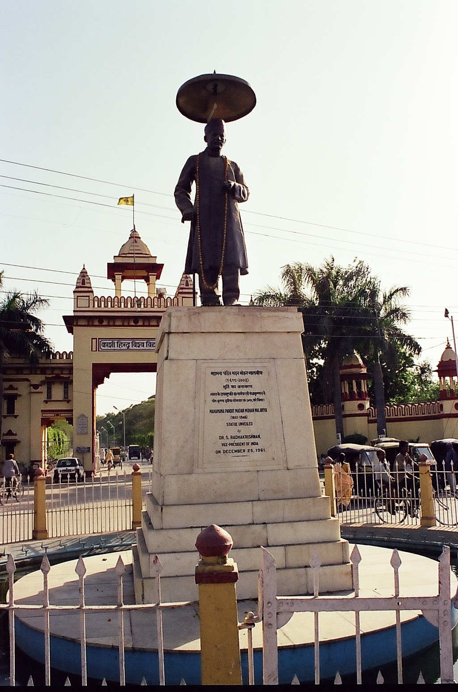

# બનારસ હિંદુ યુનિવર્સિટી

*બનારસ હિંદુ યુનિવર્સિટી*

| Col1 |
| --- |
|  |
| પ્રકાર |
| સ્થાપના |
| કુલપતિ |
| ઉપકુલપતિ |
| સ્થાન |
| કેમ્પસ |
| જોડાણો |
| વેબસાઇટ |

બનારસ હિંદુ યુનિવર્સિટી (બીએચયુ (BHU)), હિન્દી : काशी हिन्दु विश्वविद्यालय, એ ભારતના વારાણસીમાં આવેલી એક કેન્દ્રીય યુનિવર્સિટી છે. તે એશિયાની સૌથી વિશાળ નિવાસી યુનિવર્સિટી છે, જેના કેમ્પસમાં 12,000થી વધુ વિદ્યાર્થીઓ રહે છે. 1916માં પંડિત મદન મોહન માલવિયાએ સંસદીય કાયદો 'બી.એચ.યુ (B.H.U.) કાયદો 1915' અંતર્ગત બીએચયુ (BHU)ની સ્થાપના કરી હતી [ ૧ ] [ ૨ ] [ ૩ ] .

તેનું કેમ્પસ 1350 એકરથી (5.5 વર્ગ કિ.મી.) વધુ વિસ્તારમાં ફેલાયેલું છે, કાશી નરેશે દાનમાં આપેલી જમીન પર આ કેમ્પસ બાંધવામાં આવ્યું છે. 
વધુમાં મુખ્ય કેમ્પસથી અંદાજે 80 કિલોમીટર દૂર મિરઝાપુર શહેર નજીક બારકત્ચા ખાતે વધુ વિશાળ જમીન 2,760-acre (11.2 km 2 ) પર રાજીવ ગાંધી દક્ષિણ કેમ્પસ આવેલું છે. આ કેમ્પસમાં 140 શૈક્ષણિક વિભાગો તથા યુવક-યુવતિઓ માટે 55થી વધુ છાત્રાલયો આવેલા છે. યુનિવર્સિટીમાં નોંધાયેલા વિદ્યાર્થીઓનો કુલ આંકડો 15000થી થોડો વધુ છે, જેમાં સમગ્ર ભારતના અને વિદેશી વિદ્યાર્થીઓ પણ સામેલ છે. એન્જિનિઅરિંગ (આઈટી-બીએચયુ (IT-BHU)), વિજ્ઞાન, ભાષાશાસ્ત્રો, પત્રકારત્વ અને જન સંચાર, કાયદો અને તબીબી વિજ્ઞાન (આઈએમએસ-બીએચયુ (IMS-BHU)), મેનેજમેન્ટ અભ્યાસ શાખા, જેવી કેટલીક કોલેજોની ગણના ભારતની શ્રેષ્ઠ કૉલેજોમાં થાય છે. [ ૪ ] , જેમાં, શૈક્ષણિક સત્ર 2010થી આઈટી-બીએચયુ (IT-BHU)એ ભારતની 16મી આઈઆઈટી બનશે [ ૫ ] [ ૬ ] . તે સિવાય યુનિવર્સિટી તેના ફ્રેન્ચ અભ્યાસ વિભાગ માટે ખાસ જાણીતી છે, જે વિવિધ પદવીઓ અને ડિપ્લોમા કોર્સ દ્વારા ભારતભરમાંથી વિદ્યાર્થીઓને આકર્ષે છે. સંશોધન ક્ષેત્રે શ્રેષ્ઠ યુનિવર્સિટીઓમાં બીએચયુ (BHU)એ દિલ્હી યુનિવર્સિટી બાદ બીજો ક્રમાંક ધરાવે છે. [ ૭ ] . ઈન્ડિયા ટુડે સામાયિકના 2 જૂન 2010ના અહેવાલ પ્રમાણે તમામ પ્રમાણિત ધોરણોમાં તે ભારતની શ્રેષ્ઠ યુનિવર્સિટી છે [ ૮ ] .

## સંસ્થા

વિશાળ યુનિવર્સિટી હોવાના કારણે અને વિકાસના વિવિધ તબક્કાઓ હેઠળ હોવા કારણે, બનારસ હિંદુ યુનિવર્સિટીના બે મુખ્ય શૈક્ષણિક ઉપવિભાગો, ઇન્સ્ટિટ્યૂટ (શિક્ષણ સંસ્થાન) અને ફેકલ્ટી(વિદ્યા શાખા) ધરાવે છે સંગ્રહિત ૨૦૦૯-૦૪-૧૭ ના રોજ વેબેક મશિન . ઈન્સ્ટિટયૂટના પ્રમુખ ઈન્સ્ટિટ્યૂના નિર્દેશક તરીકે ઓળખાય છે, જ્યારે ફેકલ્ટીના પ્રમુખ એ ફેકલ્ટી ડીન તરીકે ઓળખાય છે. સમગ્ર રીતે યુનિવર્સિટીમાં 4 ઈન્સ્ટિટ્યૂટ નો સમાવેશ થાય છે. જેમકે,

- કૃષિ વિજ્ઞાન સંસ્થાન (ઇન્સ્ટિટ્યૂટ ઓફ એગ્રીકલ્ચરલ સાયન્સ) (આઈએએસ (IAS))
- તબીબ વિજ્ઞાન સંસ્થાન (ઇન્સ્ટિટ્યૂટ ઓફ મેડિકલ સાયન્સ) (આઈએમએસ-બીએચયુ (IMS-BHU))
- ટેક્નોલોજી સંસ્થાન (ઇન્સ્ટિટ્યૂટ ઓફ ટેક્નોલૉજી) (આઈટી-બીએચયુ (IT-BHU))
- પર્યાવરણ અને પ્રતિરોધશીલ વિકાસ સંસ્થાન (ઇન્સ્ટિટ્યૂટ ઓફ ઇન્વાયરમેન્ટલ એન્ડ સસ્ટેનેબલ ડિવેલપ્મન્ટ)

- વિનયન વિદ્યાશાખા (ફેકલ્ટી ઓફ આર્ટ્સ)
- વાણિજ્ય વિદ્યાશાખા (ફેકલ્ટી ઓફ કોમર્સ)
- શૈક્ષણિક વિદ્યાશાખા (ફેકલ્ટી ઓફ એજ્યુકેશન)
- કાયદાશાસ્ત્રની વિદ્યાશાખા (ફેકલ્ટી ઓફ લૉ)
- મેનેજમેન્ટ અભ્યાસની વિદ્યાશાખા (ફેકલ્ટી ઓફ મેન્જમેન્ટ સ્ટી)
- અભિનય કળાની વિદ્યાશાખા (ફેકલ્ટી ઓફ પર્ફોમિંગ આર્ટ્સ)
- વિજ્ઞાન વિદ્યાશાખા (ફેકલ્ટી ઓફ સાયન્સ)
- એન્જિનિયરિંગની વિદ્યાશાખા (ફેકલ્ટી ઓફ એન્જિનિયરિંગ)
- કૃષિ વિદ્યાશાખા (ફેકલ્ટી ઓફ ઍગ્રિકલ્ચર)
- તબીબી શાખા (ફેકલ્ટી ઓફ મેડિસીન)
- આયુર્વેદ વિદ્યાશાખા (ફેકલ્ટી ઓફ આયુર્વેદ)
- દાંતના વિજ્ઞાનની વિદ્યાશાખા (ફેકલ્ટી ઓફ ડેન્ટલ સાયન્સ)
- સમાજવિજ્ઞાન શાખા (ફેકલ્ટી ઓફ સોસિયલ સાયન્સ)
- સંસ્કૃત વિદ્યા ધર્મ વિજ્ઞાન સંક્યા
- દ્રશ્ય વિદ્યા કલા શાખા (ફેકલ્ટી ઓફ વિઝ્યુઅલ્ આર્ટ્સ)

મહિલા કોલેજ (મહિલા મહા વિદ્યાલય) અને 4 સંલગ્ન કૉલેજો

- ડી. એ. વી. (D.A.V.) કૉલેજ
- આર્યા મહિલા સ્નાતક કૉલેજ
- બસન્ત કન્યા મહાવિદ્યાલય
- વસન્ત કૉલેજ, રાજઘાટ

- ડીબીટી-બીએચયુ (DBT-BHU) ઇન્ટરડિસિપ્લિનરિ સ્કૂલ ઓફ લાઇફ સાયન્સ અડવાન્સ રિસર્ચ એન્ડ એજ્યુકેશન(DBT-BHU-ISLARE) ,
- ડીએસટી (DST) સેન્ટર ફોર ઇન્ટરડિસિપ્લિનરિ મેથેમેટિકલ સાયન્સ,
- ડીબીટી (DBT) સેન્ટર ઓફ જિનેટિક ડિસઓર્ડર,
- ડીબીટી (DBT) સેન્ટર ફોર ફૂડ સાયન્સ એન્ડ ટેક્નૉલોજી
- સેન્ટર ફોર એન્વાયર્નમેન્ટલ સાયન્સ એન્ડ ટેક્નૉલોજી
- નિઓસાયન્સ એન્ડ ટેક્નૉલોજી સેન્ટર
- હાઇડ્રોજન એનર્જી સેન્ટર
- યુજીસી (UGC) એડવાન્સ ઈમ્મયુનોડાઇગ્નોસ્ટિક ટ્રેનિંગ એન્ડ રિસર્ચ સેન્ટર
- સેન્ટર ફોર એક્સપેરિમેન્ટલ મેડિસિન એન્ડ સર્જરી
- સેન્ટર ફોર વુમન્સ સ્ટડીઝ એન્ડ ડેવલપમેન્ટ (સીડબલ્યૂએસડી (CWSD))
- સેન્ટર ફોર ધી સ્ટડી ઓફ નેપાલ (સીએનએસ (CNS))
- માલવિયા સેન્ટર ફોર પીસ રિસર્ચ (એમસીપીઆર (MCPR))
- સેન્ટર ફોર રુઅરલ ઇન્ટિગ્રેટેડ ડેવલપમેન્ટ
- સેન્ટર ફોર સ્ટડી ઓફ સોશિઅલ એક્સક્લૂઝન એન્ડ ઈનક્લુઝિવ પૉલિસી (સીએસએસઇઆઇપી (CSSEIP))

ડીબીટી (DBT), ડીએસટી (DST), આઇસીએઆર (ICAR) અને ઇસરો (ISRO) દ્વારા વિશિષ્ટ કેન્દ્રોને પ્રત્યક્ષ રીતે ભંડોળ આપવામાં આવે છે. ફેકલ્ટી ઓફ સાયન્સ, એન્જિનિઅરિંગ, ટેક્નૉલોજી અને સોશિઅલ સાયન્સ એ ડીએસટી-એફઆઈએસટી (DST-FIST) (કુલ 22 વિભાગો/શાળાઓ) અને યુજીસી (UGC) સીએસ (CAS)/એસએપી (SAP) /ડીઆરએસ (DRS)(14 વિભાગો/શાળાઓ) દ્વારા અનુદાન પ્રાપ્ત છે.

## સંસ્થા

### પ્રવેશ પ્રક્રિયા

બનારસ હિંદુ યુનિવર્સિટી વિવિધ અભ્યાસક્રમો માટે સામાન્ય રીતે મે-જૂન દરમિયાન રાષ્ટ્રીય સ્તરે સ્નાતક (UET) અને અનુસ્નાતક (PET)ની પ્રવેશ પરીક્ષા હાથ ધરવામાં આવે છે. પ્રવેશ પરીક્ષાના ગુણ અને અન્ય લાયકાતોની પરિપૂર્ણતાના આધારે પ્રવેશ આપવામાં આવે છે. બી. ટેક (B.Tech.)/બી. ફાર્મ. (B.Pharm.)ના પ્રવેશ જીઈઈ (JEE), અને એમ. ટેક (M.Tech.)/એમ. ફાર્મ. (M.Pharm.)માં પ્રવેશ જીએટીઈ (GATE) પરીક્ષા દ્વારા (પ્રવેશ) થાય છે. એમબીએ (MBA) અને એમઆઈબીએ (MIBA) માટેની પ્રવેશની પ્રક્રિયા આઈઆઈએમ-કેટ (IIM-CAT) ના ગુણાંક દ્વારા કરવામાં આવે છે. પીએચડી (PhD) માટે ઉમેદવારની નેટ (NET)ની અથવા સીઆરઈટી (CRET) (કોમન રિસર્ચ એન્ટ્રેન્સ ટેસ્ટ)ના ગુણાંકને આધારે પ્રવેશ આપવામાં આવે છે. ઉપરાંત, આઈએમએસમાં (IMS) આ પ્રવેશ પીએમટી (PMT) પરીક્ષા દ્વારા આપવામાં આવે છે. ભારતીય વિદ્યાર્થીઓ ઉપરાંત બીએચયુ (BHU) અનેક વિદેશી વિદ્યાર્થીઓને પોતાના તરફ આકર્ષે છે. વિદેશી વિદ્યાર્થીઓને પોતાના દેશમાં આવેલી ભારતીય મિશન અથવા ભારતમાં આવેલ તેમના દેશની મિશનમાં (એલચી) કરાયેલી અરજી દ્વારા પ્રવેશ મળે છે. ભારતના માનવ સંશાધન વિકાસ મંત્રાલય અથવા ભારતના વિદેશ મંત્રાલય (મિનિસ્ટ્રી ઓફ એક્સટર્નલ અફેર્સ)ની વિવિધ શિષ્યવૃત્તિ યોજના અંતર્ગત જે વિદ્યાર્થીઓ પસંદગી પામ્યા હોય, તેમને સંબધિત મંત્રાલયની ભલામણો/સ્પૉન્સર્શિપને આધારે પ્રવેશ આપવામાં આવે છે. સેલ્ફ-ફાઇનાન્સવાળા વિદેશી વિદ્યાર્થીઓની અરજી પહેલા વિદેશ મંત્રાલયમાં અનુમતિ માટે અને ત્યારબાદ માનવ સંશાધન વિકાસ મંત્રાલય પાસે 'નો ઓબ્જેક્શન' (વાંધા અરજી) પ્રમાણપત્ર માટે જાય છે .

## ઉદ્દેશો

(i) હિંદુ શાસ્ત્રો અને સંસ્કૃત સાહિત્યના અભ્યાસને પ્રોસ્તાહન આપવું, પ્રાચીન ભારતીય સંસ્કૃતિમાં જે કાંઈ સારુ અને ભવ્ય હતું, હિંદુઓની સંસ્કૃતિ અને શ્રેષ્ઠ વિચારોની જાળવણી અને પ્રચાર કરવો, જેથી સમસ્ત વિશ્વને અને ખાસ કરીને હિંદુઓને તેનો લાભ થાય;

(ii) સામાન્યરીતે આર્ટસ્ (વિનયન) અને સાયન્સ (વિજ્ઞાન)ની તમામ શાખાઓમાં અભ્યાસ અને સંશોધનને પ્રોત્સાહન આપવું;

(iii) વૈજ્ઞાનિક, ટેકનિકલ અને વ્યવસાયિક જ્ઞાનમાં અગ્રિમતા હાંસલ કરવી અને તેનો પ્રસાર કરવો, આ સાથે જરૂરી વ્યવહારુ તાલીમ આપવી, સ્થાનિક ઉદ્યોગોને પ્રોત્સાહિત કરવામાં મદદરૂપ થવા માટે તેને શ્રેષ્ઠ ગણવામાં આવે છે, તેમજ દેશ માટે આવશ્યક સામગ્રી સ્ત્રોતોનો વિકાસ કરવો; અને

(iv) ધાર્મિક અને શિક્ષણના અભિન્ન અંગ જેવા મૂલ્યોનું યુવાનોમાં ઘડતર કરવાને પ્રોત્સાહન આપવું.

## ઇતિહાસ

### બીએચયુ (BHU)ની સ્થાપના

યુનિવર્સિટી પાછળની મુખ્ય શક્તિ પંડિત મદન મોહન માલવિયા હતા. 1861માં પ્રયાગ (અલ્હાબાદ)ના રૂઢિવાદી શિક્ષિત હિંદુ પરિવારમાં જન્મેલા મદન મોહન માલવિયાની ગણના ભારતના શ્રેષ્ઠ અને ઉમદા પુત્ર તરીકે થાય છે.

તેમની બહુમુખી પ્રતિભા એક જ સમયે તેમને મહાન દેશભક્ત અને દૂરંદેશી ધરાવતા કેળવણીકાર, સમાજ સુધારક, તેજ પત્રકાર, અનિચ્છાએ પણ અસરકારક વકીલ, સફળ સાંસદ અને ઉત્કૃષ્ટ રાજનીતિજ્ઞ બનાવતી હતી. માલવિયાજીની અનેક સિદ્ધીઓમાંની સૌથી મહત્વની સ્મરણીય સિદ્ધી બનારસ હિંદુ યુનિવર્સિટી અથવા કાશી હિંદુ વિશ્વવિદ્યાલયની સ્થાપના હતી. તેમના આજીવન કાર્યોને કારણે બનારસ હિંદુ યુનિવર્સિટીએ ભારતભરમાં તેમજ સમગ્ર વિશ્વમાં જ્ઞાનની રાજધાની તરીકે જાણીતી બની.

*બનારસ હિંદુ યુનિવર્સિટીના પ્રવેશદ્વારા પર પંડિત મદન મોહન માલવિયાની પ્રતિમા*

આ સંસ્થા દ્વારા પંડિત મદન મોહન માલવિયાએ ભારતીય શિક્ષણ ક્ષેત્રે ઇતિહાસ રચ્યો હતો. સમગ્ર દેશમાં આ પ્રકારની આ પ્રથમ સંસ્થા હતી. તેમનું બનારસને સ્થળ તરીકે પસંદ કરવા પાછળનું કારણ આ સ્થળમાં રહેલી સદીઓ જૂની શિક્ષણ પ્રથા, વિદ્વતા અને પ્રકૃતિદત્ત આધ્યાત્મિકતા હતા. તેમની દૂરદ્રષ્ટિ ભારતીય શિક્ષણના શ્રેષ્ઠ પ્રાચીન શિક્ષણ કેન્દ્રો તક્ષશિલા અને નાલંદા તેમજ અન્ય પાવન સંસ્થાઓ અને પશ્ચિમની આધુનિક યુનિવર્સિટીની શ્રેષ્ઠ પરંપરા સાથે મિશ્ર કરવાની હતી.

એની બેસન્ટ, મહાત્મા ગાંધી, રવિન્દ્રનાથ ટાગોર, શ્યામ ચરન દે તથા અન્ય મહાન માનસ અને વ્યક્તિત્વ તેમની જ્ઞાન માટેની આ શોધમાં, ભારતમાં રાષ્ટ્રીય જુસ્સો પેદા કરવા અને શિક્ષણ તેમજ સત્યકર્મોની તાકત દ્વારા સ્વાતંત્ર્ય મેળવવાના કામમાં તેમની સાથે જોડાયા. 
1946માં માલવિયાનું અવસાન થયું. પરંતુ તેમનો જુસ્સો આજે પણ જીવંત છે અને એવા અનેક લોકો છે જેઓ તેમણે પેટાવેલી આ મશાલને સાતત્યપૂર્ણ રીતે આગળ વધારી રહ્યા છે, બીજા અનેક લોકો ખભેથી ખભા મિલાવી તેમની આ જવાબદારી સ્વીકારવા તૈયાર ઉભા છે. 1904માં વારાણસીમાં મળેલી ઘારાસભામાં હિંદુ યુનિવર્સિટીનો વિચાર ચર્ચા માટે મૂકવામાં આવ્યો. પંડિત મદન મોહિન માલવિયાએ તેમની વકીલાત છોડી દીધી અને જાન્યુઆરી, 1911માં પોતાના આ મિશનનો પ્રારંભ કર્યો. લગભગ આ સમયે જ એની બેસન્ટનો વારાણસીમાં "ધ યુનિવર્સિટી ઓફ ઈન્ડિયા" નામની યુનિવર્સિટી શરૂ કરવાનો બીજો એક પ્રસ્તાવ પણ રજૂ કર્યો હતો. 1907માં તેણીએ યુનિવર્સિટીની સ્થાપના માટે રોયલ ચાર્ટર ગ્રાન્ટ માટેનો ઔપચારિક પત્ર રજૂ કર્યો હતો. એપ્રિલ, 1911માં એની બેસન્ટ અને પંડિત મદન મોહન માલવિયાએ મુલાકાત કરી અને તેમની શક્તિઓને એક કરીને વારાણસીમાં હિંદુ યુનિવર્સિટી માટે કામે લગાડવાનો નિર્ણય કર્યો. [ ૯ ] 1911માં "ધ હિંદુ યુનિવર્સિટી સોસાયટી" નામે સમાજિક સંસ્થાની રચના અને નોંધણી કરવામાં આવી, આ સાથે દરભંગાના મહારાજા સર રામેશ્વરસિંહ બહાદુરને તેના પ્રમુખ અને અલ્હાબાદ હાઇકોર્ટના ન્યાયધીશ સર સુન્દર લાલની સચિવ તરીકે નિમણૂક કરવામાં આવી. 1 જાન્યુઆરી, 1912ના અલ્હાબાદમાં તેની ઓફિસ ખોલવામાં આવી હતી. એ પછી ભારતની તત્કાલીન બ્રિટિશ સરકારે યોજના અમલમાં મૂકતા પૂર્વે અંદાજે પચાસ લાખ રૂપિયાનું ભંડોળ જમા કરાવવા અંગેનો આદેશ કર્યો. પંડિત મદન મોહન માલવિયાના મહાન સમર્પણ અને પ્રયાસોને કારણે વર્ષ 1915ની શરૂઆત સુધીમાં નિર્ધારિત લક્ષ્યાંક હાંસલ કરી લેવાયો હતો. ભારતની બ્રિટિશ સરકારે નક્કી કરેલી બીજી આગોતરી શરત પ્રમાણે તે સમયે ભારતીય યુનિવર્સિટીઓમાં નિયમ હતો કે કેન્દ્રીય હિંદુ કૉલેજને યુનિવર્સિટીનો ભાગ બનાવવી. કેન્દ્રીય હિંદુ કોલેજના એની બેસન્ટ, ડૉ. ભગવાન દાસ અને અન્ય સાથી ટ્રસ્ટીઓએ પ્રસ્તાવિત યુનિવર્સિટીને એક કેન્દ્રીય સંસ્થા બનાવવા માટે સંસ્થાની સોંપણી કરવાની તૈયારી બતાવી. 27 નવેમ્બર, 1915ના કેન્દ્રીય હિંદુ કોલેજનો કારભાર હિંદુ યુનિવર્સિટી સોસાયટીને સોંપવામાં આવ્યો.

માર્ચ 1915માં સર હારકોર્ટ બટ્લર દ્વારા ધ બનારસ હિંદુ યુનિવર્સિટી બિલ ઈમ્પિરિયલ લેજિસ્લેટિવ કાઉન્સિલમાં રજૂ કરવામાં આવ્યો. આ બિલ, વિશિષ્ટ સમિતિને સોપાયું અને આ વિશિષ્ટ સમિતિના અહેવાલ સાથે તેને ઈમ્પિરિયલ લેજિસ્લેટિવ કાઉન્સિલ સમક્ષ અંતિમ પઠન માટે લાવવામાં આવ્યું.
1 ઓક્ટોબર, 1915ના કાઉન્સિલે આ બિલને મંજૂરી આપી અને આ જ દિવસે ગવર્નર જનરલ તેમજ ભારતના વાઇસ રોયે પણ તેને મંજૂર કરતા ખરડાએ કાયદાનું સ્વરૂપ ધારણ કર્યું. 4 ફેબ્રુઆરી, 1916ના ગવર્નર-જનરલ લોર્ડ હાર્ડિન્ગ અને તત્કાલિન વાઇસરોયે યુનિવર્સિટી સ્થાપનાનો પાયો નાખ્યો.

યુનિવર્સિટી એક્સટેન્શન લેક્ચર તરીકે જાણીતી વ્યાખાનોની શ્રેણી તા. 5, 6, 7 અને 8 ફેબ્રુઆરી, 1916ના આપવામાં આવી હતી. ખ્યાતનામ વિશેષજ્ઞો જેવા કે, સર જે. સી. બોસ , ડૉ. પીસી. રાય, ડૉ. હેરોલ્ડ માન, પ્રૉ. સેમ હેગ્ગીન્બોટ્ટોમ, શ્રીમતી એની બેસન્ટ, પ્રૉ. સી. વી. રામન સહિત અન્યો દ્વારા વ્યાખ્યાનો આપવામાં આવ્યા હતા. આ અરસામાં મહાત્મા ગાંધી દક્ષિણ આફ્રિકાથી પરત ફર્યા હતા. તેમણે ખાતમૂહર્ત સમારોહમાં હાજરી આપી, અને, તા. 6 જાન્યુઆરીએ ભારતમાં પોતાનું પ્રથમ જાહેર ભાષણ આપ્યું હતું. 8 ફેબ્રુઆરી, 1916 વસંત પંચમીના રોજ સમાપન સમારોહ યોજાયો હતો. 25 માર્ચ, 1916ના સરકારી આજ્ઞાપત્રમાં પ્રકાશિત જાહેરનામાં પ્રમાણે 1 એપ્રિલ, 1916થી બનારસ હિંદુ યુનિવર્સિટી કાયદો-1915 અમલમાં મૂકાયો હતો. ડૉ. સુન્દર લાલ તેના પ્રથમ ઉપ-કુલપતિ નિમાયા.

1 ઓક્ટોબર, 1917થી યુનિવર્સિટીએ વારણસીમાં કામચ્ચા સ્થિત સેન્ટ્રલ હિંદુ કોલેજ સાથે કામગીરી શરૂ કરી, આ કોલેજ વારણસીમાં પ્રથમ ઘટક કોલેજ હતી. જુલાઈ, 1918માં કોલેજ ઓફ ઓરિએન્ટલ લર્નિંગ અને થિયોલોજીની શરૂઆત થઈ, જ્યારે ઓગસ્ટ, 1918માં ટીચર્સ ટ્રેનિંગ કોલેજ શરૂ થઈ. યુનિવર્સિટીની પ્રથમ પરીક્ષા વર્ષ 1918માં લેવામાં આવી, જ્યારે પ્રથમ પદવીદાન સમારોહ 17 જાન્યુઆરી, 1919માં યોજાયો હતો. યુનિવર્સિટીના કુલપતિ, મૈસુરના મહારાજા ક્રિષ્ના રાજા વાડિયાર IV સમારંભના અધ્યક્ષ હતા અને પદે ચૂંટાઈને આવ્યા હતા, તેમણે પદવીદાન સમારોહને સંબોધીત કર્યો. એટલું જ નહીં તેમણે એન્જિનિઅરિંગ કોલેજ કાર્યશાળાના ભવનનું પણ ઉદ્ઘાટન કર્યું. આમ, એન્જિનિઅરિંગ કોલેજએ યુનિવર્સિટી કેમ્પસમાં કાર્યરત થનાર પ્રથમ કોલેજ હતી. 11 ફેબ્રુઆરી, 1919થી કારીગરી અભ્યાસક્રમની શરૂઆત થઈ.

સંસ્થા પર કાશી નરેશ અને મહારાજા ડૉ. વિભૂતિ નારાયણસિંહએ પોતાની ખાસ છાપ છોડી.

## ઇતિહાસ

### "હિંદુ" યુનિવર્સિટી

યુનિવર્સિટીના નામમાં હિંદુ શબ્દનો સમાવેશ થતો હોવા છતાં, યુનિવર્સિટીએ હંમેશા વિભિન્ન ધર્મોના સભ્યોને વિદ્યાર્થીઓ અને ફેકલ્ટી તરીકે સ્વીકાર્યા છે. યુનિવર્સિટીની વેબસાઇટ પર મહામન પંડિત મદન મોહન માલવિયાના સંદેશમાં લખેલું છે કે:

ભારત એ માત્ર હિંદુઓનો દેશ નથી. [ ૧૦ ] તે મુસ્લમાનો, ખ્રિસ્તી અને પારસીઓનો પણ દેશ છે. દેશને ત્યારે જ વિકાસ અને શક્તિ પ્રાપ્ત થશે જ્યારે અલગ અલગ કોમના લોકો ભારતમાં પરસ્પર પ્રેમ અને એકતાથી રહે. આ મારી સંકલ્પપૂર્ણ આશા અને પ્રાર્થના છે કે આ જીવન અને પ્રકાશનું કેન્દ્ર, જે હાલ જ અસ્તિત્વમાં આવ્યું છે, તે તેવા વિદ્યાર્થીઓને તૈયાર કરે છે, જેઓ વિશ્વના અન્ય ભાગોમાં અભ્યાસ કરતા વિદ્યાર્થીઓની સરખામણીમાં માત્ર બૌદ્ધિક દ્રષ્ટિએ જ શ્રેષ્ઠ ન હોય, પરંતુ તે સાથે તેઓ ઉચ્ચ ચરિત્રવાળું જીવન જીવે, તેમના દેશને પ્રેમ કરે અને સર્વોપરી શાસનકર્તાને પ્રામાણિક પણ રહે. " [ ૧૧ ]

## વાઇસ ચાન્સેલર્સ

- 1. ડૉ. સર સુન્દર લાલ (1 એપ્રિલ 1961 - )
- મદન મોહન માલવિયા
- ડૉ. સર્વપલ્લી રાધાકૃષ્ણન (1939- જાન્યુઆરી 1948)
- 24. પ્રો. ડી. પી. સિંહ

## કેન્દ્રીય પુસ્તકાલય

1917માં પ્રો. પી.કે. તેલંગે તેમના પિતા જસ્ટિસ કાશીનાથ ત્રીમ્બક તેલંગની સ્મૃતિમાં આપેલા પુસ્તક સંગ્રહમાંથી બનારસ હિંદુ યુનિવર્સિટીના પુસ્તકાલયની શરૂવાત થઇ. આ સંગ્રહને કમચ્છામાં આવેલી સેન્ટ્રલ હિંદુ કોલેજના તેલંગ હોલમાં રાખવામાં આવ્યો હતો. 1921માં પુસ્તકાલયને અહીંથી ખસેડીને આર્ટસ કૉલેજના (વર્તમાન સમયની ફેકલ્ટી ઓફ આર્ટસ)ના સેન્ટ્રલ હૉલમાં અને ત્યારબાદ વર્ષ 1941 થી વર્તમાન ઈમારતમાં લઈ જવામાં આવ્યું હતું. બરોડાના મહારાજા સયાજીરાવ ગાયકવાડ III દ્વારા મળેલા દાનમાંથી પુસ્તકાલયની સ્થાપના કરવામાં આવી હતી. યુનિવર્સિટીના સંસ્થાપક પંડિત મદન મોહન માલવિયાના સૂચનથી લંડનના બ્રિટિશ મ્યુઝિયમની તર્જ પર પુસ્તકાલયનું ઘડતર કરવામાં આવ્યું.

1931માં પુસ્તકાલયમાં લગભગ 60,000 પુસ્તકો હતા, જે વિવિધ સ્ત્રોતો પાસેથી દાનમાં મળેલા હતા. વ્યક્તિગત અને પારિવારિક સંગ્રહ દાન આપવાની આ પ્રથા ચાલીસના દાયકાના અંતભાગ સુધી ચાલી, પરિણામે પુસ્તકાલય અતિ દુર્લભ પુસ્તકો અને છેક, 18મી સદી પછીના જર્નલ (રોજનીશીઓ)નો સંગ્રહ પણ ધરાવે છે.

વર્તમાન સમયમાં બનારસ હિંદુ યુનિવર્સિટી પુસ્તકાલય પદ્ધતિમાં કેન્દ્રીય પુસ્તકાલય અને ૩ સંસ્થાકીય પુસ્તકાલયો, 8 ફેકલ્ટી પુસ્તકાલયો, 25 વિભાગીય પુસ્તકાલયોનો સમાવેશ થાય છે, યુનિવર્સિટી પુસ્તકાલય કુલ 13 લાખ ગ્રંથોનો સંગ્રહ ધરાવે છે. જેનો ઉપયોગ વિદ્યાર્થીઓ, ફેક્લટી સભ્યો, સંશોધકો, યુનિવર્સિટીના 126 વિષય વિભાગોની 14 ફેક્લ્ટી સ્ટાફ કરે છે. [ ૧૨ ]

## જાણીતા ફેકલ્ટી અને સ્નાતક

- કોઓનરાડ એલસ્ટ, બેલ્જિયન વિદ્વાન
- ડૉ. હરિવંશ રાય બચ્ચન
- શાંતિ સ્વરૂપ ભટ્ટનાગર, પ્રથમ નિર્દેશક, સીએસઆઈઆર (CSIR)
- એ. ડી. બોહરા, એન્જિનિઅર
- આચાર્ય સીતારામ ચતુર્વેદી, હિન્દી અને સંસ્કૃત વિદ્વાન અને નાટ્યકાર
- અહેમદ હસન દાની, પાકિસ્તાની પુરાતત્વવિદ્ અને ઇતિહાસકાર
- માધવ સદાશીવ ગોલવલકર, રાષ્ટ્રીય સ્વયં સેવક સંઘના બીજા "સરસંચાલક" (મુખ્ય પ્રમુખ)
- ચંદ્રાધર શર્મા ગુલેરી
- કોટા હરીનારાયન
- ભૂપેન હઝારિકા, ગાયક અને સંગીતકાર
- લાલમણી મિશ્રા, સંગીતકાર
- અશોક મિત્ર, પશ્ચિમ બંગાળના ભૂતપૂર્વ નાણામંત્રી અને રાજ્યસભાના ભૂતપૂર્વ સભ્ય
- એ. કે. નારાયન, ઇતિહાસકાર અને પુરાતત્વવેત્તા
- જયંત વિષ્ણુ નાર્લીકર, ખગોળશાસ્ત્રી
- રોબર્ટ એમ. પિર્સિંગ, અમેરિકન તત્ત્વજ્ઞાની
- શ્યામ સુંદર સુરોલિયા, ભારતીય સ્વતંત્ર્ય સેનાની
- એન. રાજમ, હિંદુસ્તાની શાસ્ત્રીય સંગીત, વાયોલિન વગાડનાર
- સી. એન. આર. રાવ, વૈજ્ઞાનિક
- નારલા તાતા રાવ
- બ્રીજબાલ સાહની, પાલેઓબોટનિસ્ટ
- પંડિત યાદુનંદન (જાદુનંદન) શર્મા
- પ્રકાશ વીર શાસ્ત્રી, સાંસદ સભ્ય અને આર્ય સમાજ આંદોલનના વકીલ
- આચાર્ય રામ ચંદ્ર શુક્લા, હિન્દી લેખક અને ઇતિહાસકાર
- રામ ચંદ્ર શુક્લા, ચિત્રકાર
- દિવ્યા સિંહ, કપ્તાન, (ભારતીય મહિલા બાસ્કેટબોલ ટીમ)
- નગેન્દ્રકુમાર સિંહ, જાણીતા વૈજ્ઞાનિક (ડૉ. બી. પી. પાસ પ્રમુખ આઈસીએઆર (ICAR)
- માનિક સોરકાર, કલાકાર, એન્જિનિઅર અને ઉદ્યોગ સાહસિક
- પંડિત ઓમકાર નાથ ઠાકુર, હિંદુસ્તાની શાસ્ત્રીય સંગીત ગાયક

## જાણીતા ફેકલ્ટી અને સ્નાતક

### સંબધિત શાળાઓ અને કૉલેજ

- ડી એ વી (D A V) પોસ્ટ ગ્રેજ્યુએટ કૉલેજ, દારાનગર, વારાણસી
- આર્યા મહિલા મહાવિદ્યાલય, વારાણસી
- વસંત મહિલા કોલેજ, રાજઘાટ, વારાણસી
- વસંત મહિલા મહાવિદ્યાલય, વારાણસી
- મહિલા મહાવિદ્યાલય, બીએચયુ (BHU) કેમ્પસ
- રણવીર સંસ્કૃત વિદ્યાલય, કમચ્છા
- સેન્ટ્રલ હિંદુ બોયઝ એન્ડ ગર્લ્સ સ્કૂલ, કમચ્છા

## બાહ્ય કડીઓ

- બનારસ હિંદુ યુનિવર્સિટી વેબસાઇટ

## પુસ્તકો

- ^ લેહ રોનાલ્ડ, એ હિંદુ એજ્યુકેશન : અર્લી યર્સ ઓફ ધી બનારસ હિંદુ યુનિવર્સિટી (ઓક્સફોર્ડ યુનિવર્સિટી પ્રેસ).

25°15′52″N 82°59′42″E / 25.264413°N 82.995014°E / 25.264413; 82.995014

---
Source: https://gu.wikipedia.org/wiki/%E0%AA%AC%E0%AA%A8%E0%AA%BE%E0%AA%B0%E0%AA%B8_%E0%AA%B9%E0%AA%BF%E0%AA%82%E0%AA%A6%E0%AB%81_%E0%AA%AF%E0%AB%81%E0%AA%A8%E0%AA%BF%E0%AA%B5%E0%AA%B0%E0%AB%8D%E0%AA%B8%E0%AA%BF%E0%AA%9F%E0%AB%80
