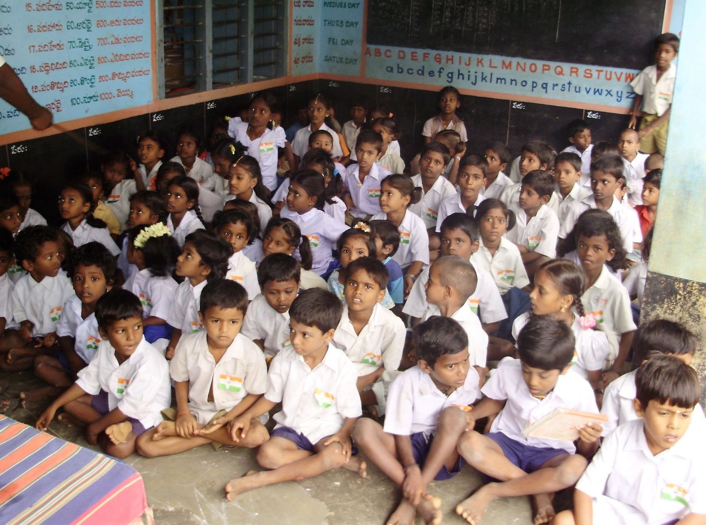

# પ્રાથમિક શાળા

*ભારતમાં આવેલી એક પ્રાથમિક શાળાનો વર્ગખંડ*

પ્રાથમિક શાળા એટલે પ્રાથમિક શિક્ષણ આપવામાં આવતું હોય તે શાળા.

ગુજરાત રાજ્યમાં કે ધોરણ ૧ થી ૮ ધોરણ સુધીના શિક્ષણને પ્રાથમિક શિક્ષણ કહેવાય છે. લગભગ બધાં જ ગામોમાં પ્રાથમિક શાળા આવેલી છે. ધોરણ ૧ થી ૪ માટેની વર્ગશાળાઓ તેમ જ કન્યા કેળવણી માટેની કન્યાશાળાઓ પણ આવેલી છે. ૧ થી ૫ ધોરણ પ્રાથમિક શિક્ષણ અને ૬ થી ૮ ધોરણ એ ઉચ્ચત્તર પ્રાથમિક શિક્ષણ કહેવાય છે. આ શાળાઓ મોટેભાગે ગ્રામ્ય વિસ્તારમાં જિલ્લા પંચાયત દ્વારા સંચાલિત હોય છે, જ્યારે શહેરી વિસ્તારોમાં નગરપાલિકા દ્વારા આ શાળાઓ ચલાવવામાં આવે છે. કેટલીક શાળાઓમાં ઉદ્યોગ શિક્ષણ તરીકે કાંતણ, કૃષિ જેવા વિષયો પણ શીખવાડવામાં આવે છે. આ ઉપરાંત ઘણી જગ્યાએ ખાનગી ટ્રસ્ટો કે સંસ્થાઓ દ્વારા પણ પ્રાથમિક શાળાઓ ચલાવવામાં આવે છે. કેટલીક પ્રાથમિક શાળાઓ અંગ્રેજી અને અન્ય ભાષાના માધ્યમોમાં પણ ચલાવવામાં આવે છે.

બાળકોને પુરતું પોષણ મળી રહે તે હેતુથી ઘણા રાજ્યોમાં પ્રાથમિક શાળાઓમાં મધ્યાહ્ન ભોજન નામની યોજના ચલાવવામાં આવે છે, જેમાં બપોરની રિસેસમાં બાળકોને ભોજન આપવામાં આવે છે.

## આ પણ જુઓ

- માધ્યમિક શાળા
- ઉચ્ચતર માધ્યમિક શાળા

---
Source: https://gu.wikipedia.org/wiki/%E0%AA%AA%E0%AB%8D%E0%AA%B0%E0%AA%BE%E0%AA%A5%E0%AA%AE%E0%AA%BF%E0%AA%95_%E0%AA%B6%E0%AA%BE%E0%AA%B3%E0%AA%BE
