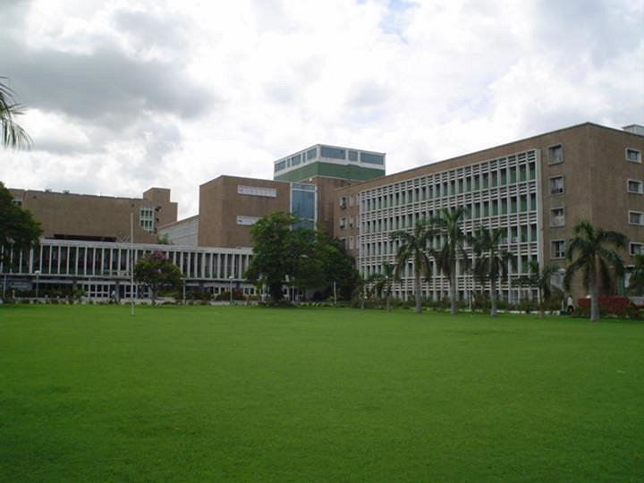

# अखिल भारतीय आयुर्विज्ञान संस्थान

अखिल भारतीय आयुर्विज्ञान संस्थान (एम्स , AIIMS), भारत के सार्वजनिक आयुर्विज्ञान महाविद्यालयों का समूह है। इस समूह में नई दिल्ली स्थित भारत का सबसे पुराना उत्कृष्ट एम्स संस्थान है। इसकी आधारशिला 4 अप्रैल 1952 में रखी गयी और इसका सृजन 1956 में संसद के एक अधिनियम के माध्‍यम से एक स्‍वायत्त संस्‍थान के रूप में किया गया। एम्स चौक दिल्ली के रिंग रोड पर पड़ने वाला चौराहा है, इसे अरविन्द मार्ग काटता है।

सन् 2012 में डा• मनमोहन सिंह सरकार द्वारा वर्ष 2012 में 1 एम्स भारत के रायबरेली में खोले गए। इसके बाद सन् 2014 से नरेन्द्र मोदी सरकार ने 14 अन्य एम्स संस्थान भारत के अन्य भागों में निर्माण की आधारशिला रखी ताकि दूर दराज के लोगों को बेहतर इलाज की सुविधायें पाई जा सकें। सन् 2022 तक हर राज्य में एक एम्स खोलने का विचार है। [ 1 ]

## संस्थान

*एम्स दिल्ली के मध्य स्थित लान*

| नम्बर | नाम | लघु नाम | स्थापना | शहर | प्रदेश/UT |
| --- | --- | --- | --- | --- | --- |
| 1 | एम्स दिल्ली | एम्स | 1956 | नई दिल्ली | दिल्ली |
| 2 | एम्स भोपाल | एम्स | 2012 | भोपाल | मध्य प्रदेश |
| 3 | एम्स भुवनेश्वर | एम्स | 2012 | भुवनेश्वर | ओडिशा |
| 4 | एम्स जोधपुर | एम्स | 2012 | जोधपुर | राजस्थान |
| 5 | एम्स पटना | जे पी एन-एम्स | 2012 | पटना | बिहार |
| 6 | एम्स रायपुर | एम्स | 2012 | रायपुर | छत्तीसगढ़ |
| 7 | एम्स ऋषिकेश | एम्स | 2012 | ऋषिकेश | उत्तराखंड |

## भविष्य के एम्स

*भविष्य के एम्स और स्थान, क्रमबद्ध (केंद्र सरकार अनुमोदित)*

| नम्बर | नाम | शहर | प्रदेश/UT |
| --- | --- | --- | --- |
| 1 | एम्स गोरखपुर | गोरखपुर | उत्तर प्रदेश |
| 2 | एम्स मंगलगिरि | मंगलगिरि | आन्ध्र प्रदेश |
| 3 | एम्स नागपुर | नागपुर | महाराष्ट्र |
| 4 | एम्स कल्याणी | कल्याणी | पश्चिम बंगाल |
| 5 | एम्स दरभंगा | दरभंगा | बिहार |
| 6 | एम्स भटिंडा | भटिंडा | पंजाब |
| 7 | एम्स मदुरै | मदुरै | तमिलनाडु |
| 8 | एम्स बिलासपुर | बिलासपुर | हिमाचल प्रदेश |
| 9 | एम्स देवघर | देवघर | झारखण्ड |
| 10 | एम्स कामरूप | छंगसारी | असम |
| 11 | एम्स गुजरात | राजकोट | गुजरात |
| 12 | एम्स जम्मू | विजयपुर | जम्मू और कश्मीर |
| 13 | एम्स कश्मीर | अवन्तिपुरा | जम्मू और कश्मीर |

मार्च 2019 में, बिहार के मुख्यमन्त्री नीतीश कुमार ने कहा कि बिहार में दूसरा एम्स दरभंगा में स्थापित किया जाएगा, उत्तर बिहार में मिथिला क्षेत्र की सेवा के रूप में दरभंगा मेडिकल कॉलेज और अस्पताल को एम्स में अपग्रेड किया जाएगा। [ 2 ]

## उद्देश्य

अखिल भारतीय आयुर्विज्ञान संस्‍थान की स्‍थापना सभी शाखाओं में स्‍नातक और स्‍नातकोत्तर चिकित्‍सा शिक्षा में अध्‍यापन के पैटर्न विकसित करने के उद्देश्‍य से राष्‍ट्रीय महत्‍व के एक संस्‍थान के रूप में की गई थी, ताकि भारत में चिकित्‍सा शिक्षा के उच्‍च मानक प्रदर्शित किए जा सकें तथा स्‍वास्‍थ्‍य गतिविधि की सभी महत्‍वपूर्ण शाखाओं में कार्मिकों के प्रशिक्षण हेतु उच्‍चतम स्‍तर की शैक्षिक सुविधाएँ एक ही स्‍थान पर लाने और स्‍नातकोत्तर चिकित्‍सा शिक्षा में आत्‍मनिर्भरता पाई जा सके।

## अध्यापन

संस्‍थान में अध्‍यापन, अनुसन्धान और रोगियों की देखभाल के लिए व्‍यापक सुविधाएँ हैं। एम्‍स द्वारा स्‍नातक और स्‍नातकोत्तर दोनों ही स्‍तरों पर चिकित्‍सा तथा पैरामेडिकल पाठ्यक्रमों में अध्‍यापन कार्यक्रम चलाए जाते हैं और यह छात्रों को अपनी ही डिग्री देता है। यहाँ 42 विषयों में अध्‍यापन और अनुसन्धान आयोजित किए जाते हैं। एम्‍स में एक नर्सिंग महाविद्यालय भी चलाया जाता है और यहां बी. एससी. (ऑन) नर्सिंग पोस्‍ट प्रमाण पत्र डिग्री के लिए छात्रों को प्रशिक्षण भी दिया जाता है।

एम्‍स द्वारा हरियाणा के वल्‍लभ गढ़ में व्‍यापक ग्रामीण स्‍वास्‍थ्‍य देखभाल केन्‍द्र में 60 बिस्‍तरों वाले अस्‍पताल का भी प्रबन्धन किया जा रहा है और यहाँ सामुदायिक उपचार के लिए केन्‍द्र के माध्‍यम से लगभग 2.5 लाख आबादी को स्‍वास्‍थ्‍य सुविधाएँ दी जाती हैं।

## इन्हें भी देखें

- राष्ट्रीय पात्रता व प्रवेश परीक्षा (नीट)
- भारतीय प्रौद्योगिकी संस्थान
- राष्ट्रीय प्रौद्योगिकी संस्थान
- भारतीय प्रबन्धन संस्थान

## बाहरी कड़ियाँ

- अखिल भारतीय आयुर्विज्ञान संस्थान का आधिकारिक जालस्थल
- 13 नए एम्स

---
Source: https://hi.wikipedia.org/wiki/%E0%A4%85%E0%A4%96%E0%A4%BF%E0%A4%B2_%E0%A4%AD%E0%A4%BE%E0%A4%B0%E0%A4%A4%E0%A5%80%E0%A4%AF_%E0%A4%86%E0%A4%AF%E0%A5%81%E0%A4%B0%E0%A5%8D%E0%A4%B5%E0%A4%BF%E0%A4%9C%E0%A5%8D%E0%A4%9E%E0%A4%BE%E0%A4%A8_%E0%A4%B8%E0%A4%82%E0%A4%B8%E0%A5%8D%E0%A4%A5%E0%A4%BE%E0%A4%A8
