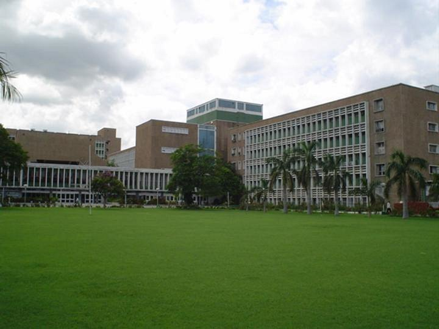

# அனைத்திந்திய மருத்துவ அறிவியல் கழகம்

*அனைத்திந்திய மருத்துவ அறிவியல் கழக மையப்புல்வெளி*

அனைத்திந்திய மருத்துவ அறிவியல் கழகம் ( All India Institute of Medical Sciences, AIIMS ), எய்ம்சு தன்னாட்சி பெற்ற பொதுத்துறை உயர்கல்வி மருத்துவக் கல்லூரிக் குழுமம் ஆகும். இந்த மருத்துவமனைகள் நாடாளுமன்ற சட்டத்தின்படி தேசிய முதன்மைக் கழகங்களாக அறிவிக்கப்பட்டுள்ளன. [ 1 ] இவற்றின் முன்னோடியான அனைத்திந்திய மருத்துவ அறிவியல் கழகம் புது தில்லி, இந்தியாவில் உள்ள மிக முக்கியமான மருத்துவக்கல்லூரி மற்றும் மருத்துவமனையாகும். இக்கழகம், 1956 - ஆம் ஆண்டு நியூசிலாந்து அரசாங்கத்தால் கொடுக்கப்பட்ட உதவித்தொகையில் கட்டப்பட்டது. இம்மையம், தில்லியின் தென்பகுதியில் உள்ள அன்சாரி நகரில் உள்ளது [ 2 ] .

## கல்லூரி மற்றும் மருத்துவமனைகள்

அனைத்திந்திய மருத்துவ அறிவியல் கழகங்கள் அமைந்துள்ள இடங்களாவன:

| எண், | பெயர் | அறிவிக்கப்பட்டது | நிறுவப்பட்டது | நகரம் | மாநிலம்/யூபி | கட்டம் | நிலை | MBBS Intake [ 3 ] | NIRF Ranking [ 4 ] |
| --- | --- | --- | --- | --- | --- | --- | --- | --- | --- |
| 1 | எய்ம்ஸ் தில்லி | 1952 | 1956 | புது தில்லி | தில்லி |  | இயக்கத்தில் | 125+7 | 1 |
| 2 | எய்ம்ஸ் போபால் | 2003 [ 5 ] [ 6 ] | 2012 | போபால் | மத்தியப் பிரதேசம் | I | இயக்கத்தில் | 125 |  |
| 3 | எய்ம்ஸ் புவனேசுவர் | 2003 [ 5 ] [ 6 ] | 2012 | புவனேசுவரம் | ஒடிசா | I | இயக்கத்தில் | 125 | 26 |
| 4 | எய்ம்ஸ் ஜோத்பூர் | 2003 [ 5 ] [ 6 ] | 2012 | சோத்பூர் | இராசத்தான் | I | இயக்கத்தில் | 125 | 16 |
| 5 | எய்ம்ஸ் பாட்னா | 2003 [ 5 ] [ 6 ] | 2012 | பட்னா | பீகார் | I | இயக்கத்தில் | 125 |  |
| 6 | எய்ம்ஸ் ராய்ப்பூர் | 2003 [ 5 ] [ 6 ] | 2012 | ராய்ப்பூர், சத்தீஸ்கர் | சத்தீசுகர் | I | இயக்கத்தில் | 125 | 49 |
| 7 | எய்ம்ஸ் ரிஷிகேஷ் | 2003 [ 5 ] [ 6 ] | 2012 | ரிசிகேசு | உத்தராகண்டம் | I | இயக்கத்தில் | 125 | 48 |
| 8 | எய்ம்ஸ் ரேபரலி | 2012 | 2018 [ 7 ] | ரேபரலி | உத்தரப் பிரதேசம் | II | இயக்கத்தில் [ 8 ] | 100 |  |
| 9 | எய்ம்ஸ் மங்களகிரி | 2014 | 2018 | குண்டூர் | ஆந்திரப் பிரதேசம் | IV | பகுதி இயக்கத்தில் [ 8 ] | 125 |  |
| 10 | எய்ம்ஸ் நாக்பூர் | 2014 | 2018 | நாக்பூர் | மகாராட்டிரம் | IV | இயக்கத்தில் [ 8 ] | 125 |  |
| 11 | எய்ம்ஸ் கோரக்பூர் | 2015 | 2019 [ 9 ] | கோரக்பூர் | உத்தரப் பிரதேசம் | IV | இயக்கத்தில் [ 8 ] | 125 |  |
| 12 | எய்ம்ஸ் கல்யாணி | 2014 | 2019 [ 10 ] | கல்யாணி | மேற்கு வங்காளம் | IV | பகுதி இயக்கத்தில் [ 8 ] | 125 |  |
| 13 | எய்ம்ஸ் பட்டிண்டா | 2014 | 2019 [ 11 ] | பட்டிண்டா | பஞ்சாப் (இந்தியா) | V | பகுதி இயக்கத்தில் [ 8 ] | 100 |  |
| 14 | எய்ம்ஸ் கவுகாத்தி | 2015 | 2020 [ 12 ] | Changsari | அசாம் | V | வகுப்புகள் ஆரம்பிக்கப்பட்டுள்ளன [ 8 ] | 100 |  |
| 15 | எய்ம்ஸ் விஜய்பூர் | 2015 | 2020 [ 13 ] | விஜய்பூர் | ஜம்மு காஷ்மீர் (ஒன்றியப் பகுதி) | V | வகுப்புகள் ஆரம்பிக்கப்பட்டுள்ளன [ 8 ] | 62 |  |
| 16 | எய்ம்ஸ் பிலாசுப்பூர் | 2015 | 2020 [ 14 ] | பிலாசுப்பூர் (இமாசலப் பிரதேசம்) | இமாச்சலப் பிரதேசம் | V | இயக்கத்தில் [ 8 ] | 100 |  |
| 17 | எய்ம்ஸ் மதுரை | 2015 | 2021 | மதுரை | தமிழ்நாடு | V | வகுப்புகள் ஆரம்பிக்கப்பட்டுள்ளன [ 15 ] [ 16 ] | 50 |  |
| 18 | எய்ம்ஸ் தர்பங்கா | 2015 |  | தர்பங்கா | பீகார் | V | கட்டுமானத்தில் [ 17 ] |  |  |
| 19 | எய்ம்ஸ் அவந்திபோரா | 2015 |  | அவந்திபோரா | ஜம்மு காஷ்மீர் (ஒன்றியப் பகுதி) | V | கட்டுமானத்தில் |  |  |
| 20 | எய்ம்ஸ் தேவ்கர் | 2017 | 2019 [ 18 ] | தேவ்கர் | சார்க்கண்டு | VI | இயக்கத்தில் | 125 |  |
| 21 | எய்ம்ஸ் ராஜ்கோட் | 2017 | 2020 [ 19 ] | ராஜ்கோட் | குசராத்து | VI | வகுப்புகள் ஆரம்பிக்கப்பட்டுள்ளன [ 8 ] | 50 |  |
| 22 | எய்ம்ஸ் பிபிநகர் | 2017 | 2019 [ 20 ] | Bibinagar | தெலங்காணா | VII | பகுதி இயக்கத்தில் [ 8 ] | 100 |  |
| 23 | எய்ம்ஸ் மனேதி | 2019 |  | Manethi | அரியானா | VIII | கட்டுமானத்தில் |  |  |
| 24 | எய்ம்ஸ் மணிப்பூர் | 2022 |  |  | மணிப்பூர் |  | அறிவிக்கப்பட்டது [ 21 ] |  |  |
| 25 | எய்ம்ஸ் கருநாடகம் | 2022 |  |  | கருநாடகம் |  | முன்மொழியப்பட்டது [ 22 ] |  |  |

## துறைகள்

- உணர்வகற்றலியல்
- உடற்கூறியல்
- உயிர் வேதியியல்
- உயிரி மருத்துவப் பொறியியல்
- உயிர் இயற்பியல்
- உயிரியல் புள்ளிவிவரம்
- உயிரித் தொழில்நுட்பம்
- இதயஇயல்
- சமூக மருத்துவ மையம்
- செவிலியக்கல்லூரி
- தோலியல் மற்றும் பால்வினை நோய் இயல்
- நாளமில்லா சுரப்பியல், வளர்சிதை மாற்றம் மற்றும் நீரிழிவு
- மருத்துவத்தடையயியல்
- இரைப்பை குடல் இயல் மற்றும் மனித ஊட்டச்சத்து
- இரையக குடலிய அறுவை சிகிச்சை
- குருதியியல்
- மருத்துவமனை நிருவாகம்
- ஆய்வக மருத்துவம்
- மருத்துவம்
- நுண்ணுயிரியல்
- சிறுநீரகவியல்
- அணுவியல் மருத்துவம்
- அணுக்கருக்காந்த ஒத்ததிர்வு வரைவு
- மகப்பேறியல் மற்றும் மகளிர் நலவியல்
- எலும்பியல்
- செவிநாசிமிடற்றியல்
- குழந்தை மருத்துவம்
- குழந்தை மருத்துவ அறுவை சிகிச்சை
- நோயியல்
- மருந்தியல்
- உடலியல்
- உடல் மருத்துவம் மற்றும் புனர்வாழ்வு
- மனநோய்கான சிகிச்சை
- கதிரியக்க அறுதியிடல்
- இனப்பெருக்க உயிரியல்
- அறுவைசிகிச்சைப்பிரிவுகள்
- ஒட்டறுவை எதிர்ப்பியல் மற்றும் எதிர்ப்பு மரபியல்
- இரத்தம் ஏற்றல் மருத்துவம்
- சிறுநீரக இயல்

## இணையதளங்கள்

- அனைத்திந்திய மருத்துவ அறிவியல் கழகம்

---
Source: https://ta.wikipedia.org/wiki/%E0%AE%85%E0%AE%A9%E0%AF%88%E0%AE%A4%E0%AF%8D%E0%AE%A4%E0%AE%BF%E0%AE%A8%E0%AF%8D%E0%AE%A4%E0%AE%BF%E0%AE%AF_%E0%AE%AE%E0%AE%B0%E0%AF%81%E0%AE%A4%E0%AF%8D%E0%AE%A4%E0%AF%81%E0%AE%B5_%E0%AE%85%E0%AE%B1%E0%AE%BF%E0%AE%B5%E0%AE%BF%E0%AE%AF%E0%AE%B2%E0%AF%8D_%E0%AE%95%E0%AE%B4%E0%AE%95%E0%AE%AE%E0%AF%8D
