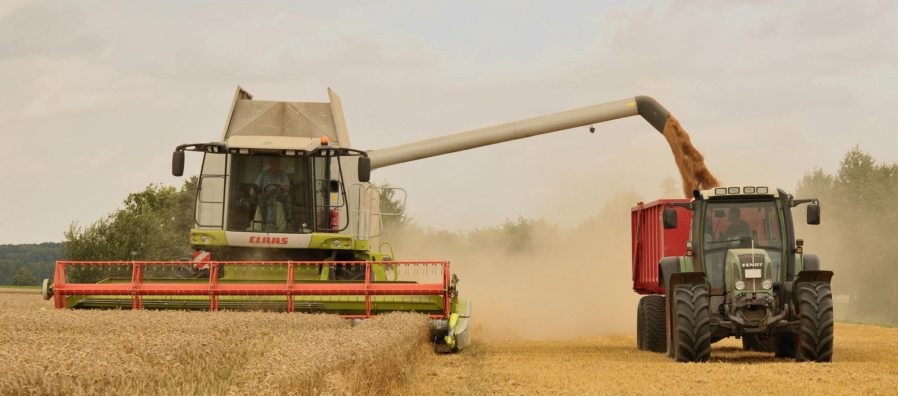
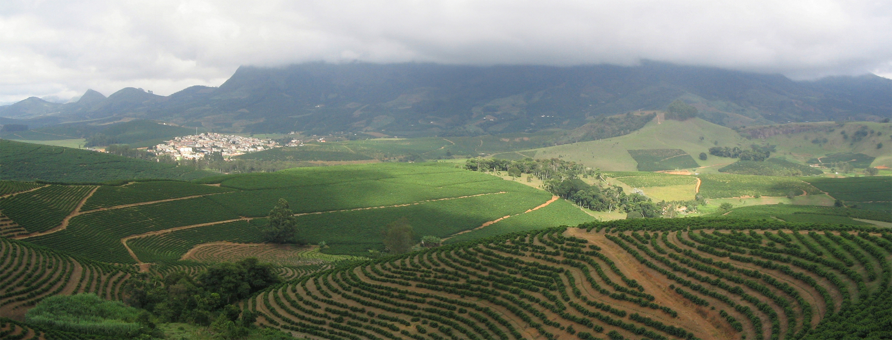

# কৃষি

কৃষি হ'ল জীৱন ধাৰণৰ বাবে প্ৰয়োজনীয় জীৱ-জন্তু, পক্ষী, উদ্ভিদ তথা অন্যান্য জীৱ ভিত্তিক খাদ্য নাইবা পণ্যৰ উৎপাদন প্ৰণালী। ইয়াক খেতি বুলিও কোৱা হয়। কৃষি আদিম মানৱ সভ্যতাৰ বিকাশৰ এক চালিকা শক্তি। জীৱন ধাৰণৰ বাবে প্ৰয়োজনীয় বিভিন্ন বন্য জীৱ প্ৰজাতিৰ ঘৰচীয়াকৰণ আৰু খেতিয়ে সৃষ্টি কৰা খাদ্য-শস্য-পণ্যৰ ৰাহিয়ে সভ্যতাৰ বিকাশত সাৰপানী দিছিল। কৃষিৰ বিজ্ঞানসন্মত অধ্যয়ন তথা গৱেষণা বিদ্যাৰ সুঁতিটোক কৃষি বিজ্ঞান বোলা হয়।

*ট্ৰেক্টৰ আৰু ট্ৰেলাৰসহ এটা কম্বাইন হাৰভেষ্টাৰৰ দ্বাৰা ঘেহু সংগ্ৰহ কৰা হৈছে*

কৃষিকাৰ্য বা কৃষি মানবজাতিৰ আদিমতম পেচা হিচাপে চিহ্নিত। মানুহৰ জীবনধাৰণৰ বাবে শষ্য উৎপাদন বা গৃহপালিত পশু ৰক্ষণাবেক্ষণৰ বাবে যথোচিত খাদ্য আৰু প্ৰয়োজনীয় কেঁচামাল উৎপাদন আৰু সৰবৰাহৰ লগতে অন্য বহু উদ্দেশ্যত প্ৰতিপালনৰ অৰ্থে কৃষিকাৰ্য কৰা হয়। কৃষি কাৰ্য কৰাজনক কৃষক বোলে।

কৃষিকাৰ্যৰ ইতিহাস হাজাৰ হাজাৰ বছৰ পুৰণি। আধুনিক কালত কৃষিৰ উন্নয়ন আৰু উত্তৰণ বহুমুখী জলবায়ু , সংস্কৃতি আৰু উন্নত প্ৰযুক্তি ব্যৱহাৰৰ ওপৰত বহু পৰিমাণে নিৰ্ভৰশীল। সকলো ধৰণৰ কৃষিকাৰ্যত উপযুক্ত কলা-কৌশল প্ৰয়োগ আৰু ভূমি ৰ উপযুক্ততা নিৰূপণপূৰ্বক ব্যৱহাৰ উপযোগী উৎপাদনৰ ওপৰত নিৰ্ভৰ কৰে। প্ৰয়োজন সাপেক্ষে উৎপাাাদন বৃদ্ধিৰ বাবে সময়ে সময়ে প্ৰয়োজনীয় জলসিঞ্চন কৰিবলগীয়া হয়।

কৃষিজাত সামগ্ৰী বৃদ্ধিৰ বাবে আধুনিক কালত কীটনাশক , উদ্ভিদৰ পৰাগণ, সাৰ প্ৰয়োগ আৰু প্ৰযুক্তিৰ ক্ৰমবৰ্ধমান উন্নয়নৰ মাজেৰে ক্ৰমবৰ্ধমান চাহিদা পূৰণৰ প্ৰয়াস চালোৱা হৈছে। ফলত, পৰিৱেশৰ ভাৰসাম্যহীনতাসহ জীববৈচিত্ৰ্যৰ ধ্বংস যজ্ঞ দ্ৰুত হাৰে বৃদ্ধি পাইছে আৰু মানব স্বাস্থ্য ৰ ওপৰ নেতিবাচক আৰু বিৰূপ প্ৰভাব পৰিছে। [ 1 ]

## উৎপাদিত কৃষি পণ্য

উৎপাদিত কৃষি পণ্যক কেইবাটাও প্ৰধান ভাগত ভাগ কৰা হৈছে। ইয়াৰ ভিতৰত খাদ্য , তন্তুজাত পদাৰ্থ, ইন্ধন আৰু কেঁচামাল সামগ্ৰী অন্যতম। একবিংশ শতাব্দীত উদ্ভিদ ৰ পৰা জৈৱইন্ধন, জৈৱঔষধ, জৈৱপ্লাষ্টিকজাত পণ্য [ 2 ] উৎপাদনসহ ঔষধ শিল্প ত [ 3 ] ব্যৱহাৰ কৰা হৈছে। নিৰ্দিষ্ট খাদ্যসামগ্ৰীৰ ভিতৰত আঁহজাতীয় শষ্য, শাক−পাচলি , ফলমূল আৰু মাংস ; তন্তুজাত দ্ৰব্যৰ ভিতৰত তুলা , উণ, ৰেচম আদি; কেঁচামালৰ ভিতৰত কাঠ আৰু বাঁহ অন্যতম। অন্যান্য প্ৰয়োজনীয় উদ্ভিদজাত পণ্যৰ ভিতৰত ৰেজিনে গুৰুত্বপূৰ্ণ স্থান দখল কৰে আছে। জৈৱইন্ধন হিচাপে মিথেন , ইথানল আৰু বায়োডিজেল আদি। ইয়াৰোপৰি, ফুল, পোহনীয়া প্ৰাণী , বিশেষ প্ৰজাতিৰ মাছ, চৰাই কৃষি পণ্য হিচাপে বিবেচিত। বিশ্ববেংক ৰ নিৰ্দেশনা আৰু লক্ষ্যমাত্ৰা অনুসৰি খাদ্য উৎপাদন বৃদ্ধি আৰু জল ব্যবস্থাপনা ৰ ওপৰত বিশ্বব্যাপী সচেতনতা বৃদ্ধিৰ লগতে বিতৰ্ক ৰ পৰিবেশ সৃষ্টি হৈছে। [ 4 ]

২০০৭ চনত বিশ্ব ৰ এক-তৃতীয়াংশ লোক কৃষিৰ সৈতে জড়িত আছিল। [ 5 ] কিন্তু ইমান বিশাল কৰ্মক্ষেত্ৰতা, কৃষিজাত পণ্য উৎপাদন প্ৰভৃতি বিষয় থকা সত্ত্বেও বৈশ্বিক মুঠ উৎপাদন ত ইয়াৰ অৱদান ৫%-তকৈও কম।

## ইন্ধন আৰু কৃষি

১৯৪০-ৰ দশক পৰা কৃষি উৎপাদন অত্যন্ত নাটকীয়ভাবে বৃদ্ধি পাইছিল। ইয়াৰ প্ৰধান কাৰণ আছিল ইন্ধন নিৰ্ভৰ যান্ত্ৰিক পৰিবহণ , সাৰ আৰু কীটনাশকৰ ব্যাপক ব্যৱহাৰ। ইয়াৰে বেছিভাগ হৈছে জীবাশ্ম বা কয়লাজাত ইন্ধন। [ 6 ]

*কফি খেতি, ব্ৰাজিল*

## কৃষি নীতি

কৃষি নীতিৰ যোগেদি কৃষিজাত পণ্য উৎপাদন, বিপণন , সৰবৰাহ পদ্ধতিৰ ওপৰত কিছুমান নিয়ম নিৰ্ধাৰণ কৰা হৈছে। সচৰাচৰ কৃষিকাৰ্যৰ নীতিসমূহ প্ৰণয়নৰ সময় নিম্নোক্ত প্ৰধান বিষয়সমূহ আলোকপাত কৰা হয় -

- খাদ্য সংৰক্ষণ
- অৰ্থনৈতিক স্থিতিশীলতা
- পৰিবেশৰ ভাৰসাম্যতা
- খাদ্যৰ গুণগতমান
- খাদ্যৰ সহজলভ্যতা
- খাদ্য নিৰাপত্তা [ 7 ] [ 8 ]
- দাৰিদ্ৰ দূৰীকৰণ

## গ্ৰন্থপঞ্জী

- Alvarez, Robert A. (2007). "The March of Empire: Mangos, Avocados, আৰু the Politics of Transfer" . Gastronomica , Vol. 7, No. 3, 28–33. Retrieved on 12 November 2008.
- Bolens, L. (1997). "Agriculture" in Selin, Helaine (ed.), Encyclopedia of the history of Science, technology, আৰু Medicine in Non Western Cultures . Kluwer Academic Publishers, Dordrecht/Boston/London, pp. 20–22.
- Collinson, M. (ed.) A History of Farming Systems Research . CABI Publishing, 2000. আই.এচ.বি.এন. 978-0-85199-405-5
- Crosby, Alfred W.: The Columbian Exchange: Biological আৰু Cultural Consequences of 1492 . Praeger Publishers, 2003 (30th Anniversary Edition). আই.এচ.বি.এন. 978-0-275-98073-3
- Davis, Donald R.; Riordan, Hugh D. (2004). "Changes in USDA Food Composition Data for 43 Garden Crops, 1950 to 1999". Journal of the American College of Nutrition , Vol. 23, No. 6, 669–682.
- Duplessis, Robert. S. (1997). "Transitions to Capitalism in Early Modern Europe." Cambridge University Press.
- Friedland, William H.; Barton, Amy (1975). "Destalking the Wily Tomato: A Case Study of Social Consequences in California Agricultural Research". Univ. California at Sta. Cruz, Research Monograph 15.
- Mazoyer, Marcel; Roudart, Laurence (2006). A history of world agriculture : from the Neolithic Age to the current crisis . Monthly Review Press, New York. আই.এচ.বি.এন. 978-1-58367-121-4
- Saltini A. Storia delle scienze agrarie , 4 vols, Bologna 1984–89, আই.এচ.বি.এন. 978-88-206-2412-5 , আই.এচ.বি.এন. 978-88-206-2413-2 , আই.এচ.বি.এন. 978-88-206-2414-9 , আই.এচ.বি.এন. 978-88-206-2414-9
- Watson, A.M. (1974). "The Arab agricultural revolution আৰু its diffusion", in The Journal of Economic History , 34.
- Watson, A.M. (1983). Agricultural Innovation in the Early Islamic World , Cambridge University Press.
- Wells, Spencer (2003). The Journey of Man: A Genetic Odyssey . Princeton University Press. আই.এচ.বি.এন. 978-0-691-11532-0
- Wickens, G.M. (1976). "What the West borrowed from the Middle East", in Savory, R.M. (ed.) Introduction to Islamic Civilization . Cambridge University Press.

## বহিঃসংযোগ

- Agriculture from UCB Libraries GovPubs
- Agriculture আৰু Rural development from the World Bank
- The World Bank on Agricultural water management
- Gender in agriculture আৰু rural development (FAO)
- Index to the Manuscript Collections [ সংযোগবিহীন উৎস ] Special Collections, National Agricultural Library
- The American Society of Agronomy (ASA)
- International Federation of Agricultural Producers (IFAP)
- NIOSH Agriculture Page – safety laws, tips, আৰু guidelines
- U.S. House Committee on Agriculture – Glossary of agricultural terms, programs আৰু laws
- UKAgriculture.com – Advance the education of the public in all aspects of agriculture, the countryside আৰু the rural economy
- Collection of Agriculture Dictionaries
- Peace Palace Library – Research Guide

Farmer Power: The Continuing Confrontation between Subsistence Farmers আৰু Development Bureaucrats by Tony Waters at Ethnography.com

---
Source: https://as.wikipedia.org/wiki/%E0%A6%95%E0%A7%83%E0%A6%B7%E0%A6%BF
