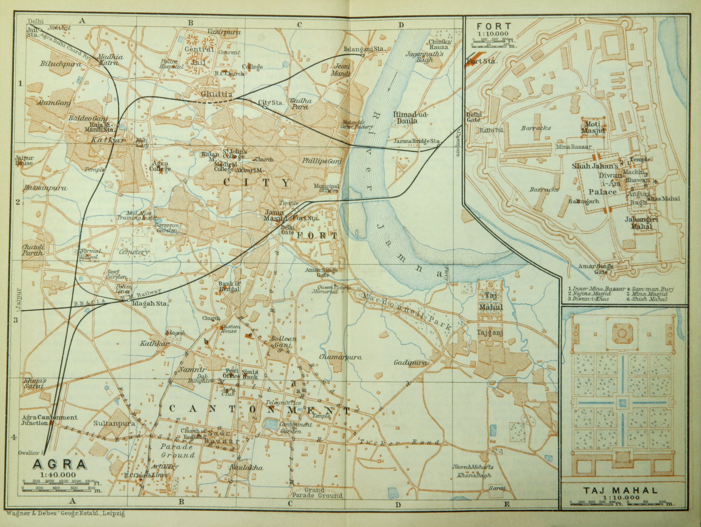

# আগ্রা

| আগ্রা হিন্দি : आगरा উর্দু : آگرہ ‎‎ |
| --- |
| শহর |
|  |
| তাজমহল |
| দেশ |
| রাজ্য |
| জেলা |
| প্রতিষ্ঠাতা |
| আয়তন |
| • মোট |
| উচ্চতা |
| জনসংখ্যা (2008) |
| • মোট |
| • জনঘনত্ব |
| ভাষা |
| • সরকারি |
|  |
| সময় অঞ্চল |
| পিন |
| টেলিফোন কোড |
| যানবাহন নিবন্ধন |
| ওয়েবসাইট |

*১৯১৪ সালে ব্রিটিশ শাসিত আগ্রা শহরের মানচিত্র*

আগ্রা ( হিন্দি : आगरा; উর্দু : آگرہ) উত্তর ভারতের উত্তরপ্রদেশ রাজ্যের আগ্রা জেলার রাজধানী শহর। [ ১ ] আগ্রা শহরটি ভারতের রাজধানী নয়াদিল্লি থেকে প্রায় ২৩০ কিলোমিটার (১৪০ মাইল) দক্ষিণ-পূর্বে যমুনা নদীর তীরে অবস্থিত। আগ্রা একটি রেলওয়ে জংশন এবং আশেপাশের কৃষি এলাকার জন্য এটি একটি বাণিজ্যিক ও শিল্পকেন্দ্র হিসেবে কাজ করে। আগ্রা শহরে তুলা, খাদ্যশস্য , তামাক, লবণ ও চিনির পাইকারি বাণিজ্য হয়। এখানকার কলকারখানায় খাদ্য প্রক্রিয়াকরণ এবং সুতির টেক্সটাইল, কার্পেট, লোহা ও ইস্পাত উৎপাদন সম্পন্ন হয়। আগ্রাতে প্রায় সাড়ে ১৬ লক্ষ লোকের বাস।

আগ্রাতে অবস্থিত ঐতিহাসিক সৌধগুলির মধ্যে সবচেয়ে বিখ্যাত হল পৃথিবীর সপ্তম আশ্চর্যের এক আশ্চর্য তাজমহল । [ ১ ] [ ২ ] আগ্রা আরও বেশ কিছু ইন্দো-সারাসেনীয় স্থাপত্যকর্মের জন্য বিখ্যাত, যাদের মধ্যে আছে মুঘল সম্রাট আকবরের জন্য নির্মিত শ্বেত মর্মরের জাহাঙ্গীরী মহল এবং ১৭শ শতকের শুরুর দিকে নির্মিত মোতি মসজিদ বা মুক্তার মসজিদ। [ ২ ] [ ৩ ]

আগ্রার শিক্ষাপ্রতিষ্ঠানগুলির মধ্যে আছে ১৯২৭ সালে স্থাপিত আগ্রা বিশ্ববিদ্যালয়, ১৯৮১ সালে স্থাপিত দয়ালবাগ এডুকেশনাল ইন্সটিটিউট এবং একটি চিকিৎসা মহাবিদ্যালয় (মেডিক্যাল কলেজ)।

মুঘল সম্রাট আকবর ১৫৬৬ সালে বর্তমান আগ্রা শহরটি প্রতিষ্ঠা করেন। [ ১ ] [ ২ ] অল্পদিনেই এটি সংস্কৃতি ও জ্ঞানচর্চার একটি কেন্দ্রে পরিণত হয়। ১৬৪৮ সাল পর্যন্ত এটি মুঘল সাম্রাজ্যের রাজধানী ছিল। [ ২ ] ঐ বছর সম্রাট আওরঙ্গজেব রাজধানী দিল্লিতে সরিয়ে নেন। ১৮০৩ সালে আগ্রা ব্রিটিশদের পদানত হয়। ১৮২৫ সাল থেকে এটি একটি প্রাদেশিক রাজধানী ও প্রশাসনিক কেন্দ্র হিসেবে ভূমিকা পালন করে আসছে।

আগ্রার মর্মর পাথর ও চামড়ার কুটিরশিল্প বিখ্যাত।

---
Source: https://bn.wikipedia.org/wiki/%E0%A6%86%E0%A6%97%E0%A7%8D%E0%A6%B0%E0%A6%BE
