# কৃষিকাজ

| কৃষি |
| --- |
|  |
| দেখান কৃষিকাজের ইতিহাস প্রাচীন মিশর প্রাচীন গ্রিস প্রাচীন রোম অস্ট্রোনেশিয়া কৃষি বিজ্ঞান আরব কৃষি বিপ্লব আর্জেন্টিনা কানাড চীন চিলি কলম্বিয়ান এক্সচেঞ্জ সবুজ বিপ্লব ভারতীয় উপমহাদেশ মেসোআমেরিকা মধ্যযুগ নব্যপ্রস্তর যুগীয় বিপ্লব জৈব চাষ ফিলিস্তিন পেরু যুক্তরাজ্য ব্রিটিশ কৃষি বিপ্লব চেশায়ার স্কটল্যান্ড মার্কিন যুক্তরাষ্ট্র আফ্রিকান-আমেরিকান ক্যালিফোর্নিয়া |
| দেখান খামার Agrivoltaic পশুপালনবিদ্যা গরু শূকর পোল্ট্রি ভেড়া দুগ্ধ শুষ্কভূমি বিস্তীর্ণ সার Free-range চারণ একান্তর পশুপালন চক্রাকার চারণ শখ নিবিড় পশুপাখি শূকর পালন crops Natural এক ফসলী চাষ Orchard জৈব খামার ব্যবস্থা ধানখেত Ranching বর্গা ব্যবস্থা Sowing Colonia Slash-and-burn Smallholding Terrace Steam sterilization |
| দেখান হাইড্রোকালচার অ্যাকুয়াকালচার অ্যাকুয়াপনিক্স হাইড্রোপনিক্স এরোপনিক্স |
| দেখান সম্পর্কিত কৃষি ব্যবসা কৃষি সমবায় কৃষি সরবরাহ দোকান কৃষিবিজ্ঞান কৃষি প্রকৌশল কৃষি প্রযুক্তি Digital কৃষি জৈবপ্রযুক্তি কৃষিবনবিদ্যা কৃষিতত্ত্ব পশুপালনবিদ্যা Animal-free agriculture Cash crop Cellular agriculture Cultural methods Contract farming Extensive farming খামার খামারবাড়ি Feed ratio Free range উদ্যানতত্ত্ব নিবিড় কৃষি প্রাণী শূকর crops Mechanised agriculture জৈব খামার ব্যবস্থা Paludiculture পারমাকালচার Plantation পলিকালচার ধান-হাঁস উৎপাদন ধান-মাছ ব্যবস্থা টেকসই কৃষি টেকসই খাদ্য ব্যবস্থা কৃষি বিশ্ববিদ্যালয় এবং কলেজের তালিকা শহুরে কৃষিকাজ |
| দেখান তালিকা Agriculturist profession Agricultural machinery Food origins Government ministries Universities and colleges |
| দেখান বিষয়শ্রেণী Agricultural machinery Agriculture by country Agriculture companies Biotechnology Cannabis cultivation History of agriculture Livestock Meat industry Poultry farming Agriculture and the environment |
|  |
| দে স |

কৃষিকাজ হল গাছপালা এবং গবাদি পশু চাষের পদ্ধতি। [ ১ ] উপবিষ্ট মানব সভ্যতার উত্থানের বিকাশের চাবিকাঠি ছিল কৃষি, যার ফলে গার্হস্থ্যকৃত প্রজাতির চাষ খাদ্য উদ্বৃত্ত তৈরি করে যা মানুষকে শহরে বসবাস করতে সক্ষম করে। কৃষিকাজের ইতিহাসের সূত্রপাত হয়েছিল হাজার হাজার বছর আগে। কমপক্ষে ১০৫,০০০ বছর আগে বন্য শস্য সংগ্রহ করা শুরু হওয়ার পরে, উদীয়মান কৃষকরা প্রায় ১১,৫০০ বছর আগে তাদের রোপণ কার্য শুরু করেছিলেন। শূকর, ভেড়া এবং গবাদি পশু ১০,০০০ বছর আগে গার্হস্থ্যকৃত হয়। বিশ্বের অন্তত ১১টি অঞ্চলে স্বাধীনভাবে গাছপালা চাষ করা হয়। তবে বিজ্ঞানী পিটার হ্যগেটের মতানুসারে কৃষির উৎপত্তি হয়েছিল আজ থেকে ৮০০০ বছর পূর্বে। বিংশ শতাব্দীতে বৃহৎ আকারে একক চাষের উপর ভিত্তি করে শিল্পভিত্তিক কৃষি উৎপাদনে আধিপত্য বিস্তার করে, যদিও প্রায় ২ বিলিয়ন মানুষ এখনও জীবিকা নির্বাহের জন্য কৃষির উপর নির্ভরশীল।

প্রধান কৃষি পণ্যগুলিকে খাদ্য , আঁশ, জ্বালানি এবং কাঁচামাল (যেমন রাবার ) এর মধ্যে বিস্তৃতভাবে বিভক্ত করা যেতে পারে। খাদ্য শ্রেণীতে খাদ্যশস্য (শস্য), শাকসবজি , ফল , তেল, মাংস , দুধ , ডিম এবং ছত্রাক অন্তর্ভুক্ত। বিশ্বের এক-তৃতীয়াংশেরও বেশি কর্মী কৃষিতে নিযুক্ত, যা সেবা খাতের পরে দ্বিতীয় অবস্থানে রয়েছে, যদিও সাম্প্রতিক দশকগুলিতে কৃষি শ্রমিকের সংখ্যা হ্রাসের বৈশ্বিক প্রবণতা অব্যাহত রয়েছে, বিশেষ করে উন্নয়নশীল দেশগুলিতে যেখানে ক্ষুদ্র অংশীদারিত্ব শিল্পভিত্তিক কৃষির মাধ্যমে অধিগ্রহণ এবং যান্ত্রিকীকরণ করা হচ্ছে যা প্রচুর ফসলের ফলন বৃদ্ধি করছে।

আধুনিক কৃষিতত্ত্ব , উদ্ভিদ প্রজনন, কীটনাশক ও সার -এর মতো কৃষিজ রাসায়নিক এবং প্রযুক্তিগত উন্নয়ন শস্যের ফলন দ্রুত বৃদ্ধি করেছে, কিন্তু এটি পরিবেশগত এবং পরিবেশগত ক্ষতির কারণ হয়ে উঠছে। একইভাবে পশুপালনে কৃত্রিম নির্বাচন এবং আধুনিক অনুশীলন মাংসের উৎপাদন বাড়িয়েছে, কিন্তু পশু কল্যাণ এবং পরিবেশগত ক্ষতি নিয়ে উদ্বেগ বাড়িয়েছে। পরিবেশগত সমস্যাগুলির মধ্যে রয়েছে বৈশ্বিক উষ্ণায়নের অবদান, ভূগর্ভস্থ সিক্ত শিলাস্তরের অবক্ষয়, বন উজাড় , অ্যান্টিবায়োটিক প্রতিরোধ ক্ষমতা এবং শিল্পভিত্তিক মাংস উৎপাদনে বৃদ্ধির হরমোন। কৃষি পরিবেশগত অবক্ষয়ের কারণ এবং একই সাথে এর প্রতি সংবেদনশীলও, যেমন জীববৈচিত্র্যের ক্ষতি, মরুকরণ, মাটির অবক্ষয় এবং বৈশ্বিক উষ্ণায়ন, যার সবগুলোই ফসলের ফলন হ্রাসের কারণ হতে পারে। বংশাণুগতভাবে পরিবর্তিত জীব ব্যাপকভাবে ব্যবহৃত হয়, যদিও কিছু নির্দিষ্ট দেশে এটি নিষিদ্ধ।

## ব্যুৎপত্তি এবং ব্যপ্তি

কৃষি শব্দটি ল্যাটিন agricultūra এর একটি বিলম্বিত মধ্য ইংরেজি অভিযোজন; ager থেকে 'মাঠ' এবং cultūra ' আবাদ ' বা 'ক্রমবর্ধমান' কথাটি এসেছে। [ ২ ] যদিও কৃষি সাধারণত মানুষের ক্রিয়াকলাপকে বোঝায়, পিঁপড়ার নির্দিষ্ট প্রজাতি, [ ৩ ] [ ৪ ] উই পোকা এবং গুবরে পোকা ৬০ মিলিয়ন বছর ধরে ফসল চাষ করে আসছে। [ ৫ ] কৃষিকে বিভিন্ন পরিসরের সাথে সংজ্ঞায়িত করা হয়েছে, এর ব্যাপক অর্থ হলো প্রাকৃতিক সম্পদ ব্যবহার করে "পণ্য উৎপাদন করা যা জীবন নিয়ন্ত্রণ করে, যার মধ্যে রয়েছে খাদ্য, আঁশ, বনজ পণ্য, উদ্যানজাত ফসল এবং এগুলোর সাথে সম্পর্কিত পরিষেবা"। [ ৬ ] এভাবে সংজ্ঞায়িত করা হয় যে এতে আবাদযোগ্য চাষাবাদ, উদ্যানতত্ত্ব , পশুপালনবিদ্যা এবং বনবিজ্ঞান অন্তর্ভুক্ত রয়েছে, তবে উদ্যানতত্ত্ব ও বনবিজ্ঞানকে প্রায়শই এটি থেকে বাদ দেওয়া হয়। [ ৬ ]

## ইতিহাস

*১৯৩০-এর দশকে নিকোলাই ভ্যাভিলভ কর্তৃক সংখ্যায়িত উৎসের কেন্দ্রসমূহ। এলাকা ৩ (ধূসর) আর উৎপত্তি কেন্দ্র হিসাবে স্বীকৃত নয়, এবং পাপুয়া নিউ গিনি (এলাকা P, কমলা) অতি সম্প্রতি চিহ্নিত করা হয়েছে। [ ৭ ] [ ৮ ]*

## ইতিহাস

### উৎপত্তি

কৃষির বিকাশ মানুষের জনসংখ্যাকে শিকার এবং সংগ্রহের মাধ্যমে টিকিয়ে রাখার চেয়ে বহুগুণ বৃদ্ধি পেতে সক্ষম করেছে। [ ৯ ] পৃথিবীর বিভিন্ন অংশে স্বাধীনভাবে কৃষিকার্য শুরু হয়, [ ১০ ] এবং অন্তত ১১টি পৃথক উৎপত্তি কেন্দ্রে বিভিন্ন ধরনের ট্যাক্সা এতে অন্তর্ভুক্ত রয়েছে। [ ৭ ] কমপক্ষে ১০৫,০০০ বছর আগে থেকে বন্য শস্য সংগ্রহ করা হয় এবং খাওয়া হয়। [ ১১ ] প্রায় ১১,৫০০ বছর আগে থেকে, লেভান্তে আটটি নিওলিথিক প্রতিষ্ঠাতা ফসল, ইমার এবং ইঙ্কর্ন গম, তুসবিহীন যব , মটরশুঁটি , মসুর ডাল , তেতো ছোলা, ছোলা এবং তিসি চাষ করা হয়। ১১,৫০০ এবং ৬,২০০ খ্রিস্টপূর্বাব্দের মধ্যে চীনে চাল গার্হস্থ্যকৃত হয় এবং ৫,৭০০ খ্রিস্টপূর্বাব্দ থেকে সবচেয়ে প্রাচীন চাষাবাদ শুরু হয়, [ ১২ ] এর পরে শুরু হয় মুগ , সয়াবিন এবং লাল মুগ ডালের চাষ। মেসোপটেমিয়ায় ১৩,০০০ থেকে ১১,০০০ বছর আগে ভেড়া পালন করা হয়। [ ১৩ ] প্রায় ১০,৫০০ বছর আগে আধুনিক তুরস্ক এবং পাকিস্তানের অঞ্চলে বন্য অরোচ থেকে গবাদি পশু পালন করা হয়। [ ১৪ ] শূকর উৎপাদন ইউরোপ, পূর্ব এশিয়া এবং দক্ষিণ-পশ্চিম এশিয়া সহ ইউরেশিয়াতে আবির্ভূত হয়, [ ১৫ ] যেখানে প্রায় ১০,৫০০ বছর আগে বন্য শুকর প্রথম গার্হস্থ্যকৃত হয়। [ ১৬ ] দক্ষিণ আমেরিকার আন্দিজে , আলু ১০,০০০ থেকে ৭,০০০ বছর আগে, মটরশুটি, কোকা, লামা , আলপাকা এবং গিনিপিগের সাথে গার্হস্থ্যকৃত ছিল। আখ এবং কিছু মূল শাকসবজি প্রায় ৯,০০০ বছর আগে নিউ গিনিতে গার্হস্থ্যকৃত হয়েছিল। ৭,০০০ বছর আগে আফ্রিকার সহিল অঞ্চলে সোরঘাম গার্হস্থ্যকৃত হয়। ৫,৬০০ বছর আগে পেরুতে তুলা গার্হস্থ্যকৃত হয়, [ ১৭ ] এবং ইউরেশিয়াতে স্বাধীনভাবে গার্হস্থ্যকৃত হয়। মেসোআমেরিকাতে ৬,০০০ বছর আগে বন্য টিওসিন্টে ভুট্টার প্রজনন করা হয়েছিল। [ ১৮ ] পণ্ডিতরা কৃষির ঐতিহাসিক উত্স ব্যাখ্যা করার জন্য একাধিক অনুমান প্রস্তাব করেছেন। শিকারী-সংগ্রাহক থেকে কৃষি সমাজে রূপান্তরের গবেষণাগুলি তীব্রতা এবং ক্রমবর্ধমান অবস্থানের একটি প্রাথমিক সময় নির্দেশ করে; উদাহরণ হলো লেভান্তের নাটুফিয়ান সংস্কৃতি এবং চীনের প্রারম্ভিক চীনা নিওলিথিক সংস্কৃতি। তারপর, বন্য যে জায়গাগুলিতে আগে ফসল সংগ্রহ করা হয়েছিল সেগুলিতে রোপণ করা শুরু হয় এবং ধীরে ধীরে গার্হস্থ্যকৃত হতে শুরু করে। [ ১৯ ] [ ২০ ] [ ২১ ]

প্রধান খাদ্য শস্য ছিল শস্য এবং প্যাপিরাসের মতো শিল্পজাত ফসলের পাশাপাশি গম এবং যবের মতো খাদ্য শস্য। [ ২২ ] [ ২৩ ] ভারতে ৯,০০০ খ্রিস্টপূর্বাব্দে গম, যব এবং কুল গার্হস্থ্যকৃত হয়, এরপর শীঘ্রই ভেড়া এবং ছাগল গার্হস্থ্যকৃত হয়। [ ২৪ ] ৮,০০০-৬,০০০ খ্রিস্টপূর্বাব্দে মেহেরগড় সংস্কৃতিতে গরু, ভেড়া এবং ছাগল গার্হস্থ্যকৃত হয়। [ ২৫ ] [ ২৬ ] [ ২৭ ] খ্রিস্টপূর্ব ৫ম-৪র্থ সহস্রাব্দে তুলা চাষ করা হয়। [ ২৮ ] প্রত্নতাত্ত্বিক প্রমাণ ইঙ্গিত করে যে সিন্ধু সভ্যতায় ২,৫০০ খ্রিস্টপূর্বাব্দের পশু-টানা লাঙ্গল ছিল। [ ২৯ ]

চীনে, খ্রিস্টপূর্ব ৫ম শতাব্দী থেকে দেশব্যাপী শস্যদানা ব্যবস্থা এবং ব্যাপক রেশম চাষ হয়। [ ৩০ ] খ্রিস্টপূর্ব ১ম শতাব্দীতে জল-চালিত শস্য কলগুলি ব্যবহার করা হয়েছিল, [ ৩১ ] এর পরে সেচের ব্যবস্থা আসে [ ৩২ ] ২য় শতাব্দীর শেষের দিকে, লোহার লাঙল এবং তক্তার ছাঁচের হাল দিয়ে ভারী লাঙল তৈরি করা হয়। [ ৩৩ ] [ ৩৪ ] এগুলো পশ্চিম দিকে ইউরেশিয়া জুড়ে ছড়িয়ে পড়ে। [ ৩৫ ] এশীয় চাল ৮,২০০-১৩,৫০০ বছর আগে গার্হস্থ্যকৃত হয়- ব্যবহৃত আণবিক ঘড়ির অনুমানের উপর ভিত্তি করে [ ৩৬ ] - যেটির দক্ষিণ চীনের পার্ল নদীর তীরের বন্য ধান Oryza rufipogon থেকে একটি একক জেনেটিক উত্স রয়েছে। [ ৩৭ ] গ্রিস এবং রোমে , প্রধান খাদ্যশস্য ছিল গম, ইমার এবং যব, এর পাশাপাশি মটর, মটরশুটি এবং জলপাই এর মতো সবজি। ভেড়া ও ছাগল রাখা হত মূলত দুগ্ধজাত দ্রব্যের জন্য। [ ৩৮ ] [ ৩৯ ]

*প্রাচীন মিশর থেকে মাড়াই, একটি শস্যের দোকান, কাস্তে দিয়ে ফসল কাটা, খনন, গাছ কাটা এবং লাঙ্গলের কৃষিকাজের দৃশ্য। নাখতের সমাধি, খ্রিস্টপূর্ব ১৫শ শতাব্দী*

আমেরিকায়, মেসোআমেরিকায় গার্হস্থ্য ফসলের মধ্যে রয়েছে (টিওসিন্টে বাদে) স্কোয়াশ, মটরশুটি এবং কোকোয়া । [ ৪০ ] ৩,০০০ খ্রিস্টপূর্বাব্দে উঁচু আমাজনের মায়ো চিনচিপে কোকোয়া গার্হস্থ্যকৃত হচ্ছিল। [ ৪১ ] টার্কি সম্ভবত মেক্সিকো বা আমেরিকান দক্ষিণ-পশ্চিমে গার্হস্থ্যকৃত ছিল। [ ৪২ ] অ্যাজটেকরা সেচ ব্যবস্থা গড়ে তুলেছিল, সোপানযুক্ত পাহাড়ের ধার তৈরি করেছিল, তাদের মাটিতে সার দিয়েছিল এবং চিনাম্পা বা কৃত্রিম দ্বীপ তৈরি করেছিল। ৪০০ খ্রিস্টপূর্বাব্দ থেকে মায়ারা জলাভূমি চাষ করার জন্য বিস্তৃত খাল এবং উত্থিত মাঠ ব্যবস্থা ব্যবহার করে। [ ৪৩ ] [ ৪৪ ] [ ৪৫ ] [ ৪৬ ] [ ৪৭ ] চিনাবাদাম, টমেটো, তামাক এবং আনারসের মতো কোকায়া আন্দিজে গার্হস্থ্যকৃত ছিল। [ ৪০ ] ৩,৬০০ খ্রিস্টপূর্বাব্দে পেরুতে তুলা গার্হস্থ্যকৃত হয়। [ ৪৮ ] লামা , আলপাকা এবং গিনিপিগ এর মতো প্রাণীগুলি সেখানে গার্হস্থ্যকৃত ছিল। [ ৪৯ ] উত্তর আমেরিকায়, পূর্বের আদিবাসীরা সূর্যমুখী, তামাক, [ ৫০ ] স্কোয়াশ এবং চেনোপোডিয়াম এর মতো ফসল গার্হস্থ্যকৃত করে। [ ৫১ ] [ ৫২ ] বন্য চাল এবং ম্যাপেল চিনি সহ বন্য খাবার সংগ্রহ করা হত। [ ৫৩ ] গার্হস্থ্যকৃত স্ট্রবেরি একটি চিলিয় এবং একটি উত্তর আমেরিকান প্রজাতির একটি সংকর, যা ইউরোপ এবং উত্তর আমেরিকাতে প্রজননের মাধ্যমে বিকশিত হয়। [ ৫৪ ] দক্ষিণ-পশ্চিম এবং প্রশান্ত মহাসাগরীয় উত্তর-পশ্চিমের আদিবাসীরা বন বাগান এবং ফায়ার-স্টিক চাষের অনুশীলন করত। স্থানীয়রা আঞ্চলিক পরিমাপে আগুন নিয়ন্ত্রণ করে একটি কম-তীব্রতার অগ্নি বাস্তুসংস্থান তৈরি করে যা একটি শিথিল ঘূর্ণনে কম-ঘনত্বের কৃষিকে টিকিয়ে রাখে; এক ধরনের "বন্য" পারমাকালচার । [ ৫৫ ] [ ৫৬ ] [ ৫৭ ] [ ৫৮ ] উত্তর আমেরিকায় থ্রি সিস্টার নামে সঙ্গী রোপণের একটি ব্যবস্থা তৈরি করা হয়েছিল। তিনটি ফসল ছিল শীতকালীন স্কোয়াশ, ভুট্টা এবং আরোহী মটরশুটি। [ ৫৯ ] [ ৬০ ]

আদিবাসী অস্ট্রেলীয়দের দীর্ঘকাল ধরে যাযাবর শিকারি-সংগ্রাহক বলে মনে করা হয়, সম্ভবত ফায়ার-স্টিক চাষে প্রাকৃতিক উৎপাদনশীলতা বাড়ানোর জন্য তারা পদ্ধতিগতভাবে পোড়ানোর অনুশীলন করত। [ ৬১ ] পণ্ডিতরা উল্লেখ করেছেন যে শিকারী-সংগ্রাহকদের চাষাবাদ ছাড়াই সমাবেশে সহায়তা করার জন্য একটি উত্পাদনশীল পরিবেশ প্রয়োজন। যেহেতু নিউ গিনির বনাঞ্চলে অল্প কিছু খাদ্য উদ্ভিদ রয়েছে, তাই শিকারি-সংগ্রাহকদের জীবনযাত্রাকে সমর্থন করার জন্য বন্য কারুকা ফলের গাছের উত্পাদনশীলতা বাড়ানোর জন্য প্রাথমিক মানুষেরা "নির্বাচিত জ্বলন" ব্যবহার করে থাকতে পারে। [ ৬২ ]

গুন্ডিতজমারা এবং অন্যান্য দলগুলি প্রায় ৫,০০০ বছর আগে থেকে ঈল চাষ এবং মাছ ধরার ব্যবস্থা গড়ে তুলেছিল। [ ৬৩ ] সেই সময়ের মধ্যে সমগ্র মহাদেশ জুড়ে 'তীব্রতার' প্রমাণ রয়েছে। [ ৬৪ ] অস্ট্রেলিয়ার দুটি অঞ্চলে, মধ্য পশ্চিম উপকূল এবং পূর্ব কেন্দ্রীয় প্রাথমিক কৃষকরা সম্ভবত স্থায়ী বসতিতে ইয়াম, স্থানীয় বাজরা এবং গুল্ম পেঁয়াজ চাষ করেছিল। [ ২১ ] [ ৬৫ ]

## ইতিহাস

### বিপ্লব

*আন্দালুসে কৃষিকাজের একটি চিত্রকর্ম*

আরব কৃষি বিপ্লব আল-আন্দালুস (ইসলামি স্পেন) থেকে শুরু হয়, যা উন্নত কৌশল এবং ফসলের উদ্ভিদের বিস্তারের মাধ্যমে কৃষিকে রূপান্তরিত করেছিল। [ ৬৬ ] মধ্যযুগে, ইউরোপে এবং ইসলামি বিশ্বের উভয় দেশেই কৃষিকাজ উন্নত কৌশল এবং শস্য উদ্ভিদের বিস্তারের মাধ্যমে পরিবর্তিত হয়, যার মধ্যে রয়েছে আল-আন্দালুসের পথ দিয়ে চিনি, ধান , তুলা এবং ফলের গাছ (যেমন কমলা) ইউরোপে প্রবর্তন। [ ৬৬ ] [ ৬৭ ]

১৪৯২ সালের পর কলম্বিয়ান এক্সচেঞ্জ আমেরিকার কাছে নতুন বিশ্বের শস্য যেমন ভুট্টা, আলু, টমেটো, মিষ্টি আলু এবং শিমুল আলু ইউরোপে এবং পুরানো বিশ্বের ফসল যেমন গম, যব, চাল এবং শালগম এবং পশুসম্পদ (ঘোড়া, গবাদি পশু, ভেড়া এবং ছাগল সহ) নিয়ে আসে। [ ৬৮ ]

সেচ , ফসলের আবর্তন এবং সার ব্রিটিশ কৃষি বিপ্লবের সাথে সাথে ১৭ শতক থেকে অগ্রসর হয়, যার ফলে বিশ্ব জনসংখ্যা উল্লেখযোগ্যভাবে বৃদ্ধি পায়। ১৯০০ সাল থেকে উন্নত দেশগুলিতে এবং কিছু সংখ্যায় উন্নয়নশীল বিশ্বে, কৃষি উত্পাদনশীলতার ব্যাপক বৃদ্ধি দেখা গেছে কারণ যান্ত্রিকীকরণ মানুষের শ্রমকে প্রতিস্থাপন করেছে এবং মানুষ কৃত্রিম সার , কীটনাশক এবং কৃত্রিম নির্বাচন এর সহায়তা পেয়েছে। হেবার-বস প্রণালিটি শিল্প মাত্রায় অ্যামোনিয়াম নাইট্রেট সারের সংশ্লেষণের সুযোগ তৈরি করে ব্যাপকভাবে ফসলের ফলন বৃদ্ধি করে এবং বিশ্বব্যাপী জনসংখ্যার আরও বৃদ্ধি বজায় রাখে। [ ৬৯ ] [ ৭০ ] আধুনিক কৃষি পানি দূষণ , জৈব জ্বালানী , বংশণুগতভাবে পরিবর্তিত জীব , শুল্ক এবং খামার ভর্তুকি সহ পরিবেশগত, রাজনৈতিক এবং অর্থনৈতিক সমস্যাগুলি উত্থাপন করেছে বা এর সম্মুখীন হয়েছে, যা জৈব আন্দোলনের মতো বিকল্প পদ্ধতির দিকে পরিচালিত করছে। [ ৭১ ] [ ৭২ ]

## প্রকারভেদ

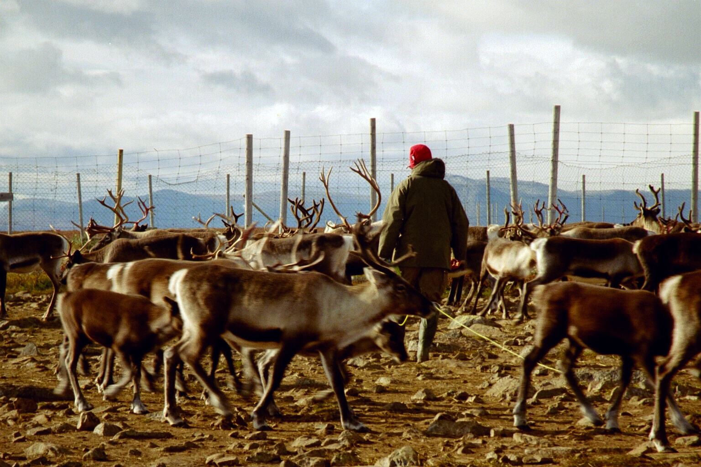
*বল্গা হরিণের পাল বেশ কয়েকটি আর্কটিক এবং উপআর্কটিক জনগোষ্ঠীর জন্য যাজক কৃষির ভিত্তি তৈরি করে।*

যাজকবাদের মধ্যে গার্হস্থ্যকৃত পশুদের ব্যবস্থাপনা জড়িত। যাযাবর পশুপালনবাদে পশুর পাল চারণভূমি, পশুখাদ্য এবং পানির সন্ধানে এক জায়গা থেকে আরেক জায়গায় স্থানান্তরিত হয়। সাহারা , মধ্য এশিয়া এবং ভারতের কিছু অংশের শুষ্ক ও আধা-শুষ্ক অঞ্চলে এই ধরনের চাষ করা হয়। [ ৭৩ ]

জুম চাষে , গাছ কেটে এবং পুড়িয়ে দিয়ে বনের একটি ছোট অঞ্চল পরিষ্কার করা হয়। পরিষ্কার করা জমি কয়েক বছর ধরে ফসল ফলানোর জন্য ব্যবহার করা হয় যতক্ষণ না মাটি খুব অনুর্বর হয়ে যায় এবং এলাকাটি পরিত্যক্ত হয়। জমির আরেকটি টুকরা নির্বাচন করা হয় এবং প্রক্রিয়াটি পুনরাবৃত্তি করা হয়। এই ধরনের চাষাবাদ প্রধানত প্রচুর বৃষ্টিপাত সহ অঞ্চলগুলিতে অনুশীলন করা হয় যেখানে বন দ্রুত পুনরুত্থিত হয়। এই অনুশীলনটি উত্তর-পূর্ব ভারত , দক্ষিণ-পূর্ব এশিয়া এবং আমাজন অববাহিকায় ব্যবহৃত হয়। [ ৭৪ ]

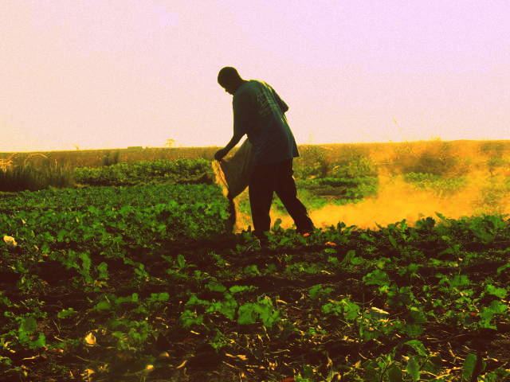
*জাম্বিয়ায় হাতে সার ছড়ানো*

শুধু পরিবার বা স্থানীয় চাহিদা মেটাতে জীবিকা নির্বাহের জন্য চাষ করা হয়, অন্যত্র পরিবহনের জন্য সামান্য অবশিষ্ট থাকে। এটি মৌসুমি এশিয়া এবং দক্ষিণ-পূর্ব এশিয়ায় নিবিড়ভাবে অনুশীলন করা হয়। [ ৭৫ ] আনুমানিক ২.৫ বিলিয়ন জীবিকা নির্বাহকারী কৃষকরা ২০১৮ সালে কাজ করে পৃথিবীর আবাদযোগ্য জমির প্রায় ৬০% চাষ করেছেন। [ ৭৬ ]

নিবিড় চাষ হচ্ছে উৎপাদনশীলতাকে সর্বাধিক করার জন্য চাষ করা, যার ফলন অনুপাত কম এবং যোগানগুলির (জল, সার, কীটনাশক এবং স্বয়ংক্রিয়তা) উচ্চ ব্যবহার রয়েছে। এটি মূলত উন্নত দেশগুলিতে অনুশীলন করা হয়। [ ৭৭ ] [ ৭৮ ]

## সমসাময়িক কৃষিকাজ

### অবস্থা

*যেকোনো দেশের তুলনায় চীনে সবচেয়ে বেশি কৃষি উৎপাদন হয়। [ ৭৯ ]*

বিংশ শতাব্দী থেকে, নিবিড় কৃষি উৎপাদনশীলতাকে বৃদ্ধি করছে। এটি শ্রমকে কৃত্রিম সার এবং কীটনাশক দিয়ে প্রতিস্থাপিত করেছে, কিন্তু পানি দূষণ বৃদ্ধি করেছে এবং প্রায়ই খামারের ভর্তুকিতে যুক্ত হয়েছে। সাম্প্রতিক বছরগুলিতে প্রচলিত কৃষিকাজের পরিবেশগত প্রভাবের বিরুদ্ধে প্রতিক্রিয়া দেখা দিয়েছে, যার ফলে জৈব, পুনর্জন্মমূলক এবং টেকসই কৃষি আন্দোলন হয়েছে। [ ৭১ ] [ ৮০ ] এই আন্দোলনের পিছনে অন্যতম প্রধান শক্তি হলো ইউরোপীয় ইউনিয়ন , যেটি প্রথম ১৯৯১ সালে জৈব খাদ্যকে প্রত্যয়িত করে এবং ২০০৫ সালে তার কমন এগ্রিকালচারাল পলিসি বা সাধারণ কৃষি নীতি (সিএপি) এর সংস্কার শুরু করেছে যাতে পণ্য-সংযুক্ত খামার ভর্তুকি পর্যায়ক্রমে বন্ধ করা যায়, [ ৮১ ] যা ডিকাপলিং নামেও পরিচিত। জৈব চাষের বৃদ্ধি বিকল্প প্রযুক্তি গবেষণাকে নবায়ন করেছে যেমন সমন্বিত বালাই দমন ব্যবস্থাপনা , কৃত্রিম নির্বাচন, [ ৮২ ] এবং নিয়ন্ত্রিত-পরিবেশ কৃষি। [ ৮৩ ] [ ৮৪ ] সাম্প্রতিক মূলধারার প্রযুক্তিগত উন্নয়নের মধ্যে রয়েছে বংশাণুগতভাবে পরিবর্তিত খাদ্য । [ ৮৫ ] খাদ্যবহির্ভূত জৈব জ্বালানী ফসলের চাহিদা, [ ৮৬ ] পূর্বের কৃষি জমির উন্নয়ন, ক্রমবর্ধমান পরিবহন খরচ, জলবায়ু পরিবর্তন, চীন ও ভারতে ক্রমবর্ধমান ভোক্তা চাহিদা এবং জনসংখ্যা বৃদ্ধি [ ৮৭ ] বিশ্বের অনেক অংশে খাদ্য নিরাপত্তাকে হুমকির মুখে ফেলছে। [ ৮৮ ] [ ৮৯ ] [ ৯০ ] [ ৯১ ] [ ৯২ ] ইন্টারন্যাশনাল ফান্ড ফর এগ্রিকালচারাল ডেভেলপমেন্টের মতে, ভিয়েতনামের অনুকূল অভিজ্ঞতার পরিপ্রেক্ষিতে খাদ্যের দাম এবং সামগ্রিক খাদ্য নিরাপত্তা নিয়ে উদ্বেগের সমাধানের অংশ হতে পারে ক্ষুদ্র অংশীদারদের কৃষি সম্প্রসারণ। [ ৯৩ ] মাটির ক্ষয় এবং রোগ যেমন মরিচা রোগ বিশ্বব্যাপী প্রধান উদ্বেগ; [ ৯৪ ] বিশ্বের কৃষি জমির প্রায় ৪০% মারাত্মকভাবে ক্ষয়প্রাপ্ত হয়েছে। [ ৯৫ ] [ ৯৬ ] ২০১৫ সাল নাগাদ, চীনের কৃষি উৎপাদন বিশ্বের বৃহত্তম ছিল, তারপরে ইউরোপীয় ইউনিয়ন, ভারত এবং মার্কিন যুক্তরাষ্ট্র। [ ৭৯ ] অর্থনীতিবিদরা কৃষির মোট নির্ণায়ক উত্পাদনশীলতা পরিমাপ করেন এবং এই পরিমাপ অনুযায়ী মার্কিন যুক্তরাষ্ট্রের কৃষি তার ১৯৪৮ সালের কৃষির তুলনায় প্রায় ১.৭ গুণ বেশি উত্পাদনশীল। [ ৯৭ ]

## সমসাময়িক কৃষিকাজ

### কর্মশক্তি

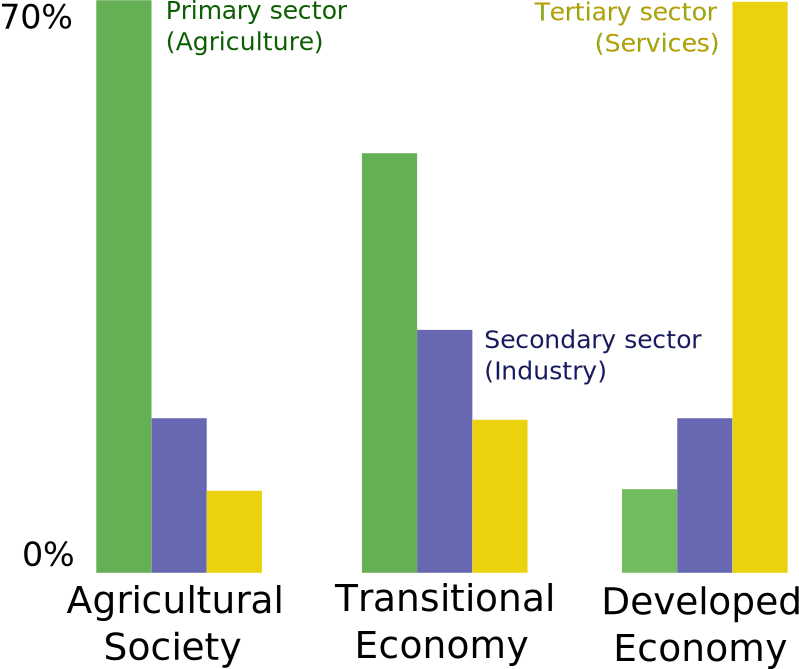
*তিন-ক্ষেত্র তত্ত্বে, অর্থনীতিতে আরও বিকশিত হওয়ার সাথে সাথে কৃষিতে কর্মরত লোকদের অনুপাত (প্রতিটি গ্রুপে বাম-প্রান্তের বার, সবুজ) কমতে থাকে।*

তিন-ক্ষেত্র তত্ত্ব অনুযায়ী, কৃষি এবং অন্যান্য প্রাথমিক কর্মকাণ্ডে (যেমন মাছ ধরা) নিযুক্ত লোকের সংখ্যা স্বল্পোন্নত দেশগুলিতে ৮০% এর বেশি হতে পারে এবং সবচেয়ে উন্নত দেশগুলিতে ২%-এরও কম হতে পারে। [ ৯৮ ] শিল্প বিপ্লবের পর থেকে, অনেক দেশ উন্নত অর্থনীতিতে রূপান্তরিত হয়েছে, এবং কৃষিতে কর্মরত মানুষের অনুপাত ক্রমাগতভাবে হ্রাস পেয়েছে। উদাহরণস্বরূপ, ১৬শ শতকের সময় ইউরোপে জনসংখ্যার ৫৫ থেকে ৭৫% কৃষিতে নিযুক্ত ছিল; ১৯শ শতকের মধ্যে, এটি ৩৫ থেকে ৬৫% এর মধ্যে নেমে আসে। [ ৯৯ ] একই দেশগুলোতে আজ, এই হার ১০% এর কম। [ ৯৮ ] ২১শ শতকের শুরুতে প্রায় এক বিলিয়ন মানুষ, বা উপলব্ধ কর্মশক্তির ১/৩ এরও বেশি কৃষিতে নিযুক্ত ছিল। এটি শিশুদের বৈশ্বিক কর্মসংস্থানের আনুমানিক ৭০% গঠন করে এবং অনেক দেশে যে কোনো শিল্পের সবচেয়ে বেশি শতাংশ হারে নারীরা এই খাতে নিযুক্ত থাকে। [ ১০০ ] সেবা খাত ২০০৭ সালে বৃহত্তম বৈশ্বিক নিয়োগ খাত হিসাবে কৃষি খাতকে ছাড়িয়ে যায়। [ ১০১ ]

## সমসাময়িক কৃষিকাজ

### নিরাপত্তা

*রোলওভার সুরক্ষা বারটি ২০শ শতকের মাঝামাঝি একটি ফোর্ডসন ট্র্যাক্টরে পুনরুদ্ধার করা হয়েছে*

কৃষিকাজ, বিশেষ করে চাষাবাদ, একটি বিপজ্জনক শিল্প হিসাবে রয়ে গেছে এবং বিশ্বব্যাপী কৃষকরা কাজ-সম্পর্কিত আঘাত, ফুসফুসের রোগ, শব্দ-প্ররোচিত শ্রবণশক্তি হ্রাস, চর্মরোগ, সেইসাথে রাসায়নিক ব্যবহার এবং দীর্ঘায়িত সূর্যের অপাবরণ সম্পর্কিত কিছু ক্যান্সারের উচ্চ ঝুঁকিতে রয়েছে। শিল্পোন্নত খামারগুলিতে, আঘাতের ক্ষেত্রে প্রায়শই কৃষি যন্ত্রপাতি ব্যবহার করা হয় এবং উন্নত দেশগুলিতে মারাত্মক কৃষি আঘাতের একটি সাধারণ কারণ হলো ট্র্যাক্টর উল্টে যাওয়া ৷ [ ১০২ ] চাষাবাদে ব্যবহৃত কীটনাশক এবং অন্যান্য রাসায়নিক কৃষকের স্বাস্থ্যের জন্য বিপজ্জনক হতে পারে, এবং কীটনাশকের সংস্পর্শে থাকা কৃষকরা অসুস্থতা অনুভব করতে পারে বা জন্মগত ত্রুটিযুক্ত শিশুর জন্ম দিতে পারে। [ ১০৩ ] একটি শিল্প হিসাবে যেখানে পরিবারগুলি সাধারণত একসাথে কাজ করে এবং খামারের কাছেই বাস করে, তাই সমগ্র পরিবার আঘাত, অসুস্থতা এবং মৃত্যুর ঝুঁকিতে থাকতে পারে। [ ১০৪ ] ০-৬ বছর বয়সীরা কৃষিতে বিশেষভাবে অরক্ষিত জনসংখ্যা হতে পারে; [ ১০৫ ] অল্প বয়স্ক খামার কর্মীদের মধ্যে মারাত্মক আঘাতের সাধারণ কারণগুলির মধ্যে রয়েছে ডুবে যাওয়া, যন্ত্রপাতি এবং মোটর দুর্ঘটনা, যার মধ্যে সমস্ত স্থল চালিত যানবাহনও রয়েছে। [ ১০৪ ] [ ১০৫ ] [ ১০৬ ]

আন্তর্জাতিক শ্রম সংস্থা কৃষিকে "সমস্ত অর্থনৈতিক খাতের মধ্যে সবচেয়ে বিপজ্জনক" বলে মনে করে। [ ১০০ ] এটি অনুমান করে যে কৃষি কর্মীদের মধ্যে বার্ষিক কর্ম-সম্পর্কিত মৃত্যুর সংখ্যা কমপক্ষে ১৭০,০০০; যা অন্যান্য কাজের গড় হারের চেয়ে দ্বিগুণ। উপরন্তু, কৃষি কার্যক্রমের সাথে সম্পর্কিত মৃত্যু, আঘাত এবং অসুস্থতার ঘটনা প্রায়শই বর্ণনা করা হয় না। [ ১০৭ ] সংস্থাটি সেফটি অ্যান্ড হেলথ ইন এগ্রিকালচার কনভেনশন, ২০০১ তৈরি করেছে, যা কৃষি পেশায় ঝুঁকির পরিসর, এই ঝুঁকি প্রতিরোধ এবং কৃষিতে নিয়োজিত ব্যক্তি ও সংস্থার যে ভূমিকা পালন করা উচিত তা ধারণ করে। [ ১০০ ]

মার্কিন যুক্তরাষ্ট্রে, ন্যাশনাল ইনস্টিটিউট ফর অকুপেশনাল সেফটি অ্যান্ড হেলথ পেশাগত স্বাস্থ্য ও নিরাপত্তা সংক্রান্ত সমস্যাগুলির জন্য হস্তক্ষেপের কৌশলগুলি চিহ্নিত করতে এবং প্রদান করার জন্য জাতীয় পেশাগত গবেষণা কার্যসূচিতে কৃষিকে একটি অগ্রাধিকারমূলক শিল্প খাত হিসাবে চিহ্নিত করেছে। [ ১০৮ ] [ ১০৯ ] ইউরোপীয় ইউনিয়নে, কর্মক্ষেত্রে নিরাপত্তা ও স্বাস্থ্যের জন্য ইউরোপীয় সংস্থা কৃষি, পশুপালন, উদ্যানপালন এবং বনায়নে স্বাস্থ্য ও নিরাপত্তা নির্দেশাবলী বাস্তবায়নের জন্য নির্দেশিকা জারি করেছে। [ ১১০ ] অ্যাগ্রিকালচারাল সেফটি অ্যান্ড হেলথ কাউন্সিল অফ আমেরিকা (এএসএইচসিএ) নিরাপত্তা নিয়ে আলোচনা করার জন্য একটি বার্ষিক শীর্ষ সম্মেলনও করে। [ ১১১ ]

## উৎপাদন

*কৃষি উৎপাদনের মূল্য, ২০১৬ [ ১১২ ]*

তালিকাভুক্ত দেশ অনুযায়ী সামগ্রিক উৎপাদন পরিবর্তিত হয়।

| দেখান আন্তর্জাতিক মুদ্রা তহবিল এবং সিআইএ ওয়ার্ল্ড ফ্যাক্টবুক অনুসারে, ২০১৮ সালের শীর্ষ পর্যায়ে কৃষি উৎপাদনে (নামমাত্র মেয়াদে) বৃহত্তম দেশ |
| --- |
| Economy ২০১৮ সালের হিসাবে শীর্ষ স্তরে কৃষি উৎপাদন (নামমাত্র মেয়াদে) অনুযায়ী দেশ (বিলিয়ন মার্কিন ডলারে) (০১) গণচীন ১,১১৭ (০২) ভারত ৪১৪ (—) ইউরোপীয় ইউনিয়ন ৩০৮ (০৩) যুক্তরাষ্ট্র ১৮৫ (০৪) ব্রাজিল ১৬২ (০৫) ইন্দোনেশিয়া ১৪১ (০৬) নাইজেরিয়া ১২৩ (০৭) রাশিয়া ১০৮ (০৮) পাকিস্তান ৭৬ (০৯) আর্জেন্টিনা ৭০ (১০) তুরস্ক ৬৪ (১১) জাপান ৬২ (১২) ফ্রান্স ৫৯ (১৩) ইরান ৫৭ (১৪) অস্ট্রেলিয়া ৫৬ (১৫) মেক্সিকো ৫১ (১৬) ইতালি ৫০ (১৭) স্পেন ৪৩ (১৮) বাংলাদেশ ৪১ (১৯) থাইল্যান্ড ৪০ (২০) মিশর ৪০ আন্তর্জাতিক মুদ্রা তহবিল এবং সিআইএ ওয়ার্ল্ড ফ্যাক্টবুক অনুসারে, ২০১৮ সালের হিসাবে কৃষি উৎপাদনের (নামমাত্র মেয়াদে) দিক থেকে বিশটি বৃহত্তম দেশ। |
| Economy |
| (০১) গণচীন |
| (০২) ভারত |
| (—) ইউরোপীয় ইউনিয়ন |
| (০৩) যুক্তরাষ্ট্র |
| (০৪) ব্রাজিল |
| (০৫) ইন্দোনেশিয়া |
| (০৬) নাইজেরিয়া |
| (০৭) রাশিয়া |
| (০৮) পাকিস্তান |
| (০৯) আর্জেন্টিনা |
| (১০) তুরস্ক |
| (১১) জাপান |
| (১২) ফ্রান্স |
| (১৩) ইরান |
| (১৪) অস্ট্রেলিয়া |
| (১৫) মেক্সিকো |
| (১৬) ইতালি |
| (১৭) স্পেন |
| (১৮) বাংলাদেশ |
| (১৯) থাইল্যান্ড |
| (২০) মিশর |
| আন্তর্জাতিক মুদ্রা তহবিল এবং সিআইএ ওয়ার্ল্ড ফ্যাক্টবুক অনুসারে, ২০১৮ সালের হিসাবে কৃষি উৎপাদনের (নামমাত্র মেয়াদে) দিক থেকে বিশটি বৃহত্তম দেশ। |

| দেখান ২০০৫ সালের ধ্রুবক মূল্য এবং বিনিময় হারে আঙ্কটাড অনুযায়ী কৃষি উৎপাদনের দিক থেকে বৃহত্তম দেশ, ২০১৫ [ ৭৯ ] |
| --- |
| Economy ২০১৫ সালের কৃষি উৎপাদন অনুসারে দেশ (২০০৫ সালের স্থির মিলিয়ন মার্কিন ডলার এবং বিনিময় হারে) (০১) গণচীন ৪,১৮,৪৫৫ (০২) ভারত ১,৯৬,৫৯২ (০৩) যুক্তরাষ্ট্র ১,৪৯,০২৩ (০৪) নাইজেরিয়া ৭৭,১১৩ (০৫) ব্রাজিল ৫৯,৯৭৭ |
| Economy |
| (০১) গণচীন |
| (০২) ভারত |
| (০৩) যুক্তরাষ্ট্র |
| (০৪) নাইজেরিয়া |
| (০৫) ব্রাজিল |

## উৎপাদন

### ফসল চাষ পদ্ধতি

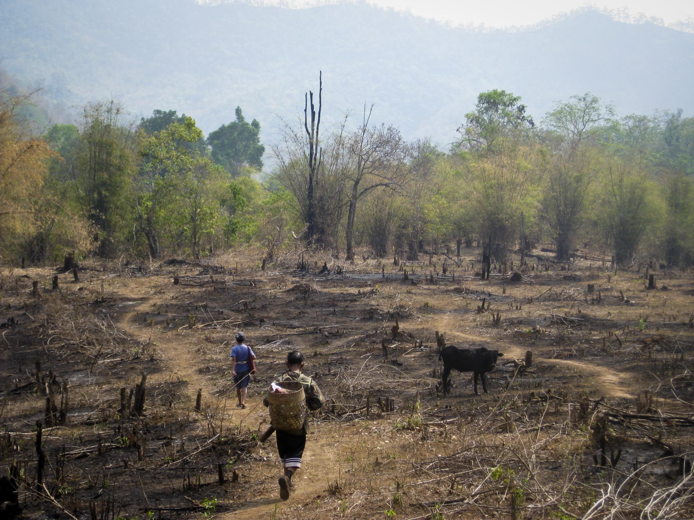
*স্ল্যাশ অ্যান্ড বার্ন শিফটিং চাষ, থাইল্যান্ড*

উপলব্ধ সংস্থান এবং সীমাবদ্ধতার উপর নির্ভর করে খামারগুলির মধ্যে খামারের ভৌগোলিক অবস্থান এবং জলবায়ু ; সরকারের নীতি; অর্থনৈতিক, সামাজিক এবং রাজনৈতিক চাপ; এবং কৃষকের দর্শন ও সংস্কৃতি অনুযায়ী চাষের পদ্ধতি পরিবর্তিত হয়। [ ১১৩ ] [ ১১৪ ]

স্থানান্তরিত চাষ (বা স্ল্যাশ অ্যান্ড বার্ন) হলো এমন একটি ব্যবস্থা যেখানে বন পুড়িয়ে দেওয়া হয়, যা কয়েক বছরের জন্য বার্ষিক এবং পরে বহুবর্ষজীবী ফসলের চাষে সহায়তা করার জন্য পুষ্টি অবমুক্ত করে। [ ১১৫ ] তারপর জমির টুকরাটি আবার বনের জন্য পতিত রেখে দেওয়া হয়, এবং কৃষক একটি নতুন জমিতে চলে যায়, আরও অনেক বছর (১০-২০) পর ফিরে আসে। জনসংখ্যার ঘনত্ব বাড়লে এই পতিত সময়কালকে সংক্ষিপ্ত করা হয়, যাতে পুষ্টির জোগান (সার বা গোবর) এবং কিছু হস্তচালিত কীটপতঙ্গ নিয়ন্ত্রণের প্রয়োজন হয়। বার্ষিক চাষ হলো তীব্রতার পরবর্তী পর্যায় যেখানে কোন পতিত পর্যায় নেই। এর জন্য আরও বেশি পুষ্টি এবং কীটপতঙ্গ নিয়ন্ত্রণমূলক জোগানের প্রয়োজন হয়। [ ১১৫ ]

*নারকেল এবং মেক্সিকান গাঁদার আন্তঃচাষ*

অধিক শিল্পায়নের ফলে মনোকালচারের ব্যবহার শুরু হয়, যেখানে একটি বৃহৎ একর জমিতে একটি ফসল চাষ করা হয়। কম জীববৈচিত্র্যের কারণে, পুষ্টির ব্যবহার অভিন্ন এবং কীটপতঙ্গ তৈরি হওয়ার প্রবণতা রয়েছে, যা কীটনাশক এবং সারের বেশি ব্যবহার প্রয়োজনীয় করে তোলে। [ ১১৪ ] বহু চাষ এর ক্ষেত্রে এক বছরে একাধিক ফসল পর্যায়ক্রমে জন্মায়, এবং আন্তঃচাষ এর ক্ষেত্রে একই সময়ে একাধিক ফসল জন্মায়; এগুলো হলো অন্যান্য ধরনের বার্ষিক চাষাবাদ পদ্ধতি যা পলিকালচার নামে পরিচিত। [ ১১৫ ]

উপক্রান্তীয় এবং শুষ্ক পরিবেশে, কৃষির সময়কাল এবং ব্যপ্তি বৃষ্টিপাতের দ্বারা সীমিত হতে পারে, হয় এক বছরে একাধিক বার্ষিক ফসল চাষের সুযোগ হয় না, বা সেচের প্রয়োজন হয়। এই সমস্ত পরিবেশে বহুবর্ষজীবী ফসল জন্মে ( কফি , চকলেট ) এবং কৃষি বনায়নের মতো পদ্ধতিগুলি অনুশীলন করা হয়। নাতিশীতোষ্ণ পরিবেশে, যেখানে বাস্তুতন্ত্র প্রধানত তৃণভূমি বা বৃক্ষহীন তৃণভূমি থাকে; সেখানে উচ্চ উৎপাদনশীল বার্ষিক চাষ হলো প্রভাবপূর্ণ কৃষি ব্যবস্থা। [ ১১৫ ]

খাদ্যশস্যের গুরুত্বপূর্ণ শ্রেণিগুলির মধ্যে রয়েছে শস্যদানা, শিম, চারা, ফল এবং শাকসবজি। [ ১১৬ ] প্রাকৃতিক তন্তুর মধ্যে রয়েছে তুলা, উল, শণ, রেশম এবং তিসি । [ ১১৭ ] বিশ্বজুড়ে স্বতন্ত্র ক্রমবর্ধমান অঞ্চলে নির্দিষ্ট ফসল চাষ করা হয়। খাদ্য ও কৃষি সংস্থার অনুমানের উপর ভিত্তি করে নিচে উৎপাদনের পরিমাণ লক্ষ মেট্রিক টনে তালিকাভুক্ত করা হয়েছে। [ ১১৬ ]

| দেখান ফসলের ধরন অনুসারে শীর্ষ কৃষি পণ্য (মিলিয়ন টন) ২০০৪ সালের তথ্য |
| --- |
| শস্যদানা |
| শাকসবজি এবং তরমুজ |
| মূল এবং কন্দ |
| দুধ |
| ফল |
| মাংস |
| তৈল ফসল |
| মাছ (২০০১ সালের অনুমান) |
| ডিম |
| ডাল |
| তন্তু ফল |
| সূত্র: খাদ্য ও কৃষি সংস্থা [ ১১৬ ] |

| দেখান শীর্ষ কৃষি পণ্য, স্বতন্ত্র ফসল অনুযায়ী (মিলিয়ন টন) ২০১১ সালের তথ্য |
| --- |
| আখ |
| ভুট্টা |
| ভাত |
| গম |
| আলু |
| শর্করার যে বীট গাছ |
| সয়াবিন |
| কাসাভা |
| টমেটো |
| যব |
| সূত্র: খাদ্য ও কৃষি সংস্থা [ ১১৬ ] |

## উৎপাদন

### পশুসম্পদ উৎপাদন ব্যবস্থা

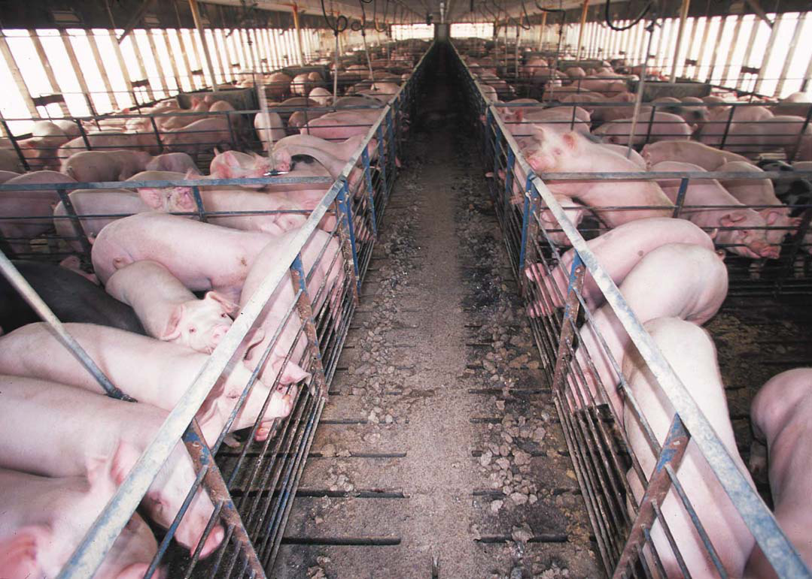
*নিবিড়ভাবে চাষ করা শূকর*

পশুপালন হলো মাংস, দুধ, ডিম বা পশমের জন্য এবং কাজ ও পরিবহনের জন্য পশু প্রজনন ও লালন-পালন করা। [ ১১৮ ] ঘোড়া, খচ্চর , বলদ, জল মহিষ , উট, লামা, আলপাকা, গাধা এবং কুকুর সহ বিভিন্ন কর্মক্ষম প্রাণী বহু শতাব্দী ধরে ক্ষেত চাষে, ফসল কাটাতে, অন্যান্য প্রাণীদের তাড়াতে এবং ক্রেতাদের কাছে খামারের পণ্য পরিবহনে সহায়তা করতে ব্যবহৃত হয়ে আসছে। [ ১১৯ ]

পশুসম্পদ উৎপাদন ব্যবস্থাকে খাদ্য উৎসের উপর ভিত্তি করে সংজ্ঞায়িত করা যেতে পারে, যেমন তৃণভূমি-ভিত্তিক, মিশ্র এবং ভূমিহীন। [ ১২০ ] ২০১০-এর হিসাব অনুযায়ী [হালনাগাদ] , পৃথিবীর ৩০% বরফ-মুক্ত এবংপানি-মুক্ত এলাকা গবাদি পশু উৎপাদনের জন্য ব্যবহৃত হয়, যেখানে এই খাতটিতে প্রায় ১.৩ বিলিয়ন মানুষ নিযুক্ত রয়েছে। ১৯৬০ এবং ২০০০ এর দশকের মধ্যে, গবাদি পশুর উৎপাদনে উল্লেখযোগ্য বৃদ্ধি ঘটে; সংখ্যা এবং পশুর মৃতদেহের ওজন উভয়ের ক্ষেত্রে, বিশেষ করে গরুর মাংস, শূকর এবং মুরগির মধ্যে, পরবর্তীতে যার উৎপাদন প্রায় ১০ এর একটি গুণিতকে বৃদ্ধি পায়। আমিষহীন প্রাণী, যেমন দুধাল গাভী এবং ডিম উৎপাদনকারী মুরগিরও উল্লেখযোগ্য উৎপাদন বৃদ্ধি দেখা যায়। বিশ্বব্যাপী গবাদি পশু, ভেড়া এবং ছাগলের সংখ্যা ২০৫০ [ ১২১ ] সালের মধ্যে তীব্রভাবে বৃদ্ধি পাবে বলে আশা করা হচ্ছে। অ্যাকুয়াকালচার বা মাছ চাষ অর্থাৎ সীমিত ক্রিয়াকলাপে মানুষের ব্যবহারের জন্য মাছের উৎপাদন, খাদ্য উৎপাদনের সবচেয়ে দ্রুত বর্ধনশীল খাতগুলির মধ্যে একটি, যা ১৯৭৫ থেকে ২০০৭ সালের মধ্যে বছরে গড়ে ৯% হারে বৃদ্ধি পাচ্ছে। [ ১২২ ]

২০শ শতকের দ্বিতীয়ার্ধে, কৃত্রিম নির্বাচনের ব্যবহার করে উৎপাদকরা গবাদি পশুর জাত এবং সংকর জাত তৈরির দিকে মনোনিবেশ করেন যা উৎপাদন বৃদ্ধি করে, যদিও এগুলোর বেশিরভাগই জিনগত বৈচিত্র্য সংরক্ষণের প্রয়োজনীয়তাকে উপেক্ষা করে। এই প্রবণতা পশুসম্পদ প্রজাতির মধ্যে বংশাণুগত বৈচিত্র্য এবং সম্পদের উল্লেখযোগ্য হ্রাসের দিকে পরিচালিত করেছে, যার ফলে পূর্বে প্রচলিত জাতগুলির মধ্যে পাওয়া গিয়েছিল এমন রোগ প্রতিরোধ ক্ষমতা এবং স্থানীয় অভিযোজনের ক্ষেত্রে সংশ্লিষ্ট হ্রাস দেখা গেছে। [ ১২৩ ]

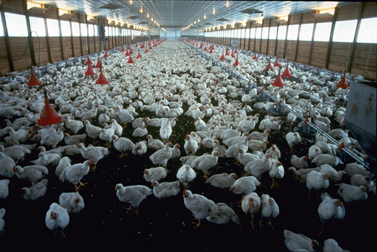
*একটি ব্রয়লার হাউসে মাংসের জন্য নিবিড়ভাবে মুরগি পালন করা হচ্ছে*

তৃণভূমি ভিত্তিক পশুসম্পদ উৎপাদন উদ্ভিদের উপাদানের উপর নির্ভর করে যেমন রোমন্থক প্রাণীদের খাওয়ানোর জন্য ঝোপঝাড়, রেঞ্জল্যান্ড, এবং চারণভূমি। বহিঃস্থ পুষ্টি উপাদান ব্যবহার করা যেতে পারে, তবে প্রধান পুষ্টির উৎস হিসেবে গোবর সরাসরি তৃণভূমিতে ফেরত দেওয়া হয়। এই ব্যবস্থাটি বিশেষভাবে গুরুত্বপূর্ণ যেখানে জলবায়ু বা মাটির কারণে ফসল উৎপাদন সম্ভব নয়, যা ৩০-৪০ মিলিয়ন পশুপালককে প্রতিনিধিত্ব করে। [ ১১৫ ] মিশ্র উৎপাদন ব্যবস্থা তৃণভূমি, পশুখাদ্য শস্য এবং শস্য খাদ্যশস্যকে রোমন্থক এবং মনোগ্যাস্ট্রিক (এক পেট; প্রধানত মুরগি এবং শূকর) গবাদি পশুর খাদ্য হিসাবে ব্যবহার করা হয়। পশুর গোবর সাধারণত মিশ্র পদ্ধতিতে ফসলের সার হিসাবে পুনর্ব্যবহৃত হয়। [ ১২০ ]

ভূমিহীন ব্যবস্থাগুলি খামারের বাইরের খাদ্যের উপর নির্ভর করে, যা অর্থনৈতিক সহযোগিতা ও উন্নয়ন সংস্থা এর সদস্য দেশগুলিতে আরও বেশি দেখা যায়, যা শস্য ও পশুসম্পদ উৎপাদনের বিচ্ছিন্ন সংযোগের প্রতিনিধিত্ব করে। শস্য উৎপাদনের জন্য কৃত্রিম সারের উপর বেশি নির্ভরশীলতা দেখা যায় এবং সার ব্যবহার দূষণের উৎসের পাশাপাশি একটি চ্যালেঞ্জের হয়ে দাঁড়ায়। [ ১২০ ] পোল্ট্রি এবং শুকরের মাংসের বৈশ্বিক সরবরাহের বেশিরভাগ উত্পাদন করতে শিল্পোন্নত দেশগুলি এই কার্যক্রমগুলো ব্যবহার করে। বিজ্ঞানীরা অনুমান করেন যে ২০০৩ থেকে ২০৩০ সালের মধ্যে পশুসম্পদ উৎপাদনের ৭৫% বৃদ্ধি হবে সীমিত পশু খাওয়ানোর কার্যক্রমে, যাকে কখনও কখনও কারখানা চাষও বলা হয়। এই প্রবৃদ্ধির বেশিরভাগই এশিয়ার উন্নয়নশীল দেশগুলিতে ঘটছে, আর আফ্রিকাতে অনেক কম পরিমাণে বৃদ্ধি পেয়েছে। [ ১২১ ] গ্রোথ হরমোন ব্যবহার সহ বাণিজ্যিক পশুসম্পদ উৎপাদনে ব্যবহৃত কিছু অনুশীলন বিতর্কিত। [ ১২৪ ]

## উৎপাদন

### উৎপাদন অনুশীলন

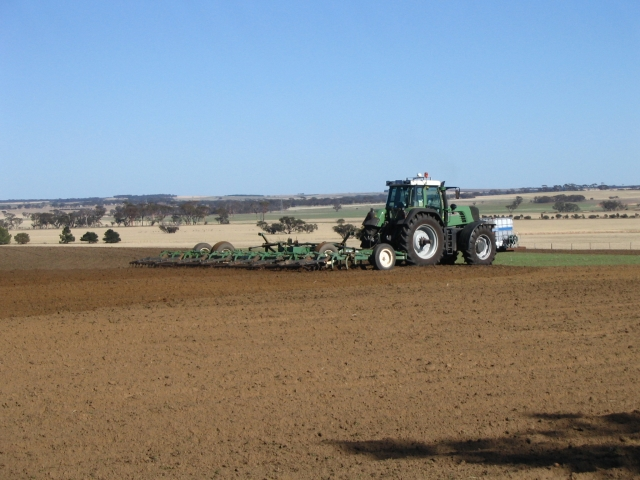
*চাষযোগ্য ক্ষেত আবাদ করা*

আবাদ হলো রোপণের জন্য প্রস্তুত করার জন্য, পুষ্টি জোগানের জন্য বা কীটপতঙ্গ নিয়ন্ত্রণের জন্য লাঙ্গল বা মইয়ের মতো হাতিয়ার দিয়ে মাটি ভেঙে ফেলার অনুশীলন। আবাদের তীব্রতা প্রচলিত থেকে শূন্য-চাষ পর্যন্ত পরিবর্তিত হয়। এটি মাটিকে উষ্ণ করে, সার যুক্ত করে এবং আগাছা নিয়ন্ত্রণ করে উত্পাদনশীলতা উন্নত করতে পারে, তবে মাটিকে আরও ক্ষয় প্রবণ করে, কার্বন ডাই-অক্সাইড নিঃস্রাবী জৈব পদার্থের পচন শুরু করে এবং মাটিস্থ জীবের প্রাচুর্য এবং বৈচিত্র্যকে হ্রাস করে। [ ১২৫ ] [ ১২৬ ]

কীটপতঙ্গ নিয়ন্ত্রণের মধ্যে রয়েছে আগাছা, পোকামাকড়, মাকড় এবং রোগের ব্যবস্থাপনা। রাসায়নিক (কীটনাশক), জৈবিক (জৈবনিয়ন্ত্রণ), যান্ত্রিক (চাষ), এবং সাংস্কৃতিক অনুশীলন ব্যবহার করা হয়ে থাকে। সাংস্কৃতিক চর্চার মধ্যে রয়েছে ফসলের আবর্তন, সংকলন, মাটির ক্ষয়রোধী ফসল, আন্তঃফসল, কম্পোস্ট ব্যবহার, পরিহার এবং প্রতিরোধ। সমন্বিত কীটপতঙ্গ ব্যবস্থাপনা এই সমস্ত পদ্ধতি ব্যবহার করে কীটপতঙ্গের সংখ্যাকে এমন একটি সংখ্যার নিচে রাখার চেষ্টা করে যা অর্থনৈতিক ক্ষতির কারণ হতে পারে এবং শেষ অবলম্বন হিসাবে কীটনাশক ব্যবহারের সুপারিশ করে। [ ১২৭ ]

পুষ্টি ব্যবস্থাপনার মধ্যে শস্য ও গবাদি পশু উৎপাদনের জন্য পুষ্টি উপাদানের উৎস এবং গবাদি পশু দ্বারা উত্পাদিত সার ব্যবহারের পদ্ধতি উভয়ই অন্তর্ভুক্ত থাকে। পুষ্টি উপাদান রাসায়নিক অজৈব সার, সার, সবুজ সার , কম্পোস্ট এবং খনিজ হতে পারে। [ ১২৮ ] ফসলের পুষ্টির ব্যবহারও সাংস্কৃতিক কৌশল যেমন ফসলের আবর্তন বা একটি পতিত সময়কাল ব্যবহার করে পরিচালিত হতে পারে। সার ব্যবহার করা হয় পশুসম্পদ ধরে রেখে যেখানে খাদ্য শস্য বাড়ছে, যেমন পরিচালিত নিবিড় আবর্তনশীল চারণে, অথবা ফসলের জমি বা চারণভূমিতে সারের শুকনো বা তরল ফর্মুলেশন ছড়িয়ে দিয়ে। [ ১২৫ ] [ ১২৯ ]

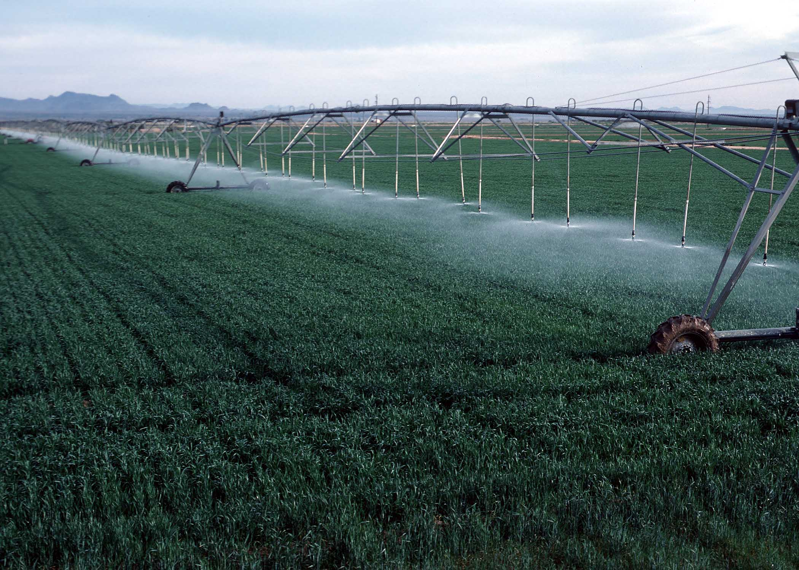
*একটি কেন্দ্র আবর্তন সেচ ব্যবস্থা*

যেখানে বৃষ্টিপাত অপর্যাপ্ত বা পরিবর্তনশীল সেখানে পানি ব্যবস্থাপনার প্রয়োজন হয়, যা পৃথিবীর অধিকাংশ অঞ্চলে কিছুটা হলেও ঘটে। [ ১১৫ ] কিছু কৃষক বৃষ্টির পরিপূরক সেচ ব্যবহার করে। মার্কিন যুক্তরাষ্ট্র এবং কানাডার মতো বড় সমভূমির অন্যান্য অঞ্চলে, কৃষকরা পরের বছরে ফসল জন্মানোর জন্য মাটির আর্দ্রতা সংরক্ষণের জন্য একটি পতিত বছর ব্যবহার করে। [ ১৩০ ] কৃষি বিশ্বব্যাপী ৭০% স্বাদু পানির ব্যবহারের প্রতিনিধিত্ব করে। [ ১৩১ ]

ইন্টারন্যাশনাল ফুড পলিসি রিসার্চ ইনস্টিটিউটের একটি প্রতিবেদন অনুসারে, কৃষি প্রযুক্তি একটি অপরটির সাথে একত্রে গৃহীত হলে তা খাদ্য উৎপাদনে সবচেয়ে বেশি প্রভাব ফেলবে; একটি মডেল ব্যবহার করে যে এগারোটি প্রযুক্তি কীভাবে ২০৫০ সালের মধ্যে কৃষি উৎপাদনশীলতা, খাদ্য নিরাপত্তা এবং বাণিজ্যকে প্রভাবিত করতে পারে তা মূল্যায়ন করা হয়, ইন্টারন্যাশনাল ফুড পলিসি রিসার্চ ইনস্টিটিউট দেখেছে যে ক্ষুধার ঝুঁকিতে থাকা মানুষের সংখ্যা ৪০% পর্যন্ত কমানো যেতে পারে এবং খাদ্যের দাম প্রায় অর্ধেক কমে যেতে পারে। [ ১৩২ ]

বাস্তুতন্ত্রের পরিষেবাগুলির জন্য অর্থপ্রদান হলো পরিবেশের কিছু দিক সংরক্ষণে কৃষকদের উত্সাহিত করার জন্য অতিরিক্ত প্রণোদনা প্রদানের একটি পদ্ধতি। ব্যবস্থাগুলির মধ্যে একটি শহরের উজানে পুনর্বনায়নের জন্য অর্থ প্রদান অন্তর্ভুক্ত থাকতে পারে, যাতে বিশুদ্ধ পানির সরবরাহ উন্নত করা যায়। [ ১৩৩ ]

## উৎপাদন

### ফলনের উপর জলবায়ু পরিবর্তনের প্রভাব

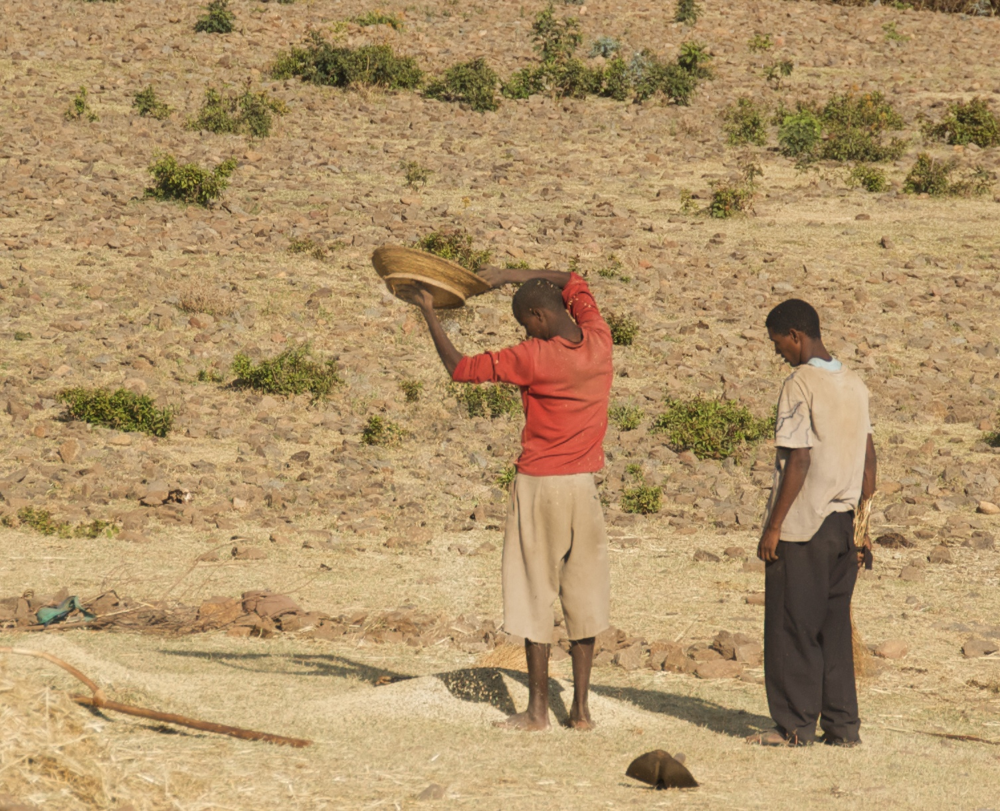
*শস্য ঝাড়াই করা হচ্ছে: বৈশ্বিক উষ্ণায়ন সম্ভবত ইথিওপিয়ার মতো নিম্ন অক্ষাংশে অবস্থিত দেশগুলিতে ফসলের ফলনের ক্ষতি করবে।*

জলবায়ু পরিবর্তন এবং কৃষি বিশ্বব্যাপী পরস্পর সম্পর্কযুক্ত। বৈশ্বিক উষ্ণায়ন গড় তাপমাত্রা, বৃষ্টিপাত এবং আবহাওয়ার চরম পরিবর্তন (যেমন ঝড় এবং তাপপ্রবাহ) ; কীটপতঙ্গ এবং রোগের পরিবর্তন; বায়ুমণ্ডলীয় কার্বন ডাই অক্সাইড এবং স্থল-স্তরের ওজোন ঘনত্বের পরিবর্তন; কিছু খাবারের পুষ্টির মানের পরিবর্তন; [ ১৩৪ ] এবং সমুদ্রপৃষ্ঠের পরিবর্তনের মাধ্যমে কৃষিকে প্রভাবিত করে। [ ১৩৫ ] বৈশ্বিক উষ্ণতা ইতিমধ্যেই কৃষিকে প্রভাবিত করছে, যার প্রভাব বিশ্বজুড়ে অসমভাবে ছড়িয়ে পড়েছে। [ ১৩৬ ] ভবিষ্যৎ জলবায়ু পরিবর্তন সম্ভবত নিম্ন অক্ষাংশে অবস্থিত দেশগুলোতে ফসলের উৎপাদনকে নেতিবাচকভাবে প্রভাবিত করবে, যদিও উত্তর অক্ষাংশে প্রভাব ইতিবাচক বা নেতিবাচক হতে পারে। [ ১৩৬ ] বৈশ্বিক উষ্ণায়ন সম্ভবত দরিদ্রদের মতো কিছু দুর্বল গোষ্ঠীর জন্য খাদ্য নিরাপত্তাহীনতার ঝুঁকি বাড়িয়ে দেবে। [ ১৩৭ ]

## ফসলের পরিবর্তন এবং জৈবপ্রযুক্তি

### উদ্ভিদ প্রজনন

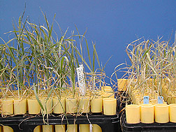
*অসহনশীল জাতের তুলনায় গমের চাষ উচ্চ লবণাক্ততা সহনশীল জাত (বামে)*

সভ্যতার শুরু থেকে হাজার হাজার বছর ধরে মানবজাতির মাধ্যমে ফসলের পরিবর্তন হয়ে আসছে। প্রজনন পদ্ধতির মাধ্যমে ফসলের পরিবর্তন মানুষের জন্য আরও উপকারী বৈশিষ্ট্য সমন্বিত ফসল বিকাশের জন্য একটি উদ্ভিদের বংশাণুগত গঠন পরিবর্তন করে, উদাহরণস্বরূপ, বড় ফল বা বীজ, খরা-সহনশীলতা বা কীটপতঙ্গের প্রতিরোধ। জিনতত্ত্ববিদ গ্রেগর মেন্ডেলের গবেষণা কাজের পরে উদ্ভিদ প্রজননে উল্লেখযোগ্য অগ্রগতি হয়। যদিও প্রাথমিকভাবে প্রায় ৫০ বছর ধরে উপেক্ষা করা হয়েছিল, তবে প্রকট এবং প্রচ্ছন্ন অ্যালিলের উপর তার কাজ উদ্ভিদ প্রজননকারীদের প্রজননশাস্ত্র বংশাণু প্রজনন কৌশল সম্পর্কে আরও ভাল করে বোঝার সুযোগ দেয়। শস্য প্রজননের মধ্যে রয়েছে পছন্দসই বৈশিষ্ট্য সহ উদ্ভিদ নির্বাচন, স্ব-পরাগায়ন এবং পরপরাগায়ন , এবং আণবিক কৌশল যা বংশাণুগত ভাবে জীবকে পরিবর্তন করে। [ ১৩৮ ]

উদ্ভিদের গার্হস্থ্যকরণ শতাব্দী পর শতাব্দী ধরে ফলন বৃদ্ধি করেছে, উন্নত রোগ প্রতিরোধ ক্ষমতা এবং খরা সহনশীলতা, ফসল কাটা সহজ করেছে এবং ফসলের গাছের স্বাদ এবং পুষ্টির মান উন্নত করেছে। যত্ন সহকারে নির্বাচন এবং প্রজনন ফসল গাছের বৈশিষ্ট্যের উপর প্রচুর প্রভাব ফেলেছে। ১৯২০ এবং ১৯৩০ এর দশকের উদ্ভিদ নির্বাচন এবং প্রজনন নিউজিল্যান্ডে চারণভূমিকে (ঘাস এবং গুল্ম) উন্নত করেছে। ১৯৫০-এর দশকে বিস্তৃত এক্স-রে এবং অতিবেগুনী প্ররোচিত মিউট্যাজেনেসিস প্রচেষ্টা (অর্থাৎ আদি বংশাণু প্রকৌশল) গম, ভুট্টা (ভুট্টা) এবং বার্লির মতো আধুনিক বাণিজ্যিক জাতের শস্য তৈরি করে। [ ১৩৯ ] [ ১৪০ ]

সবুজ বিপ্লব "উচ্চ-ফলনশীল জাত" তৈরি করে দ্রুত ফলন বাড়াতে প্রচলিত সংকরায়ণের ব্যবহারকে জনপ্রিয় করে তোলে। উদাহরণস্বরূপ, মার্কিন যুক্তরাষ্ট্রে শস্যের (ভুট্টা) গড় ফলন ১৯০০ সালের হেক্টর প্রতি প্রায় ২.৫ টন (টন/হেক্টর) (৪০ বুশেল প্রতি একর) থেকে ২০০১ সালে প্রায় ৯.৪ টন/হেক্টর (একর প্রতি ১৫০ বুশেল) পর্যন্ত বেড়েছে। একইভাবে, বিশ্বব্যাপী গমের গড় ফলন ১৯০০ সালের ১ টন/হেক্টরের কম থেকে ১৯৯০ সালে ২.৫ টন/হেক্টরের বেশি হয়েছে। দক্ষিণ আমেরিকার গড় গমের ফলন প্রায় ২ টন/হেক্টর, আফ্রিকায় ১ টন/হেক্টরের নিচে এবং মিশর এবং আরবে সেচের মাধ্যমে তা ৩.৫ থেকে ৪ টন/হেক্টর পর্যন্ত হয়েছে। বিপরীতে, ফ্রান্সের মতো দেশে গমের গড় ফলন ৮ টন/হেক্টরের বেশি। ফলনের তারতম্য প্রধানত জলবায়ু, বংশাণুক্রম, এবং নিবিড় চাষের কৌশলগুলির স্তরের পরিবর্তনের কারণে (সার ব্যবহার, রাসায়নিক কীটপতঙ্গ নিয়ন্ত্রণ, বাসস্থান এড়াতে বৃদ্ধি নিয়ন্ত্রণ) ঘটেছে। [ ১৪১ ] [ ১৪২ ] [ ১৪৩ ]

## ফসলের পরিবর্তন এবং জৈবপ্রযুক্তি

### বংশাণু প্রকৌশল

*বংশাণুগতভাবে পরিবর্তিত আলু গাছ (বামদিকে) এমন ভাইরাস রোগ প্রতিরোধ করে যা অপরিবর্তিত গাছের ক্ষতি করে (ডানদিকে)।*

বংশাণুগতভাবে পরিবর্তিত জীব (জিএমও) হলো এমন জীব যাদের বংশাণুগত উপাদান জিনগত প্রকৌশল কৌশল দ্বারা পরিবর্তিত হয়েছে; যা সাধারণত রিকম্বিন্যান্ট ডিএনএ প্রযুক্তি নামে পরিচিত। বংশাণু প্রকৌশল নতুন ফসলের জন্য পছন্দসই জীবাণু তৈরিতে ব্যবহার করার জন্য প্রজননকারীদের কাছে উপলব্ধ জিনগুলিকে প্রসারিত করেছে। বর্ধিত স্থায়িত্ব, পুষ্টি উপাদান, পোকামাকড় এবং ভাইরাস প্রতিরোধ এবং ভেষজনাশক সহনশীলতা হলো বংশাণু প্রকৌশল এর মাধ্যমে ফসলে জন্মানো কয়েকটি বৈশিষ্ট্য। [ ১৪৪ ] কিছু কিছু ক্ষেত্রে, জিএমও ফসল খাদ্য নিরাপত্তা এবং খাদ্য লেবেলিং উদ্বেগ সৃষ্টি করে। অনেক দেশ জিএমও খাদ্য এবং শস্য উৎপাদন, আমদানি বা ব্যবহারের উপর বিধিনিষেধ আরোপ করেছে। [ ১৪৫ ] বর্তমানে একটি বৈশ্বিক চুক্তি বা বায়োসেফটি প্রোটোকল, জিএমও-এর বাণিজ্য নিয়ন্ত্রণ করে। জিএমও থেকে তৈরি খাবারের লেবেলিং নিয়ে আলোচনা চলছে এবং ইউরোপীয় ইউনিয়ন বর্তমানে সমস্ত জিএমও খাবারের লেবেল লাগানোর নির্দেশ দিয়েছে, তবে মার্কিন যুক্তরাষ্ট্র এটি করে না। [ ১৪৬ ]

ভেষজনাশক-প্রতিরোধী বীজের জিনোমে একটি জিন বসানো থাকে যা গাছগুলিকে গ্লাইফোসেট সহ আগাছানাশকের সংস্পর্শ সহ্য করতে দেয়। এই বীজগুলি কৃষককে এমন একটি ফসল বৃদ্ধি করার অনুমতি দেয় যা প্রতিরোধী ফসলের ক্ষতি না করে আগাছা নিয়ন্ত্রণ করতে ভেষজনাশক দিয়ে স্প্রে করা যেতে পারে। ভেষজনাশক-সহনশীল ফসল বিশ্বব্যাপী কৃষকদের দ্বারা ব্যবহৃত হয়। [ ১৪৭ ] ভেষজনাশক-সহনশীল ফসলের ক্রমবর্ধমান ব্যবহারের সাথে সাথে, গ্লাইফোসেট-ভিত্তিক ভেষজনাশক স্প্রের ব্যবহারও বৃদ্ধি পায়। কিছু কিছু এলাকায় গ্লাইফোসেট প্রতিরোধী আগাছা তৈরি হয়েছে, যার ফলে কৃষকরা অন্যান্য ভেষজনাশকে চলে যাচ্ছে। [ ১৪৮ ] [ ১৪৯ ] কিছু গবেষণায় কিছু ফসলে লৌহের ঘাটতির সাথে ব্যাপক গ্লাইফোসেট ব্যবহারকেও যুক্ত করা হয়েছে, যা সম্ভাব্য অর্থনৈতিক ও স্বাস্থ্যগত প্রভাবের সাথে সাথে ফসল উৎপাদন এবং পুষ্টির মানেরও একটি উদ্বেগ। [ ১৫০ ]

কৃষকদের দ্বারা ব্যবহৃত অন্যান্য জিএমও শস্যের মধ্যে রয়েছে কীট-প্রতিরোধী ফসল, যেগুলিতে মাটির ব্যাকটেরিয়া Bacillus thuringiensis (বিটি) থেকে আসা একটি জিন থাকে, যা পোকামাকড়ের জন্য নির্দিষ্ট একটি বিষ তৈরি করে। এই ফসলগুলি পোকামাকড় দ্বারা হওয়া ক্ষতি প্রতিরোধ করে। [ ১৫১ ] কেউ কেউ বিশ্বাস করেন যে অনুরূপ বা উন্নত কীটপতঙ্গ-প্রতিরোধের বৈশিষ্ট্যগুলি ঐতিহ্যগত প্রজনন অনুশীলনের মাধ্যমে অর্জন করা যেতে পারে এবং বিভিন্ন কীটপতঙ্গের বিরুদ্ধে প্রতিরোধ ক্ষমতা সংকরায়ন বা বন্য প্রজাতির সাথে আন্তঃ-পরাগায়নের মাধ্যমে অর্জন করা যেতে পারে। কিছু ক্ষেত্রে, বন্য প্রজাতি হলো প্রতিরোধ বৈশিষ্ট্যের প্রাথমিক উৎস; কিছু টমেটো জাত যেগুলো কমপক্ষে ১৯ টি রোগের প্রতিরোধ ক্ষমতা অর্জন করেছে সেগুলো টমেটোর বন্য জনসংখ্যার সাথে সংকর করার মাধ্যমে তা করেছে। [ ১৫২ ]

## পরিবেশগত প্রভাব

### প্রভাব এবং ক্ষতি

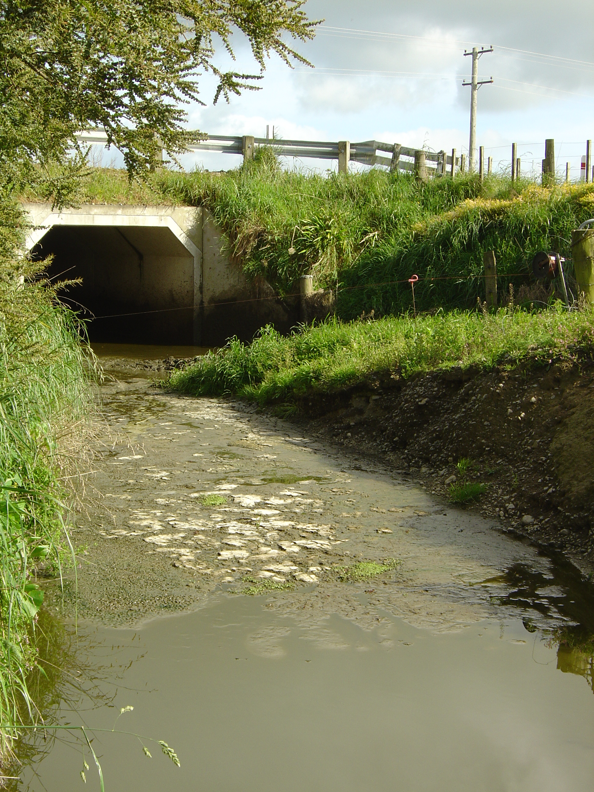
*নিউজিল্যান্ডে কৃষিকাজ থেকে প্রবাহিত হওয়ার কারণে একটি গ্রামীণ স্রোতে পানি দূষণ*

কৃষি পরিবেশগত অবক্ষয়ের কারণ এবং এর প্রতি সংবেদনশীলও, যেমন জীববৈচিত্র্যের ক্ষতি, মরুকরণ, মাটির ক্ষয় এবং বৈশ্বিক উষ্ণায়ন, যা ফসলের ফলন হ্রাসের কারণ। [ ১৫৩ ] কৃষি হলো পরিবেশগত চাপ, বিশেষ করে বাসস্থান পরিবর্তন, জলবায়ু পরিবর্তন, পানির ব্যবহার এবং বিষাক্ত নির্গমনের অন্যতম গুরুত্বপূর্ণ চালক। কীটনাশক, বিশেষ করে তুলায় ব্যবহৃত বিষাক্ত পদার্থের প্রধান উৎস কৃষি। [ ১৫৪ ] [ ১৫৫ ] ২০১১ সালের ইউএনইপি গ্রিন ইকোনমি রিপোর্টে বলা হয়েছে যে, কৃষি কার্যক্রম নৃতাত্ত্বিক বৈশ্বিক গ্রিনহাউস গ্যাস নির্গমনের প্রায় ১৩ শতাংশ উত্পাদন করে। এর মধ্যে অজৈব সার, কৃষি-রাসায়নিক কীটনাশক, এবং ভেষজনাশক, সেইসাথে জীবাশ্ম জ্বালানী-শক্তি যোগানগুলোর ব্যবহারও অন্তর্ভুক্ত রয়েছে। [ ১৫৬ ]

কীটনাশক (বিশেষ করে ভেষজনাশক এবং কীটনাশক) প্রকৃতির ক্ষতি, পুষ্টির অভাব, অত্যধিক পানি ব্যবহার এবং প্রাকৃতিক পরিবেশের ক্ষতির মতো প্রভাবগুলির মাধ্যমে কৃষি সমাজের উপর একাধিক বাহ্যিক ক্ষতি আরোপ করে। যুক্তরাজ্যে কৃষির একটি ২০০০ সালের মূল্যায়ন ১৯৯৬ সালের জন্য ২,৩৪৩ মিলিয়ন পাউন্ডের মোট বাহ্যিক ক্ষতি নির্ণয় করেছে, বা হেক্টর প্রতি ২০৮ পাউন্ড। [ ১৫৭ ] মার্কিন যুক্তরাষ্ট্রে এই ক্ষতিগুলোর ২০০৫ সালের একটি বিশ্লেষণ এই সিদ্ধান্তে উপনীত হয়েছে যে, ফসলি জমির জন্য ক্ষতির পরিমাণ প্রায় ৫ থেকে ১৬ বিলিয়ন মার্কিন ডলার (হেক্টর প্রতি ৩০ থেকে ৯৬ মার্কিন ডলার) ধরা হয়, যদিও পশুসম্পদ উৎপাদন এর ক্ষেত্রে এটি ৭১৪ মিলিয়ন ধরা হয়। [ ১৫৮ ] শুধুমাত্র আর্থিক প্রভাবের উপর দৃষ্টি নিবদ্ধ করা এই গবেষণা দুটি এই সিদ্ধান্তে উপনীত হয়েছে যে, বাহ্যিক খরচগুলিকে অভ্যন্তরীণ করার জন্য আরও কিছু করা উচিত। উভয়ই তাদের বিশ্লেষণে ভর্তুকি অন্তর্ভুক্ত করেনি, তবে তারা উল্লেখ করেছে যে ভর্তুকি সমাজে কৃষির ব্যয়কেও প্রভাবিত করে। [ ১৫৭ ] [ ১৫৮ ]

কৃষি ফলন বাড়াতে এবং খরচ কমাতে চায়। সার এবং রোগজীবাণু, শিকারী এবং প্রতিযোগীদের (যেমন আগাছা) অপসারণের মতো জোগানের মাধ্যমে ফলন বৃদ্ধি পায়। খামার ইউনিটের ক্রমবর্ধমান পরিমাপ, যেমন ক্ষেত্রগুলিকে বড় করার সাথে সাথে খরচ হ্রাস পায়; এর অর্থ বেড়া, খাদ এবং আবাসস্থলের অন্যান্য জায়গাগুলি অপসারণ করা। কীটনাশক পোকামাকড়, গাছপালা এবং ছত্রাক মেরে ফেলে। এই এবং অন্যান্য পদক্ষেপগুলি নিবিড়ভাবে চাষ করা জমিতে জীববৈচিত্র্যকে খুব নিম্ন স্তরে নিয়ে যায়। [ ১৫৯ ] কার্যকর ফলন খামারের ক্ষতির সাথে সাথে কমতে থাকে, যা ফসল কাটা, পরিচালনা এবং সংরক্ষণের সময় দুর্বল উত্পাদন অনুশীলনের কারণে হতে পারে। [ ১৬০ ]

## পরিবেশগত প্রভাব

### পশুসম্পদগত সমস্যা

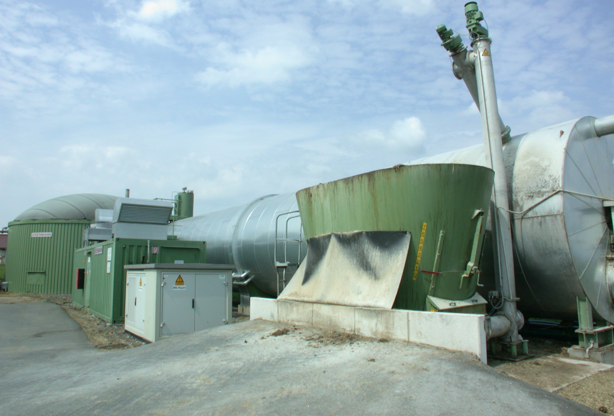
*গোলাবাড়ির অবাত কোমলায়ন যন্ত্র বর্জ্য উদ্ভিদ উপাদান এবং পশুসম্পদ থেকে প্রাপ্ত সারকে বায়োগ্যাস জ্বালানীতে রূপান্তরিত করে।*

জাতিসংঘের একজন ঊর্ধ্বতন কর্মকর্তা হেনিং স্টেইনফেল্ড বলেছেন যে, "আজকের সবচেয়ে গুরুতর পরিবেশগত সমস্যার জন্য পশুসম্পদ অন্যতম গুরুত্বপূর্ণ অবদানকারী"। [ ১৬১ ] পশুসম্পদ উৎপাদন কৃষির জন্য ব্যবহৃত সমস্ত জমির ৭০%, বা গ্রহের ভূমি পৃষ্ঠের ৩০% দখল করে। এটি গ্রিনহাউস গ্যাসের বৃহত্তম উত্সগুলির মধ্যে একটি, যা কার্বন ডাই-অক্সাইড সমতুল্য হিসাবে পরিমাপ করা বিশ্বের গ্রিনহাউস গ্যাস নির্গমনের ১৮% এর জন্য দায়ী। এর তুলনায় সমস্ত পরিবহন কার্বন ডাই-অক্সাইড এর ১৩.৫% নির্গত করে। এটি মানব-সম্পর্কিত নাইট্রাস অক্সাইডের (যার কার্বন ডাই-অক্সাইড এর বৈশ্বিক উষ্ণায়নের ২৯৬ গুণ সম্ভাবনা রয়েছে) ৬৫% উত্পাদন করে এবং সমস্ত মানব-প্ররোচিত মিথেনের (যা কার্বন ডাই-অক্সাইড -এর তুলনায় ২৩ গুণ বেশি উষ্ণায়ন ঘটায়) ৩৭%। এটি অ্যামোনিয়া নির্গমনের ৬৪% উৎপন্ন করে। পশুসম্পদ সম্প্রসারণকে বন উজাড়ের মূল কারণ হিসেবে উল্লেখ করা হয়; আমাজন অববাহিকায় পূর্বের বনাঞ্চলের ৭০% এখন চারণভূমি হিসেবে দখল করা হয় এবং অবশিষ্টাংশ খাদ্যশস্যের জন্য ব্যবহৃত হয়। [ ১৬২ ] বন উজাড় এবং ভূমি ক্ষয়ের মাধ্যমে পশুসম্পদও জীববৈচিত্র্য হ্রাসের দিকে পরিচালিত কর। অধিকন্তু, ইউএনইপি বলেছে যে "বর্তমান অনুশীলন এবং ব্যবহারের ধরন অনুসারে বিশ্বব্যাপী পশুসম্পদ থেকে মিথেন নির্গমন ২০৩০ সালের মধ্যে ৬০ শতাংশ বৃদ্ধি পাবে।" [ ১৫৬ ]

## পরিবেশগত প্রভাব

### ভূমি ও জলগত সমস্যা

*কানসাসে বৃত্তাকার সেচযুক্ত ফসলের ক্ষেত্র। স্বাস্থ্যকর, ভুট্টা এবং সোর্ঘামের ক্রমবর্ধমান ফসল সবুজ (সোর্ঘাম কিছুটা ফ্যাকাশে হতে পারে)। গম উজ্জ্বল সোনা রঙের। বাদামী রঙের ক্ষেতগুলি সম্প্রতি কাটা হয়েছে এবং লাঙ্গল করা হয়েছে বা বছরটির জন্য পতিত অবস্থায় পড়ে আছে।*

ভূমি রূপান্তর অর্থাৎ পণ্য ও পরিষেবার জন্য ভূমি ব্যবহার, পৃথিবীর বাস্তুতন্ত্রকে পরিবর্তন করার ক্ষেত্রে মানুষের সবচেয়ে উল্লেখযোগ্য উপায় এবং জীববৈচিত্র্যের ক্ষতির চালিকাশক্তি। মানুষের মাধ্যমে পরিবর্তিত ভূমির অনুমিত পরিমাণ ৩৯ থেকে ৫০% পর্যন্ত পরিবর্তিত হয়। [ ১৬৩ ] বিশ্বব্যাপী ২৪% জমিতে ভূমির ক্ষয়, বাস্তুতন্ত্রের কার্যকারিতা এবং উৎপাদনশীলতার দীর্ঘমেয়াদী পতন অনুমান করা গেছে, যেখানে ফসলি জমির অতিরিক্ত প্রতিনিধিত্ব দেখা গেছে। [ ১৬৪ ] ভূমি ব্যবস্থাপনা অবনতির পিছনের চালিকাশক্তি; ১.৫ বিলিয়ন মানুষ ক্ষয়িষ্ণু জমির উপর নির্ভর করে। বন উজাড়, মরুকরণ, ভূমির ক্ষয় , খনিজ ক্ষয়, অম্লকরণ বা লবণাক্তকরণের মাধ্যমে এই অবনতি ঘটতে পারে। [ ১১৫ ]

ইউট্রোফিকেশন বা জলজ বাস্তুতন্ত্রে অত্যধিক পুষ্টি সমৃদ্ধকরণের ফলে হওয়া শৈবাল ফুল এবং অ্যানোক্সিয়া , মাছের মৃত্যু ও জীববৈচিত্র্যের ক্ষতির দিকে পরিচালিত করে এবং পানিকে পানীয় হিসেবে ও অন্যান্য শিল্প ব্যবহারের জন্য অযোগ্য করে তোলে। ফসলের জমিতে অত্যধিক রাসায়নিক সার ও গোবর প্রয়োগ, সেইসাথে উচ্চ গবাদি পশুর মজুদ ঘনত্বের কারণে কৃষিজমি থেকে পুষ্টি উপাদান (প্রধানত নাইট্রোজেন এবং ফসফরাস ) ধুয়ে যায় এবং পরিস্রুত হয়। এই পুষ্টি উপাদানগুলি হলো প্রধান ননপয়েন্ট দূষণকারী যা জলজ বাস্তুতন্ত্রের ইউট্রোফিকেশন এবং ভূগর্ভস্থ জলের দূষণে অবদান রাখে, যেটির মানুষের জনসংখ্যার উপর ক্ষতিকারক প্রভাব রয়েছে। [ ১৬৫ ] সার আলোর জন্য প্রতিযোগিতা বাড়িয়ে সেইসব প্রজাতির স্থলজ জীববৈচিত্র্যকেও কমিয়ে দেয় যেগুলো অতিরিক্ত পুষ্টি থেকে উপকৃত হতে পারে। [ ১৬৬ ] মিঠা পানির সম্পদ উত্তোলনের ৭০ শতাংশের জন্য কৃষি খাত দায়ী। [ ১৬৭ ] [ ১৬৮ ] কৃষি হলো ভূগর্ভস্থ সিক্ত শিলাস্তর থেকে প্রাপ্ত পানির একটি প্রধান উত্তোলক, এবং বর্তমানে সেই ভূগর্ভস্থ পানির উত্সগুলি থেকে একটি অ-টেকসই হারে পানি সংগ্রহ করা হয়। এটি দীর্ঘকাল ধরে জানা যায় যে উত্তর চীন বা গঙ্গার উপরের অংশ এবং পশ্চিম মার্কিন যুক্তরাষ্ট্রের মতো বৈচিত্র্যময় অঞ্চলে ভূগর্ভস্থ সিক্ত শিলাস্তরগুলি হ্রাস পাচ্ছে এবং নতুন গবেষণা ইরান, মেক্সিকো এবং সৌদি আরবের জলজভূমি পর্যন্ত এই সমস্যাগুলির বিস্তৃতিকে প্রসারিত করেছে। [ ১৬৯ ] শিল্প এবং শহুরে এলাকার মাধ্যমে পানি সম্পদের উপর ক্রমবর্ধমান চাপ প্রযুক্ত হচ্ছে, যার অর্থ পানির ঘাটতি বাড়ছে এবং বিশ্বের ক্রমবর্ধমান জনসংখ্যার হ্রাসপ্রাপ্ত পানি সম্পদের পাশাপাশি আরও খাদ্য উৎপাদনের ক্ষেত্রে কৃষি চ্যালেঞ্জের মুখোমুখি হচ্ছে। [ ১৭০ ] যখন সেচ ভুলভাবে করা হয়, তখন কৃষিজ পানি ব্যবহার প্রাকৃতিক জলাভূমির ধ্বংস, জলবাহিত রোগের বিস্তার এবং লবণাক্তকরণ ও জলাবদ্ধতার মাধ্যমে ভূমির ক্ষয় সহ বিভিন্ন বড় পরিবেশগত সমস্যা সৃষ্টি করতে পারে। [ ১৭১ ]

## পরিবেশগত প্রভাব

### কীটনাশক

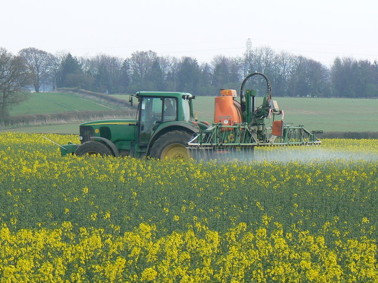
*একটি ফসলে কীটনাশক দিয়ে স্প্রে করা হচ্ছে*

১৯৫০ সাল থেকে কীটনাশকের ব্যবহার বেড়েছে বিশ্বব্যাপী বার্ষিক ২.৫ মিলিয়ন শর্ট টন, তবুও কীটপতঙ্গ থেকে ফসলের ক্ষতি তুলনামূলকভাবে স্থির রয়েছে। [ ১৭২ ] বিশ্ব স্বাস্থ্য সংস্থা ১৯৯২ সালে অনুমান করেছে যে বছরে ৩ মিলিয়ন কীটনাশক বিষক্রিয়া ঘটে, যার ফলে ২২০,০০০ জন মারা যায়। [ ১৭৩ ] কীটনাশকগুলো কীটপতঙ্গের জনসংখ্যায় কীটনাশক প্রতিরোধের জন্য নির্বাচন করা হয়, যা "কীটনাশক ট্রেডমিল" নামে একটি শর্তের দিকে পরিচালিত করে যেখানে কীটপতঙ্গ প্রতিরোধ একটি নতুন কীটনাশকের বিকাশের নিশ্চয়তা দেয়। [ ১৭৪ ]

একটি বিকল্প যুক্তি হলো যে "পরিবেশ সংরক্ষণ" এবং দুর্ভিক্ষ প্রতিরোধ করার উপায় হল, কীটনাশক ব্যবহার করা এবং নিবিড় উচ্চ ফলন চাষ করা; এটি এমন একটি দৃষ্টিভঙ্গি যা সেন্টার ফর গ্লোবাল ফুড ইস্যুস ওয়েবসাইটের শিরোনামের একটি উদ্ধৃতির মাধ্যমে ব্যাখ্যা করা হয়েছে: 'একর প্রতি আরও বেশি চাষ করা আরও বেশি জমি প্রকৃতিতে ছেড়ে দেয়া'। [ ১৭৫ ] [ ১৭৬ ] তবে, সমালোচকরা যুক্তি দেখান যে পরিবেশ এবং খাদ্যের প্রয়োজনের মধ্যে একটি লেনদেন অনিবার্য নয়, [ ১৭৭ ] এবং কীটনাশকগুলি কেবল ফসলের আবর্তনের মতো ভাল কৃষিগত পদ্ধতিগুলোকে প্রতিস্থাপন করে। [ ১৭৪ ] পুশ-পুল কৃষি কীটপতঙ্গ ব্যবস্থাপনা কৌশলের মধ্যে আন্তঃফসল জড়িত, যেখানে উদ্ভিদের সুগন্ধ ব্যবহার করে ফসল থেকে কীটপতঙ্গ দূর করা (তাড়িয়ে দেওয়া) এবং তাদেরকে এমন জায়গায় প্রলুব্ধ করা যেখান থেকে তাদের অপসারণ করা (টানা) যেতে পারে। [ ১৭৮ ]

## পরিবেশগত প্রভাব

### জলবায়ু পরিবর্তন

কৃষি, এবং বিশেষ করে পশুপালন, গ্রিনহাউস গ্যাস এর কার্বন ডাই-অক্সাইড উৎপাদন এবং বিশ্বের মিথেনের একটি অংশ এবং ভবিষ্যতে জমির অনুর্বরতা এবং বন্যপ্রাণীর স্থানচ্যুতির জন্যও দায়ী। গ্রিনহাউস গ্যাসের নৃতাত্ত্বিক নির্গমন, এবং কৃষি ব্যবহারের জন্য বনের মতো অকৃষি জমির রূপান্তরের মাধ্যমে কৃষি জলবায়ু পরিবর্তনে অবদান রাখে। [ ১৭৯ ] ২০১০ সালে বিশ্বব্যাপী বার্ষিক নির্গমনে কৃষি, বনায়ন এবং ভূমি-ব্যবহারের পরিবর্তন প্রায় ২০ থেকে ২৫ % অবদান রেখেছিল। [ ১৮০ ] নীতির একটি পরিসর কৃষির উপর নেতিবাচক জলবায়ু পরিবর্তন এবং কৃষি খাত থেকে গ্রিনহাউস গ্যাস নির্গমনের প্রভাবের ঝুঁকি কমাতে পারে। [ ১৮১ ] [ ১৮২ ] [ ১৮৩ ] [ ১৮৪ ] [ ১৮৫ ]

## পরিবেশগত প্রভাব

### স্থায়িত্ব

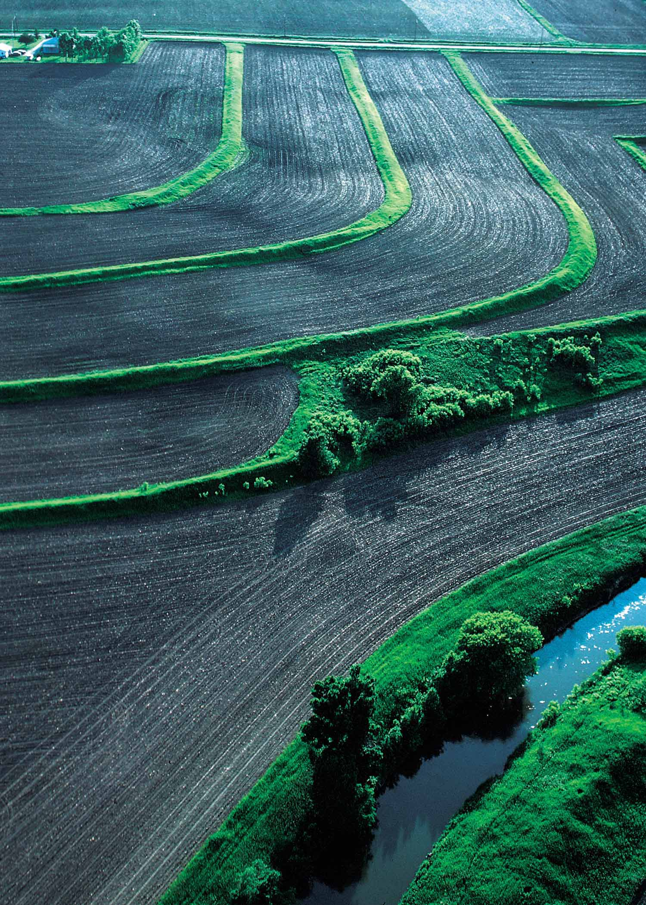
*আইওয়াতে এই খামারে সোপান, সংরক্ষণ আবাদ এবং সংরক্ষণ বাফারগুলি মাটির ক্ষয় এবং পানি দূষণ কমায়।*

বর্তমান চাষাবাদ পদ্ধতিগুলোর ফলে অতিরিক্ত বিস্তৃত পানি সম্পদ, উচ্চ মাত্রার ক্ষয় এবং মাটির উর্বরতা হ্রাস পেয়েছে। বর্তমান পদ্ধতিগুলো ব্যবহার করে কৃষিকাজ চালিয়ে যাওয়ার জন্য পর্যাপ্ত পানি নেই; তাই ফসলের ফলন বাড়াতে জল, জমি এবং বাস্তুতন্ত্রের সংস্থানগুলি কীভাবে ব্যবহার করা হবে তা পুনর্বিবেচনা করা উচিত। একটি সমাধান হলো বাস্তুতন্ত্রকে মূল্য দেওয়া, পরিবেশগত এবং জীবিকা নির্বাহমূলক ব্যবসাকে স্বীকৃতি দেওয়া এবং বিভিন্ন ব্যবহারকারী এবং অংশীদারদের অধিকারের ভারসাম্য বজায় রাখা। [ ১৮৬ ] যখন এই ধরনের ব্যবস্থা গ্রহণ করা হয় তখন যে বৈষম্যগুলি দেখা দেয় তা সমাধান করা প্রয়োজন, যেমন দরিদ্রদের থেকে ধনীদের মধ্যে পানির পুনঃবন্টন, আরও বেশি উত্পাদনশীল কৃষিজমির পথ তৈরি করার জন্য জমি পরিষ্কার করা, বা একটি জলাভূমি ব্যবস্থা সংরক্ষণ যা মাছ ধরার অধিকারকে সীমিত করে। [ ১৮৭ ]

প্রযুক্তিগত অগ্রগতি কৃষকদের কৃষিকে আরও টেকসই করার জন্য সরঞ্জাম এবং সংস্থান সরবরাহ করতে সহায়তা করে। [ ১৮৮ ] প্রযুক্তি সংরক্ষণ আবাদের মতো উদ্ভাবনের সুযোগ দেয়, যেটি এমন একটি কৃষি প্রক্রিয়া যা ভূমিক্ষয় রোধ করতে সাহায্য করে, জল দূষণ হ্রাস করে এবং কার্বন সিকোয়েস্টেশন বাড়ায়। [ ১৮৯ ] অন্যান্য সম্ভাব্য অনুশীলনের মধ্যে রয়েছে সংরক্ষণ কৃষি, কৃষি বনায়ন , উন্নত চারণ, পরিত্যক্ত তৃণভূমি রূপান্তর এবং বায়োচার। [ ১৯০ ] [ ১৯১ ] মার্কিন যুক্তরাষ্ট্রে বর্তমান একক-ফসল চাষের পদ্ধতিগুলো টেকসই পদ্ধতির ব্যাপকভাবে গ্রহণকে বাধাগ্রস্ত করে, যেমন ২-৩ টি ফসলের আবর্তন যা বার্ষিক ফসলের সাথে ঘাস বা খড়কে অন্তর্ভুক্ত করে, যদি না নেতিবাচক নির্গমন লক্ষ্যগুলো যেমন মাটিতে কার্বন আটকানো নীতিতে পরিণত হয়। [ ১৯২ ]

ইন্টারন্যাশনাল ফুড পলিসি রিসার্চ ইনস্টিটিউট বলেছে যে কৃষি প্রযুক্তি একটি অপরটির সাথে একত্রে গৃহীত হলে তা খাদ্য উৎপাদনে সবচেয়ে বেশি প্রভাব ফেলবে; ২০৫০ সালের মধ্যে এগারোটি প্রযুক্তি কীভাবে কৃষি উৎপাদনশীলতা, খাদ্য নিরাপত্তা এবং বাণিজ্যকে প্রভাবিত করতে পারে তা মূল্যায়ন করতে তারা একটি মডেল ব্যবহার করা হয়েছে, যেখানে দেখা গেছে যে ক্ষুধার ঝুঁকিতে থাকা মানুষের সংখ্যা ৪০% পর্যন্ত কমানো যেতে পারে এবং খাদ্যের দাম প্রায় অর্ধেক কমানো যেতে পারে। [ ১৩২ ] বর্তমান জলবায়ু পরিবর্তনের পূর্বাভাস সহ পৃথিবীর অনুমিত জনসংখ্যার খাদ্য চাহিদা কৃষি পদ্ধতির উন্নতি, কৃষি এলাকার সম্প্রসারণ এবং একটি স্থায়িত্ব-ভিত্তিক ভোক্তা মানসিকতার মাধ্যমে পূরণ করা যেতে পারে। [ ১৯৩ ]

## পরিবেশগত প্রভাব

### শক্তি নির্ভরতা

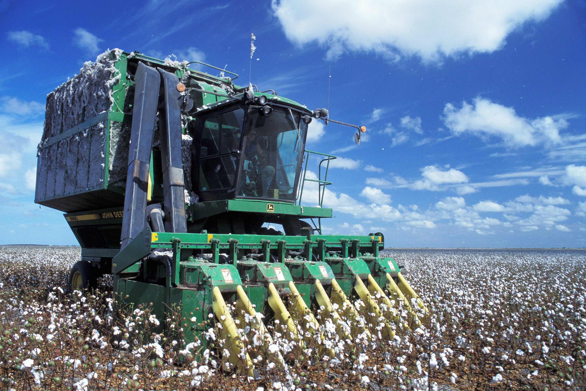
*যান্ত্রিক কৃষি : ১৯৪০-এর দশকের প্রথম মডেল থেকে, তুলা বাছাইকারক মতো সরঞ্জাম জীবাশ্ম জ্বালানির বর্ধিত ব্যবহারের মূল্যে ৫০ জন খামার কর্মীকে প্রতিস্থাপন করতে পারে।*

১৯৪০ সাল থেকে, মূলত শক্তি-নিবিড় যান্ত্রিকীকরণ, সার এবং কীটনাশকের বর্ধিত ব্যবহারের কারণে কৃষি উৎপাদনশীলতা নাটকীয়ভাবে বৃদ্ধি পায়। এই শক্তির জোগানের সিংহভাগই আসে জীবাশ্ম জ্বালানির উত্স থেকে। [ ১৯৪ ] ১৯৬০ এবং ১৯৮০ এর দশকের মধ্যে, সবুজ বিপ্লব বিশ্বব্যাপী কৃষিকে রূপান্তরিত করে দেয়, বিশ্ব জনসংখ্যা দ্বিগুণ হওয়ার সাথে সাথে শস্য উৎপাদন উল্লেখযোগ্যভাবে বৃদ্ধি পায় (ভৌগোলিক এলাকার উপর নির্ভর করে গমের ক্ষেত্রে ৭০% থেকে ৩৯০% এবং ধানের ক্ষেত্রে ৬০% থেকে ১৫০% এর মধ্যে)। [ ১৯৫ ] পেট্রোকেমিক্যালের উপর অত্যধিক নির্ভরতা এই উদ্বেগ উত্থাপন করে যে তেলের ঘাটতি খরচ বৃদ্ধি করতে পারে এবং কৃষি উৎপাদন হ্রাস করতে পারে। [ ১৯৬ ]

শিল্পায়িত কৃষি দুটি মৌলিক উপায়ে জীবাশ্ম জ্বালানির উপর নির্ভর করে: খামারে সরাসরি ব্যবহার এবং খামারে ব্যবহৃত জোগান তৈরি করার ক্ষেত্রে। খামারের যানবাহন এবং যন্ত্রপাতি পরিচালনার জন্য লুব্রিকেন্ট এবং জ্বালানীর ব্যবহার সরাসরি ব্যবহার এর মধ্যে অন্তর্ভুক্ত। [ ১৯৬ ]

| তিনটি শিল্পোন্নত দেশের ব্যবহৃত মোট শক্তির কৃষি ও খাদ্য ব্যবস্থার অংশ (%) [ হালনাগাদ প্রয়োজন ] |
| --- |
| দেশ |
| যুক্তরাজ্য [ ১৯৭ ] |
| মার্কিন যুক্তরাষ্ট্র [ ১৯৮ ] |
| সুইডেন [ ১৯৯ ] |

পরোক্ষ খরচের মধ্যে রয়েছে সার, কীটনাশক এবং খামারের যন্ত্রপাতি তৈরি করা। [ ১৯৬ ] বিশেষ করে, নাইট্রোজেন সারের উৎপাদন অর্ধেকেরও বেশি কৃষি শক্তি ব্যবহারের জন্য দায়ী। [ ২০০ ] মার্কিন খামারগুলির প্রত্যক্ষ এবং পরোক্ষ ব্যবহার একত্রে দেশটির মোট শক্তি ব্যবহারের প্রায় ২% এর জন্য দায়ী। মার্কিন খামারগুলির প্রত্যক্ষ এবং পরোক্ষ শক্তি খরচ ১৯৭৯ সালে শীর্ষে পৌঁছেছিল এবং তারপর থেকে তা ধীরে ধীরে হ্রাস পেয়েছে। [ ১৯৬ ] খাদ্য ব্যবস্থা শুধু কৃষিকেই নয় বরং খামারের বাইরের প্রক্রিয়াকরণ, প্যাকেজিং, পরিবহন, বিপণন, ব্যবহার এবং খাদ্য এবং খাদ্য-সম্পর্কিত পদগুলির নিষ্পত্তিকেও অন্তর্ভুক্ত করে। মার্কিন যুক্তরাষ্ট্রে খাদ্য ব্যবস্থার শক্তি ব্যবহারের এক-পঞ্চমাংশেরও কমের জন্য কৃষি খাত দায়ী। [ ১৯৮ ] [ ২০১ ]

## পরিবেশগত প্রভাব

### প্লাস্টিক দূষণ

কৃষিতে প্লাস্টিক পণ্য ব্যাপকভাবে ব্যবহৃত হয়, উদাহরণস্বরূপ ফসলের ফলন বৃদ্ধি এবং পানি এবং কৃষি রাসায়নিকের ব্যবহারগত কার্যকারিতা উন্নত করতে । "অ্যাগ্রিপ্লাস্টিক" পণ্যের মধ্যে রয়েছে গ্রিনহাউস এবং টানেল ঢেকে রাখার ফিল্ম, মাটি ঢেকে রাখার জন্য আবরণ (যেমন আগাছা দমন, পানি সংরক্ষণ , মাটির তাপমাত্রা বৃদ্ধি এবং সার প্রয়োগে সহায়তা করার জন্য), ছায়াদার কাপড়, কীটনাশক পাত্র, চারা তৈরির ট্রে, প্রতিরক্ষামূলক জাল এবং সেচ নল।এই পণ্যগুলোতে সর্বাধিক ব্যবহৃত পলিমারগুলো হলো কম ঘনত্বের পলিথিন (এলডিপিই), লিনিয়ার লো-ডেনসিটি পলিথিন (এলএলডিপিই), পলিপ্রোপিলিন (পিপি) এবং পলিভিনাইল ক্লোরাইড (পিভিসি)। [ ২০২ ]

কৃষিতে ব্যবহৃত প্লাস্টিকের মোট পরিমাণ পরিমাপ করা কঠিন।২০১২ সালের একটি সমীক্ষায় বলা হয়েছে, বিশ্বব্যাপী প্রতি বছর প্রায় ৬.৫ মিলিয়ন টন প্লাস্টিক ব্যবহার করা হয় যদিও পরবর্তী একটি সমীক্ষা অনুমান করেছে যে ২০১৫ সালে বিশ্বব্যাপী এর চাহিদা ছিল ৭.৩ মিলিয়ন থেকে ৯ মিলিয়ন টন।প্লাস্টিকের আবরণের ব্যাপক ব্যবহার এবং পদ্ধতিগত সংগ্রহ ও ব্যবস্থাপনার অভাব প্রচুর পরিমাণ আবরণ অবশিষ্টাংশ তৈরির দিকে পরিচালিত করেছে।বায়ুমণ্ডলে দীর্ঘকাল অনাবৃত থাকার ফলে এবং অবনতি ঘটে এক পর্যায়ে আবরণটি খণ্ডিত হয়।এই টুকরা এবং প্লাস্টিকের বড় টুকরা মাটিতে জমা হয়।যেখানে ১০ বছরেরও বেশি সময় ধরে মালচ ব্যবহার করা হয়েছে, সেখানকার মাটির স্তরে আবরণের অবশিষ্টাংশ হেক্টর প্রতি ৫০ থেকে ২৬০ কেজি পরিমাপ করা হয়েছে, যা নিশ্চিত করে যে আবৃতকরণ মাটির মাইক্রোপ্লাস্টিক এবং ম্যাক্রোপ্লাস্টিক উভয় দূষণের একটি প্রধান উৎস। [ ২০২ ]

দূষণের উচ্চ মাত্রা (কীটনাশক, সার, মাটি এবং ধ্বংসাবশেষ, আর্দ্র গাছপালা, সাইলেজের তরল পানি এবং ইউভি স্টেবিলাইজার এর মাধ্যমে ওজনের ৪০-৫০% পর্যন্ত দূষণের কারণে) এবং সংগ্রহের অসুবিধার কারণে কৃষিতে ব্যবহৃত প্লাস্টিক, বিশেষ করে প্লাস্টিক ফিল্মগুলো পুনর্ব্যবহার করা সহজ হয় না।তাই, এগুলোকে প্রায়শই মাটিতে পুঁতে ফেলা হয় বা মাঠে কিংবা জলাশয়ে ফেলা হয় বা পুড়িয়ে দেওয়া হয়।নিষ্পত্তির এই অনুশীলনগুলো মাটির ক্ষয়ের দিকে পরিচালিত করে এবং এর ফলে মাটি দূষিত হতে পারে এবং বৃষ্টিপাত ও জোয়ার-ভাঁটার প্রবাহের ফলে সামুদ্রিক পরিবেশে মাইক্রোপ্লাস্টিক প্রবেশের ছিদ্রপথ তৈরি হতে পারে।উপরন্তু, অবশিষ্ট প্লাস্টিকের ফিল্মের সংরক্ষক বস্তু (যেমন ইউভি এবং থার্মাল স্টেবিলাইজার) ফসলের বৃদ্ধি, মাটির গঠন, পুষ্টির পরিবহন এবং লবণের মাত্রার উপর ক্ষতিকর প্রভাব ফেলতে পারে।প্লাস্টিক আবরণ মাটির গুণমান নষ্ট করতে পারে, মাটির জৈব পদার্থের মজুত ক্ষতিগ্রস্ত করতে পারে, মাটির পানি প্রতিরোধ ক্ষমতা বৃদ্ধি করতে পারে এবং গ্রিনহাউস গ্যাস নির্গত করতে পারে এমন ঝুঁকি রয়েছে।কৃষিতে ব্যবহৃত প্লাস্টিক ভেঙে যাওয়ার মাধ্যমে অবমুক্ত মাইক্রোপ্লাস্টিকগুলো খাদ্য শৃঙ্খল অতিক্রম করতে সক্ষম দূষিত পদার্থগুলোকে শোষণ এবং ঘনীভূত করতে পারে। [ ২০২ ]

## ক্ষেত্রসমূহ

### কৃষি অর্থনীতি

*১৯শ শতকের ব্রিটেনে, সুরক্ষাবাদী ভুট্টা আইন উচ্চ মূল্য এবং ব্যাপক প্রতিবাদের দিকে পরিচালিত করে, যেমন ১৮৪৬ সালের এই অ্যান্টি কর্ন ল লীগের বৈঠক। [ ২০৩ ]*

কৃষি অর্থনীতি হলো এক ধরনের অর্থনীতি কারণ এটি "[কৃষি] পণ্য ও পরিষেবার উৎপাদন, বন্টন এবং ব্যবহার" এর সাথে সম্পর্কিত। [ ২০৪ ] অধ্যয়নের ক্ষেত্র হিসাবে বিপণন এবং ব্যবসার সাধারণ তত্ত্বের সাথে কৃষি উৎপাদনের সমন্বয় ১৮০০ এর দশকের শেষের দিকে শুরু হয় এবং ২০শ শতকের মধ্যে উল্লেখযোগ্যভাবে বৃদ্ধি পায়। [ ২০৫ ] যদিও কৃষি অর্থনীতির অধ্যয়ন তুলনামূলকভাবে সাম্প্রতিক, কৃষির প্রধান প্রবণতাগুলি পুরো ইতিহাস জুড়ে জাতীয় এবং আন্তর্জাতিক অর্থনীতিকে উল্লেখযোগ্যভাবে প্রভাবিত করেছে, যা আমেরিকান গৃহযুদ্ধ -পরবর্তী দক্ষিণ মার্কিন যুক্তরাষ্ট্রে ভাড়াটে কৃষক এবং বর্গা ব্যবস্থা [ ২০৬ ] থেকে শুরু করে ইউরোপীয় সামন্ততান্ত্রিক ব্যবস্থার ম্যানোরিয়ালিজম পর্যন্ত বিস্তৃত। [ ২০৭ ] মার্কিন যুক্তরাষ্ট্রে, এবং অন্যত্র, খাদ্য প্রক্রিয়াকরণ, বিতরণ, এবং কৃষি বিপণনের জন্য দায়ী খাদ্য খরচ- যাকে কখনও কখনও মূল্য শৃঙ্খল হিসাবেও উল্লেখ করা হয়- বেড়েছে, যদিও চাষের জন্য দায়ী খরচ হ্রাস পেয়েছে। এটি সরবরাহ শৃঙ্খলের মাধ্যমে প্রদত্ত মূল্য সংযোজনের বর্ধিত স্তরের সমন্বিত মিলিত চাষের বৃহত্তর দক্ষতার সাথে সম্পর্কিত। পাশাপাশি খাতটিতে বাজারের ঘনত্বও বৃদ্ধি পেয়েছে, আর যদিও বাজারের ঘনত্ব বৃদ্ধির মোট প্রভাবের ফলে কার্যক্ষমতা বৃদ্ধির সম্ভাবনা রয়েছে, তবে পরিবর্তনগুলি উত্পাদক (কৃষক) এবং ভোক্তাদের কাছ থেকে অর্থনৈতিক উদ্বৃত্ত পুনঃবন্টন করার ক্ষেত্রে এবং গ্রামীণ সম্প্রদায়ের জন্য নেতিবাচক প্রভাব ফেলতে পারে। [ ২০৮ ]

জাতীয় সরকারের নীতিগুলি কর, ভর্তুকি, শুল্ক এবং অন্যান্য ব্যবস্থার আকারে কৃষি পণ্যের অর্থনৈতিক বাজারকে উল্লেখযোগ্যভাবে পরিবর্তন করতে পারে। [ ২০৯ ] অন্তত ১৯৬০ সাল থেকে, বাণিজ্য বিধিনিষেধ, বিনিময় হার নীতি এবং ভর্তুকি উন্নয়নশীল এবং উন্নত বিশ্ব উভয় ক্ষেত্রের কৃষকদেরই প্রভাবিত করেছে। ১৯৮০-এর দশকে, উন্নয়নশীল দেশগুলিতে ভর্তুকিহীন কৃষকরা জাতীয় নীতিগুলির প্রতিকূল প্রভাবের সম্মুখীন হয়েছিল যা খামার পণ্যগুলির জন্য কৃত্রিমভাবে কম বিশ্বব্যাপী মূল্য তৈরি করে। ১৯৮০-এর দশকের মাঝামাঝি এবং ২০০০-এর দশকের প্রথম দিকে, বেশ কয়েকটি আন্তর্জাতিক চুক্তি কৃষি শুল্ক, ভর্তুকি এবং অন্যান্য বাণিজ্য সীমাবদ্ধতা সীমিত করেছিল। [ ২১০ ]

তবে, ২০০৯-এর হিসাব অনুযায়ী [হালনাগাদ] বৈশ্বিক কৃষি পণ্যের মূল্যে নীতি-চালিত বিকৃতি তখনও উল্লেখযোগ্য পরিমাণে ছিল। প্রধানত করের কারণে তিনটি কৃষি পণ্যের (চিনি, দুধ এবং চাল) মধ্যে সবচেয়ে বেশি ব্যবসায়িক বিকৃতি ছিল। তৈলবীজের মধ্যে, তিলের উপর সবচেয়ে বেশি কর আরোপ করা হয়েছিল, কিন্তু সামগ্রিকভাবে খাদ্যশস্য এবং তৈলবীজে পশুসম্পদ পণ্যের তুলনায় অনেক কম মাত্রার কর ছিল। ১৯৮০ এর দশক থেকে কৃষি নীতিতে বিশ্বব্যাপী সংস্কারের সময় নীতি-চালিত বিকৃতি শস্যের তুলনায় পশুসম্পদ পণ্যের মধ্যে একটি বড় হ্রাস লক্ষ্য করা গেছে। [ ২০৯ ] এই অগ্রগতি সত্ত্বেও, কিছু ফসল, যেমন তুলার ক্ষেত্রে এখনও উন্নত দেশগুলিতে ভর্তুকি দেখে কৃত্রিমভাবে বৈশ্বিক মূল্য হ্রাস করা হয়, যা উন্নয়নশীল দেশগুলিতে অ-ভর্তুকিহীন কৃষকদের জন্য সমস্যা সৃষ্টি করে। [ ২১১ ] ভুট্টা, সয়াবিন এবং গবাদি পশুর মতো অপ্রক্রিয়াজাত পণ্যগুলি সাধারণত গুণমান নির্দেশ করার জন্য শ্রেণীভুক্ত করা হয়, যা উৎপাদক যে মূল্য পায় তাকে প্রভাবিত করে। পণ্যগুলি সাধারণত উত্পাদন পরিমাণের মাধ্যমে বর্ণনা করা হয়, যেমন আয়তন, সংখ্যা বা ওজন। [ ২১২ ]

## ক্ষেত্রসমূহ

### কৃষি বিজ্ঞান

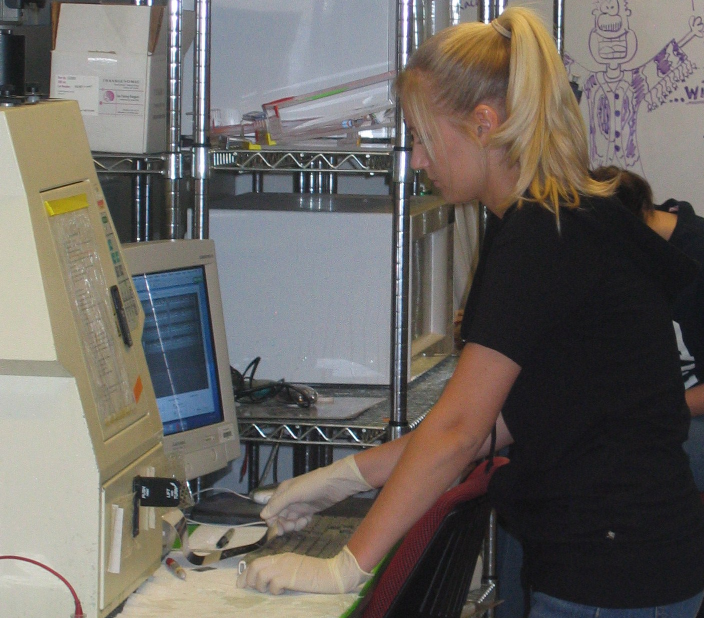
*একজন কৃষিবিদ একটি উদ্ভিদ জিনোম ম্যাপিং করছেন*

কৃষি বিজ্ঞান হলো জীববিজ্ঞানের একটি বিস্তৃত বহু-বিষয়ক ক্ষেত্র যা কৃষির অনুশীলন এবং বোঝার ক্ষেত্রে ব্যবহৃত সঠিক, প্রাকৃতিক, অর্থনৈতিক এবং সামাজিক বিজ্ঞানের অংশগুলিকে অন্তর্ভুক্ত করে। এটি কৃষিবিদ্যা, উদ্ভিদ প্রজনন এবং বংশগতিবিদ্যা, উদ্ভিদ রোগবিদ্যা , শস্য মডেলিং, মৃত্তিকা বিজ্ঞান , কীটতত্ত্ব , উৎপাদন কৌশল এবং উন্নতি, কীটপতঙ্গ ও তাদের ব্যবস্থাপনার অধ্যয়ন, এবং মাটির ক্ষয়, বায়োরিমিডিয়েশন, বর্জ্য ব্যবস্থাপনার মতো প্রতিকূল পরিবেশগত প্রভাবের অধ্যয়নের মতো বিষয়গুলিকে অন্তর্ভুক্ত করে। [ ২১৩ ] [ ২১৪ ]

১৮শ শতকে কৃষির বৈজ্ঞানিক অধ্যয়ন শুরু হয়, যখন জোহান ফ্রেডরিখ মায়ার একটি সার হিসাবে জিপসাম (হাইড্রেটেড ক্যালসিয়াম সালফেট ) এর ব্যবহারের উপর পরীক্ষা চালান। [ ২১৫ ] গবেষণা আরও সুশৃঙ্খল হয়ে ওঠে যখন ১৮৪৩ সালে, জন লয়েস এবং হেনরি গিলবার্ট ইংল্যান্ডের রোথামস্টেড রিসার্চ স্টেশনে দীর্ঘমেয়াদী কৃষিবিদ্যা ক্ষেত্রের পরীক্ষা শুরু করেন; তাদের মধ্যে কিছু, যেমন পার্ক গ্রাস এক্সপেরিমেন্ট এখনও চলছে। [ ২১৬ ] [ ২১৭ ] আমেরিকায় ১৮৮৭ সালের হ্যাচ অ্যাক্টের জন্য তহবিল সরবরাহ করা হয় যাকে প্রথমবারের মতো "কৃষি বিজ্ঞান" বলা হয়েছিল, যা সারের প্রতি কৃষকদের আগ্রহের দ্বারা চালিত হয়েছিল। [ ২১৮ ] কৃষি কীটতত্ত্বে, ইউএসডিএ ১৮৮১ সালে জৈবিক নিয়ন্ত্রণ নিয়ে গবেষণা শুরু করে; ইউরোপ এবং জাপানে যাযাবর মথ এবং বাদামী-লেজ মথের প্রাকৃতিক শত্রুদের জন্য অনুসন্ধান করার মাধ্যমে এটি ১৯০৫ সালে তার প্রথম বৃহৎ কর্মসূচী প্রতিষ্ঠা করে, যা মার্কিন যুক্তরাষ্ট্রে প্যারাসাইটয়েড (যেমন স্বতন্ত্র ভিমরুল) এবং শিকারী উভয় কীটপতঙ্গের উপস্থিতি প্রমাণ করে। [ ২১৯ ] [ ২২০ ] [ ২২১ ]

## নীতি

*২০১২ সালে ওইসিডি -এর দেশগুলির দ্বারা পশু পণ্য এবং খাদ্যের জন্য প্রদত্ত সরাসরি ভর্তুকি, বিলিয়ন মার্কিন ডলারে [ ২২২ ]*

| পণ্য | ভর্তুকি |
| --- | --- |
| গরুর মাংস এবং ভীল | ১৮.০ |
| দুধ | ১৫.৩ |
| শূকর | ৭.৩ |
| পোল্ট্রি | ৬.৫ |
| সয়াবিন | ২.৩ |
| ডিম | ১.৫ |
| ভেড়া | ১.১ |

কৃষি নীতি হলো দেশীয় কৃষি এবং বিদেশী কৃষি পণ্য আমদানি সংক্রান্ত সরকারি সিদ্ধান্ত ও কর্মের সমষ্টি। সরকার সাধারণত দেশীয় কৃষি পণ্যের বাজারে একটি সুনির্দিষ্ট ফলাফল অর্জনের লক্ষ্যে কৃষি নীতি বাস্তবায়ন করে। কিছু অতি-ক্রীড়নীয় বিষয়ের মধ্যে ঝুঁকি ব্যবস্থাপনা এবং সমন্বয় (জলবায়ু পরিবর্তন, খাদ্য নিরাপত্তা এবং প্রাকৃতিক দুর্যোগ সংক্রান্ত নীতি সহ), অর্থনৈতিক স্থিতিশীলতা (কর সংক্রান্ত নীতি সহ), প্রাকৃতিক সম্পদ এবং পরিবেশগত স্থায়িত্ব (বিশেষ করে পানি নীতি ), গবেষণা ও উন্নয়ন, এবং দেশীয় পণ্যের জন্য বাজার প্রবেশাধিকার (বিশ্বব্যাপী সংস্থার সাথে সম্পর্ক এবং অন্যান্য দেশের সাথে চুক্তি সহ) অন্তর্ভুক্ত থাকে। [ ২২৩ ] কৃষি নীতি খাদ্যের গুণমানকেও প্রভাবিত করতে পারে; খাদ্য সরবরাহ যে একটি সামঞ্জস্যপূর্ণ এবং পরিচিত মান তা নিসচির করার মাধ্যমে, খাদ্য নিরাপত্তা, খাদ্য সরবরাহ জনসংখ্যার চাহিদা পূরণ করবে এবং সংরক্ষণ করা যাবে তা নিশ্চিত করার মাধ্যমে। নীতি কর্মসূচী আর্থিক কর্মসূচী, যেমন ভর্তুকি থেকে উৎপাদকদের স্বেচ্ছাসেবামূলক গুণমান নিশ্চিতকরণ কার্যক্রমে নথিভুক্ত করতে উত্সাহিত করা পর্যন্ত বিস্তৃত হতে পারে। [ ২২৪ ]

ভোক্তা, কৃষি ব্যবসা, বাণিজ্য তদবিরকারী এবং অন্যান্য গোষ্ঠী সহ কৃষি নীতি তৈরিতে অনেক প্রভাব রয়েছে। তদবির এবং প্রচারাভিযান অবদানের আকারে কৃষি ব্যবসার স্বার্থ নীতি প্রণয়নের উপর ব্যাপক প্রভাব রাখে। পরিবেশগত ইস্যু এবং শ্রমিক ইউনিয়নগুলিতে আগ্রহী ব্যক্তিদের পাশাপাশি রাজনৈতিক কর্ম গোষ্ঠীগুলিও প্রভাব রেখে থাকে, যেমন লবিং সংস্থাগুলি পৃথক কৃষি পণ্যের প্রতিনিধিত্ব করে। [ ২২৫ ] জাতিসংঘের খাদ্য ও কৃষি সংস্থা (এফএও) ক্ষুধাকে পরাস্ত করার জন্য আন্তর্জাতিক প্রচেষ্টার নেতৃত্ব দেয় এবং বিশ্বব্যাপী কৃষি বিধি ও চুক্তির আলোচনার জন্য একটি ফোরাম প্রদান করে। এফএও-এর প্রাণী উৎপাদন ও স্বাস্থ্য বিভাগের পরিচালক স্যামুয়েল জুটজি বলেছেন যে বৃহৎ কর্পোরেশনগুলির তদবির সংস্কারগুলি বন্ধ করে দিয়েছে যা মানব স্বাস্থ্য এবং পরিবেশের উন্নতি করবে। উদাহরণস্বরূপ, ২০১০ সালে পশুসম্পদ শিল্পের জন্য একটি স্বেচ্ছাসেবী আচরণবিধির প্রস্তাব যা স্বাস্থ্যের মান, এবং পরিবেশগত বিধি-বিধানের উন্নতির জন্য প্রণোদনা প্রদান করবে, যেমন দীর্ঘমেয়াদী ক্ষতি ছাড়াই ধারণ করতে পারে এমন প্রাণীর সংখ্যা অনুযায়ী ভূমির আকার, বড় খাদ্য কোম্পানির চাপের কারণে সফলভাবে ব্যর্থ হয়। [ ২২৬ ]

## আরও দেখুন

- কৃষিকাজের ইতিহাস
- কৃষি বিজ্ঞান
- কৃষিবনবিদ্যা
- কৃষি প্রকৌশল
- কৃষি রোবট
- উর্ধ্বাধ চাষ ব্যবস্থা
- সবজি চাষ

## উদ্ধৃত সূত্রসমূহ

- Acquaah, George (২০০২)। Principles of Crop Production: Theory, Techniques, and Technology । Prentice Hall। আইএসবিএন ৯৭৮-০-১৩-০২২১৩৩-৯ ।
- Chrispeels, Maarten J.; Sadava, David E. (১৯৯৪)। Plants, Genes, and Agriculture । Boston, Massachusetts: Jones and Bartlett। আইএসবিএন ৯৭৮-০-৮৬৭২০-৮৭১-৯ ।
- Needham, Joseph (১৯৮৬)। Science and Civilization in China । Taipei: Caves Books।

## বহিঃসংযোগ

- Food and Agriculture Organization
- United States Department of Agriculture
- Agriculture material from the World Bank Group
- "কৃষিকাজ সংগৃহীত খবর এবং ভাষ্য" । দ্য নিউ ইয়র্ক টাইমস (ইংরেজি ভাষায়)।
- কৃষিকাজ দ্যা গার্ডিয়ান -এর সংবাদ ও ধারাভাষ্যের সংগ্রহশালা।

---
Source: https://bn.wikipedia.org/wiki/%E0%A6%95%E0%A7%83%E0%A6%B7%E0%A6%BF%E0%A6%95%E0%A6%BE%E0%A6%9C
