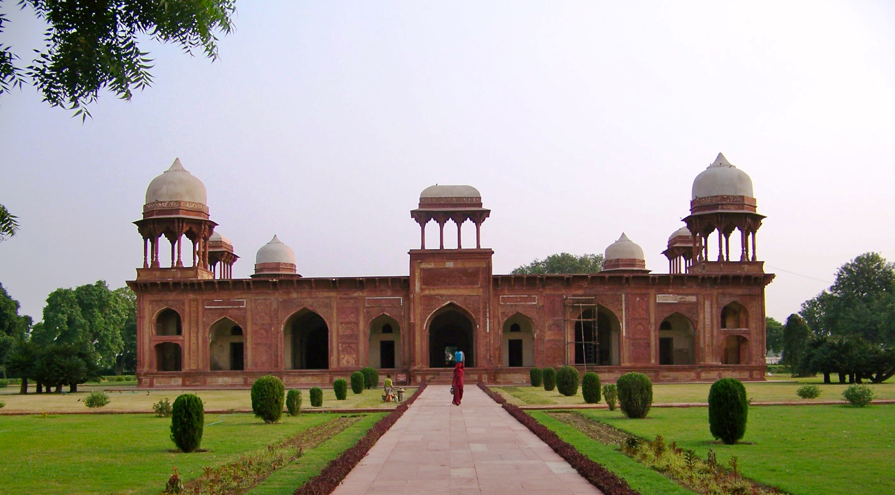
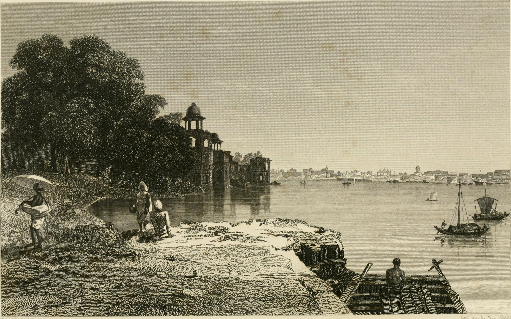
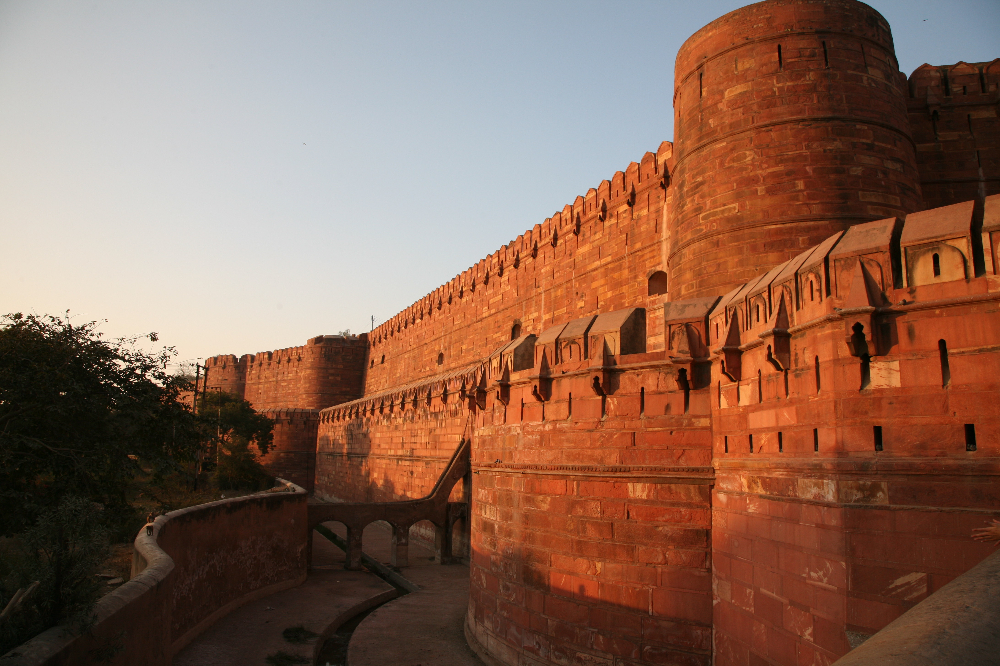
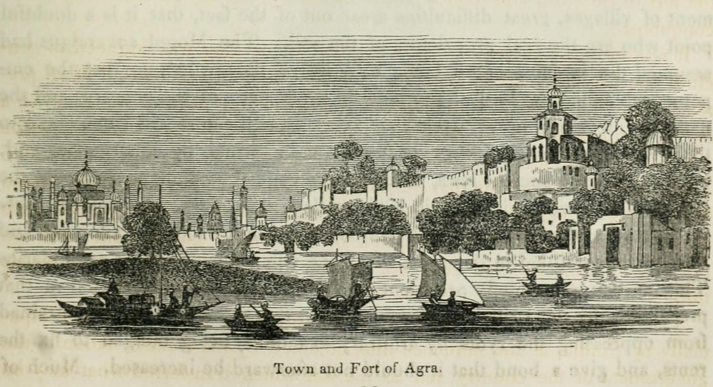
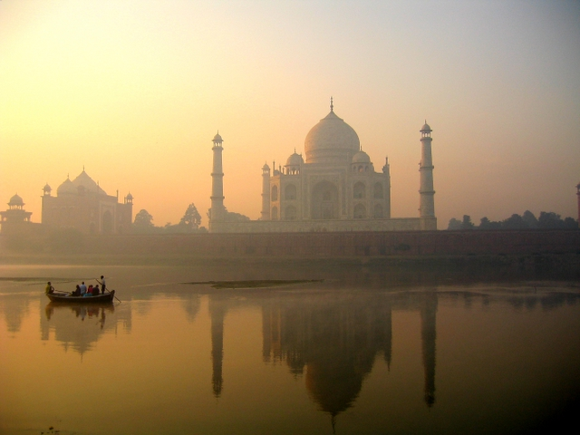
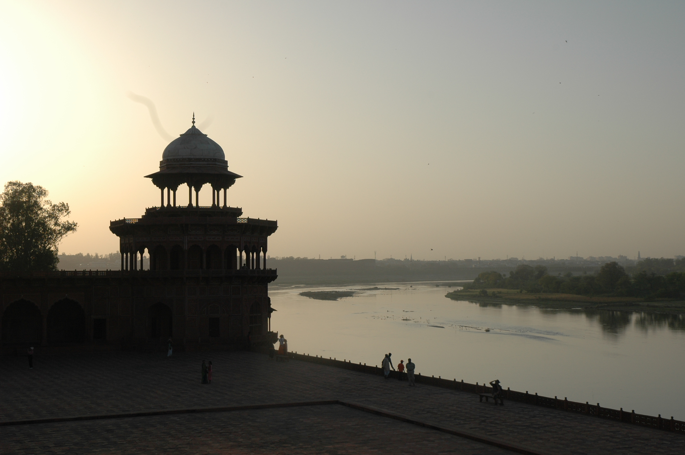
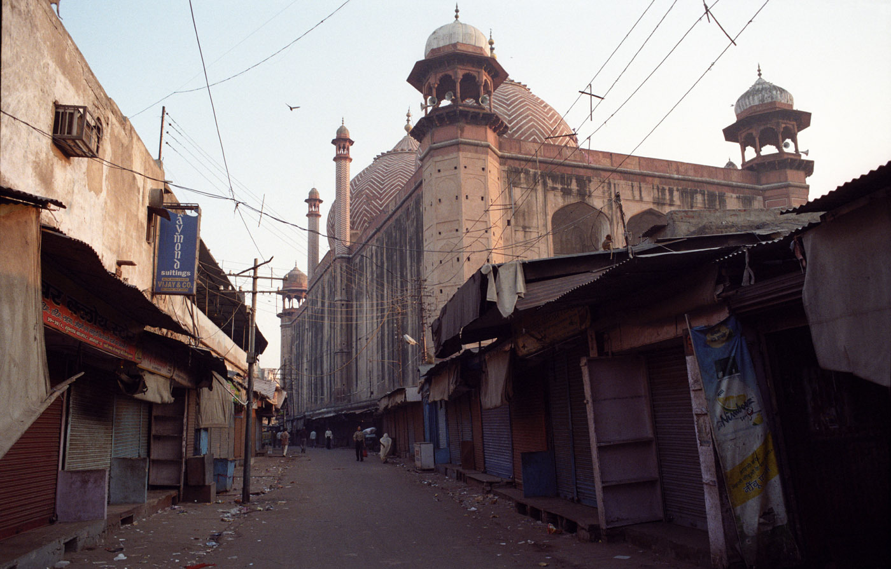
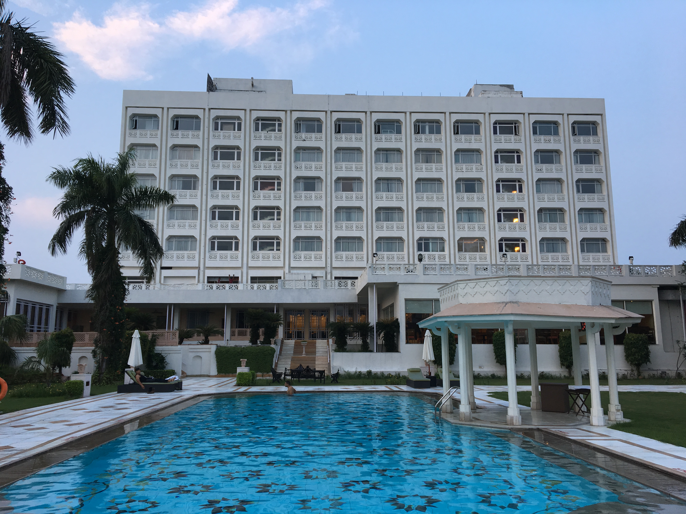
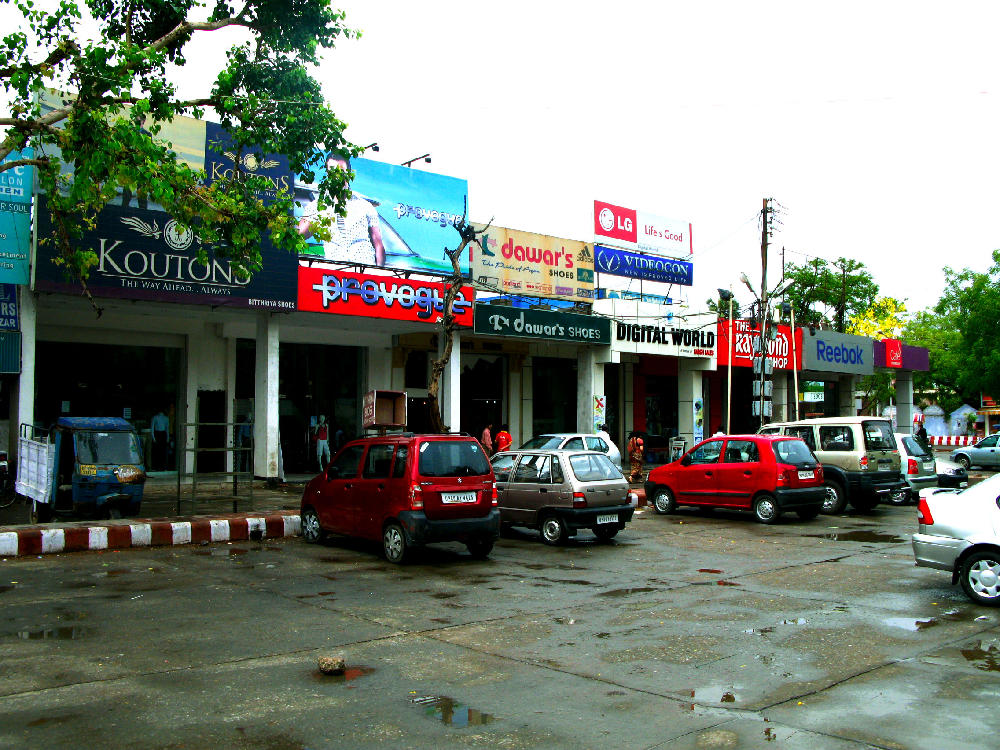
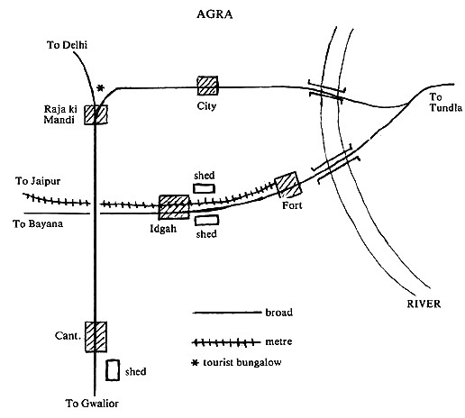

# आगरा

| आगरा Agra |
| --- |
| महानगर [ 1 ] |
| ताज महल जसवंत की छतरी इतिमादुद्दौला का मक़बरा अकबर का मक़बरा गुरु का ताल आगरा क़िला |
| उपनाम: ताज नगरी |
| आगरा आगरा आगरा मानचित्र दिखाएँ उत्तर प्रदेश मानचित्र दिखाएँ भारत मानचित्र दिखाएँ एशिया सभी दिखायें |
| निर्देशांक: 27°11′N 78°01′E / 27.18°N 78.02°E / 27.18; 78.02 |
| देश |
| केन्द्र-शासित प्रदेश |
| मंडल |
| ज़िला |
| शासन |
| • प्रणाली |
| • सभा |
| • महापौर |
| क्षेत्रफल [ 4 ] |
| • महानगर [ 1 ] |
| ऊँचाई [ 5 ] |
| जनसंख्या (2011) [ 6 ] |
| • महानगर [ 1 ] |
| • पद |
| • घनत्व |
| • महानगर [ 7 ] |
| भाषा |
| • आधिकारिक |
| • अतिरिक्त आधिकारिक |
| • क्षेत्रीय |
| समय मण्डल |
| PIN |
| दूरभाष कोड |
| वाहन पंजीकरण |
| GDP |
| लिंगानुपात |
| साक्षरता |
| वेबसाइट |

आगरा ( अंग्रेज़ी : Agra) भारत के उत्तर प्रदेश राज्य का एक जिला है। आगरा शहर यमुना नदी के तट पर स्थित एक महानगर है। यह राष्ट्रीय राजधानी नई दिल्ली के २०६ किलोमीटर (१२८ मील) दक्षिण में स्थित है। भारत की २०११ की जनगणना के अनुसार १५,८५,७०४ की जनसंख्या के साथ आगरा उत्तर प्रदेश का चौथा और भारत का २३वां सर्वाधिक जनसंख्या वाला नगर है। [ 10 ] [ 11 ]

दिल्ली सल्तनत के उदय से पहले आगरा का इतिहास स्पष्ट नहीं है। १७ वीं शताब्दी के एक वृत्तांत में सिकंदर लोदी (१४८८-१५१७) के समय से पहले आगरा को एक पुरानी बस्ती के रूप में बुलाया था, जो महमूद गजनवी द्वारा इसके विनाश के कारण महज एक गाँव था। ११ वीं सदी के फ़ारसी कवि मासूद सलमान ने आगरा के किले पर गजनवी के आक्रमण का उल्लेख किया है, जो तब राजा जयपाल के शासनाधीन था। जयपाल के आत्मसमर्पण के बावजूद, महमूद ने किले को लूट लिया था। १५०४ में सिकंदर लोदी ने अपनी राजधानी को दिल्ली से आगरा स्थानांतरित किया था। उनके काल में किले में कई महल, कुएँ और एक मस्जिद का निर्माण किया गया। १५२६ में पानीपत के प्रथम युद्ध में हार के बाद यह मुगल शासन के अंतर्गत आया। १५४० और १५५६ के बीच, शेरशाह सूरी ने इस क्षेत्र पर शासन किया। यह १५५६ से १६४८ तक मुगल साम्राज्य की राजधानी रहा। आगरा पर बाद में मराठों का अधिपत्य रहा, जिनके बाद यह ब्रिटिश राज के अंतर्गत आ गया।

आगरा अपनी कई मुगलकालीन इमारतों के कारण एक प्रमुख पर्यटन स्थल है, विशेषकर ताजमहल , आगरा किला और फतेहपुर सीकरी के लिये, जो सभी यूनेस्को विश्व धरोहर स्थल हैं। [ 12 ] दिल्ली और जयपुर के साथ आगरा गोल्डन ट्राइंगल टूरिस्ट सर्किट में शामिल है; और लखनऊ और वाराणसी के साथ यह उत्तर प्रदेश राज्य के एक पर्यटक सर्किट, उत्तर प्रदेश हेरिटेज आर्क का हिस्सा है। सांस्कृतिक रूप से आगरा ब्रज क्षेत्र में स्थित है। आगरा २७.१८° उत्तर ७८.०२° पूर्व में यमुना नदी के तट पर स्थित है। समुद्र-तल से इसकी औसत ऊँचाई क़रीब १७१ मीटर (५६१ फ़ीट) है। यह यमुना एक्सप्रेसवे के माध्यम से दिल्ली से और आगरा-लखनऊ एक्सप्रेसवे के माध्यम से लखनऊ से जुड़ा हुआ है।

## इतिहास

### मुगल काल से पूर्व

आगरा के दो इतिहास हैं: पहला यमुना नदी के बाएं तट पर पूर्वी दिशा की ओर स्थित कृष्ण और महाभारत की किंवदंतियों में वर्णित प्राचीन नगर का, जिसे सिकंदर लोदी द्वारा १५०४-१५०५ में पुनः स्थापित किया गया था; और दूसरा नदी के दाहिने किनारे पर स्थित आधुनिक नगर का, जो १५५८ में अकबर द्वारा स्थापित किया गया था, और आज विश्व भर में ताज-नगरी के रूप में जाना जाता है। प्राचीन आगरा की नींव के कुछ निशानों को छोड़कर अब कुछ नहीं बचा है। यह भारत में हुए मुस्लिम आक्रमणों से पहले विभिन्न हिंदू राजवंशों के अंतर्गत एक महत्वपूर्ण स्थान था, लेकिन इसका इतिहास अस्पष्ट है। [ 13 ] १७ वीं शताब्दी के इतिहासकार अब्दुलल्लाह ने लिखा है कि सिकंदर लोदी के शासनकाल से पहले यह एक गांव था और यहाँ के पुराने किले का प्रयोग मथुरा के राजा द्वारा जेल के रूप में किया जाता था। नगर का विनाश १०१७ में महमूद गजनवी द्वारा किए गए विध्वंस के परिणामस्वरूप हुआ। [ 14 ] मसूद साद सलमान ने दावा किया है कि वह वहीं था, जब महमूद ने आगरा पर आक्रमण किया; राजा जयपाल ने स्थिति की भयावहता को देखकर आत्मसमर्पण कर दिया था परन्तु फिर भी महमूद नगर को लूटने के लिए आगे बढ़ गया। [ 15 ]

*सिकंदरा में स्थित मरियम मकबरे का निर्माण सिकंदर लोधी ने १४९५ में एक बारादरी के रूप में करवाया था।*

आगरा का ऐतिहासिक महत्त्व दिल्ली सल्तनत के अफगान शासक सुल्तान सिकंदर लोधी के शासनकाल (१४८९-१५१७ [ 16 ] ) के समय शुरू हुआ। सिकंदर लोधी ने एक नवीन नगर की स्थापना के लिए एक आयोग नियुक्त किया, जिसने दिल्ली से इटावा तक यमुना के दोनों किनारों का निरीक्षण और सर्वेक्षण किया, और अंत में नगर की स्थापना के लिए यमुना के पूर्व दिशा की ओर एक स्थान चुना। १५०४-१५०५ में, सिकंदर लोदी ने आगरा का पुनर्निर्माण किया और इसे सल्तनत की राजधानी बना दिया। [ 13 ] [ 17 ] यमुना के बाएं किनारे पर स्थित आगरा लोधी शासनकाल में शाही अधिकारियों, व्यापारियों, विद्वानों, धर्मशास्त्रियों और कलाकारों की उपस्थिति के साथ एक बड़े एवं समृद्ध नगर के रूप में विकसित हुआ। यह भारत में इस्लामी शिक्षा के सबसे महत्वपूर्ण केंद्रों में से एक बन गया। सुल्तान ने नगर के उत्तर में सिकंदरा ग्राम की भी स्थापना की और वहां १४९५ में लाल बलुआ पत्थर की एक बारादरी बनाई, जिसे बादशाह जहांगीर ने एक मकबरे में बदल दिया था, और अब बादशाह अकबर की महारानी मरियम-उज़-ज़मानी के मकबरे के रूप में जाना जाता है। [ 18 ] [ 19 ]

१५१७ में सुल्तान की मृत्यु के बाद आगरा उसके पुत्र इब्राहिम लोदी (शासनकाल १५१७-२६ [ 16 ] ) के पास चला गया, जिसने १५२६ में पानीपत के प्रथम युद्ध में मुगल सम्राट बाबर के हाथों अपनी मृत्यु तक आगरा से ही दिल्ली सल्तनत पर शासन किया। [ 20 ]

## इतिहास

### मुगल काल

आगरा का स्वर्ण युग मुगलों के साथ शुरू हुआ। १६५८ तक आगरा मुगल साम्राज्य की राजधानी होने के साथ-साथ भारतीय उपमहाद्वीप का सबसे प्रमुख शहर था, जिसके बाद बादशाह औरंगज़ेब ने राजधानी और पूरे दरबार को दिल्ली स्थानांतरित कर दिया। [ 21 ]

*भारत के पहले औपचारिक मुगल उद्यान, }आराम बाग*

की स्थापना बाबर ने यमुना नदी के तट पर की थी।]]

मुगल वंश के संस्थापक बाबर (शासनकाल १५२६-३० [ 22 ] ) ने १५२६ में पानीपत के प्रथम युद्ध में लोधी और ग्वालियर के तोमरों को हराकर आगरा पर अधिकार कर लिया। [ 22 ] [ 23 ] पानीपत के युद्ध के तुरंत बाद आगरा के साथ बाबर का संबंध शुरू हुआ। उन्होने अपने बेटे हुमायूँ को आगे भेजा, जिसने निर्विरोध नगर पर अधिकार कर लिया। पानीपत में मारे गए ग्वालियर के राजा ने अपने परिवार और अपने कबीले के मुखियाओं को आगरा में छोड़ दिया था। हुमायूँ ने उनके साथ उदारता से व्यवहार किया और उन्हें लूट से बचाया, जिस कारण उन्होंने श्रद्धांजलि के रूप में मुगलों को बहुत सारे गहने और कीमती रत्न भेंट किए, जिनमें प्रसिद्ध कोहिनूर हीरा भी था। [ 23 ] बाबर ने यमुना नदी के तट पर भारत के पहले औपचारिक मुगल उद्यान, आराम -बाग की स्थापना की। बाबर आगरा में अपनी राजधानी स्थापित करने के लिए दृढ़ था, लेकिन इस क्षेत्र की उजाड़ स्थिति से लगभग निराश था, जैसा कि उसके संस्मरण, बाबरनामा के इस उद्धरण से स्पष्ट है: [ 23 ]

बाबर के नगर, उसके फलों और फूलों के बगीचों, महलों, स्नानागारों, तालाबों, कुओं और जलकुंडों के बहुत कम अवशेष बचे हैं। बाबर के चारबाग के अवशेष आज यमुना के पूर्व की ओर आराम बाग में देखे जा सकते हैं। [ 23 ] [ 24 ] बाबर के बाद उसका पुत्र हुमायूँ (शासनकाल १५३०-४० और १५५५-५६ [ 22 ] ) आया, लेकिन ताजपोशी के ठीक नौ साल बाद १५३९ में शेर शाह सूरी ने उसे कन्नौज के युद्ध में पराजित कर दिया। सूरी एक अफगान रईस था, जो बाबर के शासनकाल में बिहार का राज्यपाल था। १५४० और १५५६ के बीच सूरी ने अल्पकालिक सूरी साम्राज्य की स्थापना की। हालाँकि, इस क्षेत्र को अंततः १५५६ में पानीपत के द्वितीय युद्ध में बादशाह हुमायूँ के पुत्र सम्राट बादशाह अकबर द्वारा फिर से जीत लिया गया।

*बादशाह अकबर ने आगरा को शिक्षा, कला, वाणिज्य और धर्म का केंद्र बनाने के अलावा, आगरा के किले की विशाल प्राचीरों का भी निर्माण करवाया।*

अकबर (शासनकाल १५५६-१६०५ [ 22 ] ) और उसके बाद उनके पोते बादशाह शाहजहाँ के शासन काल में आगरा विश्व इतिहास में अमर हो गया था। बादशाह अकबर ने यमुना के दाहिने किनारे पर आगरा के आधुनिक शहर का निर्माण किया, जहां इसका अधिकांश हिस्सा अभी भी निहित है। उसने नगर को राजनीतिक, सांस्कृतिक और आर्थिक महत्त्व के एक महान केंद्र के रूप में बदल दिया, और इसे अपने विशाल साम्राज्य के विभिन्न हिस्सों से जोड़ा। अकबर ने आगरा को शिक्षा, कला, वाणिज्य और धर्म का केंद्र बनाने के अलावा, आगरा के किले की विशाल प्राचीरों का भी निर्माण करवाया। इसके अतिरिक्त उसने आगरा से लगभग ३५ किमी दूर, फतेहपुर सीकरी में एक नई राजधानी भी बसाई, जिसे, हालाँकि, अंततः छोड़ दिया गया। [ 25 ] [ 26 ] अकबर की मृत्यु से पहले, आगरा पूर्वी विश्व के सबसे बड़े नगरों में से एक बन गया था, जिसके बाज़ारों में बड़ी मात्रा में व्यापार और वाणिज्य होता था। [ 27 ] बादशाह अकबर के जीवन काल में सितंबर १५८५ में आगरा का दौरा करने वाले अंग्रेज यात्री राल्फ फिच ने नगर के बारे में लिखा है: [ 26 ]

फिच की इन धारणाओं की पुष्टि एक अन्य यूरोपीय यात्री विलियम फिंच ने की, जिसने आगरा के बारे में टिप्पणी की: [ 26 ]

*बादशाह जहाँगीर के शासनकाल में निर्मित एतमादुद्दौला का मकबरा भारत का पहला ऐसा मकबरा है, जो पूर्णतः श्वेत संगमरमर से बना है।*

अकबर के उत्तराधिकारी बादशाह जहांगीर के शासनकाल के दौरान भी आगरा विस्तृत होता और फलता-फूलता रहा, जैसा कि उसने अपनी आत्मकथा तुजक-ए-जहाँगीरी में लिखा है: [ 26 ] [ 27 ]

बादशाह अकबर के उत्तराधिकारी बादशाह जहाँगीर (शासनकाल १६०५-२७ [ 22 ] ) को वनस्पतियों और जीवों से प्यार था और उसने लाल किले के अंदर कई उद्यान बनाए। [ 28 ] सिकंदरा में बादशाह अकबर का मकबरा बादशाह जहाँगीर के शासनकाल में बनकर तैयार हुआ था। आगरा के किले में जहाँगीरी महल और एतमादुद्दौला का मकबराभी बादशाह जहाँगीर के शासनकाल के दौरान बनाया गया था। बादशाह जहांगीर आगरा से अधिक लाहौर और कश्मीर से प्रेम करता थे, लेकिन आगरा फिर भी उसके शासनकाल में साम्राज्य का सबसे प्रमुख नगर बना रहा। [ 21 ] हालाँकि, वह बादशाह शाहजहाँ (शासनकाल १६२८-५८ [ 22 ] ) था, जिसकी निर्माण गतिविधि ने आगरा को उसकी महिमा के शिखर तक पहुँचाया। बादशाह शाहजहाँ, जो वास्तुकला में गहरी रुचि के लिए जाना जाता है, ने आगरा को अपना सबसे बेशकीमती स्मारक, ताजमहल दिया। उनकी पत्नी मुमताज महल की प्रेमपूर्ण स्मृति में निर्मित यह मकबरा १६५३ में बनकर तैयार हुआ था। जामा मस्जिद और किले के अंदर दीवान-ए-आम, दीवान-ए-खास, मोती मस्जिद समेत कई अन्य उल्लेखनीय इमारतें भी बादशाह शाहजहांन के आदेश पर ही योजनाबद्ध एवं निष्पादित की गई। [ 21 ]

बादशाह शाहजहाँ ने बाद में वर्ष १६४८ में राजधानी को शाहजहानाबाद (अब दिल्ली ) में स्थानांतरित कर दिया, [ 29 ] और उनके बाद उनके बेटे बादशाह औरंगजेब (शासनकाल १६५८-१७०७ [ 22 ] ) ने १६५८ में पूरे दरबार को दिल्ली में स्थानांतरित कर दिया। इसके साथ ही आगरा का पतन तेजी से शुरू हुआ। फिर भी, आगरा का सांस्कृतिक और सामरिक महत्त्व अप्रभावित रहा और आधिकारिक पत्राचार में इसे साम्राज्य की दूसरी राजधानी के रूप में जाना जाता रहा। [ 21 ]

## इतिहास

### ब्रिटिश काल

*आगरा नगर एवं किले का दृश्य आगरा १८३४ से १८३६ तक आगरा प्रेसीडेंसी की और इसके बाद १८३६ से १८६८ तक उत्तर-पश्चिमी प्रान्त की राजधानी रहा।*

मुगल साम्राज्य के पतन के उपरान्त कई क्षेत्रीय शक्तियों का उदय हुआ, और १८वीं शताब्दी के अंत तक आगरा का नियंत्रण जाटों , मराठों और ग्वालियर के शासकों के हाथों होता हुआ अंत में ब्रिटिश ईस्ट इंडिया कंपनी के पास चला गया। [ 30 ] भरतपुर के जाटों ने मुगल दिल्ली के विरुद्ध कई युद्ध किए और १७वीं और १८वीं शताब्दी में आगरा सहित समीपवर्ती मुगल क्षेत्रों में कई अभियान चलाए। [ 31 ] इसके बाद आगरा मराठों के भी अधीन रहा, हालाँकि द्वितीय आंग्ल-मराठा युद्ध में मराठों की पराजय के पश्चात १८०३ की सुर्जी-अर्जुनगाँव की सन्धि के अंतर्गत सम्पूर्ण आगरा परिक्षेत्र पर ब्रिटिश ईस्ट इंडिया कंपनी ने अधिकार कर लिया। [ 30 ] १८३४-१८३६ में आगरा एक गवर्नर द्वारा प्रशासित अल्पकालिक आगरा प्रेसीडेंसी की राजधानी बना। इसके बाद १८३६ से १८६८ तक यह एक लेफ्टिनेंट-गवर्नर द्वारा शासित उत्तर-पश्चिमी प्रान्त की भी राजधानी रहा। [ 32 ] [ 33 ] आगरा १८५७ के प्रथम भारतीय स्वतंत्रता संग्राम के केंद्रों में से एक था। [ 34 ]

१८५७ के स्वतंत्रता संग्राम के दौरान मेरठ में हुए विद्रोह की खबर १४ मई को आगरा पहुंची। ३० मई को ब्रिटिश सरकार द्वारा ४४वीं और ६७वीं नेटिव इन्फैंट्री की कुछ कंपनियों को राजकोष लाने के लिए मथुरा भेजा गया था, परन्तु उन्होंने विद्रोह कर दिया और राजकोष को दिल्ली में विद्रोहियों के पास ले गए। आगरा में भी विद्रोह के फैलने की आशंका के कारण आगरा छावनी में जितनी भी देशी पैदल सेना बटालियनें थी, सभी को ३१ मई को अंग्रेजों द्वारा निरस्त्र कर दिया गया। [ 35 ] हालाँकि, जब ग्वालियर की टुकड़ी ने १५ जून को विद्रोह किया, तो अन्य सभी देशी इकाइयों ने भी इसका अनुसरण किया। २ जुलाई को विद्रोही सेना की नीमच और नसीराबाद टुकड़ियाँ फतेहपुर सीकरी पहुँची। विद्रोहियों के आगरा में आगे बढ़ने के डर से, ३ जुलाई को लगभग ६००० यूरोपीय और संबंधित लोग सुरक्षा के लिए आगरा किले में चले गए। ५ जुलाई को वहां तैनात ब्रिटिश सेना ने विद्रोहियों की एक निकट आ रही सेना पर हमला करने का प्रयास किया, जिसमें उन्हें विद्रोहियों के हाथों पराजय प्राप्त हुई, और अंग्रेज वापस किले में लौट आए। लेफ्टिनेंट-गवर्नर, जे.आर. कॉल्विन, की वहीं मृत्यु हो गई, और बाद में उन्हें दीवान-ए-आम के सामने दफना दिया गया। [ 36 ] हालाँकि, विद्रोही दिल्ली चले गए, क्योंकि वह विद्रोहियों के लिए एक अधिक महत्वपूर्ण जगह थी।

*आगरा की मुख्य सड़क, १८५८ आगरा १८५७ के प्रथम भारतीय स्वतंत्रता संग्राम के केंद्रों में से एक था।*

विद्रोह के कारण नगर में अव्यवस्था चरम पर थी, लेकिन फिर भी अंग्रेज ८ जुलाई तक आंशिक व्यवस्था बहाल करने में सफल रहे। दिल्ली सितंबर में अंग्रेजों के अधीन हो गई, जिसके बाद ब्रिगेडियर एडवर्ड ग्रेटेड के नेतृत्व में एक पैदल सेना ब्रिगेड विद्रोहियों के विरोध के बिना ११ अक्टूबर को आगरा पहुंची। उनके आगरा आने के कुछ ही समय बाद विद्रोहियों की एक और सेना ने अचानक ब्रिगेड पर हमला कर दिया, जिसमें विद्रोहियों की हार हुई। अंग्रेजों की इस छोटी सी जीत को आगरा की लड़ाई का नाम दिया गया। [ 37 ] हालाँकि, दिल्ली, झांसी , मेरठ और अन्य प्रमुख विद्रोही शहरों और क्षेत्रों की तुलना में आगरा में विद्रोह अपेक्षाकृत मामूली था। [ 36 ] इसके बाद ब्रिटिश शासन फिर से सुरक्षित हो गया, और ब्रिटिश राज ने १९४७ में भारत की स्वतंत्रता तक नगर पर शासन किया। [ 38 ] उत्तर पश्चिमी प्रांत की राजधानी को १८६८ में आगरा से इलाहाबाद स्थानांतरित कर दिया गया। परिमाणस्वरूप, आगरा मात्र एक प्रांतीय शहर ही रह गया, और धीरे-धीरे इसकी समृद्धि में निरंतर गिरावट आने लगी: [ 33 ]

भारतीय स्वतंत्रता आंदोलन में आगरा की भूमिका को अच्छी तरह से प्रलेखित नहीं किया गया है। [ 39 ] हालाँकि, १८५७ के विद्रोह और स्वतंत्रता के बीच के वर्षों में यह नगर हिंदी और उर्दू पत्रकारिता का एक प्रमुख केंद्र था। आगरा में स्थित पालीवाल पार्क (पहले हेविट पार्क) का नाम एसकेडी पालीवाल के नाम पर रखा गया है, [ 40 ] जिन्होंने नगर से हिंदी दैनिक सैनिक का प्रकाशन किया था। [ 41 ]

## इतिहास

### स्वतंत्र भारत में

*ताजमहल भारत और उसकी मृदु शक्ति का प्रतीक बन गया है।*

भारत की स्वतंत्रता के बाद से ही आगरा उत्तर प्रदेश का हिस्सा रहा है और धीरे-धीरे एक औद्योगिक नगरी के रूप में विकसित हुआ है, जिसने उत्तर प्रदेश की अर्थव्यवस्था में महत्वपूर्ण योगदान दिया है। यह नगर अब एक लोकप्रिय पर्यटन स्थल है और दुनिया भर से पर्यटकों की मेजबानी करता है। [ 42 ] ताजमहल और आगरा के किले को १९८३ में, और फतेहपुर सीकरी को १९८६ में यूनेस्को विश्व धरोहर स्थल का दर्जा प्राप्त हुआ। [ 43 ] [ 44 ] [ 45 ] ताजमहल में साल भर बड़ी संख्या में पर्यटकों, छायाचित्रकारों, इतिहासकारों और पुरातत्वविदों का आगमन लगा ही रहता है। ताजमहल भारत और उसकी मृदु शक्ति का प्रतीक बन गया है। [ 46 ] [ 47 ] स्वतंत्रता के बाद से अमेरिकी राष्ट्रपति ड्वाइट डेविड आइज़नहावर (१९५९), बिल क्लिंटन (२०००) और डॉनल्ड ट्रम्प (२०२०) जैसे विश्व नेताओं ने ताजमहल का दौरा किया है। यूनाइटेड किंगडम की महारानी एलिजाबेथ द्वितीय ने १९६१ में अपनी भारत यात्रा पर ताजमहल का दौरा किया था। इनके अतिरिक्त रूसी राष्ट्रपति व्लादिमीर पुतिन (१९९९), चीनी राष्ट्रपति हू जिंताओ (२००६), इजरायल के प्रधान मंत्री बेंजामिन नेतन्याहू (२०१८) और कनाडा के प्रधान मंत्री जस्टिन ट्रूडो (२०१८) ने भी ताजमहल का दौरा किया है। [ 48 ]

आगरा अकबर द्वारा स्थापित (अब विलुप्त) दीन-ए-इलाही नामक धर्म का जन्मस्थान है। [ 49 ] यह राधास्वामी पंथ की भी जन्मस्थली है, जिसके दुनिया भर में लगभग बीस करोड़ अनुयायी हैं। आगरा दिल्ली और जयपुर के साथ स्वर्ण त्रिभुज पर्यटन सर्किट में शामिल है, और उत्तर प्रदेश के लखनऊ और वाराणसी के साथ 'उत्तर प्रदेश हेरिटेज आर्क' नामक पर्यटक सर्किट का हिस्सा भी है। [ 50 ]

## भूगोल तथा जलवायु

### स्थिति

*आगरा उत्तर भारत के गांगेय मैदानों में यमुना नदी के तट पर बसा हुआ है।*

आगरा उत्तर भारत के गांगेय मैदानों में यमुना नदी के तट पर बसा हुआ है। यह उत्तर प्रदेश राज्य के दक्षिण पश्चिमी हिस्से में राजस्थान एवं मध्य प्रदेश की अंतर्राज्यीय सीमा के निकट स्थित है। नगर यमुना नदी के दोनों ओर फैला हुआ है। समुद्र तल से आगरा की औसत ऊंचाई १६८ मीटर (५५१ फीट) है। [ 51 ] आगरा के आसपास का पूरा क्षेत्र समतल मैदान है, हालाँकि दक्षिण-पश्चिम में कुछ पहाड़ियाँ भी हैं। फतेहपुर सीकरी के आस-पास और आगरा जिले की दक्षिण-पूर्वी सीमाओं पर स्थित बलुआ पत्थर की पहाड़ियाँ मध्य भारत की विंध्य पर्वतमाला की शाखाएँ हैं। [ 52 ] आसपास के ग्रामीण इलाकों में रबी और खरीफ दोनों प्रकार की फसलों की खेती की जाती है। बाजरा , जौ , गेहूं और कपास उगाई जाने वाली फसलों में से मुख्य हैं।

आगरा सड़क मार्ग से दिल्ली के २३० किलोमीटर (१४० मील) दक्षिण-पूर्व में, लखनऊ के ३३५ किलोमीटर (२०८ मील) पश्चिम में, वाराणसी के ६०० किलोमीटर (३७० मील) उत्तर-पश्चिम में, जयपुर के २३८ किलोमीटर (१४८ मील) पूर्व में और ग्वालियर के १२० किलोमीटर (७५ मील) उत्तर में स्थित है। फतेहपुर सीकरी का परित्यक्त नगर आगरा के ४० किलोमीटर (२५ मील) किमी दक्षिण पश्चिम में स्थित है। [ 53 ]

## भूगोल तथा जलवायु

### जलवायु

आगरा की जलवायु अर्द्ध शुष्क है जो आर्द्र अर्ध-कटिबन्धीय जलवायु पर सीमा बनाती है। शहर में हल्की सर्दियाँ, गर्म और शुष्क गर्मी और मानसून का मौसम होता है। हालांकि आगरा में पर्याप्त मानसून रहता है, परन्तु यह भारत के अन्य हिस्सों जितना भारी नहीं होता है। जून से सितंबर के दौरान औसत मॉनसून वर्षा ६२८.६ मिलीमीटर है। आगरा भारत के सबसे गर्म और सबसे ठंडे शहरों में से एक है। ग्रीष्मकाल में शहर के तापमान में अचानक वृद्धि देखी जाती है और कई बार बहुत उच्च स्तर की आर्द्रता के साथ पारा ४६ डिग्री सेल्सियस के निशान को भी पार कर जाता है। गर्मियों के दौरान, दिन का तापमान ४०-४५ डिग्री सेल्सियस के आसपास रहता है। रातें अपेक्षाकृत ठंडी होती यहीं और तब तापमान ३० डिग्री सेल्सियस तक कम हो जाता है। सर्दियाँ थोड़ी सर्द होती हैं लेकिन यह आगरा में घूमने के लिए सबसे अच्छा समय है। न्यूनतम तापमान कभी-कभी -२ या -२.५ डिग्री सेल्सियस तक चला जाता है, लेकिन आमतौर पर ६ से ८ डिग्री सेल्सियस के बीच रहता है।

| [ छुपाएँ ] आगरा (१९८१–२०१०, अधिकतम १९०१–२००२) के जलवायु आँकड़ें |
| --- |
| माह |
| उच्चतम अंकित तापमान °C (°F) |
| औसत उच्च तापमान °C (°F) |
| औसत निम्न तापमान °C (°F) |
| निम्नतम अंकित तापमान °C (°F) |
| औसत वर्षा मिमी (इंच) |
| औसत वर्षाकाल |
| औसत सापेक्ष आर्द्रता (%) (at 17:30 IST ) |
| स्रोत: भारत मौसम विज्ञान विभाग [ 54 ] [ 55 ] |

## भूगोल तथा जलवायु

### वातावरण

*कीठम झील में स्थित आगरा भालू संरक्षण केन्द्र में ६२० से अधिक नाचने वाले भालुओं का पुनर्वास किया गया है।*

आगरा जिले का ७% से भी कम भाग वनाच्छादित है। [ 56 ] आगरा नगर के समीप स्थित एकमात्र प्रमुख वन्यजीव अभयारण्य कीठम झील है, जिसे सूर सरोवर पक्षी अभयारण्य भी कहा जाता है। झील में प्रवासी और निवासी पक्षियों की लगभग दो दर्जन किस्में हैं। [ 57 ] सूर सरोवर पक्षी अभयारण्य के भीतर आगरा भालू संरक्षण केन्द्र है, जो 'नाचने वाले' भालूओं के लिए बना भारत का पहला अभयारण्य है। वाइल्डलाइफ एसओएस, फ्री द बियर्स फंड और अन्य द्वारा संचालित इस संरक्षण केन्द्र में ६२० से अधिक ऐसे स्लोथ रीछों का पुनर्वास किया गया है, जिनका अवैध होने के बावजूद १९७२ से कलंदरों द्वारा 'नाचने वाले भालुओं' के रूप में शोषण किया जाता रहा था। [ 58 ] [ 59 ]

आगरा दिल्ली के बाद यमुना नदी के प्रदूषण में दूसरा सबसे बड़ा योगदानकर्ता है, जो कि दुनिया की सबसे प्रदूषित नदियों में से एक है। [ 60 ] नदी में ९० नाले खुलते हैं। हालांकि नगर पालिका ने इनमें से ४० नालों को बंद करने का दावा किया है, लेकिन भैरों, मंटोला और बल्केश्वर जैसे बड़े नालों द्वारा नदी में बिना किसी जांच के बड़ी मात्रा में अनुपचारित अपशिष्ट जल का निर्वहन जारी है। [ 61 ] एतमादुद्दौला और ताजमहल के बीच यमुना नदी का तल प्रदूषकों का डंपिंग ग्राउंड बन गया है, जहाँ पॉलिथीन, प्लास्टिक कचरा, जूता कारखानों से चमड़े की कटाई, निर्माण सामग्री, सभी को नदी में फेंक दिया जाता है। [ 61 ] नदी के प्रदूषण ने ताजमहल के लिए भी कई समस्याएं पैदा की हैं जैसे 'कीड़े और उनके हरे कीचड़ के हमले', [ 62 ] दुर्गंध, [ 63 ] और ताजमहल की नींव का क्षरण। [ 63 ] ताजमहल को वायु प्रदूषण और नदी में सीवेज के निर्वहन के कारण भी महत्वपूर्ण क्षति का सामना करना पड़ा है। [ 64 ] दुनिया के आठवें सबसे प्रदूषित शहर में सफेद संगमरमर का ताजमहल गंदी हवा के कारण पीला और हरा हो रहा है, और अक्सर धूल और वाहनों से निकलने वाले धुएँ के कारण धुआँसे से ढका रहता है। [ 65 ]

## जनसांख्यिकी

| [ छुपाएँ ] दशकवार जनसंख्या वृद्धि |
| --- |
| जनगणना |
| १८७१ |
| १८८१ |
| १८९१ |
| १९०१ |
| १९११ |
| १९२१ |
| १९३१ |
| १९४१ |
| १९५१ |
| १९६१ |
| १९७१ |
| १९८१ |
| १९९१ |
| २००१ |
| २०११ |
| स्रोत:Historical Census of India |

लगभग १६ करोड़ निवासियों के साथ, आगरा उत्तर प्रदेश का चौथा तथा भारत का २३वां सर्वाधिक जनसंख्या वाला नगर है। २०११ की भारतीय जनगणना के आंकड़ों के अनुसार आगरा नगर की जनसंख्या १५,८५,७०४ है, जबकि आगरा महानगरीय क्षेत्र की जनसंख्या १७,६०,२८५ है। नगर का लिंगानुपात ८७५ महिलाएं प्रति १००० पुरुष है; कुल जनसंख्या में से ८,४५,९०२ पुरुष और शेष ७,३९,८०२ महिलाएं हैं। नगर में साक्षर लोगों की संख्या १०,१४,८७२ है, और नगर की औसत साक्षरता दर ७३.११% है। ७७.८१% पुरुष और ६७.७४% महिलाऐं साक्षर हैं। नगर में ८७,१५१ झुग्गियाँ हैं जिनमें ५,३३,५५४ लोग निवास करते हैं, जो नगर की कुल जनसंख्या का लगभग ३३.६५% है। [ 66 ]

2024 में भारत के मेट्रो क्षेत्र आगरा की जनसंख्या 2,422,000 होने का अनुमान है, जो 2023 से 2.28% अधिक है। [ 10 ]

| आगरा में धर्म [ 66 ] |
| --- |
| धर्म |
| हिन्दू धर्म |
| इस्लाम |
| कोई धर्म नहीं |
| जैन धर्म |
| सिख धर्म |
| ईसाई धर्म |
| बौद्ध धर्म |
| अन्य |

हिंदू धर्म आगरा नगर में सर्वाधिक अनुयायियों द्वारा पालन किया जाने वाला धर्म है; जिसके अनुयायियों की संख्या नगर की कुल जनसंख्या का ८०.६८% है। १५.३७% अनुयायियों के साथ इस्लाम आगरा नगर में दूसरा सबसे अधिक पालन किया जाने वाला धर्म है। इसके बाद जैन धर्म , सिख धर्म , ईसाई धर्म और बौद्ध धर्म हैं, जिनके अनुयायियों की संख्या क्रमशः १.०४%, ०.६२%, ०.४२% और ०.१९% है। लगभग १.६६% लोग 'कोई विशेष धर्म नहीं' मानते हैं। [ 66 ]

नगर में बोली जाने वाली प्रमुख भाषाएँ हिन्दी तथा उर्दू हैं, जो कि उत्तर प्रदेश राज्य की आधिकारिक भाषाएँ भी हैं। शेष भारत की ही तरह यहाँ भी अंग्रेजी भाषा अच्छी तरह बोली-समझी जाती है। नगर क्षेत्र में मुख्यतः मानक हिन्दी का ही चलन है, हालाँकि आस-पास के ग्रामीण क्षेत्रों में ब्रजभाषा बोलचाल की मुख्य बोली है। नगर में अन्य कम बोली जाने वाली भाषाओं में पंजाबी और बंगाली प्रमुख हैं, जो इन क्षेत्रों से आये अप्रवासी समुदायों द्वारा बोली जाती हैं।

## प्रशासन, राजनीति तथा सुविधाएं

### कानून व्यवस्था

आगरा नगर की सीमा के भीतर कानून प्रवर्तन और जांच का प्राथमिक दायित्व आगरा पुलिस आयुक्तालय का है। यह उत्तर प्रदेश पुलिस की एक इकाई है, जिसका नेतृत्व पुलिस आयुक्त (पुलिस कमिश्नर) करते हैं, जो आईजीपी रैंक वाले भारतीय पुलिस सेवा (आईपीएस) अधिकारी होते हैं।

नवम्बर २०२२ से पहले, आगरा जिला आगरा पुलिस जोन और आगरा पुलिस रेंज के अंतर्गत आता था। ६ नवंबर २०२२ को, उत्तर प्रदेश राज्य की कैबिनेट द्वारा आगरा समेत राज्य के ३ नगरों में पुलिस आयुक्तालय बनाने का आदेश पारित किया था। [ 67 ] [ 68 ]

आगरा जोन का नेतृत्व एक अतिरिक्त महानिदेशक (एडीजी) रैंक वाले भारतीय पुलिस सेवा (आईपीएस) अधिकारी करते हैं, जबकि आगरा रेंज का नेतृत्व एक उप महानिरीक्षक (डीआईजी) रैंक वाले आईपीएस अधिकारी करते हैं।

## प्रशासन, राजनीति तथा सुविधाएं

### नगर प्राशासन

आगरा नगर निगम आगरा शहर के बुनियादी नागरिक ढांचे और प्रशासन के लिए उत्तरदायी नगर निकाय है। यह शहर की सार्वजनिक सेवाओं का प्रबंधन करता है। महापौर और नगर निगम पार्षद पांच साल के लिए चुने जाते हैं। [ 69 ] आगरा नगर निगम का अधिकार क्षेत्र चार अंचलों (हरिपर्वत, लोहामंडी, ताजगंज और छाता) में विभाजित है, जिन्हें आगे १०० वार्डों में बाँटा गया है। नगर निगम की सीमाएं १२१ वर्ग किमी के क्षेत्रफल तक फैली हैं। [ 70 ] [ 71 ] इसके अतिरिक्त शहर में नए आवास, बुनियादी ढांचे और कॉलोनियों के विकास का दायित्व आगरा विकास प्राधिकरण का है। [ 72 ]

## दर्शनीय स्थल

*आगरा के किले से ताजमहल का दृश्य*

## दर्शनीय स्थल

### ताजमहल

शाहजहाँ की प्रिय बेगम मुमताज महल का मकबरा, विश्व की सबसे प्रसिद्ध इमारतों में से एक है। यह विश्व के नये ७ अजूबों में से एक है और आगरा की तीन विश्व सांस्कृतिक धरोहरों में से एक है। अन्य दो धरोहर आगरा किला और फतेहपुर सीकरी jay mahakal हैं।

1653 में इसका निर्माण पूरा हुआ था। यह मुगल बादशाह शाहजहां ने अपनी बेगम मुमताज महल की याद में बनवाया था। पूरे श्वेत संगमरमर में तराशा हुआ, यह भारत की ही नहीं विश्व की भी अत्युत्तम कृति है। पूर्णतया सममितीय स्मारक के बनने में बाईस वर्ष लगे (1630-1652) व बीस हजार कारीगरों की अथक मेहनत भी। यह मुगल शैली के चार बाग के साथ स्थित है। फारसी वास्तुकार उस्ताद ईसा खां के दिशा निर्देश में इसे यमुना नदी के किनारे पर बनवाया गया। इसे मृगतृष्णा रूप में आगरा के किले से देखा जा सकता है, जहां से शाहजहाँ जीवन के अंतिम आठ वर्षों में, अपने पुत्र औरंगज़ेब द्वारा कैद किये जाने पर देखा करता था। यह सममिति का आदर्श नमूना है, जो कि कुछ दूरी से देखने पर हवा में तैरता हुआ प्रतीत होता है। इसके मुख्य द्वार पर कुरआन की आयतें खुदी हुई हैं। उसके ऊपर बाइस छोटे गुम्बद हैं, जो कि इसके निर्माण के वर्षों की संख्या बताते हैं। ताज को एक लालबलुआ पत्थर के चबूतरे पर बने श्वेत संगमरमर के चबूतरे पर बनाया गया है। ताज की सर्वाधिक सुंदरता, इसके इमारत के बराबर ऊँचे महान गुम्बद में बसी है। यह 60 फीट व्यास का, 80 फीट ऊँचा है। इसके नीचे ही मुमताज की कब्र है। इसके बराबर ही में शाहजहाँ की भी कब्र है। अंदरूनी क्षेत्र में रत्नों व बहुमूल्य पत्थरों का कार्य है। 
खुलने का समय : ६ प्रातः से ७:३० साँयः (शुक्रवार बन्द)

## दर्शनीय स्थल

### आगरा का किला

आगरा का एक अन्य विश्व धरोहर स्थल है आगरा का किला। यह आगरा का एक प्रधान निर्माण है, जो शहर के बीचों बीच है। इसे कभी कभार लाल किला भी कहा जाता है। यह अकबर द्वारा 1565 में बनवाया गया था। बाद में शाहजहां द्वारा इस किले का पुनरोद्धार लाल बलुआ पत्थर से करवाया गया, व इसे किले से प्रासाद में बदला गया। यहां संगमरमर और पीट्रा ड्यूरा नक्काशी का क्महीन कार्य किया गया है। इस किले की मुख्य इमारतों में मोती मस्जिद , दीवान-ए-आम , दीवान-ए-खास , जहाँगीर महल , खास महल , शीश महल एवं मुसम्मन बुर्ज आते हैं।

मुगल सम्राट अकबर ने इसे 1565 में बनवाया था, जिसमें उसके पौत्र शाहजहाँ के समय तक निर्माण कार्य बढ़ते रहे। इस किले के निषिद्ध क्षेत्रों में अंदरूनी छिपा हुआ स्वर्ग जैसा स्थान है। यह किला अर्ध-चंद्राकार है, जो पूर्व में कुछ चपटा है, पास की सीधी दीवार नदी की ओर वाली है। इसकी पूरी परिधि है 2.4 किलो मीटर, जो दोहरे परकोटे वाली किलेनुमा चहारदीवारी से घिरी है। इस दीवार में छोटे अंतरालों पर बुर्जियां हैं, जिनपर रक्षा छतरियां बनीं हैं। इस दीवार की ओर एक 9 मीटर चौड़ी व 10 मीटर गहरी खाई घेरे हुए है।

शिवाजी यहां 1666 में पुरंदर संधि हेतु आये थे। उनकी याद में एक बड़ी मूर्ति यहां स्थापित है। यह किला मुगल स्थापत्य कला का एक जीवंत उदाहरण है। यहीं दिखता है, कैसे उत्तर भारतीय दुर्ग शैली दक्षिण से पृथक थी। दक्षिण भारत में अनेकों दुर्ग हैं, जिनमें से अधिकांश सागर तट पर हैं।
आगरा का किला देख

## दर्शनीय स्थल

### फतेहपुर सीकरी

मुगल सम्राट अकबर ने फतेहपुर सीकरी बसाई, व अपनी राजधानी वहां स्थानांतरित की। यह आगरा से 35 कि॰मी॰ दूर है। यहां अनेकों भव्य इमारतें बनवायीं। बाद में पानी की कमी के चलते, वापस आगरा लौटे। यहां भी बुलंद दरवाजा , एक विश्व धरोहर स्थल है।
बुलंद दरवाजा या 'उदात्त प्रवेश द्वार' मुगल सम्राट द्वारा बनाया गया था, बुलंद दरवाजा 52 कदम से संपर्क किया है। बुलंद दरवाजा 53.63 मीटर ऊँचे और 35 मीटर चौड़ा है। यह लाल और शौकीन बलुआ पत्थर से बना है, नक्काशी और काले और सफेद संगमरमर द्वारा सजाया। बुलंद दरवाजा के मध्य चेहरे पर एक शिलालेख अकबर धार्मिक समझ का दायरा दर्शाता है।

## दर्शनीय स्थल

### एतमादुद्दौला का मकबरा

*एतमादुद्दौला का मकबरा*

सम्राज्ञी नूरजहां ने एतमादुद्दौला का मकबरा बनवाया था। यह उसके पिता घियास-उद-दीन बेग़, जो जहाँगीर के दरबार में मंत्री भी थे, की याद में बनवाया गया था। मुगल काल के अन्य मकबरों से अपेक्षाकृत छोटा होने से, इसे कई बार श्रंगारदान भी कहा जाता है। यहां के बाग, पीट्रा ड्यूरा पच्चीकारी, व कई घटक ताजमहल से मिलते हुए हैं।

## दर्शनीय स्थल

### जामा मस्जिद

*जामा मस्जिद*

*जामा मस्जिद*

जामा मस्जिद एक विशाल मस्जिद है, जो शाहजहाँ की पुत्री, शाहजा़दी जहाँआरा बेगम़ को समर्पित है। इसका निर्माण १६४८ में हुआ था और यह अपने मीनार रहित ढाँचे तथा विशेष प्रकार के गुम्बद के लिये जानी जाती है।

## दर्शनीय स्थल

### चीनी का रोजा

चीनी का रोजा शाहजहाँ के मंत्री, अल्लामा अफज़ल खान शकरउल्ला शिराज़, को समर्पित है और अपने पारसी शिल्पकारी वाले चमकीले नीले रंग के गुम्बद के लिये दर्शनीय है।

## दर्शनीय स्थल

### मेहताब बाग

भारत का सबसे पुराना मुग़ल उद्यान , रामबाग , मुग़ल शासक बाबर ने सन् १५२८ में बनवाया था। यह उद्यान ताजम़हल से २.३४ किलोमीटर दूर उत्तर दिशा में स्थित है।

## दर्शनीय स्थल

### स्वामी बाग

स्वामीबाग समाधि हुजूर स्वामी महाराज (श्री शिव दयाल सिंह सेठ) का स्मारक/ समाधि है। यह नगर के बाहरी क्षेत्र में है, जिसे स्वामी बाग कहते हैं। वे राधास्वामी मत के संस्थापक थे। उनकी समाधि उनके अनुयाइयों के लिये पवित्र है। इसका निर्माण 1908 में आरम्भ हुआ था और कहते हैं कि यह कभी समाप्त नहीं होगा। इसमें भी श्वेत संगमरमर का प्रयोग हुआ है। साथ ही नक्काशी व बेलबूटों के लिये रंगीन संगमरमर व कुछ अन्य रंगीन पत्थरों का प्रयोग किया गया है। यह नक्काशी व बेल बूटे एकदम जीवंत लगते हैं। यह भारत भर में कहीं नहीं दिखते हैं। पूर्ण होने पर इस समाधि पर एक नक्काशीकृत गुम्बद शिखर के साथ एक महाद्वार होगा। इसे कभी कभार दूसरा ताज भी कहा जाता है।

## दर्शनीय स्थल

### सिकंदरा (अकबर का मकबरा)

आगरा किला से मात्र १३ किलोमीटर की दूरी पर, सिकंदरा में महान मुगल सम्राट अकबर का मकबरा है। यह मकबरा उसके व्यक्तित्व की पूर्णता को दर्शाता है। सुंदर वृत्तखंड के आकार में, लाल बलुआ-पत्थर से निर्मित यह विशाल मकबरा हरे भरे उद्यान के बीच स्थित है। अकबर ने स्वयं ही अपने मकबरे की रूपरेखा तैयार करवाई थी और स्थान का चुनाव भी उसने स्वयं ही किया था। अपने जीवनकाल में ही अपने मकबरे का निर्माण करवाना एक तुर्की प्रथा थी, जिसका मुगल शासकों ने धर्म की तरह पालन किया। अकबर के पुत्र जहाँगीऱ ने इस मकबरे का निर्माण कार्य १६१३ में संपन्न कराया।

## दर्शनीय स्थल

### मरियम मकबरा

मरियम मकबरा , अकबर की राजपूत (आमेर के राजा भारमल की पुत्री हरखू बाई) बेग़म का मकबरा है, इस बेगम को अकबर ने मरियम मकानी अर्थात् संसार की माँ की उपाधि या उपनाम दिया था । यह मकबरा आगरा और सिकन्दरा के बीच में है।

## दर्शनीय स्थल

### मेहताब बाग

*मेहताब बाग*

मेहताब बाग , यमुना के ताजमहल से विपरीत दूसरे किनारे पर है।

## अर्थव्यवस्था

*ताजव्यू होटल शहर में खुले पांच सितारा होटलों में पहला है।*

*एक संगमरमर के मेज पर पर्चिनकारी । यह शिल्प आगरा में मुगलकाल से प्रचलन में है।*

*आगरे का सदर बजार*

ताजमहल और अन्य ऐतिहासिक स्मारकों की उपस्थिति के कारण, आगरा में एक समृद्ध पर्यटन उद्योग है। इसके अतिरिक्त यहाँ पर्चिनकारी , संगमरमर की जड़ों और कालीन संबंधित उद्योग भी हैं।

आगरा वित्तीय पैठ सूचकांक, जो एटीएम और बैंक शाखाओं की उपस्थिति पर चीजों को मापता है, और खपत सूचकांक, जो क्षेत्र के नगरीकरण का संकेत देता है, दोनों में भारत में पांचवें स्थान पर है। भारत के शहर प्रतिस्पर्धात्मकता सूचकांक में, नगर २०१० में २६वें स्थान पर, २०११ में ३२वें स्थान पर, और २०१२ में ३७वें स्थान पर था। [ 73 ]

आगरा की लगभग ४०% जनसंख्या काफी हद तक कृषि पर, चमड़े और जूते के व्यापार पर, और लोहे की ढलाई पर निर्भर करती है। वाराणसी के बाद २००७ में भारत में आगरा दूसरा सबसे अधिक स्वरोजगार वाला नगर था। राष्ट्रीय पतिदर्श सर्वेक्षण संगठन के अनुसार नगर में १९९९-२००० में प्रत्येक १,००० नियोजित पुरुषों में से स्व-नियोजित पुरुषों की संख्या ४३१ थी, जो २००४–०५ में बढ़कर ६०३ व्यक्ति प्रति १,००० तक हो गयी। [ 74 ] आगरा की अर्थव्यवस्था में पर्यटन का प्रमुख योगदान है। आईएचसीएल द्वारा निर्मित ताजव्यू होटल शहर में खुले पांच सितारा श्रेणी के होटलों में पहला था। एशिया का सबसे बड़ा स्पा काया कल्प - द रॉयल स्पा आगरा के मुगल होटल में है। [ 75 ]

आगरा में कई उद्योग हैं। उत्तर प्रदेश की पहली प्लांट बायोटेक कंपनी हरिहर बायोटेक ताज के पास स्थित है। लगभग ७,००० लघु उद्योग इकाइयाँ हैं। आगरा शहर अपने चमड़े के सामानों के लिए भी जाना जाता है, सबसे पुराना और प्रसिद्ध चमड़ा फर्म ताज लेदर वर्ल्ड सदर बाजार में है। इसके अतिरिक्त यहाँ कालीन, हस्तशिल्प, जरी और जरदोजी (कढ़ाई का काम), संगमरमर और पत्थर की नक्काशी संबंधित उद्योग भी स्थित हैं। आगरा अपनी मिठाइयों ( पेठा और गजक) और स्नैक्स (दालमोठ), कपड़ा निर्माताओं और निर्यातकों और ऑटोमोबाइल उद्योग के लिए जाना जाता है। मुगल सम्राट बाबर द्वारा नगर के कालीन उद्योग की नींव रखी गई थी और तब से यह कला फल-फूल रही है।

आगरा में सिटी सेंटर स्थान पर आभूषण और कपड़ों की दुकानें हैं। सिल्वर और गोल्ड ज्वैलरी हब चौबे जी का फाटक पर है। शाह मार्केट क्षेत्र एक इलेक्ट्रॉनिक्स बाजार है जबकि संजय प्लेस आगरा का व्यापारिक केंद्र है।

## शिक्षा

मुग़ल काल से ही आगरा इस्लाम की शिक्षा का एक केंद्र रहा है। ब्रिटिश शासन के समय अंग्रेज़ों ने यहाँ आगरा में पाश्चात्य शिक्षा को बढ़ावा दिया। वर्ष १८२३ में यहां भारत के प्राचीनतम महाविद्यालयों में प्रमुख आगरा कॉलेज आगरा की स्थापना हुई । अन्य प्रमुख महाविद्यालय हैं राजा बलबंत सिंह महाविद्यालय, जिसे क्षेत्रफल की दृष्टि से एशिया के सबसे बड़े महाविद्यालय होने का गौरव प्राप्त है, सेंट जोन्स कॉलेज, बैकुंठी देवी कन्या महाविद्यालय, तथा बी डी जैन कन्या महाविद्यालय। यह सभी महाविद्यालय बी आर अम्बेडकर विश्वविद्यालय ( पूर्व में आगरा विश्वविद्यालय)से सम्बद्ध हैं। आगरा स्थित एक अन्य प्रमुख विश्वविद्यालय है दयालबाग विश्व विद्यालय ।भारतीय लेखकों में प्रमुख बाबू गुलाबराय की जन्म और कर्म भूमि यही थी। वर्तमान में यहाँ माध्यमिक शिक्षा परिषद् (यू.पी. बोर्ड), इलाहाबाद; केंद्रीय माध्यमिक शिक्षा बोर्ड (सी.बी.एस.ई. बोर्ड), दिल्ली; और आई.सी.एस.ई. बोर्ड से सम्बद्ध हिन्दी व अंग्रेजी माध्यम के कई विद्यालय हैं:

- आगरा पब्लिक स्कूल, विजय नगर कॉलोनी
- एयर फ़ोर्स स्कूल
- केंद्रीय विद्यालय
- मुफ़ीद-ए-आम इण्टर कॉलेज, पण्डित मोती लाल नेहरू रोड
- गायत्री पब्लिक स्कूल, वजीरपुरा सड़क
- महावीर दिगम्बर जैन इण्टर कॉलेज, अहिंसा चौक, हरीपर्वत
- चौधरी सीएम पब्लिक स्कूल,दौरेठा नं.2 शाहगंज आगरा
- दिल्ली पब्लिक स्कूल, दयालबाग
- राजकीय पॉलीटेक्निक मनकेड़ा, आगरा
- सरस्वती शिशु मंदिर, उत्तर विजय नगर कॉलोनी
- सेंट जोसेफ़ गर्ल्स इण्टर कॉलेज, पालीवाल पार्क गेट
- अंकुर पब्लिक स्कूल, जीवनी मंडी, आगरा
- सेंट पीटर्स कॉलेज, वजीरपुरा रोड
- सेंट पॉल्स चर्च कॉलेज, सिविल लाइन्स
- सेंट फ्राँसिस कान्वेंट स्कूल, वज़ीरपुरा सड़क
- होली पब्लिक स्कूल, सिकन्दरा
- सरस्वती विद्या मंदिर इंटर कॉलेज, विजय नगर
- राजकीय इंटर कॉलेज, आगरा
- भीम राव अम्बेडकर यूनिवर्सिटी, आगरा

## प्रिंट मीडिया

आगरा जिले में प्रमुख रूप से हिंदी दैनिक जैसे कि अमर उजाला , दैनिक जागरण , हिन्दुस्तान (समाचार पत्र) , आज , दाता सन्देश, दीपशील भारत , दैनिक दृश्य भारती इत्यादि समाचार-पत्र प्रकाशित होते हैं।

## आवागमन

आगरा शहर प्रमुख शहर दिल्ली , कानपुर , लखनऊ , वाराणसी , मेरठ , हरिद्वार , देहरादून एवं जयपुर आदि शहरों से सीधे रेल एवम् सड़क मार्ग द्वारा चौबीसों घंटे जुड़ा हुआ है। दिल्ली- मुम्बई एवम् दिल्ली-चेन्नई के लिए मध्य-पश्चिम एवम् मध्य-दक्षिण रेलवे नेटवर्क है। दिल्ली से आगरा के लिये रा.राजमार्ग-2 है जिसकी दूरी 200 कि॰मी॰ है जो कि लगभग 4 घंटे में तय की जाती है।

## आवागमन

### रेल मार्ग

*आगरा का रेलवे मानचित्र*

आगरा में भारतीय रेलवे द्वारा संचालित ५ रेलवे स्टेशन हैं। ये सभी रेलवे के उत्तर-मध्य अंचल के आगरा मण्डल के अंतर्गत आते हैं। आगरा में उत्तर-दक्षिण दिशा में एक ब्रॉड गेज रेलवे लाइन है, जो पूर्व-पश्चिम दिशा की एक अन्य ब्रॉड गेज लाइन को काटती है। दोनों की क्रॉसिंग रुई की मंडी क्षेत्र के आसपास होती है, जहां पूर्व-पश्चिम लाइन उत्तर-दक्षिण लाइन के नीचे से गुजरती है। उत्तर-दक्षिण दिशा की लाइन उत्तर की ओर से दिल्ली से आती है, और आगरा छावनी रेलवे स्टेशन होते हुए दक्षिण में ग्वालियर की ओर निकल जाती है। इस लाइन पर राजा की मण्डी रेलवे स्टेशन से एक ब्रांच लाइन पूर्व की ओर निकलती है, जिस पर आगरा सिटी रेलवे स्टेशन स्थित है। पश्चिम दिशा से भरतपुर और बयाना से क्रमशः दो ब्रॉड गेज लाइनें आती हैं। ये दोनों लाइनें सिंगल लाइन हैं हालाँकि बाद वाली लाइन विद्युतीकृत है। ये दोनों लाइनें ईदगाह जंक्शन रेलवे स्टेशन से ठीक पहले मिल जाती हैं, और फिर आगरा फोर्ट के रास्ते टुंडला जंक्शन की ओर पूर्व दिशा में आगे बढ़ते हुए दिल्ली - हावड़ा मुख्य लाइन का हिस्सा बनती हैं।

## आवागमन

### वायु मार्ग

खेरिया हवाई अड्डा

## इन्हें भी देखें

- आगरा
- उत्तर प्रदेश
- भारत के शहर

## बाहरी कड़ियाँ

- उत्तर प्रदेश के बेहतरीन न्यूज़ चैनल
- राष्ट्रीय सूचना केंद्र द्वारा बनायी गयी आगरे का आधिकारिक जालस्थल
- विकिमैपिया पर आगरा

## विस्तृत पठन

- कोल, हेनरी हार्डी (१८७३). इलस्ट्रेशंस ऑफ बिल्डिंग्स नियर मथुरा एंड आगरा . इंडिया ऑफिस.
- Agra, Archaeological Society of (1874). Transactions of the Archaeological Society of Agra, Jan–June 1874 . Delhi Gazette Press.
- Mukerji, Satya Chandra (1892). The Traveller's Guide to Agra . Sen & Co., Delhi.
- Fanthome, Frederic (1895). Reminiscences of Agra . Thacker, Spink & Co.
- Latif, Muḥammad (1896). Agra, Historical & Descriptive . Calcutta Central Press.
- Keene, Henry George (1899). A Handbook for Visitors to Agra and Its Neighbourhood (Sixth ed.). Thacker, Spink & Co.
- Smith, Edmund W. (1901). Moghul Colour Decoration of Agra, Part I . Govt. Press, Allahabad.
- Havell, Ernest Binfield (1904). A Handbook to Agra and the Taj, Sikandra, Fatehpur-Sikri, and the Neighbourhood . Longmans, Green & Co., London.
- Agranama: The authentic book about the history of Agra by Mr. Satish Chandra Chaturvedi
- Ashirbadi Lal Srivastava, History and Culture of Agra (Souvenir), 1956

---
Source: https://hi.wikipedia.org/wiki/%E0%A4%86%E0%A4%97%E0%A4%B0%E0%A4%BE
