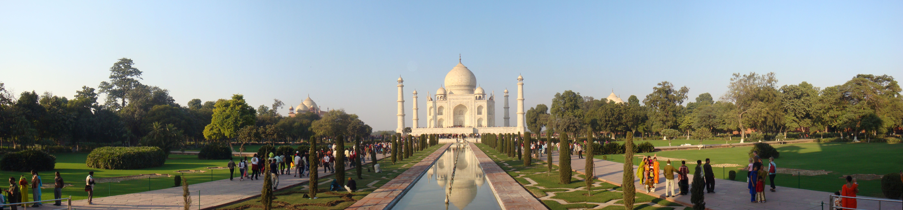

# ಆಗ್ರಾ

| Agra आगरा آگرہ founded by = sikandar lodi |
| --- |
| Metropolis |
| Taj Mahal in Agra |
| Nickname(s): Akbarabad; The Taj City |
| Country |
| State |
| District |
| Elevation |
| Population (2011) [ ೧ ] |
| • Metropolis |
| • ಶ್ರೇಣಿ |
| • Metro [ ೨ ] |
| Languages |
| • Official |
| ಸಮಯದ ವಲಯ |
| ಸಮಯ ವಲಯ |
| PIN |
| Telephone code |
| ವಾಹನ ನೋಂದಣಿ |
| ಜಾಲತಾಣ |

ಆಗ್ರಾ ನಗರ ಭಾರತ ದೇಶದ ಉತ್ತರ ಪ್ರದೇಶ ರಾಜ್ಯದಲ್ಲಿರುವ ಒಂದು ಪ್ರಸಿದ್ಧ ಪ್ರವಾಸಿ ಸ್ಥಳ. ವಿಶ್ವ ವಿಖ್ಯಾತ ತಾಜ್ ಮಹಲ್ ಇರುವ ಈ ಊರು ಜಗತ್ತಿನಾದ್ಯಂತ ಹೆಸರುವಾಸಿ.

## ಇತಿಹಾಸ

ಆಗ್ರಾವು 1526 ರಿಂದ 1628ರವರೆಗೆ ಮೊಘಲ್ ಸಾಮ್ರಾಜ್ಯದ ರಾಜಧಾನಿಯಾಗಿದ್ದ ಕಾಲದಲ್ಲಿ ಎಲ್ಲರ ಗಮನವನ್ನು ತನ್ನತ್ತ ಸೆಳೆಯಿತು. ಮೊಘಲ್ ಸಾಮ್ರಾಟ ಬಾಬರ್ 1526 ರಲ್ಲಿ ಆಗ್ರಾವನ್ನು ಈ ಸಾಮ್ರಾಜ್ಯದ ರಾಜಧಾನಿಯನ್ನಾಗಿ ಮಾಡಿದನು. ಮೊಘಲ್ ಸಾಮ್ರಾಟರು ಕಟ್ಟಡಗಳನ್ನು ನಿರ್ಮಿಸುವುದರಲ್ಲಿ ನಿಷ್ಣಾತರು. ಈ ನಗರವನ್ನು ಆಳಿದ ನಿಕಟ ಪೂರ್ವ ರಾಜ, ರಾಣಿಯರ ಅಥವಾ ಅಧಿಕಾರಿಗಳ ಹೆಸರಿನಲ್ಲಿ ಇವರು ನಿರ್ಮಿಸಿದ ಅತ್ಯಂತ ಭವ್ಯವಾದ ವೈಭವಯುತ ಸ್ಮಾರಕಗಳು, ಇಂದಿಗು ವಾಸ್ತುಶಿಲ್ಪದ ಹೆಗ್ಗುರುತುಗಳಾಗಿ ಉಳಿದುಕೊಂಡು, ಅವರ ನೈಪುಣ್ಯತೆಯನ್ನು ಇಂದಿನವರಿಗು ಸಾರಿ ಸಾರಿ ಹೇಳುತ್ತಿವೆ.
ಅದರಲ್ಲಿಯೂ ಚಕ್ರವರ್ತಿ ಶಾ ಜಹಾನ್ ತನ್ನ ಪ್ರೀತಿ ಪಾತ್ರ ಮಡದಿಗಾಗಿ ನಿರ್ಮಿಸಿದ, ಸರಿಸಾಟಿಯಿಲ್ಲದ ಪ್ರೀತಿಯ ಧ್ಯೋತಕವಾಗಿ ವಿಶ್ವದೆಲ್ಲೆಡೆ ಗುರುತಿಸಲ್ಪಟ್ಟಿರುವ ತಾಜ್ ಮಹಲ್ ಗೋರಿಯು ಅಪರಿಮಿತ ಖ್ಯಾತಿಯನ್ನು ತನ್ನ ಮುಡಿಗೇರಿಸಿಕೊಂಡು ನಿಂತಿದೆ. ಇದರ ಜೊತೆಗೆ ಅಕ್ಬರ್ ಚಕ್ರವರ್ತಿಯು ಆಗ್ರಾ ನಗರದ ಹೊರಭಾಗದಲ್ಲಿ ಆಗ್ರಾ ಕೋಟೆ ಮತ್ತು ಫತೇಪುರ್ ಸಿಕ್ರಿಗಳನ್ನು ನಿರ್ಮಿಸಿ ಈ ಊರಿಗೆ ಮತ್ತಷ್ಟು ಮೆರಗು ನೀಡಿದನು. [ ೩ ]

## ಹವಾಮಾನ

ಆಗ್ರಾ ಶುಷ್ಕ ಹವಾಮಾನ ಹೊಂದಿದೆ. ಸಾಧಾರಣ ಚಳಿ, ದೀರ್ಘವಾದ, ಶುಷ್ಕ ಬೇಸಗೆ ಮತ್ತು ಕಡಿಮೆ ಅವಧಿಯ ಮಾನ್ಸೂನ್ ಇಲ್ಲಿಯ ಹವಾಮಾನ ವೈಶಿಷ್ಟ್ಯ. ಇಲ್ಲಿಯ ಮಾನ್ಸೂನ್ ದೇಶದ ಉಳಿದೆಡೆಯಂತೆ ತೀಕ್ಷ್ಣವಾಗಿಲ್ಲ.

## ಜನಸಂಖ್ಯೆ

೨೦೧೧ರ ಜನಗಣತಿಯಂತೆ ಆಗ್ರಾದ ಜನಸಂಖ್ಯೆ ೧೭,೭೫,೧೩೪. ೫೩% ಪುರುಷರು ಮತ್ತು ೪೭% ಮಹಿಳೆಯರು. ಸಾಕ್ಷರತೆಯ ಪ್ರಮಾಣ ೮೧%. ಹಿಂದೂ , ಇಸ್ಲಾಂ ಮತ್ತು ಜೈನ ಧರ್ಮಗಳು ಮುಖ್ಯ ಧರ್ಮಗಳು.

| ಆಗ್ರಾದ ಜನರ ಧರ್ಮ |
| --- |
| ಧರ್ಮ |
| ಹಿಂದೂ |
| ಇಸ್ಲಾಂ |
| ಜೈನ |
| ಇತರರು† |
| Distribution of religions † Includes ಸಿಖ್ಖರು (0.2%), ಬೌದ್ಧರು (<0.2%). |

## ಚರಿತ್ರೆ

ಆಗ್ರಾದ ಪ್ರದೇಶದ ಉಲ್ಲೇಖವು ಮಹಾಭಾರತ ಗ್ರಂಥದಲ್ಲಿದ್ದರೂ ೧೫೦೪ ರಲ್ಲಿ ದೆಹಲಿಯ ಸುಲ್ತಾನನಾದ ಸಿಕಂದರ್ ಲೋಧಿ ಯು ಸ್ಥಾಪಿಸಿದ ಎಂಬುದು ಈಗ ದೊರೆಯುವ ಸಾಕ್ಷ್ಯ. ಅವನ ಮಗ ಇಬ್ರಾಹಿಂ ಲೋಧಿ ಯು ಇದನ್ನು ಮೊದಲನೆಯ ಪಾಣಿಪತ್ ಯುದ್ಧ ದಲ್ಲಿ ಬಾಬರ ನಿಗೆ ಸೋಲುವವರೆಗೆ ಎಂದರೆ ೧೫೨೬ರ ವರೆಗೆ ರಾಜಧಾನಿಯನ್ನಾಗಿ ಮಾಡಿಕೊಂಡು ಆಳಿದ. ೧೫೩೦ರಲ್ಲಿ ಬಾಬರ್‍ನ ನಿಧನದ ನಂತರ ಅವನ ಮಗ ಹುಮಾಯೂನ್ ಶೇರ್ ಶಾಹ್ ‍ನಿಂದ ಭಾರತದ ಹೊರಗೆ ಓಡಿಸಲ್ಪಟ್ಟು ನಂತರ ವಿಜಯಿಯಾಗಿ ಪಟ್ಟವನ್ನೇರುವಾಗ ಅವನು ದೆಹಲಿಯನ್ನು ರಾಜಧಾನಿಯನ್ನಾಗಿಸಿಕೊಂಡ. ಹುಮಾಯೂನನ ಮಗ ಅಕ್ಬರ್ ಪುನಃ ರಾಜಧಾನಿಯನ್ನು ಆಗ್ರಾಕ್ಕೆ ಸ್ಥಳಾಂತರಿಸಿದ. ಈ ರೀತಿ ಸ್ಥಳಾಂತರಿಸುವಾಗ ಹಳೆಯ ಆಗ್ರಾವನ್ನು ಬಿಟ್ಟು ಯಮುನಾ ನದಿಯ ಬಲದಂಡೆಯಲ್ಲಿ ಹೊಸ ನಗರವನ್ನು ನಿರ್ಮಿಸಿದ. ಆದುದರಿಂದ ಈ ನಗರಕ್ಕೆ ಅಕ್ಬರಾಬಾದ್ ಎಂಬ ಹೆಸರೂ ಇದೆ. ಇದರ ನಂತರ ಆಗ್ರಾದ ಸುವರ್ಣ ಯುಗ. ಅಕ್ಬರ್ , ಜಹಾಂಗೀರ್ , ಷಾ ಜಹಾನ್ ನಂತಹ ಚಕ್ರವರ್ತಿಗಳು ಈ ನಗರದಿಂದ ದೇಶವನ್ನು ಆಳಿದರು. ಮುಂದೆ ಔರಂಗಜೇಬ ೧೬೫೩ರಲ್ಲಿ ಔರಂಗಾಬಾದ್ ಗೆ ಸ್ಥಳಾಂತರಿಸುವವರೆಗೆ ಇದು ಭಾರತದ ರಾಜಧಾನಿಯಾಗಿತ್ತು. ಮೊಘಲರ ಅವನತಿಯ ನಂತರ ಈ ಪ್ರದೇಶ ೧೮೦೩ ರ ವರೆಗೆ ಮರಾಠರ ಸ್ವಾಧೀನವಿದ್ದು ಇದರ ಹೆಸರು ಪುನಃ ಆಗ್ರಾ ಎಂದು ಬದಲಾಯಿತು. ಮುಂದೆ ಇದು ಬ್ರಿಟಿಷರ ವಶವಾಯಿತು.ಇಲ್ಲಿರುವ ತಾಜ್ ಮಹಲ್ , ಆಗ್ರಾ ಕೋಟೆ ಹಾಗೂ ಫತೇಪುರ್ ಸಿಕ್ರಿ ವಿಶ್ವ ಪರಂಪರೆಯ ತಾಣಗಳಾಗಿ ಘೋಷಿತವಾಗಿವೆ. [ ೪ ]

## ಆಗ್ರಾ ಪ್ರವಾಸೋದ್ಯಮ

ಆಗ್ರಾವು ಆಗ್ರಾ, ಜೈಪುರ್ ಮತ್ತು ದೆಹಲಿಗಳನ್ನು ಒಳಗೊಂಡಿರುವ ಸುವರ್ಣ ತ್ರಿಕೋನದ ಒಂದು ಭಾಗವಾಗಿದೆ. ದೆಹಲಿಗೆ ಇದು ಹತ್ತಿರವಿರುವುದರಿಂದಾಗಿ ಹಲವಾರು ಪ್ರವಾಸಿಗರು ಒಂದು ದಿನದ ಪ್ರವಾಸದ ಸಲುವಾಗಿ ಇಲ್ಲಿಗೆ ಆಗಮಿಸುತ್ತಿರುತ್ತಾರೆ. ತಾಜ್ ಮಹಲ್ ಜೊತೆಗೆ ಮತ್ತಷ್ಟು ಸ್ಥಳಗಳನ್ನು ನೋಡಲು ಬರುವ ಪ್ರವಾಸಿಗರಿಗಾಗಿ ಇಲ್ಲಿ ಹಲವಾರು ಹೋಟೆಲ್ ಮತ್ತು ಲಾಡ್ಜ್ ಗಳು ಇಲ್ಲಿವೆ.
ಸಮೀಪದಲ್ಲಿರುವ ಫತೇಪುರ್ ಸಿಕ್ರಿ ಮತ್ತು ಮಥುರಾಗಳಿಗೆ ಇಲ್ಲಿ ಸ್ಥಳ ವೀಕ್ಷಣಾ ಪ್ರವಾಸಗಳು ಲಭ್ಯವಿವೆ. ಈ ನಗರದಲ್ಲಿ ತನ್ನದೇ ಆದ ಪ್ರತ್ಯೇಕತೆಯನ್ನು ಹೊಂದಿರುವ ಒಂದು ಮಾರುಕಟ್ಟೆಯಿದೆ. ಇದರಲ್ಲಿ ಪ್ರವಾಸಿಗರು ತಮಗೆ ಬೇಕಾದ ಆಭರಣಗಳು ಮತ್ತು ಸ್ಥಳೀಯ ಕರಕುಶಲ ವಸ್ತುಗಳನ್ನು ಕೊಂಡು ಕೊಳ್ಳಬಹುದು. ಇದರ ಜೊತೆಗೆ ಇಲ್ಲಿನ ದಲ್ಲಾಳಿಗಳು, ರಿಕ್ಷಾದವರು ಮತ್ತು ಅನಧಿಕೃತ ಮಾರ್ಗದರ್ಶಿಗಳನ್ನು ನಿಭಾಯಿಸಲು ತಯಾರಾಗಿರಿ.

## ಆಗ್ರಾ ಮತ್ತು ಅದರ ಸುತ್ತ ಮುತ್ತ ಇರುವ ಪ್ರವಾಸಿ ಸ್ಥಳಗಳು

ಆಗ್ರಾದಲ್ಲಿರುವ ಐತಿಹಾಸಿಕ ಕಟ್ಟಡಗಳು ನಿಸ್ಸಂಶಯವಾಗಿ ಇಲ್ಲಿನ ಪ್ರಮುಖ ಆಕರ್ಷಣೆಯಾಗಿವೆ. ಪ್ರವಾಸಿಗರು ತಾಜ್ ಮಹಲ್ ಜೊತೆಗೆ ಯಮುನಾ ನದಿಯ ದಂಡೆಯ ಮೇಲೆ ನೆಲೆಗೊಂಡಿರುವ ಆಗ್ರಾ ಕೋಟೆ ಮತ್ತು ಅಕ್ಬರನ ಸಮಾಧಿಗೆ ಭೇಟಿ ನೀಡಬಹುದು. ಚೀನಿ ಕಾ ರೌಝಾ, ದಿವಾನ್- ಇ-ಅಮ್ ಮತ್ತು ದಿವಾನ್- ಇ-ಖಾಸ್ ಕಟ್ಟಡಗಳು ಮೊಘಲರ ಕಾಲದ ವಾಸ್ತುಶಿಲ್ಪ ವೈಭವದ ಒಳನೋಟವನ್ನು ಒದಗಿಸುತ್ತವೆ. ಇತ್‍ಮಡ್- ಉದ್- ದೌಲಾಹ್ ಸಮಾಧಿ, ಮರಿಯಂ ಝಮಾನಿ ಸಮಾಧಿ, ಜಸ್ವಂತ್ ಕಿ ಛಾತ್ರಿ, ಚೌಸತ್ ಖಂಬ ಮತ್ತು ತಾಜ್ ವಸ್ತು ಸಂಗ್ರಹಾಲಯ ಇಲ್ಲಿ ನೋಡಬೇಕಾಗಿರುವ ಆಕರ್ಷಣೆಗಳ ಪಟ್ಟಿಯಲ್ಲಿ ಸೇರಿವೆ. 
ಭಾರತದ ಇತರ ನಗರಗಳಂತೆ ಆಗ್ರಾವು ಸಹ ಧಾರ್ಮಿಕ ಸಹಿಷ್ಣುತೆಯನ್ನು ಪ್ರತಿಬಿಂಬಿಸುತ್ತಿದೆ. ಇಲ್ಲಿರುವ ಜಾಮಾ ಮಸೀದಿಯು ಪ್ರಖ್ಯಾತ ಹಿಂದೂ ದೇವಾಲಯವಾದ ಬಾಗೇಶ್ವರ್ ದೇವಾಲಯದೊಂದಿಗೆ ಸ್ಥಳವನ್ನು ಹಂಚಿಕೊಂಡಿದೆ. ಬೇರೆ ನಗರಗಳಲ್ಲಿರುವಂತೆ ಆಗ್ರಾದಲ್ಲಿ ಸಹ ನಯನ ಮನೋಹರ ತಾಣಗಳು, ವಾಸನೆಗಳು ಮತ್ತು ಗೌಜು ಗದ್ದಲಗಳನ್ನು ತನ್ನಲ್ಲಿ ಒಳಗೊಂಡಿದೆ. ಇದರ ಜೊತೆಗೆ ಸೋಮಿ ಬಾಗ್ ಮತ್ತು ಮೆಹ್ತಾಬ್ ಬಾಗ್‍ನಂತಹ ಪ್ರಶಾಂತವಾದ ಉದ್ಯಾನವನಗಳನ್ನು ನಾವಿಲ್ಲಿ ಕಾಣಬಹುದು. ಇಲ್ಲಿ ಸೂರ್ಯೋದಯ ಮತ್ತು ಸೂರ್ಯಾಸ್ತಗಳು ನೋಡಲು ತುಂಬಾ ಸೊಗಸಾಗಿರುತ್ತವೆ. ಅಲ್ಲದೆ ತಾಜ್ ಮಹಲ್ ಸಹ ಜನರ ಗೌಜು ಗದ್ದಲದಿಂದ ದೂರದಲ್ಲಿ ನೆಲೆಗೊಂಡಿದೆ.
ಆಗ್ರಾಗೆ ಕೇವಲ ಪ್ರವಾಸಿಗರು ಮಾತ್ರ ಆಕರ್ಷಿತರಾಗುತ್ತಾರೆ ಎಂದು ತಿಳಿಯಬೇಡಿ. ಇಲ್ಲಿರುವ ಕೀತಂ ಕೆರೆ ಮತ್ತು ಸುರ್ ಸರೋವರ್ ಪಕ್ಷಿಧಾಮಕ್ಕೆ ವಿದೇಶಿ ಹಕ್ಕಿಗಳಾದ ಹೆರ್ಜಾಲೆ, ಸೈಬಿರಿಯನ್ ಕೊಕ್ಕರೆ, ಸರಸ್ ಕೊಕ್ಕರೆಗಳು, ಬ್ರಾಹ್ಮಣಿ ಬಾತುಕೋಳಿಗಳು, ಗೀಸ್ ಮತ್ತು ಗಡ್‍ವಲ್ ಹಾಗು ಹಂಸಗಳು ಸಹ ಆಕರ್ಷಿತಗೊಂಡು ಭೇಟೀ ನೀಡುತ್ತವೆ.

## ಪ್ರಮುಖ ಸ್ಥಳಗಳು

ತಾಜ್ ಮಹಲ್ ಇದು ಪ್ರಪಂಚದ ಪ್ರಸಿದ್ಧ ಕಟ್ಟಡಗಳಲ್ಲಿ ಒಂದು. ಮುಸಲ್ಮಾನ ಶಿಲ್ಪಕಲೆಯ ಉತ್ಕೃಷ್ಟ ಉದಾಹರಣೆ.೧೬೫೩ರಲ್ಲಿ ನಿರ್ಮಾಣಗೊಂಡ ತಾಜ್ ಮಹಲ್ ಷಾ ಜಹಾನ್ ನಿಂದ ನಿರ್ಮಿಸಲ್ಪಟ್ಟಿತು.ಪೂರ್ಣವಾಗಿ ಅಮೃತಶಿಲೆಯಿಂದ ನಿರ್ಮಿತವಾದ ಇದರ ನಿರ್ಮಾಣ ಸಮಯ ಸುಮಾರು ೨೨ ವರ್ಷಗಳು.(೧೬೩೦ -೧೬೫೨). ಸುಮಾರು ೨೦ ಸಾವಿರ ಜನರ ಶ್ರಮದಿಂದ ಇದನ್ನು ನಿರ್ಮಿಸಲಾಗಿದೆ.

ಆಗ್ರಾ ಕೋಟೆ

೧೫೫೬ರಲ್ಲಿ ಅಕ್ಬರ ನಿಂದ ಕಟ್ಟಲ್ಪಟ್ಟಿತು.ಷಾ ಜಹಾನನ ಕಾಲದಲ್ಲಿ ಇದನ್ನು ಅರಮನೆಯನ್ನಾಗಿ ಪರಿವರ್ತಿಸಲಾಗಿತ್ತು.ಕೋಟೆಯ ಒಳಗಡೆ ಮೋತಿ ಮಸ್ಜಿದ್,ದಿವಾನ್-ಈ-ಆಮ್,ದಿವಾನ್-ಈ-ಖಾಸ್,ಜಹಾಂಗೀರನ ಅರಮನೆ,ಖಾಸ್ ಮಹಲ್,ಶೀಷ್ ಮಹಲ್ ಮುಂತಾದವುಗಳು ಮುಖ್ಯವಾಗಿವೆ.ಕೋಟೆಯ ಒಟ್ಟು ಸುತ್ತಳತೆ ಸುಮಾರು ೨.೪ ಕಿ.ಮೀ. ಫತೇಪುರ್ ಸಿಕ್ರಿ

ಇದು ಅಕ್ಬರನಿಂದ ಕಟ್ಟಲ್ಪಟ್ಟಿತ್ತು. ಅಕ್ಬರನು ಇದನ್ನು ತನ್ನ ರಾಜಧಾನಿಯನ್ನಾಗಿ ಮಾಡುವ ಉದ್ಧೇಶದಿಂದ ಕಟ್ಟಿದನಾದರೂ ಬಳಿಕ ನೀರಿನ ಕೊರೆತೆಯಿಂದ ಇದನ್ನು ತ್ಯಜಿಸಿ ಪುನಃ ಅಗ್ರಾಕ್ಕೆ ತನ್ನ ರಾಜಧಾನಿಯನ್ನು ಸ್ಥಳಾಂತರಿಸಿದನು.

---
Source: https://kn.wikipedia.org/wiki/%E0%B2%86%E0%B2%97%E0%B3%8D%E0%B2%B0%E0%B2%BE
