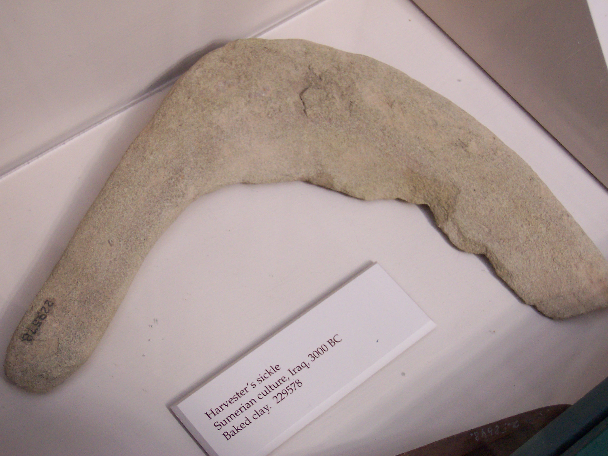
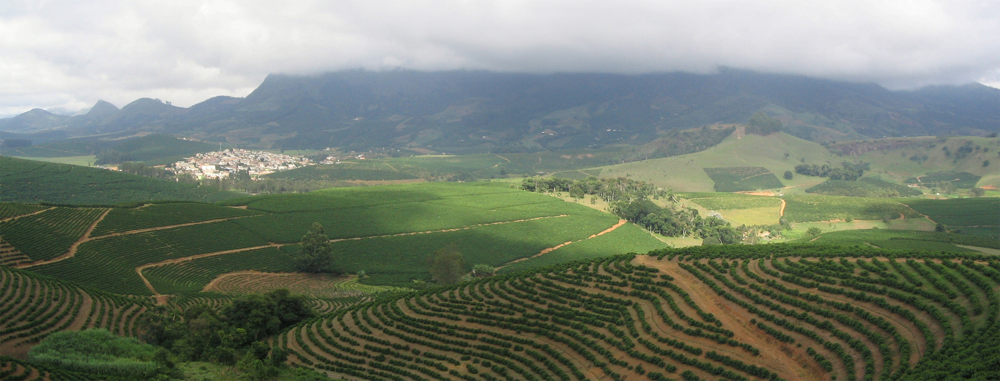

# ಕೃಷಿ

*ಜ಼ಾಹೋರಿ (ಸ್ಲೊವಾಕಿಯಾ) ದಲ್ಲಿ ಗದ್ದೆಗಳು - ಒಂದು ಪ್ರಾತಿನಿಧಿಕ ಮಧ್ಯ ಐರೋಪ್ಯ ಕೃಷಿ ಪ್ರದೇಶ.*

*ದಕ್ಷಿಣ ಆಫ್ರಿಕಾದಲ್ಲಿ ಒಟ್ಟಾಗಿ ಮೇಯಿಸಲಾದ ಪಳಗಿಸಿದ ಕುರಿ ಮತ್ತು ಹಸು.*

*ಸುಟ್ಟ ಜೇಡಿಮಣ್ಣಿನಿಂದ ತಯಾರಿಸಿದ ಒಂದು ಸುಮೇರಿಯನ್ ಕೊಯ್ಲಿನ ಕುಡುಗೋಲು (ಸು. ಕ್ರಿ.ಪೂ. 3000).*

*ಪ್ರಾಚೀನ ಈಜಿಪ್ಟ್‌ನಲ್ಲಿ ಧಾನ್ಯದ ಒಕ್ಕುವಿಕೆ*

*ಪಿಯೆಟ್ರೊ ಡ ಕ್ರೆಸೆಂಜ಼ಿಯ ಒಂದು ಹಸ್ತಪ್ರತಿಯಿಂದ ಕೃಷಿ ಕ್ಯಾಲೆಂಡರ್*

*ಫ಼ೋರ್ಡ್‌ಸನ್ ಟ್ರಾಕ್ಟರ್ ಮೇಲೆ ರೋಲೋವರ್ ಪ್ರೊಟೆಕ್ಷನ್ ಬಾರ್*

*ಇಫ಼ುಗಾಒ, ಫಿಲಿಪೀನ್ಸ್‌ನಲ್ಲಿ ಬನಾಯೂ ಅಕ್ಕಿ ಮೇಲು ಜಗಲಿಗಳು*

*ಎಮ್ಮೆಗಳಿಂದ ಬತ್ತದ ಉಳುಮೆ, ಇಂಡೋನೇಷ್ಯಾದಲ್ಲಿ*

*ಹೊಲದುದ್ದಕ್ಕೆ ಕರೆದೊಯ್ಯುವ ರಸ್ತೆಗಳು ಹೊಲಗಳಲ್ಲಿ ಉತ್ಪಾದನಾ ಅಭ್ಯಾಸಗಳಿಗೆ ಯಂತ್ರಗಳ ಪ್ರವೇಶಕ್ಕೆ ಅನುವು ಮಾಡಿಕೊಡುತ್ತವೆ.*

*ಗ್ರಾಮೀಣ ಬಾಂಗ್ಲಾದೇಶದಲ್ಲಿ ಹಸುಗಳೊಂದಿಗೆ ಭೂಮಿ ಉಳುಮೆ*

ಕೃಷಿ ( ವ್ಯವಸಾಯ ) ಎಂಬುದು ಬೇಸಾಯ ಮತ್ತು ಅರಣ್ಯಕಲೆಯ ಮೂಲಕ ಆಹಾರ ಮತ್ತು ಸರಕುಗಳನ್ನು ಉತ್ಪಾದಿಸುವ ಒಂದು ವಿಧಾನ. ಅಂದರೆ ಆಹಾರ, ನಾರು, ಜೈವಿಕ ಇಂಧನ, ಔಷಧಗಳು ಮತ್ತು ಮಾನವ ಜೀವನವನ್ನು ಪೋಷಿಸಲು ಹಾಗೂ ವರ್ಧಿಸಲು ಬಳಸಲಾಗುವ ಇತರ ಉತ್ಪನ್ನಗಳಿಗಾಗಿ ಪ್ರಾಣಿ ಗಳು, ಸಸ್ಯಗಳು, ಶಿಲೀಂಧ್ರಗಳು, ಮತ್ತು ಇತರ ಜೀವಿಗಳ ಸಾಗುವಳಿ. ವ್ಯವಸಾಯವು ಮಾನವ ನ ಪುರಾತನ ವೃತ್ತಿಗಳಲ್ಲೊಂದಾಗಿದೆ. ಕೃಷಿಯು ಮಾನವ ನಾಗರಿಕತೆಯ ಉಗಮಕ್ಕೆ ಕಾರಣವಾದ ಪ್ರಮುಖ ಬೆಳವಣಿಗೆಯಾಗಿತ್ತು. ಅಷ್ಟೇ ಅಲ್ಲ, ಪಳಗಿಸಿದ ಪ್ರಾಣಿ ಗಳು ಮತ್ತು ಸಸ್ಯಗಳ (ಅಂದರೆ, ಬೆಳೆಗಳ ) ಸಂಗೋಪನೆಯಿಂದಾಗಿ ಆಹಾರದ ಮಿಗುತಾಯಗಳು ಸೃಷ್ಟಿಯಾಗುವುದರಿಂದ ಅದು ಹೆಚ್ಚು ಜನಭರಿತವಾದ ಮತ್ತು ಶ್ರೇಣೀಕೃತವಾದ ಸಮಾಜಗಳ ಬೆಳವಣಿಗೆಗೆ ಕಾರಣವಾಯಿತು. ವ್ಯವಸಾಯವು ಪಶುಪಾಲನೆ, ಕೋಳಿಸಾಕಣೆ, ರೇಷ್ಮೆ ಕೃಷಿ ಮತ್ತು ಜೇನುಸಾಕಣೆಗಳನ್ನು ಒಳಗೊಂಡಿದೆ. ಕೃಷಿಯ ಅಧ್ಯಯನಕ್ಕೆ ಕೃಷಿ ವಿಜ್ಞಾನ ಎಂದು ಹೆಸರು. ವೈಶಿಷ್ಟ್ಯಗಳು ಮತ್ತು ಕೌಶಲಗಳ ವಿಸ್ತೃತ ವೈವಿಧ್ಯವನ್ನು ಕೃಷಿಯು ಒಳಗೊಳ್ಳುತ್ತದೆ.

ಕೃಷಿಯ ಇತಿಹಾಸ ಸಾವಿರಾರು ವರ್ಷಗಳಷ್ಟು ಹಿಂದಿನದ್ದಾಗಿದೆ. ಅದರ ಅಭಿವೃದ್ಧಿಯು ಬಹಳವಾಗಿ ಭಿನ್ನ ಹವಾಮಾನಗಳು, ಸಂಸ್ಕೃತಿಗಳು, ಮತ್ತು ತಂತ್ರಜ್ಞಾನಗಳಿಂದ ಚಾಲಿತವಾಗಿದೆ ಮತ್ತು ವ್ಯಾಖ್ಯಾನಿತವಾಗಿದೆ. ಆದರೆ, ಎಲ್ಲ ಕೃಷಿಯು ಸಾಮಾನ್ಯವಾಗಿ ಒಗ್ಗಿಸಿದ ಪ್ರಭೇದಗಳನ್ನು ಪೋಷಿಸಲು ಸೂಕ್ತವಾದ ಜಮೀನುಗಳನ್ನು ವಿಸ್ತರಿಸುವುದಕ್ಕಾಗಿ ಮತ್ತು ನಿರ್ವಹಿಸುವುದಕ್ಕಾಗಿ ಇರುವ ತಂತ್ರಗಳನ್ನು ಅವಲಂಬಿಸಿದೆ. ಸಸ್ಯಗಳಿಗೆ ಸಾಮಾನ್ಯವಾಗಿ ಯಾವುದೋ ರೂಪದ ನೀರಾವರಿಯ ಅಗತ್ಯವಿದೆ. ಆದರೆ, ಶುಷ್ಕಭೂಮಿ ಕೃಷಿ ವಿಧಾನಗಳಿವೆ. ಜಾನುವಾರುಗಳನ್ನು ಹುಲ್ಲುಗಾವಲು ಆಧಾರಿತ ಮತ್ತು ಭೂರಹಿತ ವ್ಯವಸ್ಥೆಗಳ ಸಂಯೋಜನೆಯಲ್ಲಿ ಬೆಳೆಸಲಾಗುತ್ತದೆ. ಈ ಕೈಗಾರಿಕೆಯು ಪ್ರಪಂಚದ ಹಿಮ ಮತ್ತು ಜಲಮುಕ್ತ ಪ್ರದೇಶದ ಸರಿಸುಮಾರು ಮೂರನೇ ಒಂದು ಭಾಗವನ್ನು ಆವರಿಸುತ್ತದೆ. ಅಭಿವೃದ್ಧಿ ಹೊoದಿದ ವಿಶ್ವದಲ್ಲಿ, ದೊಡ್ಡ ಪ್ರಮಾಣದ ಏಕಬೆಳೆ ಪದ್ಧತಿಯನ್ನು ಆಧರಿಸಿದ ಕೈಗಾರಿಕಾ ಕೃಷಿಯು ಆಧುನಿಕ ಬೇಸಾಯದ ಪ್ರಧಾನ ವ್ಯವಸ್ಥೆಯಾಗಿದೆ. ಆದರೆ, ಶಾಶ್ವತಕೃಷಿ ಮತ್ತು ಸಾವಯವ ಕೃಷಿ ಸೇರಿದಂತೆ ಸುಸ್ಥಿರ ಕೃಷಿಗೆ ಬೆಳೆಯುತ್ತಿರುವ ಬೆಂಬಲ ಕಂಡುಬರುತ್ತಿದೆ.

## ಕೃಷಿ ಮಾಡುವ ವಿಧಾನ

- ನೀರಿನ - ಕಾಲುವೆಗಳನ್ನು ಮತ್ತು ನೀರಾವರಿಯ ಇತರ ಸ್ವರೂಪಗಳನ್ನು ಅಗೆಯುವ ಮೂಲಕ, ಸಸ್ಯವನ್ನು ಬೆಳೆಸಲು ಸೂಕ್ತವಾದ ಪರಿಸರವನ್ನು ಸೃಷ್ಟಿಸಬಹುದು, ಸುಖವಾಗಿ ಇಡಬಹುದು.

ಮೀನುಗಳನ್ನು ವಿಸ್ತರಿಸುವ ವಿಧಾನಗಳು ಇದರಲ್ಲಿ ಸೇರಿಕೊಂಡಿವೆ. ಕೃಷಿಯೋಗ್ಯ ಭೂಮಿಯ ಮೇಲಿನ ಬೆಳೆಗಳ ಸಾಗುವಳಿ ಮತ್ತು ಸೀಮೆಯ ಭೂಮಿಯ ಮೇಲಿನ ಜಾನುವಾರಿನ ಮಂದೆಗಳನ್ನು ಕಾಯುವುದು ಕೃಷಿಯ ಬುನಾದಿಯಾಗಿ ಉಳಿದುಕೊಂಡು ಬಂದಿದೆ.

- ಕೃಷಿಯ ಹಲವಾರು ಸ್ವರೂಪಗಳನ್ನು ಗುರುತಿಸುವುದಕ್ಕೆ ಮತ್ತು ಪರಿಮಾಣವನ್ನು ನಿರ್ಧರಿಸುವುದಕ್ಕೆ ಸಂಬಂಧಿಸಿದಂತೆ ಹಿಂದಿನ ಶತಮಾನದಲ್ಲಿ ಕಾಳಜಿಯು ಹೆಚ್ಚುತ್ತಲೇ ಬಂದಿತ್ತು. ಅಭಿವೃದ್ಧಿ ಹೊಂದಿದ ಪ್ರಪಂಚದಲ್ಲಿ ಸಮರ್ಥನೀಯ ಕೃಷಿ (ಉದಾಹರಣೆಗೆ, ಶಾಶ್ವತಕೃಷಿ ಅಥವಾ ಸಾವಯವ ಕೃಷಿ) ಮತ್ತು ಸಾಂದ್ರೀಕೃತ ಬೇಸಾಯದ (ಉದಾಹರಣೆಗೆ ಕೈಗಾರಿಕಾ ಕೃಷಿ) ನಡುವೆ ಈ ವ್ಯಾಪ್ತಿಯು ಸಾಮಾನ್ಯವಾಗಿ ವಿಸ್ತರಿಸುತ್ತದೆ.
- ಆಧುನಿಕ ಬೆಳೆ ವಿಜ್ಞಾನ, ಸಸ್ಯದ ತಳಿ ಬೆಳೆಸುವಿಕೆ, ಕೀಟನಾಶಕಗಳು ಮತ್ತು ರಸಗೊಬ್ಬರಗಳು, ಹಾಗೂ ತಂತ್ರಜ್ಞಾನದಲ್ಲಿನ ಸುಧಾರಣೆಗಳು ಸಾಗುವಳಿಯಿಂದ ಬರುವ ಬೆಳೆಯ ಇಳುವರಿಯನ್ನು ತೀವ್ರವಾಗಿ ಹೆಚ್ಚಿಸಿವೆಯಾದರೂ, ಅದರ ಜೊತೆಗೇ, ಪರಿಸರಕ್ಕೆ ವ್ಯಾಪಕವಾದ ಹಾನಿಯನ್ನು ಹಾಗೂ ಮಾನವನ ಆರೋಗ್ಯದ ಮೇಲೆ ಋಣಾತ್ಮಕ ಪರಿಣಾಮವನ್ನೂ ಉಂಟುಮಾಡಿವೆ. [ ೧ ]
- ಸಾಂದ್ರ ಹಂದಿ ಸಾಕಾಣಿಕೆಯಂಥ (ಮತ್ತು ಕೋಳಿ ಸಾಕಾಣಿಕೆಗೂ ಅನ್ವಯಿಸುವ ಇದೇ ಥರದ ಅಭ್ಯಾಸಗಳು) ಪಶು ಸಂಗೋಪನೆಯಲ್ಲಿನ ಆಯ್ದ ತಳಿ ಸಂವರ್ಧನೆ ಮತ್ತು ಆಧುನಿಕ ಅಭ್ಯಾಸಗಳು ಇದೇ ರೀತಿಯಲ್ಲಿ ಮಾಂಸ ದ ಉತ್ಪಾದನೆಯನ್ನೂ ಹೆಚ್ಚಿಸಿವೆಯಾದರೂ, ಪ್ರಾಣಿ ಕ್ರೌರ್ಯ ಮತ್ತು ಕೈಗಾರಿಕಾ ವಿಧಾನದಲ್ಲಿ ಮಾಂಸ ಉತ್ಪಾದನೆಯಲ್ಲಿ ಸಾಮಾನ್ಯವಾಗಿ ಬಳಸಲಾಗುವ ಪ್ರತಿಜೀವಿಕಗಳು (ಆಂಟಿಬಯಾಟಿಕ್ಸ್), ಬೆಳವಣಿಗೆ ಹಾರ್ಮೋನುಗಳು , ಮತ್ತು ಇತರ ರಾಸಾಯನಿಕಗಳ ಆರೋಗ್ಯ ಸಂಬಂಧಿ ಪರಿಣಾಮಗಳ ಕುರಿತೂ ಕಳವಳ ಹುಟ್ಟಿಕೊಳ್ಳಲು ಕಾರಣವಾಗಿವೆ. [ ೨ ]
- ಪ್ರಮುಖ ವ್ಯಾವಸಾಯಿಕ ಉತ್ಪನ್ನಗಳನ್ನು ಈ ರೀತಿ ವರ್ಗೀಕರಿಸಬಹುದು: ಆಹಾರ ಗಳು, ನಾರು ಪದಾರ್ಥಗಳು, ಇಂಧನ ಗಳು, ಕಚ್ಚಾ ಸಾಮಗ್ರಿಗಳು. 2000ದ ದಶಕದಲ್ಲಿ, ಜೈವಿಕ ಇಂಧನ ಗಳು, ಜೈವಿಕ ಔಷಧವಸ್ತುಗಳು, ಜೈವಿಕ ಪ್ಲಾಸ್ಟಿಕ್‌ಗಳು , [ ೩ ] ಮತ್ತು ಔಷಧ ವಸ್ತುಗಳನ್ನು ತಯಾರಿಸಲು ಸಸ್ಯಗಳನ್ನು ಬಳಸಿಕೊಳ್ಳಲಾಗಿದೆ. [ ೪ ]
- ವಿಶಿಷ್ಟ ಆಹಾರಗಳಲ್ಲಿ ಏಕದಳ ಧಾನ್ಯಗಳು , ತರಕಾರಿಗಳು , ಹಣ್ಣು ಗಳು, ಮತ್ತು ಮಾಂಸ ಇವುಗಳು ಸೇರಿವೆ. ನಾರು ಪದಾರ್ಥಗಳಲ್ಲಿ ಹತ್ತಿ , ಉಣ್ಣೆ , ಸೆಣಬು , ರೇಷ್ಮೆ ಮತ್ತು ಅಗಸೆನಾರು ಇವೇ ಮೊದಲಾದವು ಸೇರಿವೆ. ಕಚ್ಚಾ ಸಾಮಗ್ರಿಗಳಲ್ಲಿ (ಕಚ್ಚಾವಸ್ತುಗಳು - ಕೈಗಾರಿಕೆಗಳಿಗೆ) ಮರದ ದಿಮ್ಮಿ ಮತ್ತು ಬಿದಿರು ಸೇರಿವೆ. ಉತ್ತೇಜಕಗಳಲ್ಲಿ ತಂಬಾಕು , ಮದ್ಯಸಾರ, ಅಫೀಮು , ಕೊಕೇನು , ಮತ್ತು ಘಂಟಾಪುಷ್ಪಿ ಇವೇ ಮೊದಲಾದವು ಸೇರಿವೆ.
- ರಾಳ ಗಳಂತಹ ಇತರ ಉಪಯುಕ್ತ ಸಾಮಗ್ರಿಗಳು ಸಸ್ಯಗಳಿಂದ ತಯಾರಿಸಲ್ಪಡುತ್ತವೆ. ಜೈವಿಕ ಇಂಧನಗಳಲ್ಲಿ ‌ಎಥನಾಲ್, ಜೈವಿಕ ಡೀಸೆಲ್, ಮತ್ತು ಜೀವರಾಶಿಯಿಂದ ಪಡೆದ ಮೀಥೇನ್ ಇವೇ ಮೊದಲಾದವು ಸೇರಿವೆ. ಕತ್ತರಿಸಿದ ಹೂವುಗಳು , ಸಸ್ಯೋದ್ಯಾನದ ಗಿಡಗಳು, ಸಾಕುಪ್ರಾಣಿಗಳ ಮಾರಾಟಕ್ಕೆ ಅಲಂಕಾರಿಕ ಮೀನು ಮತ್ತು ಪಕ್ಷಿಗಳು ಇವೇ ಮೊದಲಾದವು ಕೆಲವೊಂದು ಅಲಂಕಾರಿಕ ಉತ್ಪನ್ನಗಳಾಗಿವೆ.
- 2007ರಲ್ಲಿ, ಪ್ರಪಂಚದ ಸುಮಾರು ಮೂರನೇ ಒಂದು ಭಾಗದಷ್ಟು ಜನ ಕೃಷಿ ವಲಯದಲ್ಲಿ ತೊಡಗಿಸಿಕೊಂಡಿದ್ದರು. 2003ರಲ್ಲಿ ವ್ಯಾವಸಾಯಿಕ ಕೆಲಸಗಾರರ ಪ್ರಮಾಣ ಕಡಿಮೆಯಾಗಿತ್ತಾದರೂ, ಕೃಷಿಯ ಕುರಿತಾದ ಅರಿವು ಹೆಚ್ಚಿದ ಪರಿಣಾಮವಾಗಿ ಈ ಪ್ರಮಾಣವು 2008ರಲ್ಲಿ ತೀವ್ರವಾಗಿ ಹೆಚ್ಚಾಯಿತು– ವಿಶ್ವಾದ್ಯಂತದ ಬಹುತೇಕ ಜನರನ್ನು ಕೆಲಸಕ್ಕೆ ತೊಡಗಿಸುವ ನಿಟ್ಟಿನಲ್ಲಿ ಆರ್ಥಿಕ ವಲಯವು ತೊಡಗಿಕೊಂಡಿದ್ದರಿಂದ ಸೇವೆಗಳ ವಲಯವು ಕೃಷಿಗೆ ಸರಿಸಾಟಿಯಾಗಿ ನಿಂತಿತು. [ ೫ ]
- ವಿಶ್ವದ ಮೂರನೇ ಒಂದು ಭಾಗಕ್ಕಿಂತಲೂ ಹೆಚ್ಚು ಜನರು ಕೃಷಿಯಲ್ಲಿ ತೊಡಗಿಕೊಂಡಿದ್ದಾರೆ ಎಂಬ ವಾಸ್ತವದ ಹೊರತಾಗಿಯೂ, ಕೃಷಿ ಉತ್ಪನ್ನವು ವಿಶ್ವದ ಒಟ್ಟಾರೆ ಉತ್ಪನ್ನದ (ಎಲ್ಲಾ ಒಟ್ಟಾರೆ ದೇಶೀಯ ಉತ್ಪನ್ನಗಳ ಒಂದು ಮೊತ್ತ) ಶೇಕಡ ಐದು ಭಾಗಕ್ಕಿಂತ ಕಡಿಮೆಯಿದೆ.

## ವ್ಯುತ್ಪತ್ತಿ ಶಾಸ್ತ್ರ

ಕೃಷಿ ಎಂಬ ಪದದ ಆಂಗ್ಲರೂಪ ಅಗ್ರಿಕಲ್ಚರ್ . ಇದು ಲ್ಯಾಟಿನ್‌ ಭಾಷೆಯ ಅಗ್ರಿಕಲ್ಚುರ ಎಂಬ ಪದದ ಇಂಗ್ಲಿಷ್ ರೂಪಾಂತರ. ಅಗ್ರಿಕಲ್ಚುರ ಎಂಬ ಪದವು ವ್ಯುತ್ಪತ್ತಿಯಾಗಿರುವುದು ಹೀಗೆ: ಅಗರ್ ಎಂದರೆ "ಒಂದು ಹೊಲ" [ ೬ ] ಮತ್ತು ಕಲ್ಚುರ ಎಂದರೆ "ಸಾಗುವಳಿ". ಒಟ್ಟಿನಲ್ಲಿ, ಕರಾರುವಾಕ್ಕಾಗಿ ಹೇಳುವುದಾದರೆ, ಅಗ್ರಿಕಲ್ಚುರ ಎಂದರೆ ಭೂಮಿಯ ಉಳುವಿಕೆ ಎಂದರ್ಥ. [ ೭ ] ಈ ರೀತಿಯಾಗಿ ಪದದ ಅಕ್ಷರಶಃ ಓದುವಿಕೆಯು "ಹೊಲವೊಂದರ/ಹೊಲಗಳ ಉಳುವಿಕೆ" ಎಂಬ ಅರ್ಥವನ್ನು ಕೊಡುತ್ತದೆ.

## ಸ್ಥೂಲ ಅವಲೋಕನ

ಮಾನವ ನಾಗರಿಕತೆಯ ಬೆಳವಣಿಗೆಯಲ್ಲಿ ಕೃಷಿಯು ಒಂದು ಪ್ರಮುಖ ಪಾತ್ರವನ್ನು ವಹಿಸಿದೆ. ಕೈಗಾರಿಕಾ ಕ್ರಾಂತಿ ಆಗುವವರೆಗೂ, ಮಾನವ ಸಮುದಾಯದ ಬಹುದೊಡ್ಡ ಭಾಗವು ಕೃಷಿಯ ಕೆಲಸದಲ್ಲಿ ತನ್ನನ್ನು ತೊಡಗಿಸಿಕೊಂಡಿತ್ತು. ಪೂರ್ವ ಕೈಗಾರಿಕಾ ಕೃಷಿಯು ವಿಶಿಷ್ಟವಾಗಿ ಜೀವನಾಧಾರ ಕೃಷಿ/ಸ್ವಯಂಪೂರ್ಣತೆ ಆಗಿತ್ತು. ಇದರಲ್ಲಿ ರೈತರು ವ್ಯಾಪಾರಕ್ಕಾಗಿ ವಾಣಿಜ್ಯ ಬೆಳೆಗಳನ್ನು ಬೆಳೆಯುವ ಬದಲಾಗಿ ತಮ್ಮ ಸ್ವಂತ ಸೇವನೆಗೆ ಬಹುತೇಕ ಬೆಳೆಗಳನ್ನು ಬೆಳೆಸುತ್ತಿದ್ದರು. ಹೊಸ ತಂತ್ರಜ್ಞಾನಗಳು, ಮತ್ತು ವಿಶ್ವ ಮಾರುಕಟ್ಟೆಗಳ ಬೆಳವಣಿಗೆಗೆ ಪ್ರತಿಕ್ರಿಯೆಯಾಗಿ ಕಳೆದ ಶತಮಾನದಿಂದೀಚೆಗೆ ಕೃಷಿ ಅಭ್ಯಾಸಗಳಲ್ಲಿ ಗಮನಾರ್ಹವಾದ ಸ್ಥಾನಾಂತರಣವಾಗಿದೆ. ಇದು ಕೃಷಿ ತಂತ್ರಗಳಲ್ಲಿ ತಂತ್ರಜ್ಞಾನಿಕ ಸುಧಾರಣೆಗಳಿಗೂ ಕಾರಣವಾಗಿದೆ. ಕೃಷಿಯ ಕೌಶಲಗಳ ಅಭಿವೃದ್ಧಿಯು ವ್ಯಾವಸಾಯಿಕ ಉತ್ಪಾದಕತೆಯನ್ನು ಏಕಪ್ರಕಾರವಾಗಿ ಹೆಚ್ಚಿಸಿದೆ, ಮತ್ತು ಒಂದು ಕಾಲಘಟ್ಟದ ಅವಧಿಯಲ್ಲಿನ ಈ ಕೌಶಲಗಳ ಬಹುವ್ಯಾಪಕವಾದ ಹರಡುವಿಕೆಯನ್ನು ವ್ಯಾವಸಾಯಿಕ ಕ್ರಾಂತಿ ಎಂದು ಕರೆಯಲಾಗುತ್ತದೆ. ಹೊಸ ತಂತ್ರಜ್ಞಾನಗಳಿಗೆ ನೀಡಿದ ಪ್ರತಿಕ್ರಿಯೆಯ ಸ್ವರೂಪದಲ್ಲಿ, ವ್ಯಾವಸಾಯಿಕ ಅಭ್ಯಾಸಗಳಲ್ಲಿ ಅಥವಾ ಚಟುವಟಿಕೆಗಳಲ್ಲಿ ಗಮನಾರ್ಹವಾದ ರೂಪಾಂತರವು ಕಳೆದ ಶತಮಾನದಿಂದೀಚೆಗೆ ಕಂಡುಬಂದಿದೆ. ನಿರ್ದಿಷ್ಟವಾಗಿ ಹೇಳುವುದಾದರೆ, ಬೆಳೆಗಳ ಸರದಿ ಮತ್ತು ಪ್ರಾಣಿ ಗೊಬ್ಬರದ ಬಳಕೆಯೊಂದಿಗೆ ಪೋಷಕಾಂಶಗಳನ್ನು ಮರುಬಳಕೆ ಮಾಡುವ ಸಾಂಪ್ರದಾಯಿಕ ಪದ್ಧತಿ ಅಥವಾ ಅಭ್ಯಾಸದ ಅಗತ್ಯವನ್ನು ಅಮೋನಿಯಂ ನೈಟ್ರೇಟ್‌ ತಯಾರಿಸಲು ಬಳಸುವ ಹೇಬರ್-ಬೋಷ್ ವಿಧಾನವು ಕಡಿಮೆಗೊಳಿಸಿದೆ.

*ಕೃಷಿಯಲ್ಲಿ ತೊಡಗಿಸಿಕೊಂಡಿರುವ ಜನರ ಶೇಕಡಾವಾರು ಪ್ರಮಾಣವು ಕಾಲಾನಂತರದಲ್ಲಿ ಕಡಿಮೆಯಾಗಿದೆ.*

ಗಣಿಯಿಂದ ತೆಗೆದ ರಾಕ್ ಫಾಸ್ಫೇಟ್, ಕೀಟನಾಶಕಗಳು ಮತ್ತು ಯಂತ್ರಗಳ ಬಳಕೆ, ಜೊತೆಗೆ ಸಂಶ್ಲೇಷಿತ ಸಾರಜನಕ ಇವೇ ಮೊದಲಾದವು, 20ನೇ ಶತಮಾನದ ಆರಂಭದಲ್ಲಿ ಬೆಳೆಯ ಇಳುವರಿಯನ್ನು ಗಣನೀಯವಾಗಿ ಹೆಚ್ಚಿಸಿವೆ. ಅದೇ ರೀತಿಯಲ್ಲಿ ಹೆಚ್ಚಿನ ಪ್ರಮಾಣದಲ್ಲಿನ ಕಾಳುಗಳ ಸರಬರಾಜಿನಿಂದಾಗಿ ಜಾನುವಾರು ಸಾಕಣೆಯು ಅಗ್ಗವಾಗಿ ಪರಿಣಮಿಸಿದೆ. 20ನೇ ಶತಮಾನದ ನಂತರದ ಅವಧಿಯಲ್ಲಿ, ಜಾಗತಿಕ ಮಟ್ಟದಲ್ಲಿ ಇಳುವರಿಯ ಪ್ರಮಾಣದಲ್ಲಿನ ಹೆಚ್ಚಳವು ದಾಖಲಿಸಲ್ಪಟ್ಟಿತು. ಅಕ್ಕಿ , ಗೋಧಿ , ಮತ್ತು ಕಾಳಿನ ( ಮೆಕ್ಕೆ ಜೋಳ ) ಥರದ ಸಾಮಾನ್ಯ ಮುಖ್ಯವಾದ ಕಾಳುಗಳ ಉನ್ನತ-ಇಳುವರಿಯ ಪ್ರಭೇದಗಳು ಹಸಿರು ಕ್ರಾಂತಿ ಯ ಭಾಗವಾಗಿ ಪರಿಚಯಿಸಲ್ಪಟ್ಟಿದ್ದೇ ಇದಕ್ಕೆ ಮುಖ್ಯ ಕಾರಣ. ಅಭಿವೃದ್ಧಿ ಹೊಂದಿದ ರಾಷ್ಟ್ರಗಳ ತಂತ್ರಜ್ಞಾನಗಳನ್ನು (ಕೀಟನಾಶಕಗಳು ಮತ್ತು ಸಂಶ್ಲೇಷಿತ ಸಾರಜನಕವೂ ಸೇರಿದಂತೆ) ಅಭಿವೃದ್ಧಿಶೀಲ ರಾಷ್ಟ್ರಗಳಿಗೆ ಹಸಿರು ಕ್ರಾಂತಿಯು ರಫ್ತುಮಾಡಿತು. ದಿನೇ ದಿನೇ ಬೆಳೆಯುತ್ತಿರುವ ತನ್ನಲ್ಲಿನ ಜನಸಂಖ್ಯೆಯನ್ನು ಬೆಂಬಲಿಸುವುದು ಭೂಮಿಗೆ ಸಾಧ್ಯವಾಗದಿರಬಹುದು, ಆದರೆ, ಹಸಿರು ಕ್ರಾಂತಿಯಂತಹ ತಂತ್ರಜ್ಞಾನಗಳು ಹೆಚ್ಚುವರಿ ಪ್ರಮಾಣದ ಅಥವಾ ಮಿಗುತಾಯದ ಆಹಾರವನ್ನು ಉತ್ಪಾದಿಸುವಲ್ಲಿ ಈ ಪ್ರಪಂಚಕ್ಕೆ ಅವಕಾಶಮಾಡಿಕೊಟ್ಟಿವೆ ಎಂದು ಥಾಮಸ್‌ ಮಾಲ್ಥಸ್ ಬಹಳ ಹಿಂದೆಯೇ ಭವಿಷ್ಯ ನುಡಿದಿದ್ದರು. [ ೮ ]

ಆದರೆ ಅದೇ ಸಮಯದಲ್ಲಿ ಪರಿಸರಕ್ಕೆ ವ್ಯಾಪಕವಾದ ಹಾನಿಯನ್ನು ಹಾಗೂ ಮಾನವನ ಆರೋಗ್ಯದ ಮೇಲೆ ಋಣಾತ್ಮಕ ಪರಿಣಾಮವನ್ನೂ ಉಂಟುಮಾಡಿವೆ. ಆಯ್ದ ತಳಿ ಸಂವರ್ಧನೆ ಮತ್ತು ಪಶುಸಂಗೋಪನೆಯಲ್ಲಿನ ಆಧುನಿಕ ಅಭ್ಯಾಸಗಳು ಅದೇ ರೀತಿಯಲ್ಲಿ ಮಾಂಸದ ಉತ್ಪಾದನೆಯನ್ನೂ ಹೆಚ್ಚಿಸಿವೆ. ಆದರೆ ಪ್ರಾಣಿ ಯೋಗಕ್ಷೇಮದ ಬಗ್ಗೆ ಮತ್ತು ಪ್ರತಿಜೀವಿಕಗಳು, ಬೆಳವಣಿಗೆ ಹಾರ್ಮೋನುಗಳು, ಹಾಗೂ ಕೈಗಾರಿಕಾ ಮಾಂಸ ಉತ್ಪಾದನೆಯಲ್ಲಿ ಸಾಮಾನ್ಯವಾಗಿ ಬಳಸಲಾಗುವ ಇತರ ರಾಸಾಯನಿಕಗಳ ಆರೋಗ್ಯ ಪರಿಣಾಮಗಳ ಬಗ್ಗೆ ಕಳವಳವನ್ನು ಹೆಚ್ಚಿಸಿವೆ. ತಳೀಯವಾಗಿ ಮಾರ್ಪಡಿಸಿದ ಜೀವಿಗಳು ಕೃಷಿಯಲ್ಲಿನ ಹೆಚ್ಚುತ್ತಿರುವ ಅಂಶಗಳಾಗಿವೆ. ಆದರೆ ಇವನ್ನು ಹಲವಾರು ದೇಶಗಳಲ್ಲಿ ನಿಷೇಧಿಸಲಾಗಿದೆ. ಕೃಷಿ ಆಹಾರ ಉತ್ಪಾದನೆ ಮತ್ತು ಜಲ ನಿರ್ವಹಣೆಗಳು ಹೆಚ್ಚೆಚ್ಚು ಜಾಗತಿಕ ಸಮಸ್ಯೆಗಳಾಗುತ್ತಿವೆ. ಇವು ಅನೇಕ ರಂಗಗಳಲ್ಲಿ ಚರ್ಚೆಯನ್ನು ಪ್ರೋತ್ಸಾಹಿಸಿವೆ. ಇತ್ತೀಚಿನ ದಶಕಗಳಲ್ಲಿ, ಜಲಕುಹರಗಳ ಬರಿದಾಗುವಿಕೆ ಸೇರಿದಂತೆ, ನೆಲ ಮತ್ತು ಜಲ ಸಂಪನ್ಮೂಲಗಳ ಗಮನಾರ್ಹವಾದ ಅವನತಿಯನ್ನು ಗಮನಿಸಲಾಗಿದೆ. ಕೃಷಿಯ ಮೇಲೆ ಜಾಗತಿಕ ತಾಪಮಾನ ಏರಿಕೆಯ ಮತ್ತು ಜಾಗತಿಕ ತಾಪಮಾನ ಏರಿಕೆಯ ಮೇಲೆ ಕೃಷಿಯ ಪರಿಣಾಮಗಳನ್ನು ಇನ್ನೂ ಸಂಪೂರ್ಣವಾಗಿ ಅರ್ಥಮಾಡಿಕೊಳ್ಳಲಾಗಿಲ್ಲ.

ಪ್ರಮುಖ ವ್ಯಾವಸಾಯಿಕ ಉತ್ಪನ್ನಗಳನ್ನು ವಿಶಾಲವಾಗಿ ಆಹಾರಗಳು, ನಾರು, ಇಂಧನಗಳು, ಮತ್ತು ಕಚ್ಚಾ ವಸ್ತುಗಳು ಎಂದು ಗುಂಪು ಮಾಡಬಹುದು. ನಿರ್ದಿಷ್ಟ ಆಹಾರಗಳಲ್ಲಿ ಏಕದಳ ಧಾನ್ಯಗಳು (ಧಾನ್ಯಗಳು), ತರಕಾರಿಗಳು, ಹಣ್ಣುಗಳು, ತೈಲಗಳು, ಮಾಂಸ ಮತ್ತು ಸಂಬಾರ ಪದಾರ್ಥಗಳು ಸೇರಿವೆ. ನಾರುಗಳಲ್ಲಿ ಹತ್ತಿ, ಉಣ್ಣೆ, ಸೆಣಬು, ರೇಷ್ಮೆ ಮತ್ತು ಅಗಸೆನಾರು ಸೇರಿವೆ. ಕಚ್ಚಾ ಸಾಮಗ್ರಿಗಳಲ್ಲಿ ಮರದ ದಿಮ್ಮಿ ಮತ್ತು ಬಿದಿರು ಸೇರಿವೆ. ಸಸ್ಯಗಳು ಇತರ ಉಪಯುಕ್ತ ಸಾಮಗ್ರಿಗಳನ್ನು ಉತ್ಪಾದಿಸುತ್ತವೆ, ಉದಾ. ರಾಳಗಳು, ವರ್ಣಗಳು, ಔಷಧಗಳು, ಸುಗಂಧ ದ್ರವ್ಯಗಳು, ಜೈವಿಕ ಇಂಧನಗಳು ಮತ್ತು ಕತ್ತರಿಸಿದ ಹೂವುಗಳು ಹಾಗೂ ನರ್ಸರಿ ಸಸಿಗಳಂತಹ ಅಲಂಕಾರಿಕ ಉತ್ಪನ್ನಗಳು. ಸೇವಾ ವಲಯದ ನಂತರದ ಸ್ಥಾನದಲ್ಲಿ ಕೃಷಿ ಇದ್ದು ವಿಶ್ವದ ಕಾರ್ಮಿಕರ ಮೂರನೇ ಒಂದು ಭಾಗವನ್ನು ಹೊಂದಿದೆ. ಆದರೆ, ಅಭಿವೃದ್ಧಿಹೊoದಿದ ರಾಷ್ಟ್ರಗಳಲ್ಲಿ ಕೃಷಿ ಕಾರ್ಮಿಕರ ಶೇಕಡಾವಾರು ಕಳೆದ ಹಲವಾರು ಶತಮಾನಗಳಲ್ಲಿ ಗಮನಾರ್ಹವಾಗಿ ಕಡಿಮೆಯಾಗಿದೆ.

*2005ರಲ್ಲಿನ ವ್ಯಾವಸಾಯಿಕ ಉತ್ಪನ್ನ.*

ಸಾಕಷ್ಟು ಪ್ರಮಾಣದ ಆಹಾರದ ಸರಬರಾಜನ್ನು ಖಾತ್ರಿಪಡಿಸುವ ದೃಷ್ಟಿಯಿಂದ ಅನೇಕ ಸರ್ಕಾರಗಳು ಕೃಷಿಗೆ ಸಹಾಯಧನ ಒದಗಿಸಿವೆ. ಈ ವ್ಯಾವಸಾಯಿಕ ಸಹಾಯಧನಗಳು ಗೋಧಿ , ಕಾಳು ( ಮೆಕ್ಕೆ ಜೋಳ ), ಅಕ್ಕಿ , ಸೋಯಾ ಅವರೆ , ಮತ್ತು ಹಾಲು ಈ ಥರದ ನಿರ್ದಿಷ್ಟ ಪದಾರ್ಥಗಳ ಉತ್ಪಾದನೆಯೊಂದಿಗೆ ಸಂಬಂಧ ಹೊಂದಿವೆ. ಈ ಸಹಾಯಧನಗಳು, ಅದರಲ್ಲೂ ವಿಶೇಷವಾಗಿ ಅಭಿವೃದ್ಧಿ ಹೊಂದಿದ ದೇಶಗಳಿಂದ ಸ್ಥಾಪಿಸಲ್ಪಟ್ಟವುಗಳು, ಆರ್ಥಿಕ ರಕ್ಷಣಾವಾದಿ, ಪರಿಣಾಮಕಾರಿಯಲ್ಲದವುಗಳಾಗಿದ್ದು, ಪರಿಸರೀಯವಾಗಿ ಹಾನಿಯುಂಟುಮಾಡುವಂಥವು ಎಂದು ಹೆಸರುವಾಸಿಯಾಗಿವೆ. [ ೯ ] ಹೆಚ್ಚಿದ ಉತ್ಪಾದಕತೆ , ಸಂಶ್ಲೇಷಿತ ರಸಗೊಬ್ಬರಗಳು ಮತ್ತು ಕೀಟನಾಶಕಗಳ ಬಳಕೆ, ಆಯ್ದ ತಳಿ ಸಂವರ್ಧನೆ, ಯಂತ್ರಗಳ ಬಳಕೆ, ಜಲ ಮಾಲಿನ್ಯ , ಮತ್ತು ಕೃಷಿ ಸಹಾಯಧನ ಇವೇ ಮೊದಲಾದ ಅಂಶಗಳು ಕಳೆದ ಶತಮಾನದಲ್ಲಿ ಕೃಷಿಗೆ ಒಂದು ವಿಶಿಷ್ಟ ಲಕ್ಷಣವನ್ನು ನೀಡಿವೆ. ಕೀಟನಾಶಕಗಳು ಮತ್ತು ಸಂಶ್ಲೇಷಿತ ರಸಗೊಬ್ಬರಗಳ ಮಿತಿಮೀರಿದ ಬಳಕೆಯಿಂದಾಗಿ ಮಣ್ಣಿನ ದೀರ್ಘ-ಕಾಲದ ಫಲವತ್ತತೆಯು ಹಾನಿಗೊಳಗಾಗುತ್ತದೆ ಎಂದು ಸರ್ ಆಲ್ಬರ್ಟ್‌ ಹೋವರ್ಡ್‌ರಂತಹ ಸಾವಯವ ಬೇಸಾಯ ದ ಪ್ರತಿಪಾದಕರು 1900ರ ದಶಕದ ಆರಂಭದಲ್ಲಿ ವಾದಿಸಿದರು. ಈ ಅಭಿಪ್ರಾಯವು ದಶಕಗಳವರೆಗೆ ಜಡಸ್ಥಿತಿಯಲ್ಲೇ ಇದ್ದಿತಾದರೂ, 2000ದ ದಶಕದಲ್ಲಿ ಪರಿಸರೀಯ ಅರಿವು ಹೆಚ್ಚಾದುದರಿಂದ, ಸಮರ್ಥನೀಯ ಕೃಷಿಯ ಕಡೆಗೆ ಕೆಲವು ಕೃಷಿಕರು, ಬಳಕೆದಾರರು, ಮತ್ತು ಕಾರ್ಯನೀತಿ ರೂಪಿಸುವವರು ಸಾಗಿದ್ದು ಕಂಡುಬಂತು. ಇತ್ತೀಚಿನ ವರ್ಷಗಳಲ್ಲಿ, ಮುಖ್ಯವಾಹಿನಿ ಕೃಷಿಯ ಗ್ರಹಿಸಲ್ಪಟ್ಟ ಬಾಹ್ಯ ಪರಿಸರೀಯ ಪರಿಣಾಮಗಳಿಗೆ ಪ್ರತಿಯಾಗಿ ಹಿಂದೇಟು ಕಂಡುಬಂದಿದೆ. ಅದರಲ್ಲೂ ನಿರ್ದಿಷ್ಟವಾಗಿ ಜಲಮಾಲಿನ್ಯಕ್ಕೆ [ ೧೦ ] ಸಂಬಂಧಿಸಿದಂತೆ ಈ ಪ್ರತಿಕ್ರಿಯೆ ಕಂಡುಬಂದಿದ್ದು, ಇದರ ಪರಿಣಾಮವಾಗಿ ಸಾವಯವ ಆಂದೋಲನ ಉಂಟಾಗಿದೆ. ಈ ಆಂದೋಲನದ ಹಿಂದಿರುವ ಪ್ರಮುಖ ಶಕ್ತಿಗಳಲ್ಲಿ ಒಂದೆಂದರೆ ಐರೋಪ್ಯ ಒಕ್ಕೂಟ . ಇದು 1991ರಲ್ಲಿ ಮೊತ್ತಮೊದಲ ಬಾರಿಗೆ ಸಾವಯವ ಆಹಾರವನ್ನು ಪ್ರಮಾಣೀಕರಿಸಿದ್ದೇ ಅಲ್ಲದೇ, ತನ್ನ ಸಾಮಾನ್ಯ ವ್ಯಾವಸಾಯಿಕ ನೀತಿಯನ್ನು (ಕಾಮನ್ ಅಗ್ರಿಕಲ್ಚರಲ್ ಪಾಲಿಸಿ) (CAP) 2005ರಲ್ಲಿ ಸುಧಾರಣೆಗೆ ಒಳಪಡಿಸಲು ಪ್ರಾರಂಭಿಸಿತು. ಪದಾರ್ಥ-ಸಂಬಂಧಿತ ಬೇಸಾಯ ಸಹಾಯಧನಗಳನ್ನು [ ೧೧ ] ಕ್ರಮೇಣವಾಗಿ ತಪ್ಪಿಸುವ ಉದ್ದೇಶದ ಈ ನೀತಿಗೆ ಜೋಡಣೆ ಕಳಚುವಿಕೆ ಎಂದೂ ಹೆಸರಿದೆ. ಸಾವಯವ ಬೇಸಾಯ ದ ಬೆಳವಣಿಗೆಯು ಸಂಯೋಜಿತ ಕಳೆ ನಿರ್ವಹಣೆ ಮತ್ತು ಆಯ್ದ ತಳಿ ಸಂವರ್ಧನೆಯಂಥ ಪರ್ಯಾಯ ತಂತ್ರಜ್ಞಾನಗಳಲ್ಲಿನ ಸಂಶೋಧನೆಗೆ ಮತ್ತೆ ಜೀವಕೊಟ್ಟಿದೆ. ಇತ್ತೀಚಿನ ಮುಖ್ಯವಾಹಿನಿ ತಂತ್ರಜ್ಞಾನದ ಬೆಳವಣಿಗೆಗಳಲ್ಲಿ ತಳೀಯವಾಗಿ ಮಾರ್ಪಡಿಸಿದ ಆಹಾರವು ಸೇರಿದೆ.

*ಭಾರತೀಯ ಕೃಷಿಯು ಸಾಂಪ್ರದಾಯಿಕ ಮತ್ತು ಆಧುನಿಕ ಕೃಷಿ ತಂತ್ರಗಳ ಮಿಶ್ರಣವನ್ನು ಒಳಗೊಂಡಿದೆ. ಭಾರತದ ಕೆಲವು ಭಾಗಗಳಲ್ಲಿ, ಉಳುಮೆ ಮಾಡಲು ಜಾನುವಾರು ಬಳಕೆಯ ಸಾಂಪ್ರದಾಯಿಕ ವಿಧಾನವಿದೆ. ಸಾಂಪ್ರದಾಯಿಕ ಸಾಕಣೆ ಕೇಂದ್ರಗಳು ತಲಾ ಉತ್ಪಾದಕತೆ ಮತ್ತು ರೈತ ಆದಾಯವನ್ನು ಕಡಿಮೆ ಹೊಂದಿವೆ.*

*ಪಂಜಾಬ್ ರಾಜ್ಯವು ಭಾರತದ ಹಸಿರು ಕ್ರಾಂತಿಯನ್ನು ಮುನ್ನಡೆಸಿತು ಮತ್ತು ದೇಶದ ರೊಟ್ಟಿ ಬುಟ್ಟಿ ಎಂಬ ಹೆಗ್ಗಳಿಕೆಯನ್ನು ಗಳಿಸಿತು.*

2007ರ ಅಂತ್ಯದ ವೇಳೆಗೆ, ಸಾಕುಕೋಳಿಗಳು ಮತ್ತು ಹೈನು ಹಸುಗಳು ಹಾಗೂ ಇತರ ಪಶುಗಳಿಗೆ ತಿನ್ನಿಸಲು ಬಳಸುವ ಧಾನ್ಯದ ಬೆಲೆಯು ಹಲವಾರು ಅಂಶಗಳ ಕಾರಣದಿಂದಾಗಿ ಹೆಚ್ಚಾಯಿತು. ಇದರಿಂದಾಗಿ ಗೋಧಿ, ಸೋಯಾಬೀನ್, ಮತ್ತು ಮೆಕ್ಕೆಜೋಳದ ಬೆಲೆಗಳು ವರ್ಷಾನಂತರದಲ್ಲಿ ಕ್ರಮವಾಗಿ 58%, 32% ಮತ್ತು 11%ನಷ್ಟು ಪ್ರಮಾಣದಲ್ಲಿ ಹೆಚ್ಚಾದವು. [ ೧೨ ] [ ೧೩ ] ವಿಶ್ವಾದ್ಯಂತದ ಅನೇಕ ದೇಶಗಳಲ್ಲಿ ಆಹಾರಕ್ಕೆ ಸಂಬಂಧಿಸಿದ ದಂಗೆಗಳು ಇತ್ತೀಚೆಗೆ ಸಂಭವಿಸಿವೆ. [ ೧೪ ] [ ೧೫ ] [ ೧೬ ] Ug99 ಕುಲದಿಂದ ಗೋಧಿ ಯ ಮೇಲೆ ಉಂಟಾಗುವ ಕಾಂಡ ಶಿಲೀಂಧ್ರದ ಸಾಂಕ್ರಾಮಿಕ ರೋಗವು ಈಗ ಆಫ್ರಿಕಾದಾದ್ಯಂತ ಹರಡುತ್ತಿರುವುದಲ್ಲದೆ, ಏಷ್ಯಾವನ್ನೂ ಪ್ರವೇಶಿಸಿರುವುದು ಈಗ ಪ್ರಮುಖ ಕಳವಳಕ್ಕೆ ಕಾರಣವಾಗಿದೆ. [ ೧೭ ] [ ೧೮ ] [ ೧೯ ] ವಿಶ್ವದ ಸರಿಸುಮಾರು 40%ನಷ್ಟು ಕೃಷಿ ಭೂಮಿಯ ಗುಣಮಟ್ಟವು ಗಂಭೀರಸ್ವರೂಪದಲ್ಲಿ ಕುಸಿದಿದೆ. [ ೨೦ ] ಒಂದು ವೇಳೆ ಆಫ್ರಿಕಾದಲ್ಲಿನ ಮಣ್ಣಿನ ಗುಣಮಟ್ಟ ಕುಸಿತಗೊಳ್ಳುವ ಅಥವಾ ಶಿಥಿಲೀಕರಣಗೊಳ್ಳುವ ಸದ್ಯದ ಪ್ರವೃತ್ತಿಯು ಮುಂದುವರಿದಲ್ಲಿ, 2025ರ ಹೊತ್ತಿಗೆ ತನ್ನ ಜನಸಂಖ್ಯೆಯ ಕೇವಲ 25%ನಷ್ಟು ಭಾಗಕ್ಕೆ ಮಾತ್ರವೇ ಸದರಿ ಖಂಡವು ಆಹಾರ ಒದಗಿಸಲು ಸಾಧ್ಯ ಎಂದು ಆಫ್ರಿಕಾದಲ್ಲಿನ UNUನ ಘಾನಾ -ಮೂಲದ ರಾಷ್ಟ್ರೀಯ ಸಂಪನ್ಮೂಲಗಳ ಸಂಸ್ಥೆಯು ಅಭಿಪ್ರಾಯಪಟ್ಟಿದೆ. [ ೨೧ ]

## ಇತಿಹಾಸ

*ಸುಟ್ಟ ಜೇಡಿಮಣ್ಣಿನಿಂದ ಮಾಡಿದ, ಸುಮೇರಿಯಾದ ಕಟಾವುಗಾರನೊಬ್ಬನ ಕುಡುಗೋಲು (ಸುಮಾರು 3000 BCಗೆ ಸೇರಿದ್ದು).*

ಸರಿಸುಮಾರು 10,000 ವರ್ಷಗಳ ಹಿಂದೆ [ ೨೨ ] ಬೆಳವಣಿಗೆಯಾದಾಗಿನಿಂದ, ಭೌಗೋಳಿಕವಾಗಿ ಆವರಿಸುವಲ್ಲಿ ಹಾಗೂ ಇಳುವರಿಯನ್ನು ನೀಡುವಲ್ಲಿ ಕೃಷಿಯು ವ್ಯಾಪಕವಾಗಿ ವಿಸ್ತರಿಸಿದೆ. ಈ ವಿಸ್ತರಣೆಯಾದ್ಯಂತ ಹೊಸ ತಂತ್ರಜ್ಞಾನಗಳು ಹಾಗೂ ಹೊಸ ಬೆಳೆಗಳು ಸಂಯೋಜಿಸಲ್ಪಟ್ಟವು. ನೀರಾವರಿ , ಬೆಳೆಗಳ ಸರದಿ, ರಸಗೊಬ್ಬರಗಳು, ಮತ್ತು ಕೀಟನಾಶಕಗಳಂಥ ವ್ಯಾವಸಾಯಿಕ ಅಭ್ಯಾಸಗಳು ಅಥವಾ ಪರಿಪಾಠಗಳು ಬಹಳ ಹಿಂದೆಯೇ ಅಭಿವೃದ್ಧಿಯಾದರೂ, ಕಳೆದ ಶತಮಾನದಲ್ಲಷ್ಟೇ ಅತೀವವಾದ ಪ್ರಗತಿ ಸಾಧಿಸಲು ಅವಕ್ಕೆ ಸಾಧ್ಯವಾಯಿತು. ವಿಶ್ವಾದ್ಯಂತದ ಸಮಾಜಾರ್ಥಿಕ ಬದಲಾವಣೆಯಲ್ಲಿ ವ್ಯಾವಸಾಯಿಕ ಪ್ರಗತಿಯು ನಿರ್ಣಾಯಕ ಅಂಶವಾಗಿಯೇ ಬೆಳೆದುಕೊಂಡು ಬಂದಿದ್ದರಿಂದಾಗಿ, ಕೃಷಿಯ ಇತಿಹಾಸವು ಮಾನವ ಇತಿಹಾಸದಲ್ಲಿ ಒಂದು ಪ್ರಮುಖ ಪಾತ್ರವನ್ನೇ ವಹಿಸಿದೆ. ಬೇಟೆಗಾರ-ಸಂಗ್ರಹಕಾರ ಸಂಸ್ಕೃತಿಗಳಲ್ಲಿ ಅಪರೂಪವಾಗಿ ಕಾಣಿಸುವ ಸಂಪತ್ತು -ಕೇಂದ್ರೀಕರಣ ಮತ್ತು ಸೈನಿಕ ಪ್ರವೃತ್ತಿಯ ಅಥವಾ ಅತಿಯಾದ ಕಟ್ಟುನಿಟ್ಟಿನ ತಜ್ಞತೆಗಳು, ಕೃಷಿಯನ್ನು ಕಾರ್ಯರೂಪಕ್ಕೆ ತಂದಿರುವ ಅಥವಾ ಅಭ್ಯಾಸ ಮಾಡುವ ಸಮಾಜಗಳಲ್ಲಿ ಸವೇಸಾಮಾನ್ಯವಾಗಿವೆ. ಆದ್ದರಿಂದ, ಬೃಹತ್- ಸಾಹಿತ್ಯ ಹಾಗೂ ಸ್ಮಾರಕಗಳ ವಾಸ್ತುಶೈಲಿಗಳಂಥ ಕಲೆಗಳು , ಕ್ರೋಡೀಕೃತ ಕಾನೂನು ವ್ಯವಸ್ಥೆಗಳೂ ಇಂಥ ಸಮಾಜಗಳಲ್ಲಿ ಸರ್ವೇಸಾಮಾನ್ಯವಾಗಿವೆ. ತಮ್ಮದೇ ಕುಟುಂಬದ ಅಗತ್ಯಗಳನ್ನು ಪೂರೈಸಿ ಮಿಗುವಷ್ಟು ಆಹಾರ ಪದಾರ್ಥವನ್ನು ಉತ್ಪಾದಿಸಬಲ್ಲಷ್ಟು ರೈತರು ಸಮರ್ಥರಾದಾಗ, ಆಹಾರ ಸಂಗ್ರಹಣೆಯ ಕೆಲಸವನ್ನೂ ಮೀರಿದ ಇತರ ಯೋಜನೆಗಳೆಡೆಗೆ ತಮ್ಮನ್ನು ತೊಡಗಿಸಿಕೊಳ್ಳಲು ಅವರ ಸಮುದಾಯದಲ್ಲಿನ ಇತರರಿಗೆ ಮುಕ್ತ ಅವಕಾಶ ನೀಡಲಾಯಿತು. ಕೃಷಿಯ ಅಭಿವೃದ್ಧಿಯಿಂದಾಗಿಯೇ ನಾಗರಿಕತೆಗಳು ಕಾರ್ಯಸಾಧ್ಯವಾದವು ಎಂದು ಇತಿಹಾಸಕಾರರು ಹಾಗೂ ಮಾನವಶಾಸ್ತ್ರಜ್ಞರು ಬಹುಕಾಲದಿಂದ ವಾದಿಸಿದ್ದಾರೆ.

## ಇತಿಹಾಸ

### ಪ್ರಾಚೀನ ಮೂಲಗಳು

ಪಶ್ಚಿಮ ಏಷ್ಯಾ , ಈಜಿಪ್ಟ್ , ಮತ್ತು ಭಾರತದ ಫಲವತ್ತಾದ ಅರ್ಧಚಂದ್ರಾಕಾರದ ಪ್ರದೇಶಗಳು, ಪ್ರಾಚೀನ ಕಾಲದ ಸಸ್ಯಗಳ ಯೋಜಿತ ಬಿತ್ತುವಿಕೆ ಹಾಗೂ ಫಸಲು ಸಂಗ್ರಹಣೆಯ ಪ್ರದೇಶಗಳಾಗಿದ್ದವು. ಈ ಸಸ್ಯಗಳನ್ನು ಇದಕ್ಕೂ ಮುಂಚಿತವಾಗಿ ಅರಣ್ಯದಲ್ಲಿ ಸಂಗ್ರಹಿಸಲಾಗಿತ್ತು. ಉತ್ತರ ಮತ್ತು ದಕ್ಷಿಣ ಚೀನಾ , ಆಫ್ರಿಕಾದ ಸಹೆಲ್, ನ್ಯೂ ಗಿನಿಯಾ ಮತ್ತು ಅಮೆರಿಕಗಳ ಹಲವಾರು ಪ್ರಾಂತ್ಯಗಳಲ್ಲಿ ಕೃಷಿಯ ಸ್ವತಂತ್ರ ಅಭಿವೃದ್ಧಿಯು ಕಂಡುಬಂತು. ಕೃಷಿಯ ನವಶಿಲಾಯುಗದ ಸಂಸ್ಥಾಪಕ ಬೆಳೆಗಳು ಎಂದು ಕರೆಯಲಾಗುವ ಎಂಟು ಬೆಳೆಗಳು ಈ ಕ್ರಮದಲ್ಲಿ ಕಾಣಿಸಿಕೊಂಡಿವೆ: ಮೊದಲು ಎಮರ್ ಗೋಧಿ ಮತ್ತು ಐನ್‌ಕಾರ್ನ್‌ ಗೋಧಿ, ನಂತರ ಸಿಪ್ಪೆಸುಲಿದ ಜವೆಗಿಡ ( ಬಾರ್ಲಿ ), ಬಟಾಣಿಗಳು , ಮಸೂರ ಅವರೆ , ಕಹಿ ವೆಚ್‌, ಕಡಲೆ ಗಳು ಮತ್ತು ಅಗಸೆ .

ಕ್ರಿ.ಪೂ. 7000 ರ ವೇಳೆಗೆ, ಸಣ್ಣ-ಮಟ್ಟದ ಕೃಷಿಯು ಈಜಿಪ್ಟ್‌ನ್ನು ತಲುಪಿತು. ಏನಿಲ್ಲವೆಂದರೂ ಕ್ರಿ.ಪೂ. 7000 ದಿಂದ ಭಾರತೀಯ ಉಪಖಂಡವು ಗೋಧಿ ಮತ್ತು ಜವೆಯ ಬೇಸಾಯವನ್ನು ಕಂಡಿದೆ ಎಂಬುದನ್ನು ಬಲೂಚಿಸ್ತಾನ್‌ ನ ಮೆಹ್ರ್‌ಗರ್‌ನಲ್ಲಿ ಕೈಗೊಳ್ಳಲಾದ ಪುರಾತತ್ತ್ವ ಶಾಸ್ತ್ರದ ಉತ್ಖನನವು ದೃಢೀಕರಿಸಿದೆ. ಕ್ರಿ.ಪೂ. 6000 ರ ಹೊತ್ತಿಗೆ, ಮಧ್ಯಮ-ಮಟ್ಟದ ಬೇಸಾಯವು ನೈಲ್‌ ನದಿಯ ದಡದ ಪ್ರದೇಶಗಳ ಮೇಲೆ ಭದ್ರವಾಗಿ ಬೇರೂರಿತು. ಸರಿ ಸುಮಾರು ಇದೇ ಸಮಯದಲ್ಲಿ, ಪೌರಸ್ತ್ಯ (ದೂರಪ್ರಾಚ್ಯ) ದೇಶಗಳಲ್ಲಿ ಕೃಷಿಯು ಸ್ವತಂತ್ರವಾಗಿ ಅಭಿವೃದ್ಧಿಯಾಗಿದ್ದೇ ಅಲ್ಲದೇ, ಗೋಧಿ ಯ ಬದಲಿಗೆ ಅಕ್ಕಿ ಯು ಪ್ರಧಾನ ಬೆಳೆಯಾಗಿ ರೂಪುಗೊಂಡಿತು. ಉದ್ದು , ಸೋಯಾ ಅವರೆ ಮತ್ತು ಅಝುಕಿ ಇವೇ ಮೊದಲಾದವುಗಳನ್ನು ಒಳಗೊಂಡಂತೆ ಕೆಸವು ಮತ್ತು ಹುರುಳಿಗಳ‌ ತಳಿಗಳನ್ನು ಚೀನಾ ಮತ್ತು ಇಂಡೋನೇಷಿಯಾದ ಕೃಷಿಕರು ತಮ್ಮ ಅಧೀನಕ್ಕೆ ತರಲು ಪ್ರಾರಂಭಿಸಿದರು. ಶರ್ಕರಪಿಷ್ಟಗಳ ಈ ಹೊಸ ಮೂಲಗಳಿಗೆ ಪೂರಕವಾಗಿರಲು, ಈ ಪ್ರದೇಶಗಳಲ್ಲಿನ ನದಿಗಳು, ಸರೋವರಗಳು ಮತ್ತು ಕಡಲ ತೀರಗಳಲ್ಲಿ ಹುಟ್ಟಿಕೊಂಡ ಸುಸಂಘಟಿತವಾದ ಬಲೆ- ಮೀನುಗಾರಿಕೆಯು ಅತೀವ ಪ್ರಮಾಣದ ಅತ್ಯಾವಶ್ಯಕ ಪ್ರೊಟೀನುಗಳನ್ನು ಬಳಕೆಗೆ ತಂದಿತು. ಒಟ್ಟಾರೆಯಾಗಿ ಹೇಳುವುದಾದರೆ, ಬೇಸಾಯ ಮತ್ತು ಮೀನುಗಾರಿಕೆಯ ಈ ಹೊಸ ವಿಧಾನಗಳು ಮಾನವ ಸಮುದಾಯದ ಉತ್ಕರ್ಷವೊಂದನ್ನು ಹುಟ್ಟುಹಾಕಿದವು. ಈ ಉತ್ಕರ್ಷವು ಹಿಂದಿನ ಎಲ್ಲಾ ವಿಸ್ತರಣೆಗಳನ್ನೂ ಮೊಟುಕುಗೊಳಿಸಿದ್ದೇ ಅಲ್ಲದೇ, ಇಂದಿಗೂ ಮುಂದುವರಿಯುತ್ತಿದೆ.

ಕ್ರಿ.ಪೂ. 5000 ರ ಹೊತ್ತಿಗೆ, ಸುಮೇರು ದೇಶದ ಜನರು ಸಾರಭೂತ ವ್ಯಾವಸಾಯಿಕ ಕೌಶಲಗಳನ್ನು ಅಭಿವೃದ್ಧಿಪಡಿಸಿದರು. ಜಮೀನಿನ ಬೃಹತ್ ಪ್ರಮಾಣದ ಸಾಂದ್ರ ಸಾಗುವಳಿ, ಏಕ-ಬೆಳೆ ಬೆಳೆಯುವಿಕೆ, ಸುಸಂಘಟಿತ ನೀರಾವರಿ , ಮತ್ತು ಪರಿಣತಿ ಹೊಂದಿದ ಕೂಲಿ-ಕಾರ್ಮಿಕರ ಪಡೆಯ ಬಳಸುವಿಕೆ ಇವೇ ಮೊದಲಾದ ಕೌಶಲಗಳು ಇದರಲ್ಲಿ ಸೇರಿದ್ದವು. ಇನ್ನೂ ನಿರ್ದಿಷ್ಟವಾಗಿ ಹೇಳಬೇಕೆಂದರೆ, ಈಗ ಷತ್ ಅಲ್-ಅರಬ್ ಎಂದು ಹೆಸರಾಗಿರುವ ಜಲಮಾರ್ಗದ ಉದ್ದಕ್ಕೂ, ಅದರ ಪರ್ಷಿಯನ್ ಕೊಲ್ಲಿ ನದೀಮುಖಜಭೂಮಿಯಿಂದ ಟೈಗ್ರಿಸ್ ಮತ್ತು ಯೂಫ್ರೆಟೀಸ್‌ ನದಿಗಳ ಸಂಗಮಸ್ಥಾನದವರೆಗೆ ಈ ಪರಿಪಾಠ ಕಂಡುಬಂತು. ಕಾಡೆತ್ತು ಮತ್ತು ಕಾಡುಕುರಿಗಳನ್ನು ಕ್ರಮವಾಗಿ ದನ ಮತ್ತು ಕುರಿಗಳಂತೆ ಸಾಕುವ ಪರಿಪಾಠವು ಆಹಾರ/ನಾರು ಪದಾರ್ಥಗಳಿಗಾಗಿ ಮತ್ತು ಹೊರೆಹೊರುವ ಕೆಲಸಕ್ಕೆಂದು ಬೃಹತ್-ಪ್ರಮಾಣದಲ್ಲಿ ಪ್ರಾಣಿಗಳನ್ನು ಬಳಸುವ ಪರಿಪಾಠಕ್ಕೆ ದಾರಿ ತೋರಿಸಿತು. ಕೃಷಿಕನ ಜೊತೆ ಸೇರಿಕೊಂಡ ಕುರಿ ಕಾಯುವವ, ವಲಸೆ ಹೋಗದ ಮತ್ತು ಅರೆ-ಅಲೆಮಾರಿ ಸಮಾಜಗಳ ಅತ್ಯಾವಶ್ಯಕ ಸರಬರಾಜುಗಾರನಾಗಿ ರೂಪುಗೊಂಡ. ಮೆಕ್ಕೆಜೋಳ, ಮರಗೆಣಸು , ಮತ್ತು ಕೂವೆಗಿಡ ( ಆರೋರೂಟ್ ) ಇವೇ ಮೊದಲಾದವುಗಳನ್ನು ಕ್ರಿ.ಪೂ. 5200 ರಷ್ಟು ಹಿಂದೆಯೇ ಅಮೆರಿಕಾಗಳಲ್ಲಿ ಮೊದಲಿಗೆ ಒಗ್ಗಿಸಿಕೊಳ್ಳಲಾಯಿತು. [ ೨೩ ] ಆಲೂಗಡ್ಡೆ , ಟೊಮ್ಯಾಟೊ , ಮೆಣಸು , ಕುಂಬಳ , ಹುರುಳಿ ಯ ಹಲವಾರು ಪ್ರಬೇಧಗಳು, ತಂಬಾಕು , ಮತ್ತು ಇತರ ಹಲವಾರು ಸಸ್ಯಗಳನ್ನೂ ಸಹ ಹೊಸ ಪ್ರಪಂಚದಲ್ಲಿ ಅಭಿವೃದ್ಧಿಪಡಿಸಲಾಯಿತು. ದಕ್ಷಿಣ ಅಮೆರಿಕದ ಆಂಡೀಸ್‌ ಪರ್ವತದ ಬಹುಪಾಲು ಭಾಗದಲ್ಲಿ ಕಡಿದಾದ ಪರ್ವತಪಾರ್ಶ್ವಗಳ ವ್ಯವಸಾಯದ ವಿಸ್ತೃತ ಮೆಟ್ಟಿಲುಪಾತಿ ಪ್ರದೇಶವು ಇದ್ದುದರಿಂದ ಇದು ಸಾಧ್ಯವಾಯಿತು. ಸುಮೇರಿಯನ್ನರ ಪಥನಿರ್ಮಾಣದ ಕೌಶಲಗಳ ಮೇಲೆ ಗ್ರೀಕರು ಮತ್ತು ರೋಮನ್ನರು ನಿರ್ಮಿಸಿದರಾದರೂ, ಮೂಲಭೂತವಾದ ಕೆಲವೊಂದು ಹೊಸ ಪ್ರಗತಿಗಳನ್ನು ಅವರು ಸಾಧಿಸಿದರು. ದಕ್ಷಿಣದ ಗ್ರೀಕರು ಅತಿ ದುರ್ಬಲವಾದ ಅಥವಾ ಫಲವತ್ತತೆಯಿಲ್ಲದ ಮಣ್ಣುಗಳೊಂದಿಗೆ ಹೆಣಗಾಡಬೇಕಾಗಿ ಬಂದರೂ, ಕೆಲವು ವರ್ಷಗಳವರೆಗೆ ಒಂದು ಪ್ರಬಲ ಸಮಾಜವಾಗಿ ಹೊರಹೊಮ್ಮುವಲ್ಲಿ ಯಶಸ್ವಿಯಾದರು. ವ್ಯಾಪಾರೋದ್ದೇಶದ ಬೆಳೆಗಳನ್ನು ಸಾಗುವಳಿ ಮಾಡುವ ಕಡೆಗೆ ಒತ್ತು ನೀಡುವಲ್ಲಿ ರೋಮನ್ನರು ಖ್ಯಾತಿ ಪಡೆದಿದ್ದರು.

*ಕಟಾವುಗಾರರು. ಪೀಟರ್ ಬ್ರೂಗೆಲ್1565.*

## ಇತಿಹಾಸ

### ಮಧ್ಯಕಾಲೀನ ಯುಗ

ಮಧ್ಯಕಾಲೀನ ಯುಗದ ಅವಧಿಯಲ್ಲಿ, ಉತ್ತರ ಆಫ್ರಿಕಾ , ನಿಕಟಪ್ರಾಚ್ಯ, ಮತ್ತು ಯುರೋಪ್‌ನ ಕೃಷಿಕರು ವ್ಯಾವಸಾಯಿಕ ತಂತ್ರಜ್ಞಾನಗಳ ಬಳಕೆಯನ್ನು ಕಾರ್ಯರೂಪಕ್ಕೆ ತರಲು ಆರಂಭಿಸಿದರು. ದ್ರವಚಾಲಿತ (ಹೈಡ್ರಾಲಿಕ್) ಮತ್ತು ದ್ರವಸ್ಥಿತಿಶಾಸ್ತ್ರೀಯ (ಹೈಡ್ರೋಸ್ಟಾಟಿಕ್) ತತ್ತ್ವಗಳನ್ನು ಆಧರಿಸಿದ ನೀರಾವರಿ ವ್ಯವಸ್ಥೆಗಳು, ನೋರಿಯಾಸ್‌ಗಳು, ನೀರೆತ್ತುವ ಯಂತ್ರಗಳಂಥ ಯಂತ್ರವ್ಯವಸ್ಥೆಗಳು, ಅಣೆಕಟ್ಟೆಗಳು , ಮತ್ತು ಜಲಾಶಯಗಳು ಈ ತಂತ್ರಜ್ಞಾನಗಳಲ್ಲಿ ಸೇರಿದ್ದವು. ಬೆಳೆಗಳ ಸರದಿಯ ಒಂದು ಮೂರು-ಕ್ಷೇತ್ರದ ವ್ಯವಸ್ಥೆ ಮತ್ತು ಮೋಲ್ಡ್‌ಬೋರ್ಡ್‌ ನೇಗಿಲು ಇವುಗಳ ನೂತನ ಸೃಷ್ಟಿಯೊಂದಿಗೆ ಈ ತಂತ್ರಜ್ಞಾನಗಳೂ ಸೇರಿಕೊಂಡು ವ್ಯಾವಸಾಯಿಕ ದಕ್ಷತೆಯನ್ನು ಮಹತ್ತರವಾಗಿ ಸುಧಾರಿಸಿದವು.

## ಇತಿಹಾಸ

### ಆಧುನಿಕ ಯುಗ

*1921ರ ವಿಶ್ವಕೋಶವೊಂದರಿಂದ ಪಡೆದ ಈ ಛಾಯಾಚಿತ್ರವು ಕುದುರೆ ಮೇವಿನ ಸೊಪ್ಪಿನ (ಆಲ್ಫಾಲ್ಫಾ) ಹೊಲವೊಂದನ್ನು ಉಳುತ್ತಿರುವ ಟ್ರಾಕ್ಟರ್ ಒಂದನ್ನು ತೋರಿಸುತ್ತಿರುವುದು.*

*ಮಿನ್ನೆಸೋಟಾದಲ್ಲಿನ ಒಂದು ತೋಟದ ಉಪಗ್ರಹ ಬಿಂಬ.*

*ತೋಟದ ಅತಿಗೆಂಪು (ಇನ್‌ಫ್ರಾರೆಡ್‌) ಬಿಂಬ. ಪಳಗಿಲ್ಲದ ಕಣ್ಣಿಗೆ ಈ ಬಿಂಬವು ಯಾವುದೇ ಸ್ಪಷ್ಟ ಉದ್ದೇಶವಿಲ್ಲದ ಬಣ್ಣಗಳ ಕಲಸುಮೇಲೋಗರದಂತೆ ಕಾಣಿಸುತ್ತದೆ. ಆದರೆ ಕೃಷಿಕರು ಈಗ ತರಬೇತಿಯನ್ನು ಪಡೆದಿದ್ದಾರೆ ಅಥವಾ ಪಳಗಿದ್ದಾರೆ. ಕ್ರಿಮಿಗಳು ಎಲ್ಲಿ ವ್ಯಾಪಿಸಿವೆ ಎಂಬುದನ್ನು ತೋರಿಸುವ ಹಳದಿ ಬಣ್ಣಗಳು, ಬೆಳೆಯ ಆರೋಗ್ಯವನ್ನು ಸೂಚಿಸುವ ಕೆಂಪು ಛಾಯೆಗಳು, ಪ್ರವಾಹ ಎಲ್ಲಿ ಸಂಭವಿಸುತ್ತದೆ ಎಂಬುದನ್ನು ತಿಳಿಸುವ ಕಪ್ಪು ಬಣ್ಣ, ಮತ್ತು ಬೇಡದ ಕೀಟನಾಶಕಗಳು ರಾಸಾಯನಿಕ-ಮುಕ್ತ ಬೆಳೆಗಳ ಮೇಲೆ ಎಲ್ಲಿ ಬಂದು ಜಮಾವಣೆಗೊಳ್ಳುತ್ತವೋ ಅದನ್ನು ಸೂಚಿಸುವ ಕಂದುಬಣ್ಣ ಇವೆಲ್ಲವನ್ನೂ ಕೃಷಿಕರು ನೋಡುವಷ್ಟು ಪಳಗಿದ್ದಾರೆ.*

1492ರ ನಂತರ, ಈ ಮುಂಚೆ ಸ್ಥಳೀಯವಾಗಿದ್ದ ಬೆಳೆಗಳು ಹಾಗೂ ಜಾನುವಾರು ತಳಿಗಳ ಜಾಗತಿಕ ವಿನಿಮಯವೊಂದು ಕಂಡುಬಂತು. ಈ ವಿನಿಮಯದಲ್ಲಿ ಸೇರಿದ್ದ ಪ್ರಮುಖ ಬೆಳೆಗಳ ಪೈಕಿ ಟೊಮ್ಯಾಟೊ, ಮೆಕ್ಕೆಜೋಳ, ಆಲೂಗಡ್ಡೆ , ಮರಗೆಣಸು , ಕೋಕೋ ಮತ್ತು ತಂಬಾಕು ಮೊದಲಾದವು ಹೊಸ ಪ್ರಪಂಚದಿಂದ ಹಳೆಯದಕ್ಕೆ ಹೋದರೆ, ಹಲವಾರು ಪ್ರಬೇಧಗಳ ಗೋಧಿ , ಸಂಬಾರ ಪದಾರ್ಥಗಳು , ಕಾಫಿ , ಮತ್ತು ಕಬ್ಬು ಮೊದಲಾದವು ಹಳೆಯ ಪ್ರಪಂಚದಿಂದ ಹೊಸದಕ್ಕೆ ಪ್ರವೇಶಿಸಿದವು. ಹಳೆಯ ಪ್ರಪಂಚದಿಂದ ಹೊಸದಕ್ಕೆ ರಫ್ತಾದ ಅತಿಮುಖ್ಯವಾದ ಪ್ರಾಣಿಗಳಲ್ಲಿ ಕುದುರೆ ಮತ್ತು ನಾಯಿ (ಕೊಲಂಬಸ್‌-ಪೂರ್ವ ಅಮೆರಿಕಾಗಳಲ್ಲಿ ನಾಯಿಗಳ ಅಸ್ತಿತ್ವವಾಗಲೇ ಇತ್ತಾದರೂ, ಕೃಷಿಯ ಕೆಲಸಗಳಿಗೆ ಸೂಕ್ತವಾಗುವ ಸಂಖ್ಯೆಗಳು ಹಾಗೂ ತಳಿಗಳ ಸ್ವರೂಪದಲ್ಲಿ ಅವು ಇರಲಿಲ್ಲ) ಸೇರಿದ್ದವು. ಸಾಮಾನ್ಯವಾಗಿ ಆಹಾರಕ್ಕಾಗಿ ಬಳಸುವ ಪ್ರಾಣಿಗಳಲ್ಲವಾದರೂ, ಕುದುರೆ ( ಕತ್ತೆಗಳು ಮತ್ತು ಸಣ್ಣ ತಳಿಯ ಕುದುರೆಗಳನ್ನು ಒಳಗೊಂಡಂತೆ) ಮತ್ತು ನಾಯಿಗಳು ಪಶ್ಚಿಮಾರ್ಧ-ಗೋಳದ ಕೃಷಿಭೂಮಿಗಳಲ್ಲಿನ ಉತ್ಪಾದನಾ ಪಾತ್ರಗಳ ಅವಶ್ಯಕತೆಗಳನ್ನು ಶೀಘ್ರವಾಗಿ ತುಂಬಿದವು.

ಆಲೂಗಡ್ಡೆ ಯು ಉತ್ತರ ಯುರೋಪ್‌ನಲ್ಲಿ ಒಂದು ಅತಿಮುಖ್ಯವಾದ ಪ್ರಧಾನ ಬೆಳೆಯಾಗಿ ಮಾರ್ಪಟ್ಟಿತು. [ ೨೪ ] 16ನೇ ಶತಮಾನದಲ್ಲಿ ಪೋರ್ಚುಗೀಸರಿಂದ ಪರಿಚಯಿಸಲ್ಪಟ್ಟಾಗಿನಿಂದ, [ ೨೫ ] ಮೆಕ್ಕೆಜೋಳ ಮತ್ತು ಮರಗೆಣಸು ಆಫ್ರಿಕಾದ ಸಾಂಪ್ರದಾಯಿಕ ಬೆಳೆಗಳನ್ನು ಸ್ಥಾನಪಲ್ಲಟಗೊಳಿಸಿ, ಖಂಡದ ಅತಿ ಮುಖ್ಯವಾದ ಪ್ರಧಾನ ಆಹಾರ ಬೆಳೆಗಳಾಗಿ ಸ್ಥಾನ ಕಂಡುಕೊಂಡಿವೆ. [ ೨೬ ]

1800ರ ದಶಕದ ಆರಂಭದ ವೇಳೆಗೆ, ವ್ಯಾವಸಾಯಿಕ ಕೌಶಲಗಳು, ಸಲಕರಣೆಗಳು, ಬೀಜದ ದಾಸ್ತಾನುಗಳು ಮತ್ತು ಬೆಳೆಸಲಾದ ಗಿಡಗಳ ಅಲಂಕಾರಿಕ ಅಥವಾ ಪ್ರಯೋಜನಕಾರಿ ಗುಣಲಕ್ಷಣಗಳ ಕಾರಣದಿಂದಾಗಿ ಅವುಗಳನ್ನು ಆಯ್ಕೆ ಮಾಡಿ, ಒಂದು ಅನನ್ಯ ಹೆಸರನ್ನು ನೀಡಲಾಯಿತು. ಇದು ಎಷ್ಟರಮಟ್ಟಿಗೆ ಸುಧಾರಣೆ ಕಂಡಿತೆಂದರೆ, ಪ್ರತಿ ಜಮೀನಿನ ತಲಾ ಇಳುವರಿಯು ಮಧ್ಯಕಾಲೀನ ಯುಗದಲ್ಲಿ ಕಂಡಿದ್ದಕ್ಕಿಂತ ಅನೇಕ ಪಟ್ಟು ಹೆಚ್ಚಿನ ಪ್ರಮಾಣದಲ್ಲಿತ್ತು. 19ನೇ ಮತ್ತು 20ನೇ ಶತಮಾನಗಳ ಅಂತ್ಯದ ವೇಳೆಗೆ ಯಂತ್ರಗಳ ಬಳಕೆಯಲ್ಲಿ, ಅದರಲ್ಲೂ ನಿರ್ದಿಷ್ಟವಾಗಿ ಟ್ರಾಕ್ಟರ್‌ನ ಬಳಕೆಯ ಸ್ವರೂಪದಲ್ಲಿ ತೀವ್ರ ಹೆಚ್ಚಳ ಕಂಡುಬರುವುದರೊಂದಿಗೆ, ಬೇಸಾಯದ ಚಟುವಟಿಕೆಗಳನ್ನು ವೇಗವಾಗಿ ಮತ್ತು ಹಿಂದೆ ಅಸಾಧ್ಯವಾಗಿದ್ದ ಪ್ರಮಾಣದಲ್ಲಿ ಕೈಗೊಳ್ಳುವುದು ಕಾರ್ಯಸಾಧ್ಯವಾಯಿತು. ಈ ಪ್ರಗತಿಗಳಿಂದಾಗಿ ಅಮೆರಿಕ ಸಂಯುಕ್ತ ಸಂಸ್ಥಾನಗಳು , ಅರ್ಜೆಂಟೈನಾ , ಇಸ್ರೇಲ್ , ಜರ್ಮನಿ , ಮತ್ತು ಇನ್ನು ಕೆಲವು ಇತರ ರಾಷ್ಟ್ರಗಳಲ್ಲಿನ ನಿರ್ದಿಷ್ಟ ಆಧುನಿಕ ಕೃಷಿಜಮೀನುಗಳಿಗೆ ಸಾಮರ್ಥ್ಯ ಮೆರೆಯಲು ಅವಕಾಶವಾದಂತಾಯಿತು, ಮತ್ತು ತಲಾ ಜಮೀನಿಗೆ ಕಾರ್ಯಸಾಧ್ಯವೆಂದು ಹೇಳಬಹುದಾದ ಉನ್ನತ-ಗುಣಮಟ್ಟದ ಉತ್ಪನ್ನಗಳ ಪ್ರಮಾಣಗಳನ್ನು ಉತ್ಪಾದಿಸುವಲ್ಲಿ ಆ ರಾಷ್ಟ್ರಗಳಿಗೆ ಸಾಧ್ಯವಾಯಿತು. ಅಮೋನಿಯಂ ನೈಟ್ರೇಟ್‌ ಸಂಶ್ಲೇಷಿಸುವುದಕ್ಕಾಗಿರುವ ಹೇಬರ್-ಬೋಷ್ ವಿಧಾನವು ಒಂದು ಪ್ರಮುಖ ಅದ್ಭುತ ಪ್ರಗತಿಯನ್ನು ಪ್ರತಿನಿಧಿಸಿದ್ದಲ್ಲದೇ, ಹಿಂದಿದ್ದ ನಿರ್ಬಂಧಗಳನ್ನು ದಾಟಿಬರಲು ಬೆಳೆಯ ಇಳುವರಿಗಳಿಗೆ ಅವಕಾಶಮಾಡಿಕೊಟ್ಟಿತು. ಹೆಚ್ಚಳಗೊಂಡ ಉತ್ಪಾದಕತೆ, ಸಂಶ್ಲೇಷಿತ ರಸಗೊಬ್ಬರಗಳು ಮತ್ತು ಕೀಟನಾಶಕಗಳ ಬದಲಿಗೆ ಕಾರ್ಮಿಕರ ಬಳಕೆ, ಜಲಮಾಲಿನ್ಯ, ಹಾಗೂ ಕೃಷಿ ಅನುದಾನಗಳು- ಇವು ಕಳೆದ ಶತಮಾನದಲ್ಲಿನ ಕೃಷಿಯ ಗುಣಲಕ್ಷಣಗಳಾಗಿದ್ದವು. ಇತ್ತೀಚಿನ ವರ್ಷಗಳಲ್ಲಿ, ಸಾಂಪ್ರದಾಯಿಕ ಕೃಷಿಯ ಬಾಹ್ಯ ಪರಿಸರೀಯ ಪರಿಣಾಮಗಳಿಗೆ ಪ್ರತಿಯಾಗಿ ಹಿಂಬಡಿತ ಕಂಡುಬಂದಿದ್ದು, ಇದರ ಪರಿಣಾಮವಾಗಿ ಸಾವಯವ ಆಂದೋಲನ ಉಂಟಾಗಿದೆ.

ಏಕದಳ ಧಾನ್ಯಗಳಾದ ಅಕ್ಕಿ, ಮೆಕ್ಕೆಜೋಳ, ಮತ್ತು ಗೋಧಿ ಮೊದಲಾದವು ಮಾನವನ ಆಹಾರ ಸರಬರಾಜಿಗೆ 60%ರಷ್ಟು ಪಾಲನ್ನು ನೀಡುತ್ತವೆ. [ ೨೭ ] 1700 ಮತ್ತು 1980ರ ದಶಕದ ನಡುವೆ, "ವಿಶ್ವಾದ್ಯಂತದ ಸಾಗುವಳಿಗೊಳಗಾದ ಜಮೀನಿನ ಒಟ್ಟು ವಿಸ್ತೀರ್ಣವು 466%ನಷ್ಟು ಹೆಚ್ಚಿತು ಮತ್ತು ಇಳುವರಿಗಳು ಗಮನಸೆಳೆಯುವ ರೀತಿಯಲ್ಲಿ ಹೆಚ್ಚಿದವು. ಆಯ್ದ-ತಳಿಯ ಉನ್ನತ ಇಳುವರಿಯ ಪ್ರಬೇಧಗಳು, ರಸಗೊಬ್ಬರಗಳು, ಕೀಟನಾಶಕಗಳು, ನೀರಾವರಿ, ಮತ್ತು ಯಂತ್ರೋಪಕರಣಗಳೇ ಈ ಸಾಧನೆಗೆ ಕಾರಣವಾದವು. [ ೨೭ ] ಉದಾಹರಣೆಗೆ, ನೀರಾವರಿಯ ಕಾರಣದಿಂದಾಗಿ ಪೂರ್ವ ಕೊಲರಾಡೋದಲ್ಲಿನ ಮೆಕ್ಕೆಜೋಳದ ಇಳುವರಿಯು ಗಣನೀಯವಾಗಿ ಹೆಚ್ಚಿತು. ಅಂದರೆ, 1940ರಿಂದ 1997ರವರೆಗೆ ಇಳುವರಿಯು 400ರಿಂದ 500%ನಷ್ಟು ಪ್ರಮಾಣಕ್ಕೆ ಏರಿತು. [ ೨೭ ]

ಆದರೂ, ಸಾಂದ್ರ ಕೃಷಿಯ ಸಮರ್ಥನೀಯತೆಯ ಕುರಿತಾಗಿ ಕಳವಳಗಳು ಹುಟ್ಟಿಕೊಳ್ಳುತ್ತಲೇ ಬಂದಿವೆ. ಭಾರತ ಮತ್ತು ಏಷ್ಯಾದಲ್ಲಿ ಸಾಂದ್ರ ಕೃಷಿಯು ಕಡಿಮೆಯಾಗುತ್ತಿರುವ ಗುಣಮಟ್ಟದ ಮಣ್ಣಿನೊಂದಿಗೆ ಸಂಬಂಧಹೊಂದಿದೆ, ಮತ್ತು ರಸಗೊಬ್ಬರಗಳು ಹಾಗೂ ಕೀಟನಾಶಕಗಳ ಬಳಕೆಯಿಂದಾಗಿ ಪರಿಸರದ ಮೇಲಾಗುವ ಪ್ರಭಾವಗಳ ಕುರಿತೂ ಕಳವಳಗಳು ಹೆಚ್ಚುತ್ತಿವೆ. ಅದರಲ್ಲೂ ನಿರ್ದಿಷ್ಟವಾಗಿ, ಜನಸಂಖ್ಯೆಯು ಹೆಚ್ಚಾದಂತೆ ಆಹಾರದ ಬೇಡಿಕೆಯ ಪ್ರಮಾಣವೂ ವಿಸ್ತರಿಸುವುದರಿಂದ ಈ ಕಳವಳದ ಪ್ರಮಾಣ ಹೆಚ್ಚು ಎನ್ನಲೇಬೇಕು. ಸಾಂದ್ರ ಕೃಷಿಯಲ್ಲಿ ವಿಶಿಷ್ಟವಾಗಿ ಬಳಸಲಾಗಿರುವ ಏಕಫಸಲಿನ ಕೃಷಿಗಳು ಕೀಟಗಳ ಸಂಖ್ಯೆಯನ್ನು ಹೆಚ್ಚಿಸುವ ಸ್ವರೂಪದ್ದಾಗಿದ್ದು, ಈ ಕೀಟಗಳನ್ನು ಕೀಟನಾಶಕಗಳ ಮೂಲಕ ನಿಯಂತ್ರಿಸಲಾಗುತ್ತದೆ. "ದಶಕಗಳಿಂದಲೂ ಉತ್ತೇಜಿಸಲ್ಪಡುತ್ತಲೇ ಇರುವ ಹಾಗೂ ಗಮನಾರ್ಹ ಪ್ರಮಾಣದ ಯಶಸ್ಸನ್ನೂ ಹೊಂದಿರುವ" ಸಂಯೋಜಿತ ಕೀಟ ನಿರ್ವಹಣೆಯು (ಇಂಟಿಗ್ರೇಟೆಡ್ ಪೆಸ್ಟ್ ಮ್ಯಾನೇಜ್‌ಮೆಂಟ್‌-IPM), ಕೀಟನಾಶಕಗಳ ಬಳಕೆಯ ಮೇಲೆ ಯಾವುದೇ ಗಮನಾರ್ಹವಾದ ಪರಿಣಾಮವನ್ನೂ ಬೀರಿಲ್ಲ. ಕೀಟನಾಶಕಗಳ ಬಳಕೆಯನ್ನು ಕಾರ್ಯನೀತಿಗಳು ಪ್ರೋತ್ಸಾಹಿಸುವುದು ಮತ್ತು IPM ಎಂಬುದು ಜ್ಞಾನ-ಕೇಂದ್ರಿತವಾಗಿರುವುದೇ ಇದಕ್ಕೆ ಕಾರಣವೆನ್ನಬಹುದು. [ ೨೭ ] ಏಷ್ಯಾದಲ್ಲಿನ ಅಕ್ಕಿಯ ಇಳುವರಿಯನ್ನು "ಹಸಿರು ಕ್ರಾಂತಿ"ಯು ಗಣನೀಯವಾಗಿ ಹೆಚ್ಚಿಸಿದೆಯಾದರೂ, ಕಳೆದ 15–20 ವರ್ಷಗಳಲ್ಲಿ ಇಳುವರಿಯಲ್ಲಿ ಹೆಚ್ಚಳ ಕಂಡಬಂದಿಲ್ಲ ಎಂಬುದು ಗಮನಾರ್ಹ. [ ೨೭ ] ತಳೀಯ "ಇಳುವರಿ ಸಾಮರ್ಥ್ಯ"ವು ಗೋಧಿಗೆ ಸಂಬಂಧಿಸಿದಂತೆ ಹೆಚ್ಚಿಸಲ್ಪಟ್ಟಿದೆ. ಆದರೆ ಅಕ್ಕಿಗೆ ಸಂಬಂಧಿಸಿದ ಇಳುವರಿ ಸಾಮರ್ಥ್ಯವು 1966ರಿಂದಲೂ ಹೆಚ್ಚಾಗಿಲ್ಲ, ಮತ್ತು ಮೆಕ್ಕೆಜೋಳಕ್ಕೆ ಸಂಬಂಧಿಸಿದ ಇಳುವರಿ ಸಾಮರ್ಥ್ಯವು "35 ವರ್ಷಗಳಲ್ಲಿ ಎಷ್ಟು ಬೇಕೋ ಅಷ್ಟು ಹೆಚ್ಚಳವಾಗಿದೆ". [ ೨೭ ] ಕಳೆನಾಶಕ-ನಿರೋಧಕ ಕಳೆಗಳು ಹೊರಹೊಮ್ಮಲು ಒಂದು ಅಥವಾ ಎರಡು ದಶಕಗಳು ಆಗಬಹುದು ಹಾಗೂ, ಕೀಟನಾಶಕಗಳಿಗೆ ಕೀಟಗಳು ಪ್ರತಿರೋಧವನ್ನು ಒಡ್ಡುವಂತಾಗಲು ಸುಮಾರು ಒಂದು ದಶಕದೊಳಗಿನ ಅವಧಿಯು ಸಾಕಾಗಬಹುದು. [ ೨೭ ] ಬೆಳೆಗಳ ಸರದಿಯ ಪರಿಪಾಠವು ಪ್ರತಿರೋಧಕತೆಗಳನ್ನು ತಡೆಯುವಲ್ಲಿ ಸಹಾಯಮಾಡುತ್ತದೆ. [ ೨೭ ]

ಕಳೆದ ಹತ್ತೊಂಬತ್ತನೇ ಶತಮಾನದಿಂದೀಚೆಗಿನ ವ್ಯಾವಸಾಯಿಕ ಪರಿಶೋಧನಾ ಸಾಹಸಕಾರ್ಯಗಳು, ವಿಶ್ವದ ವಿವಿಧ ಪ್ರದೇಶಗಳಲ್ಲಿನ ಹೊಸ ಜಾತಿಗಳು ಮತ್ತು ಹೊಸ ವ್ಯಾವಸಾಯಿಕ ಅಭ್ಯಾಸಗಳು ಅಥವಾ ಪರಿಪಾಠಗಳನ್ನು ಕಂಡುಕೊಳ್ಳುವುದಕ್ಕಾಗಿ ಕೈಗೊಳ್ಳಲ್ಪಟ್ಟಿವೆ. ಫ್ರಾಂಕ್ ಎನ್. ಮೇಯೆರ್ ಎಂಬುವವ ಹಣ್ಣು- ಮತ್ತು ಕಾಯಿಯನ್ನು ಸಂಗ್ರಹಿಸುವುದಕ್ಕಾಗಿ 1916ರಿಂದ 1918ರವರೆಗೆ ಕೈಗೊಂಡ ಚೀನಾ ಮತ್ತು ಜಪಾನ್‌ನ ಯಾತ್ರೆಯು ಇಂಥ ಎರಡು ಆರಂಭಿಕ ಸಾಹಸಕಾರ್ಯಗಳಲ್ಲಿ ಸೇರಿವೆ. [ ೨೮ ] ಮತ್ತು ಚೀನಾ, ಜಪಾನ್, ಹಾಗೂ ಕೊರಿಯಾ ದೇಶಗಳಿಗೆ 1929ರಿಂದ 1931ರವರೆಗೆ ಡಾರ್ಸೆಟ್-ಮೋರ್ಸ್ ಕೈಗೊಂಡ ಪೌರಸ್ತ್ಯ ವ್ಯಾವಸಾಯಿಕ ಪರಿಶೋಧನಾ ಸಾಹಸಕಾರ್ಯವು ಕೂಡಾ ಇದಕ್ಕೆ ಮತ್ತೊಂದು ಉದಾಹರಣೆ. ಅಮೆರಿಕ ಸಂಯುಕ್ತ ಸಂಸ್ಥಾನಗಳಲ್ಲಿ ಕಂಡುಬಂದಿದ್ದ ಸೋಯಾ-ಅವರೆ ಕೃಷಿಯಲ್ಲಿನ ಪ್ರಗತಿಯನ್ನು ಬೆಂಬಲಿಸುವುದಕ್ಕೋಸ್ಕರ ಸೋಯಾ-ಅವರೆಯ ಜನನ ದ್ರವ್ಯವನ್ನು ಸಂಗ್ರಹಿಸಲು ಆತ ಈ ಯಾತ್ರೆಯನ್ನು ಕೈಗೊಂಡಿದ್ದ. [ ೨೯ ]

2005ರಲ್ಲಿ, ಚೀನಾದ ವ್ಯಾವಸಾಯಿಕ ಉತ್ಪನ್ನವು ವಿಶ್ವದಲ್ಲೇ ಅತಿ ಹೆಚ್ಚಿನ ಪ್ರಮಾಣದ್ದಾಗಿದ್ದು, ಅದು ವಿಶ್ವದ ಪಾಲಿನ ಸರಿಸುಮಾರು ಆರನೇ-ಒಂದು ಭಾಗದಷ್ಟಿತ್ತು. ಇದನ್ನನುಸರಿಸಿದ ಸ್ಥಾನಗಳಲ್ಲಿ EU, ಭಾರತ ಮತ್ತು USA ಇದ್ದವು ಎಂದು ಅಂತರರಾಷ್ಟ್ರೀಯ ಹಣಕಾಸು ನಿಧಿ ಯು ಮಾಹಿತಿ ನೀಡಿದೆ. ಕೃಷಿಯ ಸಮಗ್ರ ಅಂಶದ ಉತ್ಪಾದಕತೆಯನ್ನು ಅರ್ಥಶಾಸ್ತ್ರಜ್ಞರು ಅಳೆಯುತ್ತಾರೆ. ಇದರ ನೆರವಿನಿಂದ ಅಮೆರಿಕ ಸಂಯುಕ್ತ ಸಂಸ್ಥಾನಗಳಲ್ಲಿನ ಕೃಷಿಯು 1948ರಲ್ಲಿ ಇದ್ದುದಕ್ಕಿಂತ ಸರಿಸುಮಾರು 2.6 ಪಟ್ಟು ಹೆಚ್ಚು ಉತ್ಪಾದನಾಶೀಲವಾಗಿದೆ ಎಂಬುದು ತಿಳಿದುಬಂದಿದೆ. [ ೩೦ ]

US, ಕೆನಡಾ , ಫ್ರಾನ್ಸ್‌ , ಆಸ್ಟ್ರೇಲಿಯ , ಅರ್ಜೆಂಟೈನಾ ಮತ್ತು ಥೈಲೆಂಡ್ - ಈ ಆರು ದೇಶಗಳು ಧಾನ್ಯದ ರಫ್ತುಗಳ 90%ನಷ್ಟು ಭಾಗವನ್ನು ಸರಬರಾಜು ಮಾಡುತ್ತವೆ. [ ೩೧ ] ಆಲ್ಜೀರಿಯಾ , ಇರಾನ್ , ಈಜಿಪ್ಟ್, ಮತ್ತು ಮೆಕ್ಸಿಕೋ , [ ೩೨ ] ಸೇರಿದಂತೆ ಅಸಂಖ್ಯಾತ ಮಧ್ಯಮ-ಗಾತ್ರದ ದೇಶಗಳಲ್ಲಿ ಈಗಾಗಲೇ ಬೃಹತ್ ಪ್ರಮಾಣದ ಧಾನ್ಯ ದ ಆಮದುಗಳೆಡೆಗೆ ಉತ್ತೇಜಿಸುತ್ತಿರುವ ಜಲ ಕೊರತೆಗಳು, ಅತಿ ಶೀಘ್ರದಲ್ಲಿಯೇ ಅದೇ ಸ್ಥಿತಿಯನ್ನು ಚೀನಾ ಅಥವಾ ಭಾರತದಂಥ ಬೃಹತ್ ರಾಷ್ಟ್ರಗಳಲ್ಲೂ ಉಂಟುಮಾಡಬಹುದು. [ ೩೩ ]

## ಭಾರತದಲ್ಲಿ ವ್ಯವಸಾಯದ ವಿಧಾನಗಳು

- ಭಾರತದ ವಿವಿಧ ಭಾಗಗಳಲ್ಲಿ ವಿವಿಧ ಬಗೆಯ ಬೇಸಾಯ ಪದ್ಧತಿಗಳು ರೂಢಿಯಲ್ಲಿವೆ. ವ್ಯವಸಾಯದ ಮುಖ್ಯ ಲಕ್ಷಣಗಳಾದ ಭೂಬಳಕೆ, ಬೆಳೆಸುವ ಬೆಳೆಗಳು, ತಳಿ, ಇಳುವರಿ, ಬಳಸುವ ಕೃಷಿ ಉಪಕರಣಗಳು ಮತ್ತು ಗೊಬ್ಬರಗಳ ಬಳಕೆ ಸ್ಥಳದಿಂದ ಸ್ಥಳಕ್ಕೆ ವ್ಯತ್ಯಾಸ ಹೊಂದುತ್ತದೆ. ಇದಕ್ಕೆ ಮುಖ್ಯ ಕಾರಣಗಳೆಂದರೆ ಭೂಸ್ವರೂಪ, ವಾಯುಗುಣ , ಮಳೆ ಹಂಚಿಕೆ, ಮಣ್ಣಿನ ವಿಧಗಳು, ಮಾರುಕಟ್ಟೆ ತಾಂತ್ರಿಕತೆ, ಬಂಡವಾಳ ಹೂಡಿಕೆ, ಕಾರ್ಮಿಕರ ಲಭ್ಯತೆ ಮುಂತಾದವು.

## ಭಾರತದಲ್ಲಿ ವ್ಯವಸಾಯದ ವಿಧಾನಗಳು

### ಭಾರತದಲ್ಲಿ ರೂಢಿಯಲ್ಲಿರುವ ಪ್ರಮುಖ ವ್ಯವಸಾಯದ ವಿಧಾನಗಳು

- ಪ್ರಾಚೀನಕಾಲದ ಜೀವನಾಧಾರ ಬೇಸಾಯ
- ವಾಣಿಜ್ಯ ಬೇಸಾಯ
- ಮಿಶ್ರ ಬೇಸಾಯ
- ತೋಟಗಾರಿಕೆ

## ಭಾರತದಲ್ಲಿ ವ್ಯವಸಾಯದ ವಿಧಾನಗಳು

### ಭಾರತದಲ್ಲಿ ರೂಢಿಯಲ್ಲಿರುವ ಪ್ರಮುಖ ವ್ಯವಸಾಯದ ವಿಧಾನಗಳು

#### ಜೀವನಾಧಾರ ಬೇಸಾಯ:

- ಜನರು ತಮ್ಮ ಗೃಹ ಬಳಕೆಗಾಗಿ ಮಾತ್ರ ಕೃಷಿ ಉತ್ಪನ್ನಗಳನ್ನು ಉತ್ಪಾದಿಸುವುದಕ್ಕೆ 'ಜೀವನಾಧಾರ ಬೇಸಾಯ' ಎನ್ನುತ್ತಾರೆ. ಈ ಬೇಸಾಯ ಪದ್ಧತಿಯು ಈಶಾನ್ಯ ಭಾರತ, ಒರಿಸ್ಸಾ ಮತ್ತು ಮಧ್ಯಪ್ರದೇಶದ ಬೆಟ್ಟಗಳಲ್ಲಿ ರೂಢಿಯಲ್ಲಿದೆ. ಈ ಪದ್ಧತಿಯ ಲಕ್ಷಣಗಳೆಂದರೆ ಚಿಕ್ಕ ಪ್ರಮಾಣದ ಭೂ ಹಿಡುವಳಿ, ಪುರಾತನ ಹಾಗೂ ಸರಳ ಕೃಷಿ ಉಪಕರಣಗಳ ಬಳಕೆ, ಅವೈಜ್ಞಾನಿಕ ಕೃಷಿ ವಿಧಾನ ಮುಂತಾದವು. ಇದರಲ್ಲಿ ಎರಡು ವಿಧಗಳಿವೆ

*ಸ್ಲ್ಯಾಷ್ ಮತ್ತು ಬರ್ನ್-ಬಲವಾಗಿ ಅಗಿ ಮತ್ತು ಸುಡು; ವರ್ಗಾವಣೆ ಕೃಷಿ, ಥೈಲ್ಯಾಂಡ್*

## ಭಾರತದಲ್ಲಿ ವ್ಯವಸಾಯದ ವಿಧಾನಗಳು

### ಭಾರತದಲ್ಲಿ ರೂಢಿಯಲ್ಲಿರುವ ಪ್ರಮುಖ ವ್ಯವಸಾಯದ ವಿಧಾನಗಳು

#### ವರ್ಗಾವಣೆ ಬೇಸಾಯ:

- ವರ್ಗಾವಣೆ ಬೇಸಾಯ ಪದ್ಧತಿ ಎಂದರೆ ಅರಣ್ಯದ ಕೆಲವು ಭಾಗಗಳಲ್ಲಿ ಮರಗಳನ್ನು ಕಡಿದು, ಅಲ್ಲಿ ವಿಸ್ತರಿಸಿ ಬೇಸಾಯ ಮಾಡುವುದು. ಹಲವು ವರ್ಷಗಳ ಬೇಸಾಯದ ನಂತರ ಭೂಮಿ ಫಲವತ್ತತೆಯನ್ನು ಕಳೆದುಕೊಳ್ಳುತ್ತದೆ, ಬೇಸಾಯಗಾರರು ಇತರ ಪ್ರದೇಶಗಳಿಗೆ ವಲಸೆ ಹೋಗುವರು. ಈ ಬೇಸಾಯದಿಂದ ಮಣ್ಣಿನ ಸವಕಳಿ ಉಂಟಾಗಿ ಕಡಿಮೆ ಇಳುವರಿ ಕೊಡುತ್ತದೆ. ಈ ಬಗೆಯ ಬೇಸಾಯವನ್ನು ಕರ್ನಾಟಕದಲ್ಲಿ 'ಕುಮರಿ', ಅಸ್ಸಾಂನಲ್ಲಿ 'ಜೂಮ್', ಕೇರಳದಲ್ಲಿ 'ಪೊನಂ' ಮತ್ತು ಆಂಧ್ರಪ್ರದೇಶದಲ್ಲಿ 'ಪೋಡು' ಎಂದು ಕರೆಯುತ್ತಾರೆ.

## ಭಾರತದಲ್ಲಿ ವ್ಯವಸಾಯದ ವಿಧಾನಗಳು

### ಭಾರತದಲ್ಲಿ ರೂಢಿಯಲ್ಲಿರುವ ಪ್ರಮುಖ ವ್ಯವಸಾಯದ ವಿಧಾನಗಳು

#### ಸ್ಥಿರ ಬೇಸಾಯ

- ಸ್ಥಿರ ಬೇಸಾಯ ಪದ್ಧತಿಯಲ್ಲಿ ಜನರು ಅನುಕೂಲಕರವಾದ ಪ್ರದೇಶಗಳಲ್ಲಿ ಸ್ಥಿರವಾಗಿ ನೆಲೆಸಿ ವ್ಯವಸಾಯವನ್ನು ಮಾಡುತ್ತಾರೆ. ಆದರೆ ವ್ಯವಸಾಯದ ವಿಧಾನ, ಬಳಸುವ ಬೀಜ ಇವು ಸಾಂಪ್ರದಾಯಿಕವಾಗಿರುತ್ತವೆ. ಕೃಷಿ ಉತ್ಪಾದನೆಯನ್ನು ರೈತರು ತಮ್ಮ ಮನೆಯ ಉಪಯೋಗಕ್ಕಾಗಿ ಬಳಸಿಕೊಂಡು ಉಳಿದ ಹೆಚ್ಚಿನ ಉತ್ಪಾದನೆಯನ್ನು ತಮಗೆ ಬೇಕಾದ ಇತರ ವಸ್ತುಗಳೊಂದಿಗೆ ವಿನಿಮಯ ಮಾಡಿಕೊಳ್ಳುತ್ತಿದರು. ಈಗ ಮಾರಾಟ ಮಾಡುತ್ತಾರೆ.

## ಭಾರತದಲ್ಲಿ ವ್ಯವಸಾಯದ ವಿಧಾನಗಳು

### ಭಾರತದಲ್ಲಿ ರೂಢಿಯಲ್ಲಿರುವ ಪ್ರಮುಖ ವ್ಯವಸಾಯದ ವಿಧಾನಗಳು

#### ವಾಣಿಜ್ಯ ಬೇಸಾಯ

*ಸೂರ್ಯಕಾಂತಿ ಫಾರ್ಮ್, ಭಾರತದಲ್ಲಿ ಕೃಷಿ, ಜನವರಿ 2013*

- ವ್ಯಾಪಾರದ ಉದ್ದೇಶದಿಂದ ಬೆಳೆಗಳ ಉತ್ಪಾದನೆ ಹಾಗು ಪ್ರಾಣಿಗಳ ಸಾಕಣೆಯನ್ನು ವಾಣಿಜ್ಯ ಬೇಸಾಯವೆಂದು ಕರೆಯುವರು.ಈ ಪದ್ಧತಿಯಲ್ಲಿ ವಿಸ್ತಾರವಾಗಿರುವ ಕೃಷಿ ಭೂಮಿಯು ಒಂದೇ ಬೆಳೆಯ ಉತ್ಪಾದನೆಗೆ ಬಳಕೆಯಾಗುವುದು. ಈ ಬೆಳೆಯ ಉತ್ಪಾದನೆಗೆ ಭೂಸ್ವರೂಪ, ಮಣ್ಣು, ನೀರು, ವಾಯುಗುಣಗಳು ಹೆಚ್ಚು ಸೂಕ್ತವಾಗಿರುತ್ತವೆ. ಯಂತ್ರೋಪಕರಣ, ರಸಗೊಬ್ಬರ, ಸುಧಾರಿತ ಬೀಜ, ಕೀಟನಾಶಕಗಳನ್ನು ಯಥೇಚ್ಛವಾಗಿ ಬಳಸುವರು. ಹತ್ತಿ, ಎಣ್ಣೆ ಕಾಳುಗಳು, ತಂಬಾಕು, ಮೆಣಸಿನಕಾಯಿ ಮತ್ತು ಕಬ್ಬು ಪ್ರಮುಖ ವಾಣಿಜ್ಯ ಬೆಳೆಗಳಾಗಿವೆ.

## ಭಾರತದಲ್ಲಿ ವ್ಯವಸಾಯದ ವಿಧಾನಗಳು

### ಭಾರತದಲ್ಲಿ ರೂಢಿಯಲ್ಲಿರುವ ಪ್ರಮುಖ ವ್ಯವಸಾಯದ ವಿಧಾನಗಳು

#### ಮಿಶ್ರ ಬೇಸಾಯ

*ಪೊಂಡಾದಲ್ಲಿ ಅಡಿಕೆಮರ ಮತ್ತು ತಾಳೆ (ಪಾಮ್)*

*ತೆಂಗಿನಕಾಯಿ ಮತ್ತು ಟಾಗೆಟ್ಸ್ ಎರೆಕ್ಟಾ, ಮೆಕ್ಸಿಕನ್ ಮಾರಿಗೋಲ್ಡ್*

*ಲಂಡನ್ ನಲ್ಲಿ ದೇಶೀಯ ಕಿಚನ್ ಗಾರ್ಡನ್ ವೆಜಿಟಬಲ್ ಗಾರ್ಡನ್*

- ಕೃಷಿ ಬೆಳೆಗಳ ಬೇಸಾಯದ ಜೊತೆಗೆ ಪಶುಪಾಲನೆ, ಹೈನುಗಾರಿಕೆ, ಕೋಳಿ ಸಾಕಣೆ, ಜೇನು ಸಾಕಣೆ, ರೇಷ್ಮೆ ಕೃಷಿ ಮುಂತಾದವು ಮಿಶ್ರ ಬೇಸಾಯ ಪದ್ಧತಿಗಳಾಗಿವೆ. ಭಾರತದ ಅನೇಕ ಕಡೆಗಳಲ್ಲಿ ಈ ಬೇಸಾಯ ಪದ್ಧತಿ ರೂಢಿಯಲ್ಲಿದೆ. ಈ ಪದ್ಧತಿಯ ಪ್ರಮುಖ ಗುಣಲಕ್ಷಣಗಳೆಂದರೆ ೧. ಈ ವ್ಯವಸಾಯದಲ್ಲಿ ವಿವಿಧ ಬೆಳೆಗಳನ್ನು ಬೆಳೆಯಲಾಗುವುದು ೨. ವೈಜ್ಞಾನಿಕ ಕೃಷಿ ವಿಧಾನಗಳನ್ನು ಅನುಸರಿಸಲಾಗುವುದು. ೩. ಇದಕ್ಕೆ ಸಾಕಷ್ಟು ಬಂಡವಾಳ ಅಗತ್ಯ.

## ಭಾರತದಲ್ಲಿ ವ್ಯವಸಾಯದ ವಿಧಾನಗಳು

### ಭಾರತದಲ್ಲಿ ರೂಢಿಯಲ್ಲಿರುವ ಪ್ರಮುಖ ವ್ಯವಸಾಯದ ವಿಧಾನಗಳು

#### ತೋಟಗಾರಿಕೆ ಬೇಸಾಯ:

- ಭಾರತದ ಮುಖ್ಯ ಬೇಸಾಯ ಪದ್ಧತಿಗಳಲ್ಲಿ ತೋಟಗಾರಿಕೆ ಬೇಸಾಯವು ಒಂದಾಗಿದೆ. ಕಾಫಿ , ಚಹಾ , ರಬ್ಬರ್ ಹಾಗೂ ಸಂಬಾರ ಪದಾರ್ಥಗಳು, ತೆಂಗು , ಅಡಿಕೆ , ವೀಳ್ಯದೆಲೆ ಮುಂತಾದವು ತೋಟಗಾರಿಕೆ ಬೆಳೆಗಲ್ಲಿ ಮುಖ್ಯವಾದುವು. ಒಂದೇ ಬೆಳೆಯನ್ನು ವಿಸ್ತಾರವಾದ ತೋಟದಲ್ಲಿ ಬೆಳೆಯಲಾಗುವುದು. ಭಾರತದಲ್ಲಿ ಅಸ್ಸಾಂ, ಪಶ್ಚಿಮ ಬಂಗಾಳ , ಕರ್ನಾಟಕ, ತಮಿಳುನಾಡು , ಕೇರಳ ರಾಜ್ಯಗಳಲ್ಲಿ ಈ ಬೇಸಾಯ ಪದ್ಧತಿಯು ರೂಢಿಯಲ್ಲಿದೆ. ಇದರಿಂದ ವಿದೇಶಿ ವಿನಿಮಯದ ಗಳಿಕೆಯೂ ಆಗುತ್ತದೆ. [ ೩೪ ] [ ೩೫ ]

*ಕೃಷಿ ಬೆಳೆಗಳ ಬೇಸಾಯದ ಜೊತೆಗೆ ಪಶುಪಾಲನೆ, ಹೈನುಗಾರಿಕೆ, ಕೋಳಿ ಸಾಕಣೆಯು ಸಹ ಉದ್ಯಮವಾಗಿದೆ*

## ಭಾರತದಲ್ಲಿ ವ್ಯವಸಾಯದ ವಿಧಾನಗಳು

### ಭಾರತದಲ್ಲಿ ವ್ಯವಸಾಯದ ಅಭಿವೃದ್ಧಿ

- ಕೃಷಿ ವಿಜ್ಞಾನದಲ್ಲಿ ಕೃಷಿ ವಿಜ್ಞಾನಿ ಎಂ. ಎಸ್. ಸ್ವಾಮಿನಾಥನ್ ಪ್ರಮುಖ ಪಾತ್ರ ವಹಿಸಿದ್ದಾರೆ. ಕೃಷಿಗೆ ನೀಡಿದ ಅತ್ಯುತ್ತಮ ಕೊಡುಗೆ ಮತ್ತು ಭಾರತವನ್ನು ಆಹಾರ ಸಾರ್ವಭೌಮ ರಾಷ್ಟ್ರವನ್ನಾಗಿ ಮಾಡಿದ್ದಕ್ಕಾಗಿ 2013 ರಲ್ಲಿ ಎನ್‌ಡಿಟಿವಿ ಅವರಿಗೆ 'ಭಾರತದ 25 ಜೀವಂತ ದಂತಕಥೆ' ( 25 living legend of India) ಎಂದು ಪ್ರಶಸ್ತಿ ನೀಡಿತು.
- ಭಾರತೀಯ ನೀರಾವರಿ ಮೂಲಸೌಕರ್ಯವು ನದಿಗಳಿಂದ ಬರುವ ಪ್ರಮುಖ ಮತ್ತು ಸಣ್ಣ ಕಾಲುವೆಗಳ ಜಾಲ, ಅಂತರ್ಜಲ ಬಾವಿ ಆಧಾರಿತ ವ್ಯವಸ್ಥೆಗಳು, ಟ್ಯಾಂಕ್‌ಗಳು ಮತ್ತು ಕೃಷಿ ಚಟುವಟಿಕೆಗಳಿಗಾಗಿ ಇತರ ಮಳೆನೀರು ಕೊಯ್ಲು ಯೋಜನೆಗಳನ್ನು ಒಳಗೊಂಡಿದೆ. ಇವುಗಳಲ್ಲಿ, ಅಂತರ್ಜಲ ವ್ಯವಸ್ಥೆಯು ದೊಡ್ಡದಾಗಿದೆ. ಭಾರತದಲ್ಲಿ 160 ದಶಲಕ್ಷ ಹೆಕ್ಟೇರ್ ಕೃಷಿ ಭೂಮಿಯಲ್ಲಿ, ಸುಮಾರು 39 ದಶಲಕ್ಷ ಹೆಕ್ಟೇರ್ ಅನ್ನು ಅಂತರ್ಜಲ ಬಾವಿಗಳಿಂದ ಮತ್ತು ಹೆಚ್ಚುವರಿಯಾಗಿ 22 ದಶಲಕ್ಷ ಹೆಕ್ಟೇರ್‌ಗಳನ್ನು ನೀರಾವರಿ ಕಾಲುವೆಗಳಿಂದ ನೀರಾವರಿ ಮಾಡಬಹುದು. 2010 ರಲ್ಲಿ, ಭಾರತದಲ್ಲಿ ಕೇವಲ 35% ಕೃಷಿ ಭೂಮಿಯನ್ನು ಮಾತ್ರ ವಿಶ್ವಾಸಾರ್ಹವಾಗಿ ನೀರಾವರಿ ಮಾಡಲಾಗಿತ್ತು. ಭಾರತದಲ್ಲಿ ಸುಮಾರು 2/3 ನೇ ಕೃಷಿ ಭೂಮಿಯು ಮಳೆಗಾಲವನ್ನು ಅವಲಂಬಿಸಿದೆ. ಕಳೆದ 50 ವರ್ಷಗಳಲ್ಲಿ ನೀರಾವರಿ ಮೂಲಸೌಕರ್ಯದಲ್ಲಿನ ಸುಧಾರಣೆಗಳು ಭಾರತಕ್ಕೆ ಆಹಾರ ಸುರಕ್ಷತೆಯನ್ನು ಸುಧಾರಿಸಲು, ಮಾನ್ಸೂನ್ ಮೇಲಿನ ಅವಲಂಬನೆಯನ್ನು ಕಡಿಮೆ ಮಾಡಲು, ಕೃಷಿ ಉತ್ಪಾದಕತೆಯನ್ನು ಸುಧಾರಿಸಲು ಮತ್ತು ಗ್ರಾಮೀಣ ಉದ್ಯೋಗಾವಕಾಶಗಳನ್ನು ಸೃಷ್ಟಿಸಲು ಸಹಾಯ ಮಾಡಿದೆ. ನೀರಾವರಿ ಯೋಜನೆಗಳಿಗೆ ಬಳಸುವ ಅಣೆಕಟ್ಟುಗಳು ಬೆಳೆಯುತ್ತಿರುವ ಗ್ರಾಮೀಣ ಜನಸಂಖ್ಯೆಗೆ ಕುಡಿಯುವ ನೀರನ್ನು ಒದಗಿಸಲು, ಪ್ರವಾಹವನ್ನು ನಿಯಂತ್ರಿಸಲು ಮತ್ತು ಕೃಷಿಗೆ ಬರ-ಸಂಬಂಧಿತ ಹಾನಿಯನ್ನು ತಡೆಯಲು ಸಹಾಯ ಮಾಡಿದೆ. ಆದಾಗ್ಯೂ, ಉಚಿತ ವಿದ್ಯುತ್ ಮತ್ತು ಕಬ್ಬು ಹಾಗೂ ಭತ್ತದಂತಹ ನೀರಿನ ತೀವ್ರ ಬೆಳೆಗಳಿಗೆ ಆಕರ್ಷಕ ಕನಿಷ್ಠ ಬೆಂಬಲ ಬೆಲೆ ನೀಡಿಕೆ, ಅಂತರ್ಜಲ ಗಣಿಗಾರಿಕೆಯನ್ನು ಪ್ರೋತ್ಸಾಹಿಸಿದೆ. ಇದು ಅಂತರ್ಜಲ ಕ್ಷೀಣತೆ ಮತ್ತು ನೀರಿನ ಗುಣಮಟ್ಟಕ್ಕೆ ಕಾರಣವಾಗುತ್ತದೆ. ಭಾರತದಲ್ಲಿ ಕೃಷಿಗೆ ಲಭ್ಯವಿರುವ 60% ಕ್ಕಿಂತ ಹೆಚ್ಚು ನೀರನ್ನು ಅಕ್ಕಿ ಮತ್ತು ಸಕ್ಕರೆಯ ಉತ್ಪಾದನೆ ಕೃಷಿಗಳು ಸೇವಿಸುವುದು, ಎಂದು 2019 ರಲ್ಲಿ ಸುದ್ದಿ ವರದಿಯೊಂದು ಹೇಳಿದೆ. ಈ ಎರಡೂ ಬೆಳೆಗಳು 24% ಕೃಷಿ ಪ್ರದೇಶವನ್ನು ಆಕ್ರಮಿಸಿಕೊಂಡಿವೆ.

## ಭಾರತದಲ್ಲಿ ವ್ಯವಸಾಯದ ವಿಧಾನಗಳು

### ಉತ್ಪಾದನೆ

- 2011 ರ ಹೊತ್ತಿಗೆ, ಭಾರತವು ದೊಡ್ಡ ಮತ್ತು ವೈವಿಧ್ಯಮಯ ಕೃಷಿ ಕ್ಷೇತ್ರವನ್ನು ಹೊಂದಿದ್ದು, ಅದರ ಪಾಲು ಸರಾಸರಿ ಜಿಡಿಪಿಯಲ್ಲಿ ಸುಮಾರು 16% ಮತ್ತು ರಫ್ತು ಗಳಿಕೆಯ 10% ನಷ್ಟಿದೆ. ಭಾರತದ ಕೃಷಿಯೋಗ್ಯ ಭೂಪ್ರದೇಶ 159.7 ಮಿಲಿಯನ್ ಹೆಕ್ಟೇರ್ (394.6 ಮಿಲಿಯನ್ ಎಕರೆ) ಯುನೈಟೆಡ್ ಸ್ಟೇಟ್ಸ್ ನಂತರ ವಿಶ್ವದ ಎರಡನೇ ಅತಿದೊಡ್ಡ ಪ್ರದೇಶವಾಗಿದೆ. ಇದರ ಒಟ್ಟು ನೀರಾವರಿ ಬೆಳೆ ಪ್ರದೇಶ 82.6 ದಶಲಕ್ಷ ಹೆಕ್ಟೇರ್ (215.6 ದಶಲಕ್ಷ ಎಕರೆ) ವಿಶ್ವದಲ್ಲೇ ಅತಿ ದೊಡ್ಡದಾಗಿದೆ. ಗೋಧಿ, ಅಕ್ಕಿ, ಬೇಳೆಕಾಳುಗಳು, ಹತ್ತಿ, ಕಡಲೇಕಾಯಿ , ಹಣ್ಣುಗಳು ಮತ್ತು ತರಕಾರಿಗಳು ಸೇರಿದಂತೆ ಅನೇಕ ಬೆಳೆಗಳ ಜಾಗತಿಕ ಉತ್ಪಾದಕರಲ್ಲಿ ಭಾರತ ಅಗ್ರ ಮೂರು ಸ್ಥಾನದಲ್ಲಿದೆ. ವಿಶ್ವಾದ್ಯಂತ, 2011 ರ ಹೊತ್ತಿಗೆ, ಭಾರತವು ಎಮ್ಮೆ ಮತ್ತು ದನಗಳ ಅತಿದೊಡ್ಡ ಹಿಂಡುಗಳನ್ನು ಹೊಂದಿತ್ತು, ಅತಿದೊಡ್ಡ ಹಾಲು ಉತ್ಪಾದಕವಾಗಿದೆ ಮತ್ತು ಅತಿದೊಡ್ಡ ಮತ್ತು ವೇಗವಾಗಿ ಬೆಳೆಯುತ್ತಿರುವ ಕೋಳಿ ಉದ್ಯಮಗಳಲ್ಲಿ ಒಂದಾಗಿದೆ. "FAO-STAT: ಉತ್ಪಾದನೆ-ಬೆಳೆಗಳು, 2010 ಡೇಟಾ". ವಿಶ್ವಸಂಸ್ಥೆಯ ಆಹಾರ ಮತ್ತು ಕೃಷಿ ಸಂಸ್ಥೆ. 2011. 14 ಜನವರಿ 2013 ರಂದು ಮೂಲದಿಂದ ಸಂಗ್ರಹಿಸಲಾಗಿದೆ- [ ೩೬ ] [ ೩೭ ]

## ಭಾರತದಲ್ಲಿ ವ್ಯವಸಾಯದ ವಿಧಾನಗಳು

### ಕೃಷಿಯಲ್ಲಿ ಭಾರತದ ಸಾಧನೆ ಮತ್ತು ಮುಂದೆ ಆಗಬೇಕಾದದ್ದು

2010ರ FAO ವಿಶ್ವ ಕೃಷಿ ಅಂಕಿಅಂಶಗಳ ಪ್ರಕಾರ, ಭಾರತವು ಅನೇಕ ತಾಜಾ ಹಣ್ಣುಗಳು ಮತ್ತು ತರಕಾರಿಗಳು, ಹಾಲು, ಪ್ರಮುಖ ಸಂಬಾರ ಪದಾರ್ಥಗಳು, ಆಯ್ದ ತಾಜಾ ಮಾಂಸ, ಸೆಣಬಿನಂತಹ ಆಯ್ದ ನಾರು ಬೆಳೆಗಳು, ಸಿರಿಧಾನ್ಯಗಳು ಮತ್ತು ಹರಳು ಬೀಜದಂತಹ ಹಲವು ಮುಖ್ಯ ಆಹಾರಗಳ ವಿಶ್ವದ ಅತಿ ದೊಡ್ಡ ಉತ್ಪಾದಕವಾಗಿದೆ. ಭಾರತವು ವಿಶ್ವದ ಪ್ರಮುಖ ಆಹಾರಗಳಾದ ಅಕ್ಕಿ ಮತ್ತು ಗೋಧಿಯ ಎರಡನೇ ಅತಿ ದೊಡ್ಡ ಉತ್ಪಾದಕವಾಗಿದೆ. ಭಾರತವು ಹಲವಾರು ಒಣಹಣ್ಣುಗಳು, ಕೃಷಿ ಆಧಾರಿತ ಜವಳಿ ಕಚ್ಚಾ ವಸ್ತುಗಳು, ಬೇರುಗಳು ಮತ್ತು ಗೆಡ್ಡೆ ಬೆಳೆಗಳು, ದ್ವಿದಳ ಧಾನ್ಯಗಳು, ಬೆಳೆಸಿದ ಮೀನು, ಮೊಟ್ಟೆ, ತೆಂಗು, ಕಬ್ಬು ಮತ್ತು ಅಸಂಖ್ಯಾತ ತರಕಾರಿಗಳ ವಿಶ್ವದ ಎರಡನೆಯ ಅಥವಾ ಮೂರನೆಯ ಅತಿದೊಡ್ಡ ಉತ್ಪಾದಕವಾಗಿದೆ. 2010 ರಲ್ಲಿ ಭಾರತವು ಕಾಫಿ ಮತ್ತು ಹತ್ತಿಯಂತಹ ಅನೇಕ ವಾಣಿಜ್ಯ ಬೆಳೆಗಳು ಸೇರಿದಂತೆ, 80% ಗಿಂತ ಹೆಚ್ಚು ಕೃಷಿ ಉತ್ಪನ್ನ ವಸ್ತುಗಳ ವಿಶ್ವದ ಐದು ದೊಡ್ಡ ಉತ್ಪಾದಕರಲ್ಲಿ ಸ್ಥಾನ ಪಡೆಯಿತು. ಭಾರತವು ಜಾನುವಾರು ಮತ್ತು ಕೋಳಿ ಮಾಂಸದ ವಿಶ್ವದ ಐದು ಅತಿ ದೊಡ್ಡ ಉತ್ಪಾದಕರಲ್ಲಿ ಒಂದು, ಮತ್ತು 2011 ರಲ್ಲಿ ಅತಿವೇಗದ ಬೆಳವಣಿಗೆ ದರಗಳಲ್ಲಿ ಒಂದನ್ನು ಹೊಂದಿತ್ತು.

2008 ರ ಒಂದು ವರದಿಯು ಅಕ್ಕಿ ಮತ್ತು ಗೋಧಿಯನ್ನು ಉತ್ಪಾದಿಸುವ ಅದರ ಸಾಮರ್ಥ್ಯಕ್ಕಿಂತ ವೇಗವಾಗಿ ಭಾರತದ ಜನಸಂಖ್ಯೆಯು ಬೆಳೆಯುತ್ತಿದೆ ಎಂದು ವಾದಿಸಿತು. [ ೩೮ ] ಅದು ಮುಖ್ಯ ಆಹಾರಗಳು ಹಾಳಾಗುವುದನ್ನು ಕಡಿಮೆ ಮಾಡಿದರೆ, ತನ್ನ ಮೂಲಸೌಕರ್ಯಗಳನ್ನು ಸುಧಾರಿಸಿಕೊಂಡರೆ ಮತ್ತು ತನ್ನ ಹೊಲದ ಉತ್ಪಾದಕತೆಯನ್ನು ಬ್ರೆಜಿಲ್ ಹಾಗೂ ಚೀನಾದಂತಹ ಇತರ ಅಭಿವೃದ್ಧಿಶೀಲ ರಾಷ್ಟ್ರಗಳಿಂದ ಸಾಧಿಸಲ್ಪಟ್ಟಷ್ಟು ಹೆಚ್ಚಿಸಿಕೊಂಡರೆ, ಭಾರತವು ತನ್ನ ಬೆಳೆಯುತ್ತಿರುವ ಜನಸಂಖ್ಯೆಗೆ ಆಹಾರವನ್ನು ಸುಲಭವಾಗಿ ಒದಗಿಸಬಹುದು, ಜೊತೆಗೆ ಜಾಗತಿಕ ರಫ್ತುಗಳಿಗೆ ಅದು ಅಕ್ಕಿ ಮತ್ತು ಗೋಧಿಯನ್ನು ಉತ್ಪಾದಿಸಬಹುದು ಎಂದು ಇತ್ತೀಚಿನ ಇತರ ಅಧ್ಯಯನಗಳು ವಾದಿಸಿವೆ. [ ೩೯ ] [ ೪೦ ]

ಸಾಮಾನ್ಯ ಮಾನ್ಸೂನ್ ಋತುವಿನೊಂದಿಗೆ, ಜೂನ್ 2011 ರಲ್ಲಿ ಕೊನೆಗೊಂಡ ಆರ್ಥಿಕ ವರ್ಷದಲ್ಲಿ, ಭಾರತದ ಕೃಷಿಯು 85.9 ದಶಲಕ್ಷ ಟನ್ ಗೋಧಿಯ ಸಾರ್ವಕಾಲಿಕ ದಾಖಲೆ ಉತ್ಪಾದನೆಯನ್ನು ಸಾಧಿಸಿತು. ಇದು ಹಿಂದಿನ ಒಂದು ವರ್ಷಕ್ಕಿಂತ 6.4% ಹೆಚ್ಚಳವಾಗಿತ್ತು. ಭಾರತದಲ್ಲಿ ಅಕ್ಕಿ ಉತ್ಪಾದನೆಯೂ 95.3 ದಶಲಕ್ಷ ಟನ್‍‍ನೊಂದಿಗೆ ಹೊಸ ದಾಖಲೆಯನ್ನು ಮುಟ್ಟಿತು. ಇದು ಹಿಂದಿನ ವರ್ಷಕ್ಕಿಂತ 7% ರಷ್ಟು ಹೆಚ್ಚಾಗಿತ್ತು. [ ೪೧ ] ದ್ವಿದಳ ಧಾನ್ಯಗಳು ಮತ್ತು ಇತರ ಮುಖ್ಯ ಆಹಾರಗಳ ಉತ್ಪಾದನೆಯೂ ವರ್ಷದಿಂದ ವರ್ಷಕ್ಕೆ ಹೆಚ್ಚಾಗಿದೆ. ಹೀಗೆ 2011 ರಲ್ಲಿ, ಭಾರತೀಯ ಜನಸಂಖ್ಯೆಯ ಪ್ರತಿ ಸದಸ್ಯನಿಗೆ ಭಾರತೀಯ ರೈತರು ಸುಮಾರು 71 ಕಿಲೋಗ್ರಾಂಗಳಷ್ಟು ಗೋಧಿ ಮತ್ತು 80 ಕಿಲೋಗ್ರಾಂಗಳಷ್ಟು ಅಕ್ಕಿಯನ್ನು ಉತ್ಪಾದಿಸಿದರು. ಭಾರತದಲ್ಲಿನ ಪ್ರತಿ ವರ್ಷದ ತಲಾವಾರು ಅಕ್ಕಿ ಪೂರೈಕೆಯು ಈಗ ಜಪಾನ್‍ನಲ್ಲಿನ ಪ್ರತಿ ವರ್ಷದ ತಲಾವಾರು ಅಕ್ಕಿ ಸೇವನೆಗಿಂತ ಹೆಚ್ಚಿದೆ. [ ೪೨ ]

2011 ರಲ್ಲಿ, ಭಾರತವು ಆಫ್ರಿಕಾ, ನೇಪಾಳ, ಬಾಂಗ್ಲಾದೇಶ ಮತ್ತು ಜಗತ್ತಿನ ಇತರ ಪ್ರದೇಶಗಳಿಗೆ ಸುಮಾರು 2 ದಶಲಕ್ಷ ಮೆಟ್ರಿಕ್ ಟನ್ ಗೋಧಿ ಮತ್ತು 2.1 ದಶಲಕ್ಷ ಮೆಟ್ರಿಕ್ ಟನ್ ಅಕ್ಕಿಯನ್ನು ರಫ್ತು ಮಾಡಿತು.

ಜಲಚರಕೃಷಿ ಮತ್ತು ಮೀನುಗಾರಿಕೆಗಳು ಭಾರತದಲ್ಲಿ ಅತಿ ವೇಗವಾಗಿ ಬೆಳೆಯುತ್ತಿರುವ ಉದ್ಯಮಗಳಲ್ಲಿ ಒಂದು. 1990 ಮತ್ತು 2010 ರ ನಡುವೆ, ಭಾರತದ ಹಿಡಿದ ಮೀನಿನ ಪ್ರಮಾಣ ದುಪ್ಪಟ್ಟಾಯಿತು, ಮತ್ತು ಜಲಚರಕೃಷಿಯ ಕೊಯ್ಲು ಮೂರು ಪಟ್ಟು ಆಯಿತು. 2008 ರಲ್ಲಿ, ಭಾರತವು ವಿಶ್ವದ ಕಡಲು ಮತ್ತು ಸಿಹಿನೀರಿನ ಹಿಡಿದ ಮೀನುಗಾರಿಕೆಯಲ್ಲಿ ಆರನೇ ದೊಡ್ಡ ಉತ್ಪಾದಕ, ಮತ್ತು ಜಲಚರಕೃಷಿ ಮೂಲಕ ಬೆಳೆಸಿದ ಮೀನುಗಳ ಎರಡನೇ ಅತಿ ದೊಡ್ಡ ಉತ್ಪಾದಕವಾಗಿತ್ತು. ಭಾರತವು ಜಗತ್ತಿನ ಎಲ್ಲ ದೇಶಗಳ ಪೈಕಿ ಸುಮಾರು ಅರ್ಧ ದೇಶಗಳಿಗೆ 600,000 ಮೆಟ್ರಿಕ್ ಟನ್ ಮೀನು ಉತ್ಪನ್ನಗಳನ್ನು ರಫ್ತು ಮಾಡಿತು. [ ೪೩ ] [ ೪೪ ] [ ೪೫ ]

ಭಾರತದಲ್ಲಿ ಕಳೆದ 60 ವರ್ಷಗಳಲ್ಲಿ, ಕಿಲೋಗ್ರಾಂಗಳಲ್ಲಿ ಪ್ರತಿ ಹೆಕ್ಟೇರಿಗೆ ವಿವಿಧ ಕೃಷಿ ವಸ್ತುಗಳ ಉತ್ಪಾದನೆಯಲ್ಲಿ ಸ್ಥಿರ ಸರಾಸರಿ ರಾಷ್ಟ್ರವ್ಯಾಪಿ ವಾರ್ಷಿಕ ಹೆಚ್ಚಳವಾಗಿದೆ. ಈ ಲಾಭಗಳು ಮುಖ್ಯವಾಗಿ ಭಾರತದ ಹಸಿರು ಕ್ರಾಂತಿಯಿಂದ, ರಸ್ತೆ ಮತ್ತು ವಿದ್ಯುತ್ ಉತ್ಪಾದನೆ ಮೂಲಸೌಕರ್ಯದ ಸುಧಾರಣೆಯಿಂದ, ಲಾಭಗಳು ಮತ್ತು ಸುಧಾರಣೆಗಳ ಜ್ಞಾನದಿಂದ ಬಂದಿವೆ. [ ೪೬ ] ಈ ಇತ್ತೀಚಿನ ಸಾಧನೆಗಳ ಹೊರತಾಗಿಯೂ, ಭಾರತದಲ್ಲಿನ ಕೃಷಿಗೆ ಪ್ರಮುಖ ಉತ್ಪಾದಕತೆ ಮತ್ತು ಒಟ್ಟು ಹುಟ್ಟುವಳಿ ಲಾಭಗಳ ಸಾಮರ್ಥ್ಯವಿದೆ. ಏಕೆಂದರೆ ಭಾರತದಲ್ಲಿನ ಬೆಳೆ ಇಳುವರಿಗಳು ಈಗಲೂ, ಅಭಿವೃದ್ಧಿಹೊಂದಿದ, ಜೊತೆಗೆ ಇತರ ಅಭಿವೃದ್ಧಿಶೀಲ ದೇಶಗಳ ಹೊಲಗಳಲ್ಲಿ ಸಾಧಿಸಬಹುದಾದ ಅತ್ಯುತ್ತಮ ಸಮರ್ಥನೀಯ ಬೆಳೆ ಇಳುವರಿಗಳಿಗಿಂತ ಕೇವಲ 30% ರಿಂದ 60% ವರೆಗೆ ಇವೆ. [ ೪೭ ] ಹೆಚ್ಚುವರಿಯಾಗಿ, ಕಳಪೆ ಮೂಲಸೌಕರ್ಯ ಮತ್ತು ಅಸಂಘಟಿತ ಚಿಲ್ಲರೆ ಮಾರುಕಟ್ಟೆಯ ಕಾರಣದಿಂದ ಕಟಾವಿನ ನಂತರದ ನಷ್ಟಗಳು ಭಾರತವು ವಿಶ್ವದಲ್ಲಿನ ಕೆಲವು ಅತಿ ಹೆಚ್ಚಿನ ಆಹಾರ ನಷ್ಟಗಳು ಅನುಭವಿಸುವಂತೆ ಮಾಡುತ್ತಿವೆ. [ ೪೮ ] [ ೪೯ ]

## ಬೆಳೆ ಉತ್ಪಾದನಾ ವ್ಯವಸ್ಥೆಗಳು

ಬೆಳೆ ಬೆಳೆಯುವ ವ್ಯವಸ್ಥೆಗಳು ವಿವಿಧ ಸ್ವರೂಪದ ಕೃಷಿಭೂಮಿಗಳ ನಡುವೆ ಬದಲಾಗುತ್ತಾ ಹೋಗುತ್ತವೆ. ಲಭ್ಯವಿರುವ ಸಂಪನ್ಮೂಲಗಳು ಹಾಗೂ ನಿರ್ಬಂಧಗಳು; ಕೃಷಿಭೂಮಿ ಇರುವ ಭೌಗೋಳಿಕ ನೆಲೆ ಹಾಗೂ ಹವಾಮಾನ ; ಸರ್ಕಾರದ ನೀತಿ; ಆರ್ಥಿಕ, ಸಾಮಾಜಿಕ ಮತ್ತು ರಾಜಕೀಯ ಒತ್ತಡಗಳು; ಕೃಷಿಕನ ಜೀವನಕ್ರಮ ಹಾಗೂ ಸಂಸ್ಕೃತಿ ಇವೆಲ್ಲದನ್ನೂ ಅವಲಂಬಿಸಿ ಬೆಳೆ ಬೆಳೆಯುವ ವ್ಯವಸ್ಥೆಗಳು ಬದಲಾಗುತ್ತಾ ಹೋಗುತ್ತವೆ. [ ೫೦ ] [ ೫೧ ] ರೂಪಾಂತರಿಸುವ ಸಾಗುವಳಿ ಅಥವಾ ಕಡಿದು ಸುಡುವ ಪದ್ಧತಿಯಲ್ಲಿ ಕಾಡುಗಳನ್ನು ಸುಡಲಾಗುತ್ತದೆ. ಇದರಿಂದ ಬಿಡುಗಡೆಯಾಗುವ ಪೋಷಕಾಂಶಗಳನ್ನು ಏಕಫಸಲಿನ ಮತ್ತು ನಂತರದಲ್ಲಿ ಹಲವಾರು ವರ್ಷಗಳ ಒಂದು ಅವಧಿಗಾಗಿ ದೀರ್ಘಕಾಲಿಕ ಬೆಳೆಗಳ ಸಾಗುವಳಿಯನ್ನು ಬೆಂಬಲಿಸಲು ಉಪಯೋಗಿಸಲಾಗುತ್ತದೆ. ನಂತರ ಸದರಿ ಜಮೀನನ್ನು ಸಾಗುವಳಿ ಮಾಡದೆ ಹಾಗೇ ಬಿಟ್ಟು, ಅರಣ್ಯವು ಮತ್ತೆ ಬೆಳೆಯಲು ಅನುವು ಮಾಡಿಕೊಡಲಾಗುತ್ತದೆ. ನಂತರ ಕೃಷಿಕನು ಹೊಸತೊಂದು ಜಮೀನಿಗೆ ತೆರಳಿ, ಅನೇಕ ವರ್ಷಗಳ (10-20) ನಂತರ ಅಲ್ಲಿಗೆ ಮರಳುತ್ತಾನೆ. ಒಂದು ವೇಳೆ ಜನಸಂಖ್ಯಾ ಸಾಂದ್ರತೆಯು ಬೆಳೆದರೆ, ಸಾಗುವಳಿ ಮಾಡದೆ ಬಿಡುವ ಈ ಅವಧಿಯನ್ನು ಮೊಟಕುಗೊಳಿಸಲಾಗುತ್ತದೆ. ಏಕೆಂದರೆ, ಪೋಷಕಾಂಶಗಳು (ರಸಗೊಬ್ಬರ ಅಥವಾ ಗೊಬ್ಬರ) ಪೂರೈಸುವುದು ಮತ್ತು ಸ್ವತಃ ಕೆಲವೊಂದು ಕೀಟ ನಿಯಂತ್ರಣ ಕ್ರಮಗಳನ್ನು ಕೃಷಿಕನು ಈ ಅವಧಿಯಲ್ಲಿ ಅನುಸರಿಸುವುದು ಅಗತ್ಯವಿರುತ್ತದೆ. ವಾರ್ಷಿಕ ಸಾಗುವಳಿಯು ಗಾಢತೆಯ ಮುಂದಿನ ಹಂತವಾಗಿದ್ದು, ಇದರಲ್ಲಿ ಸಾಗುವಳಿ ಮಾಡದೆ ಬಿಡುವ ಅವಧಿಯಿರುವುದಿಲ್ಲ. ಈ ಅವಧಿಯಲ್ಲಿ ಇನ್ನೂ ಹೆಚ್ಚಿನ ಪ್ರಮಾಣದ ಪೋಷಕಾಂಶದ ಪೂರೈಕೆ ಮತ್ತು ಕೀಟ ನಿಯಂತ್ರಣದ ಚಟುವಟಿಕೆಗಳು ಅಗತ್ಯವಿರುತ್ತವೆ. ಇದಲ್ಲದೆ, ಒಂದು ತಳಿಯನ್ನು ಬೃಹತ್ ಎಕರೆ ಪ್ರದೇಶದಲ್ಲಿ ನೆಟ್ಟಾಗ, ಕೈಗಾರಿಕೀಕರಣವು ಏಕಫಸಲಿನ ಕೃಷಿಗಳ ಬಳಕೆಗೆ ಕಾರಣವಾಗುತ್ತದೆ. ಕಡಿಮೆ ಪ್ರಮಾಣದ ಜೀವ ವೈವಿಧ್ಯತೆ ಯ ಕಾರಣದಿಂದಾಗಿ, ಪೋಷಕಾಂಶದ ಬಳಕೆಯು ಒಂದೇ ರೀತಿಯಲ್ಲಿರುತ್ತದೆ, ಮತ್ತು ಕೀಟಗಳ ಬೆಳವಣಿಗೆಗೆ ಪ್ರೇರಣೆ ನೀಡಿದಂತಾಗುತ್ತದೆ. ಹೀಗಾಗಿ, ಕೀಟನಾಶಕಗಳ ಮತ್ತು ರಸಗೊಬ್ಬರಗಳ ಬಳಕೆಯನ್ನು ಹೆಚ್ಚಿನ ಪ್ರಮಾಣದಲ್ಲಿ ಮಾಡಬೇಕಾಗಿ ಬರುತ್ತದೆ. ಬಹುವಿಧದ ಬೆಳೆ ಬೆಳೆಯುವ ವಿಧಾನದಲ್ಲಿ, ಒಂದೇ ವರ್ಷದಲ್ಲಿ ಹಲವಾರು ಬೆಳೆಗಳನ್ನು ಒಂದಾದ ನಂತರ ಒಂದರಂತೆ ಬೆಳೆಯಲಾಗುತ್ತದೆ. ಅಂತರ ಬೆಳೆ ಬೆಳೆಯುವ ವಿಧಾನದಲ್ಲಿ ಒಂದೇ ಸಮಯದಲ್ಲಿ ಹಲವಾರು ಬೆಳೆಗಳನ್ನು ಬೆಳೆಯಲಾಗುತ್ತದೆ. ಇವು ವಾರ್ಷಿಕ ಬೆಳೆ ಬೆಳೆಯುವ ವ್ಯವಸ್ಥೆಗಳ ಇತರ ವಿಧಗಳಾಗಿದ್ದು, ಇವಕ್ಕೆ ಬಹುಬೆಳೆಯ ಕೃಷಿ ಎಂದು ಹೆಸರಿದೆ. [ ೫೨ ]

ಉಷ್ಣವಲಯದ ಪರಿಸರಗಳಲ್ಲಿ ಈ ಎಲ್ಲ ವ್ಯವಸಾಯ ಪದ್ಧತಿಗಳನ್ನೂ ಅನುಸರಿಸಲಾಗುತ್ತದೆ. ಉಪ-ಉಷ್ಣವಲಯ ಮತ್ತು ಬಂಜರು ಅಥವಾ ನಿರ್ಜಲ ಪರಿಸರಗಳಲ್ಲಿ, ಕೃಷಿಯ ಕಾಲಯೋಜನೆ ಮತ್ತು ವ್ಯಾಪ್ತಿಯು ಮಳೆಯಿಂದಾಗಿ ಸೀಮಿತಗೊಳ್ಳಬಹುದು. ಅಂದರೆ, ವರ್ಷವೊಂದರಲ್ಲಿನ ಬಹುವಿಧದ ವಾರ್ಷಿಕ ಬೆಳೆಗಳಿಗೆ ಮಳೆಯು ಅವಕಾಶ ಮಾಡಿಕೊಡದಿರಬಹುದು, ಅಥವಾ ನೀರಾವರಿ ಯ ಅಗತ್ಯ ಬಾರದಂಥ ಸನ್ನಿವೇಶವನ್ನು ರೂಪಿಸಬಹುದು. ಈ ಎಲ್ಲ ಪರಿಸರಗಳಲ್ಲಿ ದೀರ್ಘಕಾಲಿಕ ಬೆಳೆಗಳನ್ನು ( ಕಾಫಿ , ಚಾಕೊಲೇಟ್ ) ಬೆಳೆಯಲಾಗುತ್ತದೆ ಮತ್ತು ಕೃಷಿ ಅರಣ್ಯಶಾಸ್ತ್ರದಂಥ ಪದ್ಧತಿಗಳನ್ನು ಅಭ್ಯಸಿಸಲಾಗುತ್ತದೆ. ಪರಿಸರ ವ್ಯವಸ್ಥೆಗಳು ಪ್ರಧಾನವಾಗಿ ಹುಲ್ಲುಗಾವಲು ಅಥವಾ ಮರಗಳಿಲ್ಲದ ಹುಲ್ಲುಗಾವಲು ಆಗಿದ್ದ ಸಮಶೀತೋಷ್ಣ ಪರಿಸರಗಳಲ್ಲಿ ಅತೀವವಾಗಿ ಉತ್ಪಾದಕಶೀಲವಾಗಿರುವ ಏಕಫಸಲಿನ ಬೆಳೆ ಬೆಳೆಯುವಿಕೆಯು ಪ್ರಬಲವಾದ ಬೇಸಾಯ ವ್ಯವಸ್ಥೆಯಾಗಿದೆ.

ಕಳೆದ ಶತಮಾನದಲ್ಲಿ ಕೃಷಿಯ ತೀವ್ರತೆ, ಸಾಂದ್ರೀಕರಣ ಮತ್ತು ವಿಶಿಷ್ಟಗೊಳಿಸುವಿಕೆ ಇವೇ ಮೊದಲಾದ ಪ್ರಕ್ರಿಯೆಗಳು ಕಂಡುಬಂದಿವೆ. ವ್ಯಾವಸಾಯಿಕ ರಾಸಾಯನಿಕಗಳು (ರಸಗೊಬ್ಬರಗಳು ಮತ್ತು ಕೀಟನಾಶಕಗಳು), ಯಂತ್ರಗಳ ಬಳಕೆ, ಮತ್ತು ಸಸ್ಯದ ತಳಿ ಸಂವರ್ಧನೆಯ (ಮಿಶ್ರತಳಿಗಳು ಮತ್ತು GMOಗಳು) ಹೊಸ ತಂತ್ರಜ್ಞಾನಗಳ ಮೇಲೆ ಭರವಸೆ ಇಟ್ಟಿದ್ದರಿಂದಾಗಿ ಇದು ಕಂಡುಬಂದಿದೆ. ಕಳೆದ ಕೆಲ ದಶಕಗಳಲ್ಲಿ, ಸಮರ್ಥನೀಯತೆಯ ಅಥವಾ ಊರ್ಜಿತವಾಗಬಲ್ಲದರ ಕಡೆಗಿನ ಒಲವೂ ಸಹ ಕೃಷಿಯಲ್ಲಿ ಬೆಳೆದುಬಂದಿದೆ. ಸಮಾಜಾರ್ಥಿಕ ನ್ಯಾಯ ಮತ್ತು ಸಂಪನ್ಮೂಲಗಳ ಹಾಗೂ ಪರಿಸರದ ರಕ್ಷಣೆಯ ಪರಿಕಲ್ಪನೆಗಳನ್ನು ಬೇಸಾಯ ಪದ್ಧತಿಯೊಂದರೊಳಗೆ ಒಗ್ಗೂಡಿಸುವುದರ ಮೂಲಕ ಇದು ರೂಪುಗೊಂಡಿದೆ. [ ೫೩ ] [ ೫೪ ] ಇದರಿಂದಾಗಿ ಸಾಂಪ್ರದಾಯಿಕ ಅಥವಾ ರೂಢಿಗತ ಕೃಷಿ ಮಾರ್ಗಕ್ಕೆ ಪ್ರತಿಯಾದ ಸಾವಯವ ಕೃಷಿ, ನಗರ ಪ್ರದೇಶದ ಕೃಷಿ, ಸಮುದಾಯ ಬೆಂಬಲಿತ ಕೃಷಿ, ಪರಿಸರ ವಿಜ್ಞಾನದ ಅಥವಾ ಜೀವಶಾಸ್ತ್ರೀಯ ಕೃಷಿ, ಸಂಯೋಜಿತ ಬೇಸಾಯ, ಮತ್ತು ಸಮಗ್ರ ಸಿದ್ಧಾಂತದ ನಿರ್ವಹಣೆಯಂಥ ಅನೇಕ ಪ್ರತಿವರ್ತನೆಗಳ ಅಭಿವೃದ್ಧಿಯು ಕಂಡುಬಂದಿದೆ.

## ಬೆಳೆ ಉತ್ಪಾದನಾ ವ್ಯವಸ್ಥೆಗಳು

### ಬೆಳೆ ಅಂಕಿ-ಅಂಶಗಳು

ಬೆಳೆಗಳ ಪ್ರಮುಖ ವರ್ಗಗಳಲ್ಲಿ ಧಾನ್ಯಗಳು ಮತ್ತು ಹುಸಿಧಾನ್ಯಗಳು, ಬೇಳೆಕಾಳುಗಳು (ದ್ವಿದಳ ಧಾನ್ಯಗಳು), ಮೇವು, ಮತ್ತು ಹಣ್ಣುಗಳು ಹಾಗೂ ತರಕಾರಿಗಳು ಸೇರಿಕೊಂಡಿವೆ. ನಿರ್ದಿಷ್ಟವಾದ ಬೆಳೆಗಳನ್ನು ವಿಶ್ವಾದ್ಯಂತ ವಿಶಿಷ್ಟವಾದ ಬೆಳೆಯುವ ವಲಯಗಳಲ್ಲಿ ಬೆಳೆಯಲಾಗುತ್ತದೆ. ವಿಶ್ವಸಂಸ್ಥೆಯ ಆಹಾರ ಮತ್ತು ಕೃಷಿ ಸಂಸ್ಥೆಯ ಅಂದಾಜಿನ ಆಧಾರದ ಮೇಲೆ ಹೇಳುವುದಾದರೆ, ಬೆಳೆಗಳ ಪ್ರಮಾಣವು ದಶಲಕ್ಷಗಟ್ಟಲೆ ಮೆಟ್ರಿಕ್‌ ಟನ್ನುಗಳಷ್ಟಿರುತ್ತದೆ. (October 11, 2007.)

| ಬೆಳೆಯ ವಿಧಗಳ ಅನುಸಾರವಾಗಿ ಅತ್ಯುಚ್ಚ ವ್ಯಾವಸಾಯಿಕ ಉತ್ಪನ್ನಗಳು (ದಶಲಕ್ಷ ಮೆಟ್ರಿಕ್ ಟನ್ನುಗಳು) 2004ರ ದತ್ತಾಂಶ |
| --- |
| ಏಕದಳ ಧಾನ್ಯಗಳು |
| ತರಕಾರಿ ಗಳು ಮತ್ತು ಹಣ್ಣು ಬಿಡುವ ನೆಲ ಬಳ್ಳಿ ಗಳು |
| ಕಂದಮೂಲ ಗಳು ಮತ್ತು ಗೆಡ್ಡೆ ಗಳು |
| ಹಾಲು |
| ಹಣ್ಣು |
| ಮಾಂಸ |
| ಎಣ್ಣೆ ಬೆಳೆಗಳು |
| ಮೀನು (2001ರ ಅಂದಾಜು) |
| ಮೊಟ್ಟೆಗಳು |
| ಬೇಳೆಕಾಳುಗಳು |
| ಸಸ್ಯಜನ್ಯ ನಾರು ಅಥವಾ ನೂಲುಪದಾರ್ಥ |
| ಮೂಲ: ಆಹಾರ ಮತ್ತು ಕೃಷಿ ಸಂಸ್ಥೆ (FAO) [ ೫೫ ] |

| ಏಕ ಬೆಳೆಗಳ ಅನುಸಾರವಾಗಿ ಅತ್ಯುಚ್ಚ ವ್ಯಾವಸಾಯಿಕ ಉತ್ಪನ್ನಗಳು (ದಶಲಕ್ಷ ಮೆಟ್ರಿಕ್ ಟನ್ನುಗಳು) 2004ದ ದತ್ತಾಂಶ |
| --- |
| ಕಬ್ಬು |
| ಮೆಕ್ಕೆ ಜೋಳ |
| ಗೋಧಿ |
| ಅಕ್ಕಿ |
| ಆಲೂಗಡ್ಡೆ ಗಳು |
| ಸಿಹಿ ಬೀಟ್‌ಗೆಡ್ಡೆ |
| ಸೊಯಾಬೀನ್‌ |
| ತಾಳೆಮರದ ಹಣ್ಣು |
| ಜವೆ |
| ಟೊಮ್ಯಾಟೊ |
| ಮೂಲ: ಆಹಾರ ಮತ್ತು ಕೃಷಿ ಸಂಸ್ಥೆ (FAO) [ ೫೫ ] |

## ಜಾನುವಾರು ಉತ್ಪಾದನಾ ಪದ್ಧತಿಗಳು

*ಇಂಡೋನೇಷಿಯಾದಲ್ಲಿ ಎಮ್ಮೆಯೊಂದಿಗೆ ಭತ್ತದ ಗದ್ದೆಗಳನ್ನು ಉಳುತ್ತಿರುವುದು.*

ಹೊಲಗಳನ್ನು ಸಾಗುವಳಿ ಮಾಡಲು, ಬೆಳೆಗಳನ್ನು ಕಟಾವು ಮಾಡಲು, ಕೂಗಾಡುವ ಮೂಲಕ ಇತರ ಪ್ರಾಣಿಗಳನ್ನು ಬೆದರಿಸಲು, ಮತ್ತು ಕೊಳ್ಳುವವರಿಗೆ ಕೃಷಿ ಉತ್ಪನ್ನಗಳನ್ನು ಸಾಗಣೆ ಮಾಡಲು ನೆರವಾಗುವಲ್ಲಿ ಕುದುರೆಗಳು, ಹೇಸರಗತ್ತೆ ಗಳು, ಎತ್ತು ಗಳು, ಒಂಟೆ ಗಳು, ಲಾಮಗಳು, ಅಲ್ಪಾಕ ಗಳು, ಮತ್ತು ನಾಯಿ ಗಳನ್ನು ಒಳಗೊಂಡಂತೆ ಪ್ರಾಣಿಗಳನ್ನು ಆಗಾಗ ಬಳಸಲಾಗುತ್ತದೆ. ಕೇವಲ ಮಾಂಸ ಅಥವಾ ಪ್ರಾಣಿಜನ್ಯ ಉತ್ಪನ್ನಗಳನ್ನು (ಅಂದರೆ ಹಾಲು , ಮೊಟ್ಟೆಗಳು, ಅಥವಾ ಉಣ್ಣೆ ಇವೇ ಮೊದಲಾದ ಉತ್ಪನ್ನಗಳನ್ನು) ನಿರಂತರವಾಗಿ ಪಡೆದುಕೊಳ್ಳುವ ಉದ್ದೇಶದಿಂದ, ಪ್ರಾಣಿಗಳ ತಳಿ ಸಂವರ್ಧನೆ ಮತ್ತು ಪೋಷಿಸಿ ಬೆಳೆಸುವುಕ್ಕೆ ಮಾತ್ರವೇ ಪಶು ಸಂಗೋಪನೆಯು ಸೀಮಿತವಾಗಿಲ್ಲ. ಕೆಲಸ ಮತ್ತು ಒಡನಾಟದ ಉದ್ದೇಶಗಳಿಗಾಗಿ ಆ ಜಾತಿಗಳ ತಳಿ ಸಂವರ್ಧನೆ ಹಾಗೂ ಆರೈಕೆ ಮಾಡುವುದೂ ಸಹ ಪಶು ಸಂಗೋಪನೆಯ ಉದ್ದೇಶಗಳಲ್ಲಿ ಸೇರಿರುತ್ತದೆ. ಮೇವಿನ ಪೂರೈಕೆಯ ಮೂಲವನ್ನು ಆಧರಿಸಿ, ಹುಲ್ಲುಗಾವಲು - ಆಧರಿತ, ಸಮ್ಮಿಶ್ರ, ಮತ್ತು ಭೂರಹಿತ ಪದ್ಧತಿಗಳು ಎಂಬುದಾಗಿ ಜಾನುವಾರು ಉತ್ಪಾದನಾ ವ್ಯವಸ್ಥೆಗಳನ್ನು ವ್ಯಾಖ್ಯಾನಿಸಬಹುದು. [ ೫೬ ] ಮೆಲುಕು ಹಾಕುವ ಪ್ರಾಣಿಗಳಿಗೆ ಮೇವು ಉಣಿಸುವ ಸಲುವಾಗಿ ಇರುವ ಕುರುಚಲು ಗಿಡದ ಜಮೀನು, ಸಸ್ಯಜಾತಿಗಳ ಪ್ರದೇಶ, ಮತ್ತು ಗೋಮಾಳಗಳು ಇವೇ ಮೊದಲಾದ ಸಸ್ಯಸಾಮಗ್ರಿಯ ಮೇಲೆ ಹುಲ್ಲುಗಾವಲು ಆಧರಿತ ಜಾನುವಾರು ಉತ್ಪಾದನೆಯು ಅವಲಂಬಿತವಾಗಿರುತ್ತದೆ. ಹೊರಗಿನ ಪೋಷಕಾಂಶಗಳ ಒಳಸೇರಿಸುವಿಕೆಯನ್ನೂ ಬಳಸಬಹುದಾದರೂ, ಪ್ರಮುಖ ಪೋಷಕಾಂಶದ ಮೂಲವಾಗಿ ಗೊಬ್ಬರವು ಹುಲ್ಲುಗಾವಲಿಗೆ ನೇರವಾಗಿ ಹಿಂದಿರುಗಿಸಲ್ಪಡುತ್ತದೆ. ನಿರ್ದಿಷ್ಟವಾಗಿ ಹವಾಮಾನ ಆಥವಾ ಮಣ್ಣಿನ ಕಾರಣದಿಂದಾಗಿ ಬೆಳೆಯ ಉತ್ಪಾದನೆಯು ಕಾರ್ಯಸಾಧ್ಯವಿಲ್ಲದ ಪ್ರದೇಶಗಳಲ್ಲಿ ಈ ಪದ್ಧತಿಯು ಮುಖ್ಯವಾಗಿದ್ದು, 30-40 ದಶಲಕ್ಷದಷ್ಟು ಜಾನುವಾರು ಸಾಕಣೆದಾರರು ಈ ಪದ್ಧತಿಯನ್ನು ಅನುಸರಿಸುತ್ತಿದ್ದಾರೆ. ಹುಲ್ಲುಗಾವಲು, ಒಣ ಹುಲ್ಲು ಬೆಳೆಗಳು ಮತ್ತು ಧಾನ್ಯದ ಮೇವಿನ ಬೆಳೆಗಳನ್ನು ಮೆಲುಕು ಹಾಕುವ ಮತ್ತು ಏಕಜಠರೀಯ (ಒಂದು ಹೊಟ್ಟೆಯ ; ಮುಖ್ಯವಾಗಿ ಕೋಳಿಗಳು ಮತ್ತು ಹಂದಿಗಳು) ಜಾನುವಾರುಗಳ ಆಹಾರ ವಸ್ತುವಾಗಿ ಸಮ್ಮಿಶ್ರ ಉತ್ಪಾದನಾ ಪದ್ಧತಿಗಳು ಬಳಸುತ್ತವೆ. ಬೆಳೆಗಳಿಗೆ ಬಳಸುವ ರಸಗೊಬ್ಬರದ ರೂಪದಲ್ಲಿ ಗೊಬ್ಬರವನ್ನು ಸಮ್ಮಿಶ್ರ ಪದ್ಧತಿಗಳಲ್ಲಿ ವಿಶಿಷ್ಟವಾಗಿ ಮರುಬಳಕೆ ಮಾಡಲಾಗುತ್ತದೆ. ಎಲ್ಲಾ ವ್ಯಾವಸಾಯಿಕ ಜಮೀನಿನ ಸರಿಸುಮಾರು 68%ನಷ್ಟು ಭಾಗವು, ಜಾನುವಾರು ಉತ್ಪಾದನೆಯಲ್ಲಿ ಬಳಸಲಾಗುವ ಖಾಯಂ ಗೋಮಾಳಗಳಾಗಿವೆ. [ ೫೭ ] ಜಮೀನು-ರಹಿತ ಪದ್ಧತಿಗಳು ಜಮೀನಿನ ಹೊರಗಿನಿಂದ ಬರುವ ಮೇವಿನ ಮೇಲೆ ಅವಲಂಬಿತವಾಗಿದ್ದು, OECD ಸದಸ್ಯ ರಾಷ್ಟ್ರಗಳಲ್ಲಿ ಅತಿ ಚಾಲ್ತಿಯಲ್ಲಿರುವ, ಬೆಳೆ ಮತ್ತು ಜಾನುವಾರು ಉತ್ಪಾದನೆಯ ಸಂಪರ್ಕವನ್ನು ಕಡಿದುಹಾಕುವ ಪದ್ಧತಿಯನ್ನು ಪ್ರತಿನಿಧಿಸುತ್ತವೆ. U.S.ನಲ್ಲಿ, ಬೆಳೆಯಲಾದ ಧಾನ್ಯದ ಪೈಕಿ 70%ನಷ್ಟು ಪಾಲನ್ನು ಮೇವುದಾಣಗಳಲ್ಲಿ ಅಥವಾ ಗೋಮಾಳಗಳಲ್ಲಿ ಸ್ಥಿತವಾಗಿರುವ ಪ್ರಾಣಿಗಳಿಗೆ ತಿನ್ನಿಸಲಾಗುತ್ತದೆ. ಗೊಬ್ಬರದ ಬಳಕೆಯು ಒಂದು ಸವಾಲಾಗಿ ಹಾಗೂ ಮಾಲಿನ್ಯದ ಒಂದು ಮೂಲವಾಗಿ ಪರಿಣಮಿಸುವುದರಿಂದ, ಬೆಳೆಯ ಉತ್ಪಾದನೆಯು ಸಂಶ್ಲೇಷಿತ ರಸಗೊಬ್ಬರಗಳ ಮೇಲೆ ಹೆಚ್ಚಿನ ರೀತಿಯಲ್ಲಿ ಅವಲಂಬಿತವಾಗಿದೆ.

## ಉತ್ಪಾದನಾ ಅಭ್ಯಾಸಗಳು

*ತೋಟಕ್ಕೆ ಅಡ್ಡಲಾಗಿ ಬಂದಿರುವ ರಸ್ತೆಯು, ಉತ್ಪಾದನಾ ಚಟುವಟಿಕೆಗಳಿಗೆ ನೆರವಾಗುವಂತೆ ತೋಟಕ್ಕೆ ಬೇಕಾಗುವ ಯಂತ್ರೋಪಕರಣದ ಬಳಕೆಗೆ ಮಾರ್ಗವನ್ನು ಕಲ್ಪಿಸುತ್ತದೆ.*

ಉಳುವಿಕೆ ಎಂಬುದು, ಗಿಡ ನೆಡುವುದಕ್ಕಾಗಿ (ಅಥವಾ ಬೀಜ ಬಿತ್ತುವುದಕ್ಕಾಗಿ) ಅಥವಾ ಮಣ್ಣಿನಲ್ಲಿ ಪೋಷಕಾಂಶವನ್ನು ಸಂಯೋಜಿಸುವುದಕ್ಕಾಗಿರುವ, ಅಥವಾ ಕೀಟ ನಿಯಂತ್ರಣಕ್ಕಾಗಿ ಮಣ್ಣನ್ನು ಸಿದ್ಧಗೊಳಿಸಲು ಅದನ್ನು ಉಳುವ ಅಥವಾ ಅದರಲ್ಲಿ ನೇಗಿಲು ಹೊಡೆಯುವ ಅಭ್ಯಾಸಕ್ಕೆ ಇರುವ ಒಂದು ಹೆಸರು. ಸಾಂಪ್ರದಾಯಿಕ ಸ್ವರೂಪದಿಂದ ಹಿಡಿದು ಉಳುವಿಕೆ-ರಹಿತ ಸ್ವರೂಪದವರೆಗೆ ಉಳುವಿಕೆಯ ತೀವ್ರತೆ ಅಥವಾ ಗಾಢತೆಯು ಬದಲಾಗುತ್ತಾ ಹೋಗುತ್ತದೆ. ರಸಗೊಬ್ಬರವನ್ನು ಮಣ್ಣಿನಲ್ಲಿ ಸಂಯೋಜಿಸುವ ಮತ್ತು ಕಳೆಗಳನ್ನು ನಿಯಂತ್ರಿಸುವ ಮೂಲಕ ಮಣ್ಣನ್ನು ಬೆಚ್ಚಗಾಗಿಸಿ ಅಥವಾ ಅದರಲ್ಲಿ ಲವಲವಿಕೆ-ಚೈತನ್ಯವನ್ನು ತುಂಬಿ ಇದು ಉತ್ಪಾದಕತೆಯನ್ನು ಸುಧಾರಿಸಬಹುದು. ಆದರೆ ಇದು ಸವಕಳಿಗೆ ಬೇಗನೇ ಈಡಾಗುವ ಸ್ಥಿತಿಯನ್ನು ಮಣ್ಣಿಗೆ ತಂದೊಡ್ಡುತ್ತದೆ, CO 2 ನ್ನು ಬಿಡುಗಡೆ ಮಾಡುವ ಸಾವಯವ ವಸ್ತುವಿನ ವಿಘಟನೆ ಅಥವಾ ಕೊಳೆಯುವಿಕೆಯನ್ನು ಪ್ರಚೋದಿಸುತ್ತದೆ, ಮತ್ತು ಮಣ್ಣಿನ ಜೀವಿಗಳ ಸಮೃದ್ಧಿ ಮತ್ತು ವೈವಿಧ್ಯವನ್ನು ಮೊಟಕುಗೊಳಿಸುತ್ತದೆ ಎಂಬುದನ್ನೂ ತಳ್ಳಿಹಾಕುವಂತಿಲ್ಲ. [ ೫೮ ] [ ೫೯ ]

ಪಿಡುಗು ನಿಯಂತ್ರಣ ವು ಕಳೆ ಗಳು, ಕೀಟಗಳು/ ಜೇಡ ಕುಲದ ಕೀಟಗಳು, ಮತ್ತು ರೋಗ ಗಳ ನಿರ್ವಹಣೆಯನ್ನು ಒಳಗೊಳ್ಳುತ್ತದೆ. ರಾಸಾಯನಿಕ (ಕೀಟನಾಶಕಗಳು), ಜೈವಿಕ (ಜೈವಿಕ ನಿಯಂತ್ರಣ), ಯಾಂತ್ರಿಕ (ಉಳುವಿಕೆ), ಮತ್ತು ಕೃಷಿಸಂಬಂಧಿ ಅಭ್ಯಾಸಗಳನ್ನು ಇಲ್ಲಿ ಬಳಸಲಾಗುತ್ತದೆ. ವ್ಯಾವಸಾಯಿಕ ಅಭ್ಯಾಸಗಳಲ್ಲಿ ಬೆಳೆಗಳ ಸರದಿ, ಆರಿಸುವಿಕೆ, ಕಾಪು ಬೆಳೆಗಳು, ಅಂತರ-ಬೆಳೆ ಬೆಳೆಯುವಿಕೆ, ಮಿಶ್ರಗೊಬ್ಬರ ಮಾಡುವಿಕೆ, ದೂರವಾಗಿರುವಿಕೆ, ಮತ್ತು ಪ್ರತಿರೋಧಕತೆ ಇವೇ ಮೊದಲಾದ ಅಂಶಗಳು ಸೇರಿಕೊಂಡಿವೆ. ಆರ್ಥಿಕ ನಷ್ಟವನ್ನು ಉಂಟುಮಾಡಬಹುದಾದ ಸಂಖ್ಯೆಗಿಂತ ಕಡಿಮೆ ಇರುವ ಮಟ್ಟದಲ್ಲಿ ಕೀಟಗಳ ಪ್ರಮಾಣ ಅಥವಾ ಸಂಖ್ಯೆಯನ್ನು ಇಡಲು ಸಂಯೋಜಿತ ಪಿಡುಗು ನಿರ್ವಹಣೆಯು ಈ ಎಲ್ಲ ಪ್ರಯತ್ನಗಳನ್ನೂ ಮಾಡುತ್ತದೆ, ಹಾಗೂ ಇಷ್ಟಾಗಿಯೂ ಪಿಡುಗಿನ ಅಥವಾ ಕೀಟದ ಬಾಧೆ ಹೆಚ್ಚಿದಲ್ಲಿ ಕೊನೆಯ ಅಸ್ತ್ರವಾಗಿ ಕೀಟನಾಶಕಗಳನ್ನು ಶಿಫಾರಸು ಮಾಡುತ್ತದೆ. [ ೬೦ ]

ಬೆಳೆ ಹಾಗೂ ಜಾನುವಾರು ಉತ್ಪಾದನೆಗೆ ಮೀಸಲಾದ ಪೋಷಕಾಂಶ ಸೇರ್ಪಡೆಗಳ ಮೂಲ, ಮತ್ತು ಜಾನುವಾರುಗಳಿಂದ ತಯಾರಾದ ಗೊಬ್ಬರದ ಬಳಕೆಯ ವಿಧಾನ- ಇವೆರಡೂ ಪೋಷಕಾಂಶ ನಿರ್ವಹಣೆ ಯಲ್ಲಿ ಸೇರಿಕೊಂಡಿವೆ. ಪೋಷಕಾಂಶ ಸೇರ್ಪಡೆಗಳಲ್ಲಿ ರಾಸಾಯನಿಕ ಅಜೈವಿಕ ರಸಗೊಬ್ಬರಗಳು, ಗೊಬ್ಬರ, ಹಸಿರು ಗೊಬ್ಬರ, ಮಿಶ್ರಗೊಬ್ಬರ ಮತ್ತು ಗಣಿಗಾರಿಕೆಯಿಂದ ಪಡೆದ ಖನಿಜಗಳು ಮೊದಲಾದವು ಸೇರಿವೆ. [ ೬೧ ] ಬೆಳೆಗಳ ಸರದಿ ಅಥವಾ ಸಾಗುವಳಿ ಮಾಡದಿರುವ ಅವಧಿಯಂಥ ವ್ಯಾವಸಾಯಿಕ ಕೌಶಲಗಳನ್ನು ಬಳಸುವ ಮೂಲಕವೂ ಬೆಳೆ ಪೋಷಕಾಂಶದ ಬಳಕೆಯನ್ನು ನಿರ್ವಹಿಸಬಹುದು. [ ೬೨ ] [ ೬೩ ] ನಿರ್ವಹಿತ ಸಾಂದ್ರ ಆವರ್ತನ ಮೇಯಿಸುವಿಕೆಯಲ್ಲಿ ಇರುವಂತೆ, ಮೇವಿನ ಬೆಳೆಯನ್ನು ಬೆಳೆಯುತ್ತಿರುವ ಜಮೀನಿನಲ್ಲಿ ಜಾನುವಾರನ್ನು ನಿಲ್ಲಿಸಿಕೊಳ್ಳುವ ಮೂಲಕ ಗೊಬ್ಬರದ ಬಳಕೆಯನ್ನು ಮಾಡಬಹುದು, ಇಲ್ಲವೇ ಬೆಳೆಯ ಜಮೀನು ಅಥವಾ ಗೋಮಾಳಗಳ ಮೇಲೆ ಗೊಬ್ಬರದ ಶುಷ್ಕ ಅಥವಾ ದ್ರವರೂಪದ ಮಿಶ್ರಣವನ್ನು ಎರಚುವ ಮೂಲಕ ಗೊಬ್ಬರವನ್ನು ಬಳಸಬಹುದು.

ಸಾಕಷ್ಟು ಪ್ರಮಾಣದಲ್ಲಿ ಮಳೆ ಬೀಳದಿರುವ ಅಥವಾ ಈ ಪ್ರಮಾಣವು ಒಂದೇ ತೆರನಾಗಿ ಇಲ್ಲದಿರುವ ವಿಶ್ವದ ಬಹುತೇಕ ವಲಯಗಳಲ್ಲಿ ಜಲ ನಿರ್ವಹಣೆ ಯ ಅಗತ್ಯವು ಸ್ವಲ್ಪಮಟ್ಟಿಗೆ ಕಂಡುಬರುತ್ತದೆ. ಮಳೆಯ ಕೊರತೆಯನ್ನು ನೀಗಿಸಲು ಕೆಲವು ಕೃಷಿಕರು ನೀರಾವರಿ ವಿಧಾನವನ್ನು ಬಳಸುತ್ತಾರೆ. ಕೆನಡಾ ಮತ್ತು U.S.ನಲ್ಲಿರುವ ಅತಿದೊಡ್ಡ ಬಯಲುಗಳಂಥ ಇತರ ಪ್ರದೇಶಗಳಲ್ಲಿ, ಮಣ್ಣಿನ ತೇವಾಂಶವನ್ನು ಕಾಯ್ದಿಟ್ಟುಕೊಳ್ಳಲು ಕೃಷಿಕರು ಸಾಗುವಳಿ ಮಾಡದಿರುವ ವರ್ಷವನ್ನು ಬಳಸುತ್ತಾರೆ. ನಂತರದ ವರ್ಷದಲ್ಲಿ ಬೆಳೆಯೊಂದನ್ನು ಬೆಳೆಯಲು ಈ ತೇವಾಂಶವು ಬಳಕೆಗೆ ಬರುತ್ತದೆ. [ ೬೪ ] ವಿಶ್ವಾದ್ಯಂತ ಸಿಹಿನೀರಿನ ಬಳಕೆಯ 70%ನಷ್ಟು ಭಾಗವನ್ನು ಕೃಷಿಯು ಪ್ರತಿನಿಧಿಸುತ್ತದೆ. [ ೬೫ ]

## ಸಂಸ್ಕರಣೆ, ಹಂಚಿಕೆ, ಮತ್ತು ಮಾರಾಟಗಾರಿಕೆ

ಅಮೆರಿಕ ಸಂಯುಕ್ತ ಸಂಸ್ಥಾನಗಳಲ್ಲಿ, ಸಂಸ್ಕರಣೆ, ಹಂಚಿಕೆ, ಮತ್ತು ಮಾರಾಟಗಾರಿಕೆಗೆ ಸಂಬಂಧಿಸಿದ ಆಹಾರ ವೆಚ್ಚಗಳು ಏರಿದ್ದರೆ, ಬೇಸಾಯಕ್ಕೆ ಸಂಬಂಧಿಸಿದ ವೆಚ್ಚಗಳು ಇಳಿಕೆಯಾಗಿವೆ. 1960ರಿಂದ 1980ರವರೆಗೆ ಕೃಷಿಯ ಪಾಲು ಸುಮಾರು 40%ನಷ್ಟಿತ್ತು. ಆದರೆ 1990ರ ಹೊತ್ತಿಗೆ ಇದು 30%ನಷ್ಟಕ್ಕೆ ಇಳಿದರೆ, 1998ರ ಹೊತ್ತಿಗೆ 22.2%ನಷ್ಟು ಮಟ್ಟಕ್ಕೆ ಇಳಿದಿದೆ. ಈ ವಲಯದಲ್ಲಿನ ಮಾರುಕಟ್ಟೆ ಕೇಂದ್ರೀಕರಣವೂ ಹೆಚ್ಚಳ ಕಂಡಿದ್ದು, 1995ರಲ್ಲಿನ ಆಹಾರ-ಸಂಸ್ಕರಣೆ ಮೌಲ್ಯದ ಅರ್ಧದಷ್ಟು ಸ್ಥಾನವನ್ನು ಮೊದಲ 20 ಆಹಾರ ತಯಾರಕರು ಆಕ್ರಮಿಸಿಕೊಳ್ಳುವುದರೊಂದಿಗೆ, 1954ರಲ್ಲಿ ಉತ್ಪಾದನೆಯಾದುದಕ್ಕಿಂತ ದುಪ್ಪಟ್ಟು ಪ್ರಮಾಣದ ಆಹಾರವು ತಯಾರಾದಂತಾಗಿದೆ. 1992ರಲ್ಲಿ 32%ನಷ್ಟಿದ್ದ ಮಾರಾಟ ಪ್ರಮಾಣಗಳಿಗೆ ಹೋಲಿಸಿದಾಗ, 2000ರ ವೇಳೆಗೆ ಮೊದಲ ಆರು US ಸೂಪರ್ ಮಾರ್ಕೆಟ್‌ ಸಮೂಹಗಳು ದಾಖಲಿಸಿದ ಮಾರಾಟ ಪ್ರಮಾಣವು 50%ನಷ್ಟಿತ್ತು. ಹೆಚ್ಚಳ ಕಂಡ ಮಾರುಕಟ್ಟೆ ಕೇಂದ್ರೀಕರಣದಿಂದಾಗಿ ಕಂಡುಬರುವ ಒಟ್ಟಾರೆ ಪರಿಣಾಮವು ಪ್ರಾಯಶಃ ಹೆಚ್ಚಿಸಲಾದ ದಕ್ಷತೆಯೇ ಆಗಿದ್ದರೂ, ಉತ್ಪಾದಕರು (ಕೃಷಿಕರು) ಮತ್ತು ಬಳಕೆದಾರರಿಂದ ಆರ್ಥಿಕ ಮಿಗುತಾಯವನ್ನು ಬದಲಾವಣೆಗಳು ಮರುಹಂಚಿಕೆ ಮಾಡುತ್ತವೆ, ಮತ್ತು ಗ್ರಾಮೀಣ ಸಮುದಾಯಗಳ ಮೇಲೆ ಅವು ಋಣಾತ್ಮಕ ಪರಿಣಾಮವನ್ನು ಉಂಟುಮಾಡಬಹುದಾಗಿದೆ. [ ೬೬ ]

## ಬೆಳೆ ಮಾರ್ಪಾಡು ಮತ್ತು ಜೈವಿಕ ತಂತ್ರಜ್ಞಾನ

*ಟ್ರಾಕ್ಟರ್ ಮತ್ತು ಕೆತ್ತನೆ ಸಾಧನದ ತೊಟ್ಟಿ.*

ನಾಗರಿಕತೆಯು ಆರಂಭವಾದಾಗಿನಿಂದ, ಬೆಳೆ ಮಾರ್ಪಾಡು ಅಭ್ಯಾಸವನ್ನು ಮಾನವಕುಲವು ಸಾವಿರಾರು ವರ್ಷಗಳಿಂದಲೂ ಆಚರಿಸಿಕೊಂಡು ಬರುತ್ತಿದೆ. ತಳಿ ಸಂವರ್ಧನೆ ಪ್ರಕ್ರಿಯೆಯ ಮೂಲಕ ಮಾಡಲಾಗುವ ಬೆಳೆಗಳ ಮಾರ್ಪಾಡು ಅಭ್ಯಾಸವು ಸಸ್ಯವೊಂದರ ತಳೀಯ ಅಥವಾ ಆನುವಂಶಿಕ ಸ್ವರೂಪವನ್ನು ಬದಲಿಸುತ್ತದೆ. ಇದರಿಂದಾಗಿ ಮಾನವರಿಗೆ ಹೆಚ್ಚು ಪ್ರಯೋಜನಗಳನ್ನು ಒದಗಿಸುವ ದೊಡ್ಡ ಗಾತ್ರದ ಹಣ್ಣುಗಳು ಅಥವಾ ಬೀಜಗಳು, ಬರ -ಸಹಿಷ್ಣುತೆ, ಅಥವಾ ಪಿಡುಗಿಗೆ ಒಡ್ಡುವ ಪ್ರತಿರೋಧಕತೆ ಇವೇ ಮೊದಲಾದ ಗುಣಲಕ್ಷಣಗಳೊಂದಿಗೆ ಬೆಳೆಗಳನ್ನು ಅಭಿವೃದ್ಧಿಪಡಿಸುವಷ್ಟರ ಮಟ್ಟಿಗೆ ಸಸ್ಯದ ತಳೀಯ ಸ್ವರೂಪ ಬದಲಾಗುತ್ತದೆ. ಸಸ್ಯದ ತಳಿಸಂವರ್ಧನೆಯಲ್ಲಿನ ಗಮನಾರ್ಹ ಪ್ರಗತಿಗಳು ಈ ಕ್ಷೇತ್ರದಲ್ಲಿನ ತಳಿವಿಜ್ಞಾನಿ ಗ್ರೆಗರ್ ಮೆಂಡೆಲ್‌ನ ಕೆಲಸದ ನಂತರ ಸಂಭವಿಸಿದವು ಎಂದೇ ಹೇಳಬೇಕು. ಪ್ರಭಾವಿ ಮತ್ತು ಗೌಣ ಆನುವಂಶಿಕ ಜೀನು ಜೋಡಿಗಳ ಕುರಿತಾದ ಆತನ ಕೆಲಸ ಅಥವಾ ಸಂಶೋಧನೆಯು ಅನುವಂಶೀಯತೆ ಅಥವಾ ತಳಿಶಾಸ್ತ್ರವನ್ನು ಸಸ್ಯ ತಳಿಗಾರರು ಉತ್ತಮ ರೀತಿಯಲ್ಲಿ ಅರ್ಥಮಾಡಿಕೊಳ್ಳಲು ಸಹಾಯಮಾಡಿದ್ದೇ ಅಲ್ಲದೆ, ಸಸ್ಯ ತಳಿಗಾರರಿಂದ ಬಳಸಲ್ಪಡುತ್ತಿದ್ದ ಕೌಶಲಗಳಿಗೆ ಅತೀವವಾದ ಒಳನೋಟಗಳನ್ನು ಅದು ನೀಡಿತು. ಬಯಸಿದ ವಿಶಿಷ್ಟ ಲಕ್ಷಣಗಳೊಂದಿಗಿನ ಸಸ್ಯದ ಆಯ್ಕೆ, ಸ್ವಕೀಯ-ಪರಾಗಸ್ಪರ್ಶ ಮತ್ತು ಮಿಶ್ರ-ಪರಾಗಸ್ಪರ್ಶ, ಮತ್ತು ಜೀವಿಯನ್ನು ತಳೀಯವಾಗಿ ಮಾರ್ಪಾಡುಮಾಡುವ ಆಣ್ವಿಕ ಕೌಶಲಗಳಂಥ ಕೌಶಲಗಳನ್ನು ಬೆಳೆಯ ತಳಿಸಂವರ್ಧನೆಯು ಒಳಗೊಳ್ಳುತ್ತದೆ. [ ೬೭ ] ಶತಶತಮಾನಗಳಿಂದಲೂ ಸಸ್ಯಗಳ ಬೆಳೆಸುವಿಕೆ ಅಥವಾ ಪಳಗಿಸುವಿಕೆಯು ಇಳುವರಿ, ಸುಧಾರಿತ ರೋಗ ನಿರೋಧಕತೆ ಮತ್ತು ಬರ-ಸಹಿಷ್ಣುತೆಗಳನ್ನು ಹೆಚ್ಚಿಸಿದ್ದು, ಕಟಾವು ಕಾರ್ಯವನ್ನು ಸುಗಮಗೊಳಿಸಿದೆ. ಅಷ್ಟೇ ಅಲ್ಲ, ಇದು ಬೆಳೆ-ಸಸ್ಯಗಳ ರುಚಿ ಹಾಗೂ ಪೌಷ್ಟಿಕ ಮೌಲ್ಯಗಳನ್ನೂ ಸಹ ಸುಧಾರಿಸಿದೆ ಎಂದು ಹೇಳಬಹುದು. ಎಚ್ಚರಿಕೆಯಿಂದ ಮಾಡಿದ ಆಯ್ಕೆ ಮತ್ತು ತಳಿಸಂವರ್ಧನೆ ಕಾರ್ಯಗಳು ಬೆಳೆ-ಸಸ್ಯಗಳ ಗುಣಲಕ್ಷಣಗಳ ಮೇಲೆ ಅತೀವವಾದ ಪರಿಣಾಮಗಳನ್ನು ಬೀರಿವೆ. ನ್ಯೂಝಿಲೆಂಡ್‌ನಲ್ಲಿ 1920 ಮತ್ತು 1930ರ ದಶಕಗಳಲ್ಲಿ ಕೈಗೊಳ್ಳಲಾದ ಸಸ್ಯದ ಆಯ್ಕೆ ಮತ್ತು ತಳಿಸಂವರ್ಧನೆ ಕಾರ್ಯಗಳಿಂದಾಗಿ ಅಲ್ಲಿನ ಗೋಮಾಳಗಳು (ಹುಲ್ಲುಗಳು ಮತ್ತು ಮೂರೆಲೆ ಗಿಡ) ಸುಧಾರಣೆಗೊಂಡವು. 1950ರ ದಶಕಗಳ ಅವಧಿಯಲ್ಲಿ ಕೈಗೊಳ್ಳಲಾದ, ವ್ಯಾಪಕವಾದ ಕ್ಷ-ಕಿರಣ ಮತ್ತು ನೇರಳಾತೀತ ಚೋದಿತ ವಿಕೃತಿಜನನದ ಪ್ರಯತ್ನಗಳು (ಅಂದರೆ, ಮೊದಲ ತಳೀಯ ಎಂಜಿನಿಯರಿಂಗ್), ಗೋಧಿ, ಕಾಳು (ಮೆಕ್ಕೆಜೋಳ) ಮತ್ತು ಜವೆಯಂಥ (ಬಾರ್ಲಿ) ಧಾನ್ಯಗಳ ಆಧುನಿಕ ವಾಣಿಜ್ಯ ಪ್ರಬೇಧಗಳನ್ನು ಉತ್ಪಾದಿಸಿದವು. [ ೬೮ ] [ ೬೯ ]

"ಉನ್ನತ-ಇಳುವರಿಯ ಪ್ರಬೇಧಗಳನ್ನು" ಸೃಷ್ಟಿಸುವ ಮೂಲಕ ಇಳುವರಿಯನ್ನು ಅನೇಕ ಪಟ್ಟು ಹೆಚ್ಚಿಸುವುದಕ್ಕಾಗಿ ಸಾಂಪ್ರದಾಯಿಕ ಸಂಕರೀಕರಣ ಪದ್ಧತಿಯ ಬಳಕೆಯನ್ನು ಹಸಿರು ಕ್ರಾಂತಿ ಯು ಜನಪ್ರಿಯಗೊಳಿಸಿತು. ಉದಾಹರಣೆಗೆ, USAಯಲ್ಲಿ 1900ರಲ್ಲಿ ಪ್ರತಿ ಹೆಕ್ಟೇರಿಗೆ ಸುಮಾರು 2.5 ಟನ್ನುಗಳಷ್ಟು (ಪ್ರತಿ ಎಕರೆಗೆ 40 ಬುಷಲ್‌ಗಳು ಅಥವಾ ಕೊಳಗಗಳಷ್ಟು) ಪ್ರಮಾಣವಿದ್ದ ಕಾಳಿನ (ಮೆಕ್ಕೆಜೋಳ) ಸರಾಸರಿ ಇಳುವರಿಯು, 2001ರ ಹೊತ್ತಿಗೆ ಪ್ರತಿ ಹೆಕ್ಟೇರಿಗೆ ಸುಮಾರು 9.4 ಟನ್ನುಗಳಷ್ಟು (ಪ್ರತಿ ಎಕರೆಗೆ 150 ಬುಷಲ್‌ಗಳು ಅಥವಾ ಕೊಳಗಗಳಷ್ಟು) ಪ್ರಮಾಣಕ್ಕೆ ಏರಿತು. ಇದೇ ರೀತಿಯಲ್ಲಿ, ವಿಶ್ವಾದ್ಯಂತ ಸರಾಸರಿ ಗೋಧಿ ಇಳುವರಿಯಲ್ಲೂ ಗಣನೀಯ ಪ್ರಮಾಣದ ಹೆಚ್ಚಳ ಕಂಡುಬಂದಿದೆ. ಅಂದರೆ, 1900ರಲ್ಲಿ ಪ್ರತಿ ಹೆಕ್ಟೇರಿಗೆ 1 ಟನ್‌ಗಿಂತ ಕಡಿಮೆಯಿದ್ದ ಇಳುವರಿಯು 1990ರ ಹೊತ್ತಿಗೆ ಪ್ರತಿ ಹೆಕ್ಟೇರಿಗೆ 2.5 ಟನ್‌ಗಳಿಗಿಂತ ಹೆಚ್ಚಿನ ಪ್ರಮಾಣಕ್ಕೆ ಏರಿಕೆಯಾಗಿದೆ. ದಕ್ಷಿಣ ಅಮೆರಿಕದ ಸರಾಸರಿ ಗೋಧಿ ಇಳುವರಿಗಳು ಪ್ರತಿ ಹೆಕ್ಟೇರಿಗೆ ಸುಮಾರು 2 ಟನ್ನುಗಳಷ್ಟಿದ್ದರೆ, ಆಫ್ರಿಕಾ ಖಂಡದ ತಲಾ ಹೆಕ್ಟೇರ್ ಇಳುವರಿಯು 1 ಟನ್‌ಗಿಂತ ಕಡಿಮೆಯಿದೆ. ಈಜಿಪ್ಟ್ ಮತ್ತು ಅರೇಬಿಯಾದಲ್ಲಿನ ನೀರಾವರಿಯೊಂದಿಗಿನ ಗೋಧಿಯ ಸರಾಸರಿ ತಲಾ ಹೆಕ್ಟೇರ್ ಇಳುವರಿ ಪ್ರಮಾಣಗಳು 3.5 ರಿಂದ 4 ಟನ್ನುಗಳವರೆಗೆ ಏರಿವೆ. ಇದಕ್ಕೆ ಪ್ರತಿಯಾಗಿ, ಫ್ರಾನ್ಸ್‌ನಂಥ ದೇಶಗಳಲ್ಲಿನ ಗೋಧಿಯ ಸರಾಸರಿ ಇಳುವರಿಯು ಪ್ರತಿ ಹೆಕ್ಟೇರಿಗೆ 8 ಟನ್ನುಗಳಿಗಿಂತಲೂ ಹೆಚ್ಚು ಇದೆ. ಹವಾಮಾನ, ತಳೀಯ ಸ್ವಭಾವಗಳು, ಮತ್ತು ಸಾಂದ್ರ ಬೇಸಾಯ ಕೌಶಲಗಳ (ಕೆಡವುದನ್ನು ತಪ್ಪಿಸಲು ರಸಗೊಬ್ಬರಗಳು, ರಾಸಾಯನಿಕ ಕೀಟ ನಿಯಂತ್ರಣ, ಬೆಳವಣಿಗೆ ನಿಯಂತ್ರಣದ ಬಳಕೆ) ಮಟ್ಟದಲ್ಲಿನ ಬದಲಾವಣೆಯ ಕಾರಣದಿಂದಾಗಿ ಇಳುವರಿಯಲ್ಲಿನ ವೈಪರೀತ್ಯಗಳು ಅಥವಾ ಭಿನ್ನತೆಗಳು ಮುಖ್ಯವಾಗಿ ಕಂಡುಬರುತ್ತವೆ. [ ೭೦ ] [ ೭೧ ] [ ೭೨ ]

## ಬೆಳೆ ಮಾರ್ಪಾಡು ಮತ್ತು ಜೈವಿಕ ತಂತ್ರಜ್ಞಾನ

### ತಳೀಯ ಇಂಜಿನಿಯರಿಂಗ್

ತಳೀಯವಾಗಿ ಮಾರ್ಪಡಿಸಲಾದ ಜೀವಿಗಳು (ಜೆನೆಟಿಕಲಿ ಮಾಡಿಫೈಡ್ ಆರ್ಗನಿಸಮ್ಸ್ - GMO) ಎಂದರೆ ಮರು-ಸಂಯೋಜಿತ ಡಿಎನ್ಎ ತಂತ್ರಜ್ಞಾನ ಎಂದು ಹೇಳಲಾಗುವ ತಳೀಯ ಎಂಜಿನಿಯರಿಂಗ್ ಕೌಶಲಗಳಿಂದ ಸಾಮಾನ್ಯವಾಗಿ ಮಾರ್ಪಡಿಸಲ್ಪಟ್ಟ ತಳಿ ಸಾಮಗ್ರಿಯನ್ನು ಹೊಂದಿರುವ ಜೀವಿ ಗಳಾಗಿವೆ. ಹೊಸ ಬೆಳೆಗಳಿಗಾಗಿ ಅಗತ್ಯವಿರುವ, ಬಯಸಿದ ಮೂಲಾಂಕುರದ ಸಾಲುಗಳನ್ನು ಸೃಷ್ಟಿಸಲು ಬಳಕೆಯಾಗುವುದಕ್ಕಾಗಿ ತಳಿಗಾರರಿಗೆ ಲಭ್ಯವಿರುವ ಜೀನ್‌ಗಳನ್ನು ತಳೀಯ ಎಂಜಿನಿಯರಿಂಗ್ ವಿಸ್ತರಿಸಿದೆ. ಯಾಂತ್ರಿಕವಾಗಿ ಟೊಮ್ಯಾಟೊ-ಕಟಾವು ಮಾಡುವ ಯಂತ್ರಗಳನ್ನು 1960ರ ದಶಕದ ಆರಂಭದಲ್ಲಿ ಅಭಿವೃದ್ಧಿಪಡಿಸಿದ ನಂತರ, ಟೊಮ್ಯಾಟೋಗಳು ಯಾಂತ್ರಿಕ ನಿರ್ವಹಣೆಯನ್ನು ಹೆಚ್ಚಿನ ರೀತಿಯಲ್ಲಿ ತಡೆದುಕೊಳ್ಳುವಂತೆ ವ್ಯಾವಸಾಯಿಕ ವಿಜ್ಞಾನಿಗಳು ಅದನ್ನು ತಳೀಯವಾಗಿ ಮಾರ್ಪಡಿಸಿದರು. ತೀರಾ ಇತ್ತೀಚೆಗೆ, ತಳಿ ಎಂಜಿನಿಯರಿಂಗ್‌ನ್ನು ವಿಶ್ವದ ಹಲವು ಭಾಗಗಳಲ್ಲಿ ಅಳವಡಿಸಿಕೊಳ್ಳಲಾಗುತ್ತಿದ್ದು, ಅದರ ಸಹಾಯದಿಂದ ಇತರ ಪ್ರಯೋಜನಕಾರಿ ಲಕ್ಷಣಗಳನ್ನು ಒಳಗೊಂಡ ಬೆಳೆಗಳನ್ನು ಸೃಷ್ಟಿಲಾಗುತ್ತಿದೆ.

## ಬೆಳೆ ಮಾರ್ಪಾಡು ಮತ್ತು ಜೈವಿಕ ತಂತ್ರಜ್ಞಾನ

### ಸಸ್ಯನಾಶಕ-ಸಹಿಷ್ಣು GMO ಬೆಳೆಗಳು

ರೌಂಡಪ್‌-ಸಿದ್ಧ ಬೀಜವು ತನ್ನ ಜೀನೋಮ್‌ನಲ್ಲಿ ಒಳಸೇರಿಸಲಾಗಿರುವ ಸಸ್ಯನಾಶಕ ನಿರೋಧಕ ಜೀನ್‌ ಒಂದನ್ನು ಹೊಂದಿದ್ದು, ಇದು ಗ್ಲೈಫೋಸೇಟ್‌ಗೆ ಒಡ್ಡಿಕೆಯನ್ನು ಸಹಿಸಿಕೊಳ್ಳಲು ಸಸ್ಯಗಳಿಗೆ ಅವಕಾಶಮಾಡಿಕೊಡುತ್ತದೆ. ರೌಂಡಪ್‌ ಎಂಬುದು ಗ್ಲೈಫೋಸೇಟ್‌ ಆಧರಿತ ಉತ್ಪನ್ನವೊಂದರ ವಾಣಿಜ್ಯನಾಮವಾಗಿದ್ದು, ಅದು ಕಳೆಗಳನ್ನು ಕೊಲ್ಲಲು ಬಳಸಲಾಗುವ, ಸಂಪೂರ್ಣವಾಗಿ ವ್ಯಾಪಿಸುವ, ಆಯ್ದು ತೆಗೆದದ್ದಲ್ಲದ ಒಂದು ಸಸ್ಯನಾಶಕವಾಗಿದೆ. ನಿರೋಧಕ ಬೆಳೆಗೆ ಹಾನಿಯಾಗದಂತೆ ಕಳೆಗಳನ್ನು ನಿಯಂತ್ರಣ ಮಾಡಲು, ಗ್ಲೈಫೋಸೈಟ್‌ನಿಂದ ಸಿಂಪಡಣೆಗೆ ಒಳಗಾಗಬಹುದಾದ ಬೆಳೆಯೊಂದನ್ನು ಬೆಳೆಯಲು ರೌಂಡಪ್-ಸಿದ್ಧ ಬೀಜಗಳು ಕೃಷಿಕನಿಗೆ ಅವಕಾಶ ಮಾಡಿಕೊಡುತ್ತವೆ. ಸಸ್ಯನಾಶಕ-ಸಹಿಷ್ಣು ಬೆಳೆಗಳು ವಿಶ್ವಾದ್ಯಂತ ಕೃಷಿಕರಿಂದ ಬಳಸಲ್ಪಡುತ್ತವೆ. ಇಂದು, USನಲ್ಲಿನ ಸೋಯಾ ಅವರೆಯ ಒಟ್ಟು ಎಕರೆಗಳ ಪೈಕಿ 92%ನಷ್ಟು ಭಾಗದಲ್ಲಿ, ತಳೀಯವಾಗಿ-ಮಾರ್ಪಡಿಸಲ್ಪಟ್ಟ ಸಸ್ಯನಾಶಕ-ಸಹಿಷ್ಣು ಸಸ್ಯಗಳನ್ನು ನೆಡಲಾಗಿದೆ. [ ೭೩ ] ಸಸ್ಯನಾಶಕ-ಸಹಿಷ್ಣು ಬೆಳೆಗಳ ಬಳಕೆಯು ಹೆಚ್ಚಾಗುತ್ತಿರುವುದರೊಂದಿಗೆ, ಗ್ಲೈಫೋಸೇಟ್‌ ಆಧರಿತ ಸಸ್ಯನಾಶಕ ಸಿಂಪಡಣೆಗಳ ಬಳಕೆಯಲ್ಲಿಯೂ ಹೆಚ್ಚಳ ಕಂಡುಬರುತ್ತಿದೆ. ಕೆಲವೊಂದು ಪ್ರದೇಶಗಳಲ್ಲಿ ಗ್ಲೈಫೋಸೇಟ್‌ ನಿರೋಧಕ ಕಳೆಗಳು ಹುಟ್ಟಿಕೊಂಡಿದ್ದು, ಇದರಿಂದಾಗಿ ಇತರ ಸಸ್ಯನಾಶಕಗಳೆಡೆಗೆ ಕೃಷಿಕರು ತಮ್ಮ ಆಯ್ಕೆಯನ್ನು ಬದಲಿಸುವಂತಾಗಿದೆ. [ ೭೪ ] [ ೭೫ ] ಗ್ಲೈಪೋಸೇಟ್‌ನ್ನು ವ್ಯಾಪಕವಾಗಿ ಬಳಸುವುದರಿಂದ ಕೆಲವೊಂದು ಬೆಳೆಗಳಲ್ಲಿ ಕಬ್ಬಿಣಾಂಶದ ಕೊರತೆ ಕಂಡುಬರಬಹುದು ಎಂದು ಕೆಲವೊಂದು ಅಧ್ಯಯನಗಳು ಅಭಿಪ್ರಾಯಪಟ್ಟಿವೆ. ಇದು ಕೇವಲ ಬೆಳೆ ಉತ್ಪಾದನೆಗೆ ಮಾತ್ರವಲ್ಲದೆ, ಪೌಷ್ಟಿಕಾಂಶಗಳ ಗುಣಮಟ್ಟದ ಕುರಿತಾಗಿ ಕಳವಳಪಡುವ ಸಂಗತಿಯಾಗಿದ್ದು, ಇದರಿಂದ ಆರ್ಥಿಕ ಮತ್ತು ಆರೋಗ್ಯ ಸಂಬಂಧಿ ಪರಿಣಾಮಗಳೂ ಸಂಭವಿಸಬಹುದಾಗಿದೆ. [ ೭೬ ]

## ಬೆಳೆ ಮಾರ್ಪಾಡು ಮತ್ತು ಜೈವಿಕ ತಂತ್ರಜ್ಞಾನ

### ಕೀಟ-ನಿರೋಧಕ GMO ಬೆಳೆಗಳು

ಬೆಳೆಗಾರರಿಂದ ಬಳಸಲ್ಪಡುತ್ತಿರುವ ಇತರ GMO ಬೆಳೆಗಳಲ್ಲಿ ಕೀಟ-ನಿರೋಧಕ ಬೆಳೆಗಳು ಸೇರಿವೆ. ಮಣ್ಣಿನ ಬ್ಯಾಕ್ಟೀರಿಯಂನಿಂದ ಪಡೆದ, ಬ್ಯಾಸಿಲಸ್‌ ಥರಿಂಜಿಯೆನ್ಸಿಸ್‌ (Bt) ಎಂಬ ಜೀನ್‌ ಒಂದನ್ನು ಇವು ಹೊಂದಿದ್ದು, ಅದು ಕೀಟಗಳನ್ನು ಗುರಿಯಾಗಿಟ್ಟುಕೊಂಡು ಒಂದು ವಿಷಕಾರಿ ವಸ್ತುವನ್ನು ಉತ್ಪತ್ತಿ ಮಾಡುತ್ತದೆ; ಕೀಟ-ನಿರೋಧಕ ಬೆಳೆಗಳು ಸಸ್ಯವನ್ನು ಕೀಟಗಳಿಂದಾಗುವ ಹಾನಿಯಿಂದ ರಕ್ಷಿಸುತ್ತವೆ, ಅಂಥಾ ಒಂದು ಬೆಳೆಯೆಂದರೆ ಸ್ಟಾರ್‌ಲಿಂಕ್‌. ಮತ್ತೊಂದು ಬೆಳೆಯೆಂದರೆ ಹತ್ತಿ. ಇದು USನ ಹತ್ತಿಯ ಒಟ್ಟು ಎಕರೆಗಳ ಪೈಕಿ 63%ನಷ್ಟು ಪಾಲು ಹೊಂದಿದೆ. [ ೭೭ ]

ಸಾಂಪ್ರದಾಯಿಕ ತಳಿ ಸಂವರ್ಧನೆ ಅಭ್ಯಾಸಗಳ ಮೂಲಕ ಇದೇ ಥರದ ಅಥವಾ ಇದಕ್ಕಿಂತ ಉತ್ತಮವಾದ ಪಿಡುಗು-ನಿರೋಧಕ ವಿಶಿಷ್ಟ ಗುಣಗಳನ್ನು ಪಡೆಯಲು ಸಾಧ್ಯವಿದೆ, ಮತ್ತು ಕಾಡಿನ ಅಥವಾ ಕೃಷಿಮಾಡಿಲ್ಲದ ಸಸ್ಯ ಜಾತಿಗಳೊಂದಿಗೆ ಸಂಕರೀಕರಣ ಅಥವಾ ಮಿಶ್ರ-ಪರಾಗಸ್ಪರ್ಶ ಮಾಡುವುದರ ಮೂಲಕ ಅನೇಕ ಪಿಡುಗುಗಳಿಗೆ ಅಥವಾ ಕಳೆ-ಕೀಟಗಳಿಗೆ ಪ್ರತಿರೋಧಕವಾಗುವ ಗುಣವನ್ನು ಪಡೆಯಬಹುದು ಎಂದು ಕೆಲವರು ನಂಬುತ್ತಾರೆ. ಕೆಲವೊಂದು ಪ್ರಕರಣಗಳಲ್ಲಿ, ಕಾಡಿನ ಜಾತಿಗಳು ಪ್ರತಿರೋಧಕ ಗುಣಲಕ್ಷಣಗಳ ಪ್ರಾಥಮಿಕ ಅಥವಾ ಪ್ರಮುಖ ಮೂಲಗಳಾಗಿದ್ದು, ಕಾಡಿನಲ್ಲಿ ಬೆಳೆದ ಟೊಮ್ಯಾಟೋ ಸಸ್ಯಗಳೊಂದಿಗೆ ಸಂಕರೀಕರಣ ಮಾಡಿದ ಫಲವಾಗಿ ಕೆಲವೊಂದು ಟೊಮ್ಯಾಟೋ ತಳಿಗಳು ಕಡೇಪಕ್ಷ ಹತ್ತೊಂಬತ್ತು ರೋಗಗಳಿಗೆ ನಿರೋಧಕತೆಯನ್ನು ಪಡೆದುಕೊಂಡಿವೆ. [ ೭೮ ]

## ಬೆಳೆ ಮಾರ್ಪಾಡು ಮತ್ತು ಜೈವಿಕ ತಂತ್ರಜ್ಞಾನ

### GMOಗಳ ವೆಚ್ಚಗಳು ಹಾಗೂ ಪ್ರಯೋಜನಗಳು

ತಳಿ ಎಂಜಿನಿಯರುಗಳು ಮುಂದೊಂದು ದಿನ ಜೀವಾಂತರ ಸಸ್ಯಗಳನ್ನು ಅಭಿವೃದ್ಧಿಪಡಿಸಬಹುದಾಗಿದ್ದು, ಅವು ನೀರಾವರಿ , ಚರಂಡಿ ವ್ಯವಸ್ಥೆ, ಸಂರಕ್ಷಣೆ ನೈರ್ಮಲ್ಯ ಎಂಜಿನಿಯರಿಂಗ್, ಮತ್ತು ಇಳುವರಿಯನ್ನು ನಿರ್ವಹಿಸುವ ಅಥವಾ ಹೆಚ್ಚಿಸುವುದಕ್ಕೆ ಅವಕಾಶ ಮಾಡಿಕೊಡಲು ಸಾಧ್ಯವಿದೆ. ಸಾಂಪ್ರದಾಯಿಕ ಬೆಳೆಗಳಿಗೆ ಹೋಲಿಸಿದಾಗ, ಅವುಗಳಿಗೆ ಪಳೆಯುಳಿಕೆ ಇಂಧನದಿಂದ ಪಡೆಯಲಾದ ಅಲ್ಪ ಪ್ರಮಾಣದ ಒಳಸೇರ್ಪಡೆಗಳ ಅಗತ್ಯ ಬರುವುದು ಸಾಧ್ಯವಿದೆ. ಯಾವ ಪ್ರದೇಶಗಳು ಸಾಮಾನ್ಯವಾಗಿ ಬಂಜರು ಪ್ರದೇಶಗಳಾಗಿವೆಯೋ ಮತ್ತು ಯಾವುವು ನಿರಂತರವಾದ ನೀರಾವರಿ ವ್ಯವಸ್ಥೆಯನ್ನು, ಮತ್ತು ಬೃಹತ್ ಪ್ರಮಾಣದ ಜಮೀನುಗಳನ್ನು ನೆಚ್ಚಿಕೊಂಡಿವೆಯೋ, ಅಂಥ ಪ್ರದೇಶಗಳಲ್ಲಿ ಇಂಥ ಅಭಿವದ್ಧಿಗಳು ನಿರ್ದಿಷ್ಟವಾಗಿ ಪ್ರಮುಖವಾಗಿ ಕಂಡುಬರುತ್ತವೆ. ಆದಾಗ್ಯೂ, ಸಸ್ಯಗಳ ತಳೀಯ ಎಂಜಿನಿಯರಿಂಗ್ ವಲಯವು ವಿವಾದಾತ್ಮಕವಾಗಿಯೇ ಉಳಿದುಕೊಂಡುಬಂದಿದೆ. ಆಹಾರದ ರಕ್ಷಣೆ ಮತ್ತು ಪರಿಸರೀಯ ಪ್ರಭಾವಗಳನ್ನು ಸುತ್ತುವರೆದಿರುವ ಅನೇಕ ಸಮಸ್ಯೆಗಳು GMO ಚಟುವಟಿಕೆಗಳಿಗೆ ಸಂಬಂಧಿಸಿದಂತೆಯೇ ಉದ್ಭವಿಸಿವೆ. ಉದಾಹರಣೆಗೆ, ಕೆಲವೊಂದು ಪರಿಸರಶಾಸ್ತ್ರ ತಜ್ಞರು ಹಾಗೂ ಅರ್ಥಶಾಸ್ತ್ರಜ್ಞರು GMOಗಳನ್ನು ಪ್ರಶ್ನಿಸಿದ್ದು, ಗೊಡ್ಡು ಬೀಜಗಳನ್ನು ಸೃಷ್ಟಿಸುವ ಒಂದು ತಳಿ ಮಾರ್ಪಾಡಾದ ಅಂತಕ ಬೀಜಗಳಂಥ (ಟರ್ಮಿನೇಟರ್ ಸೀಡ್ಸ್) [ ೭೯ ] [ ೮೦ ] GMO ಅಭ್ಯಾಸಗಳ ಕುರಿತು ಅವರು ಆತಂಕ ವ್ಯಕ್ತಪಡಿಸಿದ್ದಾರೆ. ಅಂತಕ ಬೀಜಗಳು ಪ್ರಸ್ತುತ ಬಲವಾದ ಅಂತರರಾಷ್ಟ್ರೀಯ ವಿರೋಧ ಎದುರಿಸುತ್ತಿದ್ದು, ಜಾಗತಿಕ ಬಹಿಷ್ಕಾರದ ನಿರಂತರ ಪ್ರಯತ್ನಗಳನ್ನು ಎದುರಿಸುತ್ತಿವೆ. [ ೮೧ ] ತಳೀಯ ಎಂಜಿನಿಯರಿಂಗ್ ಪದ್ಧತಿಯನ್ನು ಬಳಸಿಕೊಂಡು ಬೀಜದ ಹೊಸ ಪ್ರಕಾರಗಳನ್ನು ಅಭಿವೃದ್ಧಿಪಡಿಸುವ ಕಂಪನಿಗಳಿಗೆ ಹಕ್ಕುಪತ್ರದ ( ಪೇಟೆಂಟ್‌ ) ರಕ್ಷಣೆಯನ್ನು ನೀಡಿರುವುದು ಮತ್ತೊಂದು ವಿವಾದಾತ್ಮಕ ವಿಷಯವಾಗಿದೆ. ಕಂಪನಿಗಳು ತಾವು ಅಭಿವೃದ್ಧಿಪಡಿಸಿದ ಬೀಜಗಳ ಬೌದ್ಧಿಕ ಸ್ವಾಮ್ಯತೆಯನ್ನು ಹೊಂದಿವೆಯಾದ್ದರಿಂದ, ಹಕ್ಕುಪತ್ರದ ರಕ್ಷಣೆಯನ್ನು ಪಡೆದ ತಮ್ಮ ಉತ್ಪನ್ನದ ನಿಬಂಧನೆಗಳು ಹಾಗೂ ಷರತ್ತುಗಳನ್ನು ಕಟ್ಟುನಿಟ್ಟಾಗಿ ಚಲಾಯಿಸುವ ಅಧಿಕಾರವನ್ನು ಹೊಂದಿರುತ್ತವೆ. ಪ್ರಸ್ತುತ, ಹತ್ತು ಬೀಜ ಕಂಪನಿಗಳು ಜಾಗತಿಕ ಬೀಜ ಮಾರಾಟಗಳ ಮೂರನೇ ಎರಡಕ್ಕಿಂತಲೂ ಹೆಚ್ಚಿನ ಭಾಗವನ್ನು ನಿಯಂತ್ರಿಸುತ್ತವೆ. [ ೮೨ ] ಈ ಕಂಪನಿಗಳು ಲಾಭಗಳಿಕೆಯ ಉದ್ದೇಶದಿಂದ [ ೮೩ ] ಜೀವಕ್ಕೆ ಹಕ್ಕುಪತ್ರದ ರಕ್ಷಣೆ ಪಡೆದು ಹಾಗೂ ಜೀವಿಗಳನ್ನು ಶೋಷಿಸುವ ಮೂಲಕ ಜೈವಿಕ ಸ್ವಾಮ್ಯಚೌರ್ಯ (ಬಯೋಪೈರಸಿ) ಮಾಡಿದ ತಪ್ಪಿತಸ್ಥ ಸ್ಥಾನದಲ್ಲಿವೆ ಎಂದು ವಂದನಾ ಶಿವ ವಾದಿಸುತ್ತಾರೆ. ಹೀಗೆ ಹಕ್ಕುಪತ್ರದ ರಕ್ಷಣೆಯನ್ನು ಪಡೆದ ಬೀಜಗಳನ್ನು ಬಳಸುವ ಕೃಷಿಕರನ್ನು ಮುಂಬರುವ ಬೀಜನೆಡುವಿಕೆಯ ಅಭ್ಯಾಸಗಳಿಗಾಗಿ ಬೀಜವನ್ನು ಉಳಿಸಿಕೊಳ್ಳದಂತೆ ನಿರ್ಬಂಧಿಸಲಾಗುತ್ತಿದ್ದು, ಇದರಿಂದಾಗಿ ರೈತರು ಪ್ರತಿ ವರ್ಷವೂ ಹೊಸ ಬೀಜವನ್ನು ಬಲವಂತವಾಗಿ ಖರೀದಿಸಬೇಕಾಗಿ ಬರುತ್ತಿದೆ. ಬೀಜವನ್ನು ಕಾಪಾಡಿಕೊಂಡು ಬರುವುದು ಅಭಿವೃದ್ಧಿಶೀಲ ಹಾಗೂ ಅಭಿವೃದ್ಧಿ ಹೊಂದಿದ ದೇಶಗಳೆರಡರಲ್ಲಿನ ಅನೇಕ ಕೃಷಿಕರ ಒಂದು ಸಾಂಪ್ರದಾಯಿಕ ಅಭ್ಯಾಸವಾಗಿದೆ. ಆದ್ದರಿಂದ, ಕೃಷಿಕರು ಬೀಜವನ್ನು ಕಾಪಾಡಿಕೊಂಡು ಬರುವ ತಮ್ಮ ಅಭ್ಯಾಸಗಳನ್ನು ಬದಲಿಸಿ, ಪ್ರತಿ ವರ್ಷವೂ ಹೊಸ ಬೀಜವನ್ನು ಖರೀದಿಸುವಂತೆ GMO ಬೀಜಗಳು ಅವರಿಗೆ ಕಾನೂನುಬದ್ಧವಾಗಿ ಕಟ್ಟಿಹಾಕುತ್ತವೆ.

ಸ್ಥಳಿಯವಾಗಿ ಅನುಗೊಳಿಸಲಾದ ಬೀಜಗಳು ಅತ್ಯಗತ್ಯ ಆಸ್ತಿಯಾಗಿದ್ದು, ಸದ್ಯದ ಸಂಕರೀಕೃತ ಬೆಳೆಗಳು ಹಾಗೂ GMOಗಳ ಮಧ್ಯದಲ್ಲಿ ಅವು ಕಳೆದುಹೋಗುವ ಸಂಭವವಿದೆ. ಭೂ ತಳಿಗಳು ಅಥವಾ ಬೆಳೆಯ ಪರಿಸರೀಯ-ವಿಧಗಳು ಎಂದೂ ಕರೆಯಲಾಗುವ ಸ್ಥಳೀಯವಾಗಿ ರೂಪುಗೊಂಡ ಬೀಜಗಳು ಅತ್ಯಂತ ಮಹತ್ತ್ವದ್ದಾಗಿವೆ. ಏಕೆಂದರೆ, ನಿರ್ದಿಷ್ಟ ಸೂಕ್ಷ್ಮ ಹವಾಮಾನಗಳು, ಮಣ್ಣುಗಳು, ಇತರ ಪರಿಸರೀಯ ಸ್ಥಿತಿಗತಿಗಳು, ಹೊಲದ ವಿನ್ಯಾಸಗಳು, ಮತ್ತು ಸಾಗುವಳಿಯ ನಿರ್ದಿಷ್ಟ ಪ್ರದೇಶಕ್ಕೆ ಸಹಜವಾಗಿ ಸೇರಿದ ಜನಾಂಗೀಯ ಒಲವು ಇವೇ ಮೊದಲಾದವುಗಳಿಗೆ ಸ್ಥಳೀಯವಾಗಿ ರೂಪುಗೊಂಡ ಬೀಜಗಳು ಕಾಲಕ್ರಮೇಣ ಹೊಂದಿಕೊಂಡಿರುತ್ತವೆ. [ ೮೪ ] GMOಗಳು ಹಾಗೂ ಸಂಕರೀಕೃತ ವಾಣಿಜ್ಯ ಬೀಜವನ್ನು ಪ್ರದೇಶವೊಂದಕ್ಕೆ ಪರಿಚಯಿಸುವುದರಿಂದ, ಸ್ಥಳೀಯ ಭೂ ತಳಿಗಳೊಂದಿಗೆ ಮಿಶ್ರ-ಪರಾಗಸ್ಪರ್ಶವಾಗುವ ಅಪಾಯವು ಎದುರಾಗುತ್ತದೆ. ಆದ್ದರಿಂದ, ಭೂ ತಳಿಗಳ ಸಮರ್ಥನೀಯತೆ ಮತ್ತು ಕೃಷಿಗಳ ಜನಾಂಗೀಯ ಪರಂಪರೆ ಅಥವಾ ಸ್ವತ್ತಿಗೆ GMOಗಳು ಅಪಾಯವಾಗಿ ಪರಿಣಮಿಸುತ್ತವೆ. ಬೀಜವು ಒಮ್ಮೆಗೆ ಜೀವಾಂತರ ಸತ್ವ ಅಥವಾ ಸಾಮಗ್ರಿಯನ್ನು ತನ್ನೊಡಲಲ್ಲಿ ತುಂಬಿಸಿಕೊಂಡಿತೆಂದರೆ, ಸದರಿ ಜೀವಾಂತರ ಸಾಮಗ್ರಿಯ ಹಕ್ಕುಪತ್ರವನ್ನು ಹೊಂದಿರುವ ಬೀಜ ಕಂಪನಿಯ ಷರತ್ತುಗಳಿಗೆ ಅದು ಒಳಪಟ್ಟಂತಾಗುತ್ತದೆ. [ ೮೫ ]

GMOಗಳು ವನ್ಯ ಜಾತಿಗಳೊಂದಿಗೆ ಮಿಶ್ರ-ಪರಾಗಸ್ಪರ್ಶಕ್ಕೆ ಒಳಗಾಗುವುದರ ಜೊತೆಗೆ, ಸ್ಥಳೀಯ ತಳಿ ಅಥವಾ ಜಾತಿಗಳ ತಳಿ ಸಮಗ್ರತೆಯನ್ನು ಖಾಯಮ್ಮಾಗಿ ಮಾರ್ಪಡಿಸುತ್ತವೆ ಎಂಬ ಕಳವಳವೂ ಕೇಳಿಬರುತ್ತಿದೆ. ಏಕೆಂದರೆ, ಜೀವಾಂತರ ಜೀನ್‌ಗಳನ್ನೊಳಗೊಂಡಿರುವ ವನ್ಯ ಸಸ್ಯಗಳ ವರ್ಗಗಳನ್ನು ಈಗಾಗಲೇ ಅಲ್ಲಲ್ಲಿ ಗುರುತಿಸಲಾಗಿದೆ. ಸಂಬಂಧಪಟ್ಟ ಕಳೆ ಜಾತಿಗಳಿಗೆ GMO ಜೀನ್‌ನ ಪ್ರವಹಿಸುವಿಕೆಯು ಕಳವಳಕಾರಿಯಷ್ಟೇ ಅಲ್ಲ, ಜೀವಾಂತರವಾಗದ ಬೆಳೆಗಳೊಂದಿಗಿನ ಮಿಶ್ರ-ಪರಾಗಸ್ಪರ್ಶಕ್ಕೂ ಅದು ಕಾರಣವಾಗುತ್ತದೆ. ಅನೇಕ GMO ಬೆಳೆಗಳನ್ನು ರೇಪ್ ಬೀಜದಂತೆ ಅವುಗಳ ಬೀಜಕ್ಕಾಗಿ ಕಟಾವು ಮಾಡಲಾಗುತ್ತದೆಯಾದ್ದರಿಂದ, ಬೀಜದ ಒಳ-ಸೋರಿಕೆಯು ಸರದಿಯ ಮೇಲೆ ಬೆಳೆ ತೆಗೆಯುವ ಹೊಲಗಳಲ್ಲಿ ತಾನೇತಾನಾಗಿ ಹುಟ್ಟುವ ಸಸ್ಯಗಳಿಗೆ ಸಮಸ್ಯೆಯನ್ನುಂಟುಮಾಡುತ್ತದೆ, ಹಾಗೂ ಸಾಗಾಣಿಕೆಯ ಅವಧಿಯಲ್ಲೂ ಬೀಜದ-ಸೋರಿಕೆ ಕಂಡುಬರುತ್ತದೆ. [ ೮೬ ]

## ಆಹಾರ ಸುರಕ್ಷತೆ ಮತ್ತು ಗುರುತುಚೀಟಿ ಅಂಟಿಸುವಿಕೆ

ಆಹಾರ ಭದ್ರತೆಯ ಚರ್ಚಾವಿಷಯಗಳು ಆಹಾರ ಸುರಕ್ಷತೆ ಮತ್ತು ಆಹಾರದ ಗುರುತುಚೀಟಿ ಅಂಟಿಸುವಿಕೆಯ ಕಾಳಜಿಗಳೊಂದಿಗೂ ಒಮ್ಮತ ಸೂಚಿಸುತ್ತವೆ. ಪ್ರಸ್ತುತ ಜೈವಿಕ ಸುರಕ್ಷತಾ ನಿಯಮಾವಳಿ ಎಂಬ ಒಂದು ಜಾಗತಿಕ ಒಪ್ಪಂದವು GMOಗಳ ವ್ಯಾಪಾರ-ವಹಿವಾಟನ್ನು ನಿಯಂತ್ರಿಸುತ್ತದೆ. ಪ್ರಸ್ತುತ ಎಲ್ಲಾ GMO ಆಹಾರಗಳಿಗೂ ಗುರುತಿನ ಚೀಟಿ ಲಗತ್ತಿಸಬೇಕೆಂಬ ಅಗತ್ಯತೆಯನ್ನು EU ಎತ್ತಿಹಿಡಿದಿದ್ದರೆ, GMO ಆಹಾರಗಳ ಪಾರದರ್ಶಕ ಗುರುತು ಚೀಟಿಯ ಅಂಟಿಸುವಿಕೆಯು USನಲ್ಲಿ ಅಗತ್ಯ ಕ್ರಮವಾಗಿ ಕಂಡುಬಂದಿಲ್ಲ. GMO ಆಹಾರಗಳೊಂದಿಗೆ ಜೊತೆಗೂಡಿರುವ ಸುರಕ್ಷತೆ ಮತ್ತು ಅಪಾಯಗಳಿಗೆ ಸಂಬಂಧಿಸಿದ ಪ್ರಶ್ನೆಗಳು ಈಗಲೂ ಇರುವುದರಿಂದ, ತಮಗೆ ಬೇಕಾದ್ದನ್ನು ಆಯ್ಕೆ ಮಾಡಲು ಮತ್ತು ತಾವೇನು ತಿನ್ನುತ್ತಿದ್ದೇವೆ ಎಂಬುದನ್ನು ತಿಳಿದುಕೊಳ್ಳಲು ಸಾರ್ವಜನಿಕರಿಗೆ ಸ್ವಾತಂತ್ರ್ಯವಿರಬೇಕು ಹಾಗೂ ಎಲ್ಲಾ GMO ಉತ್ಪನ್ನಗಳೂ ಪಟ್ಟಿ ಅಂಟಿಸಿಕೊಂಡೇ ಬರಬೇಕು ಎಂದು ಸಾರ್ವಜನಿಕರು ಬಯಸಬೇಕು ಎಂಬುದು ಕೆಲವರ ಅನಿಸಿಕೆ. [ ೮೭ ]

## ಪರಿಸರೀಯ ಪ್ರಭಾವ

ಕೀಟನಾಶಕಗಳು, ಪೋಷಕಾಂಶಗಳು ಹರಿದುಹೋಗುವುದು, ಅಧಿಕವಾದ ನೀರಿನ ಬಳಕೆ, ಮತ್ತು ಇತರ ತರಹೇವಾರಿ ಸಮಸ್ಯೆಗಳ ಮೂಲಕ ಕೃಷಿಯು ಸಮಾಜದ ಮೇಲೆ ಬಾಹ್ಯ ವೆಚ್ಚಗಳನ್ನು ಹೇರುತ್ತದೆ. UKಯಲ್ಲಿನ ಕೃಷಿಯ 2000ರ ನಿರ್ಧಾರಣೆಯೊಂದು ತನ್ನ ವರದಿಯನ್ನು ನೀಡಿದ್ದು, ಇದರ ಅನುಸಾರ 1996ರ ವರ್ಷಕ್ಕೆ ನಿಶ್ಚಯಿಸಲಾದ ಒಟ್ಟು ಬಾಹ್ಯ ವೆಚ್ಚಗಳು £2,343 ದಶಲಕ್ಷಗಳಷ್ಟು, ಅಥವಾ ಪ್ರತಿ ಹೆಕ್ಟೇರಿಗೆ £208 ನಷ್ಟಿತ್ತು. [ ೮೮ ] USAಯಲ್ಲಿನ ಈ ವೆಚ್ಚಗಳ 2005ರ ಒಂದು ವಿಶ್ಲೇಷಣೆಯು ತನ್ನ ತೀರ್ಮಾನವನ್ನು ಮಂಡಿಸುತ್ತಾ, ಸುಮಾರು 5ರಿಂದ 16 ಶತಕೋಟಿ $ನಷ್ಟು (ಪ್ರತಿ ಹೆಕ್ಟೇರಿಗೆ 30 ರಿಂದ 96 $ನಷ್ಟು) ವೆಚ್ಚಗಳನ್ನು ಬೆಳೆಯ ಜಮೀನು ವಿಧಿಸಿದರೆ, ಜಾನುವಾರು ಉತ್ಪಾದನೆಯು 714 ದಶಲಕ್ಷ $ನಷ್ಟು ವೆಚ್ಚಗಳನ್ನು ವಿಧಿಸಿದೆ ಎಂದು ತಿಳಿಸಿದೆ. [ ೮೯ ] ಬಾಹ್ಯ ವೆಚ್ಚಗಳನ್ನು ಆಂತರಿಕಗೊಳಿಸಲು ಹೆಚ್ಚಿನ ಕ್ರಮಗಳನ್ನು ಕೈಗೊಳ್ಳಬೇಕಾಗುತ್ತದೆ ಎಂದು ಎರಡೂ ಅಧ್ಯಯನಗಳು ತೀರ್ಮಾನಕ್ಕೆ ಬಂದಿವೆ, ಮತ್ತು ತಂತಮ್ಮ ವಿಶ್ಲೇಷಣೆಗಳಲ್ಲಿ ಅವು ಸಹಾಯಧನಗಳ ಕುರಿತು ನಮೂದಿಸಿಲ್ಲ. ಆದರೆ ಸಮಾಜದೆಡೆಗೆ ಕೃಷಿಯು ಹೇರುವ ವೆಚ್ಚದ ಮೇಲೆ ಸಹಾಯಧನಗಳೂ ಪ್ರಭಾವ ಬೀರುತ್ತವೆ ಎಂದು ಅವು ಸೂಚಿಸಿವೆ. ಪೂರ್ತಿಯಾಗಿ ಹಣಕಾಸಿನ ಪ್ರಭಾವಗಳ ಕುರಿತಾಗಿಯೇ ಎರಡೂ ಅಧ್ಯಯನಗಳು ಗಮನವನ್ನು ಕೇಂದ್ರೀಕರಿಸಿವೆ. 2000ದ ಅವಲೋಕನವು ಕೀಟನಾಶಕಗಳ ವಿಷಕಾರಿತ್ವಗಳ ಕುರಿತಾದ ಮಾಹಿತಿಯನ್ನು ಒಳಗೊಂಡಿದ್ದರೂ, ಕೀಟನಾಶಕಗಳ ಕುರಿತಾಗಿ ಬೇರೂರಿದ್ದ ಊಹನಾತ್ಮಕ ಪರಿಣಾಮಗಳನ್ನು ಒಳಗೊಂಡಿರಲಿಲ್ಲ, ಮತ್ತು ಕೀಟನಾಶಕಗಳ ಒಟ್ಟಾರೆ ಪ್ರಭಾವದ ಕುರಿತಾದ 1992ರ ಒಂದು ಅಂದಾಜಿನ ಮೇಲೆ 2004ರ ಅವಲೋಕನವು ಅವಲಂಬಿತವಾಗಿತ್ತು.

## ಪರಿಸರೀಯ ಪ್ರಭಾವ

### ಜಾನುವಾರು ಸಮಸ್ಯೆಗಳು

ಓರ್ವ ಹಿರಿಯ UN ಅಧಿಕಾರಿ ಹಾಗೂ ಈ ಸಮಸ್ಯೆಯನ್ನು ವಿವರಿಸುವ UN ವರದಿಯೊಂದರ ಸಹ-ಲೇಖಕನಾದ ಹೆನ್ನಿಂಗ್ ಸ್ಟೀನ್‌ಫೀಲ್ಡ್‌, "ಇಂದಿನ ಅತ್ಯಂತ ಗಂಭೀರವಾದ ಪರಿಸರೀಯ ಸಮಸ್ಯೆಗಳಿಗೆ ಅತ್ಯಂತ ಗಣನೀಯ ಪ್ರಮಾಣದಲ್ಲಿ ಕೊಡುಗೆ ನೀಡುತ್ತಿರುವ ಅಂಶಗಳ ಪೈಕಿ ಜಾನುವಾರುಗಳೂ ಒಂದು" ಎಂದು ಹೇಳಿದ್ದಾನೆ. [ ೯೦ ] ಕೃಷಿಗಾಗಿ ಬಳಸಲಾದ ಎಲ್ಲಾ ಭೂಮಿಯ ಪೈಕಿ 70%ನಷ್ಟು ಭಾಗವನ್ನು, ಅಥವಾ ಈ ಗ್ರಹದ ಭೂ ಮೇಲ್ಮೈನ 30%ನಷ್ಟು ಭಾಗವನ್ನು ಜಾನುವಾರು ಉತ್ಪಾದನೆಯು ಆಕ್ರಮಿಸಿಕೊಳ್ಳುತ್ತದೆ. [ ೯೧ ] ಇದು ಹಸಿರುಮನೆ ಅನಿಲಗಳ ಬೃಹತ್ ಮೂಲಗಳಲ್ಲಿ ಒಂದಾಗಿದ್ದು, CO 2 ನ ಸಮಾನ ಪರಿಮಾಣಗಳಲ್ಲಿ ಅಳೆಯಲಾದ ವಿಶ್ವದ ಹಸಿರುಮನೆ ಅನಿಲದ ಹೊರಸೂಸುವಿಕೆಗಳ ಪೈಕಿ 18%ನಷ್ಟು ಭಾಗಕ್ಕೆ ಇದೇ ಕಾರಣವಾಗಿದೆ. ಹೋಲಿಕೆಯ ಆಧಾರದಲ್ಲಿ ಹೇಳುವುದಾದರೆ, ಎಲ್ಲಾ ಸಾಗಣೆ ವ್ಯವಸ್ಥೆಯು 13.5%ನಷ್ಟು ಪ್ರಮಾಣದ CO 2 ಅನಿಲವನ್ನು ಹೊರಸೂಸುತ್ತದೆ. ಇದು 65%ನಷ್ಟು ಪ್ರಮಾಣದಲ್ಲಿ ಮಾನವ-ಸಂಬಂಧಿತ ನೈಟ್ರಸ್‌ ಆಕ್ಸೈಡ್‌ನ್ನು (ಇದು CO 2, ನ 296 ಪಟ್ಟು ಹೆಚ್ಚು ಜಾಗತಿಕ ತಾಪಮಾನ ಹೆಚ್ಚಿಸುವ ಸಾಮರ್ಥ್ಯ ಹೊಂದಿದೆ) ಮತ್ತು ಎಲ್ಲಾ ಮಾನವ-ಚೋದಿತ ಮೀಥೇನ್‌ (ಇದು CO 2 ಗಿಂತ 23 ಪಟ್ಟು ಬಿಸಿಯಾಗಿರುತ್ತದೆ) ಪೈಕಿ 37%ನಷ್ಟು ಭಾಗವನ್ನು ಉತ್ಪಾದಿಸುತ್ತದೆ. ಇದು ಆಮ್ಲ ಮಳೆ ಮತ್ತು ಪರಿಸರ ವ್ಯವಸ್ಥೆಗಳ ಆಮ್ಲೀಕರಣಕ್ಕೆ ಕಾರಣವಾಗುವ ಅಮೋನಿಯಾದ ಪೈಕಿ 64%ನಷ್ಟು ಭಾಗದ ಉತ್ಪಾದನೆಯನ್ನೂ ಮಾಡುತ್ತದೆ. ಜಾನುವಾರು ವಿಸ್ತರಣೆಯು ಅರಣ್ಯನಾಶವನ್ನು ಪ್ರಚೋದಿಸುವ ಪ್ರಮುಖ ಅಂಶವಾಗಿದೆ ಎಂದು ಉಲ್ಲೇಖಿಸಲ್ಪಟ್ಟಿದ್ದು, ಅಮೆಝಾನ್‌ನ ಜಲಾನಯನಭೂಮಿಯಲ್ಲಿ ಈ ಹಿಂದೆ ಇದ್ದ ಅರಣ್ಯಪ್ರದೇಶದ ಪೈಕಿ 70%ನಷ್ಟು ಭಾಗವನ್ನು ಈಗ ಗೋಮಾಳಗಳು ಆಕ್ರಮಿಸಿಕೊಂಡಿದ್ದರೆ, ಉಳಿದ ಭಾಗವನ್ನು ಮೇವಿನ ಬೆಳೆಗಳಿಗಾಗಿ ಬಳಸಲಾಗುತ್ತಿದೆ. ಅರಣ್ಯನಾಶ ಮತ್ತು ಜಮೀನಿನ ಗುಣಮಟ್ಟದ ಕುಸಿಯುವಿಕೆಯ ಮೂಲಕ, ಜೀವವೈವಿಧ್ಯದಲ್ಲಿನ ಕುಸಿತಗಳನ್ನೂ ಜಾನುವಾರುಗಳು ಪ್ರಚೋದಿಸುತ್ತಿವೆ.

## ಪರಿಸರೀಯ ಪ್ರಭಾವ

### ಜಮೀನಿನ ಮಾರ್ಪಡಿಸುವಿಕೆ ಮತ್ತು ಗುಣಮಟ್ಟ ಇಳಿಮುಖವಾಗುವಿಕೆ

ಸರಕುಗಳು ಮತ್ತು ಸೇವೆಗಳನ್ನು ಒದಗಿಸಲು ಕೈಗೊಳ್ಳಲಾಗುವ ಜಮೀನಿನ ಮಾರ್ಪಡಿಸುವಿಕೆಯು ಭೂಮಿಯ ಪರಿಸರ ವ್ಯವಸ್ಥೆಗಳನ್ನು ಮಾರ್ಪಡಿಸಲು ಮಾನವರು ಕಂಡುಕೊಂಡಿರುವ ಒಂದು ಅತಿ ಸಾರಭೂತವಾದ ಮಾರ್ಗವಾಗಿದ್ದು, ಇದು ಜೀವವೈವಿಧ್ಯವು ನಷ್ಟವಾಗಲು ಕಾರಣವಾಗುವ ಪ್ರೇರಕಶಕ್ತಿಯಾಗಿದೆ ಎಂದು ಪರಿಗಣಿಸಲ್ಪಟ್ಟಿದೆ. ಮಾನವರಿಂದ ಮಾರ್ಪಡಿಸುವಿಕೆಗೆ ಒಳಗಾಗುವ ಜಮೀನಿನ ಪ್ರಮಾಣದ ಅಂದಾಜುಗಳು 39–50%ನಷ್ಟು ಪ್ರಮಾಣದವರೆಗೆ ಬದಲಾಗುತ್ತಾ ಹೋಗುತ್ತದೆ. [ ೯೨ ] ಭೂ ಗುಣಮಟ್ಟ ಇಳಿಮುಖವಾಗುವಿಕೆಯು, ಪರಿಸರ ವ್ಯವಸ್ಥೆಯ ಕಾರ್ಯಚಟುವಟಿಕೆ ಮತ್ತು ಉತ್ಪಾದಕತೆಯಲ್ಲಿನ ದೀರ್ಘಾವಧಿಯ ಕುಸಿತವಾಗಿದ್ದು, ಬೆಳೆ ಜಮೀನಿನ ಅತಿ ಪ್ರಾತಿನಿಧ್ಯದೊಂದಿಗೆ ವಿಶ್ವಾದ್ಯಂತದ ಜಮೀನಿನ 24%ನಷ್ಟು ಭಾಗದ ಮೇಲೆ ಇದು ಕಾಣಿಸಿಕೊಳ್ಳುತ್ತಿದೆ ಎಂದು ಅಂದಾಜಿಸಲಾಗಿದೆ. [ ೯೩ ] ಜಮೀನು ನಿರ್ವಹಣೆಯನ್ನು ಗುಣಮಟ್ಟ ಕುಸಿಯುವಿಕೆಯ ಪ್ರೇರಕ ಶಕ್ತಿಯಾಗಿ UN-FAO ವರದಿಯು ಉಲ್ಲೇಖಿಸಿದ್ದು, ಶಿಥಿಲಗೊಂಡ ಜಮೀನನ್ನೇ 1.5 ಶತಕೋಟಿ ಜನರು ನೆಚ್ಚಿಕೊಂಡಿದ್ದಾರೆ ಎಂದು ಅದು ವರದಿ ಮಾಡಿದೆ. ಗುಣಮಟ್ಟ ಕುಸಿಯುವಿಕೆ ಅಥವಾ ಶಿಥಿಲೀಕರಣವು ಇವುಗಳಲ್ಲಿ ಒಂದಾಗಿರಬಹುದು: ಅರಣ್ಯನಾಶ , ಮರುಭೂಮೀಕರಣ, ಮಣ್ಣಿನ ಸವಕಳಿ , ಖನಿಜ ಬರಿದಾಗುವಿಕೆ, ಅಥವಾ ರಾಸಾಯನಿಕ ಗುಣಮಟ್ಟ ಕುಸಿತ (ಆಮ್ಲೀಕರಣ ಮತ್ತು ಲವಣಗೂಡಿಕೆ).

## ಪರಿಸರೀಯ ಪ್ರಭಾವ

### ವಿಪರೀತ ಫಲವತ್ತತೆ

ನೀರಿನ ಪರಿಸರ ವ್ಯವಸ್ಥೆಗಳಲ್ಲಿ ಮಿತಿಮೀರಿದ ಪೋಷಕಾಂಶಗಳು ತುಂಬಿಕೊಳ್ಳುವ ಸ್ಥಿತಿಗೆ ವಿಪರೀತ ಫಲವತ್ತತೆ ಎಂದು ಹೆಸರು. ಈ ಸ್ಥಿತಿಯಿಂದಾಗಿ, ಪಾಚಿ ಅರಳಿ ಆಮ್ಲಜನಕದ ಕೊರತೆಯುಂಟಾಗಿ ಮೀನುಗಳ ಸಾವು, ಜೀವವೈವಿಧ್ಯದ ನಷ್ಟವಾಗುವುದಲ್ಲದೆ, ಸದರಿ ನೀರು ಕುಡಿಯುವುದಕ್ಕೆ ಮತ್ತು ಕೈಗಾರಿಕಾ ಬಳಕೆಗಳಿಗಾಗಿ ಅನರ್ಹವಾಗುವಂತಾಗುತ್ತದೆ. ಬೆಳೆ ಜಮೀನಿಗೆ ಮಿತಿಮೀರಿದ ರಸಗೊಬ್ಬರಗಳು ಹಾಗೂ ಗೊಬ್ಬರವನ್ನು ಉಣಿಸುವುದರಿಂದಾಗಿ ಮತ್ತು ಹೆಚ್ಚಿನ ಪ್ರಮಾಣದ ಜಾನುವಾರು ಸಾಕಣೆಯ ದಟ್ಟಣೆಯಿಂದಾಗಿ, ವ್ಯಾವಸಾಯಿಕ ಜಮೀನಿನಿಂದ ಪೋಷಕಾಂಶದ (ಮುಖ್ಯವಾಗಿ ಸಾರಜನಕ ಮತ್ತು ರಂಜಕ ) ಹರಿದು ಹೋಗುವಿಕೆ ಮತ್ತು ಒಸರುವಿಕೆಯು ಸಂಭವಿಸುತ್ತದೆ. ಈ ಪೋಷಕಾಂಶಗಳು ಪ್ರಮುಖ ಉದ್ದೇಶರಹಿತ ಮಾಲಿನ್ಯಕಾರಕಗಳಾಗಿದ್ದು ನೀರಿನ ಪರಿಸರ ವ್ಯವಸ್ಥೆಗಳ ವಿಪರೀತ ಫಲವತ್ತತೆಗೆ ತಮ್ಮದೇ ಆದ ಕೊಡುಗೆಯನ್ನು ನೀಡುತ್ತವೆ. [ ೯೪ ]

## ಪರಿಸರೀಯ ಪ್ರಭಾವ

### ಕೀಟನಾಶಕಗಳು

1950ರಿಂದಲೂ ವಿಶ್ವಾದ್ಯಂತ ಕೀಟನಾಶಕದ ಬಳಕೆಯ ವಾರ್ಷಿಕ ಪ್ರಮಾಣವು 2.5 ದಶಲಕ್ಷ ಟನ್ನುಗಳಿಗೆ ಹೆಚ್ಚಳವಾಗಿದ್ದರೂ, ಪಿಡುಗುಗಳ ಅಥವಾ ಕೀಟಗಳ ಕಾರಣದಿಂದಾಗುವ ಬೆಳೆ ನಷ್ಟವು ಹೆಚ್ಚುಕಡಿಮೆ ಸ್ಥಿರವಾಗಿಯೇ ಉಳಿದಿದೆ. [ ೯೫ ] 1992ರಲ್ಲಿ ವಿಶ್ವ ಆರೋಗ್ಯ ಸಂಸ್ಥೆಯು ಅಂದಾಜಿಸಿದಂತೆ ವಾರ್ಷಿಕವಾಗಿ 3 ದಶಲಕ್ಷ ಕೀಟನಾಶಕ ವಿಷವೇರಿಕೆಗಳು ಸಂಭವಿಸುತ್ತಿದ್ದು, ಇದರಿಂದಾಗಿ 220,000 ಸಾವುಗಳು ಉಂಟಾಗುತ್ತಿವೆ. [ ೯೬ ] ಪಿಡುಗು ಸಮುದಾಯದಲ್ಲಿನ ಕೀಟನಾಶಕ ನಿರೋಧಕತೆಯನ್ನು ಕೀಟನಾಶಕಗಳು ಆಯ್ದುಕೊಳ್ಳುವುದರಿಂದ 'ಕೀಟನಾಶಕ ತುಳಿತಯಂತ್ರ' ಎಂದು ಹೇಳಲಾಗುವ ಸ್ಥಿತಿಗೆ ಕಾರಣವಾಗಿ, ಹೊಸ ಕೀಟನಾಶಕವೊಂದರ ಅಭಿವೃದ್ಧಿಯನ್ನು ಕಳೆ ನಿರೋಧಕತೆಯು ಸಮರ್ಥಿಸುತ್ತದೆ. [ ೯೭ ] 'ಪರಿಸರವನ್ನು ಉಳಿಸಲು' ಮತ್ತು ಬರಗಾಲವನ್ನು ತಡೆಗಟ್ಟಲು ಕೀಟನಾಶಕಗಳು ಹಾಗೂ ಸಾಂದ್ರ ಉನ್ನತ ಇಳುವರಿಯ ಬೇಸಾಯದ ಬಳಕೆಯೇ ಸರಿಯಾದ ಮಾರ್ಗ ಎಂಬ ಒಂದು ಪರ್ಯಾಯ ವಾದವೂ ಚಾಲ್ತಿಯಲ್ಲಿದೆ. ಸೆಂಟರ್ ಫಾರ್ ಗ್ಲೋಬಲ್ ಫುಡ್ ಇಷ್ಯೂಸ್‌ನ (ಜಾಗತಿಕ ಆಹಾರ ಸಮಸ್ಯೆಗಳ ಕೇಂದ್ರದ) ಜಾಲತಾಣದ ಶಿರೋಭಾಗದಲ್ಲಿರುವ ’ಪ್ರತಿ ಎಕರೆಯಲ್ಲಿ ಹೆಚ್ಚು ಬೆಳೆಯುವುದರಿಂದ ಪ್ರಕೃತಿಗಾಗಿ ಹೆಚ್ಚು ಭೂಮಿಯನ್ನು ಬಿಟ್ಟಂತಾಗುತ್ತದೆ’ ಎಂಬ ಉಕ್ತಿಯು ಈ ದೃಷ್ಟಿಕೋನಕ್ಕೆ ನಿದರ್ಶನವಾಗಿದೆ. [ ೯೮ ] [ ೯೯ ] ಆದಾಗ್ಯೂ, ಪರಿಸರದ ಮತ್ತು ಆಹಾರಕ್ಕಾಗಿರುವ ಅಗತ್ಯದ ನಡುವಿನ ರಾಜಿ-ವಿನಿಮಯವು ಅನಿವಾರ್ಯವಲ್ಲ, [ ೧೦೦ ] ಮತ್ತು ಬೆಳೆಗಳ ಸರದಿಯಂಥ ಫಸಲಿಗೆ ಸಂಬಂಧಿಸಿದ ಉತ್ತಮ ಅಭ್ಯಾಸಗಳನ್ನು ಕೀಟನಾಶಕಗಳು ಸುಮ್ಮನೇ ಸ್ಥಾನಪಲ್ಲಟಮಾಡಿಬಿಡುತ್ತವೆ ಎಂದು ಟೀಕಾಕಾರರು ವಾದಿಸುತ್ತಾರೆ.

## ಪರಿಸರೀಯ ಪ್ರಭಾವ

### ವಾಯುಗುಣ ಬದಲಾವಣೆ

ತಾಪಮಾನ , ಮಳೆಬೀಳುವುದು (ಬೀಳುವ ಕಾಲ ಮತ್ತು ಪ್ರಮಾಣ), CO 2 , ಸೌರ ವಿಕಿರಣ ಮತ್ತು ಈ ಅಂಶಗಳ ಪರಸ್ಪರಕ್ರಿಯೆಯಲ್ಲಿ ಬದಲಾವಣೆಗಳನ್ನು ಮಾಡುವುದರ ಮೂಲಕ ಹವಾಮಾನ ಬದಲಾವಣೆ ಯು ಕೃಷಿಯ ಮೇಲೆ ಪರಿಣಾಮ ಬೀರುವ ಸಾಮರ್ಥ್ಯವನ್ನು ಹೊಂದಿದೆ. [ ೧೦೧ ] ಜಾಗತಿಕ ತಾಪಮಾನ ವನ್ನು ಶಮನಗೊಳಿಸುವ ಇಲ್ಲವೇ ಹದಗೆಡಿಸುವ ಸಾಮರ್ಥ್ಯವನ್ನು ಕೃಷಿಯು ಹೊಂದಿದೆ. ಮಣ್ಣು ಒಳಗೊಂಡಿರುವ ಸಾವಯವ ವಸ್ತುವು ಕೊಳೆಯುವುದರಿಂದ ವಾತಾವರಣದಲ್ಲಿನ CO 2 ದಲ್ಲಿ ಒಂದಷ್ಟು ಹೆಚ್ಚಳ ಕಂಡುಬರುತ್ತದೆ. ಭತ್ತದ ಗದ್ದೆಗಳಂಥ ತೇವವಾದ ಮಣ್ಣುಗಳಲ್ಲಿನ ಸಾವಯವ ವಸ್ತುವು ಕೊಳೆಯುವುದರಿಂದ ವಾತಾವರಣದೊಳಗೆ ಹೆಚ್ಚಿನ ಪ್ರಮಾಣದ ಮೀಥೇನ್ ಹೊರಸೂಸಲ್ಪಡುತ್ತದೆ. [ ೧೦೨ ] ಇಷ್ಟೇ ಅಲ್ಲದೇ, ತೇವವಾದ ಅಥವಾ ಆಮ್ಲಜನಕ ರಹಿತ ಮಣ್ಣುಗಳು ಸಹ ಅಪನೈಟ್ರೀಕರಣದ (ನೈಟ್ರೇಟುಗಳನ್ನು ಅಥವಾ ನೈಟ್ರೈಟುಗಳನ್ನು ನೆಲದಿಂದ ತೆಗೆಯುವುದು) ಮೂಲಕ ಸಾರಜನಕ ವನ್ನು ಕಳೆದುಕೊಂಡು ಹಸಿರುಮನೆ ಅನಿಲವಾದ ನೈಟ್ರಿಕ್ ಆಕ್ಸೈಡ್‌ನ್ನು ಬಿಡುಗಡೆ ಮಾಡುತ್ತವೆ. [ ೧೦೩ ] ನಿರ್ವಹಣೆಯಲ್ಲಿನ ಬದಲಾವಣೆಗಳು ಈ ಹಸಿರುಮನೆ ಅನಿಲಗಳ ಬಿಡುಗಡೆಯನ್ನು ಕಡಿಮೆಗೊಳಿಸಬಲ್ಲವು, ಮತ್ತು ವಾತಾವರಣದಲ್ಲಿನ CO 2 ನ ಒಂದಷ್ಟು ಭಾಗವನ್ನು ವಶಪಡಿಸಿಕೊಳ್ಳಲು ಮಣ್ಣನ್ನು ಮತ್ತೆ ಬಳಸಬಹುದು.

## ಆಧುನಿಕ ಜಾಗತಿಕ ಕೃಷಿಯಲ್ಲಿನ ವಿರೂಪಣೆಗಳು

ಆರ್ಥಿಕ ಅಭಿವೃದ್ಧಿ, ಜನಸಂಖ್ಯಾ ಸಾಂದ್ರತೆ ಮತ್ತು ಸಂಸ್ಕೃತಿಯಲ್ಲಿನ ವ್ಯತ್ಯಾಸಗಳನ್ನು ನೋಡಿದಾಗ, ಪ್ರಪಂಚದ ಕೃಷಿಕರು ಅತಿ ಭಿನ್ನಭಿನ್ನವಾದ ಸ್ಥಿತಿಗತಿಗಳು ಅಥವಾ ಸನ್ನಿವೇಶಗಳ ಅಡಿಯಲ್ಲಿ ಕಾರ್ಯನಿರ್ವಹಿಸುತ್ತಿರುವುದು ಅರಿವಿಗೆ ಬರುತ್ತದೆ.

USನ ಹತ್ತಿ ಕೃಷಿಕನೋರ್ವ ಪ್ರತಿ ಎಕರೆಯಲ್ಲಿ ನೆಟ್ಟ ಗಿಡಗಳಿಗೆ (2003ರಲ್ಲಿ) ಸಂಬಂಧಿಸಿದಂತೆ ಸರ್ಕಾರಿ ಸಹಾಯಧನಗಳಲ್ಲಿ 230 US$ನಷ್ಟು [ ೧೦೪ ] ಹಣವನ್ನು ಸ್ವೀಕರಿಸಬಹುದು, ಅದೇ ವೇಳೆಗೆ ಮಾಲಿ ಮತ್ತು ಮೂರನೇ-ವಿಶ್ವದ ಇತರ ದೇಶಗಳಲ್ಲಿನ ಕೃಷಿಕರು ಏನನ್ನೂ ಸ್ವೀಕರಿಸದೆಯೇ ಕೃಷಿ ನಡೆಸಬೇಕಾಗಬಹುದು. ಬೆಳೆಗಳು ಕುಸಿದಾಗ, ತನ್ನ ಉತ್ಪಾದನೆಯನ್ನು ಕಡಿಮೆಗೊಳಿಸುವಂತೆ ಹೆಚ್ಚಿನ ಪ್ರಮಾಣದ ಸಹಾಯಧನವನ್ನು ಪಡೆದ US ಕೃಷಿಕನನ್ನು ಒತ್ತಾಯಿಸುವುದಿಲ್ಲವಾದ್ದರಿಂದ, ಹತ್ತಿಯ ಬೆಲೆಗಳ ಹಿಂಪುಟಿತ ಕಷ್ಟಸಾಧ್ಯವಾಗುತ್ತದೆ. ಆದರೆ, ಮಾಲಿಯಲ್ಲಿನ ಸಹವರ್ತಿ ಕೃಷಿಕರು ಈ ಅವಧಿಯಲ್ಲಿ ದಿವಾಳಿಯಾಗಬಹುದು.

ದಕ್ಷಿಣ ಕೊರಿಯಾದಲ್ಲಿನ ಒಬ್ಬ ಜಾನುವಾರು ಕೃಷಿಕ ಉತ್ಪಾದನೆಯಾದ ಒಂದು ಕರುವಿಗೆ 1300 US$ನಷ್ಟು ಮಾರಾಟ ಬೆಲೆಯೊಂದಿಗೆ (ಹೆಚ್ಚಿನ ಸಹಾಯಧನದ) ಲೆಕ್ಕಾಚಾರ ಹಾಕಬಹುದು. [ ೧೦೫ ] ದಕ್ಷಿಣ ಅಮೆರಿಕದ ಮೆರ್ಕೊಸರ್ ಪ್ರಾಂತ್ಯದ ಓರ್ವ ಜಾನುವಾರು ಕ್ಷೇತ್ರದ ಪಾಲಕ 120–200 US$ನಷ್ಟು ಕರುವಿನ ಮಾರಾಟ ಬೆಲೆಯೊಂದಿಗೆ ಲೆಕ್ಕಾಚಾರ ಹಾಕುತ್ತಾನೆ (ಎರಡೂ 2008ರ ಅಂಕಿ-ಅಂಶಗಳು). [ ೧೦೬ ] ಮೊದಲಿನ ನಿದರ್ಶನದ ಕುರಿತು ಹೇಳುವುದಾದರೆ, ಜಮೀನಿನ ಕೊರತೆ ಮತ್ತು ಹೆಚ್ಚಿನ ವೆಚ್ಚವನ್ನು ಸಾರ್ವಜನಿಕ ಸಹಾಯಧನಗಳ ಮೂಲಕ ಸರಿದೂಗಿಸಲಾಗುತ್ತದೆ; ಪರಿಮಾಣದ ಆರ್ಥಿಕತೆ ಮತ್ತು ಜಮೀನಿನ ಕಡಿಮೆ ವೆಚ್ಚದೊಂದಿಗೆ ಸಹಾಯಧನಗಳ ಇಲ್ಲದಿರುವಿಕೆಯನ್ನು ಎರಡನೆಯ ನಿದರ್ಶನವು ಸರಿದೂಗಿಸುತ್ತದೆ.

ಚೀನಾದ ಜನತಾಂತ್ರಿಕ ಒಕ್ಕೂಟದಲ್ಲಿ, ಗ್ರಾಮೀಣ ಕುಟುಂಬವೊಂದರ ಉತ್ಪಾದಕತಾ ಆಸ್ತಿಯ ಪ್ರಮಾಣವು ಒಂದು ಹೆಕ್ಟೇರ್‌ ಕೃಷಿಭೂಮಿಯಷ್ಟಿರಬಹುದು. [ ೧೦೭ ] ಇಂಥ ಖರೀದಿಗಳಿಗೆ ಅವಕಾಶ ಮಾಡಿಕೊಡುವ ಸ್ಥಳೀಯ ಆಡಳಿತ ವ್ಯವಸ್ಥೆಯಿರುವ ಬ್ರೆಝಿಲ್ , ಪರಾಗ್ವೆ ಮತ್ತು ಇತರ ದೇಶಗಳಲ್ಲಿ, ಅಂತರರಾಷ್ಟ್ರೀಯ ಹೂಡಿಕೆದಾರರು ಸಾವಿರಾರು ಹೆಕ್ಟೇರುಗಳಷ್ಟು ಕೃಷಿಭೂಮಿ ಅಥವಾ ಕಚ್ಚಾ ಜಮೀನನ್ನು, ಪ್ರತಿ ಹೆಕ್ಟೇರಿಗೆ ಕೆಲವೇ ಕೆಲವು US$ಗಳ ಬೆಲೆಯಲ್ಲಿ ಕೊಳ್ಳುತ್ತಾರೆ. [ ೧೦೮ ] [ ೧೦೯ ] [ ೧೧೦ ]

## ಕೃಷಿ ಮತ್ತು ಪೆಟ್ರೋಲಿಯಂ

1940ರ ದಶಕಗಳಿಂದ, ಕೃಷಿಯು ತನ್ನ ಉತ್ಪಾದಕತೆಯನ್ನು ಸ್ಪಷ್ಟವಾಗಿ ಗೋಚರಿಸುವಂತೆ ಹೆಚ್ಚಿಸಿಕೊಂಡಿದೆ. ಪೆಟ್ರೋ-ರಾಸಾಯನಿಕಗಳಿಂದ ಪಡೆಯಲಾದ ಕೀಟನಾಶಕಗಳು, ರಸಗೊಬ್ಬರಗಳ ಬಳಕೆ, ಮತ್ತು ಹೆಚ್ಚಿನ ಪ್ರಮಾಣದಲ್ಲಿನ ಯಂತ್ರಗಳ ಬಳಕೆ (ಇದನ್ನೇ ಹಸಿರು ಕ್ರಾಂತಿ ಎಂದು ಕರೆಯುತ್ತಾರೆ) ಇವೇ ಮೊದಲಾದ ಅಂಶಗಳು ಕೃಷಿಯ ಈ ಸಾಧನೆಗೆ ಹೆಚ್ಚಿನ ರೀತಿಯಲ್ಲಿ ಕಾರಣವಾಗಿವೆ. 1950 ಮತ್ತು 1984ರ ನಡುವೆ, ಪ್ರಪಂಚದಾದ್ಯಂತ ಕೃಷಿಯನ್ನು ಹಸಿರು ಕ್ರಾಂತಿಯು ಮಾರ್ಪಡಿಸಿದ್ದರಿಂದಾಗಿ ವಿಶ್ವದ ಧಾನ್ಯ ಉತ್ಪಾದನೆಯ ಪ್ರಮಾಣವು 250%ನಷ್ಟು ಹೆಚ್ಚಿದೆ. [ ೧೧೧ ] [ ೧೧೨ ] ಕಳೆದ 50 ವರ್ಷಗಳಿಂದೀಚೆಗೆ ವಿಶ್ವದ ಜನಸಂಖ್ಯೆ ಯು ದುಪ್ಪಟ್ಟು ಪ್ರಮಾಣಕ್ಕೂ ಹೆಚ್ಚಿನದಾಗಿ ಬೆಳೆಯಲು ಇದು ಅವಕಾಶಮಾಡಿಕೊಟ್ಟಿದೆ. ಆದಾಗ್ಯೂ, ಆಧುನಿಕ ಕೌಶಲಗಳನ್ನು ಬಳಸಿ ಬೆಳೆಯಲಾದ ಆಹಾರದಲ್ಲಿನ ವಿತರಿಸಲಾದ ಪ್ರತಿ ಶಕ್ತಿ ಘಟಕಾಂಶವನ್ನು ಉತ್ಪಾದಿಸಲು ಹಾಗೂ ವಿತರಿಸಲು ಹತ್ತು ಶಕ್ತಿ ಘಟಕಾಂಶಗಳಿಗಿಂತ ಹೆಚ್ಚಿನ ಅಗತ್ಯತೆ ಕಂಡುಬರುತ್ತದೆ. [ ೧೧೩ ] ಆದರೆ ಈ ಅಂಕಿ-ಅಂಶವನ್ನು ಪೆಟ್ರೋಲಿಯಮ್ -ಆಧರಿತ ಕೃಷಿಯ ಪ್ರತಿಪಾದಕರು ವಿರೋಧಿಸುತ್ತಾರೆ. [ ೧೧೪ ] ಈ ಶಕ್ತಿ ಪೂರಣದ ಬೃಹತ್‌ ಪಾಲು ಪಳೆಯುಳಿಕೆ ಇಂಧನ ಮೂಲಗಳಿಂದ ಬರುತ್ತದೆ. ಪೆಟ್ರೋ-ರಾಸಾಯನಿಕಗಳು ಮತ್ತು ಯಂತ್ರಗಳ ಬಳಕೆಯ ಮೇಲೆ ಪ್ರಸಕ್ತ ಆಧುನಿಕ ಕೃಷಿಯು ಹೆಚ್ಚು ಅವಲಂಬಿತವಾಗಿರುವುದರಿಂದ, ದಿನೇ ದಿನೇ ಕಡಿಮೆಯಾಗುತ್ತಿರುವ ತೈಲದ ಸರಬರಾಜಿನಿಂದಾಗಿ (ಇದರ ನಾಟಕೀಯ ಸ್ವರೂಪಕ್ಕೆ ಅತ್ಯುಚ್ಚ ತೈಲ ಎಂದು ಹೆಸರು [ ೧೧೫ ] [ ೧೧೬ ] [ ೧೧೭ ] [ ೧೧೮ ] ) [ ೧೧೯ ] ಆಧುನಿಕ ಕೈಗಾರಿಕಾ ಕೃಷಿಪದ್ಧತಿಯ ಮೇಲೆ ದೊಡ್ಡದಾದ ಹಾನಿಯಾಗಲಿದೆ, ಮತ್ತು ಇದರಿಂದಾಗಿ ಬೃಹತ್ ಪ್ರಮಾಣದಲ್ಲಿ ಆಹಾರದ ಕೊರತೆಗಳು ಕಂಡುಬರಬಹುದಾಗಿದೆ ಎಂಬ ಎಚ್ಚರಿಕೆಯ ಮಾತುಗಳು ಅಲ್ಲಲ್ಲಿ ಕೇಳಿಬರುತ್ತಿವೆ. [ ೧೨೦ ]

ಆಧುನಿಕ ಅಥವಾ ಕೈಗಾರಿಕೀಕರಣಗೊಂಡ ಕೃಷಿಯು ಎರಡು ಮೂಲಭೂತ ವಿಧಗಳಲ್ಲಿ ಪೆಟ್ರೋಲಿಯಂನ ಮೇಲೆ ಅವಲಂಬಿತವಾಗಿದೆ. ಅವುಗಳೆಂದರೆ: 1) ಬೀಜದಿಂದ ಕಟಾವಿನವರೆಗೆ ಬೆಳೆಯನ್ನು ತರುವುದಕ್ಕಾಗಿರುವ—ಸಾಗುವಳಿ ಮತ್ತು 2) ಕೃಷಿಭೂಮಿಯಿಂದ ಬಳಕೆದಾರನ ಶೀತಕಯಂತ್ರದವರೆಗೆ (ರೆಫ್ರಿಜಿರೇಟರ್‌) ತಲುಪಿಸುವುದಕ್ಕಾಗಿರುವ—ಸಾಗಣೆ. ಸಾಗುವಳಿಗಾಗಿ ಕೃಷಿಜಮೀನುಗಳಲ್ಲಿ ಬಳಸುವ ಟ್ರಾಕ್ಟರುಗಳು, ಕುಯ್ಲೊಕ್ಕು ಯಂತ್ರಗಳು ಮತ್ತು ಇತರ ಉಪಕರಣಗಳಿಗೆ ಇಂಧನವನ್ನು ಪೂರೈಸಲು ಪ್ರತಿ ನಾಗರಿಕನಿಗೆ ವರ್ಷವೊಂದಕ್ಕೆ ಸರಿಸುಮಾರು 400 ಗ್ಯಾಲನ್ನುಗಳಷ್ಟು ತೈಲ ಅಥವಾ ರಾಷ್ಟ್ರದ ಒಟ್ಟಾರೆ ಶಕ್ತಿ ಬಳಕೆಯಲ್ಲಿ ಶೇಕಡಾ 17ರಷ್ಟು ಭಾಗ ಬೇಕಾಗುತ್ತದೆ. [ ೧೨೧ ] ಕೃಷಿ ಜಮೀನಿನಲ್ಲಿ ಬಳಕೆಯಾಗುವ ರಸಗೊಬ್ಬರಗಳು, ಕೀಟನಾಶಕಗಳು ಮತ್ತು ಸಸ್ಯನಾಶಕಗಳು ರೂಪುಗೊಳ್ಳುವಲ್ಲಿ ತೈಲ ಮತ್ತು ನಿಸರ್ಗಾನಿಲಗಳು ನಿರ್ಮಾಣ ಘಟಕಗಳಾಗಿ ಕಾರ್ಯನಿರ್ವಹಿಸುತ್ತವೆ. ಆಹಾರವು ಮಾರುಕಟ್ಟೆಗೆ ತಲುಪುವುದಕ್ಕೆ ಮುಂಚಿತವಾಗಿ ಸಂಸ್ಕರಣೆಗೆ ಒಳಗೊಳ್ಳುವುದು ಅಗತ್ಯವಾಗಿದ್ದು, ಈ ಪ್ರಕ್ರಿಯೆಗೆ ಬೇಕಾದ ಶಕ್ತಿಯನ್ನೂ ಸಹ ಪೆಟ್ರೋಲಿಯಂ ಒದಗಿಸುತ್ತದೆ. ಎರಡು-ಪೌಂಡ್‌ ಚೀಲದಷ್ಟು ಪ್ರಮಾಣದ ಬೆಳಗಿನ ಉಪಹಾರದ ಏಕದಳ ಧಾನ್ಯವನ್ನು ಉತ್ಪಾದಿಸಲು ಅರ್ಧ-ಗ್ಯಾಲನ್ನಿನಷ್ಟು ಗ್ಯಾಸೋಲೀನ್‌ಗೆ ಸರಿಸಮನಾದ ಶಕ್ತಿ ಅಥವಾ ಇಂಧನವು ಬೇಕಾಗುತ್ತದೆ. [ ೧೨೨ ] ಇಷ್ಟಾಗಿಯೂ ಆ ಏಕದಳ ಧಾನ್ಯವನ್ನು ಮಾರುಕಟ್ಟೆಗೆ ಸಾಗಣೆ ಮಾಡಲು ಬೇಕಾಗುವ ಶಕ್ತಿಯ ಪ್ರಮಾಣವನ್ನು ಅದು ಲೆಕ್ಕಕ್ಕೆ ತೆಗೆದುಕೊಳ್ಳುವುದಿಲ್ಲ; ಬಹುತೇಕ ತೈಲವನ್ನು ಬಳಸಿಕೊಳ್ಳುವ ಸಂಸ್ಕರಿತ ಆಹಾರಗಳು ಮತ್ತು ಬೆಳೆಗಳ ಸಾಗಣೆಯನ್ನು ಇದು ಒಳಗೊಂಡಿದೆ. ನ್ಯೂಝಿಲೆಂಡ್‌ನಿಂದ ಬರುವ ಕಿವಿಹಣ್ಣು , ಅರ್ಜೆಂಟೈನಾದಿಂದ ಬರುವ ಶತಾವರಿ , ಗ್ವಾಟೆಮಾಲದಿಂದ ಬರುವ ಕಲ್ಲಂಗಡಿ ಹಣ್ಣುಗಳು ಮತ್ತು ಬ್ರಾಕಲಿ , ಕ್ಯಾಲಿಫೋರ್ನಿಯಾದಿಂದ ಬರುವ ಸಾವಯವ ಲೆಟಿಸ್‌ ಸೊಪ್ಪು—ಇವೇ ಮೊದಲಾದ, ಬಳಕೆದಾರರ ತಟ್ಟೆಯ ಮೇಲೆ ಬಂದುಕೂರುವ ಆಹಾರ ಪದಾರ್ಥಗಳು ಕೇವಲ ಅಲ್ಲಿಗೆ ಬಂದು ಸೇರಲು ಸರಾಸರಿಯಾಗಿ 1,500 ಮೈಲುಗಳ ದೂರವನ್ನು ಕ್ರಮಿಸಬೇಕಾಗುತ್ತದೆ. [ ೧೨೩ ] [ ೧೨೪ ] [ ೧೨೫ ]

ತೈಲದ ಕೊರತೆಗಳಿಂದಾಗಿ ಈ ಆಹಾರ ಸರಬರಾಜು ಪ್ರಕ್ರಿಯೆಗಳಿಗೆ ತಡೆಯುಂಟಾಗಬಹುದು. ಈ ಬಗೆಯ ತೊಂದರೆಗಳಿಗೆ ತಾನು ಈಡಾಗುತ್ತಿರುವುದರ ಕುರಿತು ಬಳಕೆದಾರನಲ್ಲಿ ಅರಿವು ಬೆಳೆಯುತ್ತಲೇ ಇರುವುದು, ಸಾವಯವ ಕೃಷಿ ಮತ್ತು ಇತರ ಸಮರ್ಥನೀಯ ಬೇಸಾಯ ವಿಧಾನಗಳಲ್ಲಿ ಆತನ ಪ್ರಸಕ್ತ ಆಸಕ್ತಿಗೆ ಕಾರಣವಾದ ಹಲವು ಪ್ರೇರಕ ಅಂಶಗಳಲ್ಲಿ ಒಂದಾಗಿದೆ. ಆಧುನಿಕ ಸಾವಯವ-ಬೇಸಾಯ ವಿಧಾನಗಳನ್ನು ಬಳಸುತ್ತಿರುವ ಕೆಲವು ಕೃಷಿಕರು ಸಾಂಪ್ರದಾಯಿಕ ಬೇಸಾಯದಿಂದ ದೊರೆಯುವ ಇಳುವರಿಯಷ್ಟೇ ಉನ್ನತ ಪ್ರಮಾಣದ ಇಳುವರಿಯನ್ನು (ಆದರೆ ಪಳೆಯುಳಿಕೆ-ಇಂಧನ-ಸಾಂದ್ರ ಕೃತಕ ರಸಗೊಬ್ಬರ ಅಥವಾ ಕೀಟನಾಶಕಗಳ ಬಳಕೆ ಮಾಡದೆ) ಪಡೆಯುತ್ತಿರುವುದರ ಕುರಿತು ತಿಳಿಸಿದ್ದಾರೆ. ಆದಾಗ್ಯೂ, ಏಕಫಸಲಿನ ಕೃಷಿಯ ಕೌಶಲಗಳ ಬಳಕೆಯ ಸಮಯದಲ್ಲಿ ನಷ್ಟವಾದ ಪೋಷಕಾಂಶಗಳನ್ನು ಮರುಪಡೆಯಲು ಮಾಡುವ ಮಣ್ಣಿನ ಸುಧಾರಣೆಯು ಪೆಟ್ರೋಲಿಯಂ-ಆಧಾರಿತ ತಂತ್ರಜ್ಞಾನದಿಂದ ಕಾರ್ಯಸಾಧ್ಯವಾಗಿದ್ದು, ಇದು ಅಗತ್ಯವಾದಷ್ಟು ಸಮಯವನ್ನು ತೆಗೆದುಕೊಳ್ಳುತ್ತದೆ ಎನ್ನಬಹುದು. [ ೧೨೬ ] [ ೧೨೭ ] [ ೧೨೮ ] [ ೧೨೯ ]

U.S. ಆಹಾರ ಸರಬರಾಜಿನ ತೈಲದ ಮೇಲಿನ ಅವಲಂಬನೆ ಮತ್ತು ತೊಂದರೆಯುಂಟುಮಾಡುವಿಕೆಯು, ಪ್ರಜ್ಞಾಪೂರ್ವಕ ಉಪಭೋಗದ ಆಂದೋಲನವೊಂದರ ಸೃಷ್ಟಿಗೂ ಕಾರಣವಾಗಿದೆ. ಆಹಾರ ಉತ್ಪನ್ನವೊಂದು ಸಾಗಣೆಯ ಮೂಲಕ ಕ್ರಮಿಸಿರುವ "ಆಹಾರದ ಮೈಲುಗಳನ್ನು" ಲೆಕ್ಕ ಹಾಕುವಲ್ಲಿ ಈ ಆಂದೋಲನವು ಅನುವು ಮಾಡಿಕೊಡುತ್ತದೆ. ದ ಲಿಯೋಪಾರ್ಡ್ ಸೆಂಟರ್ ಫಾರ್ ಸಸ್ಟೇನಬಲ್ ಅಗ್ರಿಕಲ್ಚರ್ ಎಂಬ ಸಂಸ್ಥೆಯು ಆಹಾರದ ಮೈಲೊಂದನ್ನು, "...ಆಹಾರವೊಂದನ್ನು ಬೆಳೆದ ಅಥವಾ ಸಂಗ್ರಹಿಸಲಾದ ಸ್ಥಳದಿಂದ, ಗ್ರಾಹಕರು ಅಥವಾ ಅಂತಿಮ-ಬಳಕೆದಾರರಿಂದ ಅದು ಅಂತಿಮವಾಗಿ ಖರೀದಿಗೆ ಒಳಪಡುವ ಸ್ಥಳದವರೆಗೆ ಪಯಣಿಸುವ ದೂರ" ಎಂಬುದಾಗಿ ವ್ಯಾಖ್ಯಾನಿಸಿದೆ. ಸ್ಥಳೀಯವಾಗಿ-ಬೆಳೆಯಲಾದ ಆಹಾರ ಮತ್ತು ದೀರ್ಘ-ಅಂತರದ ಆಹಾರದ ನಡುವೆ ಹೋಲಿಕೆ ಮಾಡುವಾಗ, ಸ್ಥಳೀಯ ಆಹಾರವು ತನ್ನ ಗಮ್ಯಸ್ಥಾನವನ್ನು ತಲುಪಲು ಸರಾಸರಿ 44.6 ಮೈಲುಗಳಷ್ಟು ದೂರವನ್ನು ಕ್ರಮಿಸಿದರೆ, ಸಾಂಪ್ರದಾಯಿಕವಾಗಿ-ಬೆಳೆದ ಮತ್ತು ಸಾಗಣೆಗೊಂಡ ಆಹಾರವು 1,546 ಮೈಲುಗಳಷ್ಟು ದೂರವನ್ನು ಕ್ರಮಿಸುತ್ತದೆ ಎಂದು ಲಿಯೋಪಾರ್ಡ್‌ ಸೆಂಟರ್‌ನಲ್ಲಿರುವ ಸಂಶೋಧಕರು ಕಂಡುಕೊಂಡಿದ್ದಾರೆ.

ಆಹಾರದ ಮೈಲುಗಳನ್ನು ಲೆಕ್ಕಹಾಕುವ ಹೊಸ ಸ್ಥಳಿಯ ಆಹಾರ ಆಂದೋಲನದಲ್ಲಿರುವ ಬಳಕೆದಾರರು ತಮ್ಮನ್ನು "ಲೋಕವೋರ್ಸ್" ಎಂದು ಕರೆದುಕೊಳ್ಳುತ್ತಾರೆ; ಸ್ಥಳೀಯ-ಆಧರಿತ ಆಹಾರ ವ್ಯವಸ್ಥೆಯೊಂದಕ್ಕೆ ಬರಬೇಕಾದ ಹುಟ್ಟುವಳಿ ಅಥವಾ ಲಾಭವನ್ನು ಅವರು ಸಮರ್ಥಿಸುತ್ತಾರೆ. ಅದು ಸಾವಯವ ಆಹಾರವಾಗಿರಲಿ ಅಥವಾ ಅಲ್ಲದಿರಲಿ, ಎಷ್ಟು ಸಾಧ್ಯವೋ ಅಷ್ಟು ಹತ್ತಿರದಿಂದ ಅದು ಬಂದು ಈ ವ್ಯವಸ್ಥೆಯಲ್ಲಿರುತ್ತದೆ. ಕ್ಯಾಲಿಫೋರ್ನಿಯಾದಿಂದ ಬಂದು ನ್ಯೂಯಾರ್ಕ್‌ಗೆ ಸಾಗಿಸಲಾಗುವ, ಸಾವಯವ ಪದ್ಧತಿಯಲ್ಲಿ ಬೆಳೆದ ಲೆಟಿಸ್ ಸೊಪ್ಪು ಈಗಲೂ ಒಂದು ಸಮರ್ಥಿಸಲಾಗದ ಆಹಾರ ಮೂಲ ಎಂದು ಲೋಕವೋರ್ಸ್ ವಾದಿಸುತ್ತಾರೆ. ಇದನ್ನು ಸಾಗಿಸಲು ಪಳೆಯುಳಿಕೆ ಇಂಧನವನ್ನು ಅವಲಂಬಿಸಬೇಕಾಗುತ್ತದೆ ಎಂಬುದು ಇವರ ವಾದಕ್ಕೆ ಕಾರಣ. "ಲೋಕವೋರ್" ಆಂದೋಲನದ ಜೊತೆಗೆ ತೈಲ-ಆಧಾರಿತ ಕೃಷಿಯ ಬಗೆಗಿನ ಕಾಳಜಿಯೂ ಸೇರಿಕೊಂಡು ಗೃಹ ಮತ್ತು ಸಮುದಾಯ ತೋಟಗಾರಿಕೆಯಲ್ಲಿನ ಆಸಕ್ತಿಯನ್ನು ನಾಟಕೀಯವಾಗಿ ಹೆಚ್ಚಿಸಿದೆ.

ಅತ್ಯುಚ್ಚ ತೈಲ ಸ್ಥಿತಿಯ ತಗ್ಗಿಸುವಿಕೆಗೆ ನೆರವಾಗುವ ಪ್ರಯತ್ನದಲ್ಲಿ ಆಹಾರೇತರ-ಬಳಕೆಗಾಗಿ ಕಾಳಿನಂತಹ (ಮೆಕ್ಕೆಜೋಳ) ಬೆಳೆಗಳನ್ನು ಬೆಳೆಯಲೂ ಸಹ ಕೃಷಿಕರು ಪ್ರಾರಂಭಿಸಿದ್ದಾರೆ. ಇದರಿಂದಾಗಿ, ಇತ್ತೀಚೆಗೆ ಗೋಧಿಯ ಬೆಲೆಯಲ್ಲಿ 60%ನಷ್ಟು ಹೆಚ್ಚಳವಾಗಿದ್ದು, "ಅಭಿವೃದ್ಧಿಶೀಲ ದೇಶಗಳಲ್ಲಿನ ಗಂಭೀರ ಸ್ವರೂಪದ ಸಾಮಾಜಿಕ ತಳಮಳಗಳಿಗೆ" ಇದೊಂದು ಸಂಭವನೀಯ ಮುನ್ಸೂಚಕವಾಗಬಹುದೆಂದು ಸೂಚಿಸಲಾಗಿದೆ. ಮುಂಬರುವ ದಿನಗಳಲ್ಲಿ ಆಹಾರ ಮತ್ತು ಇಂಧನದ ವೆಚ್ಚಗಳಲ್ಲಿ ಹೆಚ್ಚಳವಾದರೆ, ಇಂಥ ಸನ್ನಿವೇಶಗಳು ಉಲ್ಬಣಗೊಳ್ಳಬಹುದು. ಆಹಾರದ ಕೊರತೆಯಿಂದ ಬಳಲುತ್ತಿರುವ ಜನಸಮುದಾಯಕ್ಕೆ ಆಹಾರದ ನೆರವನ್ನು ಕಳಿಸುವಲ್ಲಿನ ಕೊಡುಗೈ ದಾನಿಗಳ ಸಾಮರ್ಥ್ಯದ ಮೇಲೆ ಈ ಎರಡು ಅಂಶಗಳಾಗಲೇ ಪರಿಣಾಮ ಬೀರಿವೆ.

ಅತ್ಯುಚ್ಚ ತೈಲದ ಸಮಸ್ಯೆಗಳಿಂದ ಉಂಟಾಗಬಹುದಾದ ಸರಣಿ ಪ್ರತಿಕ್ರಿಯೆಗಳ ಒಂದು ಉದಾಹರಣೆಯಲ್ಲಿ ಅತ್ಯುಚ್ಚ ತೈಲ ಸ್ಥಿತಿಯ ತಗ್ಗಿಸುವಿಕೆಗೆ ನೆರವಾಗುವ ಪ್ರಯತ್ನದಲ್ಲಿ ಆಹಾರೇತರ-ಬಳಕೆಗಾಗಿ ಕಾಳಿನಂತಹ (ಮೆಕ್ಕೆಜೋಳ) ಬೆಳೆಗಳನ್ನು ಕೃಷಿಕರು ಬೆಳೆಯುವುದರಿಂದ ಉಂಟಾಗುವ ಸಮಸ್ಯೆಗಳು ಸೇರಿಕೊಂಡಿವೆ. ಇದು ಈಗಾಗಲೇ ಆಹಾರದ ಉತ್ಪಾದನೆಯನ್ನು ತಗ್ಗಿಸಿದೆ. [ ೧೩೦ ] ಎಥನಾಲ್ ಇಂಧನದ ಬೇಡಿಕೆಯು ಹೆಚ್ಚುತ್ತಾ ಹೋದಂತೆ, ಆಹಾರ vs ಇಂಧನ ಎಂಬ ಈ ಸಮಸ್ಯೆಯು ಉಲ್ಬಣಗೊಳ್ಳುತ್ತದೆ. ಆಹಾರದ ಕೊರತೆಯಿಂದ ಬಳಲುತ್ತಿರುವ ಜನಸಮುದಾಯಕ್ಕೆ ಆಹಾರದ ನೆರವನ್ನು ಕಳಿಸುವಲ್ಲಿನ ಕೆಲವೊಂದು ಕೊಡುಗೈ ದಾನಿಗಳ ಸಾಮರ್ಥ್ಯಗಳನ್ನು ಆಹಾರ ಮತ್ತು ಇಂಧನ ವೆಚ್ಚಗಳ ಹೆಚ್ಚಳವು ಈಗಾಗಲೇ ಸೀಮಿತಗೊಳಿಸಿದೆ. ಇತ್ತೀಚೆಗೆ ಗೋಧಿಯ ಬೆಲೆಯಲ್ಲಿ ಆಗಿರುವ 60%ನಷ್ಟು ಹೆಚ್ಚಳವು "ಅಭಿವೃದ್ಧಿಶೀಲ ದೇಶಗಳಲ್ಲಿ ಗಂಭೀರ ಸ್ವರೂಪದ ಸಾಮಾಜಿಕ ತಳಮಳಗಳನ್ನು" ಉಂಟುಮಾಡಬಹುದು ಎಂದು UNನಲ್ಲಿನ ಕೆಲವೊಬ್ಬರು ಎಚ್ಚರಿಸಿದ್ದಾರೆ. [ ೧೩೧ ] 2007ರಲ್ಲಿ, ಆಹಾರೇತರ ಜೈವಿಕ ಇಂಧನ ಬೆಳೆಗಳನ್ನು [ ೧೩೨ ] ಬೆಳೆಯಲು ರೈತರಿಗಾಗಿ ನೀಡಲಾದ ಹೆಚ್ಚಿನ ಪ್ರೋತ್ಸಾಹ ಧನಗಳು ಇತರ ಅಂಶಗಳೊಂದಿಗೆ ಸೇರಿಕೊಂಡು (ಅಂದರೆ, ಚೀನಾ ಮತ್ತು ಭಾರತದಲ್ಲಿನ ಮುಂಚಿದ್ದ ಕೃಷಿಭೂಮಿಗಳ ಮಿತಿಮೀರಿದ-ಅಭಿವೃದ್ಧಿ, ಸಾಗಾಣಿಕಾ ವೆಚ್ಚಗಳಲ್ಲಿನ ಹೆಚ್ಚಳ, ಹವಾಮಾನ ಬದಲಾವಣೆ , ಮತ್ತು ಜನಸಂಖ್ಯಾ ಬೆಳವಣಿಗೆಯಂಥ [ ೧೩೩ ] ಅಂಶಗಳು) ಏಷ್ಯಾ, ಮಧ್ಯ ಪ್ರಾಚ್ಯ , ಆಫ್ರಿಕಾ, ಮತ್ತು ಮೆಕ್ಸಿಕೋಗಳಲ್ಲಿನ ಆಹಾರ ಕೊರತೆಗಳಿಗೆ ಕಾರಣವಾಗಿದ್ದೇ ಅಲ್ಲದೇ, ಪ್ರಪಂಚದಾದ್ಯಂತ ಆಹಾರ ದ ಬೆಲೆಗಳ ಹೆಚ್ಚಳವನ್ನುಂಟುಮಾಡಿದವು. [ ೧೩೪ ] [ ೧೩೫ ] 2007ರ ಡಿಸೆಂಬರ್‌ನಲ್ಲಿದ್ದಂತೆ, 37 ದೇಶಗಳು ಆಹಾರದ ಬಿಕ್ಕಟ್ಟುಗಳನ್ನು ಎದುರಿಸಿದವು, ಮತ್ತು 20 ದೇಶಗಳು ಒಂದು ಥರದ ಆಹಾರ-ಬೆಲೆ ನಿಯಂತ್ರಣಗಳನ್ನು ಹೇರಿದವು. ಇಂಥಾ ಕೆಲವು ಕೊರತೆಗಳು ಆಹಾರ ಸಂಬಂಧಿ ದೊಂಬಿಗಳು ಮತ್ತು ಮಾರಣಾಂತಿಕ ನೂಕುನುಗ್ಗಲುಗಳಿಗೂ ಕಾರಣವಾದವು.

ಕೃಷಿಯಲ್ಲಿನ ಮತ್ತೊಂದು ಪೆಟ್ರೋಲಿಯಂ ಸಂಬಂಧಿತ ಪ್ರಮುಖ ಸಮಸ್ಯೆಯೆಂದರೆ, ರಸಗೊಬ್ಬರದ ಉತ್ಪಾದನೆಯ ಮೇಲೆ ಪೆಟ್ರೋಲಿಯಂ ಸರಬರಾಜುಗಳು ಮಾಡಲಿರುವ ಪರಿಣಾಮ. ಸ್ಪಷ್ಟವಾಗಿ ಹೇಳುವುದಾದರೆ, ಕೃಷಿಗೆ ಅತಿದೊಡ್ಡ ಪ್ರಮಾಣದಲ್ಲಿ ಪಳೆಯುಳಿಕೆ ಇಂಧನದ ಪೂರಣ ಮಾಡುವುದೆಂದರೆ ಹೇಬರ್-ಬೋಷ್ ರಸಗೊಬ್ಬರ-ಸೃಷ್ಟಿ ಪ್ರಕ್ರಿಯೆಗಾಗಿ ಅಗತ್ಯವಿರುವ ಜಲಜನಕದ ಒಂದು ಮೂಲವಾಗಿ ನಿಸರ್ಗಾನಿಲವನ್ನು ಬಳಸುವುದೇ ಆಗಿದೆ. [ ೧೩೬ ] ನಿಸರ್ಗಾನಿಲವು ಪ್ರಸ್ತುತ ಅತಿ ಅಗ್ಗವಾಗಿ ದೊರೆಯುವ ಜಲಜನಕದ ಮೂಲವಾಗಿರುವುದರಿಂದ ಅದನ್ನು ಬಳಸಲಾಗುತ್ತದೆ. [ ೧೩೭ ] [ ೧೩೮ ] ತೈಲ ಉತ್ಪಾದನೆಯು ಸಾಕಾಗುವಷ್ಟು ಪ್ರಮಾಣದಲ್ಲಿ ಇಲ್ಲದಿದ್ದಾಗ, ನಿಸರ್ಗಾನಿಲವನ್ನು ಆಂಶಿಕವಾಗಿ ಬದಲಿ ವ್ಯವಸ್ಥೆಯಾಗಿ ಬಳಸಲಾಗುತ್ತದೆ, ಮತ್ತು ಸಾಗಾಣಿಕೆಯಲ್ಲಿ ಜಲಜನಕದ ಬಳಕೆ ಹೆಚ್ಚಾಗುವುದರಿಂದ, ನಿಸರ್ಗಾನಿಲವು ಮತ್ತಷ್ಟು ಹೆಚ್ಚು ವೆಚ್ಚದಾಯಕವಾಗಿ ಪರಿಣಮಿಸುತ್ತದೆ. ಒಂದು ವೇಳೆ ನವೀಕರಿಸಬಹುದಾದ ಶಕ್ತಿಯನ್ನು (ಅಂದರೆ ವಿದ್ಯುದ್ವಿಭಜನೆಯಂತಹ ಪ್ರಕ್ರಿಯೆಯಿಂದ) ಬಳಸಿಕೊಂಡು ಹೇಬರ್ ಪ್ರಕ್ರಿಯೆಯನ್ನು ವಾಣಿಜ್ಯೀಕರಿಸಲು ಸಾಧ್ಯವಾಗದಿದ್ದಲ್ಲಿ ಅಥವಾ ಸಾಗಾಣಿಕೆ ಮತ್ತು ವ್ಯಾವಸಾಯಿಕ ಅಗತ್ಯತೆಗಳನ್ನು ಪೂರೈಸಲು ಸಾಕಾಗುವಷ್ಟು ಪ್ರಮಾಣದಲ್ಲಿ ಜಲಜನಕದ ಇತರ ಮೂಲಗಳು ಲಭ್ಯವಿಲ್ಲದಿದ್ದಲ್ಲಿ, ರಸಗೊಬ್ಬರದ ಈ ಪ್ರಮುಖ ಮೂಲವು ಒಂದೋ ಅತೀವವಾಗಿ ವೆಚ್ಚದಾಯಕವಾಗಬಹುದು, ಇಲ್ಲವೇ ಅಲಭ್ಯವಾಗಬಹುದು. ಇದು ಆಹಾರದ ಕೊರತೆಗಳನ್ನು ಉಂಟುಮಾಡಬಹುದು, ಇಲ್ಲವೇ ಆಹಾರದ ಬೆಲೆಗಳಲ್ಲಿನ ನಾಟಕೀಯ ಹೆಚ್ಚಳಗಳಿಗೆ ಕಾರಣವಾಗಬಹುದು.

## ಕೃಷಿ ಮತ್ತು ಪೆಟ್ರೋಲಿಯಂ

### ಪೆಟ್ರೋಲಿಯಂ ಕೊರತೆಗಳ ಪರಿಣಾಮಗಳನ್ನು ತಗ್ಗಿಸುವುದು

ಕೃಷಿಯ ಮೇಲೆ ತೈಲದ ಕೊರತೆಗಳು ಉಂಟುಮಾಡಬಹುದಾದ ಒಂದು ಪರಿಣಾಮವೆಂದರೆ, ಸಾವಯವ ಕೃಷಿಗೆ ಸಂಪೂರ್ಣವಾಗಿ ಮರಳುವುದು. ಅತ್ಯುಚ್ಚ ತೈಲದ ಕುರಿತಾದ ಕಾಳಜಿಗಳನ್ನು ಪರಿಗಣಿಸಿದರೆ, ಸಮಕಾಲೀನ ರೂಢಿಗಳು ಅಥವಾ ಅಭ್ಯಾಸಗಳಿಗಿಂತ ಸಾವಯವ ವಿಧಾನಗಳು ಮತ್ತಷ್ಟು ಹೆಚ್ಚು ಸಮರ್ಥನೀಯವಾಗಿವೆ. ಏಕೆಂದರೆ ಅವು ಪೆಟ್ರೋಲಿಯಂ-ಆಧಾರಿತ ಕೀಟನಾಶಕಗಳು, ಸಸ್ಯನಾಶಕಗಳು, ಅಥವಾ ರಸಗೊಬ್ಬರಗಳನ್ನು ಬಳಸುವುದಿಲ್ಲ. ಸಾಂಪ್ರದಾಯಿಕ ಬೇಸಾಯ ಪದ್ಧತಿಯಿಂದ ಲಭ್ಯವಾಗುವ ಇಳುವರಿಗಳಷ್ಟೇ ಹೆಚ್ಚಿನ ಇಳುವರಿಗಳು ಇಲ್ಲಿಯೂ ದೊರೆಯತ್ತದೆ ಎಂದು ಆಧುನಿಕ ಸಾವಯವ-ಬೇಸಾಯ ವಿಧಾನಗಳನ್ನು ಬಳಸುತ್ತಿರುವ ಒಂದಷ್ಟು ಕೃಷಿಕರು ತಿಳಿಸಿದ್ದಾರೆ. ಆದರೂ, ಸಾವಯವ ಬೇಸಾಯವು ಹೆಚ್ಚು ಕಾರ್ಮಿಕ -ಕೇಂದ್ರಿತವಾಗಿರಬಹುದು ಮತ್ತು ನಗರ ಪ್ರದೇಶದಿಂದ ಗ್ರಾಮೀಣ ಪ್ರದೇಶಗಳಿಗೆ ಕಾರ್ಯಪಡೆಯು ವರ್ಗಾವಣೆಯಾಗುವುದನ್ನು ಅದು ಬಯಸಬಹುದು. [ ೧೩೯ ]

ಎಂದಿನ ಆಹಾರ vs ಇಂಧನ ಚರ್ಚೆಯ ಬದಲಿಗೆ, ಜೈವಿಕ ಇದ್ದಿಲೀಕರಣ ಮತ್ತು ಇಂಧನದೊಡಗೂಡಿದ ಪ್ರಕ್ರಿಯೆಗಳಿಂದ ಗ್ರಾಮೀಣ ಸಮುದಾಯಗಳು ಇಂಧನವನ್ನು ಪಡೆಯಬಹುದು ಎಂದು ಈಗಾಗಲೇ ಸೂಚಿಸಲಾಗಿದೆ. ಕಲ್ಲಿದ್ದಲಿನ ರಸಗೊಬ್ಬರ, ಕೆಲವೊಂದು ಇಂಧನ ಮತ್ತು ಆಹಾರವನ್ನು ಒದಗಿಸಲು ಈ ಪ್ರಕ್ರಿಯೆಗಳು ವ್ಯಾವಸಾಯಿಕ ತ್ಯಾಜ್ಯ ವನ್ನು ಬಳಸುತ್ತವೆ. ಇಂಧನದೊಡಗೂಡಿದ ಪ್ರಕ್ರಿಯೆಯನ್ನು ನಿವೇಶನದ ಮೇಲೆಯೇ ಬಳಸಬಹುದಾದ್ದರಿಂದ, ಈ ಪ್ರಕ್ರಿಯೆಯು ಹೆಚ್ಚು ಪರಿಣಾಮಕಾರಿಯಾಗಿರುತ್ತದೆ ಮತ್ತು ಹೊಸ ಸಾವಯವ-ಕೃಷಿ ಸಂಯೋಜನೆಯೊಂದಕ್ಕೆ ಸಾಕಾಗುವಷ್ಟು ಇಂಧನವನ್ನಷ್ಟೇ ಅದು ಒದಗಿಸಬಲ್ಲುದಾಗಿರುತ್ತದೆ. [ ೧೪೦ ] [ ೧೪೧ ]

ಸಾಂಪ್ರದಾಯಿಕ ಬೆಳೆಗಳಿಗಿಂತ ಅಲ್ಪ ಪ್ರಮಾಣದಲ್ಲಿ, ಪಳೆಯುಳಿಕೆ ಇಂಧನದಿಂದ ದೊರೆತ ಪೂರಣಗಳ ಅಗತ್ಯ ಹೊಂದಿರುವ ಮತ್ತು ಇಳುವರಿಗಳನ್ನು ಕಾಯ್ದುಕೊಂಡು ಅಥವಾ ಹೆಚ್ಚಿಸಿಕೊಂಡು ಬರುವುದಕ್ಕಾಗಿ ಅವಕಾಶ ಮಾಡಿಕೊಡುವ ಕೆಲವೊಂದು ಜೀವಾಂತರ ಸಸ್ಯಗಳನ್ನು ಮುಂದೊಂದು ದಿನ ಅಭಿವೃದ್ಧಿಪಡಿಸಬಹುದು ಎಂದು ಈಗಾಗಲೇ ಸೂಚಿಸಲಾಗಿದೆ. [ ೧೪೨ ] ಈ ಕಾರ್ಯಕ್ರಮಗಳ ಯಶಸ್ಸಿನ ಸಂಭವನೀಯತೆಯನ್ನು ಅಂತಕ ಬೀಜಗಳಂಥ [ ೧೪೩ ] [ ೧೪೪ ] ಸಮರ್ಥನೀಯವಲ್ಲದ GMO ಅಭ್ಯಾಸಗಳಿಗೆ ಸಂಬಂಧಿಸಿದಂತೆ ಕಾಳಜಿ ಇರುವ ಪರಿಸರ ಶಾಸ್ತ್ರಜ್ಞರು ಹಾಗೂ ಅರ್ಥಶಾಸ್ತ್ರಜ್ಞರು ಪ್ರಶ್ನಿಸಿದ್ದಾರೆ ಮತ್ತು 2008ರ ಜನವರಿಯ ವರದಿಯೊಂದು GMO ಅಭ್ಯಾಸಗಳ ಕುರಿತಾಗಿ ಹೀಗೆ ಹೇಳಿದೆ: "GMO ಅಭ್ಯಾಸಗಳು ವಿಫಲವಾಗಿವೆ. ಏಕೆಂದರೆ ಪರಿಸರೀಯ, ಸಾಮಾಜಿಕ ಮತ್ತು ಆರ್ಥಿಕ ಪ್ರಯೋಜನಗಳನ್ನು ತಂದುಕೊಡುವಲ್ಲಿ ಇವು ವೈಫಲ್ಯ ಕಂಡಿವೆ." [ ೧೪೫ ] GMO ಬೆಳೆಗಳನ್ನು ಬಳಸಿಕೊಂಡು ಸಮರ್ಥನೀಯತೆಯ ಕುರಿತಾಗಿ ಒಂದಷ್ಟು ಸಂಶೋಧನೆ ನಡೆದಿದ್ದರೂ, ಮೊನ್ಸಾಂಟೊ ಕಂಪನಿಯ ವತಿಯಿಂದ ಕೈಗೊಳ್ಳಲಾದ ಕಡೇ ಪಕ್ಷ ಒಂದು ಪ್ರಚಾರಗೊಂಡ ಮತ್ತು ಪ್ರಮುಖ ಬಹು-ವರ್ಷೀಯ ಪ್ರಯತ್ನವು ಯಶಸ್ವಿಯಾಗದೇ ಹೋಯಿತು. ಆದರೂ, ಇದೇ ಅವಧಿಯಲ್ಲಿ ಸಾಂಪ್ರದಾಯಿಕ ತಳಿಸಂವರ್ಧನೆ ಕೌಶಲಗಳು ಅದೇ ಬೆಳೆಯ ಅತಿ ಸಮರ್ಥನೀಯ ಪ್ರಬೇಧವನ್ನು ನೀಡಿದವು. [ ೧೪೬ ] ಜೊತೆಗೆ, ಆಫ್ರಿಕಾದಲ್ಲಿನ ಕೌಟುಂಬಿಕ ಅಥವಾ ಜೀವನೋಪಾಯ ಕೃಷಿಕರ ಜೈವಿಕ-ತಂತ್ರಜ್ಞಾನ ಉದ್ಯಮದ ವತಿಯಿಂದ ಒಂದು ಸಮೀಕ್ಷೆಯನ್ನು ಕೈಗೊಳ್ಳಲಾಯಿತು. ಜೀವಾಂತರವಲ್ಲದ ಸಮಸ್ಯೆಗಳನ್ನು ಗಮನ ಹರಿಸಬೇಕಾದ ವಲಯಗಳೆಂಬಂತೆ ಮಾತ್ರವೇ ಸಮರ್ಥನೀಯ ಕೃಷಿಯು ಗುರುತಿಸಿರುವುದರಿಂದ, GMO ಸಂಶೋಧನೆಯು ಯಾವ ರೀತಿ ಸಮರ್ಥನೀಯ ಕೃಷಿಗೆ ಹೆಚ್ಚಿನ ಪ್ರಯೋಜನವನ್ನು ತಂದೊಡ್ಡಬಹುದು ಎಂಬುದನ್ನು ಕಂಡುಕೊಳ್ಳಲು ಈ ಸಮೀಕ್ಷೆಯನ್ನು ಕೈಗೊಳ್ಳಲಾಯಿತು. [ ೧೪೭ ] ಅದೇನೇ ಇದ್ದರೂ, ಆಫ್ರಿಕಾದಲ್ಲಿನ ಕೆಲವೊಂದು ಸರ್ಕಾರಗಳು, ಜೀವಾಂತರ ತಂತ್ರಜ್ಞಾನಗಳಲ್ಲಿನ ಹೂಡಿಕೆಗಳನ್ನು ಸಮರ್ಥನೀಯತೆಯನ್ನು ಸುಧಾರಿಸಲು ಇರುವ ಪ್ರಯತ್ನಗಳ ಅಗತ್ಯ ಭಾಗದಂತೆಯೇ ನೋಡುತ್ತಾ ಬಂದಿವೆ. [ ೧೪೮ ]

## ಕಾರ್ಯನೀತಿ

ವ್ಯಾವಸಾಯಿಕ ಕಾರ್ಯನೀತಿಯು ವ್ಯಾವಸಾಯಿಕ ಉತ್ಪಾದನೆಯ ಗುರಿಗಳು ಮತ್ತು ವಿಧಾನಗಳ ಮೇಲೆ ಗಮನಹರಿಸುತ್ತದೆ. ಕಾರ್ಯನೀತಿಯ ಮಟ್ಟದಲ್ಲಿ, ಕೃಷಿಯ ಸಾಮಾನ್ಯ ಗುರಿಗಳಲ್ಲಿ ಈ ಕೆಳಗಿನವು ಸೇರಿವೆ:

- ಸಂರಕ್ಷಣೆ
- ಆರ್ಥಿಕ ಸ್ಥಿರತೆ
- ಪರಿಸರೀಯ ಪ್ರಭಾವ
- ಆಹಾರ ಗುಣಮಟ್ಟ: ಆಹಾರದ ಸರಬರಾಜು ಸಮಂಜಸವಾದ ಮತ್ತು ತಿಳಿದಿರುವ ಗುಣಮಟ್ಟದಿಂದ ಕೂಡಿರಬೇಕು ಎಂಬುದನ್ನು ಖಾತ್ರಿಪಡಿಸುವುದು.
- ಆಹಾರ ಸುರಕ್ಷತೆ: ಆಹಾರ ಸರಬರಾಜು ಮಾಲಿನ್ಯದಿಂದ ಮುಕ್ತವಾಗಿರಬೇಕು ಎಂಬುದನ್ನು ಖಾತ್ರಿಪಡಿಸಿಕೊಳ್ಳುವುದು.
- ಆಹಾರ ಭದ್ರತೆ: ಜನ ಸಮುದಾಯದ ಅಗತ್ಯತೆಗಳನ್ನು ಆಹಾರದ ಸರಬರಾಜು ಪೂರೈಸುತ್ತದೆ ಎಂಬುದನ್ನು ಖಾತ್ರಿಪಡಿಸಿಕೊಳ್ಳುವುದು.
- ಬಡತನ ವನ್ನು ತಗ್ಗಿಸುವುದು

## ಇದನ್ನೂ ನೋಡಿರಿ

- ಕೃಷಿ ಅರ್ಥಶಾಸ್ತ್ರ
- ಹಸಿರು ಕ್ರಾಂತಿ
- ಸಾವಯವ ಬೇಸಾಯ

## ಉಲ್ಲೇಖಗಳು

### ಗ್ರಂಥಸೂಚಿ

*ಬ್ರೆಝಿಲ್‌ನ ಮಿನಾಸ್ ಗೆರಾಯ್ಸ್ ಸಂಸ್ಥಾನದ, ಸಾಓ ಜೋಓ ಡೊ ಮನ್‌ಹುವಾಕು ನಗರದ ತುದಿಯಲ್ಲಿರುವ ಕಾಫಿ ತೋಟ.*

- Alvarez, Robert A. (2007). "The March of Empire: Mangos, Avocados, and the Politics of Transfer" . Gastronomica , Vol. 7, No. 3, 28-33. Retrieved on November 12, 2008.
- Bolens, L. (1997). "Agriculture" in Selin, Helaine (ed.), Encyclopedia of the history of Science, technology, and Medicine in Non Western Cultures . Kluwer Academic Publishers, Dordrecht/Boston/London, pp. 20–22.
- Collinson, M. (ed.) A History of Farming Systems Research . CABI Publishing, 2000. ISBN 0-85199-405-9
- Crosby, Alfred W.: The Columbian Exchange: Biological and Cultural Consequences of 1492 . Praeger Publishers, 2003 (30th Anniversary Edition). ISBN 0-275-98073-1
- Davis, Donald R.; Riordan, Hugh D. (2004). "Changes in USDA Food Composition Data for 43 Garden Crops, 1950 to 1999". Journal of the American College of Nutrition , Vol. 23, No. 6, 669-682.
- Friedland, William H.; Barton, Amy (1975). "Destalking the Wily Tomato: A Case Study of Social Consequences in California Agricultural Research". Univ. California at Sta. Cruz, Research Monograph 15.
- Mazoyer, Marcel; Roudart, Laurence (2006). A history of world agriculture : from the Neolithic Age to the current crisis . Monthly Review Press, New York. ISBN 1-583-67121-8
- Saltini A. Storia delle scienze agrarie , 4 vols, Bologna 1984-89, ISBN 88-206-2412-5 , ISBN 88-206-2413-3 , ISBN 88-206-2414-1 , ISBN 88-206-2414-1
- Watson, A.M. (1974). "The Arab agricultural revolution and its diffusion", in The Journal of Economic History , 34.
- Watson, A.M. (1983). Agricultural Innovation in the Early Islamic World , Cambridge University Press.
- Wells, Spencer (2003). The Journey of Man: A Genetic Odyssey . Princeton University Press. ISBN 0-691-11532-X
- Wickens, G.M. (1976). "What the West borrowed from the Middle East", in Savory, R.M. (ed.) Introduction to Islamic Civilization . Cambridge University Press.

## ಉಲ್ಲೇಖಗಳು

### ಹೊರಗಿನ ಕೊಂಡಿಗಳು

- ದ ನ್ಯಾಷನಲ್ ಅಗ್ರಿಕಲ್ಚರಲ್ ಲಾ ಸೆಂಟರ್ Archived 2007-08-20 ವೇಬ್ಯಾಕ್ ಮೆಷಿನ್ ನಲ್ಲಿ.

- ಅಗ್ರಿಕಲ್ಚರ್ Archived 2009-03-26 ವೇಬ್ಯಾಕ್ ಮೆಷಿನ್ ನಲ್ಲಿ. UCB ಲೈಬ್ರರೀಸ್ ಗೌಪಬ್ಸ್ ನಿಂದ
- ಅಗ್ರಿಕಲ್ಚರ್ ಅಂಡ್ ರೂರಲ್ ಡೆವಲಪ್‌ಮೆಂಟ್ ವಿಶ್ವಬ್ಯಾಂಕ್‌ನಿಂದ
- ಇಂಡೆಕ್ಸ್‌ ಟು ಮ್ಯಾನುಸ್ಕ್ರಿಪ್ಟ್ ಕಲೆಕ್ಷನ್ಸ್ ವಿಶೇಷ ಸಂಗ್ರಹಗಳು, ನ್ಯಾಷನಲ್ ಅಗ್ರಿಕಲ್ಚರಲ್ ಲೈಬ್ರರಿ
- ಇಂಟರ್‌ನ್ಯಾಷನಲ್ ಫೆಡರೇಷನ್ ಆಫ್ ಅಗ್ರಿಕಲ್ಚರಲ್ ಪ್ರೊಡ್ಯೂಸರ್ಸ್‌ (IFAP)
- NIOSH ಕೃಷಿ ಪುಟ - ಸುರಕ್ಷತೆ ಕಾನೂನುಗಳು, ಸಲಹೆಗಳು, ಮತ್ತು ಮಾರ್ಗದರ್ಶಿ ಸೂತ್ರಗಳು
- ಕೃಷಿಗೆ ಸಂಬಂಧಿಸಿದ U.S. ಸದನ ಸಮಿತಿ Archived 2012-04-20 ವೇಬ್ಯಾಕ್ ಮೆಷಿನ್ ನಲ್ಲಿ. - ವ್ಯಾವಸಾಯಿಕ ಪದಗಳು, ಕಾರ್ಯಕ್ರಮಗಳು ಮತ್ತು ಕಾನೂನುಗಳ ಕುರಿತಾದ ಪದಕೋಶ
- UKAgriculture.com Archived 2007-11-11 ವೇಬ್ಯಾಕ್ ಮೆಷಿನ್ ನಲ್ಲಿ. - ಕೃಷಿ, ಪ್ರಾಂತ್ಯವಿಭಾಗ ಮತ್ತು ಗ್ರಾಮೀಣ ಪ್ರದೇಶದ ಆರ್ಥಿಕತೆಯ ಎಲ್ಲಾ ಮಗ್ಗಲುಗಳಲ್ಲಿನ ಸಾರ್ವಜನಿಕರ ಶಿಕ್ಷಣವನ್ನು ಮುಂದೆ ತರುತ್ತದೆ
- Agricultural Products Archived 2010-01-03 ವೇಬ್ಯಾಕ್ ಮೆಷಿನ್ ನಲ್ಲಿ. - ಕೃಷಿ ಉತ್ಪನ್ನಗಳು ಮತ್ತು ಕೃಷಿ ಉದ್ಯಮದ ಕುರಿತಾದ ಪ್ರವೇಶದ್ವಾರ
- ಐಸೆನ್‌ಹೋವರ್ ಪ್ರೆಸಿಡೆನ್ಷಿಯಲ್ ಲೈಬ್ರರಿಯಲ್ಲಿರುವ ಕೃಷಿಯ ಕುರಿತಾದ ಮಾಹಿತಿಯನ್ನು ಒಳಗೊಂಡಿರುವ ಸಂಗ್ರಹಗಳಿಗೆ ಮಾರ್ಗದರ್ಶಿ Archived 2011-08-16 ವೇಬ್ಯಾಕ್ ಮೆಷಿನ್ ನಲ್ಲಿ.
- ಕೃಷಿ ಪದಕೋಶಗಳ ಸಂಗ್ರಹ Archived 2012-04-21 ವೇಬ್ಯಾಕ್ ಮೆಷಿನ್ ನಲ್ಲಿ.

---
Source: https://kn.wikipedia.org/wiki/%E0%B2%95%E0%B3%83%E0%B2%B7%E0%B2%BF
