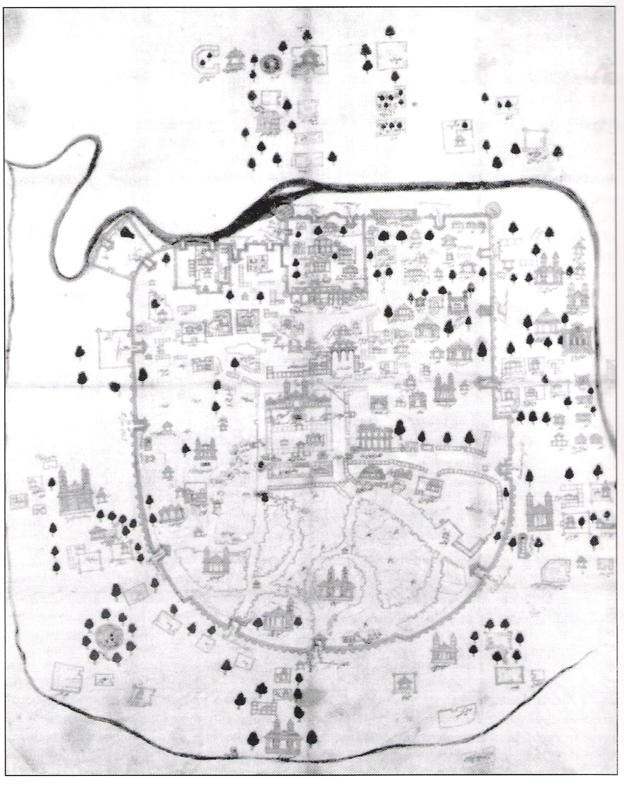

# ಅಹ್ಮದಾಬಾದ್

| ಅಹ್ಮದಾಬಾದ್ અમદાવાદ ಅಮ್ದಾವಾದ್ |
| --- |
| Metropolitan City |
| Aerial View of the Sabarmati riverfront |
| ದೇಶ |
| ರಾಜ್ಯ |
| District |
| ಸ್ಥಾಪಿಸಿದವರು |
| ಸರ್ಕಾರ |
| • ಮಾದರಿ |
| • ಪಾಲಿಕೆ |
| • Mayor |
| • Deputy Mayor |
| • Municipal commissioner |
| Area |
| • Metropolitan City |
| Elevation |
| Population (2011) [ ೧ ] |
| • Metropolitan City |
| • ಶ್ರೇಣಿ |
| • ಸಾಂದ್ರತೆ |
| • Metro |
| • Metro rank |
| Demonym(s) |
| ಸಮಯದ ವಲಯ |
| ಸಮಯ ವಲಯ |
| Pincode(s) |
| Area code(s) |
| ವಾಹನ ನೋಂದಣಿ |
| Sex ratio |
| Literacy |
| Spoken languages |
| ಜಾಲತಾಣ |
| Source: Census of India. |

ಅಹ್ಮದಾಬಾದ್ ಗುಜರಾತ್ ರಾಜ್ಯದ ಪೂರ್ವ ರಾಜಧಾನಿ. ಇದು ಭಾರತದ ಪ್ರಮುಖ ಕೈಗಾರಿಕಾ ನಗರಗಳಲ್ಲೊಂದು. ಗುಜರಾತಿನ ಅತಿ ದೊಡ್ಡ ನಗರವಾದ ಇದು, ಭಾರತದ ೫ನೇ ದೊಡ್ಡ ನಗರ. ೫ ಮಿಲಿಯನ್ ಗಿಂತಲೂ ಹೆಚ್ಚು ಜನಸಂಖ್ಯೆ ಈ ನಗರದ್ದು. ಅಹ್ಮದಾಬಾದ್ ನಗರ ಕೆಲವೊಮ್ಮೆ ಕರ್ನಾವತಿ (ಹಳೆಯ ಹೆಸರು) ಎಂದೂ ಕೆಲವೊಮ್ಮೆ ಅಮ್ದವಾದ್ (ಗುಜರಾತಿ ಭಾಷೆಯಲ್ಲಿ ಉಚ್ಛರಿಸಿದಂತೆ) ಕರೆಯಲ್ಪಡುತ್ತದೆ.ಇದನ್ನು ಪೂರ್ವದ ಮ್ಯಾಂಚೆಸ್ಟರ್ ಎಂದೂ ಕರೆಯುತ್ತಿದ್ದರು.

*Map of Ahmedabad, depicted in a miniature style painting on a cloth, circa 19th century*

ಅಹ್ಮದಾಬಾದ್ ಪಟ್ಟಣವನ್ನು ೧೫ನೇ ಶತಮಾನದಲ್ಲಿ ಸುಲ್ತಾನ್ ಅಹ್ಮದ್ ಶಾ ಸಾಬರಮತಿ ನದಿ ತೀರದಲ್ಲಿ ಸ್ಥಾಪಿಸಿದನಂತೆ. ಗುಜರಾತಿನ ಸುಲ್ತನತೆಯ ರಾಜಧಾನಿಯೂ ಈ ನಗರ ಅಗಿತ್ತು ಎಂದು ಐತಿಹಾಸಿಕ ಮೂಲಗಳು ತಿಳಿಸುತ್ತವೆ.

---
Source: https://kn.wikipedia.org/wiki/%E0%B2%85%E0%B2%B9%E0%B3%8D%E0%B2%AE%E0%B2%A6%E0%B2%BE%E0%B2%AC%E0%B2%BE%E0%B2%A6%E0%B3%8D
