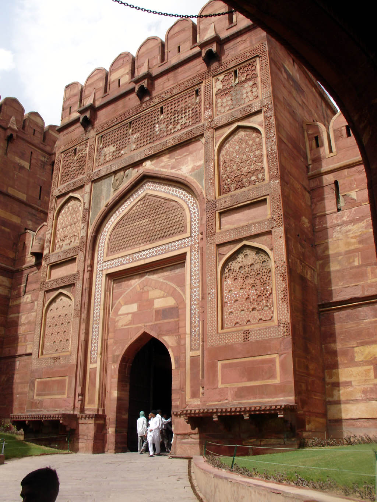
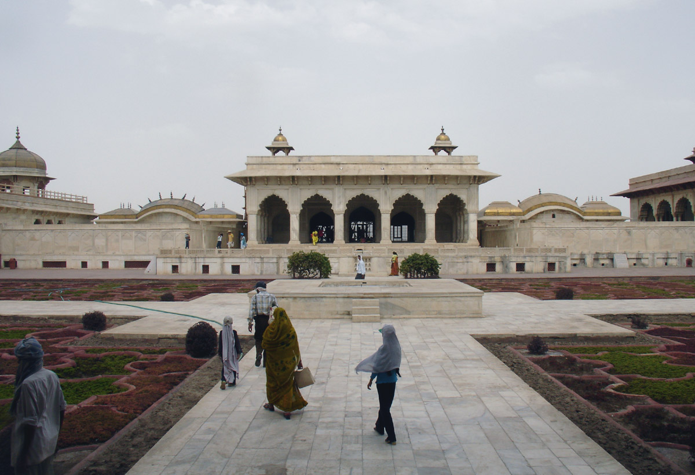

# ആഗ്ര

| Col1 |
| --- |
| ആഗ്ര |
| ആഗ്ര |
| 27°11′N 78°01′E / 27.18°N 78.02°E / 27.18; 78.02 |
| ഭൂമിശാസ്ത്ര പ്രാധാന്യം |
| രാജ്യം |
| സംസ്ഥാനം |
| ഭരണസ്ഥാപനങ്ങൾ |
| ' |
| വിസ്തീർണ്ണം |
| ജനസംഖ്യ |
| ജനസാന്ദ്രത |
| കോഡുകൾ • തപാൽ • ടെലിഫോൺ |
| സമയമേഖല |
| പ്രധാന ആകർഷണങ്ങൾ |

*ആഗ്ര കോട്ട*

*ഖാസ് മഹൽ*

*താജ്മഹൽ*

ഉത്തർപ്രദേശ് സംസ്ഥാനത്തെ ഒരു പ്രധാനപട്ടണമാണ്‌ ആഗ്ര. ഇന്ത്യയിലെ മുഗൾ സാമ്രാജ്യത്തിന്റെ തലസ്ഥാനനഗരമായിരുന്നു ആഗ്ര. ഡൽഹിയിൽ നിന്ന് 200 കിലോമീറ്റർ തെക്ക്, യമുനാതീരത്ത് സ്ഥിതിചെയ്യുന്നു. മുഗളരുടെ കാലത്തെ ഒട്ടനവധി ചരിത്രസ്മാരകങ്ങൾ ഇവിടെയുണ്ട്.

## ചരിത്രം

ദില്ലിയിലെ ലോധി രാജവംശത്തിലെ സുൽത്താനായിരുന്ന സിക്കന്തർ ലോധിയാണ്‌ 1503-ൽ ആഗ്ര നഗരം സ്ഥാപിച്ചത്.

## ചരിത്രസ്മാരകങ്ങൾ

### താജ്‌മഹൽ

ലോകമഹാത്ഭുതങ്ങളിൽ ഒന്നായ താജ്മഹൽ ആഗ്രയിൽ , യമുനാനദിക്കരയിൽ സ്ഥിതി ചെയ്യുന്നു. തൻറെ പത്നി മുംതാസിൻറെ സ്മരണയ്ക്കായി മുഗൾ ചക്രവർത്തിയായ ഷാജഹാൻ പണികഴിപ്പിച്ചതാണ് ഇത്. മുഗൾ വാസ്തുവിദ്യയുടെ ഉത്തമോദാഹരണമാണ് താജ്. 1983 ൽ ഇത് ലോകപൈതൃകപ്പട്ടികയിൾ ഇടം നേടി. പൂർണമായും വെണ്ണക്കല്ലിൽ നിർമ്മിച്ച ഈ സ്മാരകം പൂർത്തിയാകാൻ ഇരുപത് വർഷത്തോളമെടുത്തു.

## ചരിത്രസ്മാരകങ്ങൾ

### ആഗ്ര കോട്ട

ഇന്ത്യയിലെ ഏറ്റവും ചരിത്രപ്രാധാന്യമുള്ള കോട്ട. അക്ബർ ചക്രവർത്തി 1565ൽ പുതിയ കോട്ടയുടെ നിർമ്മാണപ്രവർത്തനങ്ങൾ ആരംഭിച്ചു. 1983 ൽ ഇത് യുനെസ്കോയുടെ ലോകപൈതൃകപ്പട്ടികയിൽ ഇടം നേടി.

## ചരിത്രസ്മാരകങ്ങൾ

### ആഗ്ര കോട്ട

#### ജഹാംഗീർ പാലസ്

അക്ബർ ചക്രവർത്തി ആഗ്ര കോട്ടയ്ക്കുള്ളിൽ അദ്ദേഹത്തിൻറെ മകൻ ജഹാംഗീറിനുവേണ്ടി പണികഴിപ്പിച്ച കൊട്ടാരം

## പുറത്തേക്കുള്ള കണ്ണികൾ

- ആഗ്ര by NIC
- ആഗ്ര Archived 2007-11-04 at the Wayback Machine

---
Source: https://ml.wikipedia.org/wiki/%E0%B4%86%E0%B4%97%E0%B5%8D%E0%B4%B0
