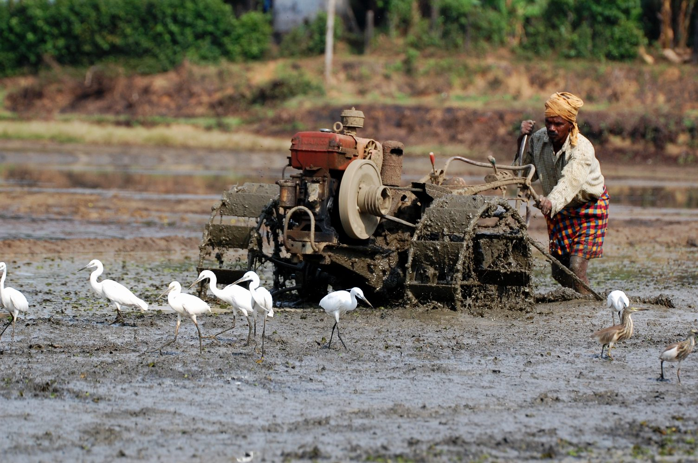
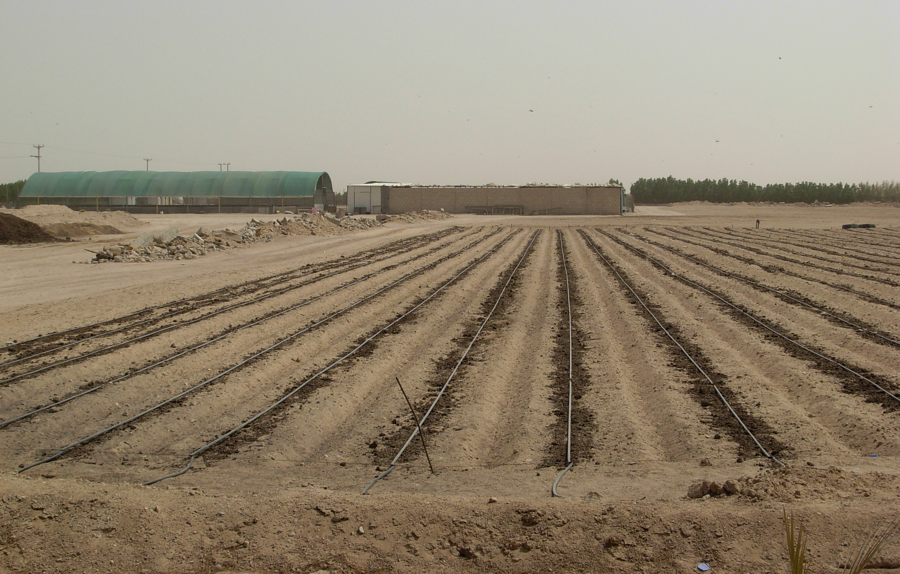

# കൃഷി

| Col1 |
| --- |
|  |
| കൃഷി |
| General |
| അഗ്രിബിസിനസ്സ് · കാർഷിക സസ്യശാസ്ത്രം അഗ്രോണമി · കാലി വളർത്തൽ Extensive farming Factory farming · Free range Industrial agriculture Intensive farming Organic farming · Permaculture Sustainable agriculture Urban agriculture |
| History |
| History of agriculture Arab Agricultural Revolution British Agricultural Revolution Green Revolution Neolithic Revolution ഇന്ത്യയിലെ ഹരിതവിപ്ലവം |
| Types |
| Aquaculture · ഡയറി ഫാം Grazing · ഹൈഡ്രോപോണിക്സ് Livestock · Pig farming Orchards · Poultry farming Sheep husbandry |
| Categories |
| കൃഷി Agriculture by country Agriculture companies ജൈവസാങ്കേതികവിദ്യ Farming history Livestock Meat industry Poultry farming |
|  |
| ക സ തി |

*ഒരു കർ‍ഷകൻ,ആധുനിക കൃഷി സങ്കേതങ്ങൾ ഉപയോഗിച്ച് കൃഷി ചെയ്യുന്നു*

സസ്യങ്ങൾ വളർത്തിയും വളർത്തുമൃഗങ്ങളെ പരിപാലിച്ചും ഭക്ഷ്യ-ഭക്ഷ്യേതരവിഭവങ്ങൾ ഉല്പാദിപ്പിക്കുന്ന പ്രക്രിയക്ക് ആണ് കൃഷി എന്ന് പറയുന്നത് . ഇന്ന് മനുഷ്യൻ ഭക്ഷണത്തിനായി ഉപയോഗിക്കുന്ന മിക്കവാറും എല്ലാ ഭക്ഷണപദാർത്ഥങ്ങളും കാർഷികവൃത്തിയുടെ ഫലമാണ്.

## ചരിത്രം

*കുവൈറ്റിലെ ഒരു കൃഷിയിടം*

ഏകദേശം 12000 വർഷങ്ങൾക്കു മുൻപാണ്‌ ലോകത്തിന്റെ വിവിധഭാഗങ്ങളിൽ കാർഷികവൃത്തി ആരംഭിച്ചത്. ഗോതമ്പ് , ബാർലി എന്നിവ മനുഷ്യൻ ആദ്യമായി കൃഷി ചെയ്ത സസ്യങ്ങളാണ്‌. ആദ്യം ഇണക്കി വളർത്തിയ മൃഗങ്ങളിലൊന്നാണ്‌ ആട് [ 1 ] .

## കൃഷി ഭാരതത്തിൽ

ഭാരതത്തിന്റെ ജനസംഖ്യയുടെ മൂന്നിൽ രണ്ടു ഭാഗവും കാർഷികവൃത്തിയെ ആശ്രയിച്ചാണ്‌ കഴിയുന്നത്. നെല്ലരിയാണ്‌ ഇന്ത്യയിലെ പ്രധാന ഭക്ഷ്യ ധാന്യങ്ങളിലൊന്ന്. ഖാരിഫ് , റാബി , സയദ് എന്നിവയാണ്‌ ഇന്ത്യയിലെ വിളവെടുപ്പുകാലങ്ങൾ.

- നെല്ല്
- ചോളം
- പരുത്തി
- ജോവർ
- ബജ്റ

## കൃഷി ഭാരതത്തിൽ

### റാബി വിളകൾ.

ഒക്ടോബർ -ഡിസംബർ മാസങ്ങളിൽ കൃഷിയാരംഭിച്ച് ഏപ്രിൽ- മേയ് മാസങ്ങളിൽ വിളവെടുക്കുന്നതാണ്‌ റാബിവിളകൾ. ഇത് പ്രധാനമായും മഞ്ഞുകാലത്തെ ആശ്രയിച്ചിരിക്കുന്നു.

- ഗോതമ്പ്
- ബാർലി
- റാബി
- പയർ വർഗ്ഗങ്ങൾ
- പച്ചക്കറി
- പഴവർഗ്ഗങ്ങൾ.

## ചിത്രശാല

- തെങ്ങ് കയറ്റക്കാരൻ
- കണ്ടങ്ങളിലെ പരസ്പര ജല നിയന്ത്രണം
- ഞാറ് നടുന്നതിന്റെ ദൃശ്യം

## ഇതും കാണുക

- കർഷകൻ

## അവലംബം

- ↑ "3-FROM GATHERING TO GROWING FOOD". Social Science - Class VI - Our Pasts-I . New Delhi: NCERT. 2007. p. 23. {{ cite book }} : Cite has empty unknown parameter: |coauthors= ( help )

---
Source: https://ml.wikipedia.org/wiki/%E0%B4%95%E0%B5%83%E0%B4%B7%E0%B4%BF
