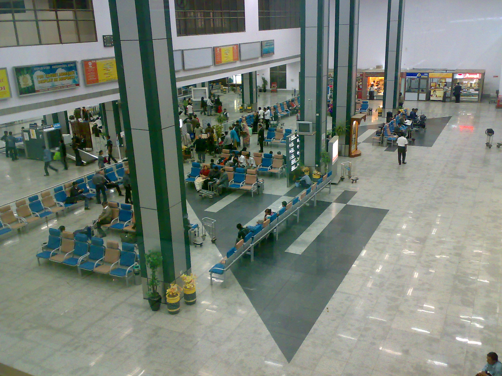
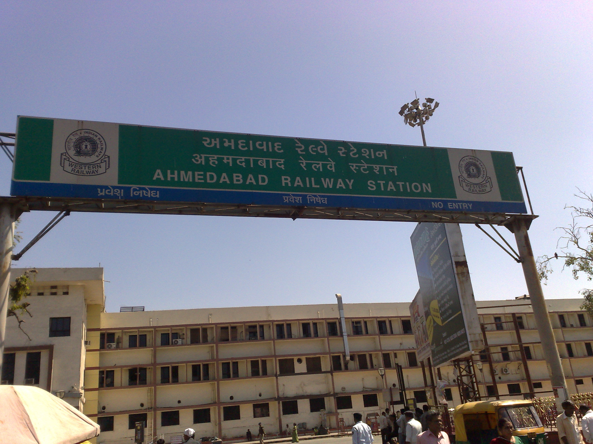
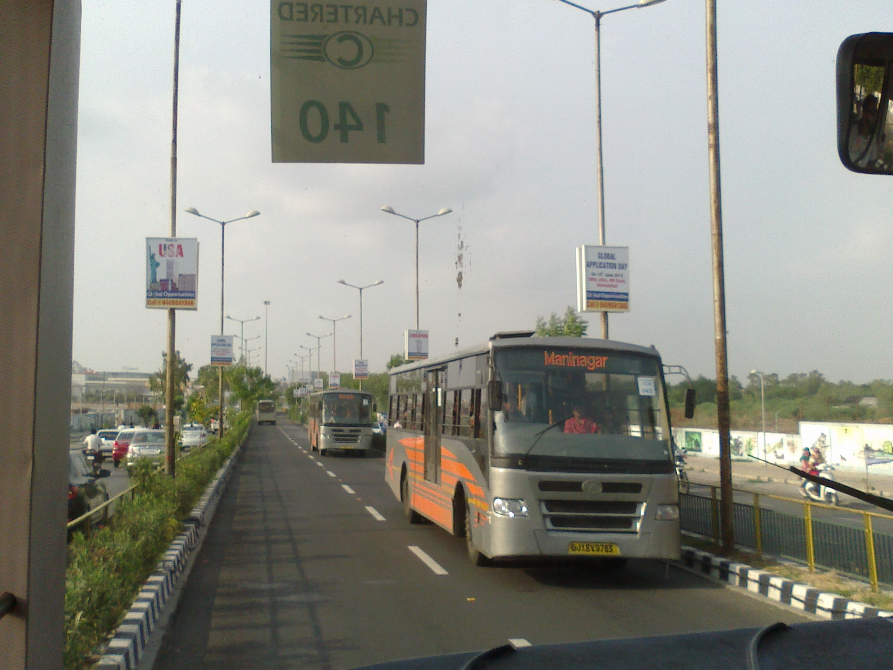
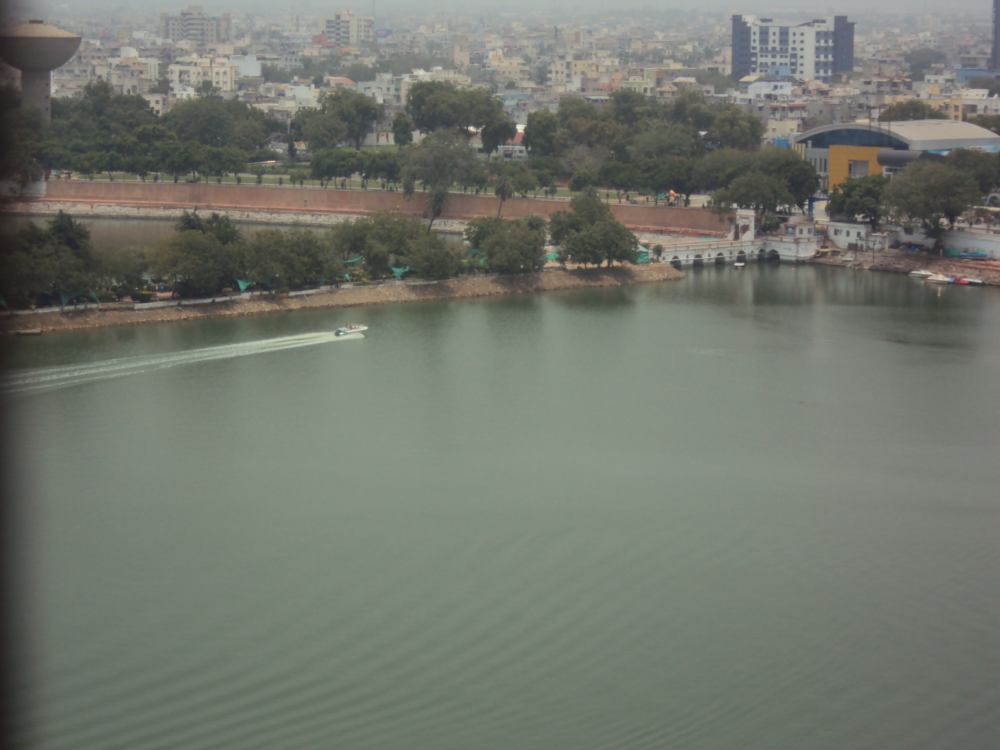
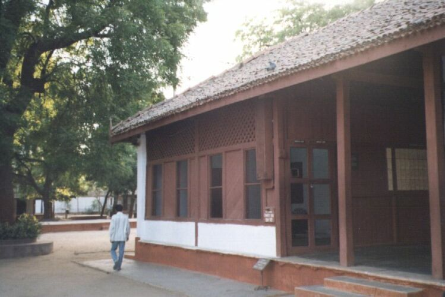

# അഹമ്മദാബാദ്

| Col1 |
| --- |
| അഹമ്മദാബാദ് |
| അഹമ്മദാബാദ് Location of അഹമ്മദാബാദ് in Gujarat and India |
| രാജ്യം |
| സംസ്ഥാനം |
| ജില്ല(കൾ) |
| മേയർ |
| മുൻസിപ്പൽ കമ്മീഷനർ |
| പോലീസ് കമ്മീഷനർ |
| ജനസംഖ്യ • ജനസാന്ദ്രത |
| സമയമേഖല |
| വിസ്തീർണ്ണം • സമുദ്രനിരപ്പിൽ നിന്നുള്ള ഉയരം |
| വികസിപ്പിക്കുക കോഡുകൾ • പിൻകോഡ് • 380 0XX • ടെലിഫോൺ • +079 • വാഹനം • GJ-1 |
| • പിൻകോഡ് |
| • ടെലിഫോൺ |
| • വാഹനം |

23°02′N 72°35′E / 23.03°N 72.58°E / 23.03; 72.58

ഗുജറാത്തിലെ ഏറ്റവും വലിയ നഗരമാണ്‌ അഹമ്മദാബാദ് ( ഗുജറാത്തി : અમદાવાદ Amdāvād , Hindi : अहमदाबाद Ahmadābād ). ഇവിടത്തെ ജനസംഖ്യ ഏതാണ്ട് 45 ലക്ഷം ആണെന്ന് കണക്കാക്കപ്പെടുന്നു. [ 1 ] . സബർമതി നദിയുടെ തീരത്ത് സ്ഥിതി ചെയ്യുന്ന ഈ നഗരം അഹമ്മദാബാദ് ജില്ലയുടെ ഭരണസിരാകേന്ദ്രമാണ്. 1960 മുതൽ 1970 വരെ ഗുജറാത്ത് സംസ്ഥാനത്തിന്റെ തലസ്ഥാനവും ഈ നഗരം ആയിരുന്നു. അതിനുശേഷം തലസ്ഥാനം ഗാന്ധി നഗറിലേക്ക് മാറ്റി. ഈ പ്രദേശത്തു സ്ഥിതി ചെയ്തിരുന്ന പഴയ ഒരു നഗരത്തിന്റെ പേരായിരുന്ന കർണാവതി എന്ന പേർ ഈ നഗരത്തെ സൂചിപ്പിക്കാനും ഉപയോഗിക്കാറുണ്ട്. ഗുജറാത്തിലെ ചിലയിടങ്ങളിൽ ഇപ്പോളും ഈ നഗരം അംദാവാദ് എന്ന് സൂചിപ്പിക്കപ്പെടാറുണ്ട്.

ഇന്ത്യയിലെ പ്രധാന ഐ.ഐ.എം. ആയ ഐ.ഐ.എം. അഹമ്മദാബാദ് ഈ നഗരത്തിലാണ്‌ സ്ഥിതി ചെയ്യുന്നത്.

2002 ഫിബ്രുവരി, മാർച്ച് മാസങ്ങളിൽ നടന്ന ഗുജറാത്ത് കലാപത്തിൽ ഈ നഗരത്തിൽ ധാരാളമാളുകൾ കൊല്ലപ്പെടുകയും കാണാതാവുകയും ചെയ്തിട്ടുണ്ട്. 10 വർഷം കോൺഗ്രസ്സിൻറെ ലോക്സഭാംഗമായിരുന്ന ഇഹ്സാൻ ജഫ്രി യടക്കം ധാരാളം പേർ ഈ നഗരത്തിൽ കൊല്ലപ്പെട്ടിട്ടുണ്ട്. ഈ കലാപങ്ങൾ സംഘ് പരിവാറിന്റെ നേതൃത്വത്തിലാണ് നടന്നതെന്ന് തെഹൽക വെളിപ്പെടുത്തിയിരുന്നു . [ 2 ]

2008 ജൂലൈ 26 -ന് ഈ നഗരത്തിൽ നടന്ന ബോംബ് സ്ഫോടന പരമ്പരയിൽ ഏതാണ്ട് 49 പേർ മരിക്കുകയും 100-ൽ അധികം പേർക്ക് പരിക്കേൽക്കുകയും ചെയ്തു. ഇന്ത്യൻ മുജാഹുദ്ദീൻ എന്ന സംഘടന ഇതിന്റെ ഉത്തരവാദിത്തം ഏറ്റെടുത്തു. [ 3 ]

## ഗതാഗതം

### വ്യോമയാനം

അഹമ്മദാബാദിൽ സ്ഥിതി ചെയ്യുന്ന അന്താരാഷ്ട്രവിമാനത്താവളമാണ് സർദാർ വല്ലഭായി പട്ടേൽ അന്താരാഷ്ട്രവിമാനത്താ‍വളം ( IATA : AMD , ICAO : VAAH ). പൊതുവെ അഹമ്മദാബാദ് വിമാനത്താവളം എന്ന് അറിയപ്പെടുന്നു. അഹമ്മദാബാദ് റെയിൽ‌വേ സ്റ്റേഷനിൽ നിന്ന് 8 കി.മീ (5.0 മൈ) ദൂരത്തിൽ സ്ഥിതി ചെയ്യുന്നു. ഏകദേശം 150 ലധികം വിമാനങ്ങൾ ഒരു ദിവസം സേവനം നടത്തുന്ന ഈ വിമാനത്താവളം ഇന്ത്യയിലെ തിരക്കേറിയ എട്ടാമത്തെ വിമാനത്താവളമാണ്.

*വിമാനത്താവളതിന്റെ അകം*

## ഗതാഗതം

### റെയിൽ

പശ്ചിമ റെയിൽ‌വേയുടെ കീഴിലാണ് അഹമ്മദാബാദ് റെയിൽവെ ഡിവിഷൻ. കാൽപൂർ റെയിൽവെ സ്റ്റേഷൻ എന്നും അഹമ്മദാബാദ് റെയിൽവെ സ്റ്റേഷൻ അറിയപെടുന്നു.

*സ്റ്റേഷൻ കവാടം*

## ഗതാഗതം

### റോഡ്

ദേശീയപാത 8 , ദേശീയപാത 8C, ദേശീയ അധിവേഗ പാത 1 (നാഷണൽ എക്സ് പ്രസ്സ് വെ) ആണ് പ്രാധാന പാതകൾ.

## ഗതാഗതം

### അതിവേഗ ബസ് ഗതാഗതം

അഹമ്മദാബാദ് ബി ആർ ടി എസ്സ് അഥവാ അഹമ്മദാബാദ് ജൻമാർഗ് ലിമിറ്റഡ് നിയന്ത്രിക്കുന്ന അതിവേഗ ബസ് ഗതാഗതം (ബി ആർ ടി എസ്സ്) സേവനം 14 ഒക്ടോബർ 2009 ന് മുഖ്യമന്ത്രി നരേന്ദ്ര മോദി നാടിനു സമർപ്പിച്ചു. 92 സ്റ്റേഷനുകൾ ഉള്ള അഹമ്മദാബാദ് ജൻമാർഗ് സേവനം ഒരുപാട് ബഹുമതികൾ ഏറ്റു വാങ്ങുകയുണ്ടായി. ഇപ്പോൾ 66കി.മി നീളമുള്ള സേവനത്തിന്റെ അടുത്ത 22 കി.മി നീളം പുരോഗമിക്കുന്നു.

*ബി ആർ ടി എസ്സ് ബസ്സിനകത്തു നിന്ന്*

## വിനോദ സഞ്ചാരം

### കാങ്കറിയ

കാങ്കറിയ താടാകം അഹമ്മദാബാദിലെ ഒരു വലിയ മനുഷ്യ നിർമിത തടാകമാണ്. സുൽത്താൻ കുട്ടുബുദ്ദീൻ 15-ാം നൂറ്റാണ്ടിൽ പണി കഴിപ്പിച്ച ഈ തടാകം ഇന്ന് പ്രാധാന വിനോദ സഞ്ചാര കേന്ദ്രങ്ങളിൽ ഒന്നാണ്. താടാകത്തിനു ചുറ്റും ഇന്നു കമല നെഹറു സുവോളജികൽ പാർക്ക് എന്ന പേരിൽ ഒരു കാഴ്ചബഗ്ലാവും, ബാൽവാടിക എന്ന പേരിൽ കുട്ടികളുടെ പാക്കും, അടൽ എക്സ് പ്രസ്സ് ( എ.ബി. വാജ്‌പേയുടെ ബഹുമാനാർഥം) എന്ന കൊച്ചു തീവണ്ടിയും, അഹമ്മദാബാദ് ഐ എന്ന പേരിൽ ബലൂൺ സഫാരിയും, നാഗിന വാടി എന്ന പേരിൽ ഒരു ചെറിയ ദ്വീപ്പും മറ്റ് ചില ആകർഷണങ്ങളും ഉണ്ട്.

## വിനോദ സഞ്ചാരം

### സബർമതി ആശ്രമം

ഗുജറാത്തിലെ സബർമതി നദീതീരത്ത് ഗാന്ധിജി സ്ഥാപിച്ച ആശ്രമമാണ് സബർമതി ആശ്രമം . ഗാന്ധി ആശ്രമം , ഹരിജൻ ആശ്രമം , സത്യാഗ്രഹ ആശ്രമം എന്നീ പേരുകളിലെല്ലാം ഈ ആശ്രമം അറിയപ്പെടുന്നു.

*ബലൂൺ സഫാരിയിൽ നിന്നും കാങ്കറിയ താടാക കാഴ്ച*

*ഗാന്ധിജി താമസിച്ചിരുന്ന വീട്*

ചരിത്രം തിരുത്തുക
സുൽത്താൻ അഹമ്മദ് ഷാ 1411-ൽ അഹമ്മദാബാദ് സ്ഥാപിച്ചു.1572-ൽ അക്‌ബർ അഹമ്മദാബാദ് കീഴടക്കി മുഗൾ സാമ്രാജ്യത്തിന്റെ ഭാഗമാക്കി. ബ്രിട്ടീഷുകാർ 1818-ൽ അഹമ്മദാബാദ് കീഴടക്കുകയും തുണിമില്ലുകൾ സ്ഥാപിക്കുകയും ചെയ്തു

## അവലംബം

- ↑ "Population Finder" . Census of India . Retrieved 2008-07-24 .
- ↑ "ആർക്കൈവ് പകർപ്പ്" . Archived from the original on 2008-04-08 . Retrieved 2008-07-28 .
- ↑ http://www.economist.com/world/asia/displaystory.cfm?story_id=11826021

---
Source: https://ml.wikipedia.org/wiki/%E0%B4%85%E0%B4%B9%E0%B4%AE%E0%B5%8D%E0%B4%AE%E0%B4%A6%E0%B4%BE%E0%B4%AC%E0%B4%BE%E0%B4%A6%E0%B5%8D
