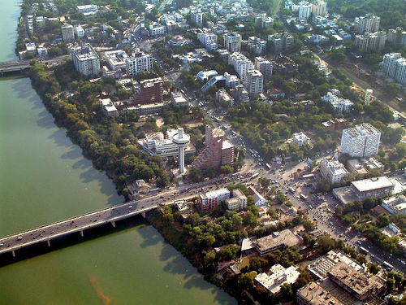

# अहमदाबाद

| Col1 |
| --- |
| ? अहमदाबाद गुजरात • भारत |
| — शहर — |
| Wikimedia | © OpenStreetMap २३° ०१′ १९″ N, ७२° ३४′ ४७″ E ओपनस्ट्रीट मॅप गूगल अर्थ प्रोक्सिमिटीरामा |
|  |
| प्रमाणवेळ |
| क्षेत्रफळ • उंची |
| जिल्हा |
| लोकसंख्या • घनता • मेट्रो |
| Mayor |
| कोड • पिन कोड • दूरध्वनी • आरटीओ कोड |

अहमदाबाद हे भारताच्या गुजरात राज्यातील सगळ्यात मोठे शहर आहे. हे गुजरात राज्याची राजधानी आहे असेही म्हणले जाते. साबरमती नदीच्या किनारी वसलेल्या या शहराचे मूळ नाव कर्णावती आहे. हे शहर अहमदशाहने स्थापले होते. हे आज एक मोठे व वेगाने वाढणारे शहर आहे. अहमदाबाद हे भारतातील एक महत्त्वाचे आर्थिक आणि औद्योगिक केंद्र म्हणून उदयास आले आहे. भारतीय प्रबंध संस्था (इंडियन इन्स्टिट्यूट ऑफ मॅनेजमेन्ट) ही प्रसिद्ध शिक्षणसंस्था अहमदाबादेत आहे. विक्रम साराभाई यांनी ती स्थापन करण्यात मोलाची भूमिका बजावली होती.

क्रिकेट हा अहमदाबादमधील लोकप्रिय खेळ आहे; मोटेरा येथे नरेंद्र मोदी स्टेडियम नावाचे नवीन बांधलेले स्टेडियम १,३२,००० प्रेक्षक सामावू शकते, ज्यामुळे ते जगातील सर्वात मोठे स्टेडियम बनले आहे.

*अहमदाबाद*

## विशेष

अहमदाबाद शहर अतिशय पसरलेले असून जवळपासच्या अनेक गावांना येथील महानगरपालिकेने सामावून घेतले आहे. अहमदाबाद जवळच गांधीनगर हे जुळे शहर राज्याची राजधानी म्हणून वसवले गेले.
बी.आर.टी ( बस रॅपिड ट्रान्स्पोर्ट) ही संकल्पना यशस्वीपणे राबवणारे अहमदाबाद हे एकमेव शहर आहे.

अहमदाबाद शहराला युनेस्कोने जागतिक वारसा शहर असा दर्जा दिला आहे. असा दर्जा मिळवणारे अहमदाबाद हे भारतातील पहिले शहर आहे.

## पर्यटन स्थळे

अहमदाबाद हे पर्यटनाच्या दृष्टीने उत्तम शहर आहे. अहमदाबाद शहरात अनेक ऐतिहासिक तसेच आधुनिक पर्यटन स्थळे आहेत

१) साबरमती आश्रम - महात्मा गांधींच्या वास्तव्याने पुनीत झालेले हे ठिकाण.

२) रिव्हर फ्रंट - साबरमती नदीच्या काठी असणारा काही भाग सरकारने सुशोबित केला आहे. दर वर्षी जानेवारी मध्ये होणारी आंतराष्ट्रीय पतंग स्पर्धा या ठिकाणी घेतली जाते.

३) कांकरिया तलाव - गावात असणारा हा मोठा तलाव सुशोभित करण्यात आला आहे. तलाव काठी नौकानयन, अम्युझमेंट राईडस, फुलपाखरू उद्यान, छोटी रेल्वे अशा अनेक सुविधा आहेत.

४) सरखेज रोझा - अहमदशाह ज्याच्या नावाने अहमदाबाद ओळखले जाते त्याचा हा राजधानीचा परिसर. राजाचे गुरू शेख अहमदशाह गंज बक्ष यांचा दर्गा येथे आहे.

५) अडालज वाव - वाव म्हणजे पायऱ्यांची विहीर. गांधीनगरजवळ असणाऱ्या अडालज गावामध्ये ही हजार वर्षे जुनी विहीर आहे. साधारण पाच मजले असणारी ही विहीर पर्यटकांचे आकर्षण आहे.

६) अक्षरधाम मंदिर - स्वामीनारायण पंथांचे साधारण ३० एकर परिसरात पसरलेले हे सुरेख मंदिर पाहण्यासारखे आहे. स्वामी नारायण पंथाचे आद्य गुरू भगवान श्री स्वामी नारायण यांच्या जीवनातील महत्त्वाच्या प्रसंगांचे चित्रप्रदर्शन पाहण्यासारखे आहे.

७) कालुपूर स्वामी नारायण मंदिर - कालुपूर या अहमदाबाद शहराच्या मध्यवर्ती भागात असणाऱ्या स्वामी नारायण मंदिरातील लाकडावरचे कोरीव काम अतिशय सुंदर आहे.

८) सायन्स सिटी - राज्यातील विद्यार्थ्यांना शास्त्र आणि गणित अशा विषयांची गोडी लागावी तसेच राज्यात विज्ञान तंत्रज्ञानाला पोषक वातावरण असावे म्हणून अहमदाबादच्या सोला या उपनगरात सायन्स सिटी ची स्थापना करण्यात आली. २०१७ सालची २५वी राष्ट्रीय बाल विज्ञान सभा येथे भरवण्यात आली होती. या सिटीमध्ये आय-मॅक्स तंत्रज्ञानाने चालवले गेलेले चित्रपटगृह आहे.

## उत्सव

संक्रांतीच्या दिवशी १४ जानेवारीला अहमदाबाद येथे दरवर्षी आंतरराष्ट्रीय पतंग महोत्सव साजरा केला जातो. नवरात्राच्या दिवसांत संपूर्ण अहमदाबादेत उत्सवाचे वातावरण असते..

---
Source: https://mr.wikipedia.org/wiki/%E0%A4%85%E0%A4%B9%E0%A4%AE%E0%A4%A6%E0%A4%BE%E0%A4%AC%E0%A4%BE%E0%A4%A6
