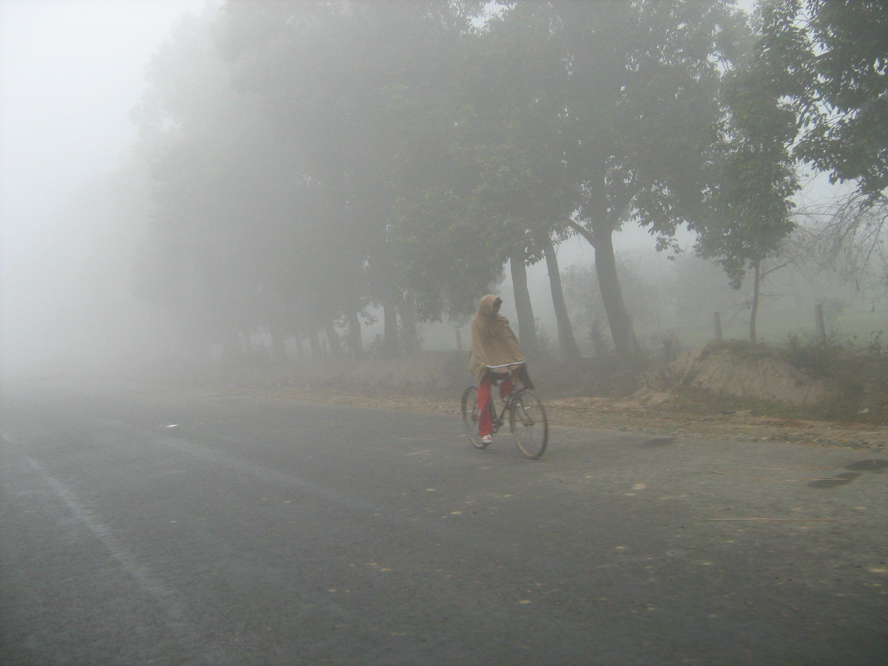

# ଅମୃତସର

| Col1 |
| --- |
| ଅମୃତସର |
| — ସହର — |
| ଗୋଲଡେନ୍ ଟେମ୍ପଲ ଗୋଲଡେନ୍ ଟେମ୍ପଲ |
| ଅମୃତସର ଅମୃତସରର ଅବସ୍ଥାନ ପଞ୍ଜାବ |
| ଦିଗବାରେଣି |
| ଦେଶ |
| ରାଜ୍ୟ |
| ଭାରତର ଜିଲାସବୁ |
| ଲୋକସଂଖ୍ୟା |
| ସମୟ ଜୋନ |
| ଦେଖାଇବେ କୋଡ଼ • ପିନକୋଡ଼ • ୧୪୩-୦୦୧ • ଗାଡ଼ି • ପି.ବି.୦୨ |
| • ପିନକୋଡ଼ |
| • ଗାଡ଼ି |
| ବେବସାଇଟ |

ଅମୃତସର ଯାହା ପୂର୍ବେ ରାମଦାସପୁର ଭବେ ପରିଚିତ ଥିଲା ଭାରତର ପୂର୍ବ ଭାଗରେ ଅବସ୍ଥିତ ପଞ୍ଜାବ ରାଜ୍ୟର ଏକ ସହର।ଏହିଠାରେ ପ୍ରସିଦ୍ଦ ଗୋଲଡେନ ଟେମ୍ପଲ ରହିଛି ଯାହା ହରମିନ୍ଦର ସାହିବଙ୍କ ନାମରେ ହୋଇଛି।

*ଅମୃତସରରେ ସକାଳ*

## ଛବି ସମୂହ

- ଗୋଲଡେନ ଟେମ୍ପଲ
- ମହାରାଯା ରଞିତ ସିଂ ବଗିଚା
- ଗୋଲଡେନ ଟେମ୍ପଲ
- ଅମୃତସର ମେଳା
- ଅମୃତସର ଷ୍ଟେସନ
- ଅମୃତସର ମେଳା

## ବାହାର ତଥ୍ୟ

ଛାଞ୍ଚ:Portalbox

- Official Website of District of Amritsar
- Official Website of Amritsar Municipal Corporation
- Amritsar travel guide from Wikivoyage

---
Source: https://or.wikipedia.org/wiki/%E0%AC%85%E0%AC%AE%E0%AD%83%E0%AC%A4%E0%AC%B8%E0%AC%B0
