# வேளாண்மை

| Col1 |
| --- |
|  |
| வேளாண்மை |
| பொது |
| விவசாய வாணிபம் · வேளாண்மை வேளாண்மை அறிவியல் · உழவியல் விலங்கு வளர்ப்பு விரிவாக்கல் பண்ணையியல் தொழிற்சாலைப் பண்ணையியல் · வெட்டவெளி வளர்ப்பு கைத்தொழில் வேளாண்மை செறிந்த வேளாண்மை கரிம வேளாண்மை · நிலைகொள் வேளாண்மை பேண்தகு வேளாண்மை நகரவேளாண்மை |
| வரலாறு |
| வேளாண்மை வரலாறு புதுக்கற்காலப் புரட்சி அரேபிய வேளாண்மைப் புரட்சி பிரித்தானிய வேளாண்மைப் புரட்சி பசுமைப் புரட்சி |
| தனியானது |
| நீர் வேளாண்மை · பால் உற்பத்தி மேய்ச்சல் · நீரியல் வளர்ப்பு · IMTA பன்றி வளர்ப்பு · மரம் மக்காச்சோளம் · பழத் தோட்டம் கோழி வளர்ப்பு · அரிசி ஆடு வளர்ப்பு · சோயாபீன் அமைப்பில் நெல்லைச் செறிவூட்டல் கோதுமை |
| பகுப்புகள் |
| நாடு வாரியாக வேளாண்மை வேளாண்மை நிறுவனங்கள் உயிரித் தொழில்நுட்பம் பயிர்ச்செய்கை வரலாறு கால்நடைகள் இறைச்சிக் கைத்தொழில் கோழி வளர்ப்பு |
| வேளாண்மை வலைவாசல் |
| பா உ தொ |

உழவு அல்லது வேளாண்மை அல்லது விவசாயம் அல்லது கமம் ( ஆங்கிலம் : Agriculture ) என்பது உணவு மற்றும் உணவு சாராப் பொருட்களுக்காக பயிர் மற்றும் கால்நடை உற்பத்தி, நீர் வேளாண்மை , மீன் வளர்ப்பு மற்றும் காட்டியல் ஆகியவற்றை உள்ளடக்கியது ஆகும். [ 1 ] வேளாண்மை ஒரு முக்கியமான முதனிலைத் தொழில் ஆகும். நிலையான இடத்தில் வாழ்ந்த மனித நாகரிகத்தின் எழுச்சியில் ஒரு முக்கியமான முன்னேற்றமாக வேளாண்மை இருந்துள்ளது. நகரங்களில் மக்கள் வாழ்வதற்குக் காரணமான உணவு நுகர்வோன்மிகையை உருவாக்கிய கொல்லைப்படுத்தப்பட்ட உயிரினங்களின் வேளாண்மையானது இந்த நாகரிகங்களில் நடைபெற்றது. மனிதர்கள் குறைந்தது 1,05,000 ஆண்டுகளுக்கு முன்னர் இருந்தே தானியங்களைச் சேகரிக்கத் தொடங்கி விட்ட அதே நேரத்தில், தொடக்க கால விவசாயிகள் 11,500 ஆண்டுகளுக்கு முன்னர் வாக்கில் தான் இவற்றைப் பயிரிடத் தொடங்கினர். செம்மறியாடு, ஆடுகள், பன்றிகள் மற்றும் கால்நடைகள் ஆகியவை சுமார் 10,000 ஆண்டுகளுக்கு முன்னர் கொல்லைப்படுத்தப்பட்டன. உலகின் குறைந்தது 11 பகுதிகளிலாவது தாவரங்கள் சுயேச்சையாக அறுவடை செய்யப்பட்டுள்ளன. 20ஆம் நூற்றாண்டில் பெரும் அளவிலான ஓரினப் பயிர் முறைகளை அடிப்படையாகக் கொண்ட தொழில்துறை விவசாயமானது விவசாய உற்பத்தி மீது தாக்கம் செலுத்தி வருகிறது.

2021ஆம் ஆண்டு நிலவரப்படி, உலக உணவில் சுமார் மூன்றில் ஒரு பங்கை சிறிய விவசாய நிலங்கள் உற்பத்தி செய்கின்றன. ஆனால், பெரிய விவசாய நிலங்கள் பரவலாகக் காணப்படுகின்றன. [ 2 ] உலகின் பெரிய 1% விவசாய நிலங்களானவை 50 எக்டேர்கள் (120 ஏக்கர்கள்) அளவை விடப் பெரியவையாக உள்ளன. உலகின் விவசாய நிலத்தில் 70%க்கும் மேற்பட்ட நிலத்தை இவை கொண்டுள்ளன. [ 2 ] விவசாய நிலத்தில் கிட்டத் தட்ட 40%மானது 1,000 எக்டேர்கள் (2,500 ஏக்கர்கள்) அளவை விடப் பெரிய விவசாய நிலங்களில் காணப்படுகிறது. [ 2 ] எனினும், உலகின் ஒவ்வொரு ஆறு விவசாய நிலங்களில் ஐந்து நிலங்களானவை 2 எக்டேர்கள் (4.9 ஏக்கர்கள்) அளவுக்கும் குறைவான நிலப் பரப்பைக் கொண்டுள்ளது. அனைத்து விவசாய நிலத்திலும் சுமார் வெறும் 12%ஐ மட்டுமே இவை கொண்டுள்ளன. [ 2 ] கிராமப் புற பொருளாதாரம், கிராமப் புற சமூகத்தின் வடிவம் ஆகியவற்றின் மீது விவசாய நிலங்களும், வேளாண்மையும் தாக்கத்தை ஏற்படுத்தியுள்ளன. விவசாய நிலங்கள் மற்றும் வேளாண்மை மக்களுக்கு ஆதரவு அளிக்கிற நேரடியான விவசாயப் பணியாளர்கள் மற்றும் பரந்த விவசாயத் தொழிற்துறை ஆகியவற்றின் மீதும் தாக்கத்தைக் கொண்டுள்ளன.

முதன்மையான விவசாயப் பொருட்களானவை உணவுகள் , இழைகள் , எரிமங்கள் மற்றும் மூலப்பொருட்கள் ( இயற்கை மீள்மம் போன்றவை) எனப் பரவலாகப் பிரிக்கப்படலாம். உணவு வகைகளில் தானியங்கள் , காய்கறிகள் , பழங்கள், சமையல் எண்ணெய்கள் , இறைச்சி , பால் , முட்டைகள் மற்றும் பூஞ்சை ஆகியவை உள்ளடங்கியுள்ளன. உலக விவசாய உற்பத்தியானது தோராயமாக 11 பில்லியன் டன்கள் உணவு, [ 3 ] 32 மில்லியன் டன்கள் இயற்கை இழைகள் [ 4 ] மற்றும் 4 பில்லியன் கன மீட்டர் மரக் கட்டைகளுக்குச் சமமானதாக உள்ளது. [ 5 ] எனினும், உலகின் உணவில் சுமார் 14%ஆனது சில்லறை வணிகத்தை அடைவதற்கு முன்னதாக, உற்பத்தி செய்யப்படும் போதே அழிந்து விடுகிறது. [ 6 ]

நவீன உழவியல் , தாவர வளர்ப்பு , மற்றும் தீங்குயிர்கொல்லிகள் மற்றும் உரங்கள் போன்ற வேளாண் வேதிப்பொருட்கள் , மற்றும் தொழில்நுட்ப முன்னேற்றங்கள் ஆகியவை பயிர் மகசூலைக் குறிப்பிடத்தக்க அளவுக்கு அதிகரித்துள்ளன. ஆனால், சுற்றுச் சூழலியல் மற்றும் சூழ்நிலை சேதத்திற்கும் கூட பங்களித்துள்ளன. கால்நடை வளர்ப்பில் தேர்ந்தெடுத்த இனப்பெருக்கம் மற்றும் நவீன முறைகளானவை மாமிச உற்பத்தியை இதே போல அதிகரித்துள்ளன. ஆனால், விலங்கு நலன் மற்றும் சூழ்நிலை சேதம் குறித்த கவலைகளையும் உருவாக்கியுள்ளன. காலநிலை மாற்றத்திற்கான பங்களிப்புகள், நிலத்தடி நீர்ப் படுகைகள் குன்றுதல், காடழிப்பு , நோய்த் தொற்று மருந்துகளுக்கான எதிர்ப்பு மற்றும் பிற விவசாய மாசுபாடுகள் உள்ளிட்டவை சூழ்நிலைப் பிரச்சினைகளாக உள்ளன. உயிரினப் பல் வகைமை இழப்பு, பாலைவனமாதல் , மண் சிதைவாக்கம் , மற்றும் புவி சூடாதல் போன்ற சூழ்நிலைச் சிதைவுக்கு ஒரு காரணம், அதனால் பாதிக்கப்படுதல் ஆகிய இரண்டாகவுமே வேளாண்மை உள்ளது. மேற்குறிப்பிட்ட காரணங்கள் பயிர் உற்பத்தி குன்றுவதற்குக் காரணமாக அமையலாம். சில நாடுகள் மரபணு மாற்றப்பட்ட உயிரினங்களைத் தடை செய்திருந்தாலும் இவை பரவலாகப் பயன்படுத்தப்படுகின்றன.

## பெயர் வரலாறு

வேள் என்னும் சொல்லின் அடியாகப் பிறந்த வேளாண்மை என்னும் சொல் பொதுவாக கொடை, ஈகை ஆகியவற்றைக் குறிக்கும். [ 7 ] நிலமானது தரும் கொடையாதலால் இப்பெயர் வழங்கியிருக்கலாம். வேளான் என்னும் சொல் வெள்ளத்தை (நீரை) ஆள்பவன் என்னும் பொருளது என்பர். [ 8 ] வேளாண்மை என்ற சொல் "விருப்பத்துடன் பிறரைப் பேணுதல்" என்ற பொருளும் கொண்டதாகும். [ 9 ] வேளாண்மையைக் குறிக்கின்ற agriculture என்னும் ஆங்கிலச் சொல் agricultūra என்னும் இலத்தீன் சொல்லிலிருந்து பிறக்கிறது. ager என்பது "நிலம்" என்றும், "cultura" என்பது "பண்படுத்தல்" என்றும் பொருள்தரும். எனவே, "நிலத்தைப் பண்படுத்தும்" செயல்பாடு "agricultūra" ("agriculture") என்று அழைக்கப்படலாயிற்று. [ 10 ] மேலும், "cultura" என்னும் சொல்லே "பண்பாடு" என்னும் செம்மைப் பொருளை ஏற்றது. [ 11 ] அதைத் தொடர்ந்து, "cult" என்னும் சொல் "வழிபாடு" என்னும் பொருளிலும், உள்ளத்தைப் பண்படுத்தல் "கல்வி" என்னும் பொருளிலும் வழங்கலாயிற்று. தமிழில் "கல்வி" என்பது "அகழ்தல்" என்னும் பொருள் தருவதையும் இவண் கருதலாம். [ 12 ] இவ்வாறு, நிலத்தோடு தொடர்புடைய வேளாண்மைத் தொழில் மனித இனத்தின் உயர்நிலைச் செயல்பாடுகளை உணர்த்துகின்ற காரணி ஆயிற்று.

வேளாண்மை என்பது பொதுவாக மனித நடவடிக்கைகளைக் குறிப்பிடுகிறது. எறும்பு, [ 13 ] [ 14 ] கறையான் மற்றும் அம்ப்ரோசியா வண்டுகளில் சில உயிரினங்கள் 6 கோடி ஆண்டுகளாகப் பயிர்களை அறுவடை செய்து வருகின்றன. [ 15 ] வேளாண்மை என்பது வேறுபட்ட கருது பொருள்களில் விளக்கப்படுகிறது. "வாழ்வைப் பேணுவதற்காக உணவு, இழை, காட்டுப் பொருட்கள், தோட்டக்கலைப் பயிர்கள் போன்ற பொருட்களை உற்பத்தி செய்தல் மற்றும் அது தொடர்பான சேவைகள் ஆகியவற்றுக்காக இயற்கை வளங்களைப் பயன்படுத்துவது" என்பது வேளாண்மை என்பதற்கான பரவலான வரையறை ஆகும். [ 16 ] கால்நடை சாராத வேளாண்மை, தோட்டக்கலை, கால்நடை வளர்ப்பு மற்றும் காட்டியல் ஆகியவற்றை உள்ளடக்கியதாக வேளாண்மை இவ்வாறாக உள்ளது. ஆனால், தோட்டக்கலை மற்றும் காட்டியல் பணிகளானவை நடைமுறையில் வேளாண்மையிலிருந்து ஒதுக்கப்படுகின்றன. [ 16 ] இதைப் பரவலாக பயன்படுத்தக்கூடிய தாவரங்களை அறுவடை செய்யும் தாவர வேளாண்மை [ 17 ] மற்றும் விவசாய விலங்குகளை உற்பத்தி செய்யும் விலங்கு வேளாண்மை [ 18 ] எனப் பிரிக்கலாம்.

## வரலாறு

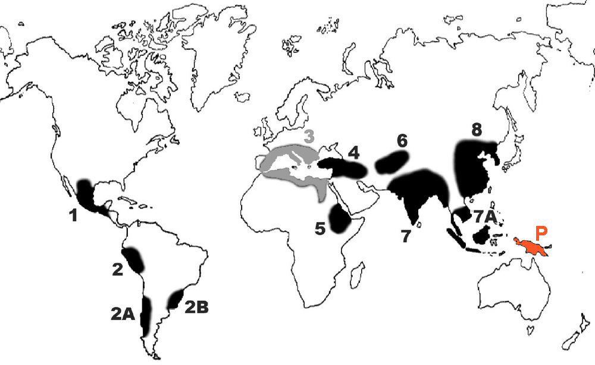
*1930களில் நிகோலாய் வவிலோவால் எண்கள் இடப்பட்ட வேளாண்மை தோன்றிய மையங்கள் பகுதி 3 தற்போது வேளாண்மை தோன்றிய ஒரு மையமாக அங்கீகரிக்கப்படுவதில்லை மிக சமீபத்தில் நியூ கினி (பகுதி பி) வேளாண்மை தோன்றிய இடமாக அடையாளம் காணப்பட்டது. [ 19 ] [ 20 ]*

## வரலாறு

### தோன்றிய இடங்கள்

வேட்டையாடி சேகரித்து உண்பதால் பிழைத்திருக்க வைக்கப்பட்டதை விட பல மடங்கு பெரிய அளவுக்கு மனித மக்கள் தொகை வளர்ச்சியடைவதை வேளாண்மையின் வளர்ச்சியானது சாத்தியமாக்கியது. [ 21 ] உலகின் பல்வேறு பகுதிகளில் வேளாண்மையானது தனித் தனியாகத் தோன்றியது. [ 22 ] உயிரியலகின் ஒரு வேறுபட்ட பிரிவுகளை இது உள்ளடக்கியிருந்தது. குறைந்தது 11 தனித் தனி மையங்களில் வேளாண்மை தோன்றியது. [ 19 ] குறைந்தது 1,05,000 ஆண்டுகளுக்கு முன்னர் இருந்து காட்டுத் தானியங்கள் சேகரித்து உண்ணப்பட்டு வந்துள்ளன. [ 23 ] பழைய கற்கால லெவன்ட் பகுதியில் 23,000 ஆண்டுகளுக்கு முன்னர் எமர் கோதுமை, வாற்கோதுமை மற்றும் காடைக்கண்ணி ஆகிய தானியங்களின் அறுவடையானது கலிலி கடலுக்கு அருகில் கவனிக்கப்பட்டு வந்துள்ளது. [ 24 ] [ 25 ] பொ. ஊ. மு. 11,500 மற்றும் பொ. ஊ. மு. 6,200 ஆகிய ஆண்டுகளுக்கு இடையில் நெல்லானது சீனாவில் கொல்லைப்படுத்தப்பட்டது. தொடக்க காலத்தில் அறியப்பட்ட நெல் அறுவடையானது பொ. ஊ. மு. 5,700ஆம் ஆண்டிலிருந்து அறியப்படுகிறது. [ 26 ] இதைத் தொடர்ந்து பாசிப் பயறு , சோயா அவரை மற்றும் அசூகி அவரை ஆகியவை அறுவடை செய்யப்பட்டன. செம்மறியாடானது மெசொப்பொத்தேமியாவில் 13,000 மற்றும் 11,000 ஆண்டுகளுக்கு முந்தைய கால கட்டத்தில் கொல்லைப்படுத்தப்பட்டது. [ 27 ] சுமார் 10,500 ஆண்டுகளுக்கு முன்னர் நவீன கால துருக்கி மற்றும் பாக்கித்தானின் பகுதிகளில் காட்டெருதுகளிலிருந்து கால்நடைகளானவை கொல்லைப்படுத்தப்பட்டன. [ 28 ] ஐரோப்பா, கிழக்காசியா மற்றும் தென் மேற்கு ஆசியா உள்ளிட்ட ஐரோவாசியப் பகுதிகளில் பன்றி உற்பத்தியானது தோன்றியது. [ 29 ] இப்பகுதியில் தான் சுமார் 10,500 ஆண்டுகளுக்கு காட்டுப் பன்றியானது முதன் முதலில் கொல்லைப்படுத்தப்பட்டது. [ 30 ] தென் அமெரிக்காவின் அந்தீசு மலைத்தொடரில் 10,000 மற்றும் 7,000 ஆண்டுகளுக்கு முந்தைய இடைப்பட்ட காலத்தில் உருளைக் கிழங்கானது கொல்லைப்படுத்தப்பட்டது. இதனுடன் அவரை வகைகள், இலாமாக்கள் , அல்பகாக்கள், மற்றும் கினி எலிகளும் கொல்லைப்படுத்தப்பட்டன. சுமார் 9,000 ஆண்டுகளுக்கு முன்னர் நியூ கினியாவில் கரும்பும், சில வேர்க் காய்கறிகளும் கொல்லைப்படுத்தப்பட்டன. 7,000 ஆண்டுகளுக்கு முன்னர் ஆப்பிரிக்காவின் சாகேல் பகுதியில் சோளம் சிறுதானியமானது முதன் முதலில் கொல்லைப்படுத்தப்பட்டது. 5,600 ஆண்டுகளுக்கு முன்னர் பெரு நாட்டில் பருத்தியானது கொல்லைப்படுத்தப்பட்டது. [ 31 ] பருத்தி தனியாக ஐரோவாசியாவிலும் கொல்லைப்படுத்தப்பட்டது. மீசோ அமெரிக்காவில் 10,000 - 6,000 ஆண்டுகளுக்கு முன்னர் காட்டு தியோசின்டே புல்லானது மக்காச் சோளமாக வளர்க்க்கப்பட ஆரம்பித்தது. [ 32 ] [ 33 ] [ 34 ] சுமார் பொ. ஊ. மு. 3,500ஆம் ஆண்டு வாக்கில் ஐரோவாசியப் புல்வெளிகளில் குதிரையானது கொல்லைப்படுத்தப்பட்டது. [ 35 ]

## வரலாறு

### நாகரிகங்கள்

*வேளாண்மை தோன்றியதன் தோராயமான மையங்கள் மற்றும் வரலாற்றுக்கு முந்தைய காலத்தில் அதன் பரவல் ஆகியவற்றைக் காட்டும் உலக வரைபடம். [ 36 ] சுமார் 9,000 ஆண்டுகளுக்கு முன்னர் அனத்தோலியாவைச் சேர்ந்த தொடக்க கால விவசாயிகள் பரவியதன் மூலம் ஐரோப்பாவில் வேளாண்மை அறிமுகப்படுத்தப்பட்டது என டிஎன்ஏ ஆய்வுகள் காட்டுகின்றன. [ 37 ]*

ஐரோவாசியாவில் பொ. ஊ. மு. சுமார் 8,000ஆம் ஆண்டிலிருந்து சுமேரியர்கள் கிராமங்களில் வாழத் தொடங்கினர். டைகிரிசு மற்றும் புறாத்து ஆறுகளையும், பாசனத்திற்கு ஒரு கால்வாய் அமைப்பையும் சார்ந்திருந்தனர். பொ. ஊ. மு. சுமார் 3,000ஆம் ஆண்டு வாக்கில் கலப்பைகள் உருவ எழுத்துகளில் தோன்றுகின்றன; விதை-கலப்பைகள் பொ. ஊ. மு. 2,300 வாக்கில் தோன்றுகின்றன. கோதுமை, வாற்கோதுமை, பருப்பு வகைகள் மற்றும் வெங்காயங்கள் போன்ற காய்கறிகள், மற்றும் திராட்சைகள் மற்றும் அத்திப் பழங்கள் உள்ளிட்ட பழங்களை விவசாயிகள் விளைவித்தனர். [ 38 ] பண்டைக் கால எகிப்திய வேளாண்மையானது நைல் மற்றும் அதன் பருவகால வெள்ளத்தைச் சார்ந்திருந்தது. பொ. ஊ. மு. 10,000 ஆண்டுகளுக்குப் பிறகு பழைய கற்காலத்தின் முடிவில் அரசமரபுக்கு முந்தைய காலத்தில் வேளாண்மையானது தொடங்கியது. ஆளி மற்றும் பாபிரசு போன்ற தொழில்துறைப் பயிர்களுடன் கோதுமை மற்றும் வாற்கோதுமை போன்ற தானியங்கள் முதன்மையான உணவுப் பயிர்களாக விளைவிக்கப்பட்டன. [ 39 ] [ 40 ] இந்தியாவில் பொ. ஊ. மு. 9,000ஆம் ஆண்டு வாக்கில் கோதுமை, வாற்கோதுமை, மற்றும் இலந்தை ஆகியவை கொல்லைப்படுத்தப்பட்டன. இதற்குப் பிறகு சீக்கிரமே செம்மறியாடுகளும், ஆடுகளும் கொல்லைப்படுத்தப்பட்டன. [ 41 ] பொ. ஊ. மு. 8,000 - 6,000 ஆண்டுகளுக்கு இடைப்பட்ட காலத்தில் மெகர்கர் பண்பாட்டில் கால்நடைகள், செம்மறியாடுகள் மற்றும் ஆடுகள் கொல்லைப்படுத்தப்பட்டன. [ 42 ] [ 43 ] [ 44 ] 5ஆம்-4ஆம் ஆயிரம் ஆண்டு காலத்தில் பருத்தியானது பயிர் செய்யப்பட்டது. [ 45 ] சிந்துவெளி நாகரிகத்தில் பொ. ஊ. மு. 2,500ஆம் ஆண்டைச் சேர்ந்த விலங்குகளால் இழுக்கப்பட்ட ஏரைத் தொல்லியல் ஆய்வுகளானவை வெளிக் காட்டுகின்றன. [ 46 ]

சீனாவில் பொ. ஊ. மு. 5ஆம் நூற்றாண்டிலிருந்து ஒரு தேசிய அளவிலான தானியக் கிடங்கு அமைப்பு மற்றும் பரவலான பட்டு வேளாண்மையானது இருந்தது. [ 47 ] பொ. ஊ. மு. 1ஆம் நூற்றாண்டு வாக்கில் நீரால் இயக்கப்பட்ட தானிய ஆலைகள் பயன்பாட்டில் இருந்தன. [ 48 ] இதைத் தொடர்ந்து நீர்ப்பாசனம் பயன்படுத்தப்பட்டது. [ 49 ] 2ஆம் நூற்றாண்டின் பிந்தைய பகுதி வாக்கில் இரும்புக் கலப்பை முனைகள் மற்றும் முனைப் பலகைகளுடன் கூடிய கனரக ஏர்களானவை உருவாக்கப்பட்டன. [ 50 ] [ 51 ] மேற்கு நோக்கி ஐரோவாசியா முழுவதும் இவை விரிவடைந்தன. [ 52 ] நெல்லானது 8,200 - 13,500 ஆண்டுகளுக்கு முன்னர் தெற்கு சீனாவின் முத்து ஆற்றில் கொல்லைப்படுத்தப்பட்டது. காட்டு நெல்லான ஒரைசா ரூபிபோகோனில் [ 53 ] இருந்து ஓர் ஒற்றை மரபணுத் தொடக்கத்தை இந்நெல் கொண்டிருந்தது. இக்காலமானது மூலக்கூறு காலங்காட்டி மதிப்பீட்டை அடிப்படையாக கொண்டு இந்த ஆண்டுகள் கொடுக்கப்பட்டுள்ளன. [ 54 ] கிரேக்கம் மற்றும் உரோமில் முதன்மையான தானியங்களாகக் கோதுமை, எம்மர் கோதுமை மற்றும் வாற்கோதுமை மற்றும் இவற்றுடன் பட்டாணிகள், அவரை வகைகள் மற்றும் ஆலிவ்கள் உள்ளிட்ட காய்கறிகள் பயிர் செய்யப்பட்டன. செம்மறியாடுகளும், ஆடுகளும் முதன்மையாகப் பால் பொருட்களுக்காகவே வளர்க்கப்பட்டன. [ 55 ] [ 56 ]

*பண்டைக் கால எகிப்தைச் சேர்ந்த கதிர் அடித்தல் , ஒரு தானியக் கிடங்கு, அரிவாள்களைக் கொண்டு அறுவடை செய்தல், தோண்டுதல், மரம் வெட்டுதல் மற்றும் உழுதல் போன்ற வேளாண்மைக் காட்சிகள் பொ. ஊ. மு. 15ஆம் நூற்றாண்டைச் சேர்ந்த நக்தின் கல்லறையில் காணப்படுகிறது.*

அமெரிக்காக்களில் (தியோசின்டே காலத்தைத் தவிர்த்த) இடையமெரிக்கப் பண்பாட்டுப் பகுதியில் பயிர்கள் கொல்லைப்படுத்தப்பட்டன. இதில் கறிகாய் வகைகள், அவரை வகைகள் மற்றும் கொக்கோ ஆகியவை அடங்கும். [ 57 ] பொ. ஊ. மு. 3,000ஆம் ஆண்டு வாக்கில் மேல் அமேசான் பகுதியின் மாயோ சின்சிபே மக்களால் கொக்கோ கொல்லைப்படுத்தப்பட்டது. [ 58 ] வான்கோழியானது அநேகமாக மெக்சிகோ அல்லது அமெரிக்கத் தென்மேற்குப் பகுதியில் கொல்லைப்படுத்தப்பட்டது. [ 59 ] அஸ்டெக் நாகரிகங்கள் நீர்ப்பாசன அமைப்புகளை உருவாக்குதல், மேற்கூரையை உடைய குன்று சரிவுகளை அமைத்தல், தங்களது நிலத்துக்கு உரமிடுதல் மற்றும் சினாம்பாக்கள் அல்லது செயற்கைத் தீவுகளை உருவாக்குதல் போன்ற முறைகளைக் கொண்டு வந்தனர். மாயர்கள் விரிவான கால்வாய் அமைப்பைப் பயன்படுத்தினர். பொ. ஊ. மு. 400ஆம் ஆண்டிலிருந்து தள அமைப்புகளை உயர்த்தி விவசாயச் சதுப்பு நிலங்களாக உருவாக்கினர். [ 60 ] [ 61 ] [ 62 ] [ 63 ] [ 64 ] தென் அமெரிக்காவில் வேளாண்மையானது பொ. ஊ. மு. 9,000ஆம் ஆண்டு வாக்கில் கறிகாய் வகைகள் (குகுர்பிதா) மற்றும் பிற தாவரங்கள் கொல்லைப்படுத்தப்பட்டதால் தொடங்கியிருக்கலாம் என்று கருதப்படுகிறது. [ 65 ] அந்தீசு மலைத் தொடரில் கொக்கோ கொல்லைப்படுத்தப்பட்டது. இதைப் போலவே வேர்க்கடலை, தக்காளி, புகையிலை மற்றும் அன்னாசியும் கொல்லைப்படுத்தப்பட்டன. [ 57 ] பொ. ஊ. மு. 3,600 வாக்கில் பெருவில் பருத்தி கொல்லைப்படுத்தப்பட்டது. [ 66 ] இலாமாக்கள் , அல்பகாக்கள் மற்றும் கினி எலிகள் உள்ளிட்ட விலங்குகள் இங்கு கொல்லைப்படுத்தப்பட்டன. [ 67 ] வட அமெரிக்காவில் கிழக்கின் பூர்வீக மக்கள் சூரியகாந்தி , புகையிலை, [ 68 ] கறிகாய் வகைகள் மற்றும் செனோபோடியம் உள்ளிட்ட பயிர்களைக் கொல்லைப்படுத்தினர். [ 69 ] [ 70 ] காட்டு நெல் மற்றும் மேப்பில் சர்க்கரை உள்ளிட்ட காட்டு உணவுப் பொருட்கள் அறுவடை செய்யப்பட்டன. [ 71 ] கொல்லைப்படுத்தப்பட்ட செம்புற்றானது சிலி மற்றும் வட அமெரிக்க இனங்களின் ஒரு கலப்பு ஆகும். ஐரோப்பா மற்றும் வட அமெரிக்காவில் வளர்க்கப்பட்டதன் மூலம் இவை உருவாக்கப்பட்டன. [ 72 ] தென்மேற்கு மற்றும் அமைதிப் பெருங்கடல் வடமேற்கின் பூர்வீக மக்கள் வேளாண்காடு வளர்ப்பு மற்றும் நெருப்பு-குச்சி வேளாண்மையைச் செய்தனர். தளர்வான சுற்று முறையில் ஓர் அடர்த்தி குறைவான வேளாண்மையை நீடித்திருக்கச் செய்த ஓர் அடர்த்தி குறைவான நெருப்புச் சூழலியலை உருவாக்கப் பூர்வீக மக்கள் நெருப்பை ஒரு பெரும் அளவில் கட்டுப்படுத்தப்பட்ட முறையில் பயன்படுத்தினர்; இதை ஓரளவுக்கு "காட்டு" நிலைகொள் வேளாண்மை என்று குறிப்பிடலாம். [ 73 ] [ 74 ] [ 75 ] [ 76 ] மூன்று சகோதரிகள் என்று அழைக்கப்பட்ட துணை நடவு முறையின் ஓர் அமைப்பானது வட அமெரிக்காவில் உருவாக்கப்பட்டது. இதில் மூன்று பயிர்களாக குளிர் கால கறிகாய் வகை, மக்காச்சோளம் மற்றும் ஏறும் அவரை ஆகியவை திகழ்ந்தன. [ 77 ] [ 78 ]

நீண்ட காலமாக நாடோடி வாழ்க்கை முறையை வாழ்ந்த வேட்டையாடி-சேகரிப்பவர்களாகக் கருதப்பட்ட ஆத்திரேலியப் பழங்குடிகள் அமைப்பு ரீதியிலான எரித்தலைப் பின்பற்றினர். அநேகமாக நெருப்பு-குச்சி வேளாண்மையில் இயற்கையான உற்பத்தி அளவை மேம்படுத்துவதற்காக இவ்வாறு இவர்கள் செய்திருக்கலாம் என்று கருதப்படுகிறது. [ 79 ] அறுவடை இல்லாமல் சேகரிப்பதற்கு ஆதரவளிக்கக் கூடிய ஓர் உற்பத்தி மிகுதியான சுற்றுச் சூழலானது வேட்டையாடி-சேகரிப்பவர்களுக்குத் தேவையாக இருந்தது என்பதை அறிஞர்கள் சுட்டிக் காட்டியுள்ளனர். நியூ கினியாவின் காடுகளானவை வெகு சில உணவுத் தாவரங்களையே கொண்டிருந்ததன் காரணமாக தங்களது வேட்டையாடி-சேகரித்து உண்ணும் வாழ்க்கை முறைக்கு ஆதரவளிக்க காட்டு கருகா பழ மரங்களின் உற்பத்தியை அதிகரிப்பதற்காக தேர்ந்தெடுத்த எரித்தலை தொடக்க கால மனிதர்கள் பயன்படுத்தியிருக்கலாம் என்று கருதப்படுகிறது. [ 80 ]

கண்டித்சமரா மற்றும் பிற குழுக்கள் விலாங்கு வேளாண்மை மற்றும் மீன்பிடி அமைப்புகளைச் சுமார் 5,000 ஆண்டுகளுக்கு முன்னர் உருவாக்கினர். [ 81 ] இக்காலகட்டத்தில் ஒட்டு மொத்த கண்டப்பகுதி முழுவதும் "செறிவூட்டப்பட்டதற்கான" ஆதாரம் காணப்படுகிறது. [ 82 ] ஆத்திரேலியாவின் இரு பகுதிகளான நடு மேற்குக் கடற்கரை மற்றும் கிழக்கு மையப்பகுதி ஆகியவற்றில் தொடக்க கால விவசாயிகள் கருணைக் கிழங்குகள், பூர்வீகத் தினை மற்றும் புதர் வெங்காயங்களை அநேகமாக நிலையான குடியிருப்புகளில் அறுவடை செய்தனர். [ 83 ] [ 84 ]

## வரலாறு

### புரட்சி

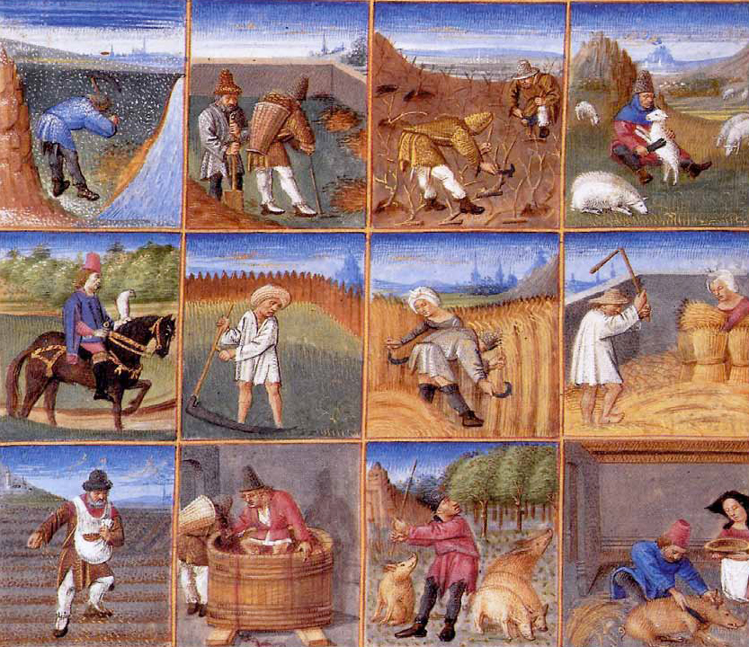
*வேளாண் நாட்காட்டி, அண். 1470 , பியேத்ரோ தி கிரசென்சியின் ஒரு கையெழுத்துப் பிரதியிலிருந்து*

உரோமானிய காலத்துடன் ஒப்பிடும் போது நடுக் காலத்தில் மேற்கு ஐரோப்பாவில் வேளாண்மையானது தன்நிறைவு மீது அதிக கவனத்தைக் கொண்டதாக உருவானது. நிலப்பிரபு முறைக்குக் கீழான வேளாண்மை மக்கள் தொகையானது பொதுவாக பண்ணைகளாக ஒருங்கிணைக்கப்பட்டது. இப்பண்ணைகள் பல நூறு அல்லது அதற்கு மேற்பட்ட ஏக்கர்கள் நிலங்களைக் கொண்டிருக்கும். இவற்றை பண்ணையின் பிரபுவால் மேற்பார்வையிடப்படும். ஓர் உரோமைக் கத்தோலிக்கத் தேவாலயத்தையும், ஒரு பாதிரியாரையும் கொண்டிருக்கும். [ 85 ]

அரபு வேளாண்மைப் புரட்சி நடந்து கொண்டிருந்த அல்-அந்தலுசுடனான பரிமாற்றம் காரணமாக ஐரோப்பிய வேளாண்மையானது மேம்படுத்தப்பட்ட தொழில்நுட்பங்கள் மற்றும் பயிர்த் தாவரங்கள் உள்ளே கொண்டு வரப்பட்டது ஆகியவற்றால் மாற்றமடைந்தது. இது சர்க்கரை, நெல், பருத்தி, மற்றும் ஆரஞ்சு போன்ற பல மரங்கள் அறிமுகப்படுத்தப்பட்டதையும் உள்ளடக்கியிருந்தது. [ 86 ]

1492ஆம் ஆண்டுக்குப் பிறகு கொலம்பியப் பரிமாற்றமானது மக்காச் சோளம், உருளைக் கிழங்குகள், தக்காளிகள், வற்றாளைகள் மற்றும் மரவள்ளி போன்ற புதிய உலகப் பயிர்களை ஐரோப்பாவுக்கும், கோதுமை, வாற்கோதுமை, நெல் மற்றும் கோசுக் கிழங்குகள் போன்ற பழைய உலகப் பயிர்களும், கால்நடைகளும் (குதிரைகள், மாடுகள், செம்மறியாடுகள் மற்றும் ஆடுகள் உள்ளிட்ட) அமெரிக்காக்களுக்குக் கொண்டு வரப்பட்டன. [ 87 ]

நீர்ப்பாசனம் , பயிர்ச்சுழற்சி மற்றும் உரம் ஆகியவை பிரித்தானிய வேளாண்மைப் புரட்சியுடன் 17ஆம் நூற்றாண்டிலிருந்து மேம்படுத்தப்பட்டுள்ளன. உலக மக்கள் தொகை குறிப்பிடத்தக்க அளவுக்கு அதிகரிக்க இது அனுமதியளித்தது. 1900லிருந்து வளர்ந்த நாடுகளிலும், ஓரளவுக்கு வளர்ந்து வரும் நாடுகளிலும் வேளாண்மையானது மனித உழைப்பை இயந்திரங்கள் இடம் மாற்றியது, மற்றும் உரங்கள் , பூச்சிக் கொல்லிகள் மற்றும் தேர்ந்தெடுத்த இனப்பெருக்கம் ஆகியவற்றால் ஆதரிக்கப்பட்டதால் உற்பத்தியில் பெரும் அதிகரிப்பைக் கண்டுள்ளது. ஹேபர் செயல் முறையானது அமோனியம் நைட்ரேட்டு உரத்தை தொழில்துறை அளவில் உற்பத்தி செய்வதற்கு அனுமதியளித்துள்ளது. இது பயிர் மகசூலைப் பெருமளவுக்கு அதிகரித்துள்ளது. உலக மக்கள் தொகையில் ஒரு மேற்கொண்ட அதிகரிப்பை நீடிக்கச் செய்ய இது காரணமாகியுள்ளது. [ 88 ] [ 89 ]

நீர் மாசுபடுதல் , உயிரி எரிபொருட்கள் , மரபணு மாற்றப்பட்ட உயிரினங்கள் , தீர்வைகள் மற்றும் விவசாய மானியங்கள் உள்ளிட்ட சுற்றுச் சூழலியல், அரசியல் மற்றும் பொருளாதாரப் பிரச்சினைகளை நவீன வேளாண்மையானது எழுப்பியோ அல்லது எதிர் கொண்டோ வந்துள்ளது. இயற்கை விவசாய இயக்கம் போன்ற மாறுபட்ட அணுகு முறைகளுக்கு இது வழி வகுத்துள்ளது. [ 90 ] [ 91 ] வட அமெரிக்காவில் நீடிக்கச் செய்ய இயலாத பண்ணை வேளாண்மைச் செயல் முறைகளானவை 1930களின் தூசிக் கோப்பை (மிக அதிக வேளாண்மை காரணமாக விவசாய நிலமானது பாலைவனமாகும் நிகழ்வு) எனும் நிகழ்வுக்கு வழி வகுத்தன. [ 92 ]

## வரலாறு

### மத்திய காலகட்டம்

மத்திய காலகட்டங்களில், வட ஆப்பிரிக்காவினர் தண்ணீர் சக்கரங்கள் மற்றும் தண்ணீர் உயர்த்தும் இயந்திரங்கள், அணைகள் மற்றும் நீர்ப்பிடிப்புக்களை பயன்படுத்தி பரவலான விவசாயத்தை உருவாக்கினர். 
அவர்கள் இடம்-குறி்த்த விவசாயக் கையேடுகளையும் எழுதியுள்ளனர் என்பதோடு, கரும்பு, அரிசி, சிட்ரசு பழம், இலந்தைப் பழம், பருத்தி , ஆர்டிசோக், ஆபர்சின்கள் மற்றும் குங்குமப்பூ ஆகியவற்றை பரவலான முறையில் அறுவடை செய்ய சாதனங்களையும் பயன்படுதிதினர். எலுமிச்சைகள், ஆரஞ்சுகள், பருத்தி, வாதுமைக்கொட்டைகள், அத்திப் பழங்கள் மற்றும் ஸ்பெயின் வாழைப்பழங்கள் போன்ற துணை-வெப்பமண்டல பயிர்களும் பயிரிடப்பட்டன.

மத்திய கால கட்டங்களில் பயிர் சுழற்சியி இரண்டு

தள முறை கொண்டுவரப்பட்டது, சீன-அறிமுகமான இரும்புக்கலப்பையின் இறக்குமதி விவசாயத்தின் திறனை பெருமளவில் அதிகரித்துள்ளது.

1492 ஆம் ஆண்டிற்குப் பிறகு, சில நாடுகள் பயணர்களால் பல்வேறு வேளாண் பயிர்கள் மற்றொரும் கால்நடைகள் அவர்கள் கண்டறிந்த புதிய நிலங்களுக்கும் அதே போன்று அந்நிலப்பரப்புகளிலிருந்து தங்கள் நாடுகளுக்கும் எடுத்துச் செல்லப்பட்டன. இதனால் உள்ளூர் பயிர் வளர்ப்பிலும் கால்நடை வளர்ப்பிலும் உலகளவிலான மாற்றம் ஏற்பட்டது இந்த மாற்றத்தில் முக்கிய பயிர்களான தக்காளி , மக்காச்சோளம் , உருளைக்கிழங்கு , மரவள்ளி , கோக்கோ மற்றும் புகையிலை உள்ளிட்டவை புதிய உலகத்திலிருந்து பழைய உலகத்திற்கு எடுத்துச்செல்லப்பட்டன, அதே சமயம் சில கோதுமை , வாசனைப்பொருள்கள் , காப்பி மற்றும் கரும்பு வகைகள் பழைய உலகத்திலிருந்து புதிய உலகத்திற்கு எடுத்துச் செல்லப்பட்டன. க ுதிரை மற்றும் நாய் (நாய்கள் கொலம்பிய காலத்திற்கு முன்பே இருந்துள்ளன, ஆனால் பண்ணை வேலைக்கு அவற்றின் எண்ணி்க்கையும் வளர்ப்பும் பொருந்தவில்லை) போன்ற விலங்குகள் ஏற்றுமதியாயின. வழக்கமான உணவு விலங்குகளாக இல்லாதபோதிலும், குதிரை ( கழுதை , மட்டக்குதிரை உட்பட) மற்றும் நாய் ஆகியவை மேற்கத்திய புவிக்கோளப் பண்ணைகளில் அத்தியாவசிய உற்பத்தித் தேவைகளை விரைவாக பூர்த்தி செய்தன.

உருளைக்கிழங்கு வட ஐரோப்பாவில் முக்கியமான கிழங்குவகைப் பயிரானது. [ 93 ] 16 ஆம் நூற்றாண்டில் போர்த்துக்கீசியர்களால் அறிமுகப்படுத்தப்பட்டபோதிலும், [ 94 ] உருளைக்கிழங்கு , மக்காச்சோளம் , மரவள்ளி ஆகியவை ஆப்பிரிக்கக் கண்டத்தின் மிக முக்கிய உணவுப் பயிர்களான பாரம்பரிய பயிர்களை பதிலீடு செய்தது. [ 95 ]

## வரலாறு

### நவீன யுகம்

1940 களில் அறிமுகப்படுத்தப்பட்ட பயிர்செய்கை நுட்பங்கள் வேளாண் உற்பத்தியை பன்மடங்கு பெருக்கின. இந்த வேளாண் தொழில்நுட்பமும் அதனால் நிகழ்ந்த சமூக பொருளாதார அரசியல் மாற்றங்களும் பசுமைப் புரட்சி எனப்படுகிறது. இந்தியா போன்ற பல மூன்றாம் நிலை நாடுகள் பட்டினிச் சாவை எதிர்நோக்கிய அன்றைய கால கட்டத்தில் பசுமைப் புரட்சி முன்னிறுத்திய பயிர்ச்செய்கை முறைகள் பலன் தந்தது. பசுமைப் புரட்சி தொடக்கி வைத்த வேளாண் ஆராய்ச்சி கட்டமைப்புகள் தொடர்ந்தும் வேளாண் தொழில்நுட்பத்தில் பங்கெடுத்து வருகின்றன. தொலைநோக்கில் இந்தப் பயிர்ச்செய்கையின் பல்வேறு குறைபாடுகள் அறியப்பட்டு, தொழில்நுட்பத்தின் அடுத்த கட்டத்துக்கு செல்வது தேவையானாலும், பசுமைப் புரட்சி உலக சமூக தொழில்நுட்ப பொருளாதார அரசியல் தளங்களில் நிகழ்ந்த முக்கிய புரட்சிகளுள் ஒன்றாக கருதப்படுகிறது. பசுமைப் புரட்சியானது "உயர்-மகசூல் வகைகளை" உருவாக்கியதன் மூலம் விளைச்சலை அதிகரிக்க பழமையான கலப்பின முறையைப் பயன்படுத்துவதை பிரபலப்படுத்தியது. எடுத்துக்காட்டாக அமெரிக்காவில் மக்காச்சோளத்தின் விளைச்சல் 1900 ஆம் ஆண்டுகளில் கிட்டத்தட்ட எக்டேருக்கு 2.5 டன்களாக இருந்தது. 2001 ஆம் ஆண்டு கிட்டத்தட்ட 9.4 டன்களாக அதிகரித்தது. அதேபோன்று, உலகளாவிய சராசரி கோதுமை மகசூல் 1900 ஆம் ஆண்டு எக்டேருக்கு 1 டன்னுக்கும் குறைவாக இருந்தது. 1990 ஆம் ஆண்டு எக்டேருக்கு 2.5 டன்னுக்கும் அதிகமாக இருந்தது.

தென் அமெரிக்க சராசரி கோதுமை மகசூல் எக்டேருக்கு 2 டன்னுக்கு குறைவாகவும், ஆப்பிரிக்காவில் எக்டேருக்கு 1 டன்னுக்கு குறைவாகவும், எகிப்து மற்றும் அரேபியாவில் நீர்ப்பாசனத்தைக் கொண்டு எக்டேருக்கு 3.5 முதல் 4 வரையிலுமாக இருந்தது. இதற்கு முரணாக, பிரான்சு போன்ற நாடுகளின் சராசரி கோதுமை மகசூல் எக்டேருக்கு 8 டன்னுக்கும் அதிகமாக இருந்தது. மகசூலில் ஏற்படும் மாற்றங்கள் காலநிலை, மரபணுக்கள், மற்றும் தீவிர விவசாய உத்திகள் (உரங்கள், ரசாயன பூச்சிக் கட்டுப்பாடு, தேக்கத்தைக் கட்டுப்படுத்துவதற்கான வளர்ச்சிக் கட்டுப்பாடு) ஆகியவற்றால் ஏற்படுகின்றன. [ 96 ] [ 97 ]

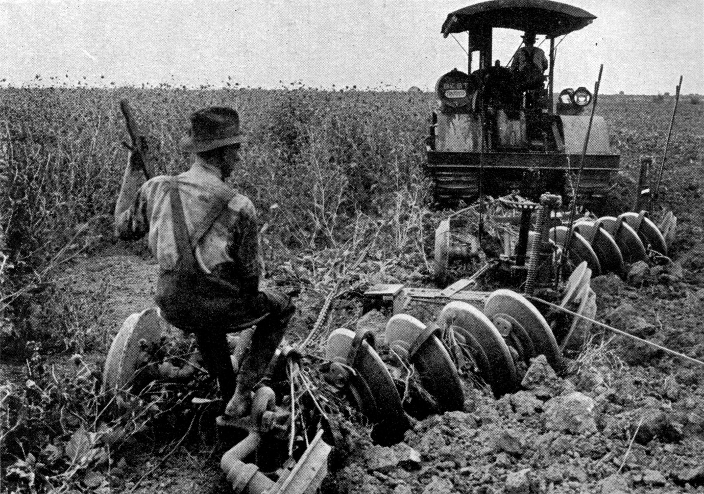
*1921 ஆம் ஆண்டின் என்சைக்ளோபீடியாவிலுள்ள இந்தப் படம் ஆல்பால்பா நிலத்தை ஒரு டிராக்டர் உழுவதைக் காட்டுகிறது.*

இந்த புரட்சி அமெரிக்காவின் Rockfeller Foudation, Ford Foundation ஆகியவற்றின் உதவியுடன் தொடங்கியது. விரைவில் அமெரிக்க அரசு, இந்திய அரசு, மெக்சிக்கோ அரசு போன்ற பல்வேரு நாடுகள் பசுமைப் புரட்சியை தமது நாடுகளில் நடைமுறைப்படுத்தின. Norman Borlaug பசுமைப் புரட்சியின் தந்தை என போற்றப்படுகிறார். சாமிநாதன் இந்தியாவில் பசுமைப் புரட்சியை நடைமுறைப்படுத்துவதில் முன்னின்றவர்களில் ஒருவர்.

## வேளாண்தொழிலை தீர்மானிக்கும் புவியியல் காரணிகள்

காலநிலை, நிலத்தோற்றம், மண்வளம், நீர்வளம் மற்றும் பணியாளர்கள் ஆகிய காரணிகள் வேளாண் தொழில்களில் வேறுபாடுகளையும், பரவலையும் நிர்ணயிக்கும் காரணிகளாக அமைகின்றன.

## வேளாண்தொழிலை தீர்மானிக்கும் புவியியல் காரணிகள்

### காலநிலை

வெப்பநிலையும் மழையளவு ஆகியவை வேளாண்தொழிலைப் பாதிக்கும் காரணிகளாகும். காலநிலை மாற்றம் , வெப்பநிலை மற்றும் ஈரப்பத பிரதேசங்களில் மாற்றங்களை ஏற்படுத்தி வேளாண்மையை பாதிக்கும் திறனுள்ளது. [ 98 ] விவசாயம் புவி வெப்பமடைவதை தணிக்கவோ அல்லது மோசமாக்கவோ செய்யலாம்.

கரியமில வாயு பூமியின் வளிமண்டலத்தில் அதிகரிப்பது மண்ணில் உள்ள உயிர்மப் பொருளின் சிதைவடைவதால் வருகிறது. காற்று மண்டலத்திற்குள் உமிழப்படும் பெரும்பாலான மீத்தேன் நெற்பயிர் நிலங்கள் போன்ற ஈரமான நிலங்களில் உயிர்மப் பொருள் சிதைவடைவதால் உருவாகிறது. [ 99 ] மேலும், ஈரமான நிலங்களும் நைட்ரஜன் குறைவு மூலமாக நைதரசனை இழந்து பசுமையில்ல வாயுவான நைட்ரிக் ஆக்சைடை வெளியிடுகின்றன. [ 100 ] மேலாண்மையில் ஏற்படும் மாற்றங்கள் பசுமையில்ல வாயு வெளியீட்டைக் குறைக்கலாம்.

## வேளாண்தொழிலை தீர்மானிக்கும் புவியியல் காரணிகள்

### காலநிலை

#### வெப்பநிலை

6° சென்டிகிரேடுக்கும் குறைவாக நிலவும் வெப்பநிலையில் மண் குளிர்ந்து உறைந்து போவதால் பெரும்பான்மையான செடிகள் அவ்வெப்ப நிலையில் வளர இயலாது. வெவ்வேறு கால நிலை வட்டாரங்களில்
வெவ்வேறு வகையான பயிர்கள் விளைவிக்கப்படுகின்றன. சான்றாக, நெல் அயன மண்டலத்தில் விளைவிக்கப்படும் முதன்மைப் பயிராகும். ஏனெனில் அதிக வெப்பமும், அதிகளவு நீரும் நெற்பயிர் வளரத் தேவைப்படுகிறது. கோதுமை ஒரு மித வெப்பமண்டலப் பயிராகும். கோதுமை வளரக் குளிர்ந்த காலநிலைத் தேவைப்படுகிறது.

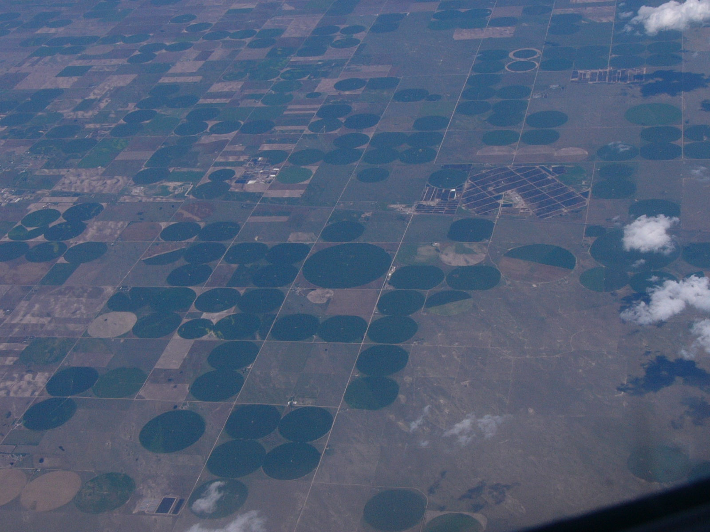
*சுழல் மைய வேளாண் நிலம்*

கடல் மட்டத்திலிருந்து நிலங்களின் உயரம் மாறுபடுவதால் உயரத்திற்கேற்ப வெப்பநிலை மாறுபாடுடையதாக உள்ளது. அது வேளாண்தொழிலை பாதிப்புக்கு உள்ளாக்குகிறது.அயனமண்டலத்திலுள்ள உயர் பகுதிகளில் மிதவெப்ப மண்டல பயிராகிய காரட் போன்ற பயிர்களை விளைவிக்கலாம். பயிருக்குப் பயிர் வளர்ச்சிக் காலம் மாறுபடும். பருத்தி போன்ற பயிர்கள் முழுமையான வளர்ச்சிபெற 200 பனிபொழிவற்ற நாட்கள் தேவைப்படுவதால் குறைந்த வெப்பம் நிலவும் பருவ காலங்களில் விளைவிக்கப்படுகிறது.

## வேளாண்தொழிலை தீர்மானிக்கும் புவியியல் காரணிகள்

### காலநிலை

#### மழையளவு

காற்றிலுள்ல ஈரப்பதம் அப்பகுதியில் விளையும் பயிர்வகை, பயிர்வளர்வதற்கு ஏற்ற காலம் போன்றவற்றை நிர்னயிக்கின்றன. பருவகால மழைப்பொழிவு என்பது மிகவும் முக்கியமான ஒன்றாகும். பயிர்கள் வளர்வதற்கு அதிகமான மழைபொழிவு தேவைப்படுகிறது. ஆனால் மழைப்பொழிவு தகுந்த காலங்களில் அமையவில்லையெனில் அது பயிர் வளர்ச்சியினை வெவ்வேறு வகைகளில் பாதிப்பினை ஏற்படுத்தும். ஒவ்வொரு பயிருக்கும் அதன் வளர்ச்சியின் வெவ்வேறு கட்டங்களில் நீரின் அளவு தேவைப்படுவதால் மழைப் பொழிவுகளில் ஏற்படும் மாற்றம் பயிர்களுக்கு அவசியமான ஒன்று. ஆகையால் பருவநிலைக்கு ஏற்ற மழைப் பொழிவு முக்கியமானது எனப் புலனாகிறது. எடுத்துக்காட்டாக காப்பிக்கு (கோப்பி) அறுவடையின்போதும், அறுவடைக்கு முன்பும் வறாண்ட நிலை தேவை. அதே பருவத்தில் சோளப்பயிர் விளைய நீர் மிகுதியும் தேவையாய் உள்ளது.
ஒரு பகுதியில் விளையும் பயிரை அங்கு பெய்யும் மழையளவே தீர்மானிக்கிறது. நெற்பயிர் அதிகமான மழைப்பொழியும் இடங்களிலும், திணைவகைகள் வறண்ட பகுதிகளிலும் விளைவிக்கப்படுகிறது. மழையளவு குறைவாகப் பொழியும் இடங்கள் அல்லது மழை பொய்க்கும் இடங்களில் வேளாண்தொழில் செய்ய நீர்ப்பாசனம் தேவைப்படுகிறது. கால்வாய்ப்பாசனம், தெளிப்பான் பாசனம், மையசுழற்சிப் பாசனம், சொட்டுநீர்ப்பாசனம் ஆகிய பாசனமுறைகள் இங்கு கையாளப்படுகின்றன.

## வேளாண்தொழிலை தீர்மானிக்கும் புவியியல் காரணிகள்

### நிலத்தோற்றங்கள்

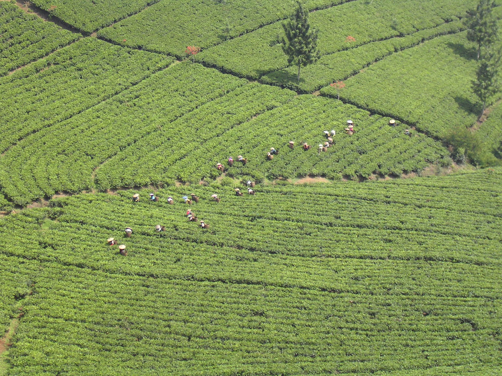
*மலைச்சரிவுகளில் தேயிலை வளர்ப்பு- சாவா, இந்தோனேசியா*

மலைகள், பீடபூமிகள் ஆகியவை முக்கியமான நிலத்தோற்றங்கள் ஆகும். அவற்றுள் சமமான நிலப்பரப்புடன் கூடிய வண்டல் மண் நிறைந்த சமவெளி வேளாண் தொழில் செய்ய மிகவும் ஏற்றதாகும். உலகின் சமவெளிப்பகுதிகள் மிக அதிக அளவில் பயிர் விளைவிக்கும் நிலங்களாகத் திகழ்கின்றன. எடுத்துக்காட்டாக இந்தியாவின் வடஇந்தியச் சமவெளி. இச்சமவெளி வேளாண் தொழில் செய்ய உகந்த நிலப்பரப்பாகும். மலைப்பகுதிகளில் சமப்பரப்புப் பகுதிகள் மிகக் குறைவாக இருப்பதால் வேளாண்தொழில் அங்கு குறைவாகக் காணப்படுகிறது. ஆனால் மலைச் சரிவுகள் காப்பி மற்றும் தேயிலை பயிர்கள் வளர உகந்த இடமாக உள்ளது. இப்பயிர் வளர நீர்வழிந்தோடும், நீர்த்தங்காத மலைச் சரிவு தேவையாக உள்ளது. தமிழர்கள் பல நூற்றாண்டுகளாக வேளாண்தொழிலில் ஈடுபட்டிருந்ததால் இலக்கியத்திலும் வழக்கிலும் நிலங்களின் தன்மை பற்றிய அறிவு உள்ளது. பொதுவாக நிலங்களின் நீர்ப்பிடிப்பைப் பொருத்து நன்செய் நிலம் , புன்செய் நிலம் என வகைப்படுத்துவர்.

## வேளாண்தொழிலை தீர்மானிக்கும் புவியியல் காரணிகள்

### மண்வளம்

தமிழ்நாட்டில் செம்மண் , கரிசல்மண் , வண்டல் மண் , களிமண் போன்ற மண்வகைகள் உள்ளன. [ 101 ] இலங்கையில் வேறுசில மண்வகைகளும் உள்ளன. [ 102 ] பிற நாடுகளில் இவற்றிலிருந்து மாறுபட்ட மண்வகைகளும் உள்ளன. பயிர்கள் வளர மண்வளம் ஒரு முக்கிய காரணியாகும். வெவ்வேறு பயிர் வளர்க்க வெவ்வேறு மண்வகைத் தேவைப்படுகிறது. ஆற்றுப் படுகைகளில் காணப்படும் வண்டல் மண் ஒரு வளமிக்க மண்ணாகும். ஏனெனில், மலையில் இருந்து வடியும் ஆறுகள் தொடர்ந்து ஊட்டச்சத்துக்களைக் கொண்டுவந்து சேர்க்கின்றன. கரிசல் மண் மற்றும் புல்வெளிமண் போன்ற மண்வகைகள் வேளாண்மைக்குப் பரவலாகப் பயன்படும் வளமான மண் வகைகளாகும்.

வெவ்வேறு பகுதிகளில் வாழும் மக்களின் வேளாண்தொழிலின் வகைகளைப் புவியியல் காரணிகளைத் தவிர, சமூக மற்றும் பொருளாதாரக் காரணிகளும் தீர்மானிக்கின்றன.

## வேளாண் தொழிலின் வகைகள்

வேளாண்வகை என்பது ஒருங்கிணைப்புத் தன்மையயும், வேளாண்மையைக் கையாளும் முறையினையும், அங்கு விளையும் பயிரையும் பொறுத்துக் கீழ்க்காணுமாறு குறிப்பிடப்படுகின்றன

- தன்னிறைவு வேளாண்மை
- மாற்றிடவேளான்மை
- தீவிர வேளாண்மை
- வணிகவேளாண்மை
- பரந்த இயந்திரங்கள் பயன்படுத்தப்படும் வேளாண்மை
- கலப்புவேளாண்மை

## வேளாண் தொழிலின் வகைகள்

### தன்னிறைவு வேளாண்மை

இம்முறையில் விவசாயிகள் தங்களுக்கும் தங்கள் குடும்பத்திற்கும் தேவையான அளவு பயிர்களை விளைவிப்பர். தன்னிறைவு வேளாண்மை இரு பிரிவாகப் பிரிக்கப்படுகிறது. அவை எளிய தன்னிறைவு வேளாண்மை மற்றும் தீவிர தன்னிறைவு வேளாண்மை என்பதாகும். எளிய தன்னிறைவு வேளாண்மை முறை மலைவாழ் மக்களுள் சிறிய குழுமங்களால் மேற்கொள்ளப்படும் வேளாண் முறையாகும்.

## வேளாண் தொழிலின் வகைகள்

### மாற்றிட வேளாண்மை

*A typical modern Central American Milpa. The corn stalks have been bent and left to dry with cobs still on, for other crops, such as beans, to be planted. (Note: the வாழைப்பழம் plants in the background are not native, but are now a common part of modern Central American agriculture)*

மாற்றிட வேளாண்மை எனபது இடப்பெயர்வு வேளாண்மை எனவும் அழைக்கப்படுகிறது. விவசாயிகள் தங்களின் ஒரு சிறிய பகுதியில் உள்ள மரங்களை வெட்டி எறிந்துவிட்டு மரங்களை எரித்து அப்பகுதிகளில் திணை வகைகள் மற்றும் கிழங்குகள் போன்ற எளிய பயிர்களை வளர்ப்பர். சில வருடங்களுக்குப் பிறகு அந்த நிலங்களை விட்டுவிட்டு காட்டில் மற்றொரு பகுதியை தேர்ந்தெடுத்து மேற்கூறிய முறையில் விவசாயம் மேற்கொள்வர். பின்னர் இந்த நிலம் காடுகள் மீண்டும் வளர்வதற்கென்று தரிசாக விடப்படும், விவசாயிகள் புதிய நிலத்திற்கு இடம்பெயர்ந்து, பல ஆண்டுகளுக்குப் (10-20) பிறகு திரும்பி வருவார்கள்.
இந்த தரிசு காலகட்டம் மக்கள்தொகை அடர்த்தி அதிகரித்தால் குறுகிவிடுவதோடு ஊட்டச்சத்துக்கள் ( உரங்கள் ) அளிப்பு அல்லது எரு மற்றும் சில கைமுறையான பூச்சிக் கட்டுப்பாட்டை கோருகிறது. 
மாற்றிட வேளாண் தொழில் வெவ்வேறு இடங்களில் வெவ்வேறு பெயர்களுடன் அழைக்கப்படுகிறது. [[பிரேசில்|பிரேசிலில் ரோக்கோ எனவும், மில்பா என மத்திய அமெரிக்காவிலும், சூம், பேவார் மற்றும் போடா என இந்தியாவிலும் அழைக்கப்படுகிறது. [ 103 ]

## வேளாண் தொழிலின் வகைகள்

### தீவிர வேளாண்மை

மக்கள் அடர்த்தி அதிகமாக உள்ள பருவமழை பெறும் ஆசியப்பகுதிகளில் இம்முறை காணப்படுகிறது. நெற்பயிரே அதிகமாக இம்முறையில் விளைவிக்கப்படும் பயிராகும். விளைநிலம் சிறியதாக இருந்தாலும் அவற்றில் விவசாயிகள் தீவர வேளாண் சாகுபடி செய்வர். உரங்கள், அதிக மகசூல் தரும் உயர்ரக விதைகள் ஆகியவற்றைப் பயன்படுத்தியும், குடும்பத்திலுள்ளவர்களையே பெரும்பாலும் வேளாண்மையில் ஈடுபடுத்தியும், விளைநிலத்தை ஒருபோதும் வெற்றாக விடாமலும் தீவிர முறையில் பயிர் விளைப்பர். இதனால் பயிர் மகசூல் அதிகமாக இருக்கும். [ 98 ]

## வேளாண் தொழிலின் வகைகள்

### வணிக வேளாண்மை

இவ்வகை வேளாண்மை பரந்த வேளாண்மை எனப்படுகிறது.இவ்வகையில் பயிர்கள் அதிகளவில் பயிரிடப்படுகின்றன. பயிரிடுவதற்கு இயந்திரங்கள் பயன்படுத்தப்படுகின்றன. கோதுமை இம்முறையில் அதிகம் பயிரிடப்படும் பயிராகும். ஆனால் மகசூல் குறைவாகவே இருக்கும். வட அமெரிக்கா , தென் அமெரிக்கா மற்றும் அர்கெந்தீனா போன்ற பகுதிகளில் இம்முறை வெகுவாகக் காணப்படுகிறது.

## வேளாண் தொழிலின் வகைகள்

### தோட்டப்பயிர்கள்

தோட்டப்பயிர்கள் அயனமண்டலப் பகுதிகளில் பெரிய நிலப்பரப்புகளில் மேற்கொள்ளப்படும் முறையாகும். அதிகம் முதலீடு செய்யப்பட்டு தேயிலை , காப்பி . இரப்பர் போன்ற பயிர்களை மட்டுமே விளைவிப்பதைக் கருத்தாகக் கொண்டு விளைவிக்கும் முறை இதுவாகும். இவ்வகைப் பயிர்கள் தொடர்ந்து பல வருடங்களுக்குப் பயனளிப்பதாக உள்ளது. தோட்டப்பயிர் வேளாண்மை இலங்கை , மலேசியா , இந்தியா , இந்தோனேசியா மற்றும் பல நாடுகளில் காணப்படுகிறது.

## வேளாண் தொழிலின் வகைகள்

### கலப்புப் பண்ணை

கலப்புப்பண்ணை வேளாண் முறை ஒரு சிறந்த வேளாண்முறையாகும். ஏனெனில் இதில் பயிர் விளைவித்தல் மற்றும் கால்நடை வளர்த்தல் ஆகிய இரண்டும் நடைபெறுகிறது. இவ்வகை வேளாண்மை உலகில் பல நாடுகளில் பின்பற்றப்படுகிறது. மேற்கு ஐரோப்பாவில் இத்தகைய கலப்புப் பண்ணைமுறை ஒரு பொதுவான வேளாண்தொழிலாகும். இதை ஒருங்கிணைந்த பண்ணைமுறை என்றும் அழைக்கிறார்கள். இம்முறையில் இயல்பான சூழியற்கூறுகளின் வழியாக வளங்களின் சுழற்சி இயல்பாக நடப்பதால் சிறப்பானதாகக் கருதப்படுகிறது. [ 104 ] தவிர பயிர், பால் , முட்டை , இறைச்சி முதலிய பல தேவைகளை ஒன்றாக நிறைவு செய்கிறது. ஒன்றில் இழப்பு ஏற்படும்போது மற்றொன்றில் ஈடுகட்டும் வாய்ப்பும் மிகுதி.

## பயிர் விளைவிக்கும் முறைகள்

கிடைக்கக்கூடிய மூலவளங்கள் பண்ணையின் புவியியல், காலநிலை, அரசின் கொள்கை, பொருளாதார, சமூக மற்றும் அரசியல் நெருக்கடிகள், பண்ணையாளரின் அடிப்படை மற்றும் கலாச்சாரம் ஆகியவற்றைச் சார்ந்து பயிரிடும் முறைகள் பண்ணைகளுக்கிடையே மாறுபடுகின்றன. [ 105 ] [ 106 ]

விளை நிலத்தில் ஒரே ஒரு பயிர் மட்டும் ஒரு முறை விளைவிக்கப்பட்டால் அது 'ஒருபயிர் விளைவிக்கும் முறை' என அழைக்கப்படுகிறது.இரண்டு அல்லது இரண்டுக்கும் மேற்பட்ட பயிர்களை ஒரே விளைநிலதிதில் ஒரே பருவகாலத்தில் விளைவித்தால் அது 'பல்பயிர் விளைவிக்கும் முறை' என அழைக்கப்படுகிறது. எடுத்துக்காட்டாக கார்வால் இமயமலைப் பகுதியில் ஒரே விளை நிலத்தில் 12க்கும் மேற்பட்ட பல்வேறு விதமான பீன்சு , பருப்பு , திணைவகைகள் ஆகியவை பயிர்செய்யப்பட்டு அப்பயிர்களின் அறுவடை காலகட்டங்களுக்கு ஏற்றவாறு அறுவடை செய்யப்படுகிறது.
வேளாண் பயிர்களை உணவுப்பயிர்கள் எனவும் பணப்பயிர்கள் எனவும் இரு பெரும் பிரிவுகளாகப் பிரிக்கலாம். பணப்பயிர்கள் உணவு போல் நுகரப்படாமல் அவற்றை மேலும் பதப்படுத்தும் வகையில் மூலப் பொருள்களாகப் பயன்படுகின்றன. எடுத்துக்காட்டாக இரப்பர் , சின்கோனா மற்றும் பருத்தி முதலியன. உணவுப் பயிர்கள் தன்னிறைவுப் பயிர்களாகவோ அல்லது வணிகப்பயிர்களாகவோ வளர்க்கப்படுகின்றன.

*நீர்ப்பாசன வசதியற்ற வறண்ட நிலங்களில் மேற்கொள்ளப்படும் வேளாண்மை*

வெப்பமண்டல சூழ்நிலைகளில், இந்த பயிரிடும் முறைகள் அனைத்தும் மேற்கொள்ளப்படுகிறது. துணை வெப்பமண்டல மற்றும் வறண்டநிலச் சூழ்நிலைகளில் விவசாய காலமும் நீடிப்பும் மழைபொழிவினாலும் இது வரம்பிற்குட்படுத்தப்படலாம், அது ஒரு வருடத்தில் 'பல்பயிர் விளைவிக்கும் முறை'யில் பயிர்கள் வளர்வதையோ அல்லது நீர்ப்பாசனம் தேவைப்படுவதையோ அனுமதிக்கலாம் அல்லது இல்லாமலும் செய்யலாம். இந்தச் சூழ்நிலைகள் அனைத்திலும் வருடம் முழுவதிலுமான பயிர்கள் வளர்கின்றன (எ.கா. காப்பி , கோக்கோ) இவ்விடங்களில் வேளாண்காடு வளர்ப்பு போன்ற முறைகளும் மேற்கொள்ளப்படுகின்றன. மிதமான தட்பவெப்பமுள்ள சுற்றுச்சூழல் அமைப்புகள் புல்வெளி அல்லது பிரெய்ரி புல்வெளிகளாக இருக்கின்றபோது, அதிக உற்பத்தித் திறனுள்ள வருடாந்திர பயிரிடும் அமைப்பு முறை சிறப்பாக மேற்கொள்ளப்படுகிறது.

பயிர் சுழற்சி என்பது ஒரே நிலத்தில் வெவ்வேறு பயிர்களை அடுத்தடுத்து பயிரிடும் முறையாகும். ஒரே பயிரை பயிரிடுவதால் களைச் செடிளின் ஆதிக்கம் அதிகமாகும். உழவு முறைகள் களை செடிகள் பரவுதலை இடையூறு செய்து, அவற்றை கட்டுப்படுத்த உதவும். இவ்வாறு பயிர் சுழற்சி களைகள் கட்டுப்பாட்டை எளிமையாக்குகிறது. [ 107 ] ஒரு குறிப்பிட்ட நிலத்தில் ஒரே வகையான பயிர்களை பயிரிடாமல் சுழற்சி முறையில் பயிரிட வேண்டும். இயற்கை வேளாண்மையின் முக்கிய அம்சமான பயிர் சுழற்சி முறை ஆகும். முதல் பருவத்தில் நெல், அடுத்த பருவத்தில் உளுந்து , அதற்கடுத்து பயறுவகைகள் என மாறி மாறி பயிரிடும் பயிர் சுழற்சி முறையினால் மண்ணின் வளம் கூடுகிறது. இவ்வாறு செய்யும்போது நைதரசன் நிலைப்படுத்தல் சீராக நடைபெறும்.

## வேளாண் உற்பத்திப் பொருட்கள்

மனிதனால் பலவிதமான வேளாண்பயிர்கள் பயிரிடப்படுகின்றன. சில உணவுக்காகவும் சில இழைகளுக்காகவும் பயிரிடப்படுகின்றன. தானியங்களே மனிதனது அடிப்படை உணவாகும். மாவுச்சத்து கொண்ட விதைகளையுடைய தானியவகைகள் புல்வகைத் தாவரங்களாகும். நெல் கோதுமை, சோளம் மற்றும் திணைவகைகள் பொதுவாக தானிய வகைகள் ஆகும். விவசாய உற்பத்திப் பொருட்களைப் பொதுவாக உணவுகள் , இழைமங்கள், எரிபொருள், மூலப்பொருட்கள், மருந்துப்பொருட்கள், ஊக்க மருந்துகள், மற்றும் ஒப்பனை வகைப் பொருட்கள் என பலவாறு வகைப்படுத்தலாம். 
தற்காலத்தில் தாவரங்கள் இயற்கை எரிபொருள்கள், இயற்கை மருந்துப்பொருள்கள், [ 108 ] மற்றும் மருந்துகளின் உற்பத்திக்குப் பயன்படுத்தப்படுகின்றன. [ 109 ]

- வேளாண்மையால் உணவு உற்பத்தியாகிறது. அது உணவு தானியங்கள் , காய்கறிகள், பழங்கள் மற்றும் இறைச்சி ஆகியவற்றை உள்ளடக்கும்.
- இழைமங்கள் என்பவை பருத்தி , கம்பளி , சணல் , பட்டு மற்றும் ஆளி ஆகியவற்றை உள்ளடக்கியதாகும்.
- மூலப்பொருட்கள் என்பவை மரத் தடிகள் மற்றும் மூங்கில் ஆகியவற்றை உள்ளடக்கியதாகும். பிற பயன்மிக்க பிசின்கள் போன்ற மூலப்பொருட்களும் தாவரங்களிலிருந்து கிடைக்கின்றன.
- ஊக்கப்பொருட்கள் என்பவை யிலை , சாராயம் , கஞ்சா, அபினி, கோகெய்ன் மற்றும் டிஜிட்டலிஸ் ஆகியவற்றை உள்ளடக்கியிருக்கிறது.
- இயற்கை எரிபொருட்கள் இயற்கையாகக் கிடைக்கும் மீத்தேன் , எத்தனால் மற்றும் பயோடீசல் ஆகியவற்றை உள்ளடக்கியிருக்கிறது.
- வெட்டியெடுக்கப்படும் பூக்கள் , தாவர வளர்ப்பு , மீன் வளர்ப்பு மற்றும் வீட்டு விலங்குகள், விற்பனைக்கான பறவைகள் ஆகியவை அலங்காரப் பொருள்களுள் சிலவாகும்.

உணவு உற்பத்தியைப் பொறுத்தமட்டில், வேளாண்மையால் கிடைக்கும் உணவு, நீர் மேலாண்மை போன்றவை உலகளாவிய பிரச்சினைகளாக உருவாகி, விவாதப் பொருளாகியுள்ளதை உலக வங்கி சுட்டிக்காட்டியுள்ளது.

தானியங்கள், தானியங்கள் போன்ற மணிகள், அவரைகள் (பருப்பு வகைகள்), தீவனம், மற்றும் பழங்கள் காய்கறிகள் உள்ளிட்டவை முக்கிய பயிர் வகைகளாகும். குறிப்பிட்ட பயிர்கள் உலகம் முழுவதிலும் தனித்தன்மை வாய்ந்த வளர் பிரதேசங்களில் சாகுபடி செய்யப்படுகின்றன. ஐக்கிய நாடுகளின் உணவு மற்றும் வேளாண்மை அமைப்பு (FAO) இன் கணக்கீட்டின்படி மில்லியன்கணக்கான மெட்ரிக் டன்களில்.

## தொழில் நுட்பமும் பசுமைப் புரட்சியும்

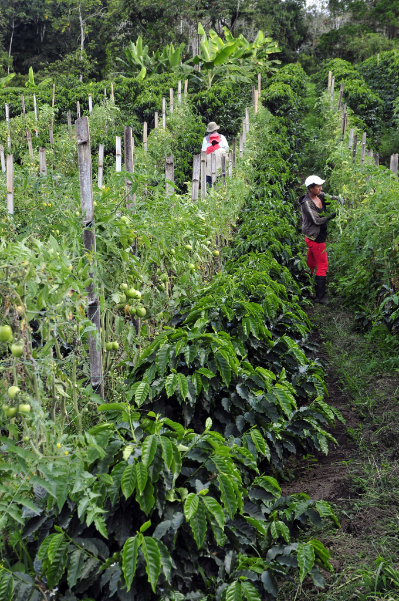
*காப்பித் தோட்டத்தில் ஊடு பயிராக தக்காளி விளைவிக்கப்பட்டுள்ளது*

மனித நாகரீகங்கள் உருவான வரலாற்றில் வேளாண்மை முக்கியப் பங்காற்றியுள்ளது. தொழிற்புரட்சி ஏற்படும்வரை, மனித மக்கள்தொகையின் பெரும்பகுதியினர் விவசாயத்திலேயே ஈடுபட்டிருந்தனர். புதிய வேளாண்மை உத்திகளின் வளர்ச்சி விவசாய உற்பத்தியை படிப்படியாக அதிகரிக்கச் செய்துள்ளது. இந்த உத்திகள் பரவலான முறையில் எங்கும் செல்லத்தொடங்கியதை வேளாண்மைப் புரட்சி எனலாம். 
புதிய தொழில்நுட்பங்களின் விளைவாக கடந்த நூற்றாண்டில் வேளாண் முறைகளில் குறிப்பிடத்தக்க மாற்றம் ஏற்பட்டன. குறிப்பாக, அம்மோனியம் நைட்ரேட்டை மண்ணில் கலக்கின்ற செயற்கை ஊட்டச்சத்தூட்டல் முறையானது, 'சுழற்சி முறையில் பயிர் செய்தல்' மற்றும் 'விலங்குகளின் எரு கொண்டு ஊட்டச்சத்தினை மறுசுழற்சி செய்வது' என்ற பாரம்பரியமான முறையை மதிப்பிழக்கச் செய்துவி்ட்டது.

நவீன வேளாண்மை முறையின் காரணமாக மேற்கொள்ளப்படும் தாவர வளர்ப்பு, பூச்சிக்கொல்லிகள், செயற்கை உரங்கள் மற்றும் தொழில்நுட்பங்கள் ஆகியவை சாகுபடியிலிருந்து கிடைக்கும் வருவாயை அதிகரிக்கச் செய்துள்ளன என்பது உண்மையே. அதே நேரத்தில், பரவலான சுற்றுச்சூழல் மாசுபாடு ஏற்படவும், மனித ஆரோக்கியத்திற்கு பாதகமான விளைவுகள் ஏற்படவும் அவை காரணமாகியுள்ளன.

"தெரிவு வளர்ப்புமுறை" மற்றும் விலங்கு வளர்ப்பில் நவீன முறை ஆகியவற்றைப் பயன்படுத்துவதால் பண்ணைமுறை பன்றிவளர்ப்பு, கோழிவளர்ப்பு , மாடுவளர்ப்பு போன்றவை வளர்ந்து, இறைச்சியின் உற்பத்தி அதிகரித்துள்ளது. ஆனால், இதனால் விலங்குகள் கொடுமைப்படுத்தப்படுகின்றன என்னும் கரிசனை எழுந்துள்ளது. அதோடு, தீவிர இறைச்சி உற்பத்தி முறையில் வழக்கமாகப் பயன்படுகின்ற எதிர் உயிர்மிகளாலும், பயன்படுத்தப்படும் வளர்ச்சி இயக்குநீர்களாலும் பிற வேதிப்பொருள்களாலும் மனித உடல் நலக்கேடு எழும் இடர் குறித்தும் கவலை எழுந்துள்ளது.

20 ஆம் நூற்றாண்டின் முற்பகுதியில் வேளாண்மையில் கலப்பு நைட்ரஜனுடன், வெட்டியெடுக்கப்பட்ட பாறை பாஸ்பேட், பூச்சிக்கொல்லிகளைப் பயன்படுத்துதல் மற்றும் இயந்திரமயமாக்கல் ஆகியவை பயிர் உற்பத்தியைப் பெருமளவில் அதிகரித்தன. தானியங்கள் வழங்கலின் அதிகரிப்பால் கால்நடைகள் மலிவடைவதற்கும் இது வழிவகுத்தது. மேலும், அரிசி , கோதுமை , மற்றும் மக்காச்சோளம் போன்ற தானிய விளைபொருள்களின் உயர் விளைச்சல் வகைகள் பசுமைப் புரட்சியின் ஒரு பகுதியாக அறிமுகப்படுத்தப்பட்டன. இதன் காரணமாக 20 ஆம் நூற்றாண்டு பிற்பாதியில் உலகளாவிய தானிய உற்பத்தி அதிகரித்தது. பசுமைப் புரட்சியானது தொழில்நுட்பங்களை வளர்ந்த நாடுகளிடமிருந்து வளரும் நாடுகளுக்கு அளிக்க வழிசெய்தது.

இந்தியாவில் மக்களின் பஞ்சத்தை போக்க இந்திய வேளாண் ஆராய்ச்சி குழுமம், வேளாண் பல்கலைக்கழகங்கள் ஆகியவை சர்வதேச ஆராய்ச்சி நிறுவனங்களுடன் இணைந்து ஆராய்ச்சி செய்தன, அதன் மூலம் நாம் பயிர் விளைச்சலில் தன்னிறைவு ஏற்பட்டது. ஆனால் பாரம்பரிய முறைகளை கைவிட்டு ரசாயன உரங்களையும், வேதியியல் பூச்சிக்கொல்லிகளையும், களைக்கொல்லிகளையும் மானியம் கிடைக்கிறது என்ற காரணத்திற்காகவும், அதனை பயன்படுத்துவதால் மகசூல் கூடுகிறது என்ற எண்ணத்தினாலும் நவீன கால வேளாண்மையான ரசாயனங்களை மையமாக கொண்ட வேளாண்மை நம்மை நன்கு ஆக்கிரமித்து கொண்டது.

பசுமை புரட்சி பூச்சிக்கொல்லி மற்றும் கலப்பு நைட்ரஜன் போன்றவற்றை வளர்ந்த நாடுகளிடமிறந்து வளரும் நாடுகளுக்கு அளிக்க வழி செய்தது. இதன் விளைவாக வளர்ந்த நாடுகளின் நிறுவனங்கள் வளர்ந்ததே தவிர வளரும் நாடான நம் நாட்டிற்கு எந்த பயனும் இல்லை. ரசாயன உரங்களை பயன்படுத்தியதன் விளைவாக நீரிழிவு , புற்றுநோய் , மலட்டுத்தன்மை , பிறவி ஊனம் , கண் பார்வை குறைவு போன்ற பல நோய்கள் இன்று எங்கும் பரவியதற்கு காரணம் நம் மண்ணில் கலந்துள்ள ரசாயன மற்றும் பூச்சிக்கொல்லி இவற்றின் எச்சங்களால் தான். [ சான்று தேவை ] இப்படி நச்சு தாக்கிய மண்ணில் விளைந்த காய் கறிகளை உண்ணும் பொழுது நம் உடம்பிற்குள்ளும் நச்சு நுழைந்து விடுகிறது. [ 111 ]

“சர்வதேச ஆய்வறிக்கையின்படி மகசூலும் மண் வளமும் நேர்விகிதத்தில் உள்ளது. மண் வளத்தை பொறுத்துதான் மகசூல் உள்ளது. இந்திய மண் வளத்தை ஆராய்ந்த சர்வேதேச ஆய்வுக்குழு மண்ணில் இரும்பு, மாலிப்பிடினத்தை தவிர பிற சத்துக்களான பாஸ்பரஸ், மக்னீஷியம், போரான், துத்தநாகம் போன்றவை குறைவாக உள்ளதாக கூறிக்கின்றது.”வளமான மண் இன்று வளம் குன்றி கலங்கமானதற்கு விவசாயத்தில் ரசாயன பூச்சிக்கொல்லிகளையும் உரங்களையும் பயன்படுத்தியதே காரணம். [ 111 ]

*2005இல் விவசாய உற்பத்தி.*

மக்கள்தொகை வளர்ச்சிக்கு ஏற்றவாறு எதிர்காலத்தில் உணவு உற்பத்தி இராது என்றும், அதனால் பல்லாயிரக்கணக்கானோர் பட்டினியாலும் நோய்களாலும் மடிவர் என்றும் தாமஸ் மால்த்தூஸ் (1766-1834) என்பவர் 1798இல் கூறினார் [ 112 ] . ஆனால் பசுமைப் புரட்சி போன்ற தொழில்நுட்பங்கள் மிகையான உற்பத்தியை இந்த உலகம் பெற வழி செய்திருக்கிறது. [ 113 ]

## வேளாண்மைத் தொழில்நுட்பத்தின் விளைவுகள்

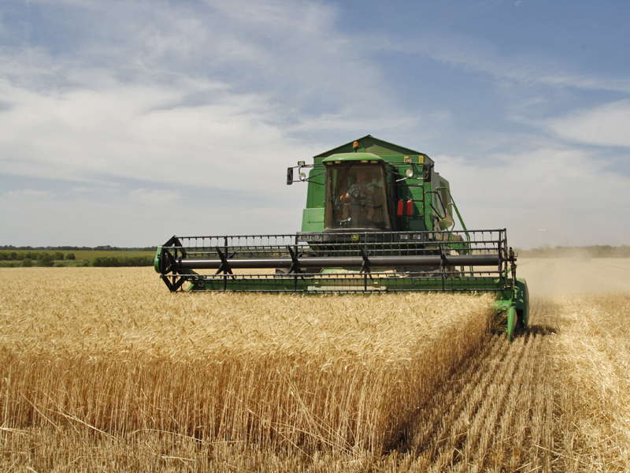
*நவீன அறுவடை இயந்திரம்*

20ஆம் நூற்றாண்டில் வேளாண்மைத் தொழில் மிக்க வளர்ச்சியடைந்தது. செயற்கை உரங்கள், பூச்சிக்கொல்லிகள் போன்றவை அதிகமாகப் பயன்படுத்தப்பட்டன. உணவு உற்பத்தி பன்மடங்கு பெருகியது மேலும் தெரிவு வளர்ப்புமுறை, இயந்திர முறை வேளாண்மை மிகுதியானது. அதோடு விவசாய மானியங்கள் வழங்கப்பட்டன. பண்ணையிடலின் வளர்ச்சியானது ஒருங்கிணைந்த பூச்சி மேலாண்மை மற்றும் தேர்ந்தெடுத்த வளர்ப்பு போன்ற மாற்று தொழில்நுட்பங்கள் குறித்த ஆராய்ச்சியைப் புதுப்பி்த்தது. சமீபத்திய தொழில்நுட்ப வளர்ச்சிகள் மரபணு மாற்றப்பட்ட உணவுப்பொருட்களையும் உள்ளடக்கியுள்ளது.

அரசியல் மற்றும் பொருளாதாரக் காரணங்களுக்காக, பல நாடுகள் வேளாண்மைத் தொழிலுக்கு கணிசமான மானியங்கள் வழங்குகின்றன. இந்த விவசாய மானியங்கள் கோதுமை , மக்காச்சோளம் , அரிசி , சோயாபீன்கள், மற்றும் பால் போன்ற குறிப்பிட்ட பொருட்களை உற்பத்தி செய்ய அளிக்கப்படுகின்றன. வளர்ச்சியடைந்த நாடுகள் இவ்வாறு மானியங்கள் வழங்குவதால் தம் நாட்டு உணவுப்பொருள்களின் விலைவாசி உயராமல் பார்த்துக்கொண்டு, "பாதுகாப்பு வாதத்தை" (protectionism) கடைப்பிடிக்கின்றன என்றும், சுற்றுச்சூழல் மாசடைய வழிவகுக்கின்றன என்றும் குறைகூறப்படுகிறது. [ 114 ] .

ஆனால், 20ஆம் நூற்றாண்டின் தொடக்கத்திலேயே சர் ஆல்பர்ட் ஹாவார்டு போன்றோர் "உயிரி வேளாண்மை" போன்ற இயற்கை இசைவுமுறை வேளாண்மையின் மேன்மையை வலியுறுத்தினர். பூச்சிக்கொல்லிகளையும், செயற்கை உரங்களையும் அதிகப்படியாக பயன்படுத்துவது நிலத்தில் நீண்டகாலச் செழுமையை பாதிக்கும் என்று வாதிட்டனர். அவர்களது இக்கருத்துகளைப் பல ஆண்டுகளாக யாரும் கண்டுகொள்ளவில்லை. ஆனால் 21ஆம் நூற்றாண்டில் சுற்றுச்சூழல் விழிப்புணர்வு வளர்ந்தது. விவசாயிகள், நுகர்வோர், மற்றும் ஆட்சித்துறையினர் பலர் இயற்கையோடு இசைந்த வேளாண்மை முறைக்கு ஆதரவு அளிக்கத் தொடங்கியுள்ளனர். தற்போதைய நில தரமிழப்புப் போக்கு தொடர்ந்ததென்றால் இந்தக் கண்டம் 2025 ஆம் ஆண்டு தனது மக்கள்தொகையில் 25 சதவிகிதத்தினருக்கு மட்டுமே உணவளிக்கக் கூடியதாக இருக்கும் என்று ஆப்பிரிக்கா, ஐக்கிய நாடுகள் பல்கலைக் கழகத்தைச் சேர்ந்த கானா இயற்கை வளங்கள் நிறுவனம் தெரிவித்துள்ளது.

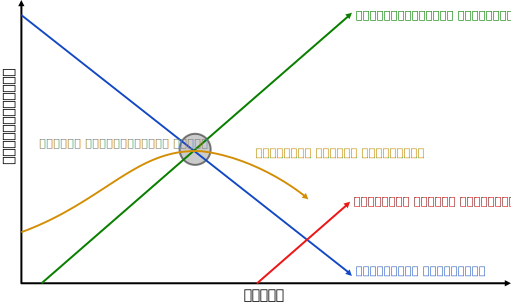
*விவசாயத்தில் பணிபுரியும் மனித மக்கள்தொகை விகிதம் பல ஆண்டுகளாக குறைந்துவிட்டது.*

2007ஆம் ஆண்டில் உலகிலுள்ள தொழிலாளர்களில் மூன்றில் ஒரு பகுதியினர் வேளாண்மையில் ஈடுபட்டிருந்தனர். இருப்பினும், பண்ணையிடல் சார்ந்த முக்கியத்துவமானது தொழில் மயமாக்கல் தொடங்கியதிலிருந்து படிப்படியாகக் குறைந்துவருகிறது. 2003 ஆம் ஆண்டு வரலாற்றிலேயே முதன்முறையாக உலகம் முழுவதிலும் பெரும்பாலானவர்களை வேலைக்கமர்த்தும் பொருளாதாரத் துறையாக இருந்த வேளாண்மையை தொழிற்புரட்சி பின்தள்ளியது [ 115 ] உலக மக்கள்தொகையில் மூன்றில் ஒரு பகுதியினர் வேளாண்மையில் ஈடுபட்டுள்ள போதிலும், விவசாயப் பொருட்களின் உற்பத்தி நிகர உலக உற்பத்தியில் ஐந்து சதவிகிதத்திற்கும் குறைவானதாகவே இருக்கிறது.

கடந்த நூற்றாண்டு, விவசாயத்தை தீவிரப்படுத்துதல், சந்தை மையப்படுத்தல் ஆகியவற்றைக் கண்டதோடு, வேதி உரங்கள் பூச்சிக்கொல்லிகள் , இயந்திரமயமாக்கபடுதல் மற்றும் தாவர வளர்ப்பு கலப்பினங்கள் போன்ற புதிய தொழில்நுட்பத்தில் நம்பிக்கை கொள்ளவும் வகை செய்தது. 
கடந்த பல பத்தாண்டுகளிலும், விவசாயத் திறனிலான நீடிக்கக்கூடிய விவசாயத் திறனை நோக்கிய நகர்வும், சமூக-பொருளாதார நீதி மற்றும் விவசாய அமைப்பிற்குள்ளாக மூலவளங்களையும் சுற்றுச்சூழலையும் பாதுகாத்தல் என்ற கருத்தாக்க ஒருங்கிணைப்பும் நடந்துள்ளன. [ 116 ] [ 117 ] இது, ஆர்கானிக் விவசாயம், நகர்ப்புற விவசாயம், சமூக ஆதரவுள்ள விவசாயம், சுற்றுச்சூழல் அல்லது உயிரியல் விவசாயம், ஒருங்கிணைந்த பண்ணையிடல் மற்றும் ஹாலிஸ்டிக் மேலாண்மை உள்பட பழமைவாத விவசாய அணுகுமுறைக்கான பல பதிலுரைப்புகளுக்கும் வழிவகுத்துள்ளது.

## வேளாண்மை சார்ந்த செயல் முறைகள்

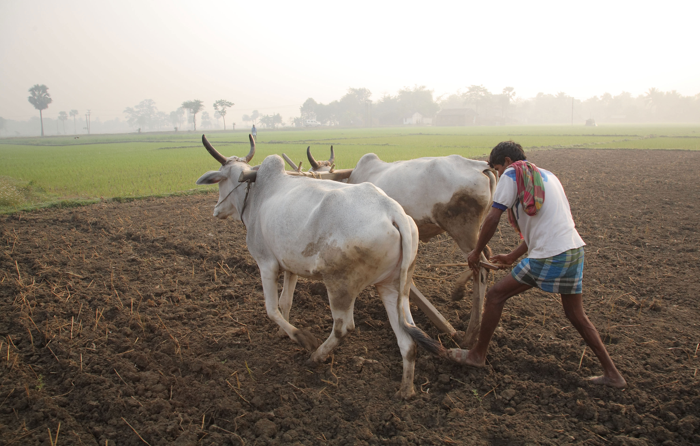
*உழுதல், கொல்கத்தா*

*இந்தோனேசியாவில் நீர் எருது கொண்டு உழப்படும் நெற்பயிர் நிலங்கள்.*

மக்கள் தொகை அதிகரிப்பின் விளைவாக உணவுத் தேவை அதிகரித்துள்ளது. விளைநிலங்களின் பரப்பளவோ நாளுக்கு நாள் குறைந்து கொண்டே வருகிறது. அறிவியல் தொழிற்நுட்பத்தோடு கூடிய புதியவகை அனுகுமுறைகளை அறிமுகப்படுத்த வேண்டிய தேவை இருக்கிறது. விதைப்பதில் தொடங்கி அறுவடை வரை உள்ள அனைத்து வகையான செயல்முறைகளும் வேளாண்மை சார்ந்த செயல்முறைகள் என அழைக்கப்படுகின்றன. பயிர்சாகுபடி என்பது சாகுபடி காலத்தில் விவசாயிகளால் மேற்கொள்ளப்படும் பல செயல்களை உள்ளடக்கியதாகும்

- நிலத்தைத் தயார்செய்தல் மற்றும் விதைதல்
- இயற்கை மற்றும் செயற்கை உரமிடல்
- பலவகையான பாசனமுறைகள்
- களையெடுத்தல்(களைச் செடிகளில் இருந்து பயிர்களைப் பாதுகாத்தல்) களை எடுக்கும் கருவிகள்
- அறுவடை செய்தல்
- சேமித்தல் மற்றும் சந்தைப்படுத்துதல்

ஆகியன.

## வேளாண்மை சார்ந்த செயல் முறைகள்

### நிலத்தைத் தயார்செய்தல்

மண்னைத் தயார் செய்தல் என்பது பயிர் வளர்ப்புக்குத் தேவையான முதன்மையான செயலாகும். அடியில் உள்ள மண்ணின் சத்தை மேலே கொண்டுவரவும், கடினத்தன்மையை நீக்கவும் மண்ணைத் தயார் செய்தல் வேண்டும். இது உழுதல், சமன்படுத்தல் மற்றும் உரமிடல் ஆகிய செயல்களை உள்ளடக்கியதாகும்.

திருக்குறளின் உழவு என்னும் அதிகாரத்தில் வேளாண்மையைப் பற்றிய பல குறிப்புகள் உள்ளன.

உழவன், ஒரு பலம் புழுதி கால் பலமாகும் படி தன் நிலத்தை உழுது காய விட்டால், ஒரு பிடி எருவும் இடாமலேயே அந்நிலத்தில் பயிர் செழித்து வளரும். இக்குறளின் மூலம் உழுதலின் அவசியத்தை புரிந்து கொள்கின்றோம், நன்கு உழுவதன் மூலம் காற்றோட்டம் அதிகமாகிறது. நிலத்தில் உள்ள இலை தழை போன்றவையெல்லாம் மட்கி நல்லதொரு வளத்தை மண்ணிற்கு கொடுகின்றது என அறிகின்றோம். மேலும்

ஏர் விட்டு உழுதலை விட எரு இடுதல் நல்லது, இவ்விரண்டும் செய்து களை எடுத்த பிறகு நீர் பாய்ச்சுவதை விட பயிரை அழியாமல் காப்பது நல்லது” – எனும் குறளின் மூலம் நம் முன்னோர்கள் பயிர்களுக்கு இயற்கை முறையில் எரு போன்ற இயற்கை உரங்களை பயன்படுத்தியதை அறியலாம்.

உழுதல் என்பது கீழ்மண்ணை மேலே கொண்டுவருதலும் அதன் கடினத்தன்மையை நீக்கி மெண்மையாக்குதலும் ஆகும். இதனால் மண்ணானது தாவரத்தின் வேர் சுவாசிக்கத் தேவையான காற்றை அளிக்கின்றது; ஈரப்பதத்தை நீண்ட காலத்திற்கு நிலைக்கச் செய்கிறது; நன்மை செய்யும் நுண்ணுயிரிகளின் வளர்ச்சியினை ஊக்குவிப்பதன் மூலம் வளமான மண்ணை மேலே கொண்டு வரச்செய்கிறது; களைத் தாவரங்களையும் அதன் விதைகளையும் மண்ணிலிருந்து நீக்குகிறது.இதனால் உற்பத்தியை அதிகரிக்கலாம் என்பதோடு மட்டுமல்லாமல், மண்ணரிப்பபை தடுக்கவும், கார்பன் டை ஆக்ஸைடு வெளியிடும் சிதைவைத் தூண்டவும், மண் உயிர்ப்பொருள் பெருகுவதையும் மாறுபடுவதையும் குறைக்கிறது. [ 118 ] [ 119 ]

உழுதல் என்பது இரண்டு முறைகளில் மேற்கொள்ளப்படுகிறது. ஒன்று எருதுகள் மற்றும் ஏர்க்கலப்பைக் கொண்டு உழுதல் என்ற பாரம்பரிய முறை. மற்றொன்று ஏருந்து மூலம் மேற்கொள்ளப்படுகிறது. இது நேரத்தையும் பணத்தையும் மிச்சப்படுத்துகிறது. மேலும் மண்வெட்டி, மண்வாரி, களைக்கொத்தி மற்றும் கோடரி என்பன உழுதல் செயலுக்குப் பயன்படும் பிற கருவிகளாகும்.

## வேளாண்மை சார்ந்த செயல் முறைகள்

### நிலத்தைத் தயார்செய்தல்

#### மண் அல்லது நிலத்தை சமன்படுத்தல்

| Col1 | Col2 | Col3 |
| --- | --- | --- |
| ஏர் உழவு Duration: 57 seconds. 0:57 சோழவந்தான் அருகே நெல்வயலில் உழவுக்குப்பின் மேற்பரப்பை சமன்படுத்தும் காட்சி Wikipedia:Media help | சோழவந்தான் அருகே நெல்வயலில் உழவுக்குப்பின் மேற்பரப்பை சமன்படுத்தும் காட்சி | Wikipedia:Media help |
| சோழவந்தான் அருகே நெல்வயலில் உழவுக்குப்பின் மேற்பரப்பை சமன்படுத்தும் காட்சி | Wikipedia:Media help |  |

உழவு மேற்கொள்ளப்பட்ட நிலத்தில் பெரிய பெரிய மண்கட்டிகள் இருக்க வாய்ப்புகளுண்டு. எனவே சமன்படுத்தியைக் கொண்டு நிலத்தைச் சமன்படுத்துதல் முக்கியமான செயலாகும்.

## வேளாண்மை சார்ந்த செயல் முறைகள்

### நிலத்தைத் தயார்செய்தல்

#### உரமிடல்

சில நேரங்களில் உழுதல் செயலுக்கு முன்பாகவே மண்ணில் உரம் சேர்க்கப்படுகின்றது. ஏனெனில் உழுதலின் போது உரமும் மண்ணும் நன்றாக ஒன்றோடொன்று கலக்க ஏதுவாகிறது.

## வேளாண்மை சார்ந்த செயல் முறைகள்

### விதைத்தல்

பயிர்வளர்ப்பில் மிகவும் முதன்மையான செயல்களில் இதுவும் ஒன்றாகும். மண்ணில் விதையை ஊன்றும் செயலுக்கு விதைத்தல் என்று பெயர். விதைகள் தரமானதாகவும் தொற்ரு நோய்க் கிருமிகள் இல்லாததாகவும் இருக்கவேண்டும். விதைப்பதற்கு முன் நிலத்தை ஈரப்படுத்த வேண்டும். விதைத்தல் இரண்டு முறைகளில் மேற்கொள்ளப்படுகிறது. ஒன்று தூவுதல் என்ற பாரம்பரிய முறையாகும். இம்முறையில் ஈரமான நிலத்தில் விதைகளானது கையினால் தூவப்படுகிறது. மற்றொன்று எந்திரம் மூலம் விதைத்தல் (துளைமுறை). இம்முறையில் விதையானது புனலின் உதவிகொண்டோ அல்லது கூரிய முனைகொண்ட இரண்டு அல்லது மூன்று குழல்களில் உதவியுடனோ விதைக்கப்படுகின்றது.

## வேளாண்மை சார்ந்த செயல் முறைகள்

### இயற்கை மற்றும் செயற்கை உரமிடல்

ஊட்டச்சத்து வடிவில் தாவரங்களின் ஆரோக்கியமான வளர்ச்சிக்காக மண்ணுடன் சேர்க்கப்படும் பொருட்களே இயற்கை அல்லது செயற்கை உரங்கள் ஆகும். எல்லாத் தாவரங்களும் மண்ணிலிருந்து தனது வளர்ச்சிக்குத் தேவையான ஊட்டச்சத்தினைப் பெறுகின்றன. இது தொடர்ந்து மேற்கொள்ளப்படும்போது மண்ணிலுள்ள கனிமங்கள் குறைகின்றன. எனவே விவசாயிகள் தாவர வளர்ச்சிக்குத் தேவையான சரியான ஊட்டச்சத்து கிடைப்பதற்காக மண்ணில் இயற்கை (தழையுரங்கள்) மற்றும் செயற்கை உரங்களை இடுகின்றனர்.
பயிர்களுக்கான ஊட்டச்சத்து அளிப்பு மற்றும் கால்நடை உற்பத்தி உள்ளிட்ட, மற்றும் காலநடைகளால் உற்பத்தி செய்யப்பட்ட எருவை பயன்படுத்தும் முறை ஆகிய இரண்டையும் ஊட்டச்சத்து கட்டுப்பாடு உள்ளடக்கியிருக்கிறது.

ஊட்டச்சத்து அளிப்பு இயற்கை உரங்களாகவோ எரு, பச்சை எரு, கழிவுரம் மற்றும் வெட்டியெடுக்கப்படும் தாதுக்களாகவோ இருக்கலாம். [ 120 ] பயிர் ஊட்டச்சத்தைப் பயன்படுத்துதல் பயிர் சுழற்சிமுறை போன்றபாரம்பரிய உத்திகளைப் பயன்படுத்துவதாகவும் இருக்கலாம். [ 121 ] [ 122 ] உணவுப் பயிர் வளர்கின்ற இடத்தில் கால்நடைகளை வைத்திருப்பதன் மூலமோ, வறண்டதாகவோ ஈரமாகவோ உள்ள பயிர் நிலம் அல்லது மேய்ச்சல் நிலத்தில் கிடைக்கின்ற எருவின் உருவாக்கங்களைப் பரவச்செய்வதன் மூலமோ எரு பயன்படுத்திக்கொள்ளப்படுகிறது.

## வேளாண்மை சார்ந்த செயல் முறைகள்

### நீர் மேலாண்மை

*தமிழகத்தில் பின்பற்றப்படும் ஒரு நீர்ப்பாசனமுறை*

நீர் மேலாண்மை என்பது உலகின் பெரும்பாலான பகுதிகளில் சில கோணங்களில் ஏற்படுகின்ற, மழையளவு பற்றாக்குறையையும் மாறுபாட்டையும் கையாளப் பயன்படுத்தப்படுவதாகும் [ 98 ] . விதைமுளைத்தல், மண்ணிலிருந்து ஊட்டச்சத்தை உறிஞ்சுதல் மற்றும் ஒளிச்சேர்க்கை போன்ற செயல்களைச் செய்ய தாவரங்களுக்கு நீர் இன்றியமையாததாகும். ஒரு குறிப்பிட்ட இடைவெளியில் தாவரங்களின் வளர்ச்சிக்காக நீர்ப்பாய்ச்சும் செயல் நீர் மேலாண்மை எனப்படும். கிணறுகள், ஆழ்துளைக் கிணறுகள், குளங்கள், ஏரிகள், ஆறுக, அணைகள், கால்வாய்கள் போன்றவை நீர்ப்பாய்ச்சுதலுக்குத் தேவையான ஆதார மூலங்களாகும்.
சில விவசாயிகள் பற்றாக்குறையினை நிரப்ப நீர்ப்பாசனத்தைப் பயன்படுத்துகின்றனர்.

## வேளாண்மை சார்ந்த செயல் முறைகள்

### நீர் மேலாண்மை

#### பாரம்பரிய முறை

கப்பிமுறை, சங்கிலி முறை, ஏற்றம் முறை போன்ற முறைகள் பல நூற்றாண்டுகளாக நமது நாட்டில் நீர்ப்பாசனத்திற்காகப் பயன்படுத்தப்பட்டு வரும் முறைகளாகும். இவை மலிவானவை ஆனால் திறன் குறைந்தவை.

## வேளாண்மை சார்ந்த செயல் முறைகள்

### நீர் மேலாண்மை

#### நவீன நீர்ப்பாசன முறை

வயல்களில் பயிர்வரிசைகளுக்கிடையே உள்ள உழவுக்கால் (சால்) வழியாக நீர் பாய்ச்சும் கால்வாய்ப்பசனம் , வயல் முழுதும் நீரைத் தேக்கி வைக்கும் தேக்கு நீர்ப்பாசனம் . ஈரத்தன்மையை நீண்ட நேரம் தக்க வைத்துகொள்ள இயலாத மண்வகைகளுக்கான தெளிப்பு நீர்ப்பாசனம் , மழை நீர் குறைவாகக் கிடைக்கும் காலங்களில் தாவர வேருக்கு மிக அருகில் நீரானது சொட்டு சொட்டாக விடப்படும் சொட்டுநீர்ப்பாசனம் ஆகிய பாசன முறைகள் நவீன காலங்களில் பயன்படுத்தப்படுகின்றன. பொதுவக விளை நிலங்களில் தேங்கும் நீர் தாவரங்களுக்கு ஊறு விளைவிக்கும் என்பதால் நீர்ப்பாய்ச்சுதலில் கவனமுடன் இருக்க வேண்டும்.
உலகம் முழுவதிலும் வேளாண்மைக்காக 6௦ சதவிகித நன்னீர் பயன்படுத்தப்படுகிறது. [ 123 ] ௦

## வேளாண்மை சார்ந்த செயல் முறைகள்

### களைத் தாவரங்களிலிருந்து பயிரினைப் பாதுகாத்தல்

சாகுபடி செய்யப்படும் பயிரினூடாக வளரும் தேவையற்ற புல். அமராந்தசு, காட்டு ஓட்சு முதலிய களைச்செடிகளை விளை நிலத்திலிருந்து நீக்கும் செயலுக்கு களையெடுத்தல் அல்லது களை நீக்குதல் எனப்பெயர். இக்களைகள் அதற்குத் தேவையான நீர் ஊட்டச்சத்துகள், வாழிடம், சூரியஒளி போன்றவைகளுக்காக சாகுபடி செய்யப்படும் பயிர்களுடன் போட்டியிடுகின்றன. எனவே இவற்றை நீக்குகிறார்கள். பொதுவாக களைச்செடிகள் மனிதர்களால் வேருடன் பிடுங்கி எடுக்கப்படுகின்றன அல்லது களைக்கொத்தி, மண்தட்டும்பொறி, பரம்புப் பலகை போன்ற கருவிகள் கொண்டு நீக்கப்படுகின்றன.

உயிர்க்களைக்கொல்லிகள் அல்லது வேதிக்களைக்கொல்லிகள் இதற்காகப் பயன்படுத்தப்படுகின்றன. உயிர்க்களைக் கொல்லிகள் என்பது பூஞ்சை , பாக்டீரியம் போன்ற நுண்ணுயிரிகளைப் பயன்படுத்தி களைத் தாவரங்களை அழித்தலாகும்.பயிர்களைத் தாக்காமல் களைச்செடிகளை மட்டும் குறிப்பிட்டுத் தாக்கி அழிக்கும் வேதிப்பொருட்கள் வேதிக் களைக்கொல்லிகள் எனப்படுகின்றன.எ.கா டாலபேன்,மெட்டாக்ளேர்,2,4-டைகுளோரோபீனாக்ஸி அசிட்டிக் அமிலம் (2-4-D). வேதிக்களைக்கொல்லிகளைப் பயன்படுத்துவது நீர், மற்றும் நிலத்தினை மாசடையச் செய்யும். இவற்றிலுள்ள சில நச்சுத்தன்மை வாய்ந்த வேதிப்பொருட்கள் பயிர்களில் தங்கி விடும் என்பதால், அதனை நாம் கவனத்துடன் கையாள்வது அவசியமாகும். மேலும் இவற்றைத் தாவரங்களில் தெளிக்கும் மனிதர்களுக்கு அவை தீங்கினை விளைவிக்கும் என்பதால் முகக்கவசம் அணிய அறிவுறுத்தப்படுகின்றனர்.

தோட்டக்கலை பயிர்களுக்கு களை கட்டுப்படுத்த வேண்டிய தருணங்கள் :

| பயிர் | களை கட்டுபடுத்த வேண்டிய தருணம் |
| --- | --- |
| ஆப்பிள் | மே மற்றும் ஜீன் |
| முட்டை கோஸ் | பயிரிட்ட 3 வாரங்களுக்கு பிறகு |
| கேரட் | முளைத்த 3-6 வாரங்களுக்கு பிறகு |
| வெள்ளரி | விதைத்த 4 வாரங்களுக்கு பிறகு |
| லெட்யூஸ் | பயிரிட்ட 3 வாரங்களுக்குப் பிறகு |
| வெங்காயம் | முழுவதுமாக |
| உருளை | பயிரிட்ட 4 வாரங்களுக்கு பிறகு |
| ஸ்டிராபெர்ரி | மே மற்றும் ஜீன் |
| தக்காளி (நாற்று) | நடவு செய்த 36 நாட்களுக்கு பிறகு |
| தக்காளி (விதை) | விதைத்த 9 வாரங்களுக்கு பிறகு |

## வேளாண்மை சார்ந்த செயல் முறைகள்

### விற்பனை மற்றும் சந்தையிடல்

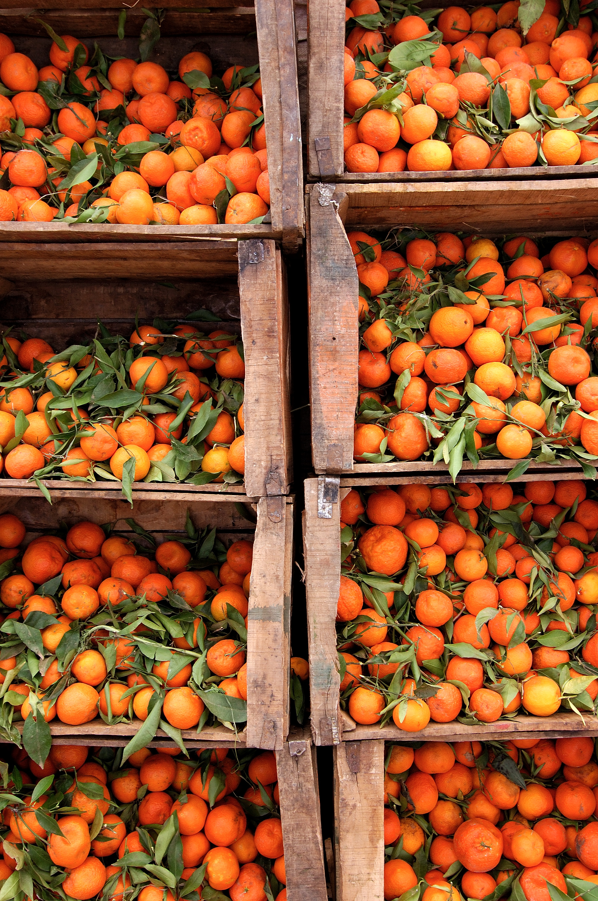
*விற்பனைக்கு வைக்கப்பட்டுள்ள ஆரஞ்சுப்பழங்கள்*

அதிகப்படியான விளைச்சல் மட்டுமே ஒரு விவசாயிக்கு மகிழ்ச்சி அளிப்பதில்லை. விளைந்த பொருள் நல்ல விலைக்கு விற்கப்பட வேண்டும். சேமிப்பு மற்றும் சந்தைப் படுத்துதல் ஆகிய இரண்டும் நல்ல விலைக்கு விலைபொருள் விற்பனை செய்வதை உறுதி செய்கின்றன. விவசாயப் பயிர்ச்செய்கையின் போதும்,விலங்கு வேளாண்மையின் போதும் இலாபகரமான வணிகமாக அதை மேற்கொள்வதற்கு சந்தைப்படுத்தல் அவசியமாகும். சில நாடுகளில் விவசாய விளைபொருட்களை சந்தைப்படுத்தலில் அந்நாட்டு அரசுகளே விவசாயிகளுக்கு உதவுகின்றன. சிறு மற்றும் பெரு விவசாயிகளின் சமூக நிலையை உயர்த்த பல முனையங்களை ஏற்படுத்தி நடவடிக்கைகளை மேற்கொண்டுள்ளன.

முறைப்படுத்தப்பட்ட சந்தை வணிக முறை ஆரோக்கியமற்ற சந்தைப்படுத்துதலைத் தடுப்பதுடன், இடைத்தரகர் மூலம் ஏற்படும் சுரண்டலையும் தடுக்கின்றது. இந்தியாவில் விவசாயிகளுக்காக மிகக் குறைந்த வட்டி விகிதத்துடன் கூடிய கடன் வங்கியின் மூலம் விவசாயிகளுக்கு வழங்கப்படுகிறது.தமிழகத்தில் 'உழவர் சந்தை' என்னும் அமைப்பு சிறுவிவசாயிகள் மற்றும் நுகர்வோரின் தேவையை நிறைவேற்றி வருகின்றன.அக்மார்க் தரக்கட்டுப்பாடு என்னும் அரசு சார் திட்டம் விவசாய விளைபொருள்களின் தரம் பிரிக்கவும் மேலும் தரப்படுத்தவும் உதவுகிறது. தரமதிப்பானது தரம் 1,2,3,4 அல்லது சிறப்பு, நல்ல, சுமார் மற்றும் சாதாரணம் என்ற முறையில் வழங்கப்படுகிறது.

## வேளாண்மையில் உயிரிதொழில்நுட்பங்கள்

*டிராக்டரும் சேஸர் பின்னும்.*

உயிர் தொழில்நுட்பவியலானது வேளாண்மை சார்ந்த ஆராய்ச்சியில் புரட்சியை ஏற்படுத்தி உள்ளது. தாவர மேம்பாடானது பின்வரும் ஏழு மாறுபட்ட தொழில் நுட்பங்களை உள்ளடக்கியதாகும்.

- தேர்வு செய்தல்
- கலப்பினமாக்குதல்
- பன்மயப் பயிர்ப் பெருக்கம்
- திடீர் மாற்றப்பெருக்கம்
- புரோட்டோபிளசு இணைவு
- திசு வளர்ப்பு
- மரபணுப் பொறியியல்

ஆகியனவாகும் 
நாகரீகம் தொடங்கிய காலத்திலிருந்து பயிர் மாற்று என்பது மனிதகுலத்தால் ஆயிரக்கணக்கான வருடங்களாக செய்யப்பட்டுவருகிறது.வளர்ப்பு முறைகள் மூலம் பயிர்களை மாற்றுவது பயிர் மாற்று எனப்படும். அது மனிதர்களுக்கு அதிக பயன்தரக்கூடிய முறையில் பயிர்களை மேம்படுத்துகின்றது; மேலும், தாவரத்தின் மரபு வடிவத்தை மாற்றுகிறது. பெரிய பழங்கள் அல்லது விதைகள், வறட்சியைத் தாக்குபிடிப்பது, அல்லது பூச்சிகளை எதிர்ப்பது போன்றவற்றை இதற்கு உதாரணமாகத் தெரிவிக்கலாம். பயிர் வளர்ப்பு முறையிலான குறிப்பிடத்தக்க முன்னேற்றங்கள் மரபணுவியலாளர் கிரிகோர் மெண்டலின் கண்டுபிடிப்புகளின் விளைவாக உருவாயின. பயிர் வளர்ப்பு என்பது, விரும்பத்தகுந்த தன்மைகளைக் கொண்டு தாவரத்தை தேர்ந்தெடுத்தல், சுய-உரமிடல் மற்றும் குறுக்கு-உரமிடல், மற்றும் உயிர்மாறுபாட்டை மரபணுரீதியில் மேம்படுத்தக்கூடிய மூலக்கூறு உத்திகள் ஆகியவற்றை உள்ளடக்கியுள்ளது. [ 124 ] இதனால் அறுவடை எளிமையானதோடு பயிர் தாவரங்களின் சுவை மற்றும் ஊட்டச்சத்து மதிப்பையும் மேம்படுத்தியிடுக்கிறது.

## மரபணுப் பொறியியல்

அறிவியலில் ஏற்பட்டுள்ள பிரம்மாண்டமான வளர்ச்சியின் முக்கிய மைல்கல்லாக மரபணு தொழில் நுட்பம் கண்டுபிடிக்கப்பட்டது. இது மரபணுத் தொழில் நுட்பம் என்றும் மரபணுப் பொறியியல் என்றும், உயிரியல் தொழில்நுட்பம் என்றும் பல்வேறு பெயர்களால் அழைக்கப்படுகிறது. பன்னாட்டு நிறுவனங்களின் கட்டுப்பாட்டிலும் ஆதரவிலும் இலாப நோக்கத்திற்காக இப்படிப்பட்ட விபரீதமான ஆராய்ச்சிகள் மேற்கொள்ளப்பட்டு காய்கறிகளிலும் தாவரங்களிலும் விலங்குகளிலும் மரபணு மாற்றங்கள் செய்யப்பட்டு அவை மக்களின் பயன்பாட்டிற்காக சந்தையில் விடப்பட்டுள்ளன. முதலில் மரபணுத் தொழில் நுட்பம் மிக முன்னேறிய தொழில் நுட்பம் என்றும் மனிதனுக்கு கிடைத்துள்ள பெரும் பேறு என்றும் கூறப்படுகிறது. ஆனால் உயிர் வாழும் உரிமைக்கும் இயற்கைக்கும் எதிரானதாக மரபணுத் தொழில்நுட்பம் பயன் படுத்தப்படுகிறது. [ 125 ] டி.என்.ஏ விலுள்ள ஒரு மரபுக்கூற்றைத் தனியே பிரித்தெடுத்து அதே இனத்திலோ அல்லது மற்றொரு இனத்திலுள்ள மரபுக்கூற்றில் பொருத்திப் புதியதொரு மாற்று மரபு கொண்ட உயிரினத்தை உருவாக்குவதாகும். மரபணுப் பொறியியலின் மூலம் நாம் விரும்புகின்ற உயிரினத்தையோ தாவரத்தையோ உருவாக்க முடியும். அதே போல நாம் விரும்பாத பண்பை நீக்கி விட்டு ஒரு உயிரினத்தை உருவாக்கிட முடியும்.

*இலந்தை அம்மை நோய் எதிர்ப்புசக்தி கொண்ட மரபணு மாற்றம் செய்யப்பட்ட சீனி இலந்தைப் பழம்(Plum)*

## கால்நடை உற்பத்தி

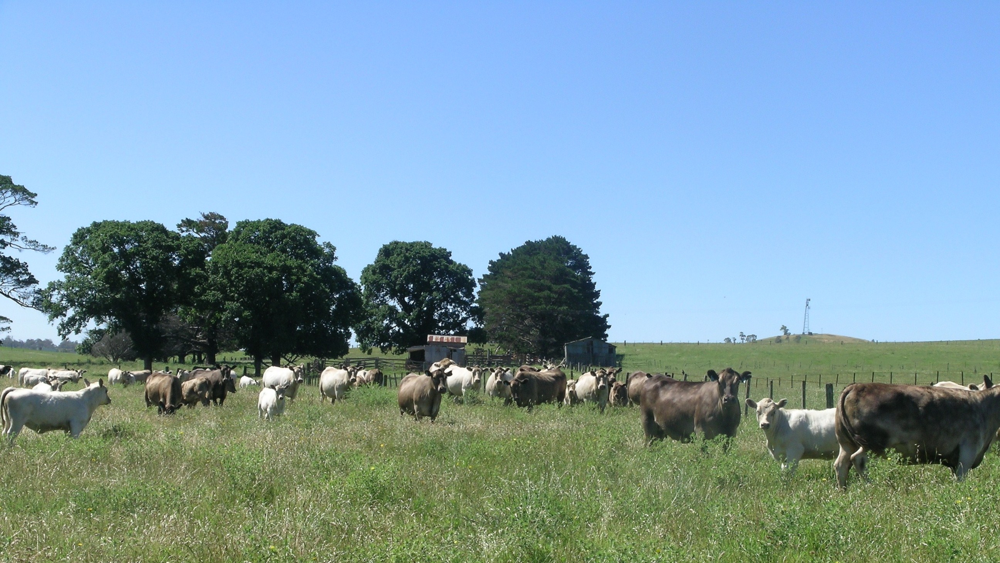
*முர்ரே இன மாடுகள்*

விலங்குகளும் அவற்றிலிருந்து பெறப்படும் விளை பொருள்களும் மனிதனுக்குப் பல வகைகளில் உதவுகின்றன. மாடுகள் , குதிரைகள் , கோவேறு கழுதைகள், ஆடுகள் , ஒட்டகங்கள் , செம்மறி ஆடுகள், மற்றும் நாய்கள் உள்ளிட்ட விலங்குகள் வேளான் நிலங்களில் உழுது சாகுபடி செய்யவும், பயிர்களை அறுவடை செய்யவும், மற்ற விலங்குகளை மேய்க்கவும், மற்றும் சந்தைகளில் பண்ணை உற்பத்திப் பொருட்களை கொண்டு செல்லவும் உதவும் வகையில் பயன்படுத்தப்படுகின்றன.

விலங்கு மேலாண்மை என்பது வளர்ப்பு என்பதை மட்டுமல்லாமல் இறைச்சிக்காக விலங்குகளை வளர்த்தல் அல்லது விலங்குசார்ந்த உற்பத்திப் பொருட்களை ( பால் , முட்டை , கம்பளி, பட்டு, தேன், இறைச்சி, தோல், அரக்கு போன்றவற்றைப் பெறுவதற்கும் தொடர்ந்து வளர்த்து வருவதையும் குறிப்பக்கும். வளர்ப்பு என்பது உயிரினங்களை பராமரித்தல் போன்ற வேலைக்கும் தோழமைக்கு வளர்க்கப்படுவதையும் குறிக்கிறது. தேனீ வளர்ப்பு, கோழி வளர்ப்பு, பட்டுப்புழு வளர்ப்பு, மீன்வளர்ப்பு, கம்பளி ஆடுகள் வளர்ப்பு போன்றவையும் இவ்வாறே.

விலங்குகளின் உபயோகத்தைப் பொறுத்து அவை மூன்று வகையாகப் பிரிக்கப்படுகின்றன. அவை

- உணவு தரும் விலங்குகள்
- உரோமம் தரும் விலங்குகள்
- இழுவை விலங்குகள்

## கால்நடை உற்பத்தி

### கால்நடை வளர்ப்பு குறித்த சிக்கல்கள்

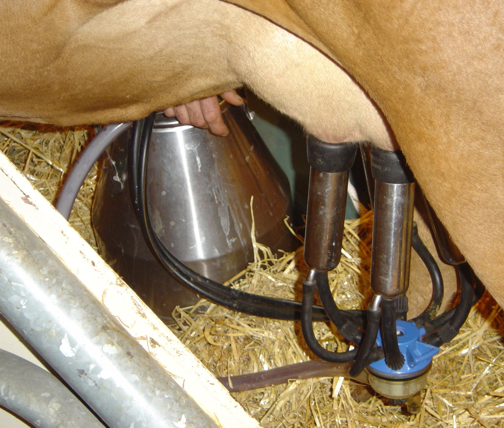
*நவீன பால் கறக்கும் இயந்திரம்- பசு மாட்டின் மடியிலிருந்து பால் உறிஞ்சப்படுகிறது*

இந்த அமைப்பு குறிப்பாக 30-40 மில்லியன் மேய்ப்பர்கள் உள்ள வெப்பநிலை அல்லது மண்ணின் காரணமாக பயிர் உற்பத்தி சாத்தியமாகாத பகுதிகளில் முக்கியத்துவம் வாய்ந்ததாகிறது. [ 98 ] கலப்பு உற்பத்தி முறைகள் புல்வெளி, தீவன பயிர்கள் மற்றும் அசைபோடும் விலங்குகள் முக்கியமாக கோழிகளும் பன்றிகளும் கால்நடைகளுக்கு தீனியிடும் தானியப் பயிர்களை பயன்படுத்துகிறது. எருவானது பயிர்களுக்கான கலப்பு அமைப்புகளில் வகை மாதிரியாக மறுசுழற்சி செய்யப்படுகிறது. ஏறத்தாழ 68 சதவிகித விவசாய நிலம் காலநடை உற்பத்தியில் நிலையான மேய்ச்சல் நிலமாக உள்ளன. [ 126 ] நிலமற்ற அமைப்புகள், பண்ணைக்கு வெளியிலிருந்து வரும் உணவு முறையை நம்பியிருக்கிறது, இது பயிர்களுடன் தொடர்பற்றிருப்பதைக் குறிக்கிறது, அத்துடன் கால்நடை உற்பத்தி பொருளாதாரக் கூட்டுறவு மற்றும் வளர்ச்சிக்கன அமைப்பு (Organisation for Economic Co-operation and Development (OECD)) உறுப்பு நாடுகளில் [ 127 ] மிகச்சாதாரணமாக காணப்படுகிறது. அமெரிக்காவில் 70 சதவிகித தானியம் வளர்ப்பு விலங்குகளுக்கு உணவாக அளிக்கப்படுகிறது. [ 98 ]

## நவீன உலகளாவிய விவசாயத்திலுள்ள மாறுபாடுகள்

*விவசாயத் தொழிலாளர்கள்-தமிழ்நாடு*

ஒரு நாட்டின் பொருளாதார முன்னேற்றத்தில் உள்ள மாற்றங்கள், மக்கள்தொகை அடர்த்தி மற்றும் கலாச்சாரம், அரசின் வேளாண்மைக் கொள்கைகள் ஆகியவை உலக அளவில் விவசாயத்தில் மிகவும் மாறுபட்ட சூழ்நிலைகத் தோற்றுவிக்கின்றன. 2007 ஆம் ஆண்டின்படி உலகிலுள்ள தொழிலாளர்களில் மூன்றில் ஒரு பகுதியினர் விவசாயத்தில் ஈடுபட்டிருக்கின்றனர்.

ஒரு அமெரிக்க பருத்தி விவசாயியால் நடப்பட்ட ஒரு ஏக்கருக்கு 230 அமெரிக்க டாலர்களை [ 128 ] அரசிடமிருந்து மானியமாகப் பெற முடியும், ஆனால் மாலியிலும் மற்ற மூன்றாம் உலக நாடுகளிலும் உள்ள விவசாயிகள் இது இல்லாமலே விவசாயம் செய்கின்றனர். விலைகள் வீழ்ச்சியடையும்போது, அதிக அளவில் மானியம் பெற்ற அமெரிக்க விவசாயி தனது உற்பத்தியைக் குறைத்துக்கொள்ளும்படி நெருக்கடிக்கு ஆளாவதில்லை, இதனால் பருத்தி விலைகள் குறைவதில் பிரச்சினையில்லை, அதேநேரத்தில் அவரது போட்டியாளரான மாலி ஏழையாகிறார்.

தென் கொரியாவிலுள்ள ஒரு கால்நடை விவசாயி ஒரு கன்றை உருவாக்குவதற்கு அமெரிக்காவின் விற்பனை விலையான(அதிக மானியமளிக்கப்பட்ட) 1300 அமெரிக்க டாலர்களைக் கொண்டு கணக்கிடலாம். [ 129 ] தென் அமெரிக்க மெர்குசர் நாட்டு கால்நடை வளர்ப்பாளர் கன்றின் விலையை விற்பனை விலையான 120–200 அமெரிக்க டாலர்களைக் கொண்டு கணக்கிடுகிறார் (இரண்டும் 2008 ஆம் ஆண்டு எண்ணிக்கைகள்). [ 130 ]

முன்னவரிடம், தட்டுப்பாடும் நிலத்தின் உயர் விலையும் பொதுமக்கள் மானியங்களைக் கொண்டு இழப்பீடு அளிக்கப்படுகிறது, பின்னவரிடம் பொருளாதார அளவீட்டையும் நிலத்தின் குறைந்த விலையையும் கொண்டு மானியத்திற்கான இழப்பீடு அளிக்கப்படுவதில்லை.

சீன மக்கள் குடியரசில், நாட்டுப்புற வீட்டு உற்பத்தி சொத்து விவசாய நிலத்திற்கு ஒரு ஹெக்டேர் என்ற அளவில் இருக்கலாம். [ 131 ]

உள்ளூர் சட்டமியற்றுவபர்கள் இதுபோன்ற கொள்முதல்களை அனுமதிக்கின்ற பிரேசில், பராகுவே மற்றும் பிற நாடுகளில் சர்வதேச முதலீட்டாளர்கள் ஆயிரக்கணக்கான ஹெக்டேர் விவசாய நிலங்களையோ அல்லது மூலப்பொருள்களையோ ஹெக்டேருக்கு சில நூறு அமெரிக்க டாலர்களிலேயே வாங்கிவிடுகின்றனர். [ 132 ] [ 133 ] [ 134 ]

## விவசாயமும் பெட்ரொ கெமிக்கல்ஸும்

பசுமைப் புரட்சியின் விளைவாக இரசாயன உரங்களைப் பயன்படுத்துதல் மற்றும் இயந்திரங்களைப் பயன்படுத்தும் நவீன தொழில் நுட்பம் காரமணமாக விவசாய நடவடிக்கைகள் துரிதமும் பரவலும் அடைந்துள்ளன.1940 ஆம் ஆண்டுகளில் இருந்து,பெருமளவில் பெட்ரோகெமிக்கலிலிருந்து பெறப்பட்ட பூச்சிக்கொல்லிகள் , உரங்கள் மற்றும் அதிகரித்த இயக்கப்படுத்தல் காரணமாக விவசாயம் தனது உற்பத்தியை சட்டென்று பெரிய அளவில் அதிகரித்தது இதுவே பசுமைப் புரட்சி என்று அழைக்கப்படுகிறது. நவீன அல்லது தொழில்முறை விவசாயம் இரண்டு அடிப்படை முறைகளில் பெட்ரோலியத்தை சார்ந்திருப்பதாக இருக்கிறது:

- சாகுபடி- விதையிலிருந்து அறுவடைக்காக பயிரைப் பெறுவது மற்றும் இரசாயண உரங்கள், பூச்சிக்கொல்லிகள்
- போக்குவரத்து-நுகர்வோரின் குளிர்சாதனப் பெட்டிக்கு பண்ணையிலிருந்து சாகுபடியை எடுத்துச் செல்வது.

இதற்காக வருடத்திற்கு ஒரு குடிமகனுக்கு பண்ணைகளில் சாகுபடிக்கு பயன்படுத்தப்படும் டிராக்டர்கள், அறுவடை இயந்திரங்கள் மற்றும் பிற சாதனங்களுக்கு எரிபொருள் அளிப்பதில் ஏறத்தாழ 400 கேலன்களை பாறை எண்ணெய் செலவாகிறது. அல்லது மொத்த தேரிய ஆற்றல் பயன்பாட்டில் 17 சதவிகிதத்தை இது எடுத்துக்கொள்கிறது. [ 135 ] எண்ணெய் மற்றும் இயற்கை வாயுக்களும் விவசாயத்திற்குப் பயன்படுத்தப்படும் உரங்கள், பூச்சிக்கொல்லிகள் மற்றும் ஹெர்பிஸைடு ஆகியவற்றின் அடிப்படை அம்சங்களாக விளங்குகிறது. உணவானது சந்தையை எட்டும் முன்னர் அதை நிகழ்முறைப்படுத்தத் தேவைப்படும் ஆற்றலையும் பெட்ரோலியம் வழங்குகிறது. 1950 மற்றும் 1984 ஆம் ஆண்டுகளுக்கு இடையேயான பசுமைப் புரட்சி உலகம் முழுவதிலும் விவசாயத்தை மாற்றியபோது, உலக தானிய உற்பத்தி 250 சதவிகிதம் அதிகரித்தது. [ 136 ] [ 137 ] இது கடந்த ஐம்பது ஆண்டுகளில் இருந்ததைக் காட்டிலும் உலக மக்கள்தொகை இரண்டு மடங்கு அதிகரிப்பதற்கு வழிவகுத்தது. இருப்பினும், உணவு உற்பத்தியில் நவீன உத்திகளைப் பயன்படுத்தி அளிக்கப்பட்ட ஒரு மடங்கு ஆற்றலுக்கும் உற்பத்திச் செலவு பத்து மடங்குக்கு மேல் தேவைப்பட்டது, [ 138 ] இருப்பினும் இந்தப் புள்ளிவிவரம் பெட்ரோலிய அடிப்படையிலான விவசாய ஆதரவாளர்களால் எதிர்க்கப்பட்டது. [ 139 ] இந்தப் பெரிய அளவிலான ஆற்றல் அளிப்பு புதைபடிவ எரிவாயு மூலாதாரங்களிலிருந்தே வந்துள்ளன. நவீன விவசாயம் பெட்ரோகெமிக்கல்களையும் இயந்திரமயப்படுத்தலையும் தற்போது நம்பியிருப்பதன் காரணமாக, எண்ணெய் அளிப்பு குறைந்து வருவதாக அறியப்படுகிறது [ 140 ] [ 141 ] [ 142 ] [ 143 ] [ 144 ] )

## எண்ணெய்த் தட்டுப்பாடும் விவசாயமும்

இதனால் இயந்திர மயமாகியுள்ள நவீன தொழில்முறை விவசாய அமைப்பு பெரிய சேதத்திற்கு உள்ளாகலாம் என்பதோடு பெரிய அளவிலான உணவுத் தட்டுப்பாட்டிற்கும் காரணமாகலாம் என்ற எச்சரிக்கைகளும் இருக்கின்றன. [ 145 ] நியூஸிலாந்தின் க்வி, அர்ஜெண்டைனாவின் அஸ்பராகஸ், கௌதமாலாவின் மெலன்கள் மற்றும் ப்ரோகோலி, கலிபோர்னியாவின் ஆர்கானிக் கோசுக்கீரை ஆகிய உணவு வகைகள் நுகர்வோரின் தட்டுக்களுக்கு பயணம் செய்து அடைய மட்டுமே சராசரியாக 1500 மைல்கள் தேவைப்படுகிறது. [ 146 ]

எண்ணெய்த் தட்டுப்பாடு இந்த உணவு வழங்கலி்ல் சிக்கல் ஏற்படுத்தலாம். நுகர்வோரிடம் வளர்ந்துவரும் இந்த ஆபத்து குறித்த விழிப்புணர்வு தற்போது ஆர்கானிக் விவசாயம் மற்றும் பிற நீடிக்கக்கூடிய விவசாய முறைகளில் ஆர்வம்கொள்ள தூண்டியிருக்கும் பல காரணிகளுள் ஒன்றாகும்.

நவீன ஆர்கானிக் விவசாய முறைகளைப் பயன்படுத்தும் சில விவசாயிகள் பழமையான விவசாயத்திலிருந்து (ஆனால் எரிபொருள், செயற்கையான உரங்கள் அல்லது பூச்சிக்கொல்லிகள் இன்றி) கிடைக்கக்கூடிய மகசூலை அதிகரித்துள்ளதாக தெரிவித்துள்ளனர். இருப்பினும், பெட்ரோலியம் அடிப்படையிலான தொழில்நுட்பத்தைப் பயன்படுத்தி சாத்தியமான 'ஒற்றைவளர்ப்பு முறை' விவசாய உத்திகளைப் பயன்படுத்தியபோது இழந்த ஊட்டச்சத்துக்களை மறுசேமிப்பு செய்வதற்கும் மண்ணை புதுப்பிக்கச் செய்யவும் இன்னும் காலமாகும். [ 147 ] [ 148 ] [ 149 ] [ 150 ]

## எண்ணெய்த் தட்டுப்பாடும் விவசாயமும்

### விலையேற்றம்

இதன் காரணமாக சில வேளாண்மை உற்பத்திப் பொருள்கள் அதிகரிக்க ஏதுவாகிறது.இது அண்மையில் கோதுமை விலை 60 சதவிகிதம் உயர்வதற்கு பங்களித்துள்ளது, அத்துடன் "வளரும் நாடுகளில் தீவிர சமூகக் கவலையை" முன்னறிவிக்கும் சாத்தியத்தையும் சுட்டிக்காட்டுகிறது. [ 151 ]

எண்ணெய்த் தட்டுப்பாடு பிரச்சினைகளால் ஏற்பட்ட தொடர் விளைவுகளுள், உணவல்லாத பயன்பாட்டிற்காக சோளம் (மக்காச்சோளம்) போன்ற பயிர்களையும் விவசாயிகள் வளர்ப்பதால் ஏற்பட்ட பிரச்சினைகள் ஓர் உதாரணமாகும். இது ஏற்கனவே உணவு உற்பத்தியைக் குறைத்துவிட்டது. [ 151 ] இந்த உணவு மற்றும் அதற்கு எதிராக உள்ள எண்ணெய் பிரச்சினையானது

2007 ஆம் ஆண்டில் உணவல்லாத உயிர் எரிபொருள் பயிர்களை [ 152 ] வளர்க்க விவசாயிகளுக்கு வழங்கப்பட்ட அதிக மதிப்பூதியம், மற்ற காரணிகளுடன் முந்தைய விவசாய நிலங்கள் மிகையாக அதிகரிப்பது, போக்குவரத்து செலவுகள் அதிகரிப்பது, காலநிலை மாற்றம் , சீனாவிலும் இந்தியாவிலும் அதிகரித்துவரும் நுகர்வோர் தேவை மற்றும் மக்கள்தொகை வளர்ச்சி [ 153 ] போன்றவை இணைந்து ஆசியா, மத்திய கிழக்கு, ஆப்பிரிக்கா, மற்றும் மெக்ஸிகோவில் உணவுப் பற்றாக்குறைக்கு காரணமாகும் என்பதோடு, உலகம் முழுவதிலும் உணவு விலை உயர்வதற்கும் காரணமாகிறது. [ 154 ] [ 155 ]

2007ஆம் ஆண்டு டிசம்பரிலிருந்து 37 நாடுகளில் உணவுப் பிரச்சினைகள் ஏற்பட்டுள்ளன. 20 நாடுகள் சிலவகை உணவு விலை கட்டுப்பாடுகளை விதித்துள்ளன. இந்தப் பற்றாக்குறைகளுள் சில உணவுக் கலவரங்களுக்கும், மரணம் விளைவி்க்கும் மோதல்களுக்கும்கூட வழிவகுத்துள்ளன.

உரம் உற்பத்திக்கு பெட்ரோலிய அளிப்பு பயன்படுத்தப்படுவதன் விளைவாக விவசாயத்தில் மற்றொரு பிரதான பெட்ரோலிய பிரச்சினை ஏற்பட்டுள்ளது. ஹெபர்-போஷ் உரத் தயாரிப்பு நிகழ்முறையில் மண்ணூட்டத்திற்குத் தேவையான நைட்ரஜனைப் பிரித்தெடுப்பதில் ஹைட்ரஜன் மூலாதாரமாக இயற்கை வாயுவைப் பயன்படுத்துது விவசாயத்திற்கான பெரிய புதிய படிவ எரிபொருள் அளிப்பாக பெருமளவில் இருக்கிறது. [ 156 ] தற்போது நைட்ரஜன் மூலாதாரத்திற்கு மலிவானதாக இருப்பதால் இயற்கை எரிவாயு பயன்படுத்தப்படுகிறது. [ 157 ] [ 158 ] எண்ணெய் உற்பத்தி பற்றாக்குறை ஏற்படும்போது இயற்கை எரிவாயு பாதியளவு தற்காலிக பதிலீடாக பயன்படுத்தப்படுவது மற்றும் போக்குவரத்தில் ஹைட்ரஜன் பயன்படுத்தப்படுவது அதிகரிப்பது ஆகியவற்றால் இயற்கை எரிவாயு அளிப்பும் தேவையும் மிகமிக செலவு பிடிக்கக்கூடியதாக ஆகிவிடும்.

புதுப்பிக்கக்கூடிய ஆற்றலைப் பயன்படுத்தி ஹெபர் நிகழ்முறையை வர்த்தகமயமாக்க முடியவில்லை என்றாலோ, ஹெபர் நிகழ்முறையை பதிலீடு செய்ய போக்குவரத்து மற்றும் விவசாயத் தேவைகளை அளிக்க போதுமான அளவில் ஹைட்ரஜன் மூலாதாரம் இல்லை என்றாலோ, இந்தப் பிரதான உர மூலாதாரம் உச்ச அளவில் விலைமிக்கதாகவோ அல்லது கிடைக்காமல் போய்விடக்கூடியதாகவோ ஆகிவிடும்.இது உணவுப் பற்றாக்குறைக்கு காரணமாகலாம் அல்லது உணவு விலைகள் சட்டென்று உயர்ந்துவிடுவதற்கு காரணமாகலாம்.

## அரசும் வேளாண்மை கொள்கையும்

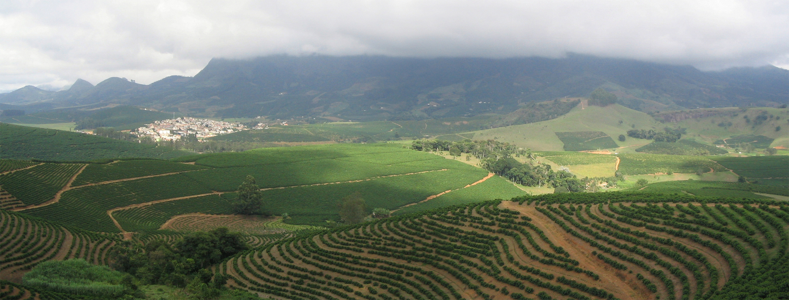
*காப்பி பயிரிடுதல்- மினாஸ் கெராயிஸ் மாகாணம் - பிரேசில்*

விவசாயக் கொள்கை விவசாய உற்பத்தியின் இலக்குகள் மற்றும் முறைகளிலேயே கவனம் செலுத்துகிறது. இத்துடன் வியசாயிகளின் வாழ்க்கை தரம் பொருளாதாரம் ஆகியவையும் கவனத்தில் கொள்ளப்படுகின்றன. கொள்கை மட்டத்தில், விவசாயத்தின் பொதுவான இலக்குகளுள் பின்வருவன அடங்கும்:

- பாதுகாத்தல்
- பொருளாதார நிலைப்புத்தன்மை
- சுற்றுச்சூழல் தாக்கம்
- உணவுத் தரம்: உணவுவளிப்பு சீராகவும் தரம் தெரிந்ததாகவும் இருப்பதை உறுதிசெய்வது.
- உணவு தன்னிறைவு: சனத்தொகை தொடர்பிலான தேவைகள் பூர்த்தி செய்யப்படுவதை உறுதி செய்தல்.
- உணவு பாதுகாப்பு : உணவு அளிப்பு மாசுபாடு இன்றி இருப்பதை உறுதிப்படுத்துவது.
- உணவு பாதுகாத்தல்: உணவு அளிப்பு மக்கள்தொகை தேவைக்கு ஏற்ப இருக்கிறதா என்பதை உறுதிப்படுத்துவது. [ 151 ] [ 159 ]
- நிலச்சீரமைப்பு மற்றும் மேம்பாடு
- சுற்றுச்சூழல் தாக்கம்
- பொருளாதார உறுதிப்பாடு.
- வறுமை குறைப்பு

## வளம் குன்றா வேளாண்மைக்கான கொள்கைகள் - இந்தியா

இந்திய அரசின் கொள்கைகள் பொதுவாக உணவு தானியங்கள் தன்னிறைவு பெறுவதையே வலியுறுத்தும். ஆனால் வேளாண்மையை நிலைபெறச் செய்ய முக்கியத்துவம் தருவதில்லை. 1970 மற்றும் 1980 களில் வேளாண் உற்பத்தி மற்றும் உற்பத்தித் திறன் வளர்ச்சி முக்கியத்துவம் பெறும் வகையில் வளர்ந்து, 1990களில் குறைய ஆரம்பித்தது. இந்த நிலையை 2000 -ம் ஆண்டில் மிகவம் மோசமடைந்தது. ஒட்டுமொத்த வேளாண் உற்பத்தி மற்றும் உணவு தானிய உற்பத்தி 2000-01 லிருந்து 2002-03 வருட காலங்களில் (இந்திய அரசு, 2002) எதிர்மறை வளர்ச்சியை காண்பித்தது. வேளாண் உற்பத்தி மற்றும் உற்பத்தித் திறன் குறைவு என்பது மிக முக்கியமான பிரச்சனையாக மாறியது. அதனால், வளம் குன்றா வேளாண்மை வளர்ச்சிக்கான அணுகுமுறைகள் மிக முக்கியமானது. இந்த ஆய்வு இந்தியாவின் எதிர்கால உணவு தன்னிறைவை பூர்த்தி செய்வது மட்டுமல்லாமல் சர்வதேச சந்தைகளின் விளைவுகளை ஏற்றுக் கொள்வதற்கும் தகுந்த மாதிரி வடிவமைக்கப்பட வேண்டும்.

இதன் முயற்சியாக இந்தியாவில் விவசாயிகளுக்கான தேசிய கொள்கை - 2007 [ 160 ] 2007 உணவுப் பாதுகாப்புத் திட்டம், நீர்வள, நிலவள திட்டம், உழவர் வயல்வெளி பள்ளி, தேசிய வேளாண்மை மேம்பாட்டுத் திட்டம் (NADP), மாவட்ட அளவிலான வேளாண் திட்டம், பாரத் நிர்மாண், தேசிய உணவு தன்னிறைவுத் திட்டம், உழவர்கான தேசிய ஆணைக்குழு, பிரதான் மந்திரி ஆதர்ஷ் கிராம் யோஜ்னா. ஆகிய திட்டங்கள் மத்திய மாநில அரசுகளால் திட்டமிட்டுச் செயல்படுத்தப்பட்டு வருகின்றன. [ 161 ]

*கென்சஸில் மையச்சுழல் தன்மை உள்ள வட்டவடிவ பயிர் நிலங்களின் செயற்கைக்கோள் படம். ஆரோக்கியமான, வளரும் பயிர்கள் பசுமையாக உள்ளன;கோதுமை நிலங்கள் பொன்னிறத்தில் உள்ளன;தரிசு நிலங்கள் பழுப்பு நிறத்தில் உள்ளன.*

## சூழல் பிரச்சினைகள்

- ஆறுகள் மற்றும் ஏரிகளில் மேலதிக நைதரசன் .
- களைக்கொல்லிகள் , பூஞ்சைக்கொல்லிகள், பூச்சிக்கொல்லிகள் , மற்றும் ஏனைய உயிர்க்கொல்லிகள் போன்றவற்றின் தாக்கங்கள்.
- எல்லா வகையான இயற்கை ecosystemகளையும், வேளாண் நிலங்களாக மாற்றுதல். * அரிப்பு
- களைகள் - Feral Plants and Animals

## சூழல் பிரச்சினைகள்

### உயிர் பாதுகாப்பற்ற வேளாண் தொழிலாளர்கள்

அமெரிக்காவில் விவசாயமானது மிகவும் அபாயகரமான தொழில்துறைகளுள் ஒன்றாக மதிப்பிடப்படுகிறது. [ 162 ] விவசாயிகளுக்கு உயிராபத்து விளைவிக்க்கூடிய அல்லது உயிராபத்து இல்லாத காயங்களுக்கும், வேலைசார்ந்த நுரையீரல் நோய்களுக்கும், சத்தத்தால் ஏற்படும் கேட்கும்திறன் இழப்பிற்கும், தோல் நோய்களுக்கும் மற்றும் ரசாயனம் பயன்படுத்துதல், நீண்ட நேரம் சூரிய ஒளியில் இருப்பதால் ஏற்படும் குறிப்பிட்ட புற்றுநோய்களுக்கும் ஆளாகக்கூடிய உயர் அபாயத்தில் இருக்கிறார்கள்.

அமெரிக்காவில் ஒரு சராசரி ஆண்டில் 516 தொழிலாளர்கள் விவசாய வேலை செய்கையில் மடிகின்றனர்.(1992-2005). இந்த மரணங்களில், டிராக்டர்களில் நசுங்கி இறப்பவர்கள் 101 பேர். ஒவ்வொரு நாளும், கிட்டத்தட்ட 243 தொழிலாளர்கள் வேலைநேர காயங்களால் பாதிக்கப்படுகின்றனர், இதில் 5 சதவிகிதம் நிலையான இயலாமைக்கு காரணமாகின்றனர். [ 163 ]

## சூழல் பிரச்சினைகள்

### வேளாண்மையில் இளம் சிறார்கள்

உல்கெங்கும் உள்ள இளம் தொழிலாளர்களுக்கு விவசாயம் மிக அபாயகரமான தொழிலாக இருக்கிறது, அமெரிக்காவில் 1992 மற்றும் 2000 ஆண்டுகளுக்கு இடையே வேலை சார்ந்த இளம் தொழிலாளர்களின் மரணம் 42 சதவிகிதமாக இருக்கிறது. மற்ற தொழிற்துறைகளைப் போல் அல்லாமல், விவசாயத்தில் பலியாகும் பாதி இளைஞர்கள் 15 வயதிற்கும் குறைவானவர்களாக இருக்கின்றனர். [ 164 ] 15–17 வயதுடைய வேளாண் பணி புரியும் இளைஞர்களுக்கு மரணம் விளைவிக்கும், காயத்தால் ஏற்படும் அபாயம் வேறு வேலையிடங்களில் பணிபுரியும் இளைஞர்களைவிட நான்கு மடங்கு அதிகமாக உள்ளது. [ 165 ] விவசாய வேலை இயந்திரம், மிகக் குறைவான இடவசதி, சுமையேற்றும் வேலை மற்றும் கால்நடைகளிடத்தில் வேலை செய்தல் போன்ற பாதுகாப்பு அபாயங்களில் இளம் தொழிலாளர்களை உட்படுத்துபவையாக இருக்கின்றன.

2004 ஆம் ஆண்டு பண்ணைகளிலேயே தங்கியிருக்கும் 20 வயதிற்கும் குறைவான குழந்தைகள் மற்றும் இளம்வயதினரின் எண்ணிக்கை 1.26 மில்லியன் என்று மதிப்பிடப்பட்டுள்ளது, இந்த இளைஞர்களில் 699,000 பேர் பண்ணைகளிலேயே வேலை செய்பவர்கள் ஆவர். பண்ணைகளில் வேலை செய்யும் இளைஞர்கள் போக, 2004 ஆம் ஆண்டில் அமெரிக்காவில் பண்ணைகளில் வேலை செய்வதற்கென்று 337,000 குழந்தைகளும் இளம் வயதினரும் கூடுதலாக வேலைக்கமர்த்தப்பட்டனர். சராசரியாக, 103 குழந்தைகள் ஆண்டுதோறும் பண்ணைகளில் கொல்லப்படுகிறார்கள் 1990-1996). ஏறத்தாழ இந்த சாவுகளில் 40 சதவிகிதம் வேலை சார்ந்தவை. 2004 ஆம் ஆண்டு, பண்ணைகளில் 27600 குழந்தைகளும் இளம் வயதினரும் காயத்திற்கு ஆளானதாக மதிப்பிடப்பட்டுள்ளது; இவற்றில் 8100 காயங்கள் பண்ணை வேலைகளால் ஏற்பட்டவை. [ 163 ]

## சூழல் பிரச்சினைகள்

### விவசாய மையங்கள்

விவசாய முறைகளில் கவனம் செலுத்தப்படும் ஆரோக்கியம் மற்றும் பாதுகாப்பு குறித்த விஷயங்களில் சில அமெரிக்க ஆராய்ச்சி மையங்கள் கவனம் செலுத்தியுள்ளன. இந்தக் குழுக்களில் பெரும்பாலானவையும் தொழில்முறை ஆரோக்கியம் மற்றும் பாதுகாப்பிற்கான தேசிய நிறுவனத்தாலும், அமெரிக்க விவசாயத் துறை அல்லது பிற மாகாண நிறுவனங்களாலும் நிதியளிக்கப்படுபவை.
மையங்கள்:

- விவசாயப் பாதுகாப்பு மற்றும் ஆரோக்கியத்திற்கான பெரிய ஏரிகள் மையம் ,ஓஹியோ மாகாண பல்கலைக்கழகம், ,OH.
- விவசாய ஆரோக்கியம் மற்றும் பாதுகாப்பிற்கான பெரும் சமவெளிகள் மையம் (ஐயோவா மாகாண நகரம், ஐயோவா நகரம், IA)
- விவசாய ஆரோக்கியம் மற்றும் பாதுகாப்பிற்கான உயர் சமவெளிகள் மையம் (கொலராடோ மாகாண பல்கலைக்கழகம், காலின்ஸ், CO)
- விவசாய ஆரோக்கியம் மற்றும் காயம் தடுப்பிற்கான தென்கிழக்கு மையம் (கென்டுகி பல்கலைக்கழகம், லெக்ஸிங்டன், KY)
- விவசாய ஆரோக்கியம், காயம் தடுப்பு மற்றும் கல்விக்கான தென்மேற்கு மையம. (டெக்ஸாஸ் பல்கலைக்கழகம், டைலர், TX)
- விவசாய சுகாதாரம் மற்றும் பாதுகாப்பிற்கான மேற்கு மையம் (கலிபோர்னியா பல்கலைக்கழகம், டேவிஸ், CA)

## இந்தியாவில் வேளாண்மையின் இன்றைய நிலை

முதல் ஐந்தாண்டு திட்டத்தில் விவசாயத்திற்கு வழங்கப்பட்ட முதலீடு 15 சதம். 2002-2007ல் வேளாண்மைக்கு ஒதுக்கீடு செய்தது வெறும் 1.3 சதம். [ 166 ] மேலும் சிறப்பு பொருளாதார மண்டலங்கள் என்ற பெயரில் பன்னாட்டு நிறுவனங்களின் படையெடுப்பு, வயல்வெளிகளில் வீட்டுமனைகள் தோற்றம் பெற்றமை ஆகியவையும் வேளாண்மைக்கான ஒரு சிக்கலாக உள்ளது. முற்காலத்தில் ஆட்சியின் பெரும் வருவாயக நிலவரி இருந்தது. இதனால் விவசாயிகளுக்கும் சமூகத்தில் மரியாதை இருந்தது. இன்றைய இந்தியாவில் ஆட்சியின் வருவாய் வருமான வரி, தொழில் வரி, சுங்க வரி, விற்பனை வரி என்று வேறு தொழில்களிலிருந்து பெறப்படுகிறது.

## இந்தியாவில் வேளாண்மையின் இன்றைய நிலை

### விவசாய விளை நிலங்கள்

இந்தியாவில் இன்றைய தலையாயப் பிரச்சனைகளில் ஒன்று விவசாய விளை நிலங்களின் ஆக்கிரமிப்பு. விஞ்ஞானமும், தொழில் நுட்பமும் வளர்ந்ததால் , இன்று வழி வழியாக விவசாயத் தொழிலையே கண்ணும் கருத்துமாகக் கவனித்து வந்த பல குடும்பங்களின் வாரிசுகள் அதனை விட்டு வேளியே வரத் துணிந்ததோடு அவ் விளை நிலங்கள் இன்று குடியிருப்புகளாகவும், தொழிற்சாலைகளாகவும் உரு மாறிக் கொண்டிருக்கின்றன. மத்திய வேளாண் அமைச்சகத்தின் அறிக்கை ஒன்றின்படி, 2007-08 இருந்து 2010-11 வரையிலான நான்கு ஆண்டுகளில் மட்டும் விவசாய சாகுபடிக்கான நிலப்பரப்பு 7,90,000 ஹெக்டேர் குறைந்திருக்கிறது. [ 167 ] 2007ஆம் ஆண்டில் தேசிய மறுவாழ்வு மற்றும் மறு குடியமர்த்தல் கொள்கை மத்திய அரசால் அறிவிக்கப்பட்டது. இதன்படி மத்திய வேளாண் அமைச்சகம் குறைந்து வரும் வேளாண் நிலப்பரப்பைத் தடுப்பதற்குப் பல வழிமுறைகளை சுட்டிக்காட்டியது.

- முடிந்தவரை விளைநிலங்கள் வேறு உபயோகங்களுக்காக மாற்றப்படுவது தடுக்கப்பட வேண்டும்;
- குறிப்பாக, பலதரப்பட்ட சாகுபடிகளையும் மேற்கொள்ளத்தக்க விதத்தில் பாசன வசதியுடன் கூடிய விளைநிலங்களின் பயன்பாடு மாற்றப்படக்கூடாது;
- பாசன வசதியுடன் கூடிய விளைநிலங்களை அரசேகூடத் தனது சொந்த பயன்பாட்டுக்கு எடுத்துக்கொள்வது தவிர்க்கப்பட வேண்டும் .

விவசாயம் என்பது மாநிலங்களின் நேரடிக் கட்டுப்பாட்டில் உள்ள உரிமை என்பதால், மத்திய அமைச்சு வழிகாட்டத்தான் முடியுமே தவிர, மாநிலங்கள்தான் அதை செயல்படுத்தியாக வேண்டும்.

## இந்தியாவில் வேளாண்மையின் இன்றைய நிலை

### தமிழகத்தின் நிலை

விவசாய நிலங்களின் அளவு 37.05 சதவீதமாக குறைந்துவிட்டது என்ற அபாயகரமான செய்தி தமிழக அரசின் 11வது ஐந்தாண்டு திட்டத்திற்கான அணுகுமுறை அறிக்கையில் வெளியிடப்பட்டுள்ளது. அதில் தமிழக விவசாயத்துறையில் இன்றைய நிலை குறித்து அதிர்ச்சிகரமான தகவல்கள் இடம் பெற்றுள்ளன. 1993, 94ல் 25 சதவீதமாக இருந்த வேளாண்மை உற்பத்தி 2005, 2006ல் 13.03 சதவீதமாக சரிந்துள்ளது. அதே போல் 2001, 02ல் 76.89 லட்சம் டன்னாக இருந்த உணவு தானிய உற்பத்தி 2004, 05ல் 61.40 லட்சம் டன்னாக குறைந்துள்ளது. [ 168 ] தமிழகத்தில் , நெல் சாகுபடிக்கான விவசாய பரப்பளவு, 20,60,000 (2001-02) ஹெக்டேரிலிருந்து, 19,04,000 (2011-12) ஹெக்டேராகக் குறைந்து விட்டிருக்கிறது. தமிழக அரசின் பொருளாதாரம் மற்றும் புள்ளியியல் துறை வெளியிட்டிருக்கும் புள்ளிவிவரப்படி சோளம் சாகுபடிப் பரப்பளவு 3,17,000 ஹெக்டேரிலிருந்து 1,98,000 ஹெக்டேராகவும், கம்பு 1,25,000 ஹெக்டேரிலிருந்து வெறும் 47,000 ஹெக்டேராகவும், கேழ்வரகு 1,25,000 ஹெக்டேரிலிருந்து 63,000 ஹெக்டேராகவும் 2001-02லிருந்து 2011-12 வரையிலான பத்தாண்டுகளில் குறைந்திருக்கிறது. இது தவிர, சிறு தானியங்கள் பயிரிடப்படும் மொத்த சாகுபடிப் பரப்பு, மேலே குறிப்பிட்ட பத்து ஆண்டுகளில் 27,66,000 ஹெக்டேரிலிருந்து 25,42,000 ஹெக்டேராகக் குறைந்துள்ளது. [ 167 ]

## இவற்றையும் பார்க்க

- உழவு
- ஏரெழுபது - வேளாண்மையின் சிறப்பு குறித்து கம்பர் எழுதிய நூல்
- விவசாயத் தகவல் ஊடகம்
- பசுமைப் புரட்சி
- கரிம வேளாண்மை
- தமிழ்நாடு வேளாண்மைப் பல்கலைக்கழகம்

## மேற்கோள்கள்

### புற இணைப்புகள்

- விவசாய தகவல் ஊடகம் - (தமிழில்)
- தமிழ்நாடு அரசு வேளாண் துறை பரணிடப்பட்டது 2007-02-10 at the வந்தவழி இயந்திரம் - (தமிழில்)
- இலங்கை விவசாயத் திணைக்களம் பரணிடப்பட்டது 2007-01-09 at the வந்தவழி இயந்திரம் - (தமிழில்)
- தமிழ்நாடு அரசு கொள்கை அறிவிப்பு - வேளாண் காப்பீட்டு திட்டம் - (தமிழில்)
- சங்க இலக்கியங்களில் தமிழர்களின் மரபுசார் உழவுத்தொழில் - (தமிழில்)
- உலக நாடுகளில் வேளாண்மை
- TN Agriculture Department
- Ontario Agriculture College - Gulph University
- Technology and Infrastructure Emerging Regions பரணிடப்பட்டது 2006-12-28 at the வந்தவழி இயந்திரம்
- தற்போதைய உலகளாவிய உற்பத்தி, சந்தை மற்றும் வர்த்தக அறிக்கைகள்
- Agriculture பரணிடப்பட்டது 2004-02-03 at the வந்தவழி இயந்திரம் ஐக்கிய அமெரிக்க தேசிய அக்கடமிகளில்.
- http://vellamai.blogspot.com/
- விவசாயம் பரணிடப்பட்டது 2009-03-26 at the வந்தவழி இயந்திரம் UCB Libraries GovPubs இல் இருந்து
- விவசாயம் மற்றும் நாட்டுப்புற வளர்ச்சி உலக வங்கியில் இருந்து
- கையெழுத்துப்பிரதி தொகுப்புகள் [ தொடர்பிழந்த இணைப்பு ] சிறப்புத் தொகுப்புகள், தேசிய விவசாய நூலகம்
- விவசாய உற்பத்தியாளர்கள் சர்வதேச கூட்டமைப்பு (IFAP)
- NIOSH விவசாய பக்கம் - பாதுகாப்பு விதிகள், குறிப்புகள், மற்றும் வழிகாட்டல்கள்
- விவசாயம் குறித்த யு.எஸ். உள்துறை ஆணையம் பரணிடப்பட்டது 2012-04-20 at the வந்தவழி இயந்திரம் - விவசாய சொற்களுக்கான அகராதி, திட்டங்கள் மற்றும் விதிகள்
- பிரிட்டன் விவசாயம் பரணிடப்பட்டது 2007-11-11 at the வந்தவழி இயந்திரம்
- விவசாய தயாரிப்புகள் பரணிடப்பட்டது 2010-01-03 at the வந்தவழி இயந்திரம் - விவசாய தயாரிப்புகள் மற்றும் விவசாய தொழிலுக்கான நுழைவாயில்.
- ஐஸன்ஹோவர் பிரஸிடென்ஷியல் நூலகத்திலுள்ள விவசாய தகவல் குறித்த தகவல்கள் அடங்கிய தொகுப்பிற்கான வழிகாட்டி பரணிடப்பட்டது 2011-08-16 at the வந்தவழி இயந்திரம்
- விவசாய அகராதிகளின் தொகுப்பு பரணிடப்பட்டது 2012-04-21 at the வந்தவழி இயந்திரம்
- வேளாண்மையில் மரபணு மாற்றம் தேவையா? பரணிடப்பட்டது 2012-05-22 at the வந்தவழி இயந்திரம்
- தமிழ்நாடு வேளாண்மைப் பல்கலைக் கழக இணைய தளம் பரணிடப்பட்டது 2009-09-25 at the வந்தவழி இயந்திரம்
- விவசாயிகளுக்கான தேசிய கொள்கை - 2007 பரணிடப்பட்டது 2009-09-25 at the வந்தவழி இயந்திரம்
- உண்டி கொடுத்தோர் உயிர் கொடுத்தோரே ! பரணிடப்பட்டது 2014-04-09 at the வந்தவழி இயந்திரம்

---
Source: https://ta.wikipedia.org/wiki/%E0%AE%B5%E0%AF%87%E0%AE%B3%E0%AE%BE%E0%AE%A3%E0%AF%8D%E0%AE%AE%E0%AF%88
