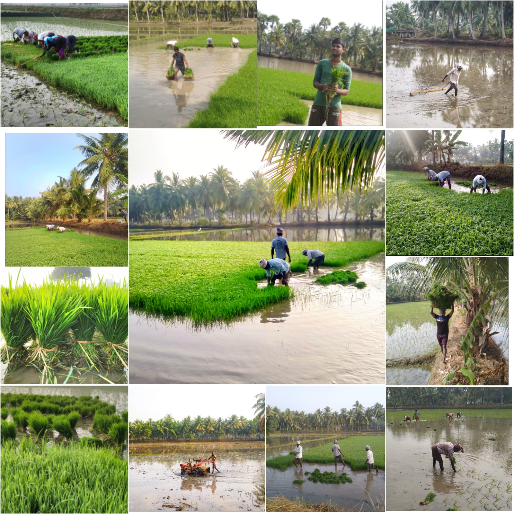
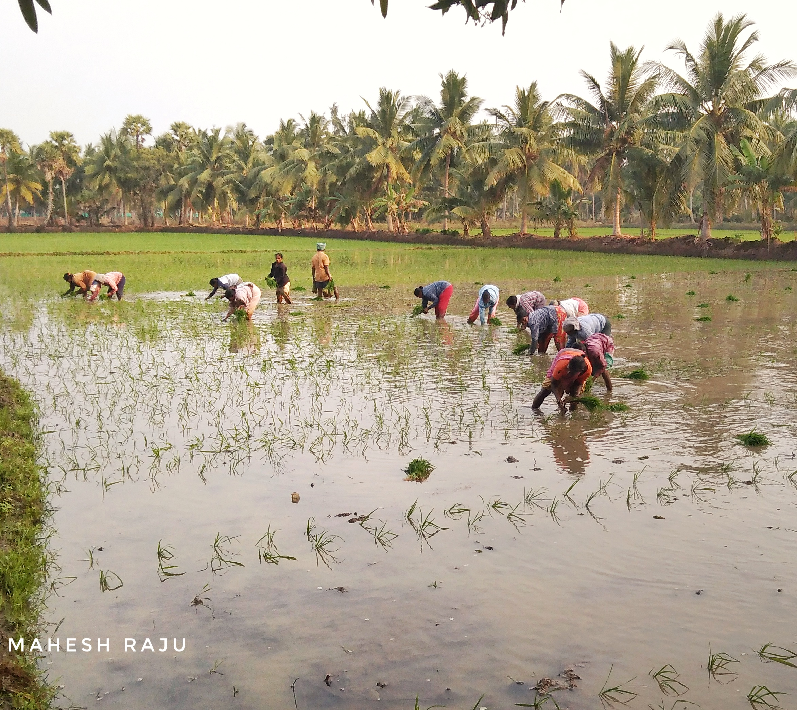
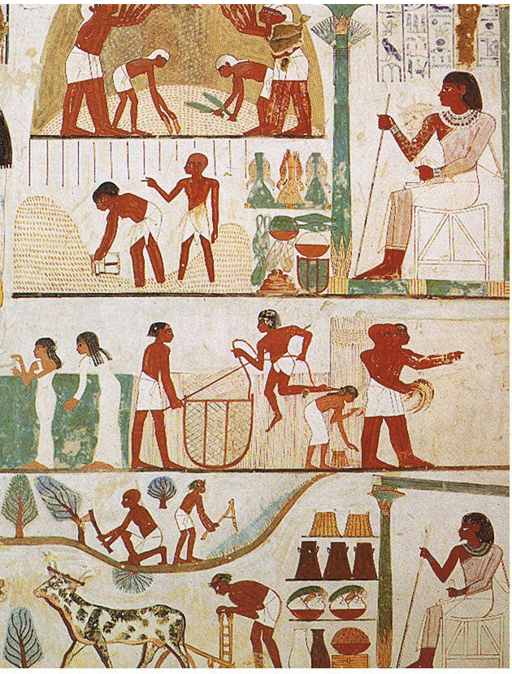
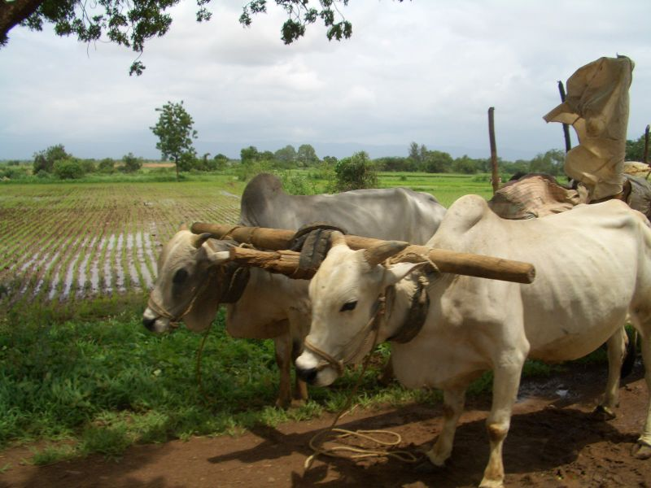
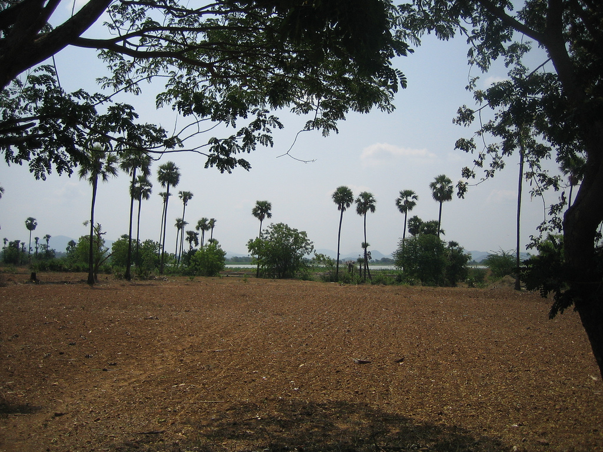
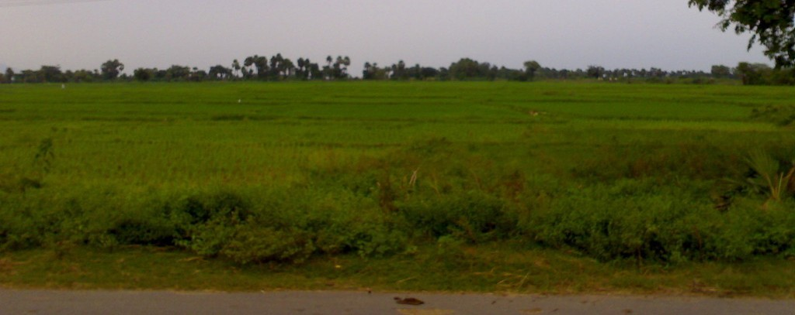
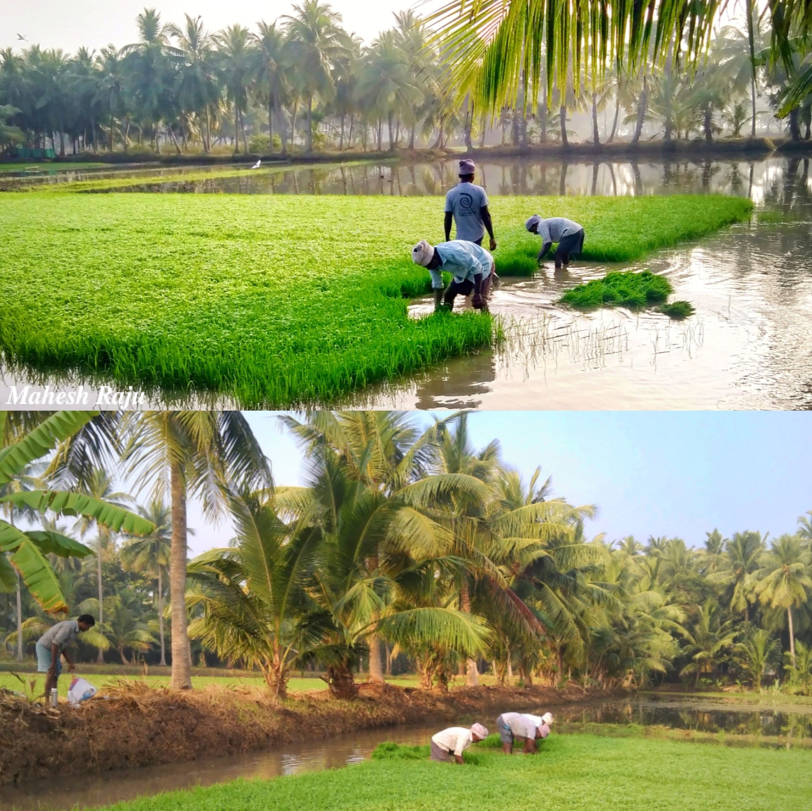
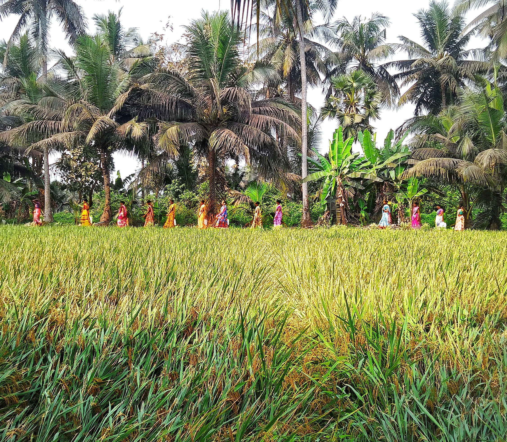
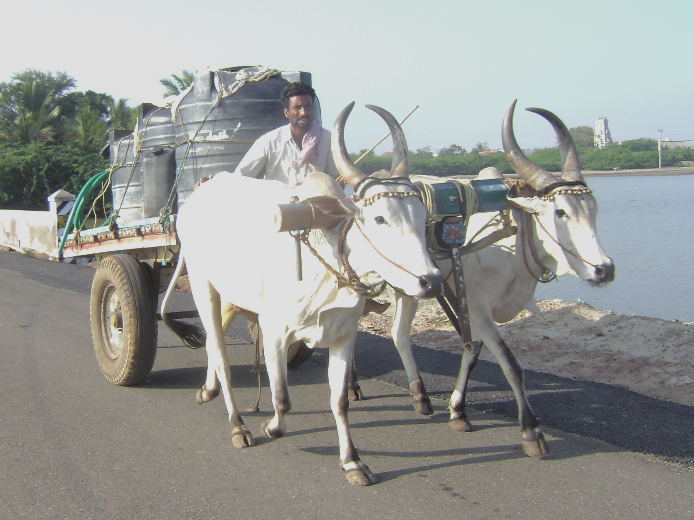

# వ్యవసాయం

*వ్యవసాయానికి సిద్ధం చేస్తున్న పొలంలో చిత్రాలు*

*నారులు నాటుతున్నా చిత్రం*

*వ్యవసాయంలో సాయం చేస్తున్న యెద్దులు, బండికి కట్టబడినవి*

*వ్యవసాయానికి సిద్ధం చేయబడుతున్న పొలం, చిత్రంలో గోదావరి నదిని కూడా చూడవచ్చు*

ఒక నిర్ధిష్టమైన పద్ధతిలో మొక్కలను , జంతువులను పెంచి, పోషించి తద్వారా ఆహారాన్ని , మేత , నార , ఇంధనాన్ని ఉత్పత్తి చేయటాన్ని వ్యవసాయం లేదా కృషి అంటారు. వ్యవసాయం చరిత్ర మానవ చరిత్రలో అతి పెద్ద అంశం. ప్రపంచవ్యాప్త సామాజిక ఆర్థిక ప్రగతిలో వ్యవసాయభివృద్ధి ఒక కీలకాంశం. వేటాడటం ద్వారా ఆహార సముపార్జన చేసుకొనే స్థితిలో ఉన్న సంస్కృతులలో కనిపించని సంపద సమకూర్చుకోవటం,సైనిక కలాపాలవంటి ప్రత్యేకతలు వ్యవసాయం అభివృద్ధి చెందటంతోనే ప్రారంభమయ్యాయి. సమాజంలోని కొందరు రైతులు తమ కుటుంబ ఆహార అవసరాలకు మించి పండిచటం ప్రారంభించడంతో తెగ/జాతి/రాజ్యంలోని మిగిలిన వ్యక్తులకు ఇతర వ్యాపకాలను పోషించే వెసులుబాటునిచ్చింది.

ప్రపంచం లోని శ్రామికులలో 42% మంది వ్యవసాయ రంగములో పనిచేస్తున్నారు అందుచేత వ్యవసాయం, ప్రపంచం లోనే అధిక శాతం ప్రజల వృత్తి . అయితే వ్యవసాయ ఉత్పత్తి ప్రపంచ ఉత్పాదనలో (అన్ని దేశాల సమష్టి ఉత్పాదనల కూడిక) కేవలం 5% మాత్రమే. [ 1 ]

*వరి పొలం*

*వరి పొలం*

## చరిత్ర

ఆదిమ మానవులు మొదటగా జంతువుల మాంసం, దుంపలు, కాయలు, పండ్లు మొదలైన వాటిని ఆహారంగా తీసుకునేవారు. కొంత కాలమైన తర్వాత నెమ్మదిగా వ్యవసాయ పద్ధతులు నేర్చుకుని కొద్ది మొత్తంలో ఆహారాన్ని ఉత్పత్తి చేయడం నేర్చుకున్నారు.ఆధునిక పురాతత్వ శాస్త్రవేత్తల పరిశోధన ప్రకారం పప్పుదినుసులు మొదలైన ఆహార పదార్థాలు, పశుపోషణ మొదలైన వృత్తులు సా.శ. పూ 7000 లోనే మధ్యధరా ప్రాంతానికి చెందిన దేశాల్లో బాగా వ్యాప్తి చెంది ఉండేవి. సా.శ.పూ 3000 నాటికి ఈజిప్షియన్లు, మెసపుటేమియన్లు పెద్ద ఎత్తున వ్యవసాయ పద్ధుతులు, ఎరువుల వాడకం, సాగునీటి పద్ధతులు చేపట్టారు.

## హరిత విప్లవం

భారతదేశంలో వ్యవసాయ ఉత్పాదకత తక్కువగా ఉండటానికి ఒక కారణం వ్యవసాయంలో పురాతన పద్ధతులు పాటించడం. వ్యవసాయంలో యాంత్రీకరణం ప్రవేశపెట్టి ఆహార ధాన్యాల ఉత్పాదకతలను పెంచే నిమిత్తమై మూడో ప్రణాళికా కాలం నుంచే ప్రభుత్వం చర్యలు చేపట్టింది. ఆహార ధాన్యాల ఉత్పత్తిలో స్వయం సంవృద్ధిని సాధించడం ఈ ప్రణాళిక ముఖ్యోద్దేశం.

## భారతదేశంలో వ్యవసాయం

భారతదేశంలో పంట కాలాన్ని మూడు విధాలుగా వర్గీకరించారు. అవి

- ఖరీఫ్ పంట కాలం : జూన్ నెల నుంచి అక్టోబరు వరకు సాగయ్యే పంటలను ఖరీఫ్ పంటలు అంటారు. ఈ కాలంలో పండే ప్రధానమైన పంటలు వరి, జొన్నలు, మొక్క జొన్న, పత్తి,చెరకు, నువ్వులు, సోయాబీన్, వేరు శనగ.
- రబీ పంటకాలం : అక్టోబరు నుంచి మార్చి, ఏప్రిల్ వరకు సాగయ్యే పంటలు - గోధుమ, బార్లీ, మినుములు, ప్రొద్దు తిరుగుడు, ధనియాలు, ఆవాలు మొదలైనవి.
- జైద్ పంటకాలం : మార్చి నుంచి జూన్ వరకు సాగయ్యే పంటలు - పుచ్చకాయలు, దోస కాయలు, కూరగాయలు, మొదలైనవి. రాయలసీమలో పుచ్చకాయలు, దోసకాయలు డిసెంబర్ నుండి మార్చి వరకు సాగుచేస్తారు.
-

## వ్యవసాయ పనులు

*పొలంలో పనులు చేస్తున్న చిత్రం*

*కోనసీమ జిల్లాలో వ్యవసాయ పని కి వెళుతున్న మహిళలు.*

- దుక్కి దున్నడం: పంటపండించే ముందు, సరైన కాలంలో దుక్కి దున్నడం, మొట్టమొదటి సారిగా చేసే వ్వసాయపు సాగు పని. దీనివల్ల అనేక లాభాలున్నాయి. నేలను దున్నడం వల్ల నేల గుల్లబారి, మెత్తగా ఉంటుంది. అటువంటి నేలలోకి నీరు పారిస్తే భూమిలోకి ఇంకి, అన్ని వైపులకూ ప్రవహిస్తుంది. నేల మెత్తగా ఉంటే దాని ఉపరితల వైశాల్యం పెరిగి ఆ నేలలో ఎక్కువ నీటి నిలుపుదలకు సహాయపడుతుంది. ఈ నీటిని మెక్కలు పీల్చుకుంటాయి. దుక్కి దున్నడానికి నాగలిని విరివిగా ఉపయోగిస్తారు.
- భూమిని చదునుచేయడం: పొలంలోని మట్టిగడ్డల వలన నేల ఎగుడుదిగుడుగా ఉంటుంది. దానివల్ల ఆనేలలో విత్తనాలు జల్లడానికి, నారు మొక్కలు వేయడానికి అనువుగా ఉండదు. నేలను చదును చేయడం వల్ల నీరు, పోషక పదార్థాలు సమానంగా సర్దుబాటు అవుతాయి. పొదుపుగా లాభసాటిగా నీరు ఉపయోగించడానికి నేల చదునుగా ఉండాలి.
- పంట ఉత్పత్తి
- ఎరువులు వేయడం:
- నీరు పెట్టడం:
- దమ్ము చేయడం:
- చదునుచేయడం:
- విత్తడం:విత్తనాలు విత్తే ముందు రైతులు ఏ వ్యాధిలేని విత్తనాలు ఎంపిక చేస్తారు. దీనివల్ల పంట దిగుబడి అధికంగా ఉంటుంది.
- నారు నాటడం లేదా ఊడ్చడం:
- దారులు చేయడం:
- కలుపు మొక్కల్ని తొలగించడం: పొలాల్లో సాగు మొక్కలతోపాటు నేల, నీరు, పోషక పదార్థాలు వెలుతురుకూ పోటీ పడుతూ పెరిగే మనకు అవసరం లేని మొక్కల్ని కలుపు మొక్కలు అంటారు.
- నీటి పారుదల: మొక్కల పెరుగుదలకు, పంటల ఉత్పత్తులకూ నీరు చాలా అవసరం.
- ఎరువులు:ఎరువులు మొక్కల పెరుగుదలకు వివిధ రకాల పోషకపదార్థాలు కావాలి. అవి కార్బన్, హైడ్రోజన్, ఆక్సిజన్, నత్రజని, ఫాస్ఫరస్, కాల్షియం, మెగ్నీషియం, ఇనుము, రాగి, మేంగనీస్, జింక్, మాలిబ్డినం, బోరేట్, క్లోరిన మొదలైనవి.

రసాయనిక ఎరువులు కర్మాగారాలలో తయారైన రసాయనాలు సహజ ఎరువులు మొక్కలను విచ్ఛిన్న పరచి సహజ ఎరువులను తయారు చేస్తారు.

- పురుగు మందులు చల్లడం:
- పంట కోయడం:
- కోసిన పంటని ఎండబెట్టడం:
- కట్టలు కట్టడం:
- కుప్ప వేయడం:
- నూర్చడం లేదా ధాన్యాన్ని వేరుచేయడం:
- తూకం, బస్తాలు నింపడం:

వ్యవసాయంలో వనరుల సదుపయోగం లక్ష్యంగా ఖచ్చితత్వ వ్యవసాయ పద్ధతులు అభివృద్ధి చెందాయి. ఈ పద్ధతుల ద్వారా నీరు, ఎరువులు, పురుగు మందులను సరైన సమయంలో సరైన మోతాదులో పంటకు అందించడం వీలౌతుంది. తద్వారా వనరులు వృధా కాకుండా ఉండడమే కాకుండా పర్యావరణంపై ప్రభావం తగ్గుతుంది.

## వ్యవసాయ పనిముట్లు

*ఎద్దుల బండి*

- నాగలి
- గొడ్డలి
- కొడవలి
- పలుగు
- పాఱ
- ఏతము
- ఎద్దుల బండి
- ట్రాక్టర్

వ్యవసాయ పనిముట్లు చాలా ఉన్నాయి.

- గుంటక
- గొర్రు

నీటిని పైకి తోడి పంటలకు పారించే విధానం లో:

- కపిలి
- గూడ
- ఏతం

(ఇవి గతంలో విరివిగా వాడకంలో వుండేవి, ఇప్పుడు తక్కువ వాడుచున్నారు)

చేతి పనిముట్లు

- తొలిక
- కొడవలి
- కత్తి
- గుద్దలి
- కొంకి
- పిక్కాసు

చెరుకు నుండి రసం తీయడానికి వాడే యంత్రం,

గానుగ గింజల నుండి నూనె తీయడానికి వాడే యంత్రం,

గానుగ గింజల నుండి పప్పులను పిండి చేయడానికి వాడే యంత్రం,

రుబ్బు రోలు, విసుర్రాయి

## విద్య

### పాలిటెక్నిక్

ఆచార్య ఎన్.జీ.రంగా వ్యవసాయ విశ్వవిద్యాలయం , ఆంధ్రప్రదేశ్ ఉద్యాన విశ్వవిద్యాలయం వ్యవసాయంలో రెండేళ్ళ డిప్లొమా కోర్సులు అందజేస్తున్నాయి. 10 వ తరగతి 55శాతం (హిందీ మినహాయించి) తో, 1-10 తరగతులలో నాలుగు సంవత్సరాలు గ్రామాలలో చదివి, 15-22 సంవత్సరాల వయస్సుగల అభ్యర్థులు వీటికి అర్హులు. బోధన తెలుగులో వుంటుంది.

## విద్య

### డిగ్రీ

ఎమ్సెట్ పరీక్ష ద్వారా రకరకాల సైన్స్, ఇంజనీరింగ్ కోర్సులు ఉన్నాయి. కొన్ని ముఖ్యమైన కోర్సులు:

- బిఎస్సి (వ్యవసాయం), బిఎస్సి (ఉద్యానవనం), బివిఎస్సి (పశుగణాభివృద్ధి), బిఎస్సి (వాణిజ్య వ్యవసాయం, వ్యాపార నిర్వహణ), బిఎఫ్సి,
- బిటెక్ ( జీవసాంకేతిక శాస్త్రం ), బిటెక్ (ఆహార విజ్ఞానం, సాంకేతికం), బిటెక్ (వ్యవసాయ ఇంజనీరింగ్), బిటెక్ (పశుపోషణ)

## ఉపాధి

స్వయం ఉపాధితో పాటు, ప్రభుత్వ, ప్రైవేటు రంగాలలో వివిధ ఉపాధి అవకాశాలున్నాయి. వివిధ వ్యవసాయ విశ్వవిద్యాలయాలు, భారత వ్యవసాయ పరిశోధనా సంస్థకి సంబంధించిన వివిధ ప్రాంతీయ కేంద్రాలలో, కృషి విజ్ఞాన కేంద్రాలు, నేషనల్ డెయిరీ రీసెర్చ్, ఫారెస్ట్ రీసెర్చ్, వెటర్నరీ రీసెర్చ్, కమోడిటి బోర్డులు, సహకార సంస్థలలో వివిధ స్థాయిలలో ఉద్యోగాలుంటాయి. ప్రోగ్రామ్ కోఆర్డినేటర్, వ్యవసాయ క్షేత్ర మేనేజర్, విషయ నిపుణులు (అసోసియేట్ లేదా ఫెలో స్ధాయి), శాఖాధిపతి, ప్రిన్సిపల్ సైంటిష్టు, అసిస్టెంట్ కమీషనర్ ల పేర్లతో ఉపాధి అవకాశాలుంటాయి.

ప్రైవేటు రంగంలో విత్తనాల ఉత్పత్తి, పురుగు మందులు, ఎరువులు శాఖలలో, బ్యాంకులలో వ్యవసాయ ఋణాలు మంజూరుకు, బీమా సంస్థలలో, వివిధ మాధ్యమాలలో వ్యవసాయ కార్యక్రమాల రూపకల్పనకి విషయ నిపుణులుగా, వ్యవసాయానికి సంబంధించి రకరకాల ఉపాధి అవకాశాలున్నాయి.

## ఇవీ చూడండి

- అన్నదాత (పత్రిక)
- పాడిపంటలు (పత్రిక)
- వ్యవసాయం (తెలుగు మాస పత్రిక)
- భారత ప్రగతి ద్వారం
- పల్లెవాసుల జీవనవిధానం
- వ్యవసాయంలో భారత మహిళలు
- హరిత విప్లవం
- వ్యవసాయ శాస్త్రం
- ఖచ్చితత్వ వ్యవసాయం

## మూలాలు

- ↑ "cia.gov/library/publications/the-world-factbook/geos/xx.html#Econ" . Archived from the original on 2010-01-05.

---
Source: https://te.wikipedia.org/wiki/%E0%B0%B5%E0%B1%8D%E0%B0%AF%E0%B0%B5%E0%B0%B8%E0%B0%BE%E0%B0%AF%E0%B0%82
