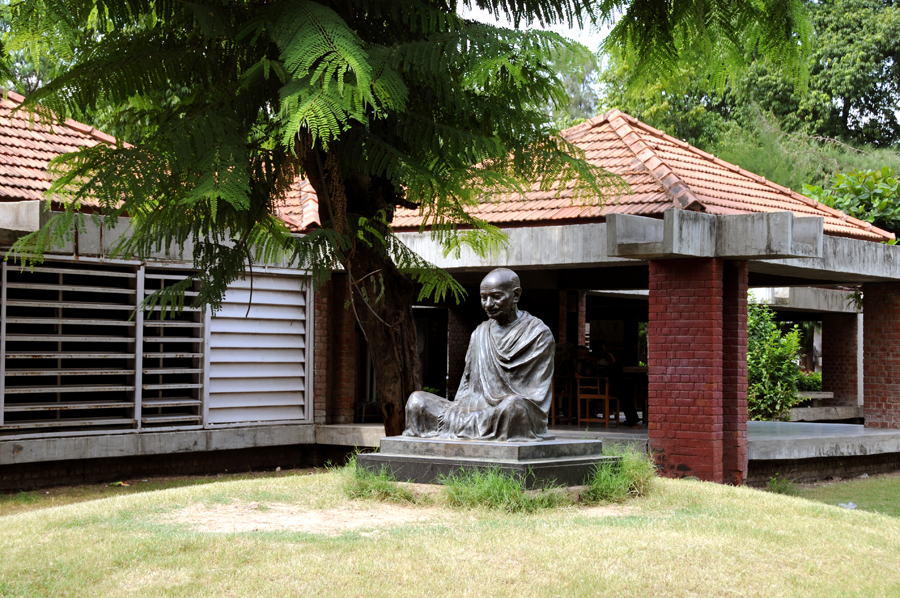

# అహ్మదాబాద్

| Ahmedabad Karnavati, Ashaval |
| --- |
| Metropolis |
| Amdavad |
| Clockwise from top: High Rises on SG Highway, Atal Pedestrian Bridge , Sabarmati Riverfront , Narendra Modi Stadium , Ahmedabad BRTS Station, Ahmedabad Aerial View, Hutheesing Temple . |
| Coat of arms of Ahmedabad Coat of arms |
| Nickname: Heritage City of India |
| Wikimedia | © OpenStreetMap Interactive Map Outlining Ahmedabad |
| Lua error in మాడ్యూల్:Location_map at line 526: Unable to find the specified location map definition: "Module:Location map/data/India Ahmedabad" does not exist. |
| Coordinates: 23°02′N 72°35′E / 23.03°N 72.58°E / 23.03; 72.58 |
| దేశం |
| State |
| District |
| Establishment |
| Founded by |
| Named after |
| ప్రభుత్వం |
| • రకం |
| • సంస్థ |
| • Mayor |
| • Deputy Mayor |
| • Municipal commissioner |
| • Police commissioner |
| విస్తీర్ణం [ 4 ] |
| • మొత్తం |
| • స్థానం |
| ఎత్తు [ 5 ] |
| జనాభా (2023) [ 6 ] |
| • మొత్తం |
| • స్థానం |
| Demonym(s) |
| Language |
| • అధికార |
| • Additional official |
| కాల మండలం |
| Pincode(s) |
| Area code |
| Vehicle registration |
| HDI (2016) |
| Sex ratio |
| Literacy rate |
|  |
| UNESCO World Heritage Site |
| Criteria |
| సూచనలు |
| శాసనం |
| ప్రాంతం |
| Buffer zone |
|  |

అహ్మదాబాద్ , భారతదేశం , గుజరాత్ రాష్ట్రంలో అత్యధిక జనాభా కలిగిన నగరం. [ 11 ] ఇది అహ్మదాబాద్ జిల్లా , పరిపాలనా ప్రధాన కార్యాలయం, గుజరాత్ ఉన్నత న్యాయస్థాన కేంద్రం. 2011 జనాభా లెక్కల ప్రకారం అహ్మదాబాద్ నగర పరిధిలో 55,70,585 మంది ఉన్నారు. 2011 నాటికి ఈ నగరం భారతదేశంలో ఐదవ-అత్యధిక జనాభా కలిగిన నగరంగా గుర్తింపు పొందింది. [ 12 ] పట్టణ సముదాయ జనాభాతో కలుపుకుని 63,57,693గా అంచనా వేయబడిన ఈ నగరం భారతదేశంలో ఏడవ-అత్యధిక జనాభా కలిగిన నగరంగా గుర్తింపు పొందింది. అహ్మదాబాద్ నగరం సబర్మతి నది ఒడ్డున ఉంది. [ 13 ] గుజరాత్ రాజధాని గాంధీనగర్ నుండి 25 కి.మీ. (16 మై.) దూరంలోఉంది. [ 14 ] అహ్మదాబాద్, గాంధీనగర్ రెండిటిని జంట నగరాలుగా పరిగణిస్తారు. [ 15 ]

భారతదేశంలో ఒక ముఖ్యమైన ఆర్థిక, పారిశ్రామిక కేంద్రంగా అహ్మదాబాద్ ఉద్భవించింది. భారతదేశంలో రెండవ అతిపెద్ద పత్తి ఉత్పత్తిదారు నగరం. అందువలన దీనిని కాన్పూర్‌తో పాటు ' మాంచెస్టర్ ఆఫ్ ఇండియా' అని పిలుస్తారు. అహ్మదాబాద్ స్టాక్ ఎక్స్ఛేంజ్ (ఇది 2018లో మూసివేయటానికి ముందు) దేశంలో రెండవ పురాతనమైంది. క్రికెట్ ఒక ప్రసిద్ధ క్రీడగా ఆడతారు. నరేంద్ర మోడీ స్టేడియం (గతంలో మోటెరా స్టేడియం ) అని పిలువబడే కొత్తగా నిర్మించిన స్టేడియం 1,32,000 మంది ప్రేక్షకులకు వసతి కల్పిస్తుంది. [ 16 ] ఇది ప్రపంచంలోనే అతిపెద్ద స్టేడియం. ప్రపంచ స్థాయిలో నిర్మిస్తున్న ఎన్ సర్దార్ వల్లభాయ్ పటేల్ స్పోర్ట్స్ ఎన్‌క్లేవ్ ప్రస్తుతం నిర్మాణంలో ఉంది.అది పూర్తయిన తర్వాత, ఈ నగరం భారతదేశంలోని అతిపెద్ద క్రీడా కేంద్రాలలో (స్పోర్ట్స్ సిటీ) ఒకటి అవుతుంది. భారత ఆర్థిక వ్యవస్థ సరళీకరణ ప్రభావాలు వాణిజ్యం, సమాచార, నిర్మాణరంగం వంటి తృతీయ రంగ కార్యకలాపాలు నగర ఆర్థిక వ్యవస్థను బలపర్చాయి. [ 17 ] అహ్మదాబాద్ పెరుగుతున్న జనాభా ఫలితంగా నిర్మాణాలు, గృహ పరిశ్రమలు పెరిగాయి. దాని ఫలితంగా ఆకాశహర్మ్యాలు అభివృద్ధి చెందాయి. [ 18 ]

ఫోర్బ్స్ అనే ఒక అమెరికన్ వ్యాపార పత్రిక విశ్లేషణ నివేదిక 2010 ప్రకారం ' దశాబ్దంలో అత్యంత వేగంగా అభివృద్ధి చెందుతున్న నగరాల జాబితాలో అహ్మదాబాద్ మూడవ స్థానంలో నిలిచింది. [ 19 ] 2012లో టైమ్స్ ఆఫ్ ఇండియా భారతదేశంలో నివసించడానికి ఉత్తమ నగరంగా ఎంపిక చేసింది . [ 20 ] అహ్మదాబాద్ మెట్రో స్థూల దేశీయ ఉత్పత్తి 2020లో $80 బిలియన్లుగా అంచనావేయబడింది [ 21 ] [ 22 ] 2020 ఈజ్ ఆఫ్ లివింగ్ సూచిక ప్రకారం భారతదేశంలో నివసించడానికి అహ్మదాబాద్ మూడవ ఉత్తమ నగరంగాఎంపిక చేసింది. [ 23 ] 2022 జులైలో, టైమ్ మ్యాగజైన్ ప్రపంచంలోని 50 గొప్ప ప్రదేశాల జాబితాలో అహ్మదాబాద్‌ను చేర్చింది [ 24 ]

భారత ప్రభుత్వ ' అత్యున్నత నగరాల లక్ష్యం ఫథకం కింద స్మార్ట్ సిటీగా అభివృద్ధి చేయనున్న వంద భారతీయ నగరాల్లో అహ్మదాబాద్ ఒకటిగా ఎంపికైంది. [ 25 ] 2017 జులైలో చారిత్రాత్మక నగరం అహ్మదాబాద్, యునెస్కో ప్రపంచ వారసత్వ నగరంగా ప్రకటించింది. [ 26 ]

"అహ్మదాబాద్" అనే పేరు సా.శ. 1411 లో నగరాన్ని స్థాపించిన సుల్తాన్ అహ్మద్ షా పేరు నుండి వచ్చింది.నగరం అసలు పేరు "అశావల్", ఇది ఆసమయంలో సబర్మతి నది ఒడ్డున ఉన్న ఒక చిన్న స్థావరం. [ 27 ] స్థానిక ఇతిహాసాల ప్రకారం, సుల్తాన్ అహ్మద్ షా వేట యాత్రలో ఉండగా, అతను తన వేటకుక్కలను తిప్పికొట్టడానికి ధైర్యంగా ఉన్న కుందేలును చూశాడు. కుందేలు ధైర్యానికి ప్రభావితుడైన సుల్తాన్ అహ్మద్ షా అక్కడికక్కడే ఒక కొత్తనగరాన్ని నిర్మించాలని నిర్ణయించుకున్నాడు. దానికి "అహ్మదాబాద్" అని పేరు పెట్టాడు. [ 28 ]

సంవత్సరాలు గడిచేకొద్దీ, అహ్మదాబాద్ సంపన్న నగరంగా అభివృద్ధి చెందింది, ఇది వాణిజ్యానికి ముఖ్యమైన కేంద్రం. నేడు ఇది భారతదేశంలోని అతిపెద్ద నగరాలలో ఒకటి. దాని స్మారక చిహ్నాలు, మ్యూజియాలు, పండుగలతో సహా గొప్ప సాంస్కృతిక వారసత్వానికి ప్రసిద్ధి చెందింది. [ 29 ]

## చరిత్ర

*అహ్మదాబాద్ నగర గోడలు, 1866*

సా.శ.11వ శతాబ్దం నుండి అహ్మదాబాద్ చుట్టుపక్కల ప్రాంతం ఆశావల్ అని పిలువబడే కాలం నుండి ఉనికిలో ఉంది. [ 29 ] ఆ సమయంలో, కర్ణ, చౌళుక్య (సోలంకి) అన్హిల్వారా (ఆధునిక పటాన్ ) పాలకుడు, అశావల్ భిల్ రాజుపై విజయవంతమైన యుద్ధం చేశాడు. [ 30 ] సబర్మతీ ఒడ్డున కర్ణవతి అనే నగరాన్ని స్థాపించాడు. [ 31 ] సోలంకి పాలన 13వ శతాబ్దం వరకు కొనసాగింది. అప్పటి వరకు గుజరాత్ ధోల్కా వాఘేలా రాజవంశం ఆధీనంలోకి వచ్చింది. తదనంతరం గుజరాత్ 14వ శతాబ్దంలో ఢిల్లీ సుల్తానేట్ ఆధీనంలోకి వచ్చింది. అయితే, 15వ శతాబ్దం ప్రారంభంలో, స్థానిక ముస్లిం గవర్నర్ జాఫర్ ఖాన్ ముజఫర్ ఢిల్లీ సుల్తానేట్ నుండి పొంది, తన స్వతంత్ర్యరాజ్యంగా స్థాపించాడు.ముజఫర్ షా I గా గుజరాత్ సుల్తాన్‌గా పట్టాభిషిక్తుడయ్యాడు. తద్వారా ముజాఫరిద్ రాజవంశాన్ని స్థాపించాడు. [ 32 ] [ 33 ] [ 34 ] 1411లో ఈ ప్రాంతం, అతని మనవడు సుల్తాన్ అహ్మద్ షా ఆధీనంలోకి వచ్చింది. అతను కొత్త రాజధానినగరం కోసం సబర్మతీ నది ఒడ్డున ఉన్న అటవీ ప్రాంతాన్ని ఎంచుకున్నాడు. అతను కర్ణావతికి సమీపంలో ఒక కొత్త ప్రాకార నగరానికి పునాది వేసి, దానికి అహ్మదాబాద్ అని పేరు పెట్టాడు. [ 35 ] [ 36 ] ఇతర సంస్కరణల ప్రకారం, అతను ఆ ప్రాంతంలోని నలుగురు ముస్లిం సాధువుల పేరు మీద వచ్చేటట్లు నగరానికి పేరు పెట్టాడు. వారందరికీ అహ్మద్ అనే పేరుఉంది. [ 37 ] అహ్మద్ షా I సా.శ. 1411 ఫిబ్రవరి 26 గురువారం [ 38 ] (1.20 సాయంత్రం) నగరానికి మానెక్ బుర్జ్ వద్ద పునాది వేశాడు. (ధు అల్-కి' దా రెండవ రోజు, హిజ్రీ సంవత్సరం 813 ) [ 39 ] సా.శ. 1411లో అహ్మద్ షా I భద్ర కోటను నిర్మించడంలో సహాయపడటానికి జోక్యం చేసుకున్న 15వ శతాబ్దపు పురాణ హిందూ సన్యాసి మానెక్‌నాథ్ పేరు మీద మానెక్ బుర్జ్ పేరును పెట్టాడు [ 35 ] [ 40 ] [ 41 ] [ 42 ] అతను 1411 మార్చి 4న దీనిని కొత్త రాజధానిగా ఎంచుకున్నాడు [ 43 ] సెయింట్ మానెక్‌నాథ్ 13వ తరం వారసులైన చందన్, రాజేష్ నాథ్ అహ్మదాబాద్ స్థాపన రోజు, ప్రతి సంవత్సరం విజయదశమి పండుగ సందర్భంగా మానెక్ బుర్జ్‌పై పూజలు చేసి, జెండా ఎగురవేస్తారు. [ 35 ] [ 41 ] [ 44 ] [ 45 ]

సా.శ.1487లో, అహ్మద్ షా మనవడు మహమూద్ బెగడ, బయటి గోడతో నగరాన్ని పటిష్టపరిచాడు. ఆ సమయంలో నగరం 10 కి.మీ. (6.2 మై.) చుట్టుకొలతతో పన్నెండు ప్రధాన ద్వారాలతో, 189 బురుజులుతో ఉంది. [ 46 ] అహ్మదాబాద్ ఏన్నో యుద్దాలను చవిచూసింది. సా.శ.1535లో గుజరాత్ పాలకుడు బహదూర్ షా డయ్యూకు పారిపోయినప్పుడు చంపానేర్‌ను స్వాధీనం చేసుకున్న తర్వాత హుమాయున్ కొంతకాలం అహ్మదాబాద్‌ను ఆక్రమించాడు. [ 47 ] సా.శ.1573 లో మొఘల్ చక్రవర్తి అక్బర్ , గుజరాత్‌ను స్వాధీనం చేసుకునే వరకు అహ్మదాబాద్ ముజఫరిద్ రాజవంశంచే తిరిగి ఆక్రమించబడింది. మొఘల్ పాలనలో, అహ్మదాబాద్ సామ్రాజ్యం, అభివృద్ధి చెందుతున్న వాణిజ్య కేంద్రాలలో ఒకటిగా మారింది, ప్రధానంగా వస్త్రాలు ఐరోపాకు ఎగుమతి చేయబడ్డాయి. మొఘల్ పాలకుడు షాజహాన్ షాహిబాగ్‌లోని మోతీ షాహీ మహల్ నిర్మాణానికి ఆర్థిక సహాయం చేస్తూ తన జీవితంలోని ప్రధాన జీవితాన్ని నగరంలో గడిపాడు. 1630-32 నాటి దక్కన్ కరువు నగరంపై ప్రభావం చూపింది, అలాగే సా.శ. 1650 సా.శ.1686 మధ్య కాలంలో వచ్చిన కరువులకు నగరం ప్రభావతమైంది. [ 48 ] సా.శ.1758 వరకు అహ్మదాబాద్ మొఘలుల ప్రాంతీయ ప్రధాన కార్యాలయంగా ఉంది. తరువాత వారు నగరాన్ని మరాఠాలకు అప్పగించారు. [ 49 ]

మరాఠా సామ్రాజ్య పాలనా కాలంలో, పూనాలోని పీష్వా , బరోడాలోని గైక్వాడ్ మధ్య వివాదానికి నగరం కేంద్రంగా మారింది. [ 50 ] సా.శ.1780లో, మొదటి ఆంగ్లో-మరాఠా యుద్ధంలో, జేమ్స్ హార్ట్లీ నేతృత్వంలోని బ్రిటీష్ దళం అహ్మదాబాద్‌ను ఆక్రమించుకుంది.అయితే యుద్ధం ముగిశాక అది మరాఠాలకు తిరిగి అప్పగించారు. బ్రిటిష్ ఈస్ట్ ఇండియా కంపెనీ 1818లో మూడవ ఆంగ్లో-మరాఠా యుద్ధంలో నగరాన్ని స్వాధీనం చేసుకుంది. [ 37 ] 1824లో పురపాలక సంఘం సైనికులకు నివాస ప్రాంతం స్థాపించింది. [ 37 ] బ్రిటీష్ పాలనలో బాంబే అధ్యక్షపాలనలో విలీనం చేయబడిన అహ్మదాబాద్ గుజరాత్ ప్రాంతంలోని అత్యంత ముఖ్యమైన నగరాల్లో ఒకటిగా మారింది.1864లో, అహ్మదాబాద్, ముంబై (అప్పటి బొంబాయి) మధ్య రైల్వే లింక్‌ను బొంబాయి, బరోడా సెంట్రల్ ఇండియా రైల్వే (BBCI) ఏర్పాటు చేసింది. ఇది నగరం ద్వారా ఉత్తర , దక్షిణ భారతదేశం మధ్య వాహనాల రాకపోకలు, వాణిజ్యం ప్రారంభమయ్యాయి. [ 37 ] కాలక్రమేణా, నగరం అభివృద్ధి చెందుతున్న వస్త్ర పరిశ్రమకు నిలయంగా స్థిరపడింది. నగరం " మాంచెస్టర్ ఆఫ్ ది ఈస్ట్" అనే మారుపేరును సంపాదించింది. [ 51 ]

*మహాత్మా గాంధీ స్థాపించిన సబర్మతి ఆశ్రమం*

మహాత్మా గాంధీ సా.శ. 1915లో పాల్డి దగ్గర కొచ్రాబ్ ఆశ్రమం , సా.శ.1917లో సబర్మతి ఒడ్డున సత్యాగ్రహ ఆశ్రమం (ఇప్పుడు సబర్మతి ఆశ్రమం ) రెండు ఆశ్రమాలను స్థాపించినప్పుడు భారత స్వాతంత్ర్య ఉద్యమం నగరంలో మూలాలను అభివృద్ధి చేసింది.జాతీయవాద కార్యకలాపాలకు అవి కేంద్రాలుగా మారాయి. [ 37 ] [ 52 ] సా.శ.1919లో రౌలట్ చట్టానికి వ్యతిరేకంగా జరిగిన సామూహిక నిరసనల సందర్భంగా, మొదటి ప్రపంచ యుద్ధం తర్వాత యుద్ధకాల నిబంధనలను పొడిగించే బ్రిటిష్ ప్రయత్నానికి నిరసనగా వస్త్ర కార్మికులు నగరం అంతటా 51 ప్రభుత్వ భవనాలను తగులబెట్టారు. 1920లలో వస్త్ర కార్మికులు, ఉపాధ్యాయులు పౌర హక్కులు, మెరుగైన వేతనాలు, పని పరిస్థితులపై మెరుగుపర్చాలని వత్తిడికలుగు చేస్తూ సమ్మె చేశారు. 1930లో గాంధీ అహ్మదాబాద్ నుండి ఉప్పు సత్యాగ్రహాన్ని తన ఆశ్రమం నుండి దండి ఉప్పు సత్యాగ్రహం ప్రారంభించాడు.1947లో స్వాతంత్ర్యం పొంది, భారతదేశ విభజన తరువాత, 1947లో హిందువులు , ముస్లింల మధ్య జరిగిన తీవ్రమైన మత హింసతో నగరం చిన్నాభిన్నమైంది. అహ్మదాబాద్ పాకిస్తాన్ నుండి వచ్చిన హిందూ వలసదారులు స్థిరపడటానికి కేంద్రంగా మారింది. [ 53 ] వారు నగర జనాభాను విస్తరించారు. విస్తృతంగా పెరిగిన హిందూ జనాభా నగర ఆర్థిక వ్యవస్థను మార్చింది.

1960 నాటికి, అహ్మదాబాద్ కేవలం ఐదు లక్షలు కంటే తక్కువ జనాభా మాత్రమే ఉన్నారు.నగరానికి రాకపోకలుసాగించే సాంప్రదాయ,వలసలు కారణంగా ప్రాశ్చాత్య దేశాల తరహా భవనాలు ఏర్పడ్డాయి. [ 54 ] 1960 మే 1 న బొంబాయి రాష్ట్ర విభజన తర్వాత,ఇది గుజరాత్ రాష్ట్ర రాజధానిగా ఎంపికైంది. [ 55 ] ఈ కాలంలో నగరంలో పెద్ద సంఖ్యలో విద్యా,పరిశోధనా సంస్థలు స్థాపించబడ్డాయి. ఇది ఉన్నత విద్య , విజ్ఞాన,సాంకేతిక కేంద్రంగా మారింది. [ 56 ] అదే కాలంలో భారీ, రసాయన పరిశ్రమల స్థాపనతో అహ్మదాబాద్ ఆర్థిక స్థావరం మరింత వైవిధ్యంగా మారింది. అనేక దేశాలు భారతదేశ ఆర్థిక ప్రణాళిక వ్యూహాన్ని అనుకరించటానికి ప్రయత్నించాయి. వాటిలో ఒకటైన దక్షిణ కొరియా నగరంరెండవ "పంచవర్ష ప్రణాళిక" ను యధావిధిగా అమలు చేసింది.

1970ల చివరలో, రాజధాని కొత్తగా నిర్మించిన గాంధీనగర్ నగరానికి మార్చబడింది. ఇది నగరంలో చాలా కాలం పాటు అభివృద్ధిలో క్షీణతకు గురైంది.1974 నవ నిర్మాణ్ ఆందోళన- అహ్మదాబాద్‌లోని ఎల్‌డి కాలేజ్ ఆఫ్ ఇంజనీరింగ్‌లో హాస్టల్ ఫుడ్ ఫీజులను 20% పెంపునకు వ్యతిరేకంగా నిరసన, అప్పటి గుజరాత్ ముఖ్యమంత్రిగా ఉన్న చిమన్‌భాయ్ పటేల్‌ను తొలగించే ఉద్యమం ఇలాంటి వరుస ఉద్యమాలుకు నగరం గురైంది. [ 57 ] 1980వ దశకంలో, దేశంలో రిజర్వేషన్ విధానం ప్రవేశపెట్టబడింది. ఇది 1981 - 1985లో రిజర్వేషన్ వ్యతిరేక నిరసనలకు దారితీసింది. నిరసనల్లో వివిధ కులాలకు చెందిన వ్యక్తుల మధ్య హింసాత్మక ఘర్షణలు జరిగాయి. [ 58 ] 2001 గుజరాత్ భూకంపం కారణంగా నగరంలోని సుమారు 50 బహుళ అంతస్థుల భవనాలు కూలిపోయాయి.ఆ ఘటనలో 752 మంది మరణించారు.నగరం త్రీవ నష్టానికి ప్రభావితమైంది. [ 59 ] మరుసటి సంవత్సరం, 2002 గుజరాత్ అల్లర్లుగా పిలువబడే పశ్చిమ భారతదేశం లోని గుజరాత్‌లో హిందువులు, ముస్లింల మధ్య మూడు రోజుల హింస అహ్మదాబాద్‌కు వ్యాపించింది. తూర్పు చమన్‌పురాలో, 2002 ఫిబ్రవరి 28న గుల్బర్గ్ సొసైటీ ఊచకోతలో 69 మంది మరణించారు. [ 60 ] నగరం చుట్టూ శరణార్థి శిబిరాలు ఏర్పాటు చేసారు. [ 61 ] 2008 అహ్మదాబాద్ బాంబు దాడులులో, పదిహేడు బాంబు పేలుళ్ల వరుసలో, అనేక మంది మరణించారు.మరికొంత మంది గాయపడ్డారు. [ 62 ] మిలిటెంట్ గ్రూప్ హర్కత్-ఉల్-జిహాద్ ఈ దాడులకు పాల్పడింది. [ 63 ]

న్యూ ఢిల్లీ కాకుండా, యుఎస్, చైనా, కెనడా వంటి ప్రధాన ఆర్థిక వ్యవస్థల మంత్రులు, ప్రథాన మంత్రులు కలిగి ఉన్న భారతదేశంలో అహ్మదాబాద్ అరుదైన నగరంగా అభివృద్ధి చెందింది.2020 ఫిబ్రవరి 24 న, నమస్తే ట్రంప్‌లో భాగంగా నగరాన్ని సందర్శించిన మొదటి అమెరికా అధ్యక్షుడిగా ట్రంప్ నిలిచాడు.అంతకుముందు అధ్యక్షుడు జీ జిన్‌పింగ్, ప్రధాని జస్టిన్ ట్రూడో నగరాన్ని సందర్శించారు. [ 64 ] [ 65 ] [ 66 ]

## గణాంకాలు

### జనాభా

| చారిత్రికంగా జనాభా |
| --- |
| సంవత్సరం |
| 1872 |
| 1881 |
| 1891 |
| 1901 |
| 1911 |
| 1921 |
| 1931 |
| 1941 |
| 1951 |
| 1961 |
| 1971 |
| 1981 |
| 1991 |
| 2001 |
| 2011 |

2011 భారత జనాభా లెక్కలు ప్రకారం అహ్మదాబాద్‌లో 56,33,927 మంది జనాభా ఉన్నారు.ఇది భారతదేశంలోని నగరాలలో ఐదవ అత్యధిక జనాభా కలిగిన నగరంగా నిలిచింది. [ 67 ] పట్టణ సముదాయం కలుపుకుని లెక్కించినప్పుడు అహ్మదాబాద్‌ నగర జనాభా 63,57,693 మంది జనాభాను కలిగి ఉంది. ఇప్పుడు 76,50,000గా అంచనా వేయబడింది, ఇది భారతదేశంలో ఏడవ అత్యధిక జనాభా కలిగిన పట్టణ సముదాయం. [ 68 ] [ 69 ] నగర అక్షరాస్యత రేటు 88.29% శాతంగా ఉంది. [ 70 ] పురుష అక్షరాస్యులు 92.30% మందికాగా, 83.85% శాతం మంది స్త్రీలు అక్షరాస్యులు. 2011లో అహ్మదాబాద్‌లో 1000 మంది పురుషులకు 897 మంది మహిళల లింగ నిష్పత్తి ఉంది. తొమ్మిదో ప్రణాళిక జనాభా లెక్కల ప్రకారం అహ్మదాబాద్‌లో 30,737 గ్రామీణ కుటుంబాలు నివసిస్తున్నాయి. వారిలో 5.41% (1663 కుటుంబాలు) దారిద్య్రరేఖకు దిగువన ఉన్నారు. [ 71 ] నగరంలో దాదాపు 4,40,000 మంది ప్రజలు మురికివాడల్లో నివసిస్తున్నారు. 2008లో, అహ్మదాబాద్‌లో 2,273 మంది రిజిస్టర్డ్ నాన్ రెసిడెంట్ భారతీయులు నివసిస్తున్నారు. [ 72 ] 2010లో ఫోర్బ్స్ మ్యాగజైన్ భారతదేశంలో అత్యంత వేగంగా అభివృద్ధి చెందుతున్న నగరంగా అహ్మదాబాద్‌ను ఎంపిక చేసింది. చైనీస్ నగరాలు చెంగ్డు, చాంగ్‌కింగ్ తర్వాత ప్రపంచంలోనే అత్యంత వేగంగా అభివృద్ధి చెందుతున్న మూడవ నగరంగా పేర్కొంది. [ 73 ] 202011లో ఇది ప్రముఖ మార్కెట్ పరిశోధన సంస్థ ఐ.ఎం.ఆర్.బి. ద్వారా నివసించడానికి భారతదేశపు అత్యుత్తమ మెగాసిటీగా ఎంపిక చేయబడింది. [ 74 ] జాతీయ నేర పరిశోధక నమోదు సంస్థ (NCRB) 2003 నివేదిక ప్రకారం, ఒక మిలియన్ కంటే ఎక్కువ జనాభా కలిగిన 35 భారతీయ నగరాల్లో అహ్మదాబాద్ అత్యల్ప నేరాల రేటును కలిగి ఉంది. [ 75 ] 2011 డిసెంబరులో వాణిజ్య పరిశోధన సంస్థ (IMRB) భారతదేశంలోని ఇతర అత్యున్నత మహానగరాలతో పోలిస్తే అహ్మదాబాద్‌ను నివసించడానికి అత్యుత్తమ మహానగరంగా ప్రకటించింది. [ 76 ] అహ్మదాబాద్‌లోని మొత్తం రియల్ ఎస్టేట్‌లో సగం కంటే కొంచెం తక్కువ "కమ్యూనిటీ ఆర్గనైజేషన్స్" (అంటే సహకార సంస్థలు) యాజమాన్యంలో ఉంది. 2020 నాటికి అహ్మదాబాద్ నగర జనాభా ఇప్పుడు 80,59,441గా అంచనా వేయబడింది. 1950లో అహ్మదాబాద్ జనాభా 8,54,959 మంది నుండి, 2015 నాటికి 9,50,155 పెరిగింది. ఇది 2.54% శాతం వార్షిక మార్పును సూచిస్తుంది. [ 77 ] యుఎన్ వరల్డ్ పాపులేషన్ ప్రాస్పెక్ట్స్ ప్రకారం, 2025 నాటికి జనాభా 88,54,444కి పెరగవచ్చుఅని అభిప్రాయపడుతున్నారు. ఇది 2035 నాటికి 1,10,62,112కి భారీగా పెరుగుతుందని అంచనా వేయబడింది. [ 78 ]

## ప్రముఖులు

- అభిషేక్ జైన్ : సినిమా దర్శకుడు , నిర్మాత .
- సంకల్ప్ వోహ్రా - క్రికెటర్

---
Source: https://te.wikipedia.org/wiki/%E0%B0%85%E0%B0%B9%E0%B1%8D%E0%B0%AE%E0%B0%A6%E0%B0%BE%E0%B0%AC%E0%B0%BE%E0%B0%A6%E0%B1%8D
