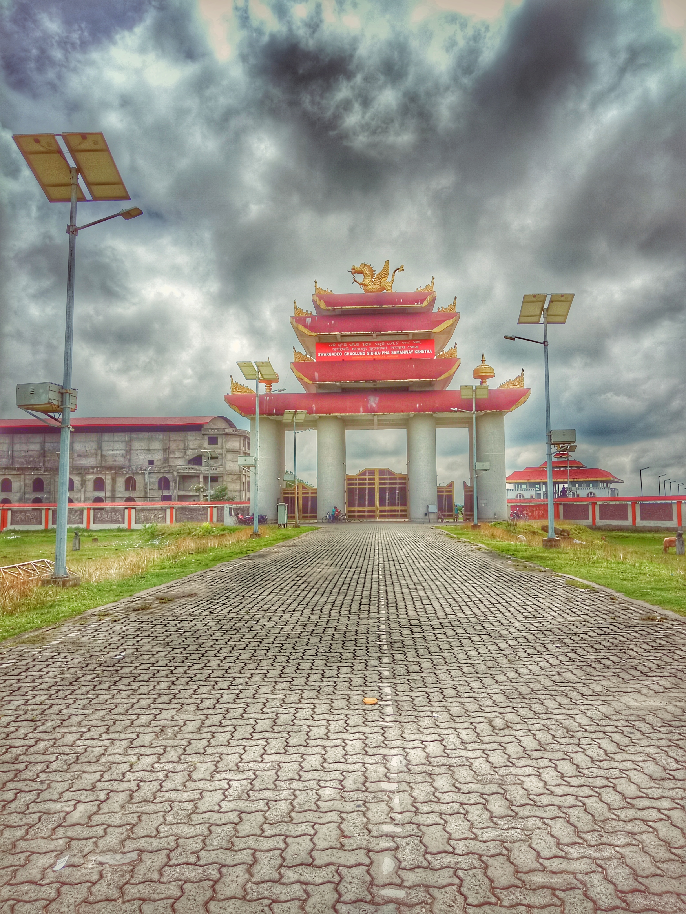
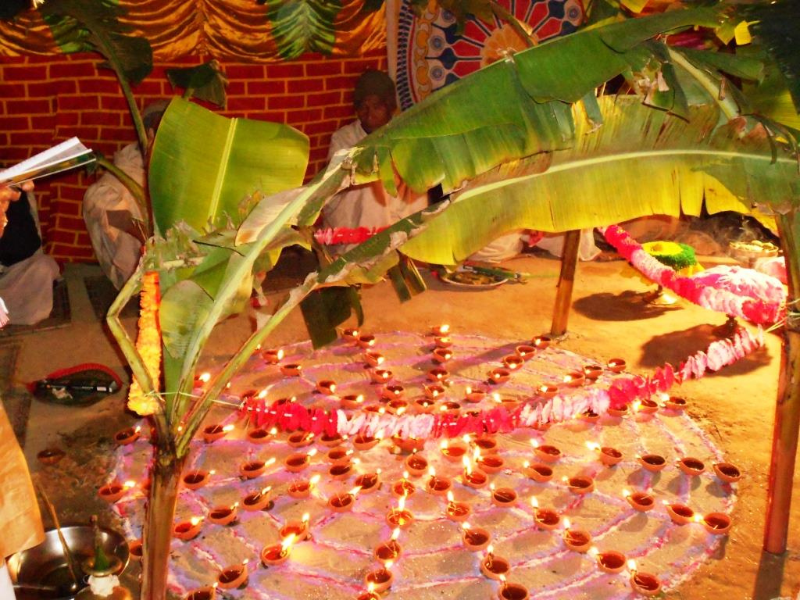

# টাই-আহোম জনগোষ্ঠী

*টাই-আহোম 𑜁𑜢𑜤𑜰𑜫 𑜄𑜐𑜫: 𑜒า, 𑜑𑜨𑜉𑜫, (Khér Tái Āhom)*

| মুঠ জনসংখ্যা |
| --- |
| ২০ লাখ (১৯৯০ আনুমানিক) |
| উল্লেখযোগ্য জন-অধ্যুষিত অঞ্চলসমূহ |
| অসম , অৰুণাচল |
| ভাষাসমূহ |
| টাই-আহোম ভাষা (𑜁า𑜉𑜫: 𑜄𑜐𑜫: 𑜒า, 𑜑𑜨𑜉𑜫, ) |
| ধৰ্ম |
| ফ্ৰালুং ধৰ্ম |
| সংশ্লিষ্ট নৃতাত্ত্বিক গোষ্ঠী |
| দাই জনগোষ্ঠী (মধ্য যুগৰ জনগোষ্ঠী), টাই দন জনগোষ্ঠী (প্ৰাচীন জনগোষ্ঠী), টাই জাতি |

*যোৰহাটৰ ছ্যুকাফা সমন্বয় ক্ষেত্ৰ*

টাই-আহোম জনগোষ্ঠী ( টাই-আহোম : 𑜁𑜢𑜤𑜰𑜫 𑜄𑜐𑜫: 𑜒า, 𑜑𑜨𑜉𑜫, Khér Tái Āhom ) হৈছে অসম আৰু অৰুণাচল ত বসবাস কৰা উত্তৰ-পূব ৰ সৰ্ববৃহৎ টাই জাতিৰ ঠাল। ভিন্ন সময়ত চীনদেশ ৰ য়ুন্নান ৰ পৰা প্ৰবজন কৰা টাই-আহোমসকলৰ ফু-খাও ঠাল আদিম যুগৰে পৰা কামৰূপত বাস কৰিছিল। [ 1 ] কামৰূপৰ পতনৰ পাছত ১২২৮ত চাওলুং চ্যু-কা-ফা ৰ নেতৃত্বত অহা ৯০০০ দেহং দাই লোকৰ ঠালে টাই-আহোম ৰাজ্য (মু'ঙ দুন) স্থাপন কৰি ৬০০ বছৰীয়া টাই-আহোম শাসনৰ পাতনি মেলে। [ 2 ]

## ঠাল সমুহ

### ফু-খাও (আদিম টাই-আহোম) ঠাল

আদিম যুগৰ পৰাই অসমত বাস কৰা টাই সকল আছিল টাই ডন যাক পাছলৈ ফু-খাও (আদিম টাই-আহোম) ৰূপে জনা গৈছিল। [ 1 ] চ্যু-কা-ফা পূৰ্বৰ এই টাই সকল টাই-আহোমৰ আদিমতম পূৰ্বপুৰুষ। ভাস্কৰ বৰ্মনৰ দিনত হিউৱেন চাঙে কামৰূপ ভ্ৰমন কৰোতে এই টাইসকল মানসকলৰ সৈতে কামৰূপৰ পূব সীমান্তত বাস কৰিছিল। [ 3 ] চ্যু-কা-ফা ঠাল ব্ৰহ্মপুত্ৰ উপত্যকাত প্ৰৱেশ কৰোঁতে নগা আৰু অইন জনগোষ্ঠীৰ সৈতে হোৱা সংঘাটত ফু-খাও ঠালৰ লোকসকলে সহায় কৰিছিল। [ 1 ] তেওঁলোকৰ বংশধৰসমুহ বৰ্তমান টাই-আহোমৰ লান-মাখ্ৰু ফৈদত অন্তৰ্ভুক্ত। [ 1 ]

## ঠাল সমুহ

### চ্যু-কা-ফা ঠাল

টাই-আহোমৰ বৃহত্তম ঠাল আছিল দেহ'ঙ টাই আৰু চিংফৌ স্বায়ত্ব প্ৰান্তৰ (德宏傣族景颇族自治州; মধ্যযুগীয় মু'ঙ মাও ; 𑜉𑜢𑜤𑜂𑜫 𑜉𑜰𑜫) কোঁৱৰ চাওলুং চ্যু-কা-ফা ৰ নেতৃত্বত ১২২৮ চনত অহা ৯০০০ টাই লোকৰ টাই ঠাল যি ব্ৰহ্মপুত্ৰ উপত্যকাত মু'ঙ দন চ'ণ খাম (𑜉𑜢𑜤𑜂𑜫: 𑜓𑜢𑜤𑜃𑜫 𑜏𑜤𑜃𑜫ˊ 𑜁𑜉𑜫: স্থাপন কৰি প্ৰায় ৬০০ বছৰ শাসন কৰে। [ 2 ]

## নামসমূহ

টাই-আহোমসকলক বহুতে বহুত ধৰণে মাতিছিল। যেনে:- টাই , চাম, অসম আৰু টাই-আহোম আদি।

টাই (𑜄𑜩) : প্ৰথম অৱস্থাত টাই-আহোমসকলে নিজকে টাই বুলিয়ে পৰিচয় দিছিল।আৰু এতিয়াও একাংশ টাই-আহোমে নিজক টাই বুলিয়ে নিজকে পৰিচয় দিয়ে সেয়েহে টাই-আহোমসকল আৰু টাই-আহোম সংগঠনসমূহে টাই-আহোম (𑜄𑜩 𑜒𑜡 𑜑𑜪𑜤) শব্দটো অধিক প্ৰয়োগ কৰা দেখা যায়।

চাম বা চিয়াম : চাম বা চিয়াম শব্দটো চীনা-তিব্বতীয় মান ডিমাছা আৰু বড়োসকলে টাই-আহোমসকলক বুজাবলৈ ব্যবহাৰ কৰিছিল। [ 4 ] [ 5 ] থাই সকলেও নিজকে চাম (Siam) আৰু মানসকলে টাই সকলক ছান বুলি কয়। [ 6 ]

অসম বা আচাম (পুৰণি অসমীয়াত ) : নৱ-বৈষ্ণৱ সাহিত্যত টাই-আহোমসকলক "অসম মুলুক " বুলি আৰু মোগলসকলে ও আচাম (آشام) বুলি কৈছিল। [ 7 ] [ 8 ] ইয়াৰ উপৰি কোচসকলেও নিজৰ লিখিত ইতিহাস দৰং ৰাজ বংশাৱলীত টাই-আহোম সকলক বুজাবলৈ আচাম শব্দটো ব্যৱহাৰ কৰিছিল। [ 9 ]

টাই-আহোম (𑜒𑜡 𑜑𑜪𑜤) (আধুনিক অসমীয়াত ) : কালক্ৰমত আধুনিক যুগত অসমৰ টাই সকলক টাই-আহোম নামেৰে মতা হৈছিল। [ 10 ] [ note 1 ]

## প্ৰতীক

টাই-আহোমসকলৰ জাতিয় প্ৰতীক হৈছে ফুৰালুং (ড্ৰেগন) আৰু জাতীয় পতাকাখনৰ নাম হৈছে খ্ৰীং-ফা।

## প্ৰতীক

### ঙি ঙাও খাম

ঙি ঙাও খাম (𑜂𑜣 𑜂𑜈𑜫 𑜁𑜪) বা ফুৰালুং হ'ল এছিয় ড্ৰেগ'ন ৰ এটা প্ৰজাতি যি টাই-আহোমসকলৰ মাজত প্ৰচলিত এক কিংবদন্তিমূলক জীৱ। [ 11 ] [ 12 ]

## প্ৰতীক

### খ্ৰীং-ফা

টাই-আহোমসকলৰ জাতীয় পতাকাখনৰ নাম হৈছে খ্ৰীং-ফা। [ 13 ] খ্ৰীং-ফাৰ মাজৰ অংশত আঠকোনীয়া চিহ্ন আৰু ফুৰালুঙৰ ছবি অঁকা থাকে। [ 14 ] পৌৰাণিক কালত টাই-আহোম চাওফা আৰু ডাঙৰীয়া সকলে যুদ্ধৰ আগত বা ভিন্ন ৰাজকীয় কামত খ্ৰীং-ফা উত্তোলন কৰিছিল। [ 15 ] বৰ্তমান সময়ত টাই-আহোম ধৰ্মীয় অনুষ্ঠানত আৰু টাই-আহোম সংগঠনসমূহে ভিন্ন অনুষ্ঠানত খ্ৰীং-ফা উত্তোলন কৰে।

## সংস্কৃতি

টাই-আহোম সংস্কৃতি পূব এছীয় সংস্কৃতিৰ সৈতে যথেষ্ট খাপ খায়। টাই-আহোম সংস্কৃতিত ঙি ঙাও খাম ( চীনা ড্ৰেগন ৰ এটা প্ৰজাতি), তাও ধৰ্মৰ আঠকোণীয়া প্ৰতীক আৰু লাক-নি (কেলেণ্ডাৰ) আদি দেখা যায়।

## সংস্কৃতি

### উৎসৱ

টাই-আহোমসকলৰ কেইবাটাও সুকীয়া উৎসৱ আছে। সেয়া হ'ল: ছেঙ কেন : ছেঙ কেন হৈছে টাই-আহোমসকলৰ পৰম্পৰাগত বহাগী উৎসৱ। এই উৎসৱত পূৰ্বপুৰষসকলক স্মৰণ কৰা হয়। [ 16 ] ছেঙ কেনৰ নিয়ম সমুহ খ্যেক লাই বেট পুথিত উল্লেখ আছে। [ 17 ]

মে ডাম মে ফি : এই অনুষ্ঠানটো পূৰ্বপুৰুষক স্মৰণ কৰি প্ৰতি বছৰে ৩১ জানুৱাৰী তাৰিখে পালন কৰা হয়। টাই-আহোম দম্পতীয়ে চেং-কা-ফাক (খুন-থেও-খামৰ পুত্ৰ) পাকঘৰৰ দক্ষিণ খুটাত স্মৰণ কৰা হয়।

উম-ফা : এই অনুষ্ঠান ভাগ পূৰ্বপুৰুষ শাসক দেৱতা লেং-দনক স্মৰণ কৰি অতি ভব্য আৰু উলহ মালহেৰে পালন কৰা হয়। ইয়াত লেংদনৰ প্ৰিয় খাদ্য মাংসও দিয়া হয় আৰু গৰু আদি কৰি বিভিন্ন জীৱ জন্তু প্য়াত-চি কৰি উৎসৰ্গা কৰা হয়। এই অনুষ্ঠানটো ৫ বছৰৰ মূৰত এবাৰ উদযাপন কৰা হয় আৰু ইয়াক টাই-আহোম শাসনৰ অন্ত হোৱাৰ পিছতো পালন কৰি অহা হৈছে।

চাই-ফা : এই অনুষ্ঠানত সকলো প্ৰজাইয়ো যোগদান কৰিছিল।

খ্যেক য়াচিংফা : বিদ্যা আৰু কলাৰ প্ৰতীক পূৰ্বপুৰুষ দেৱী য়ে-চেং-ফাৰ স্মৃতিত এই পৰম্পৰা পালন কৰা হয়।

খ্যেক ফুৰালুং বা খ্যেক ফ্ৰা-লুং (𑜇𑜥 𑜍𑜡 𑜎𑜤𑜂𑜫): এই অনুষ্ঠানত ফুৰা-তেৰা বা ফুৰা-লুং ড্ৰেগনক স্মৰণ কৰা হয়। টাই-আহোমৰ ম'-লৌং সকলে এই অনুষ্ঠানত আই-চিং-লাও (টাই-আহোমৰ প্ৰাৰ্থনা) গায়। এই অনুষ্ঠানত কোনো জীৱ উৎসৰ্গা কৰা নহয়।

ৰিক খ্বন : এই অনুষ্ঠান ভাগি কোনো যুদ্ধৰ সময়ত উচ্চ শক্তিক স্মৰণ কৰি পালন কৰা হয়। টাই-আহোম ভাষাত ৰিক শব্দৰ অৰ্থ মতা / আহ্ৱান কৰা খ্ৱনৰ অৰ্থ দীৰ্ঘায়ু। এই অনুষ্ঠানত জল দেৱতা খাও-খামক স্মৰণ কৰা হয়।

## সংস্কৃতি

### ঘৰ

টাই-আহোমসকলে কাঠ , বাঁহ আদিৰে অইন টাই বা গাঁৱলীয়া থাইসকলৰ দৰে ঘৰ সাজিছিল। [ 18 ] সকলোৰে বাৰী আৰু খেতি ঘৰৰ ওচৰতে থাকে। বাঁহেৰে নিৰ্মিত বিশেষ প্ৰকাৰৰ ঘৰ ব্যৱহাৰ কৰে। [ 18 ] এই ঘৰসমূহক ৰু'এন-হোৱাণ বুলি কোৱা হয় আৰু ইয়াক মাটিৰ পৰা অলপ ওপৰত সজা হয় কিন্তু অন্য জনগোষ্ঠীৰ চাং-ঘৰতকৈ অলপ চাপৰ হয়। [ 18 ]

## সংস্কৃতি

### খাদ্য

মুখ্য আহাৰ : প্ৰায়বিলাক টাই-আহোম (বিশেষকৈ গাঁৱলীয়া)সকলে আমিষভোজী, পতংগভোজী আৰু আজিও টাইসকলৰ খাদ্যাভ্যাসকে চলাই আছে। [ 19 ] গাহৰি , কুকুৰা , মহ , হাঁহ আদিৰ মাংস ৰ উপৰিও টাই-আহোমসকলে ভেকুলী ৰ মাংস, মুগালেটা , শুকুতী মাছ আৰু আমৰলি টোপ খোৱা দেখা যায়। [ 20 ] তেওঁলোকৰ মুখ্য আহাৰ ভাত । টাই-আহোমসকলে কলৰ বাকলিৰ পৰা প্ৰস্তুত কৰা খাৰ ব্যৱহাৰ কৰে আৰু বহু ঔষধি গুণযুক্ত শাক-পাচলি আৰু বেত-গাঁজ খায়। টাই-আহোমসকলৰ খাদ্যাভাসে অইন টাইসকলৰ লগত সাদৃশ্য প্ৰদৰ্শন কৰে। তেওঁলোকৰে খাদ্যাভাষত- থেও-দাম ( মাটি মাহ ), খাও-মুন (ভাত আৰু দালচেনি ), সান্দহ গুৰী, চেও-খাও (ভাপত দিয়া ভাত), খাও-মাই (চুঙা-চাউল), তিলেৰে প্ৰস্তুত কৰা তিল পিঠা, খাও-ত্য়েক ( আখৈ )। [ 18 ] নুতলোৱাকৈ কোমল চাউল ৰ প্ৰস্তুতকৰণ বা তৰা পাতত বান্ধি বনোৱা খাও-মাই ( চুঙা চাউল ) [ 18 ] । টাই-আহোমসকলে কম মছলাযুক্ত খাদ্য আৰু মাছ , বেঙেনা , বিলাহী আদি পুৰি বা তৰা পাতত দি খাই বেছি ভাল পায়। [ 18 ] লাও হ'ল এওঁলোকৰ পৰম্পৰাগত পানীয় যি চাউল ভীমকল বা কঠাল ৰ পৰা প্ৰস্তুত কৰে। ইয়াৰে পানী দিয়া বিধক নাম-লাও আৰু পানী নিদিয়া বিধক লৌক-লাও বোলা হয়। ইয়াৰ উপৰি টাই-আহোমসকলে পৰম্পৰাগত এবিধ চাহ ব্যৱহাৰ কৰে যাক না নিঙ িঙ বুলি কোৱা হয়। এই পৰম্পৰা চীনৰ পৰাই টাই-আহোমসকলে লৈ আনিছিল।

## সংস্কৃতি

### বিবাহ

*চ-ক্লং*

টাই-আহোম সকলে নিজস্ব প্ৰথাৰে সম্পাদিত কৰা বিবাহ পদ্ধতি আছে। তাৰ মুখ্য পৰম্পৰাৰ নাম “ চ-ক্লং ” বুলি জনা যায়। [ 21 ] ই টাই-আহোম ভাষাৰ শব্দ ( চ ' অৰ্থাৎ যোৰা লগুৱা আৰু ক্লং অৰ্থাৎ পূজা )। ৰাতি বিবাহ ৰ মুখ্য পৰম্পৰাত ম'-ৰুলৰ সন্মুখত সোণ , ৰূপ , পিতল বা কাঠ ৰ গছাত ১০১ গছ বান-ফাইং চোমচাও প্ৰমুখ্যে ১০১জনা ফুৰা ৰ উদ্দেশ্যি প্ৰজ্জ্বলিত কৰা হয়। [ 21 ] “ চ-ক্লং ” বিবাহ পদ্ধতি পোন প্ৰথমে টাই-আহোমৰ ফুৰা লেংডনে অক-কাই ম'-হুং ৰজাৰ জ্যেষ্ঠা কন্যা নাং হুন ফা ক বিয়া কৰোঁতেই আৰম্ভ হ'ল আৰু তাৰ পিছৰ পৰাই টাই মানুহৰ মাজত প্ৰচলিত হৈ আহিছে। টাই-আহোমৰ লাই-লিত নাং হুন ফা নামৰ পুথিখনিত ইয়াৰ বিষয়ে লিখা আছে। লেংডনে অ'ক-কাই ম'-হুঙৰ কন্যাক বিয়া কৰাম বুলি সুন্দৰ ৰঙা ফুলাম গামোছা ৰে “চকলি ভাৰ” বা “সোধনি ভাৰ” আগবঢ়ায়। কোনো কোনো ঠাইত চকলঙৰ দিনা ম-লুঙ ক ভোজ-ভাত খুৱাই দৰা-কইনাই ম'-লুঙক সন্মান কৰে। [ 22 ] মুঠ ২০টা নিয়মেৰে টাই-আহোম বিবাহ পদ্ধতি সম্পন্ন হয়। তাৰে কিছু হ'ল:

১. জু-ৰণ ( টাই-আহোম ভাষাত জু অৰ্থাৎ জীয়াই থকা , ৰণ অৰ্থাৎ চিৰ জীৱনলৈ )

২. ৰিক খ্বন

৩. আপ-তাং ( আপ অৰ্থাৎ গা ধুওৱা , তাং অৰ্থাৎ পৱিত্ৰ )

৪.চাও-বান (বান বা সূৰ্যক আৰাধনা)

৫.জণ-মিং (আশিৰ্বাদ)

## ভাষা আৰু সাহিত্য

টাই-আহোম ভাষা হ'ল এটা ঝুৱাং-টাই ভাষা । ই টাই ভাষাবোৰৰ দক্ষিণতম ভাষা। এই ভাষাটোৰ পুনৰ্ব্যৱহাৰ উজনি অসমৰ টাই-আহোম গৱেষকৰ তত্ত্বাৱধানত আৰম্ভ হৈছে। বিভিন্ন প্ৰতিষ্ঠান যেনে- টাই অধ্যয়ন আৰু গৱেষণা প্ৰতিষ্ঠান , পি.কে. বুঢ়াগোহাঁই দক্ষিণ-পূব এছিয়া আৰু টাই অধ্যয়নৰ প্ৰতিষ্ঠান, কেন্দ্ৰীয় টাই একাডেমী গঢ় লৈ উঠিছে। ইয়াৰ উপৰি ডিব্ৰুগড় বিশ্ববিদ্যালয় , অসম উচ্চতৰ মাধ্যমিক শিক্ষা সংসদৰ প্ৰচেষ্টাত বিভিন্ন পাঠ্যক্ৰম সমূহ প্ৰকাশ কৰা হৈছে যিয়ে ন-শিকাৰুসকলক সহায় কৰিছে। [ 23 ] অনাগত সময়ত এনেধৰণৰ আৰু প্ৰতিষ্ঠান গঢ় লৈ উঠাৰ সম্ভাৱনা গঢ়ি উঠিছে। [ 24 ] অসম চৰকাৰ দ্বাৰা হাবুঙ ত টাই বিশ্ববিদ্যালয় নিৰ্মাণৰ প্ৰস্তাৱ অসম চৰকাৰে দিছে ।

## ভাষা আৰু সাহিত্য

### টাই-আহোম লিপি

টাই-আহোমসকলৰ নিজৰ লিখা পদ্ধতি আছে যি টাই-নুৱা [ 25 ] লিপিৰ পৰা ক্ৰমবিকাশ হোৱা এক লিপি। ই দেখাত টাই-নুৱা লিপিৰ সৈতে একে আছিল চীনৰ চৰকাৰে যাক বৰ্তমান উন্নীতকৰণ কৰিছে [ 26 ] । টাই-আহোমসকলে নিজা ইতিহাস লিপিবদ্ধ কৰিছিল যাক বুৰঞ্জী বুলি হোৱা হয় [ 27 ] । টাই-আহোমসকলৰ পূৰ্বে বুৰঞ্জী লিখা প্ৰথা অসমত নাছিল। তেওঁলোকৰ বিভিন্নপ্ৰকাৰৰ ইতিহাস , সমাজ , জ্যোতিষ, আৰু পূজা-পাতল কৰা পুথি আছে। বিশেষকৈ ম'-লুঙ শ্ৰেণী ম'হুং, ম'প্লং, ম'চামে এই পুথি সমূহ অধিক ব্যৱহাৰ কৰিছিল।

## ভাষা আৰু সাহিত্য

### লাক-নি

টাই-আহোমসকলৰ নিজা কেলেণ্ডাৰ পদ্ধ্তি আছে যাক লাক-নি বোলা হয়। ষাঠি বছৰীয়া আৱৰ্তন এই প্ৰথাত ষাঠীতা বছৰ মিলি এটা আৱৰ্তন হয় যাক তাও-চি-ঙা [ 28 ] বুলি কোৱা হয়, এই প্ৰথাত বছৰত বাৰটা মাহ আৰু এটা সপ্তাহত মুঠ দহটা বাৰ থাকে। [ 29 ] লগতে এটা অতিৰিক্ত লিপ মাহ থাকে। [ 29 ] এই প্ৰথা মধ্য টাই ৰাজ্য (চৌং-কৌ) ত প্ৰচলন হৈছিল আৰু ইয়াক আজিও দক্ষিণ পূব এছিয়াৰ টাইসকলে , চীনা প্ৰাচীন কোৰিয়া আৰু প্ৰাচীন জাপানীসকলে ব্যৱহাৰ কৰে। [ 30 ] এই সকলোবোৰ দিন, মাহ আৰু বছৰ গণনা কৰা পুথিত লিখা হৈছিল। [ 31 ]

## ইতিহাস

### আদি বসতি

টাই-আহোমসকলৰ প্ৰথম প্ৰজন্ম মু'ঙ ফি (𑜉𑜢𑜤𑜂𑜫 𑜇𑜣) ৰ পৰা আহিছিল যি বৰ্তমান চীন ৰ গুৱাংচি(壮族自治区) অঞ্চল। তাৰ পাছত তেওঁলোক মু'ঙ ৰি মু'ঙ ৰাম (𑜉𑜢𑜤𑜂𑜫 𑜍𑜣) লৈ প্ৰবজন কৰিছিল যি বৰ্তমান চীনদেশ ৰ চিচুৱাংবান্না (西双版纳) (𑜏𑜢𑜆𑜫 𑜏𑜨𑜂𑜫 𑜈𑜃𑜫 𑜃𑜡/西双版纳) শেষত তেওঁলোক পূৱ মু'ঙ মাও (𑜉𑜢𑜤𑜂𑜫 𑜉𑜰𑜫) ৰ দিশলৈ প্ৰব্ৰজন কৰিছিল যি বৰ্তমান চীন ৰ দেহং অঞ্চল (德宏州)। [ 32 ] ৰাজনৈতিক উচ্চাকাংক্ষাই চুকাফা নামৰ এজন টাই কোঁৱৰক পশ্চিমৰ ফালে আগুৱাই আহি এখন নতুন দেশৰ শাসনকৰ্তা হ'বলৈ অনুপ্ৰাণিত কৰিছিল। ১২২৮ খ্ৰীষ্টাব্দত তেওঁ প্ৰায় ৯০০০ অনুগামীৰ সৈতে ব্ৰহ্মপুত্ৰ উপত্যকাত প্ৰৱেশ কৰে। [ 33 ] তেওঁলোকে লগত শালি খেতি আৰু বুৰঞ্জী লিখাৰ পৰম্পৰাও লৈ আহিছিল। তেওঁলোকে নিগাজীকৈ ব্ৰহ্মপুত্ৰ ৰ দক্ষিণ আৰু দিখৌ নৈ ৰ পূব অংশত বসবাস কৰিব লয়। বৰ্তমান এই ঠাইসমূহত যথেষ্ট টাই-আহোম জনগোষ্ঠীৰ লোক দেখিবলৈ পোৱা যায়। [ 34 ]

## ইতিহাস

### অসমৰ আন্তঃগাঁথনি

চাওলুং জনাই সমগ্ৰ অসমৰ বিভিন্ন ঠাই ঘূৰি উচিত ঠাইৰ সন্ধান আৰম্ভ কৰে। তেওঁলোকে বৰাহী আৰু মৰাণ সকলৰ সৈতে মিলি সম্পৰ্ক গঢ়াই তোলে। ইয়াৰে মান-তিব্বতীয় বৰাহী টাই-আহোমৰ হৈতে বৈবাহিক সম্পৰ্ক গঢ়ে, মৰাণসকলে নিজৰ স্বকীয়তা বজাই ৰাখে। চুকাফা ই ১২৫৩ চনত চে-ৰাই-দয় নামৰ এখন চহৰ নিৰ্মাণ কৰি নিজৰ ৰাজধানীৰূপে মৰ্যাদা দিয়ে যাক বৰ্তমান চৰাইদেউ বুলিও কোৱা হয়। [ 35 ]

## ইতিহাস

### পুনৰ উদ্ধাৰ

১৮৯৩ চনত সদৌ অসম টাই-আহোম সভা গঢ়ি উঠে যি অইন ঠাইৰ টাইসকলৰ সৈতে যোগাযোগ আৰম্ভ কৰে। [ 36 ]

## সমাজ

### বান-মু'ঙ (𑜈𑜃𑜫 𑜉𑜢𑜤𑜂𑜫)

(𑜉𑜢𑜤𑜂𑜫)

টাই-আহোমৰ প্ৰাচীন সমাজিক প্ৰথা হ'ল বান-মু'ঙ (𑜈𑜃𑜫 𑜉𑜢𑜤𑜂𑜫) । এখন নদীৰ পাৰত কেইবাঘৰ মানুহ লগ খাই এখন বান (𑜈𑜃𑜫,গাঁও) সৃষ্টি হৈছিল। কেইবাখনো বান লগ হৈ মু'ঙ সৃষ্টি হৈছিল [ 37 ] । অইন টাইসকলৰ মাজতো এই প্ৰথা দেখিবলৈ পোৱা যায়। বান-মু'ঙ (𑜈𑜃𑜫 𑜉𑜢𑜤𑜂𑜫) কৃষি ভিক্তিক আৰু এখন নদীক কেন্দ্ৰ কৰি গঢ়ি উঠিছিল। থাই ,শান(𑜏𑜃𑜫) আৰু অইন টাই ভাষাত ইয়াক বান-মু'ঙ (𑜈𑜃𑜫 𑜉𑜢𑜤𑜂𑜫) বুলিয়ে কোৱা হয়। [ 38 ]

## সমাজ

### ফৈদ

টাই-আহোমসকলৰ ফৈদ সামাজিক প্ৰথাৰ এক উৎকৃষ্ট উদাহৰণ [ 39 ] । তেওঁলোকে প্ৰথমে নিজকে ৭ ভাগ কৰি সাতঘৰীয়া টাই-আহোম ফৈদ গঠন কৰে। চ্য়ু (বাঘ) ফৈদত স্ৱয়ম চাওলুং জনা আছে, য'ত অইন চাও-ফা সকলো অন্তৰ্ভুক্ত। দুজন প্ৰধানমন্ত্ৰী চাও-ফ্ৰুং-মু'ঙ (বুঢ়াগোহাঞি) আৰু চাও থাও মু'ঙ (বৰগোহাঞি) ফৈদ [ 40 ] । তিনি পুৰোহিত ফৈদ ম'হুং, ম'প্লং,ম'চাম। আৰু চিৰিং ফৈদ, মুঠ সাতটা ফৈদ গঠন হৈছিল। পিছলৈ এই ফৈদসমূহত সন্দিকৈ যুগ হয়। পিছলৈ চাও-ফা সকলৰ ফৈদ চাৰিঙীয়া, দিহিঙীয়া, টিপমীয়া, শামুগুৰিয়া, তুংক্খুঙীয়া, পৰ্বতীয়া, নামৰূপীয়ালৈ বিভক্ত হয় [ 41 ] । থিক সেইদৰে,চাও-ফ্ৰুং-মু'ঙ ফৈদ আঠটা, চাও থাও মু'ঙ ষোল্লটা,ম'-চাম বাৰটা, ম'-হুং সাতটা লগতে ম'-প্লং আৰু চি-ৰিং আঠটাকৈ ফৈদত ভাগ হয়। বাকী টাই-আহোমসকল কৰ্মসূত্ৰে চাওদাং, ঘৰফলিয়া, লিকচৌ আদিলৈ ভ‍াগ হয়। জয়ধ্বজ সিংহৰ দিনত হিন্দু ধৰ্মৰ প্ৰভাবত পৰি বাইলুং, দেওধাই আৰু মোহন ফৈদক গুচাই পুনৰ নতুনকৈ "সাতঘৰীয়া টাই-আহোম" গঠন কৰা হৈছিল য'ত চেতিয়া, লাহন, দুৱৰা, লুখুৰাখন, পাতৰ, ইত্যাদি ফৈদ সমূহক প্ৰথম বাৰৰ বাবে অন্তৰ্ভুক্ত কৰা হৈছিল।

## ধৰ্ম

টাই-আহোম মানুহে পূৰ্বপুৰুষক উৎসৰ্গা কৰাৰ বাহিৰেও আন এটা অদৃশ্য মহান প্ৰাকৃতিক শক্তিক বিশ্বাস কৰে। তাই টাই-আহোমৰ পণ্ডিতৰ ( ম' বা মলুঙ্ ) তিনি ফৈদ লোক হল ম-হুং,ম-প্লং,চাংবুন।
টাই-আহোম ধৰ্ম হ'ল এটা পৰম্পৰাগত টাইধৰ্ম, ইয়াত মূলতঃ পূৰ্বপুৰুষ উপাসনা (ফি-দাম) কৰা হয় লগতে ইয়াত বৌদ্ধ আৰু তাও ধৰ্মৰো প্ৰভাব আছে। টাই-আহোমৰ পৰম্পৰাগত বিশ্বাস মতে টাই-আহোমসকলে এজন পূৰ্বপুৰুষ দেৱতাক ফা-তু-চিং (ফা:স্বৰ্গ, তু:এজন,চিং:উচ্চ; এজন সৰ্বোত্তম পূৰ্বপুৰুষ; ফা লাই বেত বুলিও কোৱা হয় ) যাৰ দ্বাৰা সমগ্ৰ পৃথিৱী সৃষ্টি হৈছে [ 42 ] । তেও অইন দেৱতা; খুন-থেও-খামৰ লগতে চাৰিটা সোণৰ কণী পাৰিছিল বুলি জনবিশ্বাস আছে। চতুৰ্থ জনে অৰ্থাৎ ড্ৰেগন ৰূপী ঙি-ঙাও খামে পৃথিৱীখন সজাই তোলাত সহায় কৰিছিল বুলি বিশ্বাস কৰা হয়। ঙি-ঙাও-খাম বা ড্ৰেগনৰ চিত্ৰ অংকিত চোলা টাই-আহোম চাও-ফা সকলে পিন্ধিছিল। লেংদনক মু'ঙ -ফিৰ (বৰ্তমান চীনাৰ টিয়েন) ৰজা হৈছিল আৰু তেওঁৰ নাতি খুনলৌং আৰু খুনলাইক এখন ঠাই মু'ঙ ৰি-মু'ঙ ৰামলৈ (বৰ্তমান চীনৰ Xishunagbanna) শাসন কৰিবলৈ পঠিয়ায়। এওলোকৰে বংশধৰ টাই-আহোম ৰজা সকল। খুনলুং আৰু খুনলাইয়ে চুমফা (সম্পূৰ্ণ নাম:চুমফাৰৌংছেংমু'ঙ ; অসমীয়া : চুমদেও )ক লৈ আনিছিল আৰু বংশানুক্ৰমে চাওলুং চুকাফাই পাই তেওঁক তেওঁৰ য়ে-নাইয়েকে দি পঠিয়াইছিল। এই সম্পদবিধ টাই-আহোমৰ বিশেষ দেওঘৰ যাৰ নাম হ'-ফি তাত ৰখা হয় আৰু টাই-আহোমৰজাৰ ৰাজ-অভিষেক খেওন-ৰৌণ-মাই-ক্ৱ' অনুষ্ঠানত অৰ্চনা কৰা হয়।

## ধৰ্ম

### পূৰ্বপুৰুষ উপাসনা

টাই-আহোমসকলে নিজৰ প'-লিন প'-থাও সকলক স্মৰণ কৰে। তেওঁলোকে বিশ্বাস কৰে যে পূৰ্বপুৰুষক পূজা নকৰিলে ঘৰখনত অপায় অমঙ্গল হয় আৰু পূৰ্বপুৰুষক পূজা কৰিলে তেওঁলোকে ঘৰখন বিপদ আপদৰ পৰা বচাই ৰাখে। টাই-আহোমসকলে নিজৰ উৎসৱ পাৰ্বন বিবাহ আদিত প'-লিন প'-থাও সকলক স্মৰণ কৰে। এজন ব্যক্তি মৰাৰ পিছত ফি-দাম হৈ যায় বুলি বিশ্বাস কৰা হয়। তেওঁলোকক পবিত্ৰ বুলি গ গণ্য কৰি স্মৰণ কৰা হয় অইন সমাজৰ দৰে ভুত বা মৃত অপশক্তি বুলি ধৰা নহয়। টাই-আহোম সকলে বতৰৰ ফল,শাক-পাচলি আদি ফি-দামক তৰ্পন কৰে। বিশেষকৈ তিনি পুৰোহিত ফৈদ ম'হুং, ম'প্লং, ম'চাম সকলে অধিক স্পষ্ট ভাবে ফি-দাম কৰে। দাম সকলক বিভিন্ন ভাগত ভগোৱা হয় সেয়া হল- ঘাই দাম, চি-ৰৌণ-দাম,ন'-দাম আৰু জকৰুৱা দাম।

ঘাই দাম : 'ঘাই' মানে মূল আৰু দাম মানে মৃতক, ঘাই দাম মানে ঘৰৰ জ্যেষ্ঠ মৃত বুঢ়া দম্পতী।

ছি-ৰৌণ-দাম : চি মানে চাৰি, ৰৌণ মানে ঘৰ। ছি-ৰৌণ-দাম মানে ঘৰখনৰ দম্পতীৰ চাৰি পৃতি পুৰুষ।

জকৰোৱা দাম: জকৰোৱা শব্দটোৰ অৰ্থ হল যি কোনো সন্তান নিদিয়াকৈ মৰিল বা সৰুতে ঢুকাল বা কোনো মানসিক বা শাৰীৰিক ব্যাঘাত জন্মি মৰিল।

ন'-দাম : ন' মানে নতুন, ঘৰৰ গৃহস্থৰ কোনো সম্পৰ্কীয় কোনো লোকৰ মৃত্যু হলে তেওক ন দাম বোলা হয়।

জকৰোৱা দামক বাদ দি বাকী সকলো দামক মিলাই গৃহদাম বোলে আৰু এওলোকক বছৰেকত এবাৰ স্মৰণ কৰা হয়।

## ধৰ্ম

### বৌদ্ধ প্ৰভাৱ

টাই-আহোমসকলৰ বৌদ্ধ সংস্কৃতিতকৈ তাওবাদী (Taoic) সংস্কৃতি বেছি দেখা যায়। টাই-আহোমসকলে বুদ্ধক মেমিমাং ফুৰা বুলি কৈছিল যাৰ অৰ্থ নতুন ভগৱান (New God)। [ 43 ] [ 44 ] বৌদ্ধ জাতক পুথি সমূহক লিক মিং-মাং-ফুৰা-লৌং বুলি কোৱা হয় যি শান্তি আৰু সভ্য হোৱাৰ কথা শিকায় [ 45 ] ।

## মৈদাম

*মৈ-দাম*

মৈদাম (টাই-আহোম: 𑜉𑜩𑜓𑜝𑜪 অৰ্থ:মৃতকৰ ঠাই ,ইংৰাজী: Moi-Dam বা Pyramid of Assam) হৈছে টাই-আহোম জনগোষ্ঠীৰ লোকৰ পৰম্পৰাগত মৃতদেহ সংস্কাৰ প্ৰথা আৰু সমাধি। [ 46 ] টাই-আহোমসকলৰ মাজত থকা পৰম্পৰা অনুসৰি তেওঁলোকে মৃতদেহ নজ্বলাই বৰং ৰুংডাং নামৰ বাকচত ভৰাই মৈ-দাম দিয়ে [ 47 ] ।বৰ্তমান সময়ত টাই-আহোম জনগোষ্ঠীৰ ম'-হুং, ম'-চাম আৰু ম'-প্ল'ঙ নামৰ তিনিটা ফৈদৰ মানুহে মৈদাম পৰম্পৰা মানি চলে। [ 48 ]

## লগতে চাওক

- টাই-আহোম ৰাজবংশ
- টাই-আহোম সাম্ৰাজ্য

## টোকা

- ↑ যদিও শানসকলে নিজৰ পৰিচয় টাই বুলি দিছিল, তেওঁলোকক ৰাজ্যখনৰ খিলঞ্জীয়া লোকসকলৰ মাজত আসাম, আসম আৰু কেতিয়াবা অচম হিচাপে জনাজাত আছিল। নতুন অসমীয়া শব্দ টাই-আহোম, যাৰ দ্বাৰা আজিৰ টাইসকলক জনা যায়, আসাম অথবা আসমৰ পৰা উৎপত্তি হোৱা। কালক্ৰমত শাসকসকলৰ কাৰণে প্ৰয়োগ কৰা নাম ৰাজ্যৰ নামলৈ পৰিবৰ্তিত হ'ল। কামৰূপৰ নাম সলনি হৈ প্ৰথমে আসাম আৰু পিছলৈ সংস্কৃতকৰণৰ ফলত অসম হয় গৈ যাৰ অৰ্থ হ'ল "অসমকক্ষ, অসমান বা অসমান্তৰাল" ― পণ্ডিতপ্ৰৱৰ সত্যেন্দ্ৰনাথ শৰ্মা

## উৎস প্ৰসংগ

- গগৈ, শ্ৰুতস্বীনী (২০১১) (ইংৰাজী ভাষাত). টাই-আহোম ৰিলিজীয়ন এ ফিলচফীকেল ষ্টাডি (PhD) . http://shodhganga.inflibnet.ac.in/handle/10603/116167 । আহৰণ কৰা হৈছে: জানুৱাৰী ৩১, ২০১৯ .
- Baruah, S. L. (1977). "Ahom Policy Towards the Neighbouring Hill Tribes". Proceedings of the Indian History Congress খণ্ড 38 : 249–256.
- Gogoi, Nitul Kumar (2006), Continuity and Change among the Ahoms , Concept Publishing Company, Delhi
- Gogoi, Nitul Kumar (1995). Acculturation in the Brahmaputra Valley: the Ahom Case (PhD) . http://shodhganga.inflibnet.ac.in/handle/10603/66134 । আহৰণ কৰা হৈছে: December 29, 2018 .
- Gogoi, Padmeshwar (1976), Tai Ahom Religion and Customs , Publication Board, Gauhati, Assam , https://ia801900.us.archive.org/30/items/in.ernet.dli.2015.99476/2015.99476.Tai-ahom-Religion-And-Customs.pdf
- Morey, Stephen (2014), "Ahom and Tangsa: Case studies of language maintenance and loss in North East India", in Cardoso, Hugo C., Language Endangerment and Preservation in South Asia , প্ৰকাশক Honolulu: University of Hawai'i Press, pp. 46–77
- Phukan, J N (1991). "Relations of the Ahom Kings of Assam with Those of Mong Mao (in Yunnan, China) and of Mong Kwang (Mogaung in Myanmar)". Proceedings of the Indian History Congress খণ্ড 52 : 888–893.
- Terwiel, B.J. (1996). "Recreating the Past: Revivalism in Northeastern India.". Bijdragen Tot de Taal-, Land- en Volkenkunde খণ্ড 152 (2): 275–92. doi : 10.1163/22134379-90003014 . ISSN 0006-2294 .
- Phukan, Dr. Girin (2017), Cultural Linkage of TheAhom with the Tais of Southest Asia: A case study of Ahom— Thai Linkage , I, II, IV , Khwan Mung Magazine
- Sarma 2017, pp: 14-18 NGI NGAO KHAM- A Mythical Figure of Tai Ahom People of Assam ,Dr. Rabindranath Sarma, Journal of Research in Humanities and Social Science, Vol.5 ~ Issue 5 (2017) pp: 14-18 ISSN(Online) : 2321-9467
- Phukon, G. (1998). State of Tai culture among the Ahoms . [Assam, India?]: G. Phukon.
- Saikia, Yasmin (2004). Fragmented Memories . Duke University. ISBN 978-0-8223-3373-9 . https://books.google.com/books?id=p9PkFF3uq_8C .
- Lambert, Eric T.D. (1952). "A short account of the Ahom people" . Journal of the Siam Society (Siam Society) খণ্ড JSS Vol.40.1 (digital): image . http://www.siamese-heritage.org/jsspdf/1951/JSS_040_1c_Lambert_ShortAccountOfAhomPeople.pdf । আহৰণ কৰা হৈছে: November 10, 2013 .
- Terwiel, Barend Jan (1983). "Ahom and the Study of Early Thai Society" . Journal of the Siam Society (Siam Society) খণ্ড JSS Vol. 71.0 (digital): image . http://www.siamese-heritage.org/jsspdf/1981/JSS_071_0g_Terwiel_AhomAndStudyOfEarlyTaiSociety.pdf । আহৰণ কৰা হৈছে: November 10, 2013 .
- The Tai-Ahom connection by Yasmin Saikia in Gateway to the East , June 2005.
- Polities mentioned in the Chinese Ming Shi-lu , several references are made to a Tai Ahom kingdom in this translation of an important Ming dynasty historical source
- Mohan Phukan, Medini Madhab Dulen (2016), Lao kham Tai Ngai Ngai A book of spoken Tai language , Northeast Tai Literary Association (Ban Oak Pup Lik Moung Tai)
- Deka, Phani (2007). The Great Indian Corridor in the East . ISBN 9788183241793 . https://www.google.co.in/books/edition/The_Great_Indian_Corridor_in_the_East/DPWGpVvBvx8C?hl=en .

## বাহ্যিক সংযোগ

- ইংৰাজীৰ পৰা টাই-আহোমলৈ অনলাইন অভিধান - গ্ল'চবে

- Ahom - Britannica Kids [ সংযোগবিহীন উৎস ]
- টাই-আহোম উন্নয়ণ পৰিষদ Archived 2024-02-07 at the Wayback Machine

---
Source: https://as.wikipedia.org/wiki/%E0%A6%9F%E0%A6%BE%E0%A6%87-%E0%A6%86%E0%A6%B9%E0%A7%8B%E0%A6%AE_%E0%A6%9C%E0%A6%A8%E0%A6%97%E0%A7%8B%E0%A6%B7%E0%A7%8D%E0%A6%A0%E0%A7%80
